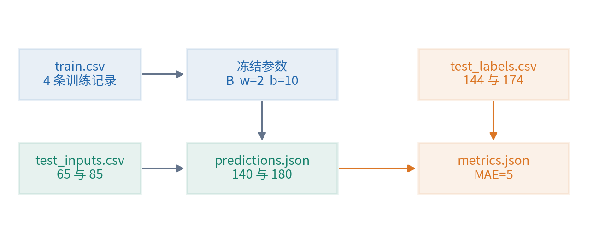
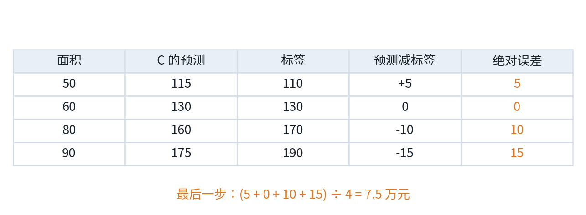
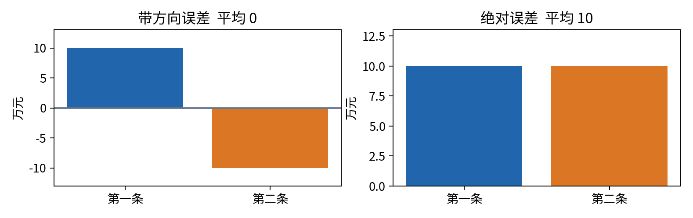
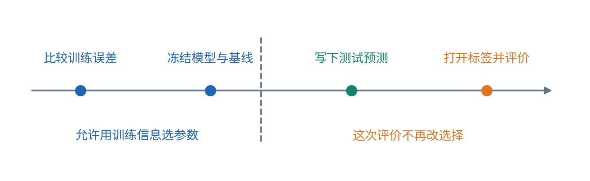
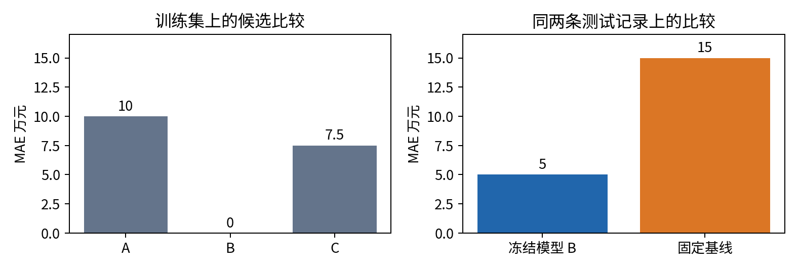
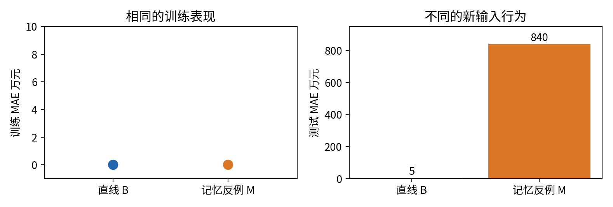

# 第一讲实验指南

从纸笔选择到可以重跑的预测记录

本实验只解决一个问题：怎样让电脑准确重复第一讲的训练、冻结和测试流程，并留下别人能够核对的证据？正文讲义已经解释为什么要这样做；这份指南把每一次操作对应到一份文件、一个数字和一个可以检查的判断。尚未学过 Python 也可以完成。第一次先做纸笔段，再逐个运行 Notebook 单元；第 3、4 讲会系统拆开这些代码。

全部数据都是为教学手工构造的房屋记录，不是现实市场数据。四行训练、两行测试，是为了让每个数都能验算，不代表现实样本量足够。测试答案在正文、指南后半部分和文件中公开，因此这是一项隔离流程练习；读过答案后，不能把自己的重跑称为真正盲测。

## 一 实验到底要留下什么

合上材料时，你应该留下三样东西。第一张纸写着候选模型的四次预测、训练误差和选中的参数；第二张纸在打开测试标签前写下两个预测与一个固定基线；最后一份短报告说明哪些结果只是算对了，哪些结果还缺少支持真实使用的证据。电脑输出帮助核对，不能代替你解释这三者的区别。

配套文件放在同一目录。lecture.pdf 是完整正文；lab.pdf 是本指南；experiment.ipynb 是按学习顺序分段的交互实验；experiment.py 是相同过程的命令行实现。data/train.csv 保存四行训练记录，data/test_inputs.csv 只有测试输入，data/test_labels.csv 单独保存测试答案。results 文件夹由程序生成，里面会出现冻结参数、测试预测和最后指标。



本讲程序只依赖 Python 自带功能，不调用网络、不下载数据、不付费调用模型。一个普通 CPU 即可执行，数据计算本身通常不到一秒；启动 Notebook 内核的时间不属于学习算法计算时间。若首次打开软件较慢，不应把它解释成训练很困难。

## 二 先在纸上明确任务与单位

写下完整任务：“在成交前，根据面积预测成交总价。面积单位为平方米，总价单位为万元。”这一句话同时规定何时预测、允许看到什么、要输出什么。不要把面积当成价格，不要把万元误读成元，也不要在中途换成每平方米价格。

训练数据如下。编号仅用于追踪记录，不进入预测公式。

| 编号 | 面积 平方米 | 成交总价 万元 |
|---|---:|---:|
| H1 | 50 | 110 |
| H2 | 60 | 130 |
| H3 | 80 | 170 |
| H4 | 90 | 190 |

三个候选形式已经事先固定。A 计算 $2x$，B 计算 $2x+10$，C 计算 $1.5x+40$。这里 $x$ 是面积占的位置；给出一个面积，代入就得到预测。候选名单不是利用测试答案临时设计的。这一步只是从三个设定中挑参数，不能称为搜索过所有可能的直线。

以 C 对 H1 的预测为例，先算 $1.5\times50=75$，再加 40 得 115。记录总价是 110，所以“预测减记录”为 5，绝对误差也是 5。以 C 对 H4 为例，$1.5\times90+40=175$，预测减记录为 -15，绝对误差为 15。负号表达方向，绝对值表达距离。

现在自己补全其余格子，暂时不要往后翻。每一行保留“代入”“预测”“带方向误差”“绝对误差”四栏；若直接把四个样本挤成一个心算结果，错了也很难知道错在哪里。



## 三 从四次误差得到一次选择

平均绝对误差的英文缩写是 MAE。你不需要先学求和符号，只需要“把四个距离相加，再除以 4”。本讲用同一个标准比较三个候选，因此它们的分数有可比性。如果 A 用万元误差，B 用元误差，两个数就不能直接比较大小。

A 的四个预测为 100、120、160、180，每次低估 10，MAE 为 10。B 的预测为 110、130、170、190，四次都对，MAE 为 0。C 的预测为 115、130、160、175，绝对误差为 5、0、10、15，MAE 为 7.5。先只凭这些训练结果选择 B。

你应该能够解释为什么不使用带方向误差的简单平均。例如，一个模型先高估 10，再低估 10，平均带方向误差为 0，但两次都偏了 10。这样的平均可以描述系统性偏高或偏低，不能单独描述典型错误大小。评价标准不同，是因为它们回答的问题不同。



请在纸上写：“只在 A、B、C 三个候选中，B 的训练 MAE 最低。我将它冻结为 $w=2,b=10$。”这里的“只在”不能删掉。训练零误差也不能删去评价新样本的步骤。讲义中的记忆模型可以在同样四行记录上零误差，却在新面积上返回荒谬数字。

接着固定一个比较对象：用训练价格平均数 $(110+130+170+190)/4=150$，对所有新房屋都预测 150。这叫常数基线。它没有利用面积变化，所以可能比较弱，但它容易实现、容易验算，而且只使用了训练信息。基线并不意味着永远选最弱的方法；后续任务会要求更强、更公平的比较。

## 四 冻结究竟冻结了什么

冻结的是这次最终评价要使用的规则及相关选择：候选名单、误差标准、选出的两个参数、基线的 150，以及要评价哪两条测试记录。它不是一种神奇的数据锁。即使把文件命名为 frozen-model.json，人仍然可以编辑文件；因此程序的记录和研究者的诚实说明都重要。

在本实验里，训练阶段生成 results/frozen-model.json，其中包含候选名称、参数、三个训练分数、基线数值和训练文件的 SHA-256 摘要。摘要是由文件内容计算的一串标识，暂时可以把它看成“文件版本指纹”。改变一个训练数字，摘要通常就改变。它帮助发现文件是否变过，并不能证明文件的来源可信，更不能防止恶意篡改者同时改文件与摘要。



现在只看两个测试输入：T1 面积 65，T2 面积 85。用冻结模型分别算出 140 和 180；用固定基线分别算出 150 和 150。先把四个数字写下，再打开答案。若你已经看过正文第七节的标签，请标注“公开答案后的流程复现”，而不是假装忘掉它们。

## 五 在 Anaconda 中打开实验

如果已经安装 Anaconda，先打开 Anaconda Navigator。选择已经具备 Python 与 Jupyter 的环境，然后启动 JupyterLab 或 Notebook。在文件浏览器中进入本讲目录，打开 experiment.ipynb。不要只把 Notebook 单独移动到另一个目录，因为它需要同目录的 experiment.py 与 data 文件夹。

若你习惯终端，在 Anaconda Prompt（Windows）或终端（macOS、Linux）中进入本讲目录，再执行下面命令。路径中有空格时，需要把完整路径放在引号中。这里的“本讲目录”是你实际下载或解压的位置，不是下面示意文字。

```text
cd "你保存课程的路径/units/001"
python --version
jupyter lab
```

终端命令应该输入到终端，不要把 cd 或 jupyter lab 当成普通 Python 代码粘到 Notebook 单元中。Notebook 中的代码由 Python 内核执行；终端还负责切换目录、启动程序和选择环境。这两个输入位置不同，是初学者最容易混淆的操作之一。

本讲脚本需要 Python 3.10 或更新版本；实际验收版本记录在 verification.json。没有 Jupyter 也可以走下面的命令行路线。不要为了本讲急着安装 GPU 驱动、深度学习框架或大型数据包，它们都不是本实验依赖。

打开 Notebook 后，先阅读第一个文字单元。选择第一个代码单元，按 Shift+Enter 执行并移动到下一格。方括号中的执行序号说明执行的先后；星号表示当前仍在运行。第一次从上往下执行，不要随机跳格。文字单元只解释思路，代码单元才运行计算。Jupyter 的内核保存已经执行的变量，关闭网页不总等于清空内核。[1]

准备验收时，使用菜单中的 Restart Kernel and Run All Cells，或同义的“重启内核并运行全部”。不同版本菜单位置可能略有变化，关键是先重启，再从头顺序执行。这样能发现某个结果是否依赖你之前在别处运行、却没有保存在文件里的代码。只重跑最后一格不能检查这个问题。

## 六 分阶段运行 而不是一次看见全部答案

第一次推荐按 train、predict、evaluate 三阶段运行。进入本讲目录后，先运行训练命令：

```text
python experiment.py --phase train
```

终端应显示候选 B、w 为 2.0、b 为 10.0，训练 MAE 为 A 10.0、B 0.0、C 7.5，基线为 150.0。末尾的 .0 只是浮点显示，不改变这里的数值意义。打开 results/frozen-model.json，把程序输出与纸笔表一项一项对照。先确认模型选择正确，再进入下一阶段。

第二步生成预测：

```text
python experiment.py --phase predict
```

程序读取刚才保存的参数，只读 test_inputs.csv，不读 test_labels.csv。输出 T1 140.0、T2 180.0；常数基线都是 150.0。这些值同时写入 results/predictions.json。你可以记录文件生成时间，但时间戳本身不能证明没人偷看答案；它只是流程记录的一部分。

第三步在纸上签下自己的选择与预测，然后评价：

```text
python experiment.py --phase evaluate
```

此时程序才打开标签文件。T1 标签 144，T2 标签 174。模型绝对误差分别为 4 和 6，MAE 为 5；基线绝对误差分别为 6 和 24，MAE 为 15。程序把这些指标写入 results/metrics.json，不改动冻结参数。

如果略过训练直接评价，程序应明确要求先训练；若有模型但没有预测记录，程序应要求先生成预测。这些报错是在保护实验步骤，不代表软件坏了。不要通过删除检查语句来“修好”它，而应补齐缺失的步骤。

所有标签已经公开、你只想检查整条流程能否复跑时，可以执行：

```text
python experiment.py --phase all
python experiment.py --self-test
```

第一条依次执行三阶段；第二条检查九类约定的计算或输入边界。成功时会出现 SELF_TEST_PASS。程序未报错只说明这些检查通过，不说明测试覆盖了所有可能的错误，也不证明统计结论成立。

## 七 读懂输出中的五个数字

训练 MAE 0、测试 MAE 5、基线测试 MAE 15，都是万元。它们分别回答三个不同的问题：模型对用于选参数的四行记录贴合多少；冻结模型对指定两行新记录偏多少；一个预先约定的简单方法对相同两行记录偏多少。不能因为 0 最小就只报告训练成绩。



140 和 180 是预测值，144 和 174 是标签。预测值是模型计算出来的，标签是教学数据文件提供的；两者的来源必须能区分。MAE 的 5 也不是一个新的模型参数。评价阶段算出 5，并没有自动让参数变成更好的数。

还要读懂结果没有说什么。它没有给出不确定性区间，没有证明两条记录代表目标总体，没有检查地区、楼龄或市场变化，没有说明大误差是否可以接受。后续课程会分别处理这些问题。现在最有价值的结论是：我们已经把训练选择、冻结、预测和评价的证据链算对并留下了记录。

## 八 故意制造错误 看程序能不能发现

研究练习不能只跑顺利路径。先复制整个本讲文件夹，命名为你自己的实验副本；下列修改都在副本中做，保留原始数据便于比较。每次只改变一件事，写下你预期会出现的结果，再运行。

第一个故障是改变训练数据但沿用旧参数。先按原样运行 train，把 train.csv 中 H1 的价格从 110 改为 111，再运行 predict。程序应发现训练摘要不一致并停止。这时正确做法是保留旧结果，在新的输出目录运行新实验，例如 python experiment.py --phase all --output results_changed_train。训练数据改变后，原来的运行记录不再描述当前输入。

第二个故障是直接改预测。恢复原数据，在正常 predict 之后，把 predictions.json 中 T1 的预测改成 144，再运行 evaluate。程序应发现预测与冻结模型不一致。这样改完当然能降低一条误差，但那不是模型按固定规则做出的预测。

第三个故障是删除或复制标签。保持输入为 T1、T2，却把标签中的 T2 改成 T3，程序应拒绝不同的 id 集合。如果错误地只按行号把不同房屋的预测与价格凑在一起，仍然能得到某个平均数，却是在计算没有意义的对应关系。编号不进入模型，仍然是数据核验的重要工具。

第四个故障是空数据或不等长列表。自检把这些情况作为边界测试，要求 MAE 明确报错。若把两条预测与三条标签硬凑在一起，程序不应默默丢掉多出来的一条。Python 中某些迭代方式默认只走较短列表，后续学到 zip 时要特别核对长度。[4]

## 九 一个不需要复杂模型的反证

把模型 M 定义为：如果面积是训练里出现的 50、60、80、90，就返回对应训练价格；其他面积全部返回 999。M 的训练 MAE 也是 0，但对 65、85 的预测都为 999，两个绝对误差为 855 和 825，测试 MAE 为 840。



这里并不是推荐用这种恶意构造的规则做房价模型，而是用反例否定一句过强的话：“只要训练误差为零，新数据一定也准确。”要否定“所有情况都如此”，只需要构造一个满足前提但不满足结论的情况。M 就是这种情况。后面学到模型复杂度和泛化理论时，会把这种思考写得更形式化。

你还可以构造另一个任务：让标签完全由一个固定单位换算公式决定。此时人工规则可能已经足够，未必需要从例子训练参数。不要为了使用机器学习而把一个规则清楚的问题复杂化。选择方法之前，先确认未知部分究竟在哪里。

## 十 实验报告怎样写才没有多说

合格的短报告可以这样组织。第一段说明任务、输入、输出与全部数据为合成。第二段说候选名单固定，使用训练 MAE 选中 B，参数 2 与 10，常数基线 150。第三段列出两条测试预测、标签、各自绝对误差和两种方法的 MAE。最后一段说明样本很小、标签公开、数据不代表现实，以及没有据此做估价部署。

一个可接受的结论是：“在本教程指定的两条合成测试记录上，冻结的 B 模型 MAE 为 5 万元，预先固定的常数基线为 15 万元。此次实验核验了计算与流程，不能推出真实房价预测能力。”这是对证据范围的精确描述，不是谦虚措辞。

不合格的结论包括“模型准确率达到某个百分比”“比所有传统方法更好”“已经学会房价规律”。我们没有定义回归准确率，更没有比较所有方法，也没有取得现实代表性数据。写研究报告的第一步是让每一句话都能指回真实做过的计算或观察。

源文件、数据文件和结果文件一起保留。若只保存一张柱状图，别人不知道候选怎么来的、标签怎么读的、参数是否改过，就很难复核。训练与测试隔离也不只作用于模型参数；任何从数据估计设置的处理步骤，都需要遵守相应的数据使用边界。[3]

## 十一 练习与详细解答

### 练习一 手算一个新规则

某规则为 $1.8x+20$。面积 75，记录总价 161。写出预测、带方向误差、绝对误差和两种单位的换算。解答：$1.8\times75+20=155$ 万元，预测减标签为 -6 万元，绝对误差为 6 万元，即 60000 元。如果表中一个数字写 6，另一个写 60000，不能忽略单位直接说后者差得更多。

### 练习二 换成均方误差会怎样

只为比较标准做练习，把每个误差先平方再平均。A 得 $(100+100+100+100)/4=100$；B 得 0；C 得 $(25+0+100+225)/4=87.5$。这三个分数的单位是万元平方，不能与 MAE 的万元直接比较。B 仍在这三个候选中胜出，不表示 MAE 与均方误差永远选择相同模型，也不表示两者对极端误差的偏好相同。

### 练习三 看过测试后改基线

有人看到 144 与 174 后，把常数基线从 150 改为 159，得到 $(15+15)/2=15$。虽然这次 MAE 巧合没有变，流程是否仍有问题？解答：有。基线用了测试标签决定一个设置，因此不能再称其数值完全由训练确定。泄漏是信息进入开发的过程问题，不能仅凭最终分数是否变好判断。

### 练习四 预测是不是训练

连续输入 70、75、65，分别得到 150、160、140，能否说模型训练了三次？解答：不能。在固定 $w=2,b=10$ 的模型中，只是输入改变，输出随公式变化，参数没有更新。若程序明确运行拟合或更新算法并改变参数，才应讨论新的训练；单靠输出不同看不出参数是否变化。

### 练习五 同样平均误差的不同后果

两种方法的四次绝对误差分别为 0、0、0、20 与 5、5、5、5。MAE 都是多少？能否说两者风险相同？解答：都为 5。但第一种方法有一次很大的错误，第二种每次都中等偏差。哪一种更可接受要看错误后果；只知道平均数不能判断极端风险和不同样本的差异。

### 练习六 程序输出正确能证明什么

自检通过、Notebook 也重跑成功，是否证明测试数据能够代表真实房屋？解答：不能。计算测试检查的是程序是否符合我们写下的若干要求；代表性需要另行检查目标总体、采样过程、时间、地区和数据质量。软件正确与统计证据可靠有关，但不是同一个问题。

### 练习七 找出遗漏的实验记录

朋友只发来“测试 MAE 等于 5”和一个模型文件。为了复核，你至少还需要什么？解答：任务与单位、数据及来源、训练和测试划分、候选及选择标准、训练配置、基线、逐条预测与标签、运行环境和可运行步骤。若相关数据不能合法公开，也要给出受控访问或可复现的合成机制说明，不能直接泄露私人数据。

### 练习八 检查模型 M 的反证

独立算出 M 在两个测试样本上的 MAE，并说明它否定了哪句话。解答：$|999-144|=855$，$|999-174|=825$，平均 840。它否定“训练零误差必然推出新样本低误差”。它没有证明所有复杂模型都差，也没有证明 B 在所有数据上都好；反例只针对具体逻辑命题。

## 十二 验收与下一步

不看答案重算 A、B、C 的训练 MAE；说明冻结文件里为什么没有测试标签；在新内核中完整运行 Notebook；故意制造一个数据或记录错误并解释报错；最后用两句话写出结果与边界。五项都能独立完成，本讲实验就达到了目标。若只有程序能跑而自己说不清样本和标签，先回正文重做一行手算。

下一讲不急着换更强算法。它追问一行数据究竟代表一套房屋、一次挂牌还是一次交易；预测时点、取样和标签生成怎样决定我们实际解决的问题。这个问题答错时，后面更精确的计算可能只是在精确解决另一个任务。

## 参考资料

[1] Jupyter 官方文档 The Jupyter Notebook，用于核对内核、代码单元和执行顺序。https://jupyter-notebook.readthedocs.io/en/stable/notebook.html

[2] Python 官方教程 An Informal Introduction to Python，用于核对算术表达式与解释器执行的基本语义。https://docs.python.org/3/tutorial/introduction.html

[3] scikit-learn 官方文档 Common pitfalls and recommended practices，用于核对训练与测试隔离、数据泄漏与处理流程边界。https://scikit-learn.org/stable/common_pitfalls.html

[4] Python 官方文档 Built-in Functions 中的 zip 条目，用于核对默认迭代在最短输入耗尽时停止的行为。https://docs.python.org/3/library/functions.html#zip

上述网页于 2026 年 10 月 4 日检查。本指南的数据、手算例子、图示和实验代码为本课程独立编写；来源用于核对概念与工具行为。
