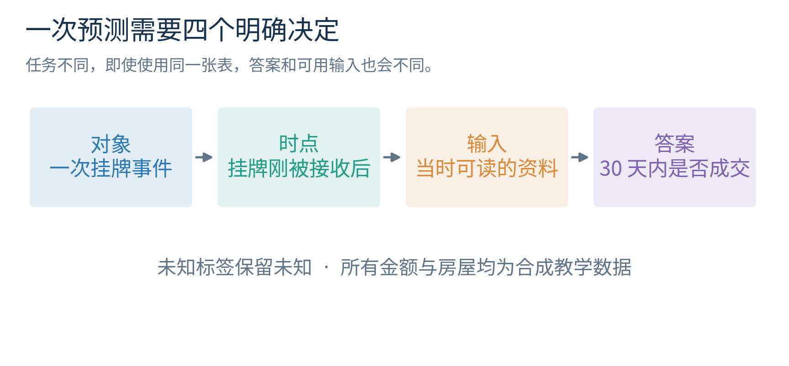
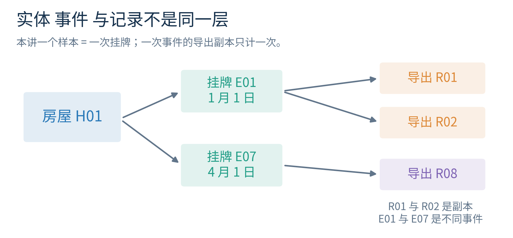
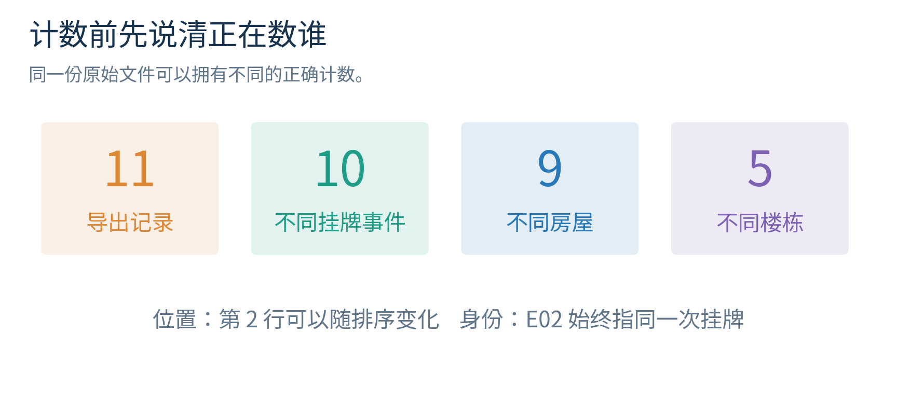
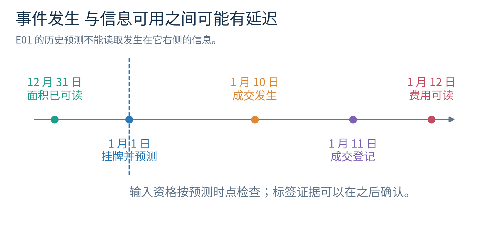
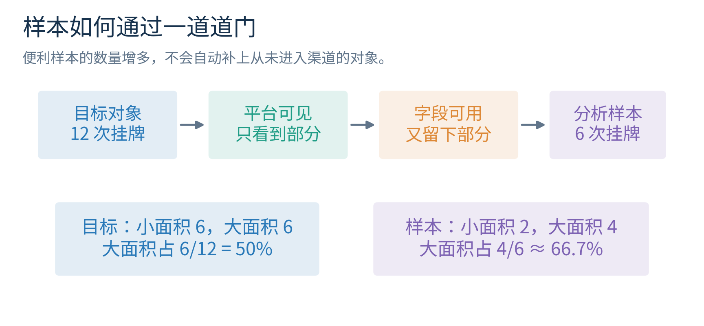
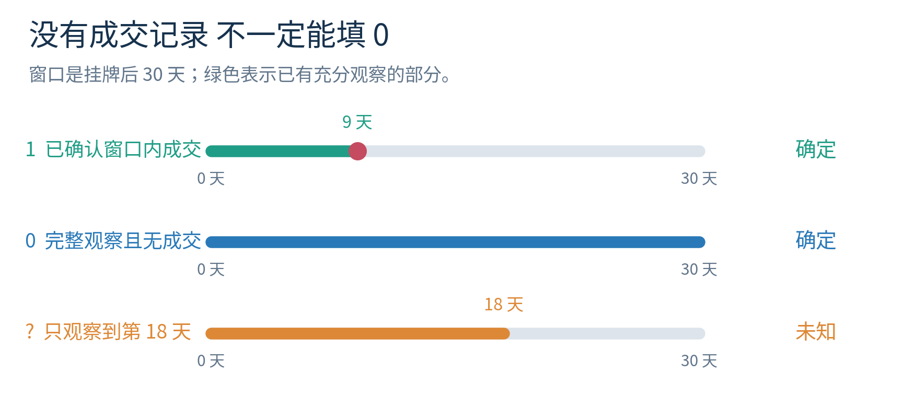
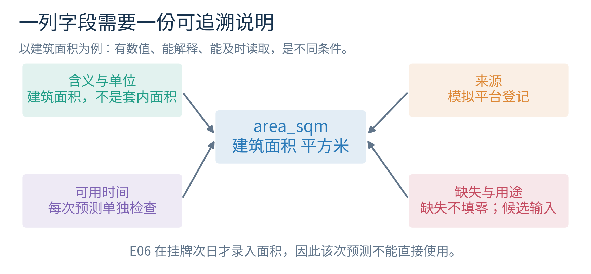
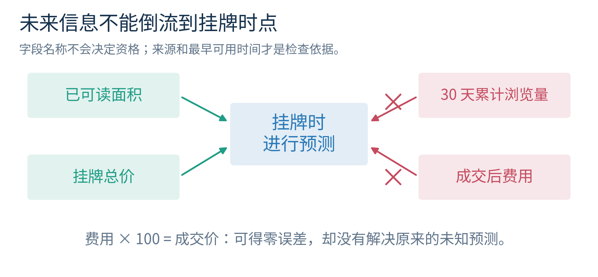
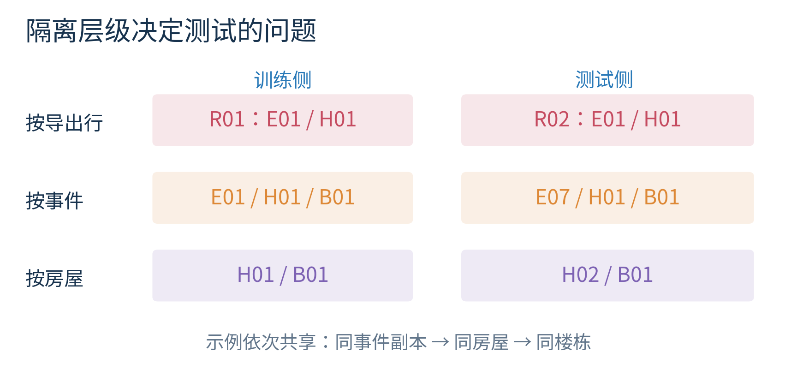
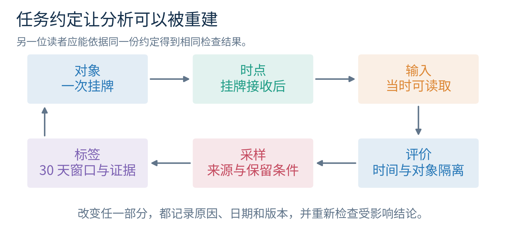

# 任务定义与数据生成

## 第二讲 从一行记录追问它怎样来到我们面前

第一讲把几套已经成交的房屋排成数据，再用面积预测价格。这个起点很适合认识模型：输入面积，得到预测，揭开答案，计算误差。但在真实研究里，数据通常不会以这样整齐的样子等着我们。你可能拿到十一行导出记录，其中有一行被复制过，同一套房屋出现两次，有些房源还没等够三十天，还有一列成交后才产生的费用。如果马上把这些数字交给算法，程序仍然会算出结果；问题是，它究竟回答了什么？

本讲要解决的核心问题是：一行数据代表谁，预测发生在何时，答案是怎样得到的？我们会把“预测房屋情况”改写成一份可以逐条检查的任务说明，然后亲手重建一小批标签，检查重复、时间和来源。学完后，你应当能对一个陌生数据集提出具体问题，而不只问它有多少行、多少列。

你只需要第一讲的特征、标签、训练和测试概念，以及加减乘除。集合、索引、比例和时间窗口都会从头解释。电脑实验可以先按说明整本运行，不要求你能编写 Python。第三讲才会逐步学习程序语法；本讲的重点是让电脑执行一份已经用纸笔说清的检查方案。

所有房屋、机构、价格、日期和记录均为本课程人为构造。金额单位“万元”只是方便手算。它们不来自真实市场，不适用于估价、交易或投资建议。我们刻意保留了错误和未完成记录，让你练习识别问题；不要把它们当成真实业务数据的质量分布。

## 一 先把一个含糊问题写成任务

“能不能预测房子好不好卖？”听起来已经很具体，实际至少留下了四个问题。好卖是七天内售出，三十天内售出，还是价格高于某个数？预测是在第一次挂牌时做，还是挂了两周后做？一次预测面向一套房屋、一次挂牌，还是一个小区？未成交的房源算失败，还是没有答案？这些选择没有统一的标准答案，却都必须先作决定。

我们为本讲作出一个有限、清楚的决定：在每次挂牌刚被系统接收后，使用此刻已经能够读取的信息，预测这次挂牌是否会在随后三十个自然日内成交。成交日与挂牌日相差不超过三十天，且成交不早于挂牌，就记为 1；能够完整确认三十天而没有符合条件的成交，就记为 0；还不能确定的记录暂不填标签。

这里的 1 和 0 是两种类别的名字。1 表示“在规定窗口内成交”，0 表示“已充分观察但未在规定窗口内成交”。它们不表示房屋好坏，更不表示一个人的价值。不给标签也不是第三种预测类别，而是说我们此时缺少足够的评价证据。

为什么不直接沿用第一讲的价格预测？可以沿用，但要补上“谁有价格答案”。没有成交的挂牌不会产生实际成交总价。如果你只保留已成交记录，得到的是特定成交样本中的价格问题；你不能把这组样本的表现直接说成对所有挂牌都可靠。本讲改用三十天成交与否，是为了让观察窗口、未成交和等待时间同时出现在一条可计算的故事里。后面会再回来看价格问题，并区分两种任务的适用对象。

请读图中箭头的方向：我们从“希望帮什么忙”走向“具体预测什么”，再到“允许使用什么”和“怎样得到答案”。方向不能倒过来。先看到某一列特别方便，再临时把任务改成最容易使用这列的任务，可能得到很高的分数，却离最初需求越来越远。

一份最简任务说明还要写明使用边界。本例只讨论合成挂牌记录，不批准任何真实部署；每次挂牌只在起点预测一次；三十天是预先确定的评价窗口；没有观察充分的记录不强行当作 0。先写下这些约定，后续改动才有地方对照。研究不是永远不能改变任务，而是要说明何时改变、为什么改变，以及改变前后的结果为什么不能混为一谈。

## 二 一行究竟是房屋 挂牌 还是导出记录

现在有一套编号 H01 的房屋。它在一月一日有一次挂牌 E01；四月一日又有一次挂牌 E07。房屋仍是同一套，挂牌却是两次。即使面积没有改变，两次的挂牌价格、市场环境和后续事件也可能不同。若本讲每次挂牌都做一次预测，E01 和 E07 应当是两条样本，而不是因为房屋编号相同就删掉一条。

再假设导出系统把 E01 写了两遍，导出行号分别为 R01 和 R02。它们指向同一次挂牌，其他内容也完全相同。这两行是重复记录。本讲保留 R01，并在审计记录里注明 R02 与它重复。这里的“保留”不是把证据彻底删除，而是在用于计数的版本中只算一次，同时保留原始文件以便核查。

这就出现了三个层次。实体是持续存在的对象，本例为房屋 H01；事件是对象在某个时间发生的一次活动，本例为挂牌 E01；记录是事件被系统写下来的某一行，本例为 R01。实体、事件、记录可以恰好一一对应，也可以一对多。关系没有弄清时，“数据有十一行”只是在描述文件，并不能说明我们拥有十一个不同的学习例子。

图2中 H01 通向 E01 和 E07，表示一套房屋有两次挂牌；E01 又通向 R01 与 R02，表示一次事件留下两条重复导出记录。不要只盯着编号长得是否相似。假如两个导出行只有采集时间不同，仍可能是同一事件的两份快照；假如两套房屋面积和价格完全相同，也不因此变成同一套。判断重复要依据业务身份和事件定义，不能只依据数值相等。

本讲把样本单位确定为“一次挂牌事件”。唯一标识是 event_id，即事件编号；house_id 标识房屋；building_id 标识楼栋。后两种编号用于检查相关记录和划分评价范围，通常不作为本讲的预测输入。编号不天然无用，也不天然适合作特征：在某些任务中身份确实携带信息，但这会改变新对象和旧对象的适用边界，必须另行论证。

这一节可以立刻迁移到别的领域。一位读者可以借很多本书，一次借阅又可能被扫描两次；一台机器可以产生很多次报警，一次报警又可能被转发几份；一位参与者可以在不同日期填写问卷。你必须说清自己的样本是人、借阅、报警、问卷，还是其中的某个时间片。“一行代表什么”不是整理表格的小问题，它决定我们最后在数什么。

## 三 给对象起短名字 集合与索引

数学记号的作用是让长句子变短。本讲不要求你背一套陌生语言。先写三个事件编号：E01、E02、E03。把它们放进花括号，得到

$$S=\{E01,E02,E03\}.$$

这表示一个集合，也就是把这些不同对象放在同一组里。字母 $S$ 只是这组对象的名字。集合关注哪些对象在里面，不关注写的先后顺序；在同一个集合里把 E01 写两遍，也不会让它变成两个不同事件。集合里不同对象的个数记为 $|S|$，这里 $|S|=3$。两条竖线放在集合两侧表示“数个数”；第一讲放在数值两侧表示绝对值。符号的含义要结合内部对象来读。

文件则通常保留行的顺序，也能真的存在两行相同内容。因此，“文件行数”和“事件集合大小”可以不同。我们的原始文件有十一行，事件编号集合只有十个元素。这并不矛盾：十一是记录条数，十是不同挂牌事件数。

为了指认某一条样本，我们给去重后的事件按固定顺序编号为第 1 条、第 2 条，直到第 10 条。字母 $i$ 叫索引，在这里可以依次取 1、2、……、10。下标 $i$ 的作用只是指出“正在说第几条”。例如 $x_i$ 可以表示第 $i$ 次挂牌的面积，$y_i$ 可以表示它的三十天成交标签。

如果第 2 条是 E02，面积 60 平方米，且已确认三十天内成交，那么 $x_2=60$、$y_2=1$。读作“第二条的面积是六十，第二条的标签是一”。下标不是乘法，$x_2$ 不等于 $x$ 乘 2。把文件排序后第 2 条可能换成别的事件，所以研究记录应保留稳定的事件编号，不能只说“第二行有问题”。

把所有有足够证据的例子按各自索引保留下来，可以写成一个索引族：

$$D=((x_i,y_i))_{i\in I}.$$

符号 $\in$ 读作“属于”；$I$ 是我们准备用来研究的样本索引集合。括号 $(x_i,y_i)$ 表示把同一次挂牌的输入与答案配成一对，下方的索引说明每个样本各保留一份。这是按索引组织的样本族，不是只按数值去重的普通集合。E01 与 E07 即使都对应面积 50、标签 1，仍是两次不同挂牌，应保留两个索引位置。这个式子没有执行计算，只是把数据的配对与身份说清。如果输入不止面积，还包含挂牌价，可以暂时用一个小列表描述输入；不必因此提前学习矩阵。

集合还能表达重叠。若训练部分的房屋编号为 $A=\{H01,H02\}$，测试部分为 $B=\{H01,H03\}$，两边共同拥有的对象构成“交集”，记为 $A\cap B=\{H01\}$。交集为空写为 $A\cap B=\varnothing$，意思是没有共同元素。你现在已经能读懂“新房屋测试要求两边房屋编号交集为空”这句检查条件了。

本讲的十个事件来自九套不同房屋，因为 H01 出现了两次。九套房屋又分布在五栋楼里。请不要把十个事件、九套房屋、五栋楼的数量混在同一个结论中。未来计算不确定性时，同一对象重复出现会变得更加重要；本讲先把层次和数目记清。

## 四 数字离不开单位与口径

第一讲的 150 是成交总价，单位万元。若别人把同一价格写成 1500000，单位元，两条记录表达的是同一数量。但若把它们直接放在同一列，不记录单位，电脑只会看到相差一万倍的数。模型不会自动识别“这个人的单位忘写了”。

把 150 万元换成元，要用 $150\times10000=1500000$ 元。反过来，1500000 元除以 10000 才得到 150 万元。除法分母里的 10000 来自单位关系，不是靠数据拟合出来的参数。单位统一属于数据含义的一部分，应该在任何训练前明确记录并检查。

口径比单位更隐蔽。面积的单位都可以是平方米，但有人记录建筑面积，有人记录套内面积，有人记录网页上的近似值。两个数都写“70 平方米”，未必测量同一件事。成交总价也可能指合同总价、支付总额，或者包含额外项目的金额。单位相同只能消除一种歧义，不能消除所有歧义。

我们在合成数据里约定 area_sqm 是记录的建筑面积，其在挂牌时是否已可读需逐条核对，单位平方米；list_price_wan 是本次挂牌时公开的总挂牌价，单位万元；sale_price_wan 是后来记录的成交总价，也用万元。挂牌价与成交价名称不同，因为它们来源、时点和含义不同。相同单位不表示可以互相替换。

一个简单的单位检查很有力量。若用总价除以面积，结果单位是万元每平方米。H01 的成交价 110 万元除以 50 平方米，得到 $110/50=2.2$ 万元每平方米。这个 2.2 不能直接与 110 万元相加，因为它们不是同种数量。你以后遇到复杂公式，也可以先问每个量是什么单位、加法两边是否同类。

日期也有口径。本讲只用日期，不区分小时；“挂牌刚被系统接收后”意味着同日已接收字段可作为输入；窗口长度按日期之差计算。3 月 10 日到 4 月 9 日恰好相差 30 天，算窗口内；到 4 月 10 日相差 31 天，就不算。真实系统若用秒或跨时区，必须进一步约定时区和端点。本讲没有偷偷假定更精细的时间精度。

## 五 两只时钟 一次事件与一次知道

假设一套房屋在 4 月 10 日成交，登记人员到 4 月 22 日才把信息录入系统。“成交日”回答事情何时发生，“入库日”回答我们何时能知道它。4 月 15 日运行的程序不应使用 4 月 22 日才到达的信息，即使那条记录写着成交发生在 4 月 10 日。

这是本讲最重要的时间区分。事件时间是现实或业务事件发生的时间；可用时间是信息在指定系统里能够被读取的时间。两者有时相同，但不能默认相同。数据库今天查得到一项信息，只能证明今天能读，不能证明几个月前做预测时也能读。

再加入第三个时点：预测时点。对事件 E01，预测时点是挂牌记录被接收的 1 月 1 日。面积若在 12 月 31 日就已记录，可以作为输入；成交发生在 1 月 10 日，成交后费用在 1 月 12 日才能读，则两者都不能帮助 1 月 1 日的预测。最终训练是在四月完成，也不能让一月那次历史预测获得四月的眼睛。

在图4里，绿色标记表示预测时已经能读到的资料，橙色标记表示结果发生的时点，紫色标记表示结果到达数据库。我们可以等到紫色位置之后再为旧事件制作标签，但只能从绿色区域提取那次预测的特征。标签允许来自预测之后；输入不允许借用预测之后才知道的东西。这两句话并不矛盾，因为两者扮演不同角色。

用简单记号写，设第 $i$ 次预测发生在 $t_i$，某个输入字段最早可用的时点是 $a_i$。字段满足 $a_i\le t_i$ 才通过本讲的时间检查。$\le$ 读作“小于或等于”，在日期上就是“不晚于”。通过这一条还不表示字段一定适合使用；它还需要定义可靠、权限合规、部署时能稳定获得。

我们的数据中 E06 的面积在 1 月 7 日才录入，但挂牌预测在 1 月 6 日。面积听起来是房屋早已拥有的性质，仍然没通过“系统当时能否读取”的检查。本讲不把它自动补成零，也不默默删掉整行，只报告该次预测缺少可用面积。真实项目要提前规定缺失时的行为，例如暂不输出、使用能处理缺失的输入方案，或改进采集流程。这些选择要在后续验证中接受检验。

## 六 总体是想服务的对象 样本是实际拿到的对象

总体可以先理解为我们希望结论适用的全部对象。它不一定等于世界上所有房屋。本讲若说“希望服务未来某城区通过指定平台发布的挂牌”，那么总体由地区、平台、时间和挂牌定义共同限定。改成“全国所有住宅”已经扩大了目标，即使计算程序完全没变。

样本是我们实际观察到的一部分对象。例如手边只有某平台十次挂牌，或某城区十个已售案例。样本之所以来到我们面前，可能经过了好几道门：房屋先要在这个平台发布，发布后要被采集程序看到，关键字段要被填写，后续状态要成功回传，最后还要满足整理者的保留条件。

把这些门画出来，比单看最终文件更容易发现局限。有些地方的房主更少使用该平台；某些大房屋更容易填写完整资料；快速成交的记录更容易获得价格。这些因素都会改变最后留下来的样本组成。于是，缺失的可能不仅是某几个空格，还有整类我们根本没看到的对象。

考虑一个可以手算的虚构总体：共有十二次挂牌，六次小面积、六次大面积。总体中大面积挂牌占 $6/12=1/2=50\%$。我们顺手拿到的六条记录却包含两次小面积、四次大面积，大面积比例为 $4/6\approx66.7\%$。分子是感兴趣的那类数目，分母是正在描述的全部数目；百分号表示“每一百个里大约有多少个”。

这个样本是总体的一部分，但它的组成不等于总体的组成。若大面积挂牌刚好更容易成交，用这六条记录得到的成交比例也可能高于目标总体。这里不用概率定理也能看懂风险：抽样过程偏向了某类对象，而我们关心的结果可能与该类别有关。

是否只要扩大到六万条就好了？如果六万条仍然来自相同的偏向渠道，遗漏对象的问题仍然存在。更多数据可以让我们更清楚地描述这个渠道，却不能凭空补出从未进入渠道的人或事件。本讲不主张大数据没有价值，而是要求把“数据多”与“覆盖目标”分开检查。

也不要从一个小例子反过来断言所有便利样本都无用。便利样本指因为容易获取而选到的样本，它可以用于探索、调试和提出假设。关键是结论要跟证据范围匹配：可以说“在这批记录上观察到某现象”，不能未经检查就说“所有未来对象都如此”。能清楚说明不知道什么，是研究结果的一部分。

## 七 数据生成过程不是只有造数字

“数据生成过程”听起来像让电脑随机造一堆数字。合成实验确实可以这样做，但本讲使用更宽的意思：从对象在世界中出现，到事件发生、被观察、被记录、被筛选，最终形成研究文件的整条过程。即使你没有写一行生成代码，真实数据也经过了某种生成过程。

对本例，可以用一句长句把过程串起来：某套房屋在某日挂牌，平台记录当时面积与要价；此后可能成交，也可能没有成交；成交结果经过登记延迟才进入系统；整理者在固定日期截取可用信息；导出程序可能重复写行；研究者再依据任务规则得到特征和标签。每个环节都有可能改变我们看到的内容。

这个过程至少包含三种不确定。第一，未来事件本身未知，我们要预测它；第二，事件发生后可能迟到、漏记或误记，我们未必立刻知道它；第三，整理者的规则可能不一致，例如某次把第 30 天算入窗口，另一次却排除。第三种问题通常不需要更强的模型，而需要一份一致的数据规则。

我们在合成实验里知道所有人为设置，可以故意只改一个环节，再观察结果如何变化。例如只复制一条正例，成交比例会变化，但世界并没有多发生一次成交；只把数据截取日提前，某些标签会从已知变成未知，但房屋未来命运没有改变。这种“保持其他内容不变，只改变一个步骤”的思考，会在后续实验设计中反复出现。

原始记录也不等于真相。所谓原始，只表示它相对于某条处理流程更靠前；它仍可能是传感器输出、人工录入或另一个系统汇总后的结果。给文件贴上 raw 的名字不能免除核查。你应当问每个字段是谁记录、根据什么证据记录、多久更新、失败时留下什么痕迹。

Datasheets for Datasets 的作者提出，为数据说明动机、构成、收集过程及适用范围，有助于使用者理解数据。我们借鉴的是这种文档意识；本讲的房屋故事、手算和检查步骤都是原创教学设计，并非该论文中的案例。[资料1](https://arxiv.org/abs/1803.09010)

## 八 标签是按规则制造的可核对答案

回到主任务。令挂牌日期为 $t_i$，窗口结束日期为 $h_i=t_i+30$ 天。这里加 30 天是日期计算，不是把日期字符串和数字拼起来。我们规定成交发生在从挂牌日到窗口结束日之间，含两个端点，才满足三十天内成交。特别注明端点，是为了避免两位整理者把第 30 天作出不同判断。

如果已收到可靠成交记录，而且成交日期落在窗口里，可以填写 $y_i=1$。如果没有窗口内成交，则必须有“已经完整观察到窗口结束”的证据，才能填写 $y_i=0$。如果只观察了十八天仍无成交，应留为未知，而不是 0。未知说明答案尚未成熟，不说明三十天内不会发生。

图6第一行在第 9 天发生并确认成交，答案已经足以确定为 1。即使还没走到第 30 天，也不必等到最后一天才知道“窗口内至少成交一次”成立。第二行一直有完整记录到第 30 天，且没有符合条件的成交，答案才是 0。第三行只看到了第 18 天，后面的十二天尚未知道，不能当作失败。

这依赖一个明确的任务约定：标签是“窗口内发生过符合定义的成交”，已经确认的成交不会因后来某种状态而被撤销。本讲的合成数据没有撤销。如果真实业务会撤销合同、回滚支付或更正登记，就必须进一步定义什么叫最终成交、何时标签稳定，并给更正留出追踪方式。不能把简化例子的便利偷偷带到真实研究里。

我们把制作标签所能使用资料的截止日期设为 2025 年 4 月 20 日。它不是每条记录的预测时点，而是研究者这次重建历史资料时站的位置。原始教学文件特意包含后来才登记的字段以及它们的可用日期，供你发现越界；因此它是用于审计的回顾性材料包，不是声称在 4 月 20 日就完整可见的数据库快照。

先手算 E01。1 月 1 日挂牌，1 月 10 日成交，相差 9 天；成交在 1 月 11 日已经登记，早于资料截止日。9 小于等于 30，所以标签是 1。E04 在 1 月 4 日挂牌，2 月 10 日成交，相差 37 天，超出窗口；它已有完整观察到 2 月 3 日的证据，所以三十天标签是 0。说 E04 的标签为 0，不等于说它从未成交。

E08 在 4 月 2 日挂牌，截止 4 月 20 日只观察 18 天，没有已确认成交。第 30 天是 5 月 2 日，它的标签未知。E09 在 4 月 3 日挂牌，实际 4 月 10 日已成交，但直到 4 月 22 日才登记；对 4 月 20 日这次重建而言，不能使用那条尚未到达的信息，所以它也未知。它的“已完整核实到”日期只有 4 月 9 日，避免把延迟登记期间误当成没有事件。本合成例假定完整核实证据在所注明的核实日即可读；真实核实报告若也有延迟，必须另外记录报告可用时间。

最后看 E10。3 月 10 日挂牌，4 月 9 日成交，恰好相差 30 天，4 月 10 日已登记，标签是 1。若有同学把它判成 0，先检查双方是否采用相同端点约定。很多数据争议看似数学错误，实际是任务定义没有共享。

## 九 空白 零 与未观察到是三回事

在 CSV 文件中，两个逗号之间没有内容表示空字段。你在表格软件里看到一个空格子时，不能只凭空白决定含义。它可能表示尚未成交、记录丢失、不适用、等待核实，也可能只是导出失败。需要数据字典告诉你允许的解释。

本例的 sale_price_wan 为空，表示这个回顾性材料包没有提供成交价格；它不等于成交价是零万元。views_30d 是三十天内的浏览次数，真实记录为 0 则表示窗口内被记录到的浏览次数确为零；但这个统计仍然只能在窗口结束后取得。一个字段的数值可以完全正确，却仍然不适合作为挂牌起点的输入。

标签未知也不同于特征缺失。E06 有充分证据得到标签 0，但挂牌当日无法读取面积；这是输入可用性问题。E08 的面积能读到，标签却尚未成熟；这是答案可用性问题。把两者都简写成“数据不完整”，会掩盖完全不同的处理方式。

这里有一个实用的四格判断。先问输入在预测时是否可得，再问答案在研究截止时是否充分。两者都满足，才能进入当前约定下的完整评价；输入不满足要检查缺失策略；答案不满足要等待或使用适合不完整随访的方法；两者都不满足则需要分别记录原因。本讲只采用“未知标签暂不计入已标注比例”的简单方案，不提前讲解生存分析等后续方法。

暂不计入也有后果。早期正例可以很快得到标签，近期负例却要等满三十天，因此只统计当前已知标签，可能更偏向快速成交的记录。我们会算出已知八条里的比例，但不会把它宣称为总体成交率。这正说明：正确生成每条标签，还不够保证整体统计回答了想问的问题。

## 十 一份数据字典要写到别人能够重建

数据字典是逐字段解释含义的文档。它不只是把英文列名翻译成中文。例如“area_sqm：面积”仍然太含糊；至少要说明这是建筑面积，单位平方米，记录来源是什么，最早何时可用，空白怎么解释，允许在任务里扮演什么角色。

先拿一张纸，给每个字段留出几行，依次写出名称、含义与单位、来源、可用时间、缺失含义、检查规则和角色。角色可写“候选输入”“标签证据”“分组标识”“审计元数据”。这里元数据就是帮助解释数据的数据，例如字段何时入库、文件何时截取，而不是新的神秘数学对象。

以 event_id 为例：它是一次挂牌事件的稳定编号，无数值单位，由模拟平台生成；用于识别同一事件，不能为空；同一事件被重复导出时编号不变；本讲不把它作为预测特征。以 area_available_at 为例：它是系统最早能读到面积的日期，不是测量所描述的日期；它用于检查面积是否在预测时可用，不作为答案。

再写 sale_recorded_at：成交记录到达系统的日期，只在成交记录存在时填写；应不早于成交日；制作某一截止日的标签时，只能使用不晚于该截止日的登记。这个字段并不直接告诉我们成交与否，而是告诉我们某条成交证据何时可以被使用。

实验附有字段模板，但建议先自己写，再对照答案。模板的价值不是让你照抄，而是逼自己发现“我还不知道这列怎么来的”。若资料提供者无法说明一个重要字段，研究报告应该保留这种不确定，而不是为了让表格完整就替他们编一个来源。

数据字典还应包含整个文件的说明：一行的单位是什么，涵盖哪些对象和日期，是否存在重复导出，数据截止日是哪天，生成脚本或整理版本是什么。在文件级别解释样本范围，在字段级别解释每个量，读者才能从原始记录复现同一份分析数据。

## 十一 未来信息可以藏在一列无辜的名字里

第一讲提到成交后费用会泄漏答案。本讲把它算得更清楚：教学数据规定 fee_wan 恰好为成交价的百分之一，即 费用 = 0.01 × 成交价。因此成交价 110 万元对应费用 1.1 万元；如果把费用乘 100，又得到 110 万元。一个“预测公式”可以由此在已知费用的记录上做到零误差。

但费用在成交后才产生。对挂牌时的价格预测，这个零误差来自答案被绕了一圈放回输入，不来自对未知价格的学习能力。我们让代码展示这件事，只是验证信息来源错误可以制造完美成绩；它不是一个可用模型。即使把费用列改名为“内部评分”，时间问题也不会消失。

另一个更不显眼的字段是 views_30d，即挂牌后三十天累计浏览次数。它不直接包含成交价，甚至很可能与成交有关，却仍然不允许用于挂牌第一天的预测。未来信息不必等同于答案，只要在预定预测时点拿不到，就不符合这份任务说明。

scikit-learn 官方文档把预测时不可得的信息参与建模列为数据泄漏，并指出训练与测试没有正确隔离也会造成过于乐观的评价。我们本讲检查的是其中两类具体入口：单条样本的未来信息，以及不同部分之间共享事件或对象。后续还会学习预处理步骤如何隔离测试信息。[资料2](https://scikit-learn.org/stable/common_pitfalls.html#data-leakage)

如果把任务改成“挂牌三十天后，根据前三十天浏览量预测随后是否成交”，views_30d 可能成为合法候选输入。但这已经是新任务：预测时点改变，目标窗口应相应重新说明；第一个月已经成交或退出的事件是否还进入候选总体，也要重新决定。我们不应保留旧任务的名字，却暗中享受新时点才能获得的信息。

判断泄漏不能只靠相关性或分数。某列与标签很相关，可能是合法有效信息；某列相关性不明显，也可能仍然来自未来。首先查来源和可用时间，再讨论能提供多少预测信息。时间检查是资格审查，预测表现是效果检查，两者不能互相替代。

## 十二 重复记录会改变你以为的世界

去掉 R02 这条重复导出后，本讲共有十次挂牌。其中八次在截止日拥有确定标签，五次为 1、三次为 0，另外两次未知。已知标签中的正例比例为

$$\frac{5}{8}=0.625=62.5\%.$$

这个比例只描述当前已知的八次合成事件。若把 R02 当成新样本，就多算了一次 E01 的正例：已知标签变成九行，其中六行为 1，得到 $6/9\approx66.7\%$。世界里的事件没有变化，仅仅重复了一行，比例就从 62.5% 变成约 66.7%。

如果复制的是负例，方向会相反。再复制 E03 两次，相当于在原有八条已知事件外多算两个 0，得到 $5/10=50\%$。因此重复的影响取决于哪些对象被重复、重复多少次，不能简单断言重复总使某个指标上升。它共同造成的问题是：没有预先约定的额外权重悄悄进入了计算。

去重本身也可能出错。H01 在 E01 与 E07 两次挂牌都成交；因为房屋编号相同就删去 E07，会把一个真实事件丢掉。两套不同房屋碰巧面积和挂牌价一样，也不能按数值相同合并。反过来，同一事件两次导出若一个字段被更正，整行不完全相同，简单的“删除完全相同行”又会漏掉它。

因此，本讲采用两步检查。先按事件编号找出可能重复的组，再核对组内内容是否一致。完全一致的导出副本可以按预先规则保留第一条；内容冲突的同事件记录必须报告，不能擅自选择对模型最有利的一条。未来可依据版本时间、权威来源和业务更正规则选择最终版本，但那是另一份需要写清的约定。

更难的是没有稳定编号的近似重复，例如同一图片经过裁剪，同一文本改了几个标点，同一设备的连续测量。它们不在本讲代码能自动解决的范围内。自动检查报告“没有完全重复”，只能证明它检查的条件没有命中，不能证明数据里没有任何重复或关联。

## 十三 训练与测试不同编号 还可能是熟人见面

第一讲要求保留一些答案，等规则冻结后再评价。这一原则仍然成立，但“一部分行放左边，另一部分放右边”不一定充分。若 R01 在训练、R02 在测试，测试看到的是同一次事件的副本。就算导出行号不同，模型仍可能见过几乎同一份内容。

去重后，还有 E01 与 E07 同属 H01 的情况。这里是否允许同一房屋跨越两边，取决于我们要评价什么。如果未来应用经常面对以前见过的房屋，再次挂牌本来就是目标的一部分，那么按时间保留这种情况可能合理，但要单独说明。如果要宣称对从没见过的房屋可靠，训练和测试的 house_id 就应没有交集。

如果要宣称能推广到从没见过的楼栋，只有房屋不重叠仍不够。两套不同房屋可能在同一栋楼，环境特征很接近。此时需要检查 building_id 是否重叠。这里没有“分得越严格一定越科学”的一刀切规则；评价隔离层级应与将来遇到的新对象类型匹配。

scikit-learn 的官方分组验证文档说明，当要测量对未见组的表现时，同一组不能同时出现在对应的训练与验证部分。本讲只借用这条可解释原则，不要求现在理解交叉验证算法。[资料3](https://scikit-learn.org/stable/modules/cross_validation.html#cross-validation-iterators-for-grouped-data)

我们会演示三个检查。故意的坏划分把 E01、E02、E03、E05 放在训练侧，把 E04、E06、E07、E08、E09、E10 放在测试侧，房屋交集包含 H01；楼栋交集包含 B01、B02、B03。按楼栋把 B01、B02、B03 留在训练，B04、B05 留在测试后，两边楼栋交集为空。但这不代表测试设计已经充分，因为测试部分可能只有很少成熟标签，也未必符合严格的未来时间顺序。

再考虑时间边界。若在 3 月 1 日冻结模型，只能使用在那天之前已有足够标签证据的历史事件。不能把“挂牌日早于 3 月 1 日”作为唯一条件，然后用四月才知道的答案完成训练。先前两只时钟的区分，在训练集选择中同样适用。代码会给出一月事件作为历史部分、三四月事件作为后续部分的清单，但不训练模型、不宣称这几个例子足以估计实际性能。

这些检查可以共同使用，却各自回答不同的问题。事件不重叠防副本穿越，房屋不重叠检查新实体，楼栋不重叠检查更高层级的新环境，时间向前检查未来应用。全部通过也仍有样本代表性、测量误差和标签偏差等问题。审计是逐项收集证据，不是一枚包治百病的合格章。

## 十四 亲手完成一个最小审计

现在请拿纸写下资料截止日 2025 年 4 月 20 日。打开 data/raw_events.csv，先不要运行程序。将十一条导出行按 event_id 分组，用不同颜色圈出 R01 与 R02；在另一个位置把 H01 对应的 E01 和 E07 连起来。前一条线表示同一事件的副本，后一条线表示同一房屋的不同事件。

接着为每个事件画一条简短时间线，标出挂牌、窗口终点、成交、成交登记和完整观察到的日期。不要因为日期多就放弃画图；正是这些时点决定标签。先独立判定 E04、E08、E09、E10，再做其余事件。它们分别检验窗口外成交、观察不足、延迟登记与端点规则。

第三步，给四类候选字段逐条盖章：面积、挂牌价、三十天浏览量、成交后费用。盖章条件不是“有没有数值”，而是“字段存在，而且最早可用日期不晚于该事件的预测日”。E06 的面积应被标记；所有三十天浏览量都不能用于挂牌起点；所有非空成交费用都在预测之后。

第四步，算出原始文件行数、事件数、房屋数、确定标签数、未知标签数，以及去重前后的已知正例比例。每次写分数都在旁边注明分母是什么。若只写“成交率 62.5%”而没注明是哪些记录，你还没有完成报告。

第五步，检查实验指定的两个划分方案的房屋与楼栋交集。先用集合列出编号，再逐个找共同项。你不必认识任何 Python 命令就能做这件事。电脑的价值在于把相同检查重复应用到更多记录，而不是替我们选择应当检查的对象层级。

最后，把发现写成四句话：我检查的任务是什么；在这些记录里发现了什么；按什么规则处理或暂缓；这些证据尚不能支持什么结论。例如“我发现一个同事件完全副本，统计时只算一次；发现两个截至指定日期无法确定的标签，暂不进入已知标签比例；该比例不能作为目标总体的成交率”。这样的句子比孤立的 PASS 更有研究价值。

## 十五 把任务写成可以交接的约定

经过前面的检查，我们可以写一份任务约定。所谓约定，是同一项目的人遵循的明确规则，不是法律合同。它应当具体到另一位读者在同样原始资料和同样截止日下，能够得到同样的样本、输入资格和标签。

本讲约定的一行是一次挂牌事件，以 event_id 识别；预测时点是挂牌记录已接收的日期；候选输入仅考虑当时能读到的建筑面积和挂牌总价；目标是在含挂牌日与第 30 天的窗口内是否发生确认成交；标签重建只使用截止 2025 年 4 月 20 日能获得的证据；完整窗口未被核实的未成交记录保持未知；原始重复副本保留作证据，分析计数按事件去重。

对于新房屋或新楼栋的表现，我们要求与相应训练对象隔离；对于未来挂牌的表现，还要按时间和标签可用性安排历史回放。本讲只展示划分审计，不输出有现实含义的性能结论。当前数据来自人为构造，不覆盖真实地区、季节、平台或市场机制。

如果下一位研究者把三十天改为六十天，应该新建一版标签说明；如果把预测时点推迟到挂牌后一周，应该重审输入可用性与候选样本；如果增加其他平台，应该重审字段口径与去重规则。版本号并不能替代这些工作，但能让改变被追踪。一个结果必须同时带着生成它的任务和数据版本，才有可比较的含义。

本讲最重要的产出不是那几个比例，而是你能解释它们如何产生。给出一个数的人，应该能追溯对象如何进入样本、字段如何测量、标签如何确认、信息何时可得，以及评价时到底隔离了什么。这些问题先于算法，也会贯穿后面的全部学习。

## 十六 练习

练习一　某数据有 15 行导出记录，包含 12 个不同订单编号，来自 8 位顾客。任务是付款时预测每笔订单是否会在七天内退货。样本单位是什么？哪三个计数应分别报告？同一顾客的两笔订单是否一定是重复？

练习二　写出集合 $A=\{H01,H02,H03\}$ 与 $B=\{H03,H04\}$ 的交集，并给出两个集合各有多少个不同对象。如果任务要评价新房屋，当前划分有什么问题？

练习三　一笔成交总价记录为 1800000 元，面积 90 平方米。把总价换成万元，并算出万元每平方米的单价。若把 1800000 误当成万元，数值放大了多少倍？

练习四　一次挂牌发生于 6 月 1 日。资料完整核实到 6 月 18 日，没有已确认成交。研究者填写标签 0，理由是“目前没有成交”。找出缺少的证据。若已确认 6 月 12 日成交，又能否提前填 1？说明所依赖的任务定义。

练习五　记录写着 6 月 10 日成交，6 月 25 日才到达数据库。制作截止 6 月 20 日可知的标签时能否使用它？预测时点若在 6 月 1 日，6 月 25 日训练模型是否允许把成交价作为那次预测的输入？分别解释。

练习六　八个已知事件中五个正例、三个负例。分别计算复制一个正例，以及复制两个负例后得到的正例比例。为什么不能只说“去重前后差异很小，所以没关系”？

练习七　某数据只包含最终成交的房屋，用它预测成交总价，测试误差很小。写出一个被当前证据支持的有限结论，以及一个不能直接推出的扩大结论。再说明为什么给未成交房屋的价格填零不能简单解决问题。

练习八　你发现“前三十天浏览次数”与三十天成交很相关。对于挂牌时预测能否使用？如果改到第 30 天预测未来三十天，又必须重新定义哪些内容？至少写出三个。

练习九　训练事件来自 H01、H02，测试事件来自 H03、H04；H01、H03 属于 B01，H02、H04 属于 B02。是否存在房屋重叠？是否存在楼栋重叠？分别对应什么泛化主张？

练习十　为一个你熟悉的低风险任务写六句话：一次预测的对象、预测时点、结果窗口、输入来源、标签确认办法和结论适用范围。只写自己能解释来源的字段，不使用真实个人敏感数据。再找出一个可能的未来字段和一个可能的重复来源。

练习详解与完整数据字典见同目录的 answers.pdf，也提供可编辑的 answers.md。建议先独立完成，再在不同颜色的笔记里修正；不要只把答案抄成“我已经理解”的证据。

## 十七 本讲验收与下一步

完成本讲，不以“运行没有报错”为唯一标准。你应能不看代码区分十一行记录、十次挂牌和九套房屋；解释为什么 E04 是 0、E08 与 E09 未知、E10 是 1；指出 E06 的面积为什么在该次预测不可用；手算 5/8 和 6/9；用集合找出房屋和楼栋的重叠；提交一份别人能照着重建的数据字典与任务约定。

如果这些解释还不稳定，先回到对应时间线或原始记录，而不是换更复杂的算法。若已经能说清，第三讲会把纸笔计算逐步写成 Python，学习变量、列表、条件和循环。届时你会更清楚：程序中的每个判断条件，都应当能在这份任务约定中找到理由。

## 资料与核验范围

资料1　Timnit Gebru 等，Datasheets for Datasets，作者论文页面，版本 8，2021 年。用于核查数据说明应覆盖动机、构成、收集过程和适用范围。https://arxiv.org/abs/1803.09010

资料2　scikit-learn 官方文档，Common pitfalls and recommended practices，Data leakage 小节。用于核查预测时不可用信息与训练测试混用的泄漏风险。https://scikit-learn.org/stable/common_pitfalls.html#data-leakage

资料3　scikit-learn 官方文档，Cross-validation，grouped data 小节。用于核查对未见组进行评价时的组间隔离原则。https://scikit-learn.org/stable/modules/cross_validation.html#cross-validation-iterators-for-grouped-data

以上链接于 2026 年 10 月 4 日实际打开核验。它们支持所注明的方法原则；本讲所有数字、时间线、示意图和实验结果来自随附的原创合成例子。代码不调用这些网站，也不依赖 scikit-learn。
