# Python 执行与基本运算

第三讲 让程序可靠地重复手算

第一讲用四套房屋比较了三条直线规则。数据少时，纸笔能把每一步看得很清楚；数据多时，同样的乘法、误差与求平均就值得交给程序重复。真正的难点并不是让电脑打印一个数字，而是让它计算的仍然是我们原先定义的问题。本讲始终沿着这条主线：把一行手算逐步扩展为整张训练表的可检查计算。

你只需掌握第一讲的面积、价格、候选模型和平均绝对误差，不预设编程知识。我们从表达式开始，解释执行顺序、名字与值、数值类型、列表、条件和循环，最后让程序选择同一个 B 模型。每引入一个语法，都会说明它在当前实验里解决什么困难。函数设计、文件处理与系统调试留到第 4 讲；数组与向量化留到第 5 讲。

这里的房屋仍是合成教学数据。编程练习的目标是保持算术和数据对应关系正确，不是证明现实估价能力。你不需要显卡，不需要下载大型模型，也不需要提前理解“编程语言所有语法”。有了一个能重启并从头运行的 Python 环境，就可以开始。

## 一 程序把哪件事交给了机器

先看一条已经理解的纸笔计算：面积 70 平方米，模型参数为每平方米 2 万元、截距 10 万元，所以预测总价为 $2\times70+10=150$ 万元。电脑不会自行知道 70 是面积、150 是万元，也不会替我们判断模型是否合适。我们提供数值、计算次序与输出方式，它按照语言规定执行。

在 Python 中，乘号写成星号 *，这条计算写作 2 * 70 + 10。数学中偶尔把乘号省略，写成 2x；程序里通常不能把 2 和变量名粘起来期待自动相乘。形式必须准确，因为解释器按语法识别字符，并不会根据你的本意修正每个模糊表达。

```python
print(2 * 70 + 10)
```

print 是已经提供的输出工具，括号里是要显示的内容。我们暂时先会调用它，不要求会定义自己的函数。这行程序应打印 150。逐步看，先算 2 * 70 得 140，再加 10 得 150，最后把结果显示出来。把括号改成 2 * (70 + 10)，结果就变成 160；同样几个数字，不同结构表达不同计算。

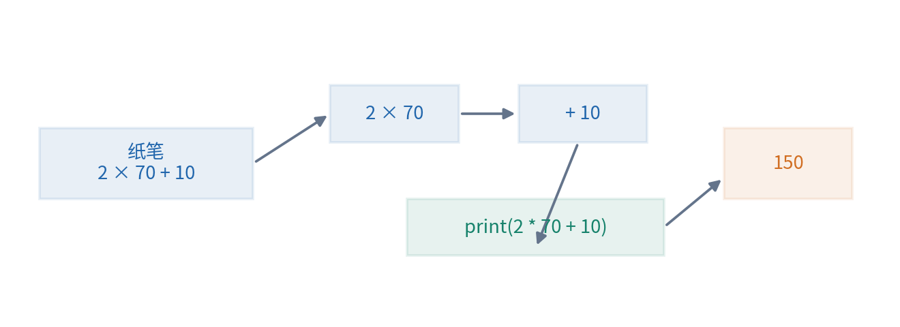

当你在交互解释器输入一个表达式，系统通常立即显示它的值；在 .py 脚本中单独写 2 * 70 + 10，表达式会计算，但通常不会自动把结果打印到终端。Notebook 常自动显示最后一个表达式的值，这又是交互界面的方便功能。为了初学阶段不混淆，本讲需要展示的结果都明确写 print。[1]

程序与手算有一个重要共同点：都能写错。打印出 150 只说明这次输入和这段程序产生了该输出。要知道它为什么对，我们仍然要核对步骤；要知道换一行输入是否还对，我们还要增加测试。速度不能代替理解，代码长短也不能决定可靠性。

## 二 在哪里写 在哪里运行

Python 语言规定代码怎样解释；Python 解释器是执行代码的程序；Anaconda 是管理 Python 和一些科学计算工具的发行与环境体系；Jupyter 是让代码、说明文字和输出放在同一文档里的交互界面。这四件事相关，但不能简单当成四个同义词。

若你已经有 Anaconda，可以启动包含 Python 的环境，再打开 JupyterLab 或 Notebook。一个 .ipynb 文件由若干单元组成，文字单元写说明，代码单元送给 Python 内核执行。所谓内核，在这里可以先理解为“当前负责执行代码并记住变量的 Python 进程”。程序名字和值保留在那里，并不只存在网页上。

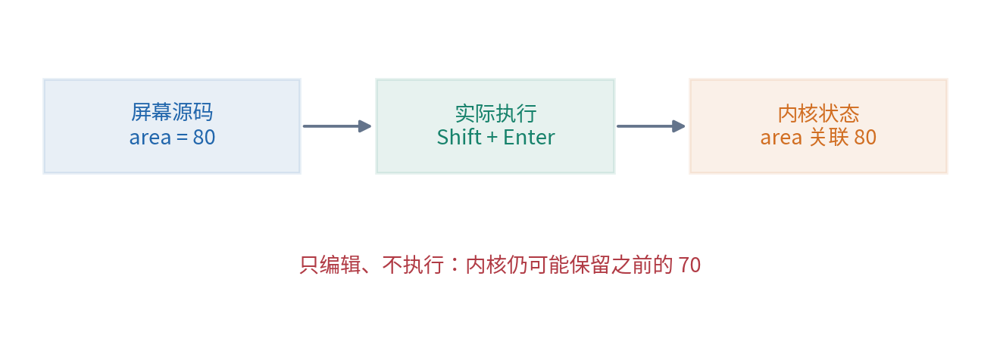

假设先执行第一格 area = 70，再执行第二格 print(area)，会看到 70。现在你把第一格文字改为 area = 80，但没有执行它，又运行第二格，仍然可能看到 70。因为内核还记着上次执行留下的 70。屏幕上现在显示的源码和产生输出时使用的源码，不一定是一回事。

因此，本讲验收必须重启内核，再从第一格顺序运行到最后。重启会清除旧变量，顺序运行会检查文件有没有完整写下所需步骤。如果某个结果只在你“先随便跑几格”后才出现，就还不是一个可靠的复现。执行序号是线索，但它本身也不证明所有依赖都已记录。[5]

另一种运行方式是把代码保存为 experiment.py，在终端进入其所在目录后执行 python experiment.py。这个新进程从文件开头开始，按照顺序执行，结束后退出。终端中的 cd 是切换目录的命令，不属于这里讲的普通 Python 计算代码。初学时要先确认光标是在终端，还是在 Notebook 代码格里。

## 三 名字不是一个永远成立的方程

如果每次都写 2 * 70 + 10，很难看清哪个数代表什么。用有意义的名字能减少混淆：

```python
area = 70
weight = 2
bias = 10
prediction = weight * area + bias
print(prediction)
```

一行赋值先计算等号右侧，再让左侧名字指向结果。第一行把 area 这个名字关联到整数 70；第四行取出当前 weight、area 和 bias 的值，计算出 150，再把 prediction 关联到这个结果。这里的 = 是赋值操作，不是在证明左右两边永远相等的数学命题。[1]

下面的两行尤其值得亲手执行：

```python
area = 70
area = area + 5
```

第二行先读取旧值 70，算出 75，再把名字 area 改为关联 75。它不会要求寻找一个满足“面积等于面积加 5”的数字。如果把赋值当成数学等式，就会觉得它自相矛盾；把它理解成随执行发生的状态更新，就很清楚。

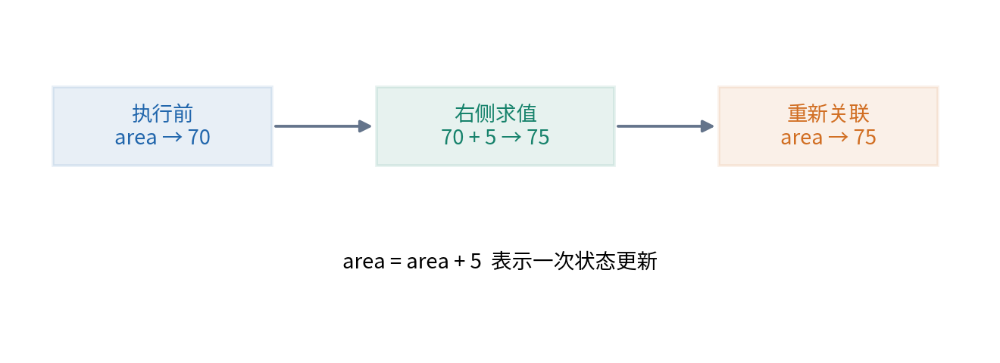

还有一个常见误解：prediction = weight * area + bias 并不在三个名字之间安装一个持续自动更新的电子表格公式。若得到 prediction 为 150 后，只执行 area = 80，prediction 仍是 150；你需要再次执行那条预测赋值，才会得到 170。程序的依赖关系要靠实际执行落实，不能只靠名字暗示。

名字区分大小写。area 与 Area 是不同名字。可以使用有意义的字母、数字与下划线，但不能以数字开头，不能把 Python 保留字当作普通变量名。初期推荐 area_m2、price_wan 这样的名称，把单位写进名字。price 过于模糊时，你很容易把总价、单价、元与万元混在一起。

注释以 # 开始，用来说明这一行的意图，不参与该行之后的计算。例如 # 单位为万元 提醒读者单位是什么。好的注释解释为什么做、量的含义和边界，不只是把乘法再说成“这里乘一下”。以后代码变动时，也要检查注释是否仍然真实。

## 四 同样看起来像数字 值的类型可能不同

70 是整数，Python 的类型名是 int；70.0 是浮点数，类型名是 float；"70" 是由字符 7 和 0 组成的字符串，类型名是 str。引号不是装饰，写进引号后，你表达的是文本，不再是自动可做任意算术的数值。

```python
print(type(70))
print(type(70.0))
print(type("70"))
print(70 + 5)
print("70" + "5")
```

前三行用于查看类型，后两行分别得到 75 和 "705"。字符串加法连接文本，数值加法做算术。把表格读进程序时，文件里的 70 可能先被读成文字；如果没核对类型，就可能在本想计算的时候连接了字符。第 4 讲会详细讲文件读取，这里先记住“看起来像数字”不等于“已经是数值”。

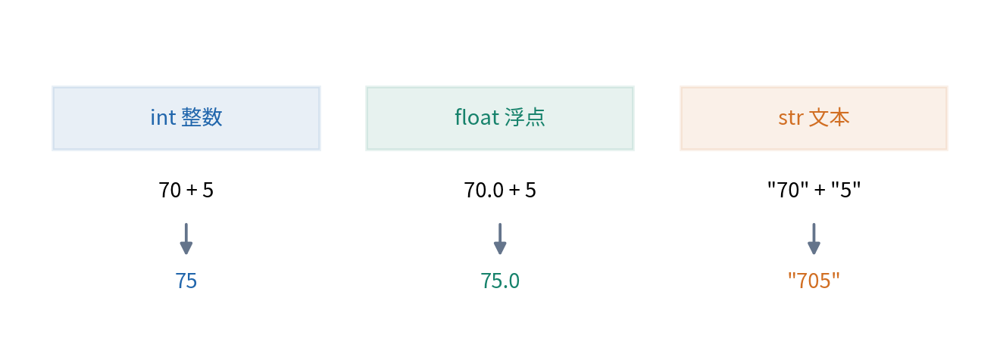

可以用 float("70.5") 把一段合适的数字文本解释成浮点数。转换失败时，Python 会报错，而不是自动猜测你指什么。把 "未知" 强行变成 0，会把缺失变成一个真实数值；这是数据决策，不是无害的编程修复。类型转换之前仍然要知道字段含义。

Python 普通整数可以随数值大小扩展，不局限于固定 32 位整数的范围，但仍受可用内存约束。浮点数则以有限位数表示数值，在常见平台上采用双精度二进制浮点。它能表示很大的范围，却不能精确表示所有实数或所有十进制小数。后文会用 0.1 展开，而不把“电脑算得快”误当成“所有小数都精确”。[3][4]

还有一种只有 True 与 False 两个主要取值的布尔类型 bool，表示条件成立或不成立。我们马上用它控制程序走哪条路。虽然 Python 在某些运算中允许把布尔值当成 1 与 0，初学时仍要把“它是一个判断”与“它是一个计数”在语义上分清。

## 五 运算次序与单位一起检查

基本算术符号是 +、-、*、/；** 表示乘方；括号可以明确计算次序。乘方通常先于乘除，乘除通常先于加减。同一层级常按相应规则结合。你无需第一天背下完整优先级表，但遇到可能误读的表达式时，应主动加括号，让意图可见。

例如四次绝对误差为 5、0、10、15，平均数应写成 (5 + 0 + 10 + 15) / 4。若写成 5 + 0 + 10 + 15 / 4，除法只作用于 15，结果是 18.75。程序能够运行，而且给出一个看起来合理的小数，却没有计算我们定义的 MAE。这是逻辑错误，不是语法错误。

再看平方：(-2) ** 2 得 4，而 -2 ** 2 得 -4，因为后者先算 2 的平方再取负。若以后写平方损失，最清楚的写法是 (prediction - label) ** 2，把要平方的整个误差包在括号里。明确括号比依赖读者记忆优先级更可靠。

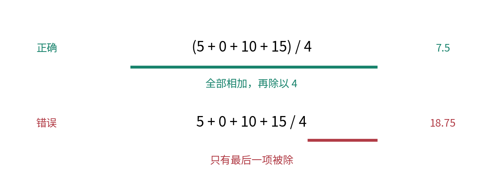

在 Python 3 中，/ 表示普通除法，即使 8 / 4 的结果在数学上是整数，Python 也返回 2.0。// 表示向下取整除法，例如 7 // 2 为 3，-7 // 2 为 -4。向下取整指朝负无穷方向，不是简单删除小数部分。我们计算平均误差要用 /，不应误用 // 把 7.5 截成 7。[1]

单位提供另一条独立检查。weight 的单位是万元每平方米，area 是平方米，两者相乘是万元；bias 和结果也必须是万元。Python 不会因为你把厘米填进 area 就自动提醒。如果把面积从平方米改成平方厘米，却仍用原来的 weight，代码完全能跑，任务计算却已错了。后续把单位写进数据字典与变量名，就是为了降低这类风险。

## 六 用列表保留多条记录的次序

一套房屋可以用一个 area；四套房屋就需要一组数。列表用方括号包住元素，元素之间用逗号分开：

```python
areas = [50, 60, 80, 90]
prices = [110, 130, 170, 190]
print(len(areas))
print(areas[0], prices[0])
```

len(areas) 得到列表长度 4。列表位置称为索引，Python 的第一个位置编号是 0，因此 areas[0] 为 50，areas[3] 为 90。数学书可能把第一个样本写作 $x_1$，程序里却用 areas[0]；两套编号约定都可以用，但转换时必须清楚，不能把“第三个”机械等同索引 3。

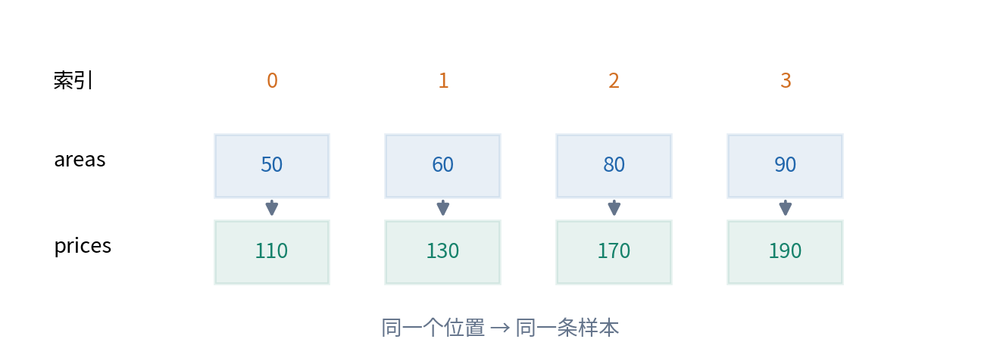

这里两个列表靠共同位置保持配对。索引 0 同时指 H1 的面积与标签，索引 1 同时指 H2。若只把 prices 倒过来，列表长度还是 4，程序仍能算出一个 MAE，但样本配对已被破坏。第 4、6 讲会介绍带字段名的记录与表格，减少这种依赖位置的脆弱性。

负索引从末尾计数，areas[-1] 表示最后一个元素 90。这是便利规则，不表示面积为负。areas[4] 超出长度为 4 的列表范围，会报 IndexError。遇到这个错误时，先核对合法索引是 0、1、2、3，而不是去改房屋面积数字。

列表还能截取一个区间，例如 areas[1:3] 得到位置 1、2 的元素，即 [60, 80]。右端 3 不包含在内。这个“左含右不含”的规则会在 range 中再次出现。它让区间长度通常等于右端减左端，但需要防止初学者以为最后那个位置也会加入。[1][2]

空列表写作 []，长度为 0。它不是一个里面装着 0 的列表 [0]。计算平均数时，空列表没有可除的样本数；若直接 sum(values) / len(values)，会产生除以零错误。遇到空输入应先判断任务是否定义，而不是随便规定平均误差为零，好像没有观察就代表完美。

## 七 列表修改与名字共享

列表是可变对象。执行 areas[0] = 55，会改变这个列表第一个位置的值。若需要保留原始数据，不能只是想当然地给它另取一个名字：

```python
original = [50, 60, 80, 90]
other_name = original
other_name[0] = 55
print(original)
```

此时 original 也显示 [55, 60, 80, 90]。other_name = original 没有复制四个数字组成的新列表，只是让两个名字指向同一列表。你通过其中一个名字修改列表，另一个名字看到的也是那个已被修改的对象。[2][4]

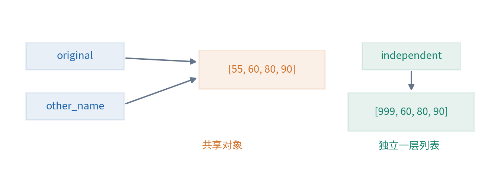

对本讲这种只包含数值的一层列表，可以写 independent = original.copy() 建立一个新列表容器，再修改 independent[0]。原列表就不会跟着改变。不要把这个结论扩大到任意深度的嵌套结构；如果列表里还装着列表，浅复制会保留内部对象共享，后续需要单独讨论。

为什么一个编程细节会影响研究？想象你为了检查“某个异常点删掉之后怎样”，却不小心原地修改了后面所有实验都共用的列表。后续方法读到的就不是你以为的原始数据。保存数据版本、避免隐藏修改，与学习算法本身一样会影响比较是否可靠。

## 八 布尔判断让程序表达条件

我们需要判断候选分数有没有变好。比较运算会得到 True 或 False：score < best_score 表示当前分数是否更小；score == best_score 判断数值是否相等；score != best_score 判断是否不同。= 赋值与 == 比较必须区分，字符相似不代表作用相同。

```python
score = 7.5
best_score = 10
print(score < best_score)
print(score == best_score)
```

结果依次为 True、False。这些是可以继续使用的值。if 后放一个条件，条件为真就执行缩进的代码块；否则可以执行 else 对应的块。

```python
if score < best_score:
    best_score = score
    print("发现更小的训练误差")
else:
    print("保留原来的选择")
```

冒号表示接下来进入一个代码块，缩进表示哪些行属于它。推荐用四个空格，不混用制表符。Python 的缩进参与语法和控制流程，并不只是排版风格。如果 best_score = score 没有缩进进 if 块，它就可能无论条件真假都执行，导致选择逻辑完全不同。[2]

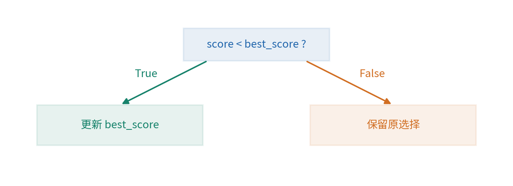

多个条件可以用 and、or、not 组合。例如 area > 0 and area < 300，要求两个条件都成立；label < 0 or area <= 0，表示至少一个可疑条件成立；not finished 表示尚未完成。先用括号把每个子条件界定清楚，避免把一句含糊的中文直接翻成代码。

条件判断不能替你决定业务含义。area > 0 可以排除非正面积，但不能证明单位正确、测量准确或记录合法。一条记录通过若干代码检查，只表示它没有违反这些已写出的规则，不表示它在世界上一定是真实可靠的。

## 九 循环就是有秩序地重复一步

如果要打印四个面积，可以写四次 print，但更通用的办法是让 for 依次取出列表里的元素：

```python
areas = [50, 60, 80, 90]
for area in areas:
    print(2 * area + 10)
```

第一次 area 关联 50，执行缩进的 print 得 110；第二次关联 60，得 130；之后依次是 170 和 190。循环结束后，外面没有自动变出一个“模型”；程序只是把同一预测规则应用到四个输入。它是否构成训练，要看有没有利用标签与目标去决定参数。

如果同时需要面积与对应价格，可以循环遍历位置。range(4) 依次给出 0、1、2、3，右端 4 不包含。range(len(areas)) 将长度与可用索引连接起来：

```python
for index in range(len(areas)):
    prediction = 2 * areas[index] + 10
    error = abs(prediction - prices[index])
    print(index, prediction, error)
```

这里 index 的值每次变化，用同一个索引从两列表取数据，保持样本配对。abs 是取绝对值的内置工具。先写这个直接版本，是为了看清对应关系；熟悉后可以学习 enumerate、zip 等更简洁的写法，但简洁写法同样需要检查长度与配对。

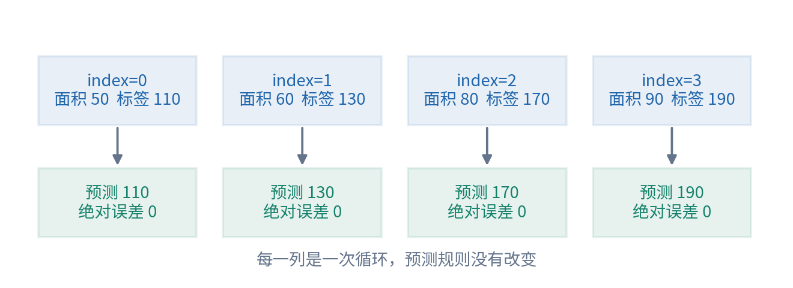

请注意循环体里哪些变量会被每轮覆盖。prediction 每次保存当前样本的预测，不自动记住之前三个值。如果你希望保留全部预测，需要另建列表，然后每轮 append 一个结果。append 是向列表末尾添加一个元素的操作。

```python
predictions = []
for area in areas:
    predictions.append(2 * area + 10)
print(predictions)
```

predictions = [] 要放在循环前。若放在循环内部，每一轮都重置为空，最后只剩末轮的一个值。程序可能没有报错，结果却丢掉了三条样本。看“循环前”“循环内”“循环后”的位置，是读程序时必须形成的空间感。

## 十 累加器为什么放在循环外

计算 MAE 需要把每轮的绝对误差加起来。我们用 total_error 保存“截至目前已处理样本的误差总和”。开始还没处理任何样本，总和是 0；每做完一条，就在旧总和上加当前误差。

```python
weight = 1.5
bias = 40
total_error = 0
for index in range(len(areas)):
    prediction = weight * areas[index] + bias
    error = abs(prediction - prices[index])
    total_error = total_error + error
mae = total_error / len(areas)
print(mae)
```

对于 C，第一轮误差 5，总和从 0 变成 5；第二轮误差 0，总和仍是 5；第三轮加 10 变成 15；第四轮加 15 变成 30。循环结束后除以 4，得到 7.5。这个逐轮表可以在纸上独立核对程序，不必盯着最终小数猜原因。

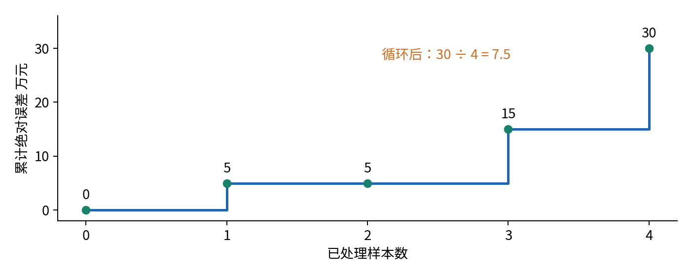

这里有一个可以用自然语言证明的小性质：每次循环结束后，total_error 都等于已经处理过的那些样本的绝对误差之和。开始处理零条时成立；若前一轮成立，再加当前误差后仍成立；因此处理完四条时，它就是全部四条的总和。这样的“循环始终保持的性质”称为循环不变式，是检查算法的早期入口。

如果把 total_error = 0 放进循环里，每轮会忘掉之前的和，最后只保留最后一个样本的误差 15，再除以 4 得 3.75。它比正确值 7.5 更小，看起来像模型更好，实际只是程序漏算了数据。科研代码的错误有时恰好让数字变漂亮，所以不能只检查结果是否符合愿望。

另一个错误是把 mae = total_error / len(areas) 放在循环内部并只看最终值。这次最终数值可能仍然正确，但中间打印的是“部分误差和除以全部样本数”，不是已处理样本的平均误差。若你把这些中间值画成学习曲线，就会给它们错误的意义。数值偶然正确与过程解释正确仍需分开核对。

## 十一 从一个候选扩展到三个候选

我们现在有了计算一个候选 MAE 的完整步骤。要比较三条规则，最直接的方法是把参数也列出来，再外套一层循环。names = ["A", "B", "C"]，weights = [2, 2, 1.5]，biases = [0, 10, 40]，三个列表同位置描述一个候选。

外层循环每次选一个候选，内层循环遍历四条训练记录。对每个新候选，total_error 必须重新置 0；否则 B 的分数会混入 A 的误差，C 又混入前两个候选。注意它要在“候选循环内、样本循环外”。这句话是嵌套循环中最关键的作用范围判断。

```python
names = ["A", "B", "C"]
weights = [2, 2, 1.5]
biases = [0, 10, 40]
scores = []
for candidate in range(len(names)):
    total_error = 0
    for index in range(len(areas)):
        prediction = weights[candidate] * areas[index] + biases[candidate]
        total_error = total_error + abs(prediction - prices[index])
    scores.append(total_error / len(areas))
print(scores)
```

结果应为 [10.0, 0.0, 7.5]。这段程序一共对 3 个候选各处理 4 个样本，执行 12 次样本预测。若候选数和样本数都翻倍，预测次数从 12 变成 48，是原来的 4 倍，而不是 2 倍。这是最朴素的计算量分析：先数算法做了多少次基本动作，再谈实际耗时。

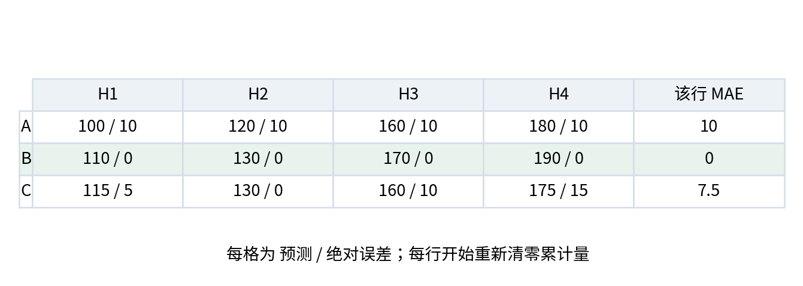

选择最小分数也可以写得完全透明。先暂把第一个候选当最好；依次比较其余候选，遇到更小分数才更新索引。我们约定分数相同保留原先候选，因此用 < 而不是 <=。并列时选谁不是电脑应该偷偷决定的细节，应该在看最终测试之前定好。

```python
best_index = 0
for candidate in range(1, len(names)):
    if scores[candidate] < scores[best_index]:
        best_index = candidate
print(names[best_index], weights[best_index], biases[best_index])
```

这段程序选择 B、2、10，与第一讲一致。它还没有证明 B 对任何新数据都更好。程序完成的是我们指定的受限训练选择；科学结论仍然需要后面的独立评价。

## 十二 再把测试当成测试

训练确定 best_index 后，先固定 selected_weight 与 selected_bias。测试面积放在 [65, 85]，只用它们生成 [140, 180]。此时不读取测试标签，也不根据它们改候选。最后才与 [144, 174] 比较，绝对误差为 [4, 6]，MAE 为 5。

代码练习中把所有数直接写在同一文件，是为了避免尚未学习的文件读写遮住算术主线。它不提供技术上的保密隔离。程序的执行顺序表达的是教学约定；真正研究还需要数据权限、流程与记录管理。第 1 讲实验已提供分阶段文件方案，第 4、7 讲会把这种结构讲透。

也不要因为我们从 A、B、C 中选 B，就把所有“多次比较”一概叫测试泄漏。这里候选事先固定，比较使用训练标签，是受限的参数拟合。若利用最终测试成绩反复改候选、误差标准或特征，才改变了最终测试作为未参与开发证据的角色。

再计算基线：把四个训练价格相加除以 4 得 150，测试时固定输出 [150,150]，MAE 为 15。两个方法必须使用同样的测试样本、标签、单位和指标，才能形成当前范围内的公平比较。用 A 在四行训练数据的误差去比 B 在两行测试数据的误差，就混淆了评价对象。

## 十三 为什么 0.1 加 0.2 不恰好等于 0.3

运行 print(0.1 + 0.2) 时，常见输出是 0.30000000000000004。运行 print(0.1 + 0.2 == 0.3)，得到 False。它不是说明加法定律失效，而是提醒我们：程序保存的浮点数通常是所写十进制数的有限二进制近似。

十进制中 1/3 需要无限重复小数 0.333...，若只保留两位只能得到 0.33；二进制中，1/10 也不能用有限小数位完整表示。电脑选择一个可表示的邻近值存起来，后续运算还会继续舍入。两条不同的计算路径可能得到非常接近、却不逐位相同的浮点结果。[3]

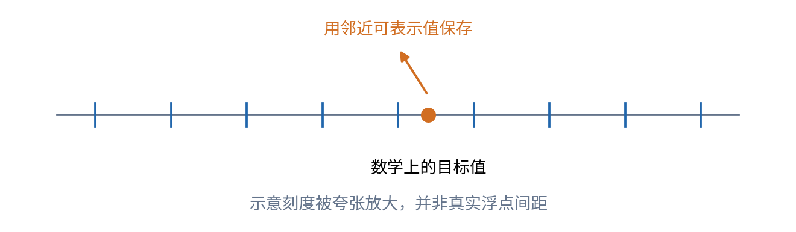

不要把所有小数都判为不精确。例如 0.5 等于二进制的一半，1.5 也能精确表示；本讲许多整数与半整数计算恰好可精确完成。但这只是当前数字的性质，不是所有训练、求平均和梯度计算都能直接用 == 验证的保证。

需要判断两个计算结果是否足够接近时，可以检查绝对差。例如 abs(value - expected) < 1e-12，表示差小于 $10^{-12}$。1e-12 是科学计数写法，即 0.000000000001。容差必须结合量的大小、单位和误差传播选择，不应把某个极小数复制到所有问题中。

Python 的 math.isclose 同时允许相对容差与绝对容差。相对容差随数值尺度变化，绝对容差对接近零的比较很有用。例如比较一个理论零值和一个数值计算得到的 $10^{-15}$，只有相对容差可能不符合你的目标。当前先掌握“近似计算要明确允许多大差异”，具体数值稳定性会在后续课程展开。[3]

显示格式化可以把数值呈现为指定的小数位，例如 format(0.1 + 0.2, ".2f") 返回文本 "0.30"，原先保存的浮点数没有改变。round(x, 2) 则不同：它返回另一个舍入后的数值，并非只改变显示；但这个浮点结果也不因此成为数学上精确的分数 3/10。先把每一步都粗暴舍入不是通用修复，那会引入新的累计误差，甚至改变候选的排序。显示格式、数值舍入和计算精度要分开理解。

## 十四 程序没报错 为什么仍然可能错

语法错误表示代码不符合语言规则，例如漏掉 if 行尾冒号；运行时错误表示执行到某一步无法继续，例如访问列表范围外的位置；逻辑错误则是程序顺利完成了你写的步骤，但这些步骤不符合目标，例如平均数少一对括号。前两类通常有错误信息，最后一类常常需要我们主动设计检查。

最便宜的检查来自已知答案。先用第一讲四条数据，确认 C 的总误差为 30，平均为 7.5；再用单条样本面积 70、标签 150，确认 B 的误差为 0；再给同样面积但标签 155，确认绝对误差变为 5。每次只改变一件事，就容易知道变化来自哪里。

边界输入也值得单独检查：空列表、一个样本、面积与价格列表不等长、零误差、正负方向混合的误差。如果程序对这些情况的行为没有定义，就不能因为普通输入跑过一次而宣称可靠。第 4 讲会把这些要求写成断言、异常与可重复测试；本讲先让你能够亲手提出它们。

对机器学习尤其重要的是“数值正确而问题错误”。你可以把标签顺序打乱，仍然得到一串合法的 MAE；可以把同一房屋重复很多次，使某类样本权重变大；也可以把测试答案用于挑规则。语言解释器不会对这些研究设计问题负责。程序验证和数据任务审查必须一起做。

## 十五 练习先做再核对

### 练习一 状态跟踪

顺序执行 x = 3，y = 2 * x，x = 10，print(y)，输出是什么？然后再执行 y = 2 * x，输出 y 又是什么？请画名字和值的状态表，而不是凭“公式应该一直成立”回答。

### 练习二 平均表达式

三次绝对误差为 2、4、9。分别计算 (2 + 4 + 9) / 3 与 2 + 4 + 9 / 3。哪一个是 MAE？解释错误表达式为什么仍能正常运行。

### 练习三 配对与索引

areas = [40, 60, 80]，prices = [90,130,170]。写出索引 0、1、2 分别对应的样本。若单独反转 prices，用 $2x+10$ 得到的 MAE 是多少？这反映的是模型变坏还是数据对应被改变？

### 练习四 循环边界

for i in range(1, 4) 会给出哪些 i？如果用它访问长度为 4 的训练列表，漏掉哪一条？如果改成 range(5)，会在哪个 i 出错？

### 练习五 累加器位置

C 的误差为 [5,0,10,15]。每轮都先写 total = 0，再加当前误差，循环结束后除以 4，结果是多少？用“已经处理样本的误差和”这个不变式解释问题。

### 练习六 并列规则

scores = [2,2,5]。从第一个候选开始，使用 < 更新会选哪个索引？改成 <= 又会选哪个？为什么在某个结果出来后才选择并列规则会影响可重复性？

### 练习七 列表共享

a = [1,2]，b = a，b[0] = 9，a 是什么？如果 b = a.copy()，再修改 b[0]，a 会怎样？说明本题只讨论一层数字列表。

### 练习八 浮点与显示

0.1 + 0.2 == 0.3 为 False，能否说明两者相差很大？round(..., 2) 显示 0.3，能否说明内部结果变成精确分数 3/10？你会怎样检查数值差异是否在某个任务可接受范围内？

### 练习九 最小实验程序

不复制正文完整代码，使用列表、for、if 写出三候选训练选择。先打印每个候选的四个预测，再打印 MAE，最后打印选中的参数。重启解释器，从头运行；交给一个没有你历史变量状态的人也应得到同样数值。

### 练习十 结果的边界

程序得到训练 MAE 0、教学测试 MAE 5，并且每个手算都对。请写一句有证据支持的结论和一句证据不支持的结论，再解释二者差在哪里。

## 十六 详细解答与推理

练习一第一次输出 6。y 在 x 为 3 时计算并保存了 6；后来 x 改成 10 没有自动重算 y。再次执行 y = 2 * x 后才输出 20。这是赋值与执行顺序的直接结果。

练习二第一个式子为 $15/3=5$；第二个式子先算 $9/3=3$，再与 2、4 相加得到 9。第一个才符合“误差总和除以样本数”。第二个语法合法，计算的是另外一个算式，解释器没有理由报错。

练习三原配对依次为 (40,90)、(60,130)、(80,170)，模型恰好全对。反转价格后标签成为 [170,130,90]，预测仍为 [90,130,170]，绝对误差为 [80,0,80]，MAE 为 $160/3\approx53.3333$。模型参数和预测过程都没改，变化来自人为破坏了标签配对。

练习四 range(1,4) 给 1、2、3，漏掉索引 0；range(5) 给 0、1、2、3、4，到 4 时越界。以列表长度 n 为上界时，合法非负索引是从 0 到 n-1，一共有 n 个。

练习五最后只剩 15，除以 4 得 3.75。第二轮开始重置为 0 后，total 已经不再等于前面所有已处理误差之和，所以不变式被破坏。把初始化放在循环外，才能保持累计意义。

练习六使用 < 保留索引 0，使用 <= 会在第二个同分候选处更新为索引 1。这里第三个分数 5 不会被选。两种约定都可以事先说明；要避免根据偏爱的结果临时修改 tie-break 规则，再隐瞒这种开发选择。

练习七共享赋值后 a 为 [9,2]，因为 a 与 b 指向同一列表。若从原来的 a = [1,2] 开始，先用 copy 建新列表再改 b，a 保持 [1,2]。这不自动解决嵌套容器中的内部共享。

练习八 False 只说明逐值比较不相等，不说明差距大。常见二进制浮点下差距约为 $5.55\times10^{-17}$。格式化或 round 可以改变显示或产生另一个有限精度数，不能令任意实数运算精确化。应先明确单位、尺度与可接受误差，再检查绝对差或使用合适容差的 isclose。

练习九参考实现就是配套 experiment.py 中按步骤排列的代码。检查重点是：三个候选的预测分别为 [100,120,160,180]、[110,130,170,190]、[115,130,160,175]；总误差分别为 40、0、30；MAE 为 10、0、7.5；选出索引 1 对应 B。只打印最后一个 B 而没有中间记录，较难定位偶然选对的错误代码。

练习十可支持的结论是“这个程序在指定合成数据与候选上重现了纸笔计算”。不支持的结论是“它已证明真实房屋价格能被稳定准确预测”。前一句只依赖已核验的程序行为，后一句还要求真实数据、代表性、独立评价和误差后果等尚未提供的证据。

## 十七 从会执行走向可检查程序

现在你已经能沿着执行顺序解释一个小实验：名字保存当前值，列表保留多条记录，循环逐条处理，累加器收集误差，条件比较候选，冻结参数之后再生成测试预测。你也知道程序可能因括号、缩进、索引、共享修改或浮点近似偏离本意。

下一讲的困难来自程序变长以后。预测代码在多个地方复制，一处修改另一处忘改；某个变量被别的单元意外改变；文件路径只在自己的机器上成立。函数、输入输出契约、异常和最小测试会帮助我们把实验拆成能够单独检查的步骤。学习这些组织方法，是为了让计算更可核验，而不是为了让代码看起来复杂。

## 参考资料

[1] Python 官方教程 An Informal Introduction to Python，核对表达式、赋值、数值与列表基础。https://docs.python.org/3/tutorial/introduction.html

[2] Python 官方教程 More Control Flow Tools 与 Data Structures，核对分支、循环、range、列表操作及复制语义。https://docs.python.org/3/tutorial/controlflow.html 与 https://docs.python.org/3/tutorial/datastructures.html

[3] Python 官方教程 Floating-Point Arithmetic Issues and Limitations，核对二进制近似、显示与相近比较。https://docs.python.org/3/tutorial/floatingpoint.html

[4] Python 官方文档 Built-in Types，核对整数、浮点、布尔与序列语义。https://docs.python.org/3/library/stdtypes.html

[5] Jupyter 官方文档 The Jupyter Notebook，核对内核与交互单元执行。https://jupyter-notebook.readthedocs.io/en/stable/notebook.html

核验日期为 2026 年 10 月 4 日。正文的教学路线、手算表、代码与图示独立编写。官方文档是语义核查依据，不要求零基础读者现在通读全部条目。
