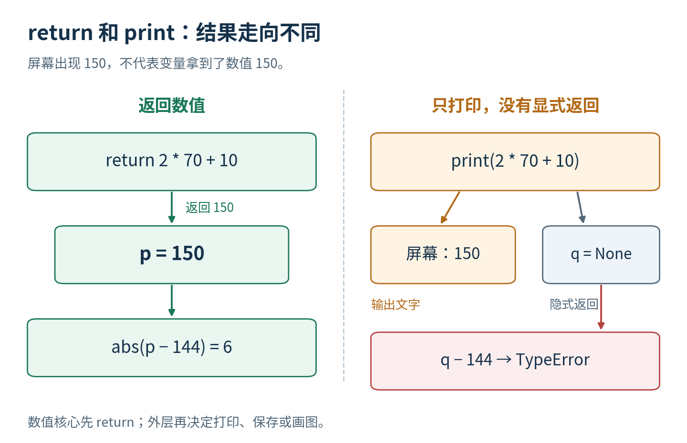
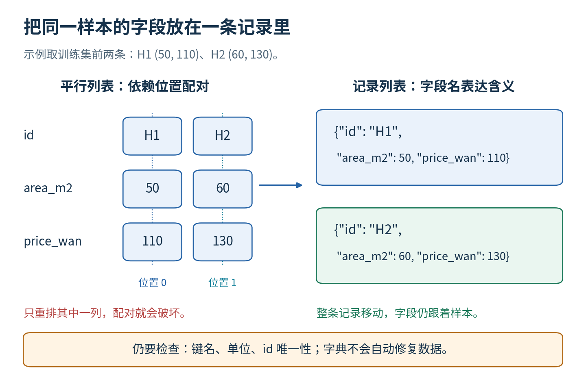
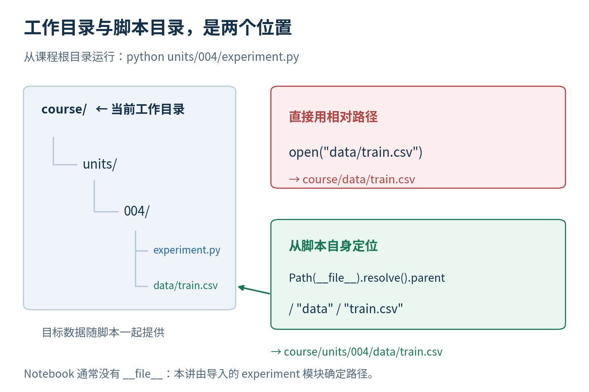

# 第四讲实验指南

亲手拆分实验并验证每一处边界

这一讲的成功标准是能写、能解释、能故意弄坏再修好。你会从两个短函数开始，把预测和误差计算接上 CSV 读取，再构成只用训练集选择参数的完整实验。最后从新进程运行并保存结果，验证它没有依赖 Notebook 中残留的变量。

直接先修是第三讲。主实验仅用 Python 标准库、普通 CPU 和本地合成数据，不需要网络、API、GPU、NumPy 或 pandas。建议先读讲义第一至五节，再做步骤一至四；读六至十一节后完成数据与测试部分。不要一开始就把数百行参考脚本当成必须背诵的语法清单。

## 一 文件与运行方式

本讲目录中的 lecture.md 是讲义源文件，lab.md 是本指南，experiment.py 是完整函数实现，experiment.ipynb 是逐格参考实验，test_experiment.py 是独立验收程序。data 中三个 CSV 分别是训练表、测试输入、测试标签；outputs/result.json 是默认实验结果。测试故障数据只在临时目录建立，不修改 data。

运行环境为 Python 3.10 或更新版本；实际测试版本见 test-result.json。首先在终端切换到本讲目录，再执行：

```text
python --version
python experiment.py
python test_experiment.py
```

实验应输出选中 B，测试 MAE 为 5.0 万元，训练均值基线测试 MAE 为 15.0 万元。独立测试成功时显示 PASS: 122 explicit checks；具体项目与边界记录在 test-result.json。这个数字只说明本次清单全部通过，不能代替你解释函数为何这样设计。

Notebook 需要 Jupyter 与 Python 3 内核。请从本讲目录打开它，保留同目录的 experiment.py 与 data 文件夹；按顺序运行全部代码格。Notebook 前半部分直接定义学习版函数，后半部分才导入严格实现，目的就是避免只会按按钮却不会编写。最终验收时重启内核后全部运行。Notebook 路径不对时先检查你打开的目录，不要复制作者机器上的绝对路径。

发布的 Notebook 已在一个新的 Python 进程中的 ipykernel 内核按顺序执行并保存输出。此次检查覆盖真实 Python/IPython 单元执行；未测试 Jupyter 浏览器界面、外部内核传输或每一种操作系统。数学和主实验本身不依赖可视化包；只有重绘 PNG 的 make_figures.py 需要 matplotlib 和中文字体。

## 二 先写一个真正返回结果的函数

在新代码格中，不看参考脚本，完成下面的骨架。raise NotImplementedError 是“这里还没有实现”的明确占位，运行会报错；写好自己的实现后应删除占位。不要把未完成骨架留在最后的验收 Notebook 中。

```python
def my_predict(area, weight, bias):
    raise NotImplementedError("请写出公式并返回")
```

写完后检查 my_predict(70,2,10) 为 150，my_predict(50,2,10) 为 110。再用关键字调用 my_predict(bias=10,area=70,weight=2)，检查仍为 150。关键字能改变书写顺序，但不能改变参数含义。

现在故意把 return 改成 print，执行 result = my_predict(70,2,10)，然后 print(result)。屏幕会先显示 150，随后显示 None。写一句原因，再恢复 return。验收的重点是你的变量真正得到数字，不是屏幕恰好出现了数字。



参考解答只有两行，但这两行必须由你先写：

```python
def my_predict(area, weight, bias):
    return weight * area + bias
```

这还是计算骨架，没有落实严格输入契约。它对部分错误类型可能产生意外行为，因此不能直接冒充后面的完整实现。

## 三 用局部名字消除隐藏依赖

在外层写 area = 999、weight = 100、bias = -100，再调用 my_predict(70,2,10)。明确传入参数的函数仍应返回 150，外部 area 仍为 999。把外部 weight 改成 300，结果不应变化。

再另写一个错误示例：def hidden_predict(area): return weight * area + bias。先运行一次，再改变外部 weight 运行一次。两个结果不同，因为函数读取了外部状态。请记录它真正依赖哪三个输入，以及为什么只从签名看不全。

修复时把所有计算所需的变量作为参数传入。最终用于训练的函数不应偷偷读取刚才的演示变量。完成演示后重启内核，再从第一格顺序运行，可以验证正式流程不依赖这些历史赋值。

“局部变量不影响外部同名绑定”不等于“函数永远不能改变外部数据”。如果传入的是列表或字典，函数内部修改这个容器，调用者也可能看到变化。本讲返回新的预测列表，不在函数内排序或改写原始训练记录。

## 四 亲手实现 MAE 再给它加护栏

先在纸上算 [140,180] 与 [144,174] 的绝对误差 4、6，平均为 5。然后把第三讲的循环改成自己的函数，不要导入参考答案代替实现：

```python
def my_mae(predictions, labels):
    if len(predictions) == 0:
        raise ValueError("需要至少一个样本")
    if len(predictions) != len(labels):
        raise ValueError("预测和标签长度不同")
    total = 0
    for index in range(len(predictions)):
        total = total + abs(predictions[index] - labels[index])
    return total / len(predictions)
```

先自行补出循环和返回行，再对照参考。计算 [140] 与 [144] 应为 4；[1,4] 与 [2,2] 应为 1.5。故意把 total = 0 移进循环，解释为什么结果只留下最后一项。恢复以后再次验算。

第二轮增加输入护栏。请写一个 my_number(value,name)，要求 type(value) 为普通 int 或 float，排除 bool；转换后用 math.isfinite 检查；不接受 NaN 和无穷。先看讲义的契约解释，再读 experiment.require_finite_number 对照。用这个函数检查 my_predict 的三个输入和最终输出。

对 MAE 应检查两个容器是 list 或 tuple、每个元素是有限数值、差值和累计仍有限。若大数累计溢出，本讲实现明确报错，不偷偷输出无穷。完整答案见 experiment.mean_absolute_error；你自己的最终版本至少通过以下普通输入、单样本和两类拒绝测试：

```python
assert my_mae([140, 180], [144, 174]) == 5
assert my_mae([140], [144]) == 4
try:
    my_mae([], [])
except ValueError:
    print("正确拒绝空列表")
else:
    raise AssertionError("空列表本应失败")
```

将空列表换成长度不等列表，再写一次对应测试。try 的 else 表示“没有发生错误时”，在这种预期失败检查中必须明确判定它失败。普通运行模式下 assert 适合核对答案；不要用 assert 承担外部输入的必要验证，因为 -O 可以移除它。

## 五 先看 CSV 文本 再读数值记录

用文本编辑器打开 data/train.csv。表头应为 id,area_m2,price_wan，四条训练记录依次是 H1 50 110、H2 60 130、H3 80 170、H4 90 190。测试输入 T1 面积 65、T2 面积 85；测试标签为 144、174。所有房屋都是教学合成样本。

在代码中先试下面的短读法，观察 50 的类型：

```python
import csv
from pathlib import Path
with Path("data/train.csv").open(encoding="utf-8", newline="") as handle:
    reader = csv.DictReader(handle)
    raw_rows = list(reader)
print(raw_rows[0]["area_m2"])
print(type(raw_rows[0]["area_m2"]).__name__)
```

先输出看起来像 50 的文本，类型是 str。with 管理文件的使用范围，离开缩进块后自动关闭文件；list(reader) 把逐行读取器的结果收集为列表。字段名用方括号读取，拼写错误会得到 KeyError。

你自己的读取练习先处理一行：建立新字典，保留字符串编号，把面积和价格交给 float 转换，检查 math.isfinite，并拒绝面积小于等于零。再放入循环处理全部行。不要自动填零，不要删除坏行后继续。

完整 load_table 额外检查表头名称与顺序、空表、额外或缺少单元格、引号错误、编号为空、首尾空格和重复编号。字符串中的合法引号逗号由 csv 处理，例如编号 "H,1" 可以作为一个完整字段；不能用 split(",") 代替它。

读取失败时，记录异常类型和最相关说明。标准库错误信息中出现了行号，不表示每一行都错了；它可能只是显示一个错误怎样从读取函数传播到调用者。若换行被引号包在一个字段中，reader.line_num 记录的是已读取物理行号，不一定等于数据记录编号。

## 六 按编号对齐 而不是相信顺序

先运行完整实现读取三个文件：

```python
import experiment
unit_dir = Path(experiment.__file__).resolve().parent
train = experiment.load_table(unit_dir / "data" / "train.csv", "train")
inputs = experiment.load_table(unit_dir / "data" / "test_inputs.csv", "test_inputs")
labels = experiment.load_table(unit_dir / "data" / "test_labels.csv", "test_labels")
```

这里 import 只载入定义，不自动训练，也不自动写结果。`Path(experiment.__file__)` 使用模块自己的位置，普通 Notebook 不需要猜测自身有没有 `__file__`。

调用 fitted = experiment.fit_candidates(train,experiment.default_candidates())，从 fitted["best_model"] 取出模型。调用 predictions = experiment.predict_records(fitted["best_model"],inputs)。预测记录应含 T1=140、T2=180，但不含真实标签。

先计算 experiment.evaluate(predictions,labels)["mae_wan"]，应为 5。再构造 reversed_labels = [labels[1],labels[0]]，重新评价，仍应为 5。evaluate 按编号寻找答案，所以标签文件行顺序可以不同。

自己故意把标签值直接按当前位置和预测配对，算出错误 MAE 35。写清楚错误发生在评价前的数据对应阶段，MAE 公式本身没有错。最后将一个编号改成 X，或者复制 T1 造成重复，应被严格拒绝。集合相等不能替代重复检查，因为集合会丢掉重复次数。



## 七 模型选择只能收到训练信息

fit_candidates 的两个参数分别是训练记录和事先确定的候选列表。它遍历候选，调用同一个 predict_one，再用 mean_absolute_error 计算训练 MAE。预期 A=10、B=0、C=7.5，因此选择 B。平局规则是保留候选顺序中的首个，不能临时查看测试分数来决定。

请亲手写一个简化版 select_two(train_records)，只比较 A 和 B，返回分数更小的模型名字。要求先用循环收集每个候选的训练预测与标签，再调用自己的 MAE 函数。验收应为 B。完成后再对照完整脚本怎样把两个候选推广为任意非空候选列表。

常数基线使用训练价格均值 150，而非测试价格均值 159。对测试集它的绝对误差为 6 和 24，平均 15。基线取值虽然在本数据中固定，却来自训练数据；更换训练集时应该重新拟合。

做一个依赖检查：只在临时副本把两个测试标签都改为 0，再运行。选中的模型仍为 B、训练分数仍为 10、0、7.5、训练均值基线仍为 150；测试 MAE 则变为 160。若模型选择跟着改变，检查是否把测试答案传进了训练函数。这个实验只核验代码依赖，不是在提出新的任务或评价基准。

## 八 三个故障要有三种解释

索引故障：values = [10,20]，访问 values[2]，预期 IndexError。解释为什么长度是 2 但最大非负索引是 1。应修正循环边界或数据数量，不应无声丢掉样本。

类型故障：experiment.predict_one("70",2,10)，预期 TypeError。解释为什么文本转换属于 CSV 边界，而预测函数应拒绝字符串。再试 True，尽管它在部分算术中像 1，本讲仍拒绝，因为布尔判断不是面积。

路径故障：把 load_table 的路径改成明确不存在的 missing.csv，预期 FileNotFoundError。检查当前工作目录、文件名和项目结构，不回退到 Notebook 旧变量。输出错误本身不表示数据被修改。

Notebook 用三个只捕获预期类型的 try/except 展示这些错误，让参考文件依然能从头运行。它们不是 except Exception: pass。每个预期分支都打印确认，正常路径反而 raise AssertionError，避免“本来应错却没错”也被算通过。

将故障写成四句话：预期约定、最小触发输入、实际异常类型、修复理由。只说“修好了”不能证明你理解了问题。

## 九 保存结果并读回来

运行 experiment.run_experiment(unit_dir / "data",unit_dir / "outputs") 会读取数据、选择模型、形成预测、最后读取测试标签评价，再写 outputs/result.json。它返回的字典也能直接用于下一步检查，不需要从屏幕文字解析。

打开结果文件，找到 best_model、candidate_scores、test_mae_wan、baseline_test_mae_wan，以及每条测试预测的绝对误差。数字保持 JSON 数字，单位由字段名中的 wan 表明。input_files 保存文件名和内容摘要，避免把私人完整路径写进公共结果。

用 json.loads 读回 result.json，检查得到的结构与 run_experiment 返回的结果相等。ensure_ascii=False 让中文可读，indent=2 让结构有层级，allow_nan=False 防止保存 NaN 或无穷。保存成功不说明统计结论可靠；如果配对有误，错误数字也能被漂亮地保存。

重复运行同一输出目录会覆盖 result.json。需要保留自己的不同实验时，请指定不同输出目录；修改数据前先复制，而不是覆盖随课原始 CSV。故障测试使用临时目录，与正式结果分开。

## 十 离开本讲目录也应该能运行

先在课程根目录运行：

```text
python units/004/experiment.py --output-dir my-results/unit004
```

默认输入应仍来自脚本旁的 data，结果写到当前课程根目录下 my-results/unit004。这里 --output-dir 后面的相对路径按终端当前工作目录解释；输入默认路径则从脚本文件位置推导。它们是两条明确规则。

再在任意其他目录，用你电脑上该脚本的实际位置运行它。不要照抄作者的机器路径。路径含空格时在终端加引号。例如你可以把脚本文件拖到支持拖入路径的终端，再在前面加 python。检查关键输出仍为 B、5、15。

独立测试脚本会自动建立一个与课程无关的临时工作目录，并从那里启动新的 Python 进程，验证默认输入与 JSON 输出都正确。它还测试显式 --data-dir、--help，以及 -O 下必要验证是否保留。这比只在当前 Notebook 中导入一次更接近真实复现。



## 十一 如何阅读验收器

check(name,actual,expected) 就是带名字的比较：不相等则 raise AssertionError，符合才记录通过。expect_error(name,error_type,function,arguments) 接收一个函数和参数列表，执行 function(*arguments)；星号把参数列表展开为多个位置实参。只有发生指定类型的异常才通过，其他类型照常暴露。

为了避免类与装饰器成为本讲新的负担，这个测试器只用函数、列表、字典和循环组织检查。少量辅助工具也有具体目的：copy.deepcopy 留一份独立的嵌套数据副本来检查函数有没有改输入；TemporaryDirectory 隔离故障文件；subprocess.run 启动新进程；json 保存报告。

独立清单覆盖已知答案、单样本、空输入、长度错误、坏类型、NaN/无穷、溢出、严格 CSV、重复编号、按编号对齐、训练与测试依赖、JSON 读回和跨目录运行。测试故意让一个未预期 ZeroDivisionError 传播，验证测试器没有把所有错误都吞掉。所有检查都通过后才写成功报告，失败的旧报告不能代替本次终端结果。

报告中的通过数量会随未来新增测试而改变，请以本次实际运行输出为准。即使一百多项检查通过，也没有证明所有可能输入都正确，更没有证明这六个合成样本代表真实市场。程序核验与科学评价回答的是不同问题。

## 十二 独立完成的五项验收

1. 不看参考答案，写出带 return 的预测函数和 MAE 循环，并用已知答案验证。
2. 给严格预测函数各传一次字符串、bool、NaN，说明为什么都必须被拒绝。
3. 故意打乱测试标签行顺序，按编号评价仍得 5；故意换一个编号则失败。
4. 从课程根目录或另一个工作目录启动完整脚本，并读回 JSON，确认 B、5、15。
5. 选一项测试，解释它防住的具体故障、未覆盖的边界，以及为什么正确的程序仍可能得出不可靠的现实结论。

加做题：给每条预测与标签同时加 100，MAE 应保持不变；同时重排它们也应保持不变。只重排一边则不能保证。把这些性质写成自己的测试，并给出一个会失败的反例，说明为什么“数值都合法”仍不足以保证样本对应正确。

下一讲会把循环换成数组计算。请保留本讲这个简单、清晰、可逐行检查的实现作为对照；更短的代码不必然更容易看出错误，也不必然使用了相同的形状和样本顺序。
