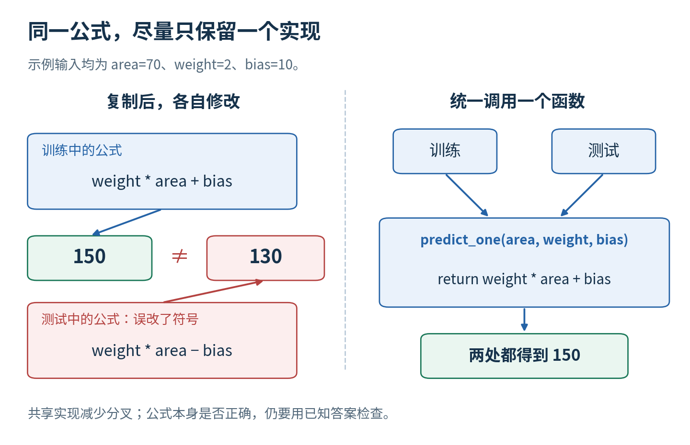
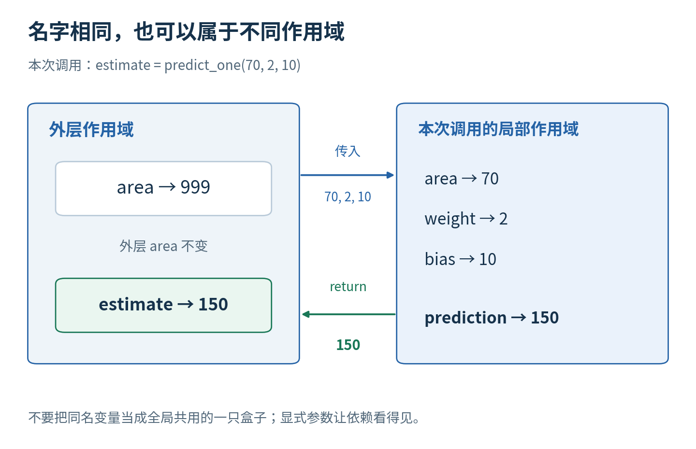
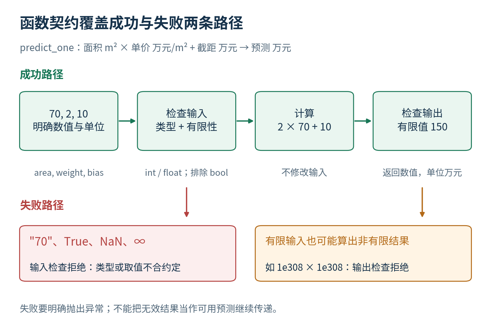
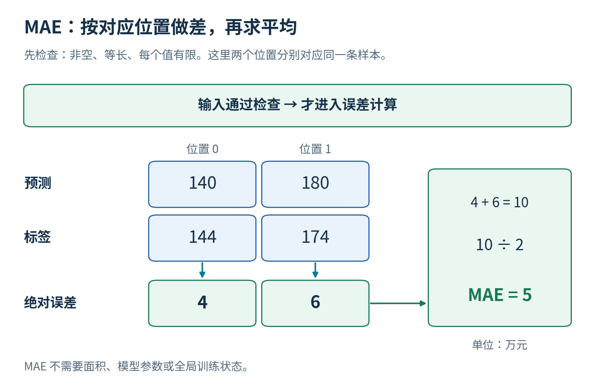
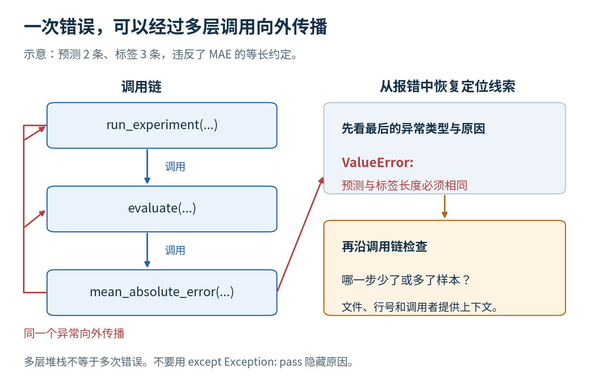
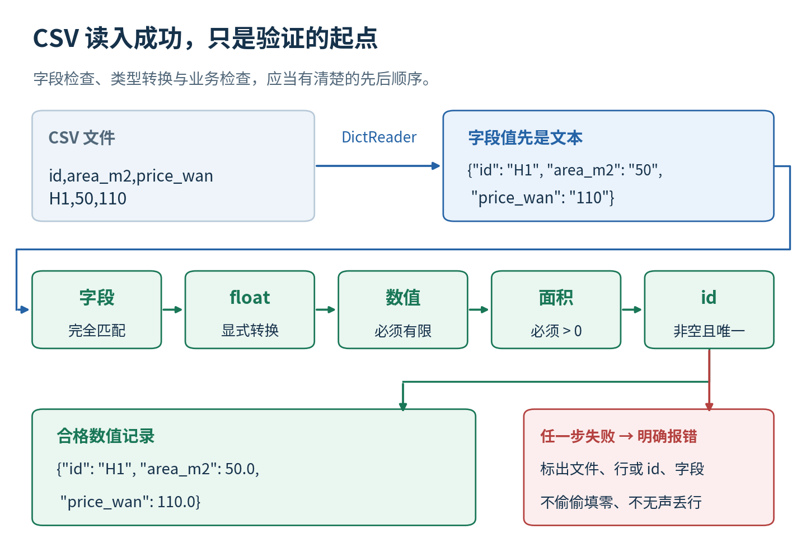
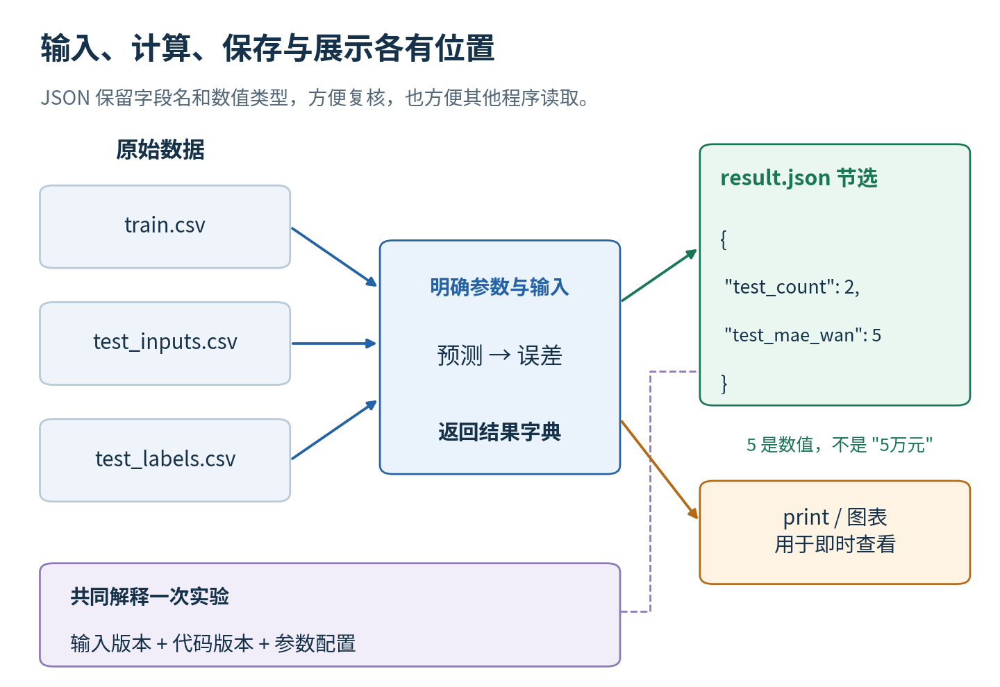
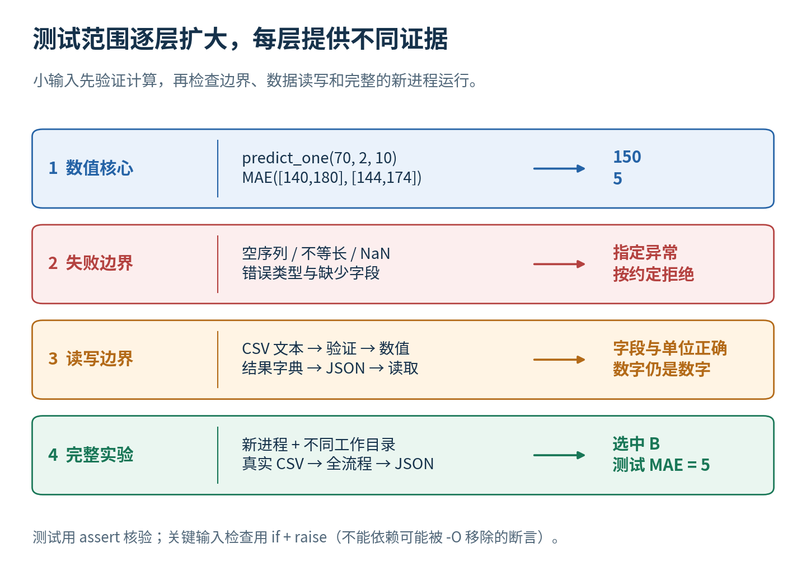

# 函数与可调试程序

第四讲 把一个实验拆成可检查的步骤

第三讲已经能用列表和循环选出 B 模型。但如果明天换一批数据，后天增加一种误差标准，复制过多的代码就容易失去一致性：训练时改了预测公式，测试时忘改；Notebook 里一个旧变量让程序偶然成功；脚本离开原来的工作目录就找不到数据。程序仍可能给出漂亮数字，却很难说清它究竟执行了哪个实验。

这一讲追问：怎样让预测、误差、读数据与实验组织各自有清楚的输入输出，出错时能够定位，而不是把失败藏起来？我们沿用同一组教学房屋，把第三讲的顺序程序逐步改为函数化实现。每个新工具都服务于一个具体故障，不要求你先学完整的软件工程体系。

直接先修是第 3 讲的变量、列表、索引、条件和循环。你会接触函数、局部作用域、字典、异常、路径、CSV、JSON 与最小测试。数学仍只用四则运算和 MAE。所有数据为手工合成，运行只需普通 CPU 与 Python 标准库；我们核验的是程序行为，不据此证明现实预测能力。

## 一 复制公式为什么会慢慢变成两个实验

假设你在训练部分写 prediction = weight * area + bias，又在测试部分复制同一行。后来你增加一个单位换算，只改了训练部分，测试部分仍沿用旧公式。两段代码的变量名很相似，读者也容易以为它们相同，实际预测行为已经分叉。

最直接的改进是把“给定面积与参数，返回预测”写在一个地方，其他地方调用它。Python 用 def 定义函数：

```python
def predict_one(area, weight, bias):
    prediction = weight * area + bias
    return prediction
```

def 后面是函数名字，括号里列出它需要的输入名字，行尾冒号引出缩进代码块。return 把结果交回调用处。定义这一段时，Python 建立了一个可调用对象，并没有自动拿 70 去预测。真正执行计算发生在调用时，例如 predict_one(70,2,10)。



输入名字 area、weight、bias 称为形参；调用时实际提供的 70、2、10 称为实参。第一次读这些术语，不必先背英文，先理解“函数定义写需要什么”“调用写这次具体给什么”。参数按位置对应：第一个给 area，第二个给 weight，第三个给 bias。

把相同公式放进一个函数不能自动保证它正确。若函数里把 + bias 错写成 - bias，训练和测试会一致地做错。因此函数解决的是组织与复用问题，正确性仍需已知答案、输入约定和测试来支撑。

### 把调用写清楚

位置参数简洁，但读者需要记住顺序。predict_one(area=70, weight=2, bias=10) 用关键字明确参数名，结果同样为 150。关键字调用不是创建了三个外部变量；这里的等号说明把哪一个实参交给哪一个形参。如果写错参数名，例如 wieght=2，Python 会报 TypeError，不会自动猜成 weight。

本讲不使用“记住上一次参数”的默认行为。predict_one(70,2) 缺少 bias，会报 TypeError；同一个参数既按位置传入又按名字传入，也会报 TypeError。函数签名是调用双方的接口，参数数量或名字改变可能影响所有调用处。

定义和调用还必须遵守执行顺序：先执行 def 那一段，让名字指向函数，再调用它。函数体里可以调用另一个函数，但真正运行到那次调用时，那个名字必须已经可用。本讲文件先写各种定义，最后才进入主流程；因此读者可以先了解各部件，再看它们如何组合。[1]

## 二 返回一个数与打印一个数不同

看看下面两个函数。第一个返回数值，第二个只把数值打印在屏幕上。

```python
def predict_return(area, weight, bias):
    return weight * area + bias

def predict_print(area, weight, bias):
    print(weight * area + bias)
```

执行 p = predict_return(70,2,10)，p 得到 150；执行 q = predict_print(70,2,10)，屏幕显示 150，但 q 得到 None。None 表示这里没有返回一个有意义的结果，它不是数字 0。一个函数没有明确 return 某个值时，会返回 None。[1]

为什么这区别重要？MAE 需要拿预测数值减去标签，再取绝对值。屏幕上的文字不能直接成为下一步计算的输入。如果只检查“刚才是不是显示了 150”，你会错过 q 实际没有数值的事实。


好的数值核心通常先返回结果，让外层决定是否打印、保存或画图。这样测试时不必从一段屏幕文字里猜数字，其他程序也能直接使用结果。这不是禁止 print，而是把“计算”和“呈现”分开，让它们各自可检查。

## 三 一次调用里面发生什么

调用 predict_one(70,2,10) 时，可以按四步理解：把实参交给本次调用的形参名字；执行函数体；遇到 return 时得到结果并结束这次调用；调用表达式被返回值替代，外层继续执行。若写 estimate = predict_one(70,2,10)，外层最后将 estimate 关联到 150。

函数体中定义的 prediction 是本次调用的局部名字。它通常不会自动变成外部同名变量。调用两次，输入不同，各自有各自的执行过程；不要把所有地方出现的 area 想成整个程序唯一的一只公共盒子。

```python
area = 999
estimate = predict_one(70, 2, 10)
print(area)
print(estimate)
```

外部 area 仍为 999，estimate 为 150。函数参数 area 在本次调用里关联 70，不会因为同名就改写外部那个名字。作用域描述某个名字在何处被查找、何处有效，是避免隐藏状态的关键概念。[1]



相反，如果预测函数不接收 weight，而偷偷读取外部 weight，行为就会随外部变量变化。第一次 weight 为 2，结果 150；另一个单元把 weight 改成 3，同样调用形式可能输出 220。函数表面输入没变，实际依赖却变了。这种隐藏全局依赖在 Notebook 中尤其难排查。

因此，本讲把影响计算的参数明确列在输入里。常量也可以写在配置中，但必须让读者知道来源，不要把“当前内核碰巧保存的值”当成可靠配置。后续随机实验还要控制随机生成器，这同样属于明确依赖的思想。

## 四 给函数写一份输入输出约定

只知道函数名字不够。predict_one 接收一个面积还是一整批面积？面积单位是什么？返回万元还是元？允许缺失值吗？如果不说明，调用者可能把一个列表或字符串传进去，而函数作者以为它总是浮点数。

我们先用自然语言写约定：area、weight、bias 是有限数值；area 以平方米表示，weight 以万元每平方米表示，bias 以万元表示；返回一个有限数值，单位为万元；不修改任何输入容器。实际房屋面积大于零这一业务约束，可以在读取该任务的数据时检查，而不必把所有数值预测函数都限制在某种房屋业务上。

这份约定称为契约。它包含前置条件、输出含义和失败时行为。前置条件不是希望读者猜对，而是程序需要主动检查的重要边界。例如 math.isfinite 可以区分正常有限数值与 NaN、正负无穷；后者进入平均误差时可能让结果失去意义。[4]



本讲采用严格而简单的类型边界：数值核心接受普通 int 或 float，但不把 True、False 当面积。为统一后面的浮点运算，完整实现还要求数值可以转换为有限 float；极大的 Python 整数虽然在数学上有限，仍可能超出这个实现的范围。虽然 bool 在 Python 的类型体系中与整数有关系，任务上布尔判断不应该悄悄作为面积 1 或 0。这个决定来自数据语义，不是“Python 不允许”。

契约也要写能力边界。我们没有保证任意巨大数值都能稳定计算：即使每个输入有限，乘积仍可能超过浮点范围。函数应在输出后再检查是否有限，必要时明确失败。把溢出后的无穷当成一个可用预测，通常比直接报错更危险。

## 五 把平均绝对误差变成独立函数

第三讲的累计过程可以写成 mean_absolute_error(predictions, labels)。它需要两个非空、等长的序列，位置对应同一样本；返回误差绝对值的平均，单位与标签相同。这里不需要知道房屋面积，也不需要知道模型参数。

```python
def mean_absolute_error(predictions, labels):
    if len(predictions) == 0:
        raise ValueError("至少需要一条预测")
    if len(predictions) != len(labels):
        raise ValueError("预测与标签长度必须相同")
    total = 0
    for index in range(len(predictions)):
        total = total + abs(predictions[index] - labels[index])
    return total / len(predictions)
```

这是便于初读的核心版本；配套完整代码还检查有限数值和计算结果。函数里的 raise 表示主动抛出一个错误；ValueError 用于表达“输入类型可以参与这个过程，但具体取值不满足要求”。错误信息说明哪个约定被违反，而不只是写一句“失败了”。[2]

当 predictions 为 [140,180]，labels 为 [144,174]，累计为 10，除以 2 得 5。单样本 [140] 与 [144] 得 4。空列表不能得到有定义的均值；两个不同长度列表不能被默默截成较短长度。先把这些行为说清楚，才能测试函数是否兑现约定。



这时你能单独检查 MAE，不必先运行完整训练。给它一个已知答案的小输入，若结果错，就集中检查损失函数；若它正确但整个实验错，再检查预测或数据配对。把程序拆开，价值就在于减少每次必须同时怀疑的部分。

### 从简化版本走到严格版本

上面的十行程序展示了 MAE 的计算骨架，并不是最终输入验证代码。完整版本先规定容器为 list 或 tuple。tuple 可以写成 (140,180)，像列表一样能用 len 与索引读取，但不能直接给某个位置重新赋值；本讲只用这一点，不需要深入元组操作。字符串虽然也有长度，却不应被当作数值序列。

完整实现把数值检查拆为 require_finite_number(value,name)。name 是出错时使用的字段说明，value 是要检查的值。函数先用 type(value) 判断普通 int 或 float，随后转换成 float，调用 math.isfinite，最后返回检查后的数值。因而下层不用重复写一整套规则，上层也得到如 label[1] must be finite 的具体位置。将这些检查交给公共函数不会减少检查次数，而是让约定只有一个清晰实现。

MAE 的累计也可能溢出。例如两个误差都为 $10^{308}$，数学平均仍为 $10^{308}$，但简单浮点累计可能先得到无穷。本讲的逐项求和实现会明确拒绝这次计算；它没有声称能稳定处理所有极端尺度。这个边界值得记录，而不是通过删掉有限性检查让程序“能跑”。后续数值计算课程会讨论尺度和更合适的算法。

## 六 字典让一条记录带着字段名

三个平行列表靠位置保持配对，一旦单独排序某一列就会出错。字典提供另一种表达：用字段名关联值。

```python
record = {"id": "H1", "area_m2": 50, "price_wan": 110}
print(record["area_m2"])
```

花括号中，每个键与值用冒号分隔，不同键值对用逗号分开。键 "area_m2" 表示这个值的含义，读取时用方括号写字段名。键不是列号，字典本身也不是二维表；多条记录可以放进一个列表，每个元素是一个字典。[1]

如果 record 中没有 "price_yuan"，直接读取它会触发 KeyError。这通常比默默返回零更适合暴露字段名写错或数据结构改变。get 方法允许提供默认值，但默认值应该有明确含义。对关键标签用 record.get("price_wan",0) 可能把缺字段误当成真实零价格，掩盖问题。


编号 id 仍然重要：它帮助把测试预测与标签对应起来，也帮助发现重复记录。字典不会因为两个记录 id 相同就自动知道这是重复导出、同一对象的新事件还是合法关系。数据语义仍需要第 2 讲的任务定义；程序可以按照约定拒绝本讲不允许的重复 id。

字典也是可变对象。如果把同一个字典在多个地方共享并修改，仍可能发生类似列表的隐藏变化。因此本讲的数值函数只读取输入，不在内部偷偷修改原始记录。需要转换数据时，返回一份清楚的新结果，让调用者决定是否保存。

## 七 先读懂错误 再决定是否捕获

错误信息通常包括调用路径、文件与行号、异常类型和简短说明。调用路径告诉你错误从哪里一路传来，最后几行通常最接近直接原因。不要只复制最后一个英文单词搜索，也不要因为看到很多行就认定发生了很多独立错误。

假设 run_experiment 调用 evaluate，evaluate 调用 mean_absolute_error，最后因为预测与标签长度不同抛出 ValueError。真正需要检查的是两列表怎样形成，以及哪一步丢失了样本。把错误信息写得明确，能让你迅速知道不是矩阵算法或显卡出了问题。



try 与 except 可以对预期的失败采取明确处理。例如读取用户指定文件时，FileNotFoundError 可以提醒检查路径后结束程序。捕获异常不是为了让流程不惜一切继续运行，而是为了让失败以可理解、可审查的方式结束或恢复。[2]

最危险的习惯是 except Exception: pass。它把各种错误都吞掉，程序可能继续使用半成品、空列表或旧结果。你最后看到一个数字，却不知道中间某个步骤已经失败。如果确实允许跳过一条坏记录，应事先规定理由、记录被跳过的编号与数量，并分析它是否改变研究对象；不是无声地丢掉它。

本讲故障实验故意触发索引、类型与路径问题。教学测试会捕获某个明确的预期异常，以确认检查存在。正式计算路径则不会把所有异常统统忽略。区分“为了验证某种错误应发生而捕获它”和“为了掩盖失败而吞掉它”，非常重要。

### 一段可读的异常处理

```python
try:
    predict_one("70", 2, 10)
except TypeError as error:
    print("已识别类型错误：", error)
```

try 缩进块是尝试执行的代码；except TypeError 只处理这一类错误。as error 把异常对象暂时绑定到 error，便于打印说明。如果该调用发生别的错误，例如函数名字拼错带来的 NameError，这段 except 不会吞掉它。完整程序中出现 raise ValueError("说明") from error，表示补充数据文件和字段上下文，同时保留原来那个错误作为原因，不是重新把它包装成成功。[2]

调试时先形成一个可以验证的解释。例如“面积仍是字符串”可以用 type 检查；“标签顺序变了”可以打印编号；“文件路径错了”可以检查目录与文件是否存在。一次只改变与解释有关的一处，再重跑最小输入。若同时改五处，即便程序恢复运行，也很难知道哪处修好了错误、哪处又改变了实验。

## 八 文件路径不等于屏幕所在位置

相对路径 data/train.csv 通常相对于当前工作目录解释。当前工作目录是进程启动时所在的位置，可以与脚本文件所在目录不同。如果你在仓库根目录运行 python units/004/experiment.py，直接 open("data/train.csv") 可能去根目录下找 data，而不是去 004 单元目录找。

pathlib 的 Path 用对象表示路径。本讲脚本用 `Path(__file__).resolve().parent` 得到脚本自身所在目录，再与 "data"、"train.csv" 组合。这样你从别的工作目录启动脚本，它仍能找到随脚本一起提供的数据。[3]


`__file__` 在普通脚本中表示当前代码文件路径，在普通 Notebook 单元里通常没有同样的定义。Notebook 不能机械复制脚本每一行；本讲 Notebook 会从同目录导入 experiment，让路径定义由模块文件确定，再调用公开函数。你需要保留实验文件与 data 文件夹的结构。

不要把自己电脑的绝对路径写进公共教程，比如某个用户桌面上的私人目录。它既不可移植，也可能暴露不必要的信息。默认路径从项目结构推导，用户指定的数据路径则通过参数明确传入；报告中可以记录输入文件的内容摘要，而不必公开私人完整路径。

### 模块和主入口

import experiment 会载入 experiment.py 中的定义，并让你用 experiment.predict_one 访问其中的函数。点号在这里表示从模块中取一个名字。导入时文件里的顶层代码会执行，所以不能随便把整次训练写在文件最外层，否则只想使用一个函数也会意外读写文件。

```python
if __name__ == "__main__":
    main()
```

Python 直接执行这个文件时，`__name__` 的值为 "`__main__`"，于是调用 main；作为模块导入时，名字通常为 "experiment"，这一段不启动实验。这让同一份函数能被终端、Notebook 和测试程序共同使用。main 中的 argparse 是标准库命令行参数工具：它读取 --data-dir 和 --output-dir，将用户给出的目录传给 run_experiment；不提供时用脚本旁边的默认目录。用 python experiment.py --help 可以查看选项，不需要背下参数解析器的全部写法。[7]

Path 的斜杠在这里用于组合路径，例如 root / "data" / "train.csv"，不是做数值除法。resolve 得到解析后的路径，parent 取父目录，name 只取文件名。脚本默认输入与脚本位置绑定；用户显式提供的相对目录，仍按当前工作目录解释。两种规则都要说清，不能笼统声称“所有相对路径都自动安全”。[3]

## 九 CSV 读取先得到文本 再按约定转换

CSV 是常见的表格交换格式，本讲文件第一行写字段名，每行是一条记录。Python 的 csv.DictReader 可以按字段名读出一行字典。但读出来的字段通常先是文本，例如 "50" 与 "110"，不会自动变成你期望的浮点数。

```python
with open(path, encoding="utf-8", newline="") as handle:
    rows = list(csv.DictReader(handle))
```

with 让文件使用结束后被关闭。encoding 明确文本编码，newline 配合 csv 模块处理换行。不要用简单的 line.split(",") 冒充通用 CSV 读取器，因为合法 CSV 字段可能包含逗号并用引号包住，手工拆分会破坏字段边界。[4]

接着检查字段是否正好符合本讲的数据模式：训练表需要 id、area_m2、price_wan；测试输入表需要 id、area_m2；测试标签表需要 id、price_wan。不同文件承担不同角色，不能拿标签表直接当预测输入。字段缺失、多出或拼写改变，应给出明确提示。



数值转换用 float，转换后检查是否有限；面积要求大于零；id 要非空并在本讲文件内唯一。若某行失败，错误信息应指出文件名、数据行或编号和字段。直接只说“could not convert string”虽然真实，却让定位成本很高。

数据清洗不应该悄悄改变任务。如果面积缺失，不能未经决定就填零；如果两个 id 重复，不能随便保留一条却不说明。第 6 讲会讨论缺失、合并与清洗，这里采取保守策略：先拒绝不满足已约定格式的数据，逼迫我们明确下一步处理。

### 编号对齐要早于求平均

测试输入顺序是 T1、T2，而标签文件可能是 T2、T1。如果直接按行配对，140 会错比 174，180 会错比 144，得到 MAE 35。两个列表等长，所有元素也都是数值，却已经换了问题。evaluate 先检查每个文件内部编号唯一，再建立 labels_by_id 字典，让编号指向对应标签，最后按照预测记录中的编号找答案。正确结果仍为 5。

集合 set 是这里使用的辅助工具：它保留不同的值、不保留重复次数。set(["T1","T2"]) 与 set(["T2","T1"]) 相等，适合比较两个文件是否含完全相同的一组编号；但是 set(["T1","T1"]) 只有一个成员，因此不能单靠集合替代重复编号检查。顺序无关的集合检查与逐行重复检查，各自解决不同问题。

本讲同时要求 CSV 表头按指定顺序精确出现。缺字段、多字段、重复字段和重新排序的表头都被拒绝，这是一份刻意严格、便于教学验收的格式约定。实际项目可以允许列重排，但需要明确写出规则并测试。内存中的字典按键查值，不要求字典键的排列顺序与表头一样。

## 十 把结果写成别人能读的记录

屏幕输出适合即时查看，但终端关闭后可能不方便重新核对。JSON 可以保存带字段名的结构，例如候选名称、参数、训练分数和测试 MAE。本讲将结果写到指定输出目录的 result.json，文本使用 UTF-8，缩进使人也能阅读。[5]

结果文件不是把所有东西混成一句话。数据来源、模型参数和评价指标各自有字段，别人的程序可以直接读取。数字仍保存为数字，不把所有数都变成带“万元”的字符串；单位通过字段名或说明记录，例如 test_mae_wan。



程序应明确是否覆盖已有结果。本讲使用用户指定的输出目录，正常重跑相同输入会更新结果；故障实验使用临时目录，与正式结果分开。真实研究中还应保留配置、数据与代码版本，第 7 讲会建立完整的最小复现包。

这里再提醒一次：程序成功写出 JSON 只说明输出过程完成，不说明内容在科学上可靠。某个样本被错误配对，照样可以把错的 MAE 保存得整齐美观。文件格式是证据载体，不能替代证据本身。

### 保存时再加一道边界

json.dumps(result,ensure_ascii=False,indent=2,allow_nan=False) 先把结果结构转换为文本。ensure_ascii=False 使中文保持可读，indent=2 给嵌套层级加缩进，allow_nan=False 禁止把 NaN 或无穷写成看似普通的结果。随后 write_text 用 UTF-8 写文件。读回时 json.loads 将文本还原成字典与列表；本讲测试比较读回结果与内存结果是否一致。[5]

结果还保存三个输入文件的文件名与 SHA-256 内容摘要。摘要是一段由文件字节计算出的标识：通常内容变一个字节，摘要就改变。它帮助核对是不是同一份输入，但不证明数据真实、不替代来源审查，也没有加密文件。[8]它比把某个人桌面的完整目录写入结果更可移植。未来版本若需要记录来源权限、代码提交和环境，也应另加明确字段。

## 十一 从小测试到完整实验

最小测试先不启动完整流程。检查 predict_one(70,2,10) 是否等于 150；检查 mean_absolute_error([140,180],[144,174]) 是否等于 5；检查只有一条样本时是否仍正确；再检查空输入、不等长输入、NaN 和错误类型是否被拒绝。

assert 可以表达一个调试期要求：条件不成立就报 AssertionError。它适合本课程直接核验已知答案，但 Python 的 -O 优化模式会去掉 assert，所以不能把关键输入验证只写成 assert。本讲函数使用明确的 if 与 raise 检查输入，Notebook 用 assert 检查已知答案；独立测试脚本采用同样明确的 if 与 raise，因此它自身的验收条件也不会被 -O 去掉。[2][6]



一个函数通过若干测试不等于数学上证明它对所有输入正确。测试只覆盖实际检查的例子与性质。我们还可以增加结构性检查，例如同样顺序同时重排预测与标签不应改变 MAE；把每个预测和标签都加同一个常数，绝对误差应不变。这些性质扩大了检查范围，但仍需结合算法推理。

整体验收则从一个新的终端进程启动脚本，在不同工作目录运行，读取真实 CSV 并写出 JSON。它检查的是模块组合、路径与输入输出是否一起工作。只有在 Notebook 历史状态里通过，却在新进程失败，就说明某个依赖没有被明确记录。

### 阅读独立测试脚本

配套 test_experiment.py 不借助复杂测试框架。check(name,actual,expected) 比较真实值与预期值，不同就 raise AssertionError；expect_error(name,error_type,function,arguments) 检查一次调用是否按约定失败。这里函数也能像数字一样作为实参传递：传 predict_one 不加括号，是把函数交给测试器；传 predict_one(70,2,10) 则已经先算出 150。

测试器内部的 function(*arguments) 把参数列表展开为各个位置参数。例如 arguments 为 [70,2,10] 时，它相当于 function(70,2,10)。这一个星号不是乘法，而是调用语法。try 后面的 else 只在没有异常时运行；因此预期应报错却没有报错，就在 else 中判定测试失败。未预期的异常不会被只匹配某一种类型的 except 捕获。

独立测试还用 tempfile.TemporaryDirectory 建一个运行结束后清理的临时目录，以免故障数据污染正式 CSV；用 subprocess 启动新的 Python 进程，检查不同工作目录下的命令行行为。无需先熟记这些工具的所有选项，你应先能解释“这个检查要防住什么”，再逐步读懂脚本怎样实现。[9]Notebook 的主要学习任务仍是亲手编写预测函数和 MAE，而不是只调用一个巨大测试器。

## 十二 故意制造三类错误

索引错误：对长度为 2 的列表读取位置 2。合法非负位置只有 0、1，因此会报 IndexError。修复不是把长度变量随便减一，而是检查循环范围是否应该包含右端，是否有样本被误删。

类型错误：把 "70" 当作已经是数值的面积传给严格预测函数。应拒绝该输入并说明需要数值。转换文本应发生在明确的读取边界，而不是预测函数内部对任何对象都尝试“猜着转成数”。这种责任划分让数据来源更容易追踪。

路径错误：给读取函数一个不存在的文件。应得到 FileNotFoundError 或包含该原因的清晰错误，不能退回上一次的缓存数据再继续，除非这种回退在实验设计里已明确批准并记录。本讲没有这种隐式回退。

每个故障都先写出预期失败方式，再运行。这让你检查的是“程序按约定拒绝错误”，而不是只学习怎么把红色信息消掉。程序在不满足条件时明确停止，往往比输出一个没有依据的数字更可靠。

## 十三 回到模型选择与独立评价

整理后的流程是：load_table 读训练记录，fit_candidates 只接收训练记录并返回选中参数；predict_one 对测试输入做预测；mean_absolute_error 最后比较预测和标签；run_experiment 负责按顺序调用并组织结果。各个函数需要的信息不同，也因此可以检查测试答案是否偷偷流入训练。

若训练函数的签名直接接受 train 与 test_labels，你需要问：为什么拟合训练参数需要测试标签？并非函数签名本身能提供形式化隐私保证，但它能暴露不必要的信息通道。尽量只传入当前步骤真正需要的数据，是可靠实验结构的一部分。

我们仍得到训练 MAE A 10、B 0、C 7.5，选中 B，测试 MAE 5，训练均值基线测试 MAE 15。重构没有改变任务、数据与算法时，已知输出应保持一致。若重构后性能突然大幅提高，第一反应应是查流程是否变了，而不是立即宣布有新方法。

基线也必须有明确来源：fit_mean_baseline 只求训练价格 [110,130,170,190] 的均值 150，再对两个测试样本输出同一个 150。当前数据下这和硬写 150 数字相同，但更换训练数据时含义不同。我们保留第三讲“用训练集拟合基线”的约定，不把重构偷偷变成另一个实验。测试答案改变可以改变评价分数，却不能改变选中的参数或训练均值基线。

模型分数相同时，本讲按候选列表顺序保留最早一个；这条规则事先写进函数约定，不能看完测试分数再决定怎样打破平局。训练与测试编号还要求不重叠。这不能独自证明没有泄漏，例如同一房屋被换了一个编号仍可能跨集合出现，但它是本教学数据下可执行的最小检查。

这一讲没有引入新的机器学习算法，却让同一算法更容易解释、复用和核验。研究中的许多改进首先来自把证据链做可靠，避免把错误归因于模型能力，或者把代码故障包装成新发现。

## 十四 练习与详解

### 练习一 返回值

函数体只有 print(x + 1)，执行 y = f(3) 时屏幕显示什么，y 是什么？解答：屏幕显示 4，y 为 None。若后续要计算 y - 4，必须让函数 return 数值，不能只依赖打印输出。

### 练习二 隐藏依赖

函数只接收 area，却读取外层 weight 与 bias。改变外层 weight 后，同样 area 的结果不同。问题在哪里？解答：函数行为依赖没有在参数中列出的状态。把影响计算的值明确传入，并对配置版本留下记录；不要把当时内核中的偶然值当作实验条件。

### 练习三 输入契约

MAE 函数收到两条预测与三条标签。有人建议只用前两条，避免报错。什么时候可以这样做？解答：只有任务明确规定选取哪两条且有理由时，才能在调用前做可追踪的筛选。损失函数不能自行丢弃一条标签，因为它不知道错配来自哪里。当前契约要求等长，应拒绝。

### 练习四 数据类型

CSV 中面积是 "70"，预测函数要求数值。应该在哪里转换？解答：在数据读取与验证步骤，明确把对应字段转换成数值，检查有限性和面积约束，再交给预测函数。让每个深层函数都随意转换，会掩盖字段或来源错误。

### 练习五 字典缺失字段

为什么关键标签不宜直接用 record.get("price_wan",0)？解答：缺少标签与真实价格为零是不同状态。默认零会让缺失记录变成看似有效的数据。应该检查字段存在，或按明确缺失处理方案标记与筛选，而不是偷偷改变标签。

### 练习六 路径推理

当前工作目录是课程根目录，脚本位于 units/004/experiment.py。open("data/train.csv") 默认指哪里？解答：课程根目录下的 data/train.csv。若要读取脚本同目录的 data，应从脚本文件的父目录构造路径。Notebook 的工作目录又需单独检查，不能盲目假定。

### 练习七 捕获异常

为什么 except Exception: pass 可能让错误更加难查？解答：它隐藏失败位置和原因，后续可能继续使用空值或旧状态。应只捕获预期异常，给出说明或采取事先定义的恢复，并保留失败证据。未预期错误通常应该明确暴露。

### 练习八 测试性质

预测 [1,4]、标签 [2,2] 的 MAE 是多少？给两边每个值都加 100 后呢？解答：绝对误差为 [1,2]，MAE 1.5；同时平移后差值保持不变，仍为 1.5。这是可用于检查实现的一条性质，不依赖房屋数据。

### 练习九 assert 与输入验证

为什么生产输入检查不能只用 assert？解答：优化模式可能移除断言。外部输入是否为空、形状是否符合、值是否有限等必要条件，应使用不会被该模式移除的明确判断与异常。测试程序仍可在普通模式用 assert 检查已知答案。

### 练习十 重构与结果变化

把顺序脚本拆成函数后，训练数据和候选都没变，但测试 MAE 从 5 变为 0。请按顺序列出最先检查的三件事。参考答案：检查测试标签是否进入拟合或预测；核对输入、标签与单位是否仍一一对应；对单个预测与 MAE 函数重跑已知答案，并比较重构前后的中间值。提高的分数不是正确性的证明。

### 练习十一 行顺序与样本身份

预测 T1=140、T2=180，标签文件按 T2=174、T1=144 排列。直接按行计算 MAE 会得到什么？按编号计算呢？解答：错误配对误差为 34、36，均值 35；正确配对误差为 4、6，均值 5。等长检查只约束数量，没有证明两个位置是同一个对象。

### 练习十二 测试没有报错算通过吗

你在测试空列表时只写 try: mean_absolute_error([],[])，然后捕获 ValueError 打印成功。如果实现错误地返回了 0，会发生什么？解答：它没有报错，也就不会进入 except；如果测试器没有在正常路径主动判失败，这次检查会悄悄漏过去。应添加 try 后的 else，抛出 AssertionError，明确要求该调用必须失败。

## 十五 验收与下一讲

完成验收时，你应能够独立写出预测函数与 MAE 函数，清楚说明参数、返回值和失败条件；从 CSV 得到有字段名的数值记录；故意触发并定位索引、类型和路径错误；从新进程重跑完整实验；最后解释为什么这些检查仍不替代数据代表性与科学评价。

下一讲把一条条数值放进数组，学习形状、轴、广播和向量化。代码可能更短、计算可能更快，但如果不知道每个轴对应什么，广播会制造一种新的“程序没报错但结果错了”。本讲的契约与最小测试会继续帮你对照循环实现和数组实现。

## 参考资料

[1] Python 官方教程 More Control Flow Tools 与 Data Structures，核对函数、参数、返回、作用域和字典。https://docs.python.org/3/tutorial/controlflow.html 与 https://docs.python.org/3/tutorial/datastructures.html

[2] Python 官方教程 Errors and Exceptions，核对异常、传播和处理。https://docs.python.org/3/tutorial/errors.html

[3] Python 官方文档 pathlib，核对路径组合与解析。https://docs.python.org/3/library/pathlib.html

[4] Python 官方文档 csv 与 math，分别核对带引号字段、文本读取及有限性检查。https://docs.python.org/3/library/csv.html 与 https://docs.python.org/3/library/math.html

[5] Python 官方文档 json，核对结构化结果序列化。https://docs.python.org/3/library/json.html

[6] Python 语言参考 Simple statements 中 assert 条目，核对优化模式可移除断言。https://docs.python.org/3/reference/simple_stmts.html#the-assert-statement

[7] Python 官方文档 `__main__` 与 argparse，核对主入口保护与命令行参数。[Python 模块主入口文档](https://docs.python.org/3/library/__main__.html) 与 https://docs.python.org/3/library/argparse.html

[8] Python 官方文档 hashlib，核对内容摘要。https://docs.python.org/3/library/hashlib.html

[9] Python 官方文档 tempfile 与 subprocess，核对临时目录与新进程测试。https://docs.python.org/3/library/tempfile.html 与 https://docs.python.org/3/library/subprocess.html

核验日期为 2026 年 10 月 4 日。教学示例与实现独立编写，使用官方文档检查语义；没有复制外部教材正文。
