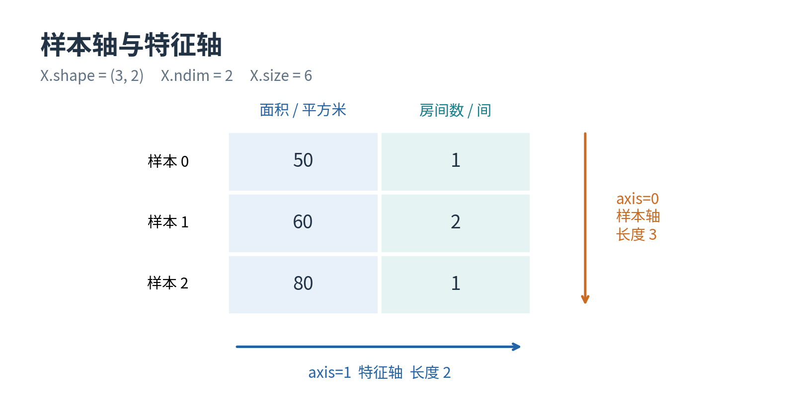
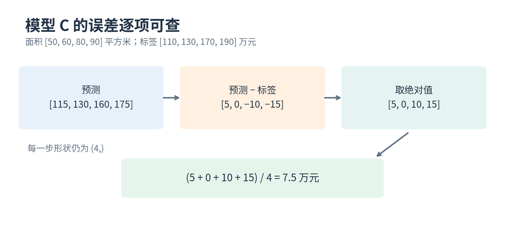
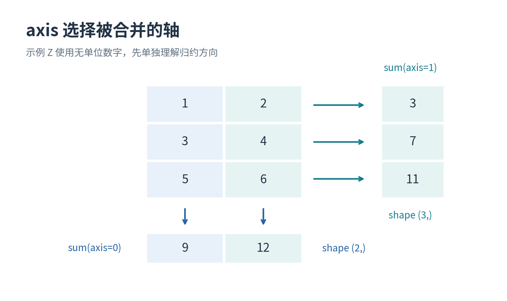
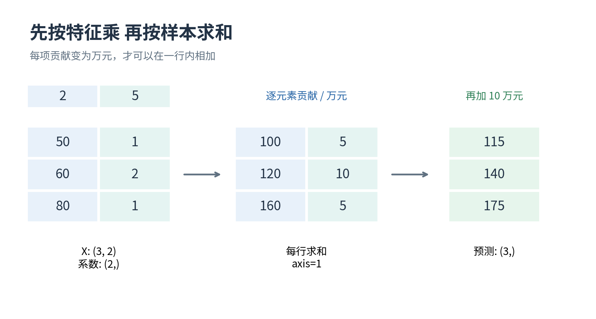
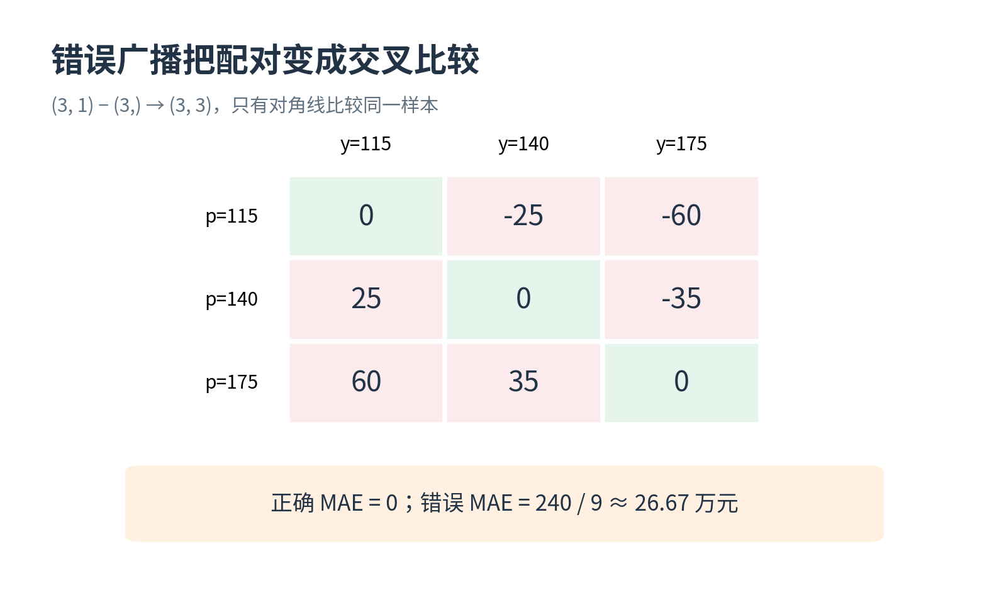
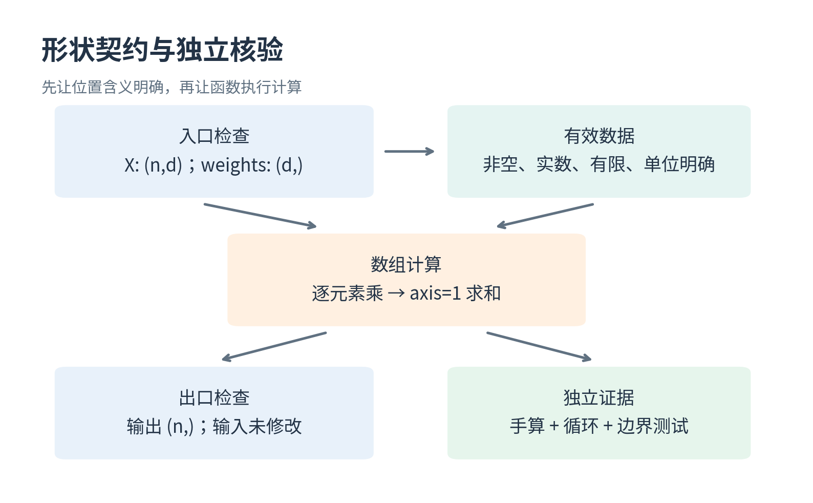
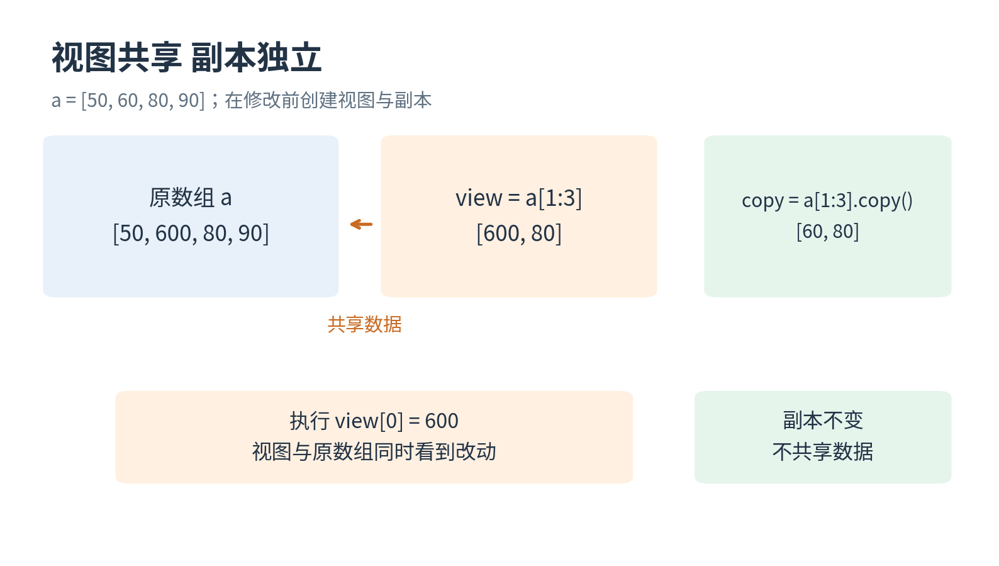
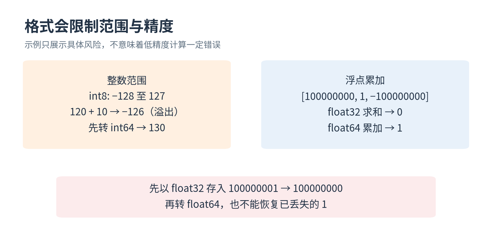
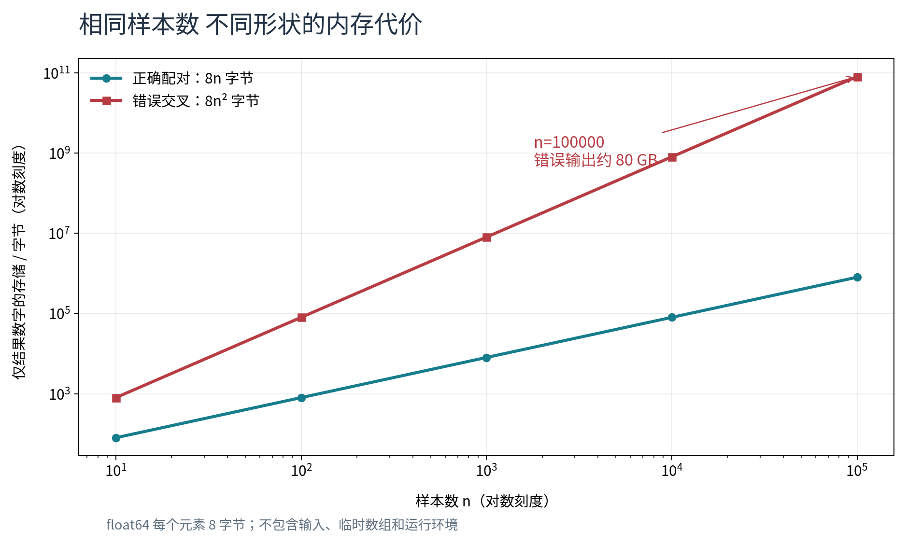

# NumPy 数组与数值计算

第五讲 怎样用数组表示一批样本 并确保向量化没有算错

第一讲用纸笔比较房价规则，第三讲把同样的运算写成 Python 循环，第四讲用函数和测试把程序拆成可检查的步骤。现在把样本数量增加到几千、几万，我们希望同一批数字能按统一规则计算，而不必在 Python 里逐个取出。这就是本讲引入 NumPy 的理由。代码会变短，也常会变快，但本讲真正要守住的是一句话：每个预测必须仍然对应原来的那个样本。

我们会把“一批面积”变成一维数组，把“每个样本有多个特征”变成二维数组，再把乘法、相减、取绝对值和求平均连接起来。你将学会在运算前写出预期形状，在运算后检查实际形状；遇到数值看似合理的结果，也能追问每个数究竟来自哪里。一个程序不报错，只能说明 NumPy 接受这种运算，不能说明它回答了你想问的问题。

本讲所有房屋数据都是合成教学数据，不含真实房源或个人资料。价格单位为万元，面积单位为平方米；新增的双特征数据只用于学习数组对应关系，系数由我们事先指定，不来自拟合。这里不会提前使用矩阵乘法、向量空间或线性代数定理。第九、十讲会给这些运算更多数学解释；本讲只需要四则运算、平均数、列表、循环和第四讲的函数输入输出观念。

## 一 开始前把旧问题重新摆好

我们先保留同一张四行训练表。每行代表一套房，两个列表相同位置的数属于同一个样本：面积依次是 50、60、80、90，价格依次是 110、130、170、190。模型 A 使用 $2x$，模型 B 使用 $2x+10$，模型 C 使用 $1.5x+40$。其中 $x$ 表示一套房的面积，乘数是每平方米对应的万元数，最后加的数是万元。

对面积 50 的房屋，A、B、C 的预测分别是 100、110、115 万元。与标签 110 万元相比，绝对误差分别为 10、0、5 万元。对四行都这样计算，再把误差加起来除以 4，得到三个平均绝对误差 10、0、7.5 万元。平均绝对误差简称 MAE，它仍然保持价格的单位。我们的目标是让数组版本重现这些逐行结果，而不只是碰巧重现最后的平均数。

这里约定 $n$ 表示样本个数，$d$ 表示每个样本的特征个数。四套房的单特征例子有 $n=4$。稍后新建三套房、每套两个特征的例子，则有 $n=3$、$d=2$。字母只是数目的名字，不是需要背诵的神秘符号。程序索引从 0 开始，所以第一个样本的索引为 0，第四个样本的索引为 3；文字里说“第一行”时，程序通常写 `[0]`。

“位置相同就属于同一个样本”是本讲最重要的数据约定。假如把面积排序，却没有用同样次序排列标签，数组形状完全不变，代码也可能正常运行，结果却已经失去意义。形状检查可以发现很多错误，但不能自动恢复丢掉的样本身份。真实数据通常还要保留样本编号和数据字典；本讲用固定顺序的小表，让每个对应关系都可用眼睛核对。

你应当已经会读 `for value in values`、`def`、`return` 和 `raise ValueError`。若还分不清“打印结果”和“返回结果”，先回到第四讲的函数实验。NumPy 并不会让这些基础失效；它是在函数内部提供另一种表示数字和执行运算的方法。第一次学习时，可以把这讲拆成两次：先完成数组、索引和归约，再完成广播、复制、精度与验收。每次都应亲手运行，而不是只看输出图片。

## 二 列表和数组为什么不是同一件事

NumPy 是用于数值计算的 Python 库。库可以先理解为“已经写好、可以导入使用的一组工具”。本讲统一使用 `import numpy as np`：`numpy` 是库名，`np` 是我们在当前文件里给它的短名字。这个惯用缩写没有额外数学含义。看到 `np.array`，就知道调用的是 NumPy 提供的数组构造工具。[1]

```python
import numpy as np

area_list = [50, 60, 80, 90]
area = np.array(area_list, dtype=np.float64)
print(area)
print(area.shape, area.ndim, area.size, area.dtype)
```

这段代码把列表中的数字放入一个 NumPy 数组，输出四个浮点数。`dtype=np.float64` 指定数字按 64 位浮点格式保存。此刻只需知道它适合本讲的小数运算；位数和精度的关系在后面解释。`array` 不是把面积“变成模型”，也没有学习任何参数，它仅仅改变了数字的容器和运算规则。

先比较两个容易混淆的表达式。Python 列表 `[50, 60] * 2` 的结果是 `[50, 60, 50, 60]`，它重复列表内容；NumPy 数组 `np.array([50, 60]) * 2` 的结果是 `[100, 120]`，它把每个位置的值乘以 2。列表相加主要用于拼接，形状匹配的数值数组相加则逐位置加数。因此，把列表代码中的名字换成数组之后，必须重新理解表达式，不应假定所有操作含义都没变。

数组常用于同一种数值类型的大批数据。普通列表可以同时放数字、文字和其他列表，灵活性很高；本讲的数值数组则要求每个元素使用同一种数据类型。把字符串“未知”和面积数字混放，不会神奇地得到一种既可靠又可计算的面积表示。遇到未知值，应先制定数据处理规则，不能靠数组构造时的自动转换代替判断。下一讲会专门处理原始表格中的缺失与清洗问题。

数组还要求规则的形状。三行、每行两个特征可以形成 `(3, 2)` 的二维数组；第一行两个数、第二行三个数则不是本讲需要的规则数值表。不要用特殊对象类型强行把不规则列表塞进去，再期待它像普通二维数值数组一样运算。规则形状带来的好处是：程序能用同一套定位和运算规则处理每个位置。

“向量化”在本讲指的是用整批数组运算表达工作，例如 `2 * area + 10`，而不是在 Python 源码中逐个写出或遍历每个面积。它不表示计算机真的一次完成了所有乘法，也不表示必然使用显卡。NumPy 的常规数组计算发生在 CPU 上，内部仍要处理每个元素，只是许多重复工作交给了更低层的实现。先确认算的是同一件事，再比较速度，这个顺序不能反过来。

## 三 形状是数组的地址地图

数组的 `shape` 描述每一条轴有多长，`ndim` 描述有几条轴，`size` 描述一共有多少个元素。面积数组的形状是 `(4,)`，意思是只有一条轴，这条轴有 4 个位置。末尾的逗号来自 Python 单元素元组的写法，它不是遗漏了一列。`ndim` 为 1，`size` 为 4。不要把 `(4,)` 读成“四行一列”，因为四行一列的数组形状应写成 `(4, 1)`。

为了练习多个特征，我们另建一张合成小表。三个样本的特征依次为“面积”和“房间数”：第一行 `[50, 1]`，第二行 `[60, 2]`，第三行 `[80, 1]`。我们用大写 `X` 给整张特征表命名，只是一种便于阅读的习惯。它有三行、两列，形状为 `(3, 2)`，共有 6 个元素，`ndim` 为 2。

```python
X = np.array([[50.0, 1.0],
              [60.0, 2.0],
              [80.0, 1.0]])
print(X.shape)  # (3, 2)
print(X.ndim)   # 2
print(X.size)   # 6
```



我们为这张表约定：轴 0 负责样本位置，轴 1 负责特征位置。沿着轴 0 改变索引，就是从第一套房走向第二、第三套房；沿着轴 1 改变索引，就是在同一套房内从面积走向房间数。轴的数字从 0 开始，但它们的含义来自数据约定，NumPy 不认识“房屋”或“房间”。换一类任务，同样的轴号可能表示时间或颜色。

这里有一个初学者常问的问题：一套房有两个特征，为什么整张表叫二维数组，而不是每套房都叫二维数组？“数组有几条轴”和“样本有几个特征”是不同概念。我们用一条轴定位样本，用另一条轴定位特征，所以表的轴数是 2；特征数则是第二条轴的长度，本例为 2。以后即使有 100 个特征，这张按行放样本的表仍然是二维数组，形状可能是 `(3, 100)`。

数组不会保存每一列的物理单位。`X.dtype` 可以告诉我们所有数按浮点格式保存，却不能告诉我们第一列是平方米、第二列是房间数。必须在数据字典、变量名或注释里保留这些信息。没有单位说明，把面积和房间数直接相加虽然在算术上可执行，在任务上却没有清楚意义。后面需要的加权和，会先用带单位的系数把每列贡献变成万元，再相加。

形状还帮助我们发现方向放反的表。三行两个特征是 `(3, 2)`；若输入成两行三个数，得到 `(2, 3)`，它表示两个样本、每个样本三个特征，不会因为数值集合一样就等价。测试故意使用非方阵，也就是行数不等于列数的表，能够让这类错误更容易暴露。若一开始只测试 `(2, 2)`，把两个轴弄反之后形状仍是 `(2, 2)`，错误会更隐蔽。

## 四 索引和切片会改变哪些轴

二维数组用逗号分隔不同轴的索引。`X[1, 0]` 表示先定位索引为 1 的样本，再取索引为 0 的特征，因此得到第二套房的面积 60。`X[0, 1]` 则得到第一套房的房间数 1。索引使用的位置不能随意交换；`X[0, 1]` 和 `X[1, 0]` 都存在，却代表不同数据。

冒号表示一个范围。`X[:, 0]` 中第一个冒号表示取全部样本，第二个位置的 0 表示只取面积特征，得到 `[50, 60, 80]`，形状是 `(3,)`。`X[0, :]` 取第一个样本的全部特征，得到 `[50, 1]`，形状是 `(2,)`。这两个结果都是一维，但一个沿样本排列面积，另一个沿特征排列同一套房的信息。形状相同不等于语义相同。

切片的右端不包含在内。`X[0:2, :]` 取索引为 0 和 1 的两行，不包含索引为 2 的第三行；`X[:, 0:1]` 只取索引为 0 的一列，不包含第 1 列。尤其注意，整数索引选走某一条轴上的单个位置，通常使那条轴消失；范围切片则保留那条轴，即使范围内只有一个位置。

```python
print(X[0].shape)      # (2,)
print(X[0:1].shape)    # (1, 2)
print(X[:, 0].shape)   # (3,)
print(X[:, 0:1].shape) # (3, 1)
```

![图 2 取出相同数字不一定保留相同结构。X[0] 是一个样本的特征序列，X[0:1] 仍是一批样本，只是这批恰好只有一行。](figures/02_slicing.png)

为什么要在意一行是 `(2,)` 还是 `(1, 2)`？假设预测函数的约定是“输入一批样本，每行两个特征”。它应当同时处理三套房和一套房，但都保持二维表结构。传入 `X[0:1]`，函数看到一个样本、两个特征；传入 `X[0]`，函数只看到一条长度为 2 的轴，无法仅凭形状判断这是两个单特征样本，还是一个双特征样本。明确拒绝模糊输入，比随便猜测更可靠。

`reshape` 可以在元素总数不变时重新组织形状。例如长度为 3 的预测数组 `p` 可以用 `p.reshape(3, 1)` 变成三行一列，也可以用 `p.reshape(1, 3)` 变成一行三列。这两个形状都含 3 个数，但在广播中会产生不同结果。`reshape` 不会创造额外样本，不会知道你究竟想增加哪种轴。把不匹配的数据强行改到“能运行”的形状，是危险的修补方式。

本讲还会使用 `p[:, None]`。`None` 在这个索引位置表示增加一条长度为 1 的新轴，因此把 `(3,)` 改成 `(3, 1)`；`p[None, :]` 则得到 `(1, 3)`。这是一种简洁写法，不要求现在记住所有组合。你应先能画出目标形状，再选写法。后面为了展示一个典型错误，我们会故意增加不该增加的轴，看看程序如何“顺利”算出错误答案。

还可以用条件筛选样本，例如 `mask = X[:, 0] >= 60` 得到三个布尔值，表示每个样本是否符合面积要求。`X[mask]` 保留符合条件的行。在同时有标签时，同一张 `mask` 必须应用于标签；只筛特征、不筛标签会破坏配对。筛选返回的新数组与基本切片的共享关系不同，这一点放到第十节细讲。现在先把每次操作的输入形状、输出形状与样本顺序写在旁边。

## 五 逐元素运算把一行手算扩展到一批

对单特征面积数组 `area`，`2.0 * area + 10.0` 给每个位置应用同一条规则。它产生 `[110, 130, 170, 190]`，形状仍然是 `(4,)`。可以逐项展开：第 0 个结果由第 0 个面积计算，第 1 个结果由第 1 个面积计算，依此类推。把它叫作逐元素运算，强调的就是位置对应关系。

```python
area = np.array([50.0, 60.0, 80.0, 90.0])
target = np.array([110.0, 130.0, 170.0, 190.0])
prediction = 1.5 * area + 40.0
signed_error = prediction - target
absolute_error = np.abs(signed_error)
mae = absolute_error.mean()
print(prediction, signed_error, absolute_error, mae)
```

模型 C 的预测为 `[115, 130, 160, 175]`；带符号误差为 `[5, 0, -10, -15]`；绝对误差为 `[5, 0, 10, 15]`；最后平均为 7.5。每个中间结果都有解释。我们把“预测减标签”约定为带符号误差，因此负数代表预测偏低。换成“标签减预测”会反转符号，但绝对误差不变。需要在整个程序中保持约定一致。



`np.abs` 表示逐元素取绝对值。数组中的减号、乘号、除号通常也逐元素工作；两个同形状数组相乘，不会自动进行以后要学的矩阵乘法。例如 `[2, 3]` 与 `[4, 5]` 对应相乘得到 `[8, 15]`。初学时不要因为数据排成二维表，就把星号解释成一种没有学过的数学运算。

数组比较也是逐元素的。`absolute_error <= 10` 得到 `[True, True, True, False]`。这表示四套房中前三套误差不超过 10 万元，最后一套不符合。若问“是不是每个样本都通过”，使用 `(absolute_error <= 10).all()`；若问“至少有一个样本通过吗”，使用 `.any()`。直接写 `if absolute_error <= 10`，相当于把四个真假值塞进一个只需要一个真假的位置，问题并不明确。

若用循环核验，就应比较每个位置，而不只比较 MAE。两个不同误差列表 `[0, 20]` 和 `[10, 10]` 的平均数都等于 10；仅仅断言最终均值相等，无法证明每个样本都算对。本讲脚本会先检查预测形状一致，再逐项使用容差比较，最后核对 MAE。测试的顺序反映了依赖关系：分数可信的前提是预测可信，而预测可信的前提是输入配对和单位可信。

另一个不能跳过的步骤是检查结果有没有无效数值。`np.nan` 可以表示无法得到普通数值的结果，`np.inf` 表示正无穷；它们并不是你希望输出给房价任务的合理价格。`np.isfinite(array)` 为每个元素检查是否有限，再用 `.all()` 汇总。本讲函数遇到非有限输入就报错，避免把异常数据继续压缩成一个无法解释的平均数。具体缺失值处理策略留给下一讲。

## 六 归约是在问哪些位置要被合并

求和、平均数、最大值这类运算会把多个数字合并为更少的数字，常称为归约。对一维绝对误差数组求平均，所有样本被合并成一个数，结果不再拥有样本轴。对二维数组求平均或求和时，可以指定要合并哪条轴；这就是 `axis` 参数要解决的问题。[2]

为了先把算术看清，我们临时用无单位的小数组 `Z = [[1, 2], [3, 4], [5, 6]]`。`Z.sum(axis=0)` 固定每个特征位置，沿三个样本相加，得到 `[1+3+5, 2+4+6]`，即 `[9, 12]`，形状为 `(2,)`。`Z.sum(axis=1)` 固定每个样本，沿两个特征位置相加，得到 `[1+2, 3+4, 5+6]`，即 `[3, 7, 11]`，形状为 `(3,)`。



一句容易记住、也容易误用的口诀是“0 按列，1 按行”。更稳妥的解释是：`axis` 指的是被归约掉的轴，而不是输出沿哪边排列。`axis=0` 消去了样本轴，所以留下特征轴；`axis=1` 消去了特征轴，所以留下样本轴。这样理解，面对三维数组时才有扩展空间。本讲暂时不做三维计算，但不要依靠与二维画法绑定的口诀代替理解。

不写 `axis` 的 `Z.mean()` 会把全部 6 个数合并求平均，得到 3.5。若你想得到每列平均值 `[3, 4]`，却写成没有轴参数的均值，代码也不会报错。由此可见，“归约到一个分数”是很有破坏力的一步：它丢掉了很多位置信息。调试时先打印归约前的数组，常比盯着最终的一个小数有效。

`keepdims=True` 的含义是保留被归约轴的位置，但把它的长度变成 1。`Z.mean(axis=0, keepdims=True)` 得到形状 `(1, 2)`，`Z.mean(axis=1, keepdims=True)` 得到形状 `(3, 1)`。数字没有因此增加新的含义，保留轴只是为了后续能明确按哪条轴广播。例如从每行扣掉本行均值时，保留 `(3, 1)` 可以让每个样本的均值覆盖该样本的两个特征位置。

这并不意味着所有列都适合做均值或相加。面积列取均值仍是平方米，房间数列取均值表示每套房平均房间数；把同一行的平方米数与房间数直接相加，没有自然物理解释。`X.sum(axis=1)` 在测试中可以用于验证轴行为，但不能拿它当作有意义的房屋特征总量。工具能执行一种数值操作，任务是否需要它仍然由人决定。

归约还隐含样本数量要求。空数组没有可供计算的普通平均数；对它调用 `mean()` 可能给出警告和 `nan`。本讲的 MAE 函数要求至少一个样本，遇到空输入就主动报错。单个样本则完全合理，例如预测 140、标签 144，MAE 就是 4，而不是因为“样本太少”就无法计算。能计算这个分数与能凭一个样本评估现实效果，是两个不同判断。

## 七 广播让一个系数服务多个位置

前面 `2.0 * area` 已经使用了广播：一个数与四个数相乘时，NumPy 按规则让这个数作用到四个位置。广播不是“自动猜出正确意思”，而是一套形状兼容规则。对本讲长度都大于零的轴，可以这样判断：把两个形状右对齐，从最右边向左逐个比较；相应长度相等，或者其中一个等于 1，就兼容；缺少的左侧轴在比较时视为长度 1。兼容的轴取较大的长度作为结果长度。[3]

我们不靠抽象规则死记硬背，先看它如何服务双特征预测。假设面积每平方米贡献 2 万元，每个房间贡献 5 万元，再统一加 10 万元。系数数组 `weights = [2.0, 5.0]` 的形状为 `(2,)`。与 `X` 的 `(3, 2)` 右对齐后，最后一轴的长度都是 2；左侧缺少的轴当作 1，可以扩展到 3。于是 `X * weights` 的结果形状是 `(3, 2)`。

```python
weights = np.array([2.0, 5.0])
contribution = X * weights
prediction = contribution.sum(axis=1) + 10.0
print(contribution)
print(prediction)
```

第一行贡献为 `[50*2, 1*5]`，即 `[100, 5]`；第二行为 `[120, 10]`；第三行为 `[160, 5]`。同一行的两个贡献都已换算为万元，沿特征轴求和就有意义，得到 `[105, 130, 165]` 万元；再统一加 10 万元，预测为 `[115, 140, 175]` 万元。这一整套计算只使用逐元素乘法和求和，并不需要先会矩阵乘法。



请先手算第二个样本，而不是只读代码：面积 60 平方米乘以 2 万元每平方米得到 120 万元；两个房间乘以 5 万元每间得到 10 万元；加上 10 万元偏置，合计 140 万元。房间数、面积、系数的单位各有角色。这里的规则是人为指定的教学规则，不能解释成“多一间房必然使真实房价增加 5 万元”，更不能拿它当作因果结论。

广播扩展只是一种计算上的对应方式，通常不需要先把系数真正复制成三份再计算。因此我们不必为了匹配形状而使用 `tile` 把 `[2, 5]` 手动重复成三行。不过，最终的逐元素结果 `contribution` 本身有 6 个数，通常仍需要相应的存储。广播避免不必要地复制输入，不等于所有中间结果都不占内存。这一区别在批量很大时尤其重要。

现在换一个问题：给每个样本加不同的修正量，例如 `[1, 2, 3]` 万元，并希望同一行的两个特征都加上对应修正。`X + np.array([1, 2, 3])` 不兼容，因为最右轴长度 2 与 3 不相等，也没有一个等于 1。若这个操作确实有任务意义，需要把修正量明确写成 `(3, 1)`，如 `offset[:, None]`，使每行的一个数沿特征轴扩展。这个例子只解释形状机制；对混合单位的原始 `X` 同时加万元不合理，应当在同单位贡献数组上操作。

因此，有两层判断必须分开：第一层问“这些形状能否广播”，第二层问“这种配对和单位是否符合任务”。第一层由库决定，第二层由你决定。遇到报错时，先写明想逐样本操作还是逐特征操作，再调整形状。不要把 `reshape`、转置、加 `None` 当作轮流试一遍直到不报错的修理按钮。

## 八 最危险的错误往往可以正常运行

考虑完美预测 `p = [115, 140, 175]` 和相同标签 `y = [115, 140, 175]`。它们都应有形状 `(3,)`，逐项相减得到 `[0, 0, 0]`，MAE 为 0。现在假设某一步把预测改成了三行一列，也就是 `(3, 1)`，而标签仍是 `(3,)`。看上去都装着三个数，似乎只是显示方向不同；真正相减时却会生成 `(3, 3)`。

```python
p = np.array([115.0, 140.0, 175.0])
y = p.copy()
wrong = p[:, None] - y
print(wrong.shape)  # (3, 3)
print(wrong)
print(np.abs(wrong).mean())  # 26.666666666666668
```

原因完全符合广播规则。`(3, 1)` 和 `(3,)` 右对齐时，后一形状视作 `(1, 3)`；右轴的 1 扩成 3，左轴的 1 也扩成 3。结果的第 0 行不是第一个样本的一个误差，而是预测 115 分别减掉全部三个标签，得到 `[0, -25, -60]`；第 1 行得到 `[25, 0, -35]`；第 2 行得到 `[60, 35, 0]`。



九个绝对差加起来为 240，除以 9 得到约 26.67 万元。这个分数看似是一个合理的 MAE，但它回答的已经是另一个问题。模型本来完美预测了每个样本，我们却在计算所有预测与所有标签的两两差异。错误的根源发生在相减时，最后的 `mean()` 只是把证据压缩成一个数字。若只盯着最终均值，就很容易误判模型退步。

修复应从函数边界开始：如果接口约定每个样本输出一个数，那么预测和标签都必须是一维、非空、同形状数组。任何一方多出轴，都应先解释其来源，而不是自动压平所有输入。`reshape(-1)` 确实能把 `(3, 1)` 变回 `(3,)`，但也可能把真正的 `(3, 2)` 多输出数据压成 6 个元素，隐藏更严重的接口错误。本讲的评分函数直接拒绝不符合约定的输入。

还有一种更隐蔽的情况：当 $n=1$ 时，错误广播 `(1, 1) - (1,)` 仍然只产生一个数值，均值甚至正确。因此“单样本测试通过”不足以发现广播错误。反过来，仅测试多个样本也可能漏掉整数索引丢轴的问题。我们需要一组彼此补充的测试：多个样本且特征数不同、单样本、单特征、不合法形状。每个测试负责暴露不同类别的问题。

`np.allclose` 本身也支持广播。[6] 这意味着直接写 `np.allclose(actual, expected)` 仍然不能代替形状检查。例如某些全相同数值在扩展后也能被判为接近。可靠的比较分两步：先断言 `actual.shape == expected.shape`，再比较数值容差。数组版本与循环版本得到相近数字，是一项证据；没有意外轴、没有换错样本、单位相同，也都需要各自的证据。

## 九 形状契约让函数拒绝含糊输入

“契约”在这里就是函数明确写出的约定，不是新的编程语法。对于双特征预测，可以约定输入 `X` 的形状为 `(n, d)`，系数 `weights` 的形状为 `(d,)`，偏置 `bias` 是单个数，输出形状为 `(n,)`。并约定 $n>0$、$d>0$，输入必须是有限实数，函数不修改调用者的数据。写出这些话之后，才知道哪些检查应放在入口，哪些应放在出口。

```python
def predict_weighted(X, weights, bias):
    X = np.asarray(X, dtype=np.float64)
    weights = np.asarray(weights, dtype=np.float64)
    if X.ndim != 2:
        raise ValueError("X must have shape (n, d)")
    if X.shape[0] == 0 or X.shape[1] == 0:
        raise ValueError("X must be non-empty")
    if weights.ndim != 1 or weights.shape != (X.shape[1],):
        raise ValueError("weights must have shape (d,)")
    result = (X * weights).sum(axis=1) + bias
    assert result.shape == (X.shape[0],)
    return result
```

上面是聚焦形状的教学简版。随附 `experiment.py` 的完整版本还拒绝字符串、布尔值、复数、非有限数和非标量偏置，对普通列表或元组会在转换前逐层检查，拒绝夹在数字中的布尔值；对已经构造好的 ndarray 只能检查当前 dtype，无法恢复它过去是否由布尔或文字转换而来。这些要求并不是所有预测软件唯一允许的设计，而是本讲明确选择的接口。比如有些工具会接受单个样本的一维输入并自动补轴；那也可以，但必须把行为记录清楚，并增加相应测试。本讲宁愿让使用者明确补轴，以减少猜测。

`np.asarray` 的意思是把输入解释成数组；输入已经是合适数组时，它可能直接返回原数组，而不是一定复制。[8]此处函数只读取 `X`，所以不修改原数据就足够。如果后面要原地修改输入，就必须额外考虑复制。这一问题不能因为函数写了一个新变量名而忽略，下一节会用实际修改演示。

输入错误应使用清楚的异常报告。`ValueError` 表示给定的值或形状不符合约定；调用者看到错误后能修正输入。代码里用于核验自身逻辑的 `assert` 则是开发检查。例如“结果应有每个样本一个输出”可以在计算后断言。但 Python 在某些优化运行方式下会关闭断言，因此不要把公开函数最必要的输入验证全交给 `assert`。入口用明确条件和异常，内部测试再使用断言，职责更清楚。

完整实验还保留一个朴素的双层循环版本。外层循环依次取每个样本，内层循环依次取每个特征，把“特征值乘系数”累加，再加偏置。数组版本应与它逐项一致。循环并不因为慢一点就没有价值；在小规模测试中，它把对应关系写得很直白，常是很好的参考实现。不过参考实现也可能有错，所以还需要 `[115, 140, 175]` 这样的手算已知答案。



一个完整的最小测试集合应包含：三样本两特征的正常输入、保留二维结构的单样本、三样本单特征、特征数与系数长度不一致、空样本集、含无效值的输入、列状预测误传给评分函数。成功测试既包含“应该算对”，也包含“应该明确拒绝”。如果所有测试都只是正常数据，函数最容易被误用的边界仍然没有防护。

## 十 视图与复制决定改动会传到哪里

取出一部分数组，看起来像得到了一份小数据，但未必拥有独立的底层存储。基本切片常返回视图：新数组对象描述原有存储中的一部分位置。通过视图修改其中一个值，也会修改原数组对应的位置。显式调用 `.copy()` 则会复制数据，之后修改副本不会改变原数组。[4]

```python
a = np.array([50.0, 60.0, 80.0, 90.0])
view = a[1:3]
copy = a[1:3].copy()
view[0] = 600.0
print(a)     # [50. 600. 80. 90.]
print(copy)  # [60. 80.]
```

这里 `view[0]` 指向原数组 `a[1]` 的位置，所以把视图中的第一个数改成 600，原数组第二个数也变成 600。`copy` 则保留复制时的 60 和 80。变量名叫 `subset`、`train` 或 `safe_data` 都不会自动改变这个事实；名字表达意图，是否共享内存由具体操作决定。



还要区分 `b = a`。这不是复制，也不只是“恰好共享一部分内存”的新视图，而是让另一个名字指向同一个数组对象。`b[0] = 0` 会直接改变 `a`。若你需要保留原始数据用于后续核验，应写 `original = a.copy()`，并避免继续修改 `original`。可靠实验的原始数据应尽量保持只读式使用，转换和清洗结果另存清楚。

由整数索引数组或布尔数组进行的高级索引通常返回副本，例如 `selected = a[[1, 2]]`。本讲脚本用 `np.shares_memory(a, selected)` 核实它不共享数据存储。[9] 注意读取和赋值语句仍要分开理解：`a[[1, 2]] = 0` 是把值赋到原数组的指定位置；不能因为“高级索引读取产生副本”，就认为这种直接赋值不会改变原数组。操作上下文很重要。

`reshape` 有时返回视图，有时需要复制，取决于原数组的存储布局与目标形状。初学阶段不要建立“改形状永远复制”或“改形状永远共享”的规则。真正需要判断是否共享时，可以用 `np.shares_memory`；真正需要隔离修改时，就在正确位置显式 `.copy()`。不要仅凭 `.base` 是否为空做所有共享关系判断，因为多个数组可能通过中间对象间接共享同一块存储。

实际风险不止是把某个数改坏。假设你切出训练部分，原地减去训练均值，却发现保留用于核对的总表也改变了；接着你又用总表计算另一个统计量，最终结果就依赖执行顺序。Notebook 里反复运行某格会让问题更明显：每执行一次就再减一遍。避免这种隐藏状态，既需要第四讲的函数设计，也需要本讲对视图的理解。

本讲的预测函数只做读取和生成新结果，不对输入使用 `+=`、`-=` 或切片赋值。测试先保留 `original = X.copy()`，调用函数后再比较 `X` 与 `original`。这不是证明所有程序永远不会修改输入，而是针对当前接口的一个明确验收。需要原地操作时，应把会修改输入写进函数文档，并让调用者有机会自行选择副本。

## 十一 数据类型会改变计算的可表示范围

第三讲已经知道小数计算可能是近似值。数组又增加了一层选择：整批元素使用哪一种数值格式。`dtype` 同时影响可表示范围、精度、每个元素需要的字节数，有时也影响运算速度。`float64` 并不意味着 64 位都是小数部分，`int8` 也不是“最多存 8 位十进制数”。初学阶段不用记内部位分配，先通过边界实验建立直觉。[5]

`int8` 是一个范围很小的有符号整数格式，只能表示从 -128 到 127 的整数。两个 `int8` 数组 `[120]` 与 `[10]` 相加，在本讲环境中得到 `[-126]`，因为结果 130 超出了这个格式的范围。这不是房价突然变成负数，而是选择了装不下答案的容器。用 `astype(np.int64)` 先转换成更宽的整数格式，再相加，就得到 130。

```python
small = np.array([120], dtype=np.int8)
print(small + np.array([10], dtype=np.int8))  # [-126]
print(small.astype(np.int64) + 10)          # [130]
```

两个操作数都明确设成 `int8` 是有意的：我们要演示固定宽度整数数组的溢出，避免把不同数值类型的转换规则混进一个初学例子。NumPy 对混合类型和 Python 标量有具体的类型提升规则，不应仅凭一个例子推断所有组合都一样。需要整数大数时，先确认范围；需要小数时，不要把结果硬塞进整数数组。

例如 `a = np.array([1, 2], dtype=np.int64)` 后执行 `a[0] = 1.9`，位置里保存的是整数 1，不能保留小数部分。改写操作没有把整批数组自动变成浮点数组。若任务需要小数，应当在构造时使用浮点类型，或在赋值前明确转换。检查 `dtype` 和检查 `shape` 一样，都应当发生在关键边界，而不是等看到怪结果才想起来。

浮点数还有舍入与累加误差。考虑按当前顺序相加的 `[100000000, 1, -100000000]`，纸笔结果是 1。在本讲环境中，把它保存为 `float32` 并以默认精度求和，结果是 0；用 `sum(dtype=np.float64)` 指定更高精度的累加类型，结果为 1。这三个原始输入本身都可准确表示，但较低精度的中间加法把那个小小的 1 丢掉了。该例展示风险，不应扩展为“所有 float32 求和都错”。[7]



提高后续累加精度不能恢复已经丢掉的信息。如果先把 `100000001` 存进 `float32`，它可能已经被舍入为 `100000000`；之后再转成 `float64`，保存的仍是那个已经舍入的数。想保住原始精度，需要在读入和构造数组时就选择合适格式。把低精度结果装进更大的容器，并不等于找回原答案。

比较浮点结果时，也不能一律要求 `==`。例如 `0.1 + 0.2` 与 `0.3` 的二进制表示存在极小差别。本讲使用 `np.testing.assert_allclose(actual, expected, rtol=0.0, atol=1e-12)` 做小规模已知答案测试。`atol` 是绝对容差，`rtol` 是随参考值大小变化的相对容差；一般判断形式为 $|a-b|\leq atol+rtol|b|$。这里 `a` 是实际值，`b` 是参考值，竖线表示绝对值。[6]

为什么本讲把相对容差设为 0？因为这些价格与手算结果规模很小，我们希望使用明确、很紧的绝对误差界限来检查实现。`1e-12` 是十的负十二次方，即 0.000000000001，本讲单位为万元。它是一项程序核验容差，不代表真实房价预测精确到这个尺度。现实评估的允许误差由任务决定，不能照抄这项测试设置。

默认容差也不能到处通用。接近零的参考值，绝对容差占主要作用；数值很大时，相对容差可能允许更大的绝对差。若结果为 `nan`，不能简单扩大容差把它当作“差不多正确”。应先检查有限性，再检查形状，再使用与数值尺度相称的容差。对样本编号、形状和精确的整数计数，则应使用精确比较，不需要给所有东西都加容差。

## 十二 快多少必须在同一工作量下测量

向量化通常减少 Python 层逐元素调度的开销，但它并没有把需要处理的数据量变成零。单特征预测 `2*x+10` 对每个样本做固定数量的算术操作，样本数从 $n$ 增加到 $2n$ 时，所需操作数量大致也翻倍。我们把这类增长趋势记为 $O(n)$。这里的大写 O 只用于描述规模增长，不是精确秒数，也不是某个乘法系数。

双特征规则推广为 $d$ 个特征时，每个样本都要处理 $d$ 项贡献，工作量通常随 $n d$ 增长，写作 $O(nd)$。循环实现和逐元素乘法后归约的数组实现，在这一层的增长数量级相同；它们的常数开销、底层实现和内存访问方式不同，所以实际时间可以明显不同。不能把“代码只有一行”误认成“只做一次操作”。

意外广播则可能改变增长数量级。本来只需计算 $n$ 个配对误差，`(n, 1) - (n,)` 却得到 $n^2$ 个差。样本数 1000 时，一维误差有 1000 个数，错误结果有 1000000 个数；若都是 `float64`，仅数据存储分别约为 8000 字节和 8000000 字节。样本数 100000 时，错误结果需要约 800 亿字节，也就是 80 GB 十进制字节量级，普通学习电脑很可能无法承受。



这个估算只算输出数字的存储，不包含输入数组、Python 对象、临时数组和运行环境开销。`array.nbytes` 返回元素存储字节数，也不能被当作整个进程的总内存。使用对数刻度画图时，相同高度差表示相同比例，不表示相同字节差；图中每往上一大格，存储量会增加一个数量级。读图前先看轴标记，避免低估规模差异。

本讲脚本对四种规模重复计时：4、100、10000、100000 个样本。循环和数组版本都执行预测、绝对误差与平均值；输入准备、列表转换和正确性检查放在计时之外。每个版本先预热，再做 5 组测量，报告每次调用耗时的中位数。计时结果保存在 `test-result.json`，实验手册说明如何读取；它们是当前运行环境的一次观测，不是你电脑的保证值。

为什么要排除输入准备？我们要先隔离“已准备好的数据如何计算”这个问题。如果真实应用每次都从列表转换成数组，那么端到端性能还应把转换加回来另外测量。不同计时边界回答不同问题，不能拿一个排除了加载、另一个包含加载的数字比较。类似地，不应在循环里打印每个样本，却在数组版本中不打印，再把差距都归功于 NumPy。

对于只有四个样本的小数组，数组函数调用和临时对象的固定开销可能占主导，循环未必更慢。对于大数组，数据传输、缓存、其他进程负载、NumPy 构建和机器硬件都会影响结果。我们不为本讲设置“必须快多少倍”的验收门槛；验收要求是工作量相同、结果一致、边界说明清楚、测量可重跑。优化结论应伴随范围，而不是只有一个漂亮倍数。

## 十三 把本讲连成一个可复核实验

现在回到主问题。我们可以把整个实验分为输入、预测、逐样本误差、归约、检查五段。输入段写明单位和形状；预测段使用数组表达式，但保留循环参考；误差段先要求预测和标签形状相同；归约段明确合并哪个轴；检查段把已知答案、单样本、非方阵和错误输入一起测试。每一段都应该能独立查看，而不是把全部工作压成无法阅读的一行。

第一次运行时，先只运行四个样本。打印模型 C 的预测、带符号误差、绝对误差和 MAE，并在纸上逐项核对。然后再比较 A、B、C 的训练分数。训练上 B 为 0 并没有突然证明它会完美预测新房；我们只是核实数组实现保持了第一讲的结论。代码实现正确与统计判断正确是两个层次，不能因为使用了专业库就省略后者。

第一讲已经选定 B，并在封存测试上得到结果。这里复核面积 `[65, 85]`、标签 `[144, 174]`：B 预测 `[140, 180]`，绝对误差 `[4, 6]`，MAE 为 5 万元。训练标签均值是 150 万元，常数基线在测试上的误差为 `[6, 24]`，MAE 为 15 万元。我们复现这两个固定结果，不用已见测试答案修改候选规则，也不重新声称这些数据仍然处于封存状态。

接着进入双特征例子，核对输出 `[115, 140, 175]`，再把输入改成 `X[:1]`，确认输出形状为 `(1,)`。不要只看输出中出现了 115，因为标量 115、形状 `(1,)` 的数组和形状 `(1, 1)` 的数组在后续处理中的角色并不相同。一个批处理函数即使只收到一行，也应保持“一批结果”的接口。

第三步故意制造列状预测与一维标签相减的问题。亲眼看到 `(3, 3)` 的结果和约 26.67 的错误均值，再让带检查的评分函数拒绝该输入。一个你能主动触发并解释的错误，比一个从来没有出现过的错误更容易预防。记录触发条件、实际结果、预期结果和修复依据，不要只写“改了一下维度就好了”。

最后运行视图、数据类型和计时实验。视图实验要在新建数组上执行，避免改坏主实验输入；整数溢出也使用单独的小数组；计时只在正确性检查通过后运行。这样各段之间不会互相污染。Notebook 重启后从头顺序执行，脚本在新进程中运行，两条路径都应得到一致的确定性结果；计时数字允许不同，不应被当作固定答案。

若某一段失败，可以按以下顺序定位。先查变量是否是你以为的数组，打印 `type`、`shape`、`dtype`；再查样本与标签的顺序；接着在运算前后打印少量值和形状；然后与单行手算比较；最后才考虑数值容差或性能。把一个数值错误误当成精度问题，或者把一个形状错误误当成模型问题，都会让调试走远。

本讲不要求你记住 NumPy 的所有函数。你需要形成的是一个稳定习惯：先定义位置含义，再写数组表达式；先核验配对，再计算汇总；先保证正确，再测量速度。这些习惯会贯穿后面的数据清洗、模型训练和神经网络。数组只是开始，能够解释每个轴和每个结果的来源，才是继续学习的基础。

再做一个不需要新代码的思想实验：把目标价格的单位从万元改成元，却仍把原来的预测数直接相减。预测和标签形状相同，元素也都是有限实数，所有形状检查都能通过；误差却扩大到完全错误的尺度。正确处理是统一单位，或明确转换系数与偏置，而不是通过除以一个试出来的常数让分数看起来正常。这说明程序测试只能检查写进去的约定，不能替代你理解数据。

类似地，若把两个标签的位置交换，形状、类型和有限性也不会报警。对本讲的小数据，逐行列出样本编号、面积、标签、预测，就能发现配对问题；对于较大数据，则应在读取、筛选和合并时保留稳定身份标识。不要只留下一张没有来源的数字表，等分数异常时才尝试猜测原来的顺序。下一讲处理表格时，这个要求会变得更加具体。

因此，验收记录最好同时回答四个问题：这批样本是谁，输入数值用什么单位，每条轴按什么约定排列，以及程序实际比较了哪些位置。单独一张“全部测试通过”的截图没有给出这些背景，别人仍可能把同样函数接到另一种形状或另一种单位的数据上。能重跑代码只是复现的一部分，能复原计算含义同样重要。

## 十四 练习

先独立完成，再查看 `answers.md` 的逐步解答。需要编程的题目可在 Notebook 末尾新建单元；不要改动主实验原始数组来“凑出答案”。每题除了结果，还应写出至少一句理由。

1. 对 `a = np.array([50, 60, 80, 90])`，写出 `shape`、`ndim`、`size`。为什么 `(4,)` 不是 `(4, 1)`？
2. 对本讲的 `X`，分别写出 `X[1, 0]`、`X[1:2]`、`X[:, 1]`、`X[:, 1:2]` 的数值和形状。哪一种适合把第二个样本交给批处理预测函数？
3. 用纸笔重算模型 C 在四行训练数据上的预测、带符号误差、绝对误差和 MAE，再写出数组表达式。为什么只比 MAE 不够？
4. 对 `Z = [[1, 2], [3, 4], [5, 6]]`，写出 `sum(axis=0)`、`sum(axis=1)`、`mean()` 的结果与形状，再解释 `keepdims=True` 的作用。
5. 不运行代码，判断以下两两运算是否可广播以及结果形状：`(3, 2)` 与 `(2,)`；`(3, 2)` 与 `(3,)`；`(3, 2)` 与 `(3, 1)`；`(1, 2)` 与 `(2,)`。
6. 令预测为 `[10, 20]`，标签为 `[12, 18]`。正确 MAE 是多少？如果预测变为 `(2, 1)`、标签仍为 `(2,)`，写出全部错误差值和错误 MAE。
7. 使用本讲双特征规则，手算样本 `[70, 3]` 的预测，并构造形状 `(1, 2)` 的输入验证。输出应是标量、`(1,)` 还是 `(1, 1)`？为什么？
8. 给双特征函数传入长度为 3 的系数，或把 `X[0]` 作为一批数据传入，应该怎样处理？为什么不直接把输入压平或补齐？
9. 新建 `a = [10, 20, 30, 40]` 的数组，令 `b=a[1:3]`、`c=a[1:3].copy()`，再令 `b[0]=200`。三个数组分别是什么？如何检查共享内存？
10. 两个 `int8` 数组分别含 120 和 10。相加为什么不适合直接作为金额结果？怎样修改计算以得到 130？若把 1.9 写入整数数组，发生了什么？
11. 解释为什么把已经保存为 `float32` 的 `100000001` 再转为 `float64`，不能保证恢复末尾的 1。设计一种在数据进入数组时避免本例损失的方法。
12. 若预测与标签各有 10000 个样本，正确配对误差和错误交叉误差分别有多少元素？使用 `float64` 时，仅结果数字分别大约占多少字节？
13. 同学说“数组版本只花 1 毫秒，循环花 100 毫秒，所以 NumPy 永远快 100 倍”。至少指出三项需要追问的测量条件。
14. 写一个不超过十行的测试，确认双特征数组预测与手算相符、保留单样本轴、没有修改输入。再写一句话说明这个测试还不能证明什么。

## 十五 本讲验收与下一步

完成本讲后，你应该能不看答案解释 `(n,)`、`(n, 1)` 和 `(n, d)` 的差别；能够在二维表上指出样本轴与特征轴；能够先预测索引、切片、逐元素运算和归约的输出形状，再用程序验证。更重要的是，你应能解释为什么一个正常运行的广播可能改变样本配对，以及为什么单独检查最终分数不够。

实验验收包含四类证据。第一类是数值证据：A、B、C 的训练 MAE 依次为 10、0、7.5，既定测试 B 为 5、基线为 15，双特征预测为 `[115, 140, 175]`。第二类是结构证据：非方阵、单样本、单特征保持约定形状。第三类是边界证据：错误形状、空数组和非有限输入被明确拒绝。第四类是行为证据：预测不修改输入，视图与副本实验能解释，精度和计时结论附带适用范围。

下一讲将面对更像实际工作入口的表格：列名、缺失值、重复记录、合并和可视化。那些工具可能自动处理很多细节，但本讲的要求不会过时。一行代表谁，哪些列可以在预测时使用，筛选后标签是否仍然对应，合并后行数为何改变，都需要继续追问。看见一个漂亮图或一个模型分数之前，先确保数组里装着你以为的那批样本。

## 参考资料

以下为用于核对 API 语义的 NumPy 官方资料，访问日期均为 2026 年 10 月 4 日。本讲讲解、数据、图示和练习围绕课程例子独立编写。运行核验使用 NumPy 2.3.5；稳定版网页可能随时间更新，涉及版本细节时优先查看 2.3 文档。

[1] NumPy 初学者基础与数组属性。https://numpy.org/doc/2.3/user/absolute_beginners.html

[2] NumPy mean 的 axis、keepdims 与累加类型。https://numpy.org/doc/2.3/reference/generated/numpy.mean.html

[3] NumPy 广播规则。https://numpy.org/doc/2.3/user/basics.broadcasting.html

[4] NumPy 复制与视图。https://numpy.org/doc/2.3/user/basics.copies.html

[5] NumPy 数值类型与溢出。https://numpy.org/doc/2.3/user/basics.types.html

[6] NumPy allclose 的容差与广播行为。https://numpy.org/doc/2.3/reference/generated/numpy.allclose.html

[7] NumPy sum 的累加类型与精度注意事项。https://numpy.org/doc/2.3/reference/generated/numpy.sum.html

[8] NumPy asarray 的转换与复制行为。https://numpy.org/doc/2.3/reference/generated/numpy.asarray.html

[9] NumPy shares_memory 的共享数据判断。https://numpy.org/doc/2.3/reference/generated/numpy.shares_memory.html
