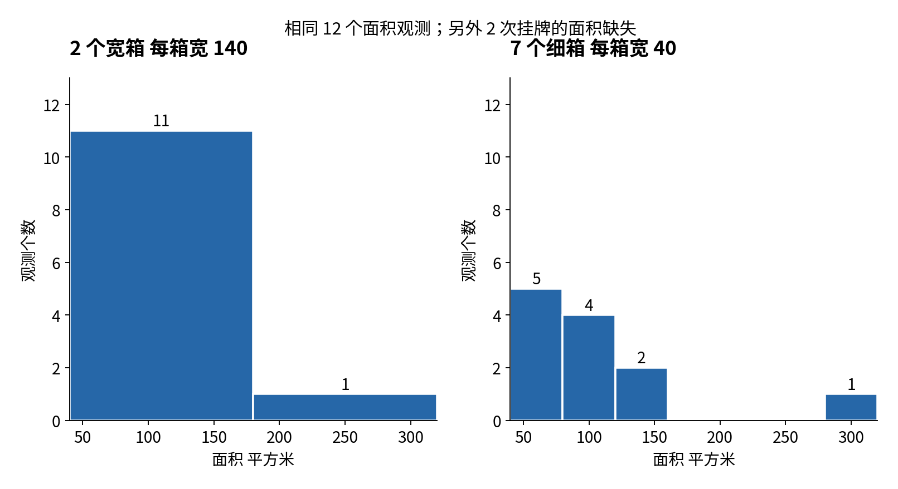
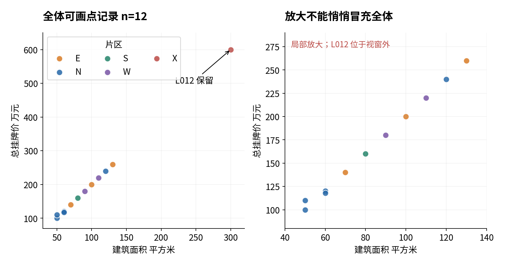

# 合成挂牌记录探索报告示例

## 对象与来源

本报告描述课程人为构造的挂牌事件，不代表真实市场，也不评价模型性能。原始文件有16条记录，L003与L009各有一次完整复制。移出复制后保留14次挂牌、12套房屋。H01和H02的复挂牌仍是有效事件。全部原始CSV保持不变，修改和移出记录可在清洗审计表中回查。

## 质量与合并

14个挂牌价均已观测，面积只有12个已观测、2个缺失，缺失比例2/14≈14.29%。两个缺失都在S片区，因此S组的面积均值80只来自1个观测，不能当作3次挂牌的完整面积平均。

候选片区表的N键存在两个距离条目，已被多对一约束拦住。按题目给定确认登记册左合并后仍为14行，13行匹配、1行未匹配。未匹配的是代码X的L012，仍保留在主表。其300平方米、600万元经教学说明确认为有效大记录。

## 描述摘要与图

十四个挂牌价的总和为2888万元，均值约206.29万元，中位数180万元。按线性插值定义，第25与第75百分位分别为125、235万元。面积已观测均值为1220/12≈101.67平方米。

细箱边界为40、80、120、160、200、240、280、320平方米，计数依次是5、4、2、0、0、0、1。宽箱图仅有2箱，隐藏了部分局部细节，不能用某一个外形直接推断总体分布。

这些合成点存在面积较大时挂牌价也较高的关联，不能据此作因果判断。局部图未显示L012，不意味着它已从分析表中删除。

## 处理敏感性与边界

若不检查候选右表键，合并会产生19行，将N的五个价格各重复一次，均价变成约188.21万元。若改用inner排除未匹配L012，则13行均价为176万元。这些变化来自记录权重或范围改变，不是发现新的市场规律。

填补演示使用固定清单的训练9个已观测面积，均值670/9≈74.44，应用于训练L004和测试L010。原始面积列仍保留缺失。虽然本教学审计公开全部数据便于手算，它不承担真正盲测角色，没有据此选择模型或报告性能。

本报告采用Pandas 2.2.3、NumPy 2.3.5与Matplotlib 3.10.8。读者可运行experiment.py重算摘要，并在outputs中检查原始文件摘要值、清洗日志、冲突条目和分组分母。
