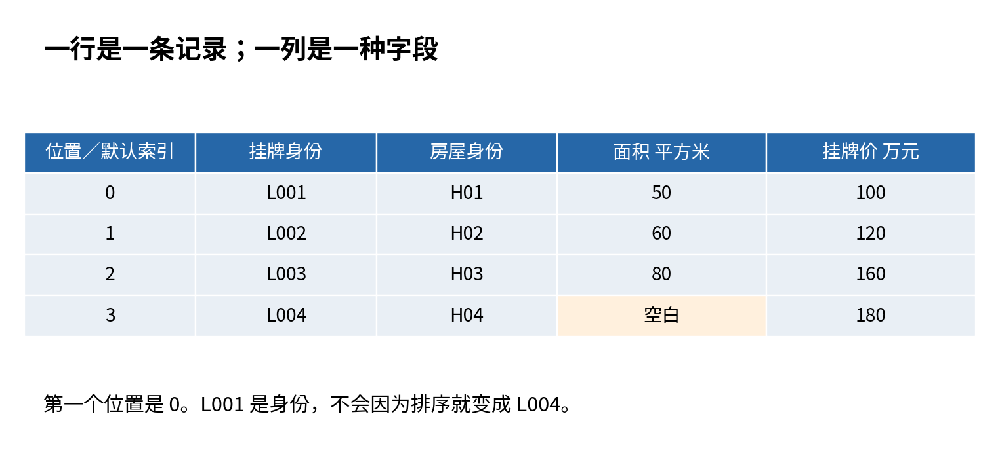
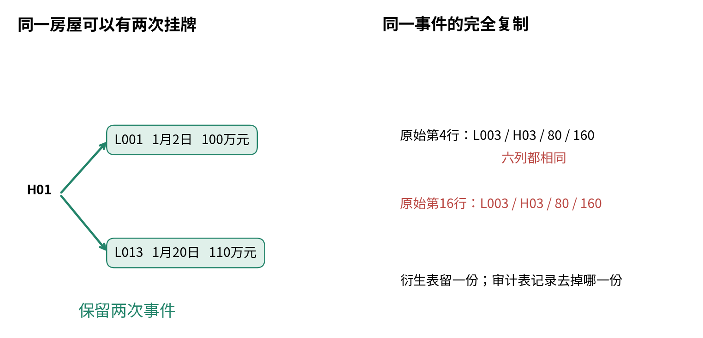
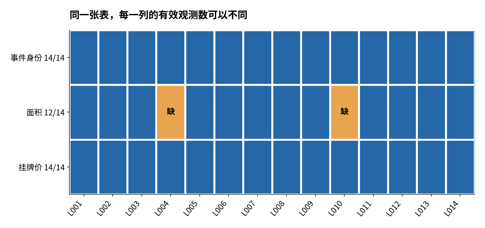
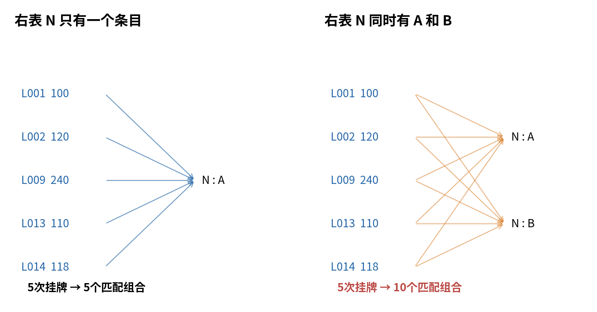
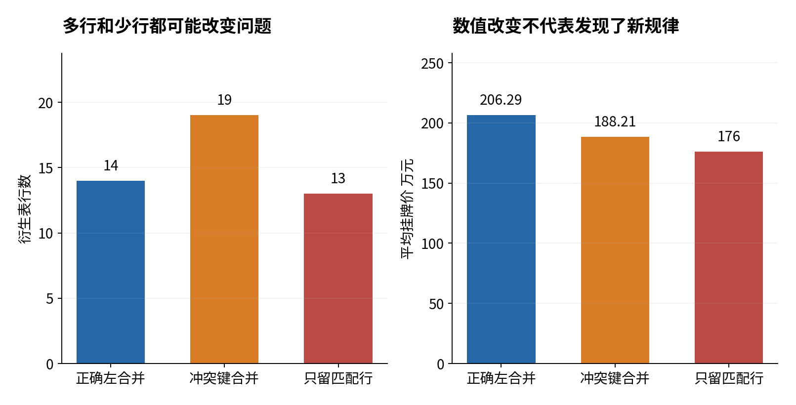
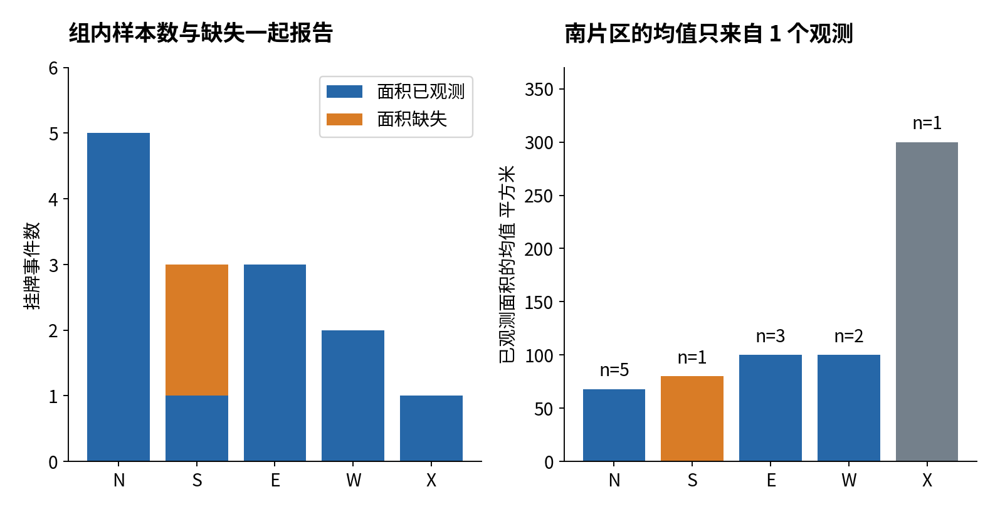
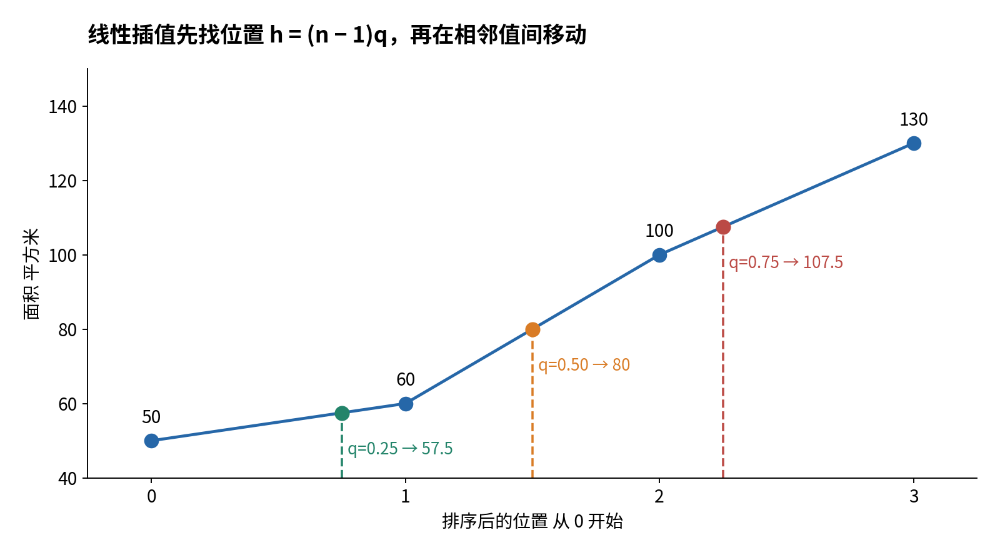
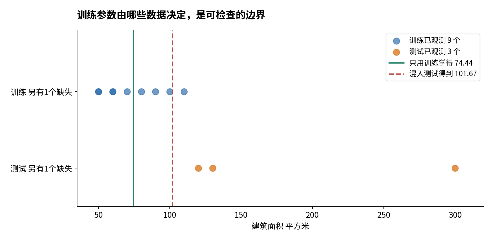

# 读表清洗与可视化

## 第六讲 每一次删行与合并都在回答一个问题

一份表格有十六行。你把它读进电脑，去掉重复，再补上一张片区表，得到十九行。程序没有报错，平均挂牌价从约二百零六万元变成约一百八十八万元。是房价下降了，还是你无意间让某些房屋多投了几票？本讲要让你在画图之前就能发现这种变化，并且说出变化发生在哪一步。

核心问题是：怎样从原始表看清分布与记录问题，而不偷偷改变研究对象？“清洗”不是把表变得漂亮，也不是把所有难处理的记录删掉。它是一组有根据、能回查的操作。每一步都应该说明：改变了哪些值，保留了哪些事件，为什么这样做，以及怎样证明没有多算或漏算。

第二讲已经区分记录、挂牌事件与房屋。第四讲教过函数、路径和断言，第五讲介绍数组。本讲把这些工具连到一张带列名的表上，逐步学习读入、选行选列、识别重复和缺失、拼接表格、分组计数，再用分位数与图形描述已经看见的记录。我们不会训练模型，也不会从这十四次合成挂牌推断真实市场。

本讲材料包括讲义、独立实验指南、逐步执行的 Notebook、可直接运行的脚本、原始 CSV 和详细习题解答。你可以先用纸笔完成前几个例子，再跟着实验指南运行。阅读时不用记住所有函数名；先问清楚分母是什么，再去查哪条命令能把它算出来。

## 一 先写一张表的使用约定

我们的教学任务是：描述这份导出文件所覆盖的挂牌事件，核查数据问题，并准备一个演示用的训练与测试预处理例子。一行有效分析记录代表一次挂牌事件。一个房屋可以在不同日期重新挂牌，因此同一房屋可以对应两行有效记录。挂牌价是卖方挂牌时的总报价，不是后来成交的价格。

文件 listings.csv 有六列。event_id 是挂牌事件编号，例如 L001；property_id 是房屋编号，例如 H01；listed_at 是挂牌日期；district_code 是片区代码；area_sqm 是建筑面积，单位平方米；list_price_wan 是总挂牌价，单位万元。英文列名只是程序使用的短标签，不能替代数据字典。若 area_sqm 其实是套内面积，整个分析含义就变了，列名再规范也不能补救。

这是人为构造的小数据，没有真实地址、姓名或市场记录。我们刻意安排了一些问题，数量并不反映真实业务的发生频率。先把十四次不同挂牌的内容完整列出来。原始 CSV 另外在末尾重复了 L003 和 L009 两条完整记录，且 L014 的片区代码和面积带有首尾空格。

| 事件 | 房屋 | 日期 | 片区 | 面积 平方米 | 挂牌价 万元 |
| --- | --- | --- | --- | --- | --- |
| L001 | H01 | 1月2日 | N | 50 | 100 |
| L002 | H02 | 1月3日 | N | 60 | 120 |
| L003 | H03 | 1月4日 | S | 80 | 160 |
| L004 | H04 | 1月5日 | S | 空白 | 180 |
| L005 | H05 | 1月6日 | E | 100 | 200 |
| L006 | H06 | 1月7日 | E | 70 | 140 |
| L007 | H07 | 1月8日 | W | 90 | 180 |
| L008 | H08 | 1月9日 | W | 110 | 220 |
| L009 | H09 | 2月2日 | N | 120 | 240 |
| L010 | H10 | 2月3日 | S | 未知 | 260 |
| L011 | H11 | 2月4日 | E | 130 | 260 |
| L012 | H12 | 2月5日 | X | 300 | 600 |
| L013 | H01 | 1月20日 | N | 50 | 110 |
| L014 | H02 | 1月21日 | N | 60 | 118 |

所有日期都在 2026 年。L001 和 L013 属于同一房屋 H01，但日期、事件编号和挂牌价不同。它们是两次挂牌，不能因为房屋编号相同就删掉后一条。H02 也有两次挂牌。于是原始记录数是 16，不同挂牌事件数是 14，不同房屋数是 12。这三个数字都正确，只是回答不同的问题。

辅助文件 district_candidates.csv 模拟一份未经确认的片区资料：N 有 A、B 两个来源，距离分别写成 1.2 和 1.8 千米；S、E、W 各有一条；X 没有条目。另有教学登记册 district_registry.csv，明确确认 N 采用 A 版本。这个登记册是题目提供的依据，不能由“哪一个结果更好看”来选。split_manifest.csv 则提前写好每个事件属于训练还是测试，稍后才使用。

从现在起，我们设一条验收约定：只要没有明确改变研究范围，正确的整理和左合并应保留 14 个事件。这个数字不是代码跑完才猜出来的，而是由问题定义和原始记录核对出来的。先写预期，再看输出，是发现隐蔽错误的有效方法。

## 二 DataFrame 是带标签的表

Pandas 是 Python 中处理表格的工具库。DataFrame 可以先理解为一张有行标签和列标签的二维表。第五讲的二维数组主要靠位置取元素；DataFrame 还让我们用“面积”“挂牌价”这样的列名描述操作。Series 则通常是一列带行标签的数据。

```python
import pandas as pd

small = pd.DataFrame({
    "event_id": ["L001", "L002", "L003"],
    "area_sqm": [50, 60, 80],
    "list_price_wan": [100, 120, 160],
})
print(small.shape)
print(small.columns.tolist())
```

字典的键成为列名，列表里的第一个元素组成第一行，第二个元素组成第二行。shape 返回两个数字，这里是三行、三列，即 (3, 3)。它不是总元素数。len(small) 是 3，表示行数；small.size 是 9，表示三个乘三个的格子数。以后看到“样本量”时，不能随手把 size 当作样本数。

最左侧自动显示的 0、1、2 是默认行索引。索引是用于定位和对齐的标签，不一定是样本身份。默认标签恰好等于位置，容易让我们误以为它们永远是一回事。排序、筛选以后，索引可能是 2、0，也可能直接使用 L003、L001。研究中应保留稳定事件编号，才知道某个异常对应原始哪次挂牌。



单层中括号选择一列，结果通常是 Series；把列名放进列表再用中括号，结果仍是 DataFrame：

```python
area_column = small["area_sqm"]
area_table = small[["area_sqm"]]
selected = small[["event_id", "list_price_wan"]]
```

area_column 像“一列数”，area_table 像“只有一列的表”。它们的 shape 分别是 (3,) 与 (3, 1)。这与第五讲的一维数组和单列二维数组的区别相似。不要因为屏幕都显示三个数就忽略维度；有些后续函数需要表，有些需要一列。

同一张 DataFrame 的不同列可以有不同类型。日期可以是日期类型，事件编号可以是字符串，价格可以是数值。dtypes 会逐列报告类型。数字字符“50”与数值 50 看起来相近，但含义不同：前者首先是一段文本，后者能参加数值计算。事件编号哪怕只有数字，也常应保留为字符串，否则编号“001”可能被读成 1，丢掉身份格式。

表格工具不会自动知道哪个字段代表身份，哪一列必须大于零，哪些缺失符号得到业务认可。这些都需要由数据字典告诉程序。因此读到表后，先检查行数、列名、类型、几条具体记录，再去求平均数。

## 三 读 CSV 时把自动猜测变成明确约定

CSV 是一种文本表格格式，通常一行是一条记录、字段之间用逗号分开，第一行写列名。它不是 Excel 工作簿，不包含复杂公式或工作表样式。含逗号的文本字段会使用引号保护，因此不要用最简单的字符串 split 代替正规的 CSV 解析器。

本讲第一次读文件时，把六列都当作字符串，并保留空白和“未知”的原样。这样我们可以先审计原始信息，再解释哪些符号表示缺失。文件路径的写法沿用第四讲；在 Notebook 所在文件夹运行时，下面的相对路径指向随包提供的文件。

```python
from pathlib import Path

raw_path = Path("data") / "raw" / "listings.csv"
raw = pd.read_csv(
    raw_path,
    dtype="string",
    keep_default_na=False,
    encoding="utf-8",
)
print(raw.shape)
print(raw.head())
print(raw.dtypes)
```

这段代码预期读出 16 行、6 列。dtype 指定类型；keep_default_na=False 暂时关闭默认缺失标记解释；encoding 指定字符编码，避免中文“未知”被误读。read_csv 的类型和缺失参数会改变读入结果，因此应写进实验记录。相关参数可查阅 [Pandas 读 CSV 文档](https://pandas.pydata.org/pandas-docs/version/2.2/reference/api/pandas.read_csv.html)。

注意，“读成文本”是本例的审计策略，并不是说所有项目都应先把全部数据变成字符串。对于已经有可信数据字典的大表，直接指定各列类型与缺失符号更高效。重要的是读入约定可解释，而不是某种写法永远最好。

head() 默认只看前五行。它能帮你检查列是否错位，却不能证明最后一行没有问题。我们把空格问题放在 L014，把重复记录放在末尾，正是为了提醒你：浏览开头不等于完成检查。还应查看 tail()、列名集合、总行数以及各列不符合预期的记录。

保留原始文件还有另一层理由：如果把“未知”直接替换为空白后覆盖原文件，后来便无法判断缺失原本来自空字段还是人工标记。脚本只向 outputs 文件夹写新文件，data/raw 里的输入保持不变。它还对每个原始文件计算摘要值，运行前后比对。摘要相同是文件字节未改变的检查，不是数据含义正确的证明。

### 从文本解释成数值

L014 的面积原文为“ 60 ”。我们先去首尾空格，再判断空白和“未知”属于声明过的缺失标记，最后转换数值：

```python
area_text = raw["area_sqm"].str.strip()
missing_marker = area_text.isin(["", "未知"])
area_number = pd.to_numeric(
    area_text.mask(missing_marker),
    errors="raise",
).astype("Float64")
```

str.strip() 对这一列每段文本去掉两端空格。isin 检查它是否属于给定的两个符号，结果是一列 True 或 False。mask 把这些位置改成缺失。to_numeric 才把其他位置解释为数值；Float64 是 Pandas 的可空数值类型，既能存小数，也能保留缺失。

errors="raise" 表示遇到不认识的数字文本就报错。若误写了“sixy”，程序应该请我们检查原记录，而不是静悄悄把它变成缺失。errors="coerce" 在另一些工作流中有用，但必须另外保存失败转换的名单和数量，否则新的错误会混入旧的缺失。两种行为的区别见 [Pandas 数值转换文档](https://pandas.pydata.org/pandas-docs/version/2.2/reference/api/pandas.to_numeric.html)。

日期也类似。我们明确按年、月、日格式转换，并让不合法日期报错。价格列应能全部转换为数值且在本例中大于零。注意“大于零”来自本例数据字典；在其他任务中，零可能是真实测量值。不要把一套未经解释的清洗规则复制到任何数据上。

## 四 选行选列时分清标签与位置

假设 clean 是去除确认重复、统一字段格式后的 14 行表。我们稍后会完整解释怎样得到它。现在只关心“我究竟选到了谁”。使用列名列表选择列之后，用 loc 可以同时指定行和列：

```python
north = clean.loc[
    clean["district_code"].eq("N"),
    ["event_id", "area_sqm", "list_price_wan"],
]
```

eq("N") 的意思是检查是否等于 N。这里生成的布尔列称为筛选条件或掩码：某个位置为 True，就保留该行。loc 的逗号左边选择行，右边选择列。北片区应有五次挂牌 L001、L002、L009、L013、L014，而不是五套不同房屋。

多个条件同时成立使用 &，任一条件成立使用 |，条件两侧都加括号：

```python
chosen = clean.loc[
    (clean["district_code"].eq("N"))
    & (clean["list_price_wan"] >= 120),
    ["event_id", "list_price_wan"],
]
```

本例选出 L002 和 L009。不要把 Python 中针对单个真假值的 and 直接用于整列布尔数；也不要省略括号。对缺失面积的比较可能产生未知状态，所以若问题是“面积已经记录且至少为 80”，应明确先写 notna()，再连接面积条件。未满足观察条件不等于测量值为零。

iloc 按位置取值，位置从 0 开始，切片右端不包含在内。clean.iloc[:3] 取当前排列的前三行。loc 按标签取值。为了清楚看出区别，我们把 event_id 设成索引：

```python
by_event = clean.set_index("event_id", verify_integrity=True)
print(by_event.loc["L004", "area_sqm"])
print(by_event.iloc[3]["property_id"])
```

第一行按 L004 身份寻找面积；第二行按当前第四个位置寻找房屋编号。恰好都指向 H04 是因为当前顺序如此。如果先按价格排序，第四个位置就可能换人，L004 的身份不会变。verify_integrity=True 要求新索引不重复，帮助我们验证“一个事件只占一行”的约定。

Pandas 的标签切片可能包含末端标签，而 iloc 的位置切片不含右端。还不熟悉时，单个明确标签、显式标签列表和布尔筛选更容易核对。细节见 [Pandas loc 文档](https://pandas.pydata.org/pandas-docs/version/2.2/reference/api/pandas.DataFrame.loc.html)。

### 标签会参与对齐

第五讲学过数组按位置进行运算。两列 Series 做运算时，Pandas 常按索引标签对齐。设左边面积的标签顺序是 L001、L002，右边价格的顺序是 L002、L001；按标签除法仍会把 L001 的价格除以 L001 的面积。这个优点也会成为陷阱：如果两列根本不是同一批标签，结果可能出现额外的缺失位置。

因此，不要为了让长度看起来一样就随意丢掉索引。涉及不同来源的两列，先核对它们代表相同事件，再运算。索引也不会自动约束唯一性；必须明确检查。样本身份、标签、位置三个概念越早分清，后续排查模型输入错位就越容易。

修改选定值时，也尽量用一次 loc 定位，或者先 copy() 再修改新表。避免先筛选再对临时对象赋值的含混写法。我们把原始表、整理后表和建模演示表使用不同变量名，也是为了不让“一个改动影响了谁”变得难以追踪。

## 五 重复记录与重复对象不是同一种问题

“去重”必须补完整：按哪些字段判重，代表哪一种重复，保留哪一份，有没有冲突。若只写 clean = raw.drop_duplicates()，你能运行，但还没有把研究规则说明白。

本例有六个原始字段。末尾的 L003 与前面 L003 六列完全相同，末尾 L009 也是如此。在题目提供的导出背景下，它们是重复导出，不是两次新的事件。我们给每条原始记录补一个 source_csv_line，记录它在 CSV 文件中的实际行号，然后只在原始六列上检查重复。

```python
original_columns = raw.columns.tolist()
work = raw.copy()
work["source_csv_line"] = range(2, len(raw) + 2)
duplicate_mask = work.duplicated(
    subset=original_columns,
    keep="first",
)
removed_rows = work.loc[duplicate_mask].copy()
clean = work.loc[~duplicate_mask].copy()
```

CSV 第一行是表头，所以首条记录实际在第 2 行。两个被移出分析表的复制记录位于第 16、17 行。这里的“first”只是在两条所有原始字段相同的记录之间保留较早出现的一条。如果同一个事件的价格不同，就不能用这条规则挑选“正确价格”。

为什么不能把 source_csv_line 也放进判重字段？因为每个原始行号都不同，哪怕其余信息完全复制，整行也不再相同。判重字段必须围绕事件含义选择，不能把为了审计临时加上的追踪字段误当测量字段。drop_duplicates 和 duplicated 的字段选择与保留规则见 [Pandas 去重文档](https://pandas.pydata.org/pandas-docs/version/2.2/reference/api/pandas.DataFrame.drop_duplicates.html)。



完成完全重复处理以后，还要单独验证 event_id 是否唯一。如果同一个编号仍占两行，说明存在冲突：可能是事件更新、编号复用或输入错误。脚本会停止并要求核查，而不是再删一遍。测试还故意把复制 L003 的价格改成 999，确认这类冲突确实能被拦住。

若误按 property_id 去重，只留下每套房屋第一次出现的行，L013 和 L014 会消失。表从 14 行变成 12 行，总挂牌价从 2888 减去 110 和 118，变成 2660，均价是 $2660/12\approx221.67$ 万元。这个新数不是原任务的“更干净版本”，它描述的是按当前文件顺序挑出的每套房屋一条记录。

有时研究确实要求每套房屋只保留一次，例如统一比较某个截止日之前的最新挂牌。但你需要先定义截止日与“最新”的时间规则，处理并列和撤回事件，然后明确承认研究对象改变了。去重不是一个永远正确的机械按钮。

## 六 缺失表示不知道 不表示测得零

L004 的面积原本空白，L010 写着“未知”。依据数据字典，我们将两者都解释为没有可用面积观测。处理后，表里仍有这两次挂牌，挂牌价也仍然存在。只是在面积这一列不能把它们当成已测量数字。

Pandas 中缺失的具体显示可能是 NaN、`<NA>` 或 NaT，取决于列的类型。我们的面积使用可空数值类型，因此常显示 `<NA>`；日期缺失可以显示 NaT。你不必通过屏幕上的文字来判断，应使用 isna() 与 notna()。不要写“等于 NaN”来找缺失。官方对不同类型缺失的说明见 [Pandas 缺失值指南](https://pandas.pydata.org/pandas-docs/version/2.2/user_guide/missing_data.html)。

```python
missing_area = clean["area_sqm"].isna()
print(missing_area.sum())
print(clean.loc[missing_area, ["event_id", "list_price_wan"]])
```

布尔值 True 在求和时按 1 计，False 按 0 计，所以 isna().sum() 数出缺失条数，这里是 2。面积已观测数是 12。缺失比例为 $2/14\approx0.1429$，约 14.29%。分母用所有十四次挂牌，因为我们问“十四次挂牌中有多少比例缺面积”，而不是问“已观测面积中有多少缺失”。



零是一个具体值。如果把缺失面积填成零，面积总和仍是 1220，但平均数分母从 12 变成 14，于是从 $1220/12\approx101.67$ 变成 $1220/14\approx87.14$。程序没有创造新测量，却让结果好像已经观察到两套零面积房屋。绘制散点图时，它们还会出现在横轴零点，造成更明显的误导。

缺失记录是否应该删除，要看当前问题。如果画面积与挂牌价散点图，必须有这两个坐标，这两条不能画成普通点；但应报告它们因缺面积未出现在图中。如果统计挂牌价分布，两条价格都已知，就没有必要删掉。如果描述各片区的挂牌次数，缺面积也不妨碍计数。

这说明“完整记录”总是相对于所需字段而言。clean.dropna() 对所有列一概删除，往往过于粗糙。辅助合并后，L012 的片区名称也缺失；若对整张合并表执行 dropna()，会连这个面积与价格都完整的事件一起删除。先列出当前分析必需哪些列，再限定 subset，才能说清楚哪些记录被排除。

还要追问缺失是否集中。本例两个面积缺失都在 S 片区，不能说缺失与片区毫无关系。我们知道这是教学安排；真实项目还要调查登记流程、来源和时间，不能仅凭一张缺失表就认定原因，更不能凭空给缺失机制贴上数学标签。

## 七 合并表格先问一条记录会遇见几条

挂牌表里只有 N、S 等代码。想补充片区名称和距离，可以把片区资料按 district_code 连接过来。合并键就是两边用于寻找对应关系的字段。“键相同”不代表“两边各只有一行”。你需要同时检查键值是否匹配，以及每个键出现多少次。

先看理想情况：挂牌表中 N 有五次事件，登记册中 N 只有一行。每个挂牌都匹配同一个登记册条目，输出仍是五行。左边允许多次出现一个片区，右边要求每个片区唯一，这叫多对一关系。英文 many_to_one 正是这个含义。

现在换成未经确认的候选资料。右边 N 有 A、B 两行。L001 同时遇到 A 和 B，因此输出两行；L002 也输出两行，其余三个 N 事件同样如此。N 的五条变成十条，全表从 14 增至 19。程序是在列出匹配组合，并不知道你只想保留每个事件一次。



为了用纸笔预测行数，设某个键在左表出现 $a$ 次，在右表出现 $b$ 次。如果它在两边都有记录，该键会产生 $a\times b$ 个匹配组合。这里的字母只代表两个计数，不是新模型：N 的情况是 $5\times2=10$。若一个左表键没有任何右表匹配，左合并仍为每条左记录保留一行，右侧字段记为缺失；内合并则不保留这些未匹配行。

多个匹配组合有时正是业务需要，比如一件商品对应多条评论。但这时输出一行的含义已经变成“商品与评论的配对”，不能继续把每行当一件独立商品计算商品均价。同样，本例冲突合并后的每行已经不是唯一挂牌事件。

### 在执行前写出约束

```python
merged = clean.merge(
    registry,
    on="district_code",
    how="left",
    validate="many_to_one",
    indicator=True,
)
assert len(merged) == len(clean)
assert merged["event_id"].is_unique
```

on 指定合并键；how="left" 保留左表事件；validate="many_to_one" 要求右侧键唯一；indicator=True 增加 _merge 列，告诉我们一行来自两边匹配还是只有一边。Pandas 支持不同连接方式和基数检查，且缺失键在某些情形下会互相匹配，这一点不能套用其他数据库的直觉。见 [Pandas merge 文档](https://pandas.pydata.org/pandas-docs/version/2.2/reference/api/pandas.DataFrame.merge.html)。

本例先把 candidates 作为右表并加上 validate，预期抛出 MergeError。这是成功的安全检查，不是需要取消的麻烦。我们把冲突条目导出以便查看，再按给定登记册使用已经确认的 registry。不能为了“让程序通过”就对右表随便 keep="first"，因为 1.2 和 1.8 的不同来自含义冲突，不是完整复制。

正确合并输出 14 行。其中 _merge 为 both 的有 13 行，left_only 的有 1 行，是 L012。它的代码 X 在登记册中不存在。我们保留这次挂牌并把未匹配列明，而不是把片区名称写成某个猜测值。如果选择 inner，只保留两边都出现的键，L012 会被丢掉，输出变成 13 行。

indicator 能帮助我们发现未匹配，validate 能帮助发现不符合预期的重复键，但两者都不能保证右表语义正确。把北片区误标成南片区且仍保持键唯一，这两种检查未必发现。因此合并后仍需要抽查具体记录、核对单位和资料版本。

### 为什么均值也跟着变了

正确十四次挂牌的价格和是 2888，均价为 $2888/14\approx206.29$ 万元。N 片区五次挂牌的价格和是 $100+120+240+110+118=688$。错误合并让这五个价格各多出现一次，所以新价格和是 $2888+688=3576$，新分母为 19，均价变成 $3576/19\approx188.21$。

N 片区在这份表中均价较低，重复它们等于给较低价格加权更多，结果下降。并不是“多了五个新观察”，而是已有观察被重复计算。若被重复的是高价组，变化方向还会反过来。合并膨胀没有固定向下或向上的偏差方向。

如果误用 inner，价格 600 的 L012 被去掉，总和变为 $2888-600=2288$，分母 13，均价正好 176。这两个错误都得到能显示到很多小数位的结果。小数位多不能证明研究对象正确。



### join 与 merge 的联系

merge 经常显式使用列作为键。join 默认常用索引连接，也可以指定左表某一列与右表索引连接。为避免含混，可先明确把登记册的片区代码设为唯一索引：

```python
registry_by_code = registry.set_index("district_code", verify_integrity=True)
joined = clean.join(
    registry_by_code,
    on="district_code",
    how="left",
    validate="many_to_one",
)
```

这仍需要相同的行数、唯一性和缺失核验。join 不会因为名字不同就避开一对多膨胀。详情见 [Pandas join 文档](https://pandas.pydata.org/pandas-docs/version/2.2/reference/api/pandas.DataFrame.join.html)。本讲主实验统一使用 merge，因为 _merge 指示列便于初学者查验。

## 八 分组统计时先核对分母

合并正确后，才轮到按片区汇总。groupby 可以理解为：先按照片区代码把记录分到几个小堆，再对每一堆执行计数、求和或求均值。它不需要你先把记录按片区排列在一起，分组依据来自键值。

```python
groups = merged.groupby("district_code", dropna=False)
print(groups.size())
print(groups["area_sqm"].count())
```

size 数每组有多少行，count 数指定列有多少个非缺失值。全表的 len(clean) 是 14，面积列 count() 是 12；分组后也必须保留这种区别。官方分别说明了 [分组行数 size](https://pandas.pydata.org/pandas-docs/version/2.2/reference/api/pandas.core.groupby.DataFrameGroupBy.size.html) 与 [分组非缺失计数 count](https://pandas.pydata.org/pandas-docs/version/2.2/reference/api/pandas.core.groupby.DataFrameGroupBy.count.html)。

本例的 N、S、E、W、X 分别有 5、3、3、2、1 次挂牌。它们相加是 14，应与合并前后的事件数一致。面积可用数却分别是 5、1、3、2、1，相加只有 12。S 的挂牌价有三个，面积只有一个。如果报告只写“南片区平均面积 80”，读者很可能误以为它概括了三次完整观察。

| 片区 | 挂牌事件数 | 面积已观测数 | 面积缺失数 | 已观测面积均值 |
| --- | --- | --- | --- | --- |
| N | 5 | 5 | 0 | 68 |
| S | 3 | 1 | 2 | 80 |
| E | 3 | 3 | 0 | 100 |
| W | 2 | 2 | 0 | 100 |
| X | 1 | 1 | 0 | 300 |

这里的 dropna=False 指分组键本身若有缺失，也保留一个缺失键组。它不是把所有测量值缺失的行自动变完整。本例 district_code 没有缺失，X 是一个实际存在但暂时没有登记册说明的代码，不能与缺失代码混为一谈。

为了一次得到多列统计，可以使用 agg。下面每一对括号中，前一个字符串指定输入列，后一个字符串指定计算方式；等号左边是输出列的新名字。

```python
summary = merged.groupby("district_code", dropna=False).agg(
    event_count=("event_id", "size"),
    observed_area_count=("area_sqm", "count"),
    observed_price_count=("list_price_wan", "count"),
    mean_area_sqm=("area_sqm", "mean"),
    mean_price_wan=("list_price_wan", "mean"),
)
summary["missing_area_count"] = (
    summary["event_count"] - summary["observed_area_count"]
)
```

例如 S 组的缺失比例是 $2/3$，约 66.67%。全表缺失比例只有约 14.29%。只看总比例会掩盖问题集中在某个组里的现象。反过来，也不能因为 S 缺失比例大，就断定真实南片区总是更难采集。这里只是在描述一份人为构造的小表。



分组均值不能不加权再平均来替代总均值。五个片区挂牌价均值是 137.6、200、200、200、600。把它们直接相加除以 5 得到 267.52，这让只有一次挂牌的 X 与五次挂牌的 N 具有同样影响。原问题要每次挂牌各算一次，因此应该分别乘以各组事件数，求和后除以 14，才回到 206.29 左右。

如果你的问题恰好是“每个片区权重相等时的片区均值平均”，267.52 可以有清楚含义；但是它回答了另一个问题。算法不能替你决定片区等权还是事件等权。先把权重的对象用中文写出来，通常比事后争论哪个数字才是真均价更有效。

## 九 均值与中位数先从排队理解

均值的计算已经很熟悉：把所有参与的数相加，除以参与的个数。它把每条被纳入的记录都用上了。最大值增加很多，总和就增加很多，均值也会受到影响。这个性质不是错误，关键是它是否符合你要概括的对象。

本例全部十四个挂牌价从小到大排列为：100、110、118、120、140、160、180、180、200、220、240、260、260、600。总和 2888 除以 14，得到约 206.29。最大的 600 对总和影响很大，但它并没有因为“很大”就自动失效。

中位数从排序的位置定义。如果数量是奇数，取最中间那个；如果数量是偶数，本讲采用中间两个的平均。本例有 14 个数，中间是第 7 个和第 8 个，都是 180，因此中位数是 180。中位数描述队伍中央的位置，均值描述平均分摊，两者概括的是不同方面。

对于 50、60、100、130 四个面积，中间两个是 60 和 100，中位数是 80。注意原始记录并没有面积 80。这不矛盾，中位数是计算出的概括量，不一定对应某条实际观察。“没有一个样本正好等于它”不是计算出错的证据。

我们还应该同时报告最小值、最大值和观测数。只给均值或只给中位数，都可能遮住数据跨度。面积的有效样本数是 12，而价格是 14，所以两个摘要不能假装来自完全相同的记录集合。后面散点图只使用两列都已知的 12 条，又是另一个明确集合。

任何摘要都会压缩信息。把十四个数字变成一个平均数，我们必然丢掉顺序、分组和个体差异。因此探索报告不是挑一个“最有代表性”的数结束，而是用少量互相补充的摘要，让读者既能抓住主要情况，也能知道哪些信息被省略了。

## 十 分位数需要说明怎样在位置之间取值

分位数把“中间位置”推广到队伍的其他部分。我们用 $q$ 表示从 0 到 1 之间的位置比例：0.25 表示四分之一附近，0.5 表示中央，0.75 表示四分之三附近。称为第 25、50、75 百分位数时，百分比只是把这个比例乘以 100。

有限样本的分位数并没有唯一一种算法。特别是样本很少时，不同算法的答案会有明显差别。所以说“这是第 25 百分位数”还不完整，至少应写出软件和本次采用的定义。本讲采用 Pandas Series.quantile 的 linear 插值，具体参数见 [Pandas 分位数文档](https://pandas.pydata.org/pandas-docs/version/2.2/reference/api/pandas.Series.quantile.html)。

先用四个面积 50、60、100、130 演示。它们已经从小到大排序。我们把位置从 0 开始编号，于是四个位置为 0、1、2、3。为什么最后一个位置是 3 而不是 4？因为第一个已占用了 0，与 Python 数组的位置编号一致。

若共有 $n$ 个已观测值，本讲先计算目标位置

$$h=(n-1)q.$$

这个式子只是在长度为 $n-1$ 的位置区间上按比例前进。对于四个数，$n=4$，取 $q=0.25$，便有 $h=(4-1)\times0.25=0.75$。这不是第 0.75 条记录；它告诉我们目标落在位置 0 和 1 之间，从位置 0 向位置 1 走了四分之三。

位置 0 的数是 50，位置 1 的数是 60，两者差 10。走四分之三，就在 50 的基础上增加 $0.75\times10=7.5$，得到 57.5。用同样方法，$q=0.5$ 对应位置 1.5，在 60 与 100 中间，结果 80；$q=0.75$ 对应位置 2.25，在 100 与 130 之间走四分之一，结果 107.5。



如果愿意把步骤写成通用式，可以令 $j$ 是 $h$ 的整数部分，$r=h-j$ 是余下的小数部分。排序后的数写为 $v_0,v_1,\ldots,v_{n-1}$。当目标位置不是最后一个时，线性插值得到

$$Q(q)=v_j+r(v_{j+1}-v_j).$$

下标只是在指位置。先取较低位置的值，再加上相邻差距的 $r$ 倍。若 $h$ 恰好是整数，就直接取那个位置的值；若 $q=1$，取最后一个值，不再访问不存在的下一个位置。只有一个已观测值时，所有这些分位数都是它；一个也没有时，就没有可计算的有限样本分位数，应保留缺失或报告无法计算。

现在回到十四个挂牌价。第 25 百分位的位置是 $13\times0.25=3.25$。按从 0 开始的位置，位置 3 是 120，位置 4 是 140，所以结果 $120+0.25\times20=125$。第 75 百分位位置是 9.75，位置 9 为 220、位置 10 为 240，结果 235。中位数仍为 180。

```python
price_quantiles = clean["list_price_wan"].quantile(
    [0, 0.25, 0.5, 0.75, 1],
    interpolation="linear",
)
```

结果依次是 100、125、180、235、600。它们可以帮助描述队伍的位置和跨度，但不能直接当作“未来房屋价格必在这个区间”的承诺。本例样本量小、来源人为安排，也不存在可靠的总体概率结论。

不要要求插值分位数下面恰好有 25% 的记录。四个数的 25% 分位数是 57.5，下面只有一个观测 50；若有重复值，按小于还是小于等于计数还会不同。分位数在这里是按约定位置计算的摘要，不是让每个小样本都被无余数分割的魔法。

## 十一 直方图把数值装进区间

看到十四个价格列表，我们还想知道大多数记录聚在哪儿、有没有间隔、是否存在少数很大的值。直方图的第一步是选择一组相邻区间，第二步数每个区间里有多少观测，第三步把计数画成相邻的柱子。柱子对应数值区间，不是某一套房屋，也不是一个片区。

用面积作例子。先只取面积已知的 12 条：50、60、80、100、70、90、110、120、130、300、50、60。选定边界 40、80、120、160、200、240、280、320。于是共有七个箱，每箱宽 40 平方米。前六个区间包含左边界、不含右边界，最后一个还包含最右边界。

例如第一个箱为 $40\leq x<80$，装入 50、60、70、50、60，共 5 条。80 不属于第一个箱，而属于第二个 $80\leq x<120$；第二个装入 80、100、90、110，共 4 条。第三个装入 120、130，共 2 条；中间三个箱为空；最后一个装入 300，共 1 条。计数为 5、4、2、0、0、0、1，加起来仍是 12。

这种边界约定让恰好位于箱边的值不会被两次计入。NumPy histogram 对区间边界的规则见 [NumPy 直方图文档](https://numpy.org/doc/2.3/reference/generated/numpy.histogram.html)。画图前可以先用这个函数得到计数，在纸上核对，再把结果交给绘图工具。

```python
import numpy as np

area_values = clean["area_sqm"].dropna().to_numpy(dtype=float)
edges = [40, 80, 120, 160, 200, 240, 280, 320]
counts, used_edges = np.histogram(area_values, bins=edges)
assert counts.sum() == len(area_values)
```

这里 dropna() 只用于取出本图可画的面积列，没有覆盖 clean，也没有把事件从主表删除。数组转换之后不再保留事件标签，所以排查具体事件时仍要回到 clean。assert 检查箱中计数总和是否等于有效观测数；如果你选了一个过窄范围，范围外的点不会被计入，这条检查就会提醒你。

真正画图时，我们显式写出边界、单位和纵轴含义：

```python
import matplotlib.pyplot as plt

fig, ax = plt.subplots()
ax.hist(area_values, bins=edges, edgecolor="white")
ax.set_xlabel("Area (square metres)")
ax.set_ylabel("Observed event count")
fig.tight_layout()
```

fig 可以理解为整张画布，ax 是这块坐标区。hist 根据区间计数作图；这里没有使用密度归一化，所以纵轴就是观测个数。Matplotlib 的直方图接口与返回值说明见 [Matplotlib hist 文档](https://matplotlib.org/3.10.8/api/_as_gen/matplotlib.pyplot.hist.html)。实验绘图默认使用英文轴名，避免没有中文字体的电脑出现方框；讲义随包提供的是已检查的中文图片。


如果只设两个等宽箱，边界是 40、180、320，计数就变成 11 和 1。你仍在描述同一批观测，但看不到 40 到 140 内部的细节。分箱太宽可能遮住变化，分箱太细则会把小样本的零星起伏放得很突出。不能凭某一种箱宽的外形就宣称“总体一定有两个峰”或“符合某种分布”。

本讲主要使用等宽箱，便于把柱高直接解释为频数。若以后使用不等宽箱，必须进一步区分柱高、宽度和面积，不要凭柱子的视觉面积误判比例。本讲不引入概率密度估计，只要求你说清楚每个箱收了哪些值、纵轴是什么、图中有多少观测。

对比两个片区时，也不要随意让软件各自挑一组边界。如果一张图每箱宽 20，另一张每箱宽 100，柱高不能直接比较。尽量使用相同边界、相同单位与明确样本量；是否比较个数还是组内比例，则取决于你问的是规模还是形状。

## 十二 散点图同时看两个观测量

直方图一次主要看一列。散点图让每条具备两个坐标的记录变成一个点。本例横坐标是建筑面积，纵坐标是总挂牌价。L001 画在 (50, 100)，L002 在 (60, 120)。括号表示同一次挂牌的一对数值，不是两个彼此无关的平均数。

```python
scatter_rows = clean.loc[
    clean["area_sqm"].notna()
    & clean["list_price_wan"].notna()
].copy()
fig, ax = plt.subplots()
ax.scatter(scatter_rows["area_sqm"], scatter_rows["list_price_wan"])
ax.set_xlabel("Area (square metres)")
ax.set_ylabel("List price (10,000 yuan)")
```

筛选条件明确要求两列都已观测，所以能画 12 个事件，而不是 14 个。报告中应写“12 次挂牌进入散点图，另有 2 次因缺面积未画”，并保留未画记录列表。不能让读者猜出图中的缺席。

散点图接口可以通过颜色和形状区分组别，但装饰不应抢走读数。颜色最好有图例，点大小若表示另一个变量也要说明。Matplotlib 的输入与样式参数见 [Matplotlib scatter 文档](https://matplotlib.org/3.10.8/api/_as_gen/matplotlib.axes.Axes.scatter.html)。同坐标的多条记录可能完全重叠，一眼数点不一定等于样本数，所以图注仍要给出实际记录数。


本例面积较大的记录通常挂牌价也较高。这叫图中的关联现象：两个量在这些观察里一起变化。它不能证明“把某套房屋面积增加一平方米，就会让市场挂牌价按某个固定数增加”。数据是人为构造的，而且真实房屋还可能同时受位置、装修、楼龄等因素影响。

因果问题在问改变一个因素会怎样，普通散点图只是描述已经观察到的配对。即使以后计算出很大的相关系数，也不会自动解决这种区别。当前先学会写出谨慎而有内容的一句话：“在本教学表可画的十二次挂牌中，面积较大的点整体位于较高报价处；这只是合成记录的关联描述。”

图的视窗也会影响印象。L012 位于面积 300、价格 600，拉大了坐标范围。局部放大可以帮助读者看清其余点，但必须同时给全图或明确说明范围外有多少条记录。把横轴截到 140，再说“所有房屋面积都集中在 50 到 130”，便把显示范围偷换成研究范围。

还有一种错误是把无序挂牌逐条连成折线。折线会暗示邻接或变化路径，读者可能误以为横轴是时间。我们的散点按面积定位，当前文件顺序也没有特殊路径意义，所以不要随意连线。图7的连线专门用于讲解插值，并已在图注说明，不是时间趋势。

## 十三 发现极端值以后先核查来源

300 平方米与其他面积相差较大，600 万元也高于其余挂牌价。我们可以称它为本表中的极端观测，提醒自己优先核查。下一步应查看原始记录、单位、输入格式和数据生成说明，而不是立即删除。

如果面积本应是 30，却误写成 300，纠正需要原始资料支持。如果数值 300 实际按平方英尺记录，单位换算需要明确单位证据。如果它真的表示一套较大的房屋，保留它才符合“描述所有本次挂牌事件”的任务。本讲的数据说明确认 L012 是刻意保留的有效大面积记录，因此脚本不会把它删掉。

“少见”与“错误”是两件事。只研究常见区间也可以是合理任务，但必须先定义区间和适用范围。把所有大于某阈值的记录移出，会让研究对象变成阈值内的挂牌；尤其是阈值来自看过当前结果之后，更需要说明规则如何形成，而不能把它伪装成天然真相。

我们可以做透明的敏感性描述：全十四次挂牌均价约 206.29，若仅为说明影响暂时不计 L012，其余十三次均价为 176。这个对比告诉你该记录影响有多大，却不构成删除的理由。必须用“如果不计这次事件”限定结论，并把主分析仍保留它写清楚。

同样，分位数、箱线图或固定倍数规则可以用于标记候选问题，不能单独证明错误。一个阈值之外的记录可能非常真实，一个阈值之内的记录也可能单位错了。清洗规则的可靠性最终来自含义、来源和审计，而不是某一种漂亮的图形。

## 十四 准备模型输入时先分开再学习填补值

到现在为止，我们在探索表里保留缺失。假设后续某种计算要求面积必须是数值，可以另建一列进行演示性填补。填补不是补回真实测量，而是明确采用一个替代规则。本讲用训练部分已观测面积的均值作为替代值，只为演示边界，不宣称这种办法最好。

split_manifest 已提前指定 L009、L010、L011、L012 属于测试，其他十次事件属于训练。这次划分让训练和测试的房屋编号不重叠，避免同一房屋两次挂牌跨到两边。它只是本讲的固定教学划分，不是对任意真实任务的通用切分方案。

训练部分十次挂牌中有一个缺面积。其余九个面积为 50、60、80、100、70、90、110、50、60，总和 670，因此可学习的填补参数为

$$m=670/9\approx74.44.$$

这里 $m$ 只是我们为这个均值起的名字。训练的 L004 缺失面积填为同一个 $m$，测试的 L010 也使用已经固定的 $m$。不能为测试重新算一个更适合它的均值，也不能把测试已观测面积先混进训练计算。

```python
train = model_input.loc[model_input["split"].eq("train")].copy()
learned_mean = train["area_sqm"].mean()
model_input["area_was_missing"] = model_input["area_sqm"].isna()
model_input["area_imputed_sqm"] = (
    model_input["area_sqm"].fillna(learned_mean)
)
```

area_sqm 仍保存原观测，area_imputed_sqm 才是填补后的演示输入，area_was_missing 告诉我们哪些值来自替代规则。这三列各有意义。只留下填补列会让未来读者误以为 74.44 是实测面积，也不利于检查缺失是否与误差有关。



如果把所有已观测面积一起算平均，训练九个面积 670，加上测试的 120、130、300，得到总和 1220；分母是 12，均值变成约 101.67。于是测试资料参与决定了训练时使用的规则。即使没有看测试答案，这也不再满足我们预先规定的封存测试流程。

你可能会问：本讲不是已经把整张教学表展示出来了吗？是的，本讲要公开每个数字，方便手算和演示错误，所以它不承担一次真正盲测的角色。我们不在此挑选模型，也不报告测试性能。未来进行正式实验时，开发阶段的分布探索和预处理选择应围绕训练资料开展，最终测试按事先固定规则使用；本节是在完整可见的小教材上检查程序边界。

判断某个处理是否需要从训练学习，可以问“这个数是不是由当前样本算出来的”。平方米换成平方厘米的换算系数由单位定义，不是样本统计。把声明过的“未知”识别为缺失，也不需要学习全表分布。均值、中位数、某些阈值和缩放参数则取决于样本，必须遵守划分边界。完整的流水线组织会在后续专门课程中展开，本讲不提前引入复杂框架。

如果训练面积全部缺失，mean 得不到可用数值，此时不能强行填零并宣称完成。脚本要报错或进入事先规定的备用处理。保存参数、处理缺失的原因和拟合范围，比只保存最后一张没有空格的数表更重要。

## 十五 让每次整理留下可检查的痕迹

我们的最终文件并不只有一张 clean_events.csv。原始表继续保留；清洗审计表写出事件编号、源文件行号、字段、原内容、新内容与原因；片区冲突表保留 A、B 的矛盾；决策记录说明为何保留复挂牌、为何使用登记册、为何保留未匹配 X 和大面积记录。

审计不是为了给错误找借口，而是让另一位读者不用猜就能重建变化。例如看到“14 行”时，他能查到原始 16 行中去掉的是哪两条完整复制，而不是缺面积记录。看到“距离 1.2”时，他能找到依据是教学登记册确认，而不是程序选了候选列表的第一行。

还应区分可逆操作和信息丢失。去首尾空格可能很容易理解，但如果直接覆盖原文件，仍然丢掉了原始拼写证据。删除行、聚合成组均值、转换为无标签数组都会丢失某些细节。保留输入、衍生输出和操作日志，让这些变化不再无声发生。

完整脚本有三类断言。结构断言核对行数、唯一键和合并关系；数值断言把价格和、分位数、直方图计数与手算答案比较；边界测试故意制造冲突事件和非法数字，确认程序会停止。只看到“运行结束”不等于三类检查都通过。

本例经过验证的关键数字是：原始 16 条记录，确认重复 2 条，整理后 14 个事件和 12 套房屋；面积有效 12 个、缺失 2 个；正确左合并 14 行，其中匹配 13、未匹配 1；冲突合并 19 行；训练填补均值为 670 除以 9。你应能解释每个数字的来源，而不仅是把它们贴进报告。

## 十六 把探索结果写成别人能复核的报告

一份小型探索报告可以从四个自然段开始。第一段说对象和来源：这是一份合成挂牌导出文件，研究单位是挂牌事件，不代表真实市场。第二段说质量处理：去掉两条确认完全复制，保留复挂牌、两个面积缺失和一个无片区登记的事件。第三段报告带分母的摘要和图，第四段写不能从数据推出什么，以及还需核查什么。

例如可以写：“整理后的十四次挂牌来自十二套房屋。挂牌价十四个观测的中位数为 180 万元，线性插值第 25 和第 75 百分位分别为 125、235 万元。面积仅有十二个观测，两个缺失都来自 S 片区。片区登记左合并保留全部十四次事件，L012 未匹配到登记条目。图中面积与价格的关系只是合成记录描述。”

这里没有用“数据已经完全干净”，因为我们仍诚实保留缺失与未匹配。也没有用“数据证明面积决定价格”，因为散点图没有提供因果证据。透明地说明剩余问题，比制造一张没有任何空格的表更可靠。

报告还应列出软件版本、分位数定义、直方图区间、运行方式和输出文件。不同读者看见相同的输入与规则，才有机会得到相同结果。若他们选择不同的箱宽，可以讨论视觉呈现；若他们用错合并关系，应先回到事件身份解决问题，不能只比较哪张图更好看。

## 十七 课后练习

请先用纸笔或中文解释作答，再运行代码核对。详细步骤在 answers.md，对应题号保持一致。

1. 原始表为什么同时可以说有16条记录、14次挂牌和12套房屋？指出两组造成差异的具体编号。
2. small["area_sqm"] 与 small[["area_sqm"]] 的对象类型和形状有什么区别？排序后 iloc[0] 还一定是L001吗？
3. 若编号列为001、002，读成整数会失去什么？本讲为何第一次读CSV时保留空白与“未知”？
4. 原始表增加 source_csv_line 后，为什么不能在全部七列上检查完全重复？两个应移出的复制位于CSV哪两行？
5. 按房屋编号只留第一条会删去哪两个事件？手算这样得到的价格总和与均价，并说明研究对象怎么变了。
6. 面积平均数为什么除以12而不是14？若把两个缺失填零，均值是多少？这是否等于找回真实面积？
7. N键左表出现5次、右表出现2次，产生多少个匹配组合？整个冲突左合并为什么是19行？
8. 手算错误合并后的价格总和与均价。若改用正确登记册却使用inner，均价为什么变成176？
9. 解释S组size为3、面积count为1。计算其缺失比例，并说明面积均值80的证据范围。
10. 对50、60、100、130使用本讲线性插值定义，手算25%、50%、75%分位数。再算十四个挂牌价的25%分位数。
11. 使用40、80、120、160、200、240、280、320作面积箱边，写出每箱计数。80归哪箱，320若出现归哪箱？
12. 为什么散点图只能使用12条？把横轴显示范围改成40至140后，怎样写图注才不误导？
13. L012的面积和价格都大，给出至少三种应先核查的内容。为什么不能仅凭它影响均值很大就删掉？
14. 手算训练面积均值与混入测试后的均值。L004与L010分别该填哪个值？原始面积列是否应覆盖？
15. 提交一页探索报告，至少给出对象定义、行数核验、缺失分母、合并未匹配、两张有单位的图和结论限制。

## 本讲小结

读表之后先核对身份与类型；删行之前先定义重复；计算之前先明确分母；合并之前先预测匹配数量；画图之后再检查范围和缺席者。缺失不是零，极端不等于错误，关联不自动构成因果。

这些规则并不是额外的文书工作，它们决定接下来交给机器学习的例子究竟是谁。下一讲将把数据版本、划分、环境、脚本和核验组织为一个可重现实验。只有在表格这一层把问题守住，模型结果才有机会回答最初的问题。

## 文档与核验说明

本讲讲解、例子、图和练习为课程原创。API行为依据本讲链接的Pandas、NumPy、Matplotlib官方文档核对，核对日期为2026年10月4日。运行核验使用Pandas 2.2.3、NumPy 2.3.5、Matplotlib 3.10.8；完整来源与版本记录保存在 source-checks.json。所有结果仅用于学习表格处理，不涉及真实市场判断或模型性能主张。
