# 第一个可重现实验

第七讲 让别人从同一份材料重跑并检查基线

前六讲已经把任务、数据、Python、函数、数组和表格检查连接起来。现在把它们合成一次完整的小实验：不用你的旧 Notebook 状态，不靠口头解释，不猜数据文件是哪一版，另一位读者能否从一个目录开始，运行命令，得到约定范围内相同的结果，并说明每个分数究竟来自哪批样本？

这就是本讲的中心问题。我们不再追求多学一个模型名称，而是把已有的预测与评价办法做成可审查的实验包。任务仍是合成房屋价格预测，不过样本增加到六十条，加入刻意构造的小幅波动，让训练、验证与最终测试三种数据角色真正分开。模型只用固定常数与小范围直线候选，不需要尚未学习的微积分或线性代数。

直接先修是第 1、2、4、5、6 讲及其 Python 基础。你应该能解释样本单位、预测时点、函数输入输出、数组形状与表格字段。所有数据为本课程独立生成；脚本离线运行，普通 CPU 足够。结果只用于机制演示，不是现实房价估计，也不是可发表研究贡献的证明。

## 一 同一个数字从哪里来

假设你收到一句话：“线性模型测试 MAE 为 4.7。”这个数字缺少单位、测试数据、训练方法、参数选择、随机过程和代码版本。即使对方补上一张图，你仍然无法判断 4.7 是哪一次运行的结果，更不能复现它。

现在把问题改成一条可追溯的链：哪一个任务约定，产生哪一版合成记录；哪些编号进入训练、验证与测试；每个模型如何拟合；怎样用验证集选择；最终模型在哪批封存标签上评价；用什么环境和代码执行。这条链不要求一开始使用复杂平台，但每个环节要留下明确记录。

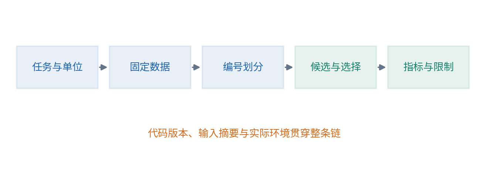

本讲把实验包拆成源材料与运行产物。源材料包括数据、划分文件、配置、代码与运行说明；运行产物包括选中模型、逐条预测、指标、环境记录和内容摘要。前者决定做什么，后者记录实际做到了什么。把旧输出拷贝到新目录不能代替重新执行。

公开研究中，对可复现性的系统要求已经超出“附一段代码”。Pineau 等人在机器学习可复现性研究中讨论了代码、实验细节与结果报告等实践。这里不把论文中的制度照搬成零基础门槛，而是先做一个自己能完整检查的小版本。[1]

## 二 先冻结一个具体任务

本实验规定：对每个独立生成的合成房屋，利用已知面积预测一个合成成交总价。输入为面积平方米，输出为总价万元。一行对应一套教学房屋，每套房屋只出现一次，不存在重复挂牌、楼栋关联和时间先后影响。后一条是生成机制的简化，不是对真实房屋的声明。

面积位于 40 到 100 平方米之间，基础关系为面积乘 2 再加 10，并加上预先生成的小幅波动。提供这个机制是为了让你知道“世界真相”在教学中如何构造；训练函数仍只读取训练记录，不直接把真实机制参数塞入结果。已知生成机制的模拟与现实未知机制研究，证据层级不同。

数据源文件 data/houses.csv 已随包给出。每条都有稳定 house_id、area_m2、price_wan。生成脚本作为材料来源说明保留，正常复现实验读固定 CSV，不在每次训练前随机生成另一批数据。如果每次运行都更换样本，却说结果不一致是软件不稳定，就混淆了输入变化与执行变化。

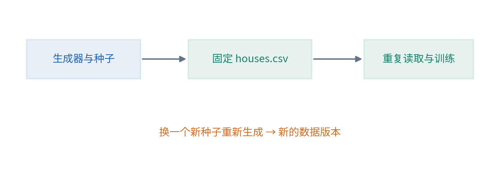

实际研究不一定拥有公开的生成机制，也未必允许公开原始数据。那时要报告来源、访问条件、数据版本和无法复现的限制，不能为了公开材料泄露个人信息。本讲使用合成数据，正是为了让所有必要内容都能合法、完整地随课程提供。

## 三 训练 验证与测试承担不同工作

训练集用于决定模型的可调参数。验证集用于在预先定义的方案之间作开发选择。测试集等最后方案确定后，再提供当前范围内的评价。三个角色的关键是信息如何被使用，而不是文件必须叫哪个英文名字。[2]

本讲六十条数据分为三十六条训练、十二条验证、十二条测试。这个比例只是教学安排，不是所有项目的最优规定。数据少、大量同组记录、时间依赖或类别稀少时，划分需要另作设计，第 50、51 讲会系统展开。

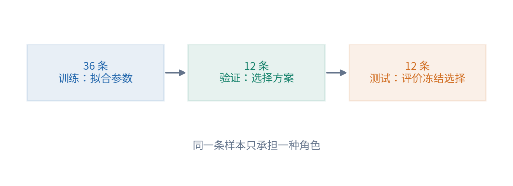

我们比较两个方案。常数方案先用训练价格均值确定一个固定预测；直线方案从事先列好的斜率与截距组合里，用训练 MAE 选出参数。然后在同一个验证集上比较这两个已经拟合好的方案，选择验证 MAE 更低者。最后只对这个冻结选择计算一次正式的教学测试指标。

这里存在两层选择：直线内的参数由训练数据决定，模型方案由验证数据比较决定。我们故意把候选数量设得很小，好让你能够看清每次决策。若不断观察验证结果后又添加新候选，验证集也逐渐参与更多开发；验证得分不能无限当作未见数据的证据。

## 四 把划分写成编号文件

仅说“随机分了六成训练”不足以复跑。不同随机状态可能给出不同编号，文件顺序改变也可能影响结果。本讲把每个 house_id 的角色写入 data/split.csv，并检查每个样本恰好属于一个角色。

检查包含四件事：数据编号唯一；划分编号唯一；两边编号集合完全相同；角色只允许 train、validation、test，数量分别符合约定。如果划分漏掉一条、重复一条或包含数据中不存在的编号，程序明确停止，不靠顺序凑齐。

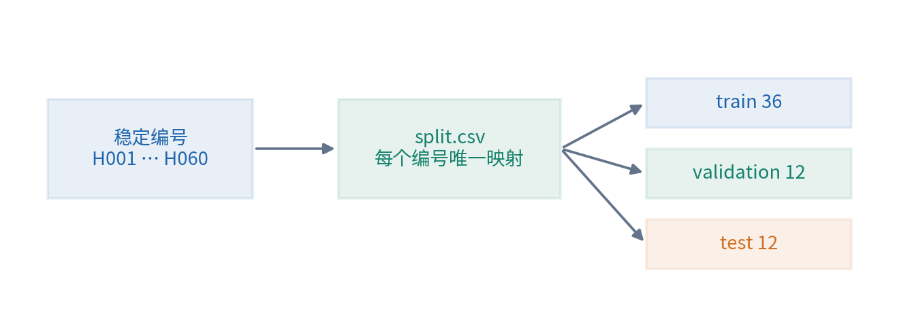

不要在数据表排序以后继续拿旧行号当样本身份。相同行号可能已对应另一套房屋。用稳定编号合并角色，再检查一对一关系，能够把排序与身份分开。第 6 讲的合并验证因此在整个实验包中再次出现。

本讲可以随机划分，是因为生成设计明确不存在重复实体和时间依赖。如果要预测下个月，或者同一人多次出现，就不能不加说明地照搬这个划分文件。可复现一个不合适的拆分，仍然只是稳定地复现一个不合适的实验。

## 五 随机种子记录了什么

伪随机生成器是一段有内部状态的程序。从相同初始状态出发，沿着相同调用顺序取数，通常能得到相同序列。随机种子帮助初始化这个状态；它不是某个样本的真实性保证，也不是统计稳健性的证明。

本讲生成数据和生成划分使用两个单独记录的种子。这样改变划分策略时，不会顺便让全部价格波动也变化。独立管理随机源，能让你在比较实验时更清楚究竟改变了哪一件事。

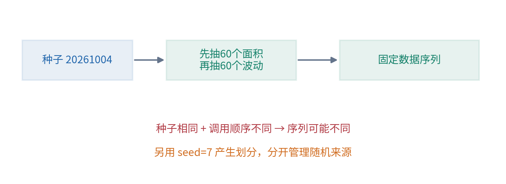

即使种子相同，换了随机数生成器、库版本、调用顺序或某些并行实现，也可能改变结果。NumPy 对随机流兼容性的官方说明给出了具体约束与边界。因而本讲优先保存生成后的教学数据与明确划分，而不只留一句 seed=某数就要求所有机器永远一致。[3]

没有随机性也不等于科学可靠。本讲固定网格搜索本身是确定性的，仍然会受到样本、任务和候选限制影响。固定种子回答“能否重复这一遍”，多次合理的预先设计实验才开始回答“现象是否对这些变化稳定”。两个问题不能混为一谈。

## 六 配置文件把选择从代码里拿出来

配置写入 config.json，包括候选斜率、候选截距、选择指标和并列规则。数据生成种子与划分种子也作为来源记录保存。你不需要在几个代码位置手工改数字，才能知道当前实验用了什么参数。

配置不是把每个细节都藏在一个大文件里。关键是让影响结果的选择有唯一、清楚的来源。例如候选斜率 [1.5,2.0,2.5] 与截距 [0,10,20] 形成九条直线，程序会完整计算它们的训练 MAE。名单在看最终测试之前固定，不能因为某条测试记录不合意又临时加入更合适的线。

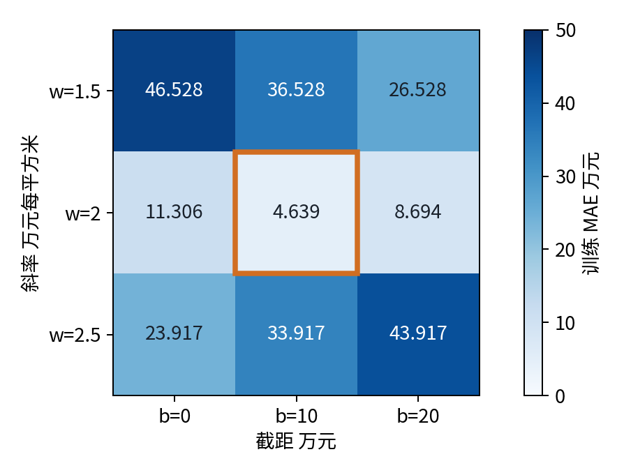

若两个候选训练分数并列，本讲按事先规定的候选顺序保留较早者；若两个方案验证分数并列，则按配置里的方案顺序保留较早者。并列规则对当前数据可能没有触发，但仍应写清，否则换一组数据时结果可能依赖无意的容器遍历顺序。

配置还约定数值比较的容差。程序要求容差有限且非负，候选网格非空且参数有限；不支持的并列规则会明确报错，不能记录一种规则却执行另一种。保存结果可以保留完整浮点值，展示时再适当取小数位。不要为让两次结果看起来一样，把所有指标过早四舍五入；这样可能掩盖实际差异。反过来，也不要把最后几位无关紧要的显示差异夸大成科学冲突。

## 七 训练与选择需要留下中间记录

直线方案的训练输出不仅是最后两个参数，也包括九个候选的训练 MAE。常数方案记录训练均值及其训练 MAE。验证输出保留两个方案的逐条预测与汇总分数，清楚说明选择依据来自哪批样本。

这能防止一种常见误解：只保留最后胜出的模型，别人却不知道比较过多少种方案，也不知道是否偷偷丢弃了不利结果。本讲只有两个方案与九条直线，很容易把完整记录全部保存。规模变大时，仍应保持可审查的实验日志与选择过程，而不是只展示最漂亮的一次。

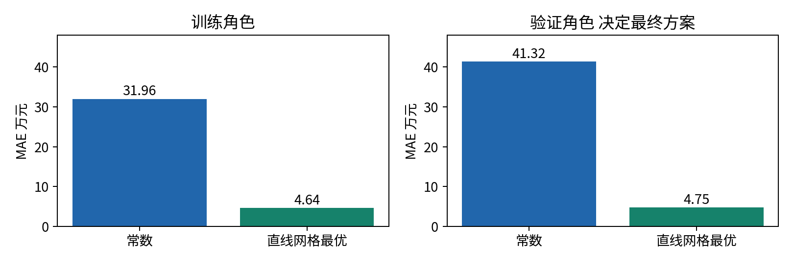

请从中选一条训练样本独立手算。例如面积为 x、标签为 y，候选斜率为 2、截距为 10，预测为 2x+10，误差为 |2x+10-y|。再核对代码保存的同一编号预测。一次手算不能检查全部程序，却能及时暴露单位、配对或公式复制错误。

常数基线使用训练价格的平均数，虽然对 MAE 来说样本中位数另有重要性质，本讲没有宣称均值是所有常数中 MAE 最优的值。它是一个明确、预先固定且容易核验的比较方案。后续课程会解释不同损失对应的最优估计，不在这里把方便基线误写成理论最优。

## 八 测试开封以后可以做什么

最终选择固定后，程序读取测试角色记录，生成逐条预测，计算测试 MAE，同时记录预定常数基线在同一测试样本上的分数。报告还保留每条绝对误差，防止只看平均数而忽略个别很大的偏差。

测试结果不理想时，可以提出新研究问题，也可以计划下一轮开发。但如果据此改候选、特征或代码，同一测试集就已经提供了开发反馈。下一轮不能继续把它描述成完全没参与决策的最终证据。真实项目通常需要新的独立评价材料或明确的评价协议。

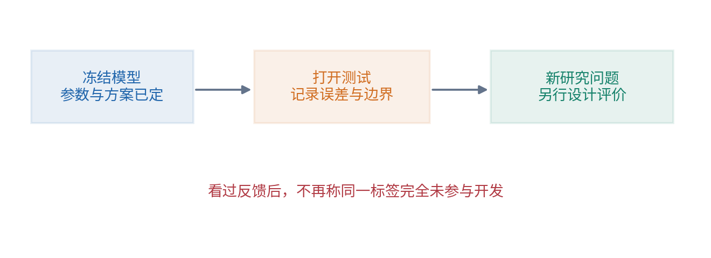

本课的所有标签公开，使用者也知道合成机制，所以“封存”主要是在演示程序与决策的分工。它不是加密系统，也不提供现实中的未知标签保证。不要把公开练习重跑包装成真实盲测；把限制写进报告，反而让这个实验更准确。

## 九 内容摘要能发现文件是否变化

一份文件可以计算 SHA-256 摘要。对同样字节序列得到同样摘要，文件内容一旦改变，摘要通常会改变。本讲记录数据、划分、配置与代码的摘要，让另一个人能快速检查自己拿到的是否是同一份输入版本。[4]

摘要不说明内容是否正确、是否合法，也不能保证文件来自可信作者。若有人恶意同时替换文件与记录的摘要，单靠一组公开字符串无法建立来源信任。这里使用摘要的目的较窄：让正常协作中意外改动、缺文件或版本混淆更容易被发现。

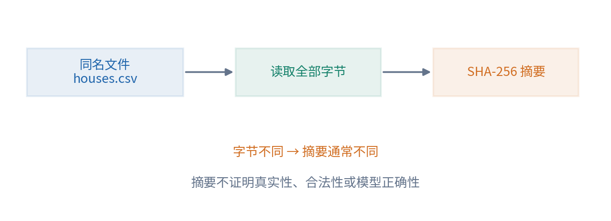

文件名、修改时间和摘要各有用途。文件名帮助定位角色，修改时间帮助观察操作，摘要帮助比较字节内容。修改时间可能因拷贝而变化，文件名可能保持不变而内容被替换，因此不能只靠其中一个就断言实验完全相同。

如果一个 CSV 只是换了换行方式，字节摘要可能改变，而数值内容相同。这并非摘要失效，而是它本来在回答字节是否相同。研究者可以另外做解析后的数据语义检查，但需要说明具体标准，不能把字节一致与科学等价当成同一概念。

## 十 环境说明与实际执行记录

environment 或 requirements 文件表达需要安装哪些软件及版本约束，实际运行记录则说明这一次到底用了什么。二者相关但不等价：写下 numpy 某版本不代表它已被成功安装；只记录操作系统名称也不能让别人知道依赖是否一致。

本讲程序记录 Python 与 NumPy 的实际版本，使用 CPU，不调用 GPU 或远程服务。安装说明给出最小依赖，Notebook 额外需要 Jupyter。教材制作的执行环境与学习者电脑未必完全相同，因此我们只报告真正验证过的范围，不承诺任何安装环境都不会失败。

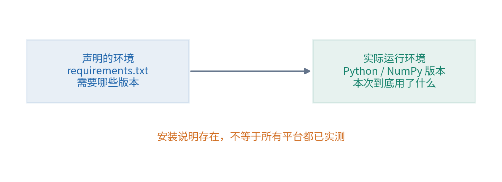

当前小程序主要使用稳定的数值操作，同文件同版本下期待结果在明确容差内一致。以后并行深度训练可能出现非确定性算子、硬件差异和更复杂的误差传播，不能把今天的小实验结论直接推广到所有系统。可复现性也可能有不同层次：相同输出、近似相同指标或相同结论，需要事先说明要求。

## 十一 在新进程里重跑而不是复用旧结果

运行一次完整脚本，关闭该进程，再在另一个新进程执行同样命令。比较数据摘要、划分摘要、配置摘要、选中参数、逐条预测与指标。程序还可以从不同工作目录启动，确认默认数据路径确实相对于项目，而不是偶然依赖终端所在位置。

Notebook 的对应检查是重启内核后全部运行，并确认输出来自本次执行。旧输出看起来正常，不代表当前代码仍能得到它。修改源文件后忘记重新执行，是把文档外观与计算证据混为一谈的典型情况。

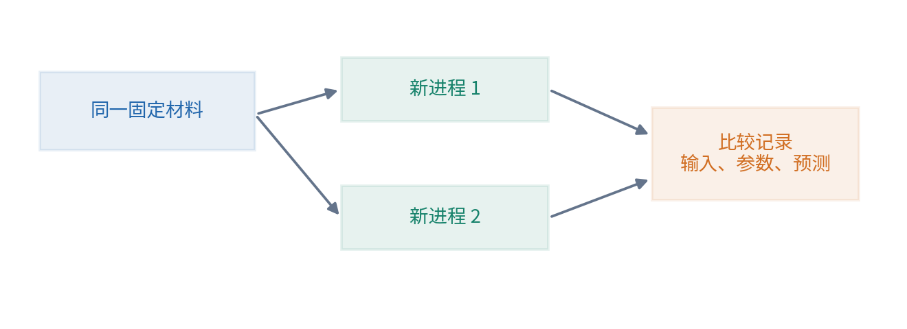

本讲验收会故意改变一个输入文件，让摘要不再匹配记录；也会从划分中删除一个编号，要求程序停止。这些检查不只是找故障，它们在验证我们的实验包能否告诉使用者“这已经不是同一个实验”。

## 十二 可复现与稳健不是同一个结论

如果每次运行都得到同样的测试 MAE，你只证明这一份材料和执行条件能够重复。换一批合理样本、换一个已预先约定的划分、改变测量误差或应用时间，结果可能不同。这种对合理变化的敏感性，需要另外设计实验。

本讲不把一个种子固定后得到的分数称为稳健。你可以在正式报告之外做探索：保留原始实验包，预先列出几个新的划分种子，每次保存完整成员与结果，把它们明确标为开发敏感性练习。不要挑其中最好一次再称它代表一般表现，也不要把这些探索与原来封存评价混在一个数字里。

对于更严谨的研究，重复次数、区间、配对比较、嵌套验证和计算预算都需要与问题相匹配。这些内容在第 25、26、50、51、53、133 讲展开。当前先建立边界意识：可重跑是可信证据的重要条件，单独并不足够。

## 十三 练习与详解

### 练习一 缺失信息

只收到模型文件与“MAE 4.7”，至少还要询问什么？解答：任务与单位、评价数据及来源、划分成员、训练与选择过程、评价指标定义、代码与依赖版本、运行步骤、逐条预测以及适用范围。若数据不能公开，应明确受限原因与可核查路径，不索要未经授权的私人材料。

### 练习二 训练均值基线

训练价格为 100、120、200，固定均值基线是多少？在标签 130、150 上的 MAE 又是多少？解答：均值为 140，测试误差为 10、10，MAE 为 10。均值只能用训练数据决定，不能在看到测试标签后再把固定值换成更合适的数。

### 练习三 验证角色

直线参数通过训练 MAE 选出，再用验证集在直线与常数之间选择。验证集有没有参与开发？解答：有，方案选择就是开发决策。验证分数可以解释为什么选择某方案，但不能再次被描述成完全未参与开发的最终评价。

### 练习四 划分身份

数据排序改变后，按旧行号重新切前36条作为训练是否等于原实验？解答：未必。样本成员可能改变。应该按保存的稳定编号映射角色，并检查编号集合完整、唯一与无交叉。

### 练习五 种子边界

同一个种子，先额外生成一个随机数再生成数据，为什么可能不同？解答：生成器状态已经前进一步，后续序列位置改变。相同种子不免除记录生成器、调用顺序和软件版本的责任。保存固定生成结果能减少这种歧义。

### 练习六 摘要含义

两份文件名字相同、摘要不同，能否认定其中一份是造假？解答：不能。可能是正常编辑、换行、排序或数据更新，也可能是错误。摘要提示字节不同，原因要进一步核查。它不直接判断真实性或意图。

### 练习七 结果覆盖

看到测试效果不好，改候选后覆盖旧结果目录，有什么问题？解答：丢失了开发轨迹，后续难以知道选过多少方案，也容易把参与反馈的测试当成独立证据。保留旧实验，给新配置新版本，并重新审视评价协议。

### 练习八 相同结果

重跑十次得到完全相同分数，能否说明对所有未来数据稳健？解答：不能。十次重复使用同样输入和确定过程，并没有提供十批独立的新证据。它验证重复执行，而不是总体泛化保证。

### 练习九 单位检查

把标签从万元改成元，预测仍输出万元，MAE 会发生什么？解答：两者不能直接相减作有意义的误差。必须先统一单位，不能把巨大的数当作模型突然失败，也不能只靠调参数弥补单位错误。

### 练习十 交付验收

请写出一个别人从头复跑本实验需要的最小材料清单。参考答案：README、固定数据、明确划分、配置、脚本、环境要求、预期结果与容差、逐条输出、版本摘要和限制说明。Notebook 提供学习过程，但不替代这些依赖。

## 十四 本讲完成后的能力

你应当能从一个新进程重跑基线，解释训练、验证与测试分别参与哪次决定，核对固定划分成员，读懂配置与摘要，定位一次版本变化，并把结果写成有边界的陈述。只把文件放进一个目录、或者只固定随机种子，都没有完成这项能力。

至此，课程的共同起点已经形成：把问题说清，把数据来路看清，把计算拆开，再把实验完整交给别人。之后学习数学与模型时，推导和实现都有一个可以接住它们的实验框架。第 8 讲开始把函数、符号、逻辑与证明语言展开，让我们不只会运行，也能更准确地说明结论为何成立。

## 参考资料 核验于2026年10月4日

[1] Pineau 等，[机器学习可复现性研究](https://jmlr.org/papers/v22/20-303.html)，JMLR 2021。

[2] scikit-learn 官方文档，[常见错误与推荐实践](https://scikit-learn.org/stable/common_pitfalls.html)。

[3] NumPy 官方文档，[随机数流兼容条件](https://numpy.org/doc/stable/reference/random/compatibility.html)。

[4] Python 官方文档，[hashlib 内容摘要接口](https://docs.python.org/3/library/hashlib.html)。

