# 函数代数与数学表达

## 第八讲 把一个小预测模型说清 算清 并说明为什么

你已经能让 Python 重复加减乘除，也见过从输入得到预测的规则。现在我们暂停增加软件工具，转而追问：同一句规则写成文字、公式、表格和程序，意思真的完全一样吗？如果一条公式在五个例子上都算对了，能不能说它对所有输入都成立？如果代数变形看起来漂亮，却偷偷除以了零，计算还可信吗？

本讲围绕一台虚构设备的处理时长展开。输入是工作量的数值，输出是预计需要的分钟数。我们先把一个小模型写准确，再给它接上平方、指数和对数变换，汇总几条误差，最后区分可以证明的结论与只能观察到的数值现象。集合、逻辑、量词和归纳证明都会从这个过程中自然出现。

直接先修只有第三讲。你需要加减乘除、变量、列表、条件、循环，以及“小数运算有时只是近似”的认识。不要求学过第四至第七讲，更不要求微积分、线性代数或概率。随附程序使用一些封装好的辅助步骤；你可以先整本运行，不必把本讲变成一次程序结构考试。

所有设备、测量和数值都是原创合成教学内容。本讲不声称这些规则能预测任何真实设备。数学上定义得正确，与经验上适合真实任务，是两个要分别检查的问题。

## 一 同一个规则的四种写法

设一次工作量记录的数值为 $x$。我们约定一个工作量单位为固定的标准份额，$x$ 表示实际工作量除以这一份额后得到的数值，因此 $x$ 没有单位。$x=1.5$ 表示一点五个标准份额，不要求输入一定是整数。预测时长的数值记为 $\hat y$，把它乘以 1 分钟才得到有单位的时长。

先用文字规定：“把工作量数值乘以 2，再加 1，结果作为预测时长的分钟数。”把这句话写成公式就是

$$\hat y=2x+1.$$

字母上面的帽子表示预测，不是实际测到的答案。$2x$ 是 $2\times x$ 的简写，数字与字母相邻通常表示乘法。这里的加 1 可以理解为这条教学规则中的固定部分，但不能仅凭公式就断言它真的测量了某台机器的启动开销。

例如输入 $x=2$ 时，先做 $2\times2=4$，再做 $4+1=5$。结果是预测 5 分钟。输入 $x=1.5$ 时，$2\times1.5+1=4$，预测 4 分钟。括号和运算顺序很重要：“先乘 2 后加 1”不是“先加 1 后乘 2”。后者在 $x=2$ 时给出 $2(2+1)=6$。

把几个输入逐个代入，可以写成一张对应表：

| 工作量数值 $x$ | 预测时长数值 $\hat y$ |
|---|---|
| 0 | 1 |
| 1 | 3 |
| 2 | 5 |
| 3 | 7 |
| 4 | 9 |

这张表提供五个具体对应关系。如果只给表、不提供公式，它本身不会告诉我们 $x=1.5$ 应得到什么。正是额外写出的公式，让我们能够计算未列出的合法输入。不要把“五行都符合某公式”反过来理解为“只有这一种公式能符合五行”。本讲后面会构造一个反例。

在 Python 中，同一条规则可以写成 y_hat = 2 * x + 1。星号表示乘法，等号表示把右边算出的结果赋给左边变量；数学里的等号则表示两边数量相等。写法相似，语义不同。比如 x = x + 1 在 Python 中可以更新变量；作为普通实数等式，它没有解，因为两边同时减去 $x$ 会得到 $0=1$。

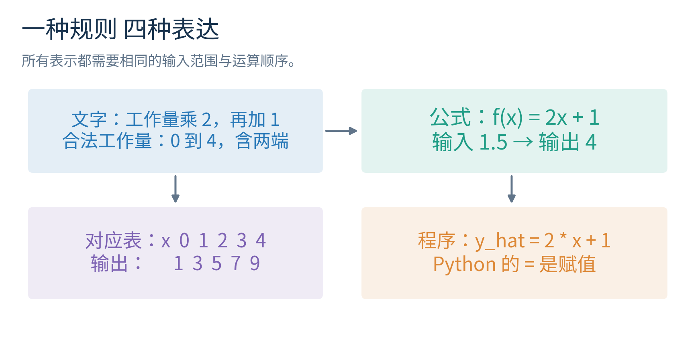

本讲的四种表示应能互相核查：文字规定操作顺序，公式说明一般关系，表格给具体实例，程序负责重复执行。每一种都有长处，也都有可能漏掉条件。接下来要补上的关键条件是：哪些输入允许交给这条规则？

## 二 函数是一份带输入范围的规则

我们给整条规则起名叫 $f$，写成 $f(x)=2x+1$。这里 $f$ 是规则的名字，$f(x)$ 是把 $x$ 交给规则后得到的输出。$f(2)=5$ 读作“函数 $f$ 在输入 2 时的值是 5”。括号表示输入，不是把字母 $f$ 乘以 $x$。

函数要求每个允许的输入恰好对应一个输出。同一个合法输入不能一会儿规定输出 5，一会儿又规定输出 8，而没有说明另一项变化的输入。不同输入倒是可以得到相同输出，例如“将工作量按高低分成两档”的规则可以让很多工作量都落在同一档。唯一性的要求是从输入向输出看，不是要求两边必须一一对应。

本讲先把模型允许接收的输入限定在 0 到 4 之间，含两端。这个输入集合叫定义域，记为

$$D=[0,4]=\{x\in\mathbb R:0\leq x\leq4\}.$$

方括号表示包含端点；$\mathbb R$ 表示实数，可以暂时理解为数轴上的数，包括整数、分数以及无法写成整数之比的数。符号 $\in$ 读作“属于”；花括号表示集合；冒号读作“满足后面的条件”。整个式子只是把“所有从 0 到 4 的实数”写紧凑。

如果不包括端点，使用圆括号，例如 $(0,4)$ 不含 0 和 4。$[0,4)$ 含 0 但不含 4。写在函数名后面的 $f(x)$ 与写在区间边上的圆括号含义不同，应结合位置阅读。我们不靠符号形状孤立猜意思。

函数还可以指定一个输出要落入的集合，叫陪域。例如写 $f:D\to\mathbb R$，表示从定义域 $D$ 取输入，输出是实数。箭头 $\to$ 在这里描述输入输出方向。真正能取到的输出组成值域，记为 $f(D)$。对于本例，值域恰好是 $[1,9]$，它比陪域 $\mathbb R$ 小。

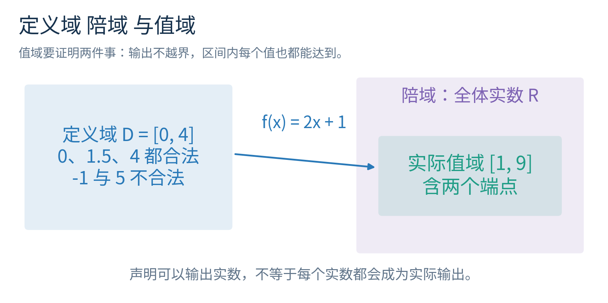

为什么值域恰好是 $[1,9]$？先说明不会跑出去。若 $0\leq x\leq4$，两边各乘正数 2，得到 $0\leq2x\leq8$；再各加 1，得到 $1\leq2x+1\leq9$。因此每个输出都在 1 和 9 之间。

但这只证明值域包含在那个区间里，尚未证明其中每个数都能得到。反过来，任取 $t\in[1,9]$，设 $x=(t-1)/2$。因为 $0\leq t-1\leq8$，除以正数 2 后有 $0\leq x\leq4$，所以这个输入合法。代回去：$f(x)=2(t-1)/2+1=t-1+1=t$。区间里的任意 $t$ 都有合法输入对应，才说明值域就是整个 $[1,9]$。

这里已经出现一个完整的小证明：先排除范围外，再保证范围内都能达到。没有用导数，也没有因为画起来像一条线就跳过理由。OpenStax 的函数章节用于核查函数与不同表示法的基本定义；本讲的设备规则、数值与图均为独立构造。[资料1](https://openstax.org/books/precalculus-2e/pages/1-1-functions-and-function-notation)

## 三 公式可以延伸 不等于任务已经允许

代数表达式 $2x+1$ 在 $x=10$ 时也能算出 21。可是我们刚才定义的函数只允许 $x\in[0,4]$。因此严格地说，这个受限模型没有为输入 10 提供输出；若程序默默算出 21，就是执行了比任务说明更大的输入范围。

有时我们会另行定义 $F(x)=2x+1$，让 $F$ 的定义域成为全部实数。这在数学上完全允许，但 $F$ 与前面的受限函数 $f$ 具有不同定义域。它们在共同范围上使用相同表达式，不代表两者作为完整函数毫无区别，更不代表扩展后的真实预测能力已经得到验证。

类似地，一个公式可能在某处本来就无法进行实数运算。$r(x)=1/x$ 不允许 $x=0$，因为不存在一个实数乘以 0 后等于 1。$s(x)=\sqrt{x}$ 在本讲的实数范围里要求 $x\geq0$，因为实数的平方不可能是负数。以后可以研究复数，但本讲不能默默把问题换到复数领域。

这里 $\sqrt{x}$ 表示平方后等于 $x$ 的非负数，称为主平方根。$\sqrt{9}=3$；方程 $u^2=9$ 却有 $u=3$ 和 $u=-3$ 两个解。一个是约定好输出的函数，另一个是在寻找满足关系的所有数，不能混用。

实际数据也不必让同一个 $x$ 总对应同一个测量值。设备可能受其他未记录因素影响，两次同工作量的真实时长不同。我们仍可用函数给出一个固定预测，只是它未必等于每次观测。函数的单值性要求针对模型规定，不是要求世界没有变化或测量误差。

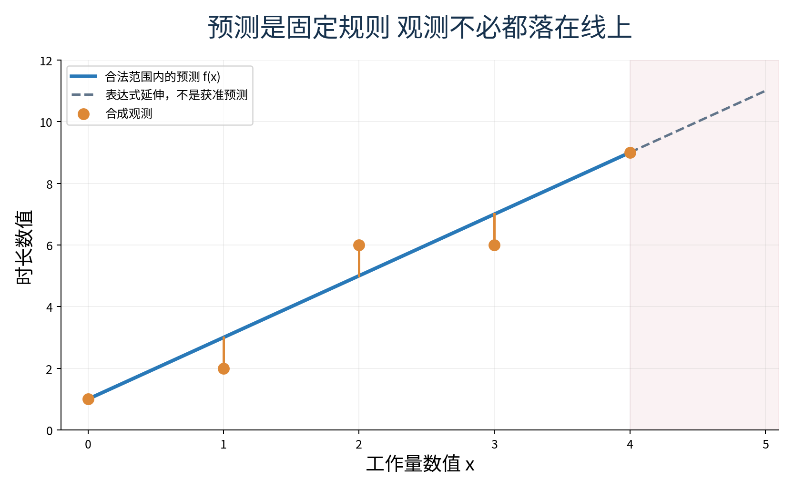

本讲的五条观测时长为 1、2、6、6、9 分钟，分别对应输入 0、1、2、3、4。预测仍是 1、3、5、7、9。我们稍后会汇总这些差异，但先不调整模型参数。先把表达式读准，才能说清后续究竟要调整什么。

## 四 代数变形要保留成立条件

现在问：哪一个输入会让模型预测 7 分钟？这要求解 $f(x)=7$。先代入函数规则，得到 $2x+1=7$；两边同时减 1，得到 $2x=6$；两边同时除以非零数 2，得到 $x=3$。最后检查 $3\in[0,4]$，并代回 $2\times3+1=7$。解方程不只是在纸上移项，还包括检查候选解是否属于原定义域。

把模型暂时写成 $ax+b=t$，其中 $a,b$ 是已经选定的参数，$t$ 是目标输出。先两边减 $b$，得到 $ax=t-b$。只有在 $a\neq0$ 时，才能除以 $a$，得到 $x=(t-b)/a$。符号 $\neq$ 表示不相等。若 $a=0$，原式变成 $b=t$：当两者相等时，每个合法输入都是解；不相等时，没有解。直接套除法公式会漏掉整个分支。

括号展开也应能说出理由。$2(x+1)=2x+2$ 来自把外面的 2 分别乘给里面两项，这叫分配律。$(x+1)^2$ 表示 $(x+1)(x+1)$，展开先得到 $x^2+x+x+1$，合并才是 $x^2+2x+1$。它一般不等于 $x^2+1$；输入 $x=1$ 时，两者分别为 4 和 2，已经足以否定这个错误恒等式。

再看容易隐藏条件的约分：

$$\frac{x^2-1}{x-1}=\frac{(x-1)(x+1)}{x-1}=x+1,\qquad x\neq1.$$

第一步可用展开验证：$(x-1)(x+1)=x^2+x-x-1=x^2-1$。第二步除去共同因子 $x-1$，必须要求它不等于零。在原式中 $x=1$ 使分母为零；变形后的 $x+1$ 虽然在 1 能算出 2，也不能给原函数补回一个原本不存在的值。等价改写要保留原定义域。

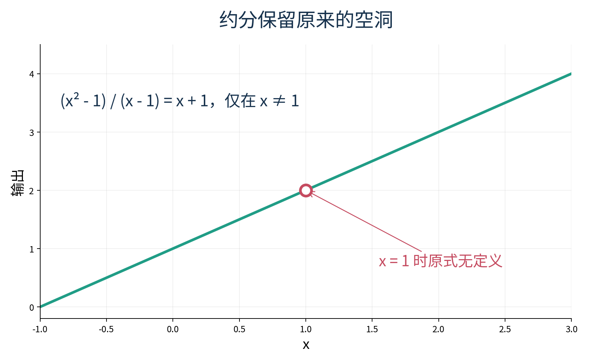

并非所有操作都保持解集合不变。由 $u=v$ 可以推出 $u^2=v^2$，反过来却不总成立：$u=2,v=-2$ 时平方相等，原数不相等。两边平方可能增加候选解，所以要回代原式。由 $u<v$ 两边乘正数仍保留方向；乘负数则反向，例如 $1<2$ 乘 $-1$ 后是 $-1>-2$。每次变形都问一句“这一步需要什么条件”，比熟背一个没有条件的口诀可靠。

## 五 函数复合意味着先后执行

有时我们关心的不是预测时长本身，而是对预测值继续做一个变换。定义 $g(t)=t^2$，其定义域为全部实数。先把输入 $x$ 交给 $f$，再把结果交给 $g$，称为复合，写作

$$(g\circ f)(x)=g(f(x))=(2x+1)^2.$$

小圆圈 $\circ$ 是复合符号，不是普通乘法；最右边的函数先执行。输入 $x=1$ 时，$f(1)=3$，然后 $g(3)=9$。所以 $(g\circ f)(1)=9$。这仍只是一个数值变换；平方后的量如果按时长解释，其单位会是分钟的平方，不能继续不加说明地称作分钟。

把顺序反过来，先平方再预测，得到

$$(f\circ g)(x)=f(g(x))=2x^2+1.$$

同样输入 1，先得到 $g(1)=1$，再得到 $f(1)=3$。9 与 3 不相等，说明复合通常不能交换顺序。程序里 g(f(x)) 与 f(g(x)) 也应当得到不同结果，而不是因为用了相同两个函数就当作同一操作。

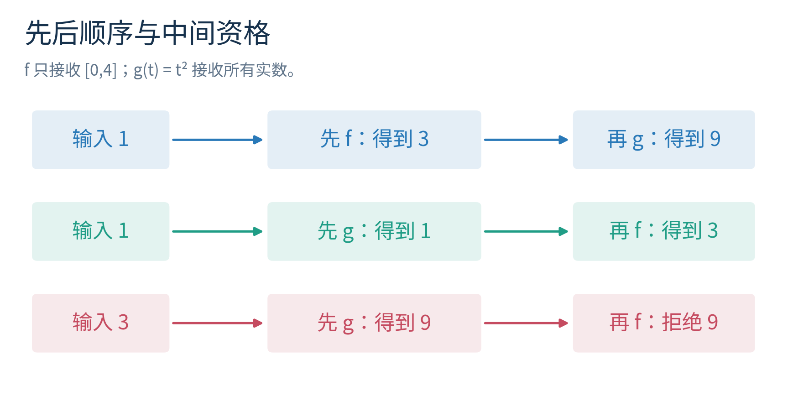

还要检查中间结果是否被下一步接收。$g\circ f$ 对 $x\in[0,4]$ 都合法，因为 $f(x)$ 是实数，$g$ 接收全部实数。$f\circ g$ 要求 $g(x)=x^2\in[0,4]$，所以输入只能满足 $-2\leq x\leq2$。这一点可以由平方的几何或绝对值理解：离零的距离不能超过 2。

输入 $x=3$ 时，$g(f(3))=7^2=49$ 合法；但 $f(g(3))=f(9)$ 超出了 $f$ 的定义域，不能直接算作受限模型的结果。若有人输出 19，它用的是延伸表达式 $F(9)$，不是我们原先声明的 $f(9)$。这类差异在数据预处理接模型时很常见：每一块单独有定义，不等于接在一起对每个输入都合法。

## 六 幂从重复乘法开始

平方只是幂的一种。$b^n$ 中，$b$ 叫底数，$n$ 叫指数。正整数 $n$ 表示把 $b$ 自己乘 $n$ 次。例如 $2^3=2\times2\times2=8$，不是 $2\times3=6$。Python 用 2 ** 3 表示这种幂运算，不能用 2 ^ 3 替代；后者在整数中有其他含义。

为了把规则扩展得一致，对非零 $b$ 规定 $b^0=1$，并规定 $b^{-n}=1/b^n$。负指数不是让结果变负；$2^{-3}=1/8$。因为 $2^3\times2^{-3}=8\times1/8=1=2^0$，这种规定保留了乘同底数幂时指数相加的关系。涉及 $0^0$ 或 0 的负指数时，不在本讲规则里随意套用；程序必须采用明确约定或拒绝不支持的输入。

对于正整数指数，同底数幂的乘法规则可以从数因子得到。$b^m$ 有 $m$ 个 $b$，$b^n$ 有 $n$ 个 $b$，连起来共有 $m+n$ 个，因此 $b^m b^n=b^{m+n}$。若 $b\neq0$，除法取消共同因子后得到 $b^m/b^n=b^{m-n}$。幂的幂 $(b^m)^n=b^{mn}$，因为共有 $n$ 组、每组 $m$ 个因子。不要把 $(b^m)^n$ 误写成 $b^{m+n}$。

本讲接下来为讨论任意实数指数，把底数限制为 $b>0$。对于分数指数，$b^{1/q}$ 是其 $q$ 次方等于 $b$ 的正数，$q$ 为正整数；$b^{p/q}$ 可以理解为这个正根的 $p$ 次幂。例如 $9^{1/2}=3$，$9^{3/2}=3^3=27$。负底数在不同分母下可能有或没有实数值，为避免混淆，我们不在同一套通用规则里处理它。

实数指数还包括不能写成整数之比的指数。可以直观地把 $b^t$ 理解为将分数指数越来越细地补齐，得到与指数规则和连续变化相一致的值。“连续”在这里先理解为没有突然跳跃；其严格定义、存在性与唯一性证明需要后面的数学工具，本讲不冒充已经证明。我们以这些标准实数指数性质为已说明的基础，继续推导对数规则。

## 七 指数和对数回答相反的问题

如果一个伸缩因子每增加一步就翻倍，从 1 开始，走 $t$ 步对应 $2^t$。正着问“走 3 步得到多少”，答案是 $2^3=8$；反着问“得到 8 需要多少步”，答案是 3。反向这件事就是对数。

对数的定义写为

$$\log_b u=t\quad\Longleftrightarrow\quad b^t=u.$$

$\log$ 表示对数，下面的 $b$ 是底数，$u$ 是真数，也就是送进去的正数量；$\Longleftrightarrow$ 表示左右互相成立，读作“当且仅当”。在本讲的实数对数里，条件是 $b>0$、$b\neq1$、$u>0$。

底数为何不能是 1？因为 $1^t$ 总是 1，无法由输出唯一反推出 $t$；对于输出 2 更没有任何 $t$。真数为何要正？正底数的实数次幂总为正，不能得到 0 或负数。底数为何要求正？这样实数指数才形成我们正在使用的完整、单值、连续体系。某些负底数整数幂能计算，不足以定义面向所有正真数的同类实数对数。

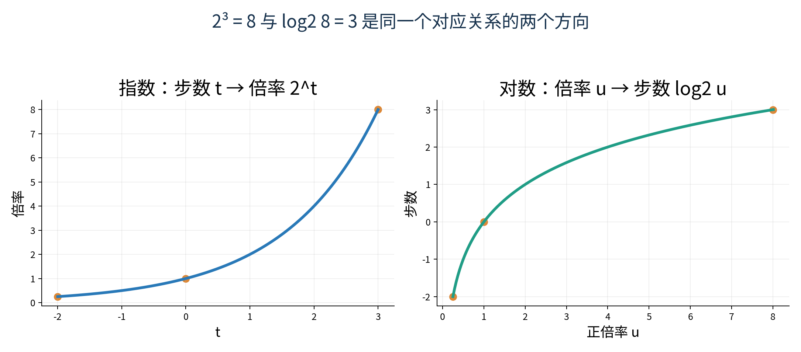

几个值可以不靠计算器：$\log_2 8=3$，因为 $2^3=8$；$\log_2 1=0$，因为 $2^0=1$；$\log_2(1/4)=-2$，因为 $2^{-2}=1/4$。对数可以是负数；被取对数的真数却必须正。这两个位置不要混淆。

底数介于 0 和 1 之间也合法。例如 $(1/2)^3=1/8$，所以 $\log_{1/2}(1/8)=3$。这时真数越大，对数反而越小。不要从常见的底数 2 或 10 推广成“所有对数都随真数增加而增加”。

回到时长模型，我们有时只想报告预测时长相对于 1 分钟的倍数，再取以 2 为底的对数。那个比值的数值恰好是 $f(x)$，所以可以写 $\log_2 f(x)$。合法输入 $x\in[0,4]$ 使 $f(x)\in[1,9]$，始终为正，复合通过定义域检查。我们是在对无单位比值取对数，没有把“分钟”本身直接放进对数里。

模型输出 1、3、5、7、9 时，相应对数约为 0、1.585、2.322、2.807、3.170。对数压缩了这些数之间的数值距离，但并没有自动提升模型。若对预测和观测取对数后再计算差异，实际上改变了比较尺度，必须说明新指标代表什么。

## 八 把对数规则推出来 再检验条件

设 $u>0,v>0$，底数满足 $b>0,b\neq1$。令 $p=\log_b u$、$q=\log_b v$。按定义，$u=b^p$、$v=b^q$。于是

$$uv=b^p b^q=b^{p+q}.$$

现在问“以 $b$ 为底得到 $uv$ 需要什么指数”，上式已经告诉我们是 $p+q$。因此

$$\log_b(uv)=p+q=\log_b u+\log_b v.$$

这就是乘积规则。它不是把括号内每个符号机械搬出来，而是用指数相加表达乘法。每一步都依赖合法对数以及相应指数性质。

商的规则也同样展开。因为 $v=b^q>0$，分母不为零；$u/v=b^p/b^q=b^{p-q}$。所以

$$\log_b(u/v)=p-q=\log_b u-\log_b v.$$

对于实数 $r$，在标准正底数实数指数规则下，$u^r=(b^p)^r=b^{pr}$，所以

$$\log_b(u^r)=pr=r\log_b u.$$

这给出幂规则。若只想在当前能彻底手算的范围核验，可先令 $r$ 为小整数或简单分数；推广到所有实数时，用到了前面明确说明、没有在本讲重新证明的实数指数性质。这样的证明依赖关系应当明说。

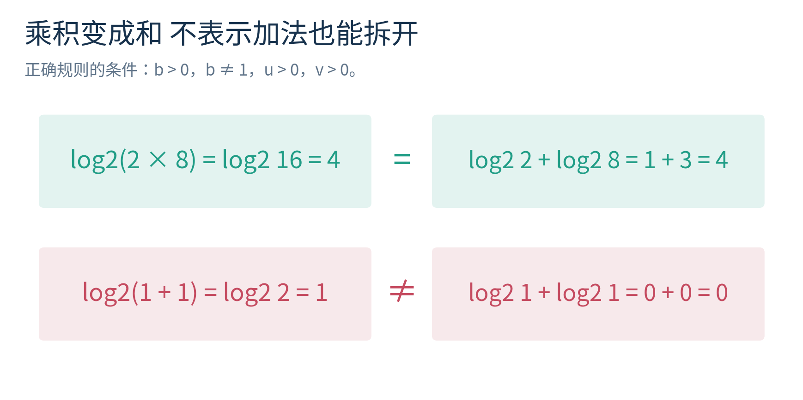

例如 $\log_2(2\times8)=\log_2 16=4$，右边是 $\log_2 2+\log_2 8=1+3=4$。商例子是 $\log_2(8/2)=2=3-1$。幂例子是 $\log_2(8^2)=6=2\times3$。我们既有符号推导，也有具体数字交叉核验；数字符合规则是有用检查，但不能替代一般推导。

错误规则 $\log_b(u+v)=\log_b u+\log_b v$ 很常见。取 $b=2,u=1,v=1$，左边是 $\log_2 2=1$，右边是 $0+0=0$，立刻矛盾。这组合法输入就是反例：只需一个满足题设却违反结论的例子，就能否定“总是成立”的主张。

另一个陷阱是 $\log_b(x^2)=2\log_b x$。右边要求 $x>0$；左边只要求 $x\neq0$，因为平方后为正。取 $x=-2,b=2$，左边是 2，右边在实数范围根本没有定义。不能说两边“恰好不相等”；应先说右边不合法。若要覆盖所有非零实数，正确改写是 $\log_b(x^2)=2\log_b|x|$，其中 $|x|$ 表示离 0 的距离，保证 $|x|>0$。

还有 $u=-2,v=-8$，乘积 $uv=16$ 为正，$\log_2(uv)$ 合法，但 $\log_2 u+\log_2 v$ 两项均不合法。原式合法不保证拆开的每个子式合法。OpenStax 的对数性质一节用于核查乘积、商和幂规则；这里特别保留了使用条件与失败输入，防止把公式当成无条件字符串替换。[资料2](https://openstax.org/books/precalculus-2e/pages/4-5-logarithmic-properties)

## 九 自然对数与换底

有一个常用的正数 $e\approx2.71828$，以它为底的对数叫自然对数，记为 $\ln u$。本讲可以把 $e$ 看作一个特殊但固定的合法底数；一种直观刻画来自 $(1+1/n)^n$ 随正整数 $n$ 增大所接近的数。这里“接近”指越来越细的近似，而本讲不证明这个序列收敛或为何在微积分中格外自然。

对数换底不需要微积分。令 $t=\log_b u$，于是 $u=b^t$。选另一个合法底数 $c$，两边取对数，借助幂规则得到 $\log_c u=t\log_c b$。因为 $b\neq1$，有 $\log_c b\neq0$，因此可以除以它，得到

$$\log_b u=\frac{\log_c u}{\log_c b}.$$

例如用自然对数表示就是 $\log_b u=\ln u/\ln b$。你可以看到，换底公式最后一步同样有非零条件；先前代数中的除法资格并没有因为换了符号就消失。

Python 的 math.log(u) 默认使用自然对数；math.log(u, b) 指定底数；math.log2(u) 专门计算以 2 为底的对数。官方文档注明两参数形式使用自然对数之比，而 log2 通常比直接换底的写法更准确。我们只使用这些已有接口，不在本讲实现对数计算器。[资料4](https://docs.python.org/3/library/math.html)

当底数非常接近 1，$\ln b$ 很接近 0，换底时要除以一个小量，结果可能对误差更敏感。这不意味着数学定义失效，但提醒我们区分数学定义域和机器数值范围。有限精度电脑还可能遇到特别大的指数溢出、特别小的数下溢；不是所有数学上合法的数都能以同样精度直接计算。

## 十 求和符号是在说明怎样重复加法

现在重新查看五条合成观测。按顺序给样本编号 $i=1,2,3,4,5$。$i$ 是索引，用来说明正在谈第几条，不是新的测量值。令输入为 $x_i$，观测时长数值为 $y_i$，预测为 $\hat y_i=f(x_i)$。这五个输入是 $x_1=0,x_2=1,x_3=2,x_4=3,x_5=4$。

定义带方向的差 $r_i=\hat y_i-y_i$。逐条得到 $0,1,-1,1,0$。把它们平方得到 $r_i^2=0,1,1,1,0$。平方可以避免正负抵消，但结果代表平方差，单位若恢复为时长则是分钟的平方，不能不加说明地称为分钟误差。

将五个平方差相加，可以写

$$S=\sum_{i=1}^{5}r_i^2=0+1+1+1+0=3.$$

大写的希腊字母 $\sum$ 读作“求和”。下面 $i=1$ 表示从第一项开始，上面 5 表示到第五项结束，右边 $r_i^2$ 表示每一项怎么算。它并不是一个新算法，只是把“依次取值再相加”压缩成标准写法。

把 5 改成任意正整数样本数 $n$，得到 $S=\sum_{i=1}^{n}r_i^2$。平均平方差再除以样本数：

$$\operatorname{MSE}=\frac{1}{n}\sum_{i=1}^{n}r_i^2.$$

MSE 是 mean squared error 的缩写。本例是 $3/5=0.6$。这只是已指定模型在这五条记录上的描述，不包含任何泛化保证。若 $n=0$，这个平均数不能直接算，程序应报告没有样本，不能偷偷除以零或把空平均写成 0。

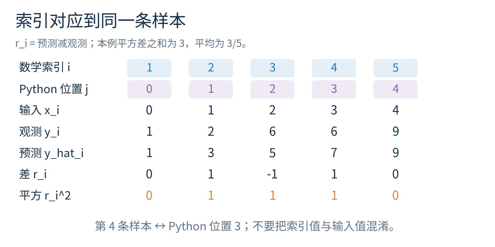

Python 列表的第一个位置编号是 0。因此数学上的第 $i$ 条对应列表位置 $j=i-1$。如果数学写 $i=1$ 到 $n$，Python 常写 for j in range(n)，取到 $j=0,1,\ldots,n-1$。终点 n 不包含在 range(n) 内。循环中读取 xs[j]、ys[j]，就应始终指同一条记录。

求和索引的名字可以换：$\sum_{i=1}^{n}r_i^2=\sum_{k=1}^{n}r_k^2$，因为只是把临时计数的名字从 $i$ 改成 $k$。但不能只改下面的字母，不改项里的字母；也不能把 $r_i^2$ 随手换成 $r_n^2$，后者会把同一项重复加 n 次。

在有限求和中，可以逐项展开验证 $\sum_{i=1}^{n}(a_i+b_i)=\sum_{i=1}^{n}a_i+\sum_{i=1}^{n}b_i$。常数 $c$ 不随 $i$ 改变时，$\sum_{i=1}^{n}c=nc$。但 $\sum_{i=1}^{n}r_i^2$ 一般不等于 $(\sum_{i=1}^{n}r_i)^2$。本例前者为 3，后者为 $(0+1-1+1+0)^2=1$。括号内外的顺序又一次改变了问题。

## 十一 乘积符号与累计倍率

若重复的是乘法，就用 $\prod$，读作“求积”。例如

$$\prod_{i=1}^{3}q_i=q_1q_2q_3.$$

设三次缩放倍率为 $q_1=2,q_2=1/2,q_3=3$。从初始数值 1 开始，依次变成 2、1、3，所以累计倍率是 $2\times(1/2)\times3=3$。把倍率相加得到 5.5 没有表达这串连续缩放。

对于正倍率，前面推导的对数乘积规则可以反复使用：

$$\log_b\left(\prod_{i=1}^{n}q_i\right)=\sum_{i=1}^{n}\log_b q_i,\qquad q_i>0.$$

当 $n=3$ 时，先把三项乘积分成 $(q_1q_2)q_3$，得到 $\log_b(q_1q_2)+\log_b q_3$，再将第一项展开成 $\log_b q_1+\log_b q_2$。三项加起来正是右边。以后研究概率模型时还会遇到这种把乘法变成加法的表达，但本讲不需要概率知识。

空求和约定为 0，空乘积约定为 1。这是为了让“什么都还没加”和“什么都还没乘”的初始状态保持不变：给已有数加 0 不改变它，乘 1 不改变它。它们不意味着空数据的平均误差也有定义；平均仍要除以样本数，而 0 个样本无法提供这个分母。

有些乘积很小，直接相乘在浮点数中可能下溢成 0，但各因子的对数仍可相加。这个现象将在数值计算中进一步研究。当前只需记住，数学上的等价表达式在有限精度机器上未必同样稳定，程序验证必须说明数值范围和容差。

## 十二 集合把条件与对象写清楚

前面用集合描述定义域，现在用它来描述“哪些样本符合条件”。设 $I=\{1,2,3,4,5\}$ 为样本索引集合，$A=\{i\in I:r_i>0\}$ 表示被高估的样本。将差值 $0,1,-1,1,0$ 代入，得到 $A=\{2,4\}$。

令 $B=\{i\in I:r_i\neq0\}$ 为预测不等于观测的样本，得到 $B=\{2,3,4\}$。$A\subseteq B$ 读作“A 是 B 的子集”，意思是 A 中每个对象也在 B 中。这里每次高估当然也算预测不等，但预测不等还包括低估的第 3 条。

$A\cap B$ 表示同时属于两者的交集，本例为 $\{2,4\}$；$A\cup B$ 表示至少属于一个的并集，本例为 $\{2,3,4\}$。$I\setminus B$ 表示在 I 中却不在 B 中的差集，得到 $\{1,5\}$。$|B|=3$ 表示集合里有三个不同元素；这些竖线包围集合时表示计数，包围实数时表示绝对值，阅读时要辨认对象类型。

集合不按重复次数计数，也不依赖排列顺序。$\{2,4,2\}$ 与 $\{4,2\}$ 是同一集合；列表 [2,4,2] 却有三个位置，能保留重复。对数据作求和时，不能因为测量值相同就用集合自动去重，否则会改变样本次数。数学集合用于表达身份和条件，数据序列还要保留记录顺序与出现次数。

## 十三 命题 条件 与逻辑连接

“这个模型很好”缺少可判断标准，难以作为数学命题。“对于 $x=2$，$f(x)=5$”则有明确真假，可以代入核对。含有尚未确定变量的条件，例如 $x>0$，真假依赖选的是哪个 $x$；给出变量范围和选择方式后，才成为完整陈述。

常用的连接有“且”“或”“非”。$P\land Q$ 表示 P 和 Q 都成立；$P\lor Q$ 表示至少一个成立，包括两者都成立；$\neg P$ 表示 P 不成立。符号只是日常词语的缩写。比如实数对数的资格可以说成“底数正，且底数不等于 1，且真数正”。漏掉任何一个条件都可能接收非法输入。

“如果 P，那么 Q”写作 $P\Rightarrow Q$。它不声称 Q 只能由 P 导致，也不说明时间上的因果。例如“$x>0$ 则 $x^2>0$”成立；反过来“$x^2>0$ 则 $x>0$”不成立，$x=-1$ 是反例。原命题与其逆命题是不同的两句话。

一个条件命题只会被“P 成立而 Q 不成立”的例子推翻。如果 P 没成立，这个例子并没有检验承诺触发后的结果。在形式逻辑中，前提为假时 $P\Rightarrow Q$ 判为真，意思是没有违反这项条件承诺，不表示已经给 Q 提供了事实证据。把这点与日常语言分开，可以避免对空集合等边界情况的误读。

$P\Longleftrightarrow Q$ 要求两个方向都成立。比如在本讲定义域中，$f(x)=7$ 当且仅当 $x=3$，我们既能从等式解出 3，也能代入 3 得到 7。要证明“当且仅当”，只完成一个方向不够。

对模型结论还要警惕把代数条件当成现实因果。函数写成随 $x$ 增长，并不自动证明“干预工作量就必然使真实时间按同样比例增长”。本讲讨论规则的逻辑性质，真实机制的判断还需要数据、假设与实验设计。

## 十四 所有与至少一个的差别

“对每个合法输入，预测都为正”写作

$$\forall x\in D,\quad f(x)>0.$$

符号 $\forall$ 读作“对所有”。这句话不是只要求在表格列出的五个输入成立，而是要求 D 中每个实数都成立。前面已经证明 $f(x)\geq1$，所以它成立。

“存在一个合法输入，使预测等于 7”写作

$$\exists x\in D,\quad f(x)=7.$$

$\exists$ 读作“存在至少一个”。给出 $x=3$ 并验证就足够；这个具体值叫见证。存在不意味着只有一个，也不意味着所有。若要声称唯一，还得排除其他可能。

否定“所有都满足”是“至少有一个不满足”，不是“所有都不满足”。比如否定 $\forall i\in I,r_i=0$，得到 $\exists i\in I,r_i\neq0$。我们的第 2 条就能作见证；第 1 和第 5 条恰好正确，并不会阻止整个“全都正确”主张被推翻。

量词的顺序也有含义。设 $X=\{0,1,2\}$，$B=\{0,-2,-4\}$，考虑输出 $2x+b$ 是否为 0。命题“每个 x 都能找到某个 b”是

$$\forall x\in X,\ \exists b\in B,\quad 2x+b=0.$$

它成立：x 为 0 选 b 为 0，x 为 1 选 b 为 -2，x 为 2 选 b 为 -4。每个输入可以得到自己的参数。

把顺序改成“存在一个 b，对所有 x 都行”就是

$$\exists b\in B,\ \forall x\in X,\quad 2x+b=0.$$

它不成立。若同一个 b 同时适合 x 为 0 和 1，那么前者要求 b 为 0，后者要求 b 为 -2，不可能同时满足。给每个样本单独选一个参数，与学习一个供所有样本共享的参数，是不同承诺。

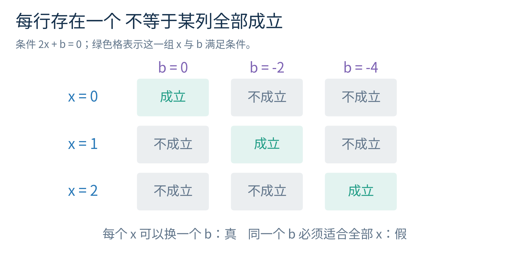

MIT 的数学课程教材用于核查命题、量词和归纳法的表达原则。本讲将它们落实在同一预测规则与参数选择中，不要求读者先学习其余离散数学内容。[资料3](https://ocw.mit.edu/courses/6-042j-mathematics-for-computer-science-spring-2015/mit6_042js15_textbook.pdf)

## 十五 反例为什么能否定 普查为什么仍可能不够

我们在 x 为 0、1、2、3、4 的五个点核对了一条程序，它都给出 $2x+1$。能否据此证明程序对整个 $[0,4]$ 都实现了同一函数？不能，因为这个区间里还有 0.5、1.25 等无穷多个未检查输入。

构造另一条表达式：

$$p(x)=2x+1+x(x-1)(x-2)(x-3)(x-4).$$

当 x 是 0、1、2、3、4 中的任一个时，最后乘积至少有一个因子为 0，于是 p(x) 与 $2x+1$ 完全相同。这不是碰巧符合，而是有意构造出的五点一致。

在 $x=1/2$ 时，最后那项变成

$$\frac12\left(-\frac12\right)\left(-\frac32\right)\left(-\frac52\right)\left(-\frac72\right)=\frac{105}{32}.$$

可以按分子分母分别相乘：四个负因子使结果为正，分子绝对值为 $1\times1\times3\times5\times7=105$，分母为 $2^5=32$。原预测为 $2\times1/2+1=2=64/32$，新预测为 $169/32=5.28125$。两条规则在这个合法输入明显不同。

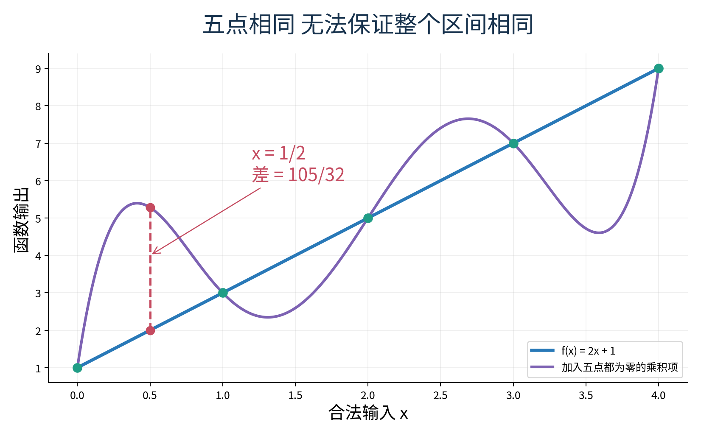

反例的力量来自量词。全称命题承诺每个合法输入都符合；找到一个合法输入违反，就说明承诺不成立。一个不在定义域的值不能用来反驳原命题，只能说明你换了范围。前面用 x 为 -2 讨论对数，目的就是暴露没写条件的“对所有非零 x”说法，而不是否定限定 x 正时的正确规则。

如果命题的定义域本来就是五元素集合 $\{0,1,2,3,4\}$，那么用精确运算把全部五种情况穷尽检查，可以证明这个有限命题。问题不在于电脑检查永远无效，而在于检查范围是否覆盖主张、实现是否可靠，以及数值相等是否真的精确。对连续区间抽查再多有限点，也没有穷尽整个区间。

研究中的实验与数学证明承担不同工作。实验能暴露错误、验证实现和提供经验事实；证明能在清楚的假设下覆盖整个指定范围。一个证明正确的计算规则仍可能不适合真实数据，而一个经验表现好的程序也不能因此被当成已证明对任意输入有效。

## 十六 用归纳法证明一串奇数的和

预测表的五个输出是 1、3、5、7、9，恰好是前五个正奇数。把它们相加得到 25，也就是 $5^2$。前一项是 $1=1^2$，前两项 $1+3=4=2^2$，前三项 $1+3+5=9=3^2$。这提示一个猜想：前 n 个正奇数之和是否总等于 $n^2$？

为讨论任意正整数 n，我们单独定义数列 $u_i=2i-1$，其中 $i=1,2,3,\ldots$。数列可以理解为按整数位置依次排列的数。前五项与受限模型表中的 $f(i-1)$ 相同；继续延长数列是一个新的数学定义，不是在宣称设备模型可预测任意大工作量。

我们要证明，对每个正整数 n，

$$\sum_{i=1}^{n}(2i-1)=n^2.$$

证明使用数学归纳法。它需要两个部分：先保证起点成立，再保证任何一个已成立的位置都能推进到下一个。你可以想象一排相邻台阶：站上第一级，还要证明每一级都能走到下一层；只证明前十级好走，不等于完成一般的推进规则。

第一步是起点。当 $n=1$，左边只含一项 $2\times1-1=1$，右边 $1^2=1$，所以命题成立。

第二步是假设对某个任意正整数 k 成立，也就是

$$\sum_{i=1}^{k}(2i-1)=k^2.$$

这叫归纳假设。我们并没有宣布所有 n 已成立，只是暂时接受第 k 个命题，以证明“如果第 k 个成立，那么第 k+1 个也成立”。要证明的下一条是

$$\sum_{i=1}^{k+1}(2i-1)=(k+1)^2.$$

先把左边的最后一项分出来：

$$\sum_{i=1}^{k+1}(2i-1)=\sum_{i=1}^{k}(2i-1)+(2(k+1)-1).$$

前面的和可以使用归纳假设替换成 $k^2$；后一项先展开为 $2k+2-1=2k+1$。于是整个式子变成

$$k^2+2k+1=(k+1)^2.$$

最后一步来自已经展开过的平方公式。我们得到第 k+1 个命题。起点成立，且对任意正整数 k 都能从 k 推到 k+1，因此结论对所有正整数 n 成立。这才是完整归纳证明，不是“观察几个例子，所以后面应该一样”。

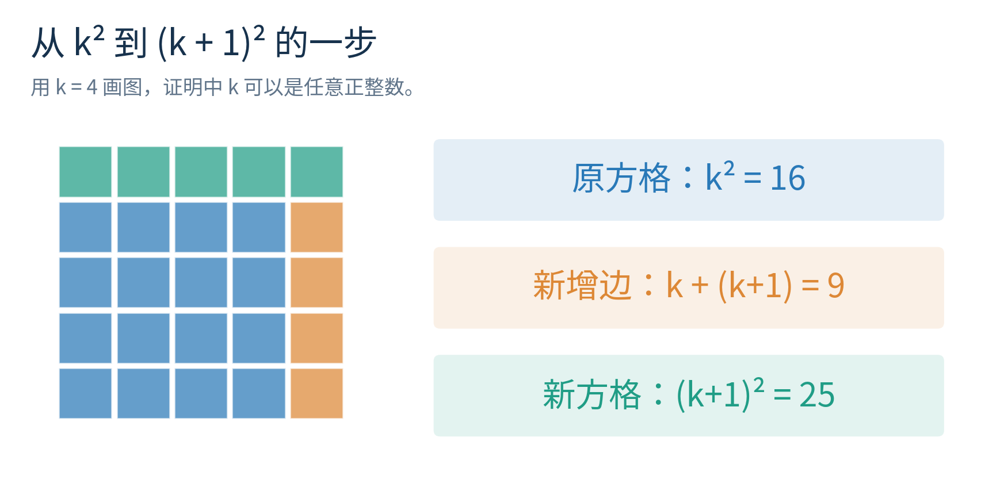

图中的 L 形边也解释了增加量：增加一列 k 个格子，再增加一行 k+1 个格子，总计 $k+(k+1)=2k+1$。旧方格有 $k^2$ 个，新方格有 $(k+1)^2$ 个，因此它们的差是第 k+1 个奇数。图形帮助理解，但我们仍保留符号证明，让任意 k 的理由可以被逐步核对。

常见缺口有三种。没有起点，只会证明“如果成立就继续成立”，却不知道从哪开始；只检查从 3 到 4，没有说明任意 k 的推进；在归纳步骤里直接假设第 k+1 项已经成立，这就是把目标当理由。你应能指出证明在哪一行使用了归纳假设，又在哪一行才真正得到待证结论。

## 十七 数学等式与机器近似各自需要什么证据

整数和 Fraction 可以帮助我们在小例子上进行精确计算。Fraction(3, 5) 表示精确的 $3/5$，读作五分之三。写程序时要分清分子与分母的参数顺序。Fraction 的两个参数依次为分子、分母；分母不能为零。

Python 的 Fraction("0.1") 从十进制字符串得到精确的 $1/10$；Fraction(0.1) 则接收已经生成的二进制浮点近似，并精确表示那个近似数，通常不等于 $1/10$。精确容器不能自动修复前一步已经引入的近似。官方 fractions 文档明确说明这一差异。[资料5](https://docs.python.org/3/library/fractions.html)

对数通常需要浮点近似。实验使用 math.isclose 检查两种计算结果是否足够接近，显式设定相对容差和绝对容差均为 $10^{-12}$。相对容差关注相对于数值大小的差，绝对容差在接近 0 时尤其重要。检查条件可以写为

$$|a-b|\leq\max(\epsilon_r\max(|a|,|b|),\epsilon_a).$$

其中 $\epsilon_r$ 是相对容差，$\epsilon_a$ 是绝对容差，max 表示取较大的数。这个条件只是本实验对所选数值范围的验收标准，不是宣称每次计算都保证误差小于某个普遍界限。随意放宽容差到让任何结果都过关，会使检查失去意义。

程序还会拒绝对数的非法底数、非正真数、零分母，以及受限函数定义域外输入。边界测试的目的不是让错误消失，而是检查程序能否按数学约定明确拒绝它们。对合法但极端到可能溢出的实数，本实验只说明限制，不声称有限样本已经覆盖所有数值风险。

## 十八 纸笔与程序如何互相检验

先不运行代码，完成四件事：用 $x=3/2$ 核对四种表示都输出 4；解释 $g(f(1))=9$ 与 $f(g(1))=3$；算出五条记录平方差之和为 3、平均为 $3/5$；为两个量词顺序画出真值格子。然后再运行 Notebook，逐项比较，而不是只看最后有没有绿色字样。

接着检查两类反例。第一类反驳错误等式：对数的和拆开在 u、v 都为 1 时失败；第二类反驳错误推广：两条函数在五点一致却在 $1/2$ 分开。把它们的合法输入条件一起写进报告。如果只记录“某公式错了”，却没说明原先主张范围与反例范围，你的结论仍不完整。

最后把奇数求和归纳证明写一遍，给每行标出理由。程序检查 n 从 1 到 100 只是实现核验；覆盖所有正整数的结论来自起点加任意推进步骤。实验报告必须保留这个区分。

## 十九 练习

练习一　为输入 $x=3/2$，分别用文字、公式、表格中的新增一行与 Python 表达式说明预测值。再说明为什么 y_hat = 2 * (x + 1) 不等价。

练习二　对于 $f:[0,4]\to\mathbb R$、$f(x)=2x+1$，写出定义域、陪域和值域。为什么只证明输出在 $[1,9]$ 内还不够证明值域恰好等于这个区间？

练习三　求合法范围内满足 $f(x)=11$ 的输入。代数上得到的候选值是什么，为什么不能当作原函数的解？

练习四　解 $ax+1=5$，分别讨论 $a\neq0$ 与 $a=0$，并说明若继续限制 $x\in[0,4]$，还需要检查什么。

练习五　化简 $(x^2-4)/(x-2)$，写出原定义域限制。x 为 2 时，能否用化简式替原式赋值？

练习六　令 $g(t)=t^2$。计算 $g(f(2))$ 与 $f(g(2))$，再说明 x 为 3 时哪个复合不合法。给出两个复合各自的定义域。

练习七　计算 $2^{-3}$、$16^{1/2}$、$\log_2(1/8)$、$\log_{1/2}4$。每项用相应定义解释，不只列数字。

练习八　逐项判断 $\log_1 7$、$\log_2 0$、$\log_2(-4)$、$\log_{1/2}8$ 是否是合法实数对数。对合法项求值。

练习九　为 $\log_b(u/v)=\log_b u-\log_b v$ 写完整条件和三步推导；再用 u、v 同为负数的例子说明为什么左边合法仍不保证右边合法。

练习十　对 $r=(0,1,-1,1,0)$ 分别计算 $\sum r_i$、$\sum r_i^2$、$(\sum r_i)^2$ 与平均平方差，并写出数学第 4 条在 Python 列表中的位置。

练习十一　否定“对所有样本，预测误差都为零”。给一个当前数据中的见证。再解释“每个输入各有一套参数”为什么不等于“有一套参数适合所有输入”。

练习十二　解释 p(x) 与 f(x) 在五个整数输入上一致的原因，并用精确分数核对它们在 $x=1/2$ 的差。哪种有限定义域下，穷尽检查五个输入就足够？

练习十三　独立重写前 n 个正奇数和为 $n^2$ 的归纳证明，必须写出起点、归纳假设、待证目标和推进计算。指出归纳假设在哪一行被使用。

练习十四　若某程序检查了前一百万个 n 都符合奇数求和公式，它是否已经给出本讲全称命题的数学证明？若所有运算均为精确整数，它究竟证明了哪一条有限命题？

练习十五　解释 Fraction("0.1") 与 Fraction(0.1) 为什么可能不同。对于对数恒等式的浮点核验，为何不能只使用 ==，也不能把“误差小于容差”说成恒等式已被普遍证明？

完整详解见 answers.pdf（另附answers.md）。建议先自己作答，再对照每一步条件，而不是只核对最终数字。

## 二十 验收与下一步

本讲的验收是一组能相互支持的材料：同一预测式的四种表示，输入与输出范围说明，一次有条件的代数变形，一份对数定义域检查，一个索引无错位的误差汇总，两个不同量词顺序的解释，一条合法反例，以及一份完整归纳证明。它们共同回答“公式是什么意思、何时能用、为什么相信结论”。

如果遇到新公式，你现在可以先问五件事：每个字母代表谁；哪些输入被允许；运算顺序是什么；结论量化到哪些对象；支持它的是定义、代数证明、有限穷尽还是经验测试。后续学习向量、矩阵、概率与优化时，这套阅读方式比提前背许多公式更重要。

## 资料与核验

资料1　OpenStax，Precalculus 2e，Functions and Function Notation。用于核查函数定义、输入输出与多种表示。https://openstax.org/books/precalculus-2e/pages/1-1-functions-and-function-notation

资料2　OpenStax，Precalculus 2e，Logarithmic Properties。用于核查实数对数的乘积、商和幂规则。https://openstax.org/books/precalculus-2e/pages/4-5-logarithmic-properties

资料3　Eric Lehman、F Thomson Leighton、Albert R Meyer，Mathematics for Computer Science，MIT 官方课程教材，2015。查阅命题、谓词与量词，以及普通归纳法。https://ocw.mit.edu/courses/6-042j-mathematics-for-computer-science-spring-2015/mit6_042js15_textbook.pdf

资料4　Python 官方 math 文档。查阅 log、log2、isclose 的定义与数值说明。https://docs.python.org/3/library/math.html

资料5　Python 官方 fractions 文档。查阅整数比、字符串与浮点输入构造有理数的区别。https://docs.python.org/3/library/fractions.html

以上资料于 2026 年 10 月 4 日实际打开核验。讲义没有复制教材例题或插图，全部实验对象、比较数据、反例呈现与程序为本课程的原创教学安排。实数指数的完整构造与连续性理论不在本讲证明范围内。
