# 向量内积与距离

第九讲 多个特征怎样成为几何对象

只有面积一个特征时，一个输入是一个数。加入楼龄后，一套房屋就要用两个数描述；再加入更多特征，输入会变成一串有明确含义、次序和单位的坐标。我们要回答的不是“怎样存下一串数字”，而是：怎样比较两个输入的大小、方向与接近程度，并知道这种比较依赖了哪些约定？

本讲从二维向量开始，把加法、数乘、内积、长度、距离、夹角和投影连接成一条线。我们会亲手把一个向量拆成沿另一方向的部分和垂直残差，再完整证明内积为什么受到长度约束。最后回到特征单位，构造一个只改变面积单位就翻转近邻排名的例子，理解几何选择会改变学习问题。

直接先修是第 5 讲数组与第 8 讲函数、代数、求和和证明语言。不需要微积分或概率。二维图帮助建立直观，代数定义推广到任意有限维。本讲的房屋记录仍是合成示例，不含真实个人或市场信息。

## 一 数组中的两个位置如何变成坐标

取一个向量 $x=(4,1)$。这里不是“4个对象和1个对象”，而是同一个对象在两个坐标上的数值。第一个坐标为4，第二个为1。写成列形式是

$$x=\begin{pmatrix}4\\1\end{pmatrix}.$$

括号中的次序不能随便交换。若第一个位置是面积、第二个是楼龄，交换之后就换了含义。数组形状也必须说明：一个二维向量在本讲程序里使用形状(2,)的一维数组，两个分量；一批二维样本则使用形状(n,2)的二维数组，每一行一条样本。

在平面上，$x=(4,1)$可以画为从原点到点(4,1)的箭头。箭头表示位移或方向与大小；终点也能表示一条样本的坐标。数学上一个向量不依赖箭头画在纸的哪个起点，只要方向和位移相同。不过，在数据任务中是否允许移动原点、怎样定义坐标，要由实际含义决定。

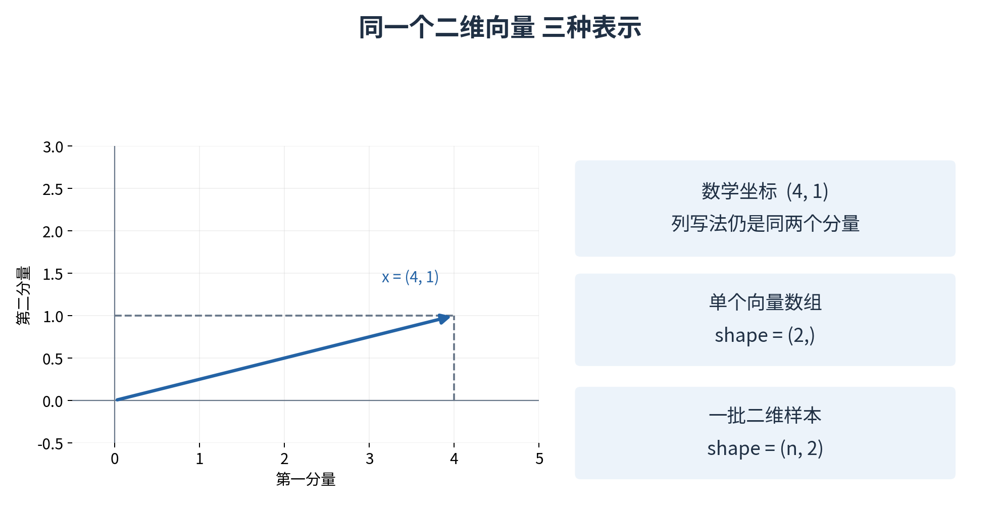

向量不只是一个任意列表。我们会为它规定可重复使用的加法、数乘与内积等运算，并研究这些运算满足什么性质。列表还可以混放文字与函数，而本讲研究的实向量每个分量都是实数。程序容器与数学对象相互联系，但不是完全相同的概念。

先把三种名字区分开：一个点强调“对象位于哪里”，一个向量强调“从一个位置移动多少”，一个数组强调“程序怎样储存这些数”。在指定原点与坐标轴后，点的坐标可以用从原点出发的位置向量表示，所以它们经常使用相同数字。但从点 A 到点 B 的位移要用 B 的坐标减 A 的坐标，不等于任意取其中一个点的坐标。后面谈距离时会再次用到这一区别。

本讲前十二节的几何向量都使用无量纲的坐标，以便专心研究运算；第十三节才引入带单位的房屋特征。横轴是第一个分量，纵轴是第二个分量，图上两轴采用相同的绘制比例。若把纵轴在纸上压扁，直角和长度看起来都可能变形；图只是数学关系的呈现，可靠结论仍应由坐标和定义核对。

写 $x_i$ 时，$i$ 是分量编号。公式常从 $i=1$ 写到 $d$；Python 数组从索引 0 写到 $d-1$。对 $x=(4,1)$，数学中的 $x_1=4$ 对应代码 `x[0]`，数学中的 $x_2=1$ 对应 `x[1]`。这不是两套不同数据，只是编号起点不同。向量维数 $d=2$ 也不等于数组轴数：单个向量的一维数组只有一条轴，但这条轴上有两个分量。

## 二 向量加法与数乘

设 $x=(4,1)$、$y=(3,4)$，向量加法按相同位置相加：

$$x+y=(4+3,1+4)=(7,5).$$

数乘是用同一个实数乘每个分量。若系数为2，$2x=(8,2)$；若系数为负1，$-x=(-4,-1)$，方向反过来；若系数为0，得到零向量$(0,0)$。零向量每个分量都为0，不是一个空数组。

几何上，把y的箭头起点平移到x的终点，最后到达的终点就是x+y。也可以从同一起点画x和y，补成平行四边形，对角线给出和。这两种图都表达同一组逐分量加法，并不需要电脑重新学习一次加法规则。

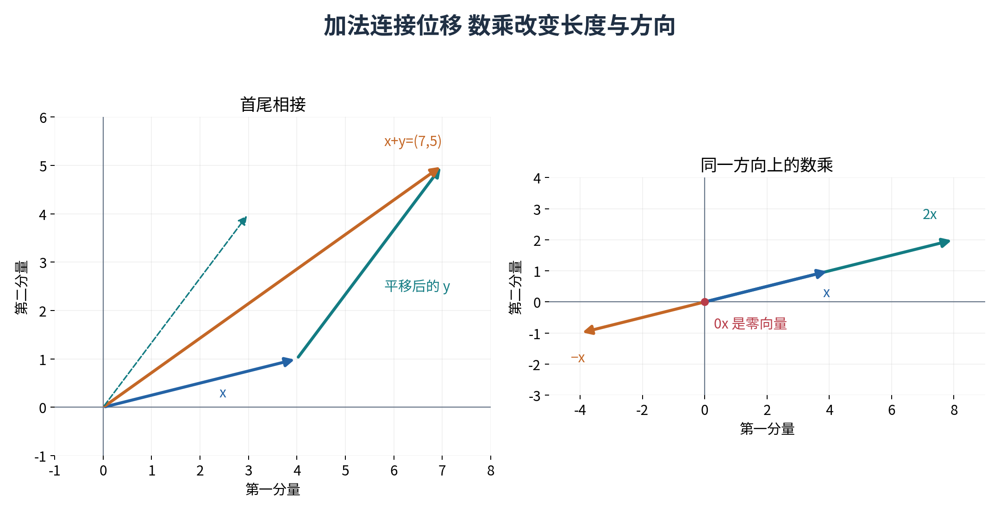

形如 $a x+b y$ 的结果称为线性组合，其中a、b是实数系数。例如 $2x-y=(8,2)-(3,4)=(5,-2)$。线性组合让我们用已有方向拼出其他方向。后面矩阵乘法会把这种组合组织成一套统一运算。

所有加法都要求分量含义一致。若x的第一个分量用平方米、y的第一个分量用平方厘米，直接相加会混单位。数学符号不替代数据字典，NumPy即使能广播出结果，也不能证明这两个对象应该相加。

先用一个反例防止操作混淆。两个一维 NumPy 数组 `x * y` 得到 `(12,4)`，是逐元素乘法；`2 * x` 是数乘；后面 `np.dot(x,y)` 得到 16，是内积。三个写法都含乘法，但输入对象、输出形状与数学目的不同。不要因为某次运算能运行，就把它当成想要的那一种“向量乘法”。

线性组合中的系数没有必须相加为 1 的要求，也没有必须非负的要求。例如 $-x+2y$ 仍是线性组合。如果另加“非负且和为 1”的限制，会形成另一类有用的组合，但不能反过来把这些限制强加到所有线性组合上。我们先掌握最宽的实数系数形式，再在具体任务中写清额外约束。

二维中的两个基本方向 $e_1=(1,0)$ 和 $e_2=(0,1)$ 很方便：任何 $(a,b)$ 都能写成 $ae_1+be_2$。例如 $x=4e_1+e_2$。这里的分量正好记录沿这两个基本方向各走多少。到了第十讲，更一般的方向组合会由矩阵组织；目前先把这条展开式逐项加出来，就足以理解它。

## 三 实向量空间的最小语言

全部d个实数分量组成的向量集合记作 $\mathbb R^d$。这里d是正整数，表示维数；$\mathbb R$表示实数。二维平面用$\mathbb R^2$，三维坐标用$\mathbb R^3$，一百个数值特征可以先放在$\mathbb R^{100}$中研究。

这些向量配上逐分量加法与实数数乘，满足熟悉的规则。例如$x+y=y+x$，$(x+y)+z=x+(y+z)$，$a(x+y)=ax+ay$。以分配律为例，第i个分量左侧是$a(x_i+y_i)$，实数分配律让它等于$ax_i+ay_i$，恰好是右侧第i个分量；每个位置都相同，两向量就相同。

零向量起加法恒等元作用：$x+0=x$。负向量给出加法逆元：$x+(-x)=0$。这些规则使我们可以像整理普通代数一样整理向量表达式，但不能把后面所有新运算都假定为普通数乘。例如矩阵乘法通常不可交换，第10讲会明确区分。

有限维坐标只是开始。更一般的向量空间可以研究函数等对象，只要运算满足相应规则。本讲不要求提前掌握抽象公理体系，但要理解“向量”的关键在于运算结构，而不只是屏幕上一排数字。

这些规则还包含封闭性：在 $\mathbb R^d$ 内取两个向量相加，仍然得到 $d$ 个实数；用任意实数乘一个向量，也仍留在同一个集合。还需要 $(a+b)x=ax+bx$、$a(bx)=(ab)x$ 和 $1x=x$。连同上面已经解释的加法交换、结合、零元素与负元素，它们构成实向量空间的基本规则。它们在 $\mathbb R^d$ 中都可逐分量归结为实数运算规则，不需要另加一种神秘算术。[1]

一个实际数据集通常不是一个向量空间。假设数据中只有三套房的正面积与非负楼龄，两个样本相加的结果未必出现在原数据集里；把房屋特征乘以 -1 还会得到没有物理意义的负面积。我们可以把数据表示嵌入一个数学向量空间中研究，但不能因此声称空间中的每个向量都是一个可实现的房屋。这一区别会影响插值、外推和数据生成的解释。

零向量必须与空向量分开。二维零向量仍有两个位置，是 `(0,0)`；形状为 `(0,)` 的空数组连本讲约定的正维数都没有。前者在加法、长度和距离中完全合法，后者会被程序入口拒绝。对零向量，有些运算合法而有些不合法：它的长度为零，与别人的距离可计算，但没有唯一的单位方向。这类区别应按运算讨论，不能一概说“遇到零就报错”。

## 四 内积把两组坐标变成一个数

本讲的标准欧氏内积定义为相同位置相乘后求和：

$$\langle x,y\rangle=\sum_{i=1}^{d}x_i y_i.$$

对于$x=(4,1)$、$y=(3,4)$，先算$4\times3=12$与$1\times4=4$，相加得16。内积的结果是一个标量，不是向量。NumPy里一维数组的dot可以做这个运算；逐元素乘法先得到(12,4)，再求和才得到16。[2]

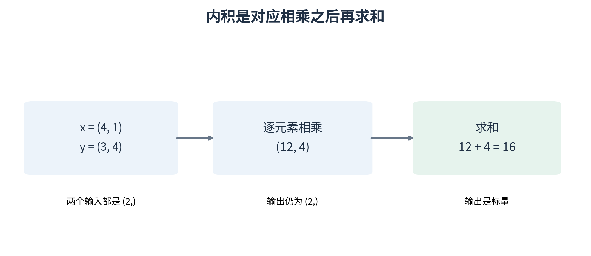

内积满足对称性：$\langle x,y\rangle=\langle y,x\rangle$，因为每个$x_i y_i=y_i x_i$。它对加法分配：$\langle x+z,y\rangle=\langle x,y\rangle+\langle z,y\rangle$，把求和里的$(x_i+z_i)y_i$展开即可。数值系数可以提出：$\langle ax,y\rangle=a\langle x,y\rangle$。

还有一个关键性质：$\langle x,x\rangle=\sum_i x_i^2$总是非负，并且只有所有分量为0时才等于0。每一项平方都非负，总和为0迫使每项为0。后面长度、正交与投影的推导都从这条事实出发。

这里限定实向量。复数向量的标准内积需要对一侧取复共轭，不能照抄$x_i y_i$。目前不需要复数计算，但应知道一个定义的适用对象，避免看到相同“内积”二字就忽略条件。

内积中正项与负项可以抵消。例如 $(1,1)$ 与 $(1,-1)$ 逐项乘出 1 和 -1，总和为 0。它们都不是零向量，这说明“两个向量的内积为零”和“一个向量自身的内积为零”是两种不同条件。后者才由正定性保证向量为零；前者会引出正交。

内积还受到长度影响。把 $y$ 扩大十倍，$\langle x,10y\rangle$ 也扩大十倍，即使方向一点没有改变。因此“内积更大就是两个对象更相似”必须附带表示和长度的条件。若任务想比较方向，可以在后面使用归一化内积；若长度本身承载信息，就不能不加思考地把它删掉。

程序里应把数学对象的输入输出写出来：`dot_checked(x,y)` 接受两个形状均为 `(d,)` 的实数数组，返回一个数。批量版本接受 `(n,d)` 和 `(d,)`，返回 `(n,)`。`np.dot` 会根据输入维数采用不同规则，不能把一维示例直接套到任意二维输入上。[2] 本讲批量计算明确写成 `(X * y).sum(axis=1)`，把“每行独立比较”的意图保留下来。

## 五 长度需要满足什么规则

二维箭头$x=(4,1)$与两坐标轴围成直角三角形。根据勾股关系，长度平方为$4^2+1^2=17$，长度为$\sqrt{17}$。在d维中，我们把欧氏长度定义为

$$\|x\|_2=\sqrt{\sum_{i=1}^{d}x_i^2}=\sqrt{\langle x,x\rangle}.$$

$\sqrt{a}$在$a\ge0$时表示平方等于a的非负数。下标2提醒我们先取平方、再求和、最后开平方。平方范数$\|x\|_2^2$与范数$\|x\|_2$不是同一个量，单位也不同。若分量统一用米，范数用米，平方范数用平方米。

另一种常用大小是$L_1$范数：

$$\|x\|_1=\sum_{i=1}^{d}|x_i|.$$

对于$(4,1)$，$L_1$大小为5，$L_2$大小约为4.123。它们没有互相矛盾，只是采用不同的大小定义。在城市方格路网中，先沿一条轴走4、再沿另一条走1，总路程为5；若允许直线穿过，最短欧氏距离为$\sqrt{17}$。图是帮助理解的理想化几何，不保证真实道路确实如此。

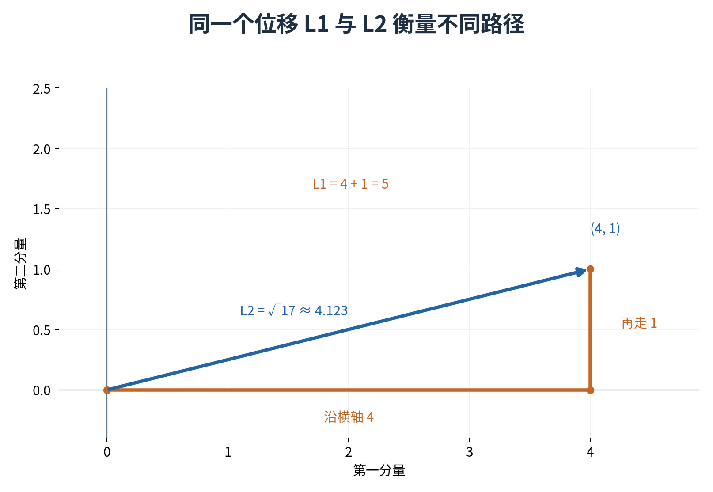

一个范数要求非负且只有零向量范数为0、数乘时按系数绝对值缩放、满足三角不等式。前两条对L2很直接：$\|ax\|_2=\sqrt{a^2\sum_i x_i^2}=|a|\|x\|_2$。三角不等式$\|x+y\|\le\|x\|+\|y\|$意味着绕路不会比相应的直接位移更短。我们将在证明内积界之后推出L2的这条性质。

L1 的前两条范数性质同样可以逐项检查。每个绝对值都非负，总和为零时每一项必须为零，所以原向量为零。又因为 $|a x_i|=|a||x_i|$，求和后得到 $\|ax\|_1=|a|\|x\|_1$。三角不等式稍后单独证明，这样我们才完整说明为什么这两个“大小”确实是范数。

平方 L2 虽然经常在机器学习目标中出现，却不是范数。取一个非零向量 $x$，将它扩大两倍，平方长度变成原来的四倍；范数的齐次性要求变成两倍。这一处反例已足够否定“平方长度也是范数”的说法。它仍然是一种有用的量，只是不能继承一个范数应有的全部性质。

对有限维实向量，L1 与 L2 还满足 $\|x\|_2\leq\|x\|_1$。不用新定理就能看见原因：把 $\left(\sum_i|x_i|\right)^2$ 展开，得到平方项 $\sum_i x_i^2$，再加上所有不同分量绝对值乘积的非负交叉项。因此 L1 的平方不小于 L2 的平方，再取非负平方根即可。这个大小关系不能替我们决定任务应选哪种范数，因为距离排序和阈值含义还受几何形状影响。

## 六 由差向量定义距离

两个点x与z之间的位移是$x-z$，因此欧氏距离定义为$\|x-z\|_2$。例如x=(4,1)、z=(1,5)，差为(3,-4)，距离为5；L1距离则为$|3|+|-4|=7$。

这个定义满足非负、同点距离为零、对称，以及三角不等式。对称性来自$z-x=-(x-z)$，范数对负号不变。三角不等式利用$x-z=(x-y)+(y-z)$再套用范数的三角关系。先把点、差向量和范数分清，推导就不需要额外神秘规则。

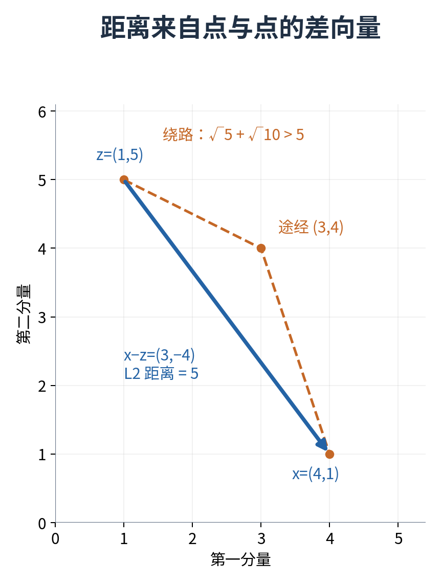

一个距离值还不足以描述它采用了什么特征、单位和尺度。两套房屋在面积楼龄空间里很近，不代表在位置、噪声或其他未记录因素上也相似。算法所见的相似性受到表示选择限制，几何不能补出缺失的信息。

把每一步写成一个问题会更清楚。首先问两点每个分量相差多少，得到差向量；其次问用哪一种范数衡量这个差，得到距离；最后问这个数对任务意味着什么。如果点坐标都平移了同一个向量 $c$，差向量保持不变，因为 $(x+c)-(z+c)=x-z$，所以两点间的距离不变。但两个位置向量各自到原点的长度未必不变。

平方距离也要单独区分。对一维三点 0、1、2，普通欧氏距离满足 $2\leq1+1$；平方距离却给出 $4>1+1$，违反三角不等式。因此它不是本讲定义的距离度量。若只在固定查询下给候选距离排序，平方是非负数上的递增变换，不会改变原有距离排名；若需要三角不等式，就不能以“排名没变”为理由混用两者。

本讲程序的 `distance` 接受两个同维向量，输出非负标量；`row_distances` 接受一批候选和一个查询，输出每个候选的距离。两个形状为 `(n,d)` 的批量数组究竟是逐行配对，还是计算所有两两距离，是不同接口。本讲没有暗中把后一种操作塞进前一种，因此不会产生第五讲那种意外的 $n\times n$ 配对表。

## 七 正交为什么用内积为零表示

若$x=(a,0)$、$y=(0,b)$，它们沿两条坐标轴，内积为0。更一般地，本讲用$\langle x,y\rangle=0$定义正交。对非零实平面向量，这与熟悉的直角关系相符；零向量也与所有向量的内积为0，但它没有可以画出的独立方向。

$x=(4,1)$与$r=(1,-4)$正交，因为$4\times1+1\times(-4)=0$。正交不意味着某个分量必须为0，也不意味着两个向量的长度一样。它描述的是两方向在内积意义下没有重合分量。

利用内积展开，可以得到毕达哥拉斯关系：

$$\|x+y\|_2^2=\|x\|_2^2+2\langle x,y\rangle+\|y\|_2^2.$$

若内积为0，中间项消失，剩下平方长度相加。反过来，若这条平方和关系成立，中间项必须为0。这给了我们一种代数与几何互相核对的办法，而不必只靠目测箭头是否像直角。

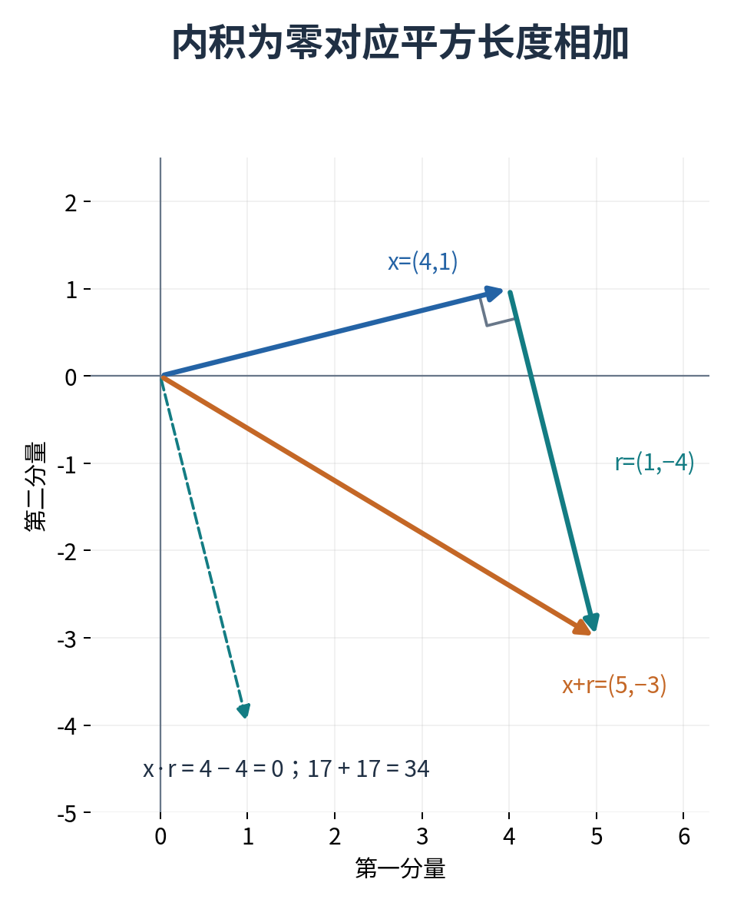

把平方范数展开的每一步都写出来：$\langle x+y,x+y\rangle$ 先按第二个位置分成 $\langle x+y,x\rangle+\langle x+y,y\rangle$，再按第一个位置分开，得到四项。中间两项 $\langle x,y\rangle$ 与 $\langle y,x\rangle$ 由对称性相等，才合并成系数 2。这个展开以后会反复出现，值得自己不用笔记推一次。

取 $x=(4,1)$、$r=(1,-4)$，各自平方长度都是 17，和向量为 $(5,-3)$，平方长度为 $25+9=34$，恰好等于 17+17。这是具体算例的核对；上面的内积展开才说明为什么所有正交向量都如此。反过来，如果某个数值实验只得到近似相等，应根据数值规模和容差判断实现，不要宣称浮点结果恰好证明了严格正交。

零向量的正交性是一种代数约定：与任何向量内积都为零。因此它被纳入正交定义，方便定理统一表述。但零箭头没有方向，不能由此计算出“它与所有向量都是九十度”。角度公式需要两个非零长度作为分母，条件将在第十一节再次明确。

## 八 把一个向量拆成沿方向与残差

现在回到$x=(4,1)$、$y=(3,4)$。我们想用y的方向解释x的一部分，写成$x=ay+r$，并要求残差r与y正交。未知量只有标量a。把$r=x-ay$代入正交条件：

$$0=\langle x-ay,y\rangle=\langle x,y\rangle-a\langle y,y\rangle.$$

只要$y\ne0$，$\langle y,y\rangle>0$，可以除过去，得到

$$a=\frac{\langle x,y\rangle}{\langle y,y\rangle}.$$

沿y方向的部分$p=ay$叫x到y所张成直线的正交投影。这里“直线”包含y的所有实数倍，不只是从0到y之间的线段。a可以为负，也可以大于1，因此不能默认投影总落在图中有限箭头上。

本例内积为16，y的平方长度为25，所以$a=16/25=0.64$。投影为$p=(48/25,64/25)=(1.92,2.56)$；残差为$r=(52/25,-39/25)=(2.08,-1.56)$。直接验证：$r\cdot y=(52\times3-39\times4)/25=0$。

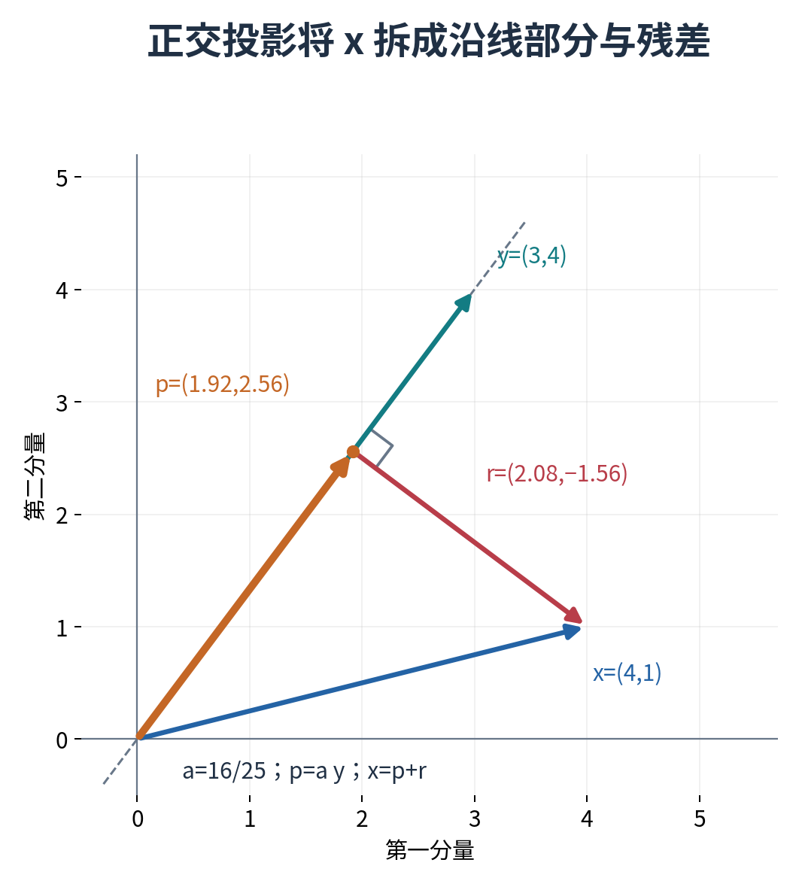

为什么它还是这条直线上距离x最近的点？取任意另一个系数c，$x-cy=r+(a-c)y$。因为r与y正交，平方距离为

$$\|x-cy\|_2^2=\|r\|_2^2+(a-c)^2\|y\|_2^2.$$

第二项非负，在c=a时为0；若y非零，只有c=a才能使它为0。因此a给出唯一最近点。这个推导没有用导数，完整依靠内积展开和非负平方；它也说明为什么必须单独处理y为零的情况。

系数 $a$、投影向量 $p$ 与投影的长度不应混为一谈。本例 $a=0.64$，说明要取多少倍的 $y$；$p=(1.92,2.56)$ 是实际位置；$\|p\|_2=3.2$ 是非负长度。若先把 $y$ 变成单位方向 $u=y/5=(0.6,0.8)$，则沿单位方向的带符号分量为 $\langle x,u\rangle=3.2$，此时 $p=3.2u$。它与原来的系数不同，是因为所乘方向本身的长度不同。

投影中的分母必须是方向向量自己的平方长度。若误用 $\langle x,x\rangle=17$，得到 $16/17$，看上去仍像一个合理比例，但残差与 $y$ 的内积会变成 $16-(16/17)25$，并不等于零。检查正交残差能及时发现这种记错公式的错误，而不是只问“结果是不是一个二维数组”。

还可以用改变方向表示来核验。若把 $y$ 换成 $2y$，张成的整条直线没有改变，投影点也应不变；新系数变为 $a/2$，乘上 $2y$ 又回到 $ay$。换成负倍数同理，系数反号而投影点不变。程序会测试正、负倍数，这检验的是“投影到直线”的含义，而不是只记住一个向量的数值答案。

最近点证明中，$\|r\|_2^2$ 是所有候选共有的部分，$(a-c)^2\|y\|_2^2$ 是偏离最佳系数多付出的平方距离。本例为 $169/25+25(c-16/25)^2$。代入 $c=0$ 得 17，代入 $c=1$ 得 10，代入 $c=16/25$ 得 6.76，最小值对应残差长度 2.6。比较平方距离与比较距离等价，是因为非负平方根保持大小次序。

若方向恰为零，集合 $\{cy:c\in\mathbb R\}$ 只含原点；最近点存在且唯一为原点，但所有 $c$ 都表示同一个点，所以系数不唯一。随附程序选择拒绝“零方向直线”输入，让调用者明确处理退化情况。它仍允许被投影的 $x$ 为零，此时对非零方向得到零投影与零残差。

## 九 完整证明内积受长度约束

Cauchy-Schwarz不等式陈述：对实向量x、y，

$$|\langle x,y\rangle|\le\|x\|_2\|y\|_2.$$

若y为零，两边都为0，结论成立。现在假设y非零。上一节的投影残差$r=x-ay$与$ay$正交，因此

$$\|x\|_2^2=\|ay\|_2^2+\|r\|_2^2\ge a^2\|y\|_2^2.$$

代入$a=\langle x,y\rangle/\|y\|_2^2$，右侧变为$\langle x,y\rangle^2/\|y\|_2^2$。乘以正数$\|y\|_2^2$，得到

$$\langle x,y\rangle^2\le\|x\|_2^2\|y\|_2^2.$$

两侧非负，取非负平方根，正好得到所需绝对值界。我们已经交代零向量、除法条件、乘法符号与开平方条件，没有把“图上看起来应当如此”当作证明。[1]

等号什么时候成立？在y非零时，唯一被丢掉的非负项是$\|r\|_2^2$。等号要求r为零，也就是x是y的一个实数倍；其中包括反向倍数。若一向量为零，也成立。这个等号条件后来会帮助解释余弦相似度为何达到1或-1。

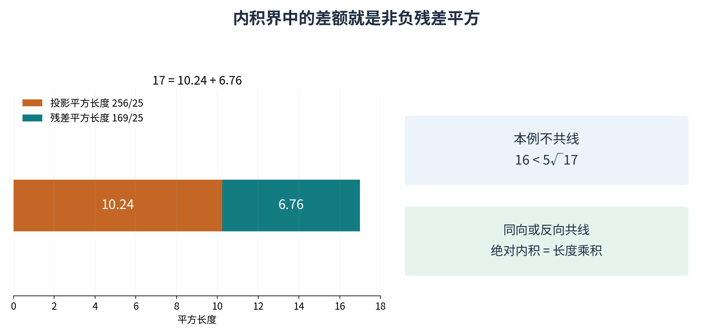

程序可以生成很多x、y检查这条界，但有限样本检查不是证明。证明说明任何满足条件的实向量都成立；数值实验则能帮助检查实现是否正确，以及浮点舍入下需要怎样的容差。两种证据各有作用，不能互相冒充。

用本例把证明中的不等式逐步落到数字上。$\|x\|_2^2=17$，投影平方长度为 $256/25=10.24$，残差平方长度为 $169/25=6.76$；因此 $17\geq256/25$。乘以 25 得 $425\geq256$，再开平方得 $5\sqrt{17}\geq16$。这正是内积绝对值 16 不超过两长度乘积约 20.6155。残差并非零，所以这里是严格不等式。

也可以从非负平方给出同一个核心关系：$0\leq\|x-ay\|_2^2=\|x\|_2^2-\langle x,y\rangle^2/\|y\|_2^2$，其中仍取上述最佳系数。整理后就是内积界。这不是另一个依靠抽样的论据，而是把投影分解压缩成一行代数。刚开始学习时，完整展开的版本更适合检查每一步条件。

注意绝对值的作用。若 $x=-2y$ 且 $y\ne0$，内积为 $-2\|y\|_2^2$，绝对值形式恰好取等号；去掉绝对值的上界却是负数小于正数，通常严格小于。以后使用“不等式等号条件”时，必须先确认你手中是哪一种形式，不能只记住“共线就相等”。

## 十 从内积界推出三角不等式

把$x+y$的平方范数展开，再用Cauchy-Schwarz界：

$$\|x+y\|_2^2=\|x\|_2^2+2\langle x,y\rangle+\|y\|_2^2.$$

$$\|x+y\|_2^2\le\|x\|_2^2+2\|x\|_2\|y\|_2+\|y\|_2^2=(\|x\|_2+\|y\|_2)^2.$$

因为范数都非负，取平方根得到$\|x+y\|_2\le\|x\|_2+\|y\|_2$。这补齐了前面L2范数的关键性质。注意我们使用的是内积本身不超过范数乘积；若内积为负，中间项更小，仍然没有问题。

L1三角不等式则逐分量使用实数绝对值关系$|x_i+y_i|\le|x_i|+|y_i|$，再对所有i求和。不同范数可以有不同证明路径。以后遇到一个新“大小指标”，不能仅凭它非负就叫范数，还要检查其他要求。

L2 三角不等式什么时候取等号？若有一个向量为零，显然成立。若两个都非零，等号要求展开中 $\langle x,y\rangle=\|x\|_2\|y\|_2$，既要满足 Cauchy-Schwarz 等号条件，又要内积为正，所以两个向量必须同向。用代数写，就是存在 $t>0$ 使 $x=ty$。反向非零向量虽然在绝对值内积界中取等号，在这里却不取等号，因为相加会发生抵消。

L1 的等号条件不同。逐分量的绝对值三角关系在两个数没有相反符号时取等号，因此所有位置都满足 $x_i y_i\geq0$ 时，L1 三角关系取等号。例如 $(1,0)$ 与 $(0,1)$ 不共线，却有 L1 和的大小 2 等于两者大小之和。这说明“所有范数的等号都表示同向”是错误概括。

证明的依赖顺序也值得回看：先定义内积并验证其性质，再得到正交分解，用非负残差推出 Cauchy-Schwarz，最后用内积界证明 L2 三角不等式。没有在证明内积界之前借用尚未证明的三角不等式。把逻辑依赖理顺，可以防止一个结论绕一圈又把自己当作前提。

## 十一 长度归一化与夹角

对非零向量x，单位方向定义为$u=x/\|x\|_2$，它的L2长度为1。除法作用于每个分量。例如y=(3,4)长度5，单位方向为(0.6,0.8)。把y扩大为(30,40)，单位方向仍一样。

两个非零向量的归一化内积为

$$c=\frac{\langle x,y\rangle}{\|x\|_2\|y\|_2}.$$

刚证明的界保证c在[-1,1]之间。把它看作两方向的余弦相似度：同向c=1，反向c=-1，正交c=0。它忽略整体长度，因此适合强调方向的比较；如果长度本身有任务信息，忽略长度可能并不合适。

在二维单位圆上，一个点的横坐标就是它与正水平轴夹角的余弦。余弦从角度0时的1，经过直角时的0，到平角时的-1。我们可用这一关系把c换成0到180度之间的夹角；程序中的arccos是这种换算的逆函数。若你还没有系统学三角函数，当前先用单位圆与这三个基准角建立含义，不要求会背三角恒等式。

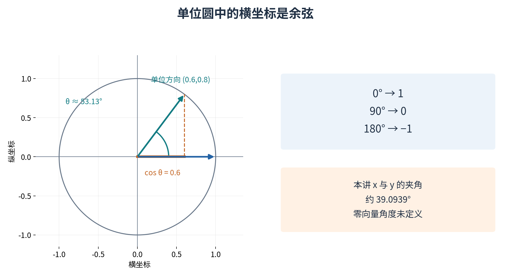

对于任意坐标方向，这一定义与熟悉的欧氏夹角一致；第10讲通过旋转矩阵再检查坐标改变时的内积与长度不变性。本讲不把这个坐标不变性当作未经说明的新算法步骤。计算余弦时，零向量分母为0，角度未定义；不能自动把零向量说成与所有向量夹角90度。

把单位圆的含义再拆开。圆心在原点、半径为 1 的圆由所有满足 $a^2+b^2=1$ 的点组成。从 $(1,0)$ 沿上半圆走到 $(-1,0)$，对应角度从 0 度增加到 180 度；横坐标从 1 连续降到 -1。我们把这个横坐标叫作角度的余弦。对给定的 $c\in[-1,1]$，上半圆只有一个横坐标为 $c$ 的点，因此在这个半圈里可反过来唯一确定角度。

完整一圈也常用 $2\pi$ 弧度表示，半圈为 $\pi$ 弧度，直角为 $\pi/2$ 弧度。弧度在单位圆上可理解为对应圆弧的长度；$\pi$ 是圆周长与直径之比，约为 3.14159。NumPy 的 `arccos` 返回弧度而不是度，因此显示给读者前可用 `np.degrees` 转换，等价于乘以 $180/\pi$。[3] 把 0.68 弧度误读成 0.68 度，会造成非常不同的几何解释。

本例余弦为 $16/(5\sqrt{17})\approx0.776114$，夹角约为 39.0939 度。它是从 $x$ 方向到 $y$ 方向之间较小的非负夹角，范围在 0 到 180 度；这个定义不记录顺时针还是逆时针。若任务需要有方向的转角，需要另一套定义，不能从一个余弦值推断转动方向。

程序还要分清数学边界与数值修补。理论上余弦一定在 [-1,1] 内，浮点舍入可能产生 1.0000000000000002 这样的极小越界，直接 `arccos` 会得到无效结果。我们先验证输入非零、维数相同、数值有限，再检查越界不超过明确的很小容差，最后才把值夹回边界。若算出 1.01，程序应报错追查，而不能直接夹成 1 冒充“方向相同”。

对非常小的非零向量，也不要简单使用一个随意阈值把它当作零。方向不由长度大小决定，例如 $(10^{-300},0)$ 在数学上仍沿正横轴。随附单位方向函数先按最大分量缩放再归一化，避免直接平方时过早下溢。投影系数公式则保留教学中的直接分母，并在分母数值下溢时明确报告；本讲不声称一个简短实现可以处理所有极端浮点范围。

## 十二 不同范数有不同单位球

把所有L2范数等于1的二维向量画出来，得到圆；L1范数等于1得到菱形。这里的“单位球”可以指范数不超过1的内部区域，边界则是恰好等于1的点。L1与L2给出的可接受偏移区域不同，最近点和后续优化行为也可能不同。

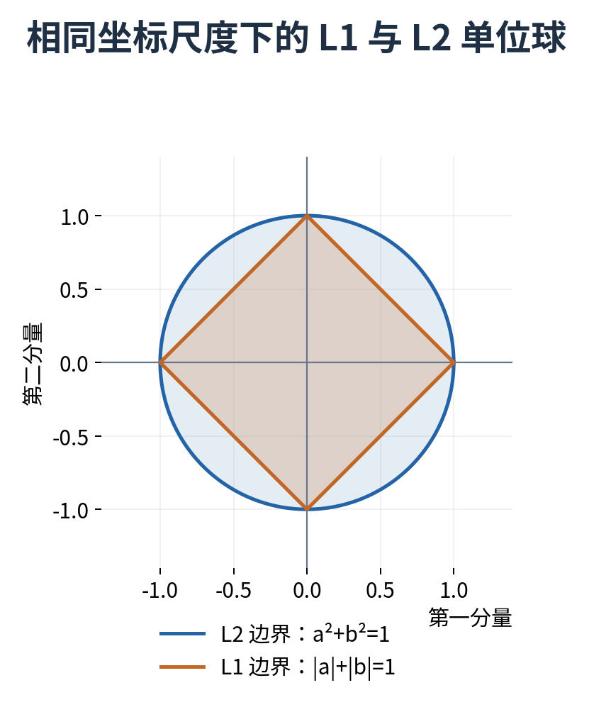

不要只因为L1数值常比L2大，就把它说成更严格或更正确。若阈值也随定义重新设定，比较要看任务后果。范数提供数学工具，选择哪一种还需要数据表示、目标和误差成本的理由。

L1 的边界为什么是菱形？在第一象限，两个分量都非负，$|a|+|b|=1$ 就是 $a+b=1$，连接 $(1,0)$ 与 $(0,1)$ 的线段。其余象限按照符号对称补齐，得到四条边。L2 的边界 $a^2+b^2=1$ 则是单位圆。画边界时，坐标比例仍应相同，否则圆可能被误画成椭圆。

换范数甚至可以改变最近候选的排序。对于原点查询，候选 $A=(3,0)$、$B=(2,2)$，L1 距离分别为 3 和 4，A 更近；L2 距离分别为 3 和 $\sqrt8\approx2.828$，B 更近。这个变化并非计算错误，而是两种距离对“沿一个轴偏离”和“多个轴同时偏离”的衡量不同。实验中会把这个小例子作为额外核验。

本讲使用标准欧氏内积来定义角度。不能把余弦公式中的两项 L2 范数擅自替换成 L1，再宣称得到同一个欧氏夹角。范数、内积、归一化与角度是一套相互配合的定义；改变其中一项，需要重新说明整体含义，而不是只把函数参数从 2 改成 1。

## 十三 改单位为什么会翻转近邻

查询房屋Q的面积为50平方米、楼龄5年；候选A为51平方米、15年；候选B为56平方米、6年。直接把两列数字相减后用L2距离，A的差为(1,10)，距离$\sqrt{101}\approx10.05$；B的差为(6,1)，距离$\sqrt{37}\approx6.08$，于是B更近。

现在只把面积改成平方分米。1平方米等于100平方分米，所以差向量变为A的(100,10)与B的(600,1)。A的距离约100.50，B约600.00，排名变成A更近。房屋没有改变，测量信息没有增加，只因某一列的数值尺度改变，未经处理的距离就换了偏好。

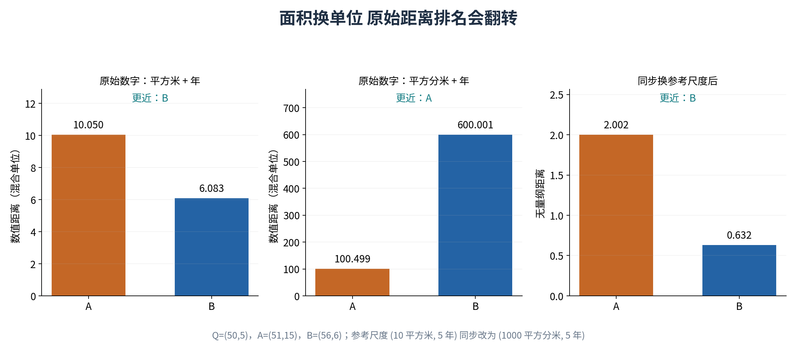

一种明确办法是先用约定的参考尺度变成无量纲差异。例如面积参考10平方米，楼龄参考5年，比较

$$d(x,z)=\sqrt{\left(\frac{x_{\rm area}-z_{\rm area}}{10}\right)^2+\left(\frac{x_{\rm age}-z_{\rm age}}{5}\right)^2}.$$

改用平方分米时，把面积参考尺度也改成1000平方分米，相除结果不变，距离就保持一致。参考尺度代表我们怎样权衡两种变化，需要有任务理由；它不是一个从数学中自动掉下来的“正确权重”。若尺度从数据估计，必须只在相应训练范围拟合，后续无泄漏流水线会详细处理。

上述未经处理的数值距离没有统一的物理单位：平方米差的平方与年数差的平方不能自然相加成一种物理长度。我们故意照着原始文件中的数字套公式，展示这种常见算法选择会带来什么后果。它在坐标数值上是合法的欧氏距离，但并不是某种天然客观的“房屋真实距离”。必须把这种约定说清楚，才谈得上评价近邻结果。

使用参考尺度后，A 的差向量变成 $(1/10,10/5)=(0.1,2)$，距离为 $\sqrt{4.01}\approx2.00250$；B 的差向量变成 $(6/10,1/5)=(0.6,0.2)$，距离为 $\sqrt{0.40}\approx0.63246$。每个分量都是原差值除以同单位的正尺度，因此不再带物理单位；相加平方才有一致的比较含义。改为平方分米时，$100/1000=0.1$、$600/1000=0.6$，所以结果保持不变。

参考尺度必须严格大于零。尺度为零会使除法无定义；负尺度虽然在平方后可能得到同样数值，却失去“允许变化的正尺度”这个解释，因此本讲接口直接拒绝。将面积尺度从 10 平方米改为 1 平方米，会提高面积差对距离的影响；这是任务权衡的变化，不是一次单纯的单位转换。

还要区分“按特征缩放”和“每个样本长度归一化”。前者给一整列使用共同尺度，目的是控制不同特征的比较单位；后者把每个向量都变为长度 1，删除每个样本的整体大小信息。房屋面积与楼龄的原点和比例没有天然的方向意义，不能因为余弦计算方便，就默认它比尺度处理后的距离更合适。

## 十四 练习与详解

先独立作答，再阅读每题后面的推导。数值题需要同时写出输入维数、输出对象和单位；证明题需要写明零向量或非零分母的条件。

### 练习一 向量运算的三种输出

令 $x=(2,-1)$、$y=(-3,4)$。求 $x+y$、$2x-y$ 与内积，并说明哪个结果是标量。

解答：按分量相加，得到 $(2-3,-1+4)=(-1,3)$。先数乘再相减，$2x=(4,-2)$，所以 $2x-y=(4-(-3),-2-4)=(7,-6)$。内积先得到两个乘积 -6 和 -4，再相加为 -10。前两个结果仍是二维向量，最后一个是标量。负内积不会使长度成为负数，因为长度使用自身的内积和非负平方根。

### 练习二 范数与平方范数

向量 $(3,-4)$ 的 L1、L2 和平方 L2 各是多少？若把向量乘以 2，这三个量分别怎样变化？

解答：L1 为 $|3|+|-4|=7$；L2 为 $\sqrt{3^2+(-4)^2}=5$；平方 L2 为 25。向量乘以 2 后，前两个量各乘以 2，得到 14 和 10；平方 L2 乘以 4，得到 100。这直接显示平方 L2 不满足范数的绝对齐次性。若原分量统一以米计，三者单位依次为米、米、平方米。

### 练习三 投影必须通过多个检查

对 $x=(4,1)$、$y=(3,4)$，求投影系数、投影与残差，并验证正交性和平方长度分解。

解答：分子为 $4\times3+1\times4=16$，分母为 $3^2+4^2=25$，所以系数为 $16/25$。投影为 $(48/25,64/25)$，原向量减去投影，得到残差 $(52/25,-39/25)$。残差与方向的内积为 $(156-156)/25=0$。投影平方长度为 $(48^2+64^2)/25^2=256/25$，残差平方长度为 $(52^2+39^2)/25^2=169/25$，两者之和为 $425/25=17$，等于原向量平方长度。每一步都可用 Fraction 精确核验。

### 练习四 零方向与零来源不同

为什么投影公式不能直接用于 $y=0$？若 $x=0$ 而 $y\ne0$，是否也不能计算？

解答：$y=0$ 时分母 $\langle y,y\rangle$ 为零，因此不能用除法得到系数。其张成集合只含原点，最近点为零，但任意系数乘零都等于零，所以系数不唯一。若 $x=0$ 且 $y\ne0$，分母为正、分子为零，系数、投影和残差都为零，没有问题。判断条件应针对方向向量，而不是把所有包含零的输入一律拒绝。

### 练习五 两个等号条件为什么不同

Cauchy-Schwarz 等号是否只在同向时成立？L2 三角不等式呢？

解答：绝对值形式的内积界允许反向。设 $x=-2y$ 且 $y\ne0$，内积绝对值为 $2\|y\|_2^2$，长度乘积也为这个数，所以取等号；但相加后的长度为 $\|-y\|_2=\|y\|_2$，两长度之和为 $3\|y\|_2$，三角不等式严格小于。两个非零向量在 L2 三角不等式中取等号需要同向。只要其中一个为零，两种等号都成立，必须另外涵盖这个边界。

### 练习六 不同范数的三角关系

令 $x=(1,0)$、$y=(0,1)$。分别比较 L2 和 L1 的和向量大小与两向量大小之和。

解答：和向量为 $(1,1)$。L2 给出 $\sqrt2<1+1=2$，严格小于；L1 给出 $2=1+1$，取等号。两条坐标方向不同，但 L1 按每个分量的绝对值累计，没有在任何坐标上发生符号抵消。不能把欧氏三角关系的同向等号条件照搬到所有范数。

### 练习七 归一化的条件

把非零向量乘正数、负数或零后再归一化，各有什么结果？用 $y=(3,4)$ 举例。

解答：$y$ 的单位方向为 $(3/5,4/5)$。若乘正数 $a$，范数变成 $a\|y\|_2$，分子分母的 $a$ 抵消，所以方向不变；若 $a<0$，分母使用 $|a|$，结果为原单位方向的负值。例如 $-y$ 归一化为 $(-3/5,-4/5)$。乘零后得到零向量，分母为零，单位方向没有定义，程序应明确拒绝而不是返回一个假定方向。

### 练习八 余弦零不等于业务无关

余弦相似度为零能否直接解释成两个对象在业务上完全无关？如果输入有零向量，还能这么说吗？

解答：对于非零输入，余弦为零只说明当前实数表示和选定内积下正交。未被记录的特征、编码方法和任务关系仍可能影响业务判断，不能把几何量直接升级成语义或因果结论。若输入有零向量，余弦本身没有定义；把它强制设成零之后再解释成“无关”，同时混淆了定义域和实际意义。

### 练习九 单位改变与尺度改变

重算 Q、A、B 的原始距离与参考尺度距离。面积单位改为平方分米后，哪一步必须同步变化？

解答：以原始平方米、年数坐标计算，A 与 B 的距离分别为 $\sqrt{101}$、$\sqrt{37}$，B 更近。面积乘以 100 后，得到 $\sqrt{10100}$、$\sqrt{360001}$，A 更近。按参考尺度 $(10,5)$ 计算，分别得到 $\sqrt{4.01}$、$\sqrt{0.40}$；换单位后必须把参考尺度同步改为 $(1000,5)$，无量纲差向量才能保持不变。单位转换没有改变房屋，漏改尺度才改变了距离中的相对权重。

### 练习十 平移保留什么

给所有坐标加同一向量 $c$，距离与余弦是否都不变？给出公式和一个反例。

解答：距离不变，因为 $(x+c)-(z+c)=x-z$。余弦一般不保留，因为它比较相对原点的方向。取 $x=(1,0)$、$z=(0,1)$，原余弦为零；都加上 $c=(1,1)$ 后得到 $(2,1)$ 和 $(1,2)$，内积为 4，各自长度为 $\sqrt5$，余弦变为 $4/5$。两点距离仍是 $\sqrt2$。平移改变原点相关的方向，却不改变两点的位移。

### 练习十一 数值检查与证明

一百次随机输入都满足内积界，能否称为完整证明？如果某一次浮点检查失败，应该先问什么？

解答：有限检查只覆盖选中的一百次输入以及对应实现。完整证明需要覆盖所有满足条件的实向量，本讲通过非负投影残差覆盖了非零方向，再单独处理零方向。如果数值检查失败，先核对形状、真实与复数类型、有限性、公式、溢出和容差；数学定理使用精确实数，程序使用有限精度，两者出现差异不等于定理失效。也不能不加检查地无限放宽容差掩盖错误。

### 练习十二 常见名称不能代替定义

有人把非零分量个数称为“L0 范数”。它满足范数数乘时的齐次性吗？

解答：不满足。取 $x=(1,0)$，非零分量个数为 1；取 $2x=(2,0)$，个数仍为 1。但若它是范数，应满足 $\|2x\|=2\|x\|=2$，与实际计数矛盾。一个反例已经足够否定这一性质。这个名称在某些文献和接口中仍会出现，我们可以识别它，但不能因此无条件使用只对真正范数成立的结论。

## 十五 验收与下一步

合格验收包括：解释一个向量每个分量与数组轴的含义；手算内积、两种范数和距离；独立推导投影及最近点性质；复述Cauchy-Schwarz完整证明中的条件；用程序核对非方阵批量与单向量操作；最后构造一个尺度导致距离排名改变的例子，并说明如何在定义层面处理。

第10讲将把多个向量与线性组合整理成矩阵，解释矩阵乘法怎样同时变换空间和一批样本。今天的形状、内积与投影会成为后面回归、降维与优化的重要语言；它们应先有明确含义，再进入更复杂的公式。

## 参考资料

[1] Deisenroth、Faisal、Ong，Mathematics for Machine Learning 作者公开教材，2024-01-15 版本。已核查第 2.4.2 节实向量空间（印刷页 37）、第 3.1 至 3.4 节范数、内积、距离、夹角和正交（印刷页 71–77），以及第 3.8.1 节直线正交投影（印刷页 82–84）。https://mml-book.github.io/book/mml-book.pdf

[2] NumPy 2.3 官方文档 dot 与 linalg.norm，用于核对一维内积及 axis、ord 的程序语义。https://numpy.org/doc/2.3/reference/generated/numpy.dot.html 与 https://numpy.org/doc/2.3/reference/generated/numpy.linalg.norm.html

[3] NumPy 2.3 官方文档 arccos，用于核对定义域与弧度返回值。https://numpy.org/doc/2.3/reference/generated/numpy.arccos.html

核验日期2026年10月4日。本讲具体向量、房屋数据、图示与推导表述独立编写；程序检验不替代数学证明。
