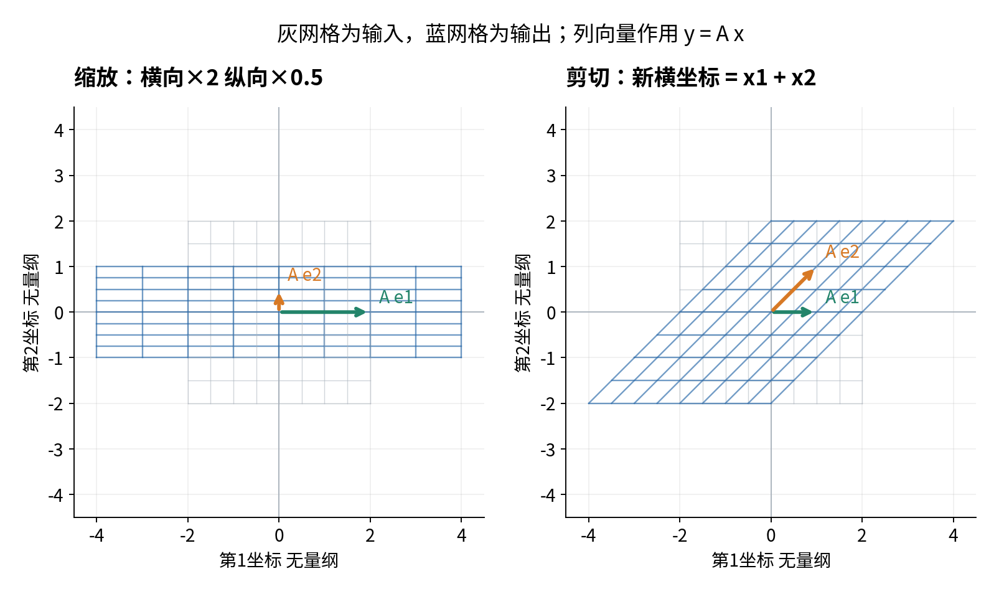
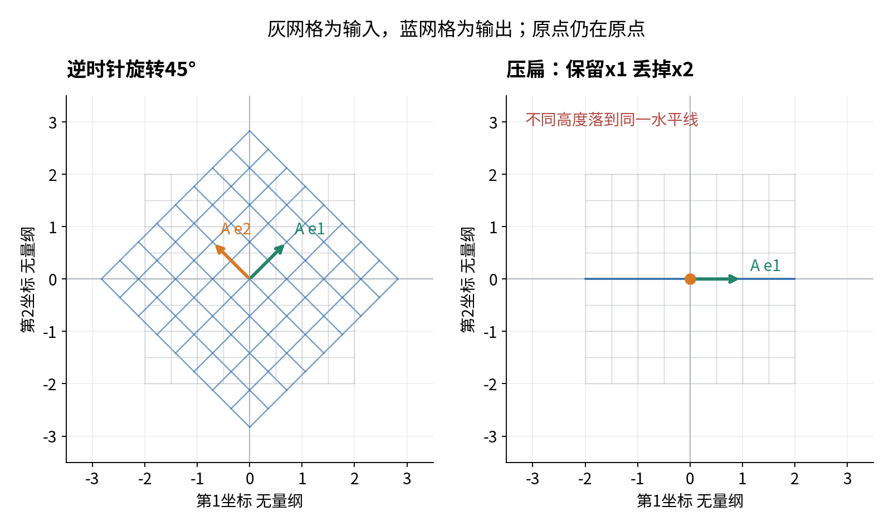

# 矩阵规则核验报告示例

## 输入与形状约定

本实验使用4条合成无量纲样本，X每行一条、每列一个特征，形状4×3。A每行是一条输出规则，形状2×3；单样本以列向量理解，y=A x。所有参数预先给定，没有目标标签或模型拟合。

## 非方阵与复合

手算A B四个格子得到5、-1、-4、6，与独立三重循环和NumPy @一致。B A结果为3×3，与A B不是同一种形状。方阵H、D提供同形状反例：先D后H的HD右上角为1，先H后D的DH右上角为2；对(1,1)分别输出(3,1)、(4,1)。

乘积转置满足(A B)转置=B转置A转置，数值结果为[[5,-4],[-1,6]]。正文逐元素证明适用于相容维数的一般实矩阵；本实验只核验该实现和特定例子。

## 几何与坐标

图的横纵单位显示比例相等。压扁把(1,2)和(1,-1)都送到(1,0)，说明信息可能丢失。非标准基(1,1)、(1,-1)将标准坐标(3,1)写成新坐标(2,1)，对象本身不改变。

45度先转换为π/4弧度，R转置R与单位矩阵在1e-12量级的比较容差内一致。x=(2,1)、z=(1,3)的内积旋转前后为5，长度与端点距离保持。普通缩放不满足这些保持性质。

## 批量结果与接口

从单样本yi=A xi取转置，得到第i行yi转置=xi转置A转置，因此Y=X A转置。四行结果为(5,-2)、(-1,8)、(-1,4)、(1,6)，每行与单独A @ X[i]一致。

w=(2,-1,3)给出Xw=(0,8,8,12)，加偏置0.5后为(0.5,8.5,8.5,12.5)。非零偏置使输入映射成为仿射。单样本X[:1]保持(1,3)，映射结果保持(1,2)；错误共同维数、一维批量输入和列形状权重被明确拒绝。

## 复现与限制

脚本68项检查通过，Notebook23个代码单元完整执行。原始CSV和JSON未变，衍生输出保留逐行结果与输入摘要值。使用Python 3.12.14、NumPy 2.3.5、Matplotlib 3.10.8。

本报告不说明真实任务预测效果，也不把有限测试当作一般命题的证明。Anaconda安装、浏览器Jupyter界面和套接字传输未实际测试。
