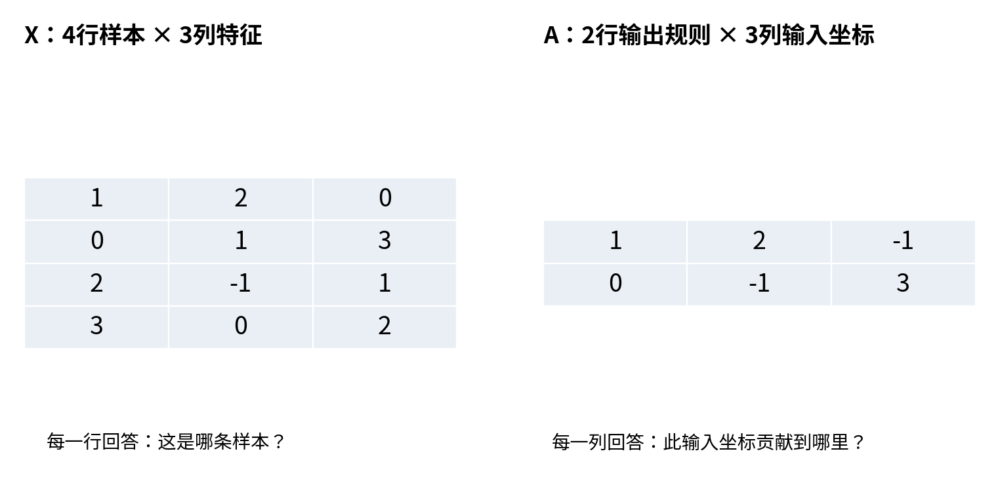
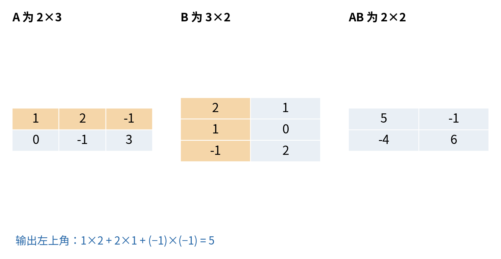
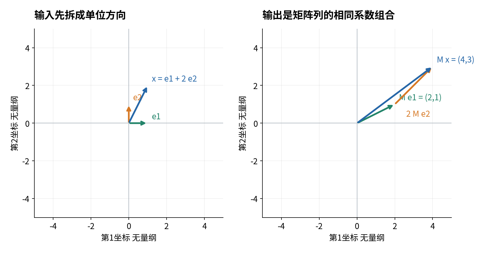
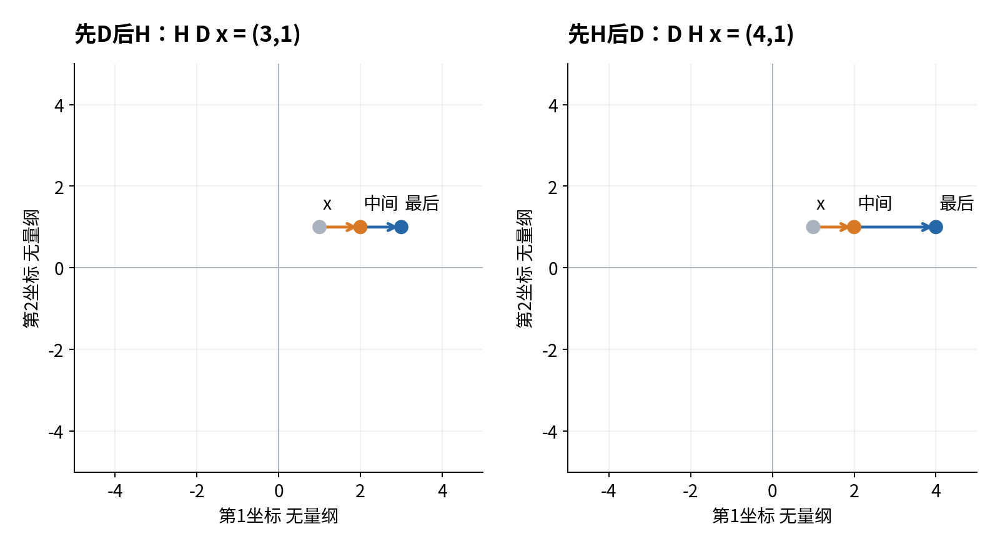
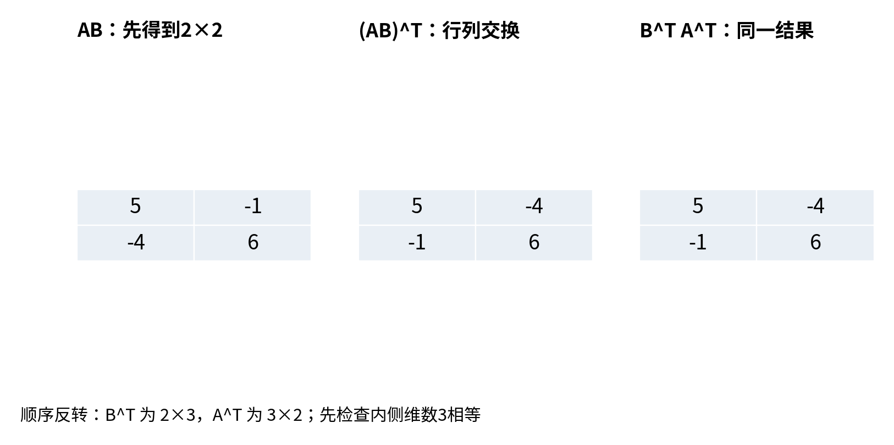
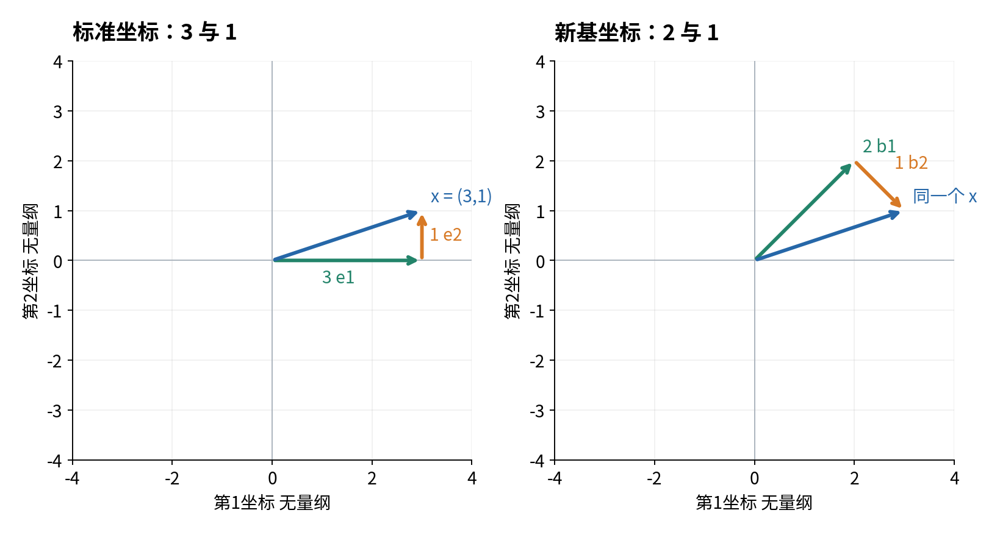
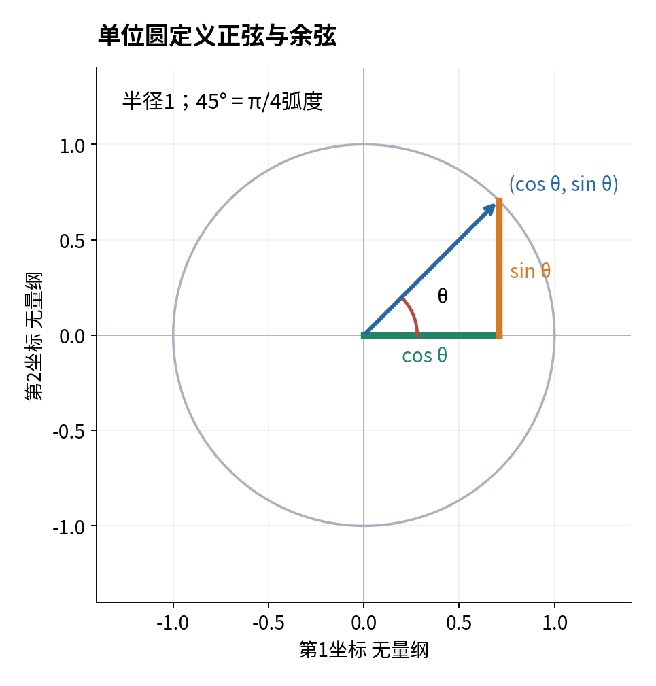
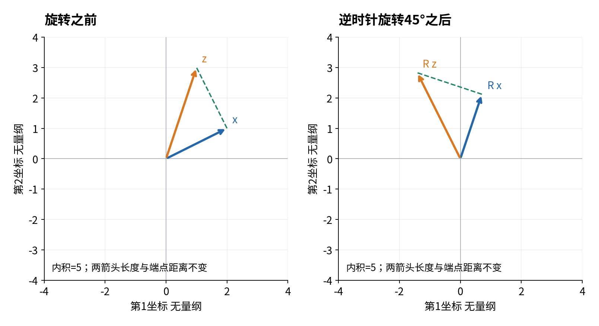
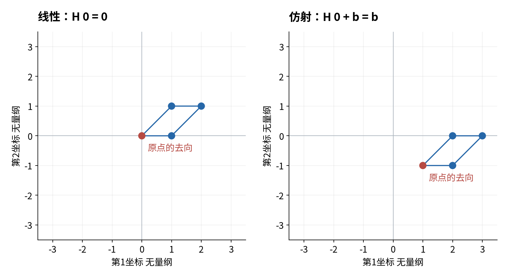
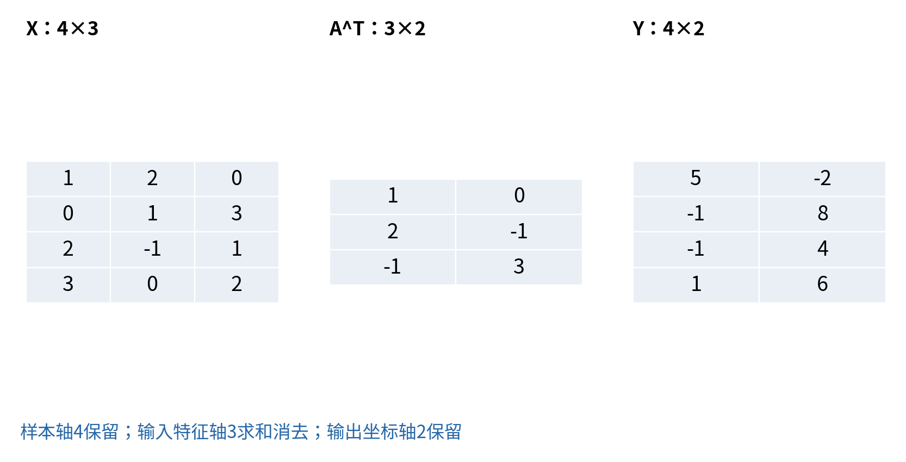

# 矩阵与线性变换

## 第十讲 同一条规则怎样同时改变空间与一批样本

第九讲把多个数看成一个向量，并用内积、长度与距离描述它。现在我们要给向量安排一条统一的变化规则：输入三个坐标，输出两个新坐标；或者把平面上的所有点一起旋转、拉伸、剪切。单独算一个点并不难，困难是说明规则如何对任何输入成立，以及把许多样本排成表后，程序是否仍在做同一件事。

本讲的核心问题是：矩阵乘法究竟对数据和空间做了什么？我们会从一张小数表出发，分别沿“每一行怎样计算”和“每一列表示哪个方向”两条路线理解矩阵。随后把两次变换接起来，解释顺序为什么重要，最后推导批量预测的写法，而不靠记忆几个看似相似的符号。

直接先修是第九讲。你应认识向量、线性组合、内积和欧氏长度；第八讲的求和、函数复合和逐步证明也会用到。矩阵、基、旋转中的正弦余弦与弧度都在本讲重新定义，不要求你已经学过线性方程求解算法。我们不使用行列式或秩来替代直观解释，那些语言会在后续课程逐步建立。

所有坐标、传感器特征和响应分数都是原创合成数据。几何图的坐标均无量纲。计算规则是我们明确给出的，不是从数据训练出来的；本讲没有预测性能结论。学完后，你应能给每个数组轴命名，手算至少一个非方阵乘积，并说明一条代码为何对应你要表达的数学规则。

## 一 矩阵首先是一张有形状的数表

矩阵是把数排成若干行、若干列的长方形。横向是一行，纵向是一列。我们写

$$A=\begin{pmatrix}1&2&-1\\0&-1&3\end{pmatrix}.$$

它有两行、三列，形状为 $2\times3$，读作“二乘三”，这里的乘号用于描述行列数量。六个数字叫矩阵的元素。形状不说明这些数的业务含义；同样的两行三列可以表示两个样本，也可以表示两条输出规则。必须由问题补充行与列代表什么。

在本讲这张 $A$ 中，每一行是一条输出规则，每一列对应一个输入坐标。第一行告诉我们：第一个输入乘1，第二个乘2，第三个乘负1，最后相加。第二行告诉我们：第一个输入乘0，第二个乘负1，第三个乘3。于是三个输入坐标将得到两个输出坐标。

另有一张样本矩阵

$$X=\begin{pmatrix}1&2&0\\0&1&3\\2&-1&1\\3&0&2\end{pmatrix}.$$

它有四行、三列。每行是一次合成观测，每列是一个输入特征。第1行是样本S01，三个特征为1、2、0；第3行S03的第二个特征为负1。这些特征可以理解为已经除以固定参考尺度的有符号偏离量，负数表示低于约定参考点，不是“负数量的设备”。



矩阵大小不同，不一定是数据出了问题。$A$ 的两行是输出坐标数，$X$ 的四行是样本数，它们没有理由相等。刻意使用非方阵能帮助我们检查这件事。如果所有例子都是两个样本、两个特征、两个输出，误交换轴也可能碰巧运行，难以暴露错误。

行数等于列数的矩阵叫方阵，例如 $2\times2$。只有一行的矩阵形状为 $1\times d$，只有一列的矩阵为 $d\times1$。这里 $d$ 是正整数，表示某个维数。向量可以用列形式书写，但NumPy的一维数组形状 $(d,)$ 并不等同于二维列数组 $(d,1)$，这点在批量实现时尤其重要。

## 二 下标先指行再指列

矩阵元素 $a_{ij}$ 表示第 $i$ 行、第 $j$ 列。本讲数学下标从1开始，因此 $a_{13}=-1$，$a_{23}=3$。Python从0开始计位置，所以相应代码是A[0,2]和A[1,2]。看到两个数字时，先问是在数学编号还是程序位置里，不要把偏一位的错误当成公式复杂。

对于有 $m$ 行、$d$ 列的矩阵，我们写 $A\in\mathbb R^{m\times d}$。这只是说它的每个格子放一个实数，行列数分别为 $m,d$。实数包括负数、小数和零，矩阵并不要求元素都是正数。

两张矩阵相等，要求形状相同，而且每个对应位置都相等。只看元素集合相同不够。例如把第一列和第二列交换，虽然数字没丢，矩阵通常已经改变。若每列对应面积、楼龄等不同特征，交换列还会改变解释。

矩阵加减按相同位置进行，要求两张矩阵的行列含义与形状相容。数乘 $2A$ 是把每个元素乘2。零矩阵的每个元素都为零，但它仍有指定形状。$2\times3$ 零矩阵与 $3\times2$ 零矩阵不能因“都是零”就混为同一个对象。

单位矩阵 $I_d$ 是 $d\times d$ 方阵，对角线为1，其余为0。下标 $d$ 指大小，主对角线指行号等于列号的位置。例如

$$I_2=\begin{pmatrix}1&0\\0&1\end{pmatrix}.$$

稍后会验证，单位矩阵的作用是让向量保持原样。它不是所有元素都为1的矩阵。若把两者混淆，就会把“保持每个坐标”写成“把许多坐标加在一起”。

矩阵的基本定义、形状与运算规则可与 [OpenStax矩阵章节](https://openstax.org/books/precalculus-2e/pages/9-5-matrices-and-matrix-operations)核对。下面的数字、推导与图是本课程自行构造的例子。

## 三 逐元素乘法与矩阵乘法在做不同任务

第五讲里，两个同形状数组用星号相乘，得到对应位置的乘积。这称为逐元素乘法。它回答“这一格分别乘多少”，通常不会把不同位置的信息相加。以

$$H=\begin{pmatrix}1&1\\0&1\end{pmatrix},\qquad D=\begin{pmatrix}2&0\\0&1\end{pmatrix}$$

为例，逐元素乘法得到

$$H\odot D=\begin{pmatrix}2&0\\0&1\end{pmatrix}.$$

符号 $\odot$ 在本讲专门标记逐元素乘法。这里右上角为 $1\times0=0$。NumPy中写H * D。若数组形状不同，还可能发生广播；那是第五讲的数组规则，不是矩阵乘法的定义。

矩阵乘法则通过“左边一行与右边一列做内积”产生一个输出元素。它会沿共同维数乘后求和。$HD$ 的右上角不是只算两张表右上角的乘积，而是用H第1行(1,1)与D第2列(0,1)，算 $1\times0+1\times1=1$。因此

$$HD=\begin{pmatrix}2&1\\0&1\end{pmatrix}.$$

同样两个输入矩阵，星号与矩阵乘号给出不同结果，是因为指定了不同操作，不是软件结果不稳定。NumPy中矩阵乘法写H @ D，或者np.matmul(H,D)。接口的维数匹配与一维数组规则见 [NumPy matmul文档](https://numpy.org/doc/2.3/reference/generated/numpy.matmul.html)。

为什么要定义另一种乘法？因为我们常需要把若干输入贡献相加形成新输出，或把两个转换过程接起来。逐元素乘法不能自动表达这种汇总和复合。后面的例子会说明矩阵乘法的每一项来自哪里，而不是把规则当作无缘由的口诀。

## 四 用一个非方阵把四个输出格子算完

继续使用两行三列的 $A$，再给一个三行两列矩阵

$$B=\begin{pmatrix}2&1\\1&0\\-1&2\end{pmatrix}.$$

计算 $AB$ 时，A每行有3个数，B每列也有3个数，能够逐位置配对求内积。输出的行对应A的行，输出的列对应B的列，因此结果为两行两列。形状可以写成

$$(2\times3)(3\times2)\longrightarrow2\times2.$$

内侧两个3必须一致，因为它们决定每个内积有多少对数。外侧的2和2保留下来，分别数有几条左行、几条右列。这个解释比“把中间两个数字划掉”更重要，划掉只是帮助记忆的一种记号。



现在四个格子都手算一次。左上角为 $1\times2+2\times1+(-1)\times(-1)=2+2+1=5$。右上角为 $1\times1+2\times0+(-1)\times2=1+0-2=-1$。左下角为 $0\times2+(-1)\times1+3\times(-1)=0-1-3=-4$。右下角为 $0\times1+(-1)\times0+3\times2=6$。所以

$$AB=\begin{pmatrix}5&-1\\-4&6\end{pmatrix}.$$

一般地，若左矩阵有 $m$ 行、$d$ 列，右矩阵有 $d$ 行、$k$ 列，结果 $C=AB$ 的元素为

$$c_{ij}=\sum_{\ell=1}^{d}a_{i\ell}b_{\ell j}.$$

$i$ 指输出哪一行，$j$ 指输出哪一列；它们在求一个格子时固定不动。$\ell$ 从1走到 $d$，依次把A该行与B该列相同位置相乘，再把这些乘积加起来。每个求和只得到一个数，并不是把整张矩阵一次放进一个格子。

在Python中我们可以完全按定义写三个循环。最外层选择输出行，中间选择输出列，最内层累计共同维数的乘积。实验中的matrix_product_loop这样实现，它没有在内部再调用@。随后把其输出与A @ B逐格比较，才是两种实现之间的检查。

如果改算 $AA$，左A有3列，而右A只有2行，共同维数不匹配，因此常规矩阵乘积在此没有定义。不要为了让它“能乘”就任意reshape；重新排列数字可能改变坐标和规则。先回到问题确认究竟想算什么。

反过来 $BA$ 是有定义的，但形状为 $3\times3$，而不是 $AB$ 的 $2\times2$。因此仅形状就说明二者不能被视为相同矩阵。后面还会给出形状相同但数值不同的反例，说明不可交换并不只由长方形造成。

## 五 矩阵乘一个列向量是一组共同的计算规则

把向量写成列形式

$$x=\begin{pmatrix}x_1\\x_2\\x_3\end{pmatrix},\qquad y=Ax.$$

$A$ 是 $2\times3$，$x$ 是 $3\times1$，因此输出 $y$ 是 $2\times1$。把乘法展开，就得到

$$\begin{aligned}y_1&=x_1+2x_2-x_3,\\y_2&=-x_2+3x_3.\end{aligned}$$

这两条公式就是两行矩阵的含义。输入 $x=(1,2,0)$ 时，输出为 $(5,-2)$；输入 $x=(0,1,3)$ 时，输出为 $(-1,8)$。输出出现负数没有破坏规则，因为本例是无量纲有符号坐标，不是必须非负的价格。

矩阵表示的不是“这一条输入的答案”，而是对所有允许输入使用相同系数的一套规则。把它记成函数 $T(x)=Ax$，就是从 $\mathbb R^3$ 到 $\mathbb R^2$ 的一个映射。映射是函数的另一种称呼，这里强调输入输出可能是不同维数的向量。

为什么称它线性？本讲使用严格定义：对于相同输入空间中的任意向量 $u,v$ 和任意实数 $a,b$，满足

$$T(au+bv)=aT(u)+bT(v).$$

它说先把输入做线性组合再变换，与先分别变换再做相同系数组合，结果一致。可以拆成保持加法和保持数乘两条：$T(u+v)=T(u)+T(v)$，$T(cu)=cT(u)$。

证明矩阵规则满足它，只需看任意一个输出位置：

$$\sum_j a_{ij}(a u_j+b v_j)=a\sum_j a_{ij}u_j+b\sum_j a_{ij}v_j.$$

这个等式来自普通实数的分配律和有限求和；每一个输出位置都相同，所以两个输出向量相同。这里系数小写 $a,b$ 与矩阵元素 $a_{ij}$ 字形相近但角色不同；如果觉得易混，可以把组合系数改名为 $r,s$，证明内容不变。

线性还要求零向量映到零向量，因为 $T(0)=T(0x)=0T(x)=0$。这是快速排除非线性例子的必要条件，但不是充分条件。比如 $f(t)=t^2$ 也把0映到0，却不保持加法：$f(1+1)=4$，$f(1)+f(1)=2$。不能用一个必要检查代替整个定义。

## 六 一列告诉你一个单位方向的去向

在二维平面，标准单位向量为

$$e_1=\begin{pmatrix}1\\0\end{pmatrix},\qquad e_2=\begin{pmatrix}0\\1\end{pmatrix}.$$

它们分别沿第1、第2坐标方向走一个单位。任何二维向量都可以写成 $x=x_1e_1+x_2e_2$。例如 $(1,2)=1e_1+2e_2$。第九讲的线性组合因此成了连接坐标与方向的桥。

若 $M=\begin{pmatrix}2&1\\1&1\end{pmatrix}$，则 $Me_1=(2,1)$，恰好是M第1列；$Me_2=(1,1)$，恰好是第2列。原因直接来自乘法：与e1相乘时第一列乘1、其余列乘0，只留下第一列。

由于线性，

$$Mx=M(x_1e_1+x_2e_2)=x_1Me_1+x_2Me_2.$$

所以矩阵乘向量也可以理解为“用输入坐标当权重，把矩阵的各列组合起来”。对于 $x=(1,2)$，先取一份(2,1)，再取两份(1,1)，得到(4,3)。这与按行算 $2\times1+1\times2=4$、$1\times1+1\times2=3$ 完全一致。



这也解释了怎样从一个已知线性变换构造矩阵：逐个输入标准单位向量，记录其输出，把输出按列排列。不是按行排列，因为第 $j$ 个单位输入选出的是第 $j$ 列。MIT关于[矩阵与线性变换的说明](https://math.mit.edu/~djk/18_022/chapter16/section01.html)可以用于核对这种列解释。

只知道单位方向的去向为什么足够？因为每个输入都是这些单位方向的线性组合，线性规定了组合以后必须怎样输出。如果变换并不线性，只给出几个单位输入的答案就不够了，它可能在其他点采用完全不同的规则。

你现在拥有两种互相检查的读法：一行是一条输出加权规则，一列是一个单位输入的输出贡献。它们不是两个互相竞争的定义，而是同一个矩阵乘法从两个方向展开。做手算时任选方便的一种；出现形状或解释疑问时，两种都写一次往往能找到错位。

## 七 网格让整条变换规则可见

只画一个点的输入输出，无法展示这条规则怎样改变平面。我们在平面画一张网格，每条线包含许多点，然后对每个点使用相同矩阵。灰色是原网格，蓝色是变换后的网格。所有几何坐标无量纲，不把不同物理单位混成同一平面距离。

缩放矩阵 $S=\begin{pmatrix}2&0\\0&0.5\end{pmatrix}$ 给出 $S(x_1,x_2)=(2x_1,0.5x_2)$。横向拉长两倍，纵向压短一半。原点不动，但一般向量长度会改变。例如(1,0)原长1，变成(2,0)后长2；(0,1)变成(0,0.5)后长0.5。不能因为规则线性就以为它保持距离。

剪切矩阵 $H=\begin{pmatrix}1&1\\0&1\end{pmatrix}$ 给出 $(x_1+x_2,x_2)$。同一个高度 $x_2$ 上所有点横向移动相同数量，越高的水平线向右移得越多，负高度向左移。横向单位向量不变，纵向单位向量变成(1,1)，矩形因此倾斜成平行四边形。


压扁矩阵 $P=\begin{pmatrix}1&0\\0&0\end{pmatrix}$ 把 $(x_1,x_2)$ 变成 $(x_1,0)$。不同高度的(1,2)与(1,-1)都变成(1,0)。因此即使完整知道输出，也无法区分这两个输入。我们不需要提前使用秩的术语，就能凭这两个具体输入证明信息被丢掉。

另一类变换会把网格整体转动，稍后我们从单位圆推导旋转矩阵。图中旋转仍保留格子的边长与夹角，而压扁把许多不同点压到同一条线上。二者都是矩阵规则，几何性质却很不同。


线性变换把一条参数化直线 $p+tv$ 变成 $Ap+tAv$。当 $Av$ 非零时，输出仍沿一个固定方向变化，是直线；若 $Av=0$，所有点都落在 $Ap$，直线退化为一个点。所以“直线永远变成直线”还少了一种可能：可能被压成点。

图形帮助我们发现这种性质，但一般结论要由公式解释。网格看起来没有弯，只验证了我们画过的点；$A(p+tv)=Ap+tAv$ 才说明任意实数 $t$ 都遵守同样规则。

## 八 复合决定矩阵乘法为什么这样定义

第八讲学过函数复合：先把输入交给一个函数，再把它的输出交给下一个函数。若先执行 $B$ 再执行 $A$，列向量的计算是 $A(Bx)$。我们希望用一张矩阵一次完成，于是写成 $(AB)x$。

注意离输入最近的B先作用，左边A后作用。“先B后A”写成AB，而不是BA。这是从函数嵌套读出来的，不是故意把时间顺序倒过来为难人。

为什么第4节的乘法恰好满足这个要求？设B把输入 $x\in\mathbb R^k$ 变成d维，A再把d维变成m维。第i个最终输出为

$$\begin{aligned}(A(Bx))_i&=\sum_{\ell=1}^{d}a_{i\ell}(Bx)_\ell\\&=\sum_{\ell=1}^{d}a_{i\ell}\sum_{j=1}^{k}b_{\ell j}x_j\\&=\sum_{j=1}^{k}\left(\sum_{\ell=1}^{d}a_{i\ell}b_{\ell j}\right)x_j.\end{aligned}$$

最后一步只是把有限个乘积重新分组。括号里的和正好是 $(AB)_{ij}$，所以整个表达式就是 $((AB)x)_i$。每个位置都相同，便得到 $A(Bx)=(AB)x$。矩阵乘法的行列配对规则由此与“复合两条线性规则”吻合。

### 一个同形状但不交换的反例

使用D把第1坐标乘2、第2坐标不变，再用H剪切。先D后H，对输入(1,1)，中间为(2,1)，最后为(3,1)。若先H后D，中间为(2,1)，最后为(4,1)。同一个中间数在这组特殊输入里恰巧相同，但第二步规则不同，最终结果仍不同。

逐格计算得到

$$HD=\begin{pmatrix}2&1\\0&1\end{pmatrix},\qquad DH=\begin{pmatrix}2&2\\0&1\end{pmatrix}.$$

两张矩阵形状相同，右上角却不同，因此 $HD\ne DH$。这给“矩阵乘法总可交换”的说法一个明确反例。某些特定矩阵确实可交换，比如同维单位矩阵与任意相容方阵，但不能把特殊情况推广为普遍规则。



矩阵乘法满足相容维数下的结合律 $(AB)C=A(BC)$。它只允许改变分组括号，不允许交换A、B、C的次序。证明仍可通过每个输出格子的有限双重求和展开，两边都把 $a_{i\ell}b_{\ell r}c_{rj}$ 对所有合法 $\ell,r$ 求和。你可以先完成任意一组中间计算，输入输出规则不变。

结合方式会影响需要的中间表大小和计算量。比如形状为1000×2、2×1000、1000×1的三张矩阵，先乘前两张会产生1000×1000中间表；先乘后两张只有2×1中间表。数学结果相同，不意味着电脑所需工作相同。本讲只要求你先核对维数，不展开性能优化。

## 九 转置交换行列 乘积转置还要反转次序

转置把一张矩阵的行变成列、列变成行，记为 $A^T$。上标T是转置符号，不是把矩阵提升到某个数值幂。对于本讲A，

$$A^T=\begin{pmatrix}1&0\\2&-1\\-1&3\end{pmatrix}.$$

A是2×3，转置后为3×2。原来的第1行成为新表第1列。逐个元素说，就是 $(A^T)_{ij}=a_{ji}$。转置两次回到原矩阵：$(A^T)^T=A$。

转置不会把一个一般变换“撤销”。例如 $S=\begin{pmatrix}2&0\\0&0.5\end{pmatrix}$ 的转置仍是S，连续作用两次会把横坐标乘4、纵坐标乘0.25，并没有恢复原向量。后面旋转矩阵的转置恰好能撤销旋转，是额外性质，不能先假定所有矩阵都如此。

### 从元素定义证明乘积转置

设A是m×d，B是d×k，则AB是m×k，$(AB)^T$ 是k×m。B转置是k×d，A转置是d×m，因此 $B^TA^T$ 也为k×m，形状先对上了。接着任取输出第i行、第j列：

$$\begin{aligned}((AB)^T)_{ij}&=(AB)_{ji}\\&=\sum_{\ell=1}^{d}a_{j\ell}b_{\ell i}\\&=\sum_{\ell=1}^{d}(B^T)_{i\ell}(A^T)_{\ell j}\\&=(B^TA^T)_{ij}.\end{aligned}$$

第三行交换的是两个实数因子的顺序，不是交换两个矩阵。因为每个位置都相等，得到

$$(AB)^T=B^TA^T.$$

这条证明同时给出条件、形状和逐位置相等，不能只凭两张图相似就认定公式。也不要把结果记成 $A^TB^T$，矩阵顺序必须反转。



对于第4节的例子，$(AB)^T=\begin{pmatrix}5&-4\\-1&6\end{pmatrix}$。按 $B^TA^T$ 独立计算会得到相同结果。相反，$A^TB^T$ 的形状是3×3，甚至不是同一种输出形状。

在NumPy中，二维数组A.T执行转置。但是一维数组x形状为(3,)时，x.T仍是(3,)，因为它只有一个轴，没有行轴与列轴可交换。想明确构造列数组，应使用x[:,None]或reshape(3,1)；明确行数组可以使用x[None,:]。这类接口细节见 [NumPy transpose文档](https://numpy.org/doc/2.3/reference/generated/numpy.transpose.html)。

## 十 基给坐标提供解释 不只是两根任意箭头

我们已经用 $e_1,e_2$ 表示每个二维向量。能不能换两根不同方向的箭头，仍然描述同一个平面？可以，但新的箭头必须让每个向量都能被表示，而且表示系数唯一。满足这两个要求的一组有次序的向量，称为这个空间的一组基。

“能表示所有向量”防止遗漏方向，“系数唯一”防止同一个向量有许多互相矛盾的坐标。二维标准基就是 $(e_1,e_2)$。一般向量 $(x_1,x_2)$ 用系数 $x_1,x_2$ 表示，代入分量立即可见这组系数是唯一的。

考虑另一组向量

$$b_1=\begin{pmatrix}1\\1\end{pmatrix},\qquad b_2=\begin{pmatrix}1\\-1\end{pmatrix}.$$

若要用它们表示 $x=(3,1)$，需要找两个系数 $c_1,c_2$，使 $c_1b_1+c_2b_2=x$。按两个分量展开就是

$$\begin{cases}c_1+c_2=3,\\c_1-c_2=1.\end{cases}$$

这里两行条件要同时成立。把两行相加，左边的 $c_2$ 抵消，得到 $2c_1=4$，所以 $c_1=2$。用第一行减第二行，得到 $2c_2=2$，所以 $c_2=1$。最后代回验证：$2(1,1)+(1,-1)=(3,1)$。

我们没有使用尚未学习的一般消元算法，只做了普通等式加减。对任意 $x=(x_1,x_2)$，同样步骤给出

$$c_1=\frac{x_1+x_2}{2},\qquad c_2=\frac{x_1-x_2}{2}.$$

这证明每个x都有一组系数。为什么唯一？任何满足两行条件的系数，相加相减后都必须等于这两个表达式，所以不可能存在另一组不同答案。因此这两根向量确实是一组基，而不只是对某一个x碰巧有用。



把基向量按列放入矩阵

$$C=\begin{pmatrix}1&1\\1&-1\end{pmatrix},\qquad c=\begin{pmatrix}c_1\\c_2\end{pmatrix},$$

则 $x=Cc$。C把“新基下的坐标”转换成“标准基下的坐标”。它看起来也是矩阵乘法，但任务解释与“把同一坐标系中的点主动移动到另一个点”不同。前者是换一种方式描述同一对象，后者是对对象实施一个变化。必须把输入输出所用基写清楚，才能区分两种解释。

同样的数字矩阵在不同任务中可以承担这两种角色，不是数学冲突。矩阵本身没有附带“这是坐标变换还是物体运动”的标签，它依赖约定。图8两边的蓝色终点相同，正是为了提醒你这次只改变表示。

若使用 $b_1=(1,1)$、$b_2=(2,2)$，它们就不是整个二维平面的一组基：任何组合的两个分量相同，所以不能表示(1,0)；而(2,2)既能写成 $2b_1+0b_2$，也能写成 $0b_1+1b_2$，系数还不唯一。这个反例同时展示两种要求失败，不需要引入行列式测试。

基也不一定由单位长度箭头组成。本讲的b1、b2长度都是 $\sqrt2$。因此x在标准坐标中的长度为 $\sqrt{3^2+1^2}=\sqrt{10}$，新坐标c直接按普通平方和算出来却是 $\sqrt{2^2+1^2}=\sqrt5$。后者不是原向量的几何长度，因为新坐标的一单位箭头本来更长。要判断几何量，先恢复坐标约定，不能换基以后仍无条件套用旧的测量公式。

### 同一条变换换一组坐标会怎样

还可以继续问：保持真实几何变换H不变，但输入输出都使用新基b1、b2时，描述它的矩阵是否仍是H？一般不是。矩阵的列记录“单位坐标输入的像”，换了基以后，单位坐标输入所代表的真实方向也换了。

新坐标里的(1,0)对应真实向量b1=(1,1)。对它实施H，得到(2,1)。再用刚才的加减公式改写成新基坐标，得到(1.5,0.5)。这就应成为新表示矩阵的第1列。

新坐标里的(0,1)对应b2=(1,-1)。H作用后得到(0,-1)，其新基坐标为(-0.5,0.5)，成为第2列。因此同一条H变换在新基下表示为

$$K=\begin{pmatrix}1.5&-0.5\\0.5&0.5\end{pmatrix}.$$

把x=(3,1)作为检查对象。它的新坐标为c=(2,1)。先用K得到新输出坐标 $Kc=(2.5,1.5)$，再用C还原为标准坐标：$C(2.5,1.5)=(4,1)$。另一条路径直接算 $Hx=(4,1)$，相同。

这两条路径的关系是 $CK=HC$。左边先在新坐标中变换、再恢复标准坐标；右边先恢复标准坐标、再用H变换。我们不需要先学习矩阵求逆，只要把每列的单位输入沿两条路径核对，就能理解这个关系。这里K和H的数值不同，不意味着物理变换发生了变化。

这个例子也提醒我们，脱离基的约定谈“某个矩阵代表旋转还是剪切”可能不完整。前面的网格图始终使用标准坐标，所以矩阵与几何解释可以直接对应；换到非单位或倾斜的基以后，坐标数字的外观不能简单替代真实空间的长度与方向。

初学时不必急着记一般换基公式。先记清三件事：c是新坐标，Cc是同一个对象的标准坐标，K的每一列必须用新坐标描述输出。如果把输入按新基、输出却按旧基填写而不说明，就会把不同的坐标语言塞进同一张矩阵。

## 十一 从单位圆认识角度 正弦 余弦

第九讲讨论过夹角，现在需要把“转过某个角度”写成具体矩阵。为避免把三角函数当作已有知识，我们从圆上一个点的坐标定义它们。

画一个以原点为圆心、半径为1的圆，称为单位圆。由勾股关系，圆上每个点 $(u,v)$ 都满足 $u^2+v^2=1$。从正第1坐标轴出发，逆时针转动一根长度1的箭头，转过角度 $\theta$ 后，其终点在单位圆上。我们把终点的第1坐标叫 $\cos\theta$，第2坐标叫 $\sin\theta$。

cos读作余弦，sin读作正弦。它们是“输入角度，输出一个坐标”的函数名，不是c、o、s三个变量相乘。写成cos(θ)或cos θ都在表示同一函数取值；程序中应明确写np.cos(theta)。

于是，单位圆的定义立刻给出

$$\cos^2\theta+\sin^2\theta=1.$$

这里 $\cos^2\theta$ 是 $(\cos\theta)^2$ 的简写，不是对角度先平方再求余弦。这个关系没有被当成需要死记的独立口诀，它来自圆上点的两个坐标平方和等于半径平方。



完整一圈常用360度表示，因此四分之一圈是90度，半圈180度。正方向在本讲约定为逆时针，顺时针角度取负。0度的单位圆点为(1,0)，90度为(0,1)，180度为(-1,0)，270度为(0,-1)。因此可以直接读出这些角度的正弦、余弦，不必先背表。

45度把第一象限的直角分成相等两半，单位圆点横纵坐标相同而且都为正。设它们都是q，则 $2q^2=1$，所以 $q=1/\sqrt2=\sqrt2/2$。最后一个等号可以把分子分母同乘 $\sqrt2$ 验证。我们获得精确值，而程序中的0.707106…只是小数近似。

### 弧度为什么进入程序

除了度，还有弧度。对于圆心角，取它截出的有向圆弧长度，再除以半径，得到弧度数。圆弧长度与半径单位相同，商没有物理单位，但仍应说明角度采用弧度制。单位圆半径为1时，弧长数值与弧度数相同。

圆周率 $\pi$ 是圆周长与直径之比，约为3.14159。半径r的圆周长为 $2\pi r$，因此整圈弧度为 $2\pi r/r=2\pi$，半圈是 $\pi$。于是180度等于π弧度，一度等于π/180弧度，45度等于π/4弧度。

转换公式为

$$\theta_{\rm rad}=\theta_{\rm deg}\frac{\pi}{180}.$$

下标rad、deg分别提醒弧度与度。它们是在给变量注明含义，不是新的运算。NumPy的sin、cos接收弧度，不能直接把45当45度输入。正确写法是theta = np.deg2rad(45)，然后调用np.sin(theta)、np.cos(theta)。文档分别见 [角度转换](https://numpy.org/doc/2.3/reference/generated/numpy.deg2rad.html)、[正弦](https://numpy.org/doc/2.3/reference/generated/numpy.sin.html)与[余弦](https://numpy.org/doc/2.3/reference/generated/numpy.cos.html)。

若误写np.cos(45)，它会计算45弧度的余弦，程序未必报错，因为45仍是合法弧度数。这是典型的语义错误：函数收到了能计算的数字，但不是你心里那个角度。用0度、90度和180度这些已知答案测试，常能及时发现问题。角度与单位圆的基础也可查阅 [OpenStax角度章节](https://openstax.org/books/precalculus-2e/pages/5-1-angles)及[单位圆章节](https://openstax.org/books/precalculus-2e/pages/5-2-unit-circle-sine-and-cosine-functions)。

## 十二 旋转矩阵怎样从两根单位箭头得到

设 $c=\cos\theta$，$s=\sin\theta$。第1个单位向量e1逆时针旋转θ后成为(c,s)。e2原本比e1逆时针多90度，因此两根箭头共同旋转后，e2的像仍应处在e1的像逆时针90度的位置。

平面向量(u,v)逆时针转90度会变成(-v,u)：原来水平向右的分量转成向上，原来竖直向上的分量转成向左。这个坐标交换与符号变化对正负分量都适用。因此(c,s)再转90度得到(-s,c)。

把这两个单位方向的像按列放进矩阵，就得到

$$R_\theta=\begin{pmatrix}c&-s\\s&c\end{pmatrix}=\begin{pmatrix}\cos\theta&-\sin\theta\\\sin\theta&\cos\theta\end{pmatrix}.$$

它按线性组合处理所有向量。为什么整个平面共同旋转符合这种线性处理？向量加法可以用平行四边形表示；把整个平行四边形绕原点转动同一个角度，边与对角线的加法关系仍然相同。数乘只改变沿同一方向的倍数，共同转动也保留这个倍数。下面再用代数核查这个候选矩阵确实保持长度与内积，使直观与计算互相支持。

45度时 $c=s=\sqrt2/2$，所以

$$R_{45^\circ}=\frac{\sqrt2}{2}\begin{pmatrix}1&-1\\1&1\end{pmatrix}.$$

作用于(2,1)，第一坐标为 $(2-1)\sqrt2/2=\sqrt2/2$，第二坐标为 $(2+1)\sqrt2/2=3\sqrt2/2$。90度时c=0、s=1，矩阵变为 $\begin{pmatrix}0&-1\\1&0\end{pmatrix}$，正好实现刚才的坐标规则。

### 完整计算转置乘自身

我们已经知道转置交换行列，因此

$$R_\theta^TR_\theta=\begin{pmatrix}c&s\\-s&c\end{pmatrix}\begin{pmatrix}c&-s\\s&c\end{pmatrix}=\begin{pmatrix}c^2+s^2&-cs+sc\\-sc+cs&s^2+c^2\end{pmatrix}=I_2.$$

对角线等于1来自单位圆关系；非对角线等于0来自两个实数乘积相同后相消。这里没有跳过三角函数恒等式，也没有调用我们还没有学过的行列式性质。满足这种转置乘自身为单位矩阵的实方阵，称为正交矩阵；“正交”指它的列向量相互正交且各有单位长度，不是说矩阵本身有一个直角外形。

第九讲的实向量内积可以写成 $x^Tz$。所以对于任意二维列向量x、z，

$$\begin{aligned}\langle R_\theta x,R_\theta z\rangle&=(R_\theta x)^T(R_\theta z)\\&=x^TR_\theta^TR_\theta z\\&=x^TI_2z\\&=x^Tz=\langle x,z\rangle.\end{aligned}$$

第二行使用刚证明的乘积转置公式和相容结合律。第三行使用 $R_\theta^TR_\theta=I_2$。这不是只对某两个测试点成立，而是对所有实二维x、z成立。

令z=x，便有旋转前后平方长度相同；长度是非负平方根，所以长度也相同。任意两个点x、z的差向量经过旋转是 $R_\theta(x-z)$，因此点间距离也不变。对非零向量，内积与长度都不变，第九讲定义的余弦夹角便不变。零向量没有独立方向，不应硬给它定义一个旋转前后的夹角。



具体取x=(2,1)、z=(1,3)，原内积为 $2\times1+1\times3=5$，平方长度分别为5和10，端点差为(1,-2)，距离 $\sqrt5$。将两者乘45度旋转矩阵后，你可以按分量重算，得到同样结果。程序检查可能出现约 $10^{-16}$ 量级的残差，那是浮点近似，不意味着代数证明失败。

此处转置确实能够撤销旋转：$R_\theta^T(R_\theta x)=I_2x=x$。它对应逆向转动。我们只在已证明转置乘自身为单位矩阵的情形中这样说，不把它推广到所有线性变换。普通缩放、剪切和压扁一般不保持长度，压扁甚至不能从输出唯一恢复输入。

进一步说，保持内积的正交矩阵并不全是通常意义的旋转。例如把(第1坐标,第2坐标)变成(第1坐标,负第2坐标)会作镜像反射，同样保持长度与内积。本讲用单位方向的具体去向指定旋转方向，不能仅凭 $Q^TQ=I$ 就断言任何Q一定是逆时针旋转。

## 十三 偏置让输入映射成为仿射

现在给矩阵规则加一个固定向量b：

$$F(x)=Ax+b.$$

它先进行线性变换，再把所有输出平移同一个向量。这样的规则叫仿射映射。当b不为零时，原点去往b，所以它已经不满足线性映射必须把0映到0的条件。

加法也能直接展示差异。$F(u+v)=Au+Av+b$，而 $F(u)+F(v)=Au+b+Av+b=Au+Av+2b$。二者相差一个b，除非b=0，否则不能对所有输入相等。这里不是说仿射规则不好，只是它有不同的数学性质。



机器学习里却经常把 $\hat y=w^Tx+b$ 称为线性模型。应区分两个说法：作为输入x的函数，它在b非零时是仿射的；把x视为固定、把w和b视为待选择参数，输出是参数的线性组合。这种“线性模型”的命名惯例并不意味着严谨数学定义被取消。

例如输入三个特征，规则为 $\hat y=2x_1-x_2+3x_3+0.5$。固定部分0.5叫偏置或截距。它不必被解释成真实设备中某个可单独测量的基础开销；只是模型规定的一个加法参数，真实含义仍需任务证据。

还有一种常用写法：把输入扩充为 $\tilde x=(x_1,x_2,x_3,1)$，把参数扩充为 $\tilde w=(w_1,w_2,w_3,b)$，便有 $\hat y=\tilde w^T\tilde x$。最后一个常数1把偏置纳入了内积。

这让代码更统一，却没有让原来的x到输出突然变成严格线性。因为你限制扩充输入的最后坐标恒为1，而两个这样的输入相加后最后坐标为2，已经离开原来的扩充输入集合。表示技巧不能改变原映射的定义；它只是把固定项写进更大的坐标系统。

## 十四 把单个列向量规则推导为批量行样本规则

前面的几何写法把单个样本记成列向量 $x_i\in\mathbb R^d$。下标i指样本身份，向量内部还有d个特征分量。数据文件通常每行一个样本，于是样本矩阵写成

$$X=\begin{pmatrix}x_1^T\\x_2^T\\\vdots\\x_n^T\end{pmatrix}\in\mathbb R^{n\times d}.$$

这里 $n$ 是样本数，$d$ 是输入特征数。第i行不是列向量 $x_i$ 本身，而是它转成行的 $x_i^T$。数学上把这件事写清楚，程序里就不会靠猜测要不要转置。

设A把d维输入映到k维输出，即 $A\in\mathbb R^{k\times d}$，单个结果为 $y_i=Ax_i$。若输出也按样本排成行，第i行应当是

$$y_i^T=(Ax_i)^T=x_i^TA^T.$$

把所有行一起排起来，得到

$$Y=XA^T\in\mathbb R^{n\times k}.$$

这就是批量映射为何写成X @ A.T。不是“看到矩阵就补一个转置”，而是我们明确选择样本按行存放，再从单个列向量公式推导出来。形状检查为 $(n\times d)(d\times k)\to n\times k$：样本轴n保留，输入特征轴d参与求和，输出坐标轴k保留。



对于本讲数据 $n=4,d=3,k=2$，手算每一行得到

$$XA^T=\begin{pmatrix}5&-2\\-1&8\\-1&4\\1&6\end{pmatrix}.$$

第一行是A作用于(1,2,0)的输出，已在前面算过。第三行输入(2,-1,1)，第一输出 $2+2(-1)-1=-1$，第二输出 $-(-1)+3=4$。第四行输入(3,0,2)，第一输出 $3+0-2=1$，第二输出为6。

如果写X @ A，共同维数会变成3与2，不匹配。这个错误在非方阵上会立即暴露。但若A恰好是2×2、X有两列，X @ A也能运行，却通常代表另一条规则。形状检查是必要条件，不是语义正确的全部证据；至少选一条样本对比A @ x与对应批量输出。

### 单输出预测为什么是X乘w

若每条样本只输出一个分数，设权重列向量 $w\in\mathbb R^d$，单样本预测为 $\hat y_i=w^Tx_i$。这是两个实向量的内积，也等于 $x_i^Tw$。把所有样本排成行，得到

$$\hat y=Xw\in\mathbb R^n.$$

严格用二维列形状时输出为n×1；NumPy若w使用一维形状(d,)，结果通常为一维(n,)。这两种存储可表达同一组数，但程序接口要统一。本讲predict_rows明确接收w(d,)并返回(n,)，同时要求X始终为二维批量。

设w=(2,-1,3)，则四个预测为

$$Xw=\begin{pmatrix}0\\8\\8\\12\end{pmatrix}.$$

第一行 $1\times2+2\times(-1)+0\times3=0$；第二行 $0\times2+1\times(-1)+3\times3=8$；第三行 $2\times2+(-1)\times(-1)+1\times3=8$；第四行 $3\times2+0+2\times3=12$。加标量偏置0.5以后，每条分别变成0.5、8.5、8.5、12.5。

这里所有特征都已声明无量纲，所以线性组合不会直接把米和年份当成同一物理量。如果输入实际带不同单位，权重也需要带相应换算含义，使各项加和的单位一致。第九讲关于尺度的提醒仍然有效，矩阵记号不会自动消除单位问题。

### 形状相同仍可能把特征名字弄反

把X的第1、2列交换，仍然得到4×3矩阵，所有形状检查都会通过。可是w若继续按原来的顺序(2,-1,3)使用，第一条样本就从(1,2,0)变成(2,1,0)，预测从0变成 $2\times2-1=3$。程序没有错算乘法，错误在于输入列与权重含义没有一起调整。

若交换数据列只是为了换一个显示顺序，那么权重也必须同步交换为(-1,2,3)，第一条预测变为 $2\times(-1)+1\times2=0$。其余各行也应回到原结果。对于多输出矩阵A，应同步交换A的输入列；不能只改样本表的列标题。

这个检查把第六讲的数据字典与今天的矩阵计算连起来。NumPy数组通常没有“这是温度偏离还是压力偏离”的列标签，只知道第几个位置。读表转数组时应先固定特征顺序，并把权重对应关系一起记录。形状是接口的一部分，字段名字和单位是另一部分。

### 两种参数排法可以表达同一批量规则

我们把每条输出规则放在A的一行，因此A是k×d，批量计算为X A转置。也可以一开始就把规则参数按列摆在W中，令 $W=A^T$，使W形状为d×k，直接写Y=XW。这两种约定都合法，前提是始终一致。

因此看到其他教材或软件写X @ W时，不应立刻判断它漏了转置。先问W的每个轴是什么、单样本公式如何写。若W每列是一组输出权重，它本来就应是d×k；若参数矩阵每行是一组输出权重，则批量写法需要相应转置。

本讲使用A的行解释与列向量作用作为主约定，是为了让几何变换和批量数据能通过明确推导连接起来，不是宣称所有代码库都必须采用相同变量名。你真正要掌握的是对应关系，而不是识别某个字母就机械添加.T。

## 十五 一条样本最容易暴露形状假设

单样本是检验接口的好机会。X[0]取出一维数组，形状为(3,)；X[:1]保留前一行构成的二维数组，形状为(1,3)。两者都显示三个数，但样本轴的存在与否不同。

本讲规定批量函数apply_rows的X必须为(n,d)。只有一条样本时，应输入X[:1]，返回形状为(1,2)，保持“一条样本、两个输出”。若误输入X[0]，函数明确报错，提醒你补回样本轴。这样比依赖NumPy在许多边界形状下自动提升维数更容易审计。

```python
A = np.array([[1, 2, -1], [0, -1, 3]], dtype=float)
X = np.array([[1, 2, 0], [0, 1, 3], [2, -1, 1], [3, 0, 2]], dtype=float)
w = np.array([2, -1, 3], dtype=float)
Y = X @ A.T
scores = X @ w
single_Y = X[:1] @ A.T
```

Y的形状是(4,2)，scores是(4,)，single_Y是(1,2)。每个shape都应该能读成一句话。比起打印一大串漂亮的小数，先检查shape常常更快发现批量代码错位。

还有一种危险情况：你希望得到n个预测，却把w写成(d,1)，于是X @ w返回(n,1)。如果真实目标y使用(n,)，计算差值时广播可能产生(n,n)，把每个预测与每个目标配对，而不是逐样本相减。这与第五讲的广播问题完全相连。

因此我们在预测函数里明确要求w只有一个轴，并拒绝列形状权重。你也可以设计另一套一致的接口，让预测与目标都保持(n,1)，但不能在没有检查的情况下混用。正确的数组形状要由实验约定选择，不是由“代码没报错”决定。

### 循环实现是核验工具

实验先用三个循环实现常规矩阵乘法，再与@比对。对于m×d乘d×k，共有m×k个输出格子，每个格子累计d个乘积。循环虽然不如优化库高效，却把每个轴的作用暴露出来，适合教学和已知答案测试。

向量化程序不应只在方阵上测试。我们还检查2×3乘3×2、3×2乘2×3、4×3批量、1×3单样本、错误共同维数、错误权重长度和非有限数。不同测试瞄准不同错误，不是把同一正确例子换几个随机种子重复运行。

## 十六 证明 数值测试 图形检查各自负责什么

讲义证明了矩阵映射保持线性组合、复合对应乘法、乘积转置反转顺序，以及旋转保持内积。它们适用于所有满足条件的实数输入。脚本中的68项检查只验证若干确定输入和实现行为，不能替代这些一般证明。

反过来，即使公式证明正确，代码也可能把A.T漏掉、把角度制当弧度、把样本轴与特征轴颠倒。数值测试负责让已知答案与程序相互核对。一个断言失败时，应先找最早不一致的中间步骤，不要把最后的误差阈值放宽到能通过为止。

整数构成的小矩阵给我们精确手算答案；旋转含开平方和三角函数的小数，比较时使用明确容差。容差不是容忍任意错误，而是承认浮点近似。比如理论上 $\cos(\pi/2)=0$，程序可能得到接近零的很小数；可以检查它与零的差是否在合理范围内。

图形检查负责另一类问题。若坐标横纵显示比例不一致，一个单位圆可能看起来像椭圆，正确旋转也可能像被拉伸。几何图需要相同单位比例，并标明原网格、输出网格、方向与范围。若输出点超出显示窗口，应该扩大范围或注明裁切，不能把没显示到的点当作被算法删除。

原始samples.csv与matrices.json只读保存，结果另写outputs。相同输入的两次独立运行应得到一致的CSV和JSON。Notebook要在新内核中从顶部运行，保留所有输出；只在已经存有旧变量的内核中运行最后一格，不能验证整条实验链。

### 一次没有报错的错误实验

假设有人把批量映射写成X @ B。B恰好为3×2，结果也是4×2，看上去完全符合“4条样本、2个输出”。但是B并不是A的转置。第一条输入(1,2,0)乘B得到(4,1)，而指定规则A应给(5,-2)。仅凭输出形状无法发现这个错误。

可以按以下顺序定位。先选一条简单输入，把它的三个坐标写出来；再根据任务原文手算两条输出公式；然后检查程序的第一行结果。若不同，逐个核对参数矩阵中的位置，而不是先怀疑浮点数。这里差异是整数级别，容差与显示小数位都不是主要问题。

进一步输入标准单位向量e1=(1,0,0)，e2=(0,1,0)，e3=(0,0,1)。指定A的三个输出应该是(1,0)、(2,-1)、(-1,3)。若程序实际使用B按行样本计算，它会输出B的三行(2,1)、(1,0)、(-1,2)。单位输入把每个参数贡献逐一隔离，往往比随机输入更容易解释。

这种方法叫有针对性的已知答案检查：不是只问“能否跑”，而是让输入激活某个明确位置，检查结果是否符合含义。它适用于后面的神经网络层、特征变换和多输出预测；复杂系统仍然由这些小接口组成。

### 把一个结果写成可交接的说明

合格的核验说明不能只有“矩阵乘法成功”。可以写：“输入X的每行是一条样本，列顺序固定为x1、x2、x3；参数A每行对应一个输出，因此Y=X A转置，结果为四行两列。第一个样本单独代入得到(5,-2)，与批量第一行一致。单样本批量输入保持一行，不去掉样本轴。”

对于旋转，还应写明角度为45度、先转换为π/4弧度、图中横纵单位比例相等。对于偏置，说明它被加到每条输出而没有混入特征轴。这样的文字把数据含义、公式和程序接在一起，比单独附上测试通过截图更方便别人发现问题。

最后保留未覆盖范围：本实验没有检验任意规模的性能，也没有测试真实传感器数据或拟合权重。已知答案的小实验足以确认这些教材例子的实现，但不能自动证明未来业务中的列顺序、单位和任务定义正确。

## 十七 从本讲走向线性方程

我们目前大多沿正方向计算：已知输入与矩阵，求输出。自然的下一问是：已知A与输出y，能否找回x？压扁例子说明有时不唯一，有些输出甚至不可能达到；基例子则给出一个能通过加减唯一找回坐标的简单情形。

第十一讲会系统研究线性方程、信息是否足够，以及没有精确答案时怎样定义近似。本讲不要求提前知道一般算法，只需带走三个具体问题：有没有输入能到达这个输出；若有，是否唯一；数值计算的结果是否稳定。它们都建立在今天的形状、列解释与映射含义之上。

使用矩阵时，先写“输入几个坐标，输出几个坐标”，再写公式和程序。样本按行排列时从单样本列向量规则推导批量表达式；两次变换时先写执行顺序再写乘积；涉及坐标或几何量时说明所用基与单位。这些习惯比提前记住更多矩阵术语更有用。

## 十八 课后练习

详细解答见answers.md。每题先说明形状或条件，再计算。

1. 写出A、B、X的形状，说明各个轴的意义。数学元素a23对应哪条Python索引？
2. 对H与D分别计算H * D、H @ D、D @ H，指出至少一个不同位置。
3. 完整手算AB的四个格子，再算BA。为什么二者不能相等？
4. 手算A作用于x=(2,-1,1)，分别用按行内积和按列组合两种方式解释。
5. 用定义证明矩阵规则把零向量映到零。给出一个把零映到零却不线性的函数。
6. 对M的两个标准单位向量求像，再用列组合求M(1,2)。为什么只知道列就足够？
7. 对输入(1,1)依次执行D、H，再交换顺序。写出中间结果和对应矩阵顺序。
8. 用元素下标重写乘积转置证明，注明A、B和两边结果的形状。
9. 用b1=(1,1)、b2=(1,-1)表示x=(-1,3)。说明为何每个二维向量都有唯一表示。
10. 解释45度为何是π/4弧度，并从单位圆求它的正弦余弦。
11. 推导R转置乘R等于单位矩阵，并说明内积、长度、距离为何随之保持。
12. 找两个不同输入被P压成同一输出。为什么它们不可能仅靠输出被唯一恢复？
13. 对F(x)=Hx+(1,-1)检查F(0)与加法关系，解释机器学习线性模型名称中的惯例。
14. 从单样本y=Ax推导Y=X A转置，并手算本例四行结果和Xw。
15. 比较X[0]、X[:1]、w、w[:,None]的形状。预测(n,1)减目标(n,)为什么危险？
16. 设计一份小型核验报告，包含一组非方阵手算、一对不可交换变换、两张网格图、单样本测试及旋转保内积检查。

## 本讲结论

矩阵不只是长方形数字：给定输入输出坐标约定以后，它的行说明怎样组合输入，列说明单位方向的去向。矩阵乘法把两条线性规则复合，不能随意交换次序。转置负责交换行列，不自动撤销变换。

批量样本按行存放时，几何规则y=Ax变成Y=X A转置，标量预测变成Xw。偏置让输入映射成为仿射；旋转保持内积依赖R转置乘R为单位矩阵，普通线性变换没有这种保证。每个符号都应能回到一条手算和一个明确的轴含义。

## 资料与版本

本讲的具体数字、证明组织、合成文件、图片与习题均独立编写。文中链接的一手教材页面与NumPy官方文档用于核对定义和接口，检查日期2026年10月4日。完整链接、实际运行版本与核验范围分别保存在source-checks.json与test-result.json。图形与数值检查不构成对未测试环境的保证，也不涉及模型性能评估。
