# 线性方程与最小二乘几何

## 第十一讲 从解方程到寻找最近的可达预测

上一讲把一批线性预测写成矩阵乘法。现在给定数据与答案，希望倒过来找到参数。如果方程互相矛盾，根本没有精确解怎么办？如果很多参数都产生同一预测，又该选哪一个？如果解明明唯一，只改动输入的最后几位却让参数大幅变化，这还算可靠求解吗？

这些不是三个互不相干的问题。它们都与矩阵把参数空间映到哪里、哪些参数方向被压缩或完全消失有关。本讲用一个可以手算到底的三条记录例子，把消元、列空间、零空间、秩、正交投影、正规方程和 QR 串起来，再通过秩亏与近共线数据观察数值问题。

直接先修是第十讲。你应认识向量、内积、欧氏长度、矩阵形状、转置与乘法。本讲会在关键处回顾这些概念，不要求微积分，也不默认已经学过奇异值分解。最小二乘的关键结论用正交与平方展开证明。第十二讲将补充特征值和奇异值的系统理论；本讲涉及相关库接口时会说明哪些内部算法尚未推导。

全部数据和图是原创合成教学例子，没有真实市场或个人记录。所谓“最合理”必须相对于一个明确标准。本讲选择残差平方和最小；它不是一切任务、测量噪声与业务代价下唯一合理的选择。

## 一 三条记录要求同一条直线

设输入数值为 0、1、2，观察输出为 1、2、2。我们允许的预测形式是“截距加斜率乘输入”，即 $\hat y_i=\beta_0+\beta_1 x_i$。$\beta_0$ 是截距，$\beta_1$ 是斜率，两个参数共同服务全部记录，不能每条样本各选一套。

若要求每条都精确相等，就有

$$\begin{cases}\beta_0=1,\\ \beta_0+\beta_1=2,\\ \beta_0+2\beta_1=2.\end{cases}$$

前两条要求 $\beta_0=1,\beta_1=1$，代入第三条却得到 3 而不是 2。不是算得不够努力，而是这三项要求不能同时满足。任何电脑求解器都不能在不改变问题的前提下创造一个不存在的精确解。

把它整理成矩阵形式：

$$A\beta=y,\qquad A=\begin{pmatrix}1&0\\1&1\\1&2\end{pmatrix},\quad \beta=\begin{pmatrix}\beta_0\\\beta_1\end{pmatrix},\quad y=\begin{pmatrix}1\\2\\2\end{pmatrix}.$$

A 的形状是 $3\times2$，每行对应一条记录，每列对应一个参数作用的方向；$\beta$ 有两个分量，$A\beta$ 与 y 各有三个分量。第一列全为 1，使同一截距参与每条预测。矩阵左乘不是把每个数随意相乘，而是每行与同一参数向量作内积。

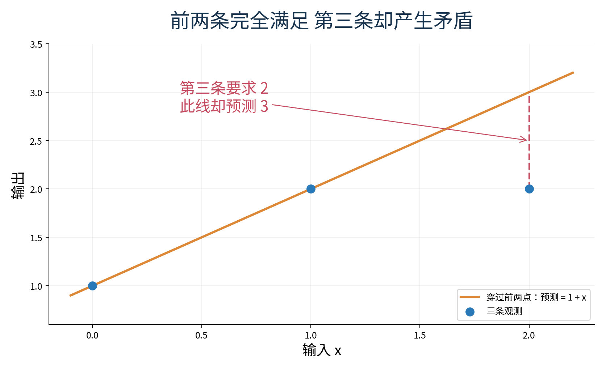

本讲始终将残差定义为 $r=y-A\beta$，即观测减预测。第八讲曾用预测减观测展示带方向差，符号刚好相反；平方和不受整体换号影响，但正交核对与逐项解释必须保持本讲这一约定。

## 二 用行变换看清约束之间的关系

把 A 和右边 y 并排写，称为增广矩阵：

$$[A\mid y]=\begin{pmatrix}1&0&\mid&1\\1&1&\mid&2\\1&2&\mid&2\end{pmatrix}.$$

竖线只把系数与右端分开，不是一个参与计算的新列。消元的目的，是通过不改变方程解集合的操作，使重复约束、自由参数与矛盾显露出来。

允许三种初等行变换：交换两行；把一行乘以非零数；将另一行的倍数加到某一行。为什么必须非零？把一行乘以 0 会抹掉该行约束，无法恢复。前面三种合法变换都有逆操作，因此新旧方程组拥有同一组精确解。

对我们的例子，第二行减第一行，第三行也减第一行，得到

$$\begin{pmatrix}1&0&\mid&1\\0&1&\mid&1\\0&2&\mid&1\end{pmatrix}.$$

再将第三行减去第二行的两倍，得到

$$\begin{pmatrix}1&0&\mid&1\\0&1&\mid&1\\0&0&\mid&-1\end{pmatrix}.$$

最后一行表示 $0=-1$，所以无解。这个证据比“求解程序报错了”更明确：我们知道矛盾来自哪几项原约束组合，而不是把失败归咎于电脑。

若仅把原来的最后一个观察值从 2 改成 3，同样消元会使最后一行变成 $0=0$。它不增加新条件，前两行给出唯一参数 $(1,1)$。行数多于参数个数并不自动无解，少的是独立且相容的约束信息，而不只是行的数量。

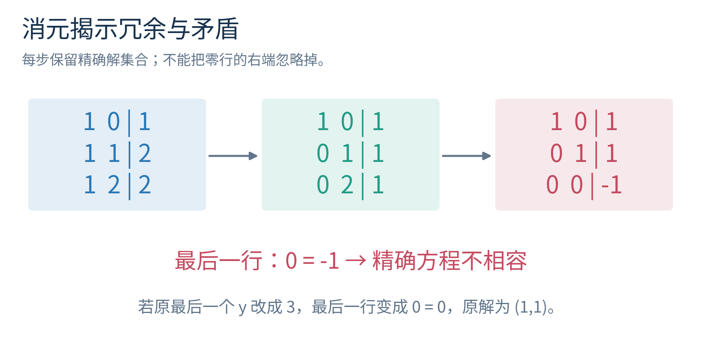

实际浮点消元还要选主元：尽量避免直接用非常小的数作除数，常把绝对值较大的合适元素交换到当前位置。这里先用精确小整数理解等价关系，不把教学消元步骤当成已完善的数值求解器。

## 三 列空间回答哪些预测能够到达

把 A 的两列记为

$$a_1=\begin{pmatrix}1\\1\\1\end{pmatrix},\qquad a_2=\begin{pmatrix}0\\1\\2\end{pmatrix}.$$

矩阵乘法可以重读为 $A\beta=\beta_0a_1+\beta_1a_2$。调节参数就是调节两列的线性组合。列空间记为 $\mathcal C(A)$，定义为所有这样的组合：

$$\mathcal C(A)=\{A\beta:\beta\in\mathbb R^2\}.$$

这里集合中的对象是可能的完整预测向量，不是原始样本记录。两个不同参数若给出同一向量，在列空间中就对应同一个点；而样本列表仍保留每一条记录的位置，不能据此给同值样本去重。

这两列不在同一条直线上。若 $c_1a_1+c_2a_2=0$，从第一分量读出 $c_1=0$，再从第二分量读出 $c_2=0$，所以只有全零系数能凑出零向量，称为线性无关。它们在三维观测空间里张成一个过原点的平面。

所有 y 都可以作为三维目标，但只有落在这个平面上的 y 才能被两参数模型精确表示。前一节无解，从列空间看就是 $y\notin\mathcal C(A)$。增加求解次数不能把平面变成整个三维空间。

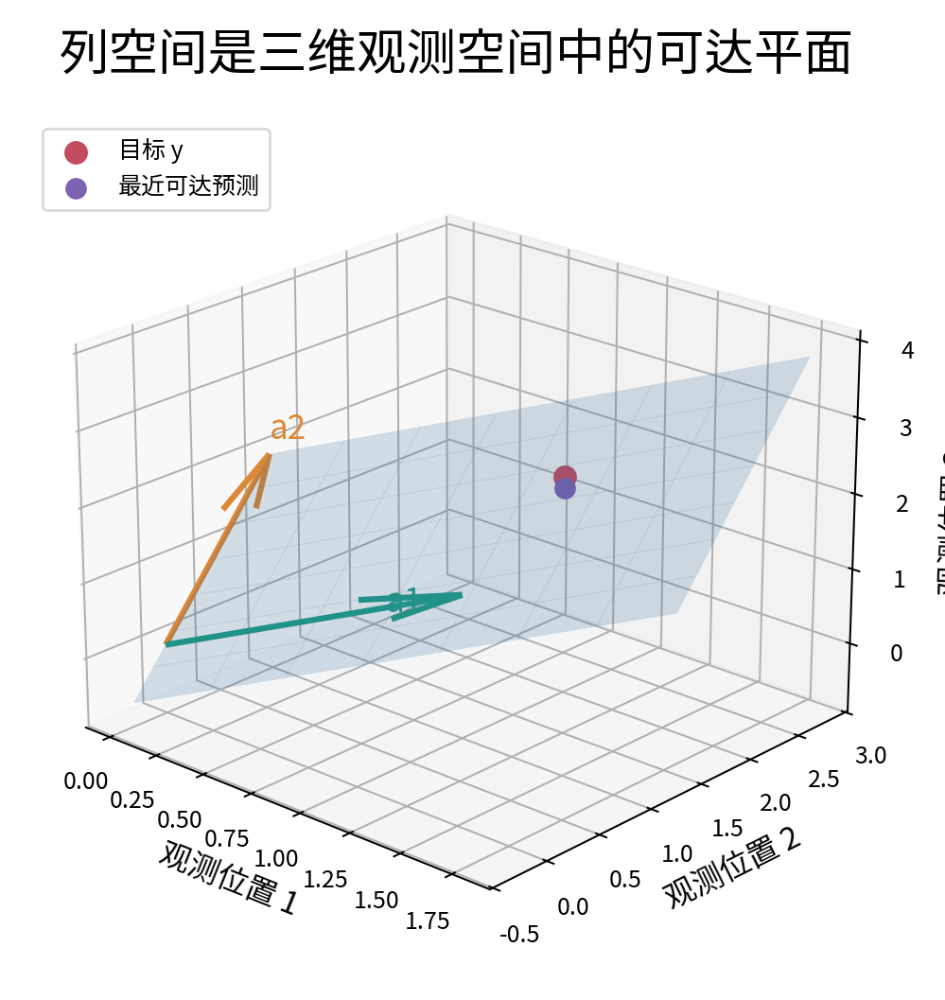

对于一般 $m\times n$ 矩阵，列空间位于 $\mathbb R^m$，因为每列有 m 个分量；参数位于 $\mathbb R^n$。不要把这两个空间的维数交换。直线拟合图中的横纵坐标平面，也不是这里由所有样本输出组成的 m 维观测空间。

## 四 秩是在数独立方向

秩记为 $\operatorname{rank}(A)$，是列空间的维数，也就是最多能找到多少个线性无关的列。本例两列独立，秩为 2。秩不可能超过行数 m，也不可能超过列数 n，所以它至多为 $\min(m,n)$。

“满秩”需要结合形状理解。列满秩指秩等于 n，每个参数方向都提供独立影响；行满秩指秩等于 m，列空间可以覆盖全部观测空间。长矩阵若 m 大于 n，可以列满秩却不可能行满秩；宽矩阵反过来。方阵两者才同时等价于通常的可逆条件。

消元后每个非零阶梯行的首个非零位置叫主元位置。主元个数等于秩；非主元变量可以作为自由变量。这是从精确消元读取独立约束的一种方式。行变换会改变列向量在观测空间中的位置，却通过可逆变换保持线性依赖关系，所以秩保持不变。不能说行变换保留原来的几何平面和距离。

考虑另一个矩阵

$$B=\begin{pmatrix}1&1\\2&2\\3&3\end{pmatrix}.$$

它有两列，却是同一方向的重复，秩为 1。所有输出只能写成 $(\gamma_1+\gamma_2)(1,2,3)^T$。这里上标 T 表示转置，把横着写的数列转为列向量。两个参数一起控制一个有效方向，并没有凭参数个数得到两个独立能力。

说一个矩阵秩亏，是说它没有达到所需的满秩条件。在最小二乘参数唯一性问题里，通常关心列秩是否达到 n。不要看到“秩亏”就直接断言没有最小二乘预测；它首先告诉我们有参数方向无法从这些数据中区分。

## 五 零空间记录哪些参数变化看不见

零空间记为

$$\mathcal N(A)=\{z\in\mathbb R^n:Az=0\}.$$

里面是参数方向，不是观测残差。若 $z\in\mathcal N(A)$，那么 $A(\beta+z)=A\beta+Az=A\beta$。沿着 z 改变参数，当前全部预测完全不变。这是零空间在拟合任务中的直接含义。

主例的两列独立，所以零空间只有零向量。重复列矩阵 B 则有 $z=(1,-1)^T$，因为一列加上另一列的负一倍刚好抵消。它的所有零空间向量是 $t(1,-1)^T$，t 可以是任意实数。

消元能进一步说明，若 n 个参数中有 r 个主元变量，剩下 n-r 个自由变量决定零空间的自由方向数。因此

$$\dim\mathcal N(A)+\operatorname{rank}(A)=n.$$

这叫秩与零空间维数的关系。当前可以从“每个自由变量提供一个独立解方向”理解它；在一个具体系统中，还应通过解齐次方程 $Az=0$ 写出方向，而不只背一个计数式。

若方程 $A\beta=y$ 有一个解 $\beta_p$，全部解恰好是 $\beta_p+z$，其中 $z\in\mathcal N(A)$。一个方向很容易验证：加零空间向量不改变输出。反方向，若 $\beta$ 和 $\beta_p$ 都是解，则 $A(\beta-\beta_p)=y-y=0$，所以两解之差必在零空间中。

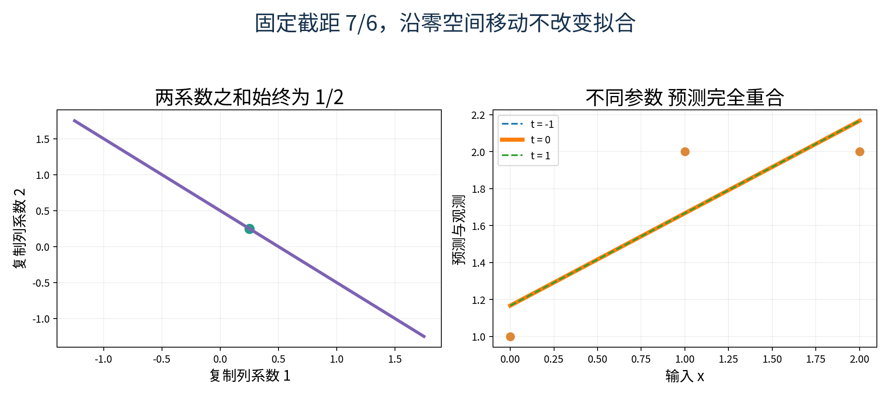

于是只要方程可解，参数唯一当且仅当零空间只含零向量，也等价于 A 列满秩。这句话里的“只要方程可解”不能删掉：列满秩保证至多一个精确解，不保证 y 一定落在列空间中。

## 六 把可解与唯一条件完整说出来

精确方程 $A\beta=y$ 可解，当且仅当 $y\in\mathcal C(A)$。用秩表达，就是 $\operatorname{rank}([A\mid y])=\operatorname{rank}(A)$：把 y 加为一列没有增加新方向，意味着它已经能由原列组合出来。

若增广后的秩更大，y 加入了原模型无法到达的方向，方程不相容。主例中 A 的秩为 2，增广矩阵秩为 3，所以无精确解。若可解且 A 列满秩，则恰有一个解；若可解但零空间有非零方向，则无限多解。

对方阵，可逆意味着每个右端都恰有一个精确解。对长而列满秩的矩阵，只能说可达右端的精确解唯一，不可达的仍无解。对行满秩的宽矩阵，任意右端都可达，但通常有多个参数解，因为参数方向比可观察方向更多。

本讲不把“超定”简单等同“无解”，也不把“欠定”简单等同“有解”。这些词通常描述方程数量相对未知数的大小；能不能满足，以及满足时有几个参数解，仍由秩与相容性决定。

## 七 从不可能精确拟合转向明确的近似标准

主例没有精确解，我们改为寻找让残差平方和最小的参数：

$$\min_{\beta\in\mathbb R^n}\|y-A\beta\|_2^2.$$

min 表示在所有允许参数中取最小；$\|r\|_2^2=r_1^2+\cdots+r_m^2$ 是欧氏长度的平方。这称为最小二乘问题，英文 least squares，意思是最小化平方项之和，不是把参数逐个取最小。

平方惩罚会让较大的单项残差得到更大权重，所有观测在当前写法中采用同一种尺度。若某列标签单位改变、某条观测更不可靠，或者真实代价不对称，“合理”的目标也可能改变。本讲固定当前标准，才能讨论它的解；不声称这种标准总优于绝对误差等其他选择。

几何上，参数只能生成列空间中的点。因此等价问题是：在 $\mathcal C(A)$ 中找离 y 最近的预测向量 $\hat y$。重点从“让每行等式都成立”变为“选一个整体距离最小的可达点”。

这个最近点叫正交投影。第九讲曾把一个向量投到一条直线上；现在投到由多列张成的子空间，基本理由仍是垂直残差与平行变化的勾股关系。

## 八 不用导数证明最优条件

假设已经找到可达点 $\hat y=A\hat\beta$，并且残差 $r=y-\hat y$ 与列空间每个方向都正交。换一个任意参数 $\beta=\hat\beta+d$，预测改变 $Ad$。于是新残差是 $r-Ad$。

展开它的长度平方：

$$\|r-Ad\|_2^2=(r-Ad)^T(r-Ad)=r^Tr-2r^TAd+(Ad)^TAd.$$

因为 r 与每个列空间方向正交，所以 $r^TAd=0$。得到

$$\|y-A(\hat\beta+d)\|_2^2=\|r\|_2^2+\|Ad\|_2^2\geq\|r\|_2^2.$$

后面一项非负，任何改变都不可能得到更小值。这已经证明正交残差足以保证全局最小，没有只证明附近某一点，也没有调用导数。

正交是否也必要？若残差对某个非零列空间方向 v 有非零内积 $r^Tv$，可以沿这个方向调整预测。选择 $t=(r^Tv)/(v^Tv)$，分母因 v 非零而为正。新残差 $r-tv$ 的平方长度为

$$\|r-tv\|_2^2=\|r\|_2^2-\frac{(r^Tv)^2}{v^Tv}<\|r\|_2^2.$$

最后一个严格小于是因为分子非零平方为正。这样就找到更好的可达预测，原点不可能最优。因此最优残差必须与列空间正交。

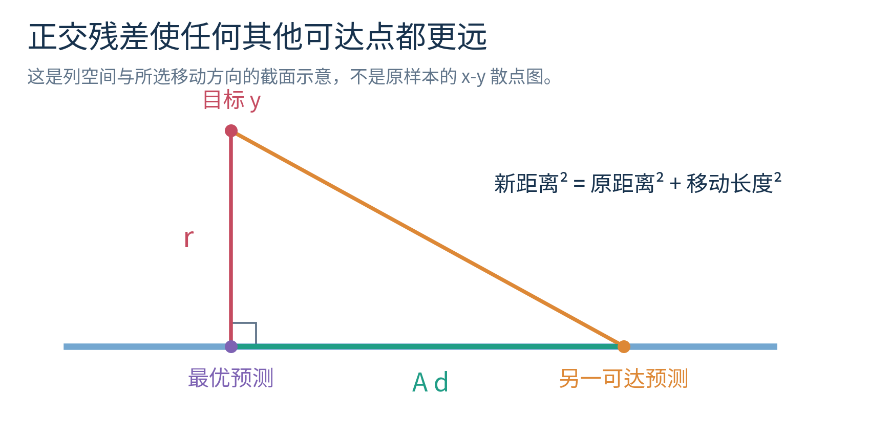

为什么最近点存在？有限维列空间可以选择一组基，再用后面介绍的 Gram–Schmidt 得到正交单位基。把 y 在每个基方向上的分量相加，就明确构造出一个列空间点，并留下正交残差。这给出构造性的答案，不需要用“电脑总会收敛”代替数学理由。

## 九 从正交条件得到正规方程

r 与列空间所有方向正交，等价于 r 与 A 的每一列正交，因为任意列组合的内积可以逐项展开。把这些条件排在一起就是

$$A^Tr=0.$$

代入 $r=y-A\hat\beta$，先得 $A^T(y-A\hat\beta)=0$，再按乘法分配整理为

$$A^TA\hat\beta=A^Ty.$$

这叫正规方程。这里“正规”与垂直、法向条件有关，不是说它是唯一合法或最稳定的计算路线。它是最优解的刻画，可以用来推导和检查；具体算法还要考虑浮点误差。

形状也值得逐项核对。A 是 $m\times n$，$A^T$ 是 $n\times m$，$A^TA$ 是 $n\times n$，$A^Ty$ 是 n 维。原来 m 个可能矛盾的精确方程，被转换为 n 个描述最优平衡的方程；不是把原方程随便删到只剩 n 行。

正规方程是否可逆取决于列满秩。对任意 z，

$$z^TA^TAz=(Az)^T(Az)=\|Az\|_2^2.$$

若 A 列满秩，非零 z 不可能映到零，右边严格为正；特别地，$A^TAz=0$ 只能由 z 为零产生，所以方阵 $A^TA$ 可逆。若 A 有非零零空间向量 z，则 $A^TAz=0$，正规矩阵必不可逆。这个证明没有依赖特征值或 SVD。

## 十 把主例从头算到底

先计算 $A^TA$。第一个元素是第一列和自身的内积，$1+1+1=3$；非对角元素是两列内积，$0+1+2=3$；右下元素是第二列平方和，$0+1+4=5$。所以

$$A^TA=\begin{pmatrix}3&3\\3&5\end{pmatrix},\qquad A^Ty=\begin{pmatrix}1+2+2\\0\times1+1\times2+2\times2\end{pmatrix}=\begin{pmatrix}5\\6\end{pmatrix}.$$

正规方程为 $3\beta_0+3\beta_1=5$ 与 $3\beta_0+5\beta_1=6$。第二式减第一式得到 $2\beta_1=1$，所以 $\hat\beta_1=1/2$。代回第一式：$3\beta_0+3/2=5$，得到 $3\beta_0=7/2$，因此 $\hat\beta_0=7/6$。

依次计算三条预测：

$$\hat y=A\hat\beta=\begin{pmatrix}7/6\\7/6+1/2\\7/6+1\end{pmatrix}=\begin{pmatrix}7/6\\5/3\\13/6\end{pmatrix}.$$

残差是

$$r=y-\hat y=\begin{pmatrix}-1/6\\1/3\\-1/6\end{pmatrix}.$$

平方和为 $1/36+1/9+1/36=6/36=1/6$。再检查两个正交条件：第一列内积 $-1/6+1/3-1/6=0$；第二列内积 $0\times(-1/6)+1\times(1/3)+2\times(-1/6)=0$。这两个零给出模型已满足最优条件的具体证据。

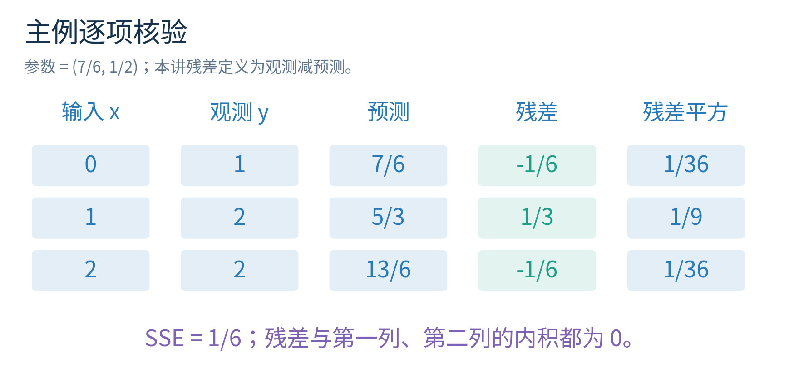

含有截距列时，最优残差之和为零，来自它与全 1 列正交。没有截距列时不一定成立。不能把这项特殊结构变成“所有最小二乘残差都必须相加为零”的无条件结论。

## 十一 预测唯一不代表参数唯一

正交投影的预测向量总是唯一。若 $\hat y_1$ 与 $\hat y_2$ 都是最优可达点，利用上一节的平方分解，以 $\hat y_1$ 为基准，有

$$\|y-\hat y_2\|_2^2=\|y-\hat y_1\|_2^2+\|\hat y_2-\hat y_1\|_2^2.$$

两边最优误差相等，迫使最后一项为零，所以 $\hat y_1=\hat y_2$。但得到这个向量的参数仍可能不同，因为 A 可能存在非零零空间。

把主例的输入列复制一次，得到

$$D=\begin{pmatrix}1&0&0\\1&1&1\\1&2&2\end{pmatrix}.$$

D 的列空间和 A 相同，秩仍为 2，参数却有三个。最优条件要求截距为 $7/6$，后两项之和为 $1/2$。全部最优参数可写为

$$\gamma(t)=\begin{pmatrix}7/6\\1/4+t\\1/4-t\end{pmatrix},\qquad t\in\mathbb R.$$

它们都产生同一个 $\hat y$ 和同一个 SSE，即残差平方和。沿着 $(0,1,-1)^T$ 变化的部分，正是 D 的零空间方向。

如果进一步选择参数欧氏长度最小的一项，就要最小化

$$\|\gamma(t)\|_2^2=(7/6)^2+(1/4+t)^2+(1/4-t)^2=(7/6)^2+1/8+2t^2.$$

显然 t 为 0 时最小，因此最小范数解是 $(7/6,1/4,1/4)^T$。这个结论来自完整平方展开，没有求导。NumPy 的 `lstsq` 在存在多个最小残差解时返回最小二范数解，但数值上还受它使用的秩阈值影响。[资料2](https://numpy.org/doc/2.3/reference/generated/numpy.linalg.lstsq.html)

“预测唯一”在这里首先指当前设计矩阵上的拟合向量。若某种列依赖只在当前数据中碰巧出现，新输入可能打破它，不同参数会给出不同新预测。本例直接复制同一特征，若未来仍严格按相同复制规则构造，依赖会继续保留；不能拿违反该构造的新行当作同一任务的输入。

## 十二 正交单位基把投影变得简单

如果列空间有正交单位基 $q_1,\ldots,q_r$，每个向量长度为 1，彼此内积为 0，那么 y 在该空间的投影为

$$\hat y=\sum_{j=1}^{r}(q_j^Ty)q_j.$$

每个 $q_j^Ty$ 给出 y 在那个单位方向上的分量。将这些基向量排成 Q，有 $Q^TQ=I_r$，投影可以写成 $\hat y=QQ^Ty$。$I_r$ 是 r 维单位矩阵，主对角线为 1，其余为 0。

令 $P=QQ^T$，则 $P^T=P$，并且 $P^2=Q(Q^TQ)Q^T=QQ^T=P$。前者说明投影矩阵对称，后者说明投影一次之后再投影，不会再移动。若投影过程不断改变结果，就没有实现同一个精确正交投影。

还可以直接检查残差正交：$Q^T(y-QQ^Ty)=Q^Ty-(Q^TQ)Q^Ty=0$。于是这项构造确实满足最优条件。Q 不必是方阵；对于主例 Q 只有两列，却有三行。$Q^TQ=I_2$ 不意味着 $QQ^T=I_3$，后者只是把三维目标压到二维子空间的投影。

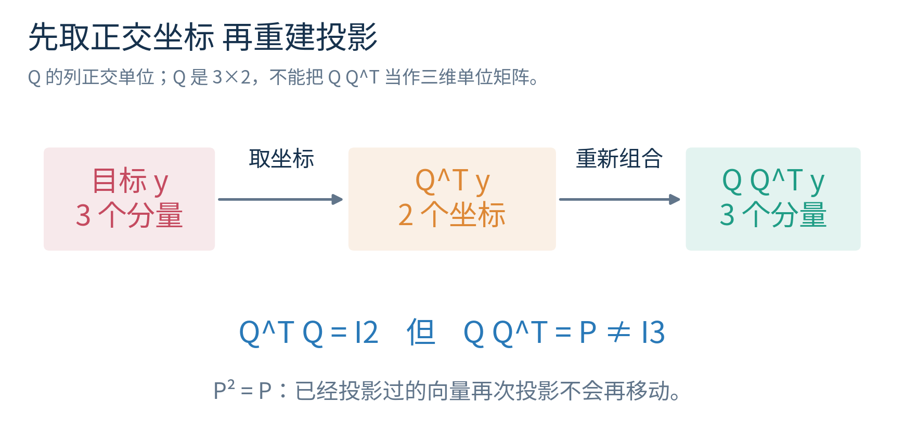

主例最终得到的投影矩阵是

$$P=\begin{pmatrix}5/6&1/3&-1/6\\1/3&1/3&1/3\\-1/6&1/3&5/6\end{pmatrix}.$$

你可以用它乘 y 重新得到 $(7/6,5/3,13/6)^T$。不需要把它的每个元素背下来；后面 QR 的构造会解释这些数从哪里来。

## 十三 用 Gram Schmidt 逐步构造 QR

我们的第一列是 $a_1=(1,1,1)^T$，长度为 $\sqrt3$。先除以长度，得到单位方向 $q_1=a_1/\sqrt3$。记 $r_{11}=\sqrt3$，就有 $a_1=q_1r_{11}$。

第二列 $a_2=(0,1,2)^T$ 含有与第一方向重合的部分。其坐标为

$$r_{12}=q_1^Ta_2=(0+1+2)/\sqrt3=\sqrt3.$$

沿第一方向的投影是 $q_1r_{12}=(1,1,1)^T$。将它从第二列扣掉，得到 $u_2=a_2-q_1r_{12}=(-1,0,1)^T$。它与第一列内积为 $-1+0+1=0$，确实正交。

$u_2$ 的长度是 $\sqrt2$。令 $r_{22}=\sqrt2$、$q_2=u_2/\sqrt2$，便得到第二个单位方向。现在两列都可用 q 表示：$a_1=q_1r_{11}$，$a_2=q_1r_{12}+q_2r_{22}$。把它们合并写成

$$A=QR,\qquad Q=\begin{pmatrix}1/\sqrt3&-1/\sqrt2\\1/\sqrt3&0\\1/\sqrt3&1/\sqrt2\end{pmatrix},\quad R=\begin{pmatrix}\sqrt3&\sqrt3\\0&\sqrt2\end{pmatrix}.$$

Q 的列正交且长度为 1；R 的主对角线下方为零，称为上三角矩阵。第 j 列只需要前 j 个已构造方向，因此下三角位置自然没有系数。

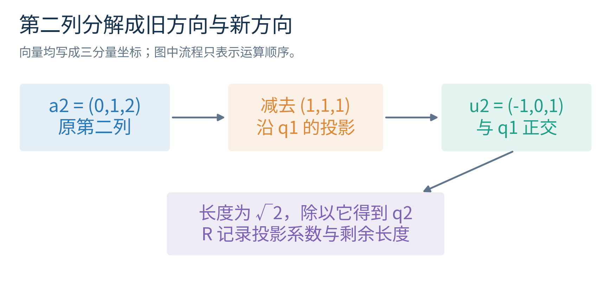

这个过程叫 Gram–Schmidt。一般第 j 步，先拿出当前列，再依次扣掉沿先前各 q 的投影，最后除以剩余长度。若剩余严格为零，说明新列完全由旧列组合而成，不能再除以零制造一个新单位方向；需要处理秩亏，而不是强行继续。

实际浮点数中，“几乎零”也需要阈值。随附手写版本使用修改的 Gram–Schmidt 思路，在每次扣除后更新剩余向量；它比一段不加说明的向量公式更适合检查每一步，但仍可能失去正交性。成熟数值库的 Householder 等 QR 方法通常更可靠。NumPy 的 QR 接口使用 LAPACK 例程，文档说明其反射表示；本讲不将教学实现包装成生产替代。[资料3](https://numpy.org/doc/2.3/reference/generated/numpy.linalg.qr.html)

## 十四 QR 怎样求最小二乘解

主例列满秩，有 $A=QR$，Q 是 $3\times2$，R 是 $2\times2$ 可逆上三角矩阵。目标投影是 $QQ^Ty$，所以希望 $QR\beta=QQ^Ty$。左乘 $Q^T$，利用 $Q^TQ=I$，得到

$$R\hat\beta=Q^Ty.$$

先算右边：第一项为 $(1+2+2)/\sqrt3=5/\sqrt3$，第二项为 $(-1+0+2)/\sqrt2=1/\sqrt2$。因此

$$\begin{pmatrix}\sqrt3&\sqrt3\\0&\sqrt2\end{pmatrix}\begin{pmatrix}\hat\beta_0\\\hat\beta_1\end{pmatrix}=\begin{pmatrix}5/\sqrt3\\1/\sqrt2\end{pmatrix}.$$

从最后一行向上解，叫回代。第二行给出 $\sqrt2\hat\beta_1=1/\sqrt2$，所以 $\hat\beta_1=1/2$。第一行除以 $\sqrt3$，得到 $\hat\beta_0+\hat\beta_1=5/3$，因此截距 $7/6$。它与正规方程一致，因为它们描述同一个最小二乘问题。

QR 的计算路线没有先显式形成 $A^TA$。这常能避免把本来很小的方向差异进一步埋进内积求和和相减误差里。它并不能消除数据本身的病态，也不保证每个具体浮点例子中每一位都比所有其他方法更准。

R 的对角线可能被库选成与手算不同的正负号。若某个 q 列整体变号，对应的 R 行也变号，乘积 QR 不变，最终拟合也不变。因此验收应检查 $QR\approx A$、$Q^TQ\approx I$ 和解的结果，而不是要求 Q 每个符号与讲义相同。

若 A 秩亏，R 可能含零或很小的对角量，直接回代不再是完整方案。可以用带列选主元的 QR 或 SVD 等成熟方法处理有效秩；本讲将这些工具的系统推导留待后续，不靠删掉某个报错就宣称已解决。

## 十五 为什么一般行缩放不能当作保距预处理

前面的行变换保留精确方程解集合，却不一般保留最小二乘目标。一个最简单的例子是用一个常数参数 c 拟合两条观察 0 与 2。原目标是 $c^2+(c-2)^2$，按正规方程或平方展开得到最优 c 为 1。

若将第二条方程两边乘以 10，再按新残差做普通平方和，目标变成 $c^2+100(c-2)^2$。正规方程是 $101c=200$，最优 c 为 $200/101\approx1.9802$，不再是 1。这相当于提高第二条记录的权重，改变了问题。

因此不能先任意消元原始超定方程，再把剩余残差平方和当作原问题的目标。保距的正交变换则不同：若完整方阵 U 满足 $U^TU=I$，有 $\|Uv\|_2^2=v^TU^TUv=v^Tv$。它保留所有残差长度，因而可以参与稳定的求解变换。

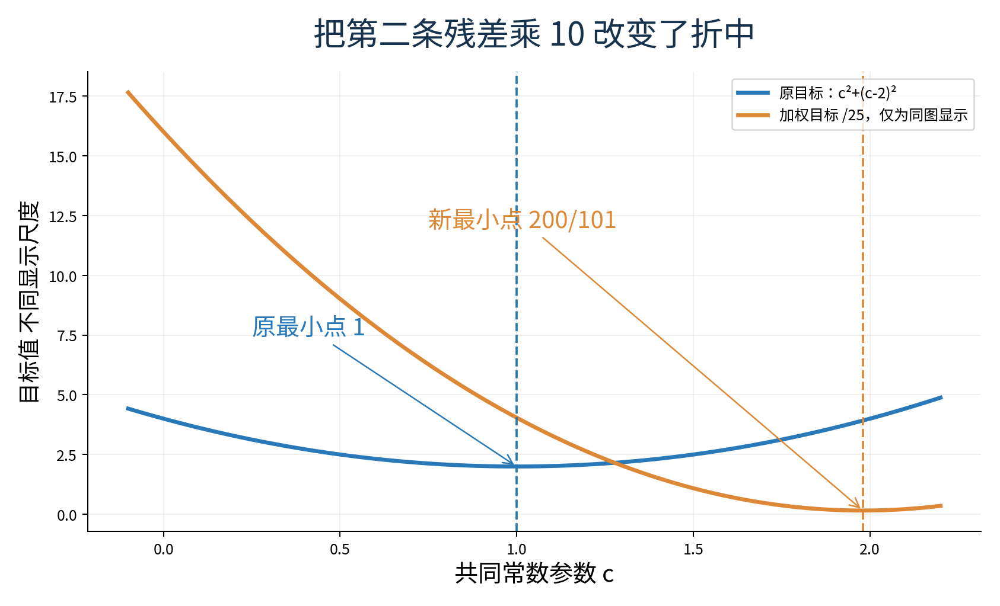

列缩放也需要解释：它改变参数坐标与参数数值大小，但在非零缩放可逆且映射被正确还原时，模型可达预测空间可以不变。条件数依赖所用坐标和单位，报告它时不能完全脱离特征尺度。

## 十六 可逆与稳定是两回事

考虑方阵

$$C_\varepsilon=\begin{pmatrix}1&1\\1&1+\varepsilon\end{pmatrix},\qquad\varepsilon>0.$$

两列只差一个很小的量。精确代数中，只要 $\varepsilon\neq0$，两列仍然独立，矩阵可逆。取真实参数 $(1,1)^T$，右端是 $(2,2+\varepsilon)^T$。

现在只把第二个右端增加 $\delta$。第二行减第一行后，得到 $\varepsilon\beta_2=\varepsilon+\delta$，因此

$$\beta_2=1+\delta/\varepsilon,\qquad\beta_1=1-\delta/\varepsilon.$$

右端只动 $\delta$，参数却各动 $\delta/\varepsilon$。例如 $\varepsilon=10^{-6},\delta=10^{-8}$，参数分别变成 0.99 与 1.01；输入变化很小，却被除以很小的差异后放大。这个放大来自问题本身，即使用精确分数计算也存在。

病态描述问题对微小扰动敏感，数值不稳定描述算法额外放大舍入等误差。好算法可以少添新的损失，但不能从缺少辨别力的数据中凭空恢复稳定参数。若两个特征在样本中几乎总是一起变化，单独解释它们各自的系数常常比预测它们合成效果困难。

这也说明“求解没有报错”不是可靠性证据。NumPy 官方文档提醒，病态矩阵的求逆可能报错，也可能返回不准确的数；可逆与异常是否出现不能代替误差核查。[资料4](https://numpy.org/doc/2.3/reference/generated/numpy.linalg.inv.html)

## 十七 用不同方向的伸缩理解条件数

矩阵在不同方向上可能有不同伸缩。定义欧氏算子范数 $\|A\|_2$ 为所有单位向量 v 中 $\|Av\|_2$ 的最大值；它衡量最大的长度放大。对可逆方阵，可以定义

$$\kappa_2(A)=\|A\|_2\|A^{-1}\|_2.$$

它等于最大伸缩与最小伸缩之比。先看可直接验证的对角例子 $T=\operatorname{diag}(1,\varepsilon)$，其中 $0<\varepsilon\leq1$。横向长度不变，纵向长度乘以 $\varepsilon$；反向求解纵向要除以它，因此 $\kappa_2(T)=1/\varepsilon$。单位圆变成很扁的椭圆，提示反推某些方向会很敏感。

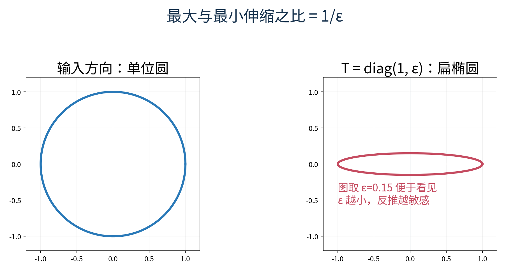

对可逆方阵且只扰动右端，有 $A\beta=y$、$A(\beta+\Delta\beta)=y+\Delta y$，相减得到 $\Delta\beta=A^{-1}\Delta y$。按范数定义，$\|\Delta\beta\|_2\leq\|A^{-1}\|_2\|\Delta y\|_2$；另一方面 $\|y\|_2\leq\|A\|_2\|\beta\|_2$。当 y 与参数非零时，组合成

$$\frac{\|\Delta\beta\|_2}{\|\beta\|_2}\leq\kappa_2(A)\frac{\|\Delta y\|_2}{\|y\|_2}.$$

这是一个最坏方向的上界，不是说每一次扰动都恰好放大同样倍数。它限定 A 固定、方阵可逆以及右端扰动；若 A 本身也不确定，或者是带明显残差的长矩阵问题，需要额外分析，不能把这条式子无条件照搬。

对列满秩长矩阵，也可以用单位参数方向上的最大与最小伸缩之比理解条件数。NumPy 的 `cond(A)` 默认用奇异值计算这个比值；本讲把它作为已文档化的诊断工具，奇异值为何提供这些方向与极值的证明放在第十二讲。[资料5](https://numpy.org/doc/2.3/reference/generated/numpy.linalg.cond.html)

常见结论 $\kappa_2(A^TA)=\kappa_2(A)^2$ 对精确算术中的列满秩 A 成立，其完整奇异值论证同样留到下一讲。本讲仅在对角例子中直接验证：若 A 的两个伸缩是 1 与 $\varepsilon$，则 $A^TA$ 是对角元 1 与 $\varepsilon^2$，条件数由 $1/\varepsilon$ 变成 $1/\varepsilon^2$。这已经解释了为什么形成正规矩阵可能让小方向更难区分，但不是偷用未学 SVD 完成一般证明。

## 十八 参数变化与预测变化要分开测量

固定 A 时，最小二乘预测是 $Py$。若右端改变 $\Delta y$，新的拟合变化是 $P\Delta y$。正交分解给出 $\|\Delta y\|_2^2=\|P\Delta y\|_2^2+\|(I-P)\Delta y\|_2^2$，因此拟合向量的绝对变化不超过原观察变化。

参数却可能为了实现这一点很小的预测变化而大幅移动。实验使用五行设计：第一列全 1，第二列是 $1+\varepsilon t$，其中 $t=(-2,-1,0,1,2)^T$。当 $\varepsilon$ 很小时，两列接近同一方向。真实参数取 $(1,2)^T$，目标输出近似都为 3。

如果给 y 加上 $\eta t$，这个扰动位于列空间中。精确参数改变量为 $(-\eta/\varepsilon,\eta/\varepsilon)^T$，因为两项相加的常数部分抵消，只剩 $\eta t$。例如 $\varepsilon=2^{-20},\eta=2^{-30}$，参数改动尺度为 $2^{-10}$，而输出扰动只有 $2^{-30}$ 乘小整数。这是可手算的敏感性，不是某次随机噪声碰巧造成的故事。

相反，若增加一个与两列都正交的扰动，例如按适当大小乘 $(1,-2,1,0,0)^T$，它与全 1 列内积为 0，与 t 的内积也为 $-2+2+0=0$。精确投影参数应不变，增加部分留在残差中。两个同样“小”的扰动，方向不同，影响也不同。

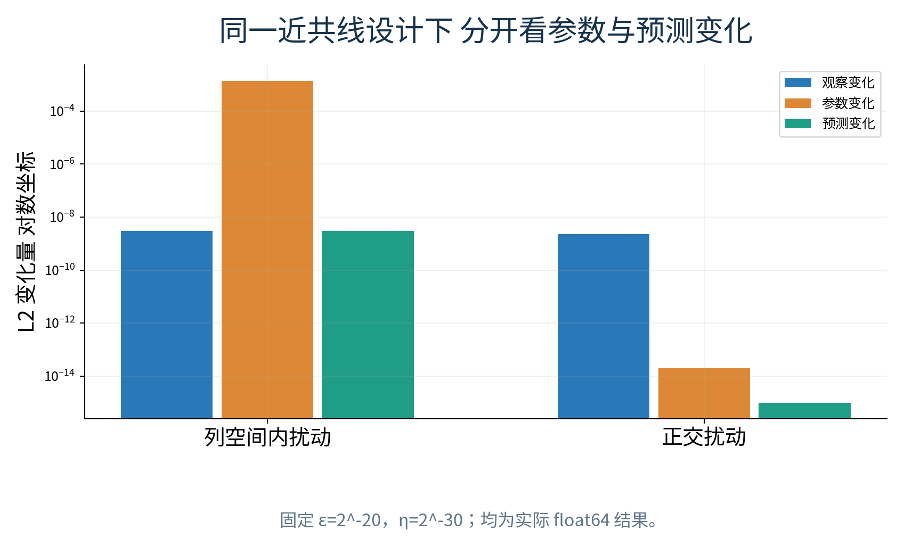

当前训练位置上的预测稳定，不代表任意新输入都稳定。如果未来特征离开两列几乎相同的结构，不同参数的作用可能不再抵消。参数解释、样本内拟合与范围外预测应分开评价。

## 十九 精确秩与数值秩不是一个问题

对于上一节的近共线设计，只要精确 $\varepsilon\neq0$，两列就独立，精确秩为 2。电脑只能看到有限精度数字，还需要判断小到什么程度的方向值得当作可辨别信息。这时返回的是依赖阈值的数值秩。

NumPy 的 `matrix_rank` 使用奇异值与容差判断，默认阈值涉及最大奇异值、矩阵尺寸和机器精度。`lstsq` 的 `rcond` 也以最大奇异值为参照决定哪些方向按零处理。使用阈值可能把精确满秩但非常接近相关的矩阵视为秩亏，这是数值决策，不是证明原精确表达式的列关系突然改变。[资料6](https://numpy.org/doc/2.3/reference/generated/numpy.linalg.matrix_rank.html)

本讲使用 $\varepsilon=2^{-10},2^{-20},2^{-26},2^{-30},2^{-40},2^{-50}$ 的确定性序列。它们便于追溯，也能让你看到不同精度阶段。我们会同时记录声明的非零构造、实际浮点矩阵的默认数值秩、指定 `rcond` 的结果以及残差。不能只说“秩等于 1”，却不写采用什么阈值。

提高或降低阈值不应只为了让参数看起来符合预期。较高阈值丢弃弱方向可能让参数更稳定，却改变了有效求解问题；较低阈值可能保留更多方向，也更容易把测量误差放大。真实阈值选择要考虑数据误差与任务，不能全部委托机器默认值再宣称获得了唯一科学答案。

## 二十 实际比较四条求解路线

对于方阵精确求解，`np.linalg.solve(C, y)` 直接求解方程；显式求逆写作 `np.linalg.inv(C) @ y`，先形成整个逆矩阵，再乘右端。前者通常是只需要解一个右端时更合适的计算路线，不意味着后者在每个小例子中都会产生最大的误差。

对于主例长矩阵，不能直接调用 `solve(A, y)`，因为 solve 要求方阵且满秩；矩阵形状不符合不是换一个异常捕获就能解决的问题。[资料7](https://numpy.org/doc/2.3/reference/generated/numpy.linalg.solve.html)

我们比较的最小二乘路线包括：直接 `lstsq(A,y)`；库 QR 后解 $R\beta=Q^Ty$；先形成 $G=A^TA,h=A^Ty$ 再 `solve(G,h)`；以及显式 `inv(G) @ h`。最后一条计算的是正规矩阵的逆，不是长矩阵 A 的普通逆。手写修改 Gram–Schmidt 单独作为教学路线，报告其正交性损失。

每次比较至少记录三类量：参数与已知参考的差；原始残差 $\|y-A\beta\|_2$；正交缺陷 $\|A^T(y-A\beta)\|_2$。还记录成功或具体失败类型、数值秩和条件数。主例没有“真实参数”，我们用已证明的精确最小二乘系数作参考；近共线无噪声例则有明确生成参数 $(1,2)$。

不能只看正规方程内部残差，因为形成 G 的时候可能已经损失信息；更不能把一个微小原始残差当作参数准确的充分条件。病态例里，不同参数可以产生几乎相同的输出。

制作阶段实际运行发现，在某些二进制构造的近共线例中，正规方程 solve 的参数误差恰好为零，而 QR 或 lstsq 有极小非零舍入误差；更小的 $\varepsilon$ 又使正规矩阵在浮点中奇异并报错。这不推翻稳定性分析，也不允许预先安排“逆矩阵在每一行必定最差”的故事。报告应保留每种方法真实得到的数和失败。

NumPy 的 `lstsq` 可能返回空的 residuals 数组，尤其在秩亏或行数不大于列数时。空数组不等于残差为零，应始终自行计算 `y - A @ beta` 再取长度或平方和。[资料2](https://numpy.org/doc/2.3/reference/generated/numpy.linalg.lstsq.html)

## 二十一 从纸笔到可重复的检查

实验先用 Fraction 做主例的精确正规方程手算，并核验参数、预测、残差、SSE 与正交关系。随后使用 float64 比较四条库路线和教学 QR；检查 Q 的形状、$Q^TQ$ 与 $QR$，避免一个结果碰巧正确掩盖中间实现问题。

接着构造重复列、宽矩阵、零矩阵、单列和单样本边界。秩亏时展示多组同预测参数，并验证 lstsq 选出的最小范数解；遇到不可解的精确方阵或不符合接口形状时保留明确错误，不把所有异常吞成 0。

最后扫过近共线程度，改变秩阈值，并分别注入列空间内和正交方向的扰动。每项都有预先写明的目的与已知结构，不靠大量随机测试代替一般证明。数值尾数可能随 BLAS/LAPACK 实现变化；验收依据是明确容差内的数学关系与如实记录，不能要求所有机器每一位相同。

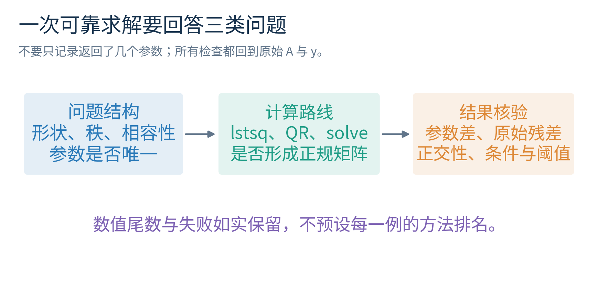

## 二十二 练习

练习一　写出主例增广矩阵，逐步执行两次消元，指出最后哪一行证明精确方程不相容。

练习二　将 y 改为 $(1,2,3)^T$。秩、可解性和唯一性分别如何？不要只回答“行数大于列数”。

练习三　求 $B=((1,1),(2,2),(3,3))$ 的秩、零空间和列空间。对于右端 $(2,4,6)^T$，写出全部参数解；对于 $(2,4,7)^T$ 能否精确求解？

练习四　若 A 有 7 行、4 列、秩为 3，零空间维数是多少？如果方程可解，参数是否唯一？最小二乘预测是否唯一？

练习五　不用导数，用残差与列空间正交证明最小二乘的充分性；再说明不正交时怎样选择一个改进方向。

练习六　重算主例的 $A^TA$、$A^Ty$、系数、预测、残差和 SSE，并核对两个正交内积。

练习七　为什么含截距列时残差和为零？构造一个没有截距列而残差和不为零的简单例子。

练习八　对于复制输入列的 D，写出所有最优参数，并通过平方展开证明最小范数成员是 $(7/6,1/4,1/4)^T$。

练习九　重算主例 Gram–Schmidt 的 $q_1,r_{12},u_2,q_2$，再写出 Q、R 并回代求参数。为何 Q 可以不同符号而仍正确？

练习十　证明 $P=QQ^T$ 满足 $P^T=P,P^2=P$。为什么 $Q^TQ=I_2$ 不推出 $QQ^T=I_3$？

练习十一　用一个常数拟合 0 与 2，原解是多少？第二行乘 10 后按照新平方和的解是多少？它说明普通行变换的什么限制？

练习十二　对 $C_\varepsilon$，推导第二个右端增加 $\delta$ 后参数变化。取 $\varepsilon=1/1000,\delta=1/1000000$，给出精确分数解。

练习十三　对 $T=\operatorname{diag}(1,1/100)$，解释其条件数与正规矩阵条件数。明确哪部分来自直接二维计算，哪类一般结论仍留待下一讲。

练习十四　`lstsq` 的 residuals 返回空数组，能否断言拟合完美？给出应当重新计算的量。若默认数值秩为 1，是否足以证明近共线公式的精确秩也为 1？

练习十五　某方法残差为 $10^{-15}$，参数误差为 $10^{-3}$。这一定是记录出错吗？结合近共线解释，并写出至少两项应追加的检查。

完整详解在 answers.md。请先自己写理由，再对照，尤其检查形状、相容性、唯一性、数值稳定性是否被混成一个问题。

## 二十三 本讲边界与下一步

你应能从 A 的行与列读出精确约束和可达空间；用零空间说明参数不可辨识；不用微积分证明投影与正规方程；手算一套 QR；并在数值实验里同时检查参数误差、预测误差、残差、秩阈值和条件数。

本讲没有完整证明奇异值分解，也没有给出所有浮点算法的稳定性定理。库内部使用成熟分解不等于读者必须先掌握全部证明，但使用它做诊断时要如实说明边界。下一讲将研究哪些方向被保留、拉伸或压缩，并从特征值与奇异值角度系统解释低秩近似和条件数。

## 资料与核验

资料1　Stephen Boyd 与 Lieven Vandenberghe，Introduction to Applied Linear Algebra，作者提供版本。实际查阅 QR 与最小二乘章节，尤其印刷页 189至190、225至233 的正交解释及 QR 求解。https://web.stanford.edu/~boyd/vmls/vmls.pdf

资料2　NumPy 2.3 官方文档，lstsq。最小残差与最小范数约定、rcond 和 residuals 返回规则。https://numpy.org/doc/2.3/reference/generated/numpy.linalg.lstsq.html

资料3　NumPy 2.3 官方文档，qr。返回形状、正交列、上三角结构与 LAPACK/Householder 说明。https://numpy.org/doc/2.3/reference/generated/numpy.linalg.qr.html

资料4　NumPy 2.3 官方文档，inv。方阵限制、奇异报错及病态可能不报错的风险。https://numpy.org/doc/2.3/reference/generated/numpy.linalg.inv.html

资料5　NumPy 2.3 官方文档，cond。条件数与默认奇异值计算。https://numpy.org/doc/2.3/reference/generated/numpy.linalg.cond.html

资料6　NumPy 2.3 官方文档，matrix_rank。默认阈值、相对阈值及数值秩的解释。https://numpy.org/doc/2.3/reference/generated/numpy.linalg.matrix_rank.html

资料7　NumPy 2.3 官方文档，solve。方阵、满秩与右端形状要求。https://numpy.org/doc/2.3/reference/generated/numpy.linalg.solve.html

所有链接于 2026 年 10 月 4 日实际打开核验。实际运行环境为 NumPy 2.3.5。教材来源用于核查原则和范围，讲义没有复制原书文字、例题或图；所有主例呈现、图形、程序及实验记录独立制作。
