# 特征值与奇异值分解

## 第十二讲 从方向的作用到矩阵的近似

第十一讲告诉我们：矩阵可能抹掉某些参数方向，也可能把某些方向压得非常短。因此，残差很小不一定意味着参数可靠。本讲继续问：能否找到一组特别清楚的方向，让矩阵的作用变成“分别伸长多少”？如果只允许保存少数方向，究竟丢掉了多少信息？

答案有两层。实对称矩阵可以沿一组互相垂直的特征向量分别缩放。一般实矩阵，包括长方形矩阵，可以用奇异值分解找到输入方向、输出方向及二者之间的伸缩倍数。截断奇异值分解在明确的矩阵误差标准下给出最优低秩近似，但“数值上最优”不自动意味着保留了任务最重要的语义。

直接先修是第十一讲。你应认识矩阵乘法、转置、列空间、零空间、秩、正交投影与欧氏长度。本讲会在使用时回顾它们，不要求微积分。我们将完整证明几个关键等式；一般实对称谱定理只陈述并解释证明路线，明确指出尚未建立的存在性工具。有限数值检查是检查程序的方法，不是对所有矩阵的证明。

全讲使用原创合成矩阵与条纹图。字母 B 先表示一个二输入二输出的装置；A 表示给装置增加第三个测量通道后的矩阵。它们是为了让手算、几何图和程序能逐项对照的教学对象，不代表实际传感器参数。

## 一 哪些输入方向被改变得最强

先看

$$B=\begin{pmatrix}2&1\\1&2\end{pmatrix},\qquad x=\begin{pmatrix}x_1\\x_2\end{pmatrix},\qquad Bx=\begin{pmatrix}2x_1+x_2\\x_1+2x_2\end{pmatrix}.$$

两个输入可以同时升高，也可以一个升高、另一个降低。输入 $(1,1)^T$ 时，输出是 $(3,3)^T$；输入 $(1,-1)^T$ 时，输出仍是 $(1,-1)^T$。前一个方向被放大三倍，后一个方向保持长度。这比“矩阵里最大的数是 2”更能解释整个装置。

比较方向前，必须控制输入长度。否则把任意输入乘以一百万，自然能得到很大的输出。我们使用单位向量，也就是长度为 1 的向量。两个特别的单位方向为

$$q_1=\frac{1}{\sqrt2}\begin{pmatrix}1\\1\end{pmatrix},\qquad q_2=\frac{1}{\sqrt2}\begin{pmatrix}1\\-1\end{pmatrix}.$$

它们都长 1，而且 $q_1^Tq_2=(1-1)/2=0$。本讲说“最强方向”时，首先指固定输入欧氏长度后，输出欧氏长度最大的方向。这是一个已定义的数学标准，不是某列特征的业务价值排名。

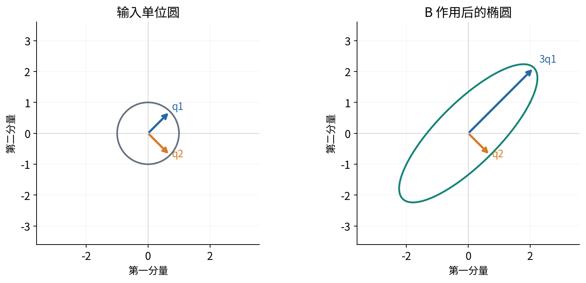

## 二 特征方程要求方向保持在原直线上

对于一个 $n\times n$ 方阵 C，如果存在非零向量 v 和实数 $\lambda$，使

$$Cv=\lambda v,$$

那么 $\lambda$ 叫特征值，v 叫对应的特征向量。这里 C、v、$\lambda$ 分别是矩阵、向量和数，不能把它们混作同一种对象。左边是矩阵乘向量，右边是数乘向量。两边形状都是 $n\times1$。

为什么必须排除零向量？因为 $C0=\lambda0$ 对任何 $\lambda$ 都成立，零向量没有方向，不能识别矩阵的特殊作用。如果 v 是特征向量，任意非零倍数 cv 也是同一特征值的特征向量，因为 $C(cv)=cCv=c\lambda v=\lambda(cv)$。因此特征向量通常先只确定一条直线，再选择单位长度的代表；即使长度规定为 1，v 与 $-v$ 仍都合法。

当 $\lambda>0$ 时，输出同向；当 $\lambda<0$ 时，输出反向；当 $\lambda=0$ 时，非零输入被送到零。所谓“方向不变”应理解为输出仍在原来的直线上，零特征值则是该方向消失，不能说零输出还有可辨认的朝向。

将 $Cv=\lambda v$ 移项，可得

$$(C-\lambda I)v=0.$$

I 是同尺寸单位矩阵。第十一讲已经说明：这个齐次方程有非零解，当且仅当 $C-\lambda I$ 的零空间不是只有零向量，即该方阵不可逆。对于 $2\times2$ 矩阵，这等价于行列式为零。此处只需使用二阶行列式规则

$$\det\begin{pmatrix}a&b\\c&d\end{pmatrix}=ad-bc.$$

它检验两列能否撑开二维面积。$ad-bc\neq0$ 时可用消元得到唯一解；为零时两列不能组成二维基。我们只用这一二阶规则手算，不要求你已经会展开高阶行列式。

## 三 把二阶实对称矩阵手算到底

将 B 代入特征方程：

$$\det(B-\lambda I)=\det\begin{pmatrix}2-\lambda&1\\1&2-\lambda\end{pmatrix}=(2-\lambda)^2-1.$$

逐步展开为

$$(2-\lambda)^2-1=4-4\lambda+\lambda^2-1=\lambda^2-4\lambda+3=(\lambda-3)(\lambda-1).$$

因此特征值是 3 和 1。这里计算出的不是两个随机好用的数，而是让 $B-\lambda I$ 失去可逆性的全部二次方程根。

对 $\lambda=3$，方程变成

$$\begin{pmatrix}-1&1\\1&-1\end{pmatrix}\begin{pmatrix}v_1\\v_2\end{pmatrix}=0.$$

第一行要求 $-v_1+v_2=0$，第二行表达同一约束，所以 $v_2=v_1$。取非零代表 $(1,1)^T$，除以长度 $\sqrt2$，得到 $q_1$。

对 $\lambda=1$，得到

$$\begin{pmatrix}1&1\\1&1\end{pmatrix}\begin{pmatrix}v_1\\v_2\end{pmatrix}=0.$$

两行都要求 $v_1+v_2=0$，取 $(1,-1)^T$，归一化后得到 $q_2$。归一化是除以长度，不是分别把两个分量缩成 1。直接乘回去可核验 $Bq_1=3q_1$、$Bq_2=q_2$。

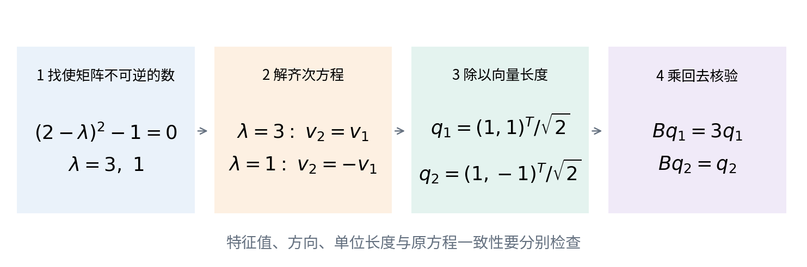

将两个方向按列组成

$$Q=\frac1{\sqrt2}\begin{pmatrix}1&1\\1&-1\end{pmatrix},\qquad \Lambda=\begin{pmatrix}3&0\\0&1\end{pmatrix}.$$

Q 的列两两正交且长 1，所以 $Q^TQ=I$；Q 是方阵，进一步有 $Q^{-1}=Q^T$ 和 $QQ^T=I$。将两条特征向量等式并排写就是 $BQ=Q\Lambda$。右乘 $Q^T$，得到

$$B=Q\Lambda Q^T.$$

可以直接验算：

$$Q\Lambda Q^T=\frac12\begin{pmatrix}3&1\\3&-1\end{pmatrix}\begin{pmatrix}1&1\\1&-1\end{pmatrix}=\frac12\begin{pmatrix}4&2\\2&4\end{pmatrix}=B.$$

## 四 正交谱分解是在一套好坐标中分别缩放

对任意输入 x，$Q^Tx$ 给出 x 在 $q_1,q_2$ 上的坐标，$\Lambda$ 分别把它们乘以 3 和 1，最后 Q 把新坐标合成为原空间向量。这不是三次近似；矩阵乘积恰好等于原装置。

例如 $x=(2,0)^T$。先有

$$Q^Tx=(\sqrt2,\sqrt2)^T,$$

再有 $\Lambda Q^Tx=(3\sqrt2,\sqrt2)^T$，最后

$$Q\begin{pmatrix}3\sqrt2\\\sqrt2\end{pmatrix}=\begin{pmatrix}4\\2\end{pmatrix}=Bx.$$

也可写成两个一维作用的和：

$$B=3q_1q_1^T+q_2q_2^T.$$

$q_iq_i^T$ 是矩阵，$q_iq_i^Tx=q_i(q_i^Tx)$ 是把 x 正交投影到 $q_i$ 所在直线。特征值随后决定该投影被放大、缩小或反向多少。

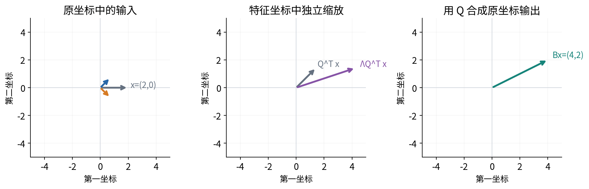

“正交变换”不应一律翻译成“旋转”。矩阵 Q 的行列式是 $-1$，它含有反射；二维纯旋转的行列式是 1。二者都保持长度和夹角，因而都可用于正交坐标变换。这个区别在奇异值分解中同样重要。

## 五 为什么不同特征值对应的方向垂直

设 C 为实对称矩阵，即 $C^T=C$，且 $Cv=\lambda v$、$Cw=\mu w$，其中 $\lambda\neq\mu$。从同一个数 $v^TCw$ 出发，可以用两种合法方式计算。

先将 C 作用到右边的 w：

$$v^TCw=v^T(\mu w)=\mu(v^Tw).$$

再利用对称性，把 C 转移到左边：

$$v^TCw=v^TC^Tw=(Cv)^Tw=(\lambda v)^Tw=\lambda(v^Tw).$$

于是 $(\lambda-\mu)(v^Tw)=0$。因为 $\lambda-\mu\neq0$，可除以它，得到 $v^Tw=0$。非零向量内积为零，正是正交。这份证明中，对称性用在 $C=C^T$；不同特征值用在最后的非零除法。漏掉任何一个条件，结论都不能照搬。

如果特征值相同，最后得到的是 $0=0$，并不能推出正交。例如 $I(1,0)^T=(1,0)^T$，$I(1,1)^T=(1,1)^T$，两个向量都是特征值 1 的特征向量，却不正交。在同一个特征子空间中，可以选择一组正交基，但不能断言任意选择的两条特征向量都垂直。

## 六 一般实对称谱定理与证明的边界

实对称谱定理说：每个实对称 $n\times n$ 矩阵 C 都存在由 n 个单位正交特征向量组成的方阵 Q，以及由实特征值组成的对角矩阵 $\Lambda$，满足

$$C=Q\Lambda Q^T.$$

特征值允许重复，重复时仍能找到足够的正交特征向量。这个存在性结论比上一节强。上一节只说“如果找到了不同特征值的向量，它们会正交”，并没有证明总能找到 n 个方向。[R1，R3]

一条常见证明路线是：先在所有单位向量中找一个让 $x^TCx$ 最大的 q；证明这个 q 是特征向量；再证明与 q 正交的子空间在 C 作用下保持封闭，最后在少一维的空间重复。第二步可通过比较 q 附近的归一化向量证明，第三步则直接使用

$$q^TCw=(Cq)^Tw=\lambda q^Tw=0\qquad(w\perp q).$$

但第一步“最大值一定存在”需要连续函数在有限维单位球面上能取到最大值这一分析结论。它不是“数值试了很多方向”能够证明的。本课程此时没有建立那套存在性理论，因此将完整谱定理作为明确接受的定理，给出上述结构说明；后面的正定性与 SVD 推导以该定理为起点。将一个定理列为前提，比把缺失的论证藏进“显然”更准确。

## 七 正定性是所有方向上的平方表达式条件

对于实对称 C，数 $x^TCx$ 叫二次型。这里先算 Cx，再与 x 作内积。若所有非零 x 都满足 $x^TCx>0$，称 C 正定；若所有 x 都满足 $x^TCx\geq0$，称 C 半正定。零向量总给出 0，所以正定定义必须排除它。

用谱分解并令 $z=Q^Tx$，有

$$x^TCx=x^TQ\Lambda Q^Tx=z^T\Lambda z=\sum_{i=1}^n\lambda_i z_i^2.$$

Q 可逆，故 $x\neq0$ 当且仅当 $z\neq0$。如果所有 $\lambda_i>0$，至少一个 $z_i^2>0$，上述和严格为正。反过来，若 C 正定，取 $x=q_i$，便有 $q_i^TCq_i=\lambda_i>0$。这证明了双向等价：实对称 C 正定，当且仅当所有特征值严格为正。

将严格大于改成大于等于，可得半正定等价于所有特征值非负。若某特征值为负，沿其单位特征向量取 x，就立即找到二次型为负的反例；若同时有正、负特征值，称矩阵不定。

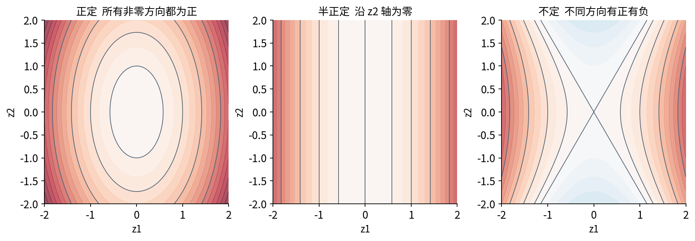

B 的特征值 3、1 都正，所以 B 正定。$\operatorname{diag}(3,0)$ 半正定但不正定；$\operatorname{diag}(3,-1)$ 不定。请不要把“正定”理解为每个元素都正：$\begin{pmatrix}1&2\\2&1\end{pmatrix}$ 每项都正，取 $x=(1,-1)^T$ 却有 $x^TCx=-2$。反过来，$\begin{pmatrix}2&-1\\-1&2\end{pmatrix}$ 含负元素，特征值却是 3、1，仍正定。

本讲将正定、半正定术语用于实对称矩阵。若给出一般非对称 C，则 $x^TCx=x^T(C+C^T)x/2$，二次型只看它的对称部分；不要把一个非对称矩阵的元素直接套入实对称谱结论。

## 八 非对称实矩阵不能照搬结论

考虑四分之一圈旋转

$$J=\begin{pmatrix}0&-1\\1&0\end{pmatrix}.$$

对任何非零实向量，J 都将它转到垂直方向，不能等于某个实数乘原向量。特征方程为 $\lambda^2+1=0$，没有实数根。Python 的 `eig` 会给出虚数单位 i 与 $-i$；本讲不展开复数线性代数，只用这个结果提醒你：实矩阵的特征值未必全是实数。

另一种失败来自

$$H=\begin{pmatrix}1&1\\0&1\end{pmatrix}.$$

它的特征方程是 $(1-\lambda)^2=0$，特征值 1 重复两次。但 $(H-I)v=0$ 要求 $v_2=0$，所有特征向量都落在第一坐标轴上，找不到两个独立特征向量。因此“有两个按重数计算的实特征值”也不足以保证能对角化。

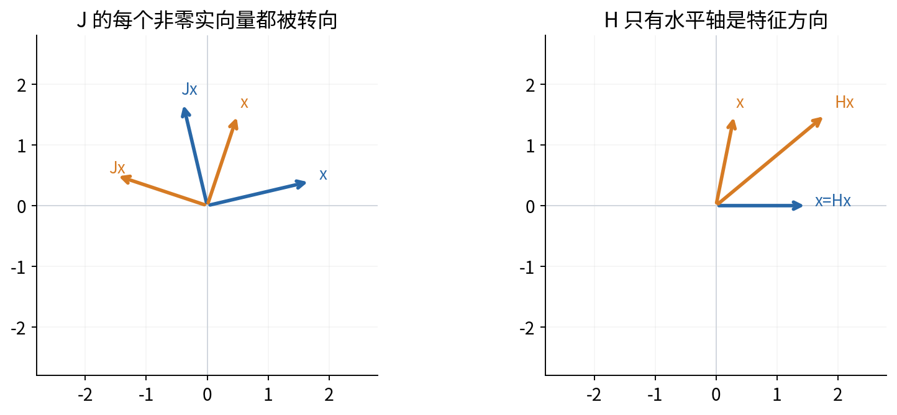

`eigh` 为实对称或复 Hermitian 矩阵设计；它按指定三角区域读取数据，并不替使用者检查另一半是否相同。`eig` 面向一般方阵，结果可能为复数，返回向量也不保证是正交基。[R5，R6] 对错的第一道检查是输入是否满足定理条件，不是函数名字是否熟悉。

## 九 增加一个通道后需要两套方向

现在为原装置增加第三个测量通道，用来测两个输入的差：

$$A=\begin{pmatrix}2&1\\1&2\\1&-1\end{pmatrix},\qquad Ax=\begin{pmatrix}2x_1+x_2\\x_1+2x_2\\x_1-x_2\end{pmatrix}.$$

输入在二维空间，输出在三维空间。写 $Av=\lambda v$ 连形状都不一致：左边三个分量，右边两个分量。不能先忽视这个问题，再要求 A 具有普通意义的特征向量。

但我们仍然能问：哪个单位输入方向产生最大的输出长度？关键是将长度平方写为

$$\|Ax\|_2^2=(Ax)^T(Ax)=x^TA^TAx.$$

$A^TA$ 是 $2\times2$ 方阵。对一般 $m\times n$ 实矩阵 A，也总有 $A^TA\in\mathbb R^{n\times n}$。它是实对称矩阵，因为 $(A^TA)^T=A^TA$；它是半正定矩阵，因为 $x^TA^TAx=\|Ax\|_2^2\geq0$。

这个等式还给出

$$A^TAx=0\ \Longrightarrow\ x^TA^TAx=0\ \Longrightarrow\ \|Ax\|_2^2=0\ \Longrightarrow\ Ax=0.$$

反向从 $Ax=0$ 直接左乘 $A^T$ 即可。因此 $\ker(A^TA)=\ker(A)$。若 A 满列秩，只有零向量被映到零，于是 $A^TA$ 正定；若 A 有非零零空间，$A^TA$ 只是半正定。这补全了第十一讲关于正规方程可逆性的方向解释。

## 十 从特征值构造正奇异值及输出方向

由实对称谱定理，可为 $A^TA$ 选择单位正交特征向量 $v_1,\ldots,v_n$，对应非负特征值按从大到小排列为 $\lambda_1\geq\cdots\geq\lambda_n\geq0$。

定义非负数 $\sigma_i=\sqrt{\lambda_i}$，称为奇异值。若 $\sigma_i>0$，再定义

$$u_i=\frac{Av_i}{\sigma_i}.$$

这时 $Av_i=\sigma_i u_i$：输入单位方向 $v_i$ 被送到输出单位方向 $u_i$，长度乘以 $\sigma_i$。我们还欠两项检查：$u_i$ 是否确实长 1，不同 $u_i$ 是否正交。

对正奇异值对应的 i、j，有

$$u_i^Tu_j=\frac{v_i^TA^TAv_j}{\sigma_i\sigma_j}=\frac{\lambda_j v_i^Tv_j}{\sigma_i\sigma_j}.$$

当 $i=j$ 时，$v_i^Tv_i=1$ 且 $\lambda_i=\sigma_i^2$，所以结果是 1。当 $i\neq j$ 时，由选择的基的正交性 $v_i^Tv_j=0$，所以结果是 0。这里即使两个正奇异值相等，也没有问题：我们是先在重复特征子空间内选了单位正交基，再作此构造。

因此正奇异值对应的 $u_i$ 是一组单位正交输出向量。A 的秩 r 恰好等于正奇异值个数，因为零特征值方向恰好组成输入零空间，而秩加零空间维数等于 n。

## 十一 零奇异值不能放进除法

若 $\sigma_i=0$，前面的公式 $Av_i/\sigma_i$ 没有定义。正确结论来自 $\|Av_i\|_2^2=\lambda_i=0$，因此 $Av_i=0$：该输入方向被完全抹去，没有由 A 指定的单位输出朝向。

设前 r 个奇异值严格为正。将 $u_1,\ldots,u_r$ 用 Gram–Schmidt 的补基方法扩充成三维或一般 m 维输出空间的一组单位正交基；输入侧的 $v_1,\ldots,v_n$ 已由谱定理得到完整基。补上的输出方向可以有多种合法选择，它们对应无法由 A 产生的正交剩余方向。

对任何 x，先用输入基展开

$$x=\sum_{i=1}^n(v_i^Tx)v_i.$$

再用线性性作用 A：

$$Ax=\sum_{i=1}^n(v_i^Tx)Av_i=\sum_{i=1}^r\sigma_i u_i(v_i^Tx).$$

最后一项去掉了 $i>r$ 的方向，因为它们被映成零。等式对每个 x 都成立，所以两个线性映射是同一个矩阵：

$$A=\sum_{i=1}^r\sigma_i u_i v_i^T.$$

这就是奇异值分解最关键的重构等式。不是“图上似乎差不多”，也不是软件恰好给了很小误差；它来自输入正交基的完整展开与线性性。[R2]

## 十二 完整 薄与紧致分解的形状

令 $p=\min(m,n)$，r 为精确秩。本讲采用下面约定；不同教材对“薄”和“紧致”的命名不完全一致，阅读时应以尺寸为准。

完整 SVD 写成 $A=U\Sigma V^T$，其中 U 为 $m\times m$，V 为 $n\times n$，两者是正交方阵；$\Sigma$ 为 $m\times n$，只有主对角线位置可能非零，放入 $\sigma_1,\ldots,\sigma_p$，其余位置为零。它保留完整的输入和输出坐标基，便于看清零空间。

薄 SVD 也称 reduced SVD，本讲记为 $A=U_p\Sigma_pV_p^T$，尺寸分别是 $m\times p$、$p\times p$、$p\times n$。只省去完整分解中必然多余的矩形零块，长度为 p 的奇异值列表仍可能含零。`np.linalg.svd(A, full_matrices=False)` 返回的就是这种尺寸，不会自动按数值秩截断。

紧致 SVD 仅保留严格正的 r 个奇异值，写成 $A=U_r\Sigma_rV_r^T$，尺寸分别为 $m\times r$、$r\times r$、$r\times n$。当 $r<p$ 时，它比薄 SVD 更小。计算机只能按阈值估计“哪些数足够小”，所得是数值紧致表示，必须说明阈值，不应偷换成精确秩证明。

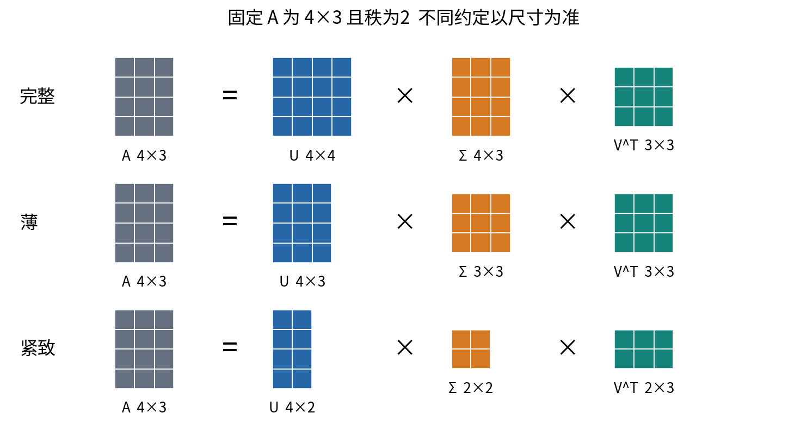

薄矩阵的列满足 $U_p^TU_p=I_p$，但一般 $U_pU_p^T\neq I_m$；后者是到 $U_p$ 的列空间的正交投影。如果薄分解包含零奇异值对应的补充列，这个空间会大于 A 的列空间；到 A 列空间的投影应使用紧致分解的 $U_rU_r^T$。类似地，不能给非方阵 $U_p$ 随意写普通逆。完整正交基和局部正交列是两种不同的尺寸条件。

宽矩阵还有一个特别容易漏掉的点：$A^TA$ 有 n 个特征值，但软件只返回 p 个奇异值。当 $m<n$ 且满行秩时，返回列表的 p 个数全正，输入空间仍有 $n-m$ 个零方向。那些零方向由完整 V 的额外列表示，并不必出现在长度 p 的列表里。

## 十三 把长方形例子的 SVD 也手算出来

先逐项计算

$$A^TA=\begin{pmatrix}2^2+1^2+1^2&2\cdot1+1\cdot2+1\cdot(-1)\\2\cdot1+1\cdot2+(-1)\cdot1&1^2+2^2+(-1)^2\end{pmatrix}=\begin{pmatrix}6&3\\3&6\end{pmatrix}.$$

其特征方程为 $(6-\lambda)^2-9=0$，给出 9、3。对应方向仍是

$$v_1=\frac{(1,1)^T}{\sqrt2},\qquad v_2=\frac{(1,-1)^T}{\sqrt2}.$$

因此 $\sigma_1=3$、$\sigma_2=\sqrt3$。将方向实际送入 A：

$$Av_1=\frac1{\sqrt2}\begin{pmatrix}3\\3\\0\end{pmatrix},\qquad Av_2=\frac1{\sqrt2}\begin{pmatrix}1\\-1\\2\end{pmatrix}.$$

分别除以 3 与 $\sqrt3$，得到

$$u_1=\frac{(1,1,0)^T}{\sqrt2},\qquad u_2=\frac{(1,-1,2)^T}{\sqrt6}.$$

两向量平方长度分别为 $(1+1)/2=1$ 和 $(1+1+4)/6=1$；内积为 $(1-1+0)/\sqrt{12}=0$。如果要完整 U，可补

$$u_3=\frac{(1,-1,-1)^T}{\sqrt3}.$$

它与前两列内积都为 0，长 1，且 $A^Tu_3=0$。最终完整 SVD 为

$$A=\begin{pmatrix}|&|&|\\u_1&u_2&u_3\\|&|&|\end{pmatrix}\begin{pmatrix}3&0\\0&\sqrt3\\0&0\end{pmatrix}\begin{pmatrix}v_1^T\\v_2^T\end{pmatrix}.$$

最后一式中竖线只是表示各向量是列，并非矩阵元素。若把 U 的第三列和 $\Sigma$ 的第三行去掉，就得到薄分解；本例 $r=p=2$，薄分解也恰是紧致分解。

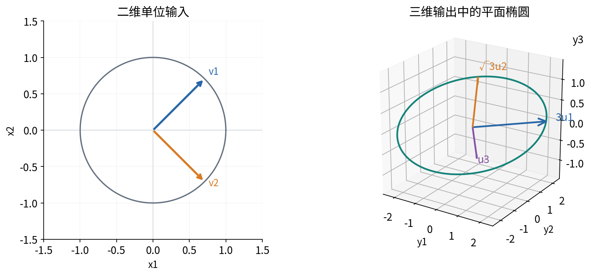

## 十四 一般输入的作用与两个不同的范数

对单位输入 $\|x\|_2=1$，写 $c_i=v_i^Tx$。完整正交基保证 $\sum_{i=1}^n c_i^2=1$。由输出方向正交，

$$\|Ax\|_2^2=\sum_{i=1}^r\sigma_i^2c_i^2\leq\sigma_1^2\sum_{i=1}^n c_i^2=\sigma_1^2.$$

取 $x=v_1$ 可以取到等号。因此最大输出长度就是 $\sigma_1$。我们把

$$\|A\|_2=\max_{\|x\|_2=1}\|Ax\|_2=\sigma_1$$

称为谱范数，也叫诱导 2 范数。向量下标 2 表示欧氏长度；矩阵下标 2 则表示最大方向放大倍数，两者不能混淆。

另一种是 Frobenius 范数，记作

$$\|A\|_F=\sqrt{\sum_{a=1}^m\sum_{b=1}^n A_{ab}^2}.$$

它把所有元素的平方加起来再开方，相当于把矩阵拉成长向量后量长度。用 SVD 展开并利用左右向量正交，可以得到

$$\|A\|_F^2=\sum_{i=1}^r\sigma_i^2.$$

一种不跳步的看法是引入矩阵逐项内积 $\langle C,D\rangle_F=\sum_{a,b}C_{ab}D_{ab}$。其中 $u_{ia}$ 表示第 i 个输出向量的第 a 个分量，$v_{ib}$ 表示第 i 个输入向量的第 b 个分量。对两项外积有

$$\langle u_iv_i^T,u_jv_j^T\rangle_F=\sum_{a,b}u_{ia}v_{ib}u_{ja}v_{jb}=(u_i^Tu_j)(v_i^Tv_j).$$

同一项等于 1，不同项等于 0。因此这些秩1矩阵在逐项平方和意义下也是正交的，平方展开后交叉项消失，只剩 $\sum\sigma_i^2$。

对主例，$\|A\|_2=3$，$\|A\|_F=\sqrt{9+3}=\sqrt{12}$。说“矩阵误差为 3”而没有说明范数，无法判断究竟量了什么。程序用 `ord=2` 与 `ord='fro'` 分别指定，避免依赖默认值。

## 十五 每个奇异方向是一层秩1矩阵

外积 $uv^T$ 的每列都是 u 的某个倍数，所以 u、v 非零时其秩为 1。SVD 将 A 写成这样的层相加。主例两层可以算成没有根号的形式：

$$3u_1v_1^T=\begin{pmatrix}3/2&3/2\\3/2&3/2\\0&0\end{pmatrix},$$

$$\sqrt3u_2v_2^T=\begin{pmatrix}1/2&-1/2\\-1/2&1/2\\1&-1\end{pmatrix}.$$

第一层保留两输入共同上升的作用；第二层保留差异方向的作用。逐项相加，就得到原矩阵 A。第二层中出现负数不表示负奇异值：奇异值是非负长度倍数，符号可以来自向量分量。

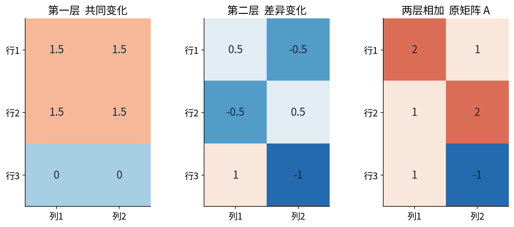

若只保留第一层，得到 $A_1=3u_1v_1^T$。对输入 $x=v_1$，$A_1x=Ax$，没有误差；对 $x=v_2$，$A_1x=0$，却丢掉了长度为 $\sqrt3$ 的输出。这说明低秩近似对不同输入方向的影响不均匀。整体平方误差较小，并不保证每一个任务关心的方向都被保留。

## 十六 符号改变与重复值不等于算法出错

如果同时把某一对 $u_i,v_i$ 换成 $-u_i,-v_i$，对应外积满足

$$\sigma_i(-u_i)(-v_i)^T=\sigma_i u_iv_i^T.$$

因此奇异值相同、单列向量符号不同、重构矩阵相同，是完全合法的结果。只改一侧却会把该层变号，一般不再重构原矩阵。主例单侧翻第一层的 Frobenius 差为 6，因为新旧矩阵差是两倍第一层，而第一层的 Frobenius 范数为 3。

重复奇异值带来更大的自由度。以 $D=\operatorname{diag}(2,2,1/2)$ 为例，前两个方向有相同伸长倍数。设 R 是任意 $2\times2$ 正交矩阵，前两列同时换成 $U_{12}R$ 与 $V_{12}R$，则

$$(U_{12}R)(2I)(V_{12}R)^T=2U_{12}RR^TV_{12}^T=2U_{12}V_{12}^T.$$

这一整个二维子空间中的基可以变化。直接比较两次程序给出的第一根向量，可能把同一个合法子空间误判为不同答案。更有意义的是比较该块的投影矩阵 $U_{12}U_{12}^T$、奇异值、重构误差和正交性。相近但不完全相等的奇异值也可能使单个方向对小扰动很敏感；稳定性应结合谱间隔和目标子空间讨论，不能仅盯小数表面是否一致。

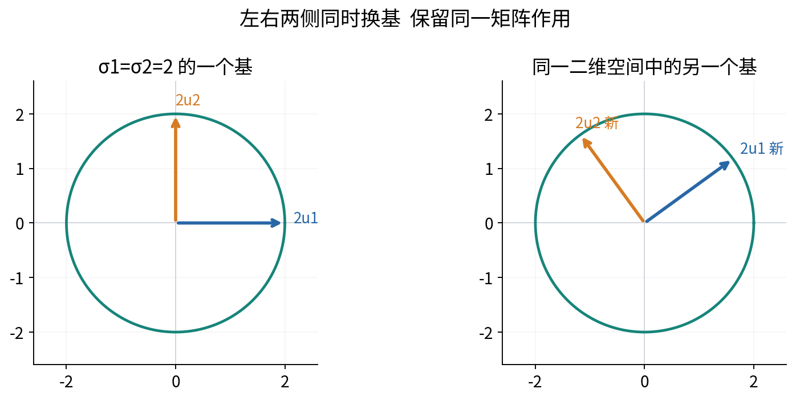

## 十七 截断后精确丢掉多少

将奇异值降序排列，固定整数 $0\leq k\leq p$，定义

$$A_k=\sum_{i=1}^k\sigma_i u_iv_i^T.$$

零项允许保留，故 $\operatorname{rank}(A_k)\leq k$；$k=0$ 时空和代表零矩阵。误差矩阵为后面所有层之和。由上一节矩阵层的正交性，

$$\|A-A_k\|_F^2=\sum_{i=k+1}^p\sigma_i^2.$$

由最大方向放大倍数的推导，

$$\|A-A_k\|_2=\sigma_{k+1}\qquad(k<p).$$

当 $k=p$ 时误差为零；也可约定 $\sigma_{p+1}=0$ 统一记号。前一个公式累积所有丢弃方向的平方，后一个公式只取丢弃方向中最大的伸长倍数。二者对应不同问题，不能因为都使用 SVD 就互换数值。[R4]

主例 $p=2$。保留一层时，误差为第二层，Frobenius 范数和谱范数都等于 $\sqrt3$，平方误差是 3。这两个范数在此恰好相同，是因为误差只有一层，不是一般规律。零层时，谱误差为 3，Frobenius 误差为 $\sqrt{12}$，两者已经不同。

若 A 不为零，可定义平方和能量保留率

$$E_k=\frac{\sum_{i=1}^k\sigma_i^2}{\sum_{i=1}^p\sigma_i^2}=1-\frac{\|A-A_k\|_F^2}{\|A\|_F^2}.$$

这里“能量”专指元素平方和，不自动是物理能量、解释因果的比例或分类正确率。主例 $E_1=9/12=3/4$。相对 Frobenius 误差为 $\sqrt{1-E_1}=1/2$，不是 $1-E_1=1/4$，因为范数还要开平方。零矩阵分母为零，保留率没有定义；程序明确返回 `None`，不偷偷把 $0/0$ 写成 100%。

## 十八 为什么截断是最优低秩近似

Eckart–Young 结论说：对于任意实矩阵 A、整数 $0\leq k\leq p$，在所有同尺寸且秩至多 k 的矩阵 C 中，截断矩阵 $A_k$ 同时达到最小 Frobenius 误差和最小谱范数误差。这是对全部候选 C 的结论，不仅是在 SVD 的原有层中“选择哪 k 层”。[R2，R4]

先看谱范数的证明。只需讨论 $k<r$。前 $k+1$ 个右奇异向量张成一个 $k+1$ 维空间。由于 $\operatorname{rank}(C)\leq k$，C 在这 $k+1$ 维输入空间上的限制不可能单射；第十一讲的秩与零空间关系保证，存在该空间内的非零 z 使 $Cz=0$。将它归一化，写成

$$z=\sum_{i=1}^{k+1}c_iv_i,\qquad\sum_{i=1}^{k+1}c_i^2=1.$$

于是

$$\|(A-C)z\|_2^2=\|Az\|_2^2=\sum_{i=1}^{k+1}\sigma_i^2c_i^2\geq\sigma_{k+1}^2.$$

谱范数考察所有单位输入上的最大误差，至少不会小于在 z 上的误差，所以 $\|A-C\|_2\geq\sigma_{k+1}$。而上一节已证明 $A_k$ 恰好达到这个下界，故它最优。这份证明没有使用微积分。

Frobenius 范数的思路是投影。设 P 为到 C 列空间的正交投影，其维数 $d\leq k$。因为 C 的每列已在该空间里，对 A 的每列使用勾股分解后相加，可得

$$\|A-C\|_F^2=\|(I-P)A\|_F^2+\|PA-C\|_F^2\geq\|(I-P)A\|_F^2.$$

因此先问：一个至多 k 维子空间最多能接住 A 的多少平方和？由右奇异向量的正交性，

$$\|PA\|_F^2=\sum_{i=1}^r\sigma_i^2\|Pu_i\|_2^2.$$

记 $a_i=\|Pu_i\|_2^2$。每个 $a_i$ 在 0 与 1 之间，并且 $\sum_{i=1}^r a_i\leq d\leq k$。为什么后一条成立？若 $w_1,\ldots,w_d$ 是该子空间的单位正交基，则 $a_i=\sum_{j=1}^d(w_j^Tu_i)^2$。对固定 j，完整输出正交基上的坐标平方和为 1，只取前 r 个不会超过 1；对 j 相加便得到上界 d。

在总份额不超过 k、每项不超过 1 的条件下，将份额放在最大的 $\sigma_i^2$ 上最有利。更形式化地，对 $1\leq k<r$，

$$\sum_{i>k}\sigma_i^2a_i\leq\sigma_k^2\sum_{i>k}a_i\leq\sigma_k^2\sum_{i\leq k}(1-a_i)\leq\sum_{i\leq k}\sigma_i^2(1-a_i).$$

移项得到 $\sum_i\sigma_i^2a_i\leq\sum_{i=1}^k\sigma_i^2$。所以任何候选 C 至少丢掉 $\sum_{i>k}\sigma_i^2$ 的平方和；$A_k$ 恰好达到下界。$k=0$ 时候选只能为零矩阵，$k\geq r$ 时 A 自身可选，两个边界也成立。这解释了“最优”的理由，而不只复述它的名称。

## 十九 最优不一定唯一 也不适合所有损失

定理保证存在一个截断解达到最优，不保证所有情形下解唯一。取 $A=2I_2$、$k=1$，保留第一坐标方向得到 $\operatorname{diag}(2,0)$，保留第二坐标方向得到 $\operatorname{diag}(0,2)$，两者的 Frobenius 误差与谱误差都为 2。重复奇异值刚好跨过截断边界时，可以有不同的最佳近似。

对非平凡截断 $1\leq k<r$，若 $\sigma_k>\sigma_{k+1}$，Frobenius 最优矩阵是唯一的；唯一的是重构矩阵，不是每个奇异向量的符号。练习17沿用上一节投影论证给出这一唯一性结论的推导；不能将它扩展为谱范数下的唯一性。即使有谱隙，谱范数最优解仍可能不唯一，例如 $\operatorname{diag}(3,1)$ 的秩1近似 $\operatorname{diag}(a,0)$ 在 $2\leq a\leq4$ 时谱误差都是 1。

更重要的是，Eckart–Young 对应完整矩阵上的无权 Frobenius 或谱范数。若某些元素更重要，目标改为

$$\sum_{a,b}w_{ab}(A_{ab}-C_{ab})^2,$$

其中权重 $w_{ab}\geq0$，普通截断通常不再最优。具体取 $A=\operatorname{diag}(3,1)$，将右下角权重设为 100，其余设为 1。普通秩1截断 $\operatorname{diag}(3,0)$ 的加权误差为 100；候选 $\operatorname{diag}(0,1)$ 的加权误差只有 9。一个反例已经足够否定“任何加权损失都可直接截断 SVD”。

缺失元素也要明确处理。未观察不等于观察到零，只对已观察位置计误差相当于带掩码的损失。先填零再截断是在解另一个完整矩阵问题，不能说它自动解决了原始缺失数据的最优低秩拟合。

## 二十 用一张合成强度图查看重构

实验中的 `synthetic_field.csv` 是一个 $32\times32$ 的数值场，数值在 0 与 1 之间，每一行是一个纵向位置，每一列是一个横向位置。它由一层常量背景和五层确定性条纹相加产生，已知非零奇异值为

$$16,\ 8,\ 4,\ 2,\ 1/2,\ 1/4.$$

构造不是从照片中提取物体，而是先选择互相正交的条纹，再赋予不同强度；因此理论谱已知，可以用来核查代码。每个元素都能写成分母为 128 的整数比例，数据文件保存这些确切十进制值，没有随机种子，也不下载外部图像。

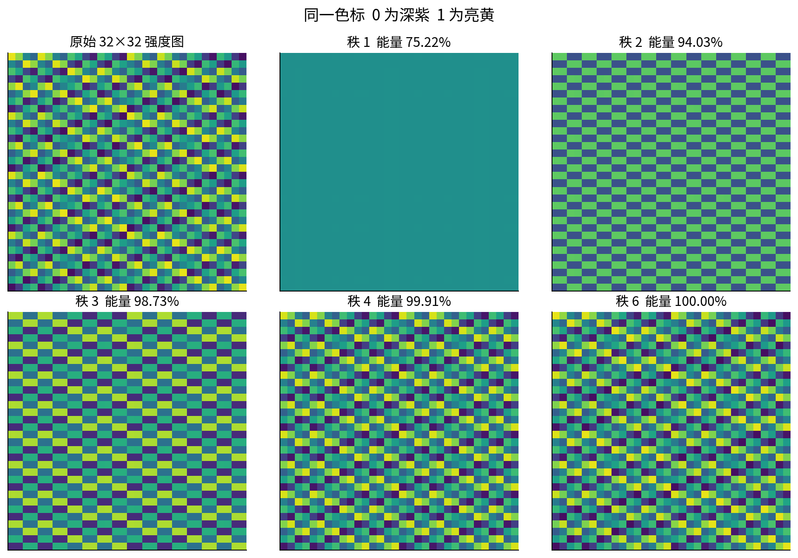

总平方和为

$$16^2+8^2+4^2+2^2+(1/2)^2+(1/4)^2=340.3125.$$

秩1只保留常量背景，能量保留率已经约为 75.22%，但细条纹全不在。秩2保留约 94.03%，秩4保留约 99.91%。高比例可能主要反映大面积背景很强，并不意味着保留了同样比例的可识别细节。若任务关心某条微弱纹理，单靠全局能量阈值可能把它当成可丢弃的方向。

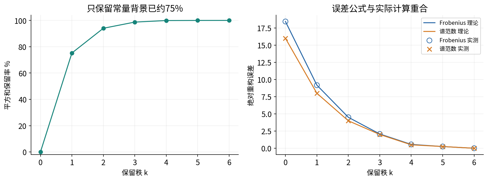

用因子保存秩 k 近似，需要大约 $k(m+n+1)$ 个数，原矩阵需要 mn 个数；这是直接存 U、奇异值及 V 的朴素计数，没有扣除正交约束，也没有讨论压缩文件格式的额外开销。本例 $m=n=32$，秩4需 $4(32+32+1)=260$ 个数，原矩阵需 1024 个。若 k 很大，因子计数可能反而更大，所以“做了 SVD”不等于“文件一定变小”。

## 二十一 用奇异值解释第十一讲的条件数

先严格限于可逆 $n\times n$ 方阵 A。其奇异值全部正，完整 SVD 为 $A=U\Sigma V^T$。因为 U、V 正交，且 $\Sigma$ 的对角数非零，

$$A^{-1}=V\Sigma^{-1}U^T.$$

可以乘回核验：$U\Sigma V^TV\Sigma^{-1}U^T=UIU^T=I$。逆矩阵沿输出方向 $u_i$ 的伸长是 $1/\sigma_i$，最大者为 $1/\sigma_n$。于是

$$\kappa_2(A)=\|A\|_2\|A^{-1}\|_2=\frac{\sigma_1}{\sigma_n}.$$

这里已经给出了第十一讲延后的证明：最强正向伸长与最强反向伸长相乘，衡量最坏相对敏感性。它不是每次误差都会达到的放大倍数。扰动沿哪个方向、真解在哪个方向，都影响实际误差。

对 $C_\varepsilon=\operatorname{diag}(1,\varepsilon)$、$0<\varepsilon\leq1$，条件数为 $1/\varepsilon$。取右端 $y=(1,0)^T$，真解为 $(1,0)^T$；若只把第二个输出改成 $\delta$，解变成 $(1,\delta/\varepsilon)^T$。例如 $\varepsilon=2^{-20}$、$\delta=2^{-30}$，右端改变约 $9.31\times10^{-10}$，第二个解分量却改变 $2^{-10}=0.0009765625$。

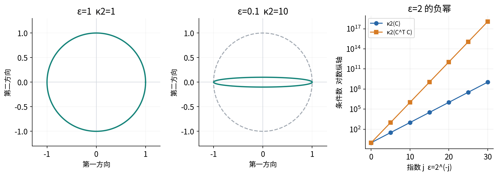

## 二十二 正规方程平方条件数的适用条件

若 A 是满列秩的 $m\times n$ 矩阵，则 $m\geq n$，所有 n 个奇异值正。薄分解给出

$$A^TA=(U_n\Sigma_nV^T)^T(U_n\Sigma_nV^T)=V\Sigma_nU_n^TU_n\Sigma_nV^T=V\Sigma_n^2V^T.$$

因为 $U_n^TU_n=I$，Gram 矩阵的特征值为 $\sigma_i^2$；它正定，所以其奇异值也正好为这些正特征值。将矩形满列秩 A 的方向比例记为 $\kappa_2(A)=\sigma_1/\sigma_n$，便有

$$\kappa_2(A^TA)=\frac{\sigma_1^2}{\sigma_n^2}=\kappa_2(A)^2.$$

这个公式属于精确实数算术。实际浮点计算先形成 $A^TA$ 时，还会受到乘加舍入影响，极小特征值可能提前变成零，甚至出现小的负数。因此不能把“从 $A^TA$ 的特征分解定义 SVD”的理论路线直接包装成稳定的通用 SVD 算法。本讲实际分解使用 NumPy 的直接 SVD 接口，而将 Gram 路线作为可观察误差的教学对照。

宽矩阵尤其要谨慎。例如

$$W=\begin{pmatrix}1&0&0\\0&1&0\end{pmatrix}.$$

软件返回的两个奇异值为 1、1，`np.linalg.cond(W)` 返回 1。可是 $W(0,0,1)^T=0$，求参数时第三个分量完全无法识别。$W^TW=\operatorname{diag}(1,1,0)$ 不可逆。“有限奇异值比”只描述非零输出方向间的比例，不能据此断言宽矩阵没有零空间、参数唯一或普通逆存在。

## 二十三 数值实验应该比较什么

`experiment.py` 与配套 Notebook 对齐以下检查。首先核验 B 的特征值、特征方程、正交性与重构。`eigh` 按升序返回特征值，所以得到 1、3；正文为便于讲最强方向常按 3、1 排列。交换特征值顺序时必须同时交换对应向量列。

其次核验 A 的完整与薄分解尺寸、实际重构，以及手算奇异值 3、$\sqrt3$。NumPy 返回 `U, s, Vt`，这里实际变量名 Vt 对实输入代表 $V^T$，不是 V。s 是一维数组；`U @ s @ Vt` 不是正确的矩阵重构。薄分解用 `(U * s) @ Vt` 按列缩放，或者 `U @ np.diag(s) @ Vt`。[R7]

程序同时检查成对翻号、单侧翻号、重复值块换基及投影不变。它不要求某个库版本永远选择正文那一套符号。正交性与重构误差比较的是绝对和相对容差，不用 `==` 判断一般浮点等式。手算中的有理数部分另外用 `Fraction` 精确核验。

边界样例包括满秩方阵、满列秩高矩阵、满行秩宽矩阵、秩亏矩阵、零矩阵、一阶矩阵及近奇异矩阵。输入检查只接受整数与浮点实数，并在转换之前拒绝布尔值、数字字符串、object 数组与对象叶子；也拒绝空矩阵、非有限值、复数输入、非对称的 `eigh` 包装调用和非法截断秩。混合 Python 列表中的布尔或字符串不能靠自动转换蒙混过去。零矩阵的能量比例被标记为未定义。实验还展示接近共线的矩阵先作 Gram 再开平方的路线可能丢掉小奇异值，而不预设每个例子都出现同一种误差。

数值秩使用阈值 $\tau=\max(m,n)\epsilon_{\mathrm{mach}}\sigma_1$ 作为本实验默认规则，其中 $\epsilon_{\mathrm{mach}}$ 是浮点数的相对分辨率尺度。阈值只是一条公开约定，可能不适合实际测量噪声；“小于阈值”不能证明原本的精确实数就是零。研究报告应同时保存奇异值、阈值、尺寸和任务噪声背景，而非只打印一个秩。

## 二十四 从分解到研究判断

本讲把“最重要的方向”限制在可检验的数学标准内：固定输入长度时最大的输出伸长，或者固定秩预算时最小的无权矩阵重构误差。若你的研究问题包含单位差异、不同误差代价、缺失记录、未来预测、类别差异或因果目标，需要先说明矩阵代表什么、为何使用当前范数，再决定 SVD 是否回答了真正的问题。

一个可复核的报告至少应回答：矩阵是实对称方阵还是一般长方形矩阵？采用何种分解尺寸？奇异值如何排序，秩阈值如何选择？重构误差用哪种范数？重复值对应的向量是否应该按子空间比较？低秩截断丢掉的方向是否恰是任务关心的弱信号？

学习检查可按这个顺序完成：不用代码重做 B 的两组特征对；写出不同特征值正交的证明并标出条件；说明零奇异值为什么不能相除；从完整基展开重构 A；手算秩1误差与 3/4 能量；解释宽矩阵条件数为 1 仍参数不唯一。能完成这些，比只记住 `np.linalg.svd` 的拼写更接近真正理解。本讲的具体练习与逐步解答见配套《练习详解》，运行与边界测试见独立实验指南。

## 参考与核验

以下公开作者教材和官方文档用于核验定理条件与接口，核查日期均为 2026 年 10 月 4 日。正文例子、推导安排、图和数据为本课程原创。来源中的术语与记号可能不同，应以本讲明确给出的尺寸为准。

- [R1 Stephen Boyd，EE263 第15讲，实对称矩阵、二次型、矩阵范数与 SVD，重点核验实对称谱分解、正定性和最大伸长](https://ee263.stanford.edu/archive/symm.pdf)

- [R2 Stephen Boyd 与 Sanjay Lall，Singular Value Decomposition，重点核验完整分解、奇异方向、条件数与谱范数低秩下界](https://ee263.stanford.edu/lectures/svd-v2.pdf)

- [R3 Sébastien Roch，Mathematical Methods in Data Science 第4.2节，重点核验谱定理、重复特征子空间和正定条件](https://mmids-textbook.github.io/chap04_svd/02_spectral/roch-mmids-svd-spectral.html)

- [R4 Sébastien Roch，同书第4.6节，重点核验 Frobenius 与诱导2范数截断误差及低秩近似条件](https://mmids-textbook.github.io/chap04_svd/06_further/roch-mmids-svd-further.html)

- [R5 NumPy 2.3，`numpy.linalg.eigh`](https://numpy.org/doc/2.3/reference/generated/numpy.linalg.eigh.html)

- [R6 NumPy 2.3，`numpy.linalg.eig`](https://numpy.org/doc/2.3/reference/generated/numpy.linalg.eig.html)

- [R7 NumPy 2.3，`numpy.linalg.svd`](https://numpy.org/doc/2.3/reference/generated/numpy.linalg.svd.html)

- [R8 NumPy 2.3，`numpy.linalg.cond`](https://numpy.org/doc/2.3/reference/generated/numpy.linalg.cond.html)
