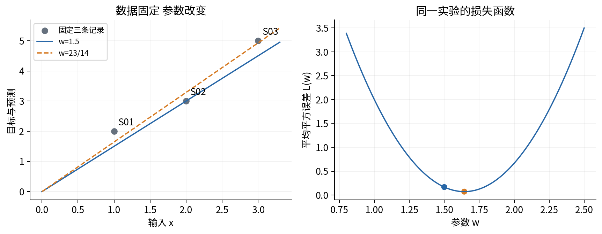
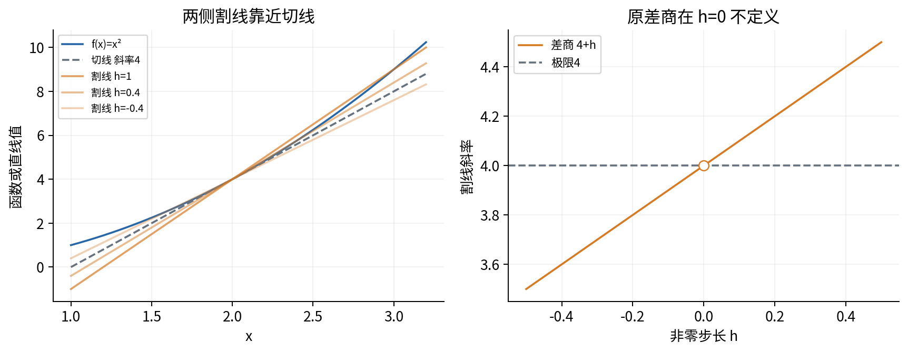
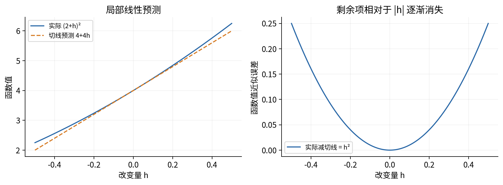
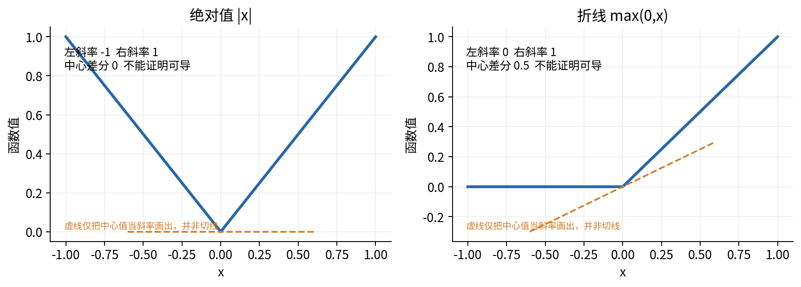
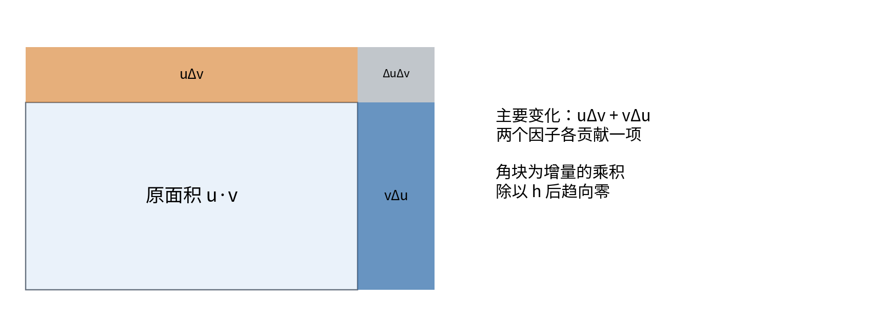
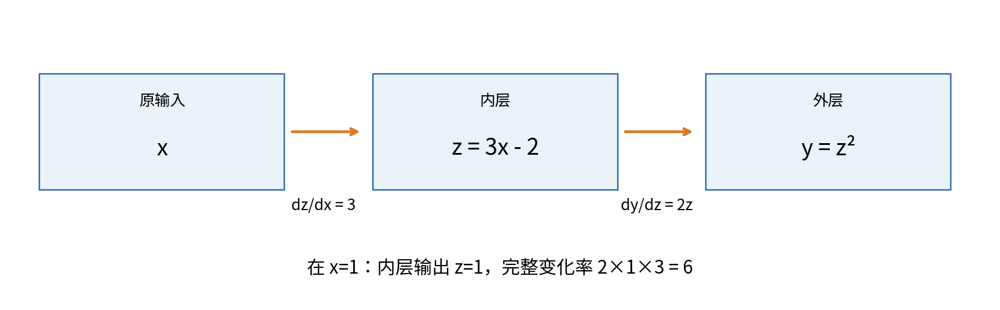
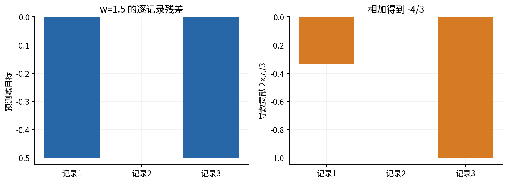
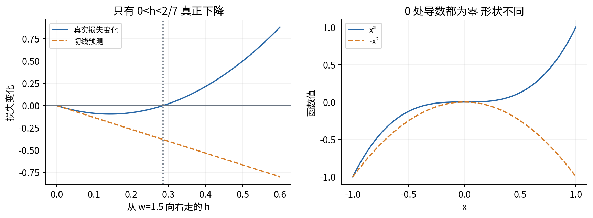
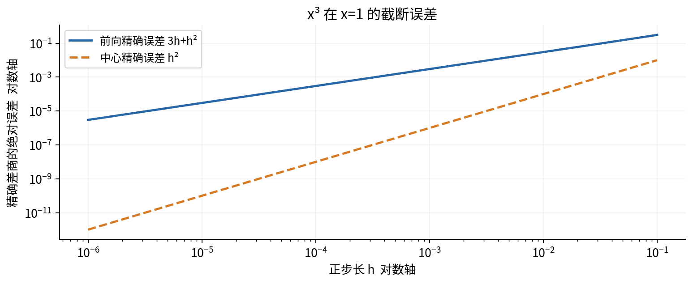
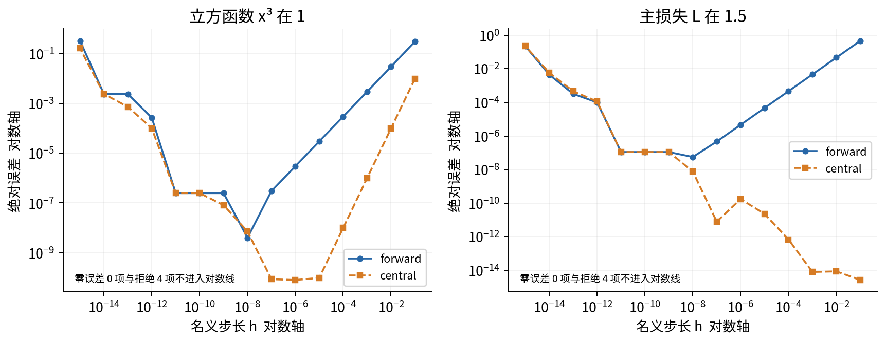

# 一元导数与局部变化

## 第十三讲 用一个参数的微小变化读懂损失

我们已经会把一个输入代入函数，也会比较两组参数产生的误差。接下来的问题是：不把所有参数值逐个试遍，能否判断在当前位置把参数稍微调大，损失会增加还是减少？导数提供的是一个局部变化率。它既不是函数本身的大小，也不是一次任意大改动的效果。

本讲围绕只有一个可调参数的校准模型展开。我们会从差商完整推出平方误差的导数，解释切线、求导规则和链式法则，再让纸笔公式与不同步长的浮点差分互相核验。实验也会故意走到尖点、定义域边缘和机器分辨率之外，看看为什么“程序给出了一个数”并不等于“导数存在且算对了”。

数学直接先修是第八讲的函数、复合、幂、对数、集合与量词。本讲重新说明极限，不要求先学多元微积分或 Taylor 展开。运行实验需要第三至五讲的函数、循环、文件与数组基础。全部数据为无量纲合成教学记录；这里检查数学和数值计算，不估计真实任务的泛化表现。

## 一 把正在改变的量说清楚

我们有三条记录，输入 $x_i$ 与目标 $y_i$ 如下。

| 记录 $i$ | 输入 $x_i$ | 目标 $y_i$ |
|---|---:|---:|
| 1 | 1 | 2 |
| 2 | 2 | 3 |
| 3 | 3 | 5 |

用同一个实数参数 $w$ 产生预测 $\hat y_i=wx_i$。这里只允许调比例，不允许加截距，也不能为每条记录选一个不同参数。固定这些数据后，平均平方误差成为一个从实数到实数的函数：

$$L(w)=\frac{1}{3}\sum_{i=1}^{3}(wx_i-y_i)^2.$$

符号 $i$ 在给三条记录编号；真正的自变量是 $w$。求 $L$ 对 $w$ 的导数时，$x_i,y_i$ 和记录数 3 都固定。假如数据随参数变化，问题就改变了，不能继续把它们当常量。

在 $w=3/2$ 处，预测为 $(3/2,3,9/2)$，预测减目标为 $(-1/2,0,-1/2)$，所以 $L(3/2)=1/6$。把 $w$ 增加 $h=1/100$ 后，损失是否变小？要回答方向，不能只看 $1/6$ 这个当前损失数值。

如果输入与输出原来带单位，$w$ 的单位是“输出单位除以输入单位”；$L$ 的单位是输出单位的平方。$L'(w)$ 的单位则是“损失单位除以参数单位”。本讲把所有量设为无量纲，目的是简化计算，不是取消实际应用中的单位检查。

## 二 先理解有限变化率

给定函数 $f$、起点 $a$ 和非零改变量 $h$，只要 $a$ 与 $a+h$ 都在定义域中，就可以计算

$$D_hf(a)=\frac{f(a+h)-f(a)}{h}.$$

分子是输出的变化，分母是输入的变化。这个比值叫差商；它是经过 $(a,f(a))$ 与 $(a+h,f(a+h))$ 的割线斜率。它描述整段位移的平均变化率，不是自动等于起点的瞬时变化率。

例如 $f(x)=x^2$，起点 $a=2$。当 $h=1$ 时，差商为 $(9-4)/1=5$；当 $h=1/10$ 时，差商为 $(4.41-4)/0.1=4.1$；当 $h=-1/10$ 时，差商为 $(3.61-4)/(-0.1)=3.9$。负的 $h$ 同样合法，它让我们从另一侧靠近起点。

直接展开能得到比表格更有力的结论：

$$\frac{(a+h)^2-a^2}{h}=\frac{2ah+h^2}{h}=2a+h,\qquad h\ne0.$$

我们先在 $h\ne0$ 的条件下约掉 $h$，然后再研究 $h$ 趋近 0 时 $2a+h$ 的表现。若一开始把 $h=0$ 代入原式，只会得到未定义的 $0/0$。极限不是允许除以零的许可。

## 三 极限要求所有足够近的输入都受控制

说 $q(h)$ 在 $h\to0$ 时趋向 $d$，直觉是：只要把非零的 $h$ 限制得足够接近 0，就能使 $q(h)$ 与 $d$ 的差足够小。符号写为 $\lim_{h\to0}q(h)=d$。

第八讲提醒我们检查量词次序。这里的完整说法是：对每一个容许误差 $\varepsilon>0$，都存在一个距离门槛 $\delta>0$，使所有满足 $0<|h|<\delta$ 且位于允许定义域中的 $h$ 都满足 $|q(h)-d|<\varepsilon$。$\delta$ 可以依赖 $\varepsilon$，但选好之后必须同时管住那一整段的输入。

以 $q(h)=2a+h$ 为例，$|q(h)-2a|=|h|$。给定任意 $\varepsilon>0$，选择 $\delta=\varepsilon$ 就完成证明。这个推理覆盖所有足够小的正负 $h$；只列出五个逐渐变小的数并不能覆盖它们。

极限还需要左右相容。函数 $q(h)=1$ 对正 $h$ 成立，而 $q(h)=-1$ 对负 $h$ 成立时，沿右侧与左侧靠近得到不同结果，因此两侧极限不存在。只画右半边或者只用正步长，会漏掉这个问题。

我们不会在每一个计算后都重写完整的量词证明，但必须知道：数值表提供线索，代数与极限条件提供结论。后面遇到计算结果与解析结论矛盾时，应先查定义域、步长和数值表示，不能让有限表格代替定义。

## 四 导数是差商的有限极限

若 $f$ 在 $a$ 附近有定义，且下面的有限实数极限存在，就称 $f$ 在 $a$ 可导：

$$f'(a)=\lim_{h\to0}\frac{f(a+h)-f(a)}{h}.$$

这里默认 $a$ 是定义域的内部点，正负方向都能靠近。$f'(a)$ 是一个数；把每个可导点 $x$ 对应到 $f'(x)$，才得到导函数 $f'$。记号 $\frac{df}{dx}$ 强调对哪个变量求导。它可以帮助组织链式关系，但不是可以在所有场合随意约分的普通分数。

平方函数前面的展开已经证明 $(x^2)'=2x$，从而 $f'(2)=4$。常函数 $f(x)=c$ 的差商恒为 0，所以导数为 0。一次函数 $f(x)=mx+b$ 的差商恒为 $m$，所以导数为 $m$。这三个结果都来自定义，而不是求导表的独立规定。

若函数只在 $[0,\infty)$ 定义，端点 0 无法从左侧靠近。可以另外定义右导数，但必须写明方向。以 $f(x)=\sqrt{x}$ 为例，0 处右差商为 $1/\sqrt{h}$，当 $h\downarrow0$ 时没有有限实数极限。图上看起来“有一条竖直切线”，并不表示本讲定义下存在一个有限导数。

## 五 切线为什么能预测微小改变

若 $f'(a)=d$，把差商与极限之差记为 $\eta(h)$，则 $\eta(h)\to0$，并且

$$f(a+h)=f(a)+dh+h\eta(h).$$

这是从导数定义直接改写出的等式。线性部分 $f(a)+dh$ 是切线给出的预测，剩下的 $h\eta(h)$ 相对于 $|h|$ 越来越小。切线方程因此是

$$T_a(x)=f(a)+f'(a)(x-a).$$

对 $f(x)=x^2$，有 $f(a+h)=a^2+2ah+h^2$，剩余项刚好是 $h^2$。在 $a=2,h=0.1$ 时，切线预测 $4.4$，实际值 $4.41$，差为 $0.01$。把步长减为 $0.01$，实际差为 $0.0001$。这一例的二次误差可以直接展开证明；一般函数的高阶近似将在第十五讲讨论。

导数为正的含义也由这个等式确定。如果 $d>0$，把 $h$ 取得足够小，使 $|\eta(h)|<d/2$，则小的正 $h$ 使函数值高于 $f(a)$，小的负 $h$ 使函数值低于 $f(a)$。这只比较邻近点与起点 $a$，不能仅凭一个点的导数就宣布整个区间单调。

可导还必然连续：$f(a+h)-f(a)=h[d+\eta(h)]\to0$。反过来不成立，下一节的绝对值在 0 连续，却没有两侧导数。因此检查函数值接得上，只通过了连续性检查，尚未通过斜率检查。

## 六 尖点与对称差商造成的假象

考虑 $f(x)=|x|$。在 0 处，右差商为 $|h|/h=1$，左差商为 $-1$。两侧不一致，所以 $f'(0)$ 不存在。它的图像没有跳跃，失败的是局部线性斜率不能由一个共同数值描述。

现在换成另一个常见数值公式：

$$C_hf(a)=\frac{f(a+h)-f(a-h)}{2h},\qquad h>0.$$

这叫中心差分。绝对值在 0 的中心差分对每一个正 $h$ 都恰好是 0，因为 $|h|=|-h|$。如果程序只打印中心差分，输出看起来十分稳定，却没有证明导数存在。对称采样把两侧相反的变化抵消了。

同样，对 $r(x)=\max(0,x)$，0 处左差商为 0、右差商为 1，而中心差分为 $1/2$。后面讨论神经网络或非光滑优化时，程序可能在尖点选择一种约定值；约定值不能倒过来证明经典两侧导数存在。

有限差分的职责是核对一个有条件成立的解析结果。若函数本身不可导，就不能把“差分很稳定”当作绕过定义的方法。

## 七 加法和常数倍怎样求导

设 $u,v$ 在 $a$ 可导，$c$ 是不随自变量改变的常数。由差商拆分与极限的加法规则，

$$(u+v)'(a)=u'(a)+v'(a),\qquad (cu)'(a)=cu'(a).$$

例如 $f(x)=3x^2-2x+7$，导数为 $6x-2$。常数 7 改变图像的高度，不改变同一点附近的升降速率。系数 3 则把每一个输出变化放大三倍，所以也把变化率放大三倍。

有限求和可以逐项求导：若每个 $f_i$ 在 $a$ 可导，且项数 $n$ 固定有限，就有 $\left(\sum_{i=1}^{n}f_i\right)'=\sum_{i=1}^{n}f_i'$。后面处理样本平均时会直接用到这一点。无穷求和、积分与求导的交换需要额外条件，不能从有限项规则直接类推。

## 八 乘积法则不是把两个导数相乘

观察 $u(x)v(x)$ 的增量。在差商的分子中加上并减去 $u(a+h)v(a)$：

$$\begin{aligned}
&u(a+h)v(a+h)-u(a)v(a)\\
&=u(a+h)[v(a+h)-v(a)]+v(a)[u(a+h)-u(a)].
\end{aligned}$$

除以 $h$ 并取极限。由于可导蕴含连续，$u(a+h)\to u(a)$，于是

$$(uv)'(a)=u(a)v'(a)+v(a)u'(a).$$

一个因子变化时，另一个因子的原有大小决定它对乘积的影响。若用矩形面积理解，两个边长同时小幅变化会产生两条主要窄带，另有一个更小的角块；不能只留下角块的变化。

例如 $u(x)=x,v(x)=x$，正确结果是 $x\cdot1+x\cdot1=2x$。错误做法 $u'v'=1$ 与第二节直接展开的结果矛盾，所以一个最简单的反例就足以排除它。

反复使用乘积法则，可对正整数 $n$ 归纳证明 $(x^n)'=nx^{n-1}$。归纳步骤是 $(x^{n+1})'=(x^n)'x+x^n=nx^n+x^n$。这先证明整数幂，不意味着负数底数下的任意实指数都自动有定义。

## 九 倒数与商的定义域不能丢

若 $v$ 在 $a$ 可导且 $v(a)\ne0$，由连续性，足够近处的 $v$ 仍不为零。倒数的差商可整理为

$$\frac{1/v(a+h)-1/v(a)}{h}=-\frac{v(a+h)-v(a)}{h\,v(a+h)v(a)}.$$

取极限得 $\left(1/v\right)'(a)=-v'(a)/v(a)^2$。再把 $u/v$ 看成 $u\cdot(1/v)$，乘积法则给出

$$\left(\frac{u}{v}\right)'=\frac{u'v-uv'}{v^2},\qquad v\ne0.$$

例如 $f(x)=x/(1+x^2)$ 的分母对所有实数为正，故处处可导，结果为 $(1-x^2)/(1+x^2)^2$。而 $g(x)=1/x$ 在 0 根本没有定义；公式 $g'(x)=-1/x^2$ 只适用于 $x\ne0$。给出一条求导公式时，定义域是结论的一部分。

代数约分也不能擅自修补原函数。$(x^2-1)/(x-1)$ 在 $x\ne1$ 时等于 $x+1$，但原函数未在 1 定义，因此不能直接声称它在 1 可导。若另行定义 1 处函数值为 2，那是构造了连续延拓后的新函数。

## 十 复合变化为什么要乘上内层变化率

设 $z=g(x)$，$y=f(z)$。输入改变 $h$ 后，内层输出先改变约 $g'(a)h$；外层再把这次改变乘上 $f'(g(a))$。在 $g$ 于 $a$ 可导、$f$ 于 $g(a)$ 可导且附近复合有定义的条件下，

$$(f\circ g)'(a)=f'(g(a))g'(a).$$

关键不是机械地“外导乘内导”，而是外层导数必须在内层的输出 $g(a)$ 处求值。若 $F(x)=(3x-2)^2$，先令 $z=3x-2$，再令 $y=z^2$，得到 $F'(x)=2(3x-2)\cdot3$。在 $x=1$ 处结果是 6，不是 2。

有人把链式法则证明写成两个差商相乘，然后把 $g(a+h)-g(a)$ 约掉。但内层增量可能等于 0，即使 $h\ne0$，这种除法仍会失败。更稳妥的是用第五节的余量表达：

$$g(a+h)-g(a)=g'(a)h+h\eta_g(h),\qquad\eta_g(h)\to0.$$

对外层，把小增量记为 $k=g(a+h)-g(a)$，有

$$f(g(a)+k)-f(g(a))=f'(g(a))k+k\eta_f(k).$$

在 $k=0$ 时令 $\eta_f(0)=0$，等式仍成立。由于 $k\to0$ 且 $k/h\to g'(a)$，代入后除以非零 $h$，附加项都趋近 0，主项就是两个导数的乘积。这个证明不要求每个内层增量都非零。

这里列出的是充分条件，不是必要条件。例如 $f(z)=|z|$ 在 0 不可导，但 $g(x)=x^2$ 后的复合 $f(g(x))=x^2$ 在 0 可导。外层条件失败时，不能用该链式公式，却仍可能从复合函数本身的定义得到导数。

## 十一 常用函数的导数带着条件使用

下面的结果供计算时使用。整数幂、倒数以及复合规则已在前文推导；指数、对数与三角函数的基础极限需要进一步的实函数理论。本节说明它们如何连接，不把一个简短表格假装成全部基础理论的证明。

| 函数 | 导数 | 本讲使用条件 |
|---|---|---|
| 常数 $c$ | $0$ | $c$ 不随自变量变化 |
| $x^n$ | $nx^{n-1}$ | 正整数 $n$；$n=0$ 单独按常数处理 |
| $1/x$ | $-1/x^2$ | $x\ne0$ |
| $\sqrt{x}$ | $1/(2\sqrt{x})$ | $x>0$ |
| $e^x$ | $e^x$ | 实数 $x$ |
| $\ln x$ | $1/x$ | $x>0$ |
| $\sin x$ | $\cos x$ | 角度用弧度 |
| $\cos x$ | $-\sin x$ | 角度用弧度 |

平方根在正点的差商可以乘以共轭式，整理成 $1/(\sqrt{a+h}+\sqrt a)$，取极限得到表中结果。这个过程在 $a=0$ 不会产生有限分母，正好与第四节相符。

指数函数的基本极限是 $\lim_{h\to0}(e^h-1)/h=1$。利用 $e^{x+h}=e^xe^h$，就得到 $(e^x)'=e^x$。对数是指数的反函数，在正定义域内对 $e^{\ln x}=x$ 使用链式关系，可得到 $x(\ln x)'=1$；严格反函数求导还需相应的可微条件。

三角函数的弧度基本极限 $\sin h/h\to1$ 与 $(\cos h-1)/h\to0$，结合角加法公式给出正弦与余弦导数。若输入 $t$ 按“度”计，函数实际上是 $\sin(\pi t/180)$，链式法则会额外给出因子 $\pi/180$。省略这个因子，是单位与自变量定义混淆导致的错误。

还可以得到 $(a^x)'=a^x\ln a$，其中 $a>0$ 固定；$(\log_a x)'=1/(x\ln a)$，其中 $x>0,a>0,a\ne1$。对一般实数指数 $p$，把 $x^p$ 定义成 $e^{p\ln x}$ 后可推出 $px^{p-1}$，但这个论证的安全定义域是 $x>0$。

## 十二 从差商完整推出平方误差导数

回到主问题。定义第 $i$ 条记录的带符号残差为 $r_i(w)=wx_i-y_i$，即预测减目标。调节参数为 $w+h$ 后，残差变成 $r_i(w)+hx_i$。逐项平方展开：

$$[r_i(w)+hx_i]^2-r_i(w)^2=2h\,r_i(w)x_i+h^2x_i^2.$$

平均后除以 $h\ne0$，得到

$$\frac{L(w+h)-L(w)}{h}=\frac{2}{3}\sum_{i=1}^{3}x_i(wx_i-y_i)+\frac{h}{3}\sum_{i=1}^{3}x_i^2.$$

数据固定而且项数有限，最后一项随 $h\to0$ 消失，所以

$$L'(w)=\frac{2}{3}\sum_{i=1}^{3}x_i(wx_i-y_i).$$

这一推导明确展示了导数里为什么有因子 2、为什么有输入 $x_i$、为什么要除以样本数。它们分别来自平方展开、参数改变对预测的影响以及平均损失的定义。如果把平均改成总和，除以 3 的因子就不再出现。

现在也能用链式法则复核：单项的路径是 $w\to wx_i\to wx_i-y_i\to(wx_i-y_i)^2$。三段变化率依次是 $x_i,1,2(wx_i-y_i)$，相乘后再平均，正好得到同一个表达式。两条推导路线相符，比单纯把一条公式写进程序更容易发现遗漏。

对任意固定有限样本数 $n>0$，同样得到 $L'(w)=\frac{2}{n}\sum_i x_i(wx_i-y_i)$。本讲只处理一个参数；多参数时输出会变成梯度，第十四讲会解释形状和路径。

## 十三 手算到底并检查符号

本例 $\sum x_i^2=14$，$\sum x_iy_i=23$，$\sum y_i^2=38$。因此

$$L(w)=\frac{14w^2-46w+38}{3},\qquad L'(w)=\frac{28w-46}{3}.$$

在 $w=3/2$，导数是 $-4/3$。也可以逐项算：三项 $x_i(wx_i-y_i)$ 为 $-1/2,0,-3/2$，相加为 $-2$，再乘 $2/3$ 得 $-4/3$。这是独立于展开式的符号核对。

负导数表示从当前位置把 $w$ 增加一个足够小的正数，会降低损失。用 $h=1/100$ 时，切线预测变化为 $(-4/3)(1/100)=-1/75$。精确变化还包含二次项：

$$L(w+h)-L(w)=L'(w)h+\frac{14}{3}h^2.$$

所以此时真实变化为 $-193/15000$，比线性预测的下降幅度略小。新的损失为 $769/5000=0.1538$，小于原来的 $1/6$。不要把“预测变化”与“新损失”混为一谈。

把导数设为 0 得 $w_*=23/14$，但“导数为 0”本身不能证明最小值。这里可以完成平方：

$$L(w)=\frac{14}{3}\left(w-\frac{23}{14}\right)^2+\frac{1}{14}.$$

平方非负且只有在 $w=w_*$ 时为 0，因此本例的全局最小损失确实是 $1/14$，最优参数唯一。这个全局结论来自具体代数结构，不是来自“所有函数在驻点都最小”的错误原则。

## 十四 斜率为零和有限步长各有什么限制

函数 $f(x)=x^3$ 在 0 导数为 0，但任意邻近的正数给出正函数值，负数给出负函数值，因此 0 既不是局部最小也不是局部最大。函数 $-x^2$ 在 0 导数也为 0，却达到最大值。寻找驻点只是在收集候选位置。

另一方面，即使当前导数指示了下降方向，走得太远仍会越过低谷。对本例在 $w=3/2$ 向右改变 $h>0$，真实损失变化为

$$-\frac{4}{3}h+\frac{14}{3}h^2=\frac{h}{3}(14h-4).$$

只有 $0<h<2/7$ 才严格下降；$h=2/7$ 回到同一损失，更大时反而上升。这里的界限是从本例精确二次式推出的，不是一般机器学习模型的通用步长。

后续优化课程会讨论怎样选择更新步长。本讲先建立一个边界：导数是局部信息，不能独自担保任意有限更新。

## 十五 前向差分与中心差分核验不同东西

前向差分是第二节的 $D_hf(a)$，只用 $a$ 与 $a+h$。中心差分 $C_hf(a)$ 使用 $a-h$ 与 $a+h$。当导数存在时，两者在精确算术下都趋向 $f'(a)$，但靠近速度可能不同。

无需先学 Taylor 展开，立方函数就能展示差别。取 $f(x)=x^3,a=1,h>0$，完全展开得到

$$D_hf(1)=3+3h+h^2,\qquad C_hf(1)=3+h^2.$$

真实导数是 3，因此前向误差是 $3h+h^2$，中心误差是 $h^2$。把 $h$ 缩小十倍，前向误差在小步长区间大致缩小十倍，中心误差缩小一百倍。中心公式由于对称性抵消了一项误差。

| $h$ | 前向差分的精确误差 | 中心差分的精确误差 |
|---|---:|---:|
| $1/10$ | $31/100$ | $1/100$ |
| $1/100$ | $301/10000$ | $1/10000$ |
| $1/1000$ | $3001/1000000$ | $1/1000000$ |

这些是关于立方函数的精确恒等式。对一般函数，在足够光滑、所需高阶导数在邻域有界等条件下，才有常用的一阶与二阶截断误差规律。第十五讲会通过带条件的 Taylor 展开解释。仅仅可导，不足以无条件获得相同误差阶。

平方函数则更特殊：中心差分在精确算术下对任意合法非零步长已经等于导数。若只拿二次损失测试，就可能误以为中心公式对所有函数都精确。因此实验同时用主损失和立方函数，分别检查业务式推导与一般数值机制。

## 十六 机器中的步长并不无限细

Python 的通常浮点数只保存有限二进制有效位。输入 $a$ 和 $h$ 即使分别非零，计算出的 $a+h$ 仍可能等于 $a$。例如在常见双精度环境中，1 附近的相邻可表示数间隔约为 $2.22\times10^{-16}$，而在 $10^{20}$ 附近间隔已经大到上万。固定绝对步长无法同时适配所有尺度。

因此差分函数必须先检查采样点是否真的移动。前向差分至少要确保计算后的 $a+h\ne a$；中心差分还要确保 $a-h\ne a$。若失败，应该报告“步长在这个尺度下无法分辨”，而不是让零分子悄悄输出导数 0。

即使两个采样点已经不同，$f(a+h)$ 与 $f(a)$ 也可能非常接近。相减时共有的有效数字消去，原有的微小求值误差在相对意义上变得显著，随后再除以很小的 $h$，会放大这些误差。这里常称为数值消减或消去误差。

把函数值求值误差的绝对规模粗略记为 $E$，前向差分的相减部分可能引入约 $E/|h|$ 的影响。若截断项像 $C|h|$，两者竞争；若中心截断项像 $C h^2$，竞争又不同。这是帮助理解的误差模型，常数、相关性、下溢和函数求值方式都会影响真实曲线，并非对每次浮点运算成立的精确公式。

当真导数为 0，相对误差的分母也为 0，因此不能只报相对误差。实验同时保留绝对误差，并用绝对与相对容差结合的判据作有限核验。数据中测到的最佳步长只描述当前实验，不能推广成所有函数通用的最优值。

## 十七 不改变问题地排查差分失败

一次不吻合的差分检查，可能有多种原因。先问函数在该点是否可导，采样点是否都在定义域内，程序是否固定了数据和其他状态，再检查数值尺度与解析式。

例如 $\ln x$ 只在 $x>0$ 的实定义域内成立。若 $a=0.05,h=0.1$，前向采样仍合法，中心采样却需要 $a-h=-0.05$，不合法。正确处理是报告定义域失败、选择更小的合法步长或显式使用合适方向的单侧公式。不能偷偷把负输入取绝对值，那样求的是另一个函数。

如果被检查的函数每次调用都会重新随机抽样，分子还包含不同样本的差异。即使代码中的解析式正确，小步长也可能让这种差异淹没真实变化。这里的实验完全确定，读同一份合成 CSV，不在差分的不同调用之间改数据。

还应区分数学上的同一表达式与数值实现。主损失可以通过逐项残差平方相加，也可以通过展开多项式计算；在接近最优点且系数规模较大时，展开式可能遭遇更强的消减。解析恒等不保证两个浮点实现逐位相同。实验以逐项损失作为主计算路线，以手算和独立展开作为交叉核对，不把逐位相同当成唯一正确标准。

## 十八 从纸笔走到可重复实验

配套实验把四类证据分开保存。第一类是主数据的可核对值：$L(3/2)=1/6$、$L'(3/2)=-4/3$、$w_*=23/14$、$L(w_*)=1/14$。第二类是有理数立方差商的精确误差，以免拿同一段浮点公式反复自证。

第三类是浮点步长扫描。脚本在一组明确列出的正步长上，记录前向、中心差分以及对已知解析导数的绝对误差。不能解析的步长保留失败原因；作对数误差图时，零误差不能直接取对数，也不能被改造成一个声称真实测得的正数。图可用专门符号表示零，或只画严格正的误差并说明哪些点没有画。

第四类是反例和边界：绝对值与折线的单侧不一致，对数的越界采样，过小步长导致采样点未移动，NaN、无穷大、布尔值和非正步长等非法输入。程序对它们给出明确异常，比产出一个貌似完整的表格更可信。

Notebook 按“目标、数据、手算、解析推导、差分扫描、失败案例、结论”的顺序运行。每一部分先提出要核对的问题，再显示有限输出和解释。脚本则提供同一套可复用函数与命令行入口，避免 Notebook 与脚本维护两份互相漂移的核心算法。

## 十九 练习从结果追问条件

**练习一** 从导数定义推出 $f(x)=x^3$ 在任意实数 $a$ 处的导数。写出差商中的每一项，说明为什么不能直接把原分母设为 0。

**练习二** 对 $f(x)=x^2$ 在 $a=3$ 处写出切线。用它估计 $f(3.02)$，再求出精确误差。这里的误差是函数值之差，还是导数之差？

**练习三** 有人说 $|x|$ 在 0 的导数是 0，因为中心差分一直是 0。写出左右差商并解释错误在哪里。再对 $\max(0,x)$ 重做一次。

**练习四** 对 $F(x)=(2x^2+1)^3$ 求导。先列出复合路径，再检查 $x=1$ 的数值。如果漏掉最内层因子，会得到什么错误值？

**练习五** 主数据中第三条 $y_3$ 从 5 改为 4，而输入保持不变。重新推 $L'(w)$ 和使其为零的参数。说明为什么这不是仅仅“重新运行同一个原始任务”。

**练习六** 证明对本例 $w=3/2$，正步长 $h$ 仅在 $0<h<2/7$ 时降低损失。为 $h=1/10$ 和 $h=1/2$ 分别算真实变化，并比较切线预测。

**练习七** 用分数精确算出立方函数在 1 处、$h=1/20$ 时的前向与中心差分误差。若浮点误差不完全相同，是哪个计算环节发生了变化？

**练习八** 为对数的中心差分写出关于 $a,h$ 的定义域条件。为什么在 $a>0$ 时仍可能失败？为一个不可分辨步长构造独立测试，确保程序没有把它报告为导数 0。

**练习九** 解释 $f'(a)=0$ 为什么不够证明极小值。再说明主损失为什么能证明全局最小值。两种推理用了什么不同的信息？

逐步答案放在独立详解中。建议先完成练习一、三、五和七，再查答案；这些题分别检查定义、反例、固定量与数值机制，不能只靠记住求导表完成。

## 二十 把导数放回研究问题

到这里，导数成为一个可以被解释和检查的对象。它是非零差商的有限极限，是切线的斜率，是局部线性响应，也是在复合计算中沿路径传递的变化率。每一种解释都保留了条件：定义域、可导性、固定的其他量、方向以及有限精度。

核验时要检查是否对正确的函数求导，是否将尖点约定值当成经典导数，以及是否误把局部下降当成全局保证。纸笔推导、精确分数和浮点扫描提供互补证据。

下一讲将允许多个参数一起变化。我们需要区分偏导、梯度、方向导数与 Jacobian，并让每一步的形状与计算路径对应起来。本讲先把一个参数的逻辑走完整，之后的推广才不会只剩下一串符号。

## 来源与继续阅读

正文、例子和图独立编写；下面是一手核对资料。

- [MIT OpenCourseWare 单变量微积分的导数定义课程](https://ocw.mit.edu/courses/18-01sc-single-variable-calculus-fall-2010/pages/1.-differentiation/part-a-definition-and-basic-rules/session-1-introduction-to-derivatives/)：提供割线、切线与导数定义的进一步讲解。
- [MIT OpenCourseWare 乘积法则课程](https://ocw.mit.edu/courses/18-01sc-single-variable-calculus-fall-2010/pages/1.-differentiation/part-a-definition-and-basic-rules/session-9-product-rule/) 与 [链式法则课程](https://ocw.mit.edu/courses/18-01sc-single-variable-calculus-fall-2010/pages/1.-differentiation/part-a-definition-and-basic-rules/session-11-chain-rule/)：用于继续学习计算规则。
- [Python 浮点运算说明](https://docs.python.org/3/tutorial/floatingpoint.html)：解释二进制表示、近似和舍入。实际实验环境版本见运行说明。
- [Python math 文档](https://docs.python.org/3/library/math.html)：可查 `ulp`、`nextafter`、`isfinite` 与 `isclose` 的语义。
- [SciPy 数值导数接口说明](https://docs.scipy.org/doc/scipy/reference/generated/scipy.differentiate.derivative.html)：核对步长、定义域和失败状态。实验自行实现基础差分，不调用 SciPy，也不复现其自适应算法。
