# 多元导数与链式法则

## 第十四讲 沿每条计算路径追踪局部变化

第十三讲研究一个参数：输入变一点，函数值怎样响应？现在一个预测器有两个参数，一次改动也可能同时经过多条计算路径。仅给一个“斜率”已经不够。我们需要区分每个坐标的变化率、任意方向的变化率，以及一整组输出对一整组输入的局部线性关系。

本讲从同一个两参数预测器出发，依次建立偏导数、梯度、全微分、方向导数与 Jacobian，再推导多元链式法则。手算的三条记录会贯穿图、代码和有限差分。最后故意制造漏路径、形状错误、定义域越界和“所有方向导数存在但仍不全微分”的情形，说明为什么算出一个数字还不是合格的导数结论。

直接先修是第九至十讲的向量、内积、矩阵形状与乘法，以及第十三讲的一元导数和局部余量。这里不使用 Hessian、特征值、SVD 或自动微分框架。所有数据无量纲且为原创合成记录；实验核查数学计算，不声称评估真实任务的预测能力。

## 一 先说清哪些数固定 哪些数在变

固定三条记录，输入依次为0、1、2，目标为1、2、2。记录编号为 $i=1,2,3$，记录总数记为 $N=3$。我们允许的预测形式是

$$p_i(a,b)=ax_i+b^2.$$

参数 a 控制输入项的比例，参数 b 通过平方进入共同偏移。写成向量为

$$\theta=\begin{pmatrix}a\\b\end{pmatrix},\qquad p(\theta)=\begin{pmatrix}b^2\\a+b^2\\2a+b^2\end{pmatrix}.$$

这里 $\theta$ 是二维参数向量，p 是三维预测向量，$x_i,y_i$ 是固定数据。对参数求导时，记录数量、输入与目标都不随参数改变。我们定义预测减目标的残差为 $r_i=p_i-y_i$，使用平均平方误差

$$L(a,b)=\frac13\left[(b^2-1)^2+(a+b^2-2)^2+(2a+b^2-2)^2\right].$$

L 接受两个数，输出一个数；p 接受两个数，输出三个数。它们的导数对象不会有相同形状。先明确映射的输入输出，比先记住某个求导公式更重要。

为何不用自由截距 c，而让偏移为 $b^2$？因为这样一个很小的模型就有真正的非线性内层，能看见链式法则中的 $2b$。代价是模型偏移只能非负，且 b 与 $-b$ 给出相同预测。它是一个特定参数化，不是所有线性预测器的通用写法。

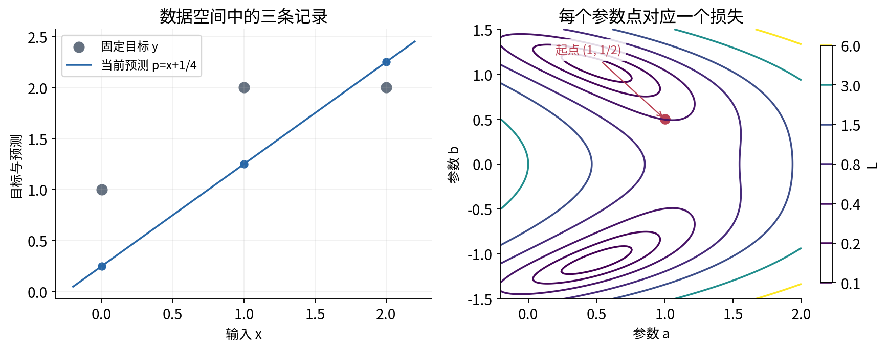

## 二 在同一个参数点建立手算基准

取起点

$$\theta_0=\begin{pmatrix}1\\1/2\end{pmatrix}.$$

此时 $b^2=1/4$，三条预测为 $(1/4,5/4,9/4)^T$，目标为 $(1,2,2)^T$，所以

$$r(\theta_0)=\begin{pmatrix}-3/4\\-3/4\\1/4\end{pmatrix},\qquad L(\theta_0)=\frac13\left(\frac9{16}+\frac9{16}+\frac1{16}\right)=\frac{19}{48}.$$

这一步尚未求导，只是明确当前状态。损失 $19/48$ 是一个标量，不能告诉我们两个参数各应该怎样动。即使损失相同，不同起点的局部变化率也可能不同。

我们在图上用横轴 a、纵轴 b 表示参数平面。某一点对应一整套共同参数，不对应一条数据记录。这个空间和左图中输入 x、输出 p 所在的预测图是不同对象，不要把“沿参数 a 的方向”误认为沿某条样本的横轴移动。

## 三 偏导数只放开一个坐标

在 $(a_0,b_0)$ 附近，若只改变 a 而保持 b 固定，得到一元函数 $a\mapsto L(a,b_0)$。它在 $a_0$ 的导数叫 L 对 a 的偏导数：

$$\frac{\partial L}{\partial a}(a_0,b_0)=\lim_{h\to0}\frac{L(a_0+h,b_0)-L(a_0,b_0)}{h}.$$

类似地，

$$\frac{\partial L}{\partial b}(a_0,b_0)=\lim_{h\to0}\frac{L(a_0,b_0+h)-L(a_0,b_0)}{h}.$$

符号 $\partial$ 提醒我们函数有多个自变量，此次只让其中一个变化。每个偏导数在固定点是一个数；它不同时包含所有方向的变化率。求偏导时，把另一个独立参数当作常量，是在说明这次实验的约束，不是声称它在模型里不重要。[R1]

例如 $p_i=ax_i+b^2$ 中，$\partial p_i/\partial a=x_i$，因为 $x_i$ 固定且 $b^2$ 不随 a 变；$\partial p_i/\partial b=2b$，因为 $ax_i$ 不随 b 变。后一个结果随当前位置 b 改变。在主点 $b=1/2$ 时是1，在 $b=0$ 时是0，在 $b=-1/2$ 时是-1。

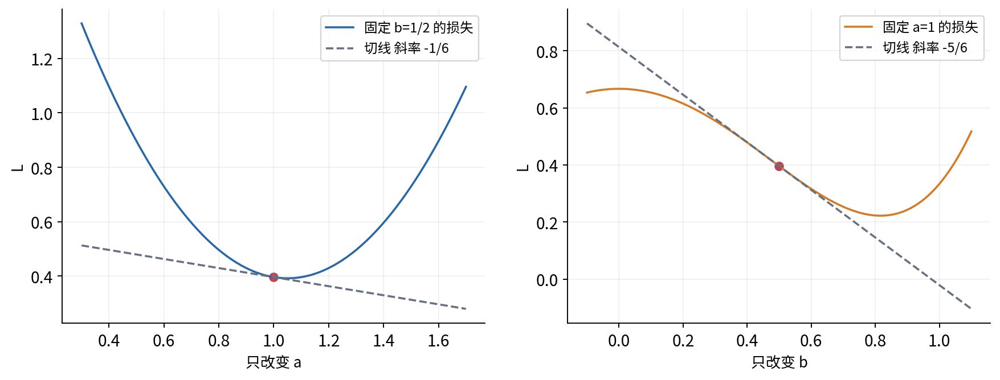

## 四 从增量分别推出两个损失偏导

不要先把整条公式背下来。固定 b，将 a 改为 $a+h$，第 i 个残差变为 $r_i+hx_i$。因此

$$L(a+h,b)-L(a,b)=\frac13\sum_{i=1}^3\left(2h r_ix_i+h^2x_i^2\right).$$

除以非零 h 并取极限，得到

$$\frac{\partial L}{\partial a}=\frac23\sum_{i=1}^3r_ix_i.$$

现在固定 a，将 b 改为 $b+h$。由于 $(b+h)^2-b^2=2bh+h^2$，每个残差都增加同一个数 $q=2bh+h^2$。逐项平方展开并平均：

$$L(a,b+h)-L(a,b)=\frac23q\sum_{i=1}^3r_i+q^2.$$

除以 h 后，第一项变成 $\frac23(2b+h)\sum r_i$；第二项为 $h(2b+h)^2$，随 h 趋零而消失。故

$$\frac{\partial L}{\partial b}=\frac{4b}{3}\sum_{i=1}^3r_i.$$

因子2来自平方误差，因子 $2b$ 来自内层平方，除以3来自平均，而不是求导器凭空选择的常数。

在主点，$\sum r_i=-5/4$，$\sum r_ix_i=0-3/4+2/4=-1/4$。所以

$$L_a(\theta_0)=-\frac16,\qquad L_b(\theta_0)=-\frac56.$$

下标 $L_a,L_b$ 是偏导数的简写。有限步长会留下上述余量；只在极限中得到这两个准确局部系数。

## 五 梯度把偏导按参数次序排列

本课程采用列梯度约定：

$$\nabla_\theta L=\begin{pmatrix}\partial L/\partial a\\\partial L/\partial b\end{pmatrix}.$$

符号 $\nabla$ 读作梯度。它在固定点是一个二维向量，不是当前损失，也不是把两个偏导相加后的一个总斜率。主点梯度为

$$g=\nabla_\theta L(\theta_0)=\begin{pmatrix}-1/6\\-5/6\end{pmatrix}.$$

给出小位移 $\Delta\theta=(\Delta a,\Delta b)^T$，我们希望线性部分为

$$g^T\Delta\theta=L_a\Delta a+L_b\Delta b.$$

左边是1×2乘2×1，输出一个数，正好与损失变化的形状一致。若直接把梯度当标量加到损失上，形状已经不对；若只写 $L_a+L_b$，则暗中选择了速度 $(1,1)^T$，不是任意方向的变化率。

例如 $\Delta a=0.01,\Delta b=-0.02$，线性预测变化为 $-0.01/6+0.10/6=0.015$。虽然两个偏导都负，但这次 b 往负方向移动，而且幅度更大，总变化反而被预测为正。看梯度的符号，必须同时看实际位移。

## 六 全微分要求所有小位移都由同一个线性式控制

偏导只检查坐标轴方向。要合理使用 $g^T\Delta\theta$ 解释同时改变参数，需更强条件。设函数 f 在点 $\theta_0$ 的一个开放邻域有定义。若存在一个固定向量 g，使

$$f(\theta_0+h)=f(\theta_0)+g^Th+R(h),\qquad\frac{|R(h)|}{\|h\|_2}\to0\quad(h\to0,\ h\neq0),$$

就称 f 在该点可微，也称全微分存在。这里 h 是向量，$\|h\|_2$ 是整个改变量的长度。要求覆盖所有足够小的合法 h，而不是先挑几条路径验证。

线性映射 $h\mapsto g^Th$ 叫全导数或微分。常写 $df=g^T d\theta$；$d\theta$ 是交给这张线性映射的位移，df 是线性预测值。实际有限变化 $\Delta f$ 还包含 R，不应把 $df=\Delta f$ 当作一般精确等式。

若可微，沿坐标轴取 $h=t e_j$，其中 $e_j$ 的第 j 个分量为1，其余为0，即得第 j 个偏导数是 $g_j$。因此全导数唯一，而且其系数必然是偏导；反过来，仅有偏导存在尚不足以保证统一线性近似。[R2]

我们的预测器可以直接验证：

$$p_i(a+h_a,b+h_b)-p_i(a,b)=x_i h_a+2b h_b+h_b^2.$$

余量为 $h_b^2$，而 $|h_b|\leq\|h\|_2$，所以 $h_b^2/\|h\|_2\leq\|h\|_2\to0$。这说明每个预测分量都可微。下一节也将对损失本身给出余量控制，而不以“看起来平滑”代替证明。

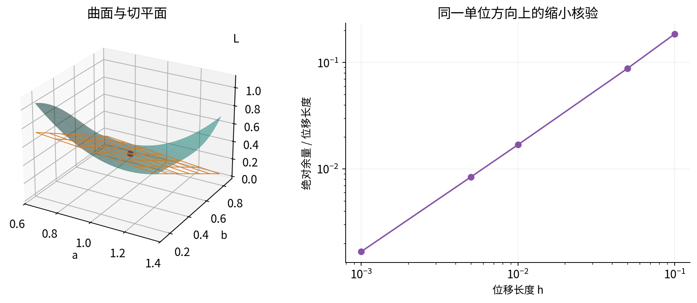

## 七 主模型的局部线性式为何成立

在任意固定参数点，令 $r_i=ax_i+b^2-y_i$。把参数改为 $(a+h_a,b+h_b)$ 后，残差改变量为

$$q_i=x_i h_a+2b h_b+h_b^2.$$

平均平方误差的真实变化是

$$\Delta L=\frac23\sum_i r_i q_i+\frac13\sum_i q_i^2.$$

将第一项中的线性部分分离：

$$\Delta L=L_a h_a+L_b h_b+R(h),\qquad R(h)=\frac23\left(\sum_i r_i\right)h_b^2+\frac13\sum_i q_i^2.$$

令 $t=\|h\|_2$，只考虑 $0<t\leq1$。因为 $|h_a|,|h_b|\leq t$ 且 $h_b^2\leq t^2\leq t$，有

$$|q_i|\leq (|x_i|+2|b|+1)t.$$

于是

$$|R(h)|\leq\left[\frac23\left|\sum_i r_i\right|+\frac13\sum_i(|x_i|+2|b|+1)^2\right]t^2.$$

中括号对固定点和固定数据是一个有限常数 C。因此 $|R(h)|/\|h\|_2\leq Ct\to0$。这个不等式不挑方向，所以确实证明了本模型 L 在每个实参数点可微。它使用代数展开和长度界，没有提前调用二阶 Taylor 定理。

在较一般的计算中，一个常用充分条件是：各一阶偏导在该点某邻域内存在，并在该点连续，则函数在该点可微。这个定理很有用，但“偏导存在”不能替换“偏导在邻域有定义且连续”。本例还提供了独立的直接余量证明，避免把全部可信度寄托于一句性质名称。

## 八 偏导齐全仍可能没有全微分

考虑另一个用于检查定义的函数：

$$f(x,y)=\begin{cases}\dfrac{x^3}{x^2+y^2},&(x,y)\neq(0,0),\\0,&(x,y)=(0,0).\end{cases}$$

它在原点连续，因为 $|f(x,y)|\leq|x|\leq\sqrt{x^2+y^2}\to0$。沿 x 轴，$f(h,0)=h$，故 $f_x(0,0)=1$；沿 y 轴，$f(0,h)=0$，故 $f_y(0,0)=0$。

如果全微分存在，线性部分必为 $h_x$。沿对角线 $(h,h)$，实际函数值为 $h/2$，所以与该线性式的余量为 $-h/2$。除以位移长度 $\sqrt2|h|$，其绝对值恒为 $1/(2\sqrt2)$，不会趋于0。因此它在原点不可微。

这个例子甚至比“两轴检查不够”更强。沿任意非零方向 $d=(d_x,d_y)^T$，

$$\frac{f(td)-f(0)}{t}=\frac{d_x^3}{d_x^2+d_y^2}\qquad(t\neq0).$$

所有这样的方向导数都存在，但它们对方向 d 的依赖不是同一个线性函数。对单位对角方向 $d=(1,1)^T/\sqrt2$，实际导数为 $1/(2\sqrt2)$，而把偏导向量 $(1,0)^T$ 与 d 内积，会得到错误的 $1/\sqrt2$。

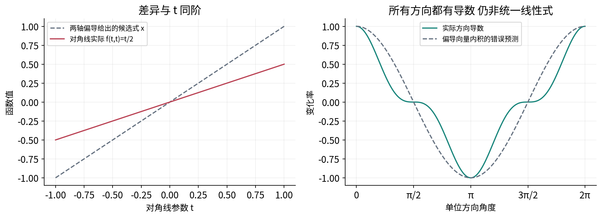

因此后面使用“方向导数等于梯度内积”时，要先确认函数可微，或已满足足够的条件。不能先在不可微点把偏导排成一个向量，再把所有可微函数的几何结论自动贴上去。

## 九 方向导数回答沿给定方向每单位距离怎么变

给定单位向量 d，即 $\|d\|_2=1$，定义

$$D_dL(\theta_0)=\lim_{t\to0}\frac{L(\theta_0+td)-L(\theta_0)}{t},$$

只要这个两侧有限极限存在。t 是沿所选方向的带符号行进距离；d 只负责方向。因此要求单位长度不是装饰，而是让不同方向的速度比较有同一个尺度。

若 L 可微，代入全微分表达式：

$$L(\theta_0+td)-L(\theta_0)=t g^Td+R(td).$$

因为 $\|td\|_2=|t|$，余量除以 t 的绝对值趋零，所以

$$D_dL(\theta_0)=g^Td.$$

主点取 $d=(3/5,4/5)^T$，长度平方为 $9/25+16/25=1$，得到

$$D_dL=-\frac16\frac35-\frac56\frac45=-\frac{23}{30}.$$

因此沿这个单位方向走足够小的正距离，损失会下降。步长0.01时，线性预测变化为 $-23/3000\approx-0.00766667$，实际变化约为 $-0.00749820$。二者接近但不相等。

若直接用向量 v=(3,4)，参数化路径的速度长5，$dL(\theta_0+tv)/dt|_{t=0}=g^Tv=-23/6$。这个数是对路径参数 t 的变化率，是单位方向变化率的5倍。它本身没有算错，错的是把不同速度的数叫作每单位距离的比较。[R4]

## 十 梯度方向 最陡变化与坐标尺度

对非零梯度 g 和单位 d，由内积的 Cauchy–Schwarz 不等式，

$$-\|g\|_2\leq g^Td\leq\|g\|_2.$$

取 $d=g/\|g\|_2$ 达到最大值，取 $d=-g/\|g\|_2$ 达到最小值。所以在当前欧氏长度定义下，正梯度是局部一阶上升最快方向，负梯度是下降最快方向。若 g=0，每个方向的一阶变化率都是0，不能据此判断最小值。

主点 $\|g\|_2=\sqrt{26}/6$，单位下降方向为 $(1,5)^T/\sqrt{26}$。方向 $(5,-1)^T/\sqrt{26}$ 与梯度垂直，内积为0，只表示该方向的一阶项消失，并非有限移动后函数值完全不变。

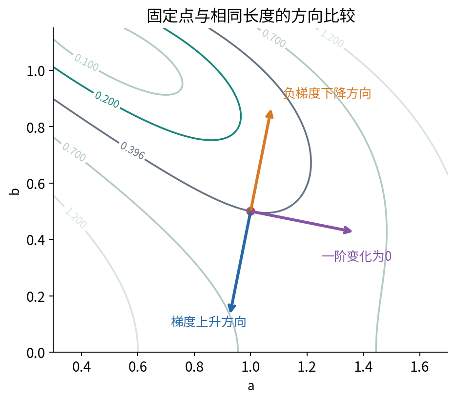

这个“最陡”还依赖坐标尺度。若把第二坐标改记为 $c=100b$，同一函数写成 $\widetilde L(a,c)=L(a,c/100)$，则 $\partial\widetilde L/\partial c=(1/100)L_b$。向量分量和坐标里的欧氏单位球都改变了，不能在未统一单位时比较谁的梯度数值更大就宣布谁更重要。

本讲研究无量纲参数，并固定当前坐标下的欧氏长度。如何选择优化步长、缩放或更一般几何属于后续问题；导数提供局部系数，不替代这些建模决定。

## 十一 多输出函数需要 Jacobian

对一般向量函数 $F:\mathbb R^d\to\mathbb R^m$，F有m个输出分量，输入有d个坐标。若各分量可微，线性近似写为

$$F(\theta+h)=F(\theta)+J_F(\theta)h+R_F(h),\qquad\frac{\|R_F(h)\|_2}{\|h\|_2}\to0.$$

$J_F$ 叫 Jacobian 矩阵，采用“输出为行、输入为列”的约定：

$$(J_F)_{ij}=\frac{\partial F_i}{\partial\theta_j},\qquad J_F\in\mathbb R^{m\times d}.$$

第 j 列表示只改变第 j 个输入时，所有输出的一阶变化；第 i 行表示第 i 个输出对所有输入的偏导。它是整个局部线性映射在坐标中的矩阵，而不是一个额外需要取平均的统计量。有限个分量的余量各自除以位移长度都趋零时，余量向量的欧氏长度除以位移长度也趋零，所以分量可微能组成这一向量可微结论。[R5]

对标量函数 L，输出只有一个，因此 $J_L$ 是1×d行矩阵。在我们采用的列梯度约定下，

$$J_L=(\nabla L)^T.$$

全导数这个线性映射用行矩阵作用于位移；梯度是与它通过欧氏内积对应的列向量。二者含相同分量但方向和角色不同。其他文献可能采用行梯度，但一份推导中不能前后换约定。

Jacobian 矩阵也不等于 Jacobian 行列式。我们的3×2预测 Jacobian 连方阵都不是，不能取普通行列式。这里研究的是变化率映射，不涉及积分换元中的面积或体积系数。

## 十二 把预测 Jacobian 写成可检查的三行两列

对当前模型，

$$J_p(a,b)=\begin{pmatrix}0&2b\\1&2b\\2&2b\end{pmatrix}.$$

第一列是固定输入向量 $(0,1,2)^T$，第二列每个数都是 $2b$，因为共同偏移影响所有记录。在主点

$$J_p(\theta_0)=\begin{pmatrix}0&1\\1&1\\2&1\end{pmatrix}.$$

它的3行是三条预测，2列是参数a和b。损失平均中的1/3还没有出现，因为此处只求预测函数的导数，没有求平均损失。

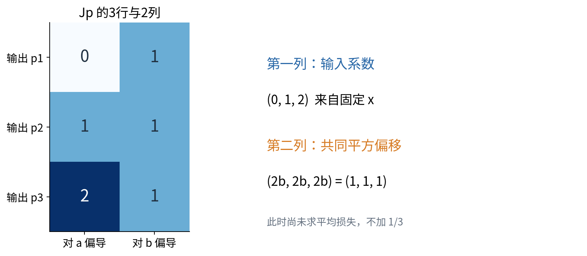

取位移 $h=(0.01,-0.02)^T$，线性预测变化为

$$J_ph=\begin{pmatrix}-0.02\\-0.01\\0\end{pmatrix}.$$

实际变化还要为每一行加上 $h_b^2=0.0004$，所以为 $(-0.0196,-0.0096,0.0004)^T$。第三个预测的一阶项为0，实际有限变化仍非零。这是局部线性与精确变化之间最直接的三项核对。

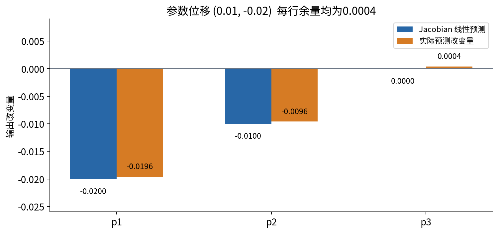

## 十三 先区分坐标偏导与路径上的总变化率

假设参数同时随一个新变量 t 变化：$a=a(t)$、$b=b(t)$。外层L仍是二元函数，沿路径的复合函数则为一元函数 $\ell(t)=L(a(t),b(t))$。在L可微、路径在该点可导且复合附近有定义时，

$$\ell'(t)=L_a(a(t),b(t))a'(t)+L_b(a(t),b(t))b'(t).$$

例如 $a(t)=1+t$、$b(t)=1/2-2t$。在t=0，速度为$(1,-2)^T$，所以 $\ell'(0)=-1/6+10/6=3/2$。这里L对a的偏导仍是-1/6；3/2是沿整条指定路径的总变化率。不能把二者都含糊称为“对a求导”。

如果b本来就是a的函数，例如$b=2a$，那么沿这一约束关系求$L(a,2a)$的一元导数要包含$b$路径：$dL(a,2a)/da=L_a+2L_b$，并在$(a,2a)$处求值。把b当常量得到的是另一个问题的偏导。

这也解释了图5的等值线关系：若一条可导路径上L保持常值，则沿路径的导数为0，所以 $g^T\theta'(t)=0$。当切向速度非零时，它与梯度垂直；这里说的是当前位置的切向，不是整条曲线必须是一条直线。

路径公式本质上是1×2的$J_L$乘2×1的路径速度。这为一般多元链式法则提供了第一个尺寸清楚的例子。

## 十四 多元链式法则就是局部线性映射复合

设 $F:\mathbb R^d\to\mathbb R^m$，$G:\mathbb R^m\to\mathbb R^q$。要求F在$\theta_0$可微，G在$z_0=F(\theta_0)$可微，并且附近的复合$G(F(\theta))$有定义。则

$$J_{G\circ F}(\theta_0)=J_G(F(\theta_0))J_F(\theta_0).$$

维度是 $(q\times m)(m\times d)=q\times d$。矩阵乘法的次序对应实际计算：输入位移先经内层$J_F$，再经外层$J_G$。外层矩阵还必须在内层输出$F(\theta_0)$处求值，不能随便在原参数点取值。[R3，R5]

本节向量范数均指欧氏长度。下面从余量说明为什么这个公式合法，而不是把偏导符号当成普通分数约掉。记 $A=J_F(\theta_0)$、$B=J_G(z_0)$，有

$$F(\theta_0+h)-F(\theta_0)=Ah+r_F(h)=k,$$

$$G(z_0+k)-G(z_0)=Bk+r_G(k).$$

代入第一式后得到

$$G(F(\theta_0+h))-G(F(\theta_0))=BAh+B r_F(h)+r_G(k).$$

关键是后两项除以$\|h\|$后都趋零。固定有限矩阵B总存在常数$C_B$使$\|Bv\|\leq C_B\|v\|$：对每行使用内积不等式再将平方相加，便可取 $C_B=\sqrt{\sum_{i,j}B_{ij}^2}$。于是$\|B r_F(h)\|/\|h\|\to0$。

同时，F可微保证$\|k\|/\|h\|$在足够近处有有限上界，因为$k=Ah+r_F(h)$。当$k\neq0$时，

$$\frac{\|r_G(k)\|}{\|h\|}=\frac{\|r_G(k)\|}{\|k\|}\frac{\|k\|}{\|h\|}\to0.$$

当$k=0$时，外层余量$r_G(0)=0$，该项本来就是零，无需除以$\|k\|$。因此余量符合可微定义，主线性映射就是BA。这个证明也适用于内层导数为零的情形，不需要假设每次中间变量都有非零增量。

图中最右下角的1只是损失对自身的导数 $\partial L/\partial L=1$。从这个恒等关系逐次使用已证明的链式法则，就能整理出其他变量的敏感度；这里没有假设额外的自动求导算法。

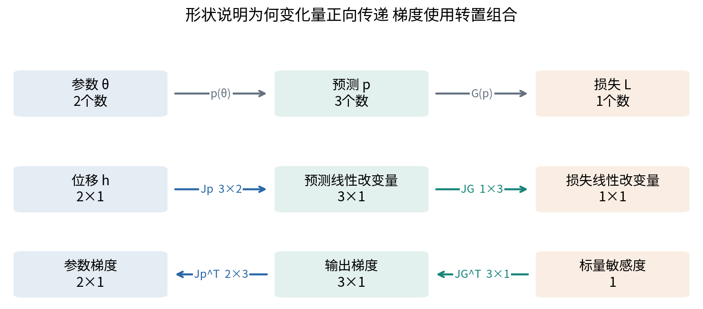

## 十五 用分量把求和路径看出来

当外层是标量函数 $G(z_1,\ldots,z_m)$，内层各输出为$F_i(\theta)$时，固定第j个参数，有

$$\frac{\partial(G\circ F)}{\partial\theta_j}=\sum_{i=1}^m\frac{\partial G}{\partial z_i}\frac{\partial F_i}{\partial\theta_j}.$$

每一项都对应从参数$\theta_j$经过一个中间分量$z_i$再到输出的路径。沿一条路径变化率相乘，存在多条路径时贡献相加。这里加的是带符号贡献，抵消可能完全合法。

这正是矩阵乘法第j列的展开，而不是另一个独立规则。若只挑一条“看上去最直接”的路径，通常会漏项；若同一个共享中间量在两处使用，还必须收集它两处使用产生的贡献。

对我们的损失，外层写成 $G(p)=\frac13\sum_i(p_i-y_i)^2$，其列梯度为

$$\nabla_p G=\frac23(p-y).$$

因而

$$\nabla_\theta L=J_p^T\nabla_pG.$$

为什么是$J_p^T$？标量链式法则先给行矩阵$J_L=J_GJ_p$，两边转置，得到$\nabla_\theta L=J_p^T\nabla_pG$。或者从$\Delta L\approx(\nabla_pG)^T\Delta p$与$\Delta p\approx J_p\Delta\theta$出发，整理成$\Delta L\approx(J_p^T\nabla_pG)^T\Delta\theta$。两条解释都无需求逆。

## 十六 逐项算出 J 转置乘输出梯度

主点的输出梯度为

$$\nabla_pG=\frac23\begin{pmatrix}-3/4\\-3/4\\1/4\end{pmatrix}=\begin{pmatrix}-1/2\\-1/2\\1/6\end{pmatrix}.$$

它是3×1，因为现在关注的是三个预测分量各自变化时，损失怎样响应。再乘2×3的$J_p^T$：

$$\nabla_\theta L=\begin{pmatrix}0&1&2\\1&1&1\end{pmatrix}\begin{pmatrix}-1/2\\-1/2\\1/6\end{pmatrix}=\begin{pmatrix}0-1/2+2/6\\-1/2-1/2+1/6\end{pmatrix}=\begin{pmatrix}-1/6\\-5/6\end{pmatrix}.$$

第一行收集每条预测经过比例参数a的贡献；第二行收集每条预测经过共同偏移参数b的贡献。第二行各系数恰好都是1，只因为主点$2b=1$。如果换到$b=0$，第二行会全为0，但输出残差未必为0。

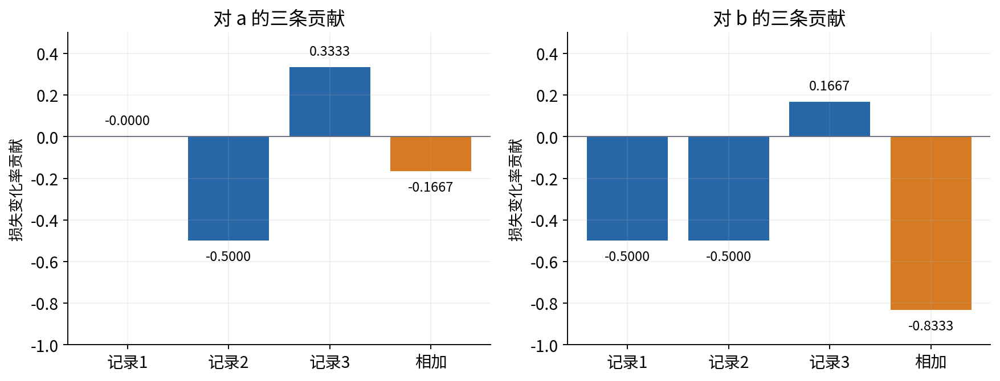

梯度是损失在当前坐标下的一阶系数，不是每条样本各配一个独立参数。输出梯度与参数梯度长度不同，是正常的；错误地要求二者长度相同，会破坏整条形状链。

## 十七 用独立代数展开再次核对

仅把同一个链式公式复制成两段代码，不能算强独立核验。我们把损失完全展开：

$$L(a,b)=\frac53a^2+2ab^2-4a+b^4-\frac{10}{3}b^2+3.$$

各项来源可逐条检查：三个$a^2$系数之和为$0^2+1^2+2^2=5$再除以3；交叉项$2ab^2$来自$2a b^2(0+1+2)/3$；线性a项来自$-2a(0\cdot1+1\cdot2+2\cdot2)/3=-4a$；目标平方平均为$(1+4+4)/3=3$。

按一元规则逐项求偏导：

$$L_a=\frac{10}{3}a+2b^2-4,$$

$$L_b=4ab+4b^3-\frac{20}{3}b.$$

代入$(1,1/2)$得到$-1/6$与$-5/6$，和增量推导及$J_p^T\nabla_pG$完全一致。配套程序将这三条解析路线分开实现，再与只调用损失值的有限差分比较。三者不是逻辑上互不相关的定理，但独立表达能帮助发现漏因子、错平均或转置错误。

## 十八 共享节点的分支不能少算一次

再看一个刻意有分支的小标量计算：

$$s=a+b,\qquad t=a-b,\qquad z=s^2+st.$$

s被使用了两次，一次进入平方，一次进入乘积；a和b又都通过s与t影响z。因此计算图不是单链。将外层看成两个中间量的函数$K(s,t)=s^2+st$，在s与t暂作独立坐标时，$K_s=2s+t$，$K_t=s$。

内层 Jacobian 是

$$J_{(s,t)}=\begin{pmatrix}1&1\\1&-1\end{pmatrix}.$$

所以外层行导数乘内层矩阵：

$$J_z=\begin{pmatrix}2s+t&s\end{pmatrix}\begin{pmatrix}1&1\\1&-1\end{pmatrix}=\begin{pmatrix}3s+t&s+t\end{pmatrix}.$$

主点$a=1,b=1/2$给出$s=3/2,t=1/2$，因而$z=3$、$\nabla z=(5,2)^T$。

若按完整路径逐条数，对a的三条贡献是：a到s再到平方给$2s=3$；a到s再到乘积给$t=1/2$；a到t再到乘积给$s=3/2$。相加为5。对b，前两条同样为3和1/2，第三条因为$\partial t/\partial b=-1$而给$-3/2$，相加为2。

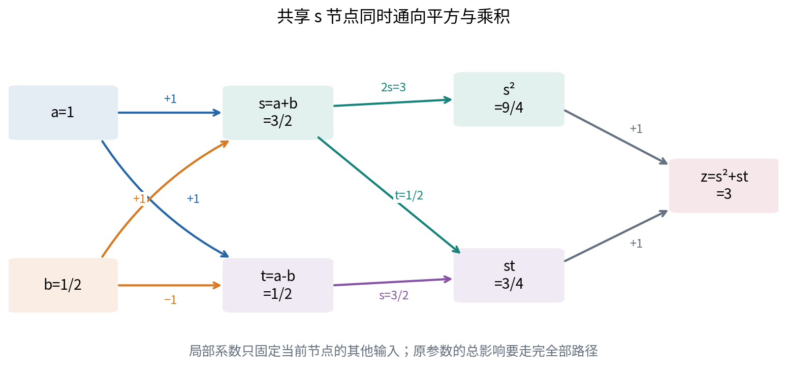

直接展开$z=(a+b)^2+(a+b)(a-b)=2a^2+2ab$，可再得到$z_a=4a+2b$、$z_b=2a$。若只留下s的平方路径，就会错得很稳定，甚至可以把错误公式写成运行无异常的代码。

这里是在手工组织链式法则，不默认你已经学会任何自动微分框架。之后学习计算图求导时，仍需依靠本节的求和、乘积、求值点和形状约定判断结果。

## 十九 定义域与可微条件必须沿整个复合检查

主模型是多项式，数学定义域为整个$\mathbb R^2$。这让我们能够在每个有限参数点从所有足够近方向考虑变化；程序浮点范围有限，是另一层数值限制。

若改成$H(a,b)=\ln(a-b^2)$，就必须先要求

$$D=\{(a,b):a>b^2\}.$$

在这个开放区域中，内层z=$a-b^2$为正，外层实对数可导，所以

$$\nabla H=\begin{pmatrix}1/z\\-2b/z\end{pmatrix}.$$

例如$(2,1/2)$给出z=7/4，梯度为$(4/7,-4/7)^T$。边界$a=b^2$处，对数没有定义，不能只把分母写成0然后继续谈该点梯度。

差分采样也必须留在定义域内。点$(0.26,0.5)$合法，因为z=0.01；但沿a使用步长0.1的中心差分会采到a=0.16，内层为负，不能把此处报错当成解析梯度错误。

链式法则给出充分条件，不是所有复合函数可微的必要条件。例如外层绝对值在0不可导，内层$a^2+b^2$处处非负，复合$|a^2+b^2|=a^2+b^2$却在原点可微。条件失败时需要重新分析原函数，不能盲套链式公式，也不能直接断言复合必不可微。

## 二十 梯度为零与一次移动的有限效果

在$\theta_*=(6/5,0)^T$，主模型两个偏导都为0。但这不是损失最小点。只改变b为一个小数t，有

$$L(6/5,t)-L(6/5,0)=t^4-\frac{14}{15}t^2,$$

对足够小的非零t为负。只改变a为$6/5+t$、保持b=0，则

$$L(6/5+t,0)-L(6/5,0)=\frac53t^2>0.$$

同一点附近有上升和下降方向；一阶项全部为0，只说明一阶近似暂时看不见这些差异。程序在t=0.1时得到起点损失0.6，改变b后的损失约0.59076667，改变a后的损失约0.61666667。这个判断来自精确多项式差，不需要先学二阶导数判别法。

同样，当梯度非零时，负梯度只保证充分小的正向步长存在下降趋势。它没有给出“任意步长均下降”的承诺。第十五讲将研究更高阶局部变化，后面的优化课程再讨论怎样选择步长。本讲先把局部一阶结论的边界说清楚。

## 二十一 有限差分怎样核对多元公式

对第j个参数，令$e_j$为相应坐标单位向量，中心差分为

$$\widehat g_j(h)=\frac{L(\theta+h e_j)-L(\theta-h e_j)}{2h},\qquad h>0.$$

每次只扰动一个坐标，其他坐标保持不变，依次组成梯度估计。若输出是向量p，使用同样两次调用后得到一整列：

$$\widehat J_{:,j}(h)=\frac{p(\theta+h e_j)-p(\theta-h e_j)}{2h}.$$

冒号表示取所有输出行。若把这些结果误按行堆叠，会得到转置后的形状。使用3个输出、2个参数而不是全是2的正方形例子，能让形状错误更容易暴露。

还可以沿单位方向d做一次方向差分，比较$[L(\theta+hd)-L(\theta-hd)]/(2h)$和$g^Td$。它能核对梯度对组合方向的预测，但单个方向仍不能检验所有分量。若错误向量恰好与d正交，这一次投影就可能看不见错误。

本实验在25个固定参数点分别比较求和梯度、展开梯度、链式梯度、损失中心差分，以及预测 Jacobian 的逐列差分；不使用随机数。通过意味着实现与已知解析例子一致，不构成对所有实参数的证明。

## 二十二 步长不是越小越可信

本例沿a的损失是二次式，精确实数中心差分恰好等于$L_a$；沿b的损失含$b^4$，中心差分的精确误差为$4bh^2$。在$b=1/2$时等于$2h^2$。这个事实来自将$(b+h)^4$和$(b-h)^4$相减后的直接展开，不需要预先知道一般高阶误差公式。

沿主例单位方向$d=(3/5,4/5)^T$，将整条一元路径的多项式展开后，中心差分与方向导数之差精确为$(224/125)h^2$。`Fraction` 单元在h=1/100时核查这一等式；浮点差分还会叠加表示和消减误差。

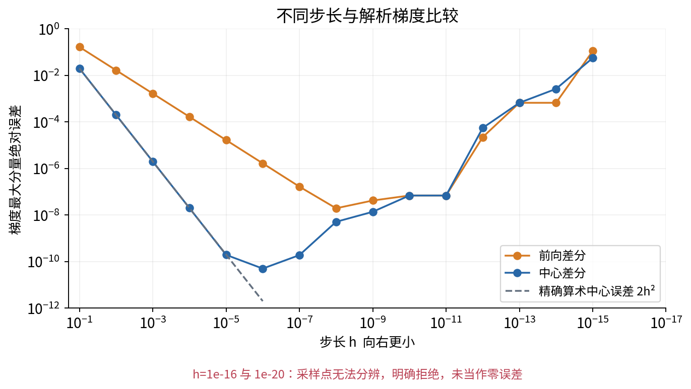

实际NumPy 2.3.5运行中，主点中心差分最大分量误差在h=$10^{-2}$时约$2\times10^{-4}$，在h=$10^{-6}$时约$5.01\times10^{-11}$，在h=$10^{-12}$时约$5.56\times10^{-5}$。再缩至$10^{-16}$，至少一个参数的加法不再产生可辨认的新浮点点，程序明确拒绝。

这些误差数值是当前环境与当前例子的观测，不能当作任何函数的最佳步长表。代码同时记录名义h和实际浮点采样位移，避免误把“写了h”当成“计算机真的移动了h”。差分核查应看一段合理步长区间的相符情况，也要独立检查定义域与可微性。

## 二十三 从数学列向量到 NumPy 数组

数学中我们将梯度写成2×1列向量。程序遵循前面数组课程的简洁约定，单向量储存为一维数组，梯度形状为`(2,)`，预测和输出梯度为`(3,)`，Jacobian为`(3,2)`。一维数组没有独立的行轴与列轴，`g.T`仍是`(2,)`，不能把它当成显示的1×2行矩阵。

因此常用代码 `J.T @ output_gradient` 返回`(2,)`，而显式列形式 `J.T @ output_gradient[:, None]` 返回`(2,1)`。两者的两个数应一致，但尺寸契约不同。[R6] 先说明约定，再使用省略，不要让NumPy的维度提升规则替你决定数学含义。

广播是另一个陷阱。如果预测p为`(3,)`，目标y误写成`(3,1)`，`p-y`会产生3×3结果，每条预测与每条目标都配了一次，而不是三个逐记录残差。本实验在计算前严格拒绝这种形状，不用`squeeze`无条件压缩来隐藏错误。单样本N=1仍保持预测`(1,)`和Jacobian`(1,2)`，不能意外掉成标量。

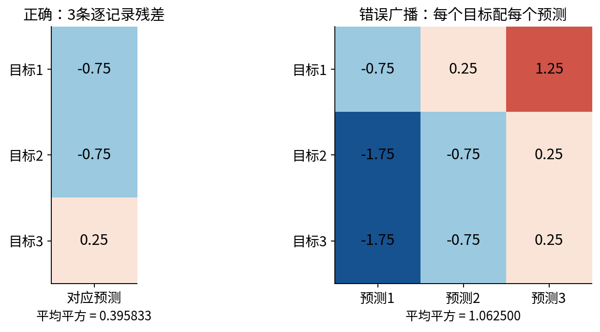

核心接口在转成浮点数前检查原始叶子，拒绝布尔值、数字字符串、复数和object数组，混合Python列表也检查。CSV读取是显式文本解析边界，允许把数值字段解析为实数；它与数学函数偷偷接受任何字符串是不同的接口约定。

差分数值比较采用公开的绝对与相对容差，且先比较形状。NumPy的`allclose`比较约为$|\widehat g_j-g_j|\leq\mathrm{atol}+\mathrm{rtol}|g_j|$，在零附近绝对容差尤其重要；它还允许广播，所以只能作为数值检查的一部分。[R7]

## 二十四 一份可复核的多元导数说明

看到一个新模型，不必立刻寻找整页矩阵求导表。先列出真正自变量、固定数据、每个中间输出的形状，以及可用定义域。然后识别一阶局部映射：标量输出的列梯度、向量输出的Jacobian、单条路径的速度，分别对应不同对象。

写复合公式时要回答四个具体问题：外层导数在哪个中间值求值？每条从参数到输出的路径是否都被计入？输入列与输出行的乘法是否对齐？当前点是否满足全微分和定义域条件？这些问题比看到代码能执行就放心更有帮助。

本讲主例以同一组分数贯穿：损失19/48，梯度$(-1/6,-5/6)^T$，预测Jacobian为3×2，沿单位方向$(3/5,4/5)^T$的变化率为-23/30。分支例用三条路径得到梯度$(5,2)^T$；反例则提醒我们，坐标偏导和所有方向导数的存在仍可能缺少统一线性近似。

配套实验让精确分数、独立代数表达与浮点差分相互核对，并保留失败条件。完成后，你应能从一个小计算图独立写出正确形状的变化率，解释每个乘法与求和为何存在，而不是只抄一个名叫gradient的输出。

## 参考与核验

核查日期为2026年10月4日。以下一手作者教材和官方文档用于核验定义、条件、矩阵方向与接口，正文推导安排、数据与图为原创。参考材料中的例题未被复制。

- [R1 OpenStax，Calculus Volume 3，4.3 Partial Derivatives](https://openstax.org/books/calculus-volume-3/pages/4-3-partial-derivatives)

- [R2 OpenStax，同书4.4 Tangent Planes and Linear Approximations，核验全微分余量定义与连续偏导的充分条件](https://openstax.org/books/calculus-volume-3/pages/4-4-tangent-planes-and-linear-approximations)

- [R3 OpenStax，同书4.5 The Chain Rule，核验复合的可微条件与多路径求和](https://openstax.org/books/calculus-volume-3/pages/4-5-the-chain-rule)

- [R4 OpenStax，同书4.6 Directional Derivatives and the Gradient，核验单位方向与梯度内积](https://openstax.org/books/calculus-volume-3/pages/4-6-directional-derivatives-and-the-gradient)

- [R5 Bjorn Poonen，MIT 18.02 Lecture Notes，2021，8.4至8.5及10.2节，核验输出为行的全导数矩阵与一般链式次序](https://math.mit.edu/~poonen/02/notes.pdf)

- [R6 NumPy 2.3，`numpy.matmul`，核验矩阵与一维数组乘法形状](https://numpy.org/doc/2.3/reference/generated/numpy.matmul.html)

- [R7 NumPy 2.3，`numpy.allclose`，核验容差表达、参考值方向与广播条件](https://numpy.org/doc/2.3/reference/generated/numpy.allclose.html)
