# 曲率与局部近似

## 第十五讲 斜率相同的地方 为什么优化难度仍可能不同

梯度说明当前位置往哪里走会最先下降，但没有说明坡度随后变化得多快。两处的函数值与梯度可以完全相同，同样长的一步却可能在一处降低损失、在另一处升高损失。本讲要补上的信息是二阶变化：用 Hessian 描述梯度怎样改变，用二次型读出方向曲率，再用有余项的 Taylor 展开判断这些信息能支持多大的结论。

直接先修是第十二讲的特征值、特征向量与对称矩阵，以及第十四讲的多元导数、Jacobian 和链式法则。正文会重新说明需要的符号，但不会重新证明实对称矩阵的谱定理。全篇先讨论开放定义域内的无约束问题；边界与约束会改变极值判据。

我们继续使用第十四讲的三条无量纲合成记录和同一预测模型。它们足够让每个导数、驻点与余项都能独立核查。小实验只演示数学机制，不评价任何真实任务的预测能力，也不以曲面图代替证明。

## 一 相同切线容许不同的下一步

先看两个一元函数，参数 $\lambda>0$ 决定弯曲程度：

$$q_\lambda(t)=t+\frac{\lambda}{2}t^2.$$

无论 $\lambda$ 是1还是12，都有 $q_\lambda(0)=0$、$q_\lambda'(0)=1$。在原点向负方向动，最初的变化率都为负。如果直接取相同位移 $t=-1/4$，结果却是

$$q_1(-1/4)=-\frac7{32}=-0.21875,\qquad q_{12}(-1/4)=\frac18=0.125.$$

原因不是梯度算错了。共同的线性项都是 $-1/4$；二次项分别为 $1/32$ 与 $3/8$，后者足以抵消下降。对于这个精确二次函数，负向步长 $t=-\alpha$ 能降低原点值，当且仅当 $0<\alpha<2/\lambda$。曲率越大，可容许的一步越短。

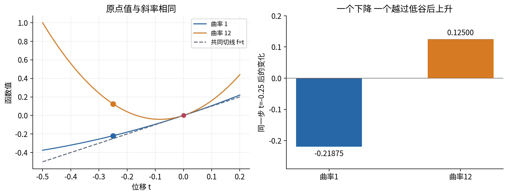

本讲说的“方向曲率”是沿指定坐标和单位方向的二阶导数。它并非把曲线当几何对象后计算的另一种曲率公式。若更换参数单位，数值和“相同步长”的含义都会改变，比较时须固定坐标尺度。

## 二 固定数据和当前点

固定输入 $x=(0,1,2)^T$，目标 $y=(1,2,2)^T$，记录总数 $N=3$。预测、残差与损失仍是

$$p_i(a,b)=ax_i+b^2,\qquad r_i=p_i-y_i,\qquad L(a,b)=\frac13\sum_{i=1}^3r_i^2.$$

参数列向量 $\theta=(a,b)^T\in\mathbb R^2$，损失 $L:\mathbb R^2\to\mathbb R$。对参数求导时，输入、目标与记录数全部保持不变。平方偏移使 b 与 $-b$ 给出同一预测，且共同偏移不能为负。

在主点 $\theta_0=(1,1/2)^T$，前讲已算出

$$r=(-3/4,-3/4,1/4)^T,\qquad L_0=\frac{19}{48},\qquad g=\nabla L(\theta_0)=\begin{pmatrix}-1/6\\-5/6\end{pmatrix}.$$

本讲会重新核算这些数，而不把旧答案当作不可检查的输入。将损失完全展开，可得到另一条独立路径：

$$L(a,b)=\frac53a^2+2ab^2-4a+b^4-\frac{10}{3}b^2+3.$$

这不是任意数据的通用公式。系数 $5/3$ 来自三条输入平方的平均，其他系数也依赖固定记录。若更改 CSV，就必须重推展开式和所有已知答案。

## 三 从一阶近似到二阶近似

令 h 为从当前位置出发的参数位移，不是新参数本身。先定义一阶 Taylor 多项式

$$P_1(h)=f(\theta_0)+g^Th.$$

“多项式”是指关于位移 h 的表达式。它在 $h=0$ 处与原函数有相同值与相同一阶导数。若 f 在 $\theta_0$ 可微，则

$$f(\theta_0+h)=P_1(h)+R_1(h),\qquad \frac{|R_1(h)|}{\|h\|_2}\to0.$$

余项 $R_1$ 是实际值减去近似值。记号 $R_1=o(\|h\|_2)$ 表示余项除以位移长度趋零，不表示任何有限位移上的余项恰为零。也不能把这一阶条件自行加强为二次误差界。

二阶 Taylor 多项式增加一项：

$$P_2(h)=f(\theta_0)+g^Th+\frac12h^THh.$$

这里 H 是在同一个中心点计算的 Hessian。二阶多项式还与原函数共享该点的二阶导数。图2把两种近似放到同一条直线路径上：小范围内二阶项补上了切线遗漏的弯曲，远处高阶项仍能占据主要部分。

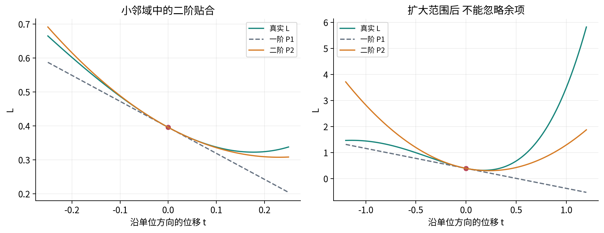

## 四 Hessian 是梯度的局部变化矩阵

对标量函数 $f:\mathbb R^d\to\mathbb R$，采用列梯度约定。Hessian 定义为梯度映射的 Jacobian：

$$H_f(\theta)=J_{\nabla f}(\theta),\qquad (H_f)_{ij}=\frac{\partial}{\partial\theta_j}\left(\frac{\partial f}{\partial\theta_i}\right).$$

行 i 对应哪个梯度分量，列 j 对应改变哪个参数。H 的形状是 $d\times d$；g 与 h 都是 $d\times1$；$g^Th$ 与 $h^THh$ 都是标量。H 不是逐元素平方的梯度，也不是单个二阶导数。

若梯度映射在该点可微，则

$$\nabla f(\theta_0+h)=\nabla f(\theta_0)+H_f(\theta_0)h+o(\|h\|_2).$$

这使 H 有可操作的含义：它把一个小参数位移映射成梯度变化的线性预测。H 的对角项检查同一坐标的坡度变化，非对角项检查“改变一个参数会怎样改变另一个参数的坡度”。

本讲采用一个清楚的充分条件：f 在中心的开放邻域内属于 $C^2$，即一阶和二阶偏导数都存在且连续。此时混合偏导相等，$H=H^T$。不能只知道某一点的混合偏导存在，就自动断言可交换求导顺序。

为什么连续性能够给出对称性？考虑一个小坐标矩形四角值的交错和。先沿第一坐标作差、再沿第二坐标作差，用两次一元中值定理，可把“交错和除以两边长之积”写成矩形内某点的一个混合偏导；反过来作差得到另一混合偏导。两种顺序的交错和本来相同。当矩形缩向中心，连续性保证两个中间点的导数分别趋向中心的两个混合偏导，因此它们相等。这是混合偏导交换定理的证明思路；完整高阶推广见[R1]。

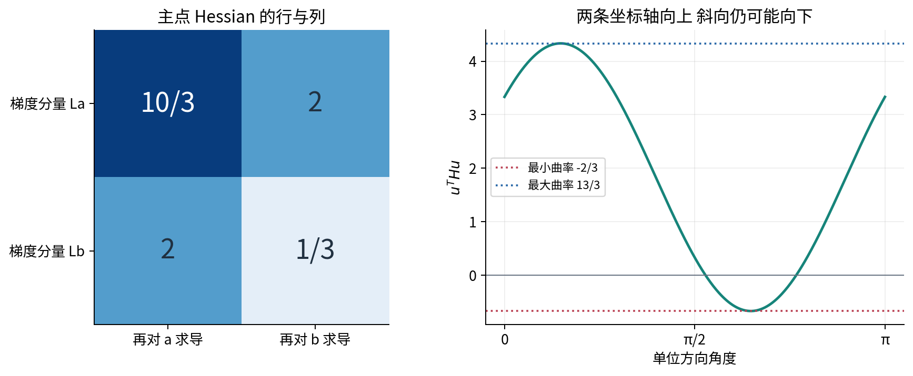

## 五 一步一步算出主模型的 Hessian

前讲给出的两个一阶分量为

$$L_a=\frac23\sum_i r_ix_i,\qquad L_b=\frac{4b}{3}\sum_i r_i.$$

再次求导时，残差仍依赖参数。因为 $\partial r_i/\partial a=x_i$、$\partial r_i/\partial b=2b$，得到

$$L_{aa}=\frac23\sum_i x_i^2,\qquad L_{ab}=L_{ba}=\frac{4b}{3}\sum_i x_i.$$

对于 $L_{bb}$，外面的 b 与里面的残差都要用乘积法则：

$$L_{bb}=\frac43\sum_i r_i+\frac{4b}{3}\sum_i2b=\frac43\sum_i r_i+8b^2.$$

固定三条数据后，可写成

$$H_L(a,b)=\begin{pmatrix}10/3&4b\\4b&4a+12b^2-20/3\end{pmatrix}.$$

在 $\theta_0$，$\sum r_i=-5/4$，故

$$H_0=\begin{pmatrix}10/3&2\\2&1/3\end{pmatrix}.$$

这里最容易漏掉的不是复杂技巧，而是 $L_b$ 中残差对 b 的依赖。只对外面的 b 求导会漏 $8b^2$；只对残差求导又会漏 $\frac43\sum r_i$。

还可以把结果拆成两部分。记 $J_p$ 为 $3\times2$ 的预测 Jacobian。对 $g=\frac23J_p^Tr$ 再求导可得

$$H_L=\frac23J_p^TJ_p+\frac23\sum_i r_i H_{p_i}.$$

第一项半正定，因为任意 h 满足 $h^TJ_p^TJ_ph=\|J_ph\|_2^2\ge0$。第二项保留预测模型本身的二阶变化，可能产生负曲率。主点两项分别为

$$\frac23J_p^TJ_p=\begin{pmatrix}10/3&2\\2&2\end{pmatrix},\qquad \frac23\sum_i r_iH_{p_i}=\begin{pmatrix}0&0\\0&-5/3\end{pmatrix}.$$

若静默删除第二项，就改变了 Hessian。非负损失函数完全可能在某些位置具有负方向曲率；“函数值非负”与“Hessian 半正定”是不同的陈述。

## 六 二次型把矩阵变成方向信息

对称矩阵 H 与向量 h 给出二次型 $h^THh$。二维时令 $h=(h_a,h_b)^T$，直接乘开：

$$h^THh=H_{aa}h_a^2+2H_{ab}h_ah_b+H_{bb}h_b^2.$$

交叉项出现两次，因为矩阵乘法同时包含 $H_{ab}h_ah_b$ 和 $H_{ba}h_bh_a$。Taylor 式外面的 $1/2$ 把它们合并成一个 $H_{ab}h_ah_b$。若忘掉 $1/2$，所有二阶修正都会扩大一倍。

给定单位方向 $\|u\|_2=1$，定义直线路径 $\phi(t)=f(\theta_0+tu)$。连续使用链式法则：

$$\phi'(0)=g^Tu,\qquad \phi''(0)=u^THu.$$

因此 $u^THu$ 就是沿 u 每单位距离的二阶变化率，沿该路径的二次项为 $\frac12t^2u^THu$。u 不归一化时，改变的不只是方向，还有移动速度；若改用 $2u$，二阶系数扩大4倍。

这条公式使用直线路径。如果参数沿弯曲路径 $\theta(t)$ 移动，再求一次导数还会出现 $g^T\theta''(t)$。本讲所有方向扫描都固定为直线，不能把结论直接套到任意弯曲轨迹上。

## 七 特征方向揭示椭圆和狭长谷地

由第十二讲的实对称矩阵谱定理，$H=Q\Lambda Q^T$，其中 $Q^TQ=I$，$\Lambda$ 的对角元为实特征值 $\lambda_j$。令 $z=Q^Th$，便有

$$h^THh=z^T\Lambda z=\sum_{j=1}^d\lambda_jz_j^2.$$

变换到特征坐标后，交叉项消失。每个特征向量都是一个独立弯曲方向，对应特征值就是该单位方向的二阶变化率。谱定理在这里作为先修结果使用，不从“画起来像椭圆”反推它。

若所有特征值都正，称 H 正定；都负则称负定；既有正数又有负数则称不定；全非负为半正定，全非正为半负定。零矩阵同时半正定与半负定，但并不正定或负定。对于单位 u，把 u 展开到特征基得到权重平方和为1，因此

$$\lambda_{\min}\le u^THu\le\lambda_{\max}.$$

考虑一个独立的精确二次例子 $q(h)=\frac12h^TAh$，A 的特征值为1与16，特征轴相对原坐标旋转30度。在特征坐标内，$q=\frac12(z_1^2+16z_2^2)$。等高线 $q=c>0$ 满足

$$\frac{z_1^2}{2c}+\frac{z_2^2}{2c/16}=1.$$

两个半轴分别是 $\sqrt{2c}$ 与 $\sqrt{2c/16}$，长短轴比为4，不是16。后者是正定二次型的最大最小特征值比 $\kappa=16$。这个比值描述各向异性，不能直接当作迭代次数或运行秒数。

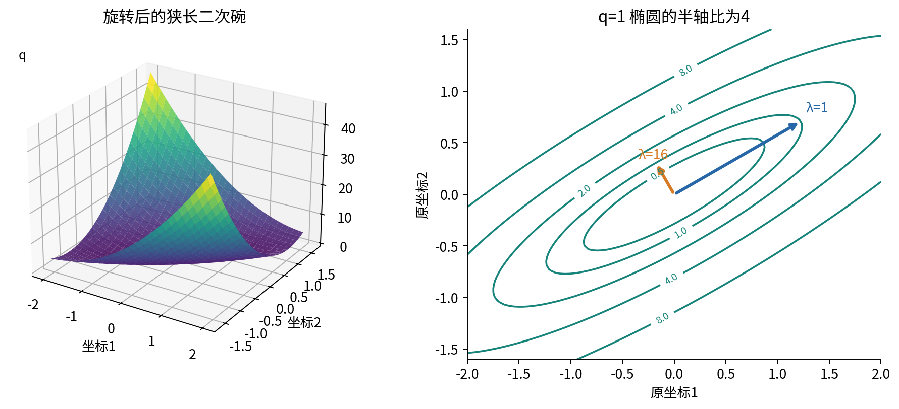

## 八 二阶展开为什么成立

现在把公式的条件与余项补齐。设 f 在 $\theta_0$ 的开放邻域为 $C^2$，取 h 足够小，使整条线段 $\theta_0+th$、$0\le t\le1$ 留在邻域内。定义 $\psi(t)=f(\theta_0+th)$，注意此处 t 走到1，而 h 已包含全部位移。

链式法则给出

$$\psi'(0)=g^Th,\qquad \psi''(t)=h^TH_f(\theta_0+th)h.$$

我们只需一个一元结果：对 $C^2$ 的 $\psi$，存在 $\xi\in(0,1)$，使

$$\psi(1)=\psi(0)+\psi'(0)+\frac12\psi''(\xi).$$

这个中间点的存在可用 Rolle 定理证明。令 $A=\psi(1)-\psi(0)-\psi'(0)$，构造 $F(t)=\psi(t)-\psi(0)-t\psi'(0)-At^2$。有 $F(0)=F(1)=0$ 且 $F'(0)=0$。第一次应用 Rolle 定理得到某个 $c\in(0,1)$ 满足 $F'(c)=0$，第二次在 $[0,c]$ 应用得到 $F''(\xi)=0$，从而 $A=\psi''(\xi)/2$。Rolle 定理本身是本段接受的一元基础定理；这里不偷偷引入尚未建立的积分公式。[R2]

代回并加减 $\frac12h^TH_f(\theta_0)h$，得到

$$f(\theta_0+h)=f(\theta_0)+g^Th+\frac12h^TH_f(\theta_0)h+R_2(h),$$

$$R_2(h)=\frac12h^T\left[H_f(\theta_0+\xi h)-H_f(\theta_0)\right]h.$$

这里 $\xi$ 依赖 h，不是可以随意设成1/2的固定点。设 $\|B\|_{\mathrm{op}}=\max_{\|v\|_2=1}\|Bv\|_2$ 为算子范数，则由内积不等式

$$|R_2(h)|\le\frac12\|h\|_2^2\,\|H_f(\theta_0+\xi h)-H_f(\theta_0)\|_{\mathrm{op}}.$$

H 在中心连续，且 $\|\xi h\|_2\le\|h\|_2$，所以最后的矩阵差趋零，对所有趋向中心的小位移都成立。这就证明

$$R_2(h)=o(\|h\|_2^2).$$

同时 H 在足够小的邻域有界，一阶余项由一个有界二次项加上更小项构成，故在这个更强的 $C^2$ 条件下可以写 $R_1(h)=O(\|h\|_2^2)$。

## 九 小 o 和大 O 不是同一承诺

$R(h)=O(\|h\|^k)$ 意味着存在固定常数 C 和半径 $\rho>0$，使 $0<\|h\|<\rho$ 时 $|R(h)|\le C\|h\|^k$。小 o 则要求比值趋零。两者都描述趋近中心的行为，不会自动给出半径到底有多大。

尤其要区分以下三种信息：可微保证一阶余项为 $o(\|h\|)$；邻域 $C^2$ 保证二阶余项为 $o(\|h\|^2)$；要进一步使用统一的 $O(\|h\|^3)$ 界，需更强的控制。

例如，若同一邻域还满足 Hessian 的 Lipschitz 条件

$$\|H_f(\theta_0+v)-H_f(\theta_0)\|_{\mathrm{op}}\le M\|v\|_2,$$

上节已经证明的余项式立即给出 $|R_2(h)|\le(M/2)\|h\|_2^3$。这是有效但未追求最优常数的界。连续三阶偏导在更小闭邻域有界，是获得这类控制的一个充分条件；本讲不需要构造高阶张量。

只假设 $C^2$ 时不能保证三阶界。一元反例 $f(t)=|t|^{5/2}$ 在零点满足 $f(0)=f'(0)=f''(0)=0$，其二阶导数连续，因为 $f''(t)=\frac{15}{4}|t|^{1/2}$ 在 $t\ne0$ 时趋零。但余项就是 $|t|^{5/2}$，除以 $t^2$ 趋零，除以 $|t|^3$ 却发散。因此“二阶 Taylor”不等于“误差必然严格为三次”。

## 十 主模型有一个可直接验证的精确余项

多项式模型允许比一般定理更具体的回答。令 $h=(\Delta a,\Delta b)^T$，把 $(a+\Delta a,b+\Delta b)$ 代入完全展开式。按总次数收集，常数项、一阶项与二阶项恰为 $P_2(h)$，剩下

$$R_2(h)=2\Delta a\,\Delta b^2+4b\,\Delta b^3+\Delta b^4.$$

这是对固定三条数据成立的精确恒等式，不是只在极限中成立的写法。它含三次与四次项，没有把 b 换成新点的 b。对于一般固定输入集合，第一项系数应为 $2\bar x$；本讲 $\bar x=1$。

在主点 $b=1/2$，若 $\|h\|_2=r\le\rho$，利用每个分量绝对值不超过 r，有

$$|R_2(h)|\le2r^3+2r^3+r^4\le(4+\rho)r^3.$$

这是覆盖全部方向的上界，比仅检查一个方向更强。在 $r\le0.1$ 的范围内，可用 $4.1r^3$ 作保守界；并不承诺真实误差会恰好等于它。

沿单位方向 $u=(3/5,4/5)^T$，令 $h=tu$。逐项代入后得到

$$L(\theta_0+tu)=\frac{19}{48}-\frac{23}{30}t+\frac53t^2+\frac{224}{125}t^3+\frac{256}{625}t^4.$$

这四个系数同时检验梯度、Hessian、混合项与余项。例如 $t=0.1$ 时，一阶误差约为0.0184996267，二阶误差约为0.00183296；$t=0.01$ 时分别约为0.000168462763和0.000001796096。两种误差都是实际函数减去各自近似的绝对值。

但方向可使低阶项抵消。沿 $v=(-1,1)^T/\sqrt2$，主点的三次系数 $2v_av_b^2+2v_b^3$ 正好为零，二阶余项只剩 $t^4/4$；沿 $(1,0)^T$ 则二阶近似完全精确。看到四阶误差不代表一般定理错误，也不代表其他方向都具有四阶误差。

## 十一 先确认驻点 再讨论极值形状

在开放定义域内部，若 f 可微且在 $\theta_*$ 有局部极小或局部极大，则每条坐标直线的一元限制都在原点有局部极值。因此每个偏导都为零，$\nabla f(\theta_*)=0$。梯度为零的点叫驻点。这个必要条件不适用于任意边界点，也不是充分条件。[R3]

“局部极小”要求存在某个半径，在这个邻域内没有更小的函数值；“严格局部极小”还要求每个其他点的函数值严格更大。全局极小则比较定义域中的全部点。一个驻点如果每个邻域内都有比它大和比它小的值，本讲称其为鞍点。

回到主模型，解两个驻点方程：

$$\frac{10}{3}a+2b^2-4=0,\qquad4b\left(a+b^2-\frac53\right)=0.$$

不能直接除以 b，否则会漏掉 $b=0$。分情况求解：当 $b=0$，第一式给出 $a=6/5$；当 $b\ne0$，由第二式 $a+b^2=5/3$，与第一式联立得 $a=1/2$、$b^2=7/6$。所以全部驻点只有

$$\left(\frac65,0\right),\qquad \left(\frac12,\sqrt{\frac76}\right),\qquad\left(\frac12,-\sqrt{\frac76}\right).$$

主点 $(1,1/2)$ 不在这个列表，且已知梯度非零。因此，无论其 Hessian 有什么符号，都不能把它叫作本讲定义下的驻点鞍点。

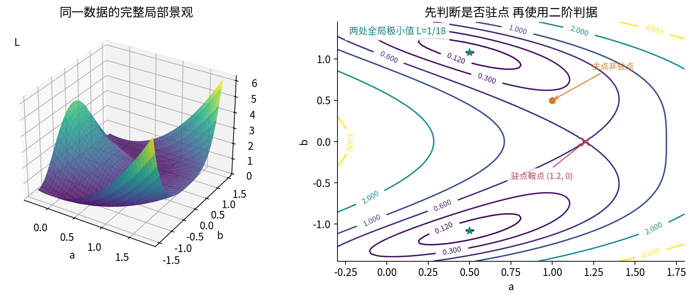

## 十二 二阶判据以及它的证明

设 $\theta_*$ 是开放定义域内的精确驻点，f 在邻域为 $C^2$。Taylor 展开中的一阶项消失，故

$$f(\theta_*+h)-f(\theta_*)=\frac12h^TH_*h+o(\|h\|_2^2).$$

若 H 正定，最小特征值 $m>0$。二次型满足 $h^THh\ge m\|h\|_2^2$，而小 o 条件保证 h 足够小时 $|R_2(h)|\le(m/4)\|h\|_2^2$。于是每个非零小位移都有

$$f(\theta_*+h)-f(\theta_*)\ge\frac{m}{4}\|h\|_2^2>0.$$

这证明严格局部极小，不只是“图像看起来像碗”。若 H 负定，对 $-f$ 使用同样论证即得严格局部极大。

若 H 不定，存在单位特征向量 $u_+,u_-$，对应 $\lambda_+>0$、$\lambda_-<0$。沿 $h=tu_+$，二次主项为正；沿 $h=tu_-$，二次主项为负。对于各方向充分小的非零 t，余项不会改变符号。因此每个邻域中都有更高与更低的值，驻点是鞍点。即使其他方向还有零特征值，只要确有一正一负，这个结论仍成立。

反过来，若 $C^2$ 函数在内部有局部极小，任意方向的一元二阶导都不能为负，所以 H 必须半正定。正定是严格局部极小的充分条件，半正定是局部极小的必要条件，两者不能倒置。二维判别式 $D=f_{aa}f_{bb}-f_{ab}^2$ 是这些结论在两个变量下的快捷检查：D 小于零意味着一正一负；D 大于零时再看一个对角元的符号；D 等于零时不作结论。[R4]

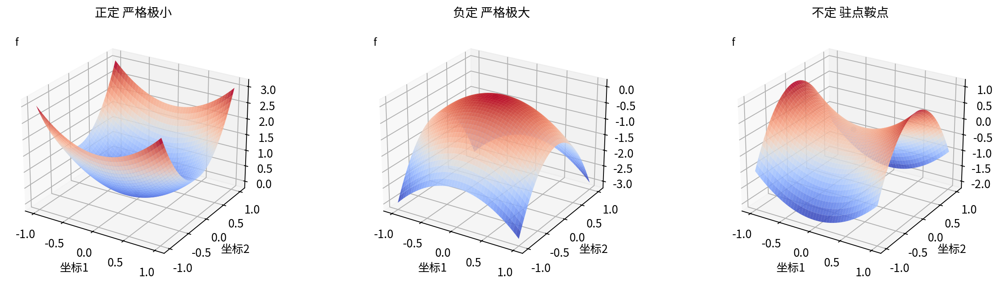

## 十三 零特征值留下了尚未回答的方向

考虑 $f_+(x,y)=x^2+y^4$ 与 $f_-(x,y)=x^2-y^4$。二者在原点的梯度均为零，Hessian 均为 $\operatorname{diag}(2,0)$，二阶多项式均为 $x^2$。然而 $f_+$ 的原点是严格极小，因为除原点外两项之和严格正；$f_-$ 的原点是鞍点，因为 x 轴上为正、y 轴上为负。

二阶式在 y 方向完全看不见差别，高阶项才决定这个方向的符号。再看 $x^2$：同一 Hessian 却给出一整条非严格极小点集合 $x=0$。零特征值不等于函数真的平坦，更不等于“这一参数不重要”。

甚至零矩阵也不决定形状。原点处 $x^4+y^4$ 是严格极小，$-x^4-y^4$ 是严格极大，$x^4-y^4$ 是鞍点，它们的梯度与 Hessian 全相同。在这些例子里要回到原函数或更高阶项；不能为了强行分类而把计算出的零改成一个微小正数。

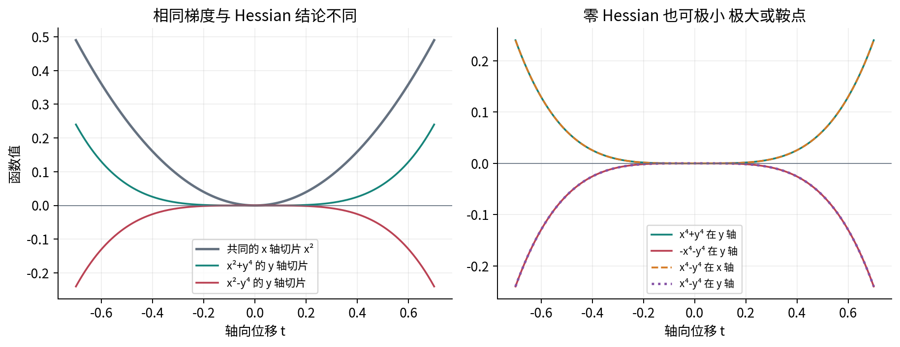

## 十四 主点的不定曲率与真正的驻点鞍点

主点 $H_0$ 的特征值为 $13/3$ 与 $-2/3$，对应单位特征向量可以取

$$u_+=\frac1{\sqrt5}\begin{pmatrix}2\\1\end{pmatrix},\qquad u_-=\frac1{\sqrt5}\begin{pmatrix}-1\\2\end{pmatrix}.$$

矩阵两个对角元都是正数，仍有负特征值。只检查坐标切片会漏掉交叉项造成的向下弯曲。图8故意先减去切平面，再看剩余量的正负曲率；它并未声称实际函数值沿两个方向都由二次项主导。

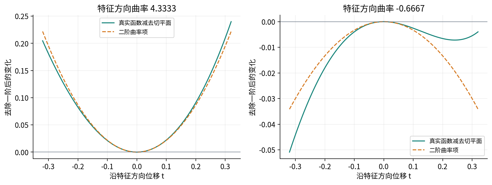

真正的驻点 $\theta_s=(6/5,0)$ 满足

$$L(\theta_s)=\frac35,\qquad \nabla L(\theta_s)=0,\qquad H_L(\theta_s)=\begin{pmatrix}10/3&0\\0&-28/15\end{pmatrix}.$$

这里沿 a 的二阶变化正、沿 b 的二阶变化负，所以可应用驻点鞍点判据。还能直接验证：沿 a 方向 $L(6/5+t,0)-3/5=\frac53t^2>0$；沿 b 方向 $L(6/5,t)-3/5=-\frac{14}{15}t^2+t^4$，当 $0<t^2<14/15$ 时严格负。

两处其他驻点的 Hessian 对角元为 $10/3$ 与 $28/3$，行列式为 $112/9>0$，因此都正定，得到两处严格局部极小。这一步本身尚未证明它们全局最优。

## 十五 全局最优需要另一份证据

对主模型，恰好可以给出独立的全局证据。把自由截距记为 $c=b^2\ge0$，再记 $A=a-1/2$、$C=c-7/6$。直接完成平方，得到恒等式

$$L(a,b)=\frac1{18}+\frac53\left(A+\frac35C\right)^2+\frac25C^2.$$

右边两个平方项处处非负，所以整个参数平面上的损失都至少为 $1/18$。等号成立当且仅当 $C=0$ 且 $A=0$，即 $a=1/2$、$b=\pm\sqrt{7/6}$。这才把“严格局部极小”升级为“两处全局极小”。这个证明连接第十一讲的带截距最小二乘，但结论来自这里展示的代数证书，而非偷偷假设非线性参数化是凸的。

作为对照，$F(x,y)=x^2+y^2-2x^4$ 在原点梯度零、Hessian 为 $2I$。当 $|x|<1/2$，有 $x^2-2x^4\ge x^2/2$，所以原点是严格局部极小。但 $F(1,0)=-1<F(0,0)$，它不是全局极小；原点二阶模型 $x^2+y^2$ 在远处给出了相反印象。

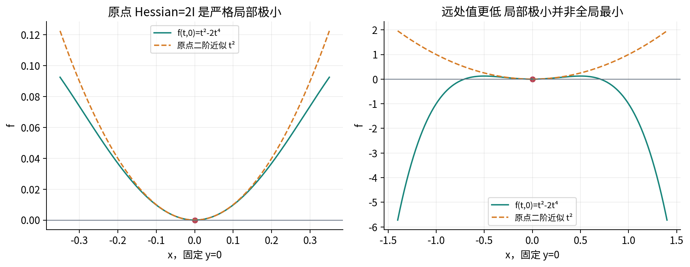

更一般的边界警告也很简单：在限制 $x\ge0$ 上，$f(x)=x$ 的最小点是0，导数却为1。因为可行方向不再包括所有正负小位移，开放邻域里的驻点必要条件不适用。

## 十六 如何把近似误差变成可检查的实验

实验固定中心与单位方向，只改变位移长度 t，分别计算 $P_1$、$P_2$ 和真实损失。直接相减得到 $E_1=|L-P_1|$、$E_2=|L-P_2|$；另一路由精确余项多项式计算同样的量。两条实现适合相互核对，也能暴露浮点相减的限制。

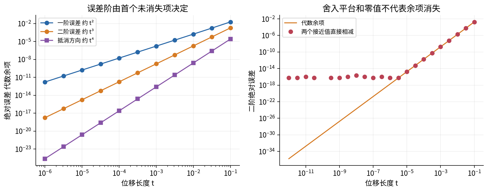

若 t 缩小10倍，非零二次主项的误差约缩小100倍，三次主项约缩小1000倍。用相邻数据估计阶数时，可计算 $\log(E(t_1)/E(t_2))/\log(t_1/t_2)$，但只对正误差和未进入舍入主导区的数据解释。某一位移处误差偶然为零、三次项抵消或数值下溢，都不允许直接宣称得到“无限阶精度”。

在普通方向，$E_1/t^2$ 应趋向 $5/3$，$E_2/t^3$ 应趋向 $224/125$。这比只看双对数直线更具体。有限个点符合这些趋势，核查的是实现与推导相符；覆盖所有方向的数学依据仍是第八节的余项论证和第十节的统一界。

## 十七 为什么狭长曲面让统一步长难选

这里只对第七节的精确正定二次函数做一个小型预览。定义重复更新 $h_{k+1}=h_k-\alpha\nabla q(h_k)$，其中 $\alpha>0$ 是固定步长。因为 $\nabla q(h)=Ah$，在特征坐标里

$$z_{k+1,j}=(1-\alpha\lambda_j)z_{k,j}.$$

这条式子完全是矩阵乘法，不需要提前使用优化算法的收敛定理。要让每个方向的绝对值都缩小，应有 $|1-\alpha\lambda_j|<1$，等价于 $0<\alpha<2/\lambda_{\max}$。等号处的某一模式可能只翻转符号而不缩小。

当特征值为1和16，步长0.1使两个因子为0.9与-0.6：慢方向仍缓慢缩小，快方向每步翻转但幅度缩小。步长0.15使快方向因子变为-1.4，幅度反而增长。这里展示的是确切二次函数的机制；一般非线性函数的 Hessian 会随位置变化，不能只用起点的特征值保证整条轨迹稳定。

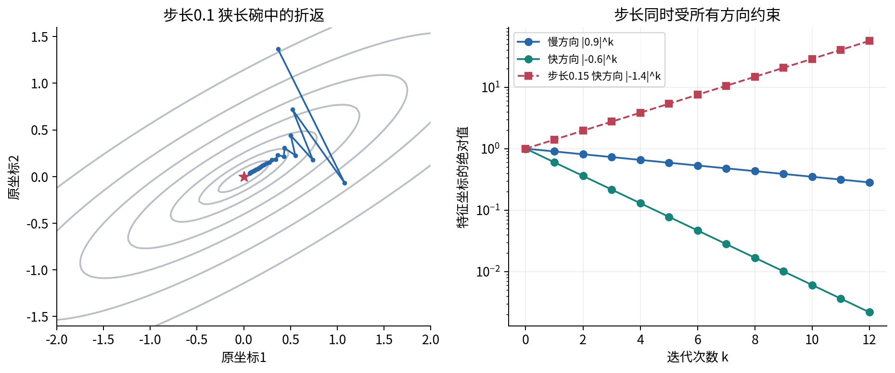

因此本讲中心问题的回答是：梯度只给当前位置的线性倾向，Hessian 描述坡度接下来怎样改变。方向间曲率差异会压缩可用步长，并造成某些方向慢、某些方向反复跨越谷底。这个局部机制很重要，但它不是完整的优化难度指标，也不包含数据噪声、非光滑性或计算成本的全部影响。

## 十八 计算审计比漂亮图像更重要

脚本从残差求 Hessian，再用独立多项式式子与梯度的中心差分核对。第 j 列差分写作

$$\widehat H_{:,j}=\frac{\nabla L(\theta+\varepsilon e_j)-\nabla L(\theta-\varepsilon e_j)}{2\varepsilon}.$$

步长过大会有截断误差，过小则相减与舍入误差放大；小到浮点数无法表示新采样点时，程序明确拒绝。它不先把差分结果强制对称，因为那会掩盖实现错误。测试覆盖25个固定参数点，还包括零位移、单样本、非有限输入、布尔或复数、错误形状、溢出与不可分辨步长。

特征分解用 NumPy 的 `eigh`，因为对象是实对称矩阵。它返回升序特征值与按列排列的单位特征向量；特征向量的整体符号可以改变，不应逐元素硬比某个符号约定。应检验 $Hv_j\approx\lambda_jv_j$ 与 $V^TV\approx I$。官方接口可只读取一个三角区域，所以程序在调用前独立检查对称性，避免一个错误三角区被静默忽略。[R5]

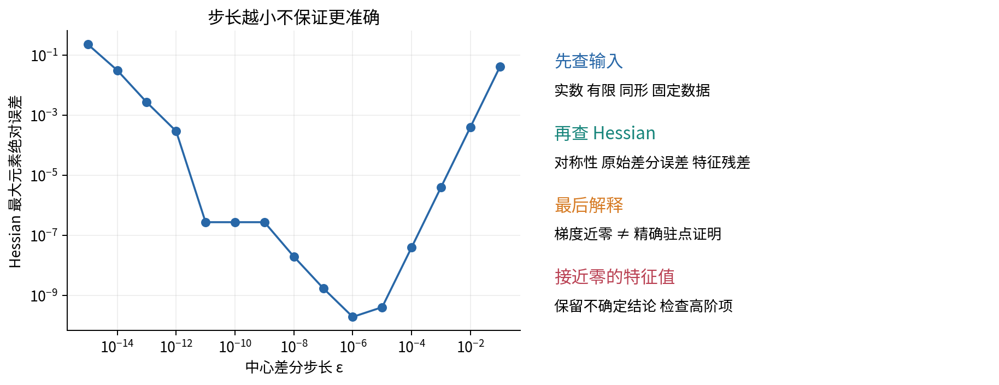

数值梯度落入容差只是“驻点候选”，不是精确驻点的证明。特征值接近零时，分类程序返回“不确定”，然后要求检查原函数、高阶项或更可靠误差界。数学上的正负分类与有限精度下的容差分类应分别陈述。

学完后，应能从一个明确函数和固定中心出发，写出 g 与 H，核对每一项形状，构造 $P_1,P_2$，说明余项条件，再决定是否有资格使用驻点判据。若要全局结论，还必须给出覆盖整个定义域的独立理由。详细练习在单独的练习详解中，动手步骤在实验指南中。

## 来源与进一步阅读

- [R1 Brian Conrad，Stanford Math 396，Higher derivatives and Taylor’s formula via multilinear maps。实际核对第3节的混合偏导与 Hessian，以及第5节的 Taylor 余项条件。本讲另用两次 Rolle 的路径论证解释二阶情形，不要求读者预先掌握多重线性映射或积分余项](https://math.stanford.edu/~conrad/diffgeomPage/handouts/higherderiv.pdf)

- [R2 OpenStax，Calculus Volume 2，第6.3节 Taylor and Maclaurin Series。核对一元 Taylor 余项的中间点与光滑条件；本讲只用有限阶近似，不假设无限级数收敛](https://openstax.org/books/calculus-volume-2/pages/6-3-taylor-and-maclaurin-series)

- [R3 OpenStax，Calculus Volume 3，第4.7节 Maxima Minima Problems。核对内部极值必要条件、局部与全局定义及二阶判别的驻点前提](https://openstax.org/books/calculus-volume-3/pages/4-7-maxima-minima-problems)

- [R4 Bjorn Poonen，MIT 18.02 Lecture Notes，Fall 2021，第9.9节。核对二次型、二维行列式判别、退化情形与约束警告](https://math.mit.edu/~poonen/02/notes.pdf)

- [R5 NumPy Developers，NumPy 2.3，numpy.linalg.eigh。核对对称矩阵要求、三角区参数、升序特征值和按列特征向量约定](https://numpy.org/doc/2.3/reference/generated/numpy.linalg.eigh.html)

正文、手算、反例组合和全部12幅图均为本讲独立编写或程序生成。参考资料用于核对定义、条件与接口，没有复制其中的图或例题。所用数据为原创合成数据，并明确延续第十四讲。
