# 凸性与约束的几何

## 第十六讲 在允许的范围内寻找最好的点

前两讲解释了梯度与曲率。现在再加一个现实中常见的限制：参数并非可以随意移动。某个参数必须非负，一组参数的总量不能超过预算，或者某些线性关系必须严格成立。原来最好的无约束参数可能根本不允许使用；负梯度也可能指向可行区域之外。

本讲围绕一个明确的问题展开：给定建议点 $v=(3,2)^T$，在不同限制下找一个与它欧氏距离最近的允许点。我们将从线段、凸组合和弦线不等式出发，证明一阶凸性判据与有限 Jensen 不等式，再推导区间、盒子、球和线性集合的投影。每个公式都要同时接受可行性、距离和边界条件的检查。

直接先修是第九、十一、十四至十五讲：向量内积、范数、线性方程、梯度与二阶局部近似。本讲不提前使用拉格朗日对偶或 KKT；这些将在第六十五讲系统展开。这里先用平方展开、可行线段和一阶变化率解决基础问题。全部点、限制和数据均为无量纲原创教学构造，不代表真实资源分配或预测表现。

## 一 同一个目标点 换了限制就换了答案

用参数 $z\in\mathbb R^2$ 表示最终选择，固定建议点 v，目标函数为

$$F(z)=\frac12\|z-v\|_2^2.$$

没有限制时，唯一最优点就是 z=v，损失为0。若只允许 $0\leq z_1\leq2$ 且 $0\leq z_2\leq1$，v不合法。若允许点必须位于半径2的圆盘内，v也不合法。若要求 $z_1+z_2=1$，又是另一组允许点。

把所有允许点组成的集合记为 C，称为可行集。任务写成

$$\min_{z\in C}\frac12\|z-v\|_2^2.$$

前面的最小化要同时满足“属于 C”与“目标尽量小”。一个距离特别小但不属于 C 的点，不是一个更好的可行解；一个可行点也不自动是最近点。

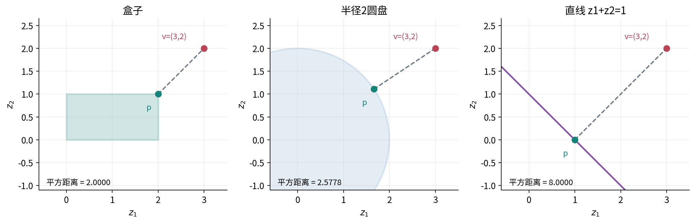

本讲始终用欧氏距离。改成按坐标加权的距离，最近点可能改变；只缩放某个坐标而不相应调整距离权重，也可能改变最近点。一致地缩放所有坐标和约束只改变数值尺度，不改变对应的几何解。我们先固定数学标准，再讨论它的几何后果。

## 二 凸集要求任意两点之间的整条线段都留下

集合 $C\subseteq\mathbb R^n$ 称为凸集，如果对任意 $x,y\in C$ 和任意 $t\in[0,1]$，都有

$$(1-t)x+ty\in C.$$

t=0和t=1给出两个端点，0<t<1给出连接它们的中间位置。这个定义检查所有端点和所有中间权重，不是只检查几个看起来典型的点。

区间、实心圆盘、矩形以及整条直线都凸。圆周一般不凸：取两个对径点，线段中点在圆心，圆心却不在圆周上。中间有洞的环形区域、分开的两个小圆盘，也可以直接找出违反定义的两点。

凸不等于有界，也不等于必须包含原点。直线 $z_1+z_2=1$ 无限延伸且不经过原点，仍是凸集。凸也不等于闭：开区间(0,1)是凸集，但不包含端点。稍后会看到闭性关系到最近点是否实际存在。

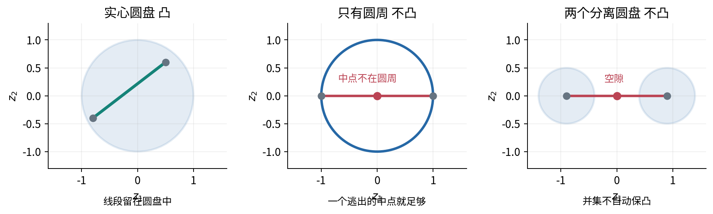

空集按通常定义也是凸的，因为不存在能违反条件的两点。但在空集上找可行最优点没有答案，因此投影定理会明确要求 C 非空。不要把逻辑上的定义约定与优化问题有解混为一谈。

## 三 用定义证明常见限制是凸的

先看半空间 $C=\{z:a^Tz\leq b\}$，其中 $a\ne0$。如果 x、y满足约束，那么

$$a^T[(1-t)x+ty]=(1-t)a^Tx+ta^Ty\leq(1-t)b+tb=b.$$

因此中间点仍满足约束。将不等号改为等号，可以同样证明超平面 $a^Tz=b$ 凸；将多个等式叠成 $Az=b$，其解集也凸。等式集还包含任意实数 t 所对应的整条直线，称为仿射集合；凸集只要求0到1之间的线段。

对闭球 $B(c,R)=\{z:\|z-c\|_2\leq R\}$，其中 $R\geq0$，使用三角不等式：

$$\|(1-t)x+ty-c\|_2\leq(1-t)\|x-c\|_2+t\|y-c\|_2\leq R.$$

所以球也是凸的。这里证明的是实心球，而不是只有边界的球面。R=0时球只剩一个点，仍凸。

多个凸集的交集仍凸，因为两端点若同时属于每一个集合，中间点也同时属于每一个集合。矩形可看作四个半空间的交；线性等式与不等式共同定义的区域，也可按这个思路判断。但交集可能为空，例如同时要求 $z_1\leq0$ 和 $z_1\geq1$。

并集一般不保凸。集合[0,1]与[2,3]分别凸，并集却遗漏1与2之间的中点。一个常见错误是把“每条约束单独好处理”当成“随便组合都好处理”。交与并是不同操作。

## 四 凸组合把两点推广到多个点

给定 $x_1,\ldots,x_m$，若权重 $\alpha_i\geq0$ 且 $\sum_i\alpha_i=1$，则

$$\bar x=\sum_{i=1}^m\alpha_i x_i$$

叫作这些点的凸组合。权重非负使它不是朝某点反方向外推，权重和为1使它保持“加权位置”的意义。如果仅满足权重和为1却含负权重，则是更一般的仿射组合，可能跑到原点集围成的范围之外。

例如三个点 $(0,0),(2,0),(0,2)$，权重分别为 $1/2,1/4,1/4$，得到 $(1/2,1/2)$。所有凸组合恰好填满这三个点围成的三角形，称为这组点的凸包。原始点集只有三个元素，凸包却包含连续无穷多个位置。

凸集包含其中任意有限点的所有凸组合。证明可以归纳：将最后一个权重单独拿出，把前面点重新归一化成一个中间点，再应用两点凸性。若最后权重为1，结果就是最后一点；若为0，忽略它即可，不需要除以0。后面的 Jensen 证明会再次使用这套结构。

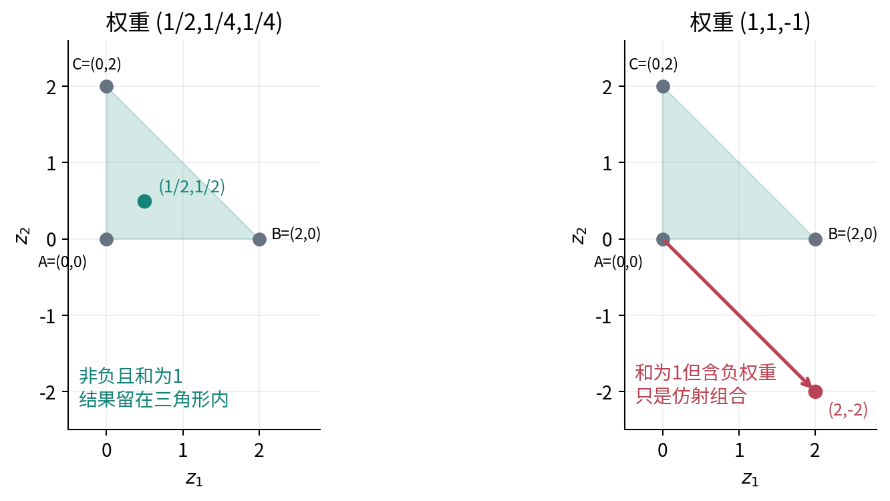

## 五 凸函数比较的是先混合再计算与先计算再混合

设函数 f 的定义域 D 是凸集。若对任意 $x,y\in D$、$t\in[0,1]$，都有

$$f((1-t)x+ty)\leq(1-t)f(x)+tf(y),$$

就称 f 为凸函数。右边是两个函数值的线性插值，左边是在混合输入处真实计算的函数值。在一维图上，这表示函数曲线不高于连接两点的弦线。

若对不同的x、y以及0<t<1总有严格不等号，则称严格凸。仿射函数 $a^Tx+b$ 在定义域中满足等号，既凸又凹，但在包含不同点的区域上不是严格凸。把不等号方向反过来就是凹函数，等价于-f凸。

平方函数的凸性可以直接展开：

$$(1-t)x^2+ty^2-[(1-t)x+ty]^2=t(1-t)(x-y)^2\geq0.$$

当x≠y且0<t<1时严格大于0，因此平方函数严格凸。绝对值虽然在0不可导，但由三角不等式仍有 $|(1-t)x+ty|\leq(1-t)|x|+t|y|$，所以凸函数不必处处光滑。

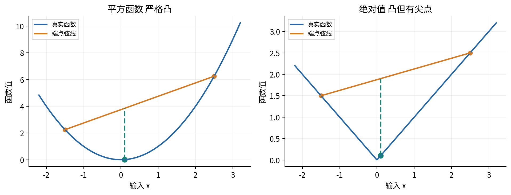

判断凸函数时不能漏掉定义域。如果一个公式分别写在两个不相连区间上，不能只检查区间内部曲率，再宣布整个定义域上的函数凸。定义中的中间点必须先有资格作为输入。

## 六 平方距离为什么是严格凸目标

对向量同样有平方展开恒等式：

$$\begin{aligned}
&(1-t)\|x-v\|_2^2+t\|y-v\|_2^2\\
&\quad-\|(1-t)x+ty-v\|_2^2=t(1-t)\|x-y\|_2^2.
\end{aligned}$$

第九讲的内积展开足以验证它。对不同x、y和0<t<1，右边严格为正，因此 $F(z)=\frac12\|z-v\|_2^2$ 严格凸。固定的v只平移碗底，不改变这个性质。

如果 $p\ne q$ 都是同一凸集里的最优点，且目标值相同，那么中点 $(p+q)/2$ 仍可行，严格凸性却使中点目标更小，矛盾。因此严格凸函数在凸集上的最优点至多一个。

这里的关键词是“至多”。严格凸不能单独保证最优点存在。例如 $f(x)=e^x$ 在整个实线上严格凸，但总可以继续把x向负方向移动，函数值趋近0却从不达到0。唯一性与存在性是两个不同问题。

## 七 可微凸函数的切平面是全局下界

设D为开放凸集，f在D上全微分存在。本节使用第十四讲的可微定义，不能仅以坐标偏导存在替代。f凸当且仅当对所有 $x,y\in D$，都有

$$f(y)\geq f(x)+\nabla f(x)^T(y-x).$$

右边是x处的切平面预测。一般可微函数只在足够近处由它近似；凸性进一步保证，这个线性式对整个凸定义域都不高估函数值。

先证明凸性推出下界。对0<t≤1，凸性给

$$f(x+t(y-x))\leq(1-t)f(x)+tf(y).$$

移项并除以正t：

$$\frac{f(x+t(y-x))-f(x)}{t}\leq f(y)-f(x).$$

令t向0靠近，由可微性，左边趋向 $\nabla f(x)^T(y-x)$，于是得到所需不等式。凸性让整条线段可用，可微性把线段起点的极限变成内积，这两个条件各有职责。

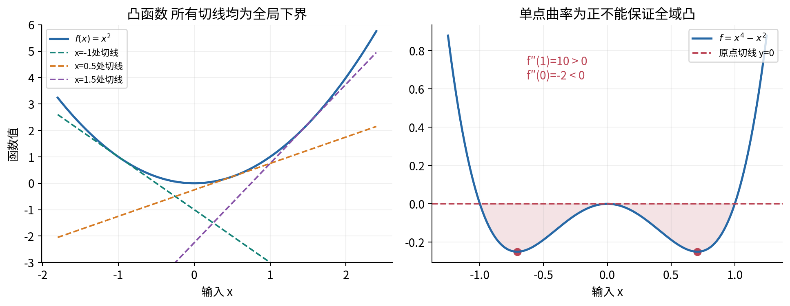

反过来，假定所有点都满足这个一阶下界。取 $z=(1-t)x+ty$，在z处分别给x和y写下界，再按1-t与t加权：

$$\begin{aligned}
(1-t)f(x)+tf(y)&\geq f(z)+\nabla f(z)^T[(1-t)(x-z)+t(y-z)]\\
&=f(z).
\end{aligned}$$

括号为零，正好得到凸性定义。端点t=0或1直接取等号。这证明的是双向等价，不只是一个方便记忆的充分条件。

## 八 Hessian 判据要检查整个区域

如果f在开放凸域D上二阶连续可微，那么凸性等价于每一点的 Hessian 都半正定：

$$h^T\nabla^2f(x)h\geq0\qquad\text{对所有 }x\in D,\ h\in\mathbb R^n.$$

沿任意线段设 $\phi(t)=f(x+th)$，有 $\phi''(t)=h^T\nabla^2f(x+th)h$。因此多元判据归结为每条直线上的一元曲率不为负；反向也可通过对任意小线段应用凸性并取二阶极限得到。这里沿用上一讲的二阶连续可微条件与 Taylor 结论。

“在某一个点Hessian正定”只给出那个点附近的局部信息，不足以证明全域凸。例如 $f(x)=x^4-x^2$ 在x=1处二阶导为10，却在0处为-2。取x=±1/√2，两端值均为-1/4，而中点0的值为0，直接违反凸性。

严格凸也不要求每一点Hessian都正定。$x^4$ 在实线上严格凸，但0处二阶导为0。因此“全域正定”是一个充分条件，不能无条件当成严格凸的必要条件。

## 九 有限 Jensen 不等式及其证明

凸函数的两点不等式可推广到任意有限个点。若 $x_i\in D$，$\alpha_i\geq0$ 且 $\sum_{i=1}^m\alpha_i=1$，则

$$f\left(\sum_{i=1}^m\alpha_i x_i\right)\leq\sum_{i=1}^m\alpha_i f(x_i).$$

这是有限形式的 Jensen 不等式。它比较“先平均输入，再计算”与“先计算各自结果，再平均”。不能误读为两边总相等，也不能把方向反过来。

给出归纳证明。两点情形就是定义。假设m-1点成立，令最后权重为s。若s=1，等式显然；若s=0，直接用归纳假设。对0<s<1，定义

$$u=\sum_{i=1}^{m-1}\frac{\alpha_i}{1-s}x_i.$$

这些新权重非负且和为1，所以u∈D，且归纳假设给出 $f(u)\leq\sum_{i<m}\alpha_i f(x_i)/(1-s)$。再对 $(1-s)u+sx_m$ 应用两点凸性，乘回权重，正好得到m点结论。

以 $f(x)=x^2$、输入1和3、等权平均为例，平均输入是2，平方为4；平方后平均为(1+9)/2=5。这1的差距不是舍入误差，而是凸性留下的真实差别。

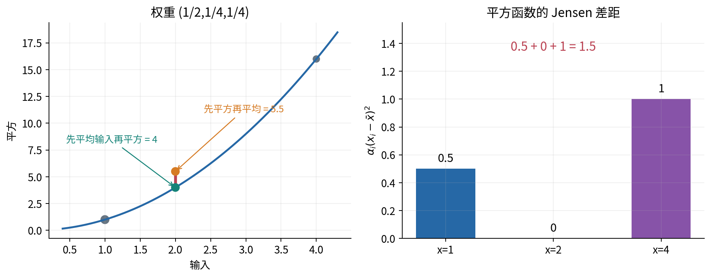

严格凸时，只要有两个正权重对应不同输入，Jensen 就严格；零权重对应的点不影响答案。一般凸函数可能在不同点上取等号，例如仿射函数。本讲只证明有限形式；概率分布下的期望形式还需要可积性与定义域条件，将在概率课程后再使用。

## 十 局部最优为什么变成全局最优

设C凸且f在C上凸，p是相对于C的局部最小点。假如存在远处可行点q使f(q)<f(p)，那么线段上的点 $p+t(q-p)$ 对每个0<t<1都可行，并且

$$f(p+t(q-p))\leq(1-t)f(p)+tf(q)<f(p).$$

把t取得足够小，这些更好的点就落入p的局部邻域，与局部最小矛盾。所以凸问题的局部最小一定是全局最小。证明依赖目标和可行集同时凸，不是单独看某一个函数画得像碗。

这不表示所有算法都一步找到解，也不表示问题一定有可行点、有限最优值或最优值可达到。数值条件、停止容差、数据尺度和约束一致性仍需检查。凸性提供几何与最优性结构，不替代求解器的实际验收。

## 十一 边界上的最优点可以有非零梯度

若f可微并且p是可行集内部的无约束局部最小，所有正负微小方向都可尝试，必要条件是梯度为零。但在边界，某些方向根本不允许。

例如在区间[0,1]上最小化 $f(x)=(x-3)^2/2$，最优点是1，导数却为-2。向右能降低函数，但向右走会离开区间。沿允许的左方向，函数反而增加。

更一般地，C凸，f在包含C的开放区域上可微且在C上凸，那么p∈C最优当且仅当

$$\nabla f(p)^T(z-p)\geq0\qquad\text{对所有 }z\in C.$$

必要性来自可行线段 $p+t(z-p)$：若右侧内积为负，充分小正t就能下降，与最优矛盾。充分性则直接来自上一节的一阶凸下界。这个条件检查所有指向可行点的方向，不要求梯度本身为零。

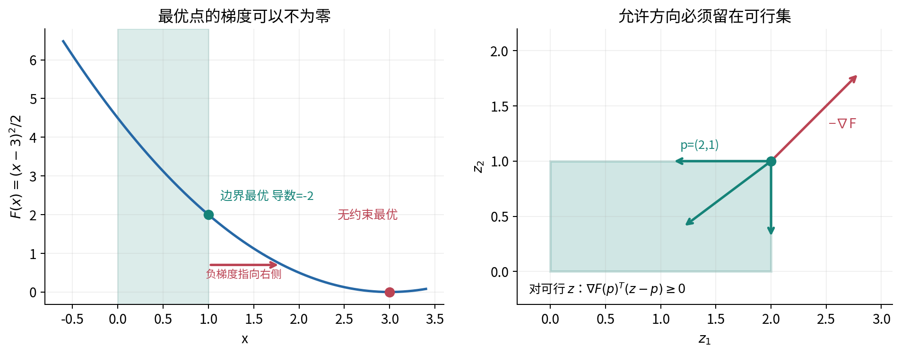

## 十二 最近点投影的存在与唯一性

对非空闭凸集C，定义欧氏投影

$$P_C(v)=\operatorname*{argmin}_{z\in C}\frac12\|z-v\|_2^2.$$

这里argmin返回取得最小值的点，min返回最小数值。非空、闭、凸和欧氏距离共同保证投影存在且唯一。

存在性的理由可说明到边界：先任选 $z_0\in C$，比它更好的候选必须位于以v为中心、半径 $\|z_0-v\|$ 的闭球内。只需在C与该闭球的交上找解。这是非空、有界且闭的有限维集合；采用“连续函数在非空紧集上达到最值”的标准存在性定理，平方距离能取到最小值。这里明确使用了分析学存在性结论，不把有限网格搜索当成证明。

唯一性由第六节严格凸性和中点论证给出。闭性则不能随意去掉：在开区间(0,1)中找离2最近的点，只能越来越靠近1，距离下确界为1却没有点达到。若C不凸，例如仅含(-1,0)和(1,0)，原点到两点同样近，投影可能不唯一。

## 十三 用一个内积证书核验投影

把第十一节应用于 $F(z)=\frac12\|z-v\|^2$，梯度为z-v，得到：p是v到非空闭凸C的投影，当且仅当p∈C且

$$(v-p)^T(z-p)\leq0\qquad\text{对所有 }z\in C.$$

它说明从p指向v的残差，与任何从p指向可行点的方向不能形成锐角。对整条仿射直线，正反两个方向都可行，于是相应内积必须等于0，恢复了前面线性代数中的正交投影。

也可以完全用平方展开证明充分性：

$$\|v-z\|^2=\|v-p\|^2+\|z-p\|^2-2(v-p)^T(z-p)\geq\|v-p\|^2.$$

必要性则把 $z_t=p+t(z-p)$ 代入距离最小条件，展开后除以正t，再令t下降到0，得到同一内积不等式。

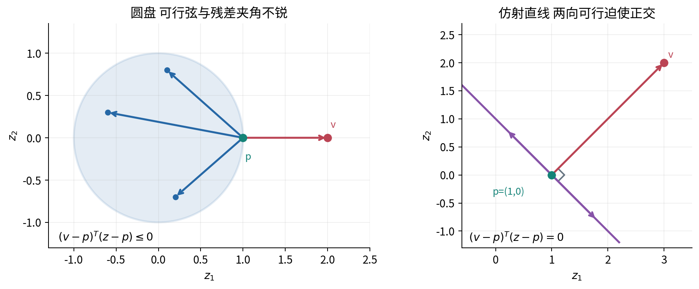

这个证书涉及无限多个可行点。实验可以抽查有限候选来找反例，但对所有候选成立的结论仍需几何或代数论证。对本讲的简单集合，我们能够给出这样的完整论证。

## 十四 区间与盒子的投影是逐坐标裁剪

在一维闭区间[ℓ,u]中，其中ℓ≤u，若v已在区间里，距离0最小；若v<ℓ，所有允许数都不小于ℓ，最近的是ℓ；若v>u，最近的是u。合成公式为

$$P_{[\ell,u]}(v)=\min(u,\max(\ell,v)).$$

对盒子 $C=\{z:\ell_j\leq z_j\leq u_j\}$，平方距离是各坐标平方误差之和，而每个坐标的约束相互独立，所以每个坐标分别裁剪就得到整体最小值。

主例v=(3,2)，下界(0,0)、上界(2,1)，得到p=(2,1)，平方距离为2，目标F=1。这个结果不是把整个向量按某个共同倍数缩小，而是只把越界坐标推到对应端点。

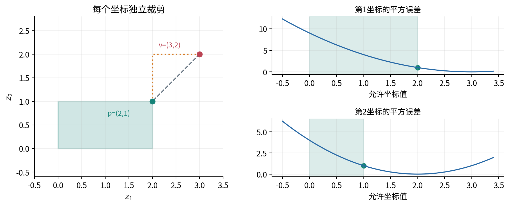

NumPy的 `clip` 提供逐项裁剪，但不替你确认所有下界都不大于上界；还可能广播不同形状。本实验在调用前要求输入与上下界尺寸一致、元素有限，并显式拒绝逆序边界、布尔值或不明隐式转换。ℓ=u是合法的单点限制，不应错误拒绝。

## 十五 球的投影来自距离下界

对闭球 $C=\{z:\|z-c\|\leq R\}$，R≥0。若v在球内，投影就是v。若v在球外，任意可行z由三角不等式满足

$$\|v-z\|\geq\|v-c\|-\|z-c\|\geq\|v-c\|-R.$$

沿c到v的方向取

$$p=c+R\frac{v-c}{\|v-c\|},$$

它在球面上，且距离恰好等于下界，因此最优。只在球外使用这个除法，分母必然非零；当R=0时可直接返回c。

主例c=0、R=2、v=(3,2)，长度为√13，所以

$$p=\left(\frac6{\sqrt{13}},\frac4{\sqrt{13}}\right)^T,\qquad\|v-p\|^2=(\sqrt{13}-2)^2=17-4\sqrt{13}.$$

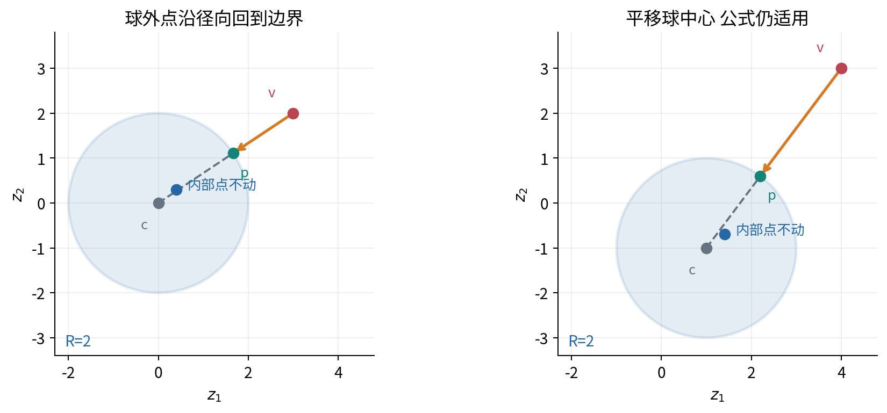

“投影到球”与“归一化为单位向量”是不同操作。前者不会推动原本已经合法的内部点；后者可能把零向量弄成未定义，也改变原本合法点的位置。

## 十六 投影到超平面与简单仿射集合

设 $C=\{z:a^Tz=b\}$ 且a≠0。投影残差应沿法向量a，因此设p=v-λa。代入约束得 $a^Tv-\lambda\|a\|^2=b$，从而

$$p=v-\frac{a^Tv-b}{\|a\|^2}a.$$

这不是仅凭图猜公式：p确实满足等式，而对任意可行z，$a^T(z-p)=0$，所以残差v-p与z-p正交，投影证书成立。

主例a=(1,1)、b=1，得到p=(1,0)，平方距离为8。此时无约束梯度p-v=(-2,-2)不为零，却与所有可行方向(t,-t)正交，因此沿直线不能一阶下降。

再看三维例子：v=(3,2,1)，要求 $z_1+z_2=1$、$z_2+z_3=0$。写成Az=b后，A为2×3，两个独立等式给出一条仿射直线。设修正δ=p-v，先求满足 $A\delta=b-Av$ 的最小范数修正，便得到

$$p=(4/3,-1/3,1/3)^T.$$

可行方向为(t,-t,t)，残差v-p=(5/3,7/3,2/3)，内积为0。任意可行点p+t(1,-1,1)的平方距离为 $26/3+3t^2$，因此p确实唯一最近。

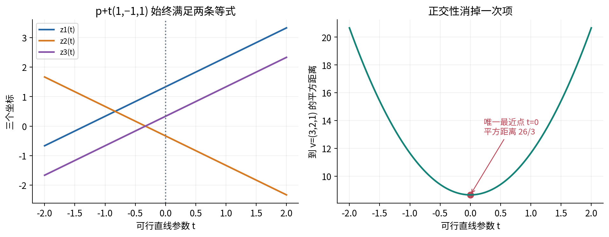

代码可用 `lstsq` 求最小范数修正，并检查约束残差、数值秩和形状。理论上的满行秩条件与浮点数值秩不是同一件事；本实验使用手算可证独立的小矩阵，不把默认阈值当成任意真实数据的准确秩证明。

## 十七 单个半空间与多个限制不能混为一谈

对半空间 $a^Tz\leq b$，若v已合法就保留；若不合法，就沿法向量投影到边界超平面。因为球形距离的最近点会在边界达到，公式为

$$P_C(v)=v-\frac{\max(0,a^Tv-b)}{\|a\|^2}a.$$

这里的验证来自半空间本身：若v越界，残差v-p是a的正倍数，而任意可行z满足 $a^T(z-p)\leq0$，所以投影证书成立。

主例a=(1,1)、b=1时仍得到(1,0)。但不能认为：既然每个简单限制都有公式，把它们各投影一次就得到交集上的最近点。

同时要求盒子 $[0,2]\times[0,1]$ 和半径2圆盘。先裁剪v=(3,2)得(2,1)，再缩到圆盘得 $(4/\sqrt5,2/\sqrt5)$。它满足两个限制，但并非最近点。真正的投影是 $p=(\sqrt3,1)$，平方距离为 $13-6\sqrt3$，小于前一个候选的距离。

为何能证明p而不只是网格猜测？p在两个集合里，而且

$$v-p=(\sqrt3-1)p+(2-\sqrt3)(0,1)^T.$$

两系数均非负。对任意交集内z，圆盘给出 $p^T(z-p)\leq\|p\|\|z\|-\|p\|^2\leq0$，盒子上界给出 $z_2-1\leq0$。加权相加就得到投影内积证书。这里直接用了两个几何不等式，没有暗中把尚未学习的 KKT 当成前提。

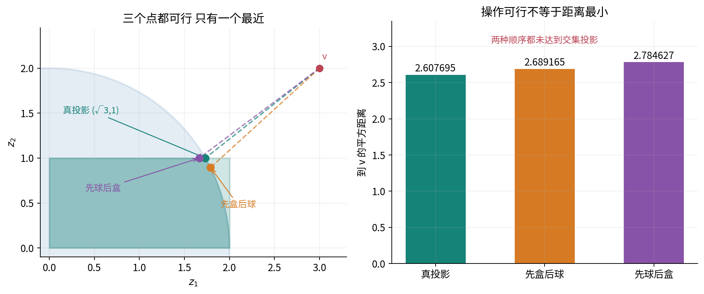

顺序反过来又会得到另一个点。反复投影可以是某些算法的一部分，但它的收敛目标、条件与是否得到原点的最近投影都需要另行分析，不能从这一次操作中作无限外推。

## 十八 投影不会放大两个输入的欧氏距离

令p=P_C(x)、q=P_C(y)，其中C非空闭凸。分别把q和p代入各自的投影证书：

$$(x-p)^T(q-p)\leq0,\qquad(y-q)^T(p-q)\leq0.$$

整理相加得到

$$\|p-q\|^2\leq(p-q)^T(x-y)\leq\|p-q\|\|x-y\|.$$

若p=q，结论直接成立；否则除以正的 $\|p-q\|$，得到 $\|P_C(x)-P_C(y)\|\leq\|x-y\|$，称为非扩张性。

它解释了在固定闭凸集上，小幅改变建议点不会让投影点之间的欧氏距离突然更大。但它不保证输入到自身投影的距离变小到任意程度，也不表示“先投影到一个集合，再到另一个集合”就是交集投影。若集合本身改变，以上比较的前提也改变了。

## 十九 实验怎样提供有边界的证据

配套实验使用固定小点集，同时保存建议点、投影点、形状、可行残差和平方距离。手算例用分数核对区间、盒子、超平面与仿射直线；含根号的球和交集例与解析式按公开容差比较。

每一类投影先检查可行性，再检查距离与投影证书。有限候选可以揭露错误实现，但不声称通过它们证明了全域最优；最优性的一般证明已在正文中给出。

凸组合和Jensen使用非负、和为1的权重。实验主动拒绝负权重、未归一权重、空点集和尺寸不一致。拒绝是为了保护本讲的数学契约，不能静默将输入重新归一化，然后说原输入已经通过。

边界包括已经可行的点、零半径球、区间两个端点相等、逆序上下界、零法向量、约束不一致或缺独立行，以及非有限值和混合布尔/字符串。数组广播不能替代形状检查。输出记录真实执行环境；Notebook和脚本使用同一核心函数，从清空内核与新进程重跑。

## 二十 练习用条件和反例检验理解

**练习一** 证明任意多个凸集的交凸，并给出两个凸集的并不凸的反例。说明交集为空为什么不违背结论，却使优化无解。

**练习二** 对三个二维点与权重(1/2,1/4,1/4)重做凸组合。把权重改成(1,1,-1)，总和仍为1；找出为什么这不能作为凸组合证据。

**练习三** 用平方展开证明平方距离严格凸，并解释这如何推出投影的唯一性。为何不能仅凭严格凸就宣称最优点存在？

**练习四** 重写一阶凸性判据的两个方向，标出凸定义域、全微分和非负权重分别在哪一步使用。

**练习五** 完整证明三点Jensen，并处理某个权重为0或1的情况。对输入1、2、4及权重(1/2,1/4,1/4)，比较平均后平方与平方后平均。

**练习六** 给出一个在某点Hessian正定却不全域凸的函数，和一个严格凸但某点Hessian为0的函数。不要把两种命题混成同一句话。

**练习七** 手算v=(-1,3)投影到[0,2]×[0,1]，并分别检查可行性和平方距离。说明逐坐标裁剪为何只适用于这种可分离限制。

**练习八** 对球中心c=(1,-1)、半径R=2、点v=(4,3)求投影；再说明v=c和R=0如何处理，避免除以零。

**练习九** 手算v=(3,2)到z₁+z₂=1的投影，用残差与可行方向内积给出最优证书。若改成不等式且v已在半空间内部，答案怎样变？

**练习十** 核对三维仿射例子的两条等式、正交性和 $26/3+3t^2$。如果方程彼此矛盾，为什么最小二乘残差小也不能自动叫作可行投影？

**练习十一** 比较先盒子后圆盘、先圆盘后盒子与交集真投影。至少给一个精确不等式证书，不能只比较一张图。

**练习十二** 从两条投影不等式推出非扩张性，并解释为什么它要求两次投影使用同一个集合。

详解与可运行实验独立提供。先能解释定义域、可行性与最优性之间的差别，再讨论计算快不快。

## 来源与后续

以下作者公开课件和官方文档用于核对条件与接口，正文推导、例子和图均独立编写。一般投影存在性明确借用有限维紧集上的连续最值定理；不将它伪装成有限数值测试已经证明的结论。

- [Boyd 与 Vandenberghe 凸优化课件，第2至3章](https://web.stanford.edu/~boyd/cvxbook/bv_cvxslides.pdf)：凸集、凸函数、一阶与二阶判据、Jensen。课件中的简写应结合本讲明确的全微分条件使用。
- [Bertsekas 凸分析与优化课件，投影定理与证明](https://web.mit.edu/course/6/6.253/www/Convex_Slides.pdf)：非空闭凸集投影、正交条件和非扩张性。
- [NumPy 2.3 clip](https://numpy.org/doc/2.3/reference/generated/numpy.clip.html)：裁剪、广播及边界顺序未自动检查的接口行为。
- [NumPy 2.3 lstsq](https://numpy.org/doc/2.3/reference/generated/numpy.linalg.lstsq.html)：最小范数解、数值秩和残差返回含义。

下一阶段会把这些几何条件用于概率、估计与优化。第六十五讲将进一步引入拉格朗日对偶和 KKT；本讲已经建立的可行线段、凸下界与投影证书，会成为理解那些更一般条件的基础。
