# 积分与连续量

## 第十七讲 怎样把连续密度与误差累积起来

一个函数的高度，不能单独告诉我们某一段上积累了多少量。若模型给出了连续变量各处的密度，我们需要区间的概率；若误差随时间变化，我们需要一段时间的累计误差。两者都要求把“每一小段的贡献”相加，再控制切分越来越细时的极限。本讲从这一需求建立定积分，连接第十三讲的导数，并用完全可手算的密度检查数值程序。

直接先修是第八讲的函数、区间、指数和对数，以及第十三讲的一元导数与局部变化。无须先学概率公理或随机变量；本讲把密度视为一种非负、总量为1的连续分配规则。第十八至十九讲会给出正式概率语言。本讲使用无量纲合成函数，不包含真实个体数据，不声称这些曲线是实际数据的分布。

核心问题不是怎样背更多原函数，而是怎样明确积分对象、区间、单位和误差来源。完成之后，应能独立回答：密度高度为什么可能大于1；换变量时为什么需要尺度因子；缩小网格为什么不能补回被截掉的尾部；两个数值答案相同为什么仍可能都错。

## 一 从分段累积开始

设每分钟流入的量为 $r(t)$，单位是升每分钟，时间区间是 $[a,b]$ 分钟。若速率恒定，总量就是高度乘宽度；若速率变化，将时间分为 n 段，每段选择一个代表点，把速率近似视为常数。第 i 段的近似贡献是

$$r(\xi_i)\Delta t_i,\qquad \Delta t_i=t_i-t_{i-1}>0.$$

乘法的单位是升，而不是升每分钟。累积量的近似是这些贡献的和。只把各个高度相加会随着采样点数任意变大，缺少了每个样本所代表的区间宽度。后面的密度网格、二维网格和换元计算都会反复用到这个检查。

例如取 $f(x)=x^2$、区间 $[0,1]$、四等分。左端点为0、1/4、1/2、3/4，右端点为1/4、1/2、3/4、1。左矩形和为7/32，右矩形和为15/32；它们夹住曲线下面积。函数在这一区间单调增加，所以每个左矩形不超过真实区域，每个右矩形不小于真实区域。若函数不单调，这种全局上下界解释便不能直接沿用。

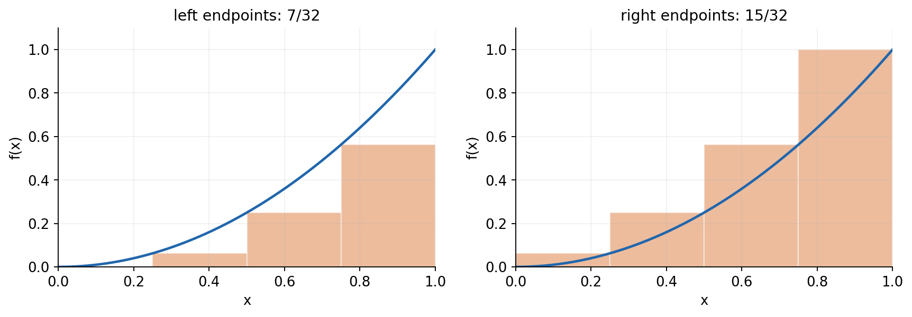

## 二 定积分定义中的极限是什么

把有界区间 $[a,b]$ 划分为 $a=x_0<x_1<\cdots<x_n=b$，每一段选 $\xi_i\in[x_{i-1},x_i]$，定义 Riemann 和

$$S(P,\xi)=\sum_{i=1}^{n}f(\xi_i)(x_i-x_{i-1}).$$

P 表示整组分点。分割的网格大小是 $\|P\|=\max_i(x_i-x_{i-1})$。如果不论怎样选分点与代表点，只要 $\|P\|\to0$，这些和都趋向同一个有限数，就称 f 在该区间 Riemann 可积，并把这个数记作

$$\int_a^bf(x)\,dx.$$

积分号下的 x 是哑变量，改名为 t 不改变数值。a、b 是积分界，f 是被积函数，dx 标明对哪个变量及其长度元素累积。定积分是一个数；不定积分是原函数族，两种对象必须区分。

“段数趋于无穷”本身不够。可以只把左半段不断细分，却始终保留宽度1/2的右半段；此时 n 很大，最大段宽仍不趋零。也不能只检查某一种采样方式。例如区间内有理数处取1、无理数处取0的函数，选择不同代表点会给出不同极限，因而不满足这个 Riemann 定义。这个反例只用于理解条件，程序的浮点采样不能检验有理性与无理性。

本讲接受一个基础定理：闭区间上的连续函数必定 Riemann 可积。有限个跳跃也容许可积，但“每处都连续”是便于使用的充分条件，并非必要条件。[R1] 给出这些概念的教材说明。更一般的 Lebesgue 积分不在本讲展开。

## 三 用求和公式算出一个极限

对 $f(x)=x^2$ 在 $[0,1]$ 的 n 等分右矩形和，有 $\Delta x=1/n$、$x_i=i/n$。因此

$$R_n=\frac1{n^3}\sum_{i=1}^ni^2=\frac{n(n+1)(2n+1)}{6n^3}=\frac13+\frac1{2n}+\frac1{6n^2}.$$

这里使用整数平方和公式；可从 n=1 开始，以归纳法比较第 n 项与第 n+1 项验证。最后两项趋零，所以积分为1/3。同理

$$L_n=\frac13-\frac1{2n}+\frac1{6n^2}.$$

左右近似之差为1/n，既验证二者趋向同一点，也显示它们的主要误差规模为 $1/n$。这个推导针对当前函数，不能把该误差公式直接用于其他函数。程序中用有理数 Fraction 逐项相加，可对多个有限 n 精确验证这两个表达式，避免仅以浮点近似去核验浮点近似。

## 四 有符号积分与累计误差

若 f 有负值，Riemann 和中的某些贡献为负。定积分计算带符号的净累积，正负可以抵消。取 $r(t)=t-1/2$、$0\le t\le1$，则

$$\int_0^1r(t)\,dt=0,\qquad \int_0^1|r(t)|\,dt=\frac14,\qquad \int_0^1r(t)^2\,dt=\frac1{12}.$$

第一项为零不能说明误差处处为零。若目标是衡量总偏差幅度，应明确选择绝对误差或平方误差的累积，再讨论是否除以时间长度。对于一般 $[a,b]$，$\frac1{b-a}\int_a^b f$ 是按长度均匀平均；它不是任意抽样分布下的加权平均。

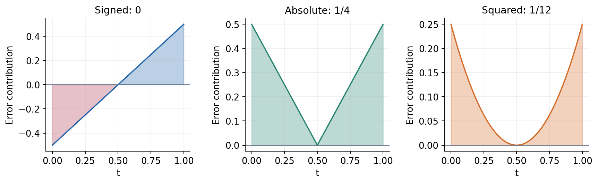

若 r 的单位是摄氏度，t 是分钟，三个积分的单位分别为摄氏度分钟、摄氏度分钟和摄氏度平方分钟。计算方式相似，不意味着含义或单位相同。

## 五 积分的基本运算来自小段求和

若 f、g 在相同区间可积，常数 c 不依赖积分变量，则有限求和的加法与数乘关系在极限中保留：

$$\int_a^b(f+g)=\int_a^bf+\int_a^bg,\qquad \int_a^bcf=c\int_a^bf.$$

若 $a<c<b$，可以在 c 处分开两段再相加。约定 $\int_a^af=0$，以及 $\int_b^af=-\int_a^bf$。逆向积分的负号属于方向约定；在概率区间计算时，通常将较小端点放在下界。

若 f 非负，则积分非负；若 $f\le g$，则 $\int f\le\int g$。这些比较需要同一区间和同一积分变量。它们可以把函数的逐点上界转成总量上界。例如区间长度为 $\ell$，且 $|f|\le M$，则积分绝对值不超过 $M\ell$。下一节的基本定理证明会用到这个非常具体的工具。

## 六 累积函数为什么能把导数找回来

设 f 在 $[a,b]$ 连续，定义从固定 a 开始的累积函数

$$A(x)=\int_a^xf(t)\,dt,\qquad x\in[a,b].$$

对内部点 x 和足够小的非零 h，利用区间可加性：

$$\frac{A(x+h)-A(x)}h=\frac1h\int_x^{x+h}f(t)\,dt.$$

从右侧减去 f(x)，得到 f(t)-f(x) 的短区间平均。不论 h 正负，其绝对值都不超过该小区间上 $|f(t)-f(x)|$ 的最大值。由于 f 在 x 连续，区间收缩时此最大值趋零，因此 $A'(x)=f(x)$。端点只谈相应的单侧导数。这是微积分基本定理的一部分。[R2]

这条论证说明，连续性用在“短段内函数值接近 f(x)”这一步。若在一个跳跃点不连续，累积函数仍可能连续，但不能原样断言其导数等于指定的跳跃点高度。修改有限个点的函数值也不改变积分，积分不会记住这些孤立点的高度。

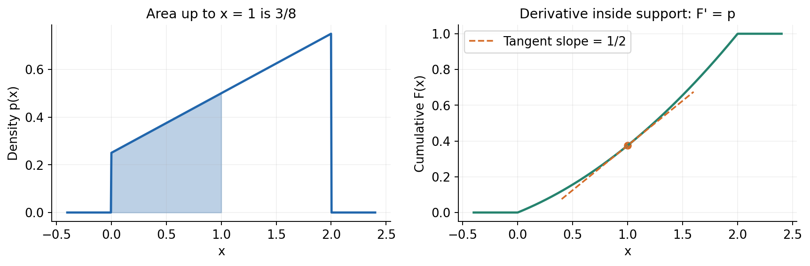

## 七 原函数为什么能计算定积分

假定 f 连续，G 是它的一个原函数，即 $G'=f$。上一节构造的 A 也满足 $A'=f$，因此 $G-A$ 的导数处处为0。由一元中值定理，G-A 在区间上为常数。于是

$$\int_a^bf(x)\,dx=G(b)-G(a).$$

本讲在此接受一元中值定理：H在[a,b]连续且在(a,b)可导时，存在内部点ξ，使H(b)−H(a)=H′(ξ)(b−a)。用于H=G−A，零导数便推出任意两点取值相同。上面先从积分定义建立A，再比较导数，没有把原函数端点差同时当作定义和证明结论。

例如 $(x^3/3)'=x^2$，所以 $\int_0^1x^2dx=1/3$，与 Riemann 和推导独立一致。$(x+x^2/2)'=1+x$，所以 $\int_0^2(1+x)dx=4$。$( -e^{-x})'=e^{-x}$，所以 $\int_0^Be^{-x}dx=1-e^{-B}$。原函数可加任意常数，但端点作差时常数消失。

积分可以存在而没有简单的初等原函数。遇到这种情况，可以用积分本身定义新函数，也可以做有误差控制的数值近似。没有写出闭式，不等于积分不存在；得到一个数值，也不等于已经证明存在。

## 八 主例 从未归一化形状得到密度

固定区间 $[0,2]$ 和非负形状 $q(x)=1+x$，区间外取0。它的总量为 $Z=\int_0^2q(x)dx=4$，因此归一化密度是

$$p(x)=\frac{1+x}{4}\quad(0\le x\le2),\qquad p(x)=0\quad\text{otherwise}.$$

“归一化”是把总量缩放到1。一般只有在 q 非负且 $0<Z<\infty$ 时，$p=q/Z$ 才可这样解释。全零函数不能除以0；有负值不能作为普通概率密度；无限总量也不能用一个有限常数修复。

区间 $[u,v]\subseteq[0,2]$ 的分配量为

$$P([u,v])=\int_u^vp(x)dx=\frac{v-u}{4}+\frac{v^2-u^2}{8}.$$

代入 $u=1/2$、$v=3/2$，得到 $1/4+2/8=1/2$。区间长度为1，两个端点密度为3/8和5/8；梯形面积也是 $1\times(3/8+5/8)/2=1/2$。对于线性曲线，这个几何核对是精确的，而不是一般数值积分都精确。

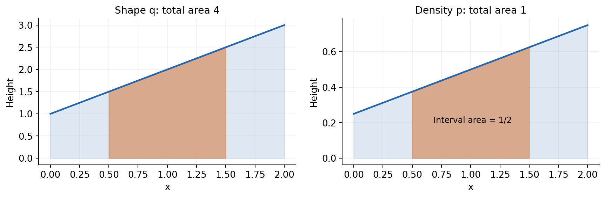

若区间超出支持集，先取与 $[0,2]$ 的交集。积分没有理由把区间外公式 $1+x$ 继续延伸。完整累积函数是：x小于0时为0，$0\le x\le2$ 时为 $x/4+x^2/8$，x大于2时为1。它是非减函数；区间量等于两个累积值之差。

## 九 密度高度不受1这个上限限制

在 $[0,1/5]$ 上取常数密度5，在区间外为0，总量为 $5\times1/5=1$，完全符合归一化条件。其中 $[0,1/10]$ 的量是1/2。密度5并不是“概率500%”。密度的单位是变量单位的倒数，区间概率则无量纲。

对于本讲的有界密度，单个点的区间宽度为0，因此分配量为0。可以有 $p(1)=1/2$，却有 $P(\{1\})=0$。连续单点概率为零并不妨碍整个区间总量为1，不能把连续区间当作有限个点来相加。

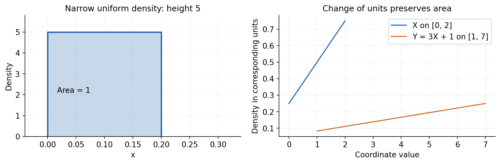

形式上的连续概率定义、CDF与PDF之间更一般的关系，以及离散点质量，在第十九讲展开。这里所有结论都围绕已经给定且可积的普通密度，不包括狄拉克 delta 这类广义对象。

## 十 换元就是同时改变高度和小段宽度

设 $x=g(u)$，g 在 $[\alpha,\beta]$ 上连续可微，f 在 g 的取值范围连续。由链式法则与基本定理：若 $F'=f$，则 $\frac{d}{du}F(g(u))=f(g(u))g'(u)$，所以

$$\int_{g(\alpha)}^{g(\beta)}f(x)dx=\int_\alpha^\beta f(g(u))g'(u)du.$$

这是带方向积分的换元公式，不要求 g 递增。若要把区间密度换成新变量的密度，则通常先要求变换一一对应且可微，使用逆变换导数的绝对值，并按新的支持集写区间。不能把这两个使用场景的正负号混在一起。[R3]

把主例的坐标放大平移为 $Y=3X+1$。逆关系为 $x=(y-1)/3$，宽度 $dx=dy/3$，新支持集为 $[1,7]$，故

$$p_Y(y)=p_X((y-1)/3)\frac13=\frac{y+2}{36}\quad(1\le y\le7).$$

原区间 $[1/2,3/2]$ 变成 $[5/2,11/2]$。宽度扩大3倍，高度相应除以3，新旧积分都等于1/2。如果只把 x 替换成 $(y-1)/3$ 而漏乘1/3，新“总量”会等于3。

若 $Y=1-2X$，区间方向翻转。按递增的 y 写密度时用 $|dx/dy|=1/2$，支持集是 $[-3,1]$，不能得到负密度。密度的变换关系会在后续分布课程中进一步讨论。

## 十一 非线性换元必须保留变化的因子

仍在 $[0,1]$ 上积分 x²，令 $x=u^2$，$u\in[0,1]$。正确结果是

$$\int_0^1x^2dx=\int_0^1u^4(2u)du=\frac13.$$

如果只把 x² 改成 u⁴而漏掉2u，就得到1/5。虽然两次都在0到1积分，变量所代表的小段长度已不同，不能因为上下界数字相同就省略变换因子。

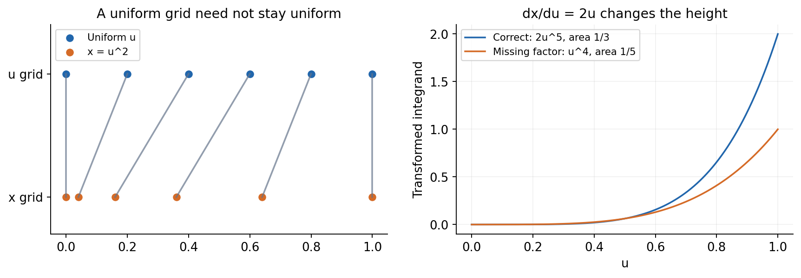

g'(0)=0 不妨碍这个前向换元例子；公式由链式法则直接证明。若反过来写新变量密度，逆导数可能在边界发散，需要处理可积性，不能未经检查就把所有密度变换都当成处处平滑的缩放。

## 十二 数值积分是具体有限算法

对等分点 $x_i=a+ih$，$h=(b-a)/n$，左、右、中点和梯形公式分别为

$$L_n=h\sum_{i=0}^{n-1}f(x_i),\qquad R_n=h\sum_{i=1}^nf(x_i),$$

$$M_n=h\sum_{i=0}^{n-1}f((x_i+x_{i+1})/2),$$

$$T_n=h\left[\frac{f(x_0)+f(x_n)}2+\sum_{i=1}^{n-1}f(x_i)\right].$$

中点法用每段中心高度，梯形法用两端连线代替曲线。梯形法也是 $(L_n+R_n)/2$。在主密度 p 上，梯形和中点法对任何正整数 n 都精确，因为线性函数每段的平均高度等于中点高度。此事实不说明分辨率无关紧要，只说明本例太简单，无法暴露曲率误差。

因此还需独立的曲线 x²。由有限求和可得

$$T_n=\frac13+\frac1{6n^2},\qquad M_n=\frac13-\frac1{12n^2}.$$

n翻倍时，两者精确算术的绝对误差都缩小4倍。对 n=4，T为11/32、M为21/64。左、右矩形则仍有一阶主要误差。这里的误差曲线来自解析公式与独立求和核对，而非给图形拟合一个好看的斜率。

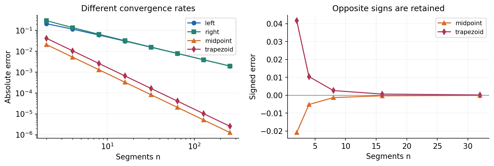

对 $f\in C^2([a,b])$，即二阶导数存在并连续，且 $|f''|\le K$，中点与梯形法的绝对误差分别不超过 $K(b-a)^3/(24n^2)$ 与 $K(b-a)^3/(12n^2)$。[R4] 给出一般定理，本讲不证明其最优常数。我们已为 x² 独立推得精确误差，并可检查这时 K=2，恰达到界。公式中的 K 不能忽略；高频或陡峰会让它很大。

## 十三 不等分样本和端点顺序

若只有不等间隔采样值 $(x_i,y_i)$，梯形累积应使用每段自己的宽度：

$$T=\sum_{i=0}^{n-1}\frac{y_i+y_{i+1}}2(x_{i+1}-x_i).$$

本课CSV保留 x 与 q 两列，避免让行号假扮坐标。把样本行随意打乱会改变所沿路径。NumPy 的 trapezoid 按输入顺序计算，传入 x 时不会先排序；下降坐标可以表达逆向积分。[R6] 本课为清楚暴露数据问题，教学封装要求一维、有限、严格递增的坐标和等长数值列表，不会悄悄排序，也不会悄悄去掉缺失值。

一般而言，梯形法近似的是采样点之间的分段直线面积。若相邻点之间有未观测到的峰，计算无法凭空恢复它。在概率应用里，应先验证非负性和支持集，而不是只见到一个接近1的总和就宣布模型合格。

## 十四 无穷区间需要额外一个极限

$e^{-x}$ 在非负半轴上是一个归一化密度，因为

$$\int_0^\infty e^{-x}dx:=\lim_{B\to\infty}\int_0^Be^{-x}dx=\lim_{B\to\infty}(1-e^{-B})=1.$$

右边是反常积分的定义。程序只能计算有限区间，所以先取 B；此时真实保留量为 $I_B=1-e^{-B}$，未保留的尾部为 $e^{-B}$。尾部是数学上明确存在的量，不会因为程序数组在 B 结束而消失。

若以梯形值 Q 近似保留量，针对完整总量1的带符号误差严格分解为

$$Q-1=(Q-I_B)-e^{-B}.$$

第一项为离散化误差，第二项为负的截断误差。由三角不等式，总绝对误差不超过二者绝对值之和。浮点计算本身还会增加舍入效应，以上 Q 可先理解为精确执行有限公式的值。

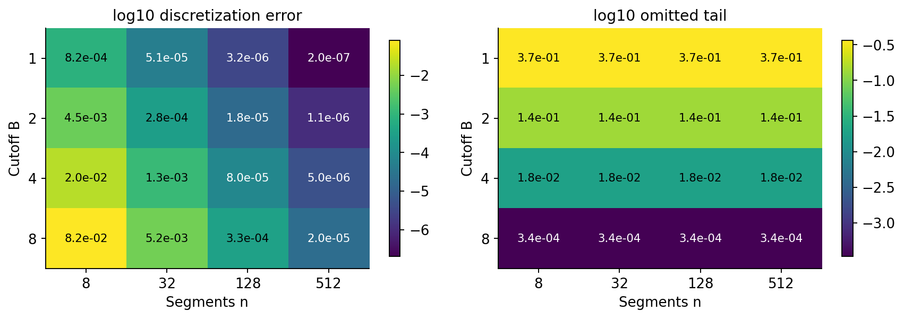

固定 B、n趋大，Q趋向 $1-e^{-B}$，而非1。固定 n 时增大 B，h也变大，所以既减少尾部遗漏，也可能增大离散化误差。要比较截断范围，应同步控制 h 或明确报告 n；不能把“范围更大”自动当成“答案更准确”。

## 十五 偶然抵消不是可靠验收

$e^{-x}$ 是凸函数，梯形连线高于曲线，所以 $Q-I_B$ 非负；尾部遗漏贡献负误差。二者可能接近抵消，导致 Q偶然接近1。只检查“积分约等于1”就可能错过两个都不小的错误。

例如 B=4、n=8时，尾部约为0.0183156，梯形值约为1.00205。与完整积分的差只有约0.00205，但与被截区间的真实值相差约0.020367。继续加密网格会减少正偏差，使 Q下降并趋向0.981684，而它对完整总量1的误差反而可能暂时变大。这不违反收敛，因为收敛目标是当前有限区间的积分。

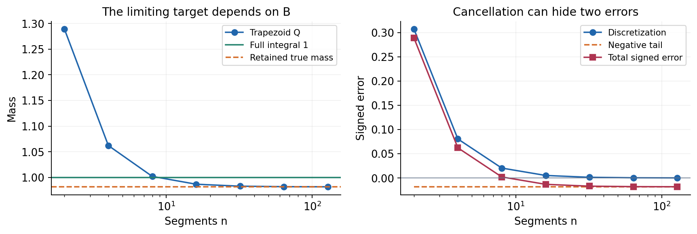

还要警惕把截断后的曲线重新除以自己的积分。这样确实能让剩余区域总量为1，但定义的是截断归一化后的另一个模型。其尾部概率被设为0，内部区间的概率被放大。若目标本来就是在截断条件下建模，可明确采用它；若目标是原密度，不能把这一改动伪装成数值误差修正。

## 十六 二重积分多出的是小面积

对二维矩形网格，每个小格的贡献约为 $f(x_i,y_j)\Delta x_i\Delta y_j$。两个宽度缺一不可。二维密度的单位是两个变量单位乘积的倒数；积分之后得到无量纲总量。

取三角形 $D=\{(x,y):0\le y\le x\le1\}$，在 D内定义常数密度2，区外为0。三角形面积为1/2，总量为1。先固定 x，对 y从0积分到x；内层结果为2x，再对 x积分：

$$\iint_D2\,dA=\int_0^1\left(\int_0^x2\,dy\right)dx=\int_0^12x\,dx=1.$$

改变积分顺序时，同一三角形应写成 $0\le y\le1$、$y\le x\le1$，所以

$$\int_0^1\left(\int_y^12\,dx\right)dy=\int_0^12(1-y)\,dy=1.$$

这里的被积函数在有界简单区域上连续，两种迭代积分可以使用 Fubini 定理相等；一般更广泛的换序需要检查可积性条件，不能无条件交换无限运算。[R5]

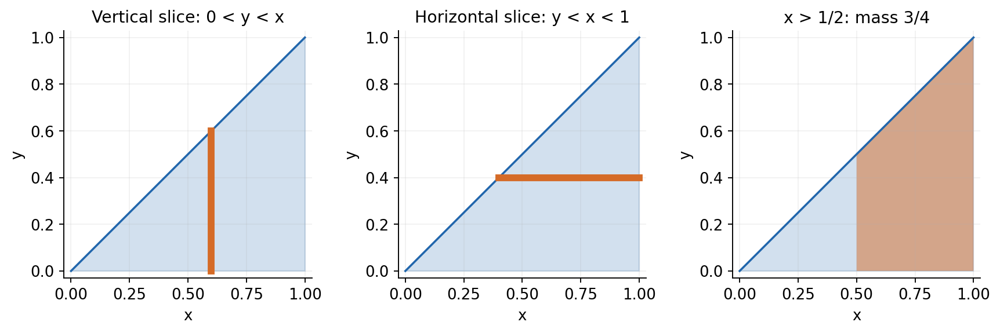

若求 x大于1/2的区域量，积分为 $\int_{1/2}^12x\,dx=3/4$。直接在整个正方形积分常数2会得到2，那不是归一化失败的小数误差，而是遗漏了支持集这一模型错误。

## 十七 连续边界不占面积 网格边界仍会偏

在单位正方形每轴取 n个等宽中点，中心坐标为 $(i+1/2)/n$，i从0到n-1。若以“中心满足 $y\le x$”决定整个小格是否计入，计入的中心数为

$$1+2+\cdots+n=\frac{n(n+1)}2.$$

每格面积为 $1/n^2$、密度为2，于是估计总量为 $1+1/n$。若改用严格不等号 y<x，少算对角线上n个中心，得到 $1-1/n$。两者均趋向1，但任意有限 n都显示一阶边界误差。

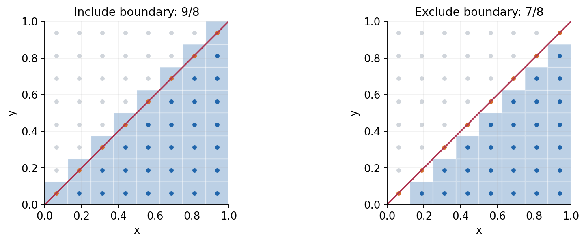

连续积分中，修改斜边上的密度不改变结果，因为这条边可以装进面积任意小的细带，且密度有界。离散算法却给每个被选中心分配整个格子面积；它把边界点扩成了有限面积的选择。可以用边界切格的精确面积、更贴合区域的网格，或本例的迭代积分减小这种问题。仅修改“小于”或“小于等于”不会创造通用的高精度法。

n乘n网格要处理 $n^2$ 个代表点。d维每轴 n点的朴素网格需要 $n^d$ 个位置；维数增长会迅速改变可承受的计算量。后面的采样与蒙特卡洛单元会讨论另一类策略，本讲不把二维小网格的便利外推到高维。

## 十八 网格一致也可能共同漏掉结构

考虑 $f(x)=\sin^2(16\pi x)$ 在 $[0,1]$ 上的积分。用三角恒等式可知真实积分为1/2。但在 n=8或n=16的等分端点，所有函数值在精确算术下都是0，梯形结果也是0。两个分辨率相同的错误答案，不能当成收敛证明。浮点程序会输出极小正数，因为近似π和正弦实现不把这些点全部精确映射到0。

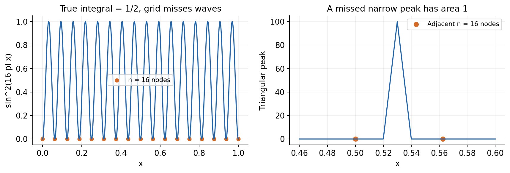

再看中心在0.53、半宽0.01、峰高100的三角形函数，支持集为[0.52,0.54]，真实面积为1。n=8与16的梯形端点全部漏过峰，返回0；加密之后可能先高估，再逐渐接近1。这个连续但有折点的函数也不满足全区间C²误差界的前提。提高分辨率、错开网格、利用已知支持集或局部加密，都能提供额外证据；任何有限采样不能排除所有未采样的窄峰。

## 十九 实验实现与失败边界

实验脚本只使用Python标准库进行核心计算，Notebook与图形使用Matplotlib。数据文件给出固定无量纲采样点与形状；没有网络请求、随机种子依赖、GPU或付费API。全部已知答案来自本讲明确的函数和支持集。

函数入口拒绝布尔值、字符串、复数、非有限数、长度不匹配和不递增坐标。等分网格必须在浮点表示中真正严格递增；大坐标上过小的段宽可能让相邻点相同。先检查完整网格再调用被积函数，可以避免把溢出的中间坐标传给回调。采样返回值、段贡献和总和也要验证，有限输入不保证乘积有限。

对极小正B，直接算 $1-\exp(-B)$ 可能损失有效数字；参考值采用 $-\operatorname{expm1}(-B)$。[R7] 这仍是浮点近似，不是任意精度证明。Fraction用于多项式与有限计数的独立有理数核对，不能精确表示一般指数与正弦值。

数值积分函数只实施明确的有限规则，不是通用自适应积分器。它要求下界严格小于上界；数学上的零长度积分和逆向积分可另行使用定义。本课故意拒绝它们以减少教学接口歧义，不能把接口限制误当成数学上不存在这些积分。

## 二十 本讲应留下的判断力

对一个新的积分任务，先写清函数、支持集、积分界、变量与单位，再确认连续性或其他可积性条件。能够手算时，至少保留一条与程序实现不同的核对路径。不能手算时，分开检查范围截断、离散化和数值表示，不要只盯最终小数。

主密度的归一化、换元前后区间量一致、x平方的精确求和误差，以及三角形的两种切片，分别检查了不同结构。任何一项通过都不能替代其他检查。概率课程将继续使用积分表达连续事件与期望；优化课程也会用它理解累计变化和误差界。

## 来源与阅读范围

本讲推导、合成例子和图形为独立编写。以下官方教材及文档用于核查定义、定理条件与接口语义；不把它们的示例、图片或大段文字复制进课程。

- [R1 OpenStax 定积分定义与性质](https://openstax.org/books/calculus-volume-1/pages/5-2-the-definite-integral)：最大分段宽度、有符号累积与连续函数可积。
- [R2 OpenStax 微积分基本定理](https://openstax.org/books/calculus-volume-1/pages/5-3-the-fundamental-theorem-of-calculus)：连续条件、累积函数求导与原函数端点差。
- [R3 OpenStax 积分换元](https://openstax.org/books/calculus-volume-1/pages/5-5-substitution)：链式因子与定积分上下界。
- [R4 OpenStax 数值积分](https://openstax.org/books/calculus-volume-2/pages/3-6-numerical-integration)：中点与梯形误差上界。本讲明确区分一般引用定理与独立推得的特例公式。
- [R5 OpenStax 一般区域上的二重积分](https://openstax.org/books/calculus-volume-3/pages/5-2-double-integrals-over-general-regions)：区域切片、积分次序与适用条件。
- [R6 NumPy 2.3 trapezoid 官方文档](https://numpy.org/doc/2.3/reference/generated/numpy.trapezoid.html)：沿给定坐标顺序积分，不自动排序。核心脚本未调用NumPy。
- [R7 Python 3.12 math 官方文档](https://docs.python.org/3.12/library/math.html)：fsum、isfinite、expm1与浮点行为。运行环境的精确版本另见测试记录。
