# 概率事件与条件信息

## 第十八讲 得到新信息之后怎样更新概率

一台合成设备检测器能对80%的缺陷设备报警，却不意味着它报警时有80%的把握遇到了缺陷。两句话使用同一个“80”，但筛选对象不同。第一句先找缺陷设备，第二句先找报警设备；报警设备还可能来自数量很多的合格设备。本讲将把这件事从数数讲到条件概率与Bayes公式，并解释什么时候多看一条信息会改变独立性。

直接先修是第2讲的数据与任务意识、第8讲的函数和基本代数。集合、事件、加权平均与条件概率都在本讲重新定义；不要求先学随机变量、期望、微积分或统计检验。最后的不相关反例只使用三个数的平均，不把第19讲的内容当作隐含先修。

本讲的主线是：先说清楚从哪里选对象，再列出互斥且完备的情况，最后确定每个比例的分母。所有设备、检测记录、状态和数值均为原创合成教学设置，不代表真实产品性能。我们更新的是模型内的概率判断；不讨论真实医疗诊断，也不把观察后的概率当作干预效果。

## 一 样本空间是模型的第一句话

设一次试验是“从某批设备中随机抽取一台，记录其编号”。所有可能被抽到的编号构成样本空间，记作 $\Omega$；其中一个具体编号 $\omega$ 称为一个结果。事件是样本空间的一个子集：如果抽中的编号属于该集合，就说事件发生。记号 $\omega\in D$ 表示结果属于事件D。

例如在一个仅用于理解集合的12台设备小例中，设 $\Omega=\{1,2,\ldots,12\}$，$D=\{1,2,3,4\}$ 表示缺陷，$A=\{3,4,5,6,7,8\}$ 表示报警。一个结果可以同时属于多个事件，但一次抽取只得到一个编号。事件 $D\cap A=\{3,4\}$ 是交集，要求两件事同时发生；$D\cup A=\{1,2,\ldots,8\}$ 是并集，表示至少一件发生；$D^c=\Omega\setminus D$ 是补集，表示D没有发生。

空集 $\varnothing$ 是不包含任何结果的事件，全集 $\Omega$ 是必然事件。若两个事件的交集为空，称其互斥。若若干互斥事件的并集恰好是 $\Omega$，它们构成样本空间的一种划分。划分不应漏项，也不应让一个结果被分到两个类别。

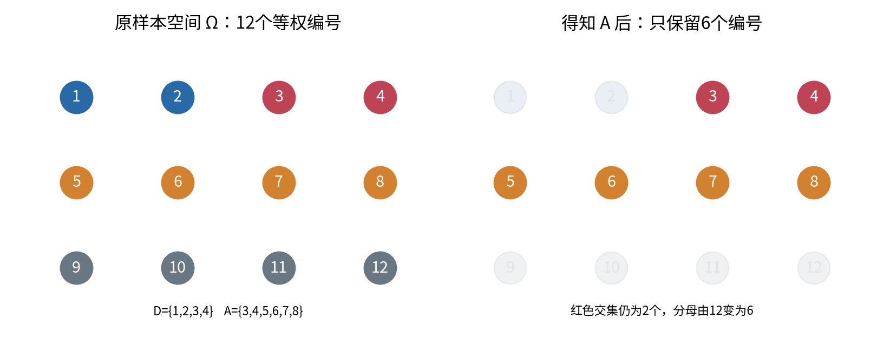

模型也可以只记录四种状态：缺陷且报警、缺陷且不报警、合格且报警、合格且不报警。这种样本空间把很多编号合并到一个结果里。合并后的四种状态不必等可能。写出四个名字，然后给每种状态都分配1/4，会凭空改掉原模型。

## 二 从等可能计数走向概率质量

有限样本空间中，给每个结果分配非负数 $p_\omega$，并要求 $\sum_{\omega\in\Omega}p_\omega=1$。事件的概率是它包含的结果的质量之和：

$$P(E)=\sum_{\omega\in E}p_\omega.$$

因此 $P(E)\ge0$、$P(\Omega)=1$，互斥事件满足可加性。对任意E，$P(E^c)=1-P(E)$；对可能重叠的E、F，必须减去重复计算的交集：

$$P(E\cup F)=P(E)+P(F)-P(E\cap F).$$

这些有限运算由求和直接得到。更一般的概率论要求对可数个互斥事件也满足可加性；本讲的所有证明与实验都处于有限情况，不涉及无穷集合上的技术细节。[R1]

只有在每个编号等可能时，才能把概率写成“符合条件的编号数除以总编号数”。若12个编号都等权，图1中 $P(D)=4/12$、$P(A)=6/12$、$P(D\cap A)=2/12$；如果编号1被抽到的机会特别大，这些数数比例就需要改为相应权重的和。

还应区分三种数字。模型概率是设置中指定的数；固定合成总体的比例可以在“均匀抽一台”的模型下成为精确概率；有限次重抽得到的比例是有波动的经验频率。不能把“模拟100次恰好出现0次”直接翻译成模型概率为0，也不能把主表的精确数字声称为真实工厂中的已知常数。

## 三 主表先于公式

现在使用贯穿本讲的10000台合成设备总体。抽取规则是每个编号等可能。每台设备有预先固定的真实状态和报警状态，完整列联表如下。列联表就是把两个分类属性的每种组合分别计数。

| 真实状态 | 报警A | 不报警 $A^c$ | 行合计 |
| --- | ---: | ---: | ---: |
| 缺陷D | 80 | 20 | 100 |
| 合格 $D^c$ | 495 | 9405 | 9900 |
| 列合计 | 575 | 9425 | 10000 |

行合计描述真实状态，列合计描述检测结果。四个内部格子的和必须等于10000；最后一行和最后一列只是边际总数，不能再当作新的样本加进去。合格表示在本合成设置中没有指定缺陷，不代表设备满足所有实际安全标准。

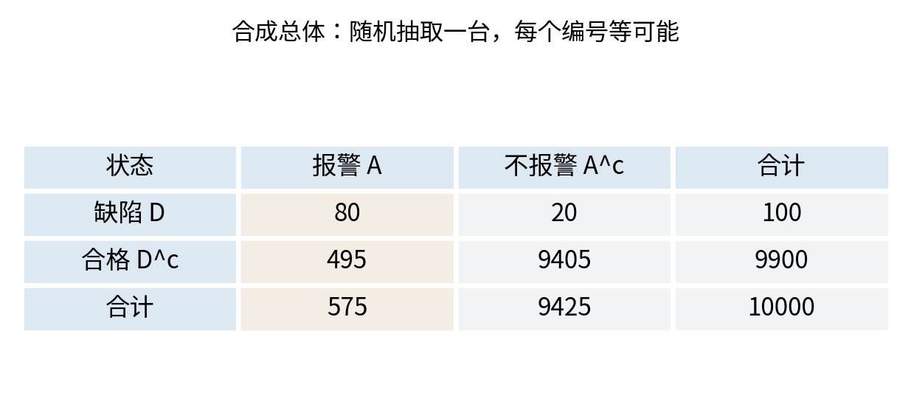

缺陷基准率是 $P(D)=100/10000=0.01$。总体报警率为 $P(A)=575/10000=0.0575$。缺陷且报警的联合概率是 $P(D\cap A)=80/10000=0.008$。“缺陷且报警”没有先筛选任何子群，分母仍是全部设备。

## 四 条件概率是在已知范围内重新计算

若已知事件B发生，而且 $P(B)>0$，只保留B内的结果，再把其总质量重新缩放为1。对任意事件E，定义

$$P(E\mid B)=\frac{P(E\cap B)}{P(B)}.$$

竖线右边写已知信息，左边写要判断的事件。条件概率不是对两个事件相除，也不表示B在时间上必须早于E。分母为正是定义的一部分。[R2]

对等可能的有限编号，公共的总数约掉，留下 $|E\cap B|/|B|$。主表中，已知缺陷时只有100台符合条件，其中80台报警，所以

$$P(A\mid D)=\frac{80}{100}=\frac45=0.8.$$

反过来，已知报警时，候选范围是575台，其中80台缺陷：

$$P(D\mid A)=\frac{80}{575}=\frac{16}{115}\approx0.139130.$$

二者的交集相同，分母不同。把0.8当成0.139130的替代物，并非小数误差，而是回答了另一个问题。一般而言，$P(E\mid B)=P(B\mid E)$ 没有保证；当交集概率为正且两边都有定义时，二者相等当且仅当 $P(E)=P(B)$。

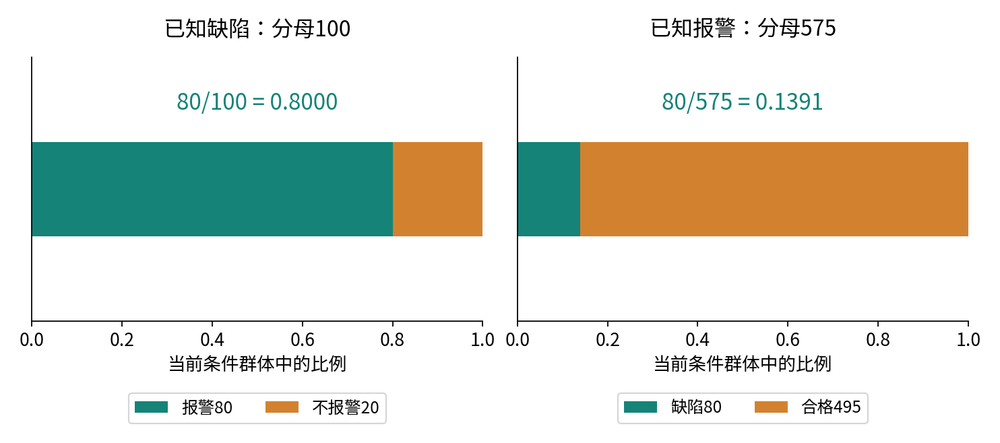

条件之内也有补集法则：$P(D^c\mid A)=1-P(D\mid A)=99/115$。但 $P(D\mid A^c)$ 不是它的补数，因为条件已经变了。主表给出 $P(D\mid A^c)=20/9425=4/1885\approx0.002122$。拿到“不报警”的信息后，缺陷概率降低，但本模型下没有降到0。

## 五 乘法公式来自把分母乘回来

由条件概率定义，如果 $P(D)>0$，有

$$P(D\cap A)=P(D)P(A\mid D).$$

本例为 $0.01\times0.8=0.008$。同一个交集还可写成 $P(A)P(D\mid A)$。这两种分解相等，正是随后反转条件的基础。

对于三个事件，只要相应条件概率有定义，逐次分解为

$$P(E\cap F\cap G)=P(E)P(F\mid E)P(G\mid E\cap F).$$

最后一项的条件是前两个事件同时发生，而非只剩F。省掉E需要新的条件独立假设，不能从乘法公式本身得到。若某个条件事件概率为0，包含它的交集概率必为0；不能为了写一棵树，强行计算没有定义的分支条件概率。

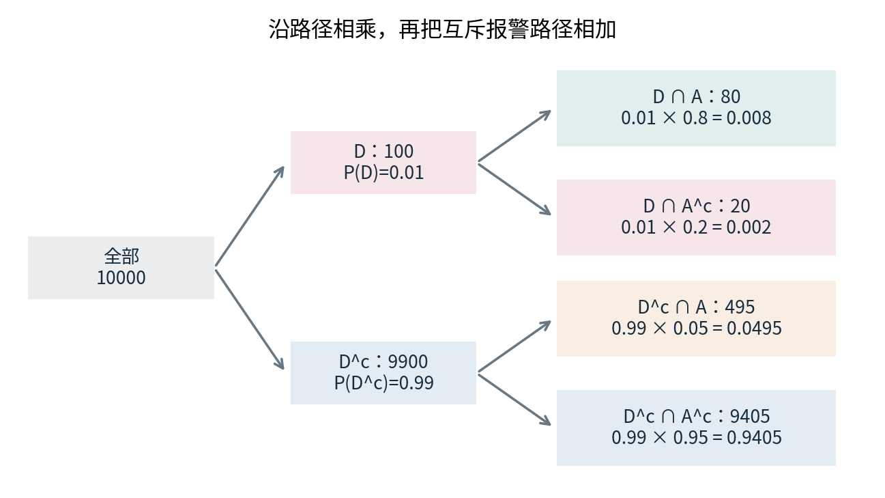

## 六 全概率公式负责把互斥来源加回来

D和 $D^c$ 互斥且完备。A可以拆成两个不重叠的部分：$A\cap D$ 与 $A\cap D^c$。所以

$$P(A)=P(A\mid D)P(D)+P(A\mid D^c)P(D^c).$$

其中 $P(A\mid D^c)=495/9900=0.05$ 是合格设备中的误报比例。代入可得 $P(A)=0.8\times0.01+0.05\times0.99=0.0575$。若把两个条件概率直接平均为0.425，相当于偷偷假定缺陷与合格各占一半；这与1%和99%的总体组成相冲突。

一般地，若 $H_1,\ldots,H_k$ 是互斥且完备的有限划分，且每个被使用的条件都有正概率，则

$$P(A)=\sum_{j=1}^{k}P(A\mid H_j)P(H_j).$$

零概率分组的联合质量为0，可以从求和中去掉，无需定义它内部的条件概率。这是按组加权的结果，不需要事件之间独立。权重必须对应目标总体；另一个抽样方案下的分组比例不能无说明地替代它。

## 七 Bayes公式是同一个交集的两种表示

先写 $P(D\mid A)=P(D\cap A)/P(A)$，再用乘法公式改写分子，用全概率公式改写分母，就得到

$$P(D\mid A)=\frac{P(A\mid D)P(D)}{P(A\mid D)P(D)+P(A\mid D^c)P(D^c)}.$$

必须有 $P(A)>0$。公式里，$P(D)$ 是看到此次报警之前的先验；$P(A\mid D)$ 描述缺陷假设对报警的支持程度，在这次更新中称似然；$P(D\mid A)$ 是看到报警之后的后验；分母是证据A在整个模型中的概率。似然不是后验，也不要求不同假设下的似然值加起来等于1。

本例可先求两项未归一化权重：缺陷为0.008，合格为0.0495，再分别除以共同总和0.0575。缺陷后验为16/115，合格后验为99/115，二者相加为1。对于k个互斥完备假设，同样先算 $w_j=P(H_j)P(A\mid H_j)$，再除以 $\sum_iw_i$。

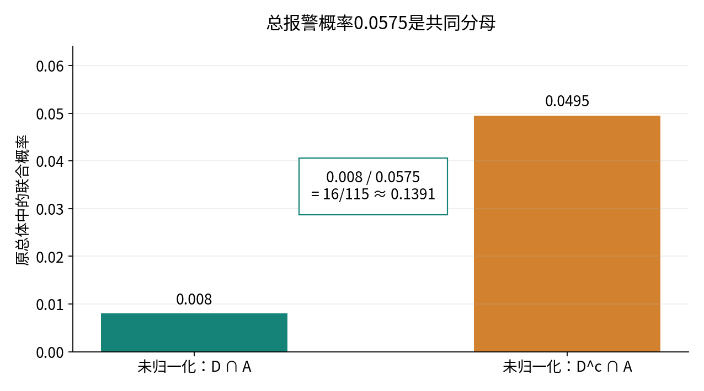

这一推导只用了交集、加法与除法。Bayes公式不是额外改变概率规律的规则。困难通常在输入：先验来自哪个总体，似然描述哪个检测流程，新证据是否已包含在旧信息里。公式代入正确仍可能因为输入模型不适用而回答错误的实际问题。

## 八 基准率决定相同证据能把判断推到哪里

记缺陷基准率为p，检出率为s，合格误报率为f。保持检测机制不变时，有

$$q(p)=\frac{sp}{sp+f(1-p)}.$$

这里 $0\le p,s,f\le1$，分母必须为正。主例采用 $s=0.8,f=0.05$。当p依次为0.001、0.01、0.1、0.5时，报警后缺陷概率约为0.015764、0.139130、0.64、0.941176。检测器没有变，目标总体的组成变了。

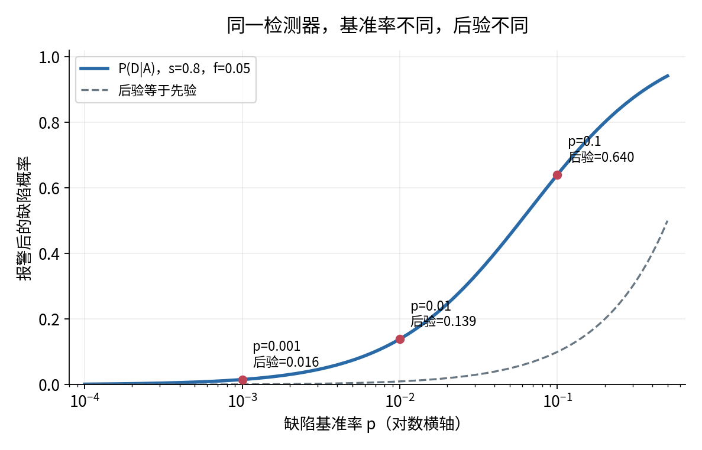

为何基准率低会有大量误报？主表中缺陷设备只有100台，即使其中80%报警，也只有80台。合格设备有9900台，5%的误报就产生495台报警。因此“误报比例只有5%”与“多数报警来自合格设备”可以同时成立。

若 $0<p<1$ 且s、f均为正，还可把后验改写为赔率形式。概率q的赔率定义为 $q/(1-q)$。两种假设的后验相除，共同分母消去：

$$\frac{P(D\mid A)}{P(D^c\mid A)}=\frac{P(D)}{P(D^c)}\frac{P(A\mid D)}{P(A\mid D^c)}.$$

先验赔率为1/99，似然比为0.8/0.05=16，后验赔率为16/99；转回概率是 $16/(16+99)=16/115$。16倍指赔率的乘数，不表示概率一定变为16倍。若某一分母为0，应回到联合概率公式处理端点，不能机械做赔率除法。

## 九 更新方向和重复信息

在 $0<p<1$、证据概率为正的条件下，比较q(p)和p。将正分母乘到另一边，约去正因子p后，$q(p)>p$ 等价于 $s>f$。因此报警是否提高缺陷概率，取决于缺陷设备是否比合格设备更容易产生这种报警。如果s=f，报警不区分两种状态；若s<f，报警反而降低缺陷概率。这里讨论概率判断，没有作出维修或报废决策。

若之后得到第二条证据B，正确的新权重是

$$P(D\mid A)P(B\mid D\cap A),\qquad P(D^c\mid A)P(B\mid D^c\cap A).$$

只有在相应条件独立假设成立时，才能将 $P(B\mid D\cap A)$ 简化为 $P(B\mid D)$。例如两个检测通道在“已知缺陷”和“已知合格”两组内分别独立，且都具有s=0.8、f=0.05，则同时报警的似然分别为0.64和0.0025，后验为 $0.0064/(0.0064+0.002475)=256/355\approx0.721127$。

如果B只是把第一次报警复制显示一次，知道A后B已经必然发生，两组内新增似然都为1，后验仍为16/115。重复读取同一条日志不能创造新证据。若两通道共享噪声源，是否可以相乘也需要另行检查。

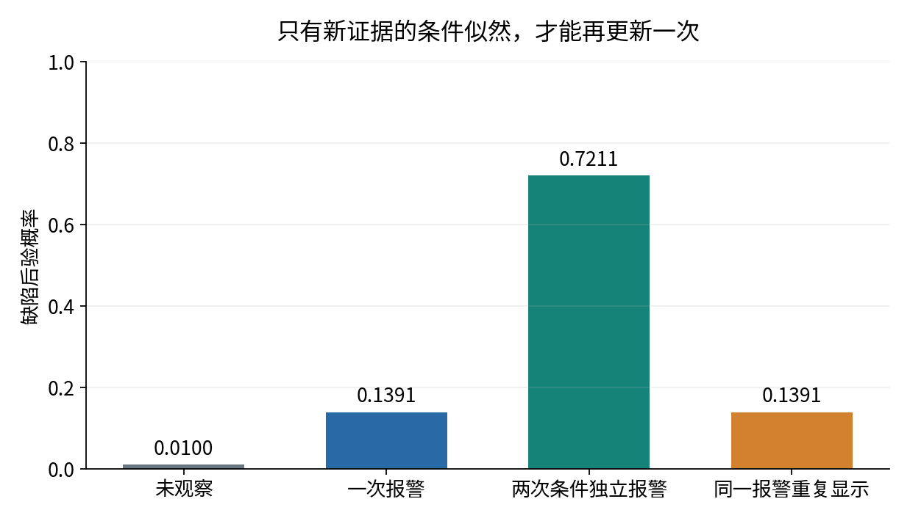

## 十 独立不等于互斥

事件E与F独立的定义是

$$P(E\cap F)=P(E)P(F).$$

这个定义是对称的，也适用于某个事件概率为0的情况。若 $P(F)>0$，它等价于 $P(E\mid F)=P(E)$，即得知F不会改变E的概率。[R3]

两个独立公平开关各有0、1两种状态，联合的四种组合各占1/4。令E为第一个开关为1，F为第二个开关为1，则交集为1/4，边际乘积也是1/4。相反，同一个公平开关的“为0”和“为1”互斥，交集概率为0，但边际乘积是1/4，因而不独立。对于两个正概率事件，互斥意味着一个发生后另一个不可能发生，是很强的信息关系。

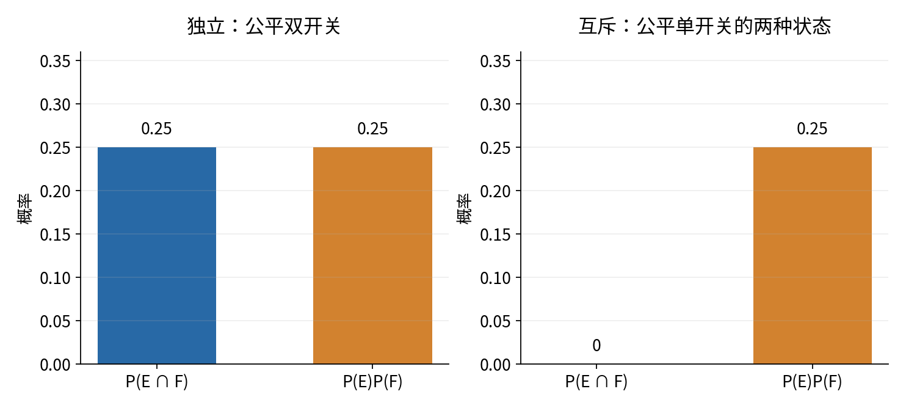

在一般2×2计数表中，将四格按行写为a、b、c、d，总数N为正。第一行事件与第一列事件独立，等价于 $a/N=((a+b)/N)((a+c)/N)$。乘开并约掉相同项，得到 $ad=bc$。本讲程序用Python整数检查这个等式，避免用浮点相关系数来判断精确合成表。

这个判据也允许空行或空列；概率为0或1的退化事件仍可独立。但在现实有限样本表中，$ad\ne bc$ 通常只表示观测比例不精确相等，不能不经统计推断就宣称真实总体一定依赖。总体独立性、模型独立假设与有限样本中的差值是三种不同层次的说法。

## 十一 条件独立要说清条件是什么

若 $P(C)>0$，事件E与F在给定C时条件独立，意味着

$$P(E\cap F\mid C)=P(E\mid C)P(F\mid C).$$

它是在重新归一化后的条件世界里使用相同的独立定义。若条件是一组可能的状态，例如高干扰或低干扰，就要对每个正概率状态分别检查，而不是只查其中一组。

考虑另一份合成数据。X=1表示通道X报警，Y=1表示通道Y报警。在高干扰组H的100次记录中，(1,1)、(1,0)、(0,1)、(0,0)分别出现64、16、16、4次；低干扰组 $H^c$ 也有100次，相应计数为4、16、16、64。

高干扰组内，两个报警边际都是0.8，联合为0.64，恰等于0.8×0.8。低干扰组内，两个边际都是0.2，联合为0.04，恰等于0.2×0.2。对二元事件，核对这一格与边际即可推出其余三格也满足乘积关系，因此每组内条件独立。

合并两组后，两个通道各自有100次报警，边际均为0.5，但同时报警有68次，联合为0.34，不等于0.25。知道X报警会把对高干扰组的判断提高，从而改变对Y报警的判断；忽略组别时，通道间出现依赖。

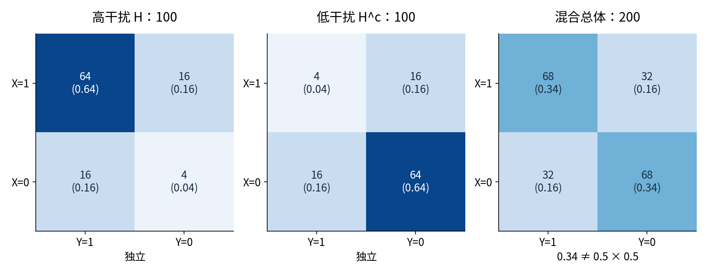

因此条件独立不推出无条件独立。反方向也不成立。回到两个独立公平开关，令C表示两个开关取值相等。条件之前四种组合各1/4；给定C之后只剩(0,0)与(1,1)，各占1/2。此时 $P(X=1,Y=1\mid C)=1/2$，但两个条件边际都是1/2，乘积为1/4。

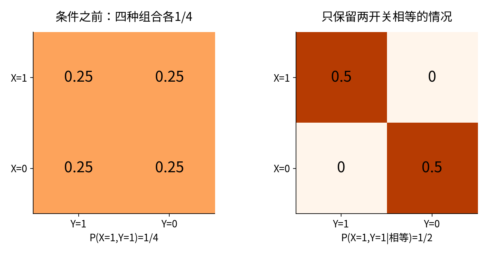

这还给出两两独立不等于共同独立的例子：事件E“X=1”、F“Y=1”、C“两者相等”任意两件的交集概率都是1/4，均等于边际乘积；三件同时发生的概率却为1/4，而三者边际乘积为1/8。对多个事件声称共同独立，要检查所有相关子集的乘积关系，不能只看成对关系。

## 十二 不相关为什么仍可能完全可预测

“不相关”需要先给结果赋予数值，并选定相关的定义。这里仅定义有限加权的协方差：若第i种结果概率为 $p_i$，两项数值为 $x_i,y_i$，先算平均 $\bar x=\sum_i p_ix_i$、$\bar y=\sum_i p_iy_i$，再算

$$\operatorname{Cov}(X,Y)=\sum_i p_i(x_i-\bar x)(y_i-\bar y).$$

它测量同向与反向的线性偏离是否在加权平均中抵消。后续课程将正式定义随机变量、期望与相关系数；本讲只需按有限表逐项相加。将每项展开并使用概率之和为1，可以得到等价式 $\operatorname{Cov}(X,Y)=\sum_i p_ix_iy_i-\bar x\bar y$。

设X只取-1、0、1，各以1/3出现，令 $Y=X^2$。三对数值为(-1,1)、(0,0)、(1,1)。平均分别为0与2/3，乘积的加权平均为 $(-1+0+1)/3=0$，因此协方差为0。两个变量的加权平方偏差均为正，所以以它们的标准差作分母时，相关系数也为0。

然而知道X就完全知道Y。具体地，$P(Y=0)=1/3$，而 $P(Y=0\mid X=0)=1$；或者比较事件 $\{X=0\}$ 与 $\{Y=0\}$，交集为1/3，边际乘积为1/9。两者绝不独立。

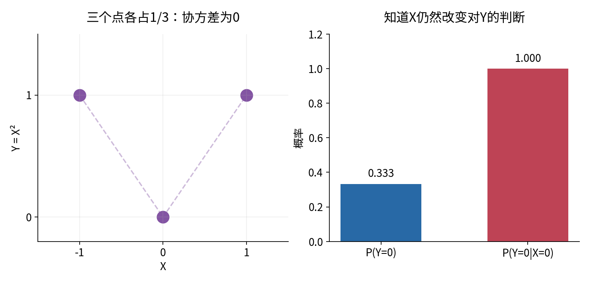

有限数值变量独立时，联合质量分解为边际乘积，有限双重求和便给出乘积平均等于平均的乘积，所以协方差为0。逆命题被上例否定。一个值得保留的特殊情况是事件的0/1指示数：取1表示发生、0表示不发生，此时协方差恰为 $P(E\cap F)-P(E)P(F)$，为0就等价于这两个事件独立。不能把这个二元特殊结论推广到所有数值变量。若某个变量恒定，标准差为0，相关系数反而没有定义。

## 十三 模拟是在检查实现和观察波动

实验分开两件事。先直接读取固定10000台列联表，重算精确比例；再使用已知的p=0.01、s=0.8、f=0.05，从同一个概率模型生成新的独立设备。后一过程可理解为从四格质量对应的总体中有放回抽取，不是从固定一批设备里不放回抽取。

脚本为每台设备生成两个独立的[0,1)均匀伪随机数。第一个小于p时标记缺陷；第二个分别与s或f比较，得到报警状态。n台设备产生长度为n的两个布尔数组；程序将它们压缩为(2,2)整数表。这里布尔值是程序内部生成的事件指示，外部数值参数仍不允许将True静默当作1。

固定种子20261004、NumPy 2.3.5、n=100000的实际输出为四格775、201、4942、94082，总报警5717，报警后缺陷比例 $775/5717\approx0.135561$。它接近但不等于模型真值16/115。换种子或改变随机生成算法后，具体计数可以改变；真值不由某一次模拟决定。

为观察有限样本波动，对n=200、2000、20000各独立重复400次。重复阶段直接用四分类计数抽样，产生(400,4)计数数组；这与独立抽取n个四分类结果后数频数具有相同分布。[R4] 每次只在报警数M大于0时计算缺陷报警数K与M的比值。

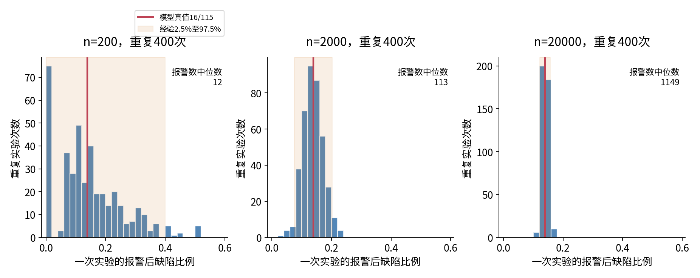

本次结果中，三个n对应的报警数中位数为12、113、1149；经验2.5%至97.5%范围依次为[0,0.4]、[0.075630,0.201835]、[0.121387,0.157534]。经验分位数的算法是排序后取第 $\lceil qR\rceil$ 个值，R为可计算重复次数，q为0.025或0.975。400次本身有限，分位数也会因种子改变而波动。

总样本n不是这个条件比例的直接分母；报警子群大小M才是。稀少条件会使很大的总样本仍只留下少量可用对象。样本量增大时典型波动缩小，不意味着每一条模拟路径都单调靠近真值，也不意味着错误代码会因n变大而自动正确。

## 十四 零分母有两种来源

第一种是模型本身给 $P(A)=0$。例如s=f=0时，不会产生报警，本讲的离散定义无法给出 $P(D\mid A)$。Bayes接口显式抛出异常，不会把0/0填成0，也不会返回一个貌似正常的缺陷判断。

第二种是模型的报警概率为正，但某次有限样本恰好没有报警。主模型只抽5台时，这种情况很常见。本次400个小样本重复中，有296次报警数为0；其后验经验比例记录为None，在CSV中对应空字段，并另外报告缺失次数。剩余104次的分位数只能描述“本轮有报警的重复实验”，不能伪装成全部400次的统计量。

若每次独立抽取且报警概率为0.0575，n次均不报警的模型概率是 $(1-0.0575)^n$。n=5时约为0.744，因而296/400的实际比例并不意外。这里的独立假设在设备之间；它不意味着单台设备的缺陷与报警独立。

给分母加一个很小的数、把缺失值填0、或悄悄删掉失败重复，都会改变问题。平滑和先验估计以后可以专门讨论；它们不能作为本讲的隐形修补。程序也拒绝正概率乘积因极小尺度下溢成0的情况，并保守拒绝正乘积进入双精度次正规范围，以免结果虽非零却失去足够相对精度；此时应改用精确分数或专门的对数实现。

## 十五 条件更新不是让世界发生变化

给定报警后缺陷概率上升，表示我们把注意范围收缩到报警子群，并重新分配相对质量。它不表示“报警使设备产生缺陷”。若在合成机制中强制每台设备的灯都亮，而没有改动设备状态，原有缺陷比例仍为1%；这与只筛选自然报警设备得到13.913%是两种操作。这个说法明确依赖“只改灯、不改缺陷状态”的机制设定，不能从列联表单独推断任意物理操作的效果。[R5]

同样，观察到两通道相关，可能是共同工况，也可能是其他机制；一张概率表不足以识别因果方向。条件独立可以帮助组织概率模型，但是否适用于维修、生产或干预决策，还需要机制假设与额外数据。本讲到此只建立“观察信息怎样更新概率”的语言。

## 十六 从手算到实现的完整核验路径

先确认样本空间和抽取规则，再把四格计数写完整。每个条件概率先用中文说“只看哪些对象，其中有多少符合目标”，然后填写分子分母。用全概率算出证据总量，用Bayes反转条件，最后检查后验各项非负且和为1。

代码还需要类型与尺度检查。概率参数必须是真正的有限实数且位于[0,1]；计数必须是非负整数并满足总数上限；一维先验与似然长度必须一致；先验和必须接近1，但接口不自动归一化。字符串、布尔值、复数、object数组和非有限值在转换或计算前被拒绝。正输入的转换或乘积若下溢为0，也应明确失败。

精确核验使用Fraction和Python整数，独立枚举四格各为0、1、2的80张非空表，将计数答案与Bayes答案、交叉乘积判据交叉核对。显式require检查在python -O下仍然执行。模拟只检查有限实现与波动，既不证明一般定理，也不验证真实设备性能。

## 十七 练习

1. 在图1的12编号模型中，求D并A、D交A、D的补集的概率，再求 $P(D\mid A)$ 与 $P(A\mid D)$。说明为什么均匀抽取假设不可省略。
2. 重算主表的基准率、总体报警率、检出率、误报率、报警后缺陷概率和不报警后缺陷概率。逐项标明分母。
3. 固定s=0.8、f=0.05，求让报警后缺陷概率至少为1/2的最小p。说明等号边界及分母条件。
4. 用赔率计算p=0.001时的报警后缺陷概率。有人说“似然比16，所以后验正好为0.016”，指出错误。
5. 推导全概率公式与多假设Bayes公式。若某个分组概率为0，应怎样处理？
6. 计算两次条件独立报警后的后验。再计算复制第一次报警的结果，并写出一般第二步更新公式。
7. 推导2×2表的独立判据ad=bc。用主表判断缺陷与报警是否独立，说明它与互斥的区别。
8. 核对高低干扰两组内的四格乘积，以及合并表的依赖。计算 $P(H\mid X=1)$ 与 $P(Y=1\mid X=1)$。
9. 对公平双开关的相等事件C，验证条件前后独立性改变，并验证E、F、C两两独立却非共同独立。
10. 对X取-1、0、1且Y=X²的例子，逐项计算均值、协方差及两个平方偏差平均，给出一个事件级独立性反例。
11. 模型报警概率为正而某次报警数为0时，输出该是什么？给出n=5时无报警的模型概率，并解释重复范围为什么不是置信区间。
12. 审查“报警后缺陷率为13.9%，所以强制亮灯会使13.9%的设备损坏”的推理。给出它混淆的两个操作。

完整推导与数值答案见单独的answers文档；实验指南给出逐步预测、运行与检查点。

## 来源与延伸阅读

[R1] John Tsitsiklis，MIT 6.041SC，Lecture 1 Probability Models and Axioms。核对样本空间、事件、等可能条件与可加性。https://ocw.mit.edu/courses/6-041sc-probabilistic-systems-analysis-and-applied-probability-fall-2013/resources/mit6_041scf13_l01/

[R2] John Tsitsiklis，MIT 6.041SC，Lecture 2 Conditioning and Bayes' Rule。核对正分母、乘法、全概率与Bayes公式。https://ocw.mit.edu/courses/6-041sc-probabilistic-systems-analysis-and-applied-probability-fall-2013/resources/mit6_041scf13_l02/

[R3] John Tsitsiklis，MIT 6.041SC，Lecture 3 Independence。核对独立、条件独立及共同独立的条件。https://ocw.mit.edu/courses/6-041sc-probabilistic-systems-analysis-and-applied-probability-fall-2013/resources/mit6_041scf13_l03/

[R4] NumPy 2.3官方文档，Generator.multinomial。核对概率输入、计数输出和size形状；程序不依赖末项自动补足的行为。https://numpy.org/doc/2.3/reference/random/generated/numpy.random.Generator.multinomial.html

[R5] Pearl、Glymour与Jewell，Causal Inference in Statistics A Primer，作者网站第3章预览，3.1节，印刷页54至55。这里只用于核对条件与干预的概念区别，不转载原文或图。https://bayes.cs.ucla.edu/PRIMER/primer-ch3.pdf
