# 随机变量与期望

## 第十九讲 怎样把随机结果变成可比较的平均损失

第十八讲讨论事件的概率：某个条件成立的可能性有多大。机器学习还需要比较不同程度的结果，例如预测错了多少、一次处理花了多少时间，以及某类输入下平均损失会是多少。仅给“是否发生”不够，我们需要把每种可能结果映射为数值，再保留这些数值如何分布。

本讲建立随机变量、PMF、PDF、CDF、期望、方差与条件期望。先修是第十七讲的积分和第十八讲的事件、条件概率；正文会明确重新说明所用记号。所有例子为无量纲合成教学模型，不是实际设备故障率，也不用于现实决策。常见命名分布留到第二十讲，联合分布和协方差的系统处理留到第二十一讲，抽样极限定理留到第二十二讲。

核心判断有三条。随机变量是从结果到数值的映射，不是把一个未知常数改名；期望是按模型概率加权的平均，未必是一种可能取值；函数、条件与平均的先后顺序会改变答案。数值模拟能检验实现与展示波动，不能替代这些定义及存在条件。

## 一 先写结果空间 再指定要测量什么

固定六个模型状态 $\Omega=\{A,B,C,D,E,F\}$，每个概率为1/6。它们是“下一次会处于哪一个状态”的全部可能结果，不是从现实世界收集来的六条样本。定义一个损失刻度X：

$$X(A)=X(B)=0,\quad X(C)=X(D)=1,\quad X(E)=2,\quad X(F)=4.$$

数学上，$X:\Omega\to\mathbb R$ 是一个函数。状态尚未确定时，X的取值不确定；一旦结果为F，观察到的数值就是 $x=4$。大写X表示随机变量，小写x通常表示一个可能值或一次实现值。[R1]

同一个状态空间可定义不同测量。令 $Z(A)=Z(B)=\text{quiet}$，其余状态归为active。Z是分类信息；若需要实数形式，可用0和1编码，但编码大小本身不赋予类别顺序含义。X记录损失，Z记录组别，二者都由同一个状态决定。

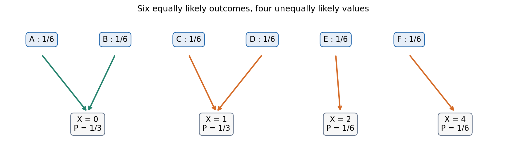

写 $\{X=1\}$ 是事件的简写，实际指 $\{\omega:X(\omega)=1\}=\{C,D\}$。因此 $P(X=1)=1/3$。随机变量让我们用数值条件简洁地指定事件，但底层仍是第十八讲的集合与概率。

## 二 离散概率质量函数合并相同取值

如果随机变量的可能取值是有限或可数的一列，称为离散随机变量。其概率质量函数为 $p_X(x)=P(X=x)$，简称PMF。对于有限状态模型：

$$p_X(x)=\sum_{\omega:X(\omega)=x}P(\omega).$$

本例得到 $p_X(0)=1/3$、$p_X(1)=1/3$、$p_X(2)=1/6$、$p_X(4)=1/6$；其他值的质量为0。所有概率非负，四个不同取值上的质量相加为1。

六个状态等可能，不意味着四种取值等可能。若错误地对0、1、2、4各赋1/4，就已经换了一个模型。程序应先按取值分组求和，再计算统计量，而不是调用去重操作后继续用等权平均。

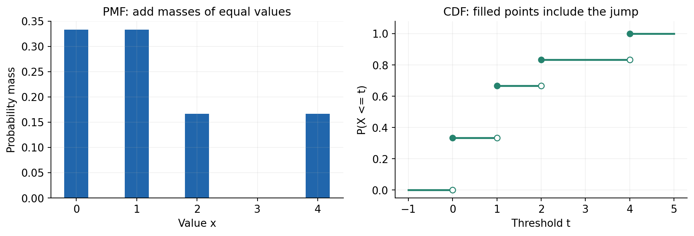

PMF图的柱高是概率，柱宽只是排版选择。把柱画宽或画窄不会改变这个离散模型。后面密度直方图的面积有概率含义，两种图不能混用同一解释。

## 三 CDF把各种分布放进同一种语言

累积分布函数定义为

$$F_X(t)=P(X\le t).$$

t是用于查询的阈值，X才是随机变量。本例t<0时F=0；0≤t<1时F=1/3；1≤t<2时F=2/3；2≤t<4时F=5/6；t≥4时F=1。注意恰好位于跳跃点时，使用包含该点的右侧高度。

一般CDF非减、右连续，向负无穷趋0，向正无穷趋1。这些性质来自事件嵌套与概率的连续性；本例可由逐段表达式直接检查。令 $F_X(t^-)$ 表示从左侧趋近t的极限，则

$$P(X=t)=F_X(t)-F_X(t^-).$$

例如F(1)=2/3，F(1⁻)=1/3，差为1/3。对于任何a<b，

$$P(a<X\le b)=F_X(b)-F_X(a).$$

若左端也包含，改成 $P(a\le X\le b)=F_X(b)-F_X(a^-)$。本例 $P(1<X\le2)=1/6$，而 $P(1\le X\le2)=1/2$。同一对数字端点，仅因是否包含左端点就差了1/3。

在没有点质量的密度模型里，改一个端点不改变概率，所以有时看起来可以忽略等号。不能把那一便利无条件搬到离散或混合模型。

## 四 期望是在固定模型上加权

有限离散随机变量的期望定义为

$$\mu=E[X]=\sum_xx\,p_X(x).$$

它也可直接按原状态累加 $\sum_\omega X(\omega)P(\omega)$；相同取值的状态合并后就得到上式。[R2] 本例为

$$E[X]=0\cdot\frac13+1\cdot\frac13+2\cdot\frac16+4\cdot\frac16=\frac43.$$

从六状态计算则是 $(0+0+1+1+2+4)/6=4/3$，两条路径一致。4/3并不是本模型的一种可能损失，因此“期望值”不表示下一次最可能出现这个数，也不表示一定能观察到这个值。

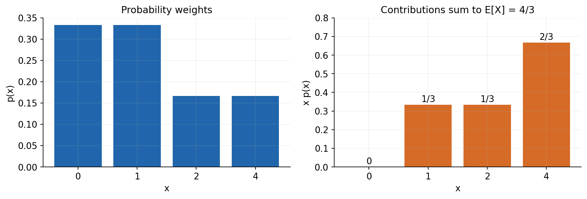

期望由假定的分布决定。若分布未知，我们可能用样本平均来估计它，但估计量与被估计的模型量是两种对象。不能用一次模拟的平均值重新定义原模型的期望。

## 五 存在一个分布 不保证存在有限平均

有限取值模型的期望总是有限。对可数无穷取值，通常以绝对可积条件 $\sum_x|x|p_X(x)<\infty$ 保证期望是有限实数，并允许安全重排。连续密度对应条件是 $\int|x|f_X(x)dx<\infty$。

若X非负，期望可以作为扩展值等于正无穷；这不是一个可用于普通有限均值运算的数。若正、负部分的期望都为无穷，不能把它们相减并称为0。对称截断得到某个值，并不能自动把不存在的通常期望修复出来。

一个可手算的非负例子是 $f_W(w)=1/w^2$，支持集 $w\ge1$。它的总积分为1，但

$$\int_1^B w f_W(w)dw=\int_1^B\frac1w\,dw=\log B\to\infty.$$

因此W有合法分布，却没有有限均值。任何有限样本的算术平均通常仍是一个有限数；程序打印有限值，不能证明总体期望有限。

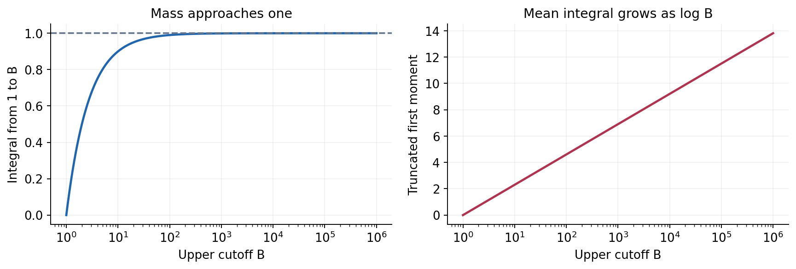

本讲对期望的代数性质和条件期望公式，默认所需的一阶绝对矩有限；对方差、平方损失则要求二阶矩有限。遇到重尾时，应先检查这些前提，不能只套有限样本公式。

## 六 变换后的平均不等于平均后的变换

给定函数g，$g(X)$也是随机变量。可以先求它的新PMF，但如果只需要期望，更直接的方法是

$$E[g(X)]=\sum_xg(x)p_X(x).$$

为什么仍使用X的质量？因为原状态落到x时，变换结果就是g(x)。即使几个不同x汇合到同一个g(x)，直接按原质量求和仍然把贡献完整加在一起。若为无穷模型，应检查 $E[|g(X)|]<\infty$。

令g(x)=x²。本例

$$E[X^2]=0+\frac13+\frac46+\frac{16}6=\frac{11}3,$$

而 $(E[X])^2=16/9$。前者先对每种结果平方再加权，后者把分布压成一个平均数后再平方，丢掉了分散信息；两者相差17/9。

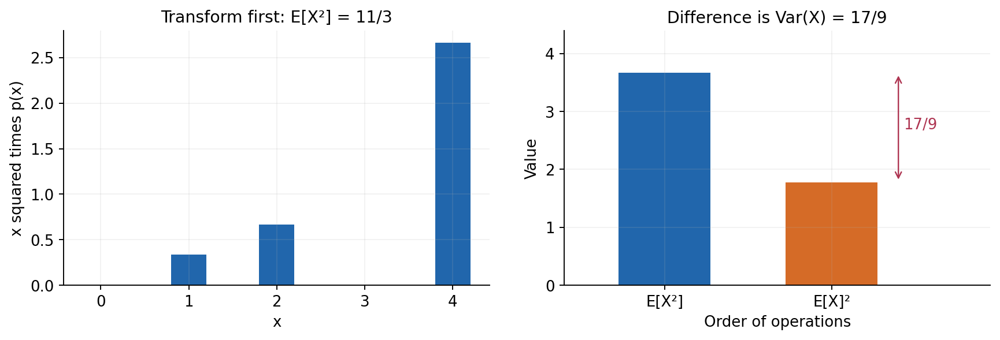

更一般地，线性变换满足 $E[aX+b]=aE[X]+b$；非线性变换通常没有这种交换规律。第十六讲有限Jensen的思想适用于凸g与有限分布，但本讲不依赖那一额外先修：平方这个特例将在下一节直接展开证明。

## 七 方差累计的是离平均值的平方距离

当 $E[X^2]<\infty$，定义方差与标准差

$$\operatorname{Var}(X)=E[(X-\mu)^2],\qquad \sigma=\sqrt{\operatorname{Var}(X)}.$$

方差是一个非负数，标准差回到与X相同的单位。若X以秒计，方差以秒平方计，标准差以秒计。方差不是“平均偏差” $E[X-\mu]$，因为后者总因正负抵消而为0。[R3]

展开平方并使用期望线性性：

$$E[(X-\mu)^2]=E[X^2]-2\mu E[X]+\mu^2=E[X^2]-\mu^2.$$

所以本例方差为 $11/3-16/9=17/9$，标准差为 $\sqrt{17}/3$。也可直接把六个偏差平方相加再除以6，作为独立核对。此差非负还说明 $E[X^2]\ge(E[X])^2$；相等当且仅当X以概率1等于其均值。

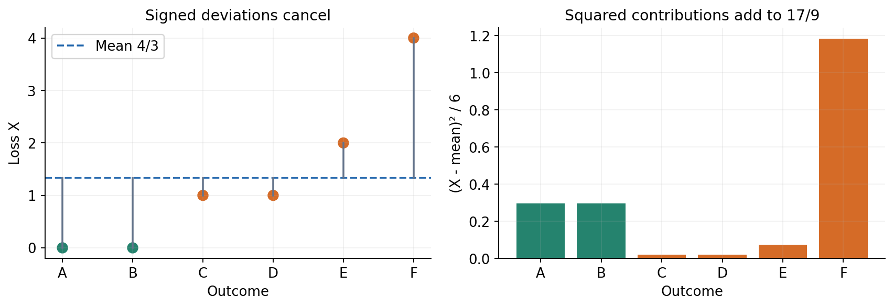

“以概率1相等”比“对所有数学上列出的点都相等”略弱，因为概率为0的状态不影响分布。本讲主例每个状态均有正概率，两种说法在这里一致。

## 八 同一个均值不能代表同一种风险

比较两个合成模型：U恒等于2；V以各1/2概率取0或4。它们均值都为2，但U方差为0，V方差为4。若关心超过3的概率，答案分别为0和1/2。均值相同不能替代分布或尾部事件。

平移与缩放的方差关系来自定义。若Y=aX+b，则均值为aμ+b，偏差为a(X-μ)，故

$$\operatorname{Var}(aX+b)=a^2\operatorname{Var}(X).$$

平移不改变方差，尺度改变按平方起作用。对于两个不同随机变量，期望线性性不需要独立；方差一般不能直接相加。最简单的反例是 $\operatorname{Var}(X+X)=4\operatorname{Var}(X)$，而不是2倍。协方差项及独立时的特殊公式将在第二十一讲系统展开。

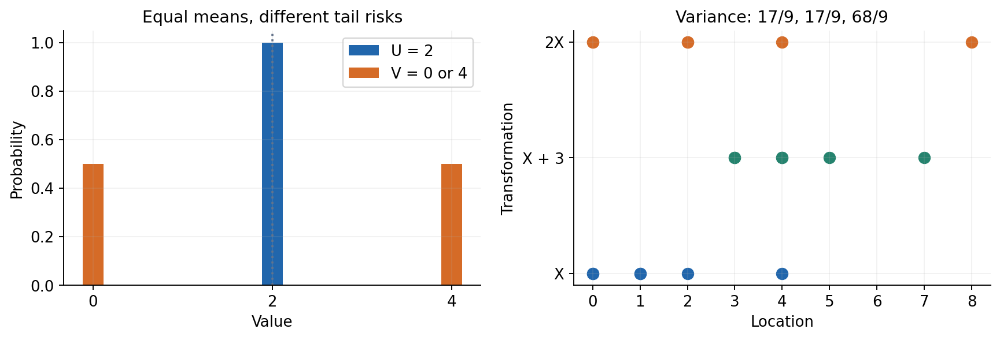

平均数与方差也仍不能唯一决定整个分布。研究中应保留任务关心的分位数、尾部事件或完整图形，而不是把两个矩当作所有随机行为的替代品。

## 九 均值为什么会成为平方损失下的预测

如果暂时没有任何分组信息，只能对下一次损失刻度X预测一个常数a，按平方误差评分，模型风险为 $R(a)=E[(X-a)^2]$。在二阶矩有限时，把X-a写成(X-μ)+(μ-a)，得到

$$R(a)=\operatorname{Var}(X)+(a-\mu)^2.$$

交叉项为 $2(\mu-a)E[X-\mu]=0$。因此在允许所有实数a时，唯一最优常数为μ。本例 $R(a)=17/9+(a-4/3)^2$，最小风险17/9。

这个结论没有要求μ是X的可能取值。预测值与真实实现值承担不同角色。也不能把“均值最优”推广成不论损失函数如何都最优；若把评分规则换成绝对误差或不对称成本，最优点可能不同。后续损失函数单元再系统讨论。

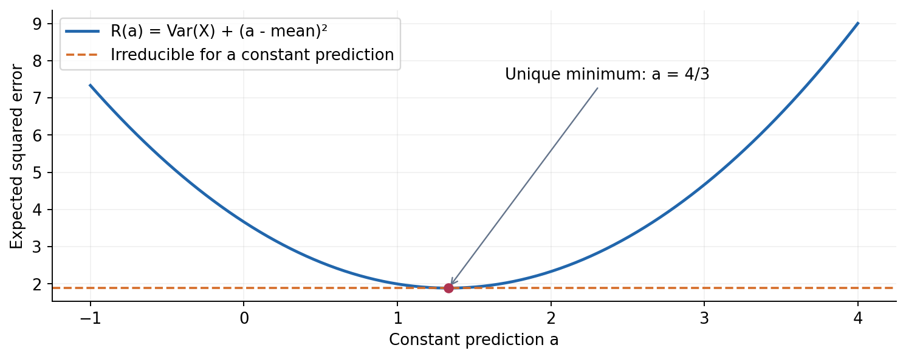

如果a必须属于某个受限集合，需在该集合里另求最优；如果分布被错误指定，上述风险也只是该模型中的风险，不代表真实环境保证。

## 十 连续密度把质量和换成加权积分

沿用第十七讲已经归一化的函数，定义连续随机变量T的密度

$$f_T(t)=\frac{1+t}{4},\quad0\le t\le2,$$

区间外为0。这里“连续”特指有普通概率密度的绝对连续模型。并非所有非离散随机变量都必须有这种密度，更一般的奇异分布不在本讲讨论。[R4]

任意区间概率是密度积分；某个点的密度高度不是该点概率。CDF为：t<0时0，0≤t≤2时 $t/4+t^2/8$，t>2时1。支持集内部F的导数等于密度，但端点的双侧导数未必存在。连续单点概率为0，所以区间端点的等号不影响本例答案。

期望与二阶矩分别为

$$E[T]=\int_0^2t\frac{1+t}{4}dt=\frac76,\qquad E[T^2]=\int_0^2t^2\frac{1+t}{4}dt=\frac53.$$

因而 $\operatorname{Var}(T)=5/3-49/36=11/36$。[R5] 数值网格可以核对这几个积分，但对非线性被积式，有限梯形仍有离散化误差。总密度积分恰好准确，不意味着一阶和二阶矩同时准确。

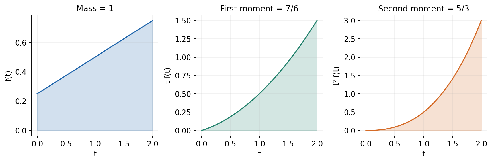

密度乘dt代表局部概率量，t乘该量贡献给均值。这个结构对应离散求和中的“取值乘概率”。积分区间或密度归一化错了，后面的矩也会失去原来的解释。

## 十一 CDF也能表示混合的点质量与密度

离散与有密度连续并非所有情形。设M以1/3概率直接取0，另以2/3概率从(0,1)均匀取值。则M在0处有点质量1/3，在区间内部又有连续部分。其CDF为

$$F_M(t)=0\ (t<0),\qquad F_M(t)=\frac13+\frac23t\ (0\le t\le1),\qquad F_M(t)=1\ (t>1).$$

这条函数在0处跳跃1/3。其区间内部导数为2/3，但从0到1积分导数只得到2/3，剩余1/3在跳跃里。不能把内部导数单独叫作整个分布的归一化PDF。

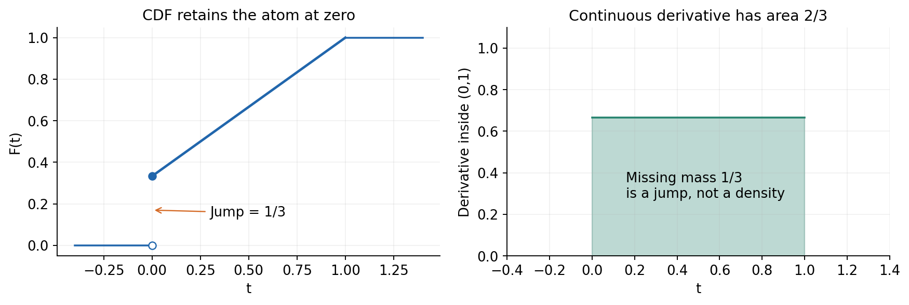

混合模型的期望可分开累加：点质量贡献 $0\times1/3=0$，连续部分贡献 $\int_0^1t(2/3)dt=1/3$。这不是把离散数据“平滑一下”，而是模型本来就同时包含两种概率来源。它也说明CDF比单独PMF或PDF适用范围更广。

## 十二 条件期望先在条件下重建分布

回到六状态模型。quiet组只有A、B，概率为1/3，且X总是0。active组包含C、D、E、F，概率为2/3，组内四个状态条件概率各1/4。因此

$$E[X\mid Z=\text{quiet}]=0,\qquad E[X\mid Z=\text{active}]=\frac{1+1+2+4}{4}=2.$$

条件期望是条件分布下的加权平均。若B是概率大于0的事件，有限模型中可以直接写

$$E[X\mid B]=\frac{\sum_{\omega\in B}X(\omega)P(\omega)}{P(B)}.$$

不能只把分子缩到B内，却仍用无条件概率而不除以P(B)。也不能对概率为0的事件按这个公式做除法。某次有限模拟恰好没抽到一个理论上正概率的组，是“该批次无法估计此组均值”，不意味着理论条件均值不存在。

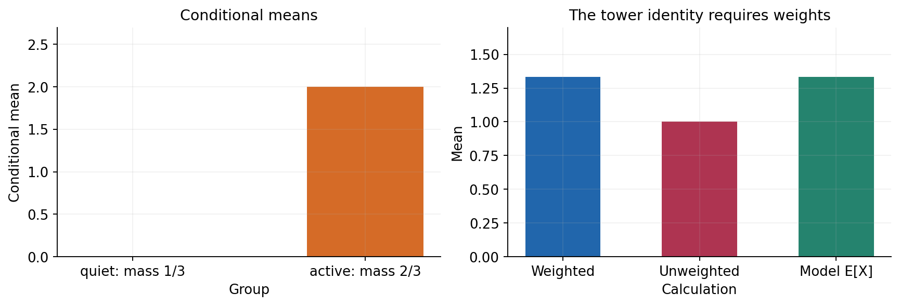

这里观测到组别只是在同一个联合模型中筛选状态，不能自动解释为把设备强制改成某个组的因果效果。该限制与第十八讲区分条件概率和干预的原则一致。

## 十三 一个条件均值表也会成为随机变量

固定某个组z后，$m(z)=E[X\mid Z=z]$ 是一个数；还不知道Z时，$m(Z)$ 本身会随Z改变，因而是随机变量。记号 $E[X\mid Z]$ 指的就是这个由信息Z决定的数值函数。[R6]

本例中，它以1/3概率取0，以2/3概率取2。对这个新随机变量再取平均，得到

$$E[E[X\mid Z]]=0\cdot\frac13+2\cdot\frac23=\frac43=E[X].$$

这叫全期望公式或迭代期望公式。有限离散情形的证明很直接：按各个z把同一批状态分组，组内条件概率乘回组概率恢复原状态概率。

$$\sum_zE[X\mid Z=z]P(Z=z)=\sum_z\sum_xx\,P(X=x,Z=z)=\sum_xxP(X=x).$$

其中只需对P(Z=z)>0的组使用条件比值；零概率组不贡献外层期望。对无穷模型，有限一阶绝对矩保证这类重排合法。连续信息的条件期望需要密度或更一般的条件分布，不能把 $P(Z=z)=0$ 的点直接塞进简单事件比值。这里先把有限版本讲清楚。

## 十四 获得信息后 可以分别预测各组

允许预测依赖Z，即选择a(Z)。在quiet组，平方损失最优预测为0；在active组，最优预测为2。这分别应用了第九节的均值最优结论，只是把概率换成条件概率。

直接按六个状态计算条件预测的平均平方误差：

$$E[(X-m(Z))^2]=\frac{0+0+1+1+0+4}{6}=1.$$

无条件最优常数的风险为17/9，两者相差8/9。这个改善发生在我们事先知道完整六状态模型、组信息可用、并按同一个模型评价的课堂情境中。不需要训练，也不是对真实预测泛化的保证。

条件平均可以在只有组别的信息下保留有用结构，但不会恢复组内每个状态。active组预测2，仍可能出现1或4。不能把条件期望当作条件一旦满足就必然发生的结果。更一般的方差分解与信息关系在第二十一讲展开。

## 十五 用CDF反函数生成已知连续分布

为了用Monte Carlo核对T的矩，可以先生成均匀U，再令 $T=F_T^{-1}(U)$。在0到2的支持集上，F连续严格递增，解方程

$$u=\frac t4+\frac{t^2}8$$

得到 $t=\sqrt{1+8u}-1$，取非负根。若U理想均匀分布在[0,1]，则

$$P(T\le t)=P(U\le F_T(t))=F_T(t),\quad0\le t\le2.$$

这是当前反函数构造的依据，不是“画出来像这个密度”就认定生成正确。程序使用等价形式

$$t=\frac{8u}{\sqrt{1+8u}+1},$$

以减轻极小u时两个近等数相减的消减。即使使用等价稳定形式，有限浮点U的生成器仍不是数学上的真正连续分布；本实验是数值近似。[R7]

离散主模型可以从六个状态等概率抽取，再映射到X。不能从四个不同X值等概率抽取，否则生成器目标分布已错。固定种子便于复现实验，不会把一次样本平均变成精确期望。

## 十六 样本均值和模型期望各自回答什么

设模拟得到 $X_1,\ldots,X_n$，样本均值为 $\bar X_n=\sum_iX_i/n$。它是由有限数据计算的数；在重复抽样之前，它本身也是随机变量。主模型期望4/3则由给定PMF唯一确定。

实验应保留多个n和多个固定种子的结果，而非选择最接近真值的那一条。每个n记录样本均值、按n归一化的经验中心二阶矩、组计数、条件均值和全期望重组结果。对同一批有限样本，按实际组频率加权的条件样本均值，应恰好还原该批总体样本均值；这是一条代数一致性，不需要样本很大。

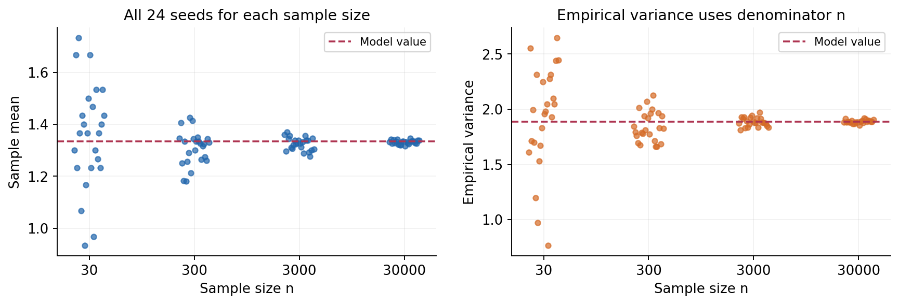

经验中心二阶矩的分母n描述这一批数据的经验分布。分母n-1常用于对总体方差的无偏估计，它回答另一种统计问题，第二十二讲以后再讨论。不要在程序里依赖某个库的默认分母，却在文字里声称计算的是另一个量。[R8]

独立同分布、矩存在性和极限定理会解释样本平均何时趋近模型期望及波动怎样缩小，本讲只记录实际有限实验并核对已知答案。不用一条收敛似的曲线证明一般大数定律，也不把重复模拟的范围标成未经推导的置信区间。

## 十七 方差的等价公式不保证同样数值稳定

数学上 $E[X^2]-(E[X])^2$ 与中心平方平均相等。数值上，如果X带有很大的公共偏移，两个二阶量会非常接近，相减可能丢掉本来很小的方差。例如给固定列表0、0、1、1、2、4都加上1e12，理论方差仍应为17/9；直接二阶矩相减可能变成0或其他错误值。

因此核心计算保留中心化路径，必要时先减去一个参考值再求均值与偏差，并与Fraction在整数或有理数模型上的结果比较。单纯把负的结果截成0，会隐藏计算问题。一个数值实现也不应把真实变化因表示精度而消失的输入，谎称为已恢复原始方差。

在更极端偏移下，原来不同的输入可能已经舍入成相同float。即便随后使用稳定算法，也不能从丢失的信息里重建原数据。测试需区分：公式算坏、算法不稳定、输入表示已丢信息，以及模型二阶矩本来不存在。它们不是同一类失败。

## 十八 验收要检查模型与程序之间的每一步

首先，六状态概率必须精确或在明确容差下归一化，不能悄悄替非法权重重归一化。PMF聚合保留重复映射，CDF使用小于等于，条件事件必须有正模型质量。非有限值、负权重、布尔或文本伪数值、尺寸不一致和空样本要明确拒绝。

其次，乘积与求和可能在有限输入下溢出，极小概率也可能在除法中下溢。验证中间量、回调返回与结果的有限性，并明确程序能处理的规模与精度。随机种子、Python版本、样本规模和固定重复列表都写入报告；不靠手工挑选输出通过验收。

最后，把四类结果放在一起：手算分布矩、Fraction精确恒等式、确定性网格积分、实际Monte Carlo输出。它们各自检验不同问题。图形必须标明画的是概率质量、密度、累计概率、损失还是经验统计量，不能用相似曲线代替相同定义。

本讲建立的语言会反复出现于损失、似然、Bayes推断和泛化分析。继续之前，应能清楚说出一个量依赖哪个随机来源、是在取平均之前还是之后变换，以及它的存在条件是什么。

## 来源与阅读范围

正文、六状态模型、连续矩推导、图形与习题独立编写。以下一手课件和官方文档仅用于核对定义、定理条件和接口行为，不复制其课程示例或图片。

- [R1 MIT 18.05 离散随机变量](https://ocw.mit.edu/courses/18-05-introduction-to-probability-and-statistics-spring-2022/mit18_05_s22_class04-prep-a.pdf)：随机变量、PMF、CDF与端点约定。
- [R2 MIT 18.05 离散期望](https://ocw.mit.edu/courses/18-05-introduction-to-probability-and-statistics-spring-2022/mit18_05_s22_class04-prep-b.pdf)：加权均值与可能取值的区别。
- [R3 MIT 18.05 离散方差](https://ocw.mit.edu/courses/18-05-introduction-to-probability-and-statistics-spring-2022/mit18_05_s22_class05-prep-a.pdf)：中心二阶矩、单位与缩放性质。
- [R4 MIT 18.05 连续随机变量](https://ocw.mit.edu/courses/18-05-introduction-to-probability-and-statistics-spring-2022/mit18_05_s22_class05-prep-b.pdf)：密度与区间概率。本讲特别限定为有密度的连续模型。
- [R5 MIT 18.05 连续期望与方差](https://ocw.mit.edu/courses/18-05-introduction-to-probability-and-statistics-spring-2022/mit18_05_s22_class06-prep-a.pdf)：概率加权积分与矩。
- [R6 MIT 6.041 第12讲条件期望与迭代期望](https://ocw.mit.edu/courses/6-041-probabilistic-systems-analysis-and-applied-probability-fall-2010/60eede37f87fd886d4ba574e1cf26617_MIT6_041F10_lec_slides.pdf#page=24)：给定一个值与给定随机信息的区别、全期望公式。
- [R7 Python 3.12 random](https://docs.python.org/3.12/library/random.html)：伪随机数、种子与跨版本复现范围。
- [R8 Python 3.12 statistics](https://docs.python.org/3.12/library/statistics.html)：pvariance与variance的不同任务及分母。
