# 常见分布与建模假设

## 第二十讲 二分类 计数和测量误差分别适合怎样的概率模型

第十九讲已经给出随机变量、概率质量函数、概率密度、期望与方差。现在的问题是：面对一列数据，怎样提出一个可以被检查的概率模型？“图形有点像”远远不够。我们要先确定一行数据代表什么、哪些值可能出现、观察窗口有多长，再提出不同结果的概率如何随参数变化。

本讲用一条合成检测流程贯穿五种分布。单个部件是否触发报警是二分类；一个固定批次内的报警数是有上限的计数；报警原因是互斥类别；固定时段的到达数是没有预设上限的计数；测量值与校准真值之差是有正有负的连续误差。这五个问题共享“随机”这个词，却不能共享同一个概率公式。

直接先修为第十九讲。以下符号逐步定义，不依赖矩阵知识。指数族出现的一串参数只表示逐项相乘再相加。所有图形和实验来自明确给定的合成模型；没有真实业务数据、训练竞赛或性能排名。实验核验有限样本行为与实现，不能证明一个实际系统真的服从所选分布。

## 一 支持集先于曲线形状

把一个模型允许随机变量取值的范围称为支持范围。本讲为便于比较，先列出族共同使用的样本空间；参数在边界时，实际具有正质量的点可能更少。例如Bernoulli族使用{0,1}，但p=0时只有0拥有正质量。对连续分布，支持集可以理解为每个小邻域都有正概率的点组成的集合，不能用“点概率大于0”定义，因为有密度模型的单点概率都是0。

写 $X\sim\operatorname{Bernoulli}(p)$ 的意思是“X的分布按右侧模型指定”。参数p是固定模型中的数，X是未来会变化的随机结果。观察到x后，不要把X和p交换角色。估计未知p是另一个问题，后续估计单元会展开。

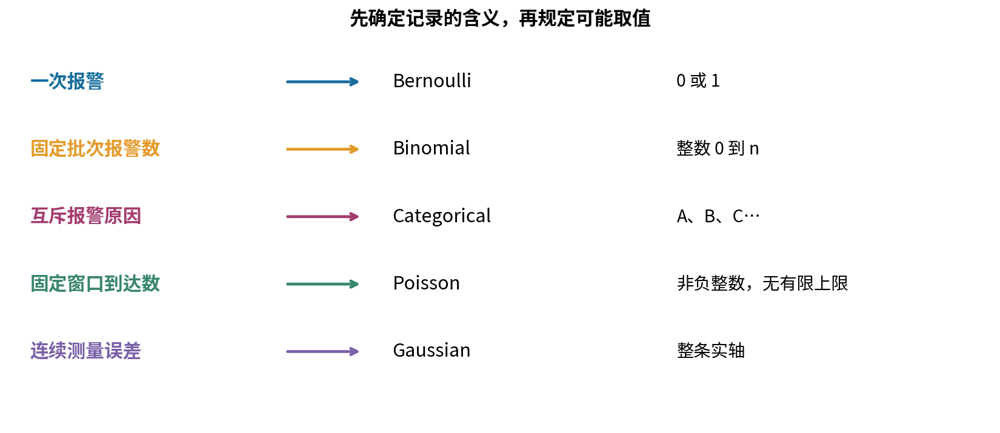

以下是最基本的排除法。概率不能为负或超过1；计数不能是2.7；8个部件中的报警数不能为9；非负等待时间的精确模型不能给负时间正概率。某个近似模型偶尔允许不可能值可以作为带误差的近似，但必须计算或约束这部分错误质量，并说明为什么任务可以承受。把不可能值裁掉再使用原密度，通常还会破坏归一化。

## 二 Bernoulli描述一次是否发生

令Y=1表示报警，Y=0表示未报警。若 $0\le p\le1$，定义

$$P(Y=1)=p,\qquad P(Y=0)=1-p.$$

两项非负且相加为1，因此是合法PMF。内部参数0<p<1时可以合写成 $p^y(1-p)^{1-y}$，y只能取0或1。对p=0或1，用上面的分段定义最清楚，避免把0的0次方当成尚未解释的计算规则。

因为 $Y^2=Y$，无需无穷求和便有

$$E[Y]=p,\qquad E[Y^2]=p,\qquad\operatorname{Var}(Y)=p-p^2=p(1-p).$$

例如p=1/4，均值1/4、方差3/16。下一次仍只能得到0或1；均值不是“部分报警”。方差在p=1/2达到1/4，p在0或1时方差为0。这来自 $p(1-p)=1/4-(p-1/2)^2$。

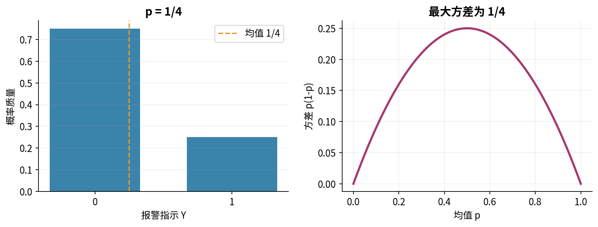

对某一给定条件而言，任意0/1变量都可用一个Bernoulli分布描述，这是二点支持集决定的。但“每一行都Bernoulli”不等于“各行独立且使用同一个p”。白天与夜间可以有不同报警概率，同一部件重复检测也可能依赖。边际分布的选择与跨行关系必须分开检查。

## 三 Binomial把固定次数的独立试验相加

现在一批恰有n个部件，每个报警概率为p，且各个报警结果独立。独立在这里指任意完整的0/1排列，其概率等于各位置概率相乘。令

$$S=Y_1+\cdots+Y_n,\qquad n\in\{0,1,2,\ldots\}.$$

要使S=k，需要恰好k个1。某个特定排列的概率是 $p^k(1-p)^{n-k}$。选择哪k个位置为1的方法数是组合数

这里的感叹号表示阶乘：对正整数n，$n!=1\times2\times\cdots\times n$，例如 $4!=1\times2\times3\times4=24$；另定义 $0!=1$。先按顺序选k个不同位置，第一步有n种选择，第二步剩n减一种，直到第k步剩n减k加一种，共有 $n(n-1)\cdots(n-k+1)=n!/(n-k)!$ 种。但报警位置只关心选中哪些，不关心选择顺序。每个固定的k位置集合被其 $k!$ 种排列重复计算，所以要再除以 $k!$：

$$\binom nk=\frac{n!}{k!(n-k)!}.$$

例如从4个位置选2个，先后选择有 $4\times3=12$ 种；每对位置被两个相反顺序重复计算，因而实际只有 $12/2!=6$ 种。k=0时只存在空选择一种；约定0!=1使公式也给出1。

因此在0≤k≤n的整数点，

$$P(S=k)=\binom nkp^k(1-p)^{n-k}.$$

其他整数点的质量为0；这称为Binomial或二项分布。[R1] 组合数不是额外的独立性假设，它只是在已经建立的独立等概率试验模型中，合并会产生同一个总数的互斥排列。把所有排列概率相加得到 $(p+(1-p))^n=1$，也就证明了归一化。

n=0时S恒为0。p=0时也恒为0；p=1时恒为n。边界模型完全合法，只是在后面的有限自然参数表达式中需要单独处理。

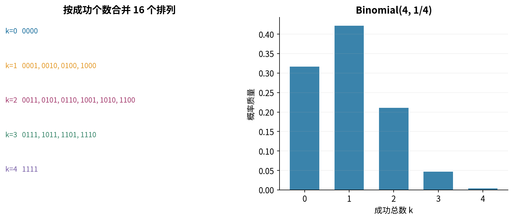

## 四 不借助协方差记号也能推导二项方差

期望线性性给出E[S]=np。为避免把“方差相加”当成无需条件的规则，直接展开

$$S^2=\sum_{i=1}^nY_i^2+2\sum_{i<j}Y_iY_j.$$

对i≠j，乘积 $Y_iY_j$ 只有在两次都报警时为1，所以其期望是该事件概率。独立性使它等于p²。这样的无序位置对有n(n-1)/2个，故

$$E[S^2]=np+n(n-1)p^2.$$

减去均值平方n²p²，得到 $\operatorname{Var}(S)=np(1-p)$。这一步明确显示独立性用在何处。以n=8、p=1/4为例，均值2、方差3/2；恰好两次报警的概率是 $28\times(1/4)^2\times(3/4)^6=5103/16384$。

反例：让一批中的8个结果始终一起报警或一起不报警，即所有Y_i都等于同一个Bernoulli(1/4)变量Y。每个部件的边际概率仍是1/4，总数却为8Y，均值2而方差 $64\times3/16=12$。这远大于3/2。相同的单次成功概率与相同批次大小，并不能保证二项总数。

另一个反例是独立但不等概率。n=2，p₁=1/10、p₂=9/10，则总数的质量为(9/100,82/100,9/100)，均值1、方差18/100。Binomial(2,1/2)则是(1/4,1/2,1/4)，均值仍为1、方差1/2。这一不等概率和有自己的名称Poisson-binomial，名称含Poisson不代表它就是后面的Poisson分布。

## 五 Categorical描述互斥类别而非大小

报警原因分为传感器、供电、其他三类，记作A、B、C；每次恰好一个类别。给定 $\pi_A=1/2,\pi_B=3/10,\pi_C=1/5$，定义 $P(C=j)=\pi_j$。一般K类需要各 $\pi_j\ge0$ 且总和为1，K为正整数。分类分布称为Categorical。

若把A、B、C随意编码成0、1、2，均值是7/10；改编码为0、10、100，均值变成23。类别的实际概率没有改变。因此“平均类别编号”通常没有任务语义。若类别本来对应明确数值收益，可以定义收益函数g，再计算 $E[g(C)]=\sum_jg(j)\pi_j$，这时平均的是收益，不是标签自身的大小。

令 $I_j=1\{C=j\}$，其中花括号表示条件成立取1，否则取0。每个指标变量都是Bernoulli($\pi_j$)，故均值 $\pi_j$、方差 $\pi_j(1-\pi_j)$。不同类别的两个指标不能同时为1，所以i≠j时 $E[I_iI_j]=0$。如果两个类别都有正概率，它们就不独立，因为独立会要求该期望为正的 $\pi_i\pi_j$。

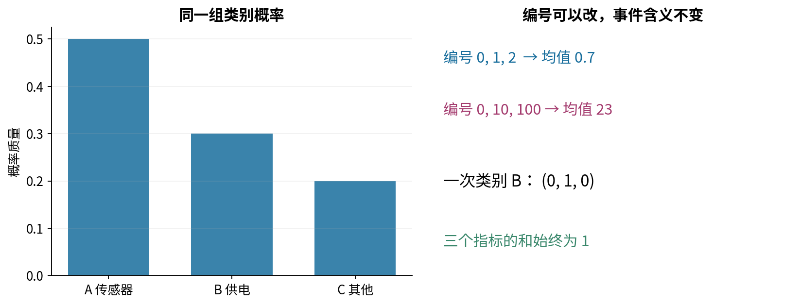

多标签任务允许同一条记录同时有多个标签，不符合“恰好一个类别”的Categorical假设。反过来，把互斥分类拆成若干独立Bernoulli，也可能生成同时属于两个互斥类别的非法结果。模型必须尊重记录规则，而不只是最终能输出几个数字。

## 六 Poisson描述给定暴露量下的非负整数计数

设X记录一个固定时段中到达的次数，参数λ≥0表示这一时段的期望次数。λ>0时定义

$$P(X=k)=e^{-\lambda}\frac{\lambda^k}{k!},\qquad k=0,1,2,\ldots.$$

λ=0单独定义为恒等于0。Poisson支持范围没有有限上界，但每次实现仍是有限的非负整数。它没有二项分布中的固定试验次数n。[R2]

归一化使用指数函数的幂级数定理 $e^t=\sum_{k=0}^{\infty}t^k/k!$。这里明确接受该级数等式及其绝对收敛性，不用有限计算冒充证明。于是PMF总和是 $e^{-\lambda}e^\lambda=1$。

把k从1开始求和，并令j=k-1：

$$E[X]=e^{-\lambda}\sum_{k=1}^{\infty}\frac{k\lambda^k}{k!}=\lambda e^{-\lambda}\sum_{j=0}^{\infty}\frac{\lambda^j}{j!}=\lambda.$$

再计算下降阶乘X(X-1)，k=0、1时贡献为0，同样移位得到E[X(X-1)]=λ²。因为X²=X(X-1)+X，

$$E[X^2]=\lambda^2+\lambda,\qquad\operatorname{Var}(X)=\lambda.$$

这是一条强约束。给定均值后，方差不能自由另选。计数“看着散”不足以选Poisson，还必须问这个均值与方差关系是否与观测机制相容。

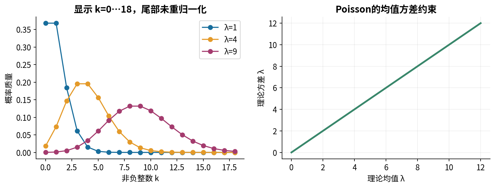

## 七 稀疏二项极限解释一种Poisson来源

把单位时段切成n个小格，暂定每格至多一次、各格独立，且每格发生概率λ/n。总数服从Binomial(n,λ/n)，其中n需大于λ以使概率合法。固定某个非负整数k，整理其概率：

$$P(S_n=k)=\frac{\lambda^k}{k!}\left[\prod_{j=0}^{k-1}\left(1-\frac jn\right)\right]\left(1-\frac\lambda n\right)^n\left(1-\frac\lambda n\right)^{-k}.$$

空乘积在k=0时为1。固定k时，有限乘积趋1，最后一项趋1；接受并明确使用初等极限定理 $(1-\lambda/n)^n\to e^{-\lambda}$，便得到Poisson的k点质量。这里推导的是固定k的极限，不是任意n都精确相等，也没有给出一个统一的误差上界。

λ=2、n=8时，二项方差为3/2，Poisson方差为2，差异不是模拟噪声。n扩大到40或200时，二项方差分别为1.9和1.98，逐渐靠近2。这些数由公式算出，不是图形判断；矩变得接近不自动说明所有尾部误差都很小。要获得统一误差控制，需要更进一步的概率逼近理论。

一种充分的连续时间生成机制包括不相交时间段的独立增量、稳定单位时间发生强度，以及极短时段两次及以上的概率比时段长度更快趋0。本讲没有完整构造或证明Poisson过程，只用小格模型说明这些假设的作用。观察到边际计数近似Poisson，不能反推每个过程假设必然成立。

## 八 暴露量和异质性会改变方差解释

令r为每单位时长的发生率，t为正时长；给定t时λ=rt。半小时与两小时的原始次数不能直接当成相同λ的重复观测。即便设备完全一样，混合不同t，也会混合不同计数均值。

现在用一个可手算的例子说明过度离散。每次先以各1/2概率选择类型L或H，再分别生成Poisson(1)或Poisson(7)的次数。总体均值为4。各组二阶矩分别是1²+1=2和7²+7=56，所以总体二阶矩29，方差 $29-4^2=13$。同均值的Poisson(4)方差只有4。

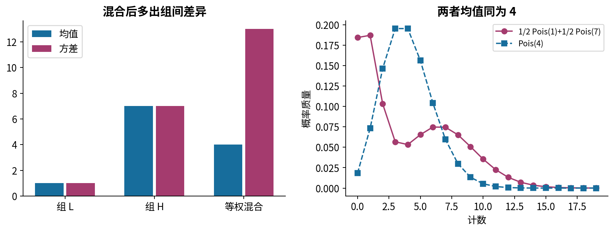

这个结论也可用第十九讲的条件平均写成一般形式：设随机强度Λ非负，且一二阶矩有限；给定Λ时X服从Poisson(Λ)。因为条件二阶矩为Λ²+Λ，先按条件求平均再合并，就有

$$E[X]=E[\Lambda],\qquad\operatorname{Var}(X)=E[\Lambda]+\operatorname{Var}(\Lambda).$$

这不是独立性无条件成立的魔法，而是明确指定的混合模型。对于本例，Var(Λ)=9，故4+9=13。完整的全方差公式将在下一讲展开，这里仅用已会的二阶矩相减推导所需特例。

经验方差明显大于经验均值常被称为过度离散的线索，但它不是异质性的唯一证据，也不是一次有限样本就能下的结论。聚集、依赖、漏掉暴露量、零值机制或重尾都可能造成类似现象。计数有容量上限、存在排斥关系时也可能小于Poisson方差。先检查数据单位和机制，再考虑更灵活的混合或其他计数模型。

## 九 Gaussian的连续支持与尺度

测量误差R定义为测量值减去已知校准真值。一个常用模型是 $R\sim N(\mu,v)$，其中μ是实数，v>0是方差；标准差σ=√v。密度为

$$f(r)=\frac1{\sqrt{2\pi v}}\exp\left[-\frac{(r-\mu)^2}{2v}\right],\qquad r\in\mathbb R.$$

Gaussian与Normal是同一分布的两个常见名称。[R3] 本讲用v作为第二个参数，避免把方差与标准差混用。NumPy的normal接口接收标准差scale，代码必须使用√v作为尺度；本实验显式把标准正态乘√v再加μ。[R8]

标准正态密度为 $\phi(z)=e^{-z^2/2}/\sqrt{2\pi}$。其归一化依赖标准高斯积分定理 $\int_{-\infty}^{\infty}e^{-z^2/2}dz=\sqrt{2\pi}$。本讲接受而不证明该定理；常见的完整证明需把积分平方后转为二维积分，超出当前直接先修。网格积分接近1仅是数值核对，不是替代此定理。

令z=(r-μ)/σ，dr=σdz，一维换元就证明一般密度也积分为1。由 $\phi'(z)=-z\phi(z)$ 可知 $E[|Z|]=2\int_0^\infty z\phi(z)dz=2\phi(0)<\infty$；因此可以用奇偶对称得到E[Z]=0。分部积分是乘积求导再积分的等式 $\int u v'=[uv]-\int u'v$。先在有限对称区间应用它，再让端点趋向无穷；指数衰减使zφ(z)在两端趋0，于是

$$E[Z^2]=\int_{-\infty}^{\infty}z^2\phi(z)dz=\left[-z\phi(z)\right]_{-\infty}^{\infty}+\int_{-\infty}^{\infty}\phi(z)dz=1.$$

于是R=μ+σZ的均值μ、方差σ²=v。这一推导同时说明为什么分母中需要标准差、指数中需要方差，以及v不能为负或0。v趋0时可以趋于点质量，但点质量不再由上面的普通PDF表示。

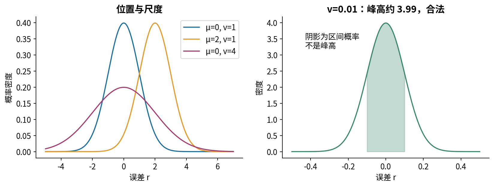

## 十 正态误差不意味着正态原始数据

假定测量关系为M=a+R，a为本次给定的真值，R为误差。如果每次a相同且误差为Gaussian，测量分布也是平移后的Gaussian。如果不同记录的a不同，混合原始M的直方图可能出现多个峰，即使每个真值下的误差都完全正态。

反方向也不成立：原始M看起来像钟形，不足以证明条件误差正态。校准偏差、分辨率导致的离散取值、饱和剪裁、随真值增大的噪声尺度，都会改变误差模型。先定义要建模的是M还是R，以及条件信息有哪些。

支持范围也会暴露问题。若建模某种严格为正的长度，Gaussian(1,1)会给负值约0.1587概率。把这一数值称为“小到可以忽略”缺乏任务依据。若改成Gaussian(10,0.01)，负值概率极小，作为局部测量近似可能合适，但仍应说明理论支持与物理支持不一致。不能仅因两个图都对称就作同样决定。

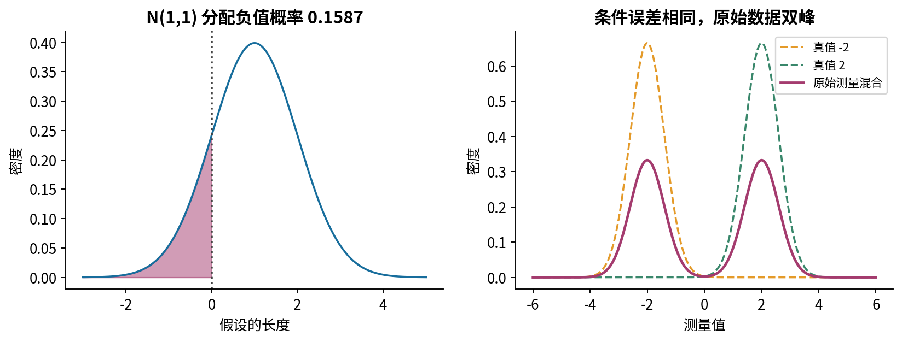

本讲不使用中心极限定理证明误差正态。多个小扰动相加可能为正态近似提供动机，但需要独立性或适当弱依赖、尾部与尺度条件；“有很多原因”并不是定理条件。第二十二讲会明确区分原变量的分布与样本平均的近似分布。

## 十一 同均值同方差仍不识别分布

给出三个均值0、方差1的模型：标准正态Z；以各1/2概率取±1的离散变量D；以3/4概率取0、各1/8概率取±2的离散变量Q。D²总为1；Q²的均值为 $0+4/8+4/8=1$，因此二者确实符合这两个矩。

然而P(|D|>1.5)=0，P(|Q|>1.5)=1/4，标准正态对应约0.1336。两个矩相同，任务关心的尾部概率可以不同。离散两点图与连续密度甚至不属于同一种测量结构。

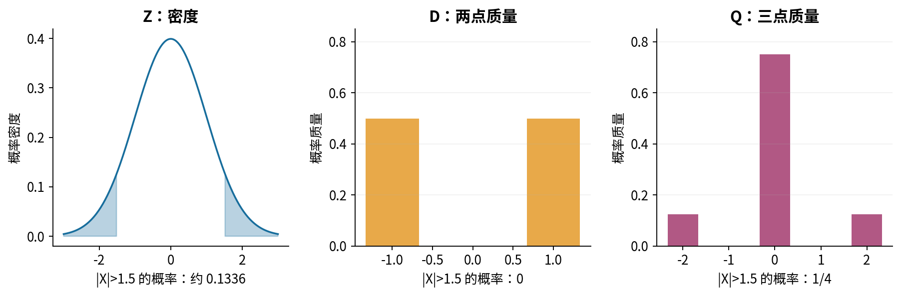

建模检验因此至少有三层：支持范围是否合理；条件均值、方差等结构是否合理；尾部、零值、组间差异或依赖等更细特征是否合理。通过某一层只能减少一种疑虑。没有在有限数据中发现不合适，不等于证明模型为真。

## 十二 指数族把共同结构写出来

前面几种分布看似各有公式，却可以在参数处于适当内部范围时写成

$$p_\eta(x)=h(x)\exp\left[\sum_{j=1}^d\eta_jT_j(x)-A(\eta)\right].$$

这里p既可代表离散PMF，也可代表连续PDF，但同一个族必须先固定使用求和还是积分。d是自然参数个数；$\eta_1$ 到 $\eta_d$ 是一串实数；$T_1(x)$ 到 $T_d(x)$是预先规定的数据函数，称为统计量；求和符号只是把d个乘积相加，无需矩阵。h(x)是非负的基底因子，连同预先声明的支持范围一起使用。A是对数归一化函数，不是随手删除的常数。[R4]

离散情形需要

$$A(\eta)=\log\sum_{x\in\mathcal X}h(x)\exp\left[\sum_j\eta_jT_j(x)\right],$$

连续情形把求和改为支持范围上的积分。只有里面的和或积分是正且有限，参数才合法。使归一化成立的η集合称为自然参数空间。数学上的自然参数空间与实验代码为可靠计算设定的数值范围是两层限制。

“指数族”不等于“指数分布”。它是多个分布共享的一种表达结构，也不表示每种数据都应强行用该结构。下文给出的表达统一固定支持；不能偷偷让支持端点随η改变，再忽略端点移动对归一化和求导的影响。

## 十三 从Bernoulli和Poisson认出自然参数

对0<p<1的Bernoulli，取自然参数 $\eta=\log[p/(1-p)]$，T(y)=y，h(y)=1，支持{0,1}。因为 $p=e^\eta/(1+e^\eta)$，可逐项代回得到

$$p_\eta(y)=\exp\{\eta y-\log(1+e^\eta)\}.$$

故 $A(\eta)=\log(1+e^\eta)$，η可为任意有限实数。p=0或1是η趋向无穷方向时的边界极限，不是把一个有限η代入就能得到。对固定n的Binomial，只需把h(k)改成组合数、A改成n log(1+e^η)，T(k)=k。n必须固定；让n随η变化就改变了支持范围，不能继续使用这段固定支持分析。

Poisson在λ>0时取 $\eta=\log\lambda$、$T(k)=k$、$h(k)=1/k!$、$A(\eta)=e^\eta$，支持非负整数。η仍可取任意有限实数。λ=0同样单独作为边界模型。

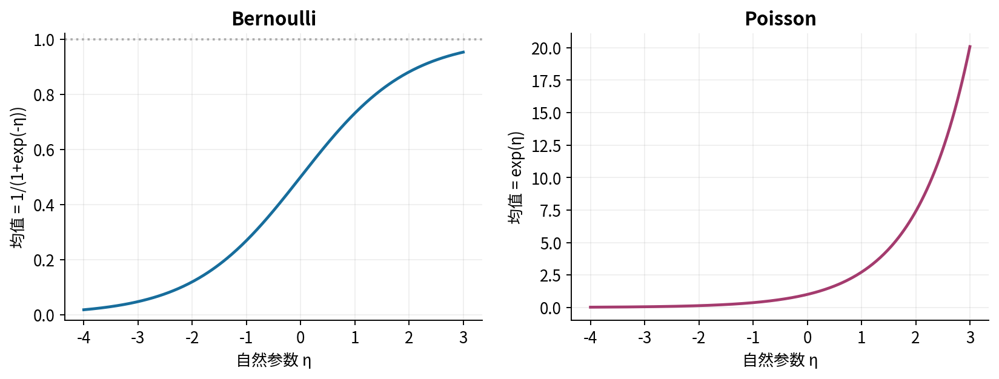

A必须保留，原因可直接手算。Bernoulli若漏掉它，两点权重变成1和 $e^\eta$，总和 $1+e^\eta$；当η=0时甚至总和为2。h也不能随意删除：Poisson若删除1/k!，剩下的几何权重在η≥0时根本不能归一化。相似的指数形状不保证相同分布。

## 十四 Categorical和Gaussian需要几个参数

Categorical先假设所有 $\pi_j>0$，并选择第K类作参照。对j<K，令 $\eta_j=\log(\pi_j/\pi_K)$，$T_j(c)=1\{c=j\}$；h(c)=1。d=K-1，且

$$A(\eta)=\log\left(1+\sum_{j=1}^{K-1}e^{\eta_j}\right).$$

参照类的概率是 $e^{-A}$，其余为 $e^{\eta_j-A}$。K个概率相加为1，只需要K-1个自由数；类别有零概率时需要边界极限或重新选择有效支持，不能对0直接取log。K=1是唯一类别恒发生的退化情况，无需自由参数。

对μ和v都未知的Gaussian，展开平方，选择T₁(x)=x、T₂(x)=x²、h(x)=1。自然参数为

$$\eta_1=\frac\mu v,\qquad\eta_2=-\frac1{2v}<0.$$

配方后可得

$$A(\eta_1,\eta_2)=-\frac{\eta_1^2}{4\eta_2}+\frac12\log\left(\frac\pi{-\eta_2}\right).$$

验证很重要：代入η₂=-1/(2v)，第一项变为μ²/(2v)，第二项为log(2πv)/2，恰好恢复原密度的常数。η₁可为任意实数，但η₂必须严格负。η₂>0时指数随|x|增长；η₂=0时是线性指数或常数，在整条实轴上仍不能积分为有限正值。这个限制来自归一化，不只是软件不喜欢负方差。

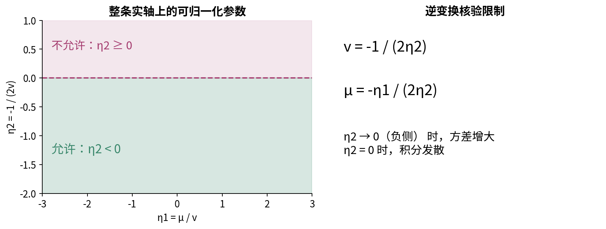

若v已知固定，Gaussian关于μ可以用单个自然参数表达，但h和A的选择也会随参数化方式变化。指数族分解不是唯一的；判断是否正确应展开恢复原密度并核验支持与归一化，不能只背一张表。

## 十五 对数归一化函数为什么携带矩

先只考虑一个自然参数η、有限支持，并且h和T不随η变化。记 $Z(\eta)=\sum_xh(x)e^{\eta T(x)}$，A=logZ。有限求和可以逐项求导，所以

$$A'(\eta)=\frac{Z'(\eta)}{Z(\eta)}=\sum_xT(x)p_\eta(x)=E_\eta[T(X)].$$

再次求导：

$$A''(\eta)=\frac{Z''Z-(Z')^2}{Z^2}=E_\eta[T(X)^2]-E_\eta[T(X)]^2=\operatorname{Var}_\eta(T(X))\ge0.$$

这既重新给出Bernoulli的p和p(1-p)，也解释A为何是凸的。注意得到的是T(X)的矩；只有T(x)=x时才直接是X的均值方差。

对于Poisson的无穷求和或Gaussian的无穷积分，交换求导与和、积分需要额外条件。本讲不把有限证明直接当成一般证明。对这些内部参数，可以在参数附近找到足够快衰减的可积控制函数，从而使用“受控条件下允许交换”的定理；我们仅陈述该充分思路，不证明该分析定理。也可以像第六节、第九节那样分别直接求矩，避免依赖交换。有限模拟从来不能代替交换的合法性。

## 十六 用生成实验拆开三种误差

本讲固定数据生成参数：Bernoulli(1/4)、Binomial(8,1/4)、Categorical(1/2,3/10,1/5)、Poisson(4)、Gaussian(1,4)，再加上等权Poisson(1)/Poisson(7)混合作为不合适假设的反例。每种生成12000条，使用独立记录的固定种子。另对Poisson(4)用n=40、400、4000，每种规模40个固定重复来观察样本矩波动，所有重复都保留。

样本均值 $\bar x=\sum_ix_i/n$ 与经验方差 $v_n=\sum_i(x_i-\bar x)^2/n$ 描述这批数据。分母明确为n，不声称是总体方差的无偏估计。对Categorical记录各类频率及各指标的经验方差，不把任意标签编号均值当成主要结论。

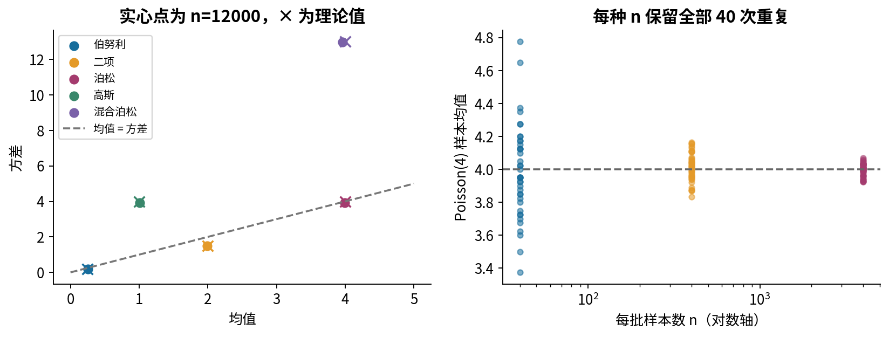

应分清三种误差。采样波动是合法模型中有限随机样本的变化；数值误差是计算和浮点表示造成的偏差；模型不合适是现实生成机制不符合假设。增大样本量可能减小第一种，不会自动修复后两种。用不同种子得到相似图形，只增加有限实验信息；数学矩仍由推导给出。

离散经验柱高为该值计数除以总样本数。Poisson图只截取0到较小上界时，图外样本与理论尾部要另报，不可把图内重新除以图内总数。连续经验密度直方图的高度为箱内计数除以n和箱宽，面积近似频率；改变箱宽会改变峰高，不能把峰高变化解释成概率发生变化。

## 十七 数值实现也有支持范围

代码对n、k、种子和样本量要求整数并拒绝bool；对p、λ、μ、v要求有限实数并拒绝文本、复数、非标量和NaN。数学边界p=0、p=1、λ=0、n=0被显式处理。Gaussian要求v>0，计算中如出现溢出或有意义的下溢，就明确报错，不能把负方差开方结果吞掉。

核心PMF先计算对数。正概率小到转换成float普通数会下溢时，PMF接口拒绝而对数接口仍可提供有限log概率；真正支持外的点则返回质量0、log质量负无穷。这两种0不能混在一起。代码保守拒绝非零次正规量与非零乘积落为0，范围比数学定义窄，原因是保持教学核验可解释。

概率列表须先完整验证，求和必须在本程序规定的float精度下恰为1；程序不偷偷重新缩放。有限期望函数在调用任何用户函数前检查整个支持列表和概率列表，之后还检查回调的返回类型、范围以及加权乘积。输入有限不意味着中间平方、差值或和一定有限，验证不能只放在最后一行。

实验提供Fraction有理数二项参考值和Decimal高精度Poisson参考值，与核心对数实现分开；检查错误输入、边界、支持外查询、回调哨兵、极端尺度和优化模式。固定种子加固定依赖版本有助于复现；不保证未来NumPy版本生成逐位相同序列。[R5][R6][R9]

## 十八 从问题到模型的最小说明书

真正提交一个分布假设时，至少写清这五件事：一行是谁或哪个时段；X的支持范围和单位；给定哪些条件之后使用哪个分布及参数；多行之间有哪些独立、同分布或依赖假设；哪些结果会使你怀疑它。对本讲主问题，这给出有条件的答案：一次二分类可从Bernoulli开始；固定次数的独立同概率成功总数对应Binomial；互斥多类对应Categorical；给定暴露量下某些计数机制适合Poisson；未截断的连续加性误差可考虑Gaussian。

最后一句必须保留“可考虑”。参数调整只能在一个族内部移动，不会自动补回缺失的支持约束、异质性或依赖。下一讲将把多个随机变量的联合行为、独立性与协方差连接起来，进一步解释为何单列直方图无法决定整套预测问题。

## 来源与阅读范围 {style="break-before: page;"}

推导、合成场景、反例、程序与图形均为本讲独立编写。以下一手材料用于核对定义和接口，不复制其例题或图像；阅读记录另见source-checks.json。

[R1 NIST二项分布](https://www.itl.nist.gov/div898/handbook/eda/section3/eda366i.htm)：支持、PMF与矩。 [R2 NIST Poisson分布](https://www.itl.nist.gov/div898/handbook/eda/section3/eda366j.htm)：计数参数及均值方差关系。 [R3 NIST正态分布](https://www.itl.nist.gov/div898/handbook/eda/section3/eda3661.htm)：位置尺度密度；本讲不沿用无条件的极限定理口号。

[R4 Will Fithian指数族讲义](https://www.stat.berkeley.edu/~wfithian/courses/stat210a/exponential-families.html)：自然参数、归一化及矩的关系。 [R5 NumPy二项随机生成器](https://numpy.org/doc/stable/reference/random/generated/numpy.random.Generator.binomial.html)：库允许截断浮点n，本讲包装函数明确拒绝这种输入。 [R6 NumPy Poisson随机生成器](https://numpy.org/doc/stable/reference/random/generated/numpy.random.Generator.poisson.html)：λ与整数输出范围；本讲使用更保守的课堂规模限制。

[R7 NumPy分类抽样接口](https://numpy.org/doc/stable/reference/random/generated/numpy.random.Generator.choice.html)：概率向量与形状约束；本讲另用显式累计概率抽样，不自动归一化输入。 [R8 NumPy正态随机生成器](https://numpy.org/doc/stable/reference/random/generated/numpy.random.Generator.normal.html)：scale为标准差，不能传方差。 [R9 NumPy随机数兼容性](https://numpy.org/doc/stable/reference/random/compatibility.html)：种子复现与版本、构建条件的边界。
