# 联合分布与相关结构

## 第二十一讲 看见一个变量之后 对另一个变量究竟知道了多少

第019讲告诉我们怎样平均一个随机量，第020讲介绍了几类常用分布。但机器学习的输入通常有多个坐标：两个测量怎样一起变化，知道组别能减少多少预测误差，为什么每个坐标都像正态也不保证联合模型是高斯？只研究每列直方图无法回答这些问题。

本讲的主线是“边缘分布丢失了什么，而协方差又保留了多少”。我们从第019讲的六状态合成模型建立联合表，再把同一个计算写成矩阵，推导相关、线性变换与全方差，最后说明联合Gaussian模型带来的特殊简化。直接先修第010、012、018至020讲；向量按列表示，样本表按行存放，出现两种约定时会显式标形状。所有数据为无量纲合成模型，没有真实任务性能或因果效果宣称。

本讲默认所讨论随机量具有有限二阶矩。否则协方差和相关系数可能根本没有定义，不能把一次有限样本打印出的数字当作存在性的证明。多元Gaussian部分区分半正定与正定，退化分布不直接代入普通密度公式。

## 一 同一次结果 产生多个坐标

仍取六个等概率状态A至F。定义X=[0,0,1,1,2,4]，并把quiet编码为Z=0、active编码为Z=1，于是Z=[0,0,1,1,1,1]。X表示合成损失，Z只表示一个已知二元组别，不是把类别强行排成连续等级。

随机向量写成 $\mathbf V=(X,Z)^T\in\mathbb R^2$。对于每个状态，同时观察两个坐标，得到一个数对。联合概率质量函数为

$$p_{X,Z}(x,z)=P(X=x,Z=z).$$

四种不同数对的质量是(0,0):1/3，(1,1):1/3，(2,1):1/6，(4,1):1/6。比如(0,1)虽属于两个单独支持集的笛卡尔积，却在本模型中概率为0。联合支持集不一定填满矩形。[R1]

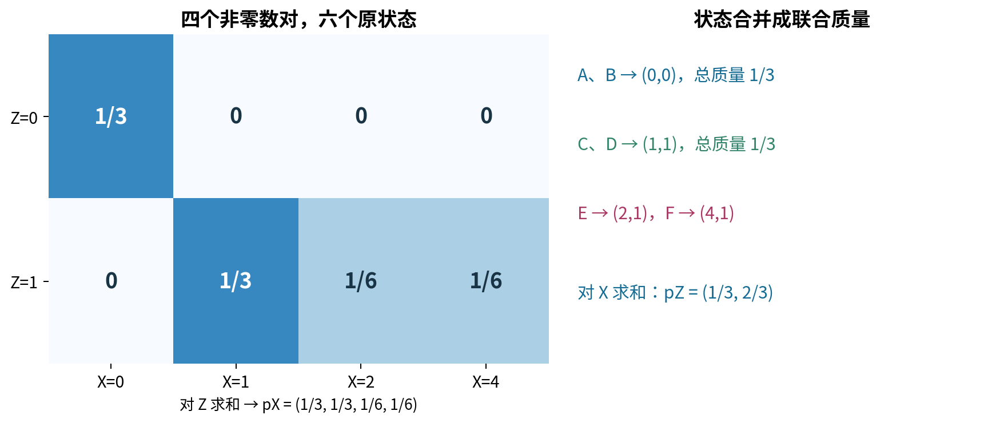

请把“同一次结果”保留在脑中。若把X列重新打乱，却不以相同顺序移动Z列，两个单列直方图都不变，配对关系已经改变。后面协方差计算必须使用原来的共同状态或配对样本。

## 二 边缘分布是把另一个坐标求和掉

从联合表求X边缘，要把所有z的质量加在一起：

$$p_X(x)=\sum_zp_{X,Z}(x,z),\qquad p_Z(z)=\sum_xp_{X,Z}(x,z).$$

本例X仍有第019讲的四点PMF；Z的质量为P(Z=0)=1/3、P(Z=1)=2/3。边缘分布不告诉你各列如何配对，因此通常不能从两个边缘唯一恢复联合分布。

为看清这一点，另取两个公平0/1变量U、W。可以令它们独立，四格各1/4；也可以令W=U，只在(0,0)、(1,1)各放1/2；还可以令W=1-U，只在另两格各放1/2。三个模型边缘完全相同，联合结构却截然不同。

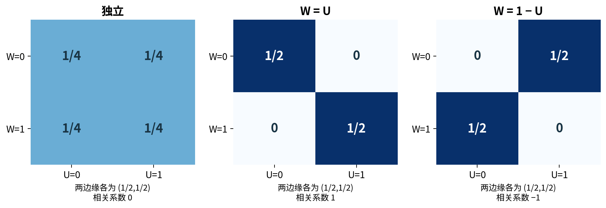

研究数据时，对每列分别做描述只是第一步。联合作用、预测信息和某些不可能组合，都可能藏在边缘化所丢掉的配对关系里。

## 三 条件分布是固定一边再归一化

若P(Z=z)>0，

$$p_{X\mid Z}(x\mid z)=\frac{p_{X,Z}(x,z)}{p_Z(z)}.$$

给定Z=0，X恒为0；给定Z=1，X在1、2、4处的概率分别为1/2、1/4、1/4。条件均值为0与2，条件方差分别为0与3/2：active组的平方偏差为1、0、4，按1/2、1/4、1/4加权得3/2。

这与把Z边缘求和掉不同。边缘化是不再保留具体z；条件化是已知具体z后，在相应切片内建立新分布。两种操作都来自同一联合表，不能混成“把另一列删掉”。

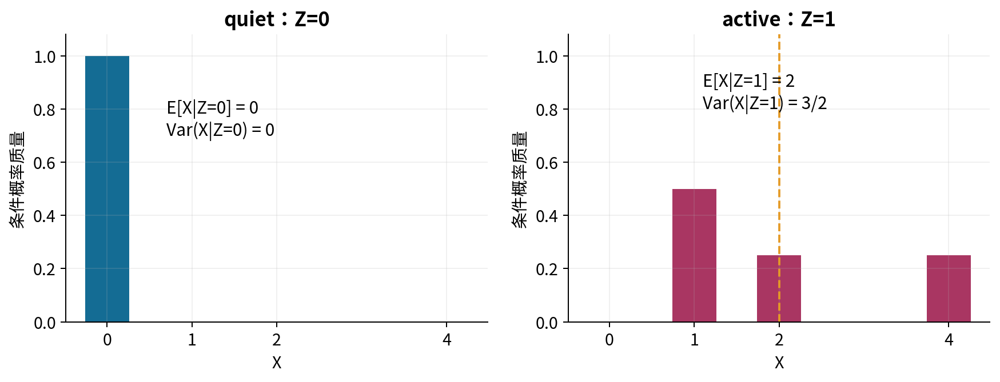

零模型概率组不能直接做此比值。有限样本没出现某个正概率组，意味着该样本无法估计该切片，不意味着理论条件分布不存在。这一点与第018至019讲保持一致。

## 四 连续联合密度通过面积分配概率

对于有普通二维密度的模型，$f_{X,Y}(x,y)\ge0$，且在整个平面二重积分为1。区域R的概率为 $\iint_Rf_{X,Y}(x,y)dxdy$；某个点的密度高度不是该点概率。

沿用第017讲的三角形区域 $0\le y\le x\le1$，令区域内密度为2，区域外为0。固定x时，y可从0到x，所以

$$f_X(x)=\int_0^x2dy=2x,\qquad 0\le x\le1.$$

固定y时，x可从y到1，故 $f_Y(y)=2(1-y)$，支持0≤y≤1。两个边缘分别积分为1，但相乘并不能恢复原来带三角形边界的联合密度。

对0<x≤1，有 $f_{Y\mid X}(y\mid x)=1/x$，支持0≤y≤x。因此 $E[Y\mid X=x]=x/2$、$\operatorname{Var}(Y\mid X=x)=x^2/12$。这是区间长度随x改变的均匀切片。[R2]

![图4 三角形联合密度的竖直切片长度是x，横向边缘因此为2x。给定X=x后，切片密度需除以2x，成为区间[0,x]上的1/x。](figures/04_triangle_slices.png)

连续条件密度的比值需要边缘密度为正；它不是用P(X=x)=0作除数。x=0处简单比值未定义，可在不影响整体分布的零概率点上另选版本，本讲不把边界赋值当作从0/0算出的结果。

## 五 协方差平均共同偏离的乘积

对有限二阶矩的实随机变量，定义

$$\operatorname{Cov}(X,Y)=E[(X-\mu_X)(Y-\mu_Y)].$$

把乘积展开，利用期望线性性，得到 $E[XY]-\mu_X\mu_Y$。共同高于或共同低于各自均值时乘积为正；一个高、一个低时为负。协方差累计的是这个带符号乘积，不是所有依赖关系的总强度。[R3]

主模型中 $E[X]=4/3$、$E[Z]=2/3$。因为X=0时Z=0，其余Z=1，有XZ=X，故E[XZ]=4/3。因此

$$\operatorname{Cov}(X,Z)=4/3-(4/3)(2/3)=4/9.$$

用六个中心乘积直接平均，应得到同一个数。若X单位为秒，Y单位为米，协方差单位是秒乘米；改变单位会改变数值大小。不能不标准化就横向比较不同量纲的协方差绝对值。

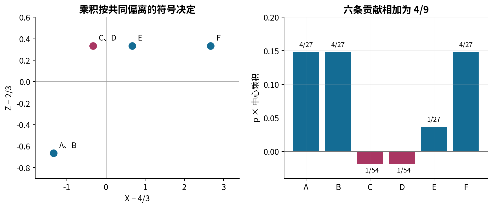

只靠E[XY]-E[X]E[Y]在浮点里计算可能发生大数消减。样本实现优先先中心化再做乘积；若原始输入已舍入丢失信息，中心化也无法恢复。

## 六 和的方差为什么多一项

令A=X-μX、B=Y-μY。对aX+bY，中心变量是aA+bB，展开平方：

$$\operatorname{Var}(aX+bY)=a^2\operatorname{Var}(X)+b^2\operatorname{Var}(Y)+2ab\operatorname{Cov}(X,Y).$$

不需要独立就有这条式子。独立且二阶矩有限可推出协方差0，于是才可删交叉项。反过来，交叉项为0一般不能证明独立。

主模型Var(X)=17/9、Var(Z)=2/9、Cov(X,Z)=4/9。因此Var(X+Z)=27/9=3，Var(X-Z)=11/9。直接把六个X+Z与X-Z值列出，再用中心平方求方差，是不复用同一公式的手算核对。

“正相关一定增加风险”仍需说明你组合了什么。正协方差对X+Z增加方差，对X-Z则减少方差。系数、符号和单位都属于问题定义的一部分。

## 七 相关系数移除了单位 但没有恢复全部依赖

当σX和σY都为正，Pearson相关系数定义为

$$\rho_{X,Y}=\frac{\operatorname{Cov}(X,Y)}{\sigma_X\sigma_Y}.$$

它无量纲。令标准化变量A=(X-μX)/σX、B=(Y-μY)/σY，二者均值0、方差1。因为 $E[(A-B)^2]=2-2\rho\ge0$ 与 $E[(A+B)^2]=2+2\rho\ge0$，可直接得到-1≤ρ≤1。

ρ=1当且仅当A=B几乎处处；ρ=-1当且仅当A=-B几乎处处。这描述带符号的完全线性关系，而不是一般非线性函数关系。若某变量方差0，分母为0，相关系数未定义，不能偷偷填0。

本例 $\rho_{X,Z}=4/\sqrt{34}\approx0.686$。把X正比例缩放不改相关，负比例缩放会反号；平移不改变相关。分类编码多于两类时，随意指定数值可制造任意数值关系，应先判断编码是否有可解释含义。

## 八 零相关却可以完全可预测

令U在-1、0、1三点等概率，V=U²。E[U]=0、E[V]=2/3，E[UV]=E[U³]=0，所以协方差0。Var(U)=2/3、Var(V)=2/9都为正，因此相关系数确实为0，而不是分母未定义。

但一旦知道U，V没有任何不确定性。事件{U=0}与{V=0}完全相同，联合概率1/3，而边缘概率乘积1/9，因此不独立。独立要求联合分布分解，零相关只要求一个二阶中心乘积平均为0。

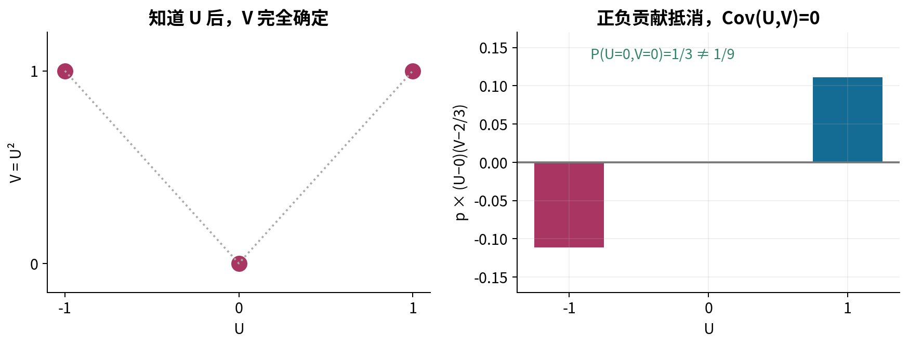

甚至“每个边缘都是正态，且协方差为0”也不够。取标准正态G，再独立掷公平符号S∈{-1,1}，令H=SG。G与H各自都标准正态，Cov(G,H)=E[S]E[G²]=0；但|G|=|H|几乎必然，它们明显不独立。它们不构成联合Gaussian。稍后联合高斯的特殊结论，必须保留“联合”二字。

## 九 协方差矩阵把所有二阶关系排在一起

令 $\mathbf V\in\mathbb R^d$ 为列向量，均值 $\boldsymbol\mu=E[\mathbf V]\in\mathbb R^d$。定义

$$\Sigma=E[(\mathbf V-\boldsymbol\mu)(\mathbf V-\boldsymbol\mu)^T]\in\mathbb R^{d\times d}.$$

外积第(i,j)项正是两个坐标的中心乘积。因此对角线为各坐标方差，非对角为协方差，且Σ对称。主模型为

$$\boldsymbol\mu=\begin{pmatrix}4/3\\2/3\end{pmatrix},\qquad\Sigma=\frac19\begin{pmatrix}17&4\\4&2\end{pmatrix}.$$

对任意系数列向量a∈R^d，逐项展开得到

$$a^T\Sigma a=E[(a^T(\mathbf V-\boldsymbol\mu))^2]=\operatorname{Var}(a^T\mathbf V)\ge0.$$

所以协方差矩阵必为半正定。它不必正定：若有某个非零a使aᵀV恒定，则该方向方差0，矩阵奇异。本例行列式为2/9>0，且首个对角元为正，二维下可判定正定。[R4]

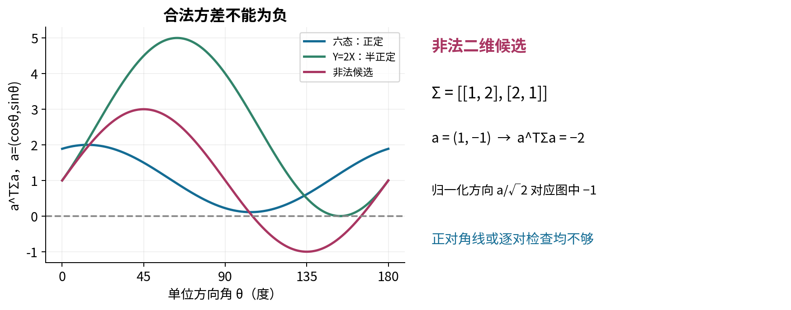

对称和正对角线还不够。矩阵[[1,2],[2,1]]虽然两条对角线都是1，方向a=(1,-1)却给aᵀΣa=-2，不可能是协方差。三维矩阵对角全1、非对角分别0.9、0.9、-0.9时，也有负特征值-0.8。逐对“看起来合理”不保证整体可同时成立。

## 十 线性变换怎样搬运协方差

若 $\mathbf Y=A\mathbf V+b$，其中A形状k×d、b形状k，则均值为Aμ+b。中心向量为A(V-μ)，所以

$$\operatorname{Cov}(\mathbf Y)=A\Sigma A^T.$$

形状为(k×d)(d×d)(d×k)=k×k。平移b消失；它不改变分散。这个公式不要求高斯，只要求二阶矩存在。

取 $A=\begin{pmatrix}1&1\\1&-1\end{pmatrix}$，新坐标为X+Z和X-Z。主例得到

$$A\Sigma A^T=\begin{pmatrix}3&5/3\\5/3&11/9\end{pmatrix}.$$

两个新坐标的方差与第六节一致。交换样本列时，协方差的行列必须同时按同一置换调整；只交换一边会破坏对称性，也不再表示同一个变换。

## 十一 样本表按行时 要特别留心转置与分母

令D∈R^(n×d)，每行一个观测，每列一个坐标。各列减去样本均值后得C。同一批数据的经验分布把每行赋1/n，于是经验协方差为

$$\widehat\Sigma_n=\frac1nC^TC.$$

它是d×d，不是n×n。分母n-1常用于独立同分布抽样下总体协方差的无偏估计，属于另一个统计任务；本讲不把两种默认值混用。NumPy的cov默认按行表示变量，默认分母n-1；本讲按行存样本时显式使用rowvar=False、ddof=0核对经验分布。[R5]

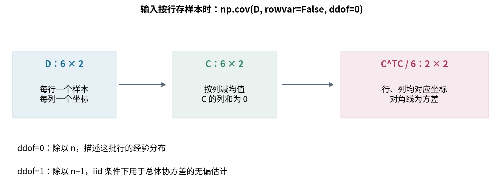

C的列向量都与全1向量正交，因此rank(C)≤min(d,n-1)。若d≥n，样本协方差必然奇异，哪怕总体协方差正定。遇到这种情况，直接Cholesky失败不等于数据数学上不合法；它可能只是样本量不足以覆盖全部方向。

## 十二 多元Gaussian首先是一个联合生成模型

取 $\boldsymbol\epsilon\in\mathbb R^k$，各分量相互独立且标准正态。定义

$$\mathbf Y=\boldsymbol\mu+B\boldsymbol\epsilon,\qquad B\in\mathbb R^{d\times k}.$$

称其为一个多元Gaussian随机向量。独立标准噪声均值0、协方差I，因此Y均值μ、协方差BBᵀ。这个构造也包括奇异协方差，支持集可能落在低维仿射子空间里。[R4]

给定对称半正定Σ，可用谱分解Σ=QΛQᵀ取B=QΛ^(1/2)，所以BBᵀ=Σ。若只用正特征值对应列，可得到d×r因子，r为秩。正定时也可用Cholesky因子L，使Σ=LLᵀ。不同合法因子可生成同一高斯分布，但同一个伪随机种子不保证逐个样本完全一致。

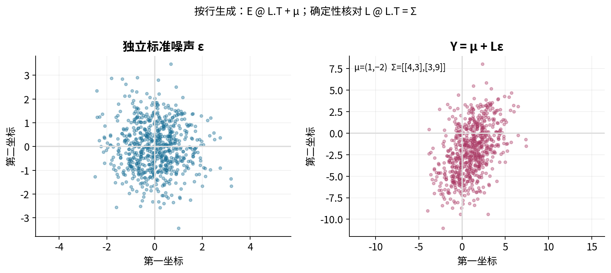

程序里的样本行向量通常写成E@B.T+μ。误写E@B会产生不同协方差，除非所用B恰好对称等特殊情况。图是诊断，因子重构是确定性核对，经验协方差只是有限随机近似，三者不能互相替代。

## 十三 非退化密度公式与椭圆几何

若Σ正定，多元Gaussian有普通d维密度

$$f(\mathbf y)=\frac{1}{(2\pi)^{d/2}\sqrt{\det\Sigma}}\exp\left[-\frac12(\mathbf y-\boldsymbol\mu)^T\Sigma^{-1}(\mathbf y-\boldsymbol\mu)\right].$$

detΣ表示行列式；对正定对称矩阵，它是所有正特征值的乘积。二次型中的Σ⁻¹使各主方向按其方差标准化，整个指数无量纲。密度本身的单位是各坐标单位乘积的倒数。

可以在Σ的正交特征坐标下理解归一化：各坐标是独立的一维正态，密度乘积给(2π)^(-d/2)及指数平方和；再按各标准差缩放，体积乘积为√detΣ。本讲接受“正交变换保持体积、线性尺度按轴长乘积改变体积”这一几何事实，不在这里证明一般多元换元定理。这样无需把未讲过的广义Jacobian当作先修。

等密度轮廓固定二次型的值，二维时为椭圆；特征向量给主轴方向，半轴与标准差而不是方差成比例。某条椭圆围住多少概率，还取决于维度和阈值，不能把“一个标准差椭圆”直接叫作任意指定的置信区域。

若Σ仅半正定且奇异，detΣ=0，普通逆不存在。分布仍可由Bε+μ定义，却没有上述全空间普通密度。加入小对角量jitter会改变模型；不能不告知就把退化分布改成另一条非退化分布。[R6]

## 十四 联合高斯才允许零协方差推出独立

对于正定的联合高斯，若Σ为对角矩阵，二次型是各坐标平方项之和，归一化常数是各一维常数乘积，联合密度就分解为边缘密度乘积，因此各坐标独立。相反，独立且二阶矩有限自然给零协方差。

奇异高斯的对应结论也成立，但不能直接用不存在的密度证明；本讲把一般退化情形视为已有高斯分布理论的定理，并在实验只演示明确线性构造。不能把高斯特例的结论搬到第八节的U与U²，也不能搬到边缘各自正态的G与SG。

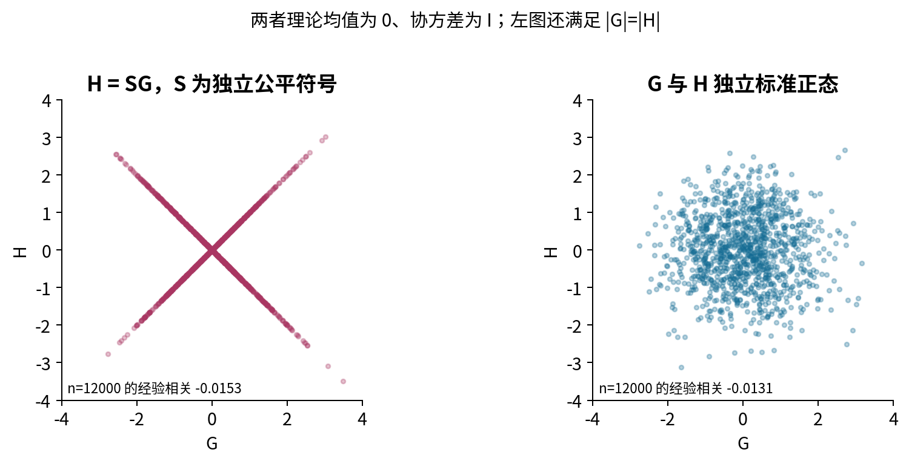

协方差与均值在“已知是联合Gaussian”的模型类中足以确定分布。若没有先说明这个模型类，它们只是一组有限摘要。模型假设在这里承担了实质信息，不能隐藏在一个函数名里。

## 十五 二维条件高斯用配方推出来

设(X,Y)联合高斯，均值μX、μY，正标准差σX、σY，且|ρ|<1。标准化u=(x-μX)/σX、v=(y-μY)/σY，联合密度指数的二次项为

$$\frac{u^2-2\rho uv+v^2}{1-\rho^2}=u^2+\frac{(v-\rho u)^2}{1-\rho^2}.$$

固定x后，u是常数。联合密度除以X的边缘密度，会消去仅依赖u的那一部分；剩下v是均值ρu、方差1-ρ²的正态。因此

$$Y\mid X=x\sim\mathcal N\left(\mu_Y+\rho\frac{\sigma_Y}{\sigma_X}(x-\mu_X),\ \sigma_Y^2(1-\rho^2)\right).$$

第二个参数是方差，不是标准差。条件均值随x线性改变，条件方差在该联合高斯模型中不依赖x。条件发生在连续零概率点上时用条件密度解释，不使用P(X=x)作分母。[R4]

本讲高斯例选μ=(1,-2)ᵀ、Σ=[[4,3],[3,9]]，所以σX=2、σY=3、ρ=1/2。给定x，条件均值为-2+3(x-1)/4，方差27/4。当x=5，条件均值1，标准差√27/2。请用配方与直接因子构造两条路径核对，而不是让一个库调用充当自己的参考答案。

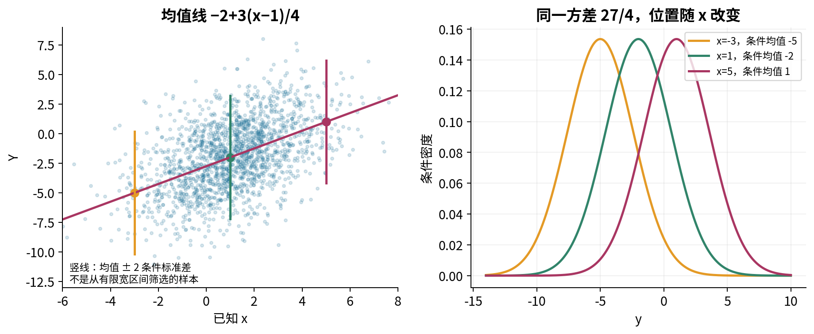

## 十六 分块条件公式的形状与边界

若向量A维度r、B维度s，联合均值为(μA,μB)，协方差分成ΣAA、ΣAB、ΣBA、ΣBB。当联合高斯且ΣBB可逆时，条件均值与协方差为

$$E[A\mid B=b]=\mu_A+\Sigma_{AB}\Sigma_{BB}^{-1}(b-\mu_B),$$

$$\operatorname{Cov}(A\mid B=b)=\Sigma_{AA}-\Sigma_{AB}\Sigma_{BB}^{-1}\Sigma_{BA}.$$

ΣAB形状r×s，条件协方差形状r×r，减去的项称为Schur补中的修正项。二维公式就是r=s=1。一般公式可由联合密度分块配方，或构造与B不相关的高斯残差推得；本讲给出后一条核心逻辑：取残差R=A-μA-ΣABΣBB⁻¹(B-μB)，直接计算Cov(R,B)=0。线性变换仍联合高斯，故R与B独立。固定B后只剩这个残差波动，计算其协方差即得上式。这里的“不相关推出独立”依赖上一节的联合高斯条件，不能对任意分布复用。

计算时用线性求解求ΣBB⁻¹乘向量或矩阵，避免显式求逆。若ΣBB奇异，这个普通公式接口应拒绝或明确改用另一个专门理论；不能只换成伪逆却不检查条件值是否在支持集、版本和模型含义。本讲实验的条件接口只接受严格正定输入。

## 十七 全方差把组内与组间差别分开

令m(Z)=E[X|Z]，写成

$$X-E[X]=(X-m(Z))+(m(Z)-E[X]).$$

两部分平方并取期望。交叉项为0，因为给定Z时第二项已固定，而E[X-m(Z)|Z]=0。于是

$$\operatorname{Var}(X)=E[\operatorname{Var}(X\mid Z)]+\operatorname{Var}(E[X\mid Z]).$$

第一项平均每个组内部仍存在的分散；第二项衡量不同组均值之间的分散。只要二阶矩有限，公式不要求独立，也不要求高斯。[R7]

主模型的组内项为(1/3)×0+(2/3)×(3/2)=1。组间项为(1/3)(0-4/3)²+(2/3)(2-4/3)²=8/9。两项加成17/9，刚好解释第019讲条件均值预测把平方风险从17/9降到1所省下的8/9。

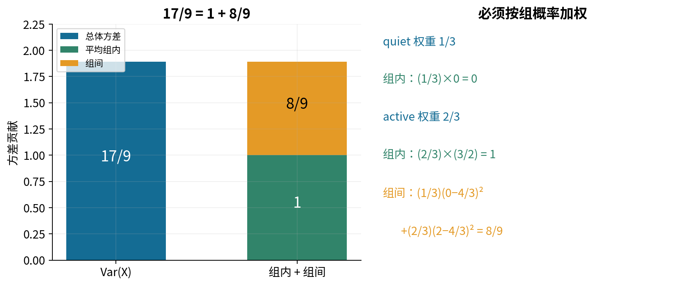

这是平均意义的关系，不意味着每个条件组方差都小于总体方差。条件信息可能选中一个很分散的小组，只是按原概率平均的组内方差不超过总体方差。例如90%质量的组恒为0，另10%质量的组以各一半取-10和10；两组均值均为0，总方差10，但第二组条件方差100。三角密度也可核对：E[X²]=1/2，E[Var(Y|X)]=1/24，Var(E[Y|X])=Var(X)/4=1/72，总和1/18，与Y边缘密度的方差一致。

## 十八 同样的矩不能替你判断条件模型

六状态模型的(X,Z)与某个拥有相同均值、协方差的联合高斯，其矩阵计算可完全相同，但条件结构不同。六态中的Z只有0或1，高斯Z则连续；quiet条件方差0、active条件方差3/2，高斯线性条件公式给出的残差方差却为

$$17/9-(4/9)^2/(2/9)=1,$$

且不依赖条件值。它恰好等于六态的平均组内方差，却不能替代每个真实组的方差。

这个对照说明，“线性最小平方残差的平均量”“真正条件分布”和“高斯条件分布”不是同一个对象。某些公式数值相同，只能说明特定矩被匹配，不能证明分布假设正确。

## 十九 实验应分别验证哪几层

第一层是有限模型的精确账本：联合总质量、边缘和、条件归一化、均值、协方差、全方差。用Fraction逐状态独立计算，先于浮点图形。第二层是确定性线性代数：对称性、半正定、因子重构、AΣAᵀ、方向方差与形状。第三层才是固定种子的有限模拟：经验均值、经验协方差、散点与条件样本波动。

协方差校验须先检查输入对称性。NumPy的eigh和Cholesky只使用指定三角部分，成功返回并不等于整个原数组已经对称。对明显不对称或明显负特征值的输入，应明确拒绝；若为舍入误差容许微小修正，需报告容差、修改量和实际使用的矩阵，不能把修改藏进“清洗”。本讲的严格密度与条件接口不对奇异输入偷偷加jitter。[R8]

模拟需要报告n、种子、生成因子及软件版本；不同合法分解和随机数实现不保证逐个样本跨平台一致。有限样本协方差不必等于理论矩阵，一次近似也不是一般收敛定理。独立性不能仅由经验相关接近0验收，应核对生成机制或明确的联合概率分解。

## 二十 继续之前的自测

能否在同一张联合表上解释边缘化与条件化？能否证明协方差必半正定，而不是只检查对角线？能否写对样本按行时的CᵀC/n，并解释n与n-1？能否构造零相关但不独立、边缘正态但不联合高斯的例子？能否从配方推出二维条件高斯，并说出奇异边界？能否把17/9拆成1与8/9，同时解释为什么这不是每个组都减少方差的保证？

这些问题比背一张公式表更接近研究中的实际判断。完整实验与详解分别给在独立文件中；第022讲将再分析抽样下的近似与极限，暂不把一次模拟的稳定外观当作结论。

## 来源与阅读范围

所有例子、推导组织和图独立编写。下列官方材料用于核对定义、条件和接口；不转载来源图像。

- [R1 MIT Introduction to Probability 摘要第2.5至2.7节](https://ocw.mit.edu/courses/res-6-012-introduction-to-probability-spring-2018/d973b10c2587781f86ca4f2aff49098f_MITRES_6_012S18_Textbook.pdf#page=12)：联合、边缘、条件PMF与独立分解。
- [R2 同一官方摘要第3.4至3.5节](https://ocw.mit.edu/courses/res-6-012-introduction-to-probability-spring-2018/d973b10c2587781f86ca4f2aff49098f_MITRES_6_012S18_Textbook.pdf#page=23)：联合与条件密度。本讲三角模型独立手算。
- [R3 同一官方摘要第4.2节](https://ocw.mit.edu/courses/res-6-012-introduction-to-probability-spring-2018/d973b10c2587781f86ca4f2aff49098f_MITRES_6_012S18_Textbook.pdf#page=32)：协方差、相关与和的方差。
- [R4 MIT6.436J 第14讲 多元正态](https://ocw.mit.edu/courses/6-436j-fundamentals-of-probability-fall-2018/ceb423b6a703abd60429367b733f45bf_MIT6_436JF18_lec14.pdf)：构造定义、矩阵形状、线性变换与条件结构。
- [R5 NumPy2.3 cov](https://numpy.org/doc/2.3/reference/generated/numpy.cov.html)：rowvar、ddof与权重的接口语义。
- [R6 MIT6.436J 第15讲 多元正态续](https://ocw.mit.edu/courses/6-436j-fundamentals-of-probability-fall-2018/87422049e8f05459ee857eb475f3a667_MIT6_436JF18_lec15.pdf)：退化与非退化定义的区别。
- [R7 MIT6.041 第12讲讲义](https://ocw.mit.edu/courses/6-041-probabilistic-systems-analysis-and-applied-probability-fall-2010/60eede37f87fd886d4ba574e1cf26617_MIT6_041F10_lec_slides.pdf#page=24)：全方差与条件残差。
- [R8 NumPy2.3 eigh](https://numpy.org/doc/2.3/reference/generated/numpy.linalg.eigh.html)、[Cholesky](https://numpy.org/doc/2.3/reference/generated/numpy.linalg.cholesky.html)、[multivariate_normal](https://numpy.org/doc/2.3/reference/random/generated/numpy.random.Generator.multivariate_normal.html)：三角读取约定、正定或半正定要求及生成方法。
