# 第二十二讲 抽样与极限定理

## 1. 同一个模型，为什么换一批数据就换一个答案？

设某个纯教学装置每次产生一个报警指示：报警记为1，不报警记为0。我们人为规定每次报警概率为 $p=1/4$。第二十讲已经告诉我们单次记录服从Bernoulli分布；第二十一讲提醒我们，单次分布相同还不足以说明多次记录独立。这一讲增加一个明确假设：每次重新启动装置，结果独立，且概率保持不变。

现在收集四次结果，可能得到 $(0,0,0,1)$，也可能得到 $(0,1,1,1)$。两批数据的报警比例分别为 $1/4$ 和 $3/4$。装置的参数没有改变，估计值却变了。核心问题是：**重复收集数据时，平均值和估计误差为什么会变化？增加数据究竟能解决哪些变化？**

这也是机器学习里平均测试损失、平均预测误差和交叉实验结果背后的基本问题。不过，本讲所有分布和实验都是明确设定的合成模型，不代表真实模型已经达到某种性能。尤其是“同一个用户的64条记录”未必等于“64个独立用户”。

直接先修为第十九至二十一讲：期望、方差、Bernoulli与Gaussian、协方差及其求和。还会使用第十七讲积分和第八讲有限求和。学完应能独立完成四件事：写出抽样对象和重复方式；推导平均值的方差；区分标准差与标准误；在重尾、相关或偏选样本中指出哪个前提失效。

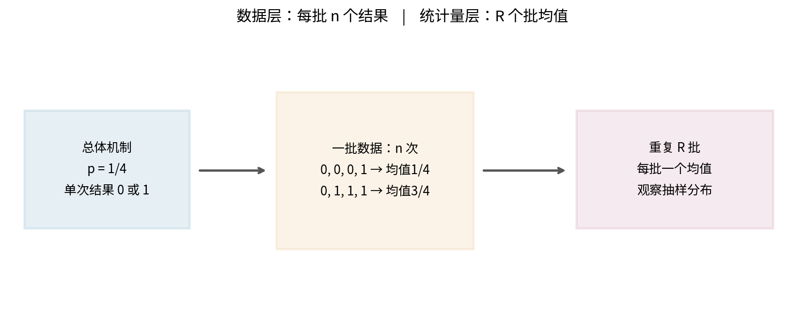

## 2. 三个层次：分布、样本、统计量

用大写 $X_1,\ldots,X_n$ 表示尚未采集的随机变量；用小写 $x_1,\ldots,x_n$ 表示这一次实际观察到的数字。统计量是样本的函数，例如

$$
\bar X_n=\frac1n\sum_{i=1}^n X_i,\qquad S_n=\sum_{i=1}^n X_i.
$$

采样前，$\bar X_n$ 也是随机变量；采样后，$\bar x_n$ 是已算出的一个数。把整个采样流程重新做一遍，会得到另一个数。**抽样分布**就是在规定的重复流程下，统计量可能如何变化的分布。它不是一批原始数据的直方图。

在程序中，数组形状约定为 $(R,n)$：一行是一批新的完整样本，一列是该批中的一次采样位置。沿列方向求平均，即 `axis=1`，得到长度为R的批均值。把全部 $Rn$ 个数先拉平，只会得到一份更大的样本，无法直接看见固定n的抽样分布。R增大让我们画出的抽样分布更稳定；它不改变每批只有n个观测这一事实。

## 3. “独立同分布”是两条假设

同分布要求每个 $X_i$ 都有相同的概率规律，例如相同的Bernoulli参数p。独立要求任意有限组事件的联合概率能拆成乘积。iid是independent and identically distributed的缩写，不能只检查边缘直方图相似，就认定iid成立。

两个反例值得先记住。第一，把同一个Bernoulli结果复制n次：每项都有相同分布，但结果完全相关。第二，独立生成前一半概率0.1、后一半概率0.9的Bernoulli结果：各项独立，却不同分布。两者都不满足本讲最基本的iid定理版本。

“随机抽样”也需要说明设计。从一个有限名单中等概率、有放回、每次重新独立选一个单位，可以形成该经验总体下的iid抽样。不放回抽样禁止同一单位再次出现，因而引入依赖。后文会推导它的方差修正，而不会把所有依赖都说成“误差一定变大”。

把数据行打乱只改变顺序，不消除共同来源、时间相关、重复用户或共同设备误差。随机种子用于复现伪随机计算，也不能证明真实采样机制独立。

## 4. 从协方差展开平均值的误差

设每个 $X_i$ 都有有限二阶矩，均值为 $\mu$。期望的线性性不需要独立：

$$
E[\bar X_n]=\frac1n\sum_{i=1}^nE[X_i]=\mu.
$$

方差则需要保留交叉项。直接展开中心化平方，得到

$$
\operatorname{Var}(\bar X_n)
=\frac1{n^2}\left[\sum_{i=1}^n\operatorname{Var}(X_i)
+2\sum_{i<j}\operatorname{Cov}(X_i,X_j)\right].
$$

在iid且单项方差为有限数 $\sigma^2$ 时，所有不同项协方差为0，故

$$
\operatorname{Var}(\bar X_n)=\frac{\sigma^2}{n},\qquad
\operatorname{SD}(\bar X_n)=\frac{\sigma}{\sqrt n}.
$$

这里实际只需同方差且两两不相关，就能得到方差公式；但后文的经典CLT使用更强的iid条件，不能由这个方差公式倒推CLT。若所有项都等于同一个X，协方差共有 $n(n-1)/2$ 项，代回去恰好得到 $\operatorname{Var}(\bar X_n)=\sigma^2$，没有任何下降。

对报警模型，$\mu=1/4$、$\sigma^2=p(1-p)=3/16$。n从4、16、64增到256，真实均值标准误依次为约0.216506、0.108253、0.054127、0.027063。要把标准误减半，样本量要变成四倍，而不是两倍。这是方差的代数结果，尚未使用正态近似。

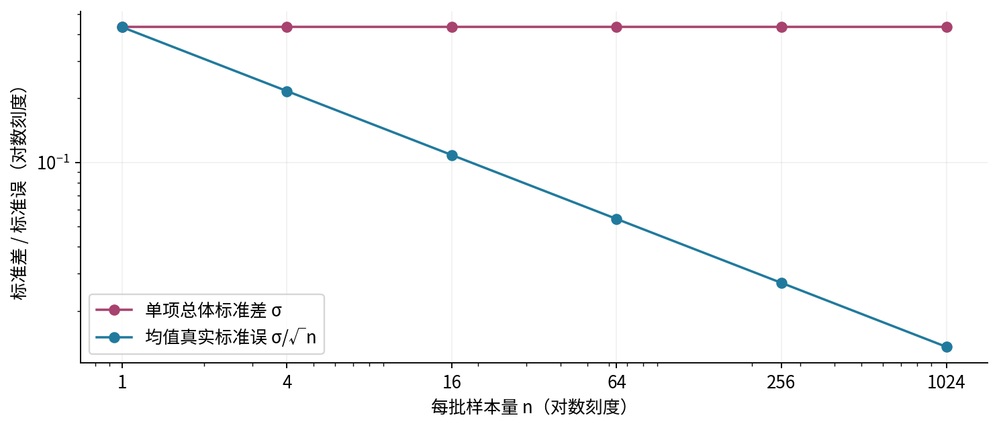

## 5. 标准差与标准误，究竟是哪一个数在波动？

总体标准差 $\sigma$ 描述单个观测的分散程度。标准误SE是一个统计量的抽样分布标准差。本讲关心样本均值，所以在iid有限方差下 $\operatorname{SE}(\bar X_n)=\sigma/\sqrt n$。对中位数、回归系数或模型间差值，标准误需要重新推导；不能对任何数字都机械除以 $\sqrt n$。

真实的 $\sigma$ 往往未知。观察到n个数后，定义

$$
s^2=\frac1{n-1}\sum_{i=1}^n(x_i-\bar x_n)^2,\qquad
s=\sqrt{s^2},\qquad \widehat{\operatorname{SE}}_{\rm iid}=\frac{s}{\sqrt n},\quad n\ge2.
$$

s是样本标准差；$s/\sqrt n$ 是基于iid假设的标准误估计。它们本身也会随样本改变。先看四个观测 $(0,0,0,1)$：均值1/4，离差平方和 $3(1/4)^2+(3/4)^2=3/4$。所以 $s^2=1/4$、$s=1/2$、估计标准误1/4。真实标准误是 $\sqrt3/8\approx0.216506$。两者不相等并不表示公式坏了，而是估计量有自己的抽样变化。

若四个观测恰好全为0，s也为0；这不能证明总体没有报警或未来均值没有误差。n=1时分母为0，我们的接口返回未定义值 `None`，绝不把标准误写成0。NumPy的 `std` 默认 `ddof=0`，用的是n分母；本讲s明确使用 `ddof=1`。代码中分母的选择必须和解释相符。

## 6. 为什么样本方差的分母是n减一？

这里给出期望层面的证明，而不只说“损失了一个自由度”。对任何一组实数和固定数 $\mu$，把 $X_i-\mu=(X_i-\bar X_n)+(\bar X_n-\mu)$ 代入平方和。因为 $\sum_i(X_i-\bar X_n)=0$，交叉项抵消，得到恒等式

$$
\sum_i(X_i-\mu)^2=\sum_i(X_i-\bar X_n)^2+n(\bar X_n-\mu)^2.
$$

iid有限方差且真实均值为 $\mu$ 时，对两边取期望：左边是 $n\sigma^2$，最后一项是 $n\operatorname{Var}(\bar X_n)=\sigma^2$。因此

$$
E\left[\sum_i(X_i-\bar X_n)^2\right]=(n-1)\sigma^2,
\qquad E[s^2]=\sigma^2.
$$

“无偏”针对的是 $s^2$，不能把平方根移出期望而声称 $E[s]=\sigma$。同样，s/n不是均值的标准误。标准差与标准误都和原始X有相同单位，方差则是单位的平方；这是一项有用但不充分的检查。

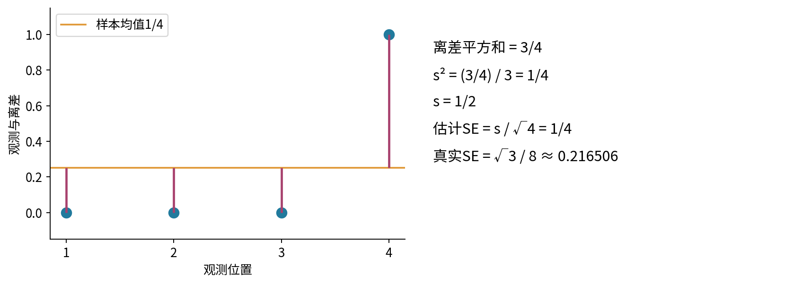

## 7. 不靠正态假设，能给出什么保证？

从一个简单的不等式开始。令 $W\ge0$，且 $E[W]<\infty$。对任意 $a>0$，逐点有 $W\ge a\mathbf1_{\{W\ge a\}}$。两边取期望，再除以a：

$$
P(W\ge a)\le\frac{E[W]}{a}.
$$

这就是Markov不等式。它并未要求W是正态变量。把W替换为 $(Y-E[Y])^2$，并令 $a=\epsilon^2$，得到Chebyshev不等式：

$$
P(|Y-E[Y]|\ge\epsilon)\le\frac{\operatorname{Var}(Y)}{\epsilon^2},\quad \epsilon>0.
$$

这一步要求Y有有限方差。再令 $Y=\bar X_n$，在iid有限方差下便有

$$
P(|\bar X_n-\mu|\ge\epsilon)
\le \min\left(1,\frac{\sigma^2}{n\epsilon^2}\right).
$$

报警模型、容差 $\epsilon=0.1$ 对应上界 $\min(1,18.75/n)$。n=16时上界只能给1，几乎没信息；n=256时给0.0732422。精确二项计算给的尾概率约0.000241382，远小于此上界。这不是矛盾：不等式对大量不同分布同时有效，代价是可能非常保守。上界不是“实际误差概率的估计”。

若想仅用此界确保尾概率不超过0.05，需要 $n\ge375$。这是一个充分条件，不是最小样本量，也没有涵盖相关性或偏选。不要用模拟里没有失败，代替上述概率保证。

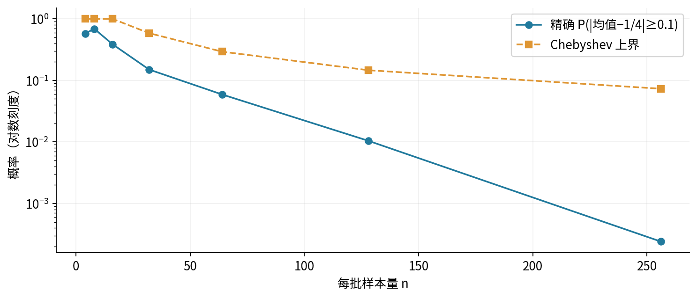

## 8. 大数定律说的是怎样的收敛？

对每个固定 $\epsilon>0$，上一节上界随n趋于无穷而趋于0。因此

$$
P(|\bar X_n-\mu|\ge\epsilon)\longrightarrow0.
$$

这称为 $\bar X_n$ **依概率收敛**到 $\mu$，记作 $\bar X_n\xrightarrow{P}\mu$。我们已经完整证明了iid、有限方差版本的弱大数定律。固定容差很重要：若同时把容差改为 $c/\sqrt n$，上述界变成 $\sigma^2/c^2$，不再自动趋于0。

更一般的iid大数定律只需 $E|X|<\infty$，不要求有限方差。我们接受这个更一般版本作为定理，不把有限方差证明冒充其证明。后面的Pareto例子正用于区分这两组条件。

还有强大数定律：在iid且 $E|X|<\infty$ 时，沿一条无限样本序列，其平均值几乎必然趋向 $\mu$。“几乎必然”指不收敛的序列集合概率为0，不等于每条数学上可能的序列都收敛。它也不意味着每一步更接近均值，或者给定某个有限n以后就肯定不再偏离。完整证明需要额外概率工具，本讲不展开。

运行均值曲线只是几条具体路径。即使一条曲线看起来平稳，也不能由有限图像证明任何无限序列定理。需要把有限模拟、精确有限分布和渐近定理分开。

## 9. 中心极限定理为什么要先中心化，再放大？

LLN说平均值挤向 $\mu$。如果只画同一个横轴上的均值直方图，n很大时图形会集中成很窄的一团；其极限是常数，而不是一个固定宽度的正态分布。要研究剩余误差的形状，我们把误差放大 $\sqrt n$ 倍：

$$
Z_n=\frac{\bar X_n-\mu}{\sigma/\sqrt n}
=\frac{S_n-n\mu}{\sigma\sqrt n}.
$$

在iid、$E[X]=\mu$ 且 $0<\sigma^2<\infty$ 条件下，经典中心极限定理CLT说明，对每个实数z，

$$
P(Z_n\le z)\longrightarrow\Phi(z),
$$

其中 $\Phi$ 是标准正态CDF。这里是分布收敛：比较的是CDF。它不是说同一条路径上的 $Z_n$ 会趋于某个固定正态抽样结果，更不是说原始 $X_i$ 越收越像正态。

CLT的一般证明需要特征函数等超出当前先修的工具，本讲明确把它作为已知定理。我们完整推导标准化的中心、尺度和应用，随后用可精确枚举的模型核验近似误差。仅仅证明 $E[Z_n]=0$ 和 $\operatorname{Var}(Z_n)=1$ 并不能证明正态极限，因为第二十一讲已经展示相同矩并不确定分布。

若 $\sigma^2=0$，X几乎必然等于 $\mu$，均值没有随机波动，标准化分母为0。此时LLN平凡成立，却不能继续套用上述正方差CLT公式。

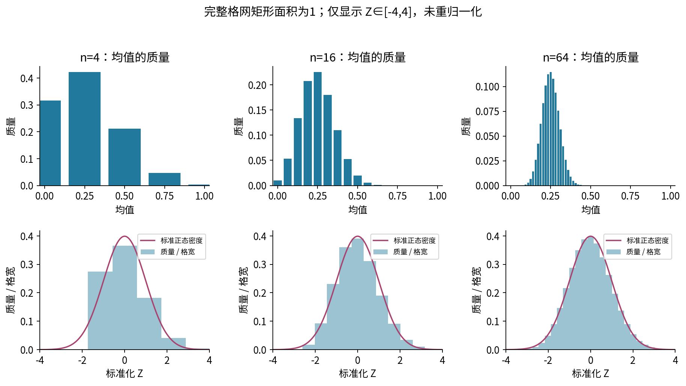

## 10. 手算四次报警的整个抽样分布

令 $K=S_4$。第二十讲的二项公式给出

$$
P(K=k)=\binom4k(1/4)^k(3/4)^{4-k},\quad k=0,1,2,3,4.
$$

五个概率依次为 $81/256,108/256,54/256,12/256,1/256$，对应五个均值 $0,1/4,1/2,3/4,1$。概率和为1，均值是1/4，方差是 $3/64$。这整个分布显然不是连续正态，n=4时不应被平滑曲线的外观蒙蔽。

例如事件 $|\bar X_4-1/4|\ge0.1$ 只排除均值恰好1/4的那一项，精确概率为 $1-108/256=37/64=0.578125$。更一般地，对整数k枚举 $|k/n-p|\ge1/10$；程序使用Fraction进行端点判断，避免二进制0.1导致“是否含等号”出错。

为量化CLT，我们比较标准化后的精确CDF与 $\Phi$。离散CDF在每个支持点跳跃，因此需要同时检查跳跃前、跳跃后的误差；不能只比较柱高与正态密度高。单调的 $\Phi$ 与每个平坦台阶之间的最大差在端点处达到或逼近，故这些端点足以计算本例的最大CDF差。

默认n为4、16、64、256，得到最大差约0.238281、0.130186、0.066648、0.033523。数值下降支持本例的近似改善，但不提供所有分布统一适用的n阈值。

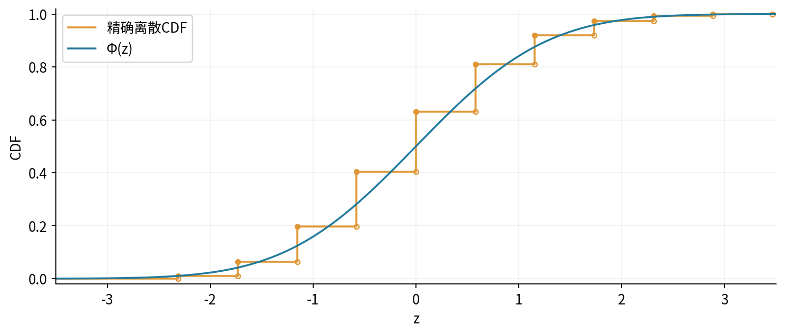

## 11. 正态近似的用途和有限样本边界

在前提满足且近似误差可以接受时，可用

$$
P(a\le\bar X_n\le b)\approx
\Phi\left(\frac{b-\mu}{\sigma/\sqrt n}\right)
-\Phi\left(\frac{a-\mu}{\sigma/\sqrt n}\right).
$$

这是对一个明确抽样事件的近似，不是自动给出了关于未知参数的概率。置信区间及其解释在第二十五讲展开。本讲也不把 $\sigma$ 换成s以后直接宣称有精确正态或精确t分布；随机分母需要额外论证。

对整数计数K，区间 $l\le K\le u$ 有时使用连续性修正，把近似正态区间放到 $[l-1/2,u+1/2]$。它反映每个整数对应的一格面积，可能改善有限n近似，但不是CLT保证，也不能修复不独立或无限方差。本讲实验以精确二项CDF为参照，而不把任何修正当真值。

一个直接击破“n达到30就够了”的例子：令 $p=0.01,n=30$，零次报警概率为 $0.99^{30}\approx0.739700$。将近四分之三的质量堆在同一个点。尽管此分布有限方差，n=30时仍不能把台阶结构视为消失。原始数据偏斜、极少事件、所关注的尾部区间都会影响需要的样本量。

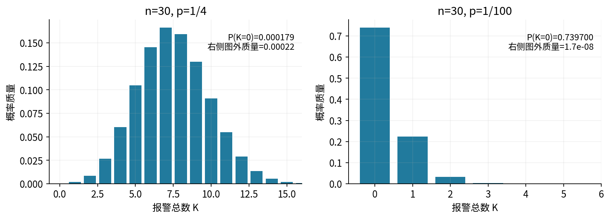

## 12. 抽样偏差不会被平方根规律消除

设目标装置的报警概率仍为1/4，却使用一种偏选机制：报警记录总被保留，不报警记录只以概率1/3被保留。记R为“被保留”。由条件概率，

$$
P(X=1\mid R)=\frac{1\cdot1/4}{1\cdot1/4+(1/3)\cdot3/4}=\frac12.
$$

即使保留后的记录之间相互独立，保留样本平均值仍会稳定在1/2附近，而目标总体是1/4。更多数据提高的是对偏选总体均值的精度。对目标p，若估计量记为T，利用 $T-p=(T-E[T])+(E[T]-p)$ 及中心化项期望为0，得到

$$
E[(T-p)^2]=\operatorname{Var}(T)+(E[T]-p)^2.
$$

本例保留n个样本后，MSE为 $1/(4n)+1/16$；其中 $1/16$ 的偏差平方不会消失。这个推导说明了为什么讨论“数据量够不够”之前，必须先问“收集的是谁、哪些结果会留下来”。我们并不在这里估计现实采样偏差，只分析一个已知机制的反例。

## 13. 64行，可能只有8份独立信息

现在独立生成8个Bernoulli群组值 $B_1,\ldots,B_8$，每个都服从 $p=1/4$，再把每个值复制8次，形成64行记录。每行边缘分布仍是同一个Bernoulli，但同组内任意两项完全相关。

整体均值逐项化简为

$$
\bar X_{64}=\frac1{64}\sum_{g=1}^{8}8B_g=\frac18\sum_{g=1}^{8}B_g.
$$

于是实际方差 $\operatorname{Var}(\bar X_{64})=(3/16)/8=3/128$，若错误把64行都当独立，则会写成 $3/1024$。实际方差大8倍，实际标准误是错误理论标准误的 $\sqrt8$ 倍。本次4000批模拟的均值样本标准差约0.155665，接近真值 $\sqrt{3/128}\approx0.153093$，而64个独立记录的理论标准误约0.054127。

这里的“有效样本量8”是对**这个特定均值及这个特定复制机制**说的。实际用户、设备或时间序列通常没有如此简单的结构。不能只根据行数和一个平均相关数，就把所有统计量的不确定性都压成相同的有效样本量。

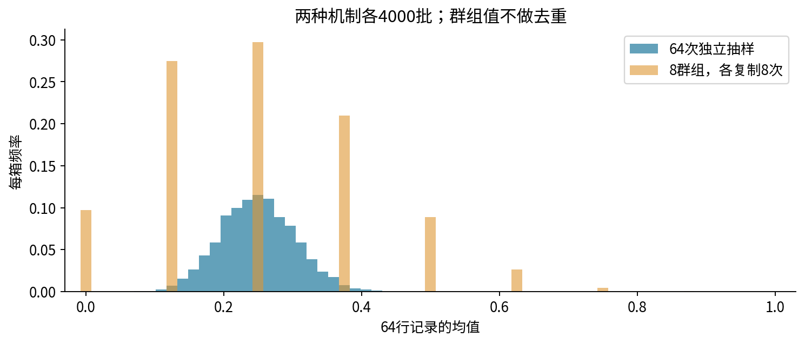

## 14. 用一个相关模型看见误差下限

若n个变量具有相同方差 $\sigma^2$，且每对不同变量相关系数都是 $\rho$，那么协方差求和给出

$$
\operatorname{Var}(\bar X_n)=\frac{\sigma^2}{n}[1+(n-1)\rho]
=\sigma^2\left(\rho+\frac{1-\rho}{n}\right).
$$

对固定n，等相关协方差矩阵半正定要求 $-1/(n-1)\le\rho\le1$；不能任填一个相关系数。本讲画图使用 $\rho\ge0$，它可由共同扰动模型 $X_i=\mu+\sigma\sqrt\rho\,U+\sigma\sqrt{1-\rho}\,E_i$ 构造，其中U和全部 $E_i$ 独立、均值0、方差1。

当 $\rho>0$ 固定，n增大只会平均掉独有噪声，共同扰动U仍在，方差趋向 $\sigma^2\rho$。例如n=64、$\rho=0.2$，方差膨胀系数为13.6，对这个均值定义的 $n_{\rm eff}=64/13.6=80/17$。这不是说数据真的只剩4.7条，而是与iid方差标尺比较的结果。

负相关则可能降低均值方差。不放回抽样就是一个可严格推导的例子。相关性不总是惩罚；忽略相关结构才是错误。

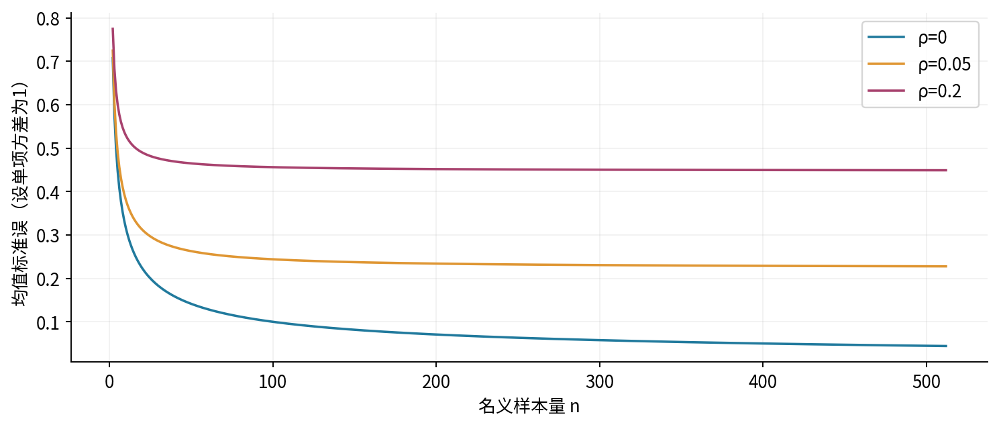

## 15. 不放回抽样为什么反而更稳定？

设固定有限总体有N个数 $a_1,\ldots,a_N$，总体均值 $\mu_N$，按N分母定义 $\sigma_N^2=N^{-1}\sum_j(a_j-\mu_N)^2$。从中等概率、不放回取n个不同单位。每次抽取的边缘分布仍均匀覆盖整个总体。

令 $b_j=a_j-\mu_N$，则 $\sum_jb_j=0$。任意两个不同抽取位置的协方差为

$$
\frac1{N(N-1)}\sum_{j\ne k}b_jb_k
=\frac{(\sum_jb_j)^2-\sum_jb_j^2}{N(N-1)}
=-\frac{\sigma_N^2}{N-1}.
$$

代回平均值的协方差公式，得到

$$
\operatorname{Var}(\bar X_n)=\frac{\sigma_N^2}{n}\frac{N-n}{N-1}.
$$

注意总体方差这里分母为N；若换成N减一分母，公式外观也会改变，不可混用。n=N时抽完整个总体，均值完全确定，方差为0。

数据文件给出四个带身份的单位A、B、C、D，其值为0、0、1、1。不放回抽两个单位有六种等可能组合。样本均值依次包含一个0、四个1/2、一个1，因此方差为1/12；有放回独立抽两个的方差为1/8。重复值对应的不同身份不能先被去重，否则会改变抽样设计。

## 16. 重尾一：均值存在，但普通CLT的方差条件失效

考虑支持为 $x\ge1$ 的Pareto I密度

$$
f(x)=\alpha x^{-\alpha-1},\qquad \alpha=3/2.
$$

积分归一化由 $\int_1^B\alpha x^{-\alpha-1}dx=1-B^{-\alpha}$ 得到。对实数r，截断r阶矩为 $\alpha\int_1^B x^{r-\alpha-1}dx$。当 $r<\alpha$ 时极限为 $\alpha/(\alpha-r)$；当 $r\ge\alpha$ 时发散。因此本例 $E[X]=3$，但 $E[X^2]=\infty$，不存在有限总体方差。

它满足 $E|X|<\infty$，所以一般iid大数定律仍成立。可我们不能拿不存在的有限 $\sigma$ 构造 $\sqrt n(\bar X_n-\mu)/\sigma$，也不能宣称普通有限方差CLT适用。**某个定理的条件失效，不等于所有收敛结论都失效。**

NumPy的 `pareto(1.5)` 生成Lomax/Pareto II，支持从0开始；本讲必须加1才得到上述Pareto I。漏掉加1会使均值从3变成2，这不是无关紧要的编码差异。

有限样本总能计算出一个有限样本方差，只要机器里保存的数有限；它不能证明总体二阶矩有限。本次4000批模拟中，Pareto均值分布的经验标准差从n=4的约6.43，反而增至n=16的约8.48，再发生较大变化。报告这些真实波动，比挑出一条下降曲线更诚实。四分位距IQR是75%分位数减去25%分位数，描述中间一半数据的宽度。有限样本先排序，本实验按从0开始的索引 $(R-1)q$ 定位q分位数；索引不为整数时，在相邻两个数之间线性插值。这一明确规则对应NumPy的linear方法。IQR比标准差更不受少数极大值支配，但也不是“恢复了普通CLT”的证明。

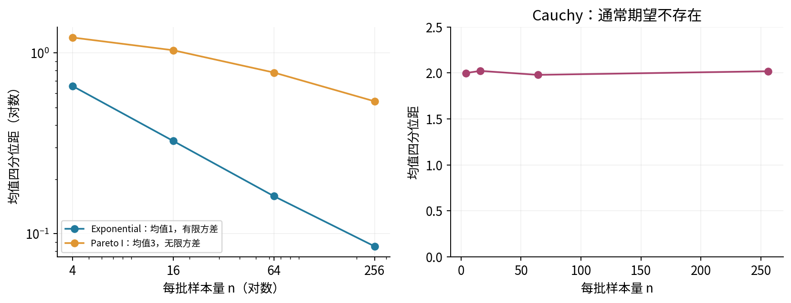

## 17. 重尾二：对称并不保证期望存在

标准Cauchy密度为 $f(x)=1/[\pi(1+x^2)]$。它关于0对称，中位数为0。但正半轴的一阶矩

$$
\int_0^B\frac{x}{\pi(1+x^2)}dx=\frac1{2\pi}\log(1+B^2)
$$

随B发散；负半轴对应负部也发散。不能用“正负抵消”把两个无穷量的差定义为期望0。对称截断积分为0只是主值，不是通常概率论中的期望。

因此本讲的iid有限均值LLN和有限方差CLT都不能直接用在Cauchy平均值上。本次各自独立的4000批实验中，n=4、16、64、256的均值四分位距约为1.9994、2.0232、1.9799、2.0193，没有表现出Exponential均值那样的收缩。这里给的是观测结果，不把四个有限n的实验冒充对全部n的分布定理。

作图窗口只显示一部分重尾取值时，必须另报窗口外比例。更不能先删除极端值，再把剩余样本的均值称为原模型的均值。截断或稳健方法可能有用途，但它们改变了估计目标或估计量，需要另行定义。

## 18. 实验如何避免“看图证明定理”？

本单元的实验分三条证据链。第一，Fraction精确枚举Bernoulli完整序列，检查二项质量、均值方差和 $E[s^2]=\sigma^2$。第二，用有限总体的所有组合检查不放回修正，用协方差矩阵求和检查等相关公式。第三，才是不同n下4000批随机模拟，观察模型预言是否在有限结果中合理呈现。

默认四种原始分布为Bernoulli(1/4)、均值1的Exponential、Pareto I(3/2)、标准Cauchy。固定PCG64，基础种子22022；各分布编号为0至3，各样本量的种子为 `22022 + 1000*编号 + n`。群组实验使用30022。每一组明确保存n和R，独立新批并非同一条运行路径的前缀。

统计误差与计算错误也要分开。若均值波动大，先查是否重尾或相关；若更改n后输出没变，先查是否沿错轴求平均、复用了旧数组或没有运行单元格。若输入出现NaN、无穷、布尔值、文本或复数，本实验拒绝继续；不静默删值或改成0。浮点极端范围也会被保守拒绝，详细规则在实验指南中。

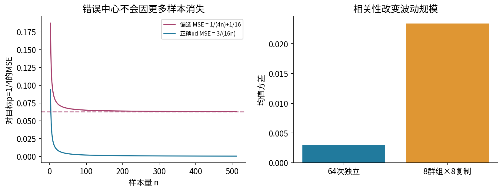

## 19. 面向机器学习的解释边界

把 $X_i$ 换成第i条测试记录上的损失，样本平均损失就有相同的数学形式。但能否使用本讲公式，取决于测试记录的抽取方式、用户或时间依赖、损失是否有适当矩，以及模型是否已经固定。

如果你利用同一测试集挑选模型、反复调参，最后被报告的模型已经依赖该测试集。此时“固定模型在iid新测试记录上的平均损失”与实际流程不同。抽样定理不会自动消除这种选择影响。后续评估、数据泄漏和模型比较单元会处理它；本讲只要求你把统计量和重复流程说完整。

同理，训练随机种子的波动、测试集抽样波动和未来部署人群变化是不同来源。一个只改变种子的实验不能直接代替重新抽样测试人群，也不能解释未来数据分布漂移。

## 20. 练习：先写假设，再给数字

1. 对Bernoulli(1/4)，从定义推导单次方差、n次均值方差和n=64的标准误。
2. 对样本 $(0,0,0,1)$ 手算均值、n分母方差、s²、s和估计标准误；与真实标准误比较。
3. 完整推导 $E[s^2]=\sigma^2$，并指出哪一步使用了iid或不相关条件。$E[s]=\sigma$ 是否随之成立？
4. 从非负变量的逐点不等式出发，推导Markov、Chebyshev和有限方差弱大数定律。
5. 对容差0.1、失败概率上限0.05，求Chebyshev给出的充分样本量。为什么这不等于最小样本量？
6. 手算n=4的五个均值和质量，求偏差至少0.1的概率。说明含等号时程序为什么使用有理数。
7. 解释LLN、CLT分别研究什么；写出正确的标准化。原始Bernoulli变量会变正态吗？
8. p=0.01、n=30时计算零报警概率，并据此反驳统一的“n=30准则”。
9. 复制群组实验中推导实际方差、错误iid方差及二者比值；如果只把每组复制数从8改成80，会怎样？
10. 从协方差求和推导等相关公式。在n=64、rho=0.2时求方差膨胀和均值有效样本量；说明它的适用范围。
11. 推导不放回有限总体修正，再枚举四单位抽两单位的所有均值。不能去重的是什么？
12. 从Pareto截断矩推导均值3、无限二阶矩。它是否违背大数定律？
13. 为什么Cauchy的对称性不能证明期望0？有限样本方差存在能否证明总体方差有限？
14. 推导偏选后的报警概率和估计目标p的MSE；哪个项不会随n消失？
15. 实验矩阵为 $(4000,64)$。分别解释 `axis=1`、`axis=0` 和全部拉平后求均值的含义，指出哪个产生固定n的4000个均值。
16. 给一个你熟悉的数据场景，明确目标总体、抽样单位、统计量、重复流程、依赖风险和你还不能验证的假设。不能只填“随机抽样”。

完整解答见独立的 `answers.pdf`。建议先完成1至8，再运行Notebook，最后结合相关与重尾失败案例回答9至16。

## 21. 读到这里，应该保留的检查顺序

先确定目标和采样机制；再检查是否有重复或群组相关；接着确认期望和方差是否存在；最后才决定哪一种定理、标准误或近似可以使用。LLN回答固定容差下是否集中，CLT描述合适尺度下的分布形状。单项标准差、均值真实标准误和样本给出的标准误估计始终是三个不同对象。

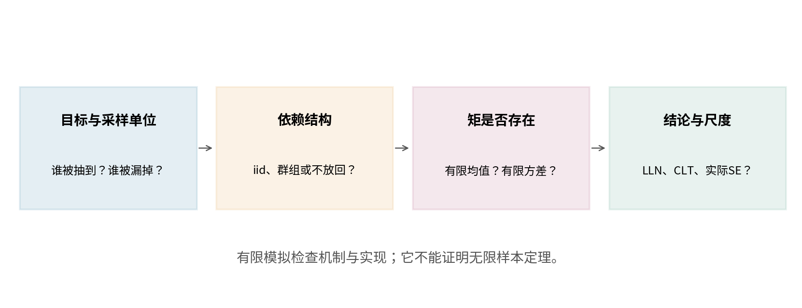

## 22. 核查过的一手材料与证明边界

- [MIT 18.05：CLT与LLN入门读物](https://ocw.mit.edu/courses/18-05-introduction-to-probability-and-statistics-spring-2022/mit18_05_s22_class06-prep-b.pdf)，用于核对采样均值、标准化和CDF表述。本讲独立设定数据与推导，严格区分离散事件的开闭端点。
- [MIT 6.436J第17讲](https://ocw.mit.edu/courses/6-436j-fundamentals-of-probability-fall-2018/f44fa78f05ac31a4ba2bd82f599dcf60_MIT6_436JF18_lec17.pdf)，第1、3、4节核对不等式、可积iid弱大数定律、有限方差CLT。完整CLT证明不列为本讲已证明内容。
- [MIT 6.436J第18讲](https://ocw.mit.edu/courses/6-436j-fundamentals-of-probability-fall-2018/10625dc0942f47c4ddc004b3dbba11d5_MIT6_436JF18_lec18.pdf)，第1节核对可积iid强大数定律；本讲仅解释陈述，未重现其高级证明。
- [NumPy标准差文档](https://numpy.org/doc/2.3/reference/generated/numpy.std.html)，核对轴、ddof、方差无偏与标准差仍有偏的区别。
- [NumPy Pareto生成器](https://numpy.org/doc/2.3/reference/random/generated/numpy.random.Generator.pareto.html)，核对其实际生成Lomax/Pareto II，所以本讲加1。
- [NIST Cauchy分布说明](https://www.itl.nist.gov/div898/handbook/eda/section3/eda3663.htm)和[NumPy Cauchy生成器](https://numpy.org/doc/2.3/reference/random/generated/numpy.random.Generator.standard_cauchy.html)，核对密度、无通常期望及生成接口；发散积分在正文独立推导。
- [NumPy随机流兼容性](https://numpy.org/doc/2.3/reference/random/compatibility.html)，固定种子不代表任意版本、构建、调用形状和机器都逐位相同。当前运行版本和种子随成果保存。
