# 第二十三讲 似然与最大似然估计

## 1. 这一次，我们不知道装置的报警概率

上一讲先规定一个总体，再反复收集数据，观察样本均值如何变化。本讲把问题反过来：某个纯教学装置留下八次记录 $(1,0,0,1,0,1,0,0)$，其中1代表报警、0代表未报警。我们不知道报警概率p。怎样根据已经看到的这八个数，在一族概率模型中选择参数？

“八次有三次报警，所以取3/8”是一个合理猜想，但猜想还不是推导。为什么不是1/2？为什么不取4/10来避免边界？如果八次全没报警，能否说真实概率必定为0？本讲将用同一个选择原则回答前两个问题，同时说明第三个推论为什么过强。

这个原则叫**最大似然估计**（maximum likelihood estimation，MLE）：固定已经观察到的数据，在事先规定的参数空间内，寻找使这些数据的联合概率质量或联合密度最大的参数。它给出模型内的一种点估计，不自动提供参数的概率分布，也不自动保证模型正确。

直接先修是第十三至十四讲的导数与偏导数，第十九至二十讲的概率、Bernoulli与Gaussian，以及第二十二讲的抽样分布。本讲会重新解释用到的独立假设；不要求提前学习信息矩阵、渐近正态性或贝叶斯估计。目标是能从模型、支持集和参数范围出发，完成两个完整MLE推导，再用程序检查解析解、边界和失败情形。

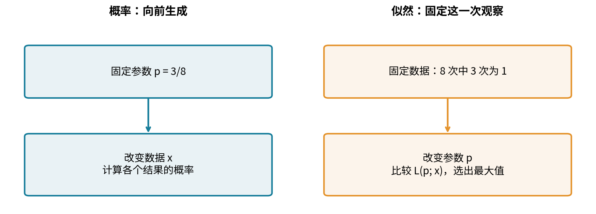

## 2. 一张符号表，先把变化的对象分清

设一次实验收集n个观测。采样前的随机变量写成 $X_1,\ldots,X_n$，采样后的数值写成 $x_1,\ldots,x_n$。整批数值简写为x。参数写成 $\theta$，允许的参数集合写成 $\Theta$。Bernoulli中 $\theta=p$；Gaussian中我们使用 $\theta=(\mu,v)$，其中 $v=\sigma^2$ 是方差，不是标准差。

离散模型的联合概率质量函数记为 $f_\theta(x)$，连续模型的联合密度也沿用这个符号，但两者含义不同。固定参数，$f_\theta(\cdot)$ 描述数据；固定观测值x，则定义

$$
L(\theta;x)=f_\theta(x),\qquad \hat\theta\in\operatorname*{arg\,max}_{\theta\in\Theta}L(\theta;x).
$$

这里“arg max”取的是让函数达到最大值的**参数位置**，不是最大函数值。例如峰在p=3/8，峰高约0.00503；估计值是3/8。若多个位置并列最大，MLE可能不唯一；若只能无限接近某个上界却没有参数达到它，就没有MLE。本讲会真正遇到后一种情形，不能把求导等于0当成自动存在性证明。

同一个公式还隐藏着两个层次。采样前 $\hat\theta(X)$ 是统计量，随样本而随机；采样后 $\hat\theta(x)$ 是这批数据算出的固定估计值。第二十二讲研究前者的重复抽样变化，本讲先解决后者如何计算，再把两层接起来。

## 3. 似然不是“参数为真的概率”

取一次观测x=1。Bernoulli似然为 $L(p;1)=p$。它随p增加，但 $\int_0^1 L(p;1)\,dp=1/2$，并非1。对p积分根本不是概率模型原来要求的归一化：Bernoulli的归一化是对可能数据0和1求和，$P_p(X=0)+P_p(X=1)=1$。

因此，不能把 $L(0.3;x)=0.004$ 读成“参数有0.4%的概率等于0.3”。把似然乘上任意与参数无关的正数，不会改变MLE，却会改变峰高；这也提醒我们峰高没有那种参数概率含义。后续若要谈参数的后验概率，需要另外明确先验与贝叶斯计算，本讲不暗中引入。

似然的自然用途是**同一批数据、同一个观测规则下的相对比较**。例如 $L(p_1;x)/L(p_2;x)=2$ 表示模型p1给这批数据的质量或密度是模型p2的两倍。它不等于“两种参数的概率比是2”，更不表示“p1有两倍的现实准确率”。换了样本量、计量单位或观测事件后，原始似然数值通常不能直接横比。

## 4. 为什么多个观测可以相乘？

先把模型写完整：假设 $X_1,\ldots,X_n$ 相互独立、同服从Bernoulli(p)，参数空间 $\Theta=[0,1]$，每个观测的支持集为 $\{0,1\}$。单项质量函数是

$$
f_p(x_i)=p^{x_i}(1-p)^{1-x_i},\qquad x_i\in\{0,1\}.
$$

独立性才允许联合质量拆成乘积。令 $k=\sum_i x_i$，则这一个**有序序列**的似然为

$$
L(p;x)=\prod_{i=1}^n p^{x_i}(1-p)^{1-x_i}=p^k(1-p)^{n-k}.
$$

如果记录里出现0.4或2，那不是“概率估得不太好”，而是数据不在这个模型的支持集里。我们的Bernoulli输入接口直接报错，不把小数四舍五入成0或1。边界 $p=0,1$ 也用概率定义单独处理，避免在程序里让含义不明的 $0\log0$ 或 $0^0$ 支配结果。

独立不是CSV中“一行一条记录”的同义词。假如八行其实是一次报警结果复制八遍，看到八个1的正确概率是p；错误iid乘积会给出 $p^8$。两种写法恰好都在p=1达到最大，并不意味着重复记录无害：它们对中间参数的相对支持差别巨大。正确MLE必须基于正确联合模型；本讲的实验通过人工生成规定iid，不用样本表面外观证明它。

## 5. 八条记录的完整手算

主样本中n=8、k=3，所以

$$
L(p;x)=p^3(1-p)^5.
$$

先不求导，计算三处数值。p=1/4时，$L=(1/4)^3(3/4)^5=243/65536\approx0.00370789$。p=1/2时，$L=(1/2)^8=1/256=0.00390625$。p=3/8时，$L=3^3 5^5/8^8=84375/16777216\approx0.00502914$。3/8优于这两个候选，但只查三点仍不能证明它优于所有p。

取自然对数，记 $\ell=\log L$。在 $0<p<1$ 上，

$$
\ell(p;x)=3\log p+5\log(1-p).
$$

自然对数严格递增，所以对任意正数a、b，$a>b$ 当且仅当 $\log a>\log b$。因此求最大对数似然与求最大似然位置相同。零似然对应扩展值 $\ell=-\infty$；它不是普通可微点。主样本在两个边界都不可能发生，故两边界的似然为0。

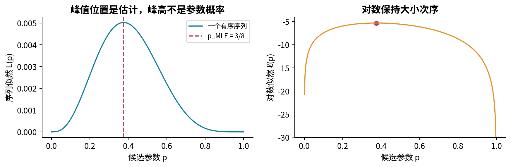

## 6. 序列与计数：什么常数可以丢？

如果观测规则只保留“八次中有三次报警”，那么数据是K=3，不是那个特定排列。恰有 $\binom83=56$ 个不同有序序列都满足这个事件。在iid同参数模型里它们质量相同，故

$$
L_{\rm count}(p;K=3)=\binom83p^3(1-p)^5=56L_{\rm sequence}(p;x).
$$

56与p无关，所以两者有相同MLE。计数的峰值约0.2816，序列的峰值约0.00503；两者都没有变成“p=3/8为真的概率”。图3右侧分别除以自身峰高后两曲线完全重合，表示它们给p提供相同的相对似然比较。

一般地，若 $L(\theta;x)=C(x)g(\theta;x)$ 且 $C(x)>0$、不依赖正在优化的任何参数，则可以最大化g。取对数后可删除加法常数 $\log C(x)$。但“写在前面”“看起来像系数”“对某一个参数不变”都不够：必须针对整个待估参数向量判断。若n也待估，组合数可能依赖n；若Gaussian的方差也待估，密度前的 $1/\sqrt{2\pi v}$ 就绝不能删除。

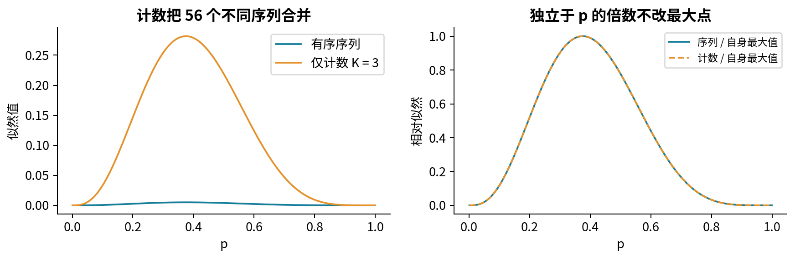

## 7. 求导、验证、再检查边界

对一般的 $0<k<n$，

$$
\ell(p)=k\log p+(n-k)\log(1-p),\qquad
\ell'(p)=\frac{k}{p}-\frac{n-k}{1-p}.
$$

由链式法则，$\log(1-p)$ 的导数带负号。令导数为0，乘以正的 $p(1-p)$，得到 $k(1-p)-(n-k)p=0$，也就是 $k-np=0$。候选解为 $\hat p=k/n$。但完整论证还差两步。

第一，在整个开区间内，

$$
\ell''(p)=-\frac{k}{p^2}-\frac{n-k}{(1-p)^2}<0.
$$

这说明对数似然严格凹，导数严格递减，内部零点至多一个。也可直接看 $\ell'(p)=(k-np)/(p(1-p))$：在k/n左侧为正、右侧为负。因此它是整个开区间的唯一最大点，而非局部最小或鞍点。第二，两个边界似然均为0，内部最大值为正，所以它也是闭区间 $[0,1]$ 上的唯一全局最大点。

代入主样本，$\ell'(3/8)=3/(3/8)-5/(5/8)=8-8=0$。二阶导数等于 $-512/15\approx-34.1333$。注意严格凹的是这里的对数似然；我们不需要也没有声称原似然在整个区间都凹。

## 8. 全零和全一：最大值不必在导数为零处

k=0时，$L(p)=(1-p)^n$ 在 $[0,1]$ 上单调下降，所以MLE为0。k=n时，$L(p)=p^n$ 单调上升，MLE为1。两者都是**边界最大值**，不能用内部一阶条件排除。合起来，对于n至少为1、参数空间为闭区间的Bernoulli模型，总有 $\hat p=k/n$。

这只是这批样本的MLE，不是关于真实p的确定性证明。如果真实p=1/4，八次全零的概率仍是 $(3/4)^8\approx0.100113$。一次全零样本没有逻辑能力排除所有正p。第22讲已经区分了估计量与真实参数，这个区分在边界更加重要。

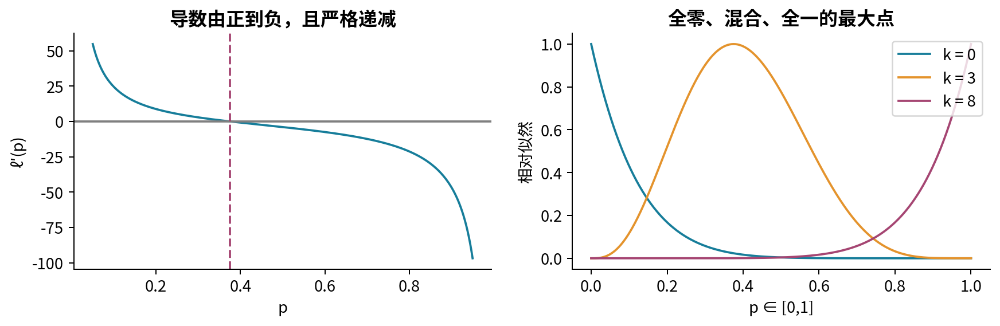

## 9. 换成logit参数，会不会丢掉MLE？

程序有时用任意实数t表示概率，定义 $p(t)=1/(1+e^{-t})$，称t为logit参数。反函数为 $t=\log(p/(1-p))$，只在 $0<p<1$ 有有限值。这是一个一一、严格递增的参数变换，但它覆盖的是**开区间**，不包括p=0或1。

主样本有内部解，故 $\hat t=\log((3/8)/(5/8))=\log(3/5)\approx-0.510826$。因为两参数的候选模型一一对应，MLE可以随变换带过去。这里不是把似然当概率密度做变量替换，因而不乘关于t的Jacobian因子。

全零样本则不同。其对数似然为 $\ell(t)=-n\log(1+e^t)$，每个有限t都小于0，t趋向负无穷时趋近0。这意味着在有限实数t空间上，只有上确界0，没有任何t达到它，因而没有有限MLE。数值程序报告t=-30、-50或“继续改善”，都不能改写这个存在性结论。若强行限制t在[-10,10]，所得-10是一个新增约束下的边界解。

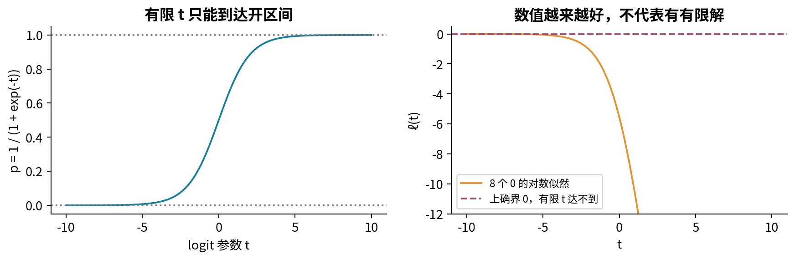

## 10. 连续数据为什么用密度？

现在考虑四个教学测量值 $(0,1,2,5)$。假设它们独立同分布于Gaussian $N(\mu,v)$，其中 $\mu\in\mathbb R$，$v>0$。单个精确实数在连续模型下的概率为0，因此不能把 $P(X=x_i)$ 连乘后说“所有参数都一样”。似然使用概率密度：

$$
f(x_i;\mu,v)=\frac1{\sqrt{2\pi v}}\exp\left[-\frac{(x_i-\mu)^2}{2v}\right].
$$

可以用测量分辨率理解它：固定很小、与参数无关的区间宽度 $\Delta_i$，观察落在 $x_i$ 附近的概率近似 $f(x_i;\mu,v)\Delta_i$。独立时整批小区间概率近似 $\prod_i f(x_i;\mu,v)\prod_i\Delta_i$。后一个因子与参数无关，所以在小区间近似下比较密度乘积有意义。这是解释，不是把有限区间概率精确写成“密度乘宽度”；若实际记录是粗分箱或区间，应对各区间积分建立相应似然。

密度的单位是原始单位的倒数。若x以秒计，f以每秒计，n个独立观测的联合密度以每秒的n次方计。$N(0,0.01)$ 在0处密度约3.989，超过1完全合法；面积而非高度必须归一化为1。把秒改成毫秒，数据及均值乘1000、方差乘一百万，联合密度多出 $1000^{-n}$ 的数值因子；正确参数变换不改变拟合的物理意义，却改变原始似然峰高。

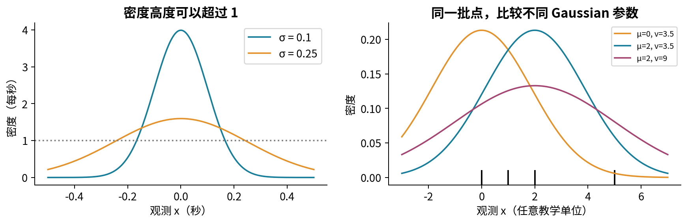

## 11. Gaussian的联合似然：归一化项也要相乘

独立性给出

$$
L(\mu,v;x)=(2\pi v)^{-n/2}\exp\left[-\frac1{2v}\sum_{i=1}^n(x_i-\mu)^2\right].
$$

记 $Q(\mu)=\sum_i(x_i-\mu)^2$，则

$$
\ell(\mu,v)=-\frac n2\log(2\pi)-\frac n2\log v-\frac{Q(\mu)}{2v}.
$$

n是这批数据的大小，固定不变； $-n\log(2\pi)/2$ 可在本次优化中删除。$-n\log v/2$ 却随方差变化，必须保留。最后一项惩罚相对于v过大的残差；第二项惩罚把分布无限摊宽。这两项共同决定方差，而不是“残差越小越好”一句话可以替代的。

如果v已知，只估均值，那么v及归一化项确实是常数，最大似然等价于最小化平方误差 $Q(\mu)$。这解释了平方损失的一个概率模型来源。若将来每个观测具有不同方差，或误差并非Gaussian，必须重新推导目标，不能把这个结论无条件搬过去。

## 12. 先对均值求解，并证明它是全局最优

固定任意 $v>0$，偏导数为

$$
\frac{\partial\ell}{\partial\mu}=\frac1v\sum_i(x_i-\mu),\qquad
\frac{\partial^2\ell}{\partial\mu^2}=-\frac nv<0.
$$

一阶条件给出 $\hat\mu=\bar x=\sum_i x_i/n$。为了后面证明联合最优，我们再用不依赖微分的恒等式核验一次。把 $x_i-\mu=(x_i-\bar x)+(\bar x-\mu)$ 展开平方，交叉项含有 $\sum_i(x_i-\bar x)=0$，所以

$$
Q(\mu)=\sum_i(x_i-\bar x)^2+n(\mu-\bar x)^2.
$$

右侧第二项非负，且仅在 $\mu=\bar x$ 时为0。于是对**每一个允许的v**，均值取 $\bar x$ 都是唯一最优。这比“两个偏导数同时等于0”更强，也避免把Gaussian对数似然未经检查就说成对 $(\mu,v)$ 全局联合凹。

对主样本，$\bar x=(0+1+2+5)/4=2$。离差为(-2,-1,0,3)，平方为(4,1,0,9)，总和S=14；因此 $Q(\mu)=14+4(\mu-2)^2$。图7的右图就是这个恒等式的几何图像。

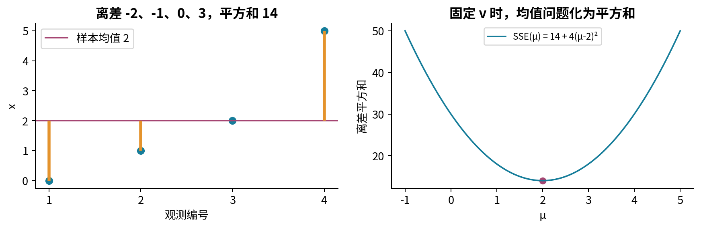

## 13. 再优化方差，完成联合MLE证明

把均值的最优值代回，记 $S=\sum_i(x_i-\bar x)^2$，得到只含v的**剖面对数似然**。这里“剖面”就是对每个v都先把另一个参数选到最好，不是一种额外概率分布：

$$
\ell_{\rm prof}(v)=-\frac n2\log(2\pi)-\frac n2\log v-\frac S{2v}.
$$

在 $S>0$ 时，

$$
\ell_{\rm prof}'(v)=-\frac n{2v}+\frac S{2v^2}
=\frac{S-nv}{2v^2}.
$$

分母正。v小于S/n时导数正，大于S/n时导数负；所以 $\hat v=S/n$ 是整个正半轴上的唯一最大点。边界也吻合：v趋近0时，负的 $-S/(2v)$ 压过正的对数增长，使对数似然趋向负无穷；v趋向无穷时，$-n\log v/2$ 使其同样趋向负无穷。

最后把两步接上。对任何候选 $(\mu,v)$，都有 $\ell(\mu,v)\le\ell(\bar x,v)\le\ell(\bar x,S/n)$，且两次取等必须分别满足 $\mu=\bar x$、v=S/n。因此当S>0时，联合MLE存在、唯一，并且

$$
\hat\mu=\bar x,\qquad \hat v_{\rm MLE}=\frac1n\sum_i(x_i-\bar x)^2.
$$

主样本给出 $(\hat\mu,\hat v)=(2,7/2)$，标准差估计为 $\sqrt{7/2}\approx1.87083$。方差与标准差别写混；程序的参数名variance始终表示v，模拟器的normal接口则使用标准差 $\sqrt v$。

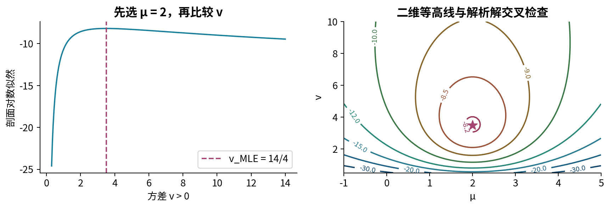

## 14. 两种失败：漏归一化项、或者所有观测相同

先故意删除 $-n\log v/2$。主样本在均值2处剩下 $-7/v$。它对v的导数为 $7/v^2>0$，于是越大的v越“好”，在v趋向无穷时才逼近0；根本不会在3.5达到最大。这个错误不是一个小常数导致的小偏差，而是把优化问题换成了另一个问题。完整归一化要求Gaussian摊宽时峰高变低，错误目标漏掉了这种代价。

再看样本(7,7,7,7)。它有 $\bar x=7$、S=0。若固定均值7，则

$$
L(7,v)=(2\pi v)^{-n/2},\qquad
\ell(7,v)=-\frac n2\log(2\pi v)\longrightarrow+\infty\quad(v\downarrow0).
$$

本讲模型要求 $v>0$，因此这里**没有有限的Gaussian MLE**。不能机械套公式得到v=0，再宣称已经找到同一密度族中的解。v=0不是该密度的合法参数；点质量分布属于另外的退化模型描述。n=1也必然S=0，遇到相同的问题。对于真实正方差Gaussian的独立精确观测，n至少2时完全相等是概率零事件，但取整、有限精度、重复行都使它成为程序必须处理的输入。

如果应用明确规定 $v\ge\varepsilon>0$，全同值样本的约束MLE会在 $v=\varepsilon$。这可作为建模选择，但必须写明新增约束，不能把数值库的最小允许方差藏起来，再把约束解冒充无约束MLE。我们的脚本对全同值返回“似然无界、无有限MLE”的状态；对超出保守数值范围的非退化问题明确报错。

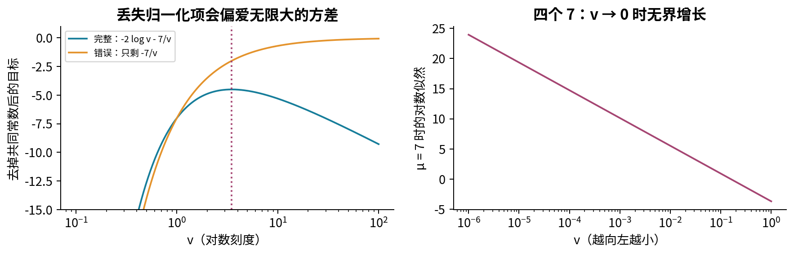

## 15. 一个极端点如何推动两个Gaussian参数？

把主样本最后一个数5替换为21，得到(0,1,2,21)。均值变为6，离差为(-6,-5,-4,15)，平方和为 $36+25+16+225=302$，于是方差MLE为 $302/4=75.5$。相对于原来的均值2、方差3.5，一个数把两个估计都明显推远。

更一般地，样本(0,1,2,t)有

$$
\hat\mu(t)=\frac{3+t}{4},\qquad
\hat v(t)=\frac{5+t^2}{4}-\left(\frac{3+t}{4}\right)^2
=\frac{3t^2-6t+11}{16}.
$$

均值随t线性增长，方差随t的平方增长。平方损失对大残差的敏感性来自目标本身；优化器准确找到解，也不能消除这种敏感。我们没有在图中自动删去极端值，因为“异常”可能是录入错误，也可能是真实尾部事件。发现敏感性后，应核实记录来源、测量单位和模型适用性，而不是为了让均值好看就删行。

图10是确定性代数的可视化，不是在比较任何实际异常检测系统。中位数等稳健估计会在以后学习；这里仅以改变一个数的方式看清当前模型承担的代价。

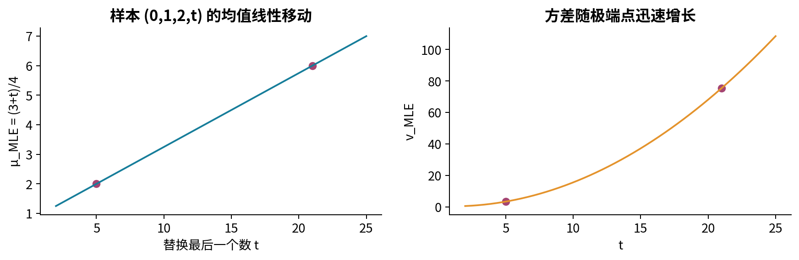

## 16. 为什么MLE方差除以n，而上一讲除以n减一？

两者解决的目标不同。最大似然选的是这批数据使Gaussian似然最大的v，因此分母由求导得到n。上一讲的样本方差 $s^2=S/(n-1)$ 则为了让重复抽样的期望等于总体方差。不能凭“无偏比较好”把MLE推导最后一行的n改掉，然后仍称它为同一个MLE。

复用上一讲的平方和恒等式，在iid、有限方差v的前提下，

$$
\sum_i(X_i-\mu)^2=\sum_i(X_i-\bar X)^2+n(\bar X-\mu)^2.
$$

左侧期望是nv，最后一项期望是 $n\operatorname{Var}(\bar X)=v$，故 $E[S]=(n-1)v$。于是

$$
E[\hat v_{\rm MLE}]=\frac{n-1}{n}v,\qquad
E[s^2]=v\quad(n\ge2).
$$

方差MLE的偏差为 $-v/n$，主模拟设定v=3.5、n=4时理论期望为2.625。主手算样本的方差MLE恰好等于真实模拟参数3.5只是人为选例的巧合，不是每批样本都如此；该样本的无偏方差估计为14/3，也不能因此称它这一次“更接近真实值”。无偏是重复抽样期望的性质，不是逐样本的误差保证。

Bernoulli的比例MLE和Gaussian的均值MLE都是样本均值，iid时各自无偏，方差分别为 $p(1-p)/n$ 和 $v/n$。这些结论可由第22讲直接得到。但不能归纳成“所有MLE都无偏”；方差MLE刚好提供反例。本讲也不据此宣布MLE普遍最优或一律一致，相关大样本结论需要模型条件。

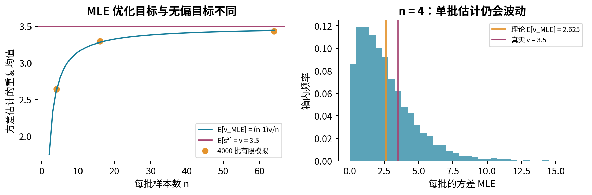

## 17. 怎样做可信的数值核验？

先有解析结论，再让算法去核验，而不是反过来用“成功收敛”的提示框证明数学。Bernoulli内部样本的导数严格递减，我们可从[0,1]出发取中点，只在内部评价导数。导数为正说明最大点在右侧，导数为负说明在左侧，逐步把区间减半。主样本先试1/2，导数为-4；再试1/4，导数为16/3；再试3/8，导数为0。这条路径与解析解吻合。全零和全一先直接处理，不能拿内部算法假装边界不会出现。

Gaussian先固定解析最优均值，再令 $z=\log v$。代入剖面，得到 $\ell(z)=C-nz/2-Se^{-z}/2$。S>0时二阶导数为 $-Se^{-z}/2<0$，故z方向也有唯一峰。脚本用透明的黄金分割搜索：在区间两端之间选两点，利用单峰性丢弃不可能含峰的一侧，重复缩小区间；每一步保留较好的候选与端点。这里需要的单峰形状已由推导提供，算法本身不会替一般黑箱函数证明全局最优。

实验还画二维目标等高线，并用有限差分核对导数。有限差分不是符号证明，步长太小会发生相减消去，太大又会有截断误差。默认在温和参数与多种步长上观察误差，比较解析位置、导数、目标值三类证据。程序的converged只表示区间缩小到设定阈值；测试还要确认最终参数接近已知解。

## 18. 稳定计算：不先求极小的乘积

当p=1/2时，任何长为n的Bernoulli序列质量都是 $2^{-n}$。n=2000时这个正数小到常见float64无法直接表示，会被舍入成0；但对数似然 $-2000\log2\approx-1386.29436$ 仍可稳定表示。若先连乘再取log，已经丢失的信息回不来。应直接把单项log相加。

计算 $\log(1-p)$ 时使用 `log1p(-p)`，避免小p下先算1-p丢掉微小差异。精确边界另外分支：全零且p=0时对数似然为0；若样本含1且p=0，对数似然为负无穷，表示模型不可能生成它。这不是NaN，也不是要把p悄悄裁剪到 $10^{-8}$ 的理由。裁剪改变了允许参数和目标，只有明确的约束模型才应这么做。

Gaussian直接计算完整对数密度，不必先指数化。若只是画相对似然，可先减去最大log值再取指数，使峰高成为1；极远处仍可能数值下溢，所以图形中的0未必是数学上的0。正式优化与比较仍留在log空间。代码拒绝非有限输入、类型混淆、形状错误和超出保守范围的数据；不会把NaN换成0，不会静默删去坏行。

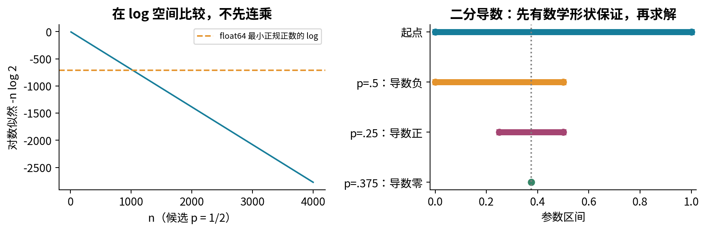

## 19. 可复现实验怎样与数学对接？

实验包读取两份小CSV，分别就是本讲的八条Bernoulli记录和四条Gaussian记录。另一个JSON规定重复抽样：每批n取4、16、64，各重复4000次，生成Bernoulli(3/8)和Gaussian(2,3.5)。这些全是合成示例，不代表任何真实报警系统，也不估计真实任务性能。

每个n用独立初始化的PCG64随机流，种子为23023+n；同一流先生成形状 $(4000,n)$ 的Bernoulli数组，再生成同形状Gaussian数组。一行是一批完整实验，沿列求均值或平方和；不能把所有行混成一个大样本，再声称仍在观察n=4的估计误差。输出CSV的一行是一批估计，包含p、均值、两种方差估计，不包括个人数据。

默认实际运行，n=4的方差MLE重复均值约2.64483，无偏版本约3.52644，分别在理论期望2.625和3.5附近；差距属于4000批模拟自身的随机误差。增加重复次数R主要稳定这幅模拟图；增加每批n才改变估计量的抽样分布。固定种子与版本有助于复现本次数值，却不证明模型假设，也不保证跨版本逐位相同。

脚本与Notebook都可单独按运行说明执行。保留的Notebook使用新Python进程中的真实IPython InProcessKernel按顺序执行并保留图像输出；没有宣称验证过浏览器Jupyter界面、常规socket内核传输或读者的Anaconda安装。实验指南提供输入契约、预期数值、改动实验与失败定位路径。

## 20. 完成一次MLE之前的五个问题

第一，数据到底是有序序列、一个计数、精确测量还是区间记录？不同观测事件可能改变似然。第二，联合模型是什么，乘积依赖哪条独立假设？重复行并不创造独立观测。第三，参数空间包括哪些边界，支持集是否随参数变化？在求导前就写清楚。

第四，删除的项真的与全部待估参数无关吗？Gaussian的归一化项是本讲最重要的反例。第五，是否证明最大值存在、是否唯一、是否检查全局与边界？若数学上无有限MLE，不能拿一个很大的或很小的数值结果代替说明。

有了这五个答案，才讨论稳定实现、优化器状态与重复抽样性质。训练目标被优化得很好，只能回答“在这个模型内怎样选择参数”；它不能独自证明采样无偏、模型正确、预测可靠或新数据表现良好。下一阶段的概率推断会继续区分估计、证据和不确定性，但这些区别已经从本讲第一条似然定义开始。

## 21. 自测与练习

以下18题先独立作答，再对照answers.pdf。需要写出参数范围、关键步骤和解释；只报一个数字不算完成。

1. 对单次Bernoulli观测x=0，写出似然并对p从0到1积分。为什么这个积分不必为1？
2. 主样本在p=1/4、3/8、1/2处的序列似然分别是多少？计算3/8相对于1/2的似然比，并解释它不是什么。
3. 八次中三次成功的计数似然怎样由序列似然得到？为何有56个排列？两种观察规则的MLE为何一致？
4. 独立推导一般 $0<k<n$ 时Bernoulli的唯一全局MLE，不能只写导数等于0。
5. 八个0在闭区间[0,1]与开区间(0,1)上各有没有MLE？真实p=1/4时观察到它的概率是多少？
6. 主样本的logit估计是多少？全零样本为何没有有限logit MLE？
7. 八行完全复制同一个Bernoulli结果，观测到全1。正确与错误iid似然各是什么？在p=1/2处比较它们。
8. 求 $N(0,0.01)$ 在0处的密度。说明把以秒计的观测改记为毫秒后，单项与四项联合密度的数值怎样改变。
9. 对(0,1,2,5)逐项计算均值、SSE、Gaussian方差MLE、无偏方差及标准差MLE。
10. 从展开平方证明 $Q(\mu)=S+n(\mu-\bar x)^2$，再说明它为何能用于联合全局最优证明。
11. 求剖面对数似然的导数，检查 $v\downarrow0$ 和 $v\to\infty$；说明S>0为什么关键。
12. 对(7,7,7,7)能否报告“Gaussian MLE为(7,0)”？如果模型另加 $v\ge0.01$，答案怎样变化？
13. 删除Gaussian的 $-n\log v/2$ 后，主样本的最优v会怎样？为什么固定v只估均值时又能删除该项？
14. 把(0,1,2,5)的最后一项改成21，重新手算两个MLE；推导样本(0,1,2,t)的方差公式。
15. 利用平方和恒等式，推导方差MLE的偏差。n=16、真实v=3.5时，两种方差估计的期望各是多少？
16. 有2000个Bernoulli观测，候选p=1/2。写出精确似然与log似然，解释连乘下溢后为何不能靠取log恢复。
17. 手写主样本二分导数的前三步。若输入全0，或要求只在[0.4,0.9]内选p，处理有何不同？
18. 一份程序把字符串“1”、True和NaN强制转成浮点，删掉NaN，然后返回Gaussian的v=0并标记成功。指出至少四个不同层面的错误，并设计一条“坏CSV不覆盖旧结果”的测试。

## 22. 来源与阅读范围

本讲的例子、图、推导组织、实验和练习独立编写。以下一手材料用于核对定义与接口；没有复用其中的图像或练习。来源实际打开记录见source-checks.json。

- Jeremy Orloff与Jonathan Bloom，MIT 18.05《Maximum Likelihood Estimates》，第3、3.1、3.2及第4节：[课程原始PDF](https://ocw.mit.edu/courses/18-05-introduction-to-probability-and-statistics-spring-2022/mit18_05_s22_class10-prep-b.pdf)。用于核对似然视角、对数变换、连续密度与均值/方差估计式。本讲另外完整补足边界、存在性和全局最优论证。
- NIST/SEMATECH，Normal Distribution：[官方密度定义](https://www.itl.nist.gov/div898/handbook/eda/section3/eda3661.htm)。核对Gaussian的尺度参数、支持集和归一化因子；本讲统一改用方差v，避免与标准差混用。
- NumPy 2.3，`var`：[官方说明](https://numpy.org/doc/2.3/reference/generated/numpy.var.html)。核对ddof及N−ddof分母；不把库中“population variance”标签当成MLE推导。
- NumPy 2.3，`log1p`：[官方说明](https://numpy.org/doc/2.3/reference/generated/numpy.log1p.html)。核对小量下直接计算log(1+x)的数值理由。
- NumPy，Random Generator：[官方说明](https://numpy.org/doc/stable/reference/random/generator.html)。核对Generator、PCG64、size形状与跨版本兼容性限制；实际运行版本另列在运行说明中。
