# 第二十四讲 Bayes估计与先验

## 1. 只有八次观察，怎样表达还不知道的部分？

上一讲从固定观测出发，把似然看作参数的函数，再找最大值。现在继续同一个合成二分类任务：八次独立试验观察到三次成功，成功概率记为 $\theta$。最大似然估计是3/8，但这一点值没有表达“只有八次数据，参数还有多不确定”。

本讲的核心问题是：**数据不足时，怎样明确表达先验并更新不确定性？** 我们仍使用可手算的Bernoulli模型，给未知参数一个事先规定的概率分布，再推导观察数据之后的分布和下一批结果的预测。

直接先修为第十八至二十讲以及第二十三讲：条件概率、全概率、密度、积分、期望、方差、Bernoulli与Binomial、似然和对数似然。平方损失分解也已在第十九讲出现。这里没有真实用户的私人偏好或真实设备数据。先验参数都是为解释机制而明确设定的教学选择，不是声称某个现实先验客观正确。

学习目标不仅是背住“加成功数、加失败数”，还要回答：加在什么模型里；归一化常数是多少；后验均值、MAP、MLE为何不同；预测未来时为什么不能只代入一个点；哪些先验或数据处理会让更新不合法。

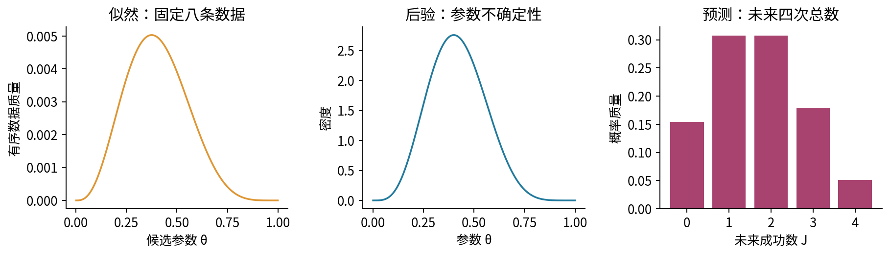

## 2. 先写联合模型，再谈Bayes公式

我们作如下层次化设定：先用密度 $\pi(\theta)$ 描述参数的不确定性；给定同一个 $\theta$ 后，$Y_1,\ldots,Y_n$ 条件独立，并且都服从Bernoulli($\theta$)。这里 $0<\theta<1$，一次完整实验共用同一个参数。

“给定参数后独立”比“无条件独立”多了一个条件。稍后会看到，把共同未知参数积分掉，未来观测一般会产生预测相关性。把每一次试验都重新抽一个独立参数，是另一个生成模型。

对已观察的有序数据 $D=(y_1,\ldots,y_n)$，似然是

$$
L(\theta;D)=\prod_{i=1}^n\theta^{y_i}(1-\theta)^{1-y_i}
=\theta^k(1-\theta)^{n-k},\qquad k=\sum_i y_i.
$$

若数据只记录成功总数K=k，似然多一个组合数 $\binom nk$。对当前参数后验，这个不依赖 $\theta$ 的因子会被归一化消掉；但计算数据本身的边际概率时，它必须保留。

先验不是似然。似然固定数据、变化参数，并不自动对参数积分为1；先验是参数上的概率分布，必须在指定支持上非负且积分为1。本讲把参数当作不确定对象进行概率计算，并不表示真实设备会在每次观察前神秘地改变参数。

## 3. 后验、证据和不可删除的分母

联合模型给 $p(D,\theta)=L(\theta;D)\pi(\theta)$。对参数积分，得到数据的边际概率（连续数据情形为相应边际密度），也称证据：

$$
p(D)=\int_0^1 L(t;D)\pi(t)dt.
$$

当 $0<p(D)<\infty$，后验密度为

$$
\pi(\theta\mid D)=\frac{L(\theta;D)\pi(\theta)}{p(D)}.
$$

用t作积分变量，是为了不把右边保留的参数坐标 $\theta$ 与被积分掉的占位符混淆。把这个公式对 $\theta$ 积分，分子积分恰为分母，所以后验积分为1。

计算中常写 $\pi(\theta\mid D)\propto L(\theta;D)\pi(\theta)$。比例符号只表示相差一个不依赖 $\theta$ 的正常数，不是允许永远不归一化。想求区间概率、均值或预测，就必须恢复正确常数。分母为0时不能把0/0改成均匀分布；那说明在所写模型与先验下，观测事件不可能发生。

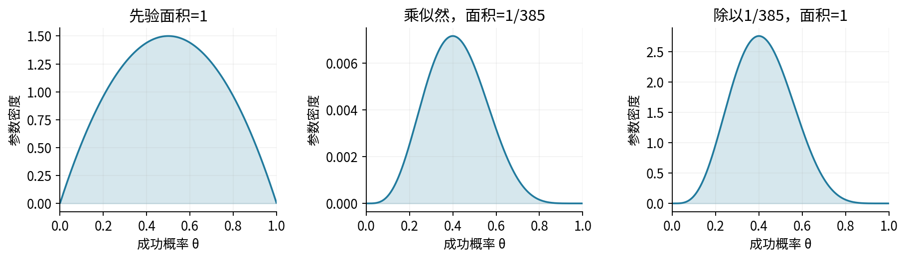

## 4. Beta分布：支持范围与形状参数

成功概率位于0和1之间，因此选择同样支持的分布族是一种方便的起点。对 $\alpha>0,\beta>0$，定义

$$
\pi(\theta)=\frac{\theta^{\alpha-1}(1-\theta)^{\beta-1}}{B(\alpha,\beta)},
\qquad
B(\alpha,\beta)=\int_0^1t^{\alpha-1}(1-t)^{\beta-1}dt.
$$

称为Beta($\alpha,\beta$)。分母B就是使面积为1的积分，不是乘在密度上的另一块概率。$\alpha,\beta$ 决定先验的形状，常叫超参数；当前练习把它们视作事先选定的固定数。

为什么要求严格为正？接近0时，积分的主要因子是 $t^{\alpha-1}$；其从0到一个正小量的积分有限，当且仅当 $\alpha>0$。接近1同理需要 $\beta>0$。参数小于1可以让密度在边界附近趋于无穷，但面积仍有限。密度无界与概率不合法不是一回事。

Beta(1,1)是 $\theta$ 坐标上的均匀分布；Beta(2,2)偏向中间；Beta(20,20)更集中在1/2附近；Beta(1/2,1/2)在两端附近更高。它们表达不同假设，不存在一条公式保证哪个永远最正确。特别地，Beta(0,0)不是本讲允许的正规先验；不能作为“完全没有信息”的合法默认值。

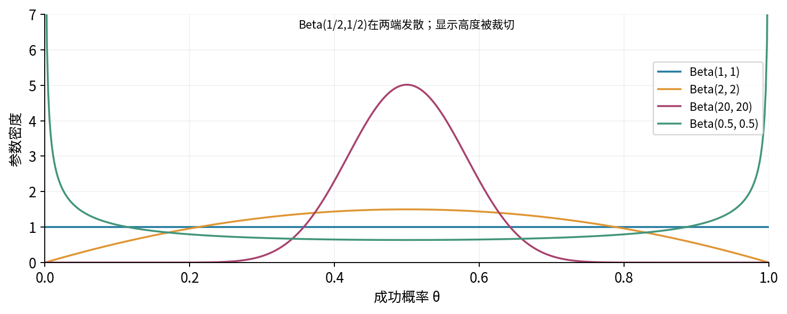

## 5. 不只查公式：推导归一化常数的递推

对正 $a,b$，因为 $t+(1-t)=1$，有

$$
B(a,b)=B(a+1,b)+B(a,b+1).
$$

再对 $t^a(1-t)^b$ 求导，从0积到1。两端极限都为0，因此

$$
aB(a,b+1)-bB(a+1,b)=0.
$$

这里每一项积分都有限；可以先在 $[\epsilon,1-\epsilon]$ 上使用微积分基本定理，再令ε趋于0。联立两式得到

$$
B(a+1,b)=\frac{a}{a+b}B(a,b),\qquad
B(a,b+1)=\frac{b}{a+b}B(a,b).
$$

从 $B(1,1)=1$ 出发，对正整数a、b反复使用递推，得到

$$
B(a,b)=\frac{(a-1)!(b-1)!}{(a+b-1)!}.
$$

例如 $B(2,2)=1/6$，所以先验密度是 $6\theta(1-\theta)$。直接积分 $6(\theta-\theta^2)$ 也得1。整数阶乘的定义已在第二十讲明确，这里的整数公式不应被直接套给0.5的阶乘。

一般正实数下，可用Gamma函数关系 $B(a,b)=\Gamma(a)\Gamma(b)/\Gamma(a+b)$，其中 $\Gamma(a)=\int_0^\infty t^{a-1}e^{-t}dt$。该一般关系在本讲作为标准特殊函数恒等式接受；整数归一化、递推和后续矩公式已经用初等积分独立推导。代码可以用lgamma避免直接计算巨大的Gamma值，但数值稳定不等于所有极端参数都可靠。

## 6. 两个矩从积分比值推出

把密度再乘一个 $\theta$，只会把积分中第一参数加1：

$$
E[\theta]=\frac{B(\alpha+1,\beta)}{B(\alpha,\beta)}
=\frac{\alpha}{\alpha+\beta}.
$$

同理

$$
E[\theta^2]=\frac{\alpha(\alpha+1)}{(\alpha+\beta)(\alpha+\beta+1)}.
$$

第二式减去第一式的平方。令 $s=\alpha+\beta$，通分后分子为 $\alpha[(\alpha+1)s-\alpha(s+1)]=\alpha\beta$，于是

$$
\operatorname{Var}(\theta)=\frac{\alpha\beta}{s^2(s+1)}.
$$

若固定先验均值 $m_0=\alpha/s$，方差变成 $m_0(1-m_0)/(s+1)$。所以在这个分布族中，保持均值而增大s，会让先验更集中。把s称为先验强度，是对这个明确参数化的解释；它不是所有先验都共用的唯一强度单位。

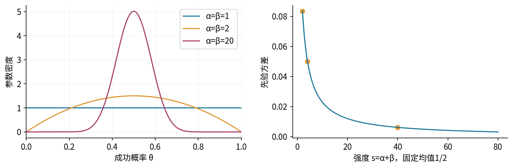

## 7. 共轭更新是怎样一步步发生的？

先验乘有序Bernoulli似然：

$$
\pi(\theta)L(\theta;D)
=\frac1{B(\alpha,\beta)}\theta^{\alpha+k-1}(1-\theta)^{\beta+n-k-1}.
$$

我们看到了另一个Beta积分的形状。令 $a=\alpha+k,b=\beta+n-k$。因为原先 $\alpha,\beta>0$，且 $0\le k\le n$，所以a、b仍严格为正。归一化之后，

$$
\theta\mid D\sim\operatorname{Beta}(\alpha+k,\beta+n-k).
$$

这叫共轭：先验与后验留在同一个分布族。它带来计算便利，不证明先验或似然符合现实。

主例取Beta(2,2)，n=8、k=3，故后验为Beta(5,7)，且 $B(5,7)=1/2310$。后验密度是 $2310\theta^4(1-\theta)^6$。例如后验参数超过1/2的概率，需要积分而不是读取峰高：

$$
P(\theta>1/2\mid D)=2310\int_{1/2}^1\theta^4(1-\theta)^6d\theta=\frac{281}{1024}.
$$

可把 $(1-\theta)^6$ 按二项式展开，七项分别积分；总和为 $2310\sum_{j=0}^6(-1)^j\binom6j[1-2^{-(5+j)}]/(5+j)$。这约0.274414的数描述参数区间的不确定性，不是下一次成功的概率。

有序序列的证据是 $B(5,7)/B(2,2)=1/385$；若只记录八次中的成功总数3，则证据多乘 $\binom83=56$，成为 $8/55$。两种记录方式得到相同参数后验，却不是同一个数据事件概率。

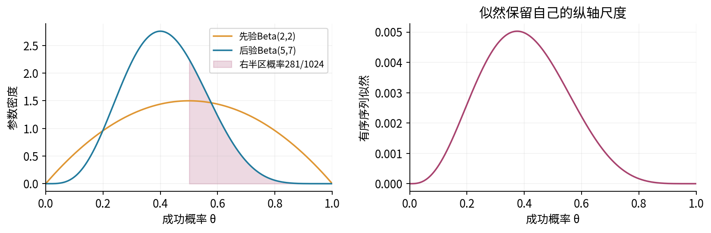

## 8. 顺序更新与重复使用同一数据的区别

把八次观察分成两批，第一批四次里有一次成功，第二批四次里有两次成功。先验Beta(2,2)经第一批变成Beta(3,5)，再经第二批变成Beta(5,7)。一次合并更新也是Beta(5,7)，因为成功数和失败数各自相加。

这个顺序一致性依赖同一个固定参数与条件独立模型。若设备在两批之间改变了状态，继续把所有历史数据按同一个θ相加可能是不合适的模型；代数仍能跑完，并不代表假设正确。

另一种错误是先用全部八次得到Beta(5,7)，再把同样八次作为“新数据”更新一次，得到Beta(8,12)。这相当于把一批数据当作两份条件独立证据。复制CSV或重新读取文件不会创造新信息。实验应记录每个观察ID，顺序更新只能使用不重叠的新批次。

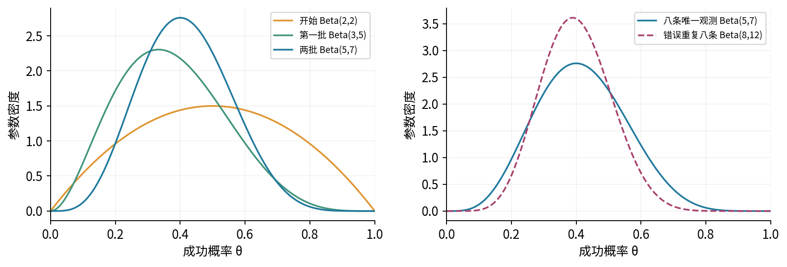

## 9. 后验均值为什么像一个加权平均？

后验均值为 $(\alpha+k)/(\alpha+\beta+n)$。对n>0，把它整理成

$$
E[\theta\mid D]
=\frac{s}{s+n}\frac\alpha s+\frac{n}{s+n}\frac{k}{n},\quad s=\alpha+\beta.
$$

它是先验均值与样本成功率的凸组合。在主例中，$s=4$，所以 $E[\theta\mid D]=(4/12)(1/2)+(8/12)(3/8)=5/12$。它比数据比例3/8更靠近先验中心1/2。

有人用“伪观测数”解释α与β。这只能作为这个均值公式的代数记忆法，不能把先验伪装成真实测量。注意密度的指数是α减一与β减一，众数公式又有不同的减一；不能一会把α、β当记录数，一会把α减一、β减一当同一批记录，而不说清基准先验。

n=0时还没有样本比例k/n，但后验就是先验，均值仍为α/s；代码必须避免0/0。若固定先验参数、沿着k/n趋向某个值的序列增大n，先验权重s/(s+n)趋向0。若你也让先验强度随n增长，或真实参数不在先验支持中，这个结论不能原样使用。

## 10. MLE、MAP和后验均值不是同一个答案

MLE只最大化当前数据的似然。MAP（最大后验估计）最大化指定参数坐标下的后验密度。对后验Beta(a,b)，在a>1、b>1时，丢去与θ无关的对数常数，得到

$$
\ell_{\rm post}(\theta)=(a-1)\log\theta+(b-1)\log(1-\theta).
$$

导数为 $(a-1)/\theta-(b-1)/(1-\theta)$。令其为0得到

$$
\theta_{\rm MAP}=\frac{a-1}{a+b-2}.
$$

二阶导数 $-(a-1)/\theta^2-(b-1)/(1-\theta)^2<0$，且两端密度趋0，所以这是唯一全局内部最大值。主例中MLE=3/8，MAP=2/5，后验均值=5/12。它们都可以正确计算，却回答不同的问题。

为什么平方损失下使用后验均值？对候选点d，展开得到

$$
E[(\theta-d)^2\mid D]
=\operatorname{Var}(\theta\mid D)+(d-E[\theta\mid D])^2.
$$

交叉项的条件期望为0，所以唯一最小点是后验均值。这一选择来自损失函数，而不是把后验峰高当作一个点的概率。连续后验中任意单点通常概率为0；MAP不是“该点有最大的非零后验概率”。

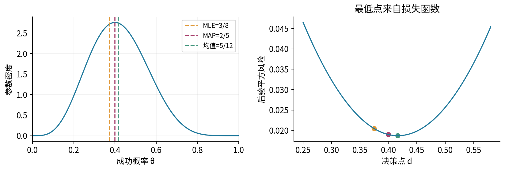

## 11. 众数的边界必须单独判断

内部MAP公式要求a>1、b>1，不能对任何正参数机械套用。a=b=1时密度恒为1，所有内部点一样高，没有唯一众数。a=1、b>1时密度单调下降，按连续延拓到闭区间的通常画图约定，最大值在0；a>1、b=1时对称地在1。

若a<1，则密度接近0时可能无界；若b<1，则接近1时可能无界。a<1且b<1时两端都发散，内部导数的零点反而是低谷。此时实验应报告“边界无界”或“两端无界”，不能返回一个内部点并称作唯一有限最大值。我们区分函数在开区间的上确界与画图时说的边界众数，不依靠人为填写端点密度来制造唯一结论。

边界附近的无界密度仍可积分为1。比如Beta(1/2,1/2)的密度为 $1/[\pi\sqrt{\theta(1-\theta)}]$。令 $\theta=\sin^2t$、$0<t<\pi/2$，换元因子为 $2\sin t\cos t$，乘起来变成常数2/π，积分恰为1。这也展示为何直接把无穷端点塞入普通梯形求积会失败，而不是“这个分布没法归一化”。

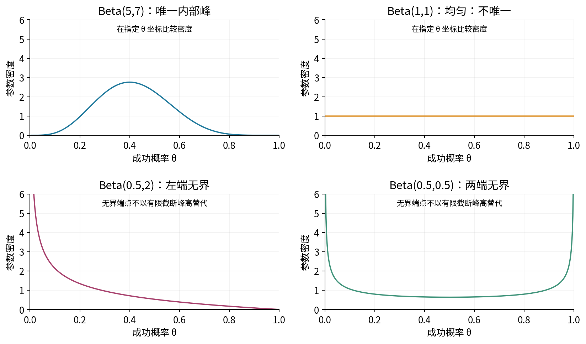

## 12. 一个点值甚至会受参数坐标影响

把概率θ改写为对数优势 $\eta=\log[\theta/(1-\theta)]$，反函数为 $\theta=1/(1+e^{-\eta})$。换元导数 $d\theta/d\eta=\theta(1-\theta)$ 为正。

似然只是同一个数据模型的重参数化，因此MLE在一一变换下对应同一概率点。但后验**密度**换元必须乘Jacobian：

$$
\pi_\eta(\eta\mid D)=\pi_\theta(\theta\mid D)\theta(1-\theta).
$$

若θ后验是Beta(a,b)，右边对θ的形状变为 $\theta^a(1-\theta)^b$。在a、b>0时，其内部最大点是θ=a/(a+b)。所以主例的η坐标MAP变回θ后是5/12，而θ坐标MAP是2/5。

两者不是相互矛盾的概率判断：密度高度依赖单位与坐标。变换前后对应区间的概率通过换元保持相同，完整后验分布是相容的；单独的密度众数并不是坐标不变的摘要。这也是不能把MAP等同于完整Bayes推断的一个具体理由。

## 13. 预测下一次，需要把参数积分掉

设新的结果 $Y_{\rm new}$ 在给定θ后与既有数据独立，且仍服从同一个Bernoulli模型。全概率公式给

$$
P(Y_{\rm new}=1\mid D)
=\int_0^1P(Y_{\rm new}=1\mid\theta,D)\pi(\theta\mid D)d\theta
=E[\theta\mid D].
$$

所以主例预测下一次成功的概率为5/12，而不是MAP的2/5或MLE的3/8。这里后验均值碰巧能完全描述一次二分类预测，是因为事件概率对θ是线性的；这并不表示任何预测都可把θ替换为后验均值。

例如预测未来两次都成功，需要 $E[\theta^2\mid D]=5/26$，而代入后验均值再平方给25/144。两者差为 $\operatorname{Var}(\theta\mid D)=35/1872>0$。这个例子再次说明 $E[g(\theta)]$ 通常不等于 $g(E[\theta])$。

## 14. 预测未来四次：Beta-Binomial的完整推导

未来m次共用同一个未知θ，给定θ后成功总数J服从Binomial(m,θ)。积分掉θ：

$$
P(J=j\mid D)
=\binom mj\frac1{B(a,b)}\int_0^1\theta^{a+j-1}(1-\theta)^{b+m-j-1}d\theta
=\binom mj\frac{B(a+j,b+m-j)}{B(a,b)}.
$$

支持为整数 $j=0,\ldots,m$，称为Beta-Binomial后验预测分布。归一化可以不查表：先对j求和，内部的二项质量和为 $(\theta+(1-\theta))^m=1$，剩下Beta密度积分为1。有限求和与积分交换在这里没有额外无穷级数问题。

对a=5、b=7、m=4，五个质量依次为 $2/13,4/13,4/13,7/39,2/39$。相加为1。J=2的预测概率为4/13；把θ替换为5/12的Binomial插件近似则给1225/3456，二者不相等。

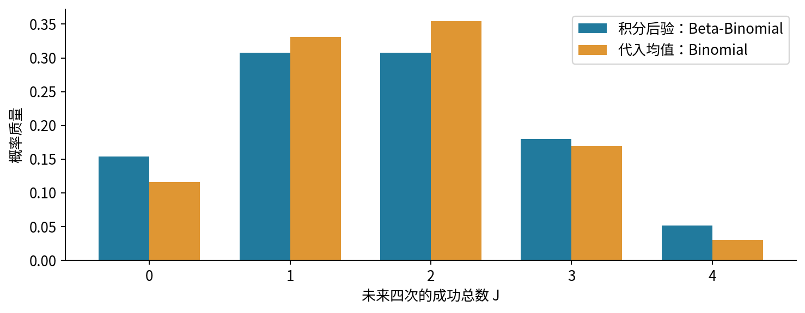

## 15. 为什么预测总数比插件模型更分散？

条件均值为 $E[J\mid\theta,D]=m\theta$，条件方差为 $m\theta(1-\theta)$。用全期望和全方差得到

$$
E[J\mid D]=mE[\theta\mid D],
$$

$$
\operatorname{Var}(J\mid D)
=mE[\theta(1-\theta)\mid D]+m^2\operatorname{Var}(\theta\mid D).
$$

写 $q=E[\theta\mid D]$、$v=\operatorname{Var}(\theta\mid D)$，则 $E[\theta(1-\theta)]=q(1-q)-v$，所以

$$
\operatorname{Var}(J\mid D)=mq(1-q)+m(m-1)v.
$$

第一项是插件Binomial方差，第二项是共用未知参数带来的额外分散。对Beta(a,b)，可整理为 $mab(a+b+m)/[(a+b)^2(a+b+1)]$。主例m=4时均值5/3，方差140/117；插件方差为35/36，真实预测方差是它的16/13倍。

同样，两个不同未来指示的预测协方差为v，相关系数为 $1/(a+b+1)$。它们给定θ后独立，但给定旧数据D、尚未知道θ时一般不独立。若模拟每个未来试验前都重新独立抽一个θ，就会抹掉这个共同不确定性，错误地产生插件Binomial式的分散。

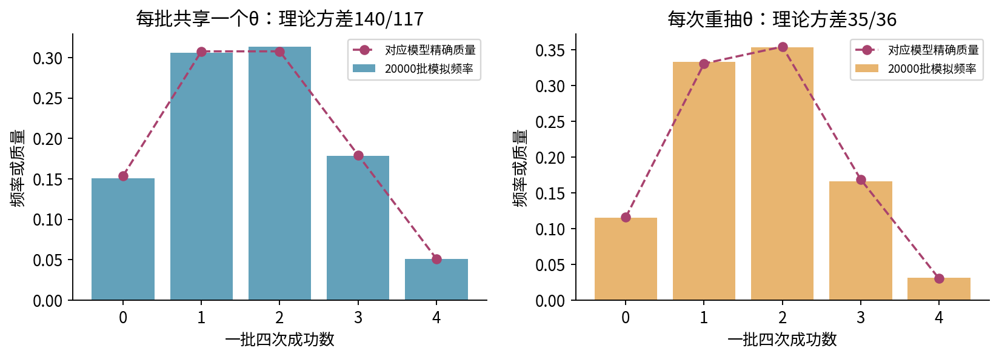

## 16. 先验敏感性：改强度、改中心、改样本量

保持n=8、k=3，比较Beta(1,1)、Beta(2,2)、Beta(20,20)。后验分别为Beta(4,6)、Beta(5,7)、Beta(23,25)，均值分别为2/5、5/12、23/48。强对称先验把后验更拉向1/2。换一个偏向低成功率的先验，则会把后验拉向另一边。

这不是证明弱先验总优于强先验。若外部知识可靠、与当前目标匹配，强先验可能有价值；若来自不相容人群或偏选数据，就可能造成持续偏差。报告应说明先验从何而来、其预测含义以及替换几个合理先验后哪些结论改变。

做“增大n”实验时要写清设计。可以人为固定成功比例3/8，取n=8、40、200并相应取k=3、15、75，单纯观察公式中的权重变化；这不是一条真实随机路径。也可以从固定θ生成新数据，观察k的随机变化；不能把这两种实验混写成同一种证据。

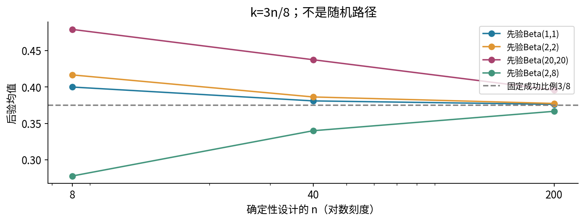

## 17. 正规更新之外的三个失败点

第一，过于刚性的支持。若先验把某个参数区域赋予零概率，普通有限似然更新不会凭空恢复该区域。更极端地，假设先验只允许θ为0或1，但数据既有成功又有失败，则两个候选的似然都为0，证据为0；模型必须重查，不能继续除以0。

第二，重复计数。顺序更新只能添加新的数据；先用一批数据挑选“合适先验”，再把同一批当作未使用的数据更新，不能当作普通预先给定先验分析。超参数学习有合法方法，但需要明确整个程序与不确定性处理，不是给重复使用换一个名字。

第三，模型过窄。若不同装置或时段有不同θ，单一θ下的条件独立模型可能无法描述数据。后验会在这个错误模型内越来越集中；区间很窄并不保证模型正确。共轭只是算得快，不能替代对采样单位、异质性和依赖的检查。

## 18. 可复核实验与数值边界

实验应先用精确分数核对主例：B(2,2)=1/6，B(5,7)=1/2310，有序证据1/385，计数证据8/55，均值5/12，方差35/1872，MAP2/5，未来四次的五点质量及方差140/117。然后分别做网格积分、后验抽样和预测模拟。

后验抽样的每个θ表示从当前不确定性分布取一个可能值；预测整批时每批先抽一个θ，再用该θ生成m次。原始先验、后验、预测总数必须使用清楚的不同标签。有限模拟会有偏差，不能把经验频率改写成理论数值。

密度计算优先使用对数形式：$(a-1)\log\theta+(b-1)\log(1-\theta)-\log B(a,b)$。靠近1时使用适当的log1p写法；边界的0乘负无穷需要数学分支，不能任由NaN传播。对网格积分要说明端点、截断范围、格宽和奇异性；Beta(1/2,1/2)的正弦平方换元提供一个独立核验。

所有超参数、计数、样本和概率数组先完整验证，再调用RNG或写输出；拒绝bool、文本、复数、非有限量及非法计数。不要把不能积分的Beta(0,0)自动“修正”为加一个小数；那是在更换先验，应由建模者明确选择。

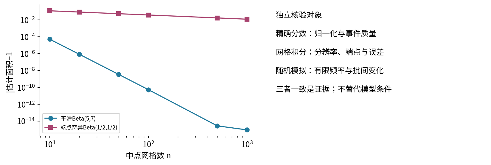

## 19. 自测与下一步

1. 写出先验、似然、后验、证据和后验预测各自的自变量及归一化对象。
2. 用积分说明Beta参数为什么必须大于0；密度在边界无界是否一定非法？
3. 从两个积分恒等式推导Beta递推，再得到B(2,2)和B(5,7)。
4. 推导Beta均值、二阶矩和方差，不直接引用记忆公式。
5. 主例的有序序列证据为何是1/385，计数证据为何是8/55？为何后验一样？
6. 把八次数据按两批更新，证明结果与一次更新一致；指出重复同一批会变成什么。
7. 将后验均值写成加权平均，解释先验强度和“伪观测”的限制，处理n=0。
8. 推导内部MAP并验证二阶导数；解释主例三个点估计为什么不同。
9. 用后验平方损失分解证明后验均值的最优性。
10. 判断Beta(1,1)、Beta(1,3)、Beta(1/2,2)、Beta(1/2,1/2)的众数或边界行为。
11. 完成正弦平方换元，验证Beta(1/2,1/2)归一化。
12. 推导logit坐标密度并比较主例两种坐标下的MAP。
13. 手算下一次成功、未来两次都成功的预测概率，比较插件做法。
14. 推导未来m次的Beta-Binomial质量、归一化、均值与方差，并核对m=4。
15. 解释为什么给定θ独立的未来试验，给定旧数据后未必独立；指出两种模拟结构的区别。
16. 给出先验敏感性设计，并说明固定比例实验与新随机采样实验各回答什么。
17. 构造证据为0的例子；说明为什么不能强行归一化或偷偷改变支持。
18. 给一个单一θ模型会被异质性破坏的合成情形，说明更多数据为什么不能自动修复。

完整实验与逐题详解分别在独立文件中。第二十五讲将进一步比较区间估计、置信区间与可信区间；本讲先建立完整后验与预测之间的区分。

## 来源与核查范围

- [MIT 18.05连续先验更新](https://ocw.mit.edu/courses/18-05-introduction-to-probability-and-statistics-spring-2022/mit18_05_s22_class13-prep-a.pdf)：核对参数密度、证据积分与归一化。
- [MIT 18.05 Beta与共轭先验](https://ocw.mit.edu/courses/18-05-introduction-to-probability-and-statistics-spring-2022/mit18_05_s22_class15-prep.pdf)：核对Beta支持、整数常数与顺序共轭更新；本讲使用独立构造的数据。
- [MIT 18.05预测概率](https://ocw.mit.edu/courses/18-05-introduction-to-probability-and-statistics-spring-2022/mit18_05_s22_class12-prep-a.pdf)：核对用后验权重进行全概率预测的对象区分。
- [MIT 18.05选择先验](https://ocw.mit.edu/courses/18-05-introduction-to-probability-and-statistics-spring-2022/mit18_05_s22_class16-prep-a.pdf)：核对先验强弱与刚性支持问题。
- [NIST DLMF Beta积分5.12.1–2](https://dlmf.nist.gov/5.12)：核对Beta积分、Gamma关系和正弦余弦换元；本讲不涉及复参数扩张。
- [UC Berkeley Bayes估计讲义](https://stat210a.berkeley.edu/fall-2025/reader/bayes-estimation.html)：核对后验平方风险分解与共轭结构。其Beta示例首个显示公式的归一化因子方向误写，页面后面的代码则使用正确除法；本讲依据积分、DLMF和独立整数核算使用1/B，不沿用误写。
- [NumPy Beta生成器](https://numpy.org/doc/2.3/reference/random/generated/numpy.random.Generator.beta.html)与[Python数学函数](https://docs.python.org/3.12/library/math.html)：核对正形状参数、采样形状、lgamma与log1p接口。来源用于核对定义和实现，不复制例题、正文或图像。
