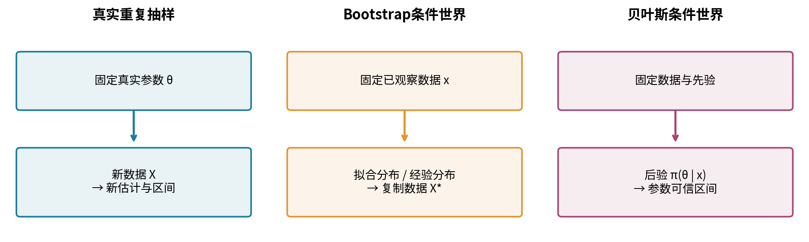
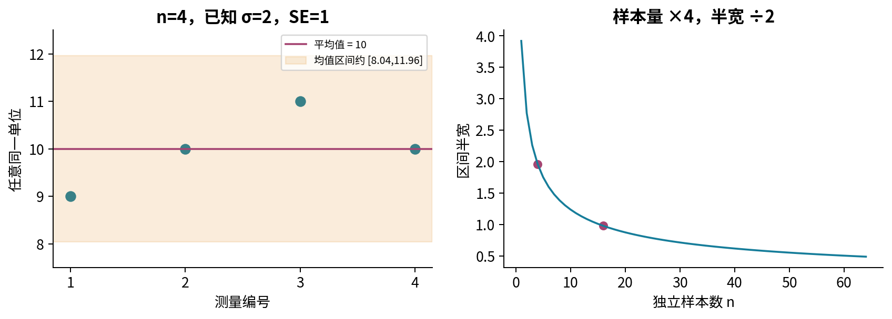
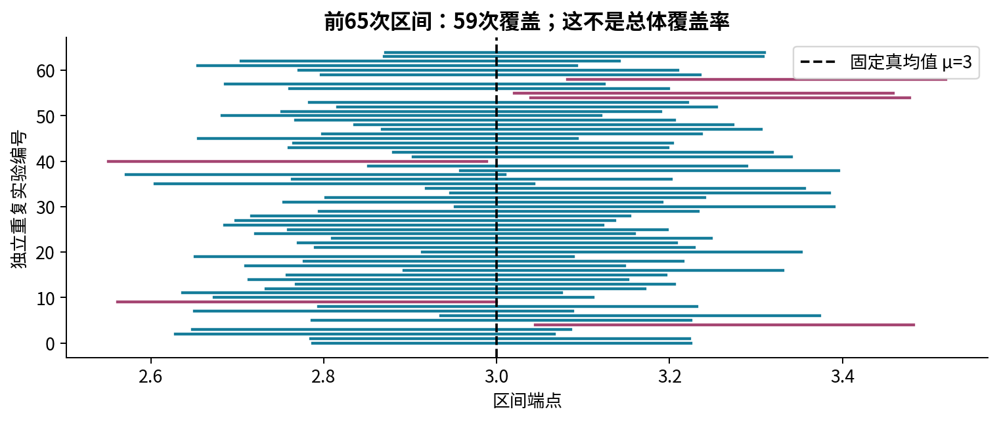
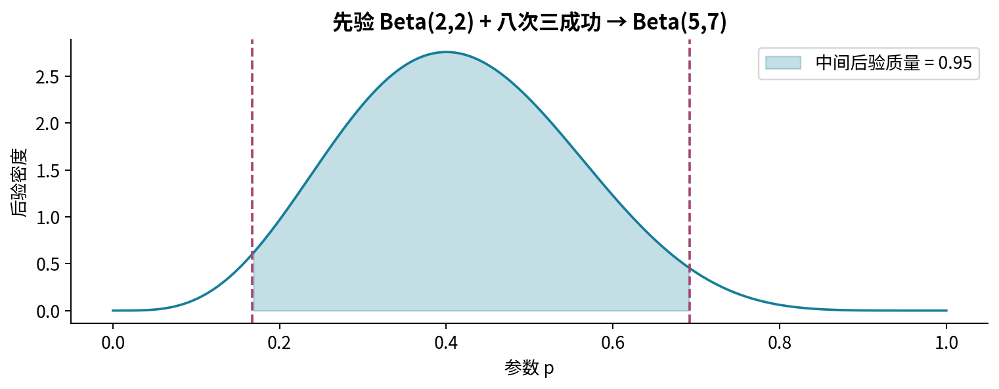
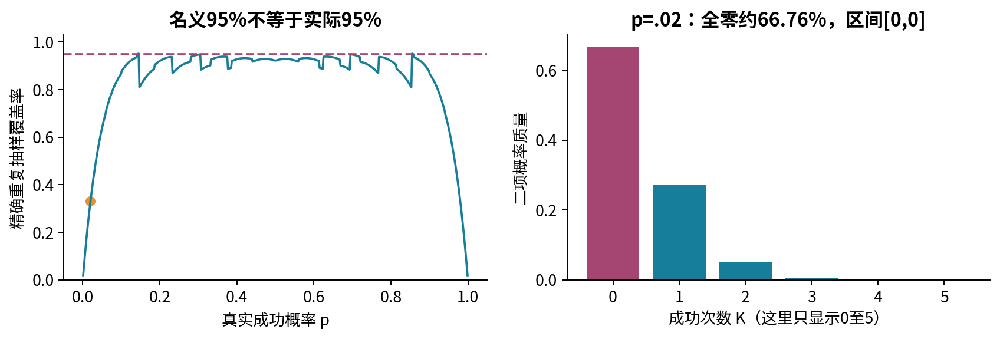
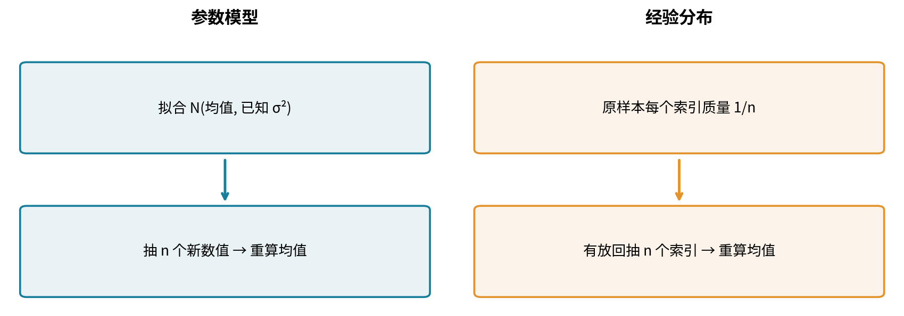
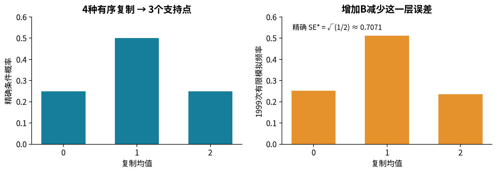
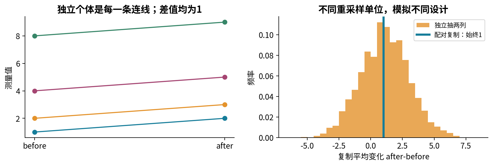
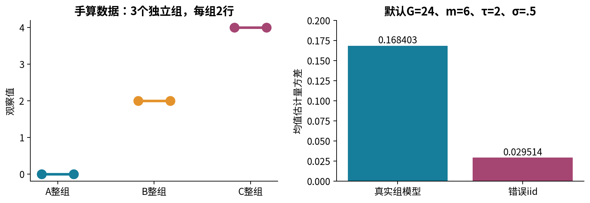
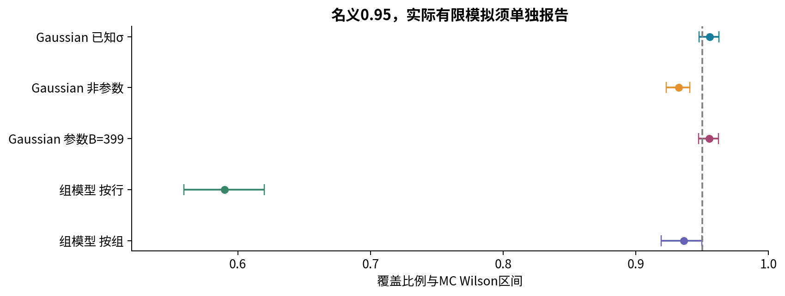

# 第二十五讲 区间估计与Bootstrap

## 1. 一个点估计还没有回答的问题

第二十三讲用似然选择参数，第二十四讲在明确先验之后得到后验分布。现在假设我们用四次独立测量得到9、10、11、10，平均值是10。只报告“均值估计为10”，还缺一条重要信息：如果重新收集四次测量，结果通常会变多少？一个由这批数据算出的区间，可以把抽样不稳定性表达出来，但区间上的“95%”必须有明确的概率对象。

本讲围绕一个问题展开：**怎样为估计的不稳定性构造区间，并验证这个区间程序是否具有声称的表现？** 我们先完成一个可以精确证明覆盖率的Gaussian例子，再看靠近边界的Bernoulli反例。随后用Bootstrap近似抽样分布，比较参数重采样、非参数重采样、配对重采样和分组重采样。最后把这些方法放进已知真值的合成世界，测量实际覆盖率及其Monte Carlo误差。

直接先修是第21至24讲：期望、方差与协方差；抽样分布和中心极限定理；似然与点估计；先验、后验与Beta-Bernoulli更新。我们会重写关键公式，不要求已经学过假设检验、Student t分布或Bootstrap的一般一致性定理。所有图和数据均为原创合成教学例子，不作为真实产品或真实人群的效果证据。

## 2. 先分清对象和形状

本讲主要估计标量参数，记为 $\theta\in\mathbb R$。Gaussian均值中它叫 $\mu$，Bernoulli成功概率中它叫p。$X=(X_1,\ldots,X_n)$ 是采样前的随机向量，形状为 $(n,)$；$x=(x_1,\ldots,x_n)$ 是这次已经观察到的数值向量。点估计量是 $\hat\theta=T(X)$，观察后得到 $T(x)$。区间程序是两个统计量构成的集合

$$
C(X)=[L(X),U(X)],\qquad L(X)\le U(X).
$$

L、U是下端点和上端点。采样前它们随机，观察后 $C(x)$ 是固定集合。若参数单位是秒，端点也必须是秒；方差单位则是平方秒。一个区间不只由“中心加减某个数”定义，还由采样模型、统计量和抽样单位共同定义。

写 $P_\theta$ 时，下标表示“使用真实参数为 $\theta$ 的数据生成分布计算概率”。频率学派覆盖率定义为

$$
c(\theta)=P_\theta\{L(X)\le\theta\le U(X)\}.
$$

这是关于随机数据X的概率，$\theta$ 在这个表达式中固定。所谓名义95%表示设计目标是0.95；实际 $c(\theta)$ 可能等于、略高于或远低于0.95。声称“至少95%置信水平”通常需要在所声称的整个参数空间证明 $\inf_\theta c(\theta)\ge0.95$。只在几个参数上模拟，不能证明这个全称命题。

## 3. 从四次测量手算一个区间

先把模型写完整：$X_1,\ldots,X_n$ 相互独立且同服从 $N(\mu,\sigma^2)$；$\mu$ 未知，$\sigma>0$ 已知。已知标准差来自题设，不是偷偷把这四个数的样本标准差当成已知真值。第22讲给出

$$
\bar X=\frac1n\sum_{i=1}^nX_i,\qquad E_\mu(\bar X)=\mu,\qquad \operatorname{Var}_\mu(\bar X)=\frac{\sigma^2}{n}.
$$

于是均值估计量的标准差，也叫标准误，是 $\operatorname{SE}(\bar X)=\sigma/\sqrt n$。这里的SE衡量反复抽取n个观测后均值的变化，不是单条观测的波动，也不是已经计算出的均值本身的误差真值。

取n=4、观测 $(9,10,11,10)$、已知 $\sigma=2$。样本均值为40/4=10，标准误为2/2=1。记标准正态分布的累积分布函数为 $\Phi(z)=P(Z\le z)$，其中 $Z\sim N(0,1)$。令 $z_{0.975}=\Phi^{-1}(0.975)\approx1.9599639845$。下标0.975是左侧累计概率，不是置信水平本身；两侧各留0.025才得到中间0.95。

区间为

$$
[10-z_{0.975}\cdot1,\;10+z_{0.975}\cdot1]
\approx[8.0400360,\;11.9599640].
$$

中心是10，半宽约1.96，总宽约3.92。如果独立样本数增加到16而同样已知标准差保持2，半宽减为约0.98。这里缩小的是标准误；增加重复抄写的数据行数不会产生这种收益。

## 4. 精确95%覆盖率的逐步证明

本节明确接受两个前置数学结果：独立Gaussian随机变量的线性组合仍是Gaussian；标准正态CDF及其反函数的性质。Gaussian闭合性可在后续概率论中由特征函数证明，本讲不把它冒充为已经推导的结论。因为上一节已算出均值和方差，闭合性给出

$$
\bar X\sim N(\mu,\sigma^2/n),\qquad Z=\frac{\bar X-\mu}{\sigma/\sqrt n}\sim N(0,1).
$$

标准化的分母严格为正，因此不等号方向不变。由标准正态分布对称性和分位数定义，

$$
P_\mu\{-z_{0.975}\le Z\le z_{0.975}\}
=\Phi(z_{0.975})-\Phi(-z_{0.975})=0.975-0.025=0.95.
$$

把Z代回去，乘以正数 $s=\sigma/\sqrt n$，得到 $-z_{0.975}s\le\bar X-\mu\le z_{0.975}s$。左半句等价于 $\mu\le\bar X+z_{0.975}s$，右半句等价于 $\bar X-z_{0.975}s\le\mu$。合并便得到

$$
P_\mu\left\{\mu\in\left[\bar X-z_{0.975}\frac{\sigma}{\sqrt n},\;\bar X+z_{0.975}\frac{\sigma}{\sqrt n}\right]\right\}=0.95.
$$

这个等式对任意实数 $\mu$ 和任意整数 $n\ge1$ 成立，不需要“n足够大”，因为模型本身就是Gaussian。它是关于理想实数运算和精确分位数的数学结论；程序中的分位数和端点以float64近似计算。有限模拟接近0.95是数值核验，不能替代上述证明。

如果数据并非Gaussian，而只知道iid且方差有限，中心极限定理可在一定条件下支持大样本近似，却不能把上式继续称为有限n的精确等式。如果 $\sigma$ 未知，直接把s样本标准差塞进分母，标准化量也不再精确服从标准正态。在Gaussian模型下应使用自由度n-1的t分位数；这个t分布结论本讲只标记为后续理论，不在实验中混用。

## 5. 看见区间后应该怎样说

正确的简短报告可以是：“按独立Gaussian、标准差已知为2的模型，均值的95%置信区间为[8.04,11.96]。”如果解释95%的意思，应说：“在相同模型下反复抽样并按同一规则构造区间，覆盖固定真均值的比例趋向95%。”一次实现的区间要么包含这个固定参数，要么不包含；上述频率模型没有自动给参数分配一个后验概率。

这并不是说不能用概率表达对未知参数的不确定性，而是那需要另一个明确的概率模型。例如第二十四讲通过先验与似然构造参数的后验分布，条件于已观察数据后，可以说一个可信区间拥有95%的后验概率质量。两种表述的条件不同，不能仅凭端点相似就交换解释。

还要避免第三种混淆：均值的95%区间不是“95%的个体观测落入这里”。n很大时均值区间可以极窄，但单条观测的标准差仍是 $\sigma$。预测一个未来观测需要包括新观测自身的噪声；预测区间与参数区间是不同问题。

## 6. 可信区间接上上一讲的后验

继续第二十四讲的八次三成功数据，取已明确的主先验 $p\sim\operatorname{Beta}(2,2)$，独立Bernoulli似然给出

$$
p\mid x\sim\operatorname{Beta}(2+3,\;2+5)=\operatorname{Beta}(5,7).
$$

a=5、b=7是后验形状参数，都是正数。密度与 $p^{a-1}(1-p)^{b-1}$ 成比例，归一化后记为 $\pi(p\mid x)$。令 $F_{5,7}(t)=\int_0^t\pi(p\mid x)\,dp$，等尾95%可信区间取

$$
[q_{0.025},q_{0.975}]=[F_{5,7}^{-1}(0.025),F_{5,7}^{-1}(0.975)]
\approx[0.1674880941,\;0.6920952850].
$$

因为这个后验连续且CDF严格递增，端点之间的后验概率为0.975-0.025=0.95。合法的解释是：“在Beta(2,2)先验和iid Bernoulli模型下，给定这八次观察，p落在该区间内的后验概率为95%。”这句话必须保留模型与先验的条件；它不是不依赖假设的现实保证。

该可信区间是否在每个固定p处都有95%的重复抽样覆盖？不能从后验质量直接推出。一个简单反例是p=0：使用正形状Beta后验的等尾区间，下端点总大于0，因此在边界真实p=0时覆盖率为0。若先从给定先验随机抽参数，再抽数据，后验95%集合在这个联合模型下的平均覆盖为95%，可由全期望公式推出；这个“按先验平均”的结论与“对每个固定p”不同。

## 7. 可信端点怎样数值核验

本讲不以一个黑箱分位数函数的输出作为唯一证据。对于正整数a、b，令 $M=a+b-1$，Beta CDF可写为有限和

$$
F_{a,b}(t)=\sum_{j=a}^{M}\binom Mj t^j(1-t)^{M-j},\qquad 0\le t\le1.
$$

为什么这个式子成立？对每项求导，用 $j\binom Mj=M\binom{M-1}{j-1}$ 和 $(M-j)\binom Mj=M\binom{M-1}j$，相邻项正负抵消，只剩

$$
F'_{a,b}(t)=\frac{M!}{(a-1)!(b-1)!}\,t^{a-1}(1-t)^{b-1}.
$$

这正是整数形状Beta的归一化密度；原式在t=0为0，所以它与密度积分得到的CDF相同。这个有限和不需要带负号的高阶多项式相消，对本课的5、7形状十分方便。我们没有由此提供任意实数形状Beta的通用求值器。

在[0,1]区间二分：中点CDF小于目标q就向右移动下界，否则向左移动上界。由于CDF连续严格递增，真分位数始终留在夹逼区间内；理想算术下60步后区间宽为 $2^{-60}$，但float64约在第53步之后可能因舍入不再缩小。因此报告精度由数值误差共同限制，不能把60步说成60位精度。

作者核验用三条路线：教学有限和与二分；对Beta(5,7)密度用独立数值积分并求根；SciPy的Beta PPF作为另一路参考。Notebook显示端点CDF残差，测试还用高精度Decimal和有理数有限和检验多个形状。库版本与检查范围记录在验收证据中。极端尾部或很大形状参数不在本课接口范围。

## 8. Bernoulli边界让Wald区间失灵

Bernoulli(p)样本的均值 $\hat p=K/n$ 是成功比例，K为成功总数。若用正态近似并把未知p替换为 $\hat p$，得到常见的Wald区间

$$
\hat p\pm z_{0.975}\sqrt{\frac{\hat p(1-\hat p)}n}.
$$

这是近似方法，不是前面已知方差Gaussian证明的直接延伸。问题在边界尤其明显：当K=0时 $\hat p=0$，估计标准误为0，区间坍缩为[0,0]。但若真实p=0.02、n=20，出现全零样本的概率是 $0.98^{20}\approx0.667608$。在这些样本上，区间全部漏掉真实的0.02。

甚至不用模拟，就可以把n+1种K枚举出来。令 $I_k$ 是成功数k时的Wald区间，实际覆盖率为

$$
c(p)=\sum_{k=0}^n\mathbf1\{p\in I_k\}\binom nk p^k(1-p)^{n-k}.
$$

$\mathbf1\{\cdot\}$ 是指示函数，条件成立为1，否则为0。对于n=20、p=0.02，只有k=1、2、3时区间覆盖，精确二项求和为约0.3317923493，远低于0.95。这是有限离散枚举的概率值，只有浮点舍入误差，没有Monte Carlo抽样误差。

把负端点裁到0、把超过1的端点裁到1，并不能修复这个失败。对真实p位于[0,1]的情形，区间与参数空间求交不改变“是否包含p”这个事件；K=0时仍是[0,0]。Wilson分数区间或反演二项尾概率有不同性质，但需要新的推导，不能在图上画一条更漂亮的线就声称问题已经解决。

## 9. Bootstrap到底复制了什么

当统计量复杂、抽样分布难以写出时，Bootstrap的想法是用一个可构造的分布代替未知生成分布，模拟同样大小、同样结构的新样本，然后重新计算统计量。这里用星号表示“条件于当前数据的重采样世界”：$X^*$ 是复制样本，$\hat\theta^*=T(X^*)$ 是复制估计量。

**参数Bootstrap**先拟合一个参数模型 $P_{\hat\eta}$，再从这个拟合模型产生数据。这里 $\eta$ 是用于生成数据的全部模型参数，不一定只有目标参数 $\theta$。例如本课Gaussian标准差已知，估计均值为 $\bar x$ 后，可以从 $N(\bar x,\sigma^2)$ 抽n个值，再取平均。新数值可以不在原样本中；模型形状完全由Gaussian假设规定。

**非参数Bootstrap**用经验分布 $\hat F_n$ 代替未知分布F：给原样本的每一条索引各1/n质量。从 $\hat F_n$ 独立抽n次，等价于从索引1至n中**有放回**抽n次，然后读取对应数值。相同数值的不同记录仍是不同索引，其总概率质量相加。若无放回抽齐n条，对样本均值来说只是排列原数据，均值完全不变，无法模拟抽样不确定性。

B表示复制次数，复制结果是形状 $(B,)$ 的数组 $(\hat\theta^*_1,\ldots,\hat\theta^*_B)$。B变大主要减少我们对Bootstrap条件分布的计算近似误差；它不增加原始样本量n，也不能让有偏数据代表总体。Bootstrap没有从数据之外发现未观察到的人群或尾部。

## 10. 两个数就能完全枚举Bootstrap

令观察样本x=(0,2)，估计目标是总体均值，点估计 $\bar x=1$。每次从两个索引有放回抽两个，一共有 $2^2=4$ 个等概率有序索引结果：

|索引结果|复制数值|复制均值|条件概率|
|---|---|---|---|
|(1,1)|(0,0)|0|1/4|
|(1,2)|(0,2)|1|1/4|
|(2,1)|(2,0)|1|1/4|
|(2,2)|(2,2)|2|1/4|

合并相同均值后，0、1、2的概率分别为1/4、1/2、1/4。因此 $E_*(\bar X^*)=1$，$\operatorname{Var}_*(\bar X^*)=(0-1)^2/4+0/2+(2-1)^2/4=1/2$，Bootstrap标准误为 $\sqrt{1/2}\approx0.7071$。下标星号表示“固定这次观察样本后”的条件期望和方差。

本讲统一使用逆经验CDF分位数：对概率q，选累计质量首次达到q的最小支持点。因0的质量已经是1/4，2.5%分位数是0；97.5%分位数是2，百分位区间为[0,2]。没有必要抛4000次硬币去近似这四个结果，完全枚举给出无Monte Carlo误差的Bootstrap条件分布。

但“条件分布算得精确”不等于“总体均值区间覆盖率精确95%”。例如真实分布是以0.99概率取0、以0.01概率取100的总体，均值为1。两条原始观察全为0的概率高达0.9801；非参数Bootstrap只会复制0，百分位区间是[0,0]，会漏掉均值1。精确求出了错误近似模型的结果，也仍可能是很差的推断。

## 11. 均值Bootstrap方差可以直接推导

固定任意观察样本x，非参数Bootstrap单次抽取 $X_j^*$ 的均值为 $\bar x$，方差为 $n^{-1}\sum_i(x_i-\bar x)^2$。n次复制抽取在条件世界中独立，所以

$$
\operatorname{Var}_*(\bar X^*)=\frac1n\left[\frac1n\sum_{i=1}^n(x_i-\bar x)^2\right]
=\frac{n-1}{n^2}s^2,
$$

其中 $s^2=(n-1)^{-1}\sum_i(x_i-\bar x)^2$ 是n至少为2时的样本方差。对比常见的均值方差估计 $s^2/n$，非参数Bootstrap条件方差多了因子 $(n-1)/n$。小n时这个差别并不小，n=2时恰好是1/2。

若我们只有B个Monte Carlo复制值，可以用它们的样本标准差估计条件标准误：

$$
\widehat{\operatorname{SE}}_*=
\sqrt{\frac1{B-1}\sum_{b=1}^B(\hat\theta_b^*-\bar\theta^*)^2},
\qquad \bar\theta^*=\frac1B\sum_{b=1}^B\hat\theta_b^*.
$$

分母B-1是对复制分布方差的估计，不是把前面n与n-1的差别消除了。层次要分清：原始有限样本对总体的近似误差，与有限B对条件分布的Monte Carlo误差，来源不同。

对均值的常规非参数Bootstrap，一般有效性需要iid、足够规则的统计量与分布条件，例如有限且非零的总体方差。本讲只给均值条件矩的直接计算和反例，不证明一般Bootstrap一致性，不把它推广到样本最大值、无限方差重尾分布、依赖时序或模型选择后的任意统计量。

## 12. 从复制分布到区间还有方法选择

令 $q_a^*$ 是Bootstrap估计量条件分布的a分位数，百分位区间定义为

$$
C_{\rm pct}(x)=[q_{0.025}^*,q_{0.975}^*].
$$

它把复制估计值中间95%的范围当作参数区间。这个步骤依赖Bootstrap近似和统计量的分布形状，不来自“复制值有95%在中间”这个事实本身。若点估计偏差大、分布强烈不对称或参数在边界，百分位区间可能严重失准。

另一种叫基本区间。其想法是用 $\hat\theta^*-\hat\theta$ 的分布近似 $\hat\theta-\theta$ 的分布。假设两个误差分位数为a、b，事件 $a\le\hat\theta-\theta\le b$ 等价于 $\hat\theta-b\le\theta\le\hat\theta-a$。由于复制误差在任一概率水平的分位数，等于复制估计量的相应分位数减去 $\hat\theta$，得到

$$
C_{\rm basic}(x)=[2\hat\theta-q_{0.975}^*,\;2\hat\theta-q_{0.025}^*].
$$

这里端点次序反转，是移项导致的，不是排版习惯。Bootstrap-t、偏差校正与加速区间BCa又是其他方法；它们有各自计算要求和失败情形。本课实验固定使用百分位方法，不把所有方法混称为“Bootstrap95%区间”，也不声称某个软件默认方法必然适合当前样本。

对于已知方差Gaussian均值，参数Bootstrap的复制均值条件分布正好是 $N(\bar x,\sigma^2/n)$。如果使用这个分布的精确分位数，百分位区间恰好等于第4节的精确区间。但如果只取B=399个复制均值的经验分位数，端点还带额外Monte Carlo随机性，其有限B覆盖不必恰好0.95。这个特例不支持任意参数Bootstrap的精确覆盖主张。

## 13. 分位数约定也会改变答案

把B个复制值排序为 $t_{(1)}\le\cdots\le t_{(B)}$。本课逆经验CDF约定在 $0<q\le1$ 时取 $t_{(\lceil Bq\rceil)}$，q=0时取最小值。B=399时，2.5%分位数取第10个，97.5%分位数取第390个。代码的数组从0开始，所以对应索引9和389。

有些软件默认在线性插值后报告分位数，所得端点可能不在复制值里。这不是必然错误，但必须报告约定，尤其在离散统计量和很小B时。例如复制数组(0,1,1,2)的逆CDF百分位区间为[0,2]；线性插值的2.5%和97.5%分位数分别为0.075与1.925。方法描述中只写“调用quantile”不够可复现。教学分位数接口按q的最短十进制表示做有理数秩计算，避免0.14×50浮点舍入略大于7而错选下一项；主模拟固定使用0.025与0.975以及整数B，在支持的B范围另做秩一致性检查。

加权逆CDF也有细节：零权重支持点不应影响q=0的最小正质量支持点，但所有输入仍须先验证。一个权重为0、值为NaN的记录不能被默默忽略；它可能代表上游数据损坏。本课接口先检查每一个值、每一个权重和q，再开始排序与累计。负权重、全零权重、长度错位均报错。

## 14. 配对数据必须一起抽

现在估计同一个体的平均变化 $\Delta=E(Y-X)$。每个独立个体提供一对 $(X_i,Y_i)$，不同个体独立，但同一个体前后测量通常相关。令 $D_i=Y_i-X_i$，点估计为 $\bar D$。若方差存在，

$$
\operatorname{Var}(Y-X)=\operatorname{Var}(Y)+\operatorname{Var}(X)-2\operatorname{Cov}(X,Y).
$$

因此 $\operatorname{Var}(\bar D)=\operatorname{Var}(D)/n$。配对Bootstrap每次抽个体索引i，把同一个i的前后两列一起带走。等价做法是先算D，再对D有放回抽样。分别独立抽两列会破坏协方差，变成模拟两个独立边际样本的均值差。

手算例子是before=(1,2,4,8)，after=(2,3,5,9)，四个差值都等于1。因此每一份合法配对复制的平均差都是1，条件标准误严格为0。若独立抽列，可能拿到before=(8,8,8,8)、after=(2,2,2,2)，复制均值差为-6；也可能出现反向极端。这些变化不是原配对采样设计里的不稳定性。

这个例子中的零Bootstrap标准误只表示“当前经验分布的所有差值相同”。它没有证明总体变化毫无异质性，也没有证明因果效果为1。若前后相关为正，独立抽列通常夸大变化估计的方差；若为负，则可能低估。不能笼统说“忽略相关总让区间过窄”。

## 15. 分组数据的独立单位不等于行

设有G个独立组，每组m条观察，形成形状 $(G,m)$ 的矩阵。教学生成模型为

$$
X_{gj}=\mu+A_g+\varepsilon_{gj},\quad
A_g\sim N(0,\tau^2),\quad\varepsilon_{gj}\sim N(0,\sigma^2).
$$

g从1到G，j从1到m；所有组效应和所有噪声相互独立，同组所有行共享一个 $A_g$。于是单行方差为 $\tau^2+\sigma^2$，同组不同行协方差为 $\tau^2$，不同组协方差为0。目标是新组总体的平均水平 $\mu$。因为各组等大，总行均值与组均值的平均相同：

$$
\hat\mu=\frac1G\sum_{g=1}^G\bar X_g,
\qquad \bar X_g=\frac1m\sum_{j=1}^mX_{gj}.
$$

将生成式代入，$\hat\mu=\mu+G^{-1}\sum_gA_g+(Gm)^{-1}\sum_{g,j}\varepsilon_{gj}$。两部分独立，故

$$
\operatorname{Var}(\hat\mu)=\frac{\tau^2}{G}+\frac{\sigma^2}{Gm}.
$$

若错误地把Gm行当成iid，则会用 $(\tau^2+\sigma^2)/(Gm)$，漏掉组内共享效应带来的协方差。两者比值为 $1+(m-1)\rho$，其中 $\rho=\tau^2/(\tau^2+\sigma^2)$ 是组内相关系数。$\rho$ 为0才退回iid情形；$\rho$ 接近1时，同组增加行数远不如增加独立组数。

正确的简单组Bootstrap每次从G个组索引有放回抽G次，每个抽中的组完整带走m行；同一组被抽中两次要保留两份，不能去重。本课计算总均值时可先算G个组均值，再重采样这些均值，结果与完整搬运各组完全相同。行Bootstrap则把矩阵摊平后抽Gm行，破坏了相关结构。

## 16. 组大小不等时必须先说目标是谁

如果某组有2个人、另一组有100个人，“平均组水平”与“平均人水平”不一定相同。设第g组大小 $m_g$，组均值 $\bar x_g$，则平均组估计是 $G^{-1}\sum_g\bar x_g$，平均行估计是 $\sum_g m_g\bar x_g/\sum_gm_g$。前者每组权重相同，后者大组权重大。

极小例子：A组只有1条，值0；B组有3条，值都为10。平均组水平为(0+10)/2=5，平均行水平为30/4=7.5。这个差异来自目标与权重，不是随机种子。若组大小本身也是随机且与组水平相关，平均行目标通常涉及总体比值 $E(\text{组总和})/E(\text{组大小})$，不能直接当成 $E(\text{组均值})$。

所以本课对“按组与按行”覆盖对照明确限制为等组大小，保证比较的点估计与目标一致。公开接口发现组大小不等时直接报错，而不是自动填空、丢行或偷偷换估计目标。现实数据的分层、多阶段、不等概率抽样或有限总体设计，需要据采样方案决定权重与重采样层次，本讲没有给出通用调查抽样方案。

## 17. 用两层循环检查覆盖率

模拟覆盖率必须知道真参数。外层第r次实验，从真实生成模型重新抽一份数据 $X^{(r)}$，再按待测方法得到区间 $[L_r,U_r]$。记录 $H_r=\mathbf1\{L_r\le\theta_0\le U_r\}$，r从1到R，其中 $\theta_0$ 是我们在合成世界设定的真值。

$$
\hat c_R=\frac1R\sum_{r=1}^RH_r.
$$

对Bootstrap方法，每个外层样本内还有B次重采样。外层R控制“覆盖率测量”的精度；内层B控制“给定样本的Bootstrap端点”的计算精度。把同一批原样本Bootstrap十万次，只得到一个区间程序在这份样本上的端点近似，不能当作十万次独立覆盖试验。

默认Gaussian实验为 $\mu=3,\sigma=0.5,n=20,R=3000,B=399$；组实验为 $G=24,m=6,\tau=2,\sigma=0.5,R=1000,B=399$，目标也为 $\mu=3$。使用PCG64和种子25025，外层数据与内层重采样分成独立随机流。所有区间采用闭区间包含规则；连续模型中等于端点的概率为0，离散数据中这个细节则可能影响结果。

模拟里不同方法使用同一批外层数据，便于公平比较，所以同一行的“命中”结果可能相关。单方法Monte Carlo标准误可以直接算；若要给两个覆盖率之差作误差条，应对每次实验的命中差 $H_{r,A}-H_{r,B}$ 估计方差，而不能假设两个覆盖率独立。本课只报告各方法的边际误差，不进行方法差异的显著性检验。

## 18. 有限模拟的结果与误差分开报告

理想情况下外层各次独立，则 $H_r$ 是成功概率c的Bernoulli变量，覆盖比例方差为 $c(1-c)/R$。用 $\hat c_R$ 替代c得到Monte Carlo标准误估计

$$
\widehat{\operatorname{SE}}_{\rm MC}=\sqrt{\hat c_R(1-\hat c_R)/R}.
$$

它是“测得的覆盖率”的计算不确定性，不是均值估计的标准误，更不是端点的标准误。若命中全为0或1，插件标准误会是0，仍不表示我们已知道c；所以报告另外提供针对Monte Carlo命中率的Wilson分数区间。该辅助区间也是有限样本近似，不把它宣称为精确95%保证。

|场景与方法|命中次数 / 外层次数|覆盖比例|MC标准误|平均区间宽|
|---|---|---|---|---|
|Gaussian 已知σ公式|2867 / 3000|0.955667|0.003758|0.438261|
|Gaussian 非参数百分位|2797 / 3000|0.932333|0.004586|0.423795|
|Gaussian 已知σ参数百分位 B=399|2866 / 3000|0.955333|0.003771|0.442073|
|组模型 按行百分位|590 / 1000|0.590000|0.015553|0.658888|
|组模型 按组百分位|936 / 1000|0.936000|0.007740|1.566620|

已知σ公式的数学覆盖率恰为0.95，但本次有限模拟给出0.955667，差异约为1.51个估计MC标准误，完全不能据此把理论改成95.5667%。组Bootstrap明显改善行Bootstrap的严重漏盖，却没有在这个有限设计中达到一个已经证明的精确95%性质。按组结果的MC Wilson区间约为[0.91910,0.94956]，提醒我们有限组数、百分位近似和有限B都还在起作用。

默认组模型真方差为 $4/24+0.25/144=0.16840278$；错误iid方差为 $4.25/144=0.02951389$。真实标准误约0.41037，iid估算约0.17180。错误区间更窄并不是更高精度，而是遗漏了共享误差。这里的解析方差与覆盖实验是两条相互印证但不等价的证据。

## 19. 数值与输入边界也是统计方法的一部分

公开脚本在任何随机数生成、重采样或输出文件创建之前，验证所有输入文件及全部参数。数值接口拒绝bool、文本、复数、NaN和无穷；数据数组先逐元素检查再转为float64。最后一项、这次没有抽中的记录、当前分支未用的sigma、权重为0的记录都要检查。CSV是文本格式，只有专门的CSV解析器允许符合十进制语法的数字字符串；它还拒绝溢出和解析为0的非零下溢文本。

实现采用保守教学域：一般数值绝对值至多 $10^6$，非零绝对值至少 $10^{-100}$；均值和方差只在这个有限范围演示。非恒定数据的非零中心化离差若小于 $10^{-100}$，标准差接口要求先明确换单位。相同float64数值的标准差在完整验证后精确返回0，包括0.1重复多次；不能用减去一个已经舍入偏移的均值制造虚假的极小方差。

输入域之外的实数并非数学上非法，只是本课程序不支持。已经被上游转成float的文本“1e-400”只剩0，数值接口无法恢复其丢失的原始信息；CSV解析器能因为保留了原始字符串而拒绝它。同样，若上游先把bool与整数混在NumPy整数数组中，类型来源已丢失，后续函数无法知道哪个1原来是True。

默认实验有明确CPU预算，不用付费API、不下载数据。它检验方法机制，不检验大规模性能。作者以新Python进程、两个无关工作目录和优化模式运行，并逐格执行保留输出的Notebook。Notebook使用真实IPython InProcessKernel；Anaconda安装、浏览器Jupyter界面和socket内核传输没有在此环境实测，不能写成“所有平台完整通过”。

## 20. 从这一讲带走的工作顺序

先问估计目标是谁，再问哪一层对象独立，然后写区间程序。能精确推导时先推导；使用近似时写明条件；使用Bootstrap时说明模型、统计量、抽样单位、B和分位数约定。对合成数据可以测覆盖率，但必须把有限Monte Carlo误差与统计近似误差分开。

遇到失败时，先找结构原因：参数边界、样本遗漏稀有尾部、配对被拆开、组内相关被当成独立、组大小改变估计目标、只增加B却没有新数据。一次区间端点看起来合理，不是有效性证据；一张模拟图接近95%，也不是所有参数、所有分布和所有样本量上的保证。

下一讲将讨论如何把数据与一个明确的假设联系起来。区间与检验可以建立关系，但这不会改变本讲的中心区别：随机的是哪个对象、条件是什么、错误概率对什么重复机制定义。

## 21. 自测题与阅读线索

不看答案，完成以下核心任务。全部18题及推导在单独的answers.pdf；lab.pdf给出独立操作路线。

1. 对x=(9,10,11,10)、已知σ=2，写均值、标准误和95%区间，逐步证明覆盖率。
2. 用自己的话解释置信区间、可信区间和未来观测的预测范围。
3. 完全枚举x=(0,2)的Bootstrap均值分布，求条件方差和百分位端点。
4. 推导均值Bootstrap条件方差与s²/n的差别。
5. 为什么配对恒定变化得到精确零条件标准误，而独立抽列却不为零？
6. 推导组模型的均值方差，并说明增加m与增加G的差别。
7. 解释为何按组覆盖93.6%不能直接改写成“按组Bootstrap是93.6%方法”。

来源只用于术语核查、定义与方法背景，本文手算、证明、图和实验独立撰写。NIST的[均值置信限](https://www.itl.nist.gov/div898/handbook/eda/section3/eda352.htm)说明重复抽样解释；Shalizi的[Bootstrap作者讲义](https://stat.cmu.edu/~cshalizi/dst/18/lectures/18/lecture-18.html)讨论拟合模型与重采样；[NumPy分位数文档](https://numpy.org/doc/stable/reference/generated/numpy.quantile.html)用于明确inverted_cdf约定；[SciPy Bootstrap文档](https://docs.scipy.org/doc/scipy/reference/generated/scipy.stats.bootstrap.html)核对配对与区间术语；[SciPy Beta文档](https://docs.scipy.org/doc/scipy/reference/generated/scipy.stats.beta.html)说明独立参考PPF接口。Efron的[1979年原始论文](https://doi.org/10.1214/aos/1176344552)作为历史延伸阅读；本次出版方页面只返回入口框架，未据它声称已逐页检查全文。完整访问与适用范围记录在source-checks.json。
