# 第二十六讲 假设检验与效应大小

## 1. 均值提高两分，究竟说明了什么？

我们已经会估计参数，也会用区间表示抽样波动。现在做一个事先约定的比较：同一个教学实验单位上测A、B两种方案，分数越大越好，差值定义为B减A。八个合成差值是3、2、4、1、−1、0、2、5，平均提高两分。

如果只写“B比A好两分”，还没回答样本波动。如果只写“p小于0.05”，又没有回答两分是否值得行动。**本讲要把效应大小、抽样不确定性与错误控制放回同一份报告。** 它们各自回答一个具体问题，不能让一个阈值替所有判断。

直接先修为第二十二讲的抽样分布与第二十五讲的区间和重采样。会用第二十一讲的协方差更容易理解配对。本讲不是现实产品评测，也没有真实用户成绩；数据和实用阈值都为教学构造。我们会先用一个可精确分析的Gaussian模型，再用八对数据的全部符号翻转构造有限零分布，最后模拟反复比较怎样制造假阳性。

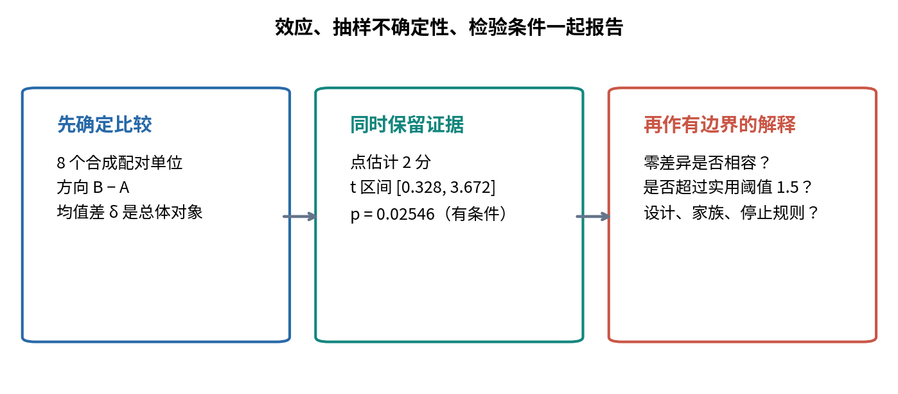

## 2. 比较对象先于公式

用i=1,…,n标记独立的实验单位，Aᵢ、Bᵢ是一对读数，Dᵢ=Bᵢ−Aᵢ。目标参数为总体平均差δ=E[Dᵢ]，估计量为样本平均差。抽样前Dᵢ是随机变量，读到数据后dᵢ是固定数；检验的概率计算针对“如果重新执行同一设计，会生成什么统计量”。

把零假设写成H₀:δ=0，双侧备择写成H₁:δ≠0。它们是关于总体参数的陈述，不是“这八个差值的平均数是否恰好为0”。后者已经知道答案是2，不需要概率检验。

模型还必须写出独立性、分布、单位、缺失值处理和比较方向。H₀与这些辅助条件共同决定零分布。拒绝时，说明观测与整套零模型不相容；不能仅凭一个尾部概率判断到底是哪条条件出了问题。

若科学问题事先明确只关心改善，可设置单侧H₀:δ≤0、H₁:δ>0。在下面的Gaussian位置模型中，最不利零假设在边界δ=0，因而用该边界计算右尾可控制整个δ≤0范围。不能看到均值为正才把原本双侧问题改为右侧。

## 3. 什么是检验统计量和拒绝域？

检验统计量T=T(D₁,…,Dₙ)是事先规定的样本摘要。它把原始数据映射为一个数，便于在零模型下比较。例如标准化均值、绝对均值或正差值个数，都会产生不同的敏感方向。

拒绝域R是一组被视为足够不相容的统计量值。程序最终作的是判断T是否属于R；“拒绝H₀”只是按事先规则作出这个决定，不是宣告H₁已被逻辑证明。没有进入拒绝域称为不拒绝，不能自动改写成证明完全相等。

显著性水平α是预先允许的第一类错误上界。简单零假设下要求P₀(T∈R)≤α；复合零假设下要求对每个允许的零参数都成立，也可以写成这些概率的上确界不超过α。离散问题常常不能恰好达到α，保守的小于号完全合法。

## 4. 第一类错误、第二类错误与功效

H₀为真却拒绝，是第一类错误。H₀为假却没有拒绝，是第二类错误。前者必须在零模型下算，后者必须说明哪个真实替代参数δ。功效是该δ下拒绝的概率，等于1减去对应第二类错误概率。

α=0.05不是“这次结论错误的概率是5%”，也不是“全部研究中恰好5%结论会错”。它描述的是一套程序在零模型成立时的长期错误控制。真实效应越小、噪声越大或样本量越少，程序可能更难发现差异；因此不显著可以来自信息不足。

做一个只用于澄清条件方向的概率模型：假设研究题目中90%没有效应，10%有某种效应；零情形拒绝率0.05，非零情形功效0.8。随机抽一个题目且检验拒绝之后，来自零情形的条件概率是

$$
\frac{0.9\times0.05}{0.9\times0.05+0.1\times0.8}=0.36.
$$

这个36%需要额外的题目比例与功效假设，绝不能从单个p值直接读出。它重现第十八讲中条件概率方向不同的问题，并不是当前真实研究的错误率估计。

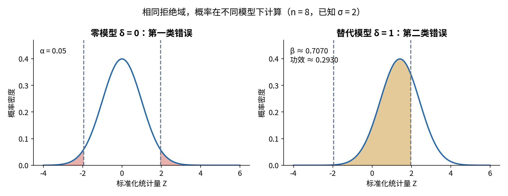

## 5. p值是在零模型下看“至少这么极端”

先规定数值越大越不相容的统计量T。观察t后，简单零模型的上尾p值可写为p=P₀(T≥t)。若方向是两侧偏离，则先定义T=|Z|，再计算P₀(|Z|≥|z观测|)。这里的概率始终在零模型下，不是在给定数据后给假设分配概率。

“至少”很重要。连续数据的一个精确点概率通常为0，但很多附近与更极端的结果共同组成尾部事件，因而有非零概率。离散分布必须包含与观察值同样极端的质量，不能把≥随意改成>。

p值随观察而变化，α是事先固定的程序门槛。常用拒绝规则是p≤α。对连续分布，端点等号发生概率为0；对离散分布，端点约定可能实际改变拒绝率，必须与代码一致。

为什么这条规则能控制错误？如果连续T的零分布函数F₀严格递增，则F₀(T)在(0,1)均匀，故1−F₀(T)≤α的概率为α。有限等概率零样本的版本更直观：把统计量按从最极端到最不极端排队，p是当前位置及更极端位置的总比例；若有并列，同一组都使用该组末尾累计比例，因此满足p≤α的样本比例不超过α。这个保守秩论证也说明了为何并列必须一起计算。

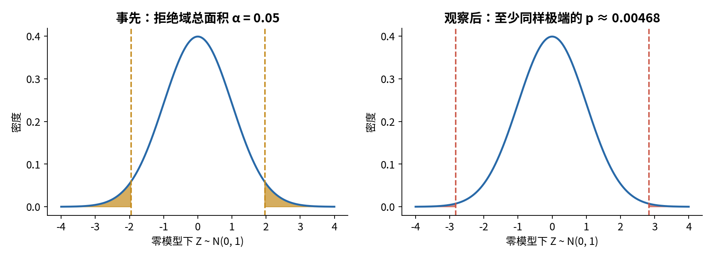

## 6. 已知总体标准差的完整Gaussian例子

为得到一个完全可算的基准，暂时假设Dᵢ相互独立且同服从Gaussian(δ,σ²)，总体标准差σ=2由实验外部事先给定。这个σ不是由当前八条估计的。线性Gaussian组合给样本均值分布为Gaussian(δ,σ²/n)，所以在H₀:δ=δ₀下

$$
Z=\frac{\overline D-\delta_0}{\sigma/\sqrt n}\sim N(0,1).
$$

我们沿用第二十至二十二讲的标准正态CDF Φ。双侧p=2[1−Φ(|z|)]。令c满足Φ(c)=1−α/2，则|Z|≥c时拒绝，零模型下两侧尾概率共为α。

主数据n=8，平均差2，δ₀=0，σ=2，于是标准误为1/√2，z=2√2≈2.828427。双侧p≈0.004677735。α=0.05时c≈1.959964，因此在这套已知σ的Gaussian模型里拒绝零均值差。

与之配套的95%区间是平均差加减cσ/√n，数值约[0.614096,3.385904]。它不包含0，与双侧检验相容。数值计算用尾函数或erfc避免先算接近1的CDF再相减；尾部正概率的浮点下溢要显式处理，不能把机器零当成数学绝对不可能。

## 7. 区间与检验的代数对应

对同一模型、同一个α和同一种双侧构造，

$$
\left|\frac{\overline d-\delta_0}{\sigma/\sqrt n}\right|\le c
\quad\Longleftrightarrow\quad
\overline d-c\frac\sigma{\sqrt n}\le\delta_0\le
\overline d+c\frac\sigma{\sqrt n}.
$$

这只是移项与乘正数，清楚说明为何区间内部的零参数不会被对应检验排除。连续模型边界是否用严格拒绝不影响名义概率；实现仍应选定约定。不同方法产生的区间与p值未必自动互为反演，不能任取一个Bootstrap区间再配另一个检验声称严格等价。

区间比单一p值多保留了效应可能的规模。它仍然不是“这条固定区间内δ有95%概率”的频率学派陈述，也不能担保独立性或Gaussian假设真实。

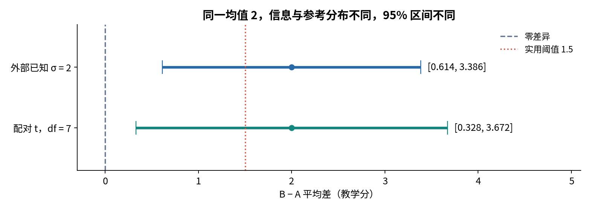

## 8. σ未知时，为什么不能把s直接当已知常数？

现实中总体波动通常未知。用样本标准差s替代σ之后，分母也变随机，统计量不再有上述标准正态分布。在独立同分布Gaussian差值、n≥2、σ>0条件下，

$$
T=\frac{\overline D-\delta_0}{s_D/\sqrt n}\sim t_{n-1},
\qquad
s_D^2=\frac1{n-1}\sum_i(D_i-\overline D)^2.
$$

这里tν称Student t分布，ν是自由度。可以定义为Z除以√(U/ν)，其中Z是标准正态、U是ν个独立标准正态平方和，且Z与U独立。Gaussian样本均值与残差平方和独立、上述学生化量服从t的定理在本讲明确作为已知结果接受；我们不把一次模拟当作证明。其标准密度及尾积分由官方数值库计算，小自由度时尾部比标准正态更重。

主例离差为1、0、2、−1、−3、−2、0、3，平方和28，所以s²=28/7=4，s=2。这里恰好等于前节外部σ，但它仍是另一种信息来源。观察到的t数值也为2.828427；参考分布改为t₇后，双侧p约0.025463562，95%区间约[0.327958,3.672042]。三个输入数字看起来相同，并不意味着参考分布可以随意互换。

配对t检验就是对差值作这一单样本检验。若用SciPy的ttest_rel，函数按第一数组减第二数组计算，想报告B−A，应传B、A并检查符号。任何数据中出现NaN时，本课程先拒绝整个输入，不自动删行改变配对。

若所有差值相同，完整验证后得到s=0，学生化比值没有通常定义。不要让0/0变为NaN再贴一个成功标签，也不要把常量非零时的浮点无穷直接当作稳健的显著性证据。脚本应明确报告退化状态。已知正σ的基准检验与全零的符号翻转可以仍有各自合法答案，不能一概混为同一边界。

## 9. 保留配对究竟保留了什么？

同一个实验单位的A与B常有共同背景。差值的方差是Var(B)+Var(A)−2Cov(A,B)。先配对再求差可以抵消共同变化；如果错误地当成两组独立样本，就丢掉协方差项。

主例A均值11.5、B均值13.5；样本方差分别6和22/7，样本协方差18/7。故差值样本方差为6+22/7−2×18/7=4，均值方差估计为4/8=1/2。错误忽略配对时得到(6+22/7)/8=8/7，描述的是另一种抽样计算。

本例正协方差让配对减少噪声；若协方差为负，方向可能相反，所以不能口号式断言配对永远减小方差。真正的原则是尊重设计与统计单位。把同一单位重复测量当成多个独立单位，或者把不同随机种子的同一测试集得分当成独立总体样本，也可能夸大信息量。

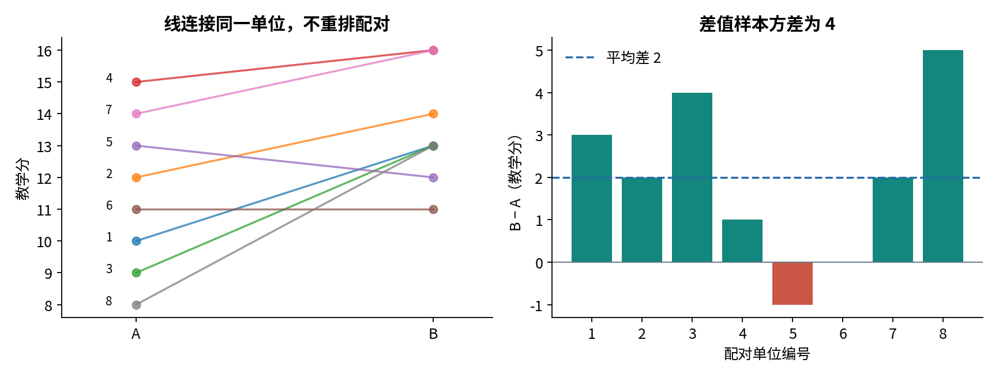

## 10. 不用Gaussian形状，也能建立一个精确零分布

换一组明确条件：在零假设下，每对A、B的标签可以独立等概率交换；或在总体模型里，各差值独立且关于0对称，使给定绝对值后的非零符号像独立公平硬币。**仅仅总体均值为0不够。** 一个高度偏斜但均值为0的分布，不一定允许翻转符号。

保持每个差值的绝对值不变，为n个位置分别选±号，构成2ⁿ个等概率标号结果。统计量取绝对总差|∑dᵢ|，与绝对均值只差一个固定正因子。零差值翻成正负仍是0；可以保留两个标签并相应计重，也可以一致地约去这一倍，不能把数值相同的结果去重后当等概率。

对主例绝对值3、2、4、1、1、0、2、5，全部256个标号结果的总差位于−18至18的偶数格点。观察总差为16。满足|总差|≥16的标签有12个，因此精确双侧p=12/256=3/64=0.046875。

可以再手算尾部计数：最大正和18；达到至少16，负号绝对值总和只能为0或1。去掉零位置后的七个非零绝对值中，有两个1，因此有“全正”与“只翻其中一个1”共3种，零符号再乘2，正尾6种，负尾对称再乘2，总计12种。

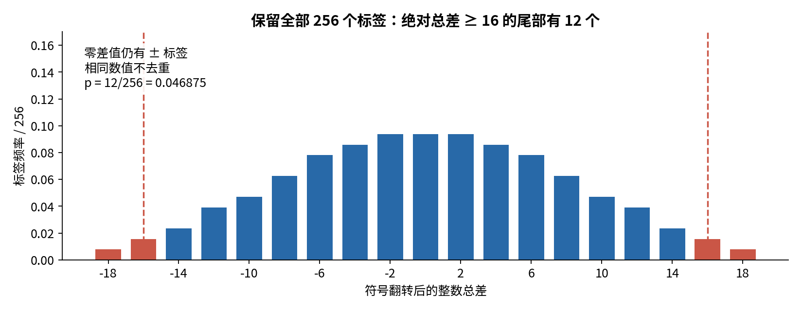

## 11. 为什么三个p值不同，却不互相推翻？

同一数据在已知σ Gaussian模型下p约0.00468，在未知σ Gaussian模型的配对t检验下约0.02546，在符号交换模型下为0.046875。它们的零分布、已知信息和条件都不同。选择方法必须依实验设计与可辩护的假设事先决定，而不能看到结果后拿最小那个。

符号翻转使用的是零假设下对称或交换不变性，不声称对所有均值为0的分布有效。配对t检验的小样本精确性使用Gaussian差值；大样本近似还需要恰当的独立、矩和渐近条件。把一个假设改得更弱并不自动让任何旧的p值仍然合法。

本讲用完整枚举，p不是Monte Carlo近似。若今后仅随机抽部分置换，需要说明随机置换方案与有限次数修正，常见有效随机化构造使用分子分母都加1的计数，不能因为没有抽到更极端结果就报告精确p=0。双侧定义也并不唯一；本讲明确采用绝对统计量尾部，不能默默替换成另一个软件的默认定义。

## 12. 效应量先报告原始单位

本例估计δ为两教学分。可辅助报告标准化配对效应d_z=平均差/s_D=1；它把效应放在差值的样本标准差单位下。其分母是差值的标准差，不是A、B两组标准差的随意平均，也不是均值标准误。因为s也随机，d_z本身有抽样不确定性，不是天然无偏量。

标准化方便跨尺度描述，但未必直接对应实践价值。我们在看数据前为教学设定最低有意义改善Δ=1.5分。当前95%t区间包含比1.5小与大的值，因此“排除了0”并不等于“已经清楚证明超过1.5分”。如果真正问题是是否超过该阈值，就应事先检验H₀:δ≤1.5，或报告相应单侧下界。

两个研究可以有同一个p值却有完全不同的原始效应与样本量；一个很大的样本也可能把极小差异检测得很显著。反过来，小样本下不显著的点估计可能仍对应实践上重要但尚不确定的差异。至少同时报告估计、单位、区间、样本单位、方法条件和完整p值。

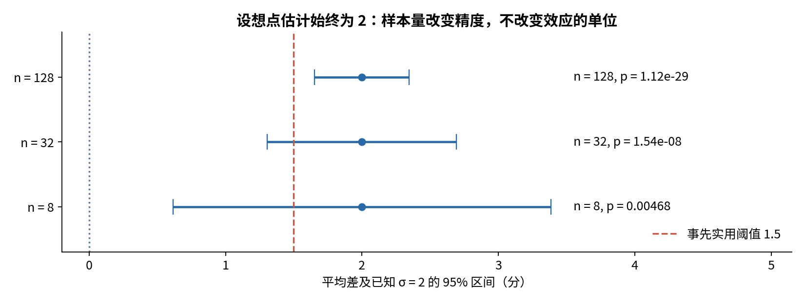

## 13. 从公式看功效，而不是事后套一个标签

回到已知σ的双侧Gaussian基准，真效应为δ、零值为0。令λ=δ√n/σ，则Z服从Gaussian(λ,1)。拒绝域仍是|Z|≥c，因此

$$
\operatorname{Power}(\delta)
=P_\delta(Z\ge c)+P_\delta(Z\le-c)
=1-\Phi(c-\lambda)+\Phi(-c-\lambda).
$$

这一步把Z−λ标准化为N(0,1)，分别算左右尾。δ=0时λ=0，功效退化为α，也就是零假设下拒绝率。固定δ、σ时增大n使分布相对门槛分离；如果降低α，c变大，通常会牺牲对既定效应的功效。

取δ=1、σ=2、α=.05，n=8、32、128时理论功效分别约0.292989、0.807430、0.999891。功效必须附带这些假设和特定效应，不是“这份数据有80%可靠性”。规划时应围绕有意义的效应与合理噪声范围做敏感性分析；只把观察效应原样代回所谓事后功效，不能生成新的独立证据。

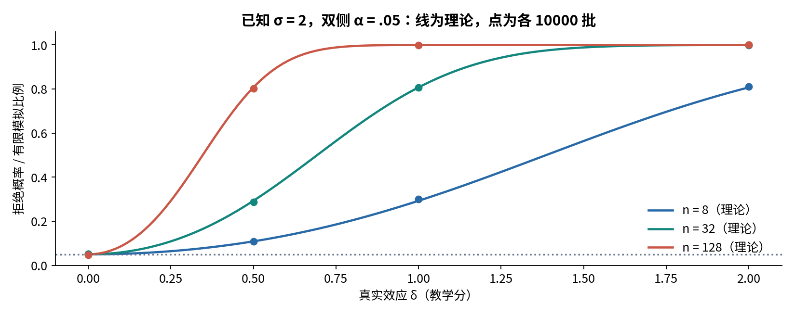

## 14. 多试二十次再挑最好的一次，会发生什么？

假设20个预先固定、相互独立的比较全部满足零假设，每个有效连续p值在(0,1)均匀。如果每项都按0.05拒绝，全部不误拒的概率为0.95²⁰，所以至少一次误拒的概率为

$$
1-(1-0.05)^{20}\approx0.641514.
$$

这叫家族错误率：一组被共同考虑的比较里，发生至少一个假阳性的概率。它不是“20项中64%都错”，也不是单项错误率从5%神秘变成64%。改变的是“至少一次”的事件。

相互独立是这个精确乘积公式的条件。若比较共享样本、指标或模型，它们往往相关，不能机械套这个数。但不相关也不是唯一风险：试多个终点、子群、清洗方案、特征版本或停止时点，若只公布最小p值，都可能改变实际选择程序。

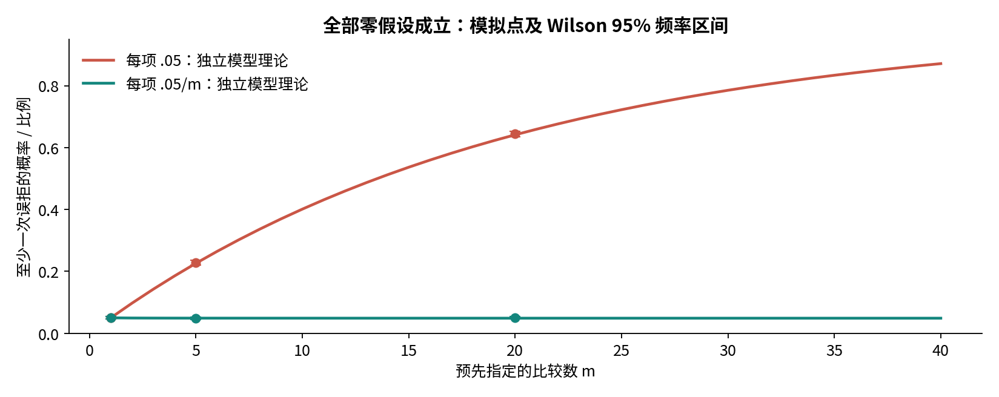

## 15. Bonferroni为何不需要独立性

设预先指定家族有m个检验，每个有效p值在其零假设成立时满足P(pⱼ≤u)≤u。每项改用门槛α/m。若I₀是真零假设的索引集合，由并集概率上界，

$$
P(\text{至少误拒一个真零假设})
\le\sum_{j\in I_0}P(p_j\le\alpha/m)
\le |I_0|\alpha/m\le\alpha.
$$

这里没有把联合概率拆成独立乘积，所以不需要检验之间独立；但每个p值自身必须有效，不能用校正补救坏的独立性或错误采样单位。还需要家族定义涵盖所声称控制的比较，不能只把最终喜欢的三项放进去。

也可以报告校正p值min(1,mpⱼ)，再与α比较。m=20时门槛为0.0025。在相互独立、全部为真的特殊模型中，实际家族错误率是1−(1−0.0025)²⁰≈0.048830，小于0.05。它可能保守并降低功效；这是一种透明的权衡，不意味着多重比较问题可以忽略。

本讲只建立家族错误率基础，不混用“至少一次误拒”与“发现中假发现比例”的不同指标。更高级的错误率和序贯方法需要另外的条件与设计。

## 16. 看一次、再看一次不是原来的固定样本程序

如果预先打算收n=64个独立差值，却在n=8、16、…、64每次都计算固定样本p值，看到第一次小于0.05就停止，那么拒绝事件是多个时点拒绝事件的并集。每个单独时点有效，不保证这个整体程序仍只有5%误拒。

这些时点共享前缀数据，通常相关，不能把它们当独立20次套上节公式。实验可以在完全零效应下生成多条长度64的路径，比较“只看最终一次”和“任何预设时点过线”的频率，明确这是有限模拟证据。若需要中途决策，应事先使用适合的序贯边界、分配错误预算或独立确认；本讲不把事后删掉中途查看记录当作修复。

同理，看完数据后挑单侧方向也会扩大拒绝事件。在对称连续零分布中，若每次挑更小的单侧尾再按0.05拒绝，等价于用双侧0.10规则，实际第一类错误是10%。方向不是一个可以免费事后选择的参数。

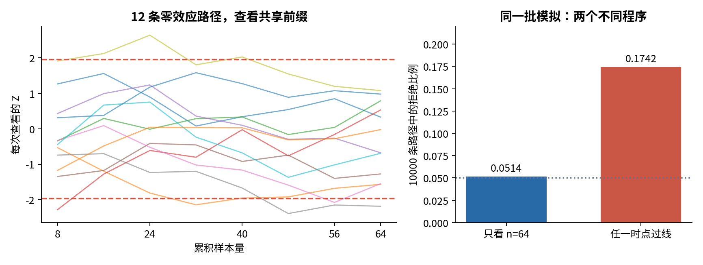

## 17. 不显著、等效与因果结论都需要自己的条件

不拒绝δ=0可能因为数据不足，不等于证明δ恰好为0。要支持“差异小到可忽略”，应事先定义可忽略范围并使用针对等效问题的程序；简单检查一个95%区间包含0并不够。本讲不展开等效检验的误差分配，只明确问题不能偷换。

小p值也不证明因果关系。配对去掉了某些共同变化，但不能自动消除时间趋势、选择偏差或其他同时变化的因素。随机化设计可以支持特定因果解释，仍要说明实施、缺失、干扰与目标人群。我们的合成数值只用于解释统计机制，不授权对真实产品、个体或群体作效果判断。

## 18. 一次透明实验怎样运行

先冻结差值方向、零假设、双侧或单侧、显著性水平、实用阈值、比较家族和停止规则。然后读完整CSV、验证唯一ID、有限数值及配对长度；不悄悄舍入、删除NaN或打乱B列。每个模拟参数和完整列表要在创建RNG前检查。

实验先用Fraction精确核对均值2、SSE28、样本方差4、配对协方差18/7、256个标签中12个尾部结果。再用独立高精度积分核对正态与t尾部、临界点与区间；数值库相互调用不等于独立数学核验。最后模拟已知σ模型的零拒绝率、功效、家族错误率和中途查看风险。

重复R批得到误拒比例r̂时，Monte Carlo标准误约为√[r̂(1−r̂)/R]，它描述这张模拟图自身的误差，不是原始δ估计的标准误。极端频率0或1时这个插件标准误会给0，不能据此声称真实概率已精确为0或1；可以同时给一个有限二项频率区间或增加重复次数。

所有失败检查使用不会被python -O关闭的显式判断。完整常量向量在完整验证后精确识别，未知σ的t比值按退化状态报告，坏末项不得被常量分支跳过。输入或数值范围无效时，已有输出报告应保持字节不变。

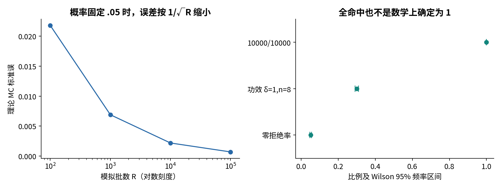

## 19. 报告不能只剩“显著”两个字

一份最小但完整的报告可写：预先比较B−A，八个独立配对单位，平均差2教学分，差值样本标准差2；在独立Gaussian差值、未知σ的配对t模型下，t₇≈2.8284，双侧p≈0.02546，95%区间[0.32796,3.67204]。事先实用阈值1.5位于区间内，对是否超过它仍有不确定性。若做过其他比较或中途查看，也要交代。

这比“B显著更好”多写了一些条件，却让读者知道证据支持到哪里。原始点、区间、方法选择、全部计划比较与失效条件都应该保留；没有进入拒绝域的结果也属于完整实验。

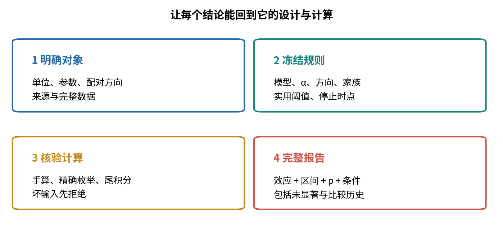

## 20. 自测与后续

1. 对八对读数定义实验单位、差值方向、估计量与总体参数，写出双侧零假设。
2. 解释第一类与第二类错误各在哪个模型下计算，为什么功效必须指定δ。
3. 在90%零题目、α=.05、非零功效.8的教学混合模型里推导拒绝后仍为零的概率。
4. p值为什么包括同样极端的结果？为什么它不是P(H₀|数据)？
5. 从Gaussian均值分布推导主例z、双侧p和95%区间，明确σ来源。
6. 通过代数说明同一双侧检验与相应区间的关系，并指出边界约定。
7. 手算主例SSE、s²、t与自由度，解释为何t尾部与z尾部不同。
8. 完整推导配对差值方差关系，核对本例忽略配对后的8/7。
9. 写出符号翻转有效性的条件，并举一个均值为0却不对称的分布反例。
10. 不靠程序，数出主例|总差|≥16的12个标签，处理零差值与并列。
11. 为什么不能算三种p值后只报告最小者？若随机置换零次超过观察值，能否说精确p=0？
12. 计算原始效应与d_z，说明实用阈值1.5与拒绝零差异的关系。
13. 推导已知σ的双侧功效公式，检查δ=0、增加n和降低α三个方向。
14. 推导20个独立零检验至少一次误拒概率；它是否表示64%的单项结论为假？
15. 用并集上界证明Bonferroni，不假设独立；解释家族与单项有效性。
16. 在对称连续零分布中，证明事后挑单侧方向再按.05拒绝实际有.10错误率。
17. 解释中途反复查看为何改变程序，以及为什么不能套独立比较乘积式。
18. 写出包含效应、区间、条件、p值与比较历史的报告；说明不显著、等效与因果各不能自动推出什么。

逐题完整详解与实验另有文件。下一讲将把估计量的偏差、方差与均方误差系统分开，进一步解释一次样本上的好结果为何不能代替长期性能。

## 来源与核查范围

- [MIT 18.05统计讲义 Class17–18](https://ocw.mit.edu/courses/18-05-introduction-to-probability-and-statistics-spring-2022/mit18_05_s22_statistics.pdf)：错误类型、功效与z/t条件；Student定理作为已知结果接受。
- [NIST 检验与区间](https://www.itl.nist.gov/div898/handbook/prc/section1/prc15.htm)与[均值区间](https://www.itl.nist.gov/div898/handbook/eda/section3/eda352.htm)：已知σ与未知σ的计算及频率学派解释。
- [NIST Bonferroni](https://www.itl.nist.gov/div898/handbook/prc/section4/prc463.htm)：有限预设家族与并集上界；正文独立证明。
- [Berkeley 配对比较](https://www.stat.berkeley.edu/~stark/Teach/S240/Notes/ch6.htm)：独立对内交换、条件公平符号与零值；本讲不使用Wilcoxon秩和。
- [SciPy 1.17配对t](https://docs.scipy.org/doc/scipy-1.17.0/reference/generated/scipy.stats.ttest_rel.html)与[t分布](https://docs.scipy.org/doc/scipy-1.17.0/reference/generated/scipy.stats.t.html)：数组顺序、自由度、尾函数与分位数。
- [SciPy置换检验](https://docs.scipy.org/doc/scipy/reference/generated/scipy.stats.permutation_test.html)：完整枚举、随机修正与双侧约定。该API未实际调用。
- [ASA p值声明](https://www.amstat.org/asa/files/pdfs/p-valuestatement.pdf)：p值解释、效应重要性与透明报告；正文例子独立构造。

所有来源的实际检查范围另见source-checks.json。本讲数据、数值枚举、推导文字和图表独立制作，未复用文献实验数据。
