# 第二十七讲 估计误差与偏差方差

## 1. 平均来说正确，为什么一次仍可能很差？

想用三个读数估计一个固定总体均值。规则A取平均，规则B取中位数，规则C把平均缩到原来一半。有人说A与B“无偏”，所以必然比C好；也有人只看一份数据上C碰巧最接近真值，就宣布收缩总有用。这两种推论都跳过了重复抽样。

本讲用一个只有八种可能样本的完整例子，逐项算出每条规则的偏差、方差和均方误差，再到有限模拟中检查Gaussian与对称污染机制。核心问题是：**为什么低偏差的方法，也可能在小样本上不可靠？**

直接先修是第十九、二十一至二十三、二十五讲：期望、方差、条件独立、抽样分布、估计量和区间。这里的偏差是统计估计偏差，不是在讨论社会偏见；这里的方差是估计规则跨完整数据集的变化，不是某一数据集里原始读数的散布。

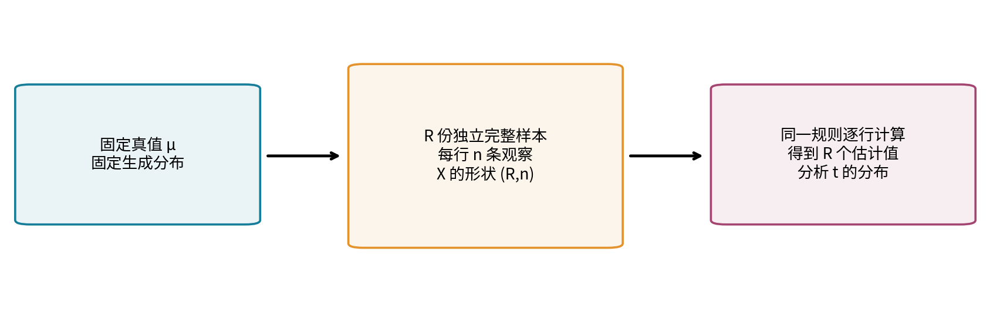

## 2. 固定参数、随机数据、固定规则

写X=(X₁,…,Xₙ)为随机样本，真实参数θ固定，数据生成分布为Pθ。估计量T=T(X)必须只使用可观察数据与事先规定的信息，不可以偷用未知θ。读到一份具体样本x后，t=T(x)是一个已经确定的估计值。

Eθ和Varθ表示在真实参数θ下，对所有可能数据集取期望与方差。如果算法另有随机种子，需要说明把算法随机性一起平均，还是固定种子只讨论数据变化。本讲主要规则是确定函数，模拟种子只用于生成可复现的样本批次。

同一组读数可以服务不同目标。总体均值、总体中位数、某个未受污染群体的中心未必相同；在比较误差前必须固定目标。把对均值有偏的方法改称中位数估计后，又拿它与均值真值比较，是在偷换任务。

## 3. 偏差不是本次误差

定义偏差bθ=Eθ[T]−θ。若对参数空间中的每个θ都为0，称这条规则无偏。一次误差t−θ可以分解为

$$
T-\theta=(T-E_\theta T)+(E_\theta T-\theta).
$$

第一项是围绕规则长期中心的随机波动，其期望为0；第二项是偏差，是固定θ下的确定数。一次输出高于真值不证明估计量有正偏，正偏规则也可能在某次样本上低于真值。

无偏要求相对于指定目标、分布模型和整个参数范围。一个常数规则T=0在θ=0这一点上恰好无误差，并不因此成为对所有θ都无偏的估计量。发现某个参数处表现好，不能自动声称全局优越。

## 4. 方差、标准误、MSE与单位

估计量方差为Varθ(T)=Eθ[(T−EθT)²]，标准误为它的平方根。均方误差是MSEθ(T)=Eθ[(T−θ)²]。均方根误差RMSE是MSE的平方根，与参数具有相同单位；方差与MSE的单位是参数单位的平方。

标准误只看相对自身中心的散布。一个固定输出错误常数的规则方差为0，却可能总是离目标很远。小方差并不等于小总误差，窄区间也不自动意味着目标正确。

把上一节的分解平方，交叉项期望为0，得到

$$
\operatorname{MSE}_\theta(T)
=\operatorname{Var}_\theta(T)+b_\theta^2.
$$

这个等式需要相关二阶矩有限；不是说任何重尾规则都可以给出有限的两个数。本讲每个精确与模拟模型都满足有限矩。RMSE=√(方差+偏差²)，一般不等于标准误加偏差绝对值。

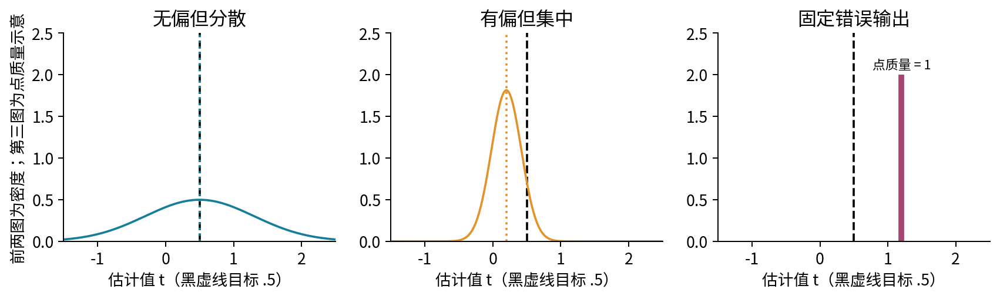

## 5. 一个能够完整枚举的总体

令Xᵢ=μ+εᵢ，εᵢ相互独立，各以1/2概率取−1或+1。目标是μ，单次均值μ、方差1。主例固定真实μ=1/2，每次只抽n=3个观测。八个有序符号序列各占1/8，不是去重后的四个成功个数各占1/4。

设K为三个正号的个数。K=0、1、2、3的概率分别为1/8、3/8、3/8、1/8，样本均值为μ+(2K−3)/3。主例四种均值为−1/2、1/6、5/6、3/2。

规则A是样本均值，规则B是三个观测的中位数，规则C是样本均值乘1/2。下面每条公式都会在全部八个有序样本上复核。不要把随机生成八批数据当成这里的“完整八种可能”；随机抽样可能重复，也可能漏掉某些序列。

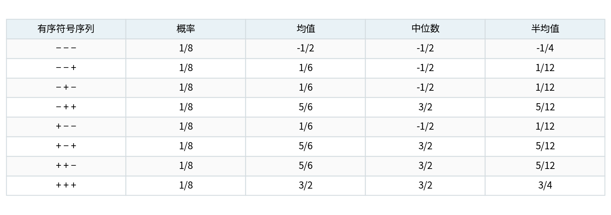

## 6. 两条无偏规则仍可以差很多

样本均值的期望为μ，独立性使方差为1/3，所以MSE也为1/3。中位数则由符号多数决定：至少两个正号时为μ+1，否则为μ−1。两种结果各占1/2，期望仍为μ，但方差为1，MSE也为1。

两者都无偏，却有三倍的MSE差异。无偏只约束长期中心，没有保证每次都稳定。这里并不是否定中位数，而是说明比较必须相对于具体分布与损失。

这个两点总体还有一个重要条件：从μ−1到μ+1之间的任何点都可满足总体中位数定义。中位数不唯一。对任意奇数n，样本中位数仍以相同概率取两个端点，因此不会收敛到中间的μ。通常关于样本中位数的一致性结论需要唯一中位数和CDF在目标两侧确实穿过1/2等条件；不能只看到“分布对称”就忽略这个缺口。

## 7. 有偏规则反而降低主例MSE

规则C取T₁/₂=样本均值/2，主例期望为1/4，偏差−1/4；方差为(1/2)²×(1/3)=1/12。因此

$$
\operatorname{MSE}_{\mu=1/2}(T_{1/2})
=\frac1{12}+\frac1{16}=\frac7{48}
<\frac13.
$$

偏差确实增加了，但方差减少得更多，所以总平方误差降低。八个样本逐一计算(T−1/2)²再取平均，也得到7/48；这提供不借助分解公式的独立核验。

若恰好观察到两个高值、一个低值，均值为5/6，中位数3/2、半均值5/12；三者本次误差分别1/3、1、−1/12。这只是一个具体样本；即便该次排序与长期MSE一致，也不能把这种巧合当作规则比较的证明。

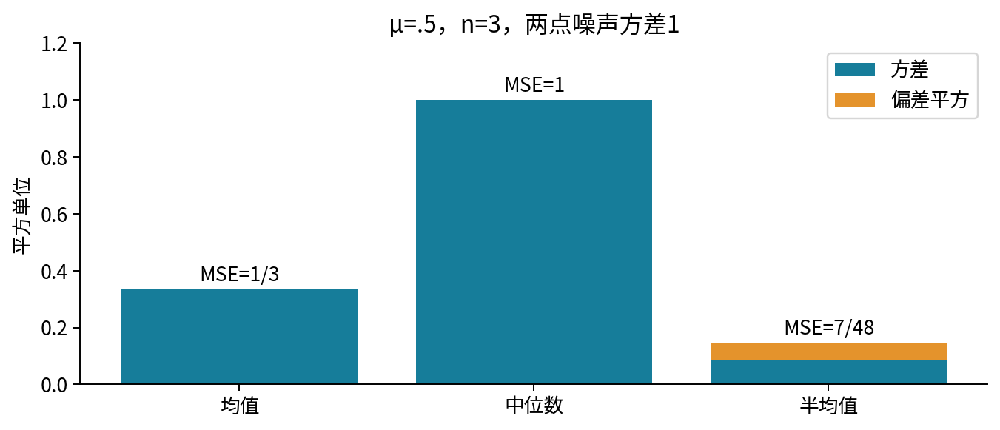

## 8. 收缩到零何时会失败？

一般设样本均值无偏、方差v=σ²/n，用固定c∈[0,1]定义T_c=c样本均值。它的偏差为(c−1)μ，方差c²v，故

$$
\operatorname{MSE}_\mu(T_c)=(1-c)^2\mu^2+c^2v.
$$

对n=3、σ²=1、c=1/2，MSE=μ²/4+1/12。与均值的1/3比较，只有|μ|<1时半均值更好；|μ|=1相等，|μ|>1更差。真值μ=2时，半均值MSE=13/12，反而大于1/3。

收缩中心0是一个建模选择，不是自然法则。若目标附近有可信的先验中心，可以减少小样本波动；若中心严重不相容，就可能引入更大的偏差。不能只展示μ=1/2那张漂亮图，再宣布规则C在所有参数上占优。

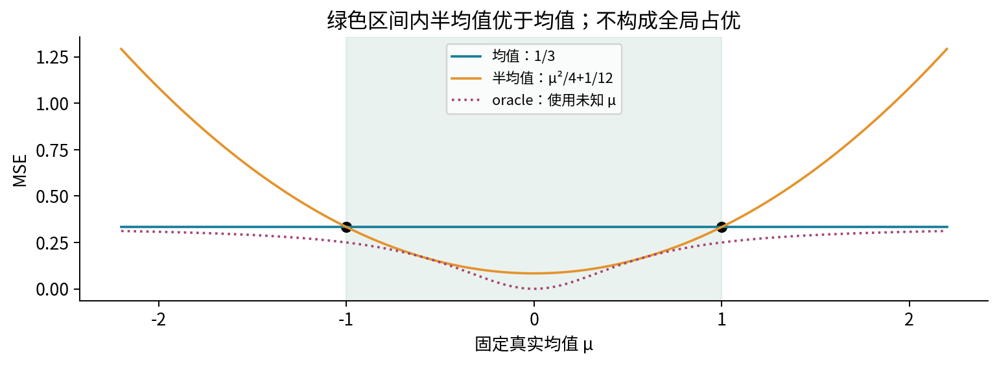

## 9. 最优系数的公式为什么不能直接作为算法？

把上式对c求导，得到2c(μ²+v)−2μ²。因为μ²+v>0，唯一最小点为

$$
c_\star=\frac{\mu^2}{\mu^2+v},\qquad
\operatorname{MSE}(T_{c_\star})=\frac{\mu^2v}{\mu^2+v}.
$$

主例μ=1/2、v=1/3时，c*=3/7，最小风险1/7，比固定半均值7/48略低。但这个系数偷看了未知μ，称为oracle对照，只能用于理论解释，不能当成可部署的已知算法。

如果把未知μ换成样本估计，c就变成数据的函数，偏差与方差必须对整个新规则重新计算。不能把随机c塞进只为固定c推导的公式后宣称风险不变。若用验证数据选择强度，也需要把选择步骤纳入重复实验，并保护最终测试数据。

## 10. 一致性是样本量增加时的另一种性质

估计量序列Tₙ一致，是指对每个ε>0，当n→∞时，Pθ(|Tₙ−θ|>ε)趋于0。它说的是概率集中到目标，不要求有限n无偏，也不等于某一条随机路径上的误差必然单调下降。

iid有限方差下，样本均值偏差0、方差σ²/n。Chebyshev给P(|平均−μ|>ε)≤σ²/(nε²)，所以一致。相反，规则Tₙ=X₁始终无偏，但完全不用后面的数据，在本例方差一直为1，因而不一致。

固定半均值通常趋于μ/2，而非μ，所以除μ=0外不一致。若改成cₙ=n/(n+κ)，其中κ>0固定，偏差为−κμ/(n+κ)，方差为nσ²/(n+κ)²；两者都趋于0，MSE趋于0，再由Markov用于平方误差即可推出一致。它每个有限n可能有偏，却能一致。

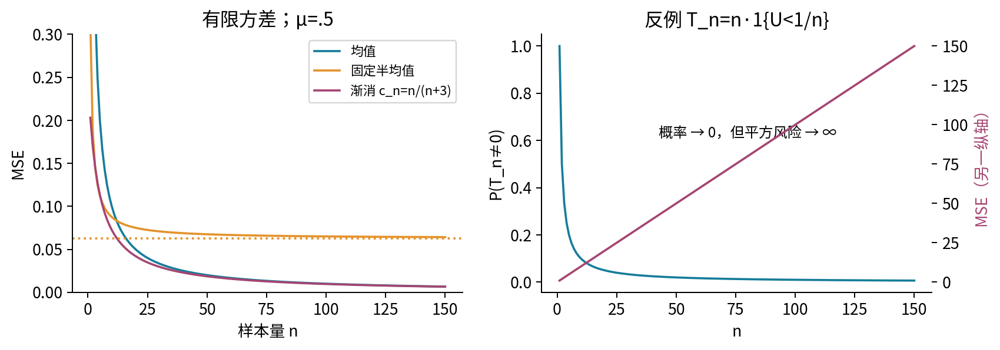

## 11. MSE趋零比依概率收敛更强

若MSE(Tₙ)趋0，则P(|Tₙ−θ|>ε)≤MSE/ε²也趋0，这是直接的非负变量上界。反过来，仅一致性不够保证平方误差期望趋0，因为非常罕见但越来越大的失误可能主导期望。

给一个纯数学反例：目标0，取U在(0,1)均匀，Tₙ=n当U<1/n，否则为0。对固定ε和足够大n，误差超过ε的概率为1/n，趋0；但MSE=n²×(1/n)=n，反而发散。这个序列用于解释矩条件，不是建议的估计程序。

因此研究重尾方法或极端数值时，不能仅用“多数运行很好”替代期望平方风险。实际比较还可能关心中位绝对误差、尾部风险或其他损失，本讲始终明确所用平方损失。

## 12. 稳健估计在什么模型里比较？

中位数对少量极端观测更不敏感，可以用一个确定性改动看到：将五个数(−1,0,0,1,t)中的t从1增大到100，均值随t线性增大，而在t≥1时中位数始终为0。这是一个替换点敏感性例子，不是所有抽样风险的证明。

为公平地比较均值与中位数估计同一个目标，模拟两个关于μ对称且有唯一中位数的模型。模型一是Gaussian(μ,1)；模型二是0.9Gaussian(μ,1)+0.1Gaussian(μ,100)，第二个参数为方差。两种模型的均值与中位数都为μ，因此没有更换目标。

第二个模型每条观察先独立选择普通或高波动成分，高波动成分标准差为10。总体方差0.9×1+0.1×100=10.9，所以均值MSE精确为10.9/n。中位数的有限样本风险由重复模拟观察，不宣称有同一个闭式数。Gaussian下均值常更高效，对称污染下中位数可能以牺牲部分Gaussian效率换取抗极端值表现；结论必须附带n、混合概率和成分尺度。

若污染是单侧偏移，混合均值、中位数与未污染中心可以不同，必须重新指定目标。不能继续把“偏离未污染中心”称为对混合总体均值的偏差。

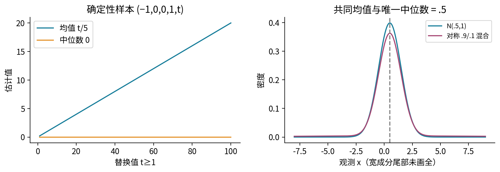

## 13. 相对效率先把比较类说清楚

当两条规则估计同一θ且都无偏时，它们的MSE就是方差，可以用方差比衡量相对效率。若以规则A作基准，可明确报告Var(A)/Var(B)；比例大于1表示B在这个模型和样本量下方差较小。不同文献可能取倒数，所以必须写清分子分母。

主例均值与中位数都无偏，Var(均值)/Var(中位数)=1/3。说中位数在此比较下相对效率1/3，不等于说中位数运行速度只有三分之一，也不等于任何分布下都如此。对有偏规则，直接用方差比会忽略偏差，应比较完整风险。

“有效估计”有时特指在给定模型中达到一个方差下界。下一节给最简单Gaussian均值例子，展示这个词需要哪些限制，而不是把它作为泛泛赞美。

## 14. 一个有条件的效率下界

只考虑单个实参数μ、参数无关的固定支持、可对密度求导，且可以把求导移入相关积分；估计量T本身不能含未知μ，EμT²有限。定义分数函数Sμ(X)=∂log fμ(X)/∂μ，并假定0<I(μ)=Eμ[Sμ²]<∞。这些是推导条件，不适用于支持随参数移动等任意模型。

由密度归一化求导，EμSμ=0。若T在邻域内无偏，EμT=μ，两侧求导，交换导数与积分得到Eμ[TSμ]=1。因此Covμ(T,Sμ)=1。对随机变量的Cauchy–Schwarz不等式给

$$
1\le\operatorname{Var}_\mu(T)\operatorname{Var}_\mu(S_\mu)
=\operatorname{Var}_\mu(T)I(\mu),
\qquad
\operatorname{Var}_\mu(T)\ge1/I(\mu).
$$

这就是此处的标量Cramér–Rao下界。我们给出了在声明可交换条件下的证明；没有证明任意函数都满足这些技术条件，也没有将此无偏下界套给有偏收缩规则。

在iid Gaussian(μ,σ²)、已知正σ模型里，Sμ=∑(Xᵢ−μ)/σ²，所以I(μ)=n/σ²，得到方差下界σ²/n。样本均值正好达到，因而在该无偏比较类里有效。它既无偏又达到下界，仍不排除有偏规则在某些μ附近取得更小MSE；第八节已给出具体反例。

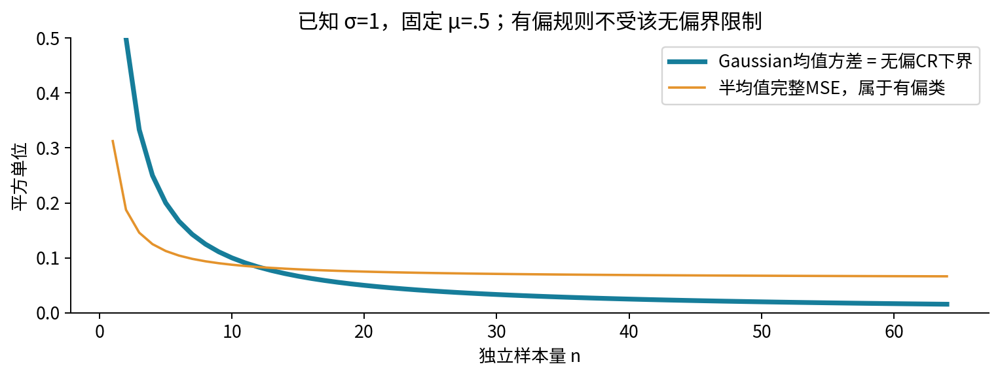

## 15. 估计误差与预测误差相差什么？

现在目标从估计均值μ改为预测一个全新观察Y=μ+ε新。假设新噪声与训练数据独立，均值0、方差σ²；估计规则T只用训练数据。展开得到

$$
E[(Y-T)^2]
=E[(\mu-T)^2]+E[\varepsilon_{\rm new}^2]
+2E[(\mu-T)\varepsilon_{\rm new}]
=\operatorname{MSE}_\mu(T)+\sigma^2.
$$

交叉项为0依赖独立性与零均值。最后一项噪声是预测一个新读数本身的变化；它不是估计器的偏差，也不是把原始观测方差重复算错。主两点模型σ²=1，所以均值预测MSE为4/3，半均值为55/48，中位数为2。

如果Y正是用来构造T的训练数据之一，独立条件不成立，交叉项不能直接删掉。比如用同一n个样本算均值，再平均训练残差平方，期望为(1−1/n)σ²；用该均值预测独立新点，风险为(1+1/n)σ²，两者相差2σ²/n。训练误差偏低不是“方差不存在”，而是评估对象和依赖关系改变了。

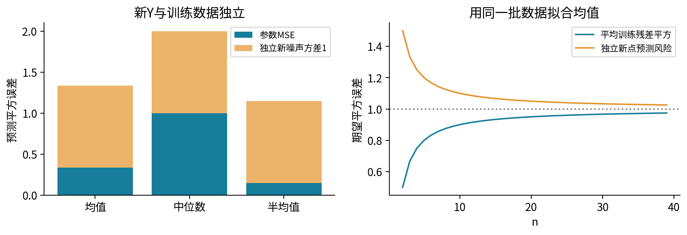

## 16. 在模拟结果里准确分解，不混用分母

固定一个真值与n，独立重复R次完整采样，每次计算tᵣ。记经验均值t̄，经验偏差b̂=t̄−θ，使用分母R定义经验方差v̂_R=∑(tᵣ−t̄)²/R。直接展开有限求和就有

$$
\frac1R\sum_{r=1}^R(t_r-\theta)^2
=\widehat b^2+\widehat v_R.
$$

这是对这批模拟数字的代数恒等式，不是极限近似。如果方差改为无偏样本版本s²_R=∑(tᵣ−t̄)²/(R−1)，右边必须写成b̂²+[(R−1)/R]s²_R才能与左边相等。

有限模拟的b̂即使对应理论无偏规则也不会恰好为0。模拟MSE也是随机估计：令Lᵣ=(tᵣ−θ)²，均值L̄估计真实MSE，模拟标准误可用Lᵣ的样本标准差除√R，前提是平方损失本身方差有限。这个误差条衡量模拟计算精度，不是原始参数估计的标准误。

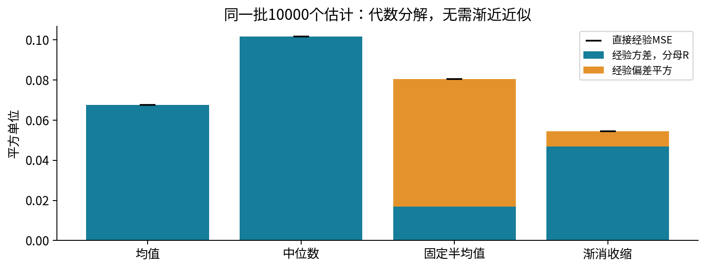

## 17. 实验必须让整条规则重复，而不只重复最后一步

实验先完整枚举八种符号序列，再模拟Gaussian与对称污染下n=3、15、63各10000批。数组形状为(R,n)，每行是一份完整训练样本。均值、中位数和收缩都沿行计算，不能把全部R×n个观测混成一份大样本。

若模拟算法还选择超参数，就要每批重新执行选择步骤。只在第一批选一个最有利系数，再在同一批上报告最小误差，会混入选择偏差。oracle曲线必须与可观察规则分开标注，不能用真实μ计算系数后假装没有泄漏。

固定随机种子使当前实现可复现，但不是数学证明；更换种子会改变有限曲线。理论风险、经验风险和Monte Carlo标准误都保留。对主例与Gaussian均值能算出的理论量应先核对，再对没有闭式的中位数有限风险保持适当限定。

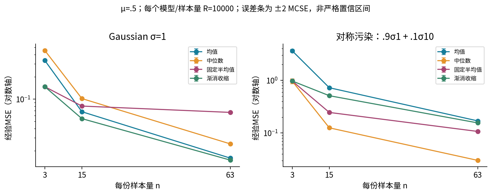

## 18. 数值验收也是统计结论的一部分

风险函数先验证所有数据、真值、样本量、收缩系数和模型参数，再构造RNG或写报告。拒绝bool、文本、复数、NaN和超出声明精度范围的标量。对真正常量数组可以在完整验证后返回精确零方差；对非恒定但极小的残差，不能让平方下溢后伪装成确定性规则。

混合尺度还可能在移位时丢掉小均值，例如原值−1、1、一个很小正数的补偿求和与“先减去−1再加回来”并非总在浮点上等价。独立Fraction或高精度检查应覆盖这些边界，不只测试正常的整齐小数。

验收需要新进程、无关工作目录、python -O和Notebook新内核顺序执行。坏CSV应让旧输出保持不变。图像中若偏差和方差用不同尺度，就不应假装柱高能直接相加；所有风险标签的单位与分母要一致。

## 19. 自测与后续

1. 定义估计量、估计值、真实参数和Eθ各固定了什么，说明算法随机性如何纳入。
2. 从加减EθT出发完整推导MSE分解，写出有限矩条件和单位。
3. 为什么本次误差不等于偏差？常数规则在某个真值上正确意味着什么？
4. 枚举n=3的八个等概率符号样本，求均值的四点分布，解释权重1、3、3、1。
5. 推导主例均值与中位数均无偏但MSE分别1/3和1；说明总体中位数非唯一的影响。
6. 不借助风险分解，直接平均八个半均值平方误差，得到7/48。
7. 对固定c推导完整风险，确定半均值在哪些μ比均值好，并核对μ=2。
8. 求oracle系数c*，说明把未知μ替成数据估计后为什么必须重新分析整条规则。
9. 举出无偏但不一致的估计量，并用概率而非图像说明。
10. 推导cₙ=n/(n+κ)的偏差、方差与MSE极限，说明有限有偏与一致可共存。
11. 用Tₙ=n·1{U<1/n}说明依概率收敛不保证MSE趋零。
12. 比较单点替换敏感性，说明为什么对称污染模型让均值和中位数仍估计同一目标。
13. 计算混合方差10.9与均值风险10.9/n；解释单侧污染为何需要重新定义目标。
14. 写清相对效率的分子分母，以及为何有偏方法不能只比较方差。
15. 在声明的可交换与有限矩条件下推导标量Cramér–Rao下界，并核对Gaussian均值。
16. 推导新点预测风险与参数MSE关系，再解释训练复用时交叉项为何不能删。
17. 证明有限模拟的经验风险恒等式，处理方差分母R与R−1的区别。
18. 为一个含调参步骤的估计器设计诚实重复实验，列出真值泄漏、矩不存在与数值下溢三种失效。

完整实验和逐题答案见独立文件。下一讲进入一元线性回归，从同一个平方误差目标推导可学习直线；这里建立的估计与预测误差区分将继续使用。

## 来源与核查范围

- [MIT 18.650参数推断](https://ocw.mit.edu/courses/18-650-statistics-for-applications-fall-2016/335fd85c0a2ecffc49c781502b3d9b95_MIT18_650F16_Parametric_Inf.pdf)：核对估计量、偏差与二次风险定义。本讲的八样本枚举与收缩例子独立构造。
- [Berkeley 参数估计说明](https://www.stat.berkeley.edu/~stark/SticiGui/Text/estimation.htm)：核对偏差、标准误与MSE的对象区别；本讲明确限定自己的iid设计，不套用其不放回公式。
- [MIT 18.655无偏估计与风险不等式](https://ocw.mit.edu/courses/18-655-mathematical-statistics-spring-2016/9e3152248b9f79ea4d5cfaae9f31c21b_MIT18_655S16_LecNote13.pdf)：核对支持不随参数、可交换求导、分数函数和Cauchy–Schwarz下界条件；本讲仅推标量版本。
- [NIST稳健位置估计](https://www.itl.nist.gov/div898/software/dataplot/refman2/auxillar/biwloc.htm)：核对抗极端值与效率权衡的区分；不使用其中数据或实现biweight。
- [NumPy中位数](https://numpy.org/doc/2.3/reference/generated/numpy.median.html)与[NumPy正态生成器](https://numpy.org/doc/2.3/reference/random/generated/numpy.random.Generator.normal.html)：核对轴、奇偶样本约定与标准差参数；正文理论不由软件命名替代。
