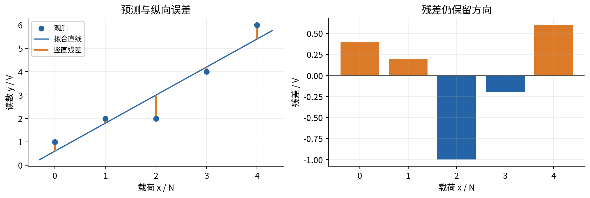
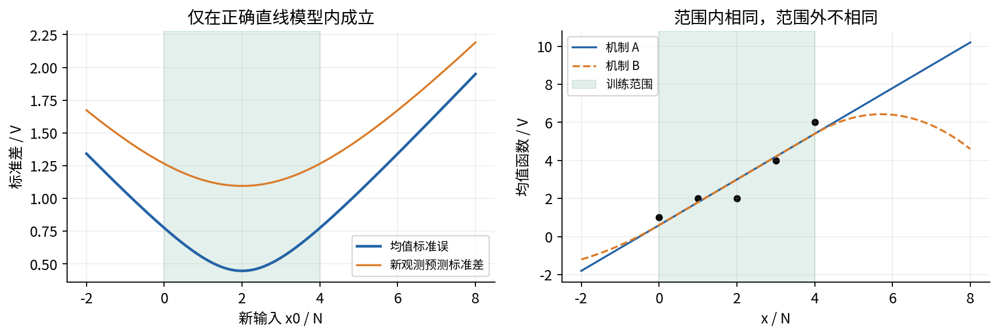

# 第028讲 实验指南

本实验把一条直线从纸笔答案变成可复核的数值结果。目标不是寻找某个库的最短调用，而是让数据、推导、程序与图彼此检查。完成时应保留一份顺序执行的 Notebook 和运行报告，说明最优参数、残差、退化输入、概率假设与外推风险。

全部数据为课程自建的确定性合成数据。五点标定例采用 N 和 V 的教学单位；曲线、远端点、完美直线和常数输入是有意设计的反例。它们不代表真实仪器性能，也不能证明任何实际任务上的效果。

## 1 准备环境与材料

本Notebook固定对应默认数据与配置，首格在任何打印或图之前核对两份输入原始字节。合法自定义实验请使用通用脚本，不能沿用默认图中的sigma和重复次数。先读 lecture.pdf 的第2至10节；概率实验另需第023讲。将本讲目录整体保留，确保 experiment.py、experiment.ipynb 和 data 子目录在同一层级。不要只下载 Notebook 而漏掉输入文件。

推荐在 Anaconda Prompt 或已初始化 conda 的终端中切换到本讲目录，执行：

```bash
conda env create -f environment.yml
conda activate ml-course-028
python experiment.py
jupyter lab
```

已有合适 Python 3.12 环境时，可安装 requirements.txt 中的依赖。基础数值实验不访问网络、不调用模型服务、不需要 GPU；首次安装依赖通常需要联网。报告默认写入 outputs/report.json，输出目录由程序创建。为了避免覆盖自己修改过的报告，可显式指定新文件：

```bash
python experiment.py --output outputs/my_report.json
```

路径解析基于脚本自身目录，默认输入不依赖终端当前所在目录。如果使用 --data 或 --config 指定相对路径，则它们按当前工作目录解释，这是普通命令行路径的规则。

实际制作验证使用 Python 3.12 和新进程中的真实 ipykernel InProcessKernel 顺序执行 Notebook，并保留输出。制作环境禁止普通内核的 socket 传输，因此未声称已验证浏览器 Jupyter 界面、外部进程内核传输或真实 Anaconda 安装。上面的 Anaconda/Jupyter 命令是供学习者执行的环境路径；遇到导入问题时先确认界面使用的内核属于这个环境。

## 2 先写出输入合同

查看 data/README.md 与 cases.csv。逐项确认：一行表示一个合成观测；case 表示教学场景；id 是全文件唯一的行标识；x 为输入 N，y 为输出 V。每个场景至少两行，不能混合不同场景再拟合一条直线。

五个场景分别为 hand、curved、influential、perfect、constant_x，共25行。influential 中前五行与 hand 数值相同，是另一个独立场景的复用，不是同一拟合里额外加权的重复。curved 的确定性生成机制已知，不能把其残差叫作采样噪声。

打开 model_spec.json，找出已知噪声标准差、随机种子、模拟次数、预测点和四条候选直线。focus_case 只控制候选比较关注哪个场景；程序仍验证全部数据并报告全部场景。不能认为“不被选择的一行就可以不检查”。

验收：在 Notebook 输出各场景行数，并口头说明 x、y、斜率、SSE 的单位。若把输入变量和输出变量交换，会得到另一个预测问题，通常不会得到原直线的简单反函数。

## 3 在运行前完成五点手算

暂时不要执行拟合函数。对 $(0,1),(1,2),(2,2),(3,4),(4,6)$ 填出 $u_i=x_i-\bar x$、$v_i=y_i-\bar y$、$u_i^2$ 和 $u_iv_i$。接着求 $a,b$、五个预测和五个残差。

需要先得到的精确检查点为：

$$
\bar x=2,\quad\bar y=3,\quad S_{xx}=10,\quad S_{xy}=12,\quad S_{yy}=16;
$$

$$
a=3/5,\quad b=6/5,\quad\mathrm{SSE}=8/5,\quad\mathrm{MSE}=8/25.
$$

逐行残差是 $2/5,1/5,-1,-1/5,3/5$。检查残差和为零，以及横坐标与残差乘积之和为零。仅比对两个参数不足以发现行顺序、预测公式或误差符号错误。

随后执行 Notebook 的 Fraction 单元。Fraction 在这里是独立核算工具，不是 fit_line 接受的外部输入类型。保留精确分数结果，再与浮点近似比较；不要为了得到漂亮的小数而提前四舍五入输入。

## 4 对照自写函数与库函数

运行 fit_line，并比较 NumPy 的最小二乘接口。库核验中设计矩阵的第一列全为1，第二列为 x；因此系数输出顺序是截距、斜率。

```python
A = np.column_stack([np.ones(len(x)), x])
coefficients, _, rank, _ = np.linalg.lstsq(A, y, rcond=None)
```

默认秩判断包含数值容差，不能把返回的 rank 当成一切极端尺度下的精确代数判定。这里的温和五点数据应返回 rank=2，参数与手算在 $10^{-12}$ 量级内一致。库返回的 residuals 数组在某些欠定或秩亏情形会为空，不等于实际 SSE 为零；本实验始终从逐行残差重新计算平方和。

本讲浮点接口的 0.6000000000000001 与数学上的 $3/5$ 不矛盾。核验应同时使用精确手算和有尺度意识的容差，而不是把浮点字符串完全相同当作数学真理。

## 5 画出残差并检查完整恒等式

第一幅图必须同时包含散点、拟合线和残差图。残差纵轴画出零线，不把绝对值当作残差。问自己：哪一行被低估，哪一行被高估？最优拟合是否仍能有明显误差？



接着选多个候选参数，而不只是最优参数，检查

$$
\mathrm{SSE}(a,b)-8/5
=5(a+2b-3)^2+10(b-6/5)^2.
$$

Notebook 会在一个二维候选网格上检查等式并绘出两条一维切片。等式说明全局最优；网格只是对实现的有限核验，不代替数学证明。把 SSE 全部除以5，检查四条候选直线的排序没有变化。

验收：说明为什么保持最优斜率但把截距改成0，SSE 增加 $9/5$。再说明为什么这个结果不支持“删去截距无害”。

## 6 用退化输入检查结论边界

对 constant_x 场景运行拟合。你会得到代表参数 $a=7/3,b=0$，同时 unique_parameters 为 false。画出斜率为 -1、0、2 的三条最优直线，让它们都经过 $(2,7/3)$。确认它们在训练横坐标处预测相同、其他位置不相同。

对 perfect 场景运行拟合，确认直线为 $1+2x$，最小 SSE 精确为零。未知正方差高斯模型的结果应是无有限最大似然解，variance_mle 为空，而不是把方差0包装为普通正态密度的合法估计。

区分三个情形：真实存储数据全相同；不同存储数据的变化量非常小；输入转换之前信息已经丢失。第一种是数学退化，第二种是数值难度，第三种无法从当前数组恢复。不要把它们统称为“零方差”。

## 7 概率解释与重复抽样

学过第023讲后，固定输入 $x=0,1,2,3,4$，采用 $Y=0.6+1.2x+\varepsilon$，其中各次噪声独立、$\varepsilon\sim\mathcal N(0,1)$。对候选参数计算负对数似然，检查任意两条直线的 NLL 差等于 SSE 差的一半。

再查看未知方差的剖面图。SSE 为 $8/5$ 时最优方差是 $8/25$；完美拟合时不断缩小正方差会不断提高似然。注意横轴对数刻度上的最左点依然大于0。

运行600次合成重复实验。理论斜率标准差为 $1/\sqrt{10}\approx0.3162$ V/N。样本标准差不应被要求恰好相等，也不以一次接近作为证明。固定随机种子只是重现同一组模拟，改变种子用于观察 Monte Carlo 波动；它不是处理数据泄漏或模型错误的方法。

验收：写出模拟里固定了什么、重新生成了什么、知道了什么机制。不得把模拟分布称为真实仪器数据支持的置信区间。

## 8 用三种失败例检查模型判断

第一种是弯曲机制。对 curved 拟合最佳直线 $3+x$，检查 SSE 为21，并观察残差 U 形。解释为何残差和为零、与 x 正交仍不足以接受直线均值假设。

第二种是远端影响。对 influential 比较含远端点和不含该点的斜率。应从 $6/5$ 变为 $-33/280$。检查远端点杠杆 $163/168$ 及残差 $-41/56$。记录敏感性，不自动删除它。

第三种是外推。对于训练范围 $[0,4]$，比较 $x=2.5$ 与 $x=6$。在假设始终正确的直线模型中，均值标准误分别约0.474和1.342 V；单个新观测还含额外噪声。随后看两个在训练范围内完全重合、范围外分离的机制，说明这些标准误没有包含模型失配。



## 9 变换单位与验证输入失败

将 $x'=60x+10$、$y'=1000y+100$ 代入，重新拟合。应得到 $a'=500,b'=20$，SSE 乘以 $10^6$。再将新预测换回原单位，与原预测比较。若出现不一致，优先检查平移项和截距，不要只检查斜率缩放。

随后在临时文件中进行破坏性测试，避免改掉原始教学数据：混入 bool；把最后一个预测点写成 false；把 JSON 的一个数写成 1e-400；重复一个 JSON 键；把不被 focus_case 选中的 CSV 最后一行改坏。每一种情况应明确报错，不能创建随机生成器后才发现，也不能覆盖此前已存在的报告。真正的零词元 0e-400 必须能接受。

Notebook 给出有限的可读演示；公开 verification.json 列出更完整的验证范围。所有输入门槛使用显式异常，故 -O 模式下仍有效。不要依靠 assert 保护数据或文件写入。

## 10 交付与验收

重新启动内核，清空旧输出，按顺序执行全部单元。检查没有红色报错、每个图都有轴名与单位、最终数值与手算一致，最后一格能列出完整报告的核心结果。脚本再从与本讲目录不同的当前目录执行一次，确认默认数据定位正常。

提交材料应含：完整 Notebook；一次报告；五点手算；两条正交约束；常数输入与完美拟合的解释；曲线和远端点的诊断；明确标注插值与外推的预测说明；一句不越界的关联陈述。只交一张好看的散点图或一个 R² 数字，不满足验收。

如果要把本讲方法用于新数据，先重新定义每行、单位、采集范围和预测时点，再说明哪些概率假设有证据、哪些尚未检查。本实验没有提供真实领域可直接复用的误差保证。
