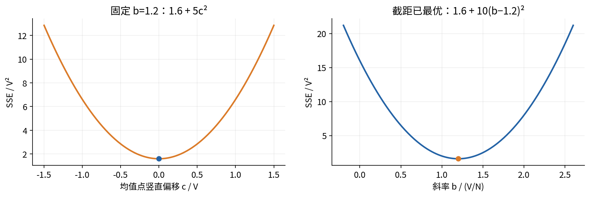
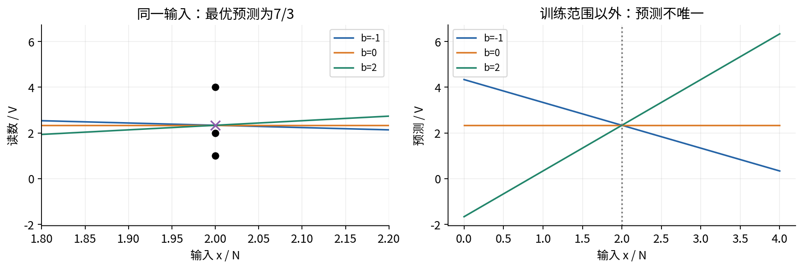
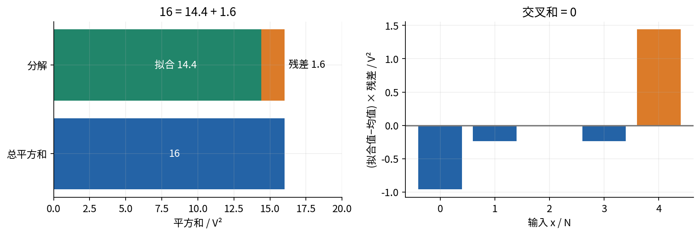
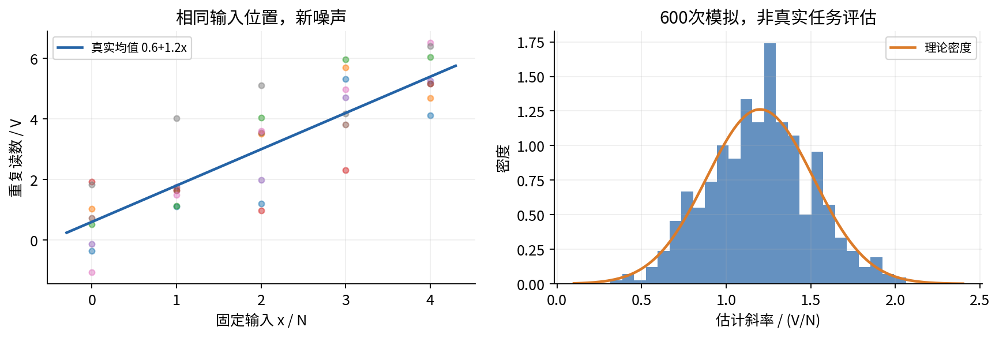
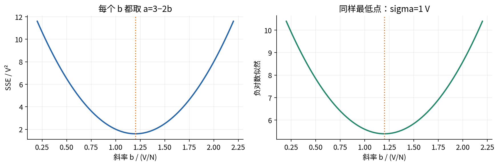
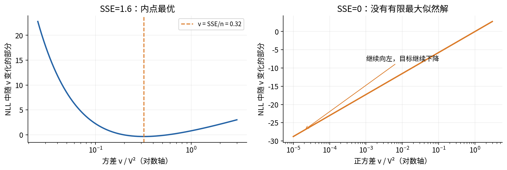
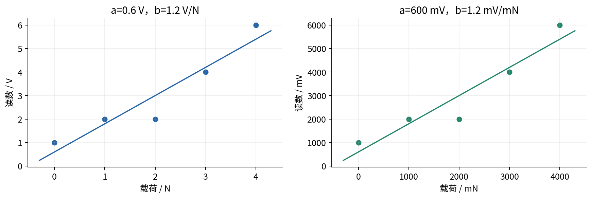
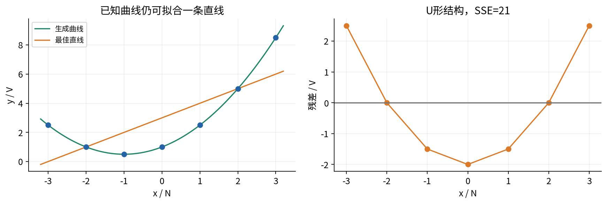
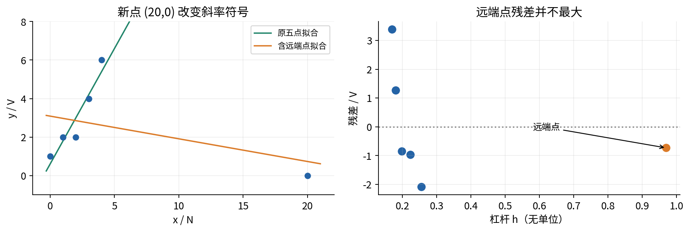
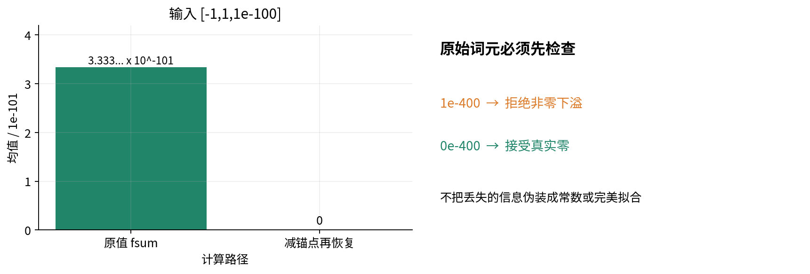

# 第028讲 一元线性回归的完整推导

给定一些横坐标和纵坐标，怎样选出一条直线，使它对这些点的预测尽量准确？本讲把这件事从头做完：先定义预测与误差，再只用代数证明全局最优解，随后用五个点手算核验。最后才加入概率模型，解释在什么条件下同一条直线也是最大似然估计，并检查图、单位与外推能暴露哪些错误。

本讲的结论是有条件的。对有限的实数数据、包含截距的直线和未加权平方误差，只要横坐标不全相同，最优斜率等于中心化交叉和除以中心化平方和，截距让直线通过样本均值点。这是一个确定性的优化结论，不需要正态噪声，也不意味着这条直线能预测任何新环境，更不意味着横坐标的改变会导致纵坐标改变。

## 1 学习路线与先修

直接先修为第008讲函数代数与数学表达、第013讲导数与梯度。主推导只使用求和、展开、配平方和非负性；导数提供第二条交叉检查路线，不作为第一条路线的捷径。学过第023讲最大似然后，再读第11至13节的概率解释。第009讲的内积概念有助于理解正交，但这里会把所需等式直接写出。

建议按三个问题阅读。第一，什么量被最小化，参数的取值范围是什么？第二，为什么写出的参数确实是全局唯一最优，而非仅使某个导数为零？第三，数学上成功拟合之后，什么仍然不知道？能完整回答这些问题，才算掌握一元线性回归，而非只记住两个公式。

读完后应能独立完成五件事：从平方和推出截距和斜率；准确说明常数横坐标的例外；手算残差与平方和；把高斯似然的假设逐项写清；在残差图和预测说明中明确单位、训练范围与因果边界。独立实验在 lab.pdf，练习的全部推导在 answers.pdf。

## 2 一行数据与一个预测规则

令数据为有索引的样本对 $(x_i,y_i)$，其中 $i=1,\ldots,n$，$n\geq1$。本讲先把所有观测值看成已经给定的有限实数。重复横坐标允许存在；重复记录是否该保留则是数据生成问题，不能靠本讲的公式决定。

用带截距的规则预测纵坐标：

$$
\widehat y_i=f_{a,b}(x_i)=a+b x_i,\qquad (a,b)\in\mathbb R^2.
$$

$a$ 是截距，$b$ 是斜率。带帽的 $\widehat y_i$ 表示预测值，不是第二次观测。这里的“线性”通常指对参数线性；作为从 $x$ 到 $y$ 的映射，$a\ne0$ 时严格说是仿射函数。本讲只研究一个原始解释变量的一条直线，不将多项式、多特征或非线性参数模型混在一起。[NIST 对线性最小二乘的定义](https://www.itl.nist.gov/div898/handbook/pmd/section1/pmd141.htm)也强调参数线性这一含义。

为了让单位始终可见，把后面的五个点想象成完全合成的传感器标定示例：$x$ 为施加的载荷，单位 N；$y$ 为读数，单位 V。它们不来自真实仪器，也没有计量认证含义。如果 $x$ 用 N，$y$ 用 V，那么 $a$ 的单位为 V，$b$ 的单位为 V/N，乘积 $b x$ 才能与 $a$ 相加。截距描述 $x=0$ 的拟合读数；若 0 不在观测范围内，截距的物理解释本身也是外推。

| 符号 | 含义 | 单位 |
|---|---|---|
| $x_i,\bar x$ | 输入与输入均值 | N |
| $y_i,\bar y,\widehat y_i$ | 观测、均值、预测 | V |
| $e_i$ | 观测减预测的残差 | V |
| $S_{xx}$ | 输入的中心化平方和 | N² |
| $S_{xy}$ | 输入与输出的中心化交叉和 | N·V |
| $S_{yy}$ | 输出的中心化平方和 | V² |
| $\mathrm{SSE},\mathrm{MSE}$ | 残差平方和、均方误差 | V² |

## 3 为什么使用竖直残差与平方和

任意候选直线的残差定义为

$$
e_i(a,b)=y_i-a-bx_i.
$$

正残差表示观测在直线上方，负残差表示在下方。残差不是点到直线的垂直几何距离，而是固定输入处的纵向差。这样定义，对应“输入已知，用它预测输出”的任务。若横坐标也有不可忽略的测量误差，纵向平方损失可能不符合科学问题，需要另建误差变量模型。

把残差直接相加会让正负抵消，甚至让很差的直线看起来很好。因此定义残差平方和和均方误差：

$$
\mathrm{SSE}(a,b)=\sum_{i=1}^n e_i(a,b)^2,\qquad
\mathrm{MSE}(a,b)=\frac{1}{n}\mathrm{SSE}(a,b).
$$

平方既去掉符号，又对大残差施加更大代价：残差扩大到两倍，其平方扩大到四倍。这是一项损失选择，不是自然界强制规定的唯一标准。绝对误差、加权平方误差有各自用途，但一般不会给出本讲同一套闭式解。

因为 $n>0$ 且对所有候选参数相同，比较两条直线的 SSE 与比较它们的 MSE 得到完全相同的大小关系。因此二者最小化解相同；使用 $\mathrm{SSE}/(2n)$ 也一样。常数因子会影响梯度的数值和某些迭代步长，却不会改变这里的最优位置。这个结论不能推广为“随便给每一行乘不同权重也不改变结果”。

## 4 把数据围绕均值重新表达

定义均值以及中心化变量：

$$
\bar x=\frac{1}{n}\sum_i x_i,\quad
\bar y=\frac{1}{n}\sum_i y_i,\quad
u_i=x_i-\bar x,\quad v_i=y_i-\bar y.
$$

从均值的定义直接得到 $\sum_i u_i=0$ 与 $\sum_i v_i=0$。再定义三个不除以 $n$ 的和：

$$
S_{xx}=\sum_i u_i^2,\qquad S_{xy}=\sum_i u_i v_i,\qquad S_{yy}=\sum_i v_i^2.
$$

这些量不是新的观测，而是把所有数据压缩成对拟合有用的几个数。$S_{xx}\geq0$，并且等于零当且仅当所有 $x_i$ 相同。$S_{xy}$ 可以为正、为负或为零；它记录两个中心化变量是否趋向同号。若用相同分母定义样本协方差与样本方差，它们的比值仍为 $S_{xy}/S_{xx}$，但本讲直接使用和，避免在 $n=1$ 时误用 $n-1$。

为了把截距与斜率分开，引入

$$
c=a+b\bar x-\bar y.
$$

$c$ 是候选直线在 $x=\bar x$ 处相对 $\bar y$ 的竖直偏移。由 $x_i=\bar x+u_i$ 与 $y_i=\bar y+v_i$，残差可重写为 $v_i-bu_i-c$。这个改写没有近似，也没有新增分布假设。

## 5 先消去截距

展开平方，并明确交叉项为什么消失：

$$
\begin{aligned}
\mathrm{SSE}(a,b)
&=\sum_i(v_i-bu_i-c)^2\\
&=\sum_i(v_i-bu_i)^2
   -2c\sum_i(v_i-bu_i)+nc^2\\
&=\sum_i(v_i-bu_i)^2+nc^2.
\end{aligned}
$$

最后一步使用 $\sum_i v_i-b\sum_i u_i=0$。此时把 $b$ 固定，第一项不随 $a$ 变化；第二项非负且仅在 $c=0$ 时达到零。由于 $n>0$，对应的截距唯一：

$$
a(b)=\bar y-b\bar x.
$$

因此，对于每一个斜率，最好的截距都会让直线经过 $(\bar x,\bar y)$。这不是画图经验，而是非负平方项给出的证明。也不能倒过来说“所有经过均值点的直线都同样好”：它们只是各自斜率下的最佳竖直位置，斜率还要继续优化。

## 6 再对斜率配平方

把最佳截距代回去，目标只剩一个未知量：

$$
Q(b)=\sum_i(v_i-bu_i)^2
=S_{yy}-2bS_{xy}+b^2S_{xx}.
$$

先处理 $S_{xx}>0$。提取二次项系数，再配平方：

$$
\begin{aligned}
Q(b)
&=S_{xx}\left(b^2-2b\frac{S_{xy}}{S_{xx}}\right)+S_{yy}\\
&=S_{xx}\left(b-\frac{S_{xy}}{S_{xx}}\right)^2
  +S_{yy}-\frac{S_{xy}^2}{S_{xx}}.
\end{aligned}
$$

第一项非负，且因为系数严格为正，仅在括号为零时取最小。于是

$$
b^*=\frac{S_{xy}}{S_{xx}},\qquad a^*=\bar y-b^*\bar x.
$$

把两次配平方合并，得到对任意实数 $a,b$ 成立的全局恒等式：
$$
\mathrm{SSE}(a,b)=\mathrm{SSE}_{\min}
+n(a+b\bar x-\bar y)^2+S_{xx}(b-b^*)^2,
$$

$$
\mathrm{SSE}_{\min}=S_{yy}-\frac{S_{xy}^2}{S_{xx}}.
$$

这条恒等式同时证明三件事：候选解能达到最小值；不存在更低的局部盆地；在 $S_{xx}>0$ 时，两个新增平方项必须同时为零，因此参数唯一。最小值非负也随之成立，因为它等于真实残差的平方和。实践中直接用最后一个差值计算最小 SSE 可能出现消减误差，代码会从残差重新平方求和。

“完整推导”的重要部分就在这几个量词：对所有候选参数成立；输入不全相同时唯一；输入全相同的情况必须另行讨论。只写“令导数为零，得公式”并没有交代这些条件。

## 7 横坐标全相同与无截距模型

若每个 $x_i=c_0$，则 $S_{xx}=0$ 且 $S_{xy}=0$。此时所有预测都等于同一个数 $t=a+bc_0$。目标变成

$$
\sum_i(y_i-t)^2=S_{yy}+n(t-\bar y)^2.
$$

因此全部最优参数为

$$
\{(a,b):a+bc_0=\bar y\}.
$$

训练点上的最优预测是唯一的 $\bar y$，参数却不唯一。不能把 $0/0$ 设为零并声称得到唯一斜率。程序返回 $b=0,a=\bar y$ 只是一种明确标注的代表，并设置 unique_parameters 为 false。若新输入不等于 $c_0$，这族直线会给出不同预测，数据无法选择哪条才正确。

另一个不同问题是主动去掉截距、强制预测为 $bx$。展开目标可得，当 $\sum_i x_i^2>0$ 时，最优斜率为 $\sum_i x_i y_i/\sum_i x_i^2$。这里没有中心化，也不保证残差和为零。它只有在科学问题确实要求经过原点时才合理，不能因为“少一个参数更简单”就悄悄改掉本讲的模型。

## 8 用导数复核而不代替证明

第013讲提供另一条检查路线。对 SSE 分别求偏导：

$$
\frac{\partial\mathrm{SSE}}{\partial a}=-2\sum_i(y_i-a-bx_i),\qquad
\frac{\partial\mathrm{SSE}}{\partial b}=-2\sum_i x_i(y_i-a-bx_i).
$$

驻点满足两条正规方程：

$$
na+b\sum_i x_i=\sum_i y_i,\qquad
a\sum_i x_i+b\sum_i x_i^2=\sum_i x_i y_i.
$$

第一式给出 $a=\bar y-b\bar x$，代入第二式便得到 $bS_{xx}=S_{xy}$。这与代数路线一致。对任意参数扰动 $(\Delta a,\Delta b)$，二次项为 $\sum_i(\Delta a+\Delta b x_i)^2$；当至少两个不同横坐标存在时，只有零扰动才能使其为零。因此曲面严格凸。没有这个设计条件，凸性仍在，严格性却消失。

导数也给出两个核验信号：拟合残差满足 $\sum_i e_i^*=0$ 与 $\sum_i x_i e_i^*=0$。计算机结果通常只在浮点容差内满足，而不是每位小数恰好为零。接下来用有理数手算，先建立无需容差的答案。

## 9 五个点的完整手算

数据为 $(0,1),(1,2),(2,2),(3,4),(4,6)$。先计算 $\sum_i x_i=10$、$\sum_i y_i=15$，所以 $\bar x=2$ N，$\bar y=3$ V。

| $i$ | $x_i$ | $y_i$ | $u_i$ | $v_i$ | $u_i^2$ | $u_i v_i$ |
|---|---|---|---|---|---|---|
| 1 | 0 | 1 | -2 | -2 | 4 | 4 |
| 2 | 1 | 2 | -1 | -1 | 1 | 1 |
| 3 | 2 | 2 | 0 | -1 | 0 | 0 |
| 4 | 3 | 4 | 1 | 1 | 1 | 1 |
| 5 | 4 | 6 | 2 | 3 | 4 | 6 |
| 和 | 10 | 15 | 0 | 0 | 10 | 12 |

因此 $S_{xx}=10$ N²，$S_{xy}=12$ N·V，$S_{yy}=4+1+1+1+9=16$ V²。最优参数为

$$
b^*=\frac65\ \mathrm{V/N},\qquad
a^*=3-\frac65\cdot2=\frac35\ \mathrm V.
$$

不要在这一步就停下。逐行代入，计算预测与残差，才能检查公式、索引和符号是否一起正确。

| $x_i$ | $y_i$ | $\widehat y_i=(3+6x_i)/5$ | $e_i^*=y_i-\widehat y_i$ | $(e_i^*)^2$ |
|---|---|---|---|---|
| 0 | 1 | $3/5$ | $2/5$ | $4/25$ |
| 1 | 2 | $9/5$ | $1/5$ | $1/25$ |
| 2 | 2 | $15/5$ | $-1$ | $1$ |
| 3 | 4 | $21/5$ | $-1/5$ | $1/25$ |
| 4 | 6 | $27/5$ | $3/5$ | $9/25$ |

平方和为 $40/25=8/5$ V²，MSE 为 $8/25$ V²。两条约束也能手算：残差和为 $(2+1-5-1+3)/5=0$；$\sum_i x_i e_i^*=(0+1-10-3+12)/5=0$。最小值公式给出 $16-144/10=8/5$，是第三条独立核验。

候选直线 $1+x$ 的 SSE 为 2，比最优直线多 $2/5$；常数预测 $3$ 的 SSE 为 16；保持最优斜率但把截距改成 0，SSE 为 $17/5$。最后一个差值为 $9/5=5(3/5)^2$，正好是截距偏移项。这个例子同时检查了截距、斜率和平方和的缩放。

## 10 残差正交与平方和分解

最优残差可写为 $e_i^*=v_i-b^*u_i$。利用中心化和斜率定义：

$$
\sum_i e_i^*=0,\qquad
\sum_i u_i e_i^*=S_{xy}-b^*S_{xx}=0.
$$

“正交”在这里就是两个数列的逐项乘积之和为零。它不意味着每一个乘积都为零，也不意味着残差与输入统计独立。由 $x_i=u_i+\bar x$，还可推出 $\sum_i x_i e_i^*=0$。

将 $y_i-\bar y=(\widehat y_i-\bar y)+e_i^*$ 平方后求和，中间项消失，因为 $\widehat y_i-\bar y=b^*u_i$。于是

$$
S_{yy}=\sum_i(\widehat y_i-\bar y)^2+\sum_i(e_i^*)^2
=(b^*)^2S_{xx}+\mathrm{SSE}_{\min}.
$$

在手算例中，这正是 $16=72/5+8/5$。三项都用 V² 计量，因此可以相加。图4显示总变动被分成拟合部分与残差部分；它是带截距的训练集代数分解，不是因果机制的分解。

若 $S_{yy}>0$，训练集 $R^2=1-\mathrm{SSE}_{\min}/S_{yy}$，本例为 0.9。若所有 $y_i$ 相同，分母为零，这个定义不成立；软件有时采用约定值，必须披露。高 $R^2$ 不保证残差没有结构，不保证测试集误差小，也不表示“90% 的变化由载荷因果造成”。去掉截距后，上面的中心化分解一般不再成立。

## 11 从固定数据走向概率模型

到这里为止，我们没有假定数据如何产生。现在把已设置的横坐标 $x_1,\ldots,x_n$ 视为固定设计，假定重新做实验时输出变化：

$$
Y_i=a_0+b_0x_i+\varepsilon_i,\qquad
\varepsilon_i\overset{\mathrm{iid}}\sim\mathcal N(0,\sigma^2),\quad \sigma>0.
$$

$a_0,b_0$ 是假定存在的真实机制参数；$a^*,b^*$ 是从这次观测计算出来的估计值。噪声 $\varepsilon_i=Y_i-a_0-b_0x_i$ 无法直接观测，因为真实参数未知。残差用估计参数计算，因此不能直接当成一组独立噪声：残差和被约束为零，残差之间一般相关。

这个模型包含四件不同的事。均值函数确为直线；每个噪声条件均值为零；噪声相互独立；噪声共享同一个正方差且呈正态分布。最小二乘的代数解不需要这些假设，后面的高斯似然解释却需要明确说明它们。若每个样本有不同已知方差，似然通常对应加权平方误差；若误差有关联，则二次型中会出现协方差结构。

如果横坐标本身来自随机抽样，也可以建立条件模型 $Y_i\mid X_i=x_i\sim\mathcal N(a_0+b_0x_i,\sigma^2)$，并在观测到的输入上计算条件似然。此时必须说明样本对的独立性及 $E(\varepsilon_i\mid X_i)=0$ 等条件，而不能只说“误差总体平均为零”。条件均值要求比无条件均值强。带截距的 OLS 在样本里强制残差和为零，也不能验证这个生成假设。

## 12 已知正方差时的最大似然

设已经观测到 $y_1,\ldots,y_n$，并暂时把正的 $\sigma$ 当作已知。每个观测的条件密度为

$$
p(y_i\mid x_i,a,b,\sigma)=\frac{1}{\sqrt{2\pi}\sigma}
\exp\left[-\frac{(y_i-a-bx_i)^2}{2\sigma^2}\right].
$$

这里 $\sigma$ 是标准差、单位为 V，$\sigma^2$ 是方差、单位为 V²；归一化因子不能把这两者混淆。指数中的比值没有单位。连续变量在某个精确点的概率为零，似然使用的是密度在观测处的值，不是“这些精确读数出现的概率”。密度以及它的数值会随单位约定改变，但在固定单位下参数的比较有意义。

独立性允许将条件密度相乘。取自然对数：

$$
\begin{aligned}
L(a,b;\sigma)&=(2\pi\sigma^2)^{-n/2}
\exp\left[-\frac{\mathrm{SSE}(a,b)}{2\sigma^2}\right],\\
\ell(a,b;\sigma)&=-\frac n2\log(2\pi)-n\log\sigma
-\frac{\mathrm{SSE}(a,b)}{2\sigma^2}.
\end{aligned}
$$

前两项对 $a,b$ 是常数，最后一项的系数严格为负。因此最大化对数似然，与最小化 SSE 完全等价。当 $S_{xx}>0$ 时，两者拥有同一个唯一参数解。这个推理是“假定同方差独立高斯模型，推出最小二乘”，不是“我做了最小二乘，所以数据一定高斯”。[Stanford CS229 的原始课程讲义](https://cs229.stanford.edu/notes_archive/cs229-notes1.pdf)提供了高斯误差与平方损失联系的课程来源；这里的标量推导独立展开。

## 13 未知方差与完美拟合的边界

若 $\sigma^2$ 也未知，令 $v=\sigma^2>0$。对固定 $v$，最优直线依然最小化 SSE。记最小 SSE 为 $R$，负对数似然中随 $v$ 变化的部分为

$$
g(v)=\frac n2\log v+\frac{R}{2v}.
$$

当 $R>0$ 时，$g'(v)=(nv-R)/(2v^2)$，在 $v<R/n$ 时为负，在 $v>R/n$ 时为正；因此存在全局最小值 $\widehat v_{\mathrm{MLE}}=R/n$。也可不用导数：令 $t=v/(R/n)>0$，则目标差为 $\frac n2(\log t+1/t-1)$，它仅在 $t=1$ 时为零，其余为正。

手算数据给出方差 MLE 为 $8/25$ V²。不要把它与经典无偏残差方差估计 $R/(n-2)$ 混为一谈。后者在设计满秩、同方差零均值独立误差、$n>2$ 等条件下估计噪声方差，本例为 $8/15$ V²；它使用自由度修正，优化的不是同一个似然准则。[MIT 的高斯线性模型课程讲义](https://ocw.mit.edu/courses/18-655-mathematical-statistics-spring-2016/b36cbb44af02cddb9dc42d92b767c462_MIT18_655S16_LecNote19.pdf)可用于进一步连接一般线性模型、估计量分布和残差自由度。

关键例外是 $R=0$。此时沿任意完美拟合直线，$L\propto\sigma^{-n}$，当 $\sigma\downarrow0$ 时无界增大。在参数空间 $\sigma>0$ 内没有有限的最大似然解；不能把 $\widehat\sigma^2=0$ 当作这个正方差正态密度族内部合法的 MLE。若允许退化点质量分布，那已改变了模型和密度参考测度。

本讲代码额外检查所存二进制数值是否精确共线，以免把四舍五入得到的零 SSE 当作数学证据。对于精确共线的数据，variance_mle 留为空并给出边界状态。拟合参数和计算残差仍为浮点近似，数值 SSE 可能留下舍入痕迹；精确共线证书说明的是这些已存数值的数学最小 SSE，不是原始测量毫无噪声。

## 14 改单位时哪些数应当改变

设输入输出重新表达为 $x'=p x+q$、$y'=r y+s$，其中 $p\ne0,r\ne0$。把 $x=(x'-q)/p$ 代入拟合规则，可得

$$
y'=\left(r a+s-\frac{rbq}{p}\right)+\frac{rb}{p}x'.
$$

因此 $b'=rb/p$，$a'=ra+s-rbq/p$。中心化输入满足 $u_i'=pu_i$，输出满足 $v_i'=rv_i$；所以 $S_{xx}'=p^2S_{xx}$、$S_{xy}'=prS_{xy}$，与同一结论一致。残差变成 $e_i'=re_i$，SSE 和 MSE 乘以 $r^2$。对于非恒定输出，$R^2$ 不变。单独平移输入会改变截距，不会改变预测对应关系。

例如把 N 改成 mN，取 $p=1000,q=0$，斜率从 1.2 V/N 变为 0.0012 V/mN。把 V 改成 mV，取 $r=1000$，截距变为 600 mV，SSE 变为 $1.6\times10^6$ mV²。原始数值突然变大并不表示拟合变差，比较误差必须先统一单位。

这些是仿射变换的结论。把输出取对数、裁剪负值或标准化时使用不同训练范围，都可能改变误差含义；不应把所有预处理都叫作“只换单位”。尤其先拟合对数输出再指数还原，并不自动给出原输出尺度的条件均值。

## 15 残差图必须回答模型是否遗漏结构

闭式解保证你找到指定目标的最小值，却不保证目标背后的模型足够好。考虑另一个完全合成的数据集：$x=-3,-2,\ldots,3$，$y=1+x+x^2/2$。它没有随机噪声，生成规则故意弯曲。因为横坐标对称，$\bar x=0$；输出均值为 3，$S_{xx}=28$、$S_{xy}=28$，所以最佳直线为 $3+x$。

残差依次为 $2.5,0,-1.5,-2,-1.5,0,2.5$。它们和为零，与横坐标的内积也为零，但图9中的 U 形非常明显。训练 SSE 为 21。两个正交条件只是拟合算法完成其工作后的约束，并不能排除二次结构。若只打印最优参数和一项损失，就会错过这个可修正的模型缺陷。

实际分析至少应结合原始散点图、残差对输入或预测值的图、按采集顺序排列的残差图。弯曲形状提示均值函数可能不足；张开的扇形提示条件变异可能不同；时间段整片偏移提示漂移或遗漏批次因素。这些是调查线索，不是仅凭图就确认的原因。五个点的图也无力证明正态或独立。[NIST 的模型核验章节](https://www.itl.nist.gov/div898/handbook/pmd/section4/pmd44.htm)明确强调，单个拟合优度数值不能替代残差诊断。

发现结构后，应返回任务和采样过程，提出可验证的修订，再用未参与选择的数据检查。不能在测试集上轮流加项、删点，直到图看起来漂亮，再报告它为独立验证。

## 16 高杠杆点与影响不能只看残差大小

向五点数据增加一行 $(20,0)$，横坐标远离原来的 $[0,4]$。重新计算得到

$$
a^*=\frac{173}{56}\approx3.08929,\qquad
b^*=-\frac{33}{280}\approx-0.117857.
$$

仅增加这一行，斜率从正变负。新点的残差为 $-41/56\approx-0.732$，反而不如 $x=4$ 那个点的残差 $947/280\approx3.382$ 大。原因是这条直线已经为远端点作了很大转动。不能只检查“拟合以后谁的残差最大”，就认定谁最影响参数。

固定输入时，把 $y_j$ 改变 $\Delta$，由 $S_{xy}=\sum_i(x_i-\bar x)y_i$ 可直接得到

$$
\Delta b^*=\frac{x_j-\bar x}{S_{xx}}\Delta.
$$

拟合值在同一个点的改变量为 $h_j\Delta$，其中

$$
h_j=\frac1n+\frac{(x_j-\bar x)^2}{S_{xx}}.
$$

$h_j$ 是此模型的杠杆值，度量该点输出改变时自身拟合值的敏感性，完全由输入布局决定。在满秩带截距模型中 $\sum_j h_j=2$。新增远端点的杠杆值为 $163/168\approx0.9702$。杠杆高表示有影响的潜力；如果它恰好延续原来直线，删除它未必显著改变参数。[NIST 的杠杆说明](https://www.itl.nist.gov/div898/software/dataplot/refman1/auxillar/partleve.htm)也区分了高杠杆与实际影响。

合理处理是检查录入、仪器范围、单位和样本来源，并把包含与不包含该点的敏感性分析明确报告。若它是真实且属于目标总体的一部分，机械删掉它可能使模型更偏。若它来自另一机制，则问题可能是分组或模型设定，而不是“异常点太讨厌”。

## 17 外推误差有两种来源

本例观测范围是 $[0,4]$ N。输入 2.5 N 的拟合读数为 3.6 V，是插值；输入 6 N 的预测为 7.8 V，是外推。代数公式对这两个数都能运算，但数据对二者的支持不同。

在固定设计、正确直线均值、独立同方差噪声的模型下，令 $d=x_0-\bar x$，预测均值可以写成观测的加权和：

$$
\widehat\mu(x_0)=\sum_i w_i(x_0)Y_i,\qquad
w_i(x_0)=\frac1n+\frac{d(x_i-\bar x)}{S_{xx}}.
$$

权重和为1。利用 $\sum_i(x_i-\bar x)=0$ 展开平方可得 $\sum_i w_i^2=1/n+d^2/S_{xx}$，所以

$$
\operatorname{Var}(\widehat\mu(x_0)\mid x)
=\sigma^2\left(\frac1n+\frac{(x_0-\bar x)^2}{S_{xx}}\right).
$$

如果预测的是独立的新观测，还需加上新噪声的方差 $\sigma^2$。这区分了均值估计不确定性与单次观测的预测不确定性。已知 $\sigma=1$ V 时，本例在 $x_0=2.5$ 的均值标准误约0.474 V，在 $x_0=6$ 约1.342 V。它们来自明确假设，不是对未知真实世界给出的保证。

第二类风险是模型失配：仪器可能饱和、响应可能转弯、群体可能变换。图11人为构造两个函数，在 $[0,4]$ 内完全相同、在范围外不同；任何只观察这一区间的数据都无法区分它们。上面的方差公式不包含这种未建模的偏差。外推报告必须同时说明距离训练范围多远、为何有科学理由延伸、需要什么新数据验证，而不能只附上一条看似精确的误差带。

## 18 相关斜率不等于干预效果

即使拟合很精确，斜率也只是当前数据与模型下的关联描述。一个简单反例是隐藏因素 $Z$ 同时影响观测输入和输出：自然状态下 $X=Z$、$Y=2Z$。观察数据会落在 $Y=2X$ 上，OLS 斜率为2。若实验者单独改变记录中的 $X$，而生成 $Y$ 的机制仍只依赖 $Z$，那么改变 $X$ 不会让 $Y$ 跟着改变。这两个问题需要不同的信息。

真实传感器标定中，输入可能确实由实验者控制；但能否把结果解释为因果效应，还要依赖操纵方式、混杂控制、测量过程和目标范围。回归计算本身不能补齐这些设计事实。做预测时也不能忽视它们：如果训练中输入只是某个隐藏因素的替代指标，环境变化后这种关联可能消失。

因此合格的表述是“在这批合成数据上，每增加1 N，拟合读数增加1.2 V；该结论描述拟合关系”。不合格的表述是“增加1 N 必然导致增加1.2 V，因此可无条件改变实际系统”。本讲没有真实干预数据，不能对任何实际仪器或人群作这样的承诺。

## 19 让计算忠实于推导

代码先验证原始标量，再转换为二进制浮点。布尔值、文本、复数、非有限值、对象数组、扩展浮点和外部 Fraction 或 Decimal 不会被偷偷当成普通实数接受。这样做不是否定高精度类型，而是避免超出此教学实现的数值承诺。CSV/JSON 的十进制数字在转换前检查原始词元；例如非零的 1e-400 不能先变成浮点零再混入数据。

均值使用原始数值的 math.fsum 求和。为什么不一律先减第一个数作为锚点？对于 $[-1,1,10^{-100}]$，原始和保留 $10^{-100}$，均值约为 $3.333\times10^{-101}$；若先减去 -1，极小项可能在加1时丢失，最终错误得到零。可靠的程序应保留这个小均值，同时承认浮点数仍会舍入。

本讲的小型实现把实际存储的二进制值临时转成精确有理数，核对其真实均值与原值fsum均值之间的舍入余项，并由真实均值求中心化偏差，再转回浮点。输出均值仍保留原值fsum结果，余项单独报告。中心化偏差贯穿参数、残差、解释平方和、杠杆、查询标准误与模拟；只修正平方和，却继续使用未修正偏差，会使相邻浮点输入的杠杆严重失真。平方和及交叉和另作小的残余求和修正，仍不保证任意尺度都能高精度计算。

实现保守限制每个外部数值绝对值不超过 $10^6$，非零绝对值至少 $10^{-100}$；每组1至2000行；拟合系数绝对值不超过 $10^{12}$。中间非零乘积、平方、非恒定离差和以及 MSE 不能静默成为零或次正规数。超出范围会报错，不会自动把问题当作常数或完美拟合。已经在外部转换时丢失的精度无法从现有数组反推恢复。

可靠性也包括文件行为。程序检查配置的所有字段和数据文件的所有行，包括未被 focus_case 选中的数据，再创建局部随机生成器；报告完整生成且能序列化后，才原子替换输出文件。畸形的最后一行不能破坏已有报告。输入验证不用 assert，所以 Python 的 -O 模式不会关闭这些检查。README 给出确切的运行环境、测试方式及实际验证限制。

## 20 从拟合结果到可检查的结论

完成一次分析应保留数据定义和单位、模型与损失、设计是否满秩、估计参数、逐行预测与残差、至少一种残差诊断、训练范围、概率假设和边界状态。本讲输出 report.json 将这些数值拆开保存，Notebook 则按手算、恒等式、图、失败例的顺序逐格核验。

拟合结果可以精确回答“在这份数据和这项损失下，哪条直线最好”。对“下一次会怎样”，需要数据生成与泛化检查；对“主动改变输入会怎样”，还需要因果设计；对“远离训练范围会怎样”，需要机制依据或新观测。把这几类问题分开，才能既信任闭式解提供的确定性，又不让它替没有证据的结论背书。

本讲的核心等式值得最终再从头默写一遍：先中心化，消去截距偏移，再对斜率配平方，最后将剩余误差写成残差平方和。记住公式当然有用，但更重要的是能说明每一步为什么成立、在哪种输入下失效，以及程序怎样告诉你它无法可靠完成计算。

## 21 自检题

1. 从 $e_i=v_i-bu_i-c$ 开始，不用导数写出两次配平方；标出每个严格正系数需要的条件。
2. 重算五点数据的参数、逐行残差、SSE、MSE，以及任意候选 $a=0,b=6/5$ 比最优解多出的损失。
3. 设所有输入为2，输出为1、2、4。写出全部最优参数，并说明在 $x=3$ 时为什么无法得到唯一预测。
4. 对五点数据强制截距为零，求新最优斜率，并检查残差和是否仍为零。
5. 写出 $S_{yy}=\mathrm{SSR}+\mathrm{SSE}$ 的交叉项及其消失原因。所有输出相同时，$R^2$ 的普通公式为何失效？
6. 给定独立同方差正态噪声，推导已知方差的似然与未知方差的 MLE，分别处理最小 SSE 正和为零的情况。
7. 若 $x'=60x+10,y'=1000y+100$，求本例新参数及 SSE，解释所有变化的单位意义。
8. 手算二次机制的残差，解释为什么残差正交不能排除曲线结构。
9. 增加 $(20,0)$ 后核验新参数及远端点杠杆。为何不能凭残差绝对值直接决定删掉谁？
10. 推导 $w_i(x_0)$ 与预测均值方差，并指出它没有计入的外推风险。
11. 给出一个完全线性的观测关系却没有对应干预效果的生成机制。
12. 设计能发现布尔值混入、末行极小非零词元、锚点均值丢失和完美拟合边界误报的程序测试。

## 22 一手来源与阅读边界

以下来源用于交叉核查；正文、数据和图独立撰写，条件与边界以本讲推导为准。NIST：[线性最小二乘](https://www.itl.nist.gov/div898/handbook/pmd/section1/pmd141.htm)、[残差诊断](https://www.itl.nist.gov/div898/handbook/pmd/section4/pmd44.htm)、[杠杆与影响](https://www.itl.nist.gov/div898/software/dataplot/refman1/auxillar/partleve.htm)。概率解释：[Stanford CS229讲义](https://cs229.stanford.edu/notes_archive/cs229-notes1.pdf)、[MIT18.655高斯线性模型](https://ocw.mit.edu/courses/18-655-mathematical-statistics-spring-2016/b36cbb44af02cddb9dc42d92b767c462_MIT18_655S16_LecNote19.pdf)。计算接口：[math.fsum](https://docs.python.org/3/library/math.html#math.fsum)、[JSON解码](https://docs.python.org/3/library/json.html#json.load)、[Fraction存储值](https://docs.python.org/3.12/library/fractions.html)、[NumPy lstsq](https://numpy.org/doc/stable/reference/generated/numpy.linalg.lstsq.html)。实际核查记录见source-checks.json。
