# 第二十九讲 多元线性回归与数值求解

## 1. 多放一列特征，问题发生了什么变化

上一讲从平方误差推出一条直线。现在同一条观察有两个或更多特征，我们希望它们共同预测一个数值响应。表面上只是把斜率变成多个系数，真正新增的问题却是：列与列可能重复，一点微小扰动可能大幅改变某些系数，而训练预测几乎不变。

本讲的核心问题是：多个特征怎样共同解释响应，系数何时不稳定？我们把设计矩阵、梯度、正规方程、QR与SVD接成同一条计算链，同时区分数学解、浮点数值解和对新数据的预测。求解器返回数组不意味着系数具有唯一含义；训练残差很小也不意味着因果关系或外推可靠。

直接先修是第十一、十二、十四和二十八讲：线性方程与最小二乘、正交分解与SVD、向量梯度、一元回归。这里从单输出、实数、等权平方损失开始，不使用稀疏数据、样本权重、非负约束或正则化。那些设置会改变计算或目标，不能悄悄混入对照。

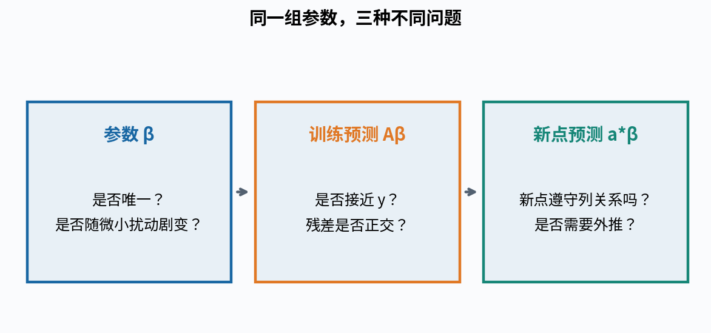

## 2. 先把每个数组的形状写清楚

设有n行数据、d个原始特征。第i行特征为列向量xᵢ∈Rᵈ，响应yᵢ∈R。含截距模型为ŷᵢ=β₀+∑ⱼ₌₁ᵈβⱼxᵢⱼ。把常数1放在每行首位，得到设计矩阵A∈Rⁿˣᵖ，其中p=d+1；β∈Rᵖ；y和ŷ均为Rⁿ中的向量。

$$
A=\begin{pmatrix}
1&x_{11}&\cdots&x_{1d}\\
\vdots&\vdots&&\vdots\\
1&x_{n1}&\cdots&x_{nd}
\end{pmatrix},\qquad
\widehat y=A\beta,\qquad r=y-A\beta.
$$

A的行对应同一批观察，列对应约定好的特征及顺序。训练时第二列是温度、预测时却把湿度放进去，形状仍可能正确，但语义已经错了。列顺序、单位和预处理参数都是模型的一部分。

本讲Python把单输出y存为形状(n,)；β为(p,)；矩阵乘法A@β得到(n,)。若把y写成(n,1)而预测仍为(n,)，减法可能广播成(n,n)，导致每个预测减每个响应。代码应明确拒绝或显式转换，而不是只看最终得到一个数字就继续。

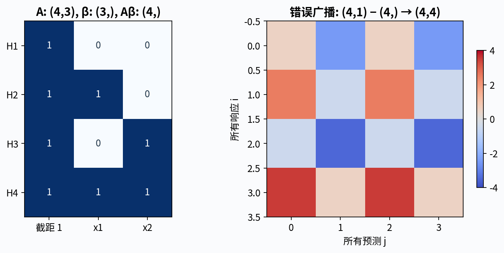

## 3. 一个四行、两特征的完整手算例子

使用完全合成的数据：x₁=(0,1,0,1)，x₂=(0,0,1,1)，y=(1,3,0,4)。每行只是一个教学观察，不带现实人物或因果解释。于是

$$
A=\begin{pmatrix}1&0&0\\1&1&0\\1&0&1\\1&1&1\end{pmatrix},
\qquad y=\begin{pmatrix}1\\3\\0\\4\end{pmatrix}.
$$

这四个角点把截距和两列特征区分开；A的三列线性独立。目标是找到一个平面，使四个竖直响应残差的平方和最小，不是让每个点到平面的最短几何距离最小。因为我们只预测y，x被当作给定输入，平方损失沿响应方向定义。

后面将得到β=(1/2,3,0)，预测(1/2,7/2,1/2,7/2)，残差(1/2,−1/2,−1/2,1/2)。先把这些数保留为分数，避免一开始就用小数误差掩盖代数结构。

## 4. 从分量导数到向量梯度

定义J(β)=||Aβ−y||²/(2n)。本节将A的列编号记作0至d，与β₀至βd对应：Aᵢ₀=1，Aᵢⱼ=xᵢⱼ（j≥1）。对k=0至d，偏导是

$$
\frac{\partial J}{\partial\beta_k}
=\frac1n\sum_{i=1}^n A_{ik}
\left(\sum_{j=0}^d A_{ij}\beta_j-y_i\right).
$$

把p个分量排成列向量，得到∇J=Aᵀ(Aβ−y)/n，形状为(p,)。Hessian为AᵀA/n，形状(p,p)。这里的1/2消掉平方导数中的2，1/n来自平均。若用SSE而非J，梯度乘2n，最小点不变，但以后梯度下降的学习率不能不变地照搬。

从方向变化也能复核：把β换成β+h，目标变化等于hᵀAᵀ(Aβ−y)/n+||Ah||²/(2n)。线性项给梯度，二次项非负。这个展开会在证明全局最优和唯一性时再次使用。

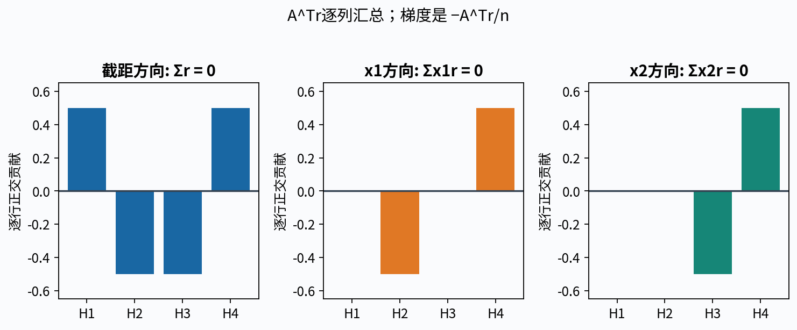

## 5. 正规方程为何是最优条件

令梯度为0，得到AᵀAβ̂=Aᵀy，称为正规方程。它的等价形式是Aᵀr̂=0：最优残差与A的每一列都正交。若首列是全1，这给∑r̂ᵢ=0；其他列给∑xᵢⱼr̂ᵢ=0。

正交条件不是“每个残差为0”，而是正负残差与各列的相关汇总为0。它也不是证明模型对新数据没有误差；只是在给定列空间中实现了这个训练目标的最优拟合。

任取h，展开SSE(β̂+h)=||r̂−Ah||²。交叉项因Aᵀr̂=0消失，得到

$$
\|y-A(\widehat\beta+h)\|^2
=\|\widehat r\|^2+\|Ah\|^2.
$$

因此满足正规方程的β̂一定是全局最小点。若A满列秩，Ah=0只允许h=0，最小点唯一；若存在非零零空间方向h，沿这个方向移动不改变任何训练预测，系数可以不唯一。

## 6. 手算正规方程与残差核验

主例直接乘得

$$
A^TA=\begin{pmatrix}4&2&2\\2&2&1\\2&1&2\end{pmatrix},
\qquad A^Ty=\begin{pmatrix}8\\7\\4\end{pmatrix}.
$$

把β=(1/2,3,0)代入，第一行2+6=8，第二行1+6=7，第三行1+3=4，全部成立。残差四项平方都是1/4，所以SSE=1，MSE=1/4，J=1/8。残差和为0；与x₁的内积−1/2+1/2=0，与x₂同样为0。

为确认唯一性，若a·1+b·x₁+c·x₂=0，第一行立即给a=0，第二、三行分别给b=c=0，三列独立。因此正规方程解唯一，不需要通过“数值库没有报错”推断这一点。

这里x₂系数为0不意味着x₂在任何模型或总体中都没有作用。四行数据里的x₂效应在不同x₁水平上相反，简单加性平面没有交互项；仅凭一个拟合系数不能作因果判断或删去科学问题。

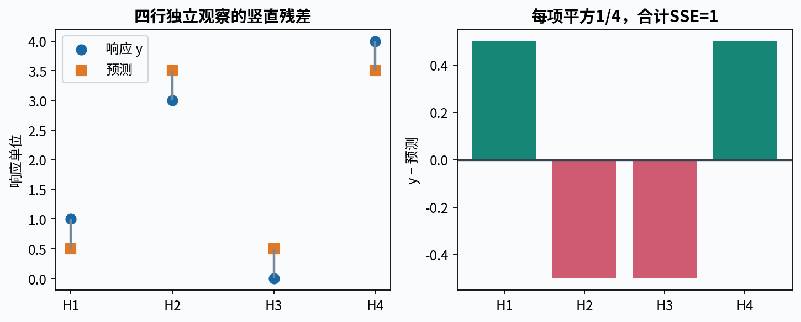

## 7. 满列秩时的逆公式只是一种数学表示

当A满列秩，AᵀA正定，因为对任何非零v，vᵀAᵀAv=||Av||²>0。因此可以写β̂=(AᵀA)⁻¹Aᵀy。这个公式说明解的形式，不要求程序真的先形成逆矩阵。

在实际数值计算中，若决定使用正规方程，也应求解线性系统Gβ=q，例如solve(G,q)，而不是inv(G)@q。两者仍都形成G=AᵀA，因而都继承Gram矩阵的数值困难；去掉显式求逆不是已经解决了所有不稳定性。

更推荐直接在A上做QR或SVD。不能用一次干净小数据上四种结果相同来证明所有求解路线等价稳定，也不能声称每个样本上显式逆必定误差最大。数值对比需要说明输入、尺度、条件数和真实可核对答案。

## 8. QR怎样把问题化成三角系统

假设n≥p且A满列秩。薄QR分解写A=QR，Q∈Rⁿˣᵖ满足QᵀQ=Iₚ，R∈Rᵖˣᵖ是可逆上三角矩阵。把y分成QQᵀy和(I−QQᵀ)y两块，两者正交，便有

$$
\|A\beta-y\|^2
=\|R\beta-Q^Ty\|^2+\|(I-QQ^T)y\|^2.
$$

第二项不随β变化，最小化第一项只需解Rβ=Qᵀy。用回代或通用solve处理三角系统即可，不需要显式R⁻¹。这里Q通常不是方阵，QQᵀ是投影矩阵，不是n维单位阵；把QᵀQ=I误写成QQᵀ=I会错误地声称所有残差都能消掉。

本讲用库的Householder QR分解，再自己组织Qᵀy与三角求解路线。没有声称从零实现可靠的Householder分解。若列秩不足，基本薄QR的R不可逆，不能照着full-rank路径硬解；应报告条件不成立并转向合适的秩揭示分解或SVD。

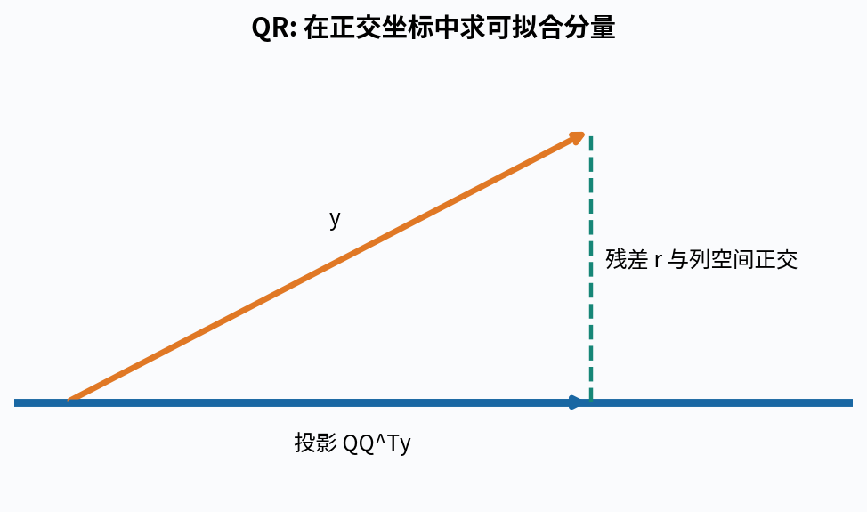

## 9. SVD直接暴露哪些方向难以确定

设A的秩为r，其非零奇异分解为A=UᵣΣᵣVᵣᵀ。Uᵣ∈Rⁿˣʳ、Vᵣ∈Rᵖˣʳ列正交，Σᵣ对角线是正奇异值σ₁≥…≥σᵣ。注意这里σⱼ是矩阵的奇异值，不是上一讲噪声标准差。

把参数在右奇异向量上展开，每个可识别方向的系数由(uⱼᵀy)/σⱼ决定。最小范数解为

$$
\widehat\beta_{\min}
=\sum_{j=1}^r\frac{u_j^Ty}{\sigma_j}v_j.
$$

若存在零空间方向，可加任意h∈Null(A)而不改变残差。Vᵣ方向与零空间正交，所以||βmin+h||²=||βmin||²+||h||²，h=0给唯一的最小欧氏范数系数。训练预测UᵣUᵣᵀy则是唯一的，哪怕系数不唯一。

NumPy的svd返回Vh=Vᵀ，而不是V；用full_matrices=False时列/行数以min(n,p)为准。程序应核对U、s、Vh的形状和重建残差，再组织伪逆求解。不是把几个数组依次相乘到恰好不报形状错误就结束。

## 10. 完全共线时，预测唯一但系数不唯一

令A的后两列完全相同，都是x，并保留截距。模型只通过β₁+β₂乘x。若最优线为1+3x，全部最小二乘解都满足β₀=1、β₁+β₂=3。向量(0,1,−1)在零空间里。

在这条解直线上，β₁²+β₂²最小时两者各为3/2。SVD最小范数解因而选(1,1.5,1.5)，而(1,3,0)和(1,0,3)得到同样训练拟合。最小范数是额外的选解约定，不是数据已经告诉我们两个作用恰好一样大。

对于遵守相同列关系x₂=x₁的新行，两种系数仍给同一预测。若新行变成(截距1,x₁=0,x₂=1)，它已经离开训练时的特征关系，三个系数方案可以给不同输出。不能从训练预测唯一推断任意外部点上的预测都唯一。

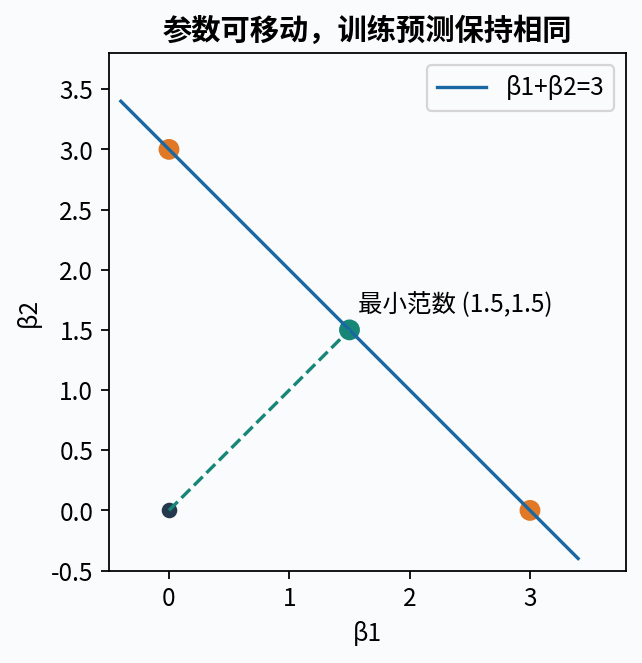

## 11. 最小范数还依赖你采用的单位

继续完全重复列的例子，把第二个特征改写成100x，对应系数约束变成β₁+100β₂=3。最小化新坐标里的β₁²+β₂²得到β₁=3/10001、β₂=300/10001。将后一项换回原x的系数是30000/10001，与原单位下两项各1.5明显不同。

训练拟合没有变化，选出的参数拆分却变化了。原因是欧氏范数把不同单位的参数当作同一个几何尺度；改变坐标后，“最小”的含义也改变。不要把软件返回的最小范数参数当作自然唯一的科学归因。

满列秩且使用精确算术时，对可逆特征重参数化，只要正确还原参数，预测函数保持一致。秩亏、数值阈值、正则化或有限精度会引入额外约定，需要分别讨论，不能统称“标准化总是无害”。

## 12. 近共线为什么放大系数变化

完全相同的两列会出现零奇异值；非常接近的两列往往出现很小但非零的奇异值。公式中的除以σⱼ会放大y沿uⱼ方向的一点扰动。设δy=εuⱼ，满秩时系数变化δβ=(ε/σⱼ)vⱼ，而训练预测变化Aδβ=εuⱼ。

因此系数变化可以很大，训练拟合变化仍很小。这不是求解器必然算错，而是问题本身对该方向的信息很弱。当然有限精度还可能进一步加重误差，必须把固有敏感性与算法误差分开。

本讲用一个可精确构造的族说明。取七维x=(−3,−2,−1,0,1,2,3)，z=(1,0,−1,0,−1,0,1)，w=(1,−2,1,0,1,−2,1)。三者与全1向量正交，且x、z、w彼此正交。令Aδ=[1,x,x+δz]，y=1+3x+δz+w/16。δ>0时β=(1,2,1)，残差w/16，SSE=3/64。

再给响应加εz。精确系数变化是(0,−ε/δ,+ε/δ)，预测变化εz的范数只有2|ε|。实验用2的整数负幂，使这些数据在声明范围内能由float64精确表示，再用存储值的高精度参考核对，避免把输入舍入当成求解器误差。

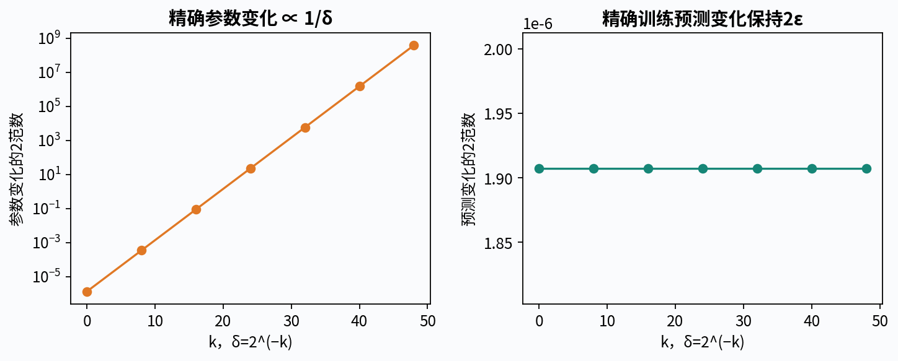

## 13. 条件数说明什么，不说明什么

满列秩时，2范数条件数κ₂(A)=σmax/σmin。它衡量线性映射不同方向的尺度差，是敏感性的一个重要指标；不等于模型预测误差，也不是一个可以跨单位随意比较的固定质量分数。

对满列秩A，在精确算术中AᵀA的特征值是σⱼ²，所以κ₂(AᵀA)=κ₂(A)²。形成正规方程可能丢失相近大数之差中的有效信息；这解释了为什么直接QR/SVD通常更稳健。浮点形成的Gram矩阵可能已经受到舍入，其实际计算条件数不必恰好等于理想平方关系。

不应把“大条件数”直接写成“已知损失了若干位且结果完全不可用”。实际误差还取决于扰动方向、响应向量、残差角度、求解算法与缩放。最小二乘在A和y都变化时的完整扰动分析比方阵求解的简单界更细，本讲只严格推导前节固定A、沿指定奇异方向改变y的机制。

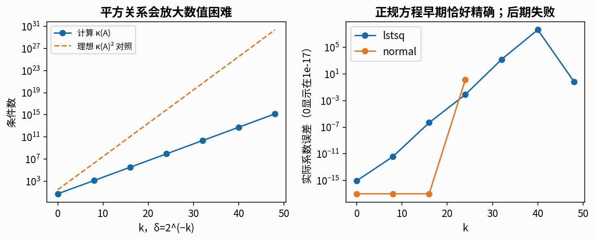

## 14. 数学秩与软件报告的有效秩

数学上，任何δ>0的上述Aδ都满列秩。浮点求解器却通常把小于相对阈值的奇异值视作零。NumPy 2.3的lstsq默认阈值系数是机器精度乘max(n,p)，也可明确给rcond。于是同一个数学非零方向可能在不同阈值下被保留或丢弃。

丢弃小但非零的方向，相当于使用截断SVD。它可能改善扰动敏感性，也可能引入拟合偏差；若丢弃的方向与y有非零投影，得到的结果不再是原始满秩矩阵的精确最小二乘解，而是截断后的数值约定。报告rank时必须带上阈值、奇异值和版本。

在近共线实验里，我们同时保留δ的精确构造、存储后矩阵的有理数秩、默认数值rank和显式rcond的rank。若默认阈值把秩报为2，不能反过来宣布原本两列在数学上完全相等。反之，硬设极小rcond保留方向，也不自动让噪声信息变可靠。

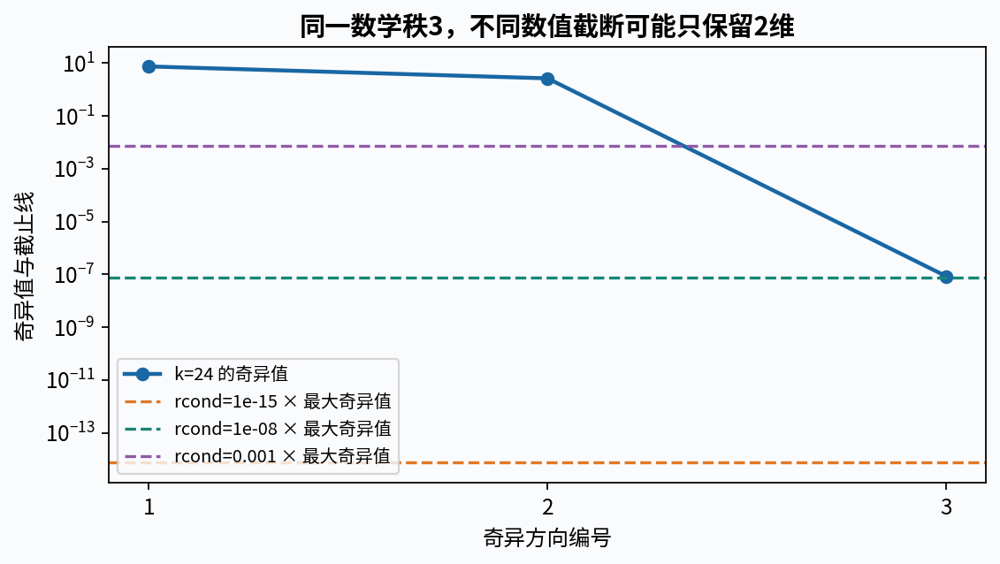

## 15. 与scikit-learn比较时先对齐问题

核心路线使用显式含截距的A，直接求β。scikit-learn的通常用法是把不含常数列的特征矩阵X交给LinearRegression(fit_intercept=True)，由库估计截距。主例满列秩时，两条路线应给相同截距、系数、预测和残差，只允许浮点误差。

也可以给完整A并设置fit_intercept=False，把常数系数当作普通参数。这两种写法不能同时再添加一个默认截距而不说明冗余。对比rank_、singular_时尤其要注意库内部可能使用中心化后的特征矩阵，而你的SVD分析的是含截距A，形状与秩对象不同。

秩亏时，默认带截距实现与显式增广矩阵的最小范数约定也未必对同一个联合参数范数取最小。预测在同一训练列空间里可以一致，系数却可能因中心化和选解约定不同。先比较训练预测与残差，再解释参数差异，不应机械要求所有秩亏路线系数逐位相等。

本实验固定scikit-learn 1.8.0。其LinearRegression的tol用于稀疏lsqr路径，对本讲稠密输入不生效；不要把改变tol当成已经控制了本次稠密SVD阈值。不同版本需重新核对官方文档。positive=True则改为非负约束，已经不再是本讲的无约束OLS。

## 16. 返回的residuals为空不等于残差为零

NumPy lstsq返回解、residuals、rank和奇异值。residuals字段在秩亏或n≤p时可以是空数组，即便真正的||y−Aβ||²不为0。这个字段只是接口的返回约定，不是数学对象不存在或误差恰好为零。

所以无论哪条求解路线，都重新计算ŷ=Aβ、r=y−ŷ和SSE=∑rᵢ²；同时核对形状、有限值、Aᵀr的大小、相对残差和数值秩。对真正秩亏的最小二乘解，Aᵀr仍应在合理容差内接近0；对截断但原矩阵满秩的近似解，应按已声明的截断解释剩余梯度。

科学报告至少保留：n和p、列名与单位、截距约定、求解方法、rank和阈值、奇异值或条件数、训练SSE、残差摘要、系数和预测。一次没有抛出LinAlgError不等于所有这些条件都已经核对。

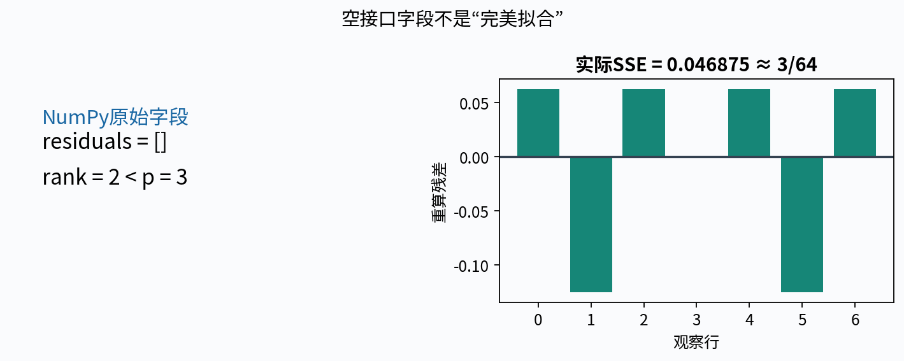

## 17. 加一列为什么总能降低训练误差，却未必更好

若新模型的列空间包含旧模型列空间，旧预测仍然可选，因此精确最小训练SSE不会增加。这是嵌套可行集合的结论，不需要假设新特征真的有用。增加无关或高度相关特征也可能降低训练残差，却让系数更不稳定或新数据误差增大。

主例加入交互列x₁x₂后，四参数可以在这四行上精确插值：β=(1,2,−1,2)。训练SSE为0，但四行已经用完所有自由变化，无法从这一点证明对未见组合、带噪新观察或现实任务更好。需要与目标一致的独立验证设计，而不是在同一个训练表里选择最低SSE后宣布成功。

“控制其他特征”的系数解释也是模型内的条件变化，不自动代表干预一个特征的因果效应。强相关特征下，所谓其他特征不变的组合可能根本没有出现在数据支持中；此时外推和可识别性问题尤其需要明确。

## 18. 本次实验的求解与验收顺序

先用Fraction手算主例正规方程、解、残差和SSE。然后组织NumPy lstsq、薄QR三角求解与SVD伪逆三条路线，用相同输入比较。正规方程solve只作为条件数示例中的对照，绝不把显式inverse写成推荐路线。

接着构造完全重复列与近共线族，对每个案例分别记录系数误差、训练预测差、SSE、奇异值、数学秩和数值rank。增加固定εz扰动时，按完整规则重新求解，并与精确(0,−ε/δ,+ε/δ)关系比较。允许某条路线报告不适用或LinAlgError，不把异常伪装成0误差。

最后用scikit-learn核对主例和明确对齐的预测任务。所有输入包含最后一个元素、未选择路线的参数和数值阈值，都应在求解或写文件前完整验证。JSON原文非零下溢与重复键必须被拒绝；矩阵NaN、混合bool、空列、长度不符、错误形状及不支持的精度类型都要有失败证据。

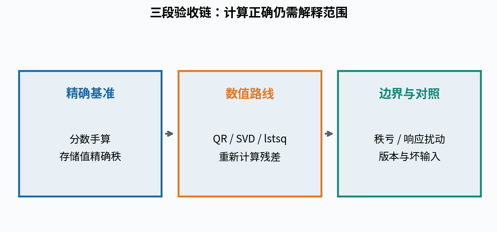

## 19. 数值误差与统计误差需要分别处理

数值误差是在同一份存储数据、同一个数学目标下，有限精度计算偏离精确解。统计误差来自随机数据与未知总体，即使算术完全精确也可能存在。特征遗漏、目标定义错误与分布变化又属于不同层次。

QR比正规方程稳定，不能使错误标签变正确；SVD返回最小范数解，不能提供原本缺失的可识别信息；训练残差正交，不能保证测试数据来自同一机制。每个补救措施都只解决它对应的那一层问题。

本讲实验是离线CPU上的小矩阵，不为大规模吞吐、分布式求解、稀疏矩阵或现实预测性能背书。环境版本、实际执行方式和未测试的Anaconda/browser Jupyter条件会在实验说明中明确。

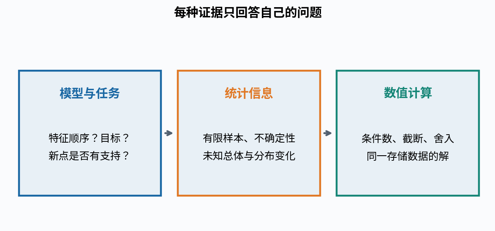

## 20. 自测与后续

1. 写出含截距模型的逐行形式及A、β、y、r、梯度和Hessian的形状。
2. 构造(n,1)减(n,)的广播错误，解释为什么它不是合法逐行残差。
3. 从分量导数推出J=||Aβ−y||²/(2n)的梯度，说明使用SSE时的比例变化。
4. 从正规方程推出残差正交，并用平方展开证明全局最优。
5. 证明满列秩恰好保证参数唯一；解释秩亏时为什么训练预测仍唯一。
6. 手算四行主例AᵀA、Aᵀy、β、预测、残差、SSE、MSE和J。
7. 解释逆公式与数值求解路线的区别，为什么solve正规方程仍可能不稳定。
8. 写出薄QR各矩阵形状，推导三角系统，说明QQᵀ与QᵀQ区别。
9. 从SVD推最小范数解，并证明加入零空间分量会增加系数范数。
10. 对重复列例子列出全部最小解、最小范数解及一个离开列关系的新点分歧。
11. 将重复列之一变为100x，推导新的最小范数系数，解释单位效应。
12. 核对x、z、w正交关系，推导近共线族的精确系数、残差与SSE。
13. 给y加εz，求参数变化与训练预测变化的范数，区分敏感性和算法误差。
14. 从奇异值解释κ₂(AᵀA)=κ₂(A)²的条件与浮点限制。
15. 区分数学秩、存储后精确秩与有效数值rank，说明rcond截断改变了什么。
16. 设计与scikit-learn公平比较的两种截距路线，并说明秩对象和tol限制。
17. 为什么residuals为空不能当SSE=0？请给出秩亏、非零残差的反例。
18. 证明加入特征不会增加最优训练SSE，说明为什么仍不能自动作泛化或因果结论。

完整实验与逐题解答另有文件。下一讲把两参数回归写成损失曲面，再进入优化算法；本讲获得的解析解会成为后续优化实验的可靠参照，而不是由优化器自己的成功状态为自己证明。

## 来源与核查范围

- [Boyd与Vandenberghe作者公开讲义](https://web.stanford.edu/~boyd/vmls/vmls.pdf)：核对第12章满列秩条件、残差正交与QR路线；本讲数据、近共线族、文字与推导组织独立构造，不复用书中例题或图片。
- [NumPy 2.3 lstsq](https://numpy.org/doc/2.3/reference/generated/numpy.linalg.lstsq.html)：核对最小范数选解、默认rcond与空residuals约定。
- [NumPy 2.3 QR](https://numpy.org/doc/2.3/reference/generated/numpy.linalg.qr.html)与[SVD](https://numpy.org/doc/2.3/reference/generated/numpy.linalg.svd.html)：核对薄分解形状、Vh方向和库分解边界。本讲不沿用文档示例中的显式逆实现。
- [NumPy 2.3 cond](https://numpy.org/doc/2.3/reference/generated/numpy.linalg.cond.html)：核对2范数与奇异值条件数口径。
- [scikit-learn 1.8 LinearRegression](https://scikit-learn.org/1.8/modules/generated/sklearn.linear_model.LinearRegression.html)：核对截距、稠密rank_/singular_与tol在稀疏路径的作用，版本与实验环境一致。
- [SciPy 1.17 lstsq](https://docs.scipy.org/doc/scipy-1.17.0/reference/generated/scipy.linalg.lstsq.html)：核对有效秩、求解驱动与返回字段，不把不同驱动结果视作独立数学证明。
