# 第030讲 损失曲面与优化问题

求参数为什么是一个几何和计算问题？第028讲已经找到一条最好的直线，现在我们把所有候选直线同时放到一张地图上：地图上的一个点表示一组参数，点的高度表示这组参数在给定数据上的损失。寻找参数于是变成寻找低处。地图能解释方向、弯曲、唯一性和约束；计算程序则必须在有限次数、有限精度下给出可核验的结果。

本讲始终保留一个独立答案：五个合成点的最优参数是截距 $3/5$、斜率 $6/5$，目标值为 $4/25$。我们先证明这个答案为什么是整个参数平面的最低点，再用曲面、等高线、梯度场和有限步轨迹逐一验证。图看起来像碗不是证明；程序显示成功也不是关于真实世界的结论。

## 1 先修 目标与本讲边界

直接先修是第014至015讲和第028讲。需要知道偏导数、方向导数、Hessian、二次型，以及一元回归的配平方恒等式。第029讲把这些对象推广到设计矩阵；本讲即使不借助 QR 或 SVD，也能从两个参数完整推导。矩阵写法只压缩已经解释过的标量关系。

读完应能独立回答：优化变量是什么；图的两个横轴是什么；损失的单位和归一化是什么；某点的梯度能说明多远范围内的变化；怎样区分驻点、局部最小值和全局最小值；为什么需要计算预算和独立参照；什么证据不足以说明泛化。

学习路线是先读第2至7节并手算，再读第8至12节的形状与计算，最后完成第13至16节的边界判断。第031讲会系统推导一维学习率，第032讲会深入多维谱与缩放，因此本讲的有限步更新只是读懂地图的探针。约束优化及优化误差、统计误差会在后续再次讨论，这里先建立不混淆它们的语言。所有数据和图均为原创合成教学例，不对应真实仪器测量或任务效果。

## 2 三个不同空间 不能把坐标混在一起

固定训练数据 $D=\{(x_i,y_i)\}_{i=1}^n$，其中 $n\geq1$，输入输出均为有限实数。规则为 $f_{a,b}(x)=a+bx$。先在数据空间中画 $(x_i,y_i)$ 和候选直线；然后在参数空间中画 $(a,b)$；最后给参数点添上高度 $J(a,b)$，得到三维曲面。

这三个图并不是同一张图的缩放。一条预测直线在数据空间里有无限多个点，但在参数空间里只有一个点。参数空间中的一条曲线通常表示一族不同预测直线，而不是一条弯曲的预测函数。损失曲面的高度也不是某个样本的标签，它已经汇总全部训练样本的误差。

沿用第028讲的单位：$x$ 用 N，$y$ 用 V，物理截距用 V，物理斜率用 V/N。本讲计算、梯度图、欧氏范数和特征值均作用于选定这些单位之后的数值坐标 $a,b$。坐标数值可以组成二维向量，但不同物理单位不能被当成同一种量直接相加。更换单位后地图的形状和“同样长的一步”会改变；必须同时变换参数和计算约定。

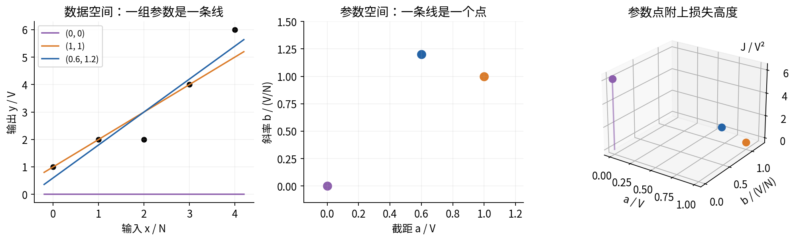

把参数写成列向量 $\theta=(a,b)^\mathsf T\in\mathbb R^2$。程序为了方便使用长度为2的一维数组；它在数学上代表列向量，并不意味着可以任意广播成二维数组。数据 $x,y$ 的形状为 $(n,)$，预测和残差也必须保持 $(n,)$。

## 3 一个优化问题需要哪些组成部分

本讲选择目标函数

$$
J(a,b)=\frac{1}{2n}\sum_{i=1}^n(a+bx_i-y_i)^2.
$$

损失非负，单位为 V²；分母中的2只是为了求导方便。第028讲使用观测减预测的残差，这里令 $r_i=a+bx_i-y_i$，即预测减观测。两者互为相反数，平方损失相同；导数的符号必须与当前残差定义一起改变。

完整问题应写成 $\min_{\theta\in\Theta}J(\theta)$。这里 $\Theta=\mathbb R^2$，表示没有参数约束。数据在一次优化中固定；参数是可调变量；损失形式和可行域是研究者事先指定的问题。样本数也固定，因此 $\mathrm{SSE}$、$\mathrm{MSE}$ 和 $J=\mathrm{MSE}/2$ 有同一组最优解。若乘以正数 $c$，梯度和 Hessian 都乘 $c$；如果仍用原来的数值步长，轨迹一般改变。

“最优参数”和“最优值”是两种对象。用 $\operatorname*{argmin}_{\theta\in\Theta}J(\theta)$ 表示最优参数集合，用 $J_* = \min_{\theta\in\Theta}J(\theta)$ 表示最低数值。集合可能有一个、多个或无限多个元素。一般问题甚至只有下确界而没有达到它的参数，例如 $e^t$ 在实轴上的下确界为0，却在每个有限 $t$ 处严格大于0。因此不能默认每个光滑目标都存在最小值。

目标函数也不是算法。闭式解、网格搜索和迭代更新是寻找结果的不同计算方式；它们不应在运行途中悄悄改变训练数据、损失归一化或可行域。换成绝对误差或删掉截距都定义了新问题。

## 4 把五点回归展开成一张地图

五个点为 $(0,1),(1,2),(2,2),(3,4),(4,6)$。直接求和得

$$
n=5,\quad \sum x_i=10,\quad \sum x_i^2=30,
\quad \sum y_i=15,\quad \sum x_i y_i=42,\quad \sum y_i^2=61.
$$

展开每一项 $(a+bx_i-y_i)^2$ 后相加，得到

$$
J(a,b)=\frac{5a^2+20ab+30b^2-30a-84b+61}{10}.
$$

交叉项 $20ab$ 是倾斜等高线的来源之一：改变斜率会改变全部预测，截距可以补偿其中在样本均值位置的移动。只看 $a^2$ 和 $b^2$ 两项，会漏掉这种联动。

第028讲给出 $\bar x=2$、$\bar y=3$、$S_{xx}=10$、$b_*=6/5$、$a_*=3/5$、$\mathrm{SSE}_*=8/5$。代入配平方形式，可以写成更容易读懂的几何表达式：

$$
J(a,b)=\frac4{25}+\frac12(a+2b-3)^2+\left(b-\frac65\right)^2.
$$

这条恒等式对每一组实数参数成立，绝非只在最优点附近成立。后两项都非负，并且同时为零仅当 $b=6/5$、$a=3/5$。因此最低值为 $4/25$，最优参数唯一。不需要先运行任何优化器，也不需要假定噪声正态。

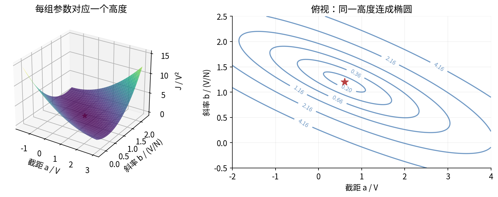

## 5 手算几个位置再相信整张图

先从几组简单坐标检查地图，避免坐标轴交换或少除样本数后仍画出漂亮图。

| 参数 $(a,b)$ | 预测向量 | SSE | $J=\mathrm{SSE}/10$ |
|---|---|---|---|
| $(0,0)$ | $(0,0,0,0,0)$ | $61$ | $6.1$ |
| $(1,1)$ | $(1,2,3,4,5)$ | $2$ | $0.2$ |
| $(3/5,6/5)$ | $(3/5,9/5,3,21/5,27/5)$ | $8/5$ | $4/25$ |
| $(3,0)$ | $(3,3,3,3,3)$ | $16$ | $1.6$ |
| $(0,6/5)$ | $(0,6/5,12/5,18/5,24/5)$ | $17/5$ | $17/50$ |

例如 $(1,1)$ 的预测减观测残差为 $(0,0,1,0,-1)$，平方和为2。另一条 $(0,6/5)$ 已经使用最佳斜率，却把整条直线向下移了 $3/5$，使损失增加 $\frac12(3/5)^2=9/50$；所以总损失为 $4/25+9/50=17/50$。

从表格不能直接证明全局最优，因为只检查了五组候选；全局证明来自上一节对所有参数成立的配平方恒等式。另一方面，公式证明不能替代程序核验：代码可能根本没有计算公式中定义的那个函数。两种证据各有职责。

最优损失仍大于零，说明没有一条直线穿过全部五点。继续优化同一个直线模型不可能消除这一事实。把程序跑得更久不会使正的数学下界变成0。

## 6 等高线 怎样读出损失与方向

给定高度 $c$，等高线是集合 $\{(a,b):J(a,b)=c\}$；次水平集则为 $\{(a,b):J(a,b)\leq c\}$。在本例中，$c<J_*$ 时二者为空；$c=J_*$ 时只有一个点；$c>J_*$ 时等高线是椭圆，次水平集包括椭圆内部。

令 $h=\theta-\theta_*$，则

$$
J(\theta)-J_* = \frac12 h^\mathsf T Hh,
\qquad H=\begin{pmatrix}1&2\\2&6\end{pmatrix}.
$$

如果沿同一条等高线移动，训练损失不变，但参数和逐点预测通常改变。这不是“所有点拟合效果逐点相同”，而是平方误差汇总相同。对于某些候选，一行误差下降、另一行误差上升，恰好保持总值。

等高线的疏密只有在相同的高度间隔、相同坐标尺度和相同绘图范围下才有明确比较意义。用不等间隔的高度或拉伸坐标轴，会改变视觉密度。颜色越深也不一定越差，取决于色标方向；图必须写出色标和高度值。

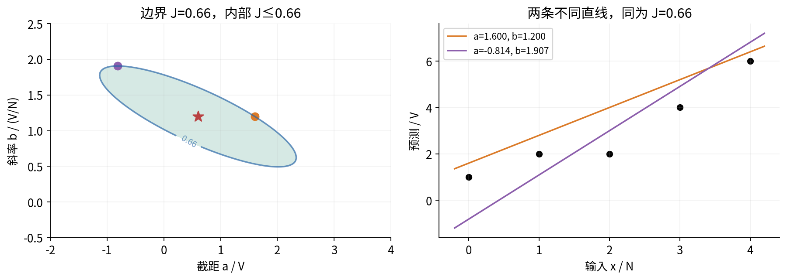

程序使用 meshgrid 的 xy 约定，得到形状为 $(N_b,N_a)$ 的数组。列索引改变 $a$，行索引改变 $b$，高度数组每个位置必须对应同位置参数。官方 [NumPy meshgrid 文档](https://numpy.org/doc/2.3/reference/generated/numpy.meshgrid.html)明确区分 xy 和 ij；[Matplotlib contour 文档](https://matplotlib.org/3.10.8/api/_as_gen/matplotlib.axes.Axes.contour.html)要求坐标和高度的尺寸相容。画图前检查几个角点，比图出来后靠肉眼猜转置更可靠。

## 7 从残差推梯度 不只记矩阵公式

对单个平方项应用链式法则，$\partial r_i/\partial a=1$，$\partial r_i/\partial b=x_i$。分母中的2与求平方导数产生的2约去：

$$
\frac{\partial J}{\partial a}=\frac1n\sum_i r_i,
\qquad
\frac{\partial J}{\partial b}=\frac1n\sum_i x_i r_i.
$$

梯度是二维列向量。用设计矩阵 $A\in\mathbb R^{n\times2}$ 表示，每行是 $(1,x_i)$，$y\in\mathbb R^n$，则

$$
r=A\theta-y\in\mathbb R^n,\qquad
\nabla J(\theta)=\frac1n A^\mathsf T(A\theta-y)\in\mathbb R^2.
$$

在五点例上，梯度变成

$$
\nabla J(a,b)=\begin{pmatrix}a+2b-3\\2a+6b-42/5\end{pmatrix}.
$$

代入 $(0,0)$ 得 $(-3,-42/5)^\mathsf T$，代入 $(1,1)$ 得 $(0,-2/5)^\mathsf T$，代入 $(3/5,6/5)$ 得零。$(1,1)$ 处第一分量为零只意味着固定斜率、仅竖直平移直线不能一阶降低损失；斜率方向仍可改进。检查一个偏导为零远远不够。

对单位数值方向 $d\in\mathbb R^2$，$\|d\|_2=1$，方向导数为 $D_dJ=\nabla J^\mathsf Td$。根据 Cauchy–Schwarz 不等式，当梯度非零时，在这些等长方向中，$d=-\nabla J/\|\nabla J\|_2$ 使方向导数最小。这里的“最陡”是固定坐标和欧氏长度下的一阶结论。改变坐标尺度或距离定义，会改变最陡方向。

## 8 梯度为什么垂直等高线

设一条可微曲线 $\theta(t)$ 沿同一高度移动，即 $J(\theta(t))=c$。对 $t$ 求导，链式法则给出

$$
0=\frac{d}{dt}J(\theta(t))=\nabla J(\theta(t))^\mathsf T\theta'(t).
$$

因此在梯度非零、曲线切向非零的正常位置，梯度与等高线切向垂直。梯度指向局部升高方向，负梯度指向局部下降方向。在最优点梯度为零，零向量没有可画出的特定方向，不能把自动绘图的微小箭头当成理论方向。

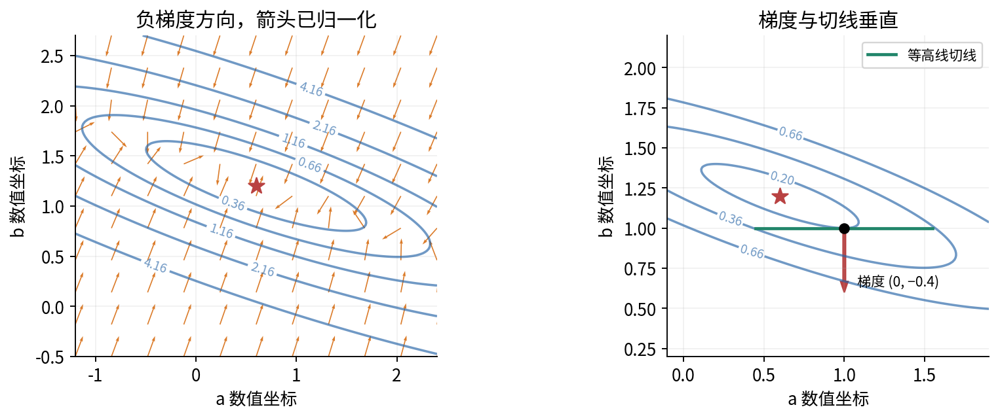

这里的箭头经过归一化，只表示方向，不表示梯度大小或某个算法实际走的步长。若画未经归一化的场，较大的梯度箭头可能遮挡整张图，需要明确比例尺。[Matplotlib quiver 文档](https://matplotlib.org/stable/api/_as_gen/matplotlib.axes.Axes.quiver.html)区分数据坐标方向与显示坐标方向；本讲用 angles='xy'，并保持等比例坐标。

“负梯度指向下降”也不能被解释成“沿这个方向走任意远都下降”。在 $(0,0)$，若取步长 $\eta=1/5$，一次更新给出 $(3/5,42/25)=(0.6,1.68)$，损失从6.1降到0.8512，但已经越过最佳斜率1.2。方向描述局部变化，步幅决定落点，这正是后续学习率课程要解决的问题。

## 9 曲率给出的全局证据

再次求导得到 Hessian：

$$
\nabla^2J=\frac1n\sum_i\begin{pmatrix}1&x_i\\x_i&x_i^2\end{pmatrix}
=\frac1n A^\mathsf TA.
$$

对任意二维方向 $v=(v_a,v_b)^\mathsf T$，

$$
v^\mathsf T\nabla^2Jv=\frac1n\sum_i(v_a+v_bx_i)^2\geq0.
$$

因此本讲的最小二乘曲面总是凸的。若至少有两个不同的输入，等号同时要求两条不同 $x_i$ 对应的线性式都为0，相减得到 $v_b=0$，再得 $v_a=0$，所以 Hessian 正定、目标严格凸。这个论证来自数据设计，不来自绘图分辨率。

对任意当前位置 $\theta$ 和扰动 $h$，二次目标满足精确展开：

$$
J(\theta+h)=J(\theta)+\nabla J(\theta)^\mathsf Th+\frac12h^\mathsf THh.
$$

一般光滑函数的二阶展开带有余项；本例的三阶及更高阶导数为零，所以展开在整个参数空间精确成立。若 $\nabla J(\theta)=0$，新增项非负，立刻证明它是全局最优。正定时，所有非零 $h$ 都严格增加损失，于是最优参数唯一。

五点矩阵的特征多项式为 $\lambda^2-7\lambda+2$，所以两个特征值为 $(7-\sqrt{41})/2$ 和 $(7+\sqrt{41})/2$，约为0.298438与6.701562。沿单位特征向量移动长度 $t$，损失增加 $\lambda t^2/2$。大曲率方向移动一点就涨得快；小曲率方向可以走更远才达到同一高度。不同方向的损失代价不一样，这就是椭圆而不是圆的原因。

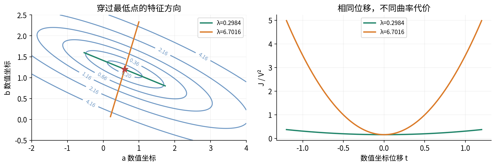

在选定坐标下，令 $\mu$、$L$ 为最小和最大特征值，则 $\mu\|h\|^2/2\leq J-J_*\leq L\|h\|^2/2$。这让损失差和参数距离发生有条件的联系；如果 $\mu$ 很小，同样的损失差仍可能容许较大的参数偏差。小梯度也类似，只有掌握正曲率下界等条件后才能转化为有意义的误差界。[Boyd 与 Vandenberghe 的无约束最优化讲义](https://web.stanford.edu/class/ee364a/lectures/unconstrained.pdf)讨论了这种条件与停止判据的联系。

## 10 坐标变化让谷地看起来不同

定义均值输入处的预测 $m=a+2b$，使用新坐标 $(m,b)$。注意第028讲的 $c=a+2b-3$ 是相对样本均值的偏移，本节的 $m$ 则是预测本身，两个记号不要混用。逆变换为 $a=m-2b$，因此这只是同一族直线的重新标记，没有改变任何可实现预测。

在新坐标中目标为

$$
\widetilde J(m,b)=\frac4{25}+\frac12(m-3)^2+(b-6/5)^2,
\quad \nabla^2\widetilde J=\begin{pmatrix}1&0\\0&2\end{pmatrix}.
$$

交叉项消失，椭圆与坐标轴对齐。再令 $q=\sqrt2(b-6/5)$，并以 $m-3$ 为另一个坐标，等高线就可以画成圆。圆不意味着数据变容易了或模型变真实了，它首先说明我们改变了坐标与长度约定。

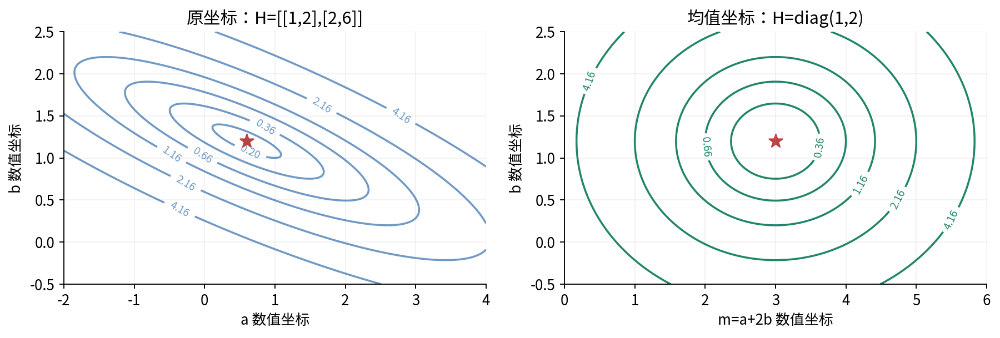

如果 $\theta=T\phi$，链式法则给出 $\nabla_\phi J=T^\mathsf T\nabla_\theta J$。在 $\phi$ 中做一步 $\phi^+=\phi-\eta\nabla_\phi J$，映射回去是 $\theta^+=\theta-\eta TT^\mathsf T\nabla_\theta J$。除非变换满足特殊条件，这不是原坐标的普通梯度一步。这里的含义是算法依赖坐标约定，不是任意特征缩放都没有代价。训练和部署必须用同一套预处理规则。

## 11 平谷 不唯一与看不见的参数方向

如果所有 $x_i=2$，数据是 $(2,1),(2,2),(2,4)$，则 $\bar y=7/3$。配平方得到

$$
J(a,b)=\frac79+\frac12(a+2b-7/3)^2.
$$

所有满足 $a+2b=7/3$ 的参数都达到最低值 $7/9$。Hessian 为 $\begin{pmatrix}1&2\\2&4\end{pmatrix}$，特征值为0与5。零曲率方向例如 $(-2,1)$：把 $a$ 减少 $2t$、$b$ 增加 $t$，全部训练预测都不变。曲面是一条有底部的平谷，没有唯一最低参数点。

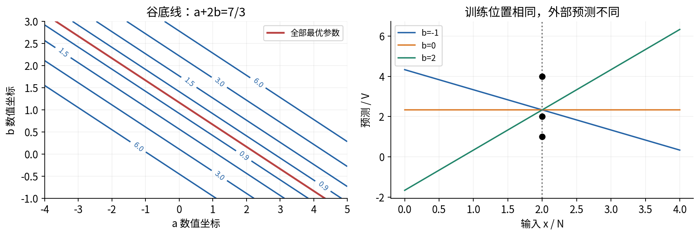

这种退化不会产生虚假的局部低谷：目标仍然凸，局部最优也是全局最优，只是最优集合不再是单点。程序选择 $(7/3,0)$ 作为可展示代表，同时明确报告 unique_parameters=false，不能把代表误称为唯一答案。

从这里可以分清参数误差和预测误差。若两个参数相差 $t(-2,1)$，参数距离随 $|t|$ 增大，但训练预测距离始终为0。对于训练位置之外的 $x_0$，预测差为 $t(x_0-2)$，却可以任意大。要谈“参数接近”，必须先判断参数是否可识别。

## 12 局部最优 全局最优与驻点

可行点 $\theta_*$ 是全局最优，如果对所有可行 $\theta$ 都有 $J(\theta_*)\leq J(\theta)$；它是局部最优，如果只需要某个足够小邻域内的可行点满足这一不等式。严格局部最优还要求邻域内其他点都严格更高。驻点只表示梯度为零，定义本身没有提到大小比较。

对无约束可微函数，内点局部最优必为驻点：若存在非零梯度，沿负梯度足够小的一步会下降，与局部最优矛盾。但反过来不成立。$u^2+v^2$ 的原点是严格全局最小；$-u^2-v^2$ 的原点是严格全局最大；$u^2-v^2$ 的原点是鞍点；它们的梯度都为零。

再看 $F(u,v)=(u^2-1)^2+v^2+u/5$。两个谷底高度不等，较高谷底仍是局部最小，却不是全局最小。还要区分“不凸”与“一定很多坏局部最小”：例如 $u^4$ 是凸的且在0处 Hessian 为0，却仍有唯一全局最小。因此 Hessian 正定是充分条件，不是所有严格最小值的必要条件；Hessian 半正定一般不能单独下结论。

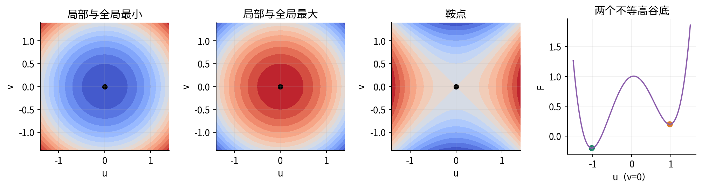

对凸函数，如果一个局部最小点不是全局最小，就存在更低点；沿连接二者的线段走一点，根据凸性就能在任意小邻域找到更低点，与局部最小矛盾。因此凸问题局部最优必为全局最优。唯一性则还需要额外条件，平谷已经给出反例。不能把“凸”“严格凸”“可微”“存在最小值”当成同义词。

## 13 为什么还需要有限计算

这道二参数问题有闭式答案，适合当实验的真值参照。更复杂模型未必有闭式解，常用迭代方法生成 $\theta_0,\theta_1,\ldots$。本讲用最简单的更新探针 $\theta_{k+1}=\theta_k-\eta\nabla J(\theta_k)$，目的不是提前穷尽梯度下降理论，而是观察同一个几何目标上不同计算过程会发生什么。

在五点例中，从 $(0,0)$ 开始，$\eta=0.2$ 的第一步为 $(0.6,1.68)$；第二步为 $(0.408,1.104)$。相应梯度在第一步处为 $(0.96,2.88)$，所以第二步减去 $(0.192,0.576)$。这组轨迹在谷地两侧移动，随后沿较平缓方向靠近最优点。

把这两轮拆开检查：原点预测全为0，残差(−1,−2,−2,−4,−6)，平方和61，梯度由每行rᵢ/5和xᵢrᵢ/5分别相加，得到(−3,−42/5)。更新到(3/5,42/25)后必须重新前向，预测为(3/5,57/25,99/25,141/25,183/25)，残差为(−2/5,7/25,49/25,41/25,33/25)，平方和1064/125，故J=532/625；新梯度为(24/25,72/25)。用这个新梯度更新到(51/125,138/125)，再前向得到残差(−74/125,−61/125,77/125,−7/25,−147/125)，平方和7592/3125，J=3796/15625。每个样本贡献的两列梯度、每个平方以及两次参数代入，均在练习详解第11题逐行列出，Notebook也按同一流程打印，不能跳过中间计算只记住两个终点。

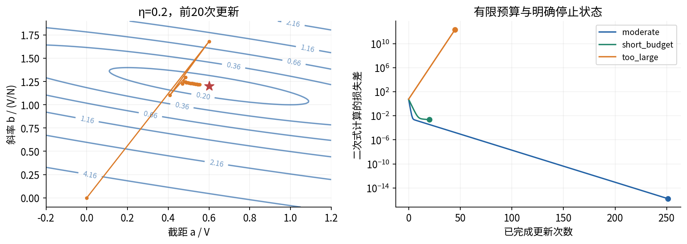

默认脚本的三条路径分别叫 moderate、short_budget 和 too_large。它们都有事先指定的最大更新次数，没有无界 while 循环。moderate 的梯度范数到达 $10^{-8}$ 时停止；short_budget 只允许20次更新；too_large 的候选参数超过数值保护范围时停止。这三种状态分别是“达到约定阈值”“预算耗尽”“保护性终止”，不能统一翻译为“得到正确模型”。

每步都检查有限数值，输出最终梯度范数、参数和损失，而不是把非数值 NaN 当作“小于阈值”。计算完成之后用闭式解检查，而不是把更长的一次迭代当成真值。严格停止规则也不是现实精度保证：数据误差、模型失配和分布改变仍然存在。

数值上直接计算 $J(\theta)-J_*$ 会在二者非常接近时发生抵消，甚至得到微小负值。本讲画收敛图时优先使用 $\frac12(\Delta a+2\Delta b)^2+(\Delta b)^2$。这避免两个近似相等总值相减，但计算机中参照参数本身仍有舍入；程序称其 quadratic_gap，不声称任意病态输入下都是精确证书。

## 14 网格与停止阈值都是有限观察

二维网格把参数矩形切成有限个点，然后计算每个点的损失。网格上最低的点未必是连续目标的最低点；即使图像最深颜色覆盖真最优附近，也不能证明最优已经达到。若网格范围没有包含真最优，图的边缘反而会看起来最低。

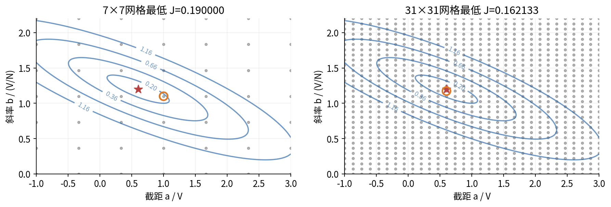

二维每轴取 $m$ 个点需要 $m^2$ 次目标评估；如果有 $d$ 个参数，朴素每轴网格需要 $m^d$ 个组合。比如每轴100点，二维是一万点，十维是 $10^{20}$ 点。这个计数解释了网格可视化适合低维教学，却不等于高维训练方案。它不是对某台 CPU 性能的实测断言。

梯度阈值也与目标缩放有关。若把目标乘以 $10^{-6}$，梯度也乘以 $10^{-6}$，相同参数会更容易满足原先的绝对阈值，但预测并没有变化。报告阈值时必须同时报告目标定义、坐标约定和度量。若已知严格正的最小曲率 $\mu$，二次例中可得 $J-J_*\leq\|\nabla J\|^2/(2\mu)$；不知道这些条件时，单独“梯度很小”不足以说明误差小。

## 15 约束边界会改变最优条件

现在只允许斜率 $b\leq1$，截距仍任意。原来的 $(3/5,6/5)$ 不可行。对每个可行斜率，最好的截距依旧为 $a=3-2b$；剩余损失为 $4/25+(b-6/5)^2$。在 $b\leq1$ 上，离 $6/5$ 最近的斜率是1，因此新的最优为 $(1,1)$，目标为 $1/5$。

此处梯度为 $(0,-2/5)$，不是零。负梯度会试图增加斜率，恰好指向不可行区域。因此“最优点梯度为零”只适用于之前的无约束内点条件，不能直接套在边界上。

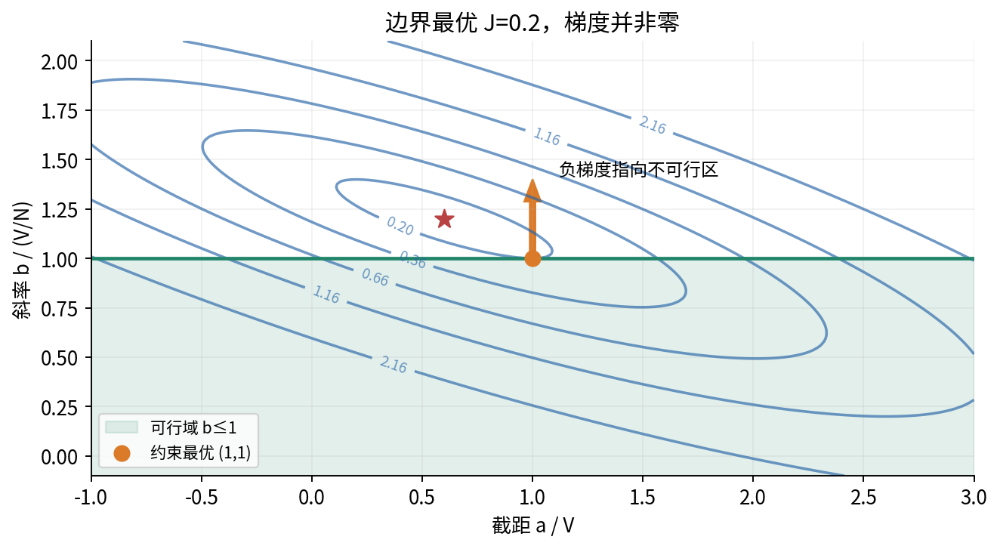

对任意可行方向 $d$，在这个边界必须有 $d_b\leq0$，所以 $\nabla J^\mathsf Td=-(2/5)d_b\geq0$。不存在可行的一阶下降方向。在本例的凸集合和凸目标上，这个条件能支持全局结论；完整的约束资格、乘子和 KKT 理论留待后续。不能由这一个半平面例子推出“所有约束问题只要把参数裁剪一下就能解”。

程序 constrained_reference 根据闭式消元得到这个答案，没有假装运行通用约束优化器。若输入本身没有可识别的斜率，本节函数明确拒绝套用该唯一解公式。

## 16 优化误差小 为什么仍可能预测不好

一次训练固定了样本，优化关心的是当前参数相对于该样本最优解的损失差：$J_D(\theta)-\min_\vartheta J_D(\vartheta)$。统计问题还关心新样本的期望风险 $R(\theta)=\mathbb E[(f_\theta(X)-Y)^2]/2$。这两个函数定义在同一参数空间，却一般不是同一张地图。

作一个完全指定的教学总体：$X$ 在0、1、2、3、4上等概率取值，$Y=1+X+\varepsilon$，其中 $\mathbb E[\varepsilon\mid X]=0$、$\mathbb E[\varepsilon^2\mid X]=1/4$。则展开平方并消去条件均值为0的交叉项，有

$$
R(a,b)=\frac18+\frac1{10}\sum_{x=0}^4[(a-1)+(b-1)x]^2.
$$

总体最优是 $(1,1)$，最低风险为 $1/8$。五点训练最优是 $(3/5,6/5)$，其总体风险为 $1/8+1/25=33/200=0.165$。训练最优在训练表上的损失是0.16，比总体最优参数的训练损失0.20更低；但在已指定的总体中，它的风险反而更高。这是可以逐项核算的反例，不需要靠一句“可能过拟合”代替解释。

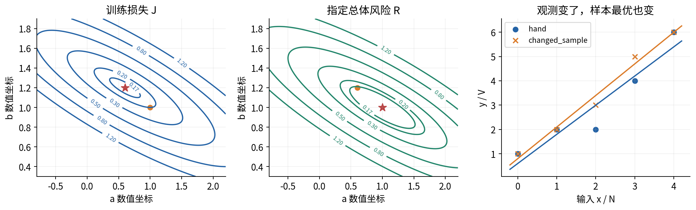

把标签改成 changed_sample 的 $(1,2,3,5,6)$，最优参数变为 $(4/5,13/10)$。这次差异来自观测改变，而不是优化器没收敛。所谓“统计误差”在不同理论中有不同的精确定义；本讲只区分样本最优和总体目标，并不把参数距离、超额风险、有限样本偏差混成一个可直接相加的标量。

模型失配又是另一层问题：即使能精确最小化总体直线风险，真实均值可能是一条曲线；可用的直线族本身有限。目标设置错误、数据泄漏、样本不代表部署环境、关联误当因果也不会被更低训练损失修好。研究报告应分别交代问题定义、数值求解证据和新数据评估证据。[Bottou、Curtis 与 Nocedal 的作者论文](https://arxiv.org/abs/1606.04838)从大规模学习背景讨论计算与统计两方面，但本讲没有用小型实验外推其系统性能。

## 17 把实验做成可以检查的证据

Notebook 的任务是重新计算这些地图，而非只显示预制图片。先读取并验证所有 CSV 行和 JSON 字段；再独立计算闭式参照、目标、梯度和 Hessian；最后构造网格、画图、运行有限步路径。无效末行或未选中的场景不能被跳过，否则相同文件会因选择不同而偶尔“可用”。

接口先检查原始类型，再转为 float。布尔值、文本、复数、扩展精度、非有限值与可能消失的极小正数不能被默默改成合法参数。CSV 和 JSON 数字从原始十进制词元检查，1e-400 会被拒绝，真正的0e-400可以接受；重复 JSON 键也拒绝。输入检查不能依赖会被 python -O 移除的 assert。

算法状态与数值结果共同保留。程序对每条路径保留有限历史和最后状态，对不支持的溢出、下溢或范围明确报错。输入无效时，旧输出必须保持原字节不变，且不能创建一个新报告装成成功。正常运行把完整结果序列化之后才原子替换输出文件。

本版提供真实执行过的 Notebook 输出和验证记录，但不把它们当成你本地环境一定可用的保证。Anaconda 的环境文件和浏览器 Jupyter 使用方法是复现路线；制作验证采用新的 Python 进程和真实 ipykernel InProcessKernel，未实际测试 Anaconda 安装或浏览器界面。完整操作与数值合同见独立 lab.pdf 和 README.md。

## 18 自检练习与后续连接

1. 对五点例区分数据空间、参数空间和损失曲面各坐标的含义。为什么参数空间的一条线通常不代表一条预测直线？
2. 从六个原始求和量展开 $J$，再验证配平方式，说明唯一性条件。
3. 手算 $(1,1)$ 和 $(0,6/5)$ 的残差、SSE、目标与梯度。
4. 把目标从 $J$ 改为 SSE。最优解、梯度、Hessian、同一步长的更新分别怎样变化？
5. 在 $(1,1)$ 写一个等高线切向方向和一个下降方向，验证内积关系。为何必须声明坐标尺度？
6. 证明 $H=A^\mathsf TA/n$ 半正定，并给出正定的充要条件。
7. 求五点 Hessian 的两个特征值，写出损失差和参数距离的上下界。
8. 推导 $(m,b)$ 坐标的目标、梯度与 Hessian。为什么它与原坐标采用相同步长时不是同一算法轨迹？
9. 完整求解三个常数输入点的最优集合、最低损失和零曲率方向。
10. 分别用定义判断 $u^2+v^2$、$-u^2-v^2$、$u^2-v^2$、$u^4+v^2$ 在原点的性质，解释 Hessian 判别的边界。
11. 手算从原点使用步长0.2的两次更新及每次损失；核对程序没有漏除5。
12. 设网格未包含真最优，怎样从边界最低点诊断这个问题？十维每轴100点需要多少组合？
13. 当路径预算为0、初值正好最优时，应报告什么？若初值非最优呢？说明停止检查的顺序。
14. 求解约束 $b\leq1$ 的问题，解释为什么最优点梯度不为零以及为什么不能推广成通用裁剪法。
15. 从指定的条件噪声模型推出 $R$，比较 $(1,1)$ 与 $(3/5,6/5)$ 的训练损失和总体风险。
16. 设计输入失败测试，使最后一个未使用候选、最后一行 CSV 和重复 JSON 键分别被拒绝。说明为什么旧报告不能先被清空。

完整解答在 answers.pdf。接下来第031讲会把一步中的“方向”和“步幅”分开，对一维二次函数严格推导收敛、震荡与发散区间；第032讲再回到这里的倾斜椭圆，解释多维更新怎样受不同曲率影响。此刻最重要的收获是：一个最优结论必须对应明确的问题、适用条件和可核验证据，不能只对应一张好看的曲面或一行成功状态。

## 来源与进一步阅读

本文数据、推导组织、图和练习均独立编写，没有复制教材章节或习题答案。以下一手材料用于核验标准定义与软件接口，详细实际访问记录见 source-checks.json。

- Stephen Boyd 与 Lieven Vandenberghe，[作者教材主页](https://web.stanford.edu/~boyd/cvxbook/)及[无约束最优化讲义](https://web.stanford.edu/class/ee364a/lectures/unconstrained.pdf)：凸二次目标、方向、强凸性和停止条件。教材公开阅读不等于可复制其图文或解答。
- NumPy 2.3，[eigvalsh](https://numpy.org/doc/2.3/reference/generated/numpy.linalg.eigvalsh.html)与[meshgrid](https://numpy.org/doc/2.3/reference/generated/numpy.meshgrid.html)：对称特征值、数组形状和网格索引约定。
- Matplotlib，[3.10.8 contour](https://matplotlib.org/3.10.8/api/_as_gen/matplotlib.axes.Axes.contour.html)与[quiver](https://matplotlib.org/stable/api/_as_gen/matplotlib.axes.Axes.quiver.html)：等高线和向量场的坐标、尺寸及缩放。quiver 查询使用稳定文档站，版本与本版实际运行版本不同；使用的核心参数在本地3.10.8执行核验。
- Léon Bottou、Frank E. Curtis、Jorge Nocedal，[Optimization Methods for Large-Scale Machine Learning](https://arxiv.org/abs/1606.04838)：计算优化与统计学习背景。该文不是本讲小型实验的外部效果背书。
