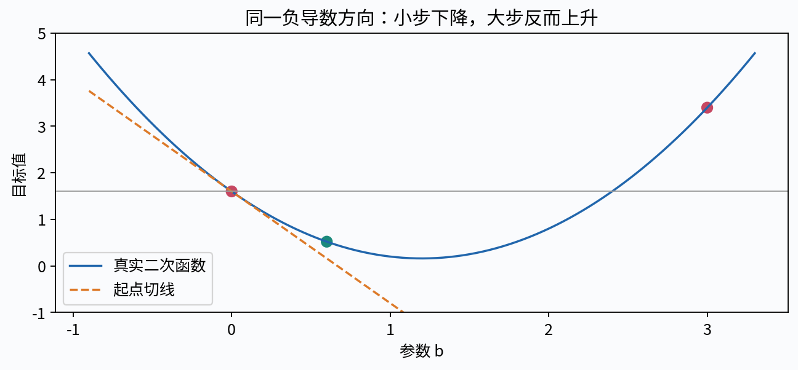
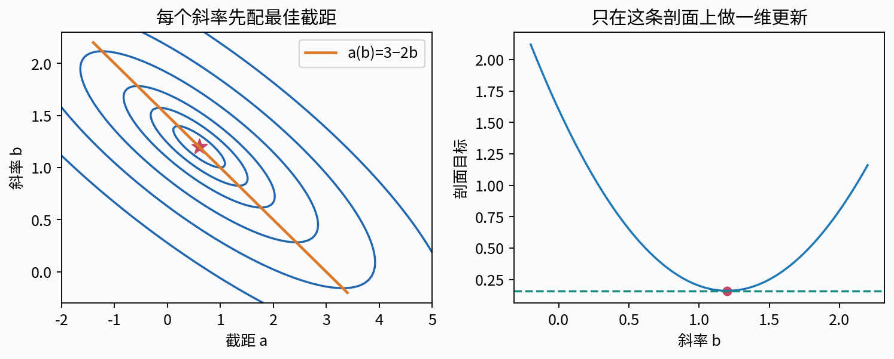
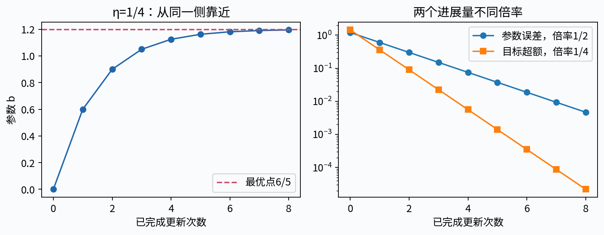
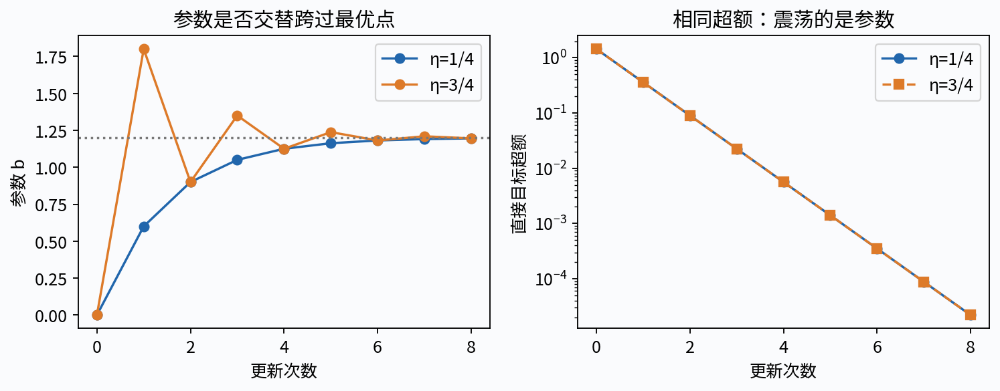
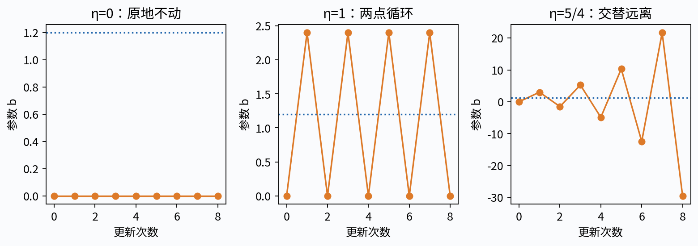
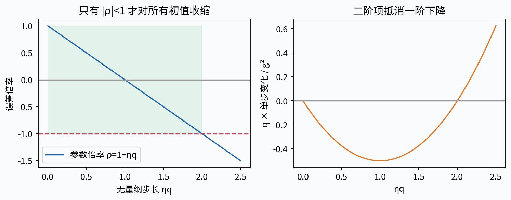
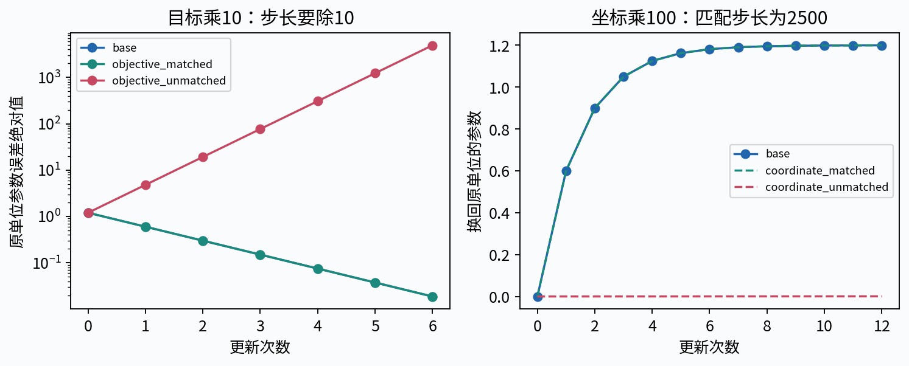
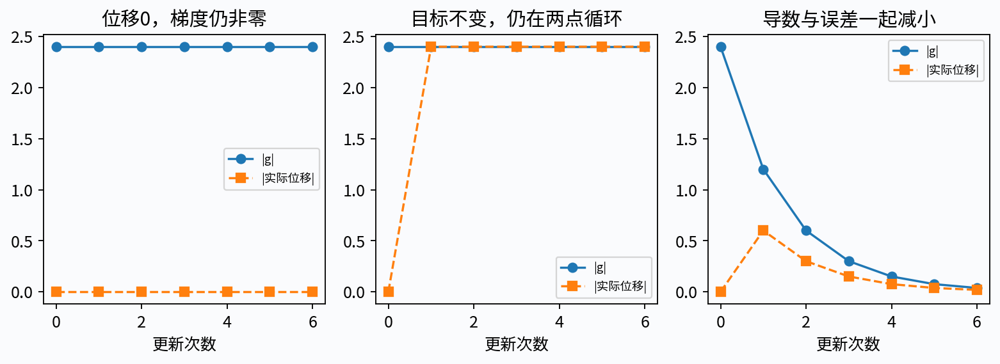
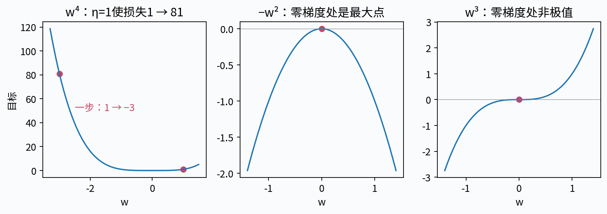

# 第三十一讲 一维梯度下降与学习率

## 1. 已经知道最优点，为什么还要一步一步走

第28讲用配平方直接求出了最优直线，第30讲把参数变成损失曲面上的位置。现在先只留下一个可动参数，研究一条最简单的更新规则：看当前导数，往相反方向移动一小步。这个步骤看似直观，却没有告诉我们步子多大才合适，更没有自动保证最后能到最优点。

本讲的核心问题是：为什么沿负导数走，以及一步究竟该走多远？我们选择有精确闭式解的一维二次函数，把每轮参数误差写成一个乘法递推。这样既能严格证明收敛范围，也能完整描述不跨过最优点、交替跨越、来回循环和发散。纸笔得到的公式会作为程序的独立参照，而不是让程序用自己的“成功”标签证明自己。

直接先修是第13、28讲的导数、局部近似和回归配平方。需要第8讲的幂、对数和序列记号。这里只研究确定性的全梯度、一维参数与固定学习率；随机梯度、多维曲率和学习率计划将在后面分别处理。小规模CPU实验不说明大模型训练速度或现实预测准确率。

## 2. 参数、导数、步长各是什么

设目标函数f:R→R，待选择的实数参数为w。w₀是初始位置，wₜ是完成t次更新后的参数，f(wₜ)是该位置的目标值。t是非负整数索引，不是样本编号，也不是实际经过的秒数。

梯度下降在一维的规则是

$$
w_{t+1}=w_t-\eta f'(w_t),\qquad t=0,1,2,\ldots
$$

η通常取正数，称学习率或步长系数。真正的参数位移是Δwₜ=−ηf′(wₜ)，不是η本身；即使η固定，导数变小也会使每轮位移变小。若w有单位，f也有单位，η的单位需要让ηf′与w一致，所以跨目标或跨单位比较“同一个学习率数字”通常没有意义。

这一讲也保留η=0作为故障对照：它完全不移动。负η通常沿上升方向移动，不属于默认下降算法，但会在理论分类里指出其后果。模型参数w由优化选择，η和停止阈值由实验设计事先指定，二者角色不同。

## 3. 从一阶近似解释负导数

在f于w可微且f′(w)≠0时，对足够小的位移h有f(w+h)=f(w)+f′(w)h+o(|h|)。选h=−ηf′(w)，η>0，则

$$
f\bigl(w-\eta f'(w)\bigr)
=f(w)-\eta[f'(w)]^2+o(\eta),\qquad \eta\to0^+.
$$

主导的一阶变化为负。由于余项除以η趋于0，存在某个足够小的正步长范围，使真正目标也下降。这是局部结论：它没有告诉我们任意η都能下降，也没有给出从每个位置出发都适用的统一阈值。

负导数不是指向已知最优点的一根完整距离箭头。导数给局部斜率；曲线可能很快弯转，大步走完后的一阶近似已不准确。若f′(w)=0，一阶项为零，这个论证也失效：该点可能是最小点、最大点或其他驻点，必须另看函数结构。

## 4. 从五点回归得到唯一的一维主问题

沿用第28讲合成数据x=(0,1,2,3,4)、y=(1,2,2,4,6)。已知x̄=2、ȳ=3、Sxx=10、Sxy=12。对每个斜率b，先把截距取到该斜率下的最佳值a(b)=3−2b。

把截距消去后，SSE(a(b),b)=8/5+10(b−6/5)²。我们本讲使用J=SSE/(2n)，n=5，因此一维目标为

$$
f(b)=\frac4{25}+\left(b-\frac65\right)^2.
$$

其导数f′(b)=2(b−6/5)，二阶导数恒为2，精确最小点b*=6/5，最小值f*=4/25。这里每轮更新b后，都用a(b)=3−2b配回截距；这叫先消去截距后优化斜率，不等同于把截距固定为0，也不等同于同时对两个参数做梯度下降。

主例的b₀=0对应a₀=3，是水平线3。所有学习率从同一初始模型出发，目标、数据和损失归一化相同。这样观察到的路径区别才可归因于步长，而不是悄悄换了问题。

把这一步拆到每一行。预测是ŷᵢ(b)=3+b(xᵢ−2)，残差rᵢ=ŷᵢ−yᵢ，单行损失ℓᵢ=rᵢ²/(2n)。链式法则逐个节点给出∂ℓᵢ/∂rᵢ=rᵢ/n、∂rᵢ/∂ŷᵢ=1、∂ŷᵢ/∂b=xᵢ−2，所以每行对共享参数b的贡献为rᵢ(xᵢ−2)/n。五行都依赖同一个b，必须把五个贡献相加。这也解释了为什么消去截距后，局部导数是xᵢ−2，而不是固定截距时的xᵢ。

在b₀=0处，五个预测都是3；残差为(2,1,1,−1,−3)，平方为(4,1,1,1,9)，平方和16，完整目标16/10=8/5。五个未除n的梯度贡献为(−4,−1,0,−1,−6)，合计−12，除5得到f′(0)=−12/5。取η=1/4，位移−ηf′=3/5，因此b₁=3/5，再配回a₁=3−2b₁=9/5。

这时必须重新前向计算，不能沿用旧残差。新预测为(9/5,12/5,3,18/5,21/5)，新残差(4/5,2/5,1,−2/5,−9/5)，平方和26/5，目标13/25=0.52。新梯度的五项分子为(−8/5,−2/5,0,−2/5,−18/5)，合计−6，除5为−6/5。下一轮位移3/10，得到b₂=9/10、a₂=6/5；再前向得到预测(6/5,21/10,3,39/10,24/5)，残差(1/5,1/10,1,−1/10,−6/5)，平方和5/2，目标1/4。完整链条是“预测→残差→损失与各行局部导数→共享梯度求和→更新→重新预测”，每一轮都重新计算。

## 5. 先推广到可完全求解的二次函数

把主例写进一般形式

$$
f(w)=c+\frac q2(w-w_*)^2,\qquad q>0.
$$

w*是唯一最小点，c是最小值，q是曲率。它们都是定义问题的固定常数，本讲用它们构造已知答案的教学模型；实际未知问题不能偷偷读取w*指导求解，再声称只用了梯度。

主例对应w=b、w*=6/5、c=4/25、q=2。导数为q(w−w*)。令参数误差eₜ=wₜ−w*，代入更新式可得

$$
e_{t+1}=(1-\eta q)e_t.
$$

定义ρ=1−ηq，这个无量纲数同时决定是否跨越最优点以及距离如何变化。所有后续结论都建立在固定q>0、固定η、精确算术和同一个二次目标之上，不能直接推广到任意函数。

## 6. 把一轮递推变成任意轮的闭式式子

第一轮e₁=ρe₀，第二轮e₂=ρe₁=ρ²e₀。数学归纳给出eₜ=ρᵗe₀，因此

$$
w_t=w_*+\rho^t(w_0-w_*),\qquad
f(w_t)-c=\frac q2\rho^{2t}(w_0-w_*)^2.
$$

目标超额是f(wₜ)−c，表示尚未消除的优化损失；它与完整目标f(wₜ)不同。主例有不可消除的训练残差c=4/25，所以即使参数无限接近最优点，f也不会趋于0。

若w₀恰好等于w*，e₀=0，任意有限η下都保持在最优点。学习率区间的必要性因此应表述为“对所有初值都收敛”或“对非最优初值”。漏掉这个例外，会把一个带条件的定理写成错误的绝对结论。

## 7. 不跨越最优点的收敛区间

若0<ηq<1，则0<ρ<1。eₜ保持原符号，绝对值逐轮缩小。起点在最优点左侧，就从左侧靠近；起点在右侧，就从右侧靠近，不会越过最优点。

主例η=1/4时ρ=1/2。由b₀=0、e₀=−6/5，得到b₁=3/5、b₂=9/10、b₃=21/20、b₄=9/8。对应截距a=3−2b，依次为3、9/5、6/5、9/10、3/4。每轮参数误差减半，目标超额则乘1/4。

这不意味着“参数每轮都减少”。主例b从0增加到1.2附近，因为导数为负。应该说离最优点的误差缩小，而不是把参数大小本身当成进展指标。

## 8. 跨越最优点也可以收敛

若1<ηq<2，则−1<ρ<0。误差符号逐轮交替，但绝对值仍按|ρ|缩小，参数会从最优点两侧交替逼近。

主例η=3/4时ρ=−1/2，b的前五个值为0、9/5、9/10、27/20、9/8。对比η=1/4，两条路径的误差绝对值逐轮完全相同，因此目标超额和完整目标也完全相同；一条不跨越，另一条交替跨越。

所以“参数在震荡”不等于“损失在增加”。这组震荡幅度几何缩小，损失单调下降。反过来，只看下降的损失曲线，也无法判断参数有没有跨越最优点。参数路径、误差绝对值与目标值需要分开画。

## 9. 一步到位、两点循环与发散边界

若ηq=1，ρ=0。无论初值如何，一次更新就得到w*。主例η=1/2时b₁=6/5。这是已知恒定曲率的一维二次函数的特殊性质，不是所有可微损失都能凭一个固定η一步到位。

若ηq=2，ρ=−1。非最优初值在w₀和2w*−w₀之间来回，距离不缩小，目标值也不变。主例η=1使b在0与12/5之间循环，目标都等于8/5；“每一步都朝负导数方向”仍然不能带来进步。

若ηq>2，ρ<−1。对e₀≠0，误差绝对值几何增长，并交替越过最优点。主例η=5/4时ρ=−3/2，b依次为0、3、−3/2、21/4、−39/8，越来越远。η=0使ρ=1，停在起点；η<0使ρ>1，也会远离最优点。

合起来：对任意非最优初值，固定步长梯度下降在该正曲率二次函数上收敛，当且仅当0<η<2/q。端点不包含在内。程序可以设置范围保护而在发散数值溢出前终止，但这个“保护停止”不能叫收敛。

## 10. 不用闭式轨迹也能核对单步损失变化

对本二次函数，设g=f′(w)=q(w−w*)，精确展开得到

$$
f(w-\eta g)-f(w)
=-\eta\left(1-\frac{\eta q}{2}\right)g^2.
$$

当g≠0且0<η<2/q时，右侧严格为负；η=2/q时为0；η>2/q时为正。它与误差递推给出的区间完全一致，是另一条代数交叉核验路线。

与第3节的一阶近似相比，这里补上了确切的二阶修正项η²qg²/2。η变大时，一阶预计收益与二阶代价竞争；到η=2/q刚好抵消。这也解释了为什么只看−ηg²会把过大步长误判为持续有利。

本节是一个具体二次函数的等式，不是对一般函数无条件成立的下降引理。一般的梯度变化上界、L-smooth条件和收敛界留到第33讲；提前知道它们的名字，不能省去条件。

## 11. “线性收敛”并不是直线速度

若0<|ρ|<1，误差绝对值是|e₀||ρ|ᵗ，目标超额是初始超额乘|ρ|²ᵗ。这通常称几何收敛，也常称线性收敛；意思是相邻误差之比固定，不是每轮减去相同数量。

在普通坐标中，曲线先降得快、后降得慢；对正的误差取对数后，log|eₜ|=log|e₀|+t log|ρ|，才是一条直线。主例η=1/4或3/4的误差每轮减半；η=1/10的ρ=4/5，下降更慢；接近2/q的稳定步长也可能很慢，因为|ρ|又接近1。

η越大不一定越快。一维恒定q已知时，η=1/q让|ρ|最小且为0；从这个点继续增大η会重新减慢，最后越过稳定边界。高维不可能通常用一个η把所有曲率方向同时消掉，下一讲会解释。

## 12. 需要多少轮：先定义你要的误差

假设0<|ρ|<1，目标是|eₜ|≤ε，ε>0。若起始误差已经满足要求，最少0轮；否则由|ρ|ᵗ|e₀|≤ε，取对数得到

$$
t\ge\frac{\log(\epsilon/|e_0|)}{\log|\rho|}.
$$

分子和分母都为负，除以负数时不等号方向需要正确处理。最少整数轮数应向上取整，并用原不等式复核边界，避免浮点log的末位误差多算或少算一轮。ρ=0需要单独处理：非最优初值1轮到位；|ρ|≥1时，这个收敛轮数公式不适用。

主例|e₀|=6/5，η=1/4或3/4，若要求参数误差≤10⁻⁶，20轮还不够，21轮满足。若要求梯度绝对值≤10⁻¹⁰，因为|g|=2|e|，需要35轮。不同停止指标对应不同要求，不能把“21轮”当作算法的固定属性。

本实验用Fraction分别检查第t轮满足且第t−1轮不满足，再与浮点计数比较。最大迭代预算是资源保护，不是这个数学最少轮数的替代。

## 13. 目标乘常数，最小点不变，学习率却应改变

若把目标换成f̃=κf，κ>0，则最小点不变，但导数变为κf′，曲率变为κq。要让同一初值产生完全相同的精确参数路径，应取η̃=η/κ，使η̃κ=η。

主例若把J=SSE/(2n)换成SSE，κ=2n=10。原η=1/4稳定；若错误地继续对SSE用1/4，乘子变成1−(1/4)×20=−4，立即发散。把步长改成1/40后，才恢复原来乘子1/2的路径。

加上一个常数与乘上一个常数也不同：f̃=f+C不改变导数、参数更新或精确超额，却可能让浮点显示的目标差值更难分辨。报告学习率时应同时报告目标定义和归一化，单独给η数字不完整。

## 14. 参数改单位，又是另一种缩放

设新坐标v=s w，s≠0，把同一个目标写成g(v)=f(v/s)。链式法则给g′(v)=f′(v/s)/s，曲率变为q/s²。在v坐标中一步更新，再换回w，得到

$$
w_{t+1}=w_t-\frac{\eta_v}{s^2}f'(w_t).
$$

所以要匹配原坐标学习率η_w，必须取η_v=s²η_w。主例若把斜率数值放大100倍，等价坐标路径需要把学习率乘10000，而不是乘100。若在新旧坐标使用同一个数字η，实际上改变了原坐标中的更新幅度。

这不是说任意标准化都应该如此做，而是在明确的一维线性重参数化下推导精确关系。目标乘κ导致η除κ；参数坐标乘s导致匹配的η乘s²。二者经常被混在一句“改单位”里，本讲把链式法则展开以免记错。

## 15. 停止准则只能说明它检查的量

对这一个已知q>0的二次函数，有|g|=q|e|，且f−c=g²/(2q)。因此梯度阈值|g|≤τ能够换算成参数误差≤τ/q和目标超额≤τ²/(2q)。换算依赖已知正曲率，不是一般函数里的免费保证。

若只检查位移|wₜ₊₁−wₜ|，极小η会让位移很小，即使还离最优点很远。η=0时位移恒为0，却完全没有学习。若只检查目标变化，η=2/q的两点循环每次目标变化为0，也会被误判为完成。

本实验至少保存参数、导数、完整目标、由误差直接计算的目标超额、更新位移和停止原因。达到梯度阈值、预算耗尽、两点循环、浮点停滞与增长保护应使用不同状态。每轮的计数也要说明：w₀是0轮状态，更新T次后才是w_T。

## 16. 精确收敛与浮点运行不是同一句话

精确数列可以永远保持非零并继续收敛，浮点数却只有离散的可表示位置。接近w*时，一次理论位移可能小于当前位置的一个浮点间隔，减法就返回原值；这时程序停滞，不应把“参数没变”直接当成精确导数为零。

另一个问题是目标差值消失。即使超额q e²/2为正，把它加到较大的常数c上也可能舍入为c，再做f−c得到0。为了教学核对，本实验另外按q e²/2直接计算超额，与减法结果并列，不用后者宣称误差精确为零。

Python的math.ulp和nextafter可查看附近可表示数；Fraction.from_float读取的是已经存储的二进制值，不是原先脑中想要的十进制分数。精确理论轨迹使用CSV里的整数分子/分母，浮点轨迹使用它们明确转换后的值，两种参照必须标明。求解器不应在每轮偷偷用闭式式子替代实际更新，再声称测到了累积舍入行为。程序因此保留两套精确参照：原始有理数模型的6/5与4/25，以及实际存储的float中心、曲率和常数在精确算术下的递推。后者隔离了系数存储误差，但仍不包含每轮乘法、减法的舍入；实际trace才包含这些舍入。

## 17. 不是二次函数时，刚才的常数区间不能照搬

考虑h(w)=w⁴。它处处可微且有全局最小点0，但曲率12w²随位置变化，没有全实数范围内的有限曲率上界。在w₀=1、η=1时，梯度为4，更新到−3，目标从1升到81。负导数方向没有错，步长太大使局部预计失效。

再看h(w)=−w²，在w=0导数为0却是最大点；h(w)=w³在0也有零导数，却不是局部极值。它们说明“梯度为0”需要结合结构解释。这里不是要完整分析这些函数上的全轨迹，只用可手算的反例界定本讲证明的适用范围。

对于一般函数，可能需要控制梯度变化、回溯选步、处理定义域或采用别的算法。后面的课会逐步增加这些工具。现在最重要的习惯是：写清楚证明究竟用了固定曲率、凸性、极小点存在还是其他假设，而不是把一张下降曲线当成定理。

## 18. 纸笔、代码与图如何互相核验

先从五点数据独立计算x̄、ȳ、Sxx、Sxy、SSEmin，得到q=Sxx/n=2、w*=6/5、c=4/25。用分数纸笔计算至少前四轮，再运行直接使用导数的浮点更新。每轮检查理论eₜ=ρᵗe₀，不能仅核对最后一个打印值。

用η=0、1/10、1/4、1/2、3/4、1、5/4覆盖主要区间。至少画参数路径、误差绝对值、目标超额与步长分类四种视图。0误差不能直接取log；应明确标记一步到位或在图注中说明显示下限，不让0变成缺失后被误读为失败。

随后比较目标乘10且步长补偿、参数坐标乘100且步长补偿，检查换回原单位的路径；再故意不补偿，展示差异。最后验证坏CSV、末尾非法学习率、JSON非零下溢和重复键等失败输入，在迭代和输出前就被拒绝。

## 19. 为什么优化更准确仍不等于模型更好

把b算得更接近6/5，只说明更准确解决了这五行数据上的既定平方目标。若直线模型不合适、标签错误或新数据来自另一机制，优化到更多小数位不会自动改善真实预测。

同样，选择某个学习率让20轮训练损失最低，是一个计算选择；若进一步用测试集挑学习率、停止轮数或模型，就涉及验证设计，不能再把同一测试结果当独立证据。这里没有进行真实任务模型选择，也没有声称一维最优学习率可直接用于神经网络。

本讲把优化误差、数值表示误差和统计/模型误差放在不同层次。精确递推解决第一层的理论，浮点对照检查第二层，第三层需要新的数据和假设。把这三层分开，才能知道某个错误应该调整步长、改善计算，还是重新思考任务。

## 20. 自测与完整验收

1. 写出wₜ、η、f′和实际位移的含义，说明η固定为什么不等于每轮移动距离固定。
2. 从可微的一阶近似严格解释负导数方向的局部下降条件，并说明f′=0的例外。
3. 从五点回归的SSE配平方推出本讲的一维f(b)，说明截距如何随b变化。
4. 对c+q(w−w*)²/2推导误差递推及任意t的参数、目标超额闭式式子。
5. 分类0<ηq<1与1<ηq<2的参数行为，解释为什么两者都可有单调下降的损失。
6. 用Fraction写出η=1/4和3/4各前四次更新，比较两条路径每轮目标超额。
7. 分析ηq=0、1、2和大于2的行为，同时写清楚初值已在最优点的例外。
8. 从精确二次展开推导单步目标变化，独立得到稳定学习率范围。
9. 解释“线性收敛”的含义，以及参数误差与目标超额的不同倍率。
10. 计算主例η=1/4下达到参数误差10⁻⁶和梯度10⁻¹⁰各需多少轮，并核对前一轮。
11. 目标乘10后，怎样改变学习率才能保持路径？把J换为SSE时为什么尤其容易出错？
12. 参数新坐标v=100w时，推导匹配原坐标轨迹的学习率，而不是凭直觉猜100倍。
13. 构造小位移却未优化好的例子，以及目标变化0却仍两点循环的例子。
14. 对本二次函数由梯度阈值推出参数误差和超额损失界，说明这些换算的假设。
15. 解释浮点参数停滞和f−c变为0的两种机制，以及为什么要单独记录直接计算的超额。
16. 手算w⁴从1以η=1更新一步，解释它为什么不反驳二次函数结论。
17. 给出零导数不是最小点的反例，区别驻点和最优点。
18. 设计一组包含区间边界、初值例外、迭代预算与损坏输入的验收测试，解释每种停止状态。

实验指南、可执行Notebook与十八题详解各自独立成文件。下一讲将误差乘子推广到多个曲率方向，解释为什么一维中能一步到位的选择，在多维往往会变成缓慢的之字形路径。

## 来源与核查范围

- [MIT 6.390 一维梯度下降讲义](https://introml.mit.edu/_static/spring24/LectureNotes/chapter_Gradient_Descent.pdf)：核对更新、学习率与实际位移的区别及不同停止指标。本讲回归剖面、分数轨迹和边界证明独立构造，不复制其例题或图。
- [Boyd与Vandenberghe 无约束优化课件](https://web.stanford.edu/class/ee364a/lectures/unconstrained.pdf)：核对下降方向、步长选择、停止准则的角色和相关假设；本讲只证明具体一维二次模型，不借用一般收敛保证。
- [Cornell CS4787 梯度下降讲义](https://www.cs.cornell.edu/courses/cs4787/2025fa/lectures/lecture5.html)：核对曲率限制与驻点不等于全局最优的边界。所有本讲公式由自己的二次展开复核，后续课程再讨论一般下降引理。
- [Python 3.12 math](https://docs.python.org/3.12/library/math.html)：核对ulp、nextafter、有限值与近似比较接口。
- [Python 3.12 Fraction](https://docs.python.org/3.12/library/fractions.html)与[浮点表示说明](https://docs.python.org/3.12/tutorial/floatingpoint.html)：核对从整数分数与从已存储float建立精确参照的差别。
