# 032 多维梯度下降与尺度

## 1. 一个步长怎样同时照顾多个方向

第031讲把一维误差写成“上轮误差乘一个数”。已知正曲率q时，η=1/q甚至能一步到最优点。现在参数不止一个：若一个方向很平，另一个方向很陡，同一个η既要让前者走得动，又不能让后者跨得太远。不同要求会冲突，路径便可能在狭长谷底两侧反复折返。

本讲的核心问题是：不同方向曲率不同时，为什么下降会走之字形？我们先从逐样本平方损失推导完整向量梯度，再把同一更新旋转到Hessian的特征方向中。每个方向重新变成第031讲的一维递推，但乘子不同。最后说明特征缩放怎样改变这些乘子，以及它何时只是改变计算、何时也改变了所求模型。

直接先修为第014至015、029、031讲：内积和矩阵形状、最小二乘、特征值、偏导与一维更新。不了解特征向量时，可先读第2至7节的对角主例；第8节再把“坐标轴方向”推广成“相互垂直的特征方向”。实验只用小型原创合成数据，不声称任何真实任务精度或运行速度。

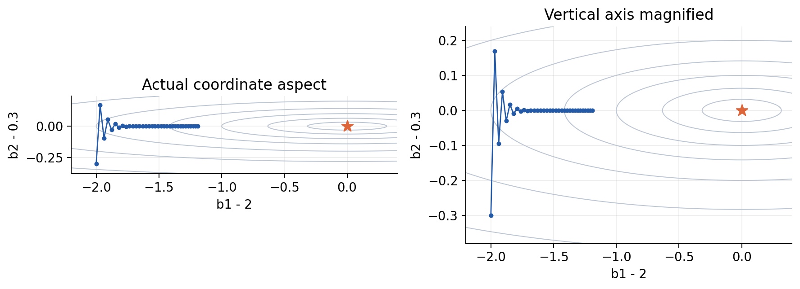

## 2. 先把符号和形状写清楚

有n条训练样本、d个特征。第i行特征为$x_i^T\in\mathbb R^{1\times d}$，特征矩阵$X\in\mathbb R^{n\times d}$。加上截距列得到$A=[\mathbf1,X]\in\mathbb R^{n\times p}$，其中p=d+1。A的列用j=0,…,d编号，Aᵢ₀=1。参数$\beta=(a,b_1,\ldots,b_d)^T\in\mathbb R^p$，标签$y\in\mathbb R^n$。

预测与残差为$\hat y=A\beta$、$r=A\beta-y$，都在$\mathbb R^n$。本讲统一规定“预测减观测”，目标始终是

$$
J(\beta)=\frac1{2n}\sum_{i=1}^n r_i^2
=\frac1{2n}\|A\beta-y\|_2^2.
$$

J不是SSE，也不是MSE。1/2抵消平方求导时的2，1/n保证按样本平均；二者都不能在推导中默默消失。样本重复一遍，平均目标与梯度不变；如果改用求和目标，同一数据复制会改变曲率和稳定步长。

特征可有不同物理单位，bⱼ的单位是“标签单位/第j特征单位”；截距单位是标签单位。梯度分量也因此有不同单位。使用一个普通欧氏范数和一个数值η，隐含选定了参数坐标中的度量。说“负梯度是最陡方向”时，必须说明用的是当前坐标的欧氏距离。

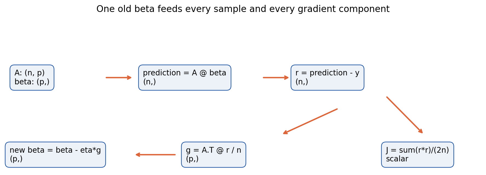

## 3. 从单个样本推到整批梯度

把第i条样本对总目标的贡献记为$\ell_i=r_i^2/(2n)$。对任意参数βⱼ，依次经过预测、残差、平方损失，有

$$
\frac{\partial\hat y_i}{\partial\beta_j}=A_{ij},\qquad
\frac{\partial r_i}{\partial\hat y_i}=1,\qquad
\frac{\partial\ell_i}{\partial r_i}=\frac{r_i}{n}.
$$

相乘得到$\partial\ell_i/\partial\beta_j=r_iA_{ij}/n$。每个参数被所有n个样本共同使用，所以要沿样本维求和，而不是覆盖前一个样本的结果：

$$
\frac{\partial J}{\partial\beta_j}
=\frac1n\sum_{i=1}^n A_{ij}r_i,
\qquad \nabla J(\beta)=\frac1n A^T(A\beta-y).
$$

Aᵀ的形状是p×n，乘n维残差后得到p维向量，才能从p维β中减去。若代码将y写成(n,1)、预测写成(n,)，相减可能广播成(n,n)，程序不报错却已经换了问题。实验要求y和β严格是一维数组，拒绝把列向量自动“修好”。

为什么选负梯度？在可微点，记g=∇J(β)。微小位移δ带来的一阶变化为$J(\beta+\delta)-J(\beta)=g^T\delta+o(\|\delta\|)$。取δ=−ηg且g≠0，一阶项为−η‖g‖²，所以足够小的正η给出下降。若只在单位欧氏方向v中选择，由Cauchy–Schwarz不等式，$g^Tv\ge-\|g\|$，等号由$v=-g/\|g\|$取得。负梯度因而在当前欧氏度量下最陡，梯度为0时这条论证不提供下降方向；实际有限步长还要控制高阶项。

整批梯度下降先使用同一旧β计算所有预测、残差和分量梯度，然后一次性更新

$$
\beta_{t+1}=\beta_t-\eta\nabla J(\beta_t).
$$

在循环里改完b₁后立刻用新b₁去算b₂的导数，是另一种顺序更新，不能再套本讲的向量递推。整批也意味着每次更新使用全部训练样本；小批量和随机梯度留到后续讲次。

## 4. 四条样本让两个尺度显形

令u、v独立取±1，并枚举四个角。取x₁=u、x₂=10v，标签定义为$y=3+2u+3v+uv/2$。最后一项不能由截距、u、v的线性组合表示，它留下非零最小残差。四行数据是：

| i | x₁ | x₂ | y |
|---|---:|---:|---:|
| 1 | −1 | −10 | −3/2 |
| 2 | −1 | 10 | 7/2 |
| 3 | 1 | −10 | 3/2 |
| 4 | 1 | 10 | 17/2 |

这里n=4、d=2、p=3。三列1、x₁、x₂相互正交，平方和分别为4、4、400。因此$A^TA/4=\operatorname{diag}(1,1,100)$，$A^Ty/4=(3,2,30)^T$。解正规方程可得$\beta^*=(3,2,3/10)^T$。

最优预测为(−2,4,2,8)，残差为(−1/2,1/2,1/2,−1/2)。逐项平方均为1/4，SSE*=1，所以J*=1/8。不要把标签中的“3v”误认为原x₂的系数3；x₂=10v，原单位系数应为3/10。

令$e=\beta-\beta^*$。最优残差与A的每列正交，展开$\|Ae+r^*\|^2$时交叉项为0，于是

$$
J(\beta)=\frac18+\frac12(a-3)^2
+\frac12(b_1-2)^2+50(b_2-3/10)^2.
$$

b₂方向曲率100，其他两个方向曲率1。等高线狭长不是最优点有问题，而是同样的数值位移在不同方向付出的目标代价不同。

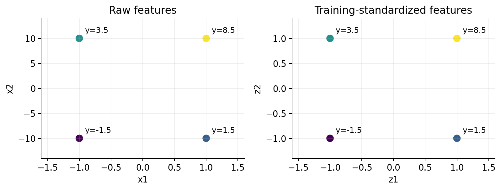

## 5. 第一轮从预测一直算到新的前向值

从$\beta_0=(0,0,0)$开始，取η=1/64。全部初始预测为0。下表每个偏导已经包含1/n=1/4；把每列相加就得到总梯度，不能再除4。

| i | 预测 | rᵢ | rᵢ²/8 | ∂ℓᵢ/∂a | ∂ℓᵢ/∂b₁ | ∂ℓᵢ/∂b₂ |
|---|---:|---:|---:|---:|---:|---:|
| 1 | 0 | 3/2 | 9/32 | 3/8 | −3/8 | −15/4 |
| 2 | 0 | −7/2 | 49/32 | −7/8 | 7/8 | −35/4 |
| 3 | 0 | −3/2 | 9/32 | −3/8 | −3/8 | 15/4 |
| 4 | 0 | −17/2 | 289/32 | −17/8 | −17/8 | −85/4 |

损失相加为356/32=89/8；三个导数列相加为(−3,−2,−30)。例如b₂分量为(−15−35+15−85)/4=−30，它的绝对值比b₁大，并不说明第二个特征更“重要”，这里只是数值尺度不同。

同步更新三个参数：

$$
a_1=0-\frac1{64}(-3)=\frac3{64},\quad
b_{1,1}=0-\frac1{64}(-2)=\frac1{32},\quad
b_{2,1}=0-\frac1{64}(-30)=\frac{15}{32}.
$$

第一行新预测必须重新前向计算：3/64−1/32−10×15/32=−299/64。其他行只改变相应特征的符号，得到下表。平方损失不是沿用旧残差，也不能仅凭参数靠近就猜它下降。

| i | 新预测 | 新残差 | 新样本损失rᵢ²/8 |
|---|---:|---:|---:|
| 1 | −299/64 | −203/64 | 41209/32768 |
| 2 | 301/64 | 77/64 | 5929/32768 |
| 3 | −295/64 | −391/64 | 152881/32768 |
| 4 | 305/64 | −239/64 | 57121/32768 |

四个平方项相加得到$J_1=257140/32768=64285/8192$，约7.84729，小于11.125。b₂已经从0越过最优值0.3到0.46875，而a、b₁仍远未到3和2。整体下降和某一参数越过最优值可以同时发生。

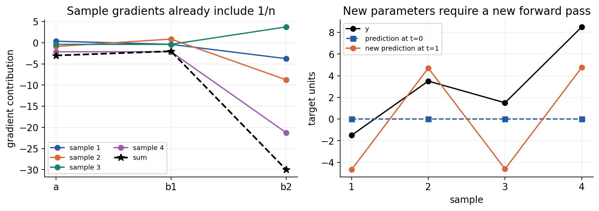

## 6. 第二轮验证折返从哪里来

上一节新残差依次为(−203,77,−391,−239)/64。每个样本再乘(1,x₁,x₂)/4，得到完整梯度贡献：

| i | ∂ℓᵢ/∂a | ∂ℓᵢ/∂b₁ | ∂ℓᵢ/∂b₂ |
|---|---:|---:|---:|
| 1 | −203/256 | 203/256 | 1015/128 |
| 2 | 77/256 | −77/256 | 385/128 |
| 3 | −391/256 | −391/256 | 1955/128 |
| 4 | −239/256 | −239/256 | −1195/128 |
| 合计 | −189/64 | −63/32 | 135/8 |

注意b₂梯度从负变正，更新将向回拉。仍使用η=1/64，得到

$$
\beta_2=
\begin{pmatrix}3/64\\1/32\\15/32\end{pmatrix}
-\frac1{64}
\begin{pmatrix}-189/64\\-63/32\\135/8\end{pmatrix}
=\begin{pmatrix}381/4096\\127/2048\\105/512\end{pmatrix}.
$$

重新前向：预测为(−8273,8527,−7765,9035)/4096；逐行减去y后，残差为(−2129,−5809,−13909,−25781)/4096。四条样本损失依次为2129²、5809²、13909²、25781²除以134217728。相加化简为$J_2=224099341/33554432$，约6.67868。

再累加残差乘特征并除4，可得$g_2=(-11907/4096,-3969/2048,-1215/128)$，b₂分量又变回负。b₂路径0→0.46875→0.205078125，在0.3两侧折返；a、b₁缓慢单侧逼近。两轮的每条样本预测、残差和导数都已给出，程序核验须逐项比对，不只比“训练成功”。

## 7. Hessian把多条偏导重新联系起来

对$g_j=\sum_i A_{ij}(\sum_kA_{ik}\beta_k-y_i)/n$再对βₖ求导，A和y固定，因此

$$
H_{jk}=\frac{\partial^2J}{\partial\beta_j\partial\beta_k}
=\frac1n\sum_i A_{ij}A_{ik},\qquad
H=\frac1n A^TA\in\mathbb R^{p\times p}.
$$

H对称。任意向量v满足$v^THv=\|Av\|^2/n\ge0$，故它半正定；A列满秩时，v≠0必有Av≠0，H才正定。若有重复列或零列，会出现零曲率方向，不能直接写一个正的最小特征值。

本讲平方目标的H不随β变化。在存在最优解β*时，$A^T(A\beta^*-y)=0$，所以

$$
\nabla J(\beta)=H(\beta-\beta^*),\qquad
e_{t+1}=(I-\eta H)e_t.
$$

主例H为对角阵，于是误差的三个分量各自乘63/64、63/64、−9/16。前两个正且接近1，进展缓慢；最后一个负且绝对值小于1，交替衰减。第5至6节繁琐的样本计算，正好验证了这条短递推。

## 8. 特征方向上每一条都是一维问题

一般H不一定对角，但实对称矩阵有正交分解$H=Q\Lambda Q^T$，Q的列是单位特征向量，QᵀQ=I；$\Lambda=\operatorname{diag}(\lambda_1,\ldots,\lambda_p)$。把误差旋转到这些方向，记$z_t=Q^Te_t$，左乘Qᵀ得到

$$
z_{t+1}=(I-\eta\Lambda)z_t,
\qquad z_{j,t}=(1-\eta\lambda_j)^t z_{j,0}.
$$

这就是多维之字形的机制。它不要求原始坐标轴与谷底对齐；一个大的特征值方向跨越，一个小的特征值方向缓慢前进，映回原坐标后就形成斜着的折返。梯度一般不是直接指向最优点：e与He只有在e落在某个特征子空间或H为标量I等特殊情况下平行。

若H正定、λ最大记作L，要求对所有初值都收敛，必须且只须$|1-\eta\lambda_j|<1$对全部j成立，即0<η<2/L。η=2/L的最大曲率分量会两点循环；大于这个上界时，该分量增长。但若初值在该方向分量恰好为0，单条轨迹仍可能收敛。稳定区间是“对所有初值”的保证，不能由一个特殊起点推翻。

若λⱼ=0，则该方向乘子为1，梯度更新保留初始分量。最小二乘中相应方向位于A的零空间，改变参数却不改变预测；目标可能趋于最小，但参数没有被数据唯一识别。满秩和欠秩必须分开陈述。

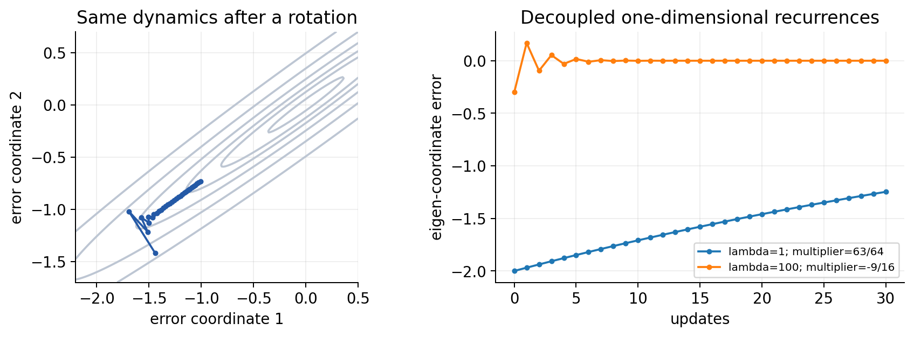

## 9. 条件数为什么决定一个步长的妥协

正定H的最小特征值记作m>0，最大为L，谱条件数$\kappa=L/m\ge1$。给定η，最坏方向误差缩放率是

$$
\rho(\eta)=\max_j|1-\eta\lambda_j|
=\max\{|1-\eta m|,|1-\eta L|\}.
$$

后一等号来自绝对值仿射函数在区间[m,L]的最大值出现在端点，且两个端点确实是特征值。想同时压低两端，最好的固定数值步长把一正一负的幅度配平：1−ηm=−(1−ηL)，解得$\eta_*=2/(m+L)$，$\rho_*=(\kappa-1)/(\kappa+1)$。这里“最好”是最小化所有初始方向的最坏欧氏误差倍率，不是针对某一个已知初值，也不是一般非二次问题的全局最优步长。

因为Q正交，$\|e_t\|_2\le\rho^t\|e_0\|_2$。目标超额是$J-J^*=\sum_j\lambda_jz_j^2/2$，因此至多乘ρ²ᵗ。κ=100时，最坏最优倍率为99/101，约0.980198，仍很接近1。κ=1时所有方向曲率相同，η=1/L才恢复一维的一步到位。

若使用η=1/L，则平缓方向倍率1−1/κ，高曲率方向一步消失。这能避免任何特征方向交替，却不一定最快。主例η=1/100让b₂一步到位，但a和b₁每轮仅减少1%的误差；不之字形不等于不慢。

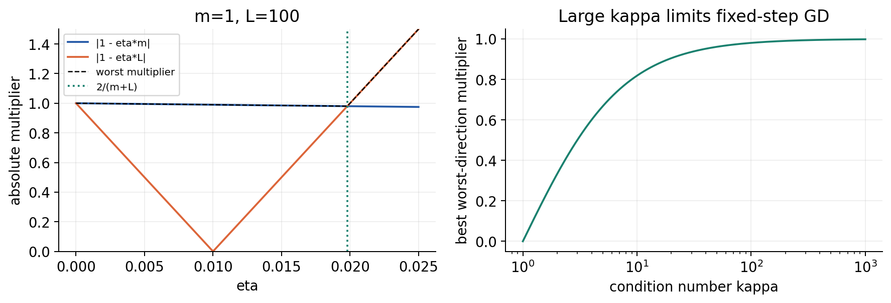

## 10. 梯度形状对了 平均因子仍可能错

若本来要算$g=A^Tr/n$却写成$\tilde g=A^Tr$，更新等价于把η放大n倍。主例n=4，原η=1/64会变成有效η=1/16，大于2/100，b₂方向乘子从−9/16变为−21/4。第一轮就得到β=(3/16,1/8,15/8)，远远越过0.3。

反过来，如果写损失时已逐样本除n，累加梯度后又除一次n，则有效η缩小n倍。可能仍下降，但速度、理论界和记录的步长都不再对应。检查方法不是看loss会不会降，而是手算一个分量，并复制全部样本一次：平均目标及同一β下的梯度必须不变。

把目标明确改成SSE/2当然允许，此时H和梯度确实乘n，稳定上界除n。如果同时把η除n，精确参数路径可保持。错误来自不一致，而不是“求和损失”本身违法。第031讲的目标乘常数规则在多维完全保留。

## 11. 标准化重新定义参数坐标

用训练集每一列的均值μⱼ及总体型标准差$s_j=\sqrt{\sum_i(x_{ij}-\mu_j)^2/n}$，在sⱼ>0时定义$z_{ij}=(x_{ij}-\mu_j)/s_j$。S=diag(s₁,…,s_d)。若标准化模型是$\hat y=\alpha+z^T\gamma$，代回原特征后

$$
b=S^{-1}\gamma,\qquad a=\alpha-\mu^TS^{-1}\gamma.
$$

反向为γ=Sb、α=a+μᵀb。完整参数满足β=Tθ，其中θ=(α,γᵀ)ᵀ，

$$
T=\begin{pmatrix}1&-\mu^TS^{-1}\\0&S^{-1}\end{pmatrix},
\quad A_s=AT,\quad J_s(\theta)=J(T\theta).
$$

链式法则给$\nabla_\theta J_s=T^T\nabla_\beta J$、$H_s=T^THT$。这不是普通正交旋转：T一般不正交，所以特征值和欧氏梯度范数可改变。新坐标做一步梯度下降，再映回原坐标：

$$
\beta_{t+1}=\beta_t-\eta TT^T\nabla J(\beta_t).
$$

若μ=0，TTᵀ=diag(1,s₁⁻²,…,s_d⁻²)，即不同方向获得不同有效步长。若μ≠0，截距与斜率项也会耦合，不能只写“各斜率除方差”而漏掉截距。

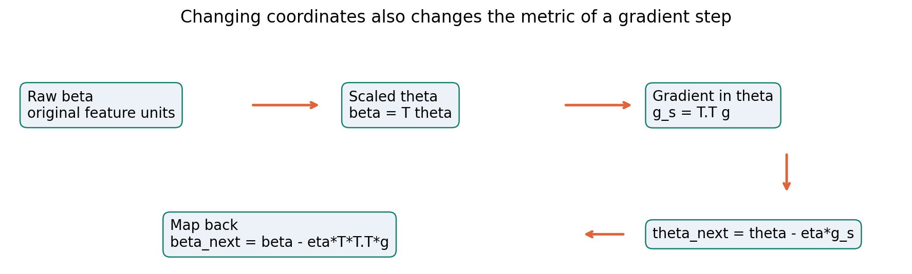

## 12. 主例缩放后为什么一步就能到位

主例μ=(0,0)、s=(1,10)，标准化特征恰好是(u,v)。三列仍正交且平方和都为4，因此Hₛ=I₃、θ*=(3,2,3)。初值0的梯度为(−3,−2,−3)，用ηₛ=1更新一次得到θ₁=(3,2,3)，映回β₁=(3,2,0.3)。

这一步也可以逐样本查：初始残差仍为(3/2,−7/2,−3/2,−17/2)。截距、u列梯度贡献与第5节相同；v列贡献为(−3/8,−7/8,3/8,−17/8)，相加为−3。更新后预测(−2,4,2,8)，残差(−1/2,1/2,1/2,−1/2)，样本损失均1/32，总损失1/8；三列梯度全部为0。

一步到位依赖这个人为构造的正交、等曲率数据，并不意味着“标准化让线性回归总是一步学会”。它也需要重新选择η。若标准化后仍用1/64，所有方向倍率都是63/64，仍然缓慢；只做预处理、完全不调整数值步长，本例不会神奇加速。

实验既运行原坐标路径，也运行标准化坐标路径，并统一映回原坐标作图。比较预测或参数时，必须先把θ映回β，不能把γ₂=3和b₂=0.3直接当成误差2.7。用闭式解作参照是为了测量本实验的优化误差，不是梯度下降每轮偷偷调用闭式解。

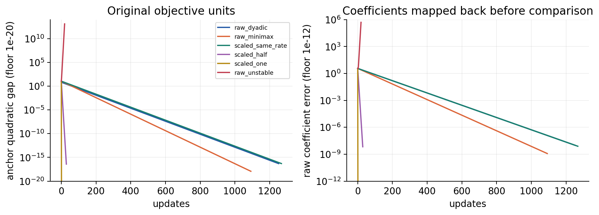

## 13. 迭代数的比较必须使用同一把尺

默认脚本每条路径在其工作坐标的梯度范数≤10⁻⁸时停止，最多更新4000次，初始状态记t=0。实测原坐标η=1/64在1252次停止，近似minimax步长2/101在1092次停止；标准化η=1/64、1/2、1分别在1268、29、1次停止。原坐标η=1/32不稳定，在完成19次更新后下一候选超出参数保护范围，不能称为收敛。

这些梯度阈值数值相同，意义却随坐标改变。因为$g_s=T^Tg$，缩放后小梯度不保证原坐标梯度也小于同一数字。标准化η=1/2停止时，原坐标梯度范数约5.63×10⁻⁸。直接把所有停止轮数当成等精度速度比赛会误导。

为了可比，另定义同一训练预测函数距离$E_{\rm pred}=\|A(\beta_t-\beta^*)\|/\sqrt n$，原单位一致，而且对平方目标有$J-J^*=E_{\rm pred}^2/2$。实验从已保存状态寻找首次E_pred≤10⁻⁸，并报告原单位参数误差。耗尽预算或保护停止而未达标的路径必须写“未达到”，不能用最后一轮当作完成轮数。实验指南给出本版精确统计。

完整损失接近1/8时，J−J*的浮点减法可能已经变0，而参数仍有误差。程序额外用$\|A(\beta-\beta^*)\|^2/(2n)$直接计算非负二次差。β*的显示仍是舍入后的参照，泛化到病态输入时不是严格误差证书；精确分数参照和逐样本手算负责独立交叉验证。

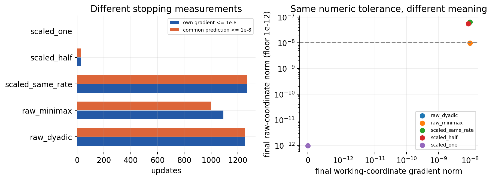

## 14. 方差相同仍可能有狭长谷底

把第二个例子的特征改成x₁=u、x₂=u+v/8，标签仍为第4节的四个数。两个特征几乎表达同一方向，原H的斜率块为[[1,1],[1,65/64]]。其条件数约258.012。标准化后两列方差均为1，但相关系数ρ=8/√65，约0.992278；斜率块变为

$$
\begin{pmatrix}1&\rho\\\rho&1\end{pmatrix},
\qquad \lambda_{\pm}=1\pm\rho.
$$

特征向量分别沿(1,1)与(1,−1)，因此κ=(1+ρ)/(1−ρ)约257.996，几乎没有改善。把每列尺度调到一样，不能消除列与列之间的信息重复。若x₂=x₁完全相同，λ₋=0，标准化也不能恢复缺失的独立信息。

更一般的线性变换能够旋转并缩放相关方向，例如白化；但需要处理小特征值、训练拟合与数值稳定，并会改变坐标中的惩罚含义。本讲不把它当作无条件修复，也不把H的条件数与设计矩阵A的条件数混用：满列秩、2范数下，κ(H)=κ(A)²。

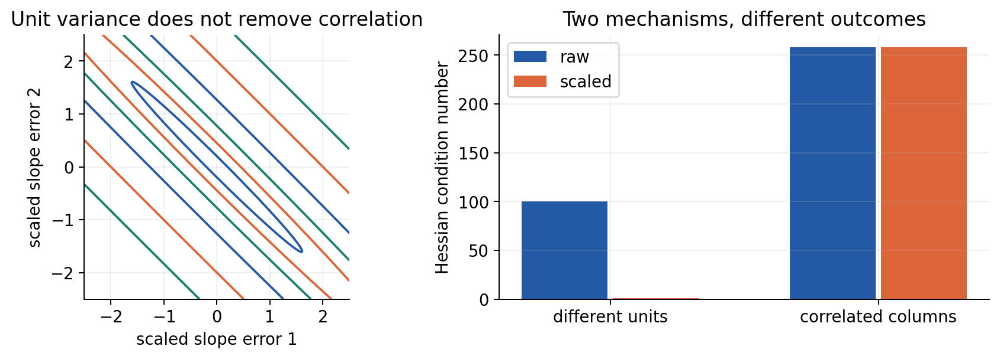

## 15. 零方差列与训练集之外的数据

若某列训练值全为7，均值7、标准差0，直接除0不合法。本实验将该列的缩放因子设为1，减均值后训练列全为0，并明确返回zero_variance标记。截距列不参与标准化，始终保留1。零列没有提供可识别斜率，H仍奇异；设置s=1只是让计算定义清楚，没有创造信息。

新数据该列若出现9，使用原训练均值7和缩放1会得到2，不能为了使它再次变0而重拟合预处理。训练中无法识别这个方向的系数，也就不能仅凭训练拟合好声称能可靠外推。原constant例确切秩为2；数值eigvalsh返回约−1.1×10⁻¹⁶的小负数是舍入现象，不能据此宣布平方目标非凸，也不能为了好看把它当成正曲率。

主例另存两行待预测特征(2,20)、(−2,30)。只用训练统计，它们变为(2,2)、(−2,3)，闭式模型预测13和8。若把这两行与训练行混在一起重新求μ、s，预处理已经使用了未来数据。即便未读取测试标签，它也改变了训练程序能获得的信息。

因此应先划分数据，每折只在该折训练部分拟合μ、s；验证和测试仅调用同一transform。有限步优化和带正则化模型尤其可能受泄漏影响。即使本例无正则、精确满秩最小二乘的可逆变换保持预测类不变，也不能用这个特殊不变性作为一般泄漏许可。

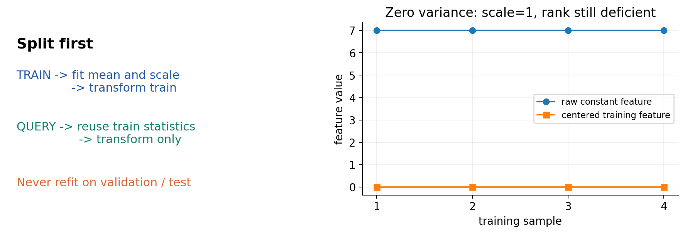

## 16. 正则化下 标准化可能改变你在求什么

无正则、含截距且sⱼ>0时，θ↔β为一一对应，因此最小化训练平方目标的预测集合相同。然而梯度路径、有限迭代停止点与欧氏参数误差改变。若添加惩罚，还必须把惩罚一起换坐标。

例如原问题是$J(a,b)+\lambda\|b\|^2/2$，不惩罚截距。由于b=S⁻¹γ，在新坐标表达同一个问题必须写$J_s(\alpha,\gamma)+\lambda\sum_j\gamma_j^2/s_j^2/2$。若直接改成λ‖γ‖²/2，映回去就是$\lambda\sum_js_j^2b_j^2/2$，不同尺度的原系数被不同强度地惩罚。

主例λ=1，原坐标普通L2解为a=3，b₁=2/(1+1)=1，b₂=30/(100+1)=30/101。标准化坐标普通L2解为α=3，γ=(1,3/2)，映回b=(1,3/20)。第二个系数从约0.29703变成0.15，预测也确实不同。只有使用变换后的加权惩罚γ₁²+γ₂²/100，才恢复原问题。

这不意味着某一种惩罚必然正确。应该根据任务说明系数单位、尺度和先验，再用独立验证选择；不能把“标准化是常规操作”理解为“不改变任何假设”。有界系数、稀疏惩罚和提前停止也具有坐标依赖。

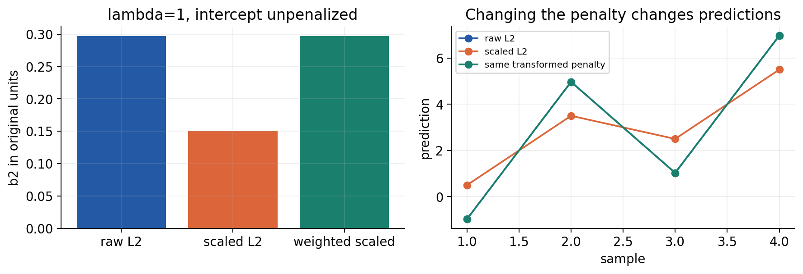

## 17. 从零实现整批更新以及独立参照

核心计算只有三行：prediction=A@beta，residual=prediction−y，gradient=A.T@residual/n；然后beta_next=beta−eta*gradient。短代码并不代表可以省略输入检查、停止定义与数值核验。附带脚本先检查原始类型与所有输入，拒绝bool、复数、对象数组、扩展浮点和形状广播，再开始拟合统计、求谱或迭代。

每个状态记录旧参数、预测、残差、目标、梯度、梯度范数和迭代编号。history包含初始状态，更新T次时记录T+1条。达到梯度容差、预算耗尽、下一候选超出范围、无容差浮点停滞与两点循环分别命名；只有达到梯度容差标success=true。候选被保护拒绝时，最后状态仍是最近一次真正算过的参数。

参照用输入实际存储的二进制数转Fraction，精确构造AᵀA和Aᵀy，再进行有理数消元。这条路线没有调用梯度下降；Notebook还用NumPy lstsq交叉对照，并显式重新计算残差平方和。奇异设计只报告精确秩与不唯一，不拿任意某个参数向量作为唯一真值。大型数据不适合本讲的有理数计算，真实大规模求解需要不同工程取舍。

CSV和JSON从原始十进制词元验证，非零1e−400不能先转成0后混过去；重复JSON键、最后一条路径中的非法学习率都使整个运行在计算与输出前失败。Notebook带固定手算说明，因此第一格在任何数值打印前核对三个默认输入文件的完整字节哈希；允许自定义数据的脚本与固定教学Notebook承担不同合同。

## 18. 本讲结论的边界和自测

Hessian谱分析在这里是固定二次函数的精确结论。一般损失的H可能随参数变化，还可能有负特征值；单个起点的谱不能自动给出全程安全步长。第033讲会引入光滑性条件和一般收敛界。本讲也没有把更小训练误差当作更好泛化，更没有用四个合成样本比较真实算法的性能。

1. 写出A、β、r、梯度、H的形状，解释(n,1)标签可能造成什么广播错误。
2. 从单个样本链式法则推导Aᵀr/n，并解释为什么必须沿样本累加和同步更新。
3. 独立算主例AᵀA、Aᵀy、β*、每条最优残差与J*。
4. 不跳步复算η=1/64的第一轮：所有预测、残差、样本损失、梯度贡献、更新与新前向。
5. 完整复算第二轮，并说明b₂为什么反向移动而损失仍下降。
6. 推导H半正定、满列秩时正定以及e递推。
7. 推导特征方向乘子，写出所有初值收敛区间、端点与特殊初值例外。
8. 推导最坏倍率、最佳固定minimax步长及其与κ的关系。
9. 主例η=1/100为何不折返却仍慢？参数误差和目标超额倍率有何区别？
10. 漏除n会怎样改变有效学习率？用复制样本检验平均梯度。
11. 推导含非零均值的完整T、梯度变换、H变换和映回原坐标的更新。
12. 逐样本复算标准化后η=1的一次更新，并解释为何旧η不自动加速。
13. 为什么相同数值的梯度容差不能直接用于跨坐标公平比较？设计共同指标。
14. 推导相关例标准化后的谱与条件数，解释标准化为何未消除相关性。
15. 训练列全为7如何处理？测试出现9怎样变换？H有微小负数如何解释？
16. 用两行query数据写出正确transform与预测，并说明在全数据上fit的错误。
17. 推导λ=1时两种普通L2的解，以及保持原问题的加权惩罚。
18. 设计覆盖原始类型、末条坏配置、非零下溢、零预算、保护停止和输出不覆盖的测试。

## 来源与核查范围

- [Boyd与Vandenberghe 无约束优化作者课件](https://web.stanford.edu/class/ee364a/lectures/unconstrained.pdf)：核对梯度方向、曲率、之字形与坐标度量关系。本讲四角数据、谱推导、全部算例和图独立构造。
- [NumPy 2.3 eigvalsh](https://numpy.org/doc/2.3/reference/generated/numpy.linalg.eigvalsh.html)及[lstsq](https://numpy.org/doc/2.3/reference/generated/numpy.linalg.lstsq.html)：核对实对称谱、返回值和最小二乘秩语义，不把浮点输出当精确秩证明。
- [scikit-learn StandardScaler官方说明](https://scikit-learn.org/stable/modules/generated/sklearn.preprocessing.StandardScaler.html)：核对训练统计、ddof=0、零方差尺度约定；本讲独立实现，没有调用该库。
- [scikit-learn预处理与泄漏说明](https://scikit-learn.org/stable/common_pitfalls.html)：核对先划分、训练fit、其他数据transform的流程。
- [Python 3.12 Fraction](https://docs.python.org/3.12/library/fractions.html)及[JSON](https://docs.python.org/3.12/library/json.html)：核对精确存储参照、解析钩子与非标准数字控制。
