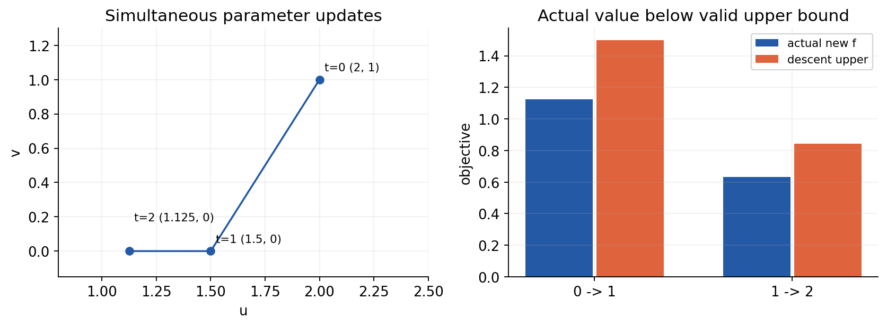
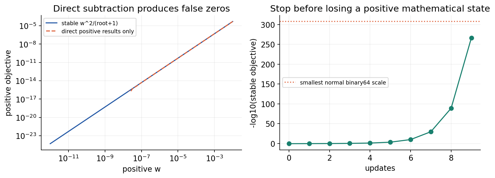

# 第033讲实验指南 下降条件与收敛分析

## 实验要回答的问题

本实验把“曲线下降”拆成四个可以逐项检查的问题：更新是否按定义执行，声称的假设是否真实成立，适用的数学界控制哪个量，以及浮点程序在什么地方停止。完成后，你应该能从一份报告中找到完整前向、梯度、更新和重新前向，而不是只读最后一行成功标志。

直接先修为第015至016、031至032讲。需要会用Python列表、循环、函数、文件路径以及向量内积。全部数据是两维或一维的无量纲合成数学例子，规模很小，CPU即可；不需要GPU、在线账号、外部数据或付费接口。

## 1 文件和环境

将本讲整个目录解压到同一位置，保留data子目录。experiment.py是可直接运行的实现；experiment.ipynb是带已执行输出的教学Notebook；outputs/report.json记录全部有效状态；lecture.pdf与answers.pdf分别提供证明和自测详解。Notebook所需NumPy和Matplotlib只用于绘图，核心更新脚本仅用Python标准库。

推荐Python3.12。已有环境可以安装requirements.txt；新建环境可以使用environment.yml。两条路线二选一，不需要重复安装。

```bash
conda env create -f environment.yml
conda activate ml-unit033
python experiment.py
jupyter lab experiment.ipynb
```

或使用自己的Python虚拟环境：

```bash
python -m venv .venv
source .venv/bin/activate
python -m pip install -r requirements.txt
python experiment.py --output outputs/my-report.json
```

第二条路线须先激活新虚拟环境，再执行pip和python。macOS/Linux激活命令是source .venv/bin/activate；Windows PowerShell为.venv\Scripts\Activate.ps1。环境创建命令是供学习者复现的说明；本讲实际验收使用已有CPU环境，没有声称实际创建过Anaconda环境或测试过浏览器Jupyter界面。Notebook已在新Python进程启动的真实InProcessKernel中清空输出并顺序执行，未测试socket内核传输。

## 2 先读输入 再做任何一次更新

quadratic.csv两行分别定义u、v坐标，curvature为q=(1,4)，initial为(2,1)。目标是f(w)=Σqⱼwⱼ²/2，梯度分量qⱼwⱼ，Hessian diag(q)。因此L=max(q)=4、μ=min(q)=1。这里1/2必须保留；若把目标改为Σqⱼwⱼ²而不改梯度或步长，你已经改变了实验。

model_spec.json给出40次更新预算，主例步长0.25，辅助凸函数初值4和步长1，非凸函数初值0、1和步长1，以及边界步长0.5、0.75。claimed_L_values为4、8、1，claimed_mu_values为1、0.5、2。故意错误的正数被允许进入“反例诊断”字段；它们绝不能自动成为收敛定理的证书。

程序先检查全部字段，包括最后一个列表元素和并非当前图重点展示的辅助函数。API只接受原始内置int或float实数；拒绝bool、字符串、复数、Decimal及NumPy标量。数组须为list或tuple，长度正确。JSON拒绝重复键、NaN、Infinity、非零数转成0的下溢；CSV必须恰好三列两条数据、顺序为u和v。完整范围见README。

Notebook的第一代码格先读取两个默认输入的完整字节摘要，再验证所有字段，随后才打印任何数字。修改默认文件后保留旧手算和图是不允许的。要改变问题，请复制数据并用脚本的--data和--config参数运行，单独解释结果；若要改变Notebook，必须同步更新全部教学叙述和参照后重新验收。

## 3 第一轮手算 不要先看曲线

在纸上建立t=0、1、2三行记录，每行包含坐标、平方、各坐标损失贡献、总目标、两个局部导数、梯度平方和及到0的距离平方。第一行：u=2、v=1，平方4、1，贡献2、2，总目标4；∂f/∂u=2、∂f/∂v=4，梯度平方和20，距离平方5。

同时更新两个坐标得到u₁=2−0.25×2=1.5，v₁=1−0.25×4=0。新的前向是平方2.25、0，贡献1.125、0，总目标1.125；新的梯度为(1.5,0)。不要沿用旧梯度(2,4)。第二轮得到u₂=1.125、v₂=0，目标0.6328125，梯度(1.125,0)，梯度平方与距离平方均为1.265625。

在终端或Notebook中核对：

```python
import experiment as e
r = e.compile_report(*e.load_inputs())
for s in r['quadratic']['history'][:3]:
    print(s['iteration'], s['w'], s['squares'])
    print(s['loss_contributions'], s['value'], s['gradient'])
```

第一步下降引理右侧为4−(1/8)×20=1.5，实际1.125，余量0.375。第二步右侧1.125−(1/8)×2.25=0.84375，实际0.6328125，余量0.2109375。请解释为什么“上界不紧”不是程序错误。



## 4 用三种指标对齐三条结论

对主例，每个状态都记录value、gradient_squared与distance_squared。目标差等于value，因为f*=0。不要把不同单位的三个数用同一个阈值随意比较。报告的iteration是已经完成的更新数；history[0]是尚未更新的初始状态。

对于T≥1，convex_bound为10/T；strong_bound为4(3/4)^T；nonconvex_gradient_bound为32/T，比较对象是history[0:T]中的最小gradient_squared，刻意不包含history[T]。后者不是最终目标差界。T=0时所有1/T字段必须是null，几何界则仍等于初始目标4。

主例完整40次更新后，f₄₀约2.0226981023×10⁻¹⁰，凸界为0.25，强凸界约4.0226340647×10⁻⁵，最小梯度平方界为0.8。数值之间差距大并不矛盾。实际轨迹在第26次更新首次达到目标差10⁻⁶；通用几何界给充分预算53次，指数松界给61次。53与61由公式计算，默认实验没有声称执行了这两段预算。

## 5 完整路径如何独立核对

二次目标可以用Fraction保存输入的精确有理数，独立递推wₜ₊₁,ⱼ=(1−ηqⱼ)wₜ,ⱼ。默认前两步全部精确；后续浮点乘法可能舍入，所以比较完整路径要用相对误差或ULP尺度，不能声称所有40步都是精确分数。

先算分数版的w、平方、损失、梯度和界，再与浮点报告比较。独立检查下降式、距离势能式、三种界以及正确的最小梯度索引。不要用experiment.py输出的“期望值”去验证同一个函数，那只是循环确认。

含根号函数使用Decimal的高精度sqrt，从实际存储的浮点值构建Decimal.from_float参照。程序的稳定值w²/(sqrt(1+w²)+1)应与高精度值接近。对默认完整有效轨迹还要独立进行高精度递推。对三角函数，有限有界点可使用Decimal Taylor级数作独立数值参照；这仍是有限精度检查，全球L=1来自|−cosw|≤1的解析证明。

## 6 凸但非全局强凸的实验

h(w)=sqrt(1+w²)−1，h′(w)=w/sqrt(1+w²)，h″(w)=(1+w²)⁻³ᐟ²。曲率大于0且不超过1，因此严格凸、1光滑；它在|w|→∞时趋0，任何全局正μ都不成立。w*=0唯一，初值4对应d₀²=16，η=1，保证是h(w_T)≤8/T。

接近0时，直接sqrt(1+w²)−1会因相减抵消返回0。脚本采用w²/(sqrt(1+w²)+1)。更新也会抵消：w−w/sqrt(1+w²)在根号被舍入为1时返回0。η=1时采用代数等价的w×w²/[r(r+1)]，其中r=sqrt(1+w²)，避免制造假零。

下降上界本身同样可能抵消。η=1时

$$
h(w)-\frac{g(w)^2}{2}
=\frac{w^4(2r+1)}{2r^2(r+1)^2}.
$$

脚本用这个正量计算descent_upper，同时保留descent_upper_naive_diagnostic演示直接相减的问题。一般η下还加上(1−η)²g²/2。默认在t=7、8时直接相减上界已经返回0，稳定形式仍为正，因此不能把那两个负的“直接相减余量”误判成定理失败。

默认t=9仍有w≈7.0765792185×10⁻¹³⁴、h≈2.5038986718×10⁻²⁶⁷。下一次正的数学更新小到binary64无法保留，报告numeric_range_limit，完成9次更新后停止，不追加虚假的零状态。不应把“9次”解释为达到数学最优，或把后续31次画成执行过的结果。



## 7 光滑非凸的两个初值

对于f(w)=1+cosw，使用f=2cos²(w/2)计算目标，梯度仍为−sinw。从0出发，梯度恰为0，返回初始驻点，目标2。报告另给出清楚标记为解析延伸的40步常值路径结论：最小梯度平方0≤4/40；没有假称执行40次不必要的重复计算。

从1出发，实际完成5次更新到存储的math.pi。此时目标约7.4987989133×10⁻³³，梯度约−1.2246467991×10⁻¹⁶；下一次更新舍入后位置不变，停止标签floating_stagnation。目标不是精确0，梯度也不是精确0。到“存储的奇数倍π”的距离0并不意味着到数学上精确π的距离0，报告字段特意注明这个限制。

请分别说明这两个停止状态。再回答：为什么同一个全局光滑常数允许“初值0一直在最大点”和“初值1下降到最小点附近”同时出现？梯度小究竟能支持什么结论？

## 8 故意破坏条件

沿高曲率轴从(0,1)开始，η=0.5给vₜ=(−1)^t，损失始终2；η=0.75给vₜ=(−2)^t，损失2×4^t。每个路径的safe_rate_for_stated_bounds都为false，因此不会输出本讲η≤1/L下的凸界或强凸界。这不改变主例本身L=4、μ=1的事实。

查看certificates。L=4、8有效，L=1标记assumptions_false_counterexample，并列x=(0,0)、y=(0,1)的实际2与假上界0.5。μ=1、0.5有效，μ=2标记同样的失败标签，反例在u轴，实际0.5低于假下界1。

w⁴从1以η=1一步到−3，损失1变81。它没有全局有限L；只检查起点的二阶导数12不能保证整条[−3,1]线段适用L=12。该线段上最大二阶导数是108。|w|在0没有普通导数，则是另一种失败机制，不能与“光滑但常数估计错误”混成同一种情况。

## 9 无效输入与输出保护

先保存一个已有结果文件的字节摘要，再构造非法输入运行到同一个输出位置。应抛出ValueError且已有输出完全不变；不能留下半份JSON。把最后一个boundary_rates元素改为true，把最后一个claimed_mu_values元素改为复数，或把未选中的非凸初值改为NaN，也必须在第一条轨迹前拒绝。

JSON测试要真的写出重复键和1e-400等原始文本，因为先在Python中构造字典会丢掉重复键，先把1e-400转成浮点也已经失去了非零信息。脚本拒绝输出到输入文件、experiment.py、README、PDF或包内非outputs目录，解析符号链接，并拒绝已有硬链接指向输入。允许输出到outputs或外部新路径。

```python
from pathlib import Path
import tempfile
import experiment as e
with tempfile.TemporaryDirectory() as folder:
    out = Path(folder) / 'kept.json'
    out.write_bytes(b'KEEP')
    bad = Path(folder) / 'bad.json'
    bad.write_text('{"steps": 0, "steps": 1}')
    try:
        e.run(config_path=bad, output=out)
    except ValueError:
        pass
    if out.read_bytes() != b'KEEP':
        raise RuntimeError('Existing output was modified')
```

重复执行时以python和python -O各跑一次，并从本讲之外的工作目录启动，以检查是否错误依赖当前目录或assert。默认输入按experiment.py本身的位置寻找，而不是按当前目录寻找。

## 10 完成标准

交出三状态手算、两步下降余量、三种界的对象与索引、有效和错误常数的反例、三个不同停止状态的解释。你还应该能说明：凸函数最优值未必达到；强凸几何界要求η≤1/L和正确的μ；T=0不计算1/T；有限网格与有限轨迹不能证明全局假设。

最后核对Notebook的完整报告与命令行JSON字节一致，实际显示的图来自重新计算的对象，全部单元顺序运行无隐藏状态。测试范围只覆盖明确列出的有限教学输入，不是对所有实数机器运算或所有平台的形式化认证。关于一般函数的保证，以正文的证明和完整假设为准。
