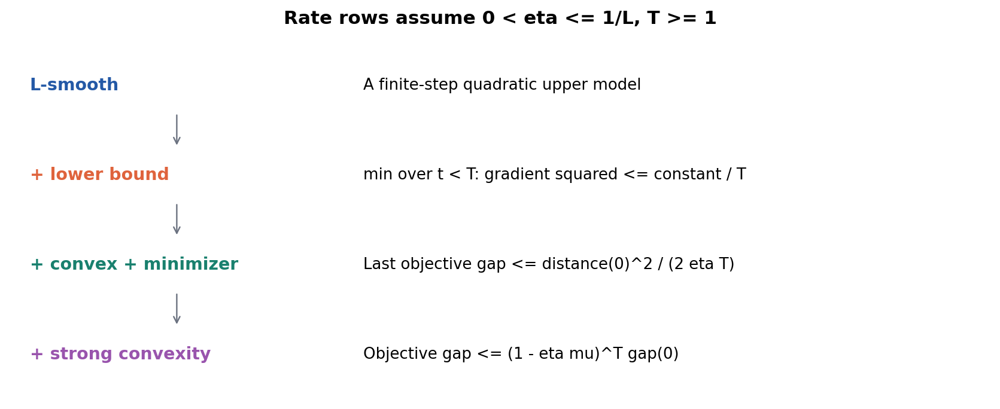
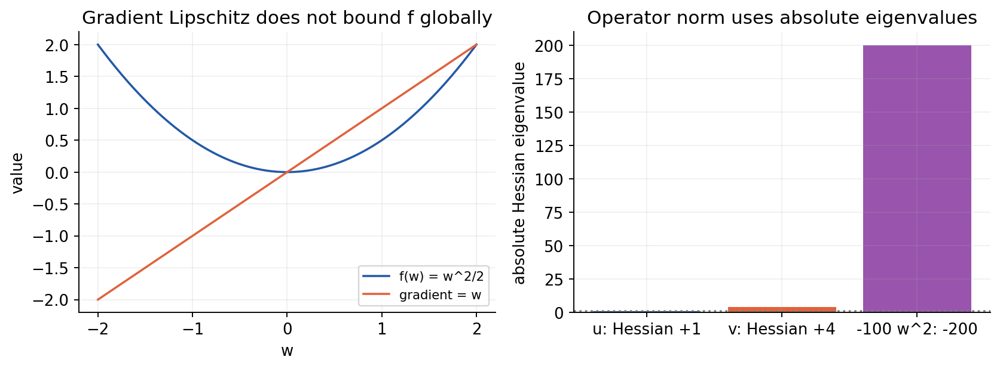
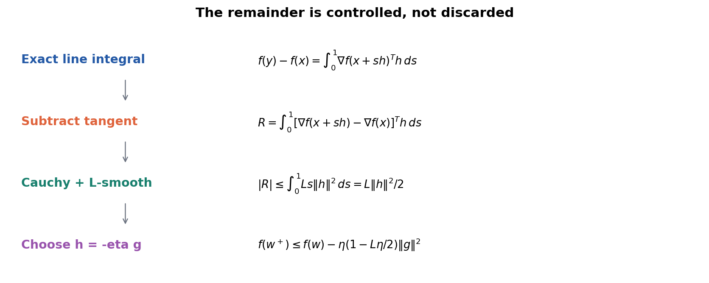
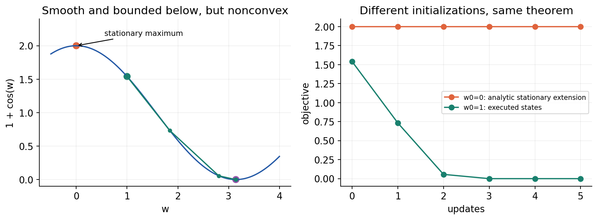
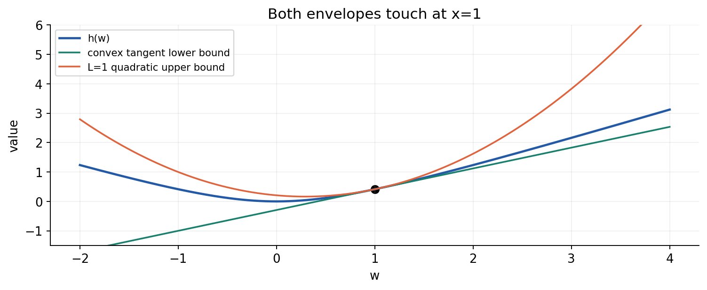
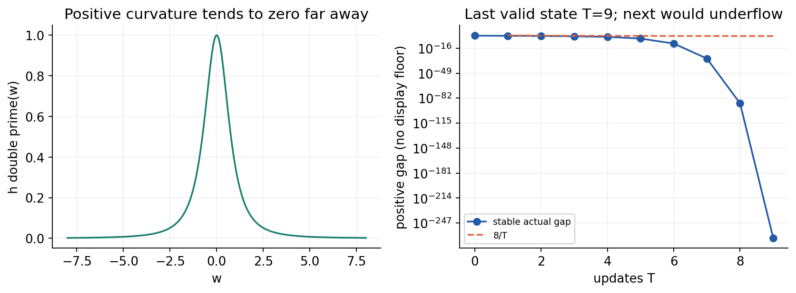
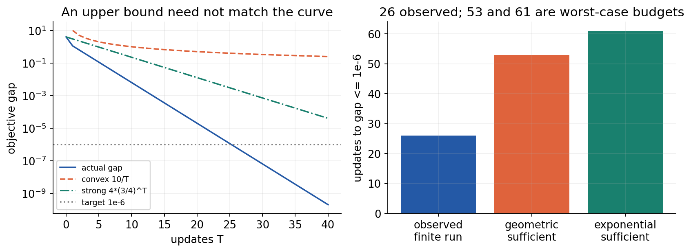
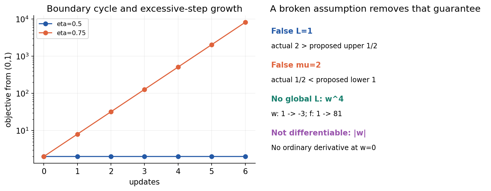
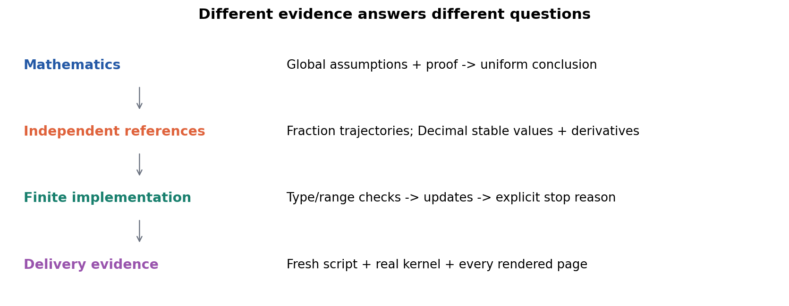

# 第033讲 下降条件与收敛分析

## 1 一张下降曲线还欠缺什么

第031讲把一个一维二次函数的误差写成乘法递推，第032讲把同一思想推广到多个曲率方向。现在不再假设函数恰好是二次式。我们要回答：什么时候能够证明下降，证明依赖什么，最后证明的是目标差、梯度小，还是参数接近？

本讲直接先修是第015至016讲的Hessian、范数、极限和基本证明，以及第031至032讲的梯度更新。需要能读懂向量内积和一元微积分基本定理。每条结论都会列出假设、受控量和迭代索引；不能仅因某张图看起来像下降，就宣布一般函数都收敛到全局最优。

贯穿全讲的可手算主例为f(u,v)=(u²+4v²)/2，从(2,1)开始。我们逐个中间量计算两轮，再把它与一般上界比较。另用一个凸但不全局强凸的函数、一个光滑非凸函数，以及破坏假设的例子，检查哪些结论还能留下。全部是确定性合成数学实验，不评价真实预测或大模型训练速度。

## 2 先固定符号 形状与三个误差量

设f:Rᵈ→R可微，参数列向量w∈Rᵈ，梯度g(w)=∇f(w)∈Rᵈ。内积gᵀh为标量，欧氏范数||h||₂=√Σhⱼ²。更新wₜ₊₁=wₜ−ηgₜ，其中η>0固定，gₜ=∇f(wₜ)。w₀是初始状态，完成T次更新得到w_T。

若最小值达到，记某个最优点w*和最小值f*=f(w*)。目标差δₜ=f(wₜ)−f*是非负标量；梯度范数||gₜ||说明当前位置是否近似驻点；距离dₜ=||wₜ−w*||说明参数离选定最优点多远。三者单位也不同，不能把同一个阈值数字直接互换。

如果最小值不一定达到，仍可能有有限下界f_low，满足所有w都有f(w)≥f_low。后面的非凸梯度界只需这个下界，不必假设存在w*；凸目标差界则明确要求最优点存在。若最优点不唯一，“到哪个w*的距离”要说明，不能自动理解成唯一参数误差。

## 3 L光滑究竟约束什么

本讲称f为L光滑，指在全空间有

$$
\|\nabla f(x)-\nabla f(y)\|_2\le L\|x-y\|_2,
\qquad x,y\in\mathbb R^d,\quad L>0.
$$

它限制梯度随位置变化的速度，不限制梯度本身一定小，也不等于函数值对距离是L-Lipschitz。f(w)=w²/2的梯度差满足L=1，但函数值差随位置增大，没有全实数范围内统一的函数值Lipschitz常数。

若f二阶连续可微，在凸区域中，Hessian算子范数处处≤L可推出上述条件。非凸时要控制所有特征值的绝对值，而不只是最大特征值的上界。例如−100w²的Hessian是−200，虽然“二阶导数≤1”成立，梯度却不是1-Lipschitz。若f凸，Hessian半正定，才可以用0≼H≼LI简洁表示。

一个有效L不必是最小的。主例H=diag(1,4)，最小全局L为4，L=8也有效但较保守；L=1不是有效证书。有限网格上的最大曲率只核对这些点，不能自动升级成全域上界。

## 4 下降引理 第一步把多维线段变成一维函数

固定两个点x、y，令h=y−x，沿连接线段定义φ(s)=f(x+sh)，0≤s≤1。链式法则给φ′(s)=∇f(x+sh)ᵀh。由微积分基本定理，

$$
f(y)-f(x)=\int_0^1\nabla f(x+sh)^\top h\,ds.
$$

在积分中加上并减去∇f(x)，常量部分积分后就是∇f(x)ᵀh。因此

$$
f(y)-f(x)-\nabla f(x)^\top h
=\int_0^1[\nabla f(x+sh)-\nabla f(x)]^\top h\,ds.
$$

这一步没有忽略余项，而是把一阶近似的误差准确写成积分。只说“泰勒近似”却不控制余项，不能证明有限步长的下降。

## 5 下降引理 第二步逐项控制余项

用Cauchy–Schwarz不等式，积分被积项绝对值至多是两个向量范数的乘积。再用L光滑性，梯度差至多L||sh||=Ls||h||。于是

$$
\begin{aligned}
\left|f(y)-f(x)-\nabla f(x)^\top h\right|
&\le\int_0^1 Ls\|h\|_2^2\,ds\\
&=\frac L2\|h\|_2^2.
\end{aligned}
$$

取其中的上侧界，得到下降引理

$$
f(y)\le f(x)+\nabla f(x)^\top(y-x)+\frac L2\|y-x\|_2^2.
$$

到这里尚未使用凸性。它给一个“当前切平面加二次弯曲”的上界，控制沿一整段有限位移的一阶误差；它不保证函数在切平面上方，那是凸性提供的另一方向的不等式。

## 6 把实际更新代进去 何时严格下降

在下降引理中令x=wₜ、y=wₜ−ηgₜ，位移为−ηgₜ。线性项等于−η||gₜ||²，二次项等于Lη²||gₜ||²/2，因此

$$
f(w_{t+1})\le f(w_t)-\eta\left(1-\frac{L\eta}{2}\right)\|g_t\|_2^2.
$$

若0<η<2/L且gₜ≠0，右侧严格小于旧目标，所以真实目标必下降；gₜ=0时更新不动。η=2/L只得到不增加的上界，不能保证严格下降或收敛。超过2/L时，这个上界不再保证下降，不意味着每个具体初值都一定上升。

为方便后续证明，选择更保守的0<η≤1/L。此时1−Lη/2≥1/2，有

$$
f(w_{t+1})\le f(w_t)-\frac\eta2\|g_t\|_2^2.
$$

不要把“可证明严格下降的区间”和“本讲用来推简单收敛界的步长区间”混为一谈。η=1/L不是一般所有问题中的最优步长，只是结构清楚的安全选择。

## 7 主例完整走两轮 并检查上界的松紧

主例f(u,v)=(u²+4v²)/2，梯度(u,4v)，Hessian diag(1,4)，最优(0,0)，f*=0，L=4，μ=1。取η=1/4。从u₀=2、v₀=1开始：两个平方中间量为4和1，两个目标贡献为2和2，合计f₀=4。局部链式法则给∂(u²/2)/∂u=u=2，∂(4v²/2)/∂v=4v=4，所以梯度(2,4)，平方范数4+16=20。

两个参数同时更新：u₁=2−(1/4)×2=3/2，v₁=1−(1/4)×4=0。重新前向，u₁²=9/4、v₁²=0，目标贡献9/8与0，总目标9/8。新的梯度是(3/2,0)，不是继续使用旧(2,4)；新平方范数9/4。

把局部计算图明确写成a=u²、b=v²、c=a/2、d=2b、f=c+d，局部导数依次2u、2v、1/2、2以及两个相加端的1；沿各分支连乘后组成同一目标的梯度(u,4v)。t=1时这些局部导数变成3、0、1/2、2、1、1，故总梯度必须重新得到(3/2,0)。

第二轮更新u₂=3/2−(1/4)×(3/2)=9/8，v₂=0。再前向，u₂²=81/64，目标81/128，梯度(9/8,0)，梯度平方81/64。因此三个状态的目标依次4、9/8、81/128，距离平方依次5、9/4、81/64。

第一步下降引理给上界f₁≤4−(1/8)×20=3/2，而真实9/8更低，差为3/8。第二步给f₂≤9/8−(1/8)×9/4=27/32，而真实81/128更低。有效界不必每次取等号；观测到更快下降不等于定理错误。

## 8 只需光滑和下有界 可以证明什么

假设f全局L光滑、有有限下界f_low，固定0<η≤1/L。把上一节每步下降式从t=0到T−1相加，T≥1。左边是η/2乘梯度平方和；右边相邻函数值抵消，留下

$$
\frac\eta2\sum_{t=0}^{T-1}\|g_t\|^2
\le f(w_0)-f(w_T)
\le f(w_0)-f_{\mathrm{low}}.
$$

最小的一项不大于平均，故

$$
\min_{0\le t<T}\|g_t\|^2
\le\frac{2[f(w_0)-f_{\mathrm{low}}]}{\eta T}.
$$

取η=1/L后右侧为2L(f₀−f_low)/T。这个1/T界控制的是“前T个被求梯度的状态中最小梯度平方”，不是直接控制最终目标差，也不是直接控制最后一个参数距离。要让某个梯度范数≤ε，需要T≥2L(f₀−f_low)/ε²，注意平方导致ε⁻²，而不是ε⁻¹。

在全局假设和无限精确迭代下，梯度平方和有限还推出||gₜ||→0；但这仍不证明参数序列一定收敛到唯一点，更不证明到全局最小。有限浮点程序还会受预算、停滞和数值范围影响。

## 9 一个完全光滑却停在最大点的例子

取f(w)=1+cosw。导数−sinw，二阶导数−cosw，绝对值≤1，因此全局L=1；函数下界0在奇数倍π处达到。但是从w₀=0开始，梯度恰为0，所有更新都停在0，函数值一直为2，这是局部及全局最大值。

非凸梯度界没有被违背：左边最小梯度平方就是0，确实≤4/T。它从来没有承诺函数值趋于0。这个例子比“某个随机初值没训练好”更明确，因为每一步和界都能独立计算。

再从w₀=1、η=1开始做有限更新，可以看到另一条下降路径，但不能凭这条路径把该非凸函数改称凸，也不能从某次成功推出任意初值都全局成功。程序将0初值与1初值都保留，区分状态与理论保证。

## 10 凸性增加一条全局下界

f凸意味着任意两点连线上的函数值不高于端点函数值的线性插值。可微凸函数满足

$$
f(y)\ge f(x)+\nabla f(x)^\top(y-x).
$$

取y=w*，整理得δₜ≤gₜᵀ(wₜ−w*)。它把当前函数差与朝最优点方向的内积联系起来。注意这是对全部点成立的全局结构，不是某个位置的Hessian恰好半正定。

仅有凸性并不保证最优点存在，例如expw在全实数上凸且下界0，但没有有限w达到0；它也不保证最优点唯一，例如恒零函数处处最优。后续凸收敛界明确增加“存在一个最优点w*”，强凸部分再讨论唯一性。

凸与光滑是不同性质：|w|凸但在0不可微；1+cosw光滑但非凸；主例兼具凸与光滑。它们分别提供下方切平面与上方二次包络，两个方向都要保留。

## 11 凸光滑的关键一步 用距离做账

假设f凸、L光滑、最优点存在，0<η≤1/L。先由下降式δₜ₊₁≤δₜ−η||gₜ||²/2，再用凸性δₜ≤gₜᵀeₜ，其中eₜ=wₜ−w*，得到

$$
\delta_{t+1}\le g_t^\top e_t-\frac\eta2\|g_t\|^2.
$$

把更新后的距离平方完整展开，不省略交叉项：

$$
\|e_t-\eta g_t\|^2
=\|e_t\|^2-2\eta g_t^\top e_t+\eta^2\|g_t\|^2.
$$

移项并除2η，右侧刚好成为

$$
g_t^\top e_t-\frac\eta2\|g_t\|^2
=\frac{\|e_t\|^2-\|e_{t+1}\|^2}{2\eta}.
$$

因此δₜ₊₁≤(dₜ²−dₜ₊₁²)/(2η)。这不是声称函数差等于距离差，而是用一个可相消的距离量给它记上界；非负δ还意味着到该最优点的距离在这组条件下不增加。

## 12 相加得到O一比T 必须看清最终索引

从t=0到T−1相加上一式，得到Σₜ₌₀ᵀ⁻¹δₜ₊₁≤(d₀²−d_T²)/(2η)≤d₀²/(2η)。由于本步长保证函数值不增加，δ_T不大于δ₁到δ_T中的每一项，所以Tδ_T≤该和。最终得到

$$
f(w_T)-f_*\le\frac{\|w_0-w_*\|^2}{2\eta T}
$$

这里最后的公式只写一个实际界：当η=1/L时，它等于Ld₀²/(2T)。T必须至少1；T=0只能报告初始状态，不能除0或伪造界。界控制最后一次目标差，而上一节非凸式控制一批梯度平方的最小值，两者对象不同。

为了观察“凸但不全局强凸”，取h(w)=√(1+w²)−1。h′=w/√(1+w²)，h″=(1+w²)⁻³ᐟ²，始终正且≤1，所以凸、L=1、唯一最优0；但h″随|w|增大趋0，没有全实数范围内正μ。用η=1、初值4检验δ_T≤8/T。特定轨迹可能远快于这个全局界，不能仅凭快曲线推断全局强凸。

## 13 强凸究竟多增加了什么

μ强凸是指存在μ>0，对所有x、y满足

$$
f(y)\ge f(x)+\nabla f(x)^\top(y-x)+\frac\mu2\|y-x\|^2.
$$

在二阶连续可微全空间情形，这相当于Hessian处处≽μI。比凸性多出一个严格正的二次下界。若两个不同点都最优，强凸对它们中点给严格更小目标，矛盾，因此最优点至多一个。存在性也可解释：固定x=0，强凸下界为f(0)+∇f(0)ᵀy+μ||y||²/2；二次项最终压过线性项，所以||y||→∞时f(y)→∞。连续函数的非空闭子水平集于是有界且紧，极小值在其中达到。这才得到本讲全空间条件下唯一最优点存在。

把x换成最优点w*，梯度为0，得到δ(w)≥μ||w−w*||²/2。这时目标差终于能上界参数距离：距离²≤2δ/μ。若只知道凸而没有正μ，不能随意沿用这个换算。

主例μ=1有效，任何0<μ≤1也有效但更保守；声称μ=2则在u方向失败。L和μ必须与同一目标、同一欧氏坐标和同一归一化对应。目标乘κ会使L与μ同时乘κ，条件数L/μ不变，但安全步长要除κ；改变参数坐标一般也改变条件数。

## 14 从强凸推出梯度与目标差的关系

固定x，把强凸右侧看成位移h=y−x的二次函数。配方得

$$
f(x)+g^\top h+\frac\mu2\|h\|^2
=f(x)-\frac{\|g\|^2}{2\mu}
+\frac\mu2\left\|h+\frac g\mu\right\|^2.
$$

最后一项非负，所以所有y都有f(y)≥f(x)−||g||²/(2μ)。对y取最小，得到f*≥f(x)−||g||²/(2μ)，整理为||g||²≥2μδ。这一步既指出用了强凸，也指出“最小化右侧二次式”的具体位置h=−g/μ，不依赖只报一个定理名字。

另一方面，光滑上界取h=−g/L给f(x−g/L)≤f(x)−||g||²/(2L)，而f*≤f(x−g/L)，故||g||²≤2Lδ。合起来2μδ≤||g||²≤2Lδ。对主例，这两端通常不同时取等号；只沿u轴或只沿v轴时分别能达到一个端点。

## 15 强凸光滑目标的几何收敛界

把||gₜ||²≥2μδₜ代入下降式，得到δₜ₊₁≤δₜ−ημδₜ=(1−ημ)δₜ。在0<η≤1/L且0<μ≤L下，系数落在[0,1)，重复递推给

$$
\delta_T\le(1-\eta\mu)^T\delta_0.
$$

取η=1/L，倍率1−μ/L=1−1/κ，κ=L/μ为条件数。使用1−z≤e⁻ᶻ还得到δ_T≤e⁻ᵀᐟκδ₀。因此在δ₀>ε>0时，T≥κ log(δ₀/ε)是一个充分预算；上取整后仍应用原始不等式检查，不能把最坏界所需轮数当成具体轨迹首次达标轮数。

主例κ=4，一般界δ_T≤4(3/4)^T。实际T≥1后只有u方向残留，δ_T=2(3/4)²ᵀ，更快。若μ=L且η=1/L，一般界倍率0，至少一步后的目标差为0，应单独处理，不能对log0做普通计算。初始已满足目标也应记0次，而非强行套正轮数公式。

## 16 怎样破坏假设 并准确解释失败

第一类是步长过大。主例从(0,1)沿高曲率方向开始，η=1/2时v在±1循环，目标2不变；η=3/4时v乘−2，目标每轮乘4。有效L=4没变，失败来自η超出所用条件，而非L光滑突然消失。

第二类是假常数。对同一主例宣称L=1，在x=(0,0)、y=(0,1)时，真实f(y)=2，而所谓二次上界只有1/2，立刻失败。声称μ=2，在u轴从0到1时，真实目标1/2低于强凸下界1，也失败。应该把假证书单独标成不满足假设，不能让代码因为用户填了一个数字就宣布定理适用。

第三类是没有全局L。w⁴的二阶导数12w²无全域上界；从1以η=1一步到−3，损失1→81。若只给一个局部区域的L，必须确保整个更新线段都在该区域，不能只检查起点曲率后跨出区域。

第四类是不可微。|w|在0没有通常导数，给它随意指定一个“导数”再套本讲证明是不合法的；次梯度方法有自己的定理，后续另学。破坏某个假设并不意味着算法必定失败，而是这条证明不再提供保证。

## 17 数值检验如何不冒充数学证明

程序同时输出fₜ、梯度范数、距离、下降式右侧、所检界的差值和假设标签。对二次主例用Fraction独立核对完整路径、下降余量、凸界和强凸界；对含根号函数用高精度Decimal作独立参照；三角函数的浮点轨迹用已证明的全局曲率与有限误差核验，不把网格采样当作证明全域性质。

接近最优时f可能很小，直接用“允许误差1e-8”会把比1e-8小很多的错误全部盖住。比较必须结合数量级，尽可能保存非负分量或高精度差值。h(w)=√(1+w²)−1在小w会抵消，可等价写成w²/(√(1+w²)+1)，但乘方自身下溢时仍要明确失败。

下降式右侧也会抵消。根号函数记r=√(1+w²)，可把h−g²/2等价写成w⁴(2r+1)/[2r²(r+1)²]；程序采用这个正量，同时保留直接相减值作为诊断。默认凸轨迹只实际完成9步，最后目标仍约2.504×10⁻²⁶⁷；下一次非零数学更新超出浮点可保留范围，明确停止而不添加假零。非凸初值1实际完成5步后在存储π处舍入停滞，此处梯度和目标均非精确0。

每个界都有前提。T=0不输出1/T界；不满足凸性的函数不输出凸目标差保证；没有正μ就不输出强凸几何保证；数字超界不应生成“成功”报告。输入全部验证后才计算，最后才原子写出结果；Notebook若叙述固定主例，须完整校验默认输入字节。

## 18 自测与完整验收

1. 定义目标差、梯度范数与参数距离，说明非凸梯度界为何只需有限下界。
2. 区分梯度Lipschitz与函数值Lipschitz，并给出二次反例。
3. 解释非凸Hessian为何必须控制算子范数，不能只写H≤LI。
4. 沿线段定义φ，完整推出一阶余项的精确积分表示。
5. 逐步用内积不等式和L光滑性推出下降引理，标明所有假设。
6. 代入更新，分别解释0<η<2/L与0<η≤1/L两个区间。
7. 完整手算主例两次更新、三次前向、梯度平方和以及每步下降上界。
8. 逐项写出函数值相消，推出前T个梯度平方最小值的界。
9. 为什么梯度范数ε的充分复杂度包含ε⁻²？最小值索引是哪几个状态？
10. 用1+cosw从0出发说明小梯度不等于全局最优。
11. 写出凸性的一阶下界，并解释凸性不自动保证存在或唯一最优点。
12. 展开更新后的距离平方，推出凸光滑的单步距离记账式与最终1/T界。
13. 证明√(1+w²)−1凸、1光滑，却不全局强凸；给出初值4的界。
14. 用配平方从强凸定义推出||g||²≥2μδ，再从光滑性推出另一侧界。
15. 推导强凸几何率、指数松界和充分预算，分别处理μ=L与初始达标。
16. 给出错误L=1和错误μ=2的具体反例点，并手算越界步长轨迹。
17. 说明局部L需要什么区域条件，并区分不可微与曲率无界两种失败。
18. 设计包括T=0、浮点抵消、非法尾字段与输出保护的验收，说明哪些检验只提供有限证据。

实验指南、完整解答、实际执行的Notebook和脚本各自独立成文件。下一讲把确定性全梯度换成随机或小批量估计，届时逐步下降可能消失，需要在随机性和条件期望下重新建立论证。

## 来源与核查范围

- [Boyd与Vandenberghe无约束优化课件](https://web.stanford.edu/class/ee364a/lectures/unconstrained.pdf)：核对强凸、梯度条件与停止界的假设；本讲证明与数值例子独立编写。
- [Cornell CS4787 2025 Lecture5](https://www.cs.cornell.edu/courses/cs4787/2025fa/lectures/lecture5.html)：核对L光滑、下降引理、梯度和与强凸递推的概念。本讲保留自己的索引、存在性条件和完整中间步骤，不复制来源图像。
- [MIT6.390梯度下降讲义](https://introml.mit.edu/_static/spring24/LectureNotes/chapter_Gradient_Descent.pdf)：核对更新、学习率和停止量的角色。
- [Python math](https://docs.python.org/3.12/library/math.html)、[Fraction](https://docs.python.org/3.12/library/fractions.html)、[Decimal](https://docs.python.org/3.12/library/decimal.html)：核对有限值检查、存储浮点的有理参照和高精度运算接口。
