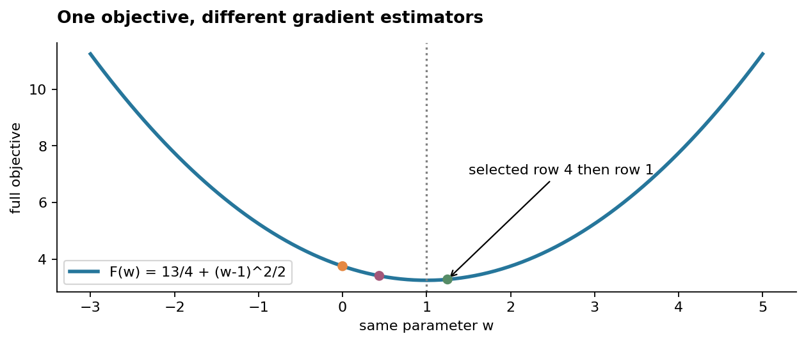
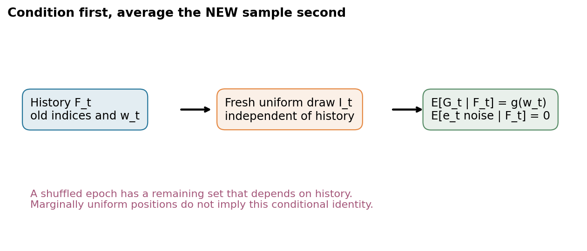
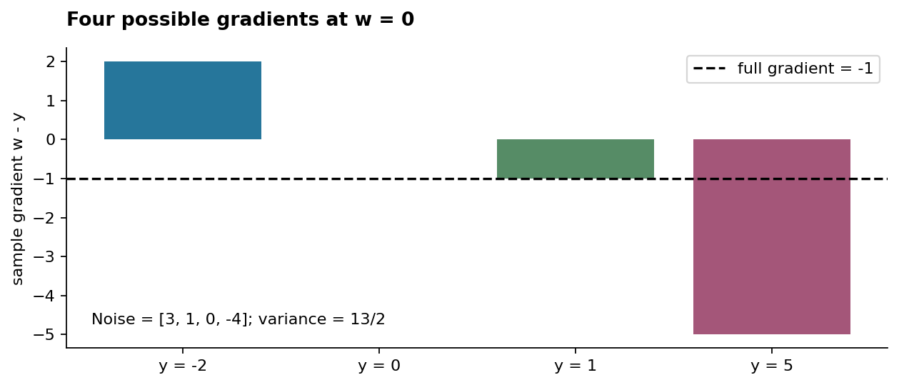
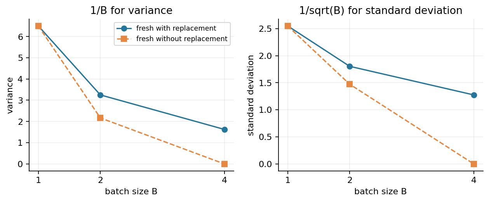
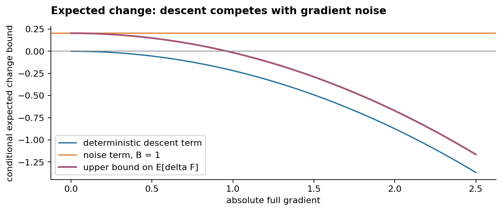
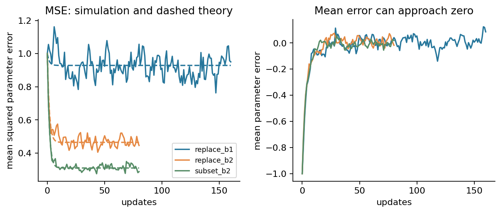
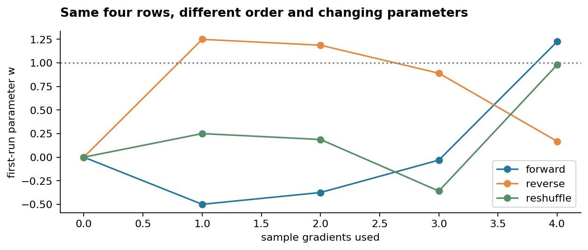
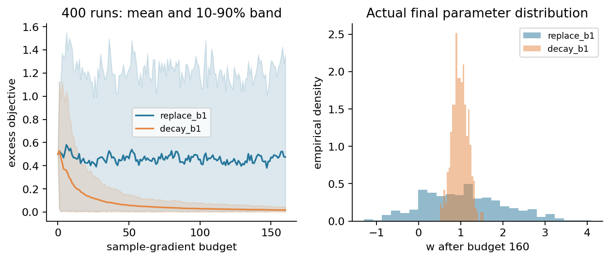
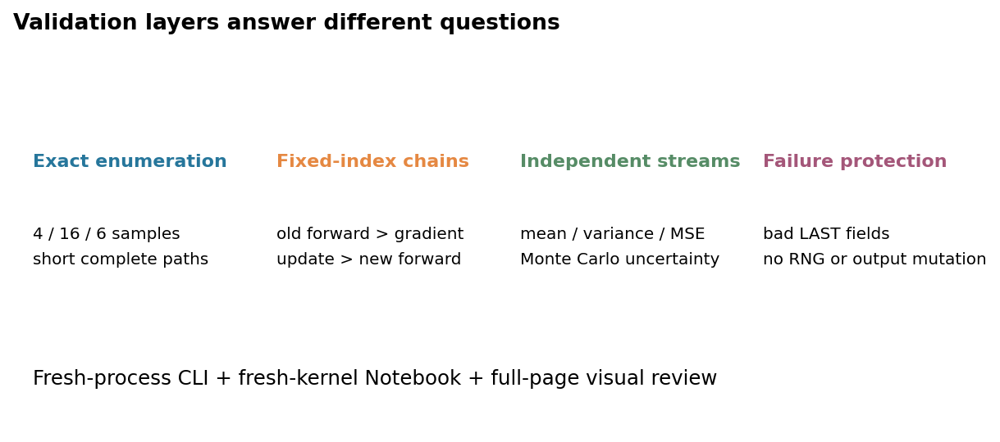

# 第034讲 随机与小批量梯度下降

## 1 少算几行 为什么不是随便走

第033讲用真实全梯度证明了下降。但训练目标通常是许多样本损失的平均，每算一次全梯度都要处理所有样本。若一次只看一行或一小批，计算更少，方向却带上随机性。新的核心问题是：只看部分数据，为什么仍可能朝合理方向更新，什么时候这个解释又会失效？

直接先修是第022至023讲的条件期望、方差与独立性，第032至033讲的梯度更新、平均因子与下降条件。本讲不会假设读者已经知道“无偏”如何用于迭代，而会先固定当前位置，对可能抽到的样本逐个求平均，再把历史放回条件里。

我们选一个可完全算清的常数回归：四个标签−2、0、1、5，用同一个参数w预测全部样本。简单模型让随机抽样的影响不被复杂曲率遮住。所有算法优化同一目标，比较相同样本梯度计算预算，再用多条独立随机流观察均值与波动。CPU合成实验只解释机制，不说明真实任务泛化或大模型吞吐性能。

## 2 全梯度 单样本梯度与小批量平均

训练集有n行，单行损失ℓᵢ(w)，参数w∈Rᵈ。总体训练目标定义为F(w)=Σᵢℓᵢ(w)/n，梯度g(w)=Σᵢ∇ℓᵢ(w)/n∈Rᵈ。full-batch GD每次使用这个完整平均。

SGD在第t步抽一个索引Iₜ，使用Gₜ=$\nabla\ell_{I_t}(w_t)$。mini-batch使用B个索引Iₜ,₁到Iₜ,B，按

$$
G_t=\frac1B\sum_{j=1}^{B}\nabla\ell_{I_{t,j}}(w_t),\qquad
w_{t+1}=w_t-\eta_tG_t.
$$

这里各样本梯度在同一个旧参数wₜ计算，先平均，再更新一次。若每看一行就更新参数，下一行已经在另一个位置计算，那是连续SGD步骤，不是一个小批量梯度。分母是实际批量大小B，不是总样本数n；不要为了省事漏除B却继续沿用同一个学习率。

“batch”一词有时指全量，也有时指一批。报告应写清full-batch或实际B、是否平均、抽样是否放回以及一次参数更新处理多少行，而不是只给一个含糊名称。

## 3 固定当前位置 逐个平均出无偏性

先把w看成固定数值，并均匀抽I∈{1,…,n}。因为每个索引概率1/n，

$$
\mathbb E[\nabla\ell_I(w)]
=\sum_{i=1}^{n}\frac1n\nabla\ell_i(w)
=\nabla F(w).
$$

无偏说的是在同一位置重复随机选择后，向量的平均等于全梯度。它没有说每次选出的向量都接近全梯度，也没有说每次负随机梯度都使完整训练目标下降。单行梯度甚至可能方向相反。

令ξᵢ(w)=∇ℓᵢ(w)−g(w)，则Σξᵢ/n=0。定义单次均匀抽样的协方差Σ(w)=Σξᵢξᵢᵀ/n，是d×d矩阵；总方差σ²(w)=trΣ(w)=Σ||ξᵢ||²/n。这里分母n定义的是有限抽样总体方差，不是估计未知方差时的n−1。

## 4 参数由历史决定 为什么要条件期望

真实wₜ已经依赖以前抽到的样本，不能把它当作与全部随机变量独立。记𝓕ₜ为第t次抽样前的历史，包括初值、过去索引和已形成的wₜ。如果新索引在给定历史后仍独立均匀放回抽取，那么wₜ在这个条件下固定，有

$$
\mathbb E[G_t\mid\mathcal F_t]=\nabla F(w_t).
$$

因此误差ξₜ=Gₜ−g(wₜ)满足E[ξₜ|𝓕ₜ]=0。与历史已确定的任何向量aₜ相乘，都有E[aₜᵀξₜ|𝓕ₜ]=0。这正是后面平方递推中交叉项消失的理由；只写“噪声均值0”却不说明条件，容易把错误的独立性带进证明。

如果抽样规则依赖当前损失、反复抽容易样本，或一轮不放回的剩余样本已经被历史改变，上式需要重新检查。某个位置上的边际均匀分布，不足以自动证明给定已观察历史后的条件无偏。

## 5 四行主问题的精确目标与噪声

取标签y=(−2,0,1,5)，模型预测ŷᵢ=w，单行损失ℓᵢ=(w−yᵢ)²/2。均值ȳ=1，中心化标签(−3,−1,0,4)，平方和26，所以

$$
F(w)=\frac18\sum_{i=1}^{4}(w-y_i)^2
=\frac{13}{4}+\frac12(w-1)^2.
$$

全局最优w*=1，最小训练目标13/4，曲率1，全梯度g=w−1。这个非零最小值来自四个标签无法被同一个常数同时精确拟合，不是优化还没收敛。

单样本梯度gᵢ=w−yᵢ。其相对全梯度的噪声为1−yᵢ，即(3,1,0,−4)，均值0，方差(9+1+0+16)/4=13/2，恰好与w无关。这个特征使主例的均值和二阶矩能完全推导；一般问题的噪声方差可能随参数变化。

在w=0，四个梯度依次2、0、−1、−5，全梯度−1。均匀抽一次有可能得到正梯度2，负梯度方向便向左，而全目标此时需要向右。方向偶尔相反与无偏没有矛盾。

## 6 完整走两轮 看见单样本与全目标的区别

取w₀=0、η=1/4，第一步明确抽到第4行y=5。当前预测0，残差r=0−5=−5，单行损失25/2。局部导数∂ℓ/∂r=r=−5，∂r/∂ŷ=1，∂ŷ/∂w=1，所以该样本梯度−5。更新w₁=0−(1/4)(−5)=5/4。

更新后先重新对全部四行前向。预测都为5/4，残差为(13/4,5/4,1/4,−15/4)，平方为(169,25,1,225)/16，合计420/16=105/4，再除8得到完整目标105/32。也可由13/4+(1/2)(1/4)²得到同样值。此时完整梯度1/4，但下一步实际样本梯度不必等于它。

第二步抽第1行y=−2，必须在新参数5/4处重算：预测5/4，残差13/4，单行损失169/32，局部链给梯度13/4。更新w₂=5/4−(1/4)(13/4)=7/16。再对全部样本前向，残差(39/16,7/16,−9/16,−73/16)，平方和(1521+49+81+5329)/256=1745/64；除8得到完整目标1745/512。

于是完整目标从初始15/4降到105/32，又升到1745/512。第二步使所抽样本的损失下降，却让全目标上升。若第一步一开始就抽第1行，w会变成−1/2，完整目标升到35/8，更直接证明“无偏”不是“逐步下降”。

作为对照，全梯度前两次是−1和−3/4，参数0→1/4→7/16。它与上面第二轮终点恰好相同只是这两个指定索引和步长的巧合，第一轮路径、用到的数据和成本都不同，不能由终点巧合判断算法相同。

## 7 小批量为什么降低方差 必须说明独立抽样

固定w，若B次索引独立、均匀、放回，$G_B$−g=(ξ₁+⋯+$ξ_B$)/B。均值为0。展开外积后，对角项有B个相同协方差，交叉项因独立且均值0而消失，得到

$$
\operatorname{Cov}(G_B\mid w)=\frac{\Sigma(w)}B,
\qquad \mathbb E[\|G_B-g\|^2\mid w]=\frac{\sigma^2(w)}B.
$$

方差除B，标准差才除√B。把B扩大4倍，只让单步随机误差的标准差减半，不是减成1/4。平均B个样本梯度同时需要大约B次样本梯度计算；方差与计算成本要同时看。

主例B=1、2、4的放回梯度方差分别13/2、13/4、13/8。即使B=n=4，只要放回抽样，仍可能重复某行、漏掉某行，所以方差不为0。只有确实使用每行一次的完整平均才是full-batch梯度。

## 8 同批不放回与整轮重排 是两个层次

若每一步都从全部n行重新均匀抽一个大小B的不放回子集，固定w时仍无偏。但同批索引相关，协方差变为

$$
\operatorname{Cov}(G_B\mid w)
=\frac{n-B}{B(n-1)}\Sigma(w),\qquad 1\le B\le n.
$$

可以用零和噪声证明交叉项：两个不同索引的E[ξᵢξⱼᵀ]=−Σ/(n−1)。展开B项平均的协方差，得到(Σ/B)[1−(B−1)/(n−1)]，化简即上式。主例n=4、B=2，方差13/6；B=4时为0。

这与“整轮先生成一个随机排列，再按顺序依次用完”不同。后者下一步从剩余样本中抽，给定历史后的剩余平均一般不是全数据平均。每一轮排列的每个位置边际均匀，但wₜ本身受之前位置影响，不能照搬独立放回的条件证明。

一个具体例子：n=2、标签0与2，初始0，先抽到0并按SGD更新后仍在0；剩余必为2，下一梯度−2，而当前位置全梯度−1。因此整轮重排的第二步在给定这个历史后不是全梯度的无偏估计。重排仍可能是有效算法，只是需要相应分析，而不是错误套用这条证明。

## 9 在期望里改写下降式

第033讲的下降引理对实际位移−ηG仍给

$$
F(w^+)\le F(w)-\eta g^\top G+\frac{L\eta^2}{2}\|G\|^2.
$$

给定历史后取期望，使用E[G|𝓕]=g和E||G||²=||g||²+E||G−g||²。如果放回batch的条件方差≤σ²/B，得到

$$
\mathbb E[F(w^+)\mid\mathcal F]
\le F(w)-\eta\left(1-\frac{L\eta}{2}\right)\|g\|^2
+\frac{L\eta^2\sigma^2}{2B}.
$$

最后多出一个非负噪声项。在离最优很近、全梯度很小时，下降项可能不足以抵消它，因此固定步长不保证每步甚至每步条件期望都继续下降。这里需要条件无偏、方差界和L光滑，任何一个都不是单靠画图确认的。

如果是一般自适应抽样，必须把真实E[G|𝓕]代入内积项，不能直接换成g。若方差随w变化，也应使用对应条件方差或已证明的全域界。

## 10 主例的误差递推 把交叉项写出来

令eₜ=wₜ−1。对放回batch，令批均标签Ȳₜ=1+ζₜ，条件均值E[ζₜ|𝓕ₜ]=0、方差$V_B$=(13/2)/B。随机梯度Gₜ=wₜ−Ȳₜ=eₜ−ζₜ。更新变成

$$
e_{t+1}=(1-\eta)e_t+\eta\zeta_t.
$$

首先取条件均值，E[eₜ₊₁|𝓕ₜ]=(1−η)eₜ，再取总期望，得到E[eₜ]=(1−η)ᵗe₀。均值可以趋0，即许多独立轨迹的平均趋近最优，单条轨迹仍可能持续波动。

再平方：eₜ₊₁²=(1−η)²eₜ²+2η(1−η)eₜζₜ+η²ζₜ²。给定历史后eₜ固定，交叉项期望为0，最后一项期望η²$V_B$。因此二阶矩mₜ=E[eₜ²]满足

$$
m_{t+1}=(1-\eta)^2m_t+\eta^2V_B.
$$

这是二阶矩而非仅方差；因为mₜ=Var(eₜ)+(E eₜ)²。把平均参数先平方，会丢掉方差，错误地把仍在抖动的算法看成完美收敛。

## 11 固定学习率的噪声平台

令r=(1−η)²。在0<η<2时0≤r<1，把递推展开：$m_T$=r^T m₀+η²$V_B$Σₖ₌₀ᵀ⁻¹rᵏ。几何求和给

$$
m_T=r^Tm_0+\frac{\eta V_B}{2-\eta}(1-r^T).
$$

所以T→∞时二阶矩趋η$V_B$/(2−η)，目标超额E[F($w_T$)−F*]=$m_T$/2。主例η=1/4、B=1，参数二阶矩平台13/14，目标超额平台13/28；B=2分别13/28和13/56。full-batch没有抽样噪声，V=0，因此这个平台为0。

平台公式只针对本主例的同曲率标量模型、独立新抽样和固定步长。它不是所有神经网络的精确噪声底，也不是“batch越大总是越好”的证明。η很小时平台较低，但初始误差的收缩也更慢；有限预算下要同时考虑两项。

新抽不放回子集每步若独立，仍可用同一递推，但$V_B$应换成有限总体修正后的方差。例如n=4、B=2时V=13/6，二阶矩平台13/42，超额平台13/84。整轮重排不能直接把这个V塞进公式，因为历史条件结构不同。

## 12 一个能完全求解的递减学习率

采用ηₜ=1/(t+4)，从t=0开始，所以第一步仍是1/4。主例更新wₜ₊₁=[(t+3)wₜ+Ȳₜ]/(t+4)。把两侧乘t+4，逐步归纳得到

$$
w_T=\frac{3w_0+\sum_{t=0}^{T-1}\overline Y_t}{T+3}.
$$

这像给初值放了3份权重，再不断加入新抽样批均值。E[$e_T$]=3e₀/(T+3)，Var($e_T$)=T$V_B$/(T+3)²，因此

$$
\mathbb E[e_T^2]=\frac{9e_0^2+TV_B}{(T+3)^2}.
$$

它确实趋0，通常为1/T量级，但这是本例的完整闭式证明，不是“任意递减步长都好”。如果步长衰减得太快，总移动量有限，可能过早冻结在偏离最优的位置；如果下降太慢，噪声可能长时间保留。一般随机逼近还需结合目标和噪声假设讨论步长和、平方和等条件。

本实验在同一随机索引流上同时比较固定与递减计划，以减少“抽样恰好不同”对差值的干扰；同时保留多次独立重复。共享流是有意的配对比较，不应把两条轨迹称为相互独立。

## 13 不同顺序为什么产生不同终点

即使每轮都完整看过全部数据，连续SGD是在不断变化的参数上计算梯度。对主例固定η，给定顺序y₁到y_n，一轮后

$$
w_n=(1-\eta)^n w_0+
\eta\sum_{j=1}^{n}(1-\eta)^{n-j}y_j.
$$

靠后的样本权重大，因为较早的贡献经历了更多次衰减。因此同一轮的“每行一次”不能简单等同于一次全梯度平均。主例η=1/4、w₀=0，顺序(−2,0,1,5)的终点157/128，反向(5,1,0,−2)的终点43/256。两者都用4次单样本梯度，却相差很大。

随机重排每轮换顺序，避免长期固定某种排列结构，但它与独立放回采样的理论不同。实际实验要记录顺序机制和每轮边界，而不只写“设置了seed”。如果数据按标签或时间排序，直接不打乱可能形成系统性模式；是否允许打乱还取决于任务的时间/序列结构。

## 14 公平比较 先把横轴的成本说清

一次full-batch更新处理n行，一次SGD更新处理1行，一次mini-batch更新处理B行。若都跑100次更新，它们消耗的样本梯度数分别100n、100、100B，不能仅凭谁的100步目标最低来比较计算效率。

本实验首要横轴是累计样本梯度评估数C，保留更新次数作为另一坐标。对于n=4、预算C=160，full-batch可做40次更新，SGD做160次，B=2做80次。每种方法在自己的更新时间点评估完整训练目标，绘图若做插值必须标明；不要假装某方法在未更新的点也产生了新参数。

定义等效数据遍历量C/n有助于对齐成本，但对放回抽样它不是“已经不重不漏看过每行”的真实epoch。随机重排的一轮才明确包含每行一次。预算不是B的整数倍时，要说明停止在完整批还是使用一个较小尾批；不能静默多用数据或错误沿用分母B。

样本梯度数是算法工作量代理，不等于墙钟时间。矩阵向量化、设备并行、内存和数据加载会影响实际耗时。本讲不据微型Python计时宣布哪个方法在GPU或大型任务更快。

## 15 多种子曲线 画的究竟是哪种波动

一次随机轨迹可能偶然很好或很差。固定模型、初值、预算、算法参数和抽样机制，运行许多独立随机流，分别记录每个更新时间的w、目标超额和已用样本数。至少画均值与10%–90%分位带，并标明重复次数。

分位带描述随机运行结果的分布，不是均值的置信区间。均值的Monte Carlo标准误大致为样本标准差除√R，其中R为独立重复数，但当比较方法共享随机流时，应对配对差值计算不确定性，而不是假定两个均值独立。

还要区分“平均轨迹的目标F(平均w)”与“各轨迹目标的平均”。平方目标满足后者比前者多半个参数方差。实验报告应保留mean_error、mean_squared_error、variance和mean_excess；不能只画平均w接近1就忽略运行波动。

## 16 非均匀抽样与修正权重

若索引i被抽到的概率pᵢ不再都是1/n，直接使用∇ℓᵢ的平均变成Σpᵢ∇ℓᵢ，通常优化了另一个加权目标。为了估计原来的均匀目标，可以用G=∇ℓᵢ/(npᵢ)，前提每个需要的pᵢ>0。则E[G]=Σpᵢ∇ℓᵢ/(npᵢ)=g。

修正无偏不代表方差更小。很小pᵢ对应很大权重，可能带来罕见但很大的更新；如果pᵢ=0却对应非零目标贡献，无法用这个公式恢复未被抽到的项。重要性抽样要同时考虑概率、权重、方差和数值范围。

本讲主实验仍使用明确均匀机制。非均匀一节只做有限枚举的梯度平均核验，不把未经检验的自适应概率加入主训练后沿用原来的噪声平台公式。

## 17 实现中最常见的几种悄悄换题

把batch梯度求和而非求平均，会把有效学习率乘B；逐样本更新后再说“本轮batch平均”，则改变了梯度评估位置。抽样B=n却有放回，仍非全梯度；整轮重排的索引序列不能被当成各步独立。测试集也不能参与选batch大小、学习率或停止预算后再被当作独立测试证据。

随机数也需要可复现合同。完整记录NumPy版本、位生成器、根种子、方法标识和重复编号；用明确的SeedSequence派生或整数序列种子，不要让绘图额外抽一次随机数就改变后续训练。所有输入检查应在创建第一条随机流前完成，包括最后一项非法batch、预算、种子和学习率计划。

为了检查代码，不能只依赖某个固定seed跑通。还需独立枚举主例的全部单样本、全部放回二元组合与全部不放回子集，检验均值和方差；手工索引轨迹用Fraction重做；多种子结果再与二阶矩理论对照。理论是随机重复的期望，不应要求有限Monte Carlo平均逐位等于它，也不能把超出容差的差异全推给运气。

## 18 自测与完整验收

1. 写出全梯度、SGD与mini-batch更新，解释小批量应在同一个旧参数处计算。
2. 固定w，直接枚举索引证明均匀单样本梯度无偏。
3. 定义抽样历史，说明条件无偏与边际无偏的区别。
4. 从主例四行数据算出F*、w*、单样本梯度与σ²。
5. 按索引4、1完整重算两轮前向、局部导数、更新和每轮全目标。
6. 构造单样本更新使完整目标增大的例子，解释为何不违背无偏。
7. 展开协方差推独立放回batch的1/B方差关系，并区分标准差。
8. 推出新抽不放回子集的有限总体修正，核对n=4、B=2和B=4。
9. 用两行数据反例说明整轮重排不能直接照搬每步条件无偏。
10. 从下降引理推出带噪声项的条件期望界，逐项标明使用的条件。
11. 推主例误差均值与二阶矩递推，解释交叉项如何消失。
12. 求固定η的二阶矩与目标超额平台，代入η=1/4和B=1、2。
13. 对ηₜ=1/(t+4)归纳出加权平均表达式并计算均值、方差和均方误差。
14. 手算正向与反向一轮终点，解释后出现的样本为何权重更大。
15. 在160次样本梯度预算下比较full-batch、SGD和B=2的更新数，说明epoch含义。
16. 区分分位带、均值标准误、平均参数的目标和目标均值。
17. 推出非均匀抽样的无偏修正，并分析零概率与小概率的风险。
18. 设计枚举、固定索引、多种子、坏尾字段和输出保护的完整验收。

实验指南与完整解答会逐项展开。下一讲在同一基础上加入历史方向形成动量；动量改变了状态与更新规则，不能只把本讲学习率结论原封不动套过去。

## 来源与核查范围

- [Bottou Curtis Nocedal作者公开综述](https://leon.bottou.org/publications/pdf/sirev-2018.pdf)：核对随机梯度的条件矩、固定/递减步长与计算工作量的讨论，尤其区分独立新抽样和整轮不放回的分析条件。本文四行数据和精确轨迹独立构造，不复制论文图例。
- [Cornell CS4787 Lecture6](https://www.cs.cornell.edu/courses/cs4787/2025fa/lectures/lecture6.html)：核对随机二次递推与小批量方差概念。本讲独立保留平方损失的1/2归一化，不照抄来源中个别显示式的遗漏。
- [NumPy2.3 choice](https://numpy.org/doc/2.3/reference/random/generated/numpy.random.Generator.choice.html)、[permutation](https://numpy.org/doc/2.3/reference/random/generated/numpy.random.Generator.permutation.html)、[随机流文档](https://numpy.org/doc/2.3/reference/random/parallel.html)：核对放回参数、排列和可复现独立流的接口与边界。
