# 035 动量与加速方法

## 1 历史方向能解决什么 又会引入什么

第032讲中，一个步长同时服务平缓方向和陡峭方向：为了不在谷壁上发散，平缓方向往往只能缓慢前进。第034讲又提醒我们，梯度中的短期变化也可能来自抽样噪声。现在增加一个状态，把过去的方向带到下一步。持续同向的分量能够积累，交替分量可能部分抵消；代价是惯性、超调、额外初值和更复杂的稳定条件。

本讲的目标不是记住一个“默认动量值”，而是能回答四个可核验的问题：梯度在哪一个点计算？保存的状态是什么单位？二次目标的两个状态根在哪里？代码库里的参数是否就是论文里的参数？我们用同一组四行回归数据，把预测、残差、局部导数、梯度累积、同步更新和新前向连起来。

直接先修为第015、032、034讲。需要会看矩阵形状、特征值和逐样本梯度。本讲主要分析确定性全梯度；第19节单独说明它与随机梯度结论的边界。所有实验为原创小型合成机制实验，不评价真实预测任务或大规模训练耗时。

## 2 四行数据和两个参数

每行有两个无量纲特征。我们有意不加截距，因为标签就是第一个特征；这里a是第一个特征的系数，不是截距。模型为$\hat y_i=x_{i1}a+x_{i2}b$，参数$\theta=(a,b)^T\in\mathbb R^2$，数据矩阵$X\in\mathbb R^{4\times2}$。

| 样本 | x₁ | x₂ | y |
|---|---:|---:|---:|
| S1 | 1 | 4 | 1 |
| S2 | 1 | −4 | 1 |
| S3 | −1 | 4 | −1 |
| S4 | −1 | −4 | −1 |

残差统一取“预测减标签”，即$r_i=\hat y_i-y_i$。目标与单行贡献定义为

$$
F(\theta)=\frac1{2n}\sum_{i=1}^n r_i^2=\sum_{i=1}^4\ell_i,
\qquad n=4,\quad\ell_i=\frac{r_i^2}{8}.
$$

所以F是二分之一的均方误差，不是平方误差总和。若换成MSE，梯度和Hessian都乘2；原步长就不能直接照搬。

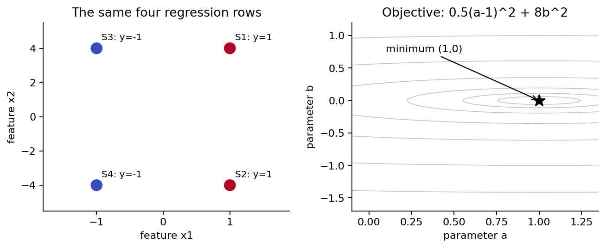

两列的平方平均分别为1和16，交叉平均为0：$X^TX/4=\operatorname{diag}(1,16)$。而$X^Ty/4=(1,0)^T$。因而

$$
\theta^*=(1,0)^T,\qquad F^*=0,\qquad
F(a,b)=\frac12(a-1)^2+8b^2.
$$

例如展开残差$x_{i1}(a-1)+x_{i2}b$的平方，交叉项之和含$\sum_i x_{i1}x_{i2}=0$，所以恰好消失。这一步连接了数据目标和画图所用的二次式，并没有换一个目标。梯度为$(a-1,16b)^T$，Hessian为diag(1,16)，强凸常数μ=1、光滑常数L=16、条件数κ=16。这里所有量无物理单位；实际有单位的数据仍必须先明确坐标尺度。

## 3 梯度不能从公式凭空跳出来

单行链条为参数→预测→残差→损失贡献。对j=1,2，局部导数是

$$
\frac{\partial\hat y_i}{\partial\theta_j}=x_{ij},\qquad
\frac{\partial r_i}{\partial\hat y_i}=1,\qquad
\frac{\partial\ell_i}{\partial r_i}=\frac{r_i}{4}.
$$

相乘得到第i行的梯度贡献$(r_ix_{i1}/4,r_ix_{i2}/4)$。按行相加得到$g=X^Tr/4\in\mathbb R^2$。这里每行贡献已经除4，总和后不能再除4。全部分量必须使用同一个旧参数或同一个lookahead点计算；更新a后再用新a计算b的梯度，会改变算法。

先固定$\theta_0=(0,1)^T$。下面一张表把第一轮前向和反向全部展开。最后两列就是“r/4 × 1 × 相应特征”。

| 样本 | 预测 | 残差r | 损失r²/8 | a梯度贡献 | b梯度贡献 |
|---|---:|---:|---:|---:|---:|
| S1 | 4 | 3 | $\frac{9}{8}$ | $\frac{3}{4}$ | 3 |
| S2 | −4 | −5 | $\frac{25}{8}$ | $−\frac{5}{4}$ | 5 |
| S3 | 4 | 5 | $\frac{25}{8}$ | $−\frac{5}{4}$ | 5 |
| S4 | −4 | −3 | $\frac{9}{8}$ | $\frac{3}{4}$ | 3 |

四行损失贡献相加得17/2；两列梯度贡献分别相加得−1和16。检查对角表达式也得到$F(0,1)=1/2+8=17/2$。这两条计算路线以后还会用于发现因子或实现错误。

## 4 Heavy-ball 保存的是上一次位移

用$d_t=\theta_t-\theta_{t-1}$表示上一轮位移；初值$d_0=0$相当于设置$\theta_{-1}=\theta_0$。给定步长η>0和动量系数$0\le\beta<1$，heavy-ball简称HB，更新为

$$
d_{t+1}=\beta d_t-\eta\nabla F(\theta_t),\qquad
\theta_{t+1}=\theta_t+d_{t+1}.
$$

d与参数具有相同单位，梯度乘η后才变成位移。β=0时退化为普通梯度下降。HB每步只需要一个新梯度，不是把旧梯度重新计算一次。它保存的是状态，因此断点恢复只保存θ而丢掉d，一般不能继续同一条轨迹。

为了看清历史，把递推展开：$d_1=-\eta g_0$，$d_2=-\eta(\beta g_0+g_1)$，再代一次得到$d_3=-\eta(\beta^2g_0+\beta g_1+g_2)$。一般地，常数η、β下

$$
d_{t+1}=\beta^{t+1}d_0-\eta\sum_{k=0}^{t}\beta^{t-k}g_k.
$$

旧梯度按年龄指数衰减。若梯度恒为g且d₀=0，有限几何和给$d_{t+1}=-\eta g(1-\beta^{t+1})/(1-\beta)$，极限大小放大为η/(1−β)。这只是恒定输入的响应，不意味着优化中可以把实际步长永久当成η/(1−β)，因为g本身随位置变化。

若一维输入交替为$g_t=(-1)^t c$，缓冲区$b_{t+1}=\beta b_t+g_t$的稳态交替幅度是c/(1+β)：代入$b_{t+1}=K(-1)^t$得到K=−βK+c。持续信号的增益1/(1−β)与交替信号的增益1/(1+β)不同，解释了方向积累与部分抵消的可能机制。

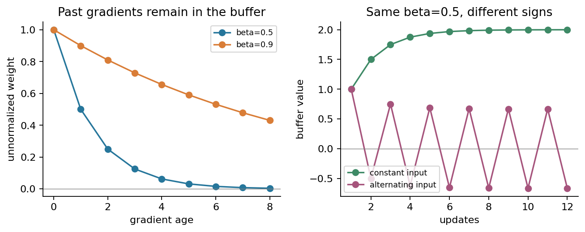

## 5 HB第一轮 从四行梯度到新的四行前向

手算统一取η=1/16、β=1/2、d₀=(0,0)。第3节已由四行得到g₀=(−1,16)，所以先算整个新位移，再同时加到两个参数：

$$
d_1=\frac12(0,0)-\frac1{16}(-1,16)=(1/16,-1),
\qquad\theta_1=(0,1)+d_1=(1/16,0).
$$

第一坐标变为1/16时，第二坐标必须也使用旧梯度16更新为0。现在参数改变了，必须重新做四行前向：

| 样本 | 预测 | 残差r | 损失r²/8 | a梯度贡献 | b梯度贡献 |
|---|---:|---:|---:|---:|---:|
| S1 | $\frac{1}{16}$ | $−\frac{15}{16}$ | $\frac{225}{2048}$ | $−\frac{15}{64}$ | $−\frac{15}{16}$ |
| S2 | $\frac{1}{16}$ | $−\frac{15}{16}$ | $\frac{225}{2048}$ | $−\frac{15}{64}$ | $\frac{15}{16}$ |
| S3 | $−\frac{1}{16}$ | $\frac{15}{16}$ | $\frac{225}{2048}$ | $−\frac{15}{64}$ | $\frac{15}{16}$ |
| S4 | $−\frac{1}{16}$ | $\frac{15}{16}$ | $\frac{225}{2048}$ | $−\frac{15}{64}$ | $−\frac{15}{16}$ |

损失为4×(225/2048)=225/512，梯度为(−15/16,0)。虽然b方向梯度现在为0，d₁的b分量仍为−1。动量系统还没忘记自己刚才的运动。

## 6 HB第二轮 为什么会穿过谷底

第二轮的旧点就是上表中的θ₁。四行残差仍是(−15/16,−15/16,15/16,15/16)，局部损失导数为(−15/64,−15/64,15/64,15/64)。乘相应特征后相加，得到g₁=(−15/16,0)。

$$
d_{2,a}=\frac12\frac1{16}-\frac1{16}\left(-\frac{15}{16}\right)
=\frac8{256}+\frac{15}{256}=\frac{23}{256},
$$

$$
d_{2,b}=\frac12(-1)-\frac1{16}(0)=-\frac12,
\qquad\theta_2=(39/256,-1/2).
$$

这两个新坐标一起生效，然后重新前向。第1行预测为39/256−2=−473/256，减去标签1得到−729/256。其余三行也不能沿用旧残差。

| 样本 | 预测 | 残差r | 损失r²/8 | a梯度贡献 | b梯度贡献 |
|---|---:|---:|---:|---:|---:|
| S1 | $−\frac{473}{256}$ | $−\frac{729}{256}$ | $\frac{531441}{524288}$ | $−\frac{729}{1024}$ | $−\frac{729}{256}$ |
| S2 | $\frac{551}{256}$ | $\frac{295}{256}$ | $\frac{87025}{524288}$ | $\frac{295}{1024}$ | $−\frac{295}{256}$ |
| S3 | $−\frac{551}{256}$ | $−\frac{295}{256}$ | $\frac{87025}{524288}$ | $\frac{295}{1024}$ | $−\frac{295}{256}$ |
| S4 | $\frac{473}{256}$ | $\frac{729}{256}$ | $\frac{531441}{524288}$ | $−\frac{729}{1024}$ | $−\frac{729}{256}$ |

四行损失贡献之和等于$\frac12(217/256)^2+8(1/2)^2=309233/131072$，约2.35926，比上一轮225/512≈0.43945更大。新梯度为(−217/256,−8)。这不是程序错误：虽然该η、β在本二次目标上严格稳定，但当前位置的F没有逐步单调下降。旧位移带着参数从b=0冲到了b=−1/2。

## 7 Nesterov 在预看点计算梯度

本讲先定义明确的lookahead形式，简称NAG：

$$
z_t=\theta_t+\beta d_t,\qquad
 d_{t+1}=\beta d_t-\eta\nabla F(z_t),\qquad
\theta_{t+1}=\theta_t+d_{t+1}.
$$

z是本轮梯度评估点，θ是本讲报告的主参数。两个都要记录。等价地，$\theta_{t+1}=z_t-\eta\nabla F(z_t)$：先按旧惯性预看，再从预看点做一次梯度修正。这里没有免费获得“未来梯度”；必须真的用z重新前向与求导。仍然是一轮一个新全梯度，旧点的目标若另外记录，就属于诊断成本。

初值d₀=0使z₀=θ₀。第一轮逐样本预测、残差、局部导数和梯度全部等于第3节；同步更新仍得到d₁=(1/16,−1)、θ₁=(1/16,0)，新前向恰好是第5节的表。第一步相同不足以说明两个算法相同。

第二轮先记录旧点θ₁。旧点前向给F=225/512、g=(−15/16,0)，但NAG不把这个梯度用于本轮更新。预看点是

$$
z_1=(1/16,0)+\frac12(1/16,-1)=(3/32,-1/2).
$$

现在对同一四行数据在z₁重新计算：

| 样本 | 预测 | 残差r | 损失r²/8 | a梯度贡献 | b梯度贡献 |
|---|---:|---:|---:|---:|---:|
| S1 | $−\frac{61}{32}$ | $−\frac{93}{32}$ | $\frac{8649}{8192}$ | $−\frac{93}{128}$ | $−\frac{93}{32}$ |
| S2 | $\frac{67}{32}$ | $\frac{35}{32}$ | $\frac{1225}{8192}$ | $\frac{35}{128}$ | $−\frac{35}{32}$ |
| S3 | $−\frac{67}{32}$ | $−\frac{35}{32}$ | $\frac{1225}{8192}$ | $\frac{35}{128}$ | $−\frac{35}{32}$ |
| S4 | $\frac{61}{32}$ | $\frac{93}{32}$ | $\frac{8649}{8192}$ | $−\frac{93}{128}$ | $−\frac{93}{32}$ |

四个局部损失导数r/4分别为−93/128、35/128、−35/128、93/128。梯度a列累积为(−93+35+35−93)/128=−29/32；梯度b列累积为(−93−35−35−93)/32=−8。预看点的损失是4937/2048，约2.41064，不能误标成旧点损失。

## 8 NAG第二轮 完成修正和下一轮前向

把上述预看梯度代入，而不是把旧点的零b梯度代入：

$$
d_{2,a}=\frac1{32}+\frac{29}{512}=\frac{45}{512},\qquad
 d_{2,b}=-\frac12-\frac1{16}(-8)=0.
$$

同步更新得$\theta_2=(1/16+45/512,0)=(77/512,0)$。随后四行重新前向：

| 样本 | 预测 | 残差r | 损失r²/8 | a梯度贡献 | b梯度贡献 |
|---|---:|---:|---:|---:|---:|
| S1 | $\frac{77}{512}$ | $−\frac{435}{512}$ | $\frac{189225}{2097152}$ | $−\frac{435}{2048}$ | $−\frac{435}{512}$ |
| S2 | $\frac{77}{512}$ | $−\frac{435}{512}$ | $\frac{189225}{2097152}$ | $−\frac{435}{2048}$ | $\frac{435}{512}$ |
| S3 | $−\frac{77}{512}$ | $\frac{435}{512}$ | $\frac{189225}{2097152}$ | $−\frac{435}{2048}$ | $\frac{435}{512}$ |
| S4 | $−\frac{77}{512}$ | $\frac{435}{512}$ | $\frac{189225}{2097152}$ | $−\frac{435}{2048}$ | $−\frac{435}{512}$ |

新损失为$\frac12(435/512)^2=189225/524288$，新梯度为(−435/512,0)。这里b方向的预看梯度恰好抵消了惯性。原因是本例高曲率λ=16且ηλ=1；换一个步长、曲率或动量，不能保证恰好抵消。

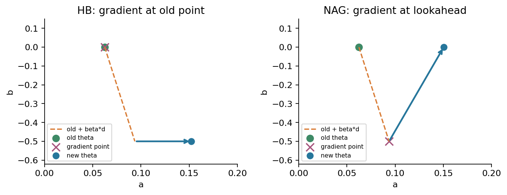

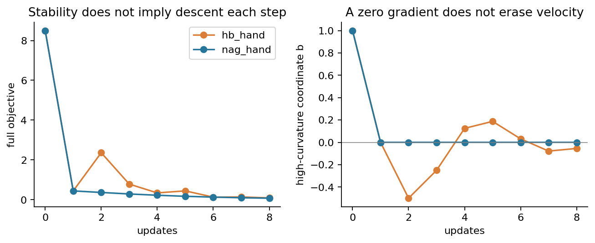

## 9 为什么从一个误差变成两个状态

对一般严格凸二次函数$F(\theta)=F^*+\frac12(\theta-\theta^*)^TH(\theta-\theta^*)$，假定H为固定对称正定矩阵。取单位特征向量q满足Hq=λq，λ>0；把误差投影到这个方向，记$e_t=q^T(\theta_t-\theta^*)$。梯度在该方向就是λeₜ。

HB消去位移$d_t=\theta_t-\theta_{t-1}$后，逐项合并得到

$$
e_{t+1}=e_t+\beta(e_t-e_{t-1})-\eta\lambda e_t
=(1+\beta-\eta\lambda)e_t-\beta e_{t-1}.
$$

NAG评估点的误差为$e_t+\beta(e_t-e_{t-1})$。从它减去η乘其梯度，得到

$$
e_{t+1}=(1-\eta\lambda)\big[(1+\beta)e_t-\beta e_{t-1}\big].
$$

设h=ηλ，并统一写$e_{t+1}=Ae_t-De_{t-1}$。则状态$s_t=(e_t,e_{t-1})^T$满足

$$
s_{t+1}=M_\lambda s_t,\qquad
 M_\lambda=\begin{pmatrix}A&-D\\1&0\end{pmatrix}.
$$

HB用A=1+β−h、D=β；NAG用A=(1+β)(1−h)、D=β(1−h)。每一个参数方向对应一个二维状态；本例两个参数方向合起来是四维状态，而不是“原问题变成二维所以只有两个根”。初始d₀=0给e₋₁=e₀，若d₀不为0，则e₋₁=e₀−qᵀd₀。

## 10 状态根 判别式和振荡

寻找形如$e_t=r^t$的解。代入递推并消去共同因子后得到$r^2-Ar+D=0$，也就是$\det(rI-M_\lambda)=0$。解为

$$
r_\pm=\frac{A\pm\sqrt{A^2-4D}}2,\qquad\Delta=A^2-4D.
$$

当Δ>0时有两个不同实根， $e_t=c_+r_+^t+c_-r_-^t$ ，常数由两个初值决定。负根会导致交替符号，正根并不保证任意初值下误差单调。当Δ<0时，两个根互为共轭；因乘积为D，模均为√D，可以写成指数包络乘正弦、余弦。HB此时D=β，所以包络模为√β。

Δ=0时要小心：重复根常产生$(c_1+c_2t)r^t$。因此谱半径ρ<1意味着最终衰减，但不能不带常数或多项式因子就声称$|e_t|\le\rho^t|e_0|$。r=0的重根还可能使状态矩阵幂在有限步后归零，应直接检查递推。

NAG在h>1且β>0时D<0，两根一定异号且为实根。因此“Δ为正就不会震荡”也是错的。振荡、目标非单调、发散是三个不同概念：参数可交替而目标下降；目标可短暂上升而状态最终收敛。

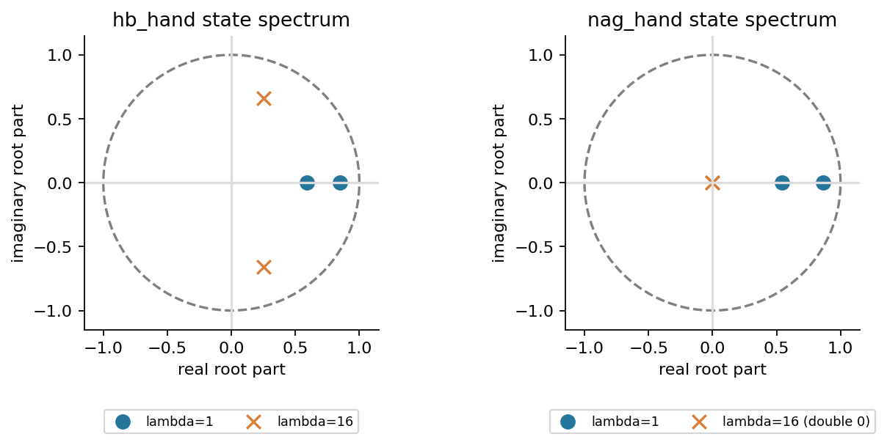

## 11 稳定区域从三个不等式得到

这里稳定特指：对这一固定正曲率二次方向、任意有限两个初始状态，误差都趋于0。它不是“前十步看着没爆炸”，也不是“函数值逐轮下降”。二次实系数多项式$r^2-Ar+D$的两个根严格在单位圆内，当且仅当

$$
|D|<1,\qquad1-A+D>0,\qquad1+A+D>0.
$$

为什么？若根为共轭，D是根模平方，第一条保证模小于1，后两式分别为$|1-r|^2$和$|1+r|^2$。若根为实数，后两式分别是(1−r₊)(1−r₋)和(1+r₊)(1+r₋)。若某根≥1，前一个正数条件迫使另一根也>1，乘积便≥1，矛盾；≤−1同理。因此三个条件充分。反过来，两个根都在(−1,1)时三个条件显然成立。这给出了本例所需的二阶Jury判据，不必先学习一般控制理论。

HB代入A、D后：|β|<1已由0≤β<1保证；第二条是h>0；第三条是2+2β−h>0。所以

$$
\boxed{\text{HB:}\quad0<\eta\lambda<2(1+\beta).}
$$

NAG的第二条仍为h>0，第三条变为$1+(1+2\beta)(1-h)>0$，即h<2(1+β)/(1+2β)。在这个范围内，$|\beta(1-h)|<1$也成立：h≤1时绝对值≤β<1；h>1时β(h−1)<β/(1+2β)<1。因此

$$
\boxed{\text{NAG:}\quad0<\eta\lambda<\frac{2(1+\beta)}{1+2\beta}.}
$$

整个正定二次目标要求每个λ都满足条件，故只需用最大特征值L约束上界。β=0时两者都回到0<ηL<2。β=1、零曲率、时变Hessian或时变超参数不在这里的结论范围内。

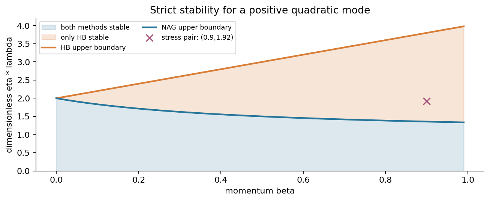

边界也不是小细节。取β=1/2、只激活λ=L=16的方向，HB边界η=3/16有根−1和−1/2。初始e₋₁=e₀=1给e₁=−2，解为$3(-1)^t-2(-1/2)^t$，不会趋于0。NAG边界η=3/32有根−1和1/4，同初值给e₁=−1/2，解为$(3/5)(-1)^t+(2/5)(1/4)^t$，同样不收敛。实验保存实际20步边界轨迹；解析式给出无限时间结论。

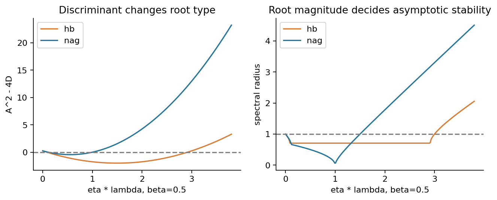

## 12 初值和非单调不能藏起来

如果从最优位置θ₀=(1,0)出发，但给d₀=(1/4,0)，HB第一步梯度为0，仍有d₁=(1/8,0)、θ₁=(9/8,0)，目标升到1/128。相同θ、不同d会走出不同轨迹。对NAG，初始预看点也会因d不同而不同。比较算法必须同时记录位置、速度、缓冲区初始化和“第一步”的编号。

上述第一步仍然遵循同一四行链：最优点的预测为(1,1,−1,−1)，残差和每行损失、梯度贡献全为0；更新后的预测为(9/8,9/8,−9/8,−9/8)，残差为(1/8,1/8,−1/8,−1/8)，每行损失1/512，合计1/128，梯度(1/8,0)。它不是新的数据例子，只改变了初始状态。第二轮以刚才的新前向作为旧前向：局部导数为(1/32,1/32,−1/32,−1/32)，a梯度贡献每行1/32，b贡献为(1/8,−1/8,−1/8,1/8)，合计(1/8,0)。所以d₂=(1/16−1/128,0)=(7/128,0)，θ₂=(151/128,0)。再前向得预测(151/128,151/128,−151/128,−151/128)，残差(23/128,23/128,−23/128,−23/128)，各行损失529/131072，合计529/32768，新梯度(23/128,0)。

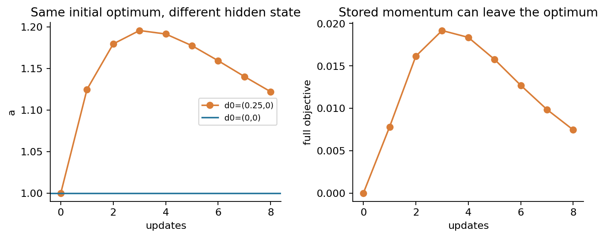

第033讲的梯度下降下降引理不能直接套到HB位移上：把位移换成βd−ηg后，一阶项中多出βgᵀd，二阶项也包含d。要证明某种动量方法的全局收敛，通常需要把函数误差与状态组合成适当势能，不能仅把旧证明里的“−ηg”换一个名字。

## 13 以谱为目标选择参数

先考虑给定$0<\mu\le\lambda\le L$的正定二次目标、常数参数、精确梯度。GD最坏方向倍率为max(|1−ημ|,|1−ηL|)。平衡两个端点的相反误差，令1−ημ=−(1−ηL)，得到η=2/(L+μ)，倍率$(L-\mu)/(L+\mu)$。本例η=2/17，倍率15/17。

HB可以让中间曲率方向具有相同根模q，并让端点成为±q的重根。取β=q²，要求

$$
1+q^2-\eta\mu=2q,\qquad1+q^2-\eta L=-2q.
$$

整理为ημ=(1−q)²、ηL=(1+q)²。两式相除并取正平方根，$\sqrt\kappa=(1+q)/(1-q)$，所以

$$
q=\frac{\sqrt L-\sqrt\mu}{\sqrt L+\sqrt\mu},\quad
\beta=q^2,\quad\eta=\frac4{(\sqrt L+\sqrt\mu)^2}.
$$

这是该谱区间上常系数HB的经典最坏方向谱半径最优设置。本节构造并核对其达到的q；更完整的最优性分析见来源[3]附录A。本例η=4/25、β=9/25，q=3/5。端点是重根，仍需第10节的t因子，不能把q当成每一步损失比。

NAG的标准强凸设置为η=1/L、$\beta=(\sqrt\kappa-1)/(\sqrt\kappa+1)$。本例η=1/16、β=3/5。λ=1方向的A=3/2、D=9/16，两个根都是3/4；λ=16方向根均为0。因此本例的状态谱半径为3/4。这与HB的β=9/25不同：HB用了q的平方，NAG没有。名字相似不能用同一个数字代替推导。

## 14 实际同预算比较 看见加速也看见瞬态

全部方法从θ₀=(0,1)、d₀=0出发，各申请80次全梯度更新，每步4个样本梯度，最多320次样本梯度计算。额外的初始与新状态完整前向单独记录。没有把更多函数诊断视为免费，也没有把梯度次数换成硬件秒数。

| 方法与设置 | η | β | 首次目标≤10⁻⁶的更新数 |
|---|---:|---:|---:|
| GD保守 | 1/16 | 0 | 80步内未达到 |
| GD端点平衡 | 2/17 | 0 | 64 |
| HB手算设置 | 1/16 | 1/2 | 42 |
| NAG手算设置 | 1/16 | 1/2 | 47 |
| HB二次谱调参 | 4/25 | 9/25 | 23 |
| NAG标准强凸设置 | 1/16 | 3/5 | 31 |

这些数字由真实逐样本循环取得，不由谱半径公式替代实验。不同设置都有明确目的：手算组隔离梯度评估点差异，调参组比较各自的理论设置。不能只把各自最好的一条线拿来宣称“某算法在任何任务都更快”。

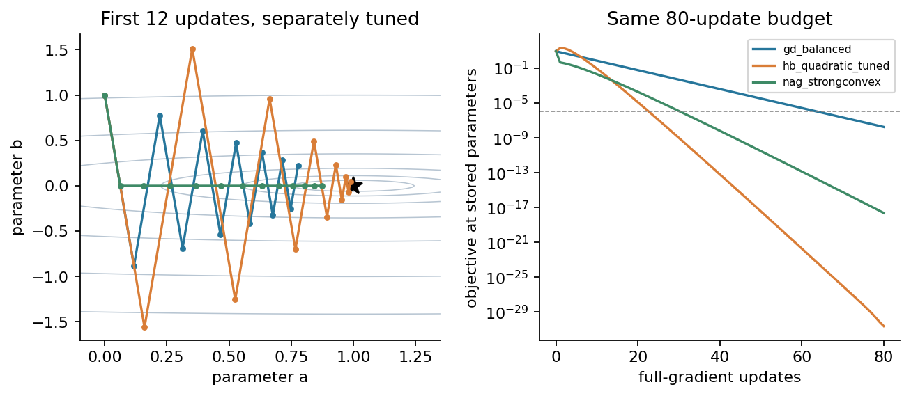

HB谱调参的第一步从b=1到−39/25=−1.56，高曲率误差先被放大。完整目标从8.5升到19.8216，后续才快速衰减。初始阶段的大幅超调与渐近较小谱半径可以同时出现；对有约束、数值范围有限或中途必须可用的模型，瞬态本身就是重要指标。

再用同一个η=0.12、β=0.9比较两种方法。高曲率方向h=1.92，HB上界是3.8，NAG上界是3.8/2.8≈1.35714。于是HB严格稳定，NAG不稳定。实际80步的目标约分别为1.13768×10⁻⁴和1.14402×10⁵³。这直接反驳“Nesterov在任何相同步长下都更稳定”，但没有否定其在满足假设与参数规则时的加速保证。

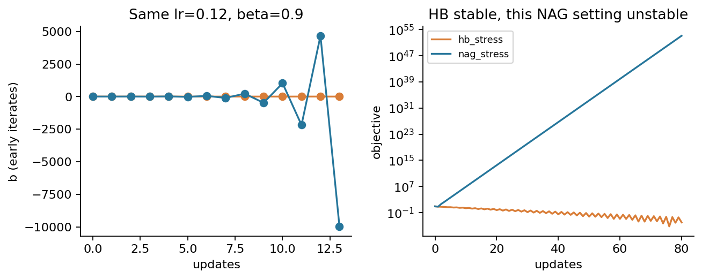

## 15 库里的momentum可能保存另一种量

本讲位移形式是$d_{t+1}=\beta d_t-\eta g_t$。另一常见写法先存梯度缓冲区$v_{t+1}=\beta v_t+g_t$，再更新$\theta_{t+1}=\theta_t-\eta v_{t+1}$。固定η、匹配初值时，两者由d=−ηv等价。

还有归一化移动平均$m_{t+1}=\beta m_t+(1-\beta)g_t$，参数更新为θₜ₊₁=θₜ−αmₜ₊₁。若m₀=v₀=0，则m=(1−β)v，匹配未归一化步长η必须令α=η/(1−β)。若把相同η和β直接喂给两种定义，更新大小不同。本讲实际代码也用转换后的α逐步验证了等价关系。

学习率一旦变化，不能继续使用固定比例。对于“lr在缓冲区外”的版本，令$d_t=-\eta_{t-1}v_t$，代入下一步得到

$$
d_{t+1}=\beta\frac{\eta_t}{\eta_{t-1}}d_t-\eta_tg_t.
$$

这与保持β不变的位移版不同。学习率减半时，等效旧位移系数也减半。若ηₜ₋₁=0，上式除法无定义，应回到原始缓冲区方程。本讲输入要求正学习率，实际用1/16、1/32、1/32、1/64的计划展示差异。

## 16 PyTorch SGD的第一缓冲区和dampening

实际核对版本为PyTorch2.7.1+cpu；官方2.7文档与已安装2.7.1代码共同确定行为[4]。实验指定CPU、float64、单线程，foreach=False、fused=False、weight_decay=0、maximize=False、differentiable=False，每步先zero_grad，再从同一平方损失反向传播。

在momentum>0、缓冲区原先不存在时，第一步直接令$v_1=g_0$。以后才用$v_{t+1}=\beta v_t+(1-\tau)g_t$，τ是dampening。τ=0时，它等价于从零缓冲区执行普通递推；τ≠0时，不能假设第一步也乘了1−τ。

例如仍取η=1/16、β=1/2、τ=1/4，第一步仍到(1/16,0)。如果错误地把第一梯度也乘3/4，则会到(3/64,1/4)。真实测试逐步读取optimizer.state中的momentum_buffer，并与从零实现的特殊首步核对。PyTorch还要求Nesterov使用正动量和零dampening；实际构造非零dampening的Nesterov优化器会抛出ValueError，实验确实执行了这个拒绝测试。

## 17 PyTorch的Nesterov参数其实对应预看点

记PyTorch保存的参数为zₜ。固定η、β，零初始buffer，且dampening=weight_decay=0时，PyTorch执行

$$
g_t=\nabla F(z_t),\quad v_{t+1}=\beta v_t+g_t,\quad
z_{t+1}=z_t-\eta(g_t+\beta v_{t+1}).
$$

与本讲lookahead形式的映射是

$$
d_t=-\eta v_t,\qquad z_t=\theta_t+\beta d_t,
\qquad\theta_t=z_t+\eta\beta v_t.
$$

验证时不要跳步。把zₜ与dₜ代入，有$d_{t+1}=\beta d_t-\eta g_t=-\eta v_{t+1}$。再由θₜ₊₁=θₜ+dₜ₊₁，得到新的预看点

$$
\theta_{t+1}+\beta d_{t+1}
=z_t-\eta g_t+\beta d_{t+1}
=z_t-\eta(g_t+\beta v_{t+1}),
$$

恰是库里的zₜ₊₁。映射成立依赖固定η、β与一致状态；更一般计划需重新推导。

第一步库参数为$z_1=(0,1)-(1/16)(1+1/2)(-1,16)=(3/32,-1/2)$。论文主点却是θ₁=(1/16,0)。两者不相等完全正确，因为z₁就是θ₁+βd₁。用$v_1=(-1,16)$恢复$\theta_1=z_1+\eta\beta v_1$即可。直接比较两者会错误报告“库实现不对”。

真实验证覆盖HB和NAG各12步，逐步比较评估点、autograd梯度、buffer、位移和恢复后的θ；最大绝对差为1.11023×10⁻¹⁶。另有dampening特殊首步、学习率计划和归一化EMA转换测试。这里只验证指定版本、dtype、设置与数据，不意味着所有框架或未来版本行为相同。

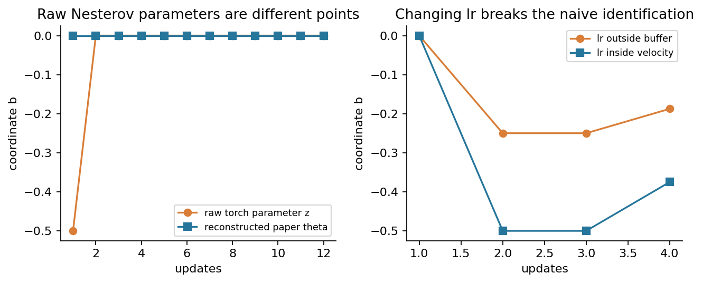

## 18 加速保证究竟保证哪一个对象

“加速”必须同时写明函数类、信息来源、参数规则、误差量和预算。对全空间上μ强凸且L光滑的函数，精确全梯度、μ>0、最优点存在，NAG标准设置η=1/L、$\beta=(\sqrt{L/\mu}-1)/(\sqrt{L/\mu}+1)$、d₀=0有几何型函数误差上界。按本讲θ编号，一个标准表述为[2]

$$
F(\theta_t)-F^*\le\frac{L+\mu}{2}\|\theta_0-\theta^*\|^2
\left(1-\sqrt{\mu/L}\right)^t.
$$

t=0时右侧按初始常数理解；μ=L时β=0且η=1/L，一步达到最优，不需要计算0⁰。该界来自适当势能或估计序列，本讲不以二次谱实验冒充其一般证明。本讲完整推导的是固定二次目标的状态递推和稳定条件；一般强凸结论在来源中有完整证明。界可以宽松，也不要求每一轮F单调。注意它是函数误差的保证，不是把某个状态谱半径直接当成函数值倍率。

对仅凸且L光滑的函数，经典O(1/t²)加速需要相应的随时间变化的系数序列和初始化；本讲固定β=0.5或0.9的代码没有自动获得这条保证。对HB，正定二次上的最优谱调参也不能直接推广到所有光滑强凸函数。来源[3]给出光滑强凸非二次函数上HB二次最优参数出现极限环的反例。对非凸目标，更不能把这些函数差到全局最优点的保证照搬。

若声称一个实验“证明加速”，先问：比较的是F−F*、距离、梯度范数还是真实耗时？各方法是否用了相同数据、相同梯度预算和可比调参信息？是否只挑选一个初值或忽略了失败轨迹？这些问题比只画更陡的一条线重要。

## 19 与随机梯度的关系

动量能滤除一些高频变化，但“滤波”不等于“免费消除噪声”。在一个冻结位置、独立零均值噪声ξₜ、方差σ²的简化标量模型中，未归一化buffer的噪声部分是$\sum_{k=0}^{t}\beta^k\xi_{t-k}$。独立使交叉项期望为0，所以方差为$\sigma^2\sum_{k=0}^{t}\beta^{2k}$，极限σ²/(1−β²)。

若换成归一化EMA，同一冻结模型的方差则乘(1−β)²，得到σ²(1−β)/(1+β)。然而要匹配原算法的位移又需要把学习率放大1/(1−β)，因此不能只引用较小的EMA方差就宣称同效更新更安静。

真实训练中θ随过去噪声变化，梯度不是固定信号，状态与未来梯度的条件结构需要重新分析。第034讲的无偏抽样、batch大小和噪声底仍然重要。确定性二次目标的谱图没有证明随机动量拥有同一渐近精度，也没有证明数据重排后的条件无偏性。

## 20 浮点状态和实验的证据边界

运行报告区分budget_exhausted、represented_optimum_zero_velocity、floating_state_stagnation、forward_cancellation_limit、numeric_range_limit。预算耗尽只是停止原因，不表示已达到目标；first_target_t单独记录。存储θ恰为已知可表示最优点且d=0，与仅仅一轮θ没有变化是两回事。

设a=nextafter(1,2)、b=0、η=10⁻⁸。a−1仍可表示，但更新可能小于a处的舍入间隔，导致a不变。若初始d还有一个微小非零量，下一轮d可能继续改变。因此程序只有θ和d都不再变化时才报告整个状态停滞，不能只检查位置。

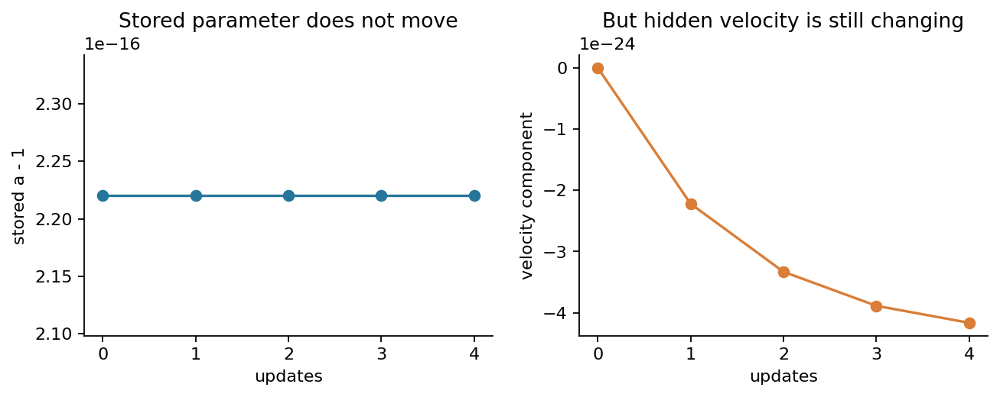

目标的逐行残差式与几何式在实数中相等，但接近最优时，预测减标签可能相消。报告保留原始前向loss与在存储参数处计算的geometric_gap；图中的极小目标使用后者。更新仍然使用逐行梯度，不暗中改成解析梯度。若实际求得零梯度但评估点不是这个已知最优点，程序标记forward_cancellation_limit并停止，防止把丢失的残差当成数学成功。大幅发散时，不同样本的梯度累积也会丢失较小方向；本讲不把这种浮点轨迹当成精确实数轨迹。

输入验证先检查原始类型与每个末字段，再开始数值计算。普通与python -O都运行同一显式校验；bool不能假装整数，字符串和非内置数值不能先转换再通过。CLI在完整计算与JSON序列化成功之后才创建输出目录，最后原子替换；失败保留旧报告。Notebook第一代码格先核对两份默认输入的完整字节，再输出任何数字或图。

## 21 自测题

1. 从四行数据推导F、梯度和Hessian，说明1/2与1/n各在哪里。
2. 独立重算初值θ₀=(0,1)的四行预测、损失和梯度贡献。
3. 用η=1/16、β=1/2写出HB两轮完整链，并指出目标上升发生在哪里。
4. 写出NAG第二轮旧点与预看点的全部前向，解释为何不能用旧点的零b梯度。
5. 展开dₜ的历史权重，分别求恒定和交替输入的稳态响应。
6. 推出一个特征方向的HB与NAG状态矩阵，说明初始化e₋₁如何确定。
7. 证明本讲二阶Jury判据，并推出两个开稳定区间。
8. 在β=1/2的两种边界上求根和完整解，解释为何有界仍可能不收敛。
9. 为什么Δ>0不保证无震荡？为什么ρ<1不保证逐轮下降？
10. 求本例GD、HB、标准强凸NAG的参数与谱半径，区分β是否平方。
11. HB从最优位置但非零速度出发会怎样？补做第二轮并重新前向。
12. 比较未归一化buffer与EMA，给出正确步长换算。
13. 推出学习率变化时位移递推中的ηₜ/ηₜ₋₁，核对前两步计划。
14. 解释PyTorch dampening第一步，并计算正确与错误首步。
15. 推导PyTorch Nesterov与lookahead形式的映射，核对第一步原始参数。
16. 检查η=0.12、β=0.9下两种方法的稳定性，说明这不否定NAG定理。
17. 哪些条件缺失时不能套用O(1/t²)或强凸加速界？
18. 构造位置不变但速度变化的状态，设计不会误报成功的停止规则。
19. 说明冻结位置噪声方差公式为何不能直接作为随机动量全程误差界。
20. 设计一个坏末字段CLI测试，验证旧输出保留且新目录不出现。

## 22 一手来源和核查范围

[1] [Sutskever等（2013）原论文](https://proceedings.mlr.press/v28/sutskever13.pdf)。实际读取第2节式(1)至(4)，核对位移型HB和lookahead NAG。本讲四行数据、表格与机制图独立构造。

[2] [Bubeck（2015）作者专著](https://arxiv.org/pdf/1405.4980)。实际读取第3.7节、定理3.18及估计序列证明，核对强凸参数、函数误差保证，以及原文x/y与本讲z/θ的角色映射。

[3] [Lessard、Recht、Packard（2016）作者修正版](https://laurentlessard.com/public/siopt16_iqcopt.pdf)。实际读取第2节、附录A和第4.6节，核对状态表示、二次谱分析及HB不可普遍外推的反例范围。

[4] [PyTorch官方2.7 SGD文档](https://docs.pytorch.org/docs/2.7/generated/torch.optim.SGD.html)。结合安装环境2.7.1源码，核对buffer首步、dampening、lr放置、Nesterov限制与foreach/fused，且实际执行CPU对照。

