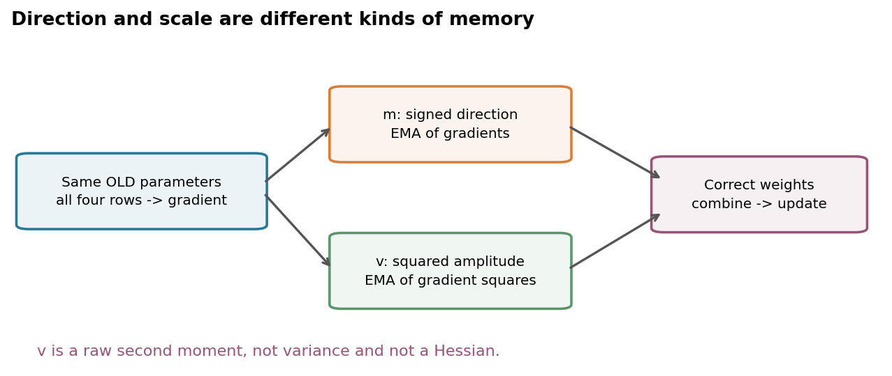
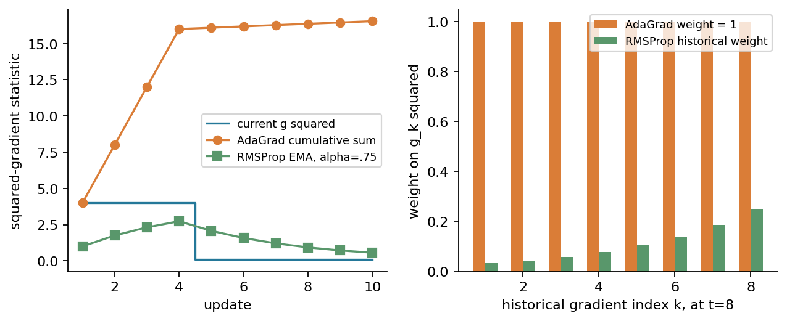
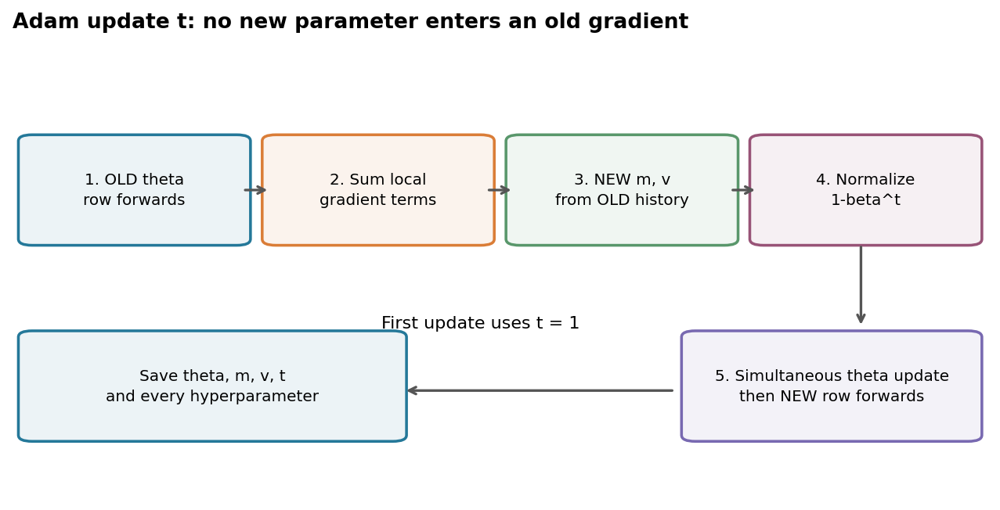
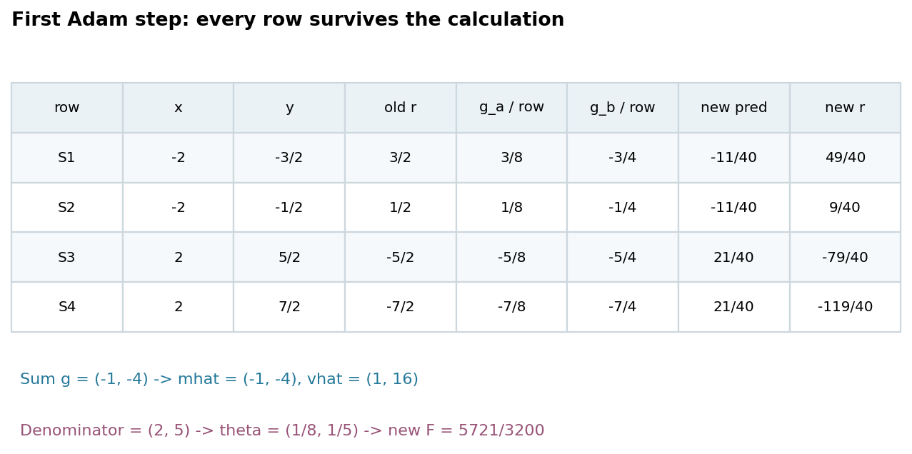
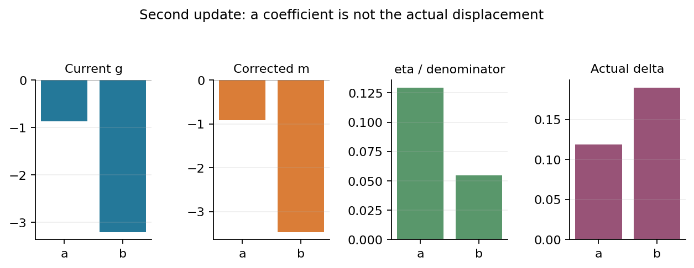
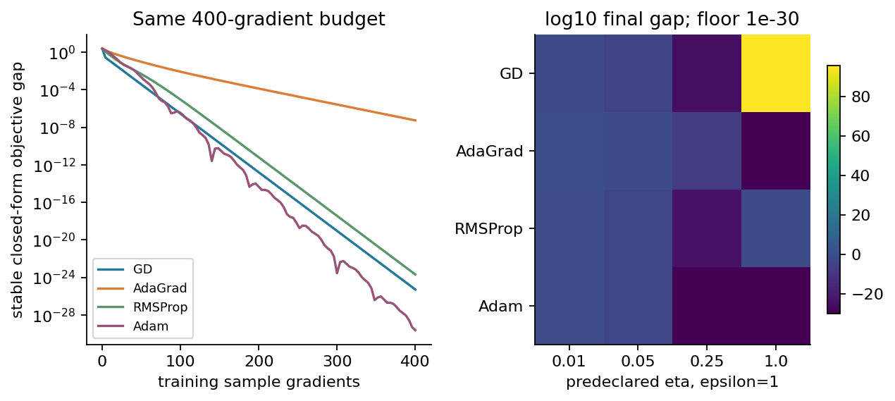
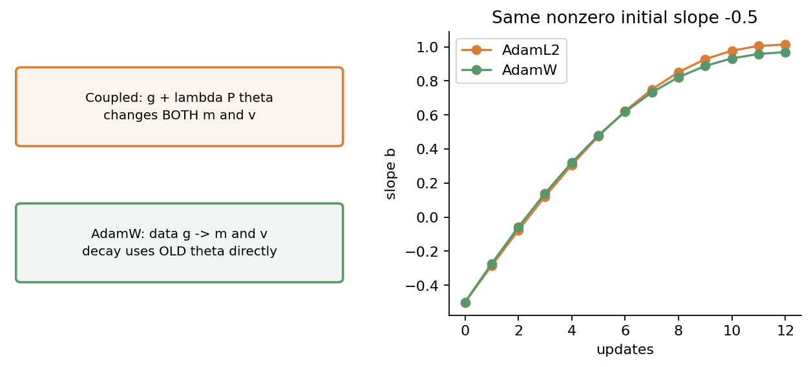
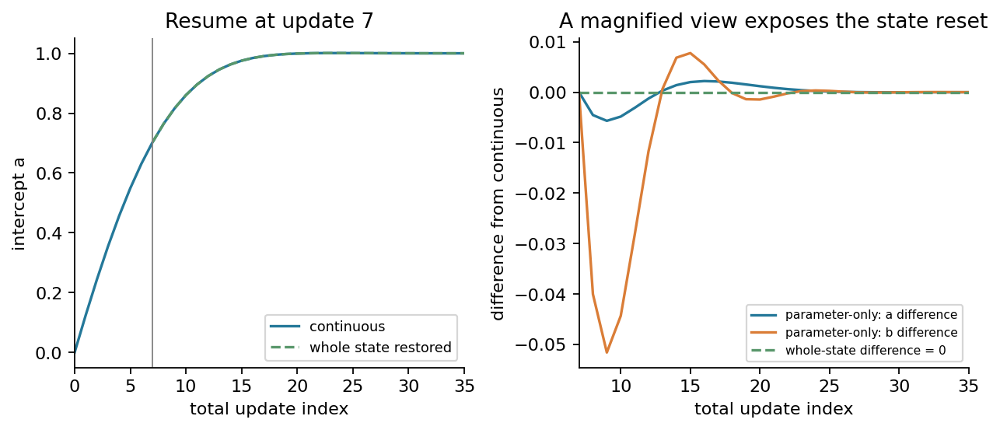
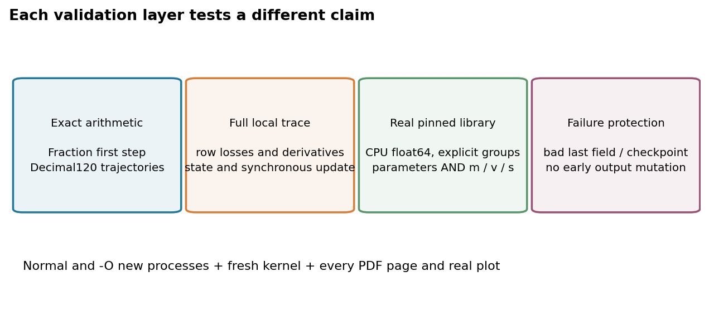

# 第036讲 自适应优化与权重衰减

## 1 从同一步长走向每个坐标的更新规则

第034讲解释了抽样产生的梯度噪声，第035讲加入历史方向形成动量。现在观察另一个问题：两个参数的梯度长期尺度不同，同一个学习率是否让某一坐标走得过猛、另一坐标走得过慢？自适应方法保存梯度的历史幅度，为每个坐标构造不同分母，再把方向与幅度合成一次更新。

直接先修为第034至035讲。还需会算逐元素平方、平方根、加权平均和链式法则。本讲从AdaGrad到RMSProp再到Adam，每次只增加必要状态。随后把L2惩罚放入梯度，与AdamW的独立参数缩减并列，说明相同的`weight_decay`数字为什么不一定表达同一个算法。

我们始终使用同一四行线性回归数据，完整手算Adam前两次更新，再核对从零实现的全部状态与真实库实现。有限CPU实验只解释机制；没有真实测试集、泛化比较或“Adam总优于SGD”的结论。

## 2 固定目标 数据与每个局部导数

四行特征x=(−2,−2,2,2)，标签y=(−3/2,−1/2,5/2,7/2)，模型预测$\hat y_i=a+bx_i$。令θ=(a,b)ᵀ，残差$r_i=\hat y_i-y_i$，目标$F=\sum_i r_i^2/(2n)$，n=4。单行损失是$r_i^2/2$，平均因子1/n放在梯度累积时。

局部导数$\partial\ell_i/\partial r_i=r_i$，$\partial r_i/\partial\hat y_i=1$，$\partial\hat y_i/\partial a=1$，$\partial\hat y_i/\partial b=x_i$。因此样本对完整梯度的贡献是$(r_i/4,x_i r_i/4)$。在同一个旧θ处算完全部四行后相加，不能更新a后再用新a计算b。

写z=(−1,1,−1,1)，有y=1+x+z/2，且Σx=Σz=Σxz=0，Σx²=16，Σz²=4。展开平方后交叉项消失，得到

$$
F(a,b)=\frac18+\frac12(a-1)^2+2(b-1)^2,
\qquad \nabla F=(a-1,4(b-1))^\top.
$$

最优点(1,1)，最低目标1/8，Hessian diag(1,4)。后面的求解器实际逐样本前向与求梯度；此闭式只作独立参照，不替代真实迭代。

## 3 AdaGrad保存到目前为止的平方和

令$g_{t}$为第t次更新前的梯度，时间从t=1起，初始θ₀，累积s₀=0。下式中的平方、平方根和除法全部逐元素进行：

$$
s_t=s_{t-1}+g_t\odot g_t,\qquad
\theta_t=\theta_{t-1}-\eta\frac{g_t}{\sqrt{s_t}+\epsilon}.
$$

坐标j的历史梯度常常很大，就有更大的$s_{t,j}$，分母更大。长期不活跃的坐标可能积累更少。但不要把“罕见特征必然更好”当成结论，更新仍依赖其实际梯度、数据和预算。

因为每次加上非负平方，$s_{t,j}$单调不减；当该坐标持续出现非零梯度，分母可能长期增大，使当前梯度前的系数降低。这是历史不会自动遗忘的代价。若梯度之后永久为0，累积量可以停止增长，不能无条件声称每种路径的有效系数都趋0。

本讲采用s₀=0、全局η固定、ε在平方根外；不加入额外学习率衰减。不同库或论文的初始累积、ε位置与额外计划可能不同，名字相同不代表逐步数值相同。

## 4 RMSProp改用指数加权平方平均

令v₀=0，0≤ρ<1。RMSProp把累积和改为

$$
v_t=\rho v_{t-1}+(1-\rho)g_t^2,\qquad
\theta_t=\theta_{t-1}-\eta\frac{g_t}{\sqrt{v_t}+\epsilon}.
$$

展开v₂=ρ(1−ρ)g₁²+(1−ρ)g₂²，可见较早的平方每过一步再乘ρ。一般第k步梯度在第t步的权重为$(1-\rho)\rho^{t-k}$。ρ越接近1，遗忘越慢，统计量越平滑但对新尺度反应更迟。常说的1/(1−ρ)只是记忆长度直觉；精确半衰步数由$\rho^h=1/2$给h=log(1/2)/logρ，ρ=0需单独解释。

本讲使用最简单版本：不加momentum、不做centered修正，也不对v作偏差修正。centered版本会额外估计梯度均值并从二阶矩扣除平方，已经是另一套状态，不能默认与本式相同。

## 5 这个平方统计量不是Hessian 也不是方差

$g_{t,j}^2$描述在已走过的位置、已抽到的数据上，该坐标梯度的平方。它既受曲率影响，也受离最优多远、噪声、目标归一化和坐标单位影响；不能把sqrt(v)直接叫Hessian对角线。

二阶原始矩E[g²]与方差不同：Var(g)=E[g²]−(Eg)²。如果某坐标梯度恒为2，二阶原始矩4，方差却是0。RMSProp和Adam默认保存平方梯度的平均，没有减去均值平方；命名为second moment更准确。

因此“除以梯度的标准差”通常是不精确的解释。较合适的说法是用历史平方幅度构造坐标尺度。真正的二阶曲率方法在后续Newton单元讨论，不要从有平方和平方根就推断它已使用Hessian。

## 6 Adam同时保存方向与幅度

取m₀=v₀=0，0≤β₁,β₂<1。Adam先计算

$$
\begin{aligned}
m_t&=\beta_1m_{t-1}+(1-\beta_1)g_t,\\
v_t&=\beta_2v_{t-1}+(1-\beta_2)g_t^2.
\end{aligned}
$$

m保存有正负的方向平均，v保存非负的平方幅度。两者形状与参数相同。相邻梯度符号相反时m可能相互抵消，v却不会因为符号变化而抵消。把m²当成v会得到不同算法。

初始状态为0导致早期权重总和不到1。Adam使用修正后的$\widehat m_t=m_t/(1-\beta_1^t)$、$\widehat v_t=v_t/(1-\beta_2^t)$，再同步更新

$$
\theta_t=\theta_{t-1}-\eta\frac{\widehat m_t}{\sqrt{\widehat v_t}+\epsilon}.
$$

这里没有用新θ重新更新m或v。顺序是旧θ前向→完整g→新m和v→偏差修正→全部θ同步更新→新θ前向。把t=0直接放进1−$\beta^t$会除0，第一次更新应是t=1。

## 7 偏差修正到底修正了什么

展开一阶递推：$m_t=(1-\beta_1)\sum_{k=1}^t\beta_1^{t-k}g_k$。若各步梯度的期望恰为同一向量μ，则E[$m_{t}$]=(1−$\beta_1^t$)μ，除以权重总和后得到E[$\widehat m_{t}$]=μ。二阶矩在相应平稳假设下同理。

即使没有平稳随机假设，除法仍有明确代数意义：把已有历史的几何权重归一化，使权重和成为1。但训练中参数不断变，E[$g_{k}$]通常也在变，所以不能说$\widehat m_{t}$无偏估计当前$g_{t}$。它是不同历史位置的加权混合。更不能推断比值m̂/√v̂是无偏的更新方向，因为分子分母相关，非线性比值的期望不能分拆。

若所有历史梯度恒等于g，修正后m̂=g、v̂=g²；未修正时两者分别带1−$\beta_1^t$和1−$\beta_2^t$。第一步因此最容易检查是否漏做修正。实现需要同时保存m、v与步数；只恢复参数会使下一步与连续训练不同。

## 8 第一轮逐行前向和梯度累积

为了手算易核验，使用η=1/4、β₁=1/2、β₂=3/4、ε=1，且λ=0、θ₀=(0,0)。这些是演示值，尤其ε=1不是实际大任务的推荐默认。

初始四行预测都是0，残差为(3/2,1/2,−5/2,−7/2)。单行损失r²/2依次9/8、1/8、25/8、49/8，合计21/2，除4得F₀=21/8。对截距的平均梯度分项为(3/8,1/8,−5/8,−7/8)，和−1；对斜率的分项为(−3/4,−1/4,−5/4,−7/4)，和−4。每个分项都来自r×1×1/4或r×1×x/4。

因此g₁=(−1,−4)。m₁=(−1/2,−2)，v₁=(1/4,4)。除以1−β₁=1/2、1−β₂=1/4，得m̂₁=(−1,−4)、v̂₁=(1,16)。平方根外加ε=1，分母(2,5)。参数增量为(1/8,1/5)，同步得到θ₁=(1/8,1/5)。

更新后对同一四行重新前向：预测(−11/40,−11/40,21/40,21/40)，残差(49/40,9/40,−79/40,−119/40)，平方和22884/1600。除8得到F₁=5721/3200=1.7878125。第一轮至此才完整，不能在参数更新处停止而不检查新预测。

## 9 第二轮不能沿用旧梯度

在θ₁=(1/8,1/5)处，上一节新残差正是本轮旧残差。对a的分项(49,9,−79,−119)/160相加得−7/8；对b的分项(−98,−18,−158,−238)/160相加得−16/5。因此g₂=(−7/8,−16/5)。

带入历史状态而非重新置零：m₂=(−11/16,−13/5)，v₂=(97/256,139/25)。第二轮修正因子分别1−(1/2)²=3/4、1−(3/4)²=7/16，所以m̂₂=(−11/12,−52/15)，v̂₂=(97/112,2224/175)。平方根一般是无理数，不能为了表格好看把它们编成分数。

$$
\begin{aligned}
a_2&=\frac18+\frac{11}{48(\sqrt{97/112}+1)},\\
b_2&=\frac15+\frac{13}{15(\sqrt{2224/175}+1)}.
\end{aligned}
$$

它们约为(0.2437004841250088,0.3898541226435905)。再以新参数对四行重算预测a₂−2b₂、a₂−2b₂、a₂+2b₂、a₂+2b₂，然后各减原始标签、平方、求平均。得到F₂≈1.1555504621664184。完整逐行小数表与高精度根号参照在实验和解答中给出。

这里只在展示时舍入；实际算法每一步使用存储浮点参数。精确Fraction可以核验第一轮、第二轮的有理矩，第二次平方根及后续轨迹再用Decimal独立检查。不能把展示到四位小数的参数反馈进程序还期待原路径逐位一致。

## 10 有效系数 不等于当前梯度乘一个数

对Adam定义坐标系数$d_{t,j}=\eta/(\sqrt{\widehat v_{t,j}}+\epsilon)$，更新为$-d_{t,j}\widehat m_{t,j}$。d描述本轮预条件尺度，但乘的是历史方向m̂，不是当前g。因此把Δθ/g叫“有效学习率”可能在g=0时无定义，或在动量与当前梯度反向时出现负值。

报告同时记录原始g、m、v、m̂、v̂、分母、d与实际Δθ。只画d很大不能断言参数步子很大；还要看被乘的m̂。零当前梯度也不一定意味着不移动，非零历史m仍可能继续推动参数。

在主例第一步d=(1/8,1/20)，方向m̂=(−1,−4)，实际增量(1/8,1/5)。a的系数更大，但b的实际增量更大，这已经说明不能只看系数大小比较移动量。

## 11 ε的位置和单位也会改变算法

sqrt(v̂)+ε与sqrt(v̂+ε)通常不同，且ε的单位不同：前者与梯度同单位，后者与梯度平方同单位。若v̂=0，前者分母ε，后者分母√ε；当ε很小时差异可能很大。不要因为两种形式都防止除0就认为可以互换。

对无正则Adam，把整个目标乘正数c，且比较同一参数路径上的梯度，有g′=cg、m′=cm、v′=c²v。因此若ε′=cε，归一化方向完全相同；若ε不变，等价于在原问题中使用ε/c，一般不会逐步相同。ε=0且分母非零时才有简单的尺度消去。

这种固定坐标下的整体梯度缩放，不等于任意参数坐标变换不影响算法，更不等于各种惩罚一起自动保持等价。实验用目标×100分别保持ε和同步×100，验证两个不同命题。

## 12 用同一目标比较四种优化器

主比较均令λ=0，使用相同数据、初始θ、100次全批更新，每次处理4行，预算400次样本梯度。AdaGrad、RMSProp、Adam与普通GD同时记录原目标和各自状态，ε与各历史系数都显式给出。

η相同并不意味着实际位移相同，也不意味着调参公平已经解决。这个比较先控制一个机制变量；另用预先写入的有限学习率网格展示结果对η敏感，不根据测试集或事后挑最漂亮曲线宣布赢家。无论哪条曲线最低，都只是这个数据、这个预算、这套候选参数的有限证据。

Adam也不能自动保证逐步下降。可以仍用同一数据，从接近最优的θ=(1+10⁻⁶,1)出发，另标记ε=10⁻⁸、较大η：第一步归一化后可能跨过最优很多，使原目标差增大。要从完整旧残差与g重新计算这个反例，不能只画一个任意向量箭头。

## 13 L2惩罚怎样进入梯度

取非负λ和对角选择矩阵P，本例P=diag(0,1)，即只惩罚斜率。正则目标J(θ)=F(θ)+λθᵀPθ/2，其梯度$g_{J}$=$g_{F}$+λPθ。对无动量普通GD，更新为

$$
\theta^+=\theta-\eta(g_F+\lambda P\theta)
=(I-\eta\lambda P)\theta-\eta g_F.
$$

所以在这个明确约定下，“把L2梯度加进去”与“同一步按1−ηλ缩减相应参数”完全一致。这个等式依赖更新是对总梯度线性乘同一个η，不应未经证明推广到带历史或自适应分母的方法。

不同文章把每步缩减率直接记为λ，而一些库把λ记为乘学习率之前的系数，两者差一个η。读公式时必须说明是哪一种；不能只比较参数名。这里所有AdamW式衰减采用库常见的1−ηλ约定。

## 14 在Adam里耦合L2会改变两个历史矩

耦合L2先形成$g_{J}$=$g_{F}$+λPθ，再把它送入m与v。因此正则项不仅改变当前方向，也被历史一阶平均和平方幅度记住。由于平方含交叉项，v($g_{F}$+λPθ)不是v($g_{F}$)加一个简单常数。

更一般地，即便只考虑已给定的对角预条件矩阵D，更新−ηD($g_{F}$+λPθ)中的缩减部分也是−ηλDPθ。只要D不同坐标不等，就不是每个被选择参数同倍率的缩减。Adam的D还随过去梯度变化，差异更多。

因此Adam中的L2惩罚仍有明确的正则目标含义，但它不等价于下面的AdamW更新。两者哪个好必须看任务与评估证据，不能把“不等价”写成“一定无效”。

## 15 AdamW把衰减与梯度预条件分开

AdamW用原数据梯度$g_{F}$更新m、v和修正量，再按

$$
\theta_t=(I-\eta_t\lambda P)\theta_{t-1}
-\eta_t\frac{\widehat m_t}{\sqrt{\widehat v_t}+\epsilon}
$$

更新。衰减使用旧参数，并且不进入m或v。若先做自适应更新，再对新参数整体乘缩减率，会额外缩小梯度步，与上述同步式不同。库可能先原地缩减参数再应用已由旧梯度计算的步，代数上仍对应同一公式，需核对梯度计算时刻。

实验的耦合与解耦对比从同一非零初值(1/2,−1/2)出发，λ=0.1，mask=(0,1)。这样第一步已能显露差异，而不是从全零点看第一步碰巧相同就误以为等价。记录各自原F、若考虑L2时的J、矩状态、衰减位移和自适应位移，避免把不同目标的数值混作一条损失。

未受惩罚的截距是本次显式选择，不是“AdamW自动不衰减bias”。参数分组需要研究者明确给出。若学习率随t变化，即使纯衰减也为$\prod_t(1-\eta_t\lambda)\theta_0$，不是与调度无关的一条固定指数。

## 16 零梯度 与没有梯度不是一回事

数学上的零向量梯度仍是一轮明确更新：历史矩可能衰减、非零m可能继续产生位移、AdamW还可能做权重缩减。库中的grad=None通常表示该参数没有参与本轮梯度计算，可跳过参数与状态更新。这是接口语义，不能把None当作已经算出精确0。

真实库对照会分别构造全零梯度张量和None，检查参数、步数与状态，不只比较最终损失。还会核对显式参数组的衰减mask。检查使用CPU float64、单线程、关闭foreach和fused等路径；不凭最新版文档默认值推断另一个已安装版本。

## 17 保存参数还不够 恢复全部状态

Adam的下一步依赖θ、m、v、t和超参数；RMSProp依赖v，AdaGrad依赖s。中途保存θ后新建优化器，会重置历史与修正步数，即使数据顺序和η不变，也可能产生另一条轨迹。

实验在第7次更新后保存所有状态，再从第8次继续，并与未中断100步逐状态比较；另做只恢复θ的反例。若学习率调度、抽样器或模型中还有随机性，还需要相应状态才能谈完整复现，本讲确定性全批任务把这些额外因素暂时排除。

不要把保存的v任意改成负数、把t改成True或漏掉某个坐标后继续。程序应在第一次更新之前验证完整状态的形状、原始类型、有限性和非负性，出错不写新结果。研究中的checkpoint首先是一份有语义的状态，不能只因为能JSON读取就当作合法。

## 18 收敛结论与实验结论的边界

这些更新公式本身不是无条件收敛定理。AdaGrad、Adam及其修正版的理论各自规定目标、随机性、步长计划、梯度范围和输出对象。已知工作还指出原始Adam某些收敛论证的问题，并提出保存更长期二阶统计的修正。这里把相关论文作为查证入口，不把一个简短口号当作所有实现的保证。

AMSGrad之类变体也必须明确max作用于哪个未修正或修正状态以及时间因子。不能随手把当前v替换为最大值就宣称已严格复现特定库或论文。主实现聚焦已列四种方法及AdamW，不额外把未完整验证的变体纳入“已验收”列表。

对于科研比较，应先统一数据、训练目标、预算、精度和超参数选择规则，再报告多种合理设置、失败状态与复现条件。更低训练目标不自动意味着更好测试表现，自适应也不意味着无需学习率或预处理。

## 19 从手算到库实现的分层验收

第一层用Fraction核验主例全部逐样本梯度、第一步与第二步有理矩；用高精度Decimal计算根号、参数和新前向。第二层以独立标量循环重做向量实现，检验逐元素状态、偏差修正时间索引和同时更新，不能只测最终目标。

第三层在真实PyTorch2.7.1+cpu对照AdaGrad、RMSProp、Adam、Adam加L2和AdamW，显式写明ε位置、初始累积、momentum/centered关闭、衰减参数组、foreach与fused设置。比较参数及m/v/s等状态；容差考虑不同等价操作顺序，不要求不同库逐位相同。

第四层验证完整状态恢复、目标缩放与ε、零梯度/None、近最优超调和坏尾字段。所有输入先校验，完整运行和序列化成功后才原子替换输出。Notebook固定说明前检查全部默认输入的完整字节；新内核顺序执行，完整报告与脚本一致。最后人工查看每一PDF页及每张真实输出图。

## 20 自测与完整验收

1. 从四行数据推F、梯度、Hessian、最优点和最低目标。
2. 展开AdaGrad前三次平方累积，解释何时持续变大、何时不变。
3. 展开RMSProp的历史权重，并区分记忆长度直觉与精确半衰期。
4. 用恒定梯度说明二阶原始矩为何不是方差，也不是Hessian。
5. 写出Adam的一阶、二阶状态及完整同步更新顺序。
6. 从权重总和推偏差修正，说明平稳期望假设与非平稳限制。
7. 同组四行数据完整手算第一轮预测、局部导数、矩、参数和新前向。
8. 从新残差手算第二轮梯度、有理矩、修正量、根号更新和新目标。
9. 解释η/(√v̂+ε)、Δθ与Δθ/g的区别，处理零当前梯度。
10. 比较ε放在平方根内外，并分析整体目标乘c时怎样匹配ε。
11. 在相同400次样本梯度预算下设计四种方法比较，指出尚未控制的调参因素。
12. 用同一数据的近最优初值构造Adam目标差增大的完整更新反例。
13. 从L2梯度推无动量GD与缩减的等价关系，说明λ约定。
14. 展开耦合L2进入Adam的m和v，明确平方中的交叉项。
15. 推AdamW同步式，比较先更新再衰减新参数为何不同。
16. 从非零初值比较相同λ的耦合与解耦两步，记录全部状态。
17. 解释显式衰减mask和学习率调度下的累计纯衰减。
18. 用真实库区分零梯度张量和None的参数/步数行为。
19. 证明完整状态恢复可接续同一迭代，并展示只存参数的差异。
20. 设计独立数值参照、库对照、原始类型/坏尾字段/输出保护的验收，区分有限检查与收敛定理。

下一讲处理L1尖点和参数约束。自适应分母没有消除不可微问题，普通光滑更新的假设不能直接搬过去。

## 来源与核查范围

- [Duchi等AdaGrad原始论文](https://jmlr.org/papers/volume12/duchi11a/duchi11a.pdf)：核对对角历史平方统计与其原始优化背景。本讲只实现明确写出的无约束简化形式。
- [Tieleman与Hinton课程讲义](https://www.cs.toronto.edu/~tijmen/csc321/slides/lecture_slides_lec6.pdf)：核对RMSProp近期平方平均的提出背景，不复制课件图。
- [Kingma与Ba Adam原始论文](https://arxiv.org/pdf/1412.6980)：核对算法1和零初始化权重修正；不把论文早期收敛说法当作无限制保证。
- [Loshchilov与Hutter AdamW论文](https://arxiv.org/html/1711.05101v3)：核对解耦机制与L2非等价，特别区分论文每步衰减和库乘η的参数约定。
- [Reddi等On the Convergence of Adam and Beyond](https://arxiv.org/pdf/1904.09237)：核对原始Adam收敛分析的限制及变体背景，不在本讲复用未经展开的保证。
- [PyTorch2.7 Adam](https://docs.pytorch.org/docs/2.7/generated/torch.optim.Adam.html)与[AdamW](https://docs.pytorch.org/docs/2.7/generated/torch.optim.AdamW.html)：核对固定版本接口、衰减与状态；实际已安装版本另以真实运行核验。
