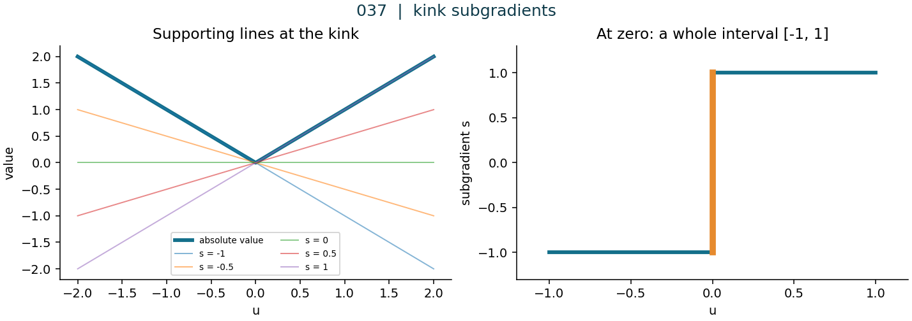
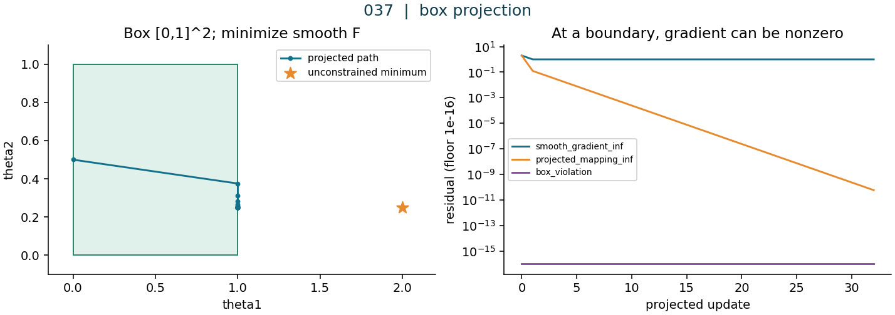
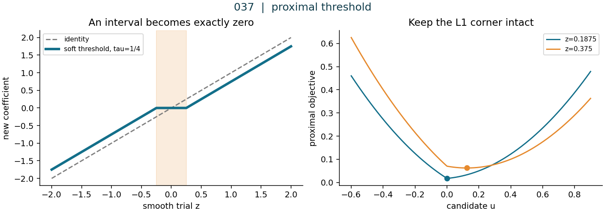
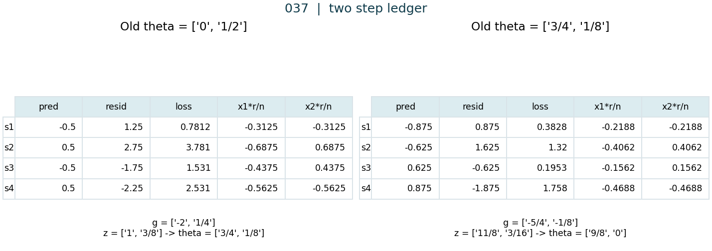
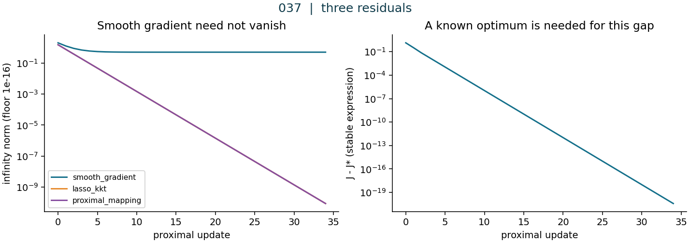
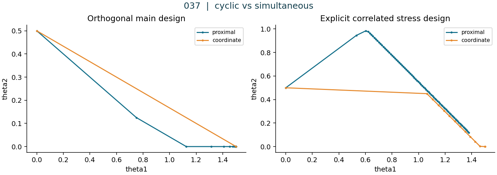
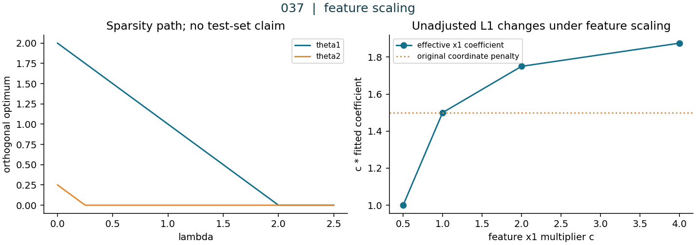
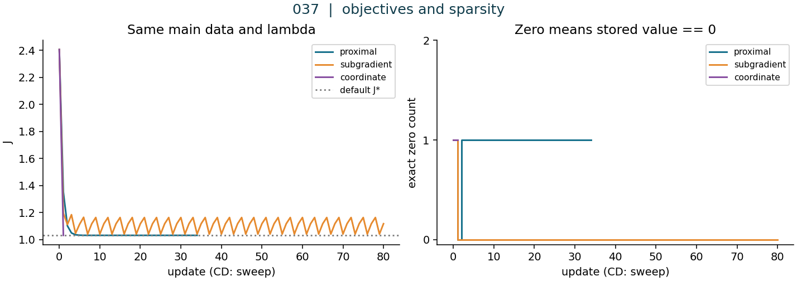
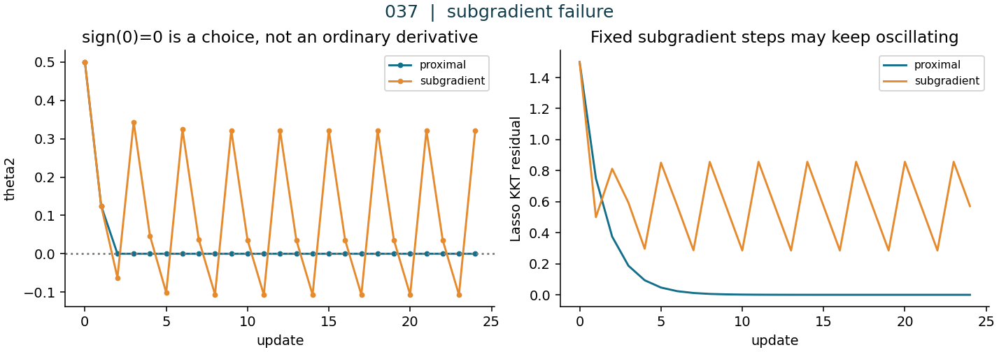

# 第037讲 约束与非光滑优化

## 1 为什么普通梯度不再够用

直接先修：第016讲的向量与矩阵、第032至033讲的优化与梯度下降。上一讲讨论了如何利用梯度历史调整方向和尺度；本讲追问更基础的事：若目标在某处根本没有普通导数，或者梯度一步走出了允许的参数集合，应该更新什么？

目标有绝对值尖点时，不能随手给尖点安上一个普通导数，再沿用光滑目标的保证。参数有约束时，即使目标处处可导，最优点也未必满足梯度为零。我们会分别建立次梯度、投影和近端三种语言，再把它们放进同一份稀疏回归账本。

学完应能独立回答：为什么L1会产生精确的零；阈值为什么是学习率乘正则系数；怎样从每行残差组成更新；为什么光滑梯度、近端映射和KKT残差不是同一个量；为什么一次坐标扫描与一次同步近端更新也不是同一种工作。所有实验是原创小型合成数据上的优化机制检验，不是变量因果发现或泛化成绩。

## 2 先把形状 单位 与目标写完整

设样本数n、特征数p，矩阵$X\in\mathbb R^{n\times p}$第i行是$x_i^\top$，参数$\theta\in\mathbb R^p$，标签$y\in\mathbb R^n$。预测向量$\hat y=X\theta$，残差$r=X\theta-y$。没有额外截距列；本讲两个特征和标签均已中心化。用不带截距的模型，不能让库默认再拟合一个截距。

$$
f(\theta)=\frac{1}{2n}\|X\theta-y\|_2^2,\quad h(\theta)=\lambda\|\theta\|_1,\quad J(\theta)=f(\theta)+h(\theta),\quad\lambda\geq0.
$$

这里单行损失$\ell_i=r_i^2/2$，最后才除以n。光滑梯度$g=\nabla f=X^\top r/n$形状p，Hessian $H=X^\top X/n$形状p×p。不要把g称为整个J的普通梯度。

合成例中的数值全部无物理单位。如果实际标签单位为U、特征无量纲，则θ单位为U，f与J单位为U²，g与λ单位为U，η在该坐标约定下无量纲，ηλ与θ同单位。若不同特征本身单位不同，就需要先定义坐标缩放或加权惩罚，不能不加说明地给不同单位的系数套同一个λ。范数$\|\theta\|_1=\sum_j|\theta_j|$，而不是各元素平方和。

## 3 一份贯穿全讲的四行数据

|样本|x1|x2|y|
|---|---:|---:|---:|
|s1|−1|−1|−7/4|
|s2|−1|1|−9/4|
|s3|1|−1|5/4|
|s4|1|1|11/4|

记z=(1,−1,−1,1)ᵀ，则$y=2X_{:1}+X_{:2}/4+z/2$。两列X及z相互正交，每列平方和4；因此n=4、p=2、$X^\top X/4=I_2$、$X^\top y/4=(2,1/4)^\top$。

直接展开平方，交叉项因正交消失，得到独立核验式

$$
f(\theta)=\frac18+\frac12(\theta_1-2)^2+\frac12(\theta_2-1/4)^2,\quad g=(\theta_1-2,\theta_2-1/4)^\top.
$$

实际程序仍从每行预测、残差和导数求梯度，不用这个答案更新参数。默认λ=1/2、η=1/2、初值θ⁰=(0,1/2)ᵀ。设计正交是为了手算透明，不是声称真实数据通常正交。第18节另标记相关设计压力例，不在主实验中暗换数据。

## 4 绝对值零点的次梯度是一个集合

对凸函数h，向量s是h在u处的次梯度，当且仅当对定义域中所有v成立

$$
h(v)\geq h(u)+s^\top(v-u).
$$

右边是一张全局支撑平面，不是要求存在唯一切线。所有这样的s组成次微分$\partial h(u)$。在可导凸函数处它恰好只有普通梯度一个元素，但“每个凸函数处处可导”是错的。

推导$\partial|u|$：若u>0，左右邻域都在正半轴，斜率只能为1；若u<0，只能为−1。若u=0，定义变成$|v|\geq sv$。代v>0得s≤1；代v<0得s≥−1；反过来任意s∈[−1,1]对两种符号均成立。因此

$$
\partial|u|=\begin{cases}\{1\},&u>0,\\{}[-1,1],&u=0,\\\{-1\},&u<0.\end{cases}
$$

设置sign(0)=0是选了其中一个次梯度，绝不是证明零点普通导数等于0。图1中零点的橙色线段应看成一整个集合，不能当作一条函数曲线的单值。

## 5 从零次梯度得到Lasso最优性条件

凸函数J的全局最优点θ*满足且仅满足$0\in\partial J(\theta^*)$。充分性直接来自次梯度定义：取s=0，则所有候选v都有J(v)≥J(θ*)。必要性也直接成立：若θ*最优，零向量正好满足该定义。这里J是有限凸函数；本讲的光滑f与有限连续L1允许次微分求和。

所以$0\in g(\theta)+\lambda\partial\|\theta\|_1$，逐坐标变成

$$
\theta_j>0:\ g_j+\lambda=0;\qquad
\theta_j<0:\ g_j-\lambda=0;\qquad
\theta_j=0:\ |g_j|\leq\lambda.
$$

零系数并不要求对应数据梯度为0。主例θ*=(3/2,0)的光滑梯度为(−1/2,−1/4)，可取L1次梯度(1,1/2)，两者抵消。这里θ*唯一，因为H=I给f严格凸；对于相关或秩亏X，Lasso系数未必唯一，不能从一个求解器返回一组系数推出唯一性。

代回得$f(\theta^*)=9/32$、L1项3/4，故$J^*=33/32$。这个最优值只属于这份X、y及λ=1/2。更换数据后仍写33/32，会制造虚假的“目标差”。

## 6 次梯度迭代为什么可能来回跳

一种直接方法是$\theta^{t+1}=\theta^t-\eta_t(g(\theta^t)+\lambda s^t)$，其中$s_j^t\in\partial|\theta_j^t|$。它确实可定义，但负次梯度不一定是当前点的下降方向。

最小反例取J(u)=|u|、u=0、选择合法s=1，则任意η>0都更新到−η，目标由0增至η。即使固定选sign(0)=0，靠近零点而不等于零时，也可能一步越过尖点再折返。固定步长不保证精确停在最优点。

若凸函数沿路径次梯度有界为G，最优点存在且初始距离≤R，把平方距离展开并应用支撑不等式可得

$$
2\eta_t[J(\theta^t)-J^*]\leq
\|\theta^t-\theta^*\|^2-\|\theta^{t+1}-\theta^*\|^2+\eta_t^2G^2.
$$

求和后，历史最好目标差不超过$(R^2+G^2\sum_t\eta_t^2)/(2\sum_t\eta_t)$。这解释了衰减步长的作用，但并非说任意常步长、任意无界路径都有保证，也不保证每轮下降。实验保留固定步长的振荡，不能悄悄只画历史最低点冒充每轮真实目标。

## 7 投影先解决可行性

设C是非空闭凸集合，欧氏投影定义为$\Pi_C(z)=\arg\min_{u\in C}\|u-z\|^2/2$。闭集使连续距离在有界子水平集上取到最小值；二次距离严格凸而C凸，使最小点唯一。

令p=ΠC(z)。沿任意可行线段p+t(u−p)做一侧导数，得到$(p-z)^\top(u-p)\geq0$。反过来若此不等式对所有u∈C成立，展开距离平方即可证明p最优。这是投影的变分刻画。

盒约束$C=\prod_j[a_j,b_j]$可分离，逐坐标投影就是clip：小于下界抬到下界，大于上界压到上界，中间保持。投影到一般凸集合不等于逐坐标clip；例如单纯形还要满足总和为1，坐标间耦合。

投影梯度采用$\theta^+=\Pi_C(\theta-\eta\nabla f(\theta))$。它解决的是约束问题min f over C。本讲盒实验不额外加入L1，故它的目标值不能与Lasso的J直接排名。若初值不在盒内，程序明确记录原初值并先投影，再开始可行路径。

## 8 边界最优点的梯度可以不为零

约束问题的最优性条件为$\nabla f(\theta^*)^\top(u-\theta^*)\geq0$对所有u∈C。把上一节投影不等式代入可知，这等价于固定点$\theta^*=\Pi_C(\theta^*-\eta\nabla f(\theta^*))$，其中η>0。

主数据若C=[0,1]²，最优点是(1,1/4)。光滑梯度是(−1,0)。第一维负梯度想继续往右走，但右边已不可行；非零梯度由边界反作用抵消。每次从此点先走到(1+η,1/4)，再投影回原点，投影映射残差为0。

从(0,1/2)用η=1/2，第一次平滑试探(1,3/8)，投影仍为(1,3/8)；第二次平滑试探(3/2,5/16)，投影变为(1,5/16)。这与主L1路径(3/4,1/8)、(9/8,0)不同，因为问题本来就不同。

## 9 用近端算子保留不光滑项

对适当、闭、凸h及η>0，近端算子定义为

$$
\operatorname{prox}_{\eta h}(z)=\arg\min_u\left\{h(u)+\frac{1}{2\eta}\|u-z\|^2\right\}.
$$

“适当”指不恒为+∞且从不取−∞；“闭”在这里指下半连续。它们加上凸性让这个强凸子问题有唯一解。二次项限制偏离z的距离，h则表达稀疏、约束或其他结构。

若h=0，近端就是恒等映射。若h为集合C的指示函数$\delta_C$，在C内为0、外为+∞，近端就是ΠC。注意这个凸分析指示函数不是概率论中取0或1的事件指示变量。

若h是一般可导函数，近端最优性写作$u=z-\eta\nabla h(u)$，右侧在新u处评价，属于隐式关系。普通梯度步用旧z处的梯度，是另一种映射。这也是“先加梯度再裁一下”不能概括所有近端算法的原因。

## 10 完整推导L1的soft thresholding

令h(u)=λΣ|u_j|，近端目标可分离。乘上η后，每个坐标求解$\min_u\{(u-z)^2/2+\tau|u|\}$，其中τ=ηλ≥0。用次梯度最优性：$0\in u-z+\tau\partial|u|$。

第一种情形u>0：方程u−z+τ=0，故u=z−τ；成立条件是z>τ。第二种u<0：u−z−τ=0，故u=z+τ；成立条件是z<−τ。第三种u=0：需要0∈−z+τ[−1,1]，即|z|≤τ。三种情况穷尽实数，边界z=±τ均落到u=0。

$$
S_\tau(z)=\begin{cases}z-\tau,&z>\tau,\\0,&|z|\leq\tau,\\z+\tau,&z<-\tau.\end{cases}
\qquad
S_\tau(z)=\operatorname{sign}(z)\max(|z|-\tau,0).
$$

λ=0时τ=0，映射恢复恒等；ηλ才是本轮阈值，不能直接把λ当阈值。soft-threshold既收缩大系数，也把一个区间压成精确零。hard-threshold仅删除小系数、保留大系数原值，它不是此L1近端的解。

例如τ=1/4，z=(−3/4,−1/4,1/8,3/8)变成(−1/2,0,0,1/8)。阈值相等时也应得到零，不应因为实现中用了错误严格不等式而留下特殊边界。

## 11 近端梯度来自一个局部优化问题

把光滑f在旧θ处线性化，并用二次项控制步长，保留h的完整形状：

$$
Q_\eta(u;\theta)=f(\theta)+g(\theta)^\top(u-\theta)+\frac{1}{2\eta}\|u-\theta\|^2+h(u).
$$

配方时，把与u无关的项剔除，得到$\|u-(\theta-\eta g)\|^2/(2\eta)+h(u)$。因此

$$
\theta^{t+1}=\operatorname{prox}_{\eta h}(\theta^t-\eta g(\theta^t))=S_{\eta\lambda}(\theta^t-\eta X^\top(X\theta^t-y)/n).
$$

先算全部旧预测，再汇总全部g，形成全部z，逐坐标soft-threshold，最后同时替换全部θ。虽然阈值操作可逐坐标执行，每一坐标读的仍是同一轮旧参数构造的z。不能更新θ1后再重新计算g2并声称还是同步近端梯度。

## 12 第一次完整更新的逐行账本

旧θ⁰=(0,1/2)。预测每行是θ1x1+θ2x2。每行局部链均为：$\partial\ell_i/\partial r_i=r_i$、$\partial r_i/\partial\hat y_i=1$、$\partial\hat y_i/\partial\theta_j=x_{ij}$，平均梯度分项为$r_ix_{ij}/4$。

|样本|预测|残差|单行损失r²/2|对θ1的均值分项|对θ2的均值分项|
|---|---|---|---|---|---|
|s1|-1/2|5/4|25/32|-5/16|-5/16|
|s2|1/2|11/4|121/32|-11/16|11/16|
|s3|-1/2|-7/4|49/32|-7/16|7/16|
|s4|1/2|-9/4|81/32|-9/16|-9/16|

相加得g⁰=(−2,1/4)。平滑试探$z^0=\theta^0-\tfrac12g^0=(1,3/8)$。阈值τ=ηλ=1/4。第一坐标1>1/4，减去1/4得3/4；第二坐标3/8>1/4，减去1/4得1/8。两坐标同步写入θ¹=(3/4,1/8)。

此时还没有完成本轮验收。必须用新θ对全部原始行重新前向，而不是沿用旧损失：

|样本|预测|残差|单行损失r²/2|
|---|---|---|---|
|s1|-7/8|7/8|49/128|
|s2|-5/8|13/8|169/128|
|s3|5/8|-5/8|25/128|
|s4|7/8|-15/8|225/128|

因此f₀=69/32、L1₀=1/4、J₀=77/32；f₁=117/128、L1₁=7/16、J₁=173/128。只报告数据损失而遗漏惩罚，会误解Lasso优化的对象。

## 13 第二次更新产生精确零系数

上一节的新预测是这一轮的旧预测。局部链式法则没有变化，残差却必须重算或使用已核对的上一轮新前向，不能沿用第一轮g⁰。

|样本|预测|残差|单行损失r²/2|对θ1的均值分项|对θ2的均值分项|
|---|---|---|---|---|---|
|s1|-7/8|7/8|49/128|-7/32|-7/32|
|s2|-5/8|13/8|169/128|-13/32|13/32|
|s3|5/8|-5/8|25/128|-5/32|5/32|
|s4|7/8|-15/8|225/128|-15/32|-15/32|

梯度分项相加为g¹=(−5/4,−1/8)。平滑试探为$z^1=(3/4,1/8)-(1/2)(-5/4,-1/8)=(11/8,3/16)$。第一坐标减阈值得9/8；第二坐标3/16落在[−1/4,1/4]内，故直接赋值0，而不是减阈值得−1/16。同步新参数θ²=(9/8,0)。

|样本|预测|残差|单行损失r²/2|
|---|---|---|---|
|s1|-9/8|5/8|25/128|
|s2|-9/8|9/8|81/128|
|s3|9/8|-1/8|1/128|
|s4|9/8|-13/8|169/128|

新数据损失69/128，L1项9/16，总目标141/128。零系数数目由0变成1。此时还未最优：g²=(−7/8,−1/4)，第一个坐标KKT残差−3/8，第二个坐标因|−1/4|≤1/2已满足零点条件。目标差是141/128−132/128=9/128。

## 14 步长条件从哪里来

如果f的梯度满足$\|\nabla f(u)-\nabla f(v)\|\leq L\|u-v\|$，沿线段积分并用Cauchy不等式得到下降引理：$f(\theta+d)\leq f(\theta)+g^\top d+L\|d\|^2/2$。对平方损失，L是$X^\top X/n$最大特征值；主数据L=1。

近端解u=θ+d满足$-g-d/\eta\in\partial h(u)$。由h在u处的支撑不等式，$h(u)-h(\theta)\leq-g^\top d-\|d\|^2/\eta$。与下降引理相加：

$$
J(u)\leq J(\theta)-\left(\frac1\eta-\frac L2\right)\|d\|^2.
$$

因此0<η≤1/L是简单充分条件，并给出至少$\|d\|^2/(2\eta)$的理论下降量。这一结论要求凸h、准确求近端、准确梯度及精确算术；数值舍入下检查允许小容差。它不能照搬到随机梯度、随意选的次梯度或带惯性更新。

η≤1/L不是唯一可能稳定的范围。上式在η<2/L仍有正系数，但本讲收敛界采用更保守清楚的η≤1/L。过大η的反例仍可用主数据：λ=1/2、θ=(0,0)、η=3，得到z=(6,3/4)，阈值3/2，θ⁺=(9/2,0)，目标从69/32升至177/32。程序允许此类演示设置，不把不下降误报为代码成功证明。

## 15 从下降到有限步误差界还差一步

单调下降只说明目标序列有下界时会收敛到某个数，不自动说明这个数是最优值。还需利用凸性和近端最优性。若θ*存在、0<η≤1/L，可把f在θ处对θ*的凸性下界与上节不等式合并，得到三点式

$$
J(\theta^+) - J^* \leq \frac{\|\theta-\theta^*\|^2-\|\theta^+-\theta^*\|^2}{2\eta}.
$$

推导关键是把$g^\top(\theta^+-\theta^*)$与近端次梯度的内积合并，再用$2a^\top b=\|a\|^2+\|b\|^2-\|a-b\|^2$；剩余$(1/(2\eta)-L/2)\|d\|^2$非负，故可丢弃。将t=0至k−1求和，右侧望远镜相消，再用目标单调性，得到

$$
J(\theta^k)-J^*\leq\frac{\|\theta^0-\theta^*\|^2}{2\eta k}.
$$

这是凸复合问题的O(1/k)目标界，不是每个参数的O(1/k)误差，也不是非凸网络的一般结论。主例H=I还具有更强结构：第二坐标进入零区间后保持0，第一坐标的误差每步乘1/2；这个更快现象来自本例，不能拿来替代一般证明。

## 16 三种残差要分开报告

光滑梯度范数$\|g\|_\infty$只适合作为无约束光滑最优性的一类诊断。主Lasso最优点仍有范数1/2；盒最优点仍有范数1。把它们当作错误，会把正确求解器改坏。

近端gradient mapping定义为$G_\eta(\theta)=[\theta-\operatorname{prox}_{\eta h}(\theta-\eta g)]/\eta$。它的零点等价于复合最优性，但它不是通常意义上J的普通梯度，也不一般等于在当前θ处选的最小范数次梯度。

本讲Lasso KKT残差每坐标取$g_j+\lambda$（θj>0）、$g_j-\lambda$（θj<0），或$\operatorname{sign}(g_j)\max(|g_j|-\lambda,0)$（θj=0）。这是集合$g+\lambda\partial\|\theta\|_1$中绝对值最小的逐坐标元素。用其无穷范数停止，默认阈值10⁻¹⁰。

例如θ¹=(3/4,1/8)处，KKT向量(−5/4+1/2,−1/8+1/2)=(−3/4,3/8)，而Gη=(θ¹−θ²)/(1/2)=(−3/4,1/4)。两个向量明显不同，虽然其零点相同。盒问题另用投影映射与可行性违反量；报告中保留的Lasso残差不用于盒问题停止。

目标差J−J*需要知道最优值；实际大问题通常不知道。对偶间隙需要一个可行对偶点，和KKT残差也不是同一个量。真实库核对会记录库的dual_gap_，不把该数字改名为本讲KKT残差。

## 17 坐标下降一次只解一个标量问题

固定其他坐标，定义不含第j项的部分响应$r_i^{(-j)}=y_i-\sum_{k\ne j}x_{ik}\theta_k$。注意它的符号与前文残差Xθ−y相反，不能混用。令$q_j=\sum_i x_{ij}^2/n$、$c_j=\sum_i x_{ij}r_i^{(-j)}/n$，子问题是$q_ju^2/2-c_ju+\lambda|u|$加常数。

当qj>0，配方或次梯度三分支给出$u=S_\lambda(c_j)/q_j$，等价于$S_{\lambda/q_j}(c_j/q_j)$。本讲顺序固定为j=0后j=1（代码从0编号）；更新第二坐标时读第一坐标的新值。一次sweep指两个坐标都处理一遍。

若列全为0，qj=0，则cj=0。λ>0时此坐标最优为0；λ=0时任意值都不影响目标，程序约定取0，不能声称唯一。非零但极小的列可能使除法产生大系数，运行时有数值范围停止而不是假装收敛。

主正交数据cj不依赖另一坐标，所以从任意初值一次完整扫描就到(3/2,0)。这说明本例坐标下降特别简单，不能推出“坐标下降总比近端快”。两个算法的步数单位不同，若比较效率还需计算内积、扫描次数及实际实现成本。

## 18 相关设计揭示同步与顺序的差别

压力例明确把第二列替换为$\widetilde X_{:2}=\rho X_{:1}+(1-\rho)X_{:2}$，ρ=7/8，第一列、y不变。这是新的设计矩阵，全部四行会随报告单独保存。其Gram非对角元ρ，第二对角元ρ²+(1−ρ)²=25/32；不再能用主例的闭式最优参数与33/32目标值。

近端梯度从同一旧θ算两个梯度；循环坐标下降先改θ1，随后θ2的部分响应就变了。将顺序改成[1,0]一般改变中间轨迹。每个精确标量最小化不会增加当前Lasso目标，但“任意不光滑凸函数上的坐标下降都成功”是错误推广；可分离L1的结构在这里很重要。

压力例的近端学习率取min(用户η,1/Lstress)，并显式记录。若派生步长超出公共教学API允许范围，只跳过该压力例且记录原因，不让合法主实验因隐藏的内部范围限制而失败。所有图必须说明这次改了什么，不许把压力数据的曲线画成原数据的重复验证。

## 19 稀疏不是自动发现真实因果

L1通过最优化结构产生精确零。它没有证明被删掉的特征与现实结果无关，更没有证明留下的特征是原因。相关特征可能互相替代；缩放、λ和采样扰动也可能改变支持集。

把第一列乘c>0，并将其系数记作β，使预测系数θ1=cβ。若仍惩罚λ|β|，则原坐标等价惩罚(λ/c)|θ1|，因此预测问题本身变了。保持同一个惩罚问题需要同步用λc|β|。标准化应只从训练数据估计，不能借测试集选择缩放或λ。

精确零计数是实现与结构诊断。若把所有|θj|<10⁻⁶都称零，会掩盖次梯度方法的小幅振荡；本实验同时保留原参数与严格θj==0计数。支持集什么时候识别、识别后是否保持，需要条件，不能由两步手算断言全局有限时间识别。

## 20 数值实验应怎样验收

至少检查五件事：每轮原数据前向与目标是否一致；零系数是否来自阈值分支；选择正确的最优性残差；实际停机状态是达到容差、预算耗尽还是算术范围停止；自定义数据时是否错误套用默认最优解。状态和每一步参数必须完整保存，不能只留最终曲线。

本实验固定80次最大更新、容差10⁻¹⁰。近端和循环坐标下降都检查Lasso KKT；固定次梯度路径可能耗完预算仍不合格；投影路径检查投影映射与盒可行性。容差已满足时可以提前停止，完成步数由程序真实记录。坐标下降的一次扫描不等同一次向量梯度的成本，图只比较机制而非硬件速度。

输入验证必须先于求解：拒绝布尔冒充数值、字符串隐式转换、NaN/Inf、形状错误、未知或缺失字段、JSON重复键、十进制非零下溢、坏CSV尾行。Notebook首格还验证默认CSV和JSON的SHA；这样合法但不同的数据也不能被固定图注悄悄冒用。自定义实验走CLI，报告完整新配置。

## 21 练习 从纸笔到研究阅读

1. 逐项核验XᵀX/4、Xᵀy/4与z的正交关系，并展开f。
2. 从支撑不等式证明绝对值在零点的次微分恰是[−1,1]。
3. 写出θ=(3/2,0)的光滑梯度与一个使总次梯度为零的L1次梯度。
4. 给出负合法次梯度反而增大目标的最短反例。
5. 证明盒投影的clip表达式，并说明不能用于一般单纯形。
6. 证明投影变分不等式的必要性与充分性。
7. 推导L1近端的三个分支，单独处理阈值相等和λ=0。
8. 对τ=1/4计算z=(−3/4,−1/4,1/8,3/8)的soft-threshold。
9. 不借闭式梯度，重建第一轮四行所有局部导数、分项和新前向。
10. 重建第二轮，指出哪一步产生精确零，并计算J₂−J*。
11. 在θ¹处分别计算KKT向量与近端gradient mapping。
12. 证明近端映射的零点等价于复合最优性。
13. 从梯度Lipschitz条件证明下降引理，并得到近端下降式。
14. 用主数据η=3重算一次目标上升反例。
15. 推导三点式与O(1/k)目标界，列出所需假设。
16. 推导坐标下降的qj、cj、soft更新，并处理零列。
17. 在ρ=7/8压力设计上算一轮两种坐标顺序，并与同步近端对比。
18. 计算盒问题前两步与最优点，解释非零梯度。
19. 证明第一列缩放后惩罚怎样变化；讨论稀疏与因果的区别。
20. 设计三个能骗过只看损失的错误，并用输入、轨迹和残差检查抓住它们。

## 22 一手来源与继续阅读

以下只用于核对定义、算法和适用条件；正文、手算、数据与图均独立编写。来源详细读取范围和核对日期在source-checks.json。公开材料不代表取得转载整篇文字或图片的许可。

- [Parikh与Boyd，Proximal Algorithms](https://web.stanford.edu/~boyd/papers/pdf/prox_algs.pdf)：定义、最优性、近端梯度、L1与投影；本讲采用相同的一类算子记号并自行推导。
- [Boyd与Vandenberghe，Convex Optimization](https://web.stanford.edu/~boyd/cvxbook/bv_cvxbook.pdf)：凸函数一阶条件、约束最优性和投影所需基础。
- [Boyd与Park，Subgradient Methods](https://web.stanford.edu/class/ee364b/lectures/subgrad_method_notes.pdf)：非下降性、步长条件及距离递推。
- [Ryan Tibshirani，Proximal Gradient Descent and Acceleration](https://www.stat.cmu.edu/~ryantibs/convexopt-F16/lectures/prox-grad.pdf)：保留不光滑项的局部模型、gradient mapping与收敛分析。
- [Ryan Tibshirani，Coordinate Descent](https://www.stat.cmu.edu/~ryantibs/convexopt-F16/lectures/coord-desc.pdf)：循环坐标法、Lasso标量更新及可分离性条件。
- [Friedman、Hastie与Tibshirani，Regularization Paths for Generalized Linear Models via Coordinate Descent](https://www.jstatsoft.org/article/view/v033i01)：实际循环坐标路径算法的原论文摘要与算法背景；本讲不复制其计时结论。
- [scikit-learn 1.8.0 Lasso官方文档](https://scikit-learn.org/1.8/modules/generated/sklearn.linear_model.Lasso.html)：1/(2n)缩放、alpha、截距、迭代次数、循环选择与dual_gap_。实际安装版本与真实输出另存library-result.json。
