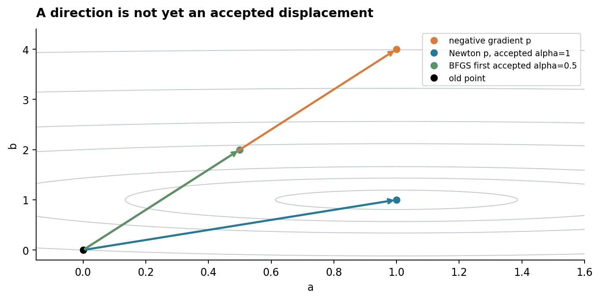
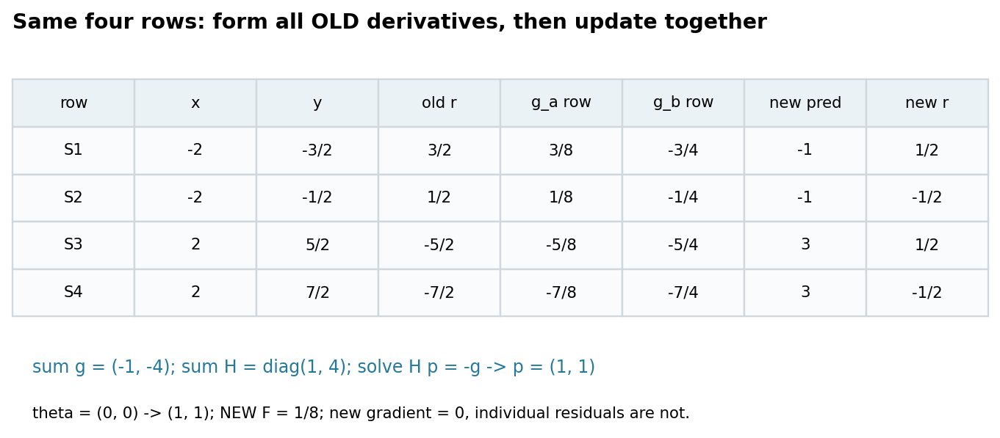
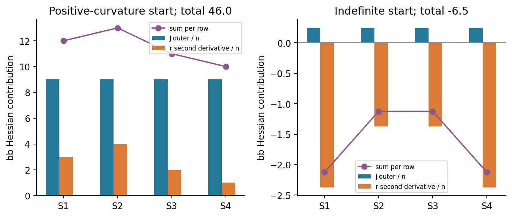
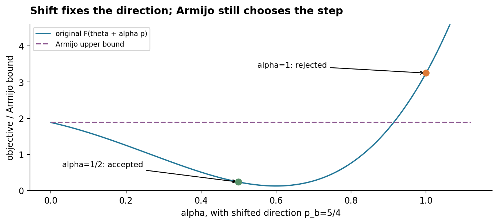
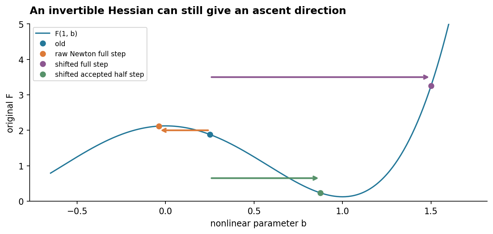
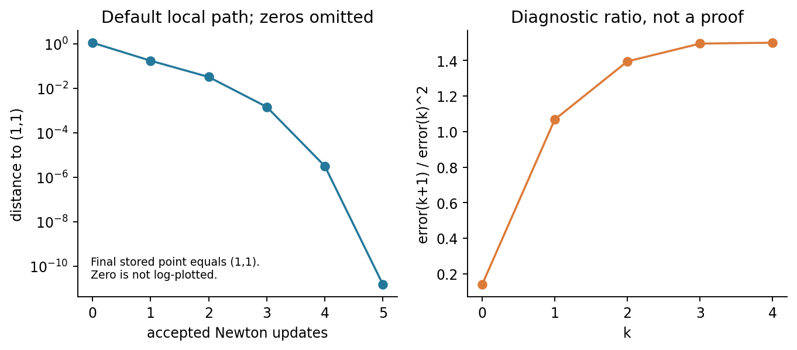
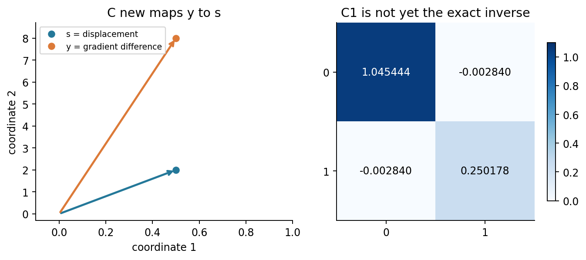
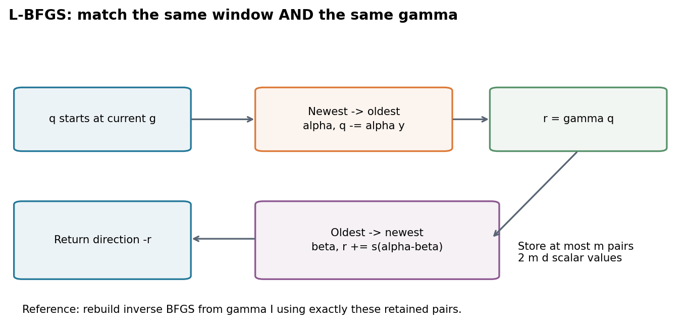
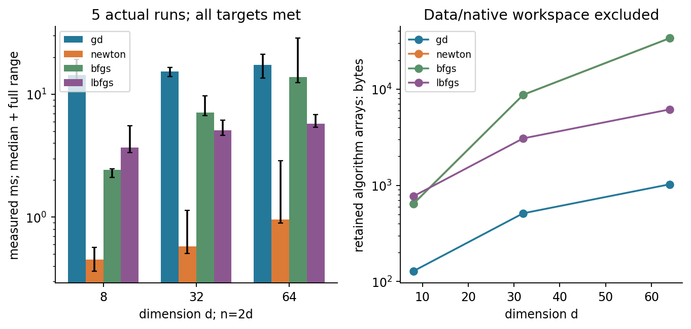
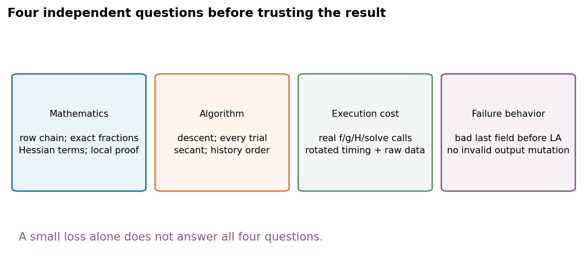

# 第038讲 Newton与拟Newton方法

## 1 曲率信息值得花多少钱

前几讲主要用梯度及其历史选择方向。现在的问题是：若已经知道各方向的曲率，能否直接选一条更合适的步子？Newton方法在每个旧参数处建立局部二次模型；拟Newton方法则用相邻梯度的变化逐步学习一个曲率近似。

直接先修为第011、015、032至033讲。本讲需要解线性方程、梯度、Hessian、Taylor近似、正定矩阵与下降条件。我们先从同一四行回归的线性模型出发，再明确把模型改为一个含平方参数的非线性版本；数据与残差定义不变。这样既能看见精确二次的一步性质，也能看见二次近似失效、Hessian不正定以及线搜索的必要性。

“迭代少”不是“花费少”。实验同时记录函数、梯度、Hessian与线搜索评估次数、实际墙钟时间、算法工作数组及测量限制。所有例子是小CPU合成任务，不宣称Newton在一般机器学习中更快。

## 2 从二次模型推导Newton方程

在旧点$\theta\in\mathbb R^d$，记$g=\nabla F(\theta)$、$H=\nabla^2F(\theta)$。二次模型是

$$q(p)=F(\theta)+g^\top p+\frac12p^\top Hp.$$

若$H$对称正定，则$q$严格凸。对$p$求导并置零，得到$g+Hp=0$，即$Hp=-g$。这是本讲的计算指令：解线性方程。写$p=-H^{-1}g$可以帮助理解代数，但程序不先显式形成逆矩阵。

为什么正定很重要？当$Hp=-g$且$p\ne0$，有$g^\top p=-p^\top Hp<0$，所以$p$是下降方向。这里只说明足够小的正步长可以下降，并不说明完整步$\theta+p$一定下降。若$H$不正定，线性方程即便可解，也不代表解是二次模型的最小点。

## 3 同一四行数据上的线性基准

继续使用$x=(-2,-2,2,2)$、$y=(-3/2,-1/2,5/2,7/2)$，先取预测$\hat y_i=a+bx_i$，残差$r_i=\hat y_i-y_i$，$F=\sum_i r_i^2/8$。每行平均梯度贡献是$(r_i/4,x_i r_i/4)$，Hessian贡献是

$$\frac14\begin{pmatrix}1&x_i\\x_i&x_i^2\end{pmatrix}.$$

四行求和得$F=1/8+(a-1)^2/2+2(b-1)^2$，$g=(a-1,4(b-1))^\top$，$H=\operatorname{diag}(1,4)$。在$(0,0)$，四行残差为$(3,1,-5,-7)/2$，$F_0=21/8$，$g=(-1,-4)$。解$Hp=-g$得到$p=(1,1)$，完整步到$(1,1)$；新预测为$(-1,-1,3,3)$，新残差$(1,-1,1,-1)/2$，新目标$1/8$。

这不是某种神奇的有限步普遍性质。此例的二次模型恰好就是原目标，因此其模型最小点等于原最小点。一般非线性目标只有局部近似，下一节便改变这一点。

## 4 只改模型 显露真正的局部曲率

数据完全相同，但现在明确使用$\hat y_i=a+b^2x_i$。这是一个新的参数化问题，不是继续把$b$当作原线性斜率。真实斜率变成$b^2$，$(a,b)=(1,1)$和$(1,-1)$给相同预测。

仍有单行损失$\ell_i=r_i^2/2$。局部导数依次为$\partial\ell_i/\partial r_i=r_i$，$\partial r_i/\partial\hat y_i=1$，$\partial\hat y_i/\partial a=1$，$\partial\hat y_i/\partial b=2bx_i$。平均梯度为四行$(r_i/4,2bx_i r_i/4)$之和。

对梯度再求导时不能漏掉预测的二阶导数：

$$H=\frac14\sum_i\left[\begin{pmatrix}1\\2bx_i\end{pmatrix}\begin{pmatrix}1&2bx_i\end{pmatrix}+r_i\begin{pmatrix}0&0\\0&2x_i\end{pmatrix}\right].$$

第一项总是半正定，第二项却由残差及$x_i$决定符号。仅保留第一项是另一种近似，本讲不把它冒充完整Newton。独立展开得到

$$F=\frac18+\frac12(a-1)^2+2(b^2-1)^2,\quad g=\begin{pmatrix}a-1\\8b(b^2-1)\end{pmatrix},\quad H=\begin{pmatrix}1&0\\0&24b^2-8\end{pmatrix}.$$

## 5 第一轮非线性Newton逐行计算

取$\theta_0=(0,3/2)$。预测$(-9,-9,9,9)/2$，残差$(-3,-4,2,1)$。单行损失分别$9/2,8,2,1/2$，平均为$15/4$。此时预测对$b$的导数$2bx$为$(-6,-6,6,6)$。

截距梯度分项$(-3,-4,2,1)/4$求和为$-1$；$b$梯度分项$(18,24,12,6)/4$求和为15。Hessian的aa项每行1/4，总和1；ab项相互抵消。bb项每行分别为$(36+12)/4,(36+16)/4,(36+8)/4,(36+4)/4$，求和46。

于是$H_0=\operatorname{diag}(1,46)$，解方程得到$p_0=(1,-15/46)$。完整步新参数$\theta_1=(1,27/23)$。重新前向：预测$(-929,-929,1987,1987)/529$，残差$(-271,-1329,1329,271)/1058$。单行平方再平均得到

$$F_1=\frac{919841}{2238728}\approx0.410876622797.$$ 

程序需要保留每行的残差、局部Jacobian、两部分Hessian贡献及求和；不能只打印一行总梯度。这里接受完整步的事实须用实际线搜索条件复核，不能根据结果看起来较小就跳过检查。

读图问题：图3中只画蓝色柱时，右侧会给出怎样错误的曲率判断？能否从每行橙色柱的符号追溯到残差和x？

## 6 第二轮必须重新计算Hessian

在$\theta_1$，新梯度为$g_1=(0,43200/12167)$，新Hessian为$\operatorname{diag}(1,13264/529)$。它已不是第一轮的diag(1,46)。解$H_1p_1=-g_1$得$p_1=(0,-2700/19067)$，故

$$\theta_2=\left(1,\frac{19683}{19067}\right).$$

新预测分别为$(-411290489,-411290489,1138391467,1138391467)/363550489$；残差为$(268070489,-459030489,459030489,-268070489)/727100978$。新目标为

$$F_2=\frac{141285388452139121}{1057351664417112968}.$$

详解与Notebook需要列出四行新损失及梯度贡献，完整闭合“旧前向→梯度和Hessian→解方向→同步更新→新前向”。这些大分数不要求心算，但要求明白分母从哪一步产生。Fraction核验有理链，真实算法则使用实际存储浮点操作；二者不可混为逐位相同的轨迹。

## 7 方向与步长分工 线搜索检查什么

令$p$是满足$g^\top p<0$的方向。Armijo充分下降条件为

$$F(\theta+\alpha p)\le F(\theta)+c_1\alpha g^\top p,\qquad0<c_1<1.$$

从$\alpha=1$试起，失败就乘$\rho\in(0,1)$。本讲默认$c_1=10^{-4}$、$\rho=1/2$，设置最大尝试次数和最小可分辨步。由于可微性给$F(\theta+\alpha p)=F(\theta)+\alpha g^\top p+o(\alpha)$，当$g^\top p<0$时，足够小的$\alpha$能满足条件。这一存在说明不等于有限浮点循环必然成功。

记录每次试点、目标、右侧界和接受/拒绝理由。若试点越域、数值非有限、步长缩到无法改变参数或次数耗尽，报告失败并保留旧状态，不把最后尝试当作成功。只在接受后同时更新参数。

读图问题：图4完整步虽已沿下降方向，为什么仍被拒绝？方向的局部结论与一次很长的有限位移有什么区别？

## 8 Hessian不正定时Newton可能向上走

仍用同一非线性模型，换初值$(1,1/4)$。此时$F=241/128$，$g=(0,-15/8)$，$H=\operatorname{diag}(1,-13/2)$。原Newton解$p=(0,-15/52)$，方向导数$g^\top p=225/416>0$，是上升方向。

完整步把$b$变为$-1/26$，新目标$242093/114244$，比旧目标更大。线性方程求解成功没有消除错误方向。更小正步在此点也首先向上，故不能指望只缩步长就自动救回任何不正定Newton方向。

在$(1,0)$，梯度恰为0但b曲率为−8，它是驻点而非局部最小点。停止报告必须写清“梯度驻点”并给曲率信息，不能只看到梯度小就宣布找到最小值。

## 9 正定修正与缩步是两件事

一种清楚的修正是选择$\lambda\ge0$，令$B=H+\lambda I$正定，再解$Bp=-g$。它改变局部模型的二次项，不是把原训练目标永久加上同名正则化。之后仍对原F做线搜索。

在上一例，取$\lambda=8$，则$B=\operatorname{diag}(9,3/2)$，修正方向$p=(0,5/4)$满足下降。完整步到$b=3/2$时$F=13/4$，仍不合格；半步到$b=7/8$时$F=481/2048$，满足默认Armijo。因此“修正方向”和“选择实际步长”缺一不可。

程序可按预声明的有限移位序列尝试Cholesky分解，直到正定且方向确实下降。失败不能偷偷改成未经说明的算法。实验保留原H、接受的λ、修正B、线性方程残差与最终α；这些量不能全叫作“阻尼系数”。

## 10 局部二次收敛需要哪些假设

设$\theta^*$为驻点，且在包含线段的邻域内$H(\theta)\succeq mI$，$m>0$，Hessian满足Lipschitz条件$\|H(u)-H(v)\|\le L_H\|u-v\|$。记$e=\theta-\theta^*$。梯度的积分表达是$g(\theta)=\int_0^1H(\theta^*+te)e\,dt$。

对完整Newton步，利用$H(\theta)p=-g(\theta)$，得到

$$e^+=H(\theta)^{-1}\int_0^1[H(\theta)-H(\theta^*+te)]e\,dt.$$

由逆算子范数≤1/m及Hessian Lipschitz条件，

$$\|e^+\|\le\frac{L_H}{2m}\|e\|^2.$$

还必须把初值选得足够近，使新点留在该邻域。这个推导针对未被移位且接受α=1的局部阶段；不能直接套到任意初值、非正定Hessian或始终固定半步的路径。回溯算法最终接受完整步，需要相应邻域和参数条件，本讲不由一张曲线推断一般全局结论。

## 11 Newton减量与线性方程残差

正定时定义$\nu^2=-g^\top p=p^\top Hp$。二次模型从$p=0$到最优p的预测下降是$\nu^2/2$。它对精确二次目标等于当前目标差；一般非二次时只是模型量，不能无条件当真实误差的严格上界。

实际计算还应记录$\|Hp+g\|$，并用$\|H\|\|p\|+\|g\|$作尺度化参照；分母全零时单独定义。小线性方程残差不等于小参数误差，病态线性系统的敏感性在第011讲已经出现。使用solve避免显式求逆，也不能消灭浮点病态。

局部阶段可记录$\|e_{k+1}\|/\|e_k\|^2$观察二次关系。e需已知真解，只能用于合成诊断；达到舍入极限后比值可能不稳定或无定义，要显示状态而非补画理想曲线。

读图问题：图6最后一个存储点恰等于(1,1)，为什么没有把它补画成极小正数？误差平方比的有限稳定值能替代上一节证明吗？

## 12 为什么拟Newton只看梯度差也有信息

Newton每步可能需要构造并分解一个$d\times d$矩阵。拟Newton不逐次计算完整Hessian，而用已经接受的位移$s_k=\theta_{k+1}-\theta_k$及梯度差$y_k=g_{k+1}-g_k$来约束近似矩阵。

若局部梯度变化近似线性，则$y_k\approx Hs_k$。因此希望新Hessian近似$B_{k+1}$满足割线方程$B_{k+1}s_k=y_k$。只有一个方向上的约束，不能唯一确定整个矩阵，还需对称性、保留已有信息和正定性等原则。

本讲用C表示逆Hessian近似，避免把真Hessian H与近似混名；对应割线方程是$C_{k+1}y_k=s_k$。$y_k$中的y是梯度差向量，和数据标签$y_i$处于不同索引语境，阅读代码时要明确区分。

## 13 BFGS更新及割线核验

给定正定对称C及$s^\top y>0$，令$\tau=1/(y^\top s)$。BFGS逆形式为

$$C^+=(I-\tau sy^\top)C(I-\tau ys^\top)+\tau ss^\top.$$

把右边乘y：$(I-\tau ys^\top)y=0$，而$\tau ss^\top y=s$，因此$C^+y=s$。两个转置因子也保证对称性。这是可直接检查的代数性质，不要求相信一个黑箱优化器。

用线性模型的小例子：θ₀=(0,0)，g₀=(−1,−4)，C₀=I，p₀=(1,4)。默认Armijo拒绝α=1而接受α=1/2，得到θ₁=(1/2,2)，g₁=(−1/2,4)。所以s=(1/2,2)，梯度差y=(1/2,8)，$y^\top s=65/4$。精确更新给

$$C_1=\frac1{4225}\begin{pmatrix}4417&-12\\-12&1057\end{pmatrix},\qquad C_1y=s.$$

这个C₁尚不是H⁻¹=diag(1,1/4)，但已吸收实际走过的方向信息。不能因为满足一次割线方程就声称恢复了全Hessian。

## 14 BFGS为什么能保持正定

令$A=I-\tau ys^\top$。对任意非零z，有

$$z^\top C^+z=(Az)^\top C(Az)+\tau(s^\top z)^2.$$

两项非负。若和为0，第二项迫使$s^\top z=0$；这又使Az=z，第一项便是$z^\top Cz>0$，矛盾。因此$C^+$正定。证明需要C正定且$\tau>0$，也就是$y^\top s>0$。

有限精度中，极小正曲率可能导致巨大τ，误差被放大。工程策略可在预声明尺度阈值下跳过更新，或使用明确推导的阻尼修改。本讲从零版本采用显式skip策略，记录为什么跳过；库的damp_update是另一约定，不能只改一个字符串还声称逐步等价。

## 15 Armijo不自动保证BFGS曲率

仅要求目标下降不够保证$y^\top s>0$。弱Wolfe曲率条件写成

$$g(\theta+\alpha p)^\top p\ge c_2 g(\theta)^\top p,\quad0<c_1<c_2<1.$$

右侧仍是负数，不能误加绝对值变成正数。于是$y^\top s=\alpha(g_{new}-g_{old})^\top p\ge\alpha(c_2-1)g_{old}^\top p>0$。强Wolfe另要求$|g_{new}^\top p|\le c_2|g_{old}^\top p|$，它蕴含所需弱条件。

从零Armijo+skip的教学BFGS与使用Wolfe搜索的库BFGS可有不同逐步轨迹，这不一定是错误。对照应分别检查各自明确接受的条件、最终驻点残差与失败状态，不要求两个未对齐线搜索的轨迹逐位相同。

## 16 L-BFGS用短历史计算乘积

完整C需要$d^2$个数。L-BFGS只保存最近m对(s,y)，每对长度d，并以简单基矩阵$C_{0,k}=\gamma_k I$开始，隐式应用这些更新。常见$\gamma_k=(s^\top y)/(y^\top y)$必须建立在正曲率、非零分母与有限数值上；无有效历史时用预声明的正标量。

对当前g，先令q=g。按历史从新到旧计算$\alpha_i=\tau_i s_i^\top q$、$q\leftarrow q-\alpha_i y_i$；再令$r=\gamma_kq$。按历史从旧到新计算$\beta_i=\tau_i y_i^\top r$、$r\leftarrow r+s_i(\alpha_i-\beta_i)$，返回方向−r。

这两个循环的顺序和符号都重要。保留窗口的最旧索引是max(0,k−m)，不是min。验算方法是在小维度从同一个γI显式重建同一窗口对应的C，再比较Cg与双循环返回量。改变窗口或γ后，不能拿全历史、不同初始化的BFGS矩阵当逐位参照。

## 17 理论存储、工作数组与实测内存

无结构稠密Newton通常需存H的$O(d^2)$数，并为分解付出$O(d^3)$工作；H的构造成本还取决于模型与样本量。完整BFGS更新和矩阵向量乘法通常为$O(d^2)$。L-BFGS保存m对向量，存储及双循环工作为$O(md)$；这没有计入原模型和数据本身。

实验分别报告算法状态数组的nbytes、临时数组的明确估算，以及单独测量运行中的内存观察。Python的tracemalloc主要跟踪Python分配，不能无条件当作全部原生BLAS工作空间或进程峰值。进程RSS还受解释器、库加载及分配器影响，也不能等同算法公式的字节数。

本教学BFGS为直观保留V C Vᵀ稠密乘法，并每次Cholesky检验正定；这些额外O(d³)操作都进入实测时间。它不是优化过的O(d²)秩二更新实现，不能把本次BFGS时长当成这类方法的最佳性能。不要用2维图里的几百字节差异外推出大模型结论。维度扩展实验使用另行标注的合成线性设计，统一目标、数据、初始化与停止标准；构建数据和计时预热是否计入必须写明。

## 18 如何进行诚实的墙钟比较

采用高分辨率单调计时器perf_counter，先预热，再多次重复并轮换方法顺序。记录所有原始时间、单位、重复数和汇总，不只挑最快的一次。计时与详细逐行trace分开运行，以免输出格式化淹没数值工作的差异。

同一停止阈值必须说明作用对象与尺度，例如梯度范数相对初值的阈值；并设统一最大工作限制。对于未达到阈值的方法，标明截断，不能将其较短用时记为成功速度。函数、梯度、Hessian、求解、线搜索各有成本；不把全部折成一个未定义的“迭代次数”。

二次回归的Hessian可预计算，研究者应分别报告一次性构造/分解与迭代开销，不暗中只对某方法提供缓存。在严格二次问题上直接最小二乘求解也是合理基准，本讲比较优化机制不代表排除了这种专用路线。实测时间受本机负载与BLAS影响，不要求跨进程字节相同。

实际维度实验另造满秩线性设计，不与四行主数据混同：d=8、32、64，n=2d，固定seed3817，H谱由1到20。共同目标是梯度二范数不超过初始值的10⁻⁶，预算2000更新。每法预热一次、五轮轮换顺序；本次60条计时记录全部达到目标，Newton均为一步，GD分别85、81、77步。后者为严格二次控制的结果，包含验证/正定检验/求解开销，不代表一般非线性任务的速度。全部原始纳秒值与范围保留在benchmark-result.json，重新运行允许改变。

读图问题：图9在d=8时，L-BFGS保留数组为什么反而比BFGS更多？哪种读数能回答原生BLAS工作空间大小？若没有测量，应怎样如实回答？

## 19 从推导到代码的完整验收

纸笔层独立核对两轮非线性前向、Jacobian和Hessian每行贡献，以及不正定上升、λ=8修正和半步接受。算法层检查每次$g^\top p$、方程残差、所有回溯试点、割线残差、对称性、正定性、跳过原因及有限内存窗口。

数值层用Fraction/高精度参照和独立方向差分，不把同一函数调用两次当独立核验。真实SciPy1.17.0对照明确区分minimize(method='BFGS')、BFGS更新策略类与L-BFGS-B；后者含边界处理，不等同任意自写无约束L-BFGS，即使本次没有设置边界。

工程层完整验证数据、配置、初始矩阵与历史，必须在任何回调/线性代数/输出前拒绝坏尾字段。首格校验默认输入字节，普通与−O、新进程和真实新内核的确定性报告一致；实际计时结果另存并明确不可逐字节复现。逐页PDF及每张真实图都检查，再交独立审阅。

## 20 自测题

1. 从二次模型推导Hp=−g，并证明正定时方向下降。
2. 为什么代码使用线性方程求解而不先求逆？什么误差问题仍未消失？
3. 完整手算线性四行模型的Newton一步与新前向。
4. 对平方参数模型推导逐行梯度及Hessian的两项分解。
5. 从(0,3/2)完整重算第一轮四行、梯度、Hessian、方向与新目标。
6. 完整重算第二轮，解释为何不能沿用第一轮Hessian。
7. 推导Armijo小步存在的理由，并列出浮点搜索可能失败的情况。
8. 在(1,1/4)验证原Newton是上升方向，并计算新目标。
9. 验证λ=8修正、完整步拒绝、半步接受，区别λ与α。
10. 解释驻点(1,0)为什么不是局部最小点。
11. 在列明邻域条件下推导局部二次误差界。
12. 推出Newton减量与二次模型预测下降，说明非二次限制。
13. 从梯度差解释割线方程，并计算正文C₁与C₁y。
14. 完整证明BFGS逆更新的对称性、割线条件和正定性。
15. 用Wolfe条件推出正曲率，并说明Armijo为何不够。
16. 手动展开一对与两对历史的L-BFGS双循环，核对循环顺序。
17. 比较完整BFGS、有限窗口重建和不同γ初始化，指出何时可比较。
18. 设计含预热、轮换、原始时间和失败标记的GD/Newton计时实验。
19. 分开理论数组存储、Python跟踪内存和进程内存；解释各自遗漏。
20. 列出全部算法与文件保护不变量，设计坏尾字段、坏历史与旧输出保护试验。

## 来源与核查范围

- [Boyd与Vandenberghe无约束优化讲义](https://web.stanford.edu/class/ee364a/lectures/unconstrained.pdf)：查核Newton方向、回溯、局部假设及求解实现，不复制图例或其全局常数结论。
- [CMU拟Newton课程讲义](https://www.stat.cmu.edu/~ryantibs/convexopt-F16/lectures/quasi-newton.pdf)：查核割线/BFGS与有限记忆思想；其中Wolfe符号及历史窗口下标不能照抄，本讲按独立代数与官方接口校正。
- [Nocedal官方L-BFGS页面](https://users.iems.northwestern.edu/~nocedal/lbfgs.html)：核对算法出处与原始文献入口；未下载或复用其代码。
- [SciPy1.17线搜索](https://docs.scipy.org/doc/scipy-1.17.0/reference/generated/scipy.optimize.line_search.html)、[BFGS求解器](https://docs.scipy.org/doc/scipy-1.17.0/reference/optimize.minimize-bfgs.html)、[BFGS策略类](https://docs.scipy.org/doc/scipy-1.17.0/reference/generated/scipy.optimize.BFGS.html)与[L-BFGS-B](https://docs.scipy.org/doc/scipy-1.17.0/reference/optimize.minimize-lbfgsb.html)：核对具体接口、停止条件与失败返回。
- [NumPy2.3 solve](https://numpy.org/doc/2.3/reference/generated/numpy.linalg.solve.html)：核对方程求解而非显式求逆。
- [Python3.12计时](https://docs.python.org/3.12/library/time.html)与[内存跟踪](https://docs.python.org/3.12/library/tracemalloc.html)：核对计时/内存测量各自含义。实际运行版本单独记录。
