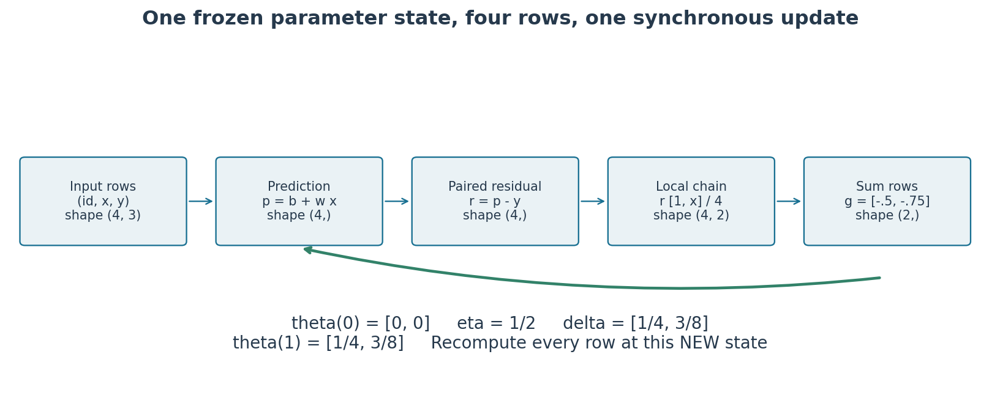
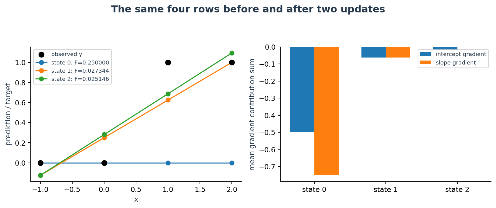
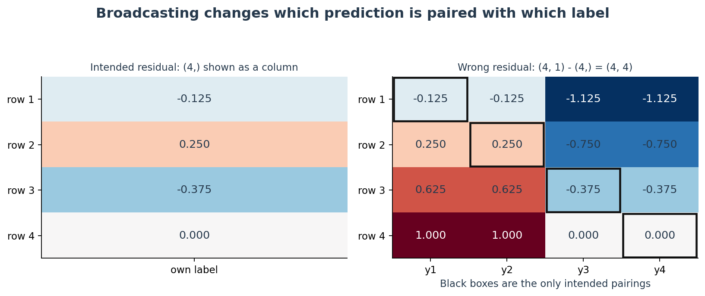
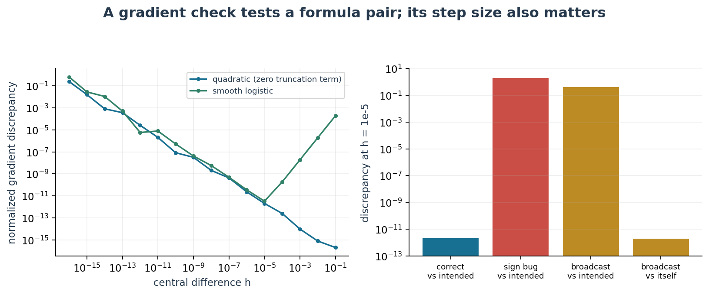
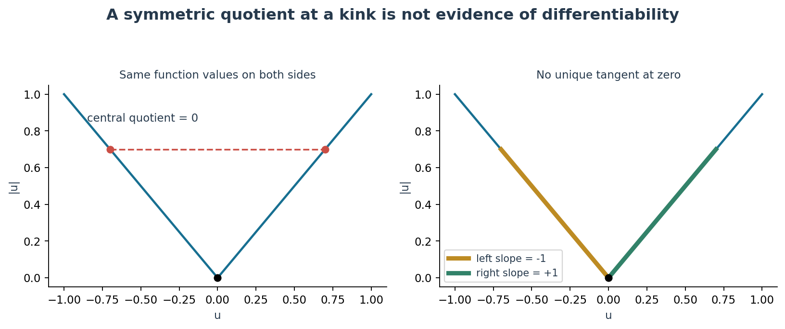
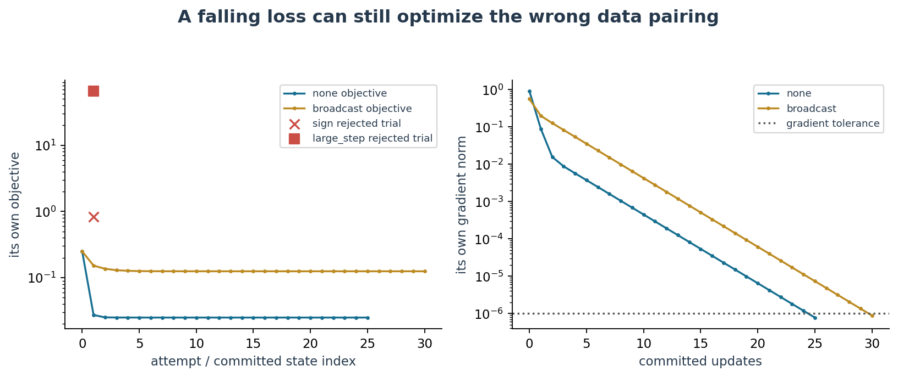
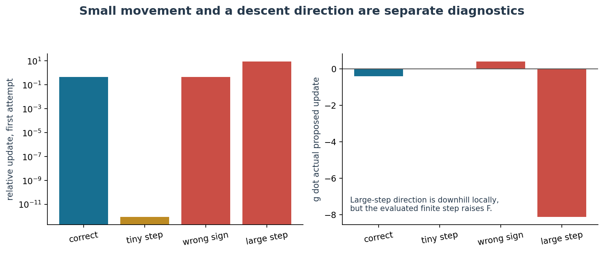
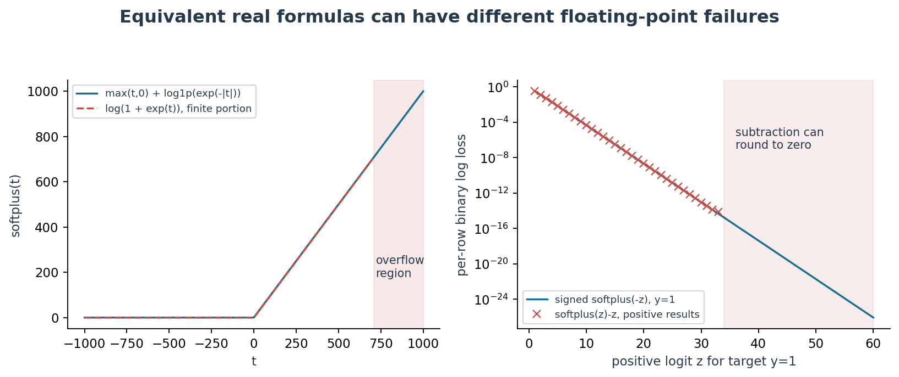

# 第039讲 优化实现与故障诊断

损失不下降时，先查清程序究竟在计算哪个函数，再判断导数、更新与浮点表示。本讲建立一份能复算、能证伪的诊断报告：同一份数据从逐行预测走到参数更新，再用已知错误检验诊断方法。调小学习率只解决其中一类问题。

先修为第005讲的数组形状，第014至015讲的偏导与链式法则，以及第032讲的多维梯度下降。不要求事先学过分类模型；后半讲会从一个二元标签的数值公式引出 sigmoid 和 softplus。第034至036讲的动量、Adam 状态故障只作为延伸问题，不是本讲实验的隐藏先修。

## 1 先把故障变成可检验的主张

“训练坏了”没有指出可以推翻哪一个解释。我们把一次失败拆成五层：输入是不是同一批行；前向是不是预定函数；导数是不是该函数的导数；更新有没有使用正确符号、尺度和同一旧状态；数值表示有没有把有限实数变成无穷或零。必须保存失败的第一步，而不是只留最终平均损失。

例如，梯度检查失败支持“公式与实现不一致”，却不能自动判断哪一个是对的。梯度检查通过也不能保证任务正确：一个错误的损失和它正确的导数完全可以相互吻合。我们故意保留这样的广播反例。

实验仅为四行原创合成数据，作用是解释机制与训练调试方法。它不是分类器性能比较，没有测试集成绩，也不提供泛化证据。

## 2 四行数据和一个明确的数学对象

每行是一件合成物品。$x_i$ 是无量纲的测量刻度，$y_i$ 是取值为 0 或 1 的目标标记。这里先用平方损失拟合这个数值标记。输出是实数，不必落在 0 与 1 之间；暂时不要把它叫作概率。

| 行号 $i$ | $x_i$ | $y_i$ | 局部预测导数 $[1,x_i]$ |
|---|---:|---:|---|
| 1 | −1 | 0 | $[1,-1]$ |
| 2 | 0 | 0 | $[1,0]$ |
| 3 | 1 | 1 | $[1,1]$ |
| 4 | 2 | 1 | $[1,2]$ |

参数按固定顺序记作 $\theta=(b,w)^\top\in\mathbb R^2$：$b$ 是截距，$w$ 是斜率。$n=4$ 是样本数，上标 $(k)$ 是更新完成后的状态编号，不是幂。定义

$$p_i=b+wx_i,\qquad r_i=p_i-y_i,\qquad \ell_i=\frac12r_i^2,\qquad F(\theta)=\frac1n\sum_{i=1}^{n}\ell_i.$$

$p,r,y$ 在程序中都必须是形状为 $(n,)$ 的一维数组。设计矩阵 $A$ 的第 $i$ 行是 $[1,x_i]$，所以 $A$ 的形状为 $(n,2)$，参数与梯度的形状都是 $(2,)$。CSV 的第一列只是行号，不可送入设计矩阵。所有量在这个教学例子中均无物理单位。

目标含有 $1/2$ 与 $1/n$ 两个因子：前者抵消平方求导产生的 2，后者让梯度成为逐样本梯度的平均。换成平方和或不带 $1/2$ 的均方误差，必须同步改变导数和学习率解释。

## 3 一行怎样贡献整个梯度

先固定一组旧参数，再处理全部样本。链式法则逐个接上：

$$\frac{\partial\ell_i}{\partial r_i}=r_i,\quad \frac{\partial r_i}{\partial p_i}=1,\quad \frac{\partial p_i}{\partial\theta}=\begin{pmatrix}1\\x_i\end{pmatrix}.$$

因此，第 $i$ 行对平均目标的梯度贡献与总梯度为

$$c_i=\frac{r_i}{n}\begin{pmatrix}1\\x_i\end{pmatrix},\qquad g=\nabla F(\theta)=\sum_i c_i=\frac1n A^\top(A\theta-y).$$

$c_i$ 的两个分量分别对应 $b,w$。不是每个样本都先更新一次；那将变成另一条优化路径。批量梯度下降必须等所有 $c_i$ 使用相同旧参数算完后，再同步更新两个坐标：

$$\Delta\theta=-\eta g,\qquad \theta^{(k+1)}=\theta^{(k)}+\Delta\theta.$$

## 4 第一轮的全部纸笔账本

初值为 $\theta^{(0)}=(0,0)$，学习率为 $\eta=1/2$。下表的 $r$ 列同时就是局部导数 $\partial\ell/\partial r$；$\partial r/\partial p$ 每行均为 1；$\partial p/\partial\theta$ 则由上一张数据表逐行给出。这样，每个乘法因子都可追溯。

| 行 | $p_i$ | $r_i$ | $\ell_i$ | $\ell_i/4$ | $c_{ib}$ | $c_{iw}$ |
|---|---:|---:|---:|---:|---:|---:|
| 1 | 0 | 0 | 0 | 0 | 0 | 0 |
| 2 | 0 | 0 | 0 | 0 | 0 | 0 |
| 3 | 0 | −1 | $1/2$ | $1/8$ | $-1/4$ | $-1/4$ |
| 4 | 0 | −1 | $1/2$ | $1/8$ | $-1/4$ | $-1/2$ |

汇总得到 $F_0=1/4$，$g_0=(-1/2,-3/4)$。先算更新量，再算新参数：

$$\Delta\theta_0=-\frac12\begin{pmatrix}-1/2\\-3/4\end{pmatrix}=\begin{pmatrix}1/4\\3/8\end{pmatrix},\qquad \theta^{(1)}=(1/4,3/8).$$

现在在同一四行上做真正的新前向。第 1 行预测为 $1/4+(3/8)(-1)=-1/8$，并非把上一张表的残差直接减去学习率。

| 行 | 新 $p_i$ | 新 $r_i$ | 新 $\ell_i$ | 新 $\ell_i/4$ | 新 $c_{ib}$ | 新 $c_{iw}$ |
|---|---:|---:|---:|---:|---:|---:|
| 1 | $-1/8$ | $-1/8$ | $1/128$ | $1/512$ | $-1/32$ | $1/32$ |
| 2 | $1/4$ | $1/4$ | $1/32$ | $1/128$ | $1/16$ | 0 |
| 3 | $5/8$ | $-3/8$ | $9/128$ | $9/512$ | $-3/32$ | $-3/32$ |
| 4 | 1 | 0 | 0 | 0 | 0 | 0 |

所以 $F_1=7/256=0.02734375$，新梯度 $g_1=(-1/16,-1/16)$。总损失下降，不要求每行误差都下降：第 1、2 行原本预测正确，更新后有了残差。这是共享参数对各行作折中的结果。

## 5 第二轮必须从新状态开始

上一节的新前向就是第二轮的旧前向。不能重新从零初值算第二轮，也不能在更新 $b$ 后用新 $b$ 计算 $w$ 的梯度。

$$\Delta\theta_1=-\frac12\begin{pmatrix}-1/16\\-1/16\end{pmatrix}=\begin{pmatrix}1/32\\1/32\end{pmatrix},\qquad \theta^{(2)}=(9/32,13/32).$$

再次逐行重算，注意第 4 行现在从零残差变为正残差。

| 行 | 新 $p_i$ | 新 $r_i$ | 新 $\ell_i$ | 新 $\ell_i/4$ | 新 $c_{ib}$ | 新 $c_{iw}$ |
|---|---:|---:|---:|---:|---:|---:|
| 1 | $-1/8$ | $-1/8$ | $1/128$ | $1/512$ | $-1/32$ | $1/32$ |
| 2 | $9/32$ | $9/32$ | $81/2048$ | $81/8192$ | $9/128$ | 0 |
| 3 | $11/16$ | $-5/16$ | $25/512$ | $25/2048$ | $-5/64$ | $-5/64$ |
| 4 | $35/32$ | $3/32$ | $9/2048$ | $9/8192$ | $3/128$ | $3/64$ |

汇总给出 $F_2=103/4096=0.025146484375$，$g_2=(-1/64,0)$。斜率梯度为零并不意味着斜率已经永远固定；下次改变截距也会改变斜率梯度。整个向量接近零才是这里的驻点证据。

独立核验用 Fraction 以精确有理数重算这三张表；Decimal 另以高精度核算多步路径；程序审计还用逐次四则运算的有理数舍入模拟核对实际 binary64 运算顺序。不能让“期望值”只是调用同一个待测函数再算一遍。

## 6 先看形状再看平均值

正确残差写成 `prediction - y`，且两边形状均为 `(4,)`。故障版却写成 `prediction[:, None] - y`。NumPy 从尾轴对齐，`(4,1)` 与 `(4,)` 组合为 `(4,4)`，不会报错 [1]。第 $i,j$ 个元素是预测 $p_i$ 减去另一个样本的标签 $y_j$。

如果程序还把这 16 个半平方取平均，它优化的是

$$\widetilde F(\theta)=\frac1{2n^2}\sum_{i=1}^n\sum_{j=1}^n(p_i-y_j)^2,\qquad \nabla\widetilde F=\frac1n\sum_i(p_i-\bar y)\begin{pmatrix}1\\x_i\end{pmatrix}.$$

其中 $\bar y=(1/n)\sum_j y_j=1/2$。错误函数让每个预测去靠近全体标签均值，丢失了 $x_i$ 与 $y_i$ 的对应关系。它的最优点为 $(1/2,0)$，目标最小值为 $1/8$。原本的配对目标最优点却是 $(3/10,2/5)$，最小值 $1/40$。

广播版初始目标也等于 $1/4$，所以只比较初始损失查不出来。初始梯度变为 $(-1/2,-1/4)$，首步参数变为 $(1/4,1/8)$，其自身目标降到 $39/256$。一条光滑下降曲线可能属于错误任务。

## 7 有限差分到底在核验什么

不用待测导数公式，沿坐标方向 $e_j$ 轻推参数，分别计算两次标量目标：

$$d_j(h)=\frac{F(\theta+he_j)-F(\theta-he_j)}{2h}.$$

$e_j$ 是第 $j$ 位为 1、其余位为 0 的向量；$h>0$ 是参数扰动，不是训练学习率。每个坐标要两次前向，两个参数共四次。程序为保持完整账本，在每次前向中也计算梯度，因此本实现比只求函数值的检查更贵。

在扰动区间内，若 $F$ 关于该坐标足够光滑，Taylor 展开中奇偶项相消。保留三阶项可得

$$d_j(h)=\partial_jF(\theta)+\frac{h^2}{6}\partial_j^3F(\theta)+O(h^4).$$

这里写出 $O(h^4)$ 余项需相应的五阶光滑性；只要求有界三阶导数，能保证的核心是截断误差 $O(h^2)$。本讲平方目标沿任一坐标都是二次多项式，三阶导数恰为零，因此不能用它展示“误差随 $h^2$ 下降”的一般现象。我们用同一数据上的光滑 logit 目标补上这项观察。

程序采用一个防止近零分母的比较尺度：

$$E=\frac{\|g-d(h)\|_2}{\max(1,\|g\|_2,\|d(h)\|_2)}.$$

欧氏范数 $\|v\|_2$ 是分量平方和的平方根。这里的 1 只是无量纲教学问题的尺度约定；真实带单位或跨度极大的参数还应逐坐标报告绝对误差、相对误差与参数尺度，不能机械沿用阈值。

## 8 为什么不能把差分步长设得越小越好

浮点函数值带有舍入误差。两次近似值相减，再除以 $2h$，会把误差放大。粗略的平衡模型是

$$\text{误差}\ \lesssim C h^2 + D\frac{\epsilon}{h},$$

其中 $C$ 受三阶导数影响，$D$ 与目标值尺度、计算路径和舍入有关，$\epsilon$ 是机器精度量级。平衡两项得到 $h$ 常在 $\epsilon^{1/3}$ 乘以合适参数尺度的量级；它不是普适最优公式。若 $F$ 含大常数、噪声或强烈尺度差异，最佳区间会变化。

本实验在固定点 $(0.2,-0.3)$ 扫描 $10^{-1}$ 到 $10^{-16}$。同一目标、同一数据、同一参数点在每次正负扰动中保持不变。真实随机模型要冻结采样、dropout、增强与状态，否则差分混入的是随机变化而不是坐标导数。执行过程也检查扰动后参数是否真的改变，并记录实际两侧位移；若 $\theta_j+h=\theta_j$，结果应标为无法分辨。

在 $h=10^{-5}$ 时，正确平方梯度的归一化差异约为 $2.09\times10^{-12}$；符号反转约为 2；广播梯度相对原配对目标约为 0.421，却相对它自己的错误目标约为 $1.93\times10^{-12}$。完整未截短结果在生成的报告中。SciPy 1.17.0 的 `check_grad` 使用前向差分，不是这里的中央差分，返回差向量的二范数 [2]；比较库结果时不能假定两种默认误差一样。

## 9 非光滑边界不能误判

对 $f(u)=|u|$，在 $u=0$ 的中央差分永远为零，因为左右函数值相等。但左导数为 −1，右导数为 1，普通导数不存在。返回零不等于证明了正确梯度。

含绝对值、ReLU、最大值或投影的模型，应先标出分支边界。验证光滑区域时，选择不跨边界的点和扰动区间；验证边界行为时，分别检查单侧变化、子梯度条件或算法定义。也不要仅因为一次跨分支差分与所选子梯度不相等，就宣布实现错误。自动微分通常给出某个约定的分支值，有限差分不会自动替你理解约定。

## 10 符号错和学习率过大留下不同证据

正确梯度下降有 $g^\top\Delta\theta=-\eta\|g\|_2^2\le0$。这是局部方向信息，不是任意大步都下降的保证。符号故障使用 $-g$ 作为传给更新器的梯度，于是实际更新变成 $+\eta g$。

| 同一初始状态的试验 | 实际候选参数 | $g^\top\Delta\theta$ | 候选配对损失 |
|---|---|---:|---:|
| 正确，$\eta=1/2$ | $(1/4,3/8)$ | $-13/32$ | $7/256$ |
| 梯度符号反转 | $(-1/4,-3/8)$ | $13/32$ | $215/256$ |
| 正确梯度，$\eta=10$ | $(5,15/2)$ | $-65/8$ | $1049/16$ |

后两者都比初始 $F_0=1/4$ 高，但理由不同：符号故障在局部已经朝上；大步试验的方向朝下，却跨过了低处。只有后者有“先降低步长”的直接依据。

本平方目标的 Hessian 为 $H=A^\top A/4=\left(\begin{smallmatrix}1&1/2\\1/2&3/2\end{smallmatrix}\right)$，最大特征值为 $(5+\sqrt5)/4\approx1.809$。第032讲的二次目标结论给出固定步长稳定范围 $0<\eta<2/\lambda_{\max}(H)$，因此 $1/2$ 安全而 10 远超范围。这个结论依赖本目标是固定正定二次函数，不可无条件推广。

## 11 停止和诊断必须分开报告

每步区分公式提出的更新与新旧浮点参数的实际差值；后者可能因舍入变为零。至少保存目标、梯度范数、参数范数、实际更新范数、相对更新、目标变化、候选是否被接受，以及第一处非有限量。本实验定义

$$s_k=\frac{\|\Delta\theta_k\|_2}{\max(1,\|\theta^{(k)}\|_2)},\qquad q_k=\frac{|F_{k+1}-F_k|}{\max(1,|F_k|)}.$$

默认梯度阈值为 $10^{-6}$，相对更新阈值为 $10^{-12}$，相对损失变化阈值为 $10^{-14}$。先判梯度小，再判停滞：若只有 $s_k$ 或 $q_k$ 小而梯度仍大，就报告 `stagnation_gradient_large`。最大步数耗尽则报告 `budget_exhausted`，它不是收敛结论。

正确路径在 25 次提交更新后达到梯度阈值，终点约为 $(0.29999905,0.40000059)$，损失约为 0.025。广播路径在 30 次提交更新后也满足自己的梯度阈值，却到达约 $(0.49999891,0.00000067)$。报告另用原配对目标重新评价每个最终状态，避免把目标名字省略。

把学习率改为 $10^{-12}$，初次更新约为 $(5\times10^{-13},7.5\times10^{-13})$；梯度范数仍约为 0.901。移动很小只是因为步长很小。本讲将它标为停滞，不称为训练成功。对于一般非凸函数，即使梯度真的很小，也可能是鞍点、平台或局部极小，不能宣布全局最优。这里能进一步判断最优，是因为已经知道二次目标正定。

## 12 浮点数不是无限精度的实数

binary64 浮点数有有限指数范围和有限有效位。NumPy 2.3.5 实测 `finfo(float64).eps` 约为 $2.22\times10^{-16}$，最大有限值约为 $1.80\times10^{308}$；最小正规正数约为 $2.23\times10^{-308}$，更小的次正规数一直延伸到约 $4.94\times10^{-324}$ [3]。

上溢是结果过大，常见结果为无穷；下溢是结果过小，可能损失相对精度或舍入为零；灾难性消减则是相近大数相减时，小差值的有效信息消失。它们不是一回事，也不是所有下溢都同样危险。

`exp(1000)` 超出 float64 范围，而 `exp(-1000)` 会舍入为零。直接对后者取对数产生负无穷；但若它只是一个加到 1 上的极微小尾项，丢失它对最后结果可能无可见影响。必须问“这个零下一步会进入哪里”，不能看到 underflow 就一律放任或一律终止。

本讲把原始输入极端尺度与合法内部结果分开处理。原始 CSV/JSON 中绝对值非零且小于 $10^{-150}$ 的数被明确拒绝，防止 `1e-999` 先变成零再通过校验；稳定公式内部出现小尾项下溢则被记录，允许它按二进制表示的能力舍入。这个输入范围是教学软件契约，不是数学定义域。

## 13 用同一四行引入一个 logit 目标

数值压力试验继续使用相同 $x,y$ 和相同仿射式，但现在把 $z_i=b+wx_i$ 称为 logit，并明确换成二元对数损失。它不接续前面的平方损失训练路径，也不把两种目标的损失值混在一条曲线中。

sigmoid 把实数映射到 $(0,1)$：$\sigma(z)=1/(1+e^{-z})$。对 $y\in\{0,1\}$，二元损失在实数算术下是

$$\ell(z,y)=-y\log\sigma(z)-(1-y)\log(1-\sigma(z))=\log(1+e^z)-yz.$$

当 $y=1$ 时，希望 $z$ 大；当 $y=0$ 时，希望 $z$ 小。设 $t=(1-2y)z$，上述两个情况可以统一写成

$$\ell(z,y)=\operatorname{softplus}(t),\qquad \operatorname{softplus}(t)=\log(1+e^t).$$

这个“带符号的 logit”改写依赖标签严格为 0 或 1；它不能直接代替软标签、类别权重或 `pos_weight` 的公式。本讲输入守卫因此要求二元标签。新的平均目标记为 $G(\theta)=(1/n)\sum_i\ell(z_i,y_i)$，其局部导数和参数梯度为

$$\frac{\partial\ell}{\partial z}=(1-2y)\sigma(t),\qquad \nabla G(\theta)=\frac1n\sum_i(1-2y_i)\sigma(t_i)\begin{pmatrix}1\\x_i\end{pmatrix}.$$

在精确算术中局部导数也等于 $\sigma(z)-y$；在大正 $z$、$y=1$ 时，后者可能先把 sigmoid 舍入为 1 再相减，失去微小负导数。带符号形式能保留仍可表示的尾部。

## 14 稳定 softplus 需要避免上溢和相消

当 $t\ge0$ 时，从 $1+e^t$ 提出 $e^t$；当 $t<0$ 时直接保留指数。合在一起得到

$$\operatorname{softplus}(t)=\max(t,0)+\log\bigl(1+e^{-|t|}\bigr).$$

程序最后一项调用 `log1p(u)`，它专门计算 $\log(1+u)$，避免先算 `1+u` 时把小 $u$ 丢掉。指数参数永远非正，因此不会在 `exp` 处上溢。sigmoid 也分段计算：正半轴用 $1/(1+e^{-t})$，负半轴用 $e^t/(1+e^t)$，两段都不求巨大指数。

还要警惕一个看似已修复的版本：先用稳定 softplus 算 $\operatorname{softplus}(z)$，再减去 $yz$。当 $z=40,y=1$ 时，softplus 接近 $40+4.25\times10^{-18}$；float64 可能只存成 40，再减 40 得到零。改用 $\operatorname{softplus}(-40)$ 才能保留约 $4.2483543\times10^{-18}$ 的正损失。

压力参数为 $(0,40)$、$(0,1000)$ 与 $(0,-1000)$，数据行完全不变。最后一组给出 logits $[1000,0,-1000,-2000]$，都是有限输入。稳定每行损失约为 $[1000,\log2,1000,2000]$，平均约为 1000.1732868；朴素概率取对数会出现无穷。它不是“坏模型所以数学损失应无穷”，而是有限 logit 的不稳定实现。

对于 $(0,1000)$，除第二行外的正损失小到不可用 float64 表示，稳定实现返回零并记录尾项下溢。Decimal 的高精度计算确认这些实数损失仍为正。这与 $z=40$ 时明明可表示却被相消丢失的尾项不同。

## 15 从 softplus 推广到 log sum exp

对有限实数向量 $a=(a_1,\ldots,a_m)$，定义 $L=\log\sum_j e^{a_j}$，令 $M=\max_j a_j$。提出公因子 $e^M$ 得到

$$L=M+\log\sum_{j=1}^m e^{a_j-M}.$$

每个指数不大于 1，至少一项恰等于 1；所以移位后的和不会因为所有项都极小而变成零。softplus 是 $a=[0,t]$ 的特例。对于 $[1000,1001,999]$，结果约为 1001.407606；直接指数会溢出。对于 $[-1000,-1001,-999]$，移位后同样安全，结果约为 −998.592394。

移位主要解决指数范围问题，并不保证所有微小修正都达到最佳相对精度：直接先求 `1+tiny` 仍可能丢掉尾项，专门的 `log1p` 形式更合适。SciPy 1.17.0 的 `logsumexp` 有实际库核验，而 NumPy 2.3.5 的 `logaddexp(0,t)` 与 SciPy 的 `-log_expit(-t)` 作为 softplus 的独立参照 [4–6]。一般 log-sum-exp 的数值解释也可参阅 Higham 的作者材料 [7]。

轴是数学的一部分。形状 `(n,2)` 的矩阵若每行放 `[0,t_i]`，逐样本损失应沿 `axis=1` 归约，结果为 `(n,)`；`keepdims=True` 保留为 `(n,1)`。默认 `axis=None` 会把所有样本一起归约成一个数，这不是逐样本损失再平均。有限实数假设很重要：全为负无穷时要另外定义行为，带负权重的有符号和也不属于这里的简单推导。

## 16 一份可以解释的故障报告

报告首先写明数据摘要、目标、参数顺序、dtype 与软件版本，然后列证据、解释、修复和复测。不要只写“改成 float64 后好了”，也不要用 `nanmean` 让已经出现 NaN 的行从平均值中消失。

本单元运行后得到五条具体判断。符号故障同时出现差分不匹配、正方向导数和升高的候选损失；修复反向传播符号，再复测原梯度与两轮纸笔账本。广播故障有 $(4,4)$ 残差及错误驻点；修复行配对，再比较逐行贡献，而非只复测自身差分。数值稳定性故障在同一 logits 上产生非有限值；修复公式表示，再核对有限极端输入与可表示小尾项。极小学习率造成梯度仍大但移动很小；不能更换停止标签掩盖它。过大学习率则在正确局部下降方向上增加有限步损失；梯度确认后再改步长。

默认实现遇到显著损失上升会拒绝候选并停止，保留失败候选与最后一次已提交状态。这是用于教学的故障隔离策略，不是线搜索算法，也不保证接受的每一步都接近最优。小于设定舍入容差的上升可能被接受，报告仍保留原始差值。

## 17 计成本时失败不能消失

成本账本逐次记录 `objective_calls`、实际预测行数、局部损失元素数、梯度例程调用、尝试更新及提交更新。初始前向也计费。符号故障首步被拒绝，所以提交次数为零，但已经做了两次前向、8 行预测与8个局部损失计算。把成本写成“提交更新数乘以样本数”会错误地记成零。

广播路径每次仍只产生4个预测，却产生16个损失元素；30次提交加初始前向一共31次调用、124行预测、496个损失元素。正确路径25次提交加初始前向共26次调用、104行预测、104个损失元素。两者做的事不同，不能直接用“更新次数差5次”声称哪个更快。

这里不把调用数冒充墙钟时间或 FLOPs。差分检查、数值压力试验和最终按正确目标重评也有各自账本，不能只报训练循环成本。故意注入“计算完成后才报错”的测试确认已发生计算仍保留计数。

## 18 把输入契约放到任何计算之前

如果最后一个配置字段坏了，程序不能先运行前几个实验再报错。CSV 要核对表头、每行字段数、行号、原始数值与有限性；JSON 要拒绝重复键、NaN、Infinity 和在转换时悄悄下溢的数字；随后一次性校验全部配置、形状、取值域和回调类型。用显式异常作守卫，不能用会在 `python -O` 下消失的 `assert`。

Notebook 的第一格在导入数值和绘图库、显示任何结果之前，检查 CSV、配置和执行模块的完整字节摘要，再运行语义校验。修改输入之后继续展示旧表格会造成证据混杂，因此默认 Notebook 会拒绝篡改版本。自定义试验用脚本显式指定输入并另存报告；不能为了让第一格通过就随意更改摘要。

用户初值限制与内部状态限制也不同：初始参数范围是本实验入口约定。合法更新可能暂时离开这一范围；内部只应检查其真实形状、有限性和安全计算范围，不可把“超出初值框”误报成算法不合法。本实现还拒绝覆盖源码或输入，并用完整严格 JSON 的原子替换保存报告；写入失败不应抹掉旧证据。

## 19 走向独立科研的调试顺序

先缩小到可手算的样本和参数，固定数据顺序、采样与运行环境。写清预定标量目标，检查每一轴的含义和归约因子；做逐样本前向与导数对照；在多个非特殊点扫描差分步长；再观察实际更新方向和尺度；最后扩展到极端输入与长路径。只在这几层一致后讨论学习率、模型能力或优化器选择。

单个点的梯度检查会有偶然盲区，例如某一分量恰为零。因此后续研究应选多个点、方向与尺度，保存最小失败例子，并记录使用哪一种独立参照。如果学过第034至036讲，可把回调状态、梯度累积清零、动量缓冲区、Adam 的时间索引与偏差修正加入相同账本；先确认更新约定，再与固定版本的库对齐。

本讲的程序只验证已声明的有限输入、二元标签与两个参数；没有证明任意模型都正确，也没有测试浏览器中的 Jupyter 界面或实际安装 Anaconda。实验在新的 Python 进程和真实 InProcessKernel 中顺序执行，证据与限制见 README、独立实验指南及 verification.json。

## 20 练习

1. 不看新前向表，重算两轮全部逐行贡献，并指出第二轮哪个梯度分量为零。
2. 若把目标改为 $\sum_i r_i^2$，梯度和保持相同更新的学习率分别变化多少？
3. 推导广播目标的梯度和最优点，解释为什么初始损失无法区分两种目标。
4. 用 $h=10^{-5}$ 的报告同时判断正确、符号反转、广播对自身和广播对原目标四种检查。
5. 从 Taylor 展开推导中央差分误差阶，解释平方目标的特殊之处。
6. 对 $|u|$ 在零点算中央、左侧、右侧差分。若在 $u=10^{-6}$ 用 $h=10^{-4}$，会发生什么？
7. 解释 `softplus(40)-40` 与 `softplus(-40)` 的浮点差异。
8. 用同一四行和 $(0,-1000)$ 算每行稳定对数损失与总梯度。
9. 计算 $[1000,1001,999]$ 的移位 log-sum-exp，并说明轴选择。
10. 设计能区分学习率极小、符号错误、步长过大、广播错误的最少诊断量。
11. 重算符号故障和广播路径的成本，说明失败试探为什么必须计数。
12. 给出原始输入最后字段坏掉、JSON 重复键、Notebook 被篡改三类测试及合理通过条件。
13. 在不是零梯度的点检查方向导数，说明它比逐坐标检查省什么，又可能漏什么。
14. 解释“梯度小”“步长小”“预算耗尽”分别允许作出什么结论。
15. 写一份不超过一页的广播故障报告，包含可复算证据与修复后回归检查。
16. 选做：学完第035至036讲后，说明断点恢复时只载入参数、丢失优化器状态会怎样改变可复现性。

## 一手来源

[1] [NumPy 2.3 官方文档 Broadcasting](https://numpy.org/doc/2.3/user/basics.broadcasting.html)。尾轴对齐、形状扩展与外运算。

[2] [SciPy 1.17.0 官方文档 check_grad](https://docs.scipy.org/doc/scipy-1.17.0/reference/generated/scipy.optimize.check_grad.html)。前向差分、epsilon 与返回范数。

[3] [NumPy 2.3 官方文档 finfo](https://numpy.org/doc/2.3/reference/generated/numpy.finfo.html)。eps、正规数、次正规数和表示范围。

[4] [NumPy 2.3 官方文档 logaddexp](https://numpy.org/doc/2.3/reference/generated/numpy.logaddexp.html)。对数域中两个指数项求和。

[5] [SciPy 1.17.0 官方文档 logsumexp](https://docs.scipy.org/doc/scipy-1.17.0/reference/generated/scipy.special.logsumexp.html)。axis、keepdims 及有限范围稳定计算。

[6] [SciPy 1.17.0 官方文档 log_expit](https://docs.scipy.org/doc/scipy-1.17.0/reference/generated/scipy.special.log_expit.html)。避免先算 sigmoid 再取对数的精度损失。

[7] [Nicholas J. Higham, What Is the Log-Sum-Exp Function, 2021](https://nhigham.com/2021/01/05/what-is-the-log-sum-exp-function/)。作者的数值分析解释。

以上来源于 2026-10-04 实际检查。推导、数据、图和故障报告均为本单元独立编写；源码只链接官方材料，不附第三方全文。
