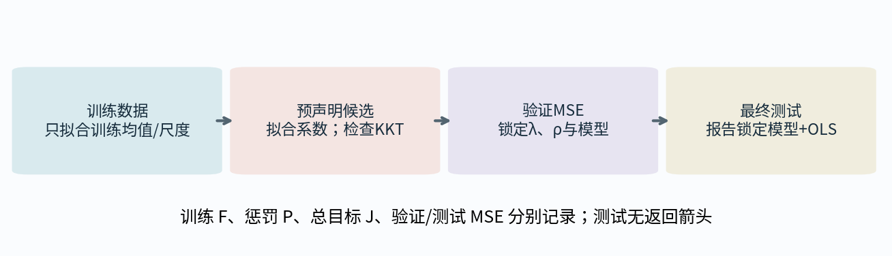
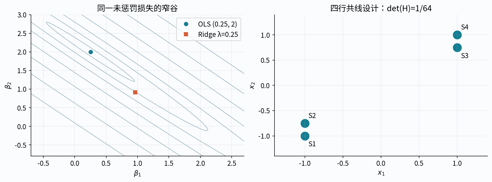
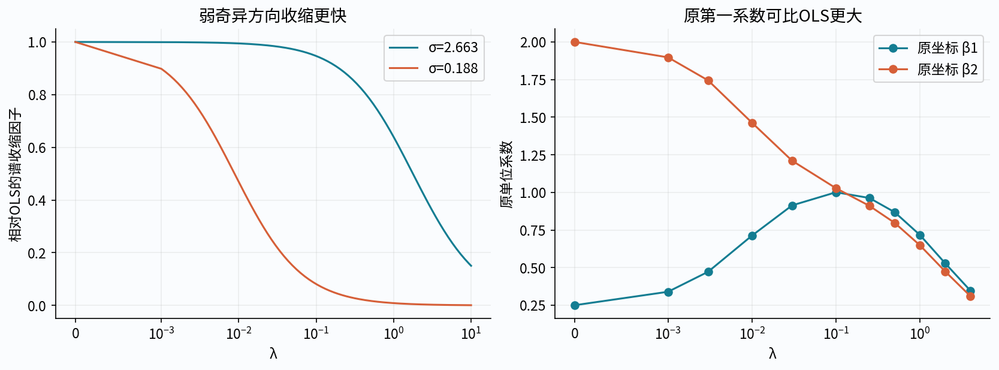
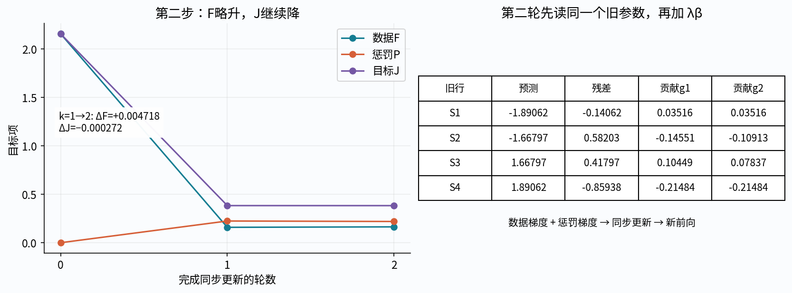
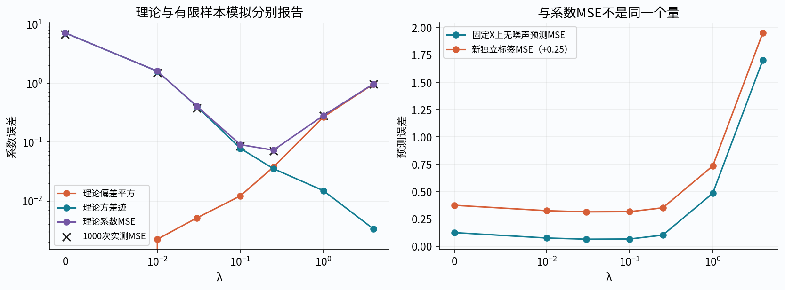
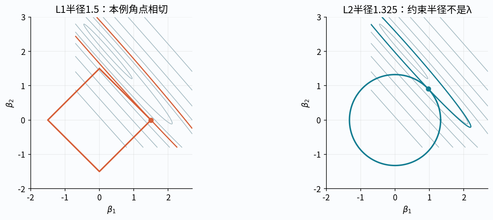
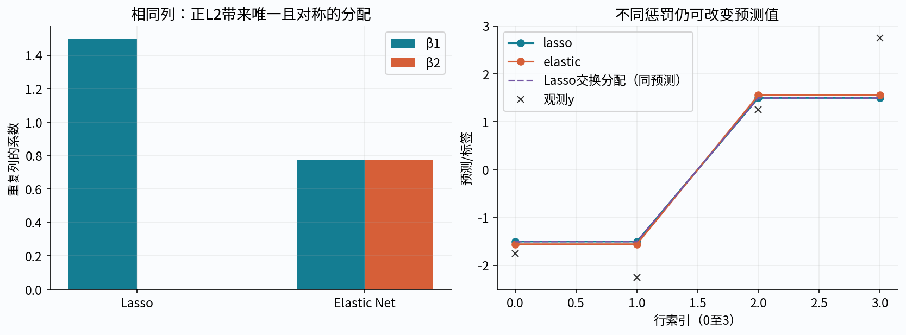
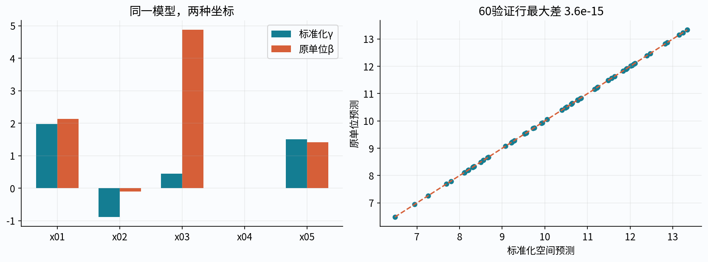
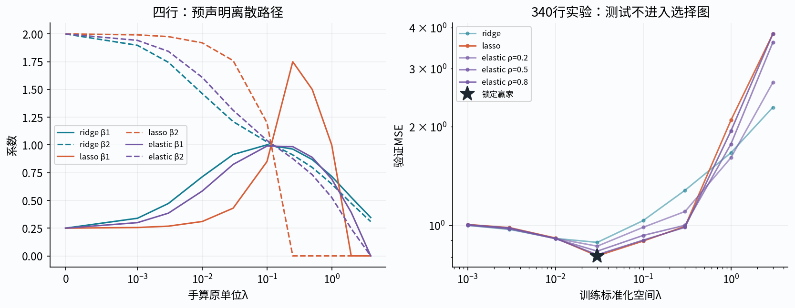

# 第040讲 正则化与收缩估计

## 1 为什么主动接受一点偏差

第027讲认识了偏差方差，第029讲看到共线性会让系数对微小扰动极敏感。现在的问题不是怎样把训练残差再压低一点，而是：能否限制对数据噪声的过度响应，使新数据上的预测更稳定？正则化通过改变估计目标来表达这种取舍。

直接先修为024、027、029。第037讲的近端和坐标下降可作为L1从零求解的延伸；本讲先核验成熟求解器，并自行推导目标、条件、手算和诊断，不把调用库当作原理。

本讲会明确分开：训练目标、预测误差、系数误差、稀疏性与数值稳定性。它们相关但不同。正则化不能保证每一个真实任务都变好，非零或零系数也不是因果结论。

## 2 先把目标与归一化固定

设X为n×d训练设计，y为长度n标签，β为d维系数。先假定数据已用训练统计量中心化，无单独截距。残差r=Xβ−y，数据损失为F(β)=‖r‖²/(2n)。定义

$$J_R(\beta)=F(\beta)+\frac{\lambda}{2}\|\beta\|_2^2,$$

$$J_L(\beta)=F(\beta)+\lambda\|\beta\|_1,$$

$$J_E(\beta)=F(\beta)+\lambda\rho\|\beta\|_1+\frac{\lambda(1-\rho)}2\|\beta\|_2^2.$$

其中λ≥0，ρ在[0,1]，ρ是Elastic Net的L1比例，不是相关系数。三个目标不能只用相同数值λ就称为“相同惩罚强度”：范数与混合比例不同。评价新样本通常用不含惩罚的MSE；不能把训练J与验证MSE混在同一列。

若含截距a，预测为a+Xβ，默认只惩罚β。对a求导得a=ȳ−μᵀβ，其中ȳ与μ都来自训练集。除非明确改变先验或目标，不要把常数列一起惩罚。

## 3 同一四行共线设计

使用原创教学数据，第二列是第037讲压力设计的明确延续。主手算不做额外标准化：

|行|x₁|x₂|y|
|---|---|---|---|
|S1|−1|−1|−7/4|
|S2|−1|−3/4|−9/4|
|S3|1|3/4|5/4|
|S4|1|1|11/4|

两列和与标签和均为0。逐项算得

$$H=\frac{X^\top X}{4}=\begin{pmatrix}1&7/8\\7/8&25/32\end{pmatrix},\quad c=\frac{X^\top y}{4}=\begin{pmatrix}2\\57/32\end{pmatrix}.$$

H行列式为1/64，正定但有明显弱曲率方向。最小二乘解β=(1/4,2)，残差来自设计列空间外的分量，最低F=1/8。这个固定四行例只演示估计机制；后面的训练/验证/测试实验另行标记，不把这四行伪装为有统计代表性的数据集。

## 4 Ridge闭式解与存在条件

数据梯度为Xᵀ(Xβ−y)/n=Hβ−c，惩罚梯度为λβ。所以

$$(H+\lambda I)\hat\beta_R=c.$$

当λ>0，任意非零v有vᵀ(H+λI)v=‖Xv‖²/n+λ‖v‖²>0，即使X不满列秩也唯一。λ=0时需分别讨论满秩与不满秩；不满秩时最小二乘系数不唯一，SVD给出的最小范数解只是明确约定。

在本例λ=1/4，H+λI=[[5/4,7/8],[7/8,33/32]]，行列式67/128。两元消元得到

$$\hat\beta_R=\left(\frac{129}{134},\frac{61}{67}\right).$$

代码应解线性系统或用SVD，不显式形成逆矩阵。一个独立等价实现是增广最小二乘：上方X/√n、下方√λI，标签上方y/√n、下方0。三条路线要对齐同一个目标再核验。

## 5 Ridge不是把每个原坐标都变小

令X=UΣVᵀ，奇异值为σⱼ。代入目标或把方程旋转到V基得到

$$\hat\beta_R=V\operatorname{diag}\left(\frac{\sigma_j}{\sigma_j^2+n\lambda}\right)U^\top y.$$

与满秩OLS相应谱方向相比，收缩因子为σⱼ²/(σⱼ²+nλ)，处于(0,1]；弱奇异方向收缩更多。这是在奇异向量坐标中的描述，不是原特征坐标逐项绝对值下降。

本例OLS第一系数1/4，Ridge第一系数129/134反而更大；第二系数由2变为61/67。系数向量重新组合了被收缩的谱方向。因此“每个系数都按同一比例乘小”是错的。Ridge一般不产生由一整段阈值导致的稀疏性，但某些对称或零相关数据仍可得到恰为0的系数，不能写成绝不会出现0。

## 6 用同一数据展开第一轮更新

闭式解方便核验，但不能省掉参数如何作用于每行的计算链。用λ=1/4、η=1/2、β⁰=(0,0)手算两轮Ridge梯度下降。局部链为：rᵢ=ŷᵢ−yᵢ，单行半平方对r的导数r，预测对β的导数xᵢ，平均贡献rᵢxᵢ/4。

旧预测全为0，残差为(7,9,−5,−11)/4。四行损失贡献为(49,81,25,121)/128，和F₀=69/32。梯度第一坐标分项为(−7,−9,−5,−11)/16；第二坐标分项为(−28,−27,−15,−44)/64。汇总g数据=(−2,−57/32)。旧参数为0所以惩罚梯度也是0。

同时更新得β¹=β⁰−ηg=(1,57/64)。重新前向如下：

|行|新预测|新残差|新损失贡献r²/8|
|---|---|---|---|
|S1|−121/64|−9/64|81/32768|
|S2|−427/256|149/256|22201/524288|
|S3|427/256|107/256|11449/524288|
|S4|121/64|−55/64|3025/32768|

新数据损失41673/262144；惩罚为7345/32768；总目标100433/262144。惩罚不是每个样本各加一次同样λβ²，否则会重复乘n。详解和Notebook逐行保留这三个量。

## 7 第二轮数据梯度与惩罚梯度分开

在β¹，每行数据梯度分项为

|行|对β₁的数据梯度贡献|对β₂的数据梯度贡献|
|---|---|---|
|S1|9/256|9/256|
|S2|−149/1024|−447/4096|
|S3|107/1024|321/4096|
|S4|−55/256|−55/256|

数据梯度和为(−113/512,−431/2048)，惩罚梯度λβ¹=(1/4,57/256)。相加得总梯度(15/512,25/2048)。同时更新

$$\beta^2=\left(\frac{1009}{1024},\frac{3623}{4096}\right).$$

新预测为(−30636,−27013,27013,30636)/16384；新残差为(−1964,9851,6533,−14420)/16384。重新平方汇总得F₂=175757993/1073741824，惩罚29415425/134217728，J₂=411081393/1073741824。

值得注意：第二轮数据损失比第一轮略高，但总正则目标略低。这不是实现必然错误，而是优化目标已经改变；必须把F、惩罚和J同时报告。这个例子不宣称固定η可适用于任意其他X或λ。

读图问题：若程序只画数据F，第二轮可能被误判成什么？若把λβ加到每行后再错误求和，梯度会多出哪个因子？

## 8 从固定设计推偏差与方差

设生成模型y=X$\beta^*$+ε，X固定，Eε=0，Cov(ε)=σ²I。这里星号表示真实生成系数，不是从数据算出的估计。记Aλ=(H+λI)⁻¹，Ridge为AλXᵀy/n。于是

$$E\hat\beta_R=A_\lambda H\beta^*,\qquad \operatorname{Bias}= -\lambda A_\lambda\beta^*,$$

$$\operatorname{Cov}(\hat\beta_R)=\frac{\sigma^2}{n}A_\lambda H A_\lambda.$$

第二式由Cov(Xᵀε/n)=σ²XᵀX/n²=σ²H/n得到。没有默认把噪声方差当成1，也没有忽略平均损失中的n。

在H特征方向特征值dⱼ>0时，偏差分量是−λ${\beta^*}_j$/(dⱼ+λ)，方差是σ²dⱼ/[n(dⱼ+λ)²]。λ增加会压低该方差，但引入偏差。系数均方误差为偏差平方和加协方差迹；它是否比OLS更小还取决于 $\beta^*$、σ²和λ，不能仅凭“存在收缩”推出改善。

## 9 预测误差不是系数误差

对新特征x₀，预测均值为x₀ᵀβ估计。若新标签有独立同方差噪声，条件预测MSE分解为

$$\sigma^2+[x_0^\top\operatorname{Bias}]^2+x_0^\top\operatorname{Cov}(\hat\beta)x_0.$$

第一项是新观察噪声；后两项来自估计。若只比较无噪声条件均值 $x_0^\top\beta^*$ ，就不应再加σ²。对很多测试行平均则用各自x₀权重，不能直接拿系数MSE代替预测MSE。

固定设计Monte Carlo可用预声明λ和独立噪声重复核验这些公式。重复数据的样本均值/方差会围绕理论值波动，有限样本不应被要求精确等于理论。该模拟中的已知 $\beta^*$ 只是机制诊断；真实任务不能拿不可见真系数选择λ。

## 10 Lasso的尖点怎样产生精确零

L1在零点没有唯一普通导数。凸最优性为0∈Hβ−c+λ∂‖β‖₁。逐坐标写成：正系数满足gⱼ+λ=0，负系数满足gⱼ−λ=0，零系数满足|gⱼ|≤λ。

若H=I，各坐标独立，最优解是sign(cⱼ)max(|cⱼ|−λ,0)，一个区间被映射到精确0。一般相关X没有这种逐坐标闭式解；不能先算OLS再直接对其各坐标soft-threshold就冒充Lasso。

本例λ=1/2时β=(3/2,0)。数据梯度Hβ−c=(−1/2,−15/32)，第一坐标与+λ抵消，第二坐标绝对值15/32≤1/2，故满足KKT。H正定使此例唯一。这个KKT是在本相关设计重算的，不能直接复制第037讲正交主设计的第二梯度−1/4。

## 11 惩罚形式与约束形式的关系

约束问题min F(β) subject to P(β)≤t与惩罚问题min F(β)+λP(β)有拉格朗日联系。若某个约束最优点满足适当凸性和约束资格条件，就存在非负乘子λ使KKT一致。但t与λ的数值不相同，也不保证在退化、非唯一或约束不活跃时形成简单一对一映射。

几何图可以帮助理解L1边角常与等高线先接触，但它不是所有维度/退化设计上的完整定理。严格的零条件仍需前一节KKT；数值求解器返回很小系数与精确存储0也应分列。

## 12 Elastic Net的两个控制量

定义λ₁=λρ、λ₂=λ(1−ρ)，目标为F+λ₁‖β‖₁+λ₂‖β‖²/2。若λ₂>0，总目标强凸，X不满列秩也有唯一系数解。它既保留L1尖点，又通过二次项稳定相关方向；是否更好预测仍由验证检验。

本四行例取λ=1/2、ρ=1/2，即λ₁=λ₂=1/4。在两个系数为正的分支，解(H+I/4)β=c−(1/4,1/4)，得β=(119/134,49/67)。两个数确实正，再代回KKT核验分支自洽。这种先假设符号再验证仅适合本二维独立参照；高维主实验仍使用成熟求解器。

若两列完全相同且惩罚对称，λ₂>0的唯一解在交换两坐标下必须不变，故对应系数相等。纯Lasso可有非唯一的系数分配，其预测却相同。这个严格的重复列论证比“相关特征总成组入选”的泛泛口号更准确。

## 13 名字一样的Elastic Net也可能约定不同

本讲采用现代scikit-learn目标，不额外给最终系数做事后统一放大。Zou与Hastie早期论文区分组合惩罚解与之后的重缩放估计；其列标准化与目标系数约定也不同。在原文列平方和为1、未除n的RSS记号中，组合惩罚解再乘 $(1+\lambda_{2,\mathrm{paper}})$ 才是其重缩放估计；原文系数并非本讲现代目标中的λ(1−ρ)，不能直接拿本讲λ₂代入该因子。现代scikit-learn返回本讲组合目标的最小点，代码不实施那一步重缩放。不能看到“Elastic Net”名字就把一个版本的公式不加换算套在另一个库上。

同样，scikit-learn的l1_ratio与某些其他包的alpha可能对应同一混合比例；而scikit-learn的alpha通常指整体惩罚系数。研究复现实验至少要写目标公式、平均因子、L1比例、截距、尺度变换、求解器和版本，不能只写“alpha=0.1”。

## 14 MAP解释为何必须带上噪声尺度

假设独立Gaussian噪声方差σ²已知，则忽略与β无关的常数，负对数似然为‖y−Xβ‖²/(2σ²)。若βⱼ独立服从零均值Gaussian先验、方差τ²，负对数先验为‖β‖²/(2τ²)。两者相加乘σ²/n，得到本讲Ridge形式，且

$$\lambda=\frac{\sigma^2}{n\tau^2}.$$

若先验为独立Laplace、尺度b₀，负对数先验为‖β‖₁/b₀，则Lasso的λ=σ²/(nb₀)。这些对应是MAP点估计，不是整个后验分布，也不意味着Lasso给出了非零系数的概率。

若σ²、先验尺度或截距处理改变，对应关系也变。未惩罚截距可视为单独无惩罚参数；不要无说明给它套与斜率同样的收缩。把惩罚当先验有解释价值，但不能代替验证或保证模型设定正确。

## 15 标准化改变了惩罚坐标

只用训练集均值μⱼ和标准差sⱼ，构造zᵢⱼ=(xᵢⱼ−μⱼ)/sⱼ。在标准化空间拟合γ、截距a_z，回原单位有βⱼ=γⱼ/sⱼ，a原=a_z−Σμⱼβⱼ。两空间预测应逐样本一致。

惩罚却不能混同：‖γ‖²=Σsⱼ²βⱼ²，‖γ‖₁=Σsⱼ|βⱼ|。因此“标准化前后用同一个λ”一般不是同一个原单位惩罚。图中应注明画的是γ还是β。零方差列需显式约定；StandardScaler的尺度处理可核查，但库允许某些缺失值不意味着本课程入口也应默许NaN。

所有μ、s都只拟合训练数据。验证/测试执行同一个transform，不能各自重新居中到自己的均值，否则预测规则变了。交叉验证时，尺度估计还必须在每一训练折内部重新拟合。

## 16 用训练与验证锁定选择

额外合成实验显式固定train/validation/test三种角色。预声明模型族、λ网格、Elastic Net比例和并列处理规则。每个候选只用训练集拟合预处理与系数，验证MSE决定候选。不得查看测试曲线后增加一个恰好有利的λ，或拿测试集决定稀疏度。

本讲最终选择函数的参数中不接受测试标签。测试字段可先做完整性、模式与数值范围校验；测试标签仅在选择结果、预处理摘要和候选表锁定后的评价阶段用于计算最终MSE。独立测试可以将全部测试标签替换成其他合法值，检查选择/训练参数逐字节不变；测试MSE改变是正确结果。

实际固定运行比较40个候选：Ridge与Lasso各8个，Elastic Net为8×3个。它们都满足本讲预声明的绝对KKT残差≤1e−7且无ConvergenceWarning的准入门槛；该门槛是独立于库tol的验收约定，不是任意尺度的通用精度保证。验证赢家为Lasso λ=0.03，验证MSE约0.807542，训练MSE约0.751308，20个系数中恰有5个存储零。锁定后测试MSE约0.937357，预声明OLS基线约1.075616。这是单次合成划分上的观察，不是Lasso普遍胜出或正确找回真实支持的证据。

并列时先比精确验证MSE，再偏好较大的λ、固定模型族顺序Ridge/Lasso/Elastic Net、最后较大的ρ；不加事后近似并列容差。未收敛候选保留警告并排除，无合格候选则报告selection_failed。

本实验不在选择后用train+validation重新训练，避免把样本数、尺度及库alpha换算变化藏在结尾。实际项目若预先决定这样做，应重新拟合预处理、按新的n换算Ridge alpha，然后仅做一次最终测试。

## 17 与真实库对照需要换算什么

scikit-learn1.8的Ridge目标写SSE+alpha‖β‖²。乘本讲J_R以2n，得SSE+nλ‖β‖²，所以必须alpha_Ridge=nλ。Lasso目标已经是SSE/(2n)+alpha‖β‖₁，因此alpha_Lasso=λ。ElasticNet同理alpha=λ、l1_ratio=ρ。

本四行Ridge手算λ=1/4对应库alpha=1，不是0.25。反过来，若复制同一数据每行两次，平均目标不变；λ仍不变，但Ridge的库alpha要随n加倍，而Lasso/ElasticNet alpha不用变。这个复制实验是最直接的归一化守卫。

库检查不仅比较训练损失，还应保留系数、预测、目标的各项、Ridge梯度或L1 KKT、迭代数、dual_gap以及收敛警告。Ridge的svd求解器不使用tol作迭代阈值，n_iter_为None不代表0次运算；不能把不存在的信息补成0。λ=0端点单独使用最小二乘，不用Lasso(alpha=0)假装可靠端点。

## 18 正则路径能说什么 不能说什么

路径展示同一训练数据、同一尺度、不同预声明λ的系数。Ridge谱分量连续收缩；Lasso可能出现精确零与折点；Elastic Net受两种惩罚共同影响。有限离散网格上的折线只是计算结果，不是已经证明整条路径的全部解析性质。

训练未惩罚损失通常随惩罚加强而不减，惩罚范数在对应同一单参数惩罚问题下不增，可用两个最优性不等式相加说明。但单个原系数、验证MSE、支持集大小不必简单单调；尤其相关设计中变量可进入后再退出，不能据稀疏数看起来合理就跳过KKT。

不同λ下J的定义也在变，所以不能拿各自最小J数值直接排名泛化。必须在同一评价损失和同一验证数据上比较预测误差。路径记录必须保留失败/未收敛候选。本次图中各候选均通过KKT；若改配置导致失败，应明确画失败标记或注记，不能把缺口静默解释为正常路径。

## 19 科研验收与边界

纸笔层核对两轮相同四行计算、三种目标和库归一化映射。数值层用Fraction解二维方程、独立SVD/增广最小二乘和L1二维符号枚举，验证KKT。高维求解器要记录警告和状态，不以一次小loss断言成功。

研究流程层检查测试标签不影响选择、所有候选共享训练统计量、常数列处理一致、复制样本n变化的alpha换算、原/标准化预测逐样本等价、λ=0与ρ端点、重复列和秩亏。工程层在任何随机生成、库拟合、前向或输出前验证全部原始输入，坏最后字段也要先拒绝。

这些是有限机制实验，不提供真实数据泛化保证，不等同变量选择后的统计显著性检验，更不证明被选中特征有因果作用。大幅调参后的验证误差本身也可能乐观，更严格的重复选择评估将在后续模型选择章节展开。

## 20 练习与研究阅读

1. 固定三种目标的平均因子，并写出有/无截距的变量形状。
2. 从四行原值算H、c、行列式和OLS解。
3. 推导Ridge方程，证明λ>0时即使秩亏也唯一。
4. 消元重算λ=1/4时的(129/134,61/67)。
5. 用SVD推导收缩因子，解释原坐标第一系数为什么会增大。
6. 不借用闭式梯度，完整重算第一轮逐样本链。
7. 完整重算第二轮，解释F略增而J降低。
8. 固定设计假设下推导Ridge偏差与协方差中的全部n因子。
9. 区分系数MSE、无噪声预测误差和带新噪声预测误差。
10. 用本相关数据核验Lasso(3/2,0)的每个KKT分量。
11. 解释为何不能对一般OLS系数直接soft-threshold。
12. 区分惩罚λ与约束半径t，列出退化映射的情形。
13. 验证Elastic Net正分支解(119/134,49/67)。
14. 用交换对称与唯一性证明重复列的二次惩罚系数相等。
15. 推导Gaussian/Laplace MAP与λ的噪声、样本数关系。
16. 推导标准化与原单位系数/截距映射以及惩罚变化。
17. 设计测试标签篡改不影响模型选择的可执行检查。
18. 推导三个库alpha映射，并验证复制所有训练行的行为。
19. 用两个最优性不等式证明惩罚范数单调，指出原坐标并不因此单调。
20. 设计秩亏、常数列、坏尾字段、未收敛库结果和输出保护检查。

## 一手来源与约定

- [scikit-learn1.8 Ridge](https://scikit-learn.org/1.8/modules/generated/sklearn.linear_model.Ridge.html)、[Lasso](https://scikit-learn.org/1.8/modules/generated/sklearn.linear_model.Lasso.html)、[ElasticNet](https://scikit-learn.org/1.8/modules/generated/sklearn.linear_model.ElasticNet.html)：核对目标、alpha、端点、求解器和停止诊断。
- [StandardScaler1.8](https://scikit-learn.org/1.8/modules/generated/sklearn.preprocessing.StandardScaler.html)与[官方常见陷阱](https://scikit-learn.org/1.8/common_pitfalls.html)：核对ddof=0、训练拟合与测试泄漏边界。
- [Tibshirani原Lasso论文入口](https://rss.onlinelibrary.wiley.com/doi/abs/10.1111/j.2517-6161.1996.tb02080.x)：本次仅核对摘要与书目信息，不声称读到付费全文。
- [Zou与Hastie作者版原论文](https://web.stanford.edu/~hastie/Papers/elasticnet.pdf)：核对组合惩罚、MAP联系及原论文重缩放约定；本讲明确采用现代库的目标，不借用未对齐的性能或极小极大结论。
