

# 第041讲 回归与优化阶段项目

怎样证明自己的优化实现与回归结论都可信？本项目把“证明”拆成能独立检查的证据：在已知答案的小问题上核验数学与实现，在压力数据上记录达到什么精度、付出多少计算，再按训练与验证锁定预测规则，最后说明区间与因果解释的边界。程序成功退出只是起点。

本讲面向完成基础学习、希望独立开展研究的大学教师。直接先修为007可重现实验、025区间与Bootstrap、029多元回归、032多维梯度下降、034小批量方法、036自适应优化、039故障诊断及040正则化。第038讲不是隐藏先修：本讲会用二次函数直接推导所需的Newton一步公式。课程总范围为166单元，本阶段项目不提前替代后续模型选择、因果识别或大规模系统测量。

## 1 把研究结论拆成可以反驳的问题

假设同事拿来一条下降很顺的训练曲线，说“算法正确，而且模型可靠”。至少要追问四件事。它优化的是不是写在报告上的那个目标？它是否接近那个目标的最小点？对没有用于挑选方案的新数据，预测怎样？若声称某个因素产生了某种效果，干预解释依赖什么识别条件？四个问题需要不同证据。

本项目预先规定四个交付物。第一份是四行数据的精确账本。第二份是同一固定回归目标上五种求解路线的完整状态、残差、差距与成本。第三份是带选择锁的训练、验证、测试包。第四份是一个区间覆盖实验及其故意破坏假设后的失败。全部数据为原创合成数据，只用于有限机制核验，不据此宣称现实任务冠军。

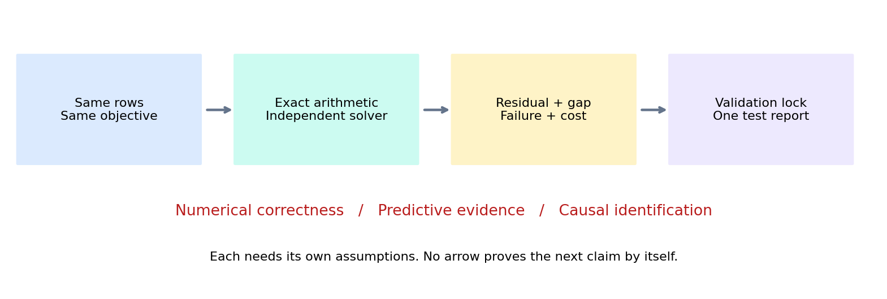

开始运行前就固定候选、停止标准和失败处理。看到不合预期的结果后可以提出新实验，但要另存配置，并把原结果保留下来。尤其不能把未收敛运行删去以后，只在成功子集里平均耗时。

## 2 定义同一个标量目标

四行纸笔问题没有截距，所有列已中心化。令设计矩阵 $X\in\mathbb R^{n\times p}$，标签 $y\in\mathbb R^n$，参数 $w\in\mathbb R^p$。本例 $n=4,p=2$，所有量是无量纲教学刻度。行号只是索引，不是特征。

$$p_i=x_i^\top w,\quad r_i=p_i-y_i,\quad \ell_i=\frac12r_i^2,\quad F(w)=\frac1n\sum_i\ell_i,$$

$$J_\lambda(w)=F(w)+\frac\lambda2w^\top w,\qquad \lambda\ge0.$$

OLS对应 $\lambda=0$；Ridge对应 $\lambda>0$。训练目标用半均方误差，验证和测试统一用普通MSE，即平均 $r_i^2$，不加惩罚。单位不同的真实特征必须额外说明系数和惩罚的量纲；本讲不能把无量纲阈值直接套到任意物理测量。

|行号|$x_{i1}$|$x_{i2}$|$y_i$|$\partial p_i/\partial w$|
|---|---:|---:|---:|---|
|1|−1|−2|−2|$(-1,-2)^\top$|
|2|−1|0|−1|$(-1,0)^\top$|
|3|1|0|0|$(1,0)^\top$|
|4|1|2|3|$(1,2)^\top$|

三列和均为零。若后续数据需要截距 $a$，只惩罚斜率，先从训练数据求 $\bar x,\bar y$，再用 $a=\bar y-\bar x^\top w$ 恢复。不能在验证、测试上各自重算均值来改变预测器。

## 3 从逐行导数到解析参照

链式法则不是一句“调用梯度函数”。对于每一行、每一个旧状态，都有

$$\frac{\partial\ell_i}{\partial r_i}=r_i,\quad \frac{\partial r_i}{\partial p_i}=1,\quad \frac{\partial p_i}{\partial w}=x_i,\quad c_i=\frac{r_i x_i}{4}.$$

$c_i$ 是该行对平均数据目标的梯度贡献。惩罚对总目标只贡献一次 $\lambda w$。汇总得到

$$g_\lambda(w)=\sum_i c_i+\lambda w=H_\lambda w-c,\quad H_\lambda=\frac{X^\top X}{4}+\lambda I,\quad c=\frac{X^\top y}{4}.$$

逐元素核验：$H_{11}=(1+1+1+1)/4=1$，$H_{12}=(2+0+0+2)/4=1$，$H_{22}=(4+0+0+4)/4=2$；$c_1=(2+1+0+3)/4=3/2$，$c_2=(4+0+0+6)/4=5/2$。因此

$$H=\begin{pmatrix}1&1\\1&2\end{pmatrix},\qquad c=\begin{pmatrix}3/2\\5/2\end{pmatrix}.$$

令OLS梯度为零，得到 $w_1+w_2=3/2$ 与 $w_1+2w_2=5/2$。后式减前式得 $w_2=1$，再代回得 $w_1=1/2$。残差为 $(-1/2,1/2,1/2,-1/2)$，故 $F_*=1/8$。

Ridge取 $\lambda=1/2$，方程为 $3w_1+2w_2=3$、$2w_1+5w_2=5$。第一式乘5、第二式乘2，相减得到 $11w_1=5$；代回得 $w_2=9/11$。所以 $w_R=(5/11,9/11)$，$J_R=17/44$。这两套参照对应不同目标，不能把它们的目标最小值直接作为预测排名。

$\lambda>0$ 时，任意非零 $v$ 满足 $v^\top H_\lambda v=\|Xv\|^2/n+\lambda\|v\|^2>0$，因此唯一极小点存在。OLS在满列秩时同样唯一；秩亏时系数可能不唯一。NumPy的 `lstsq` 明确返回最小二范数解，并报告数值秩与奇异值 [1]。这只是可重复的选择约定，不是恢复真实系数的证据。

## 4 第一轮必须保留全部行

取 $w^{(0)}=(0,0)$，$\eta=1/4$，$\lambda=1/2$。下表的 $r_i$ 同时是局部导数 $\partial\ell_i/\partial r_i$；中间导数 $\partial r_i/\partial p_i=1$，预测导数逐行固定为上一节数据表最后一列。全部行必须共享同一旧参数。

|行|$p_i$|$r_i=\partial\ell_i/\partial r_i$|$\ell_i$|$\ell_i/4$|$c_{i1}$|$c_{i2}$|
|---|---:|---:|---:|---:|---:|---:|
|1|0|2|2|$1/2$|$-1/2$|−1|
|2|0|1|$1/2$|$1/8$|$-1/4$|0|
|3|0|0|0|0|0|0|
|4|0|−3|$9/2$|$9/8$|$-3/4$|$-3/2$|

例如第1行的两个梯度贡献分别是 $2\times1\times(-1)/4=-1/2$ 和 $2\times1\times(-2)/4=-1$。四行相加，数据梯度为 $(-3/2,-5/2)$，惩罚梯度为 $(0,0)$，$F_0=J_0=7/4$。

先求更新量，再同时更新两个参数：

$$\Delta w^{(0)}=-\frac14\begin{pmatrix}-3/2\\-5/2\end{pmatrix}=\begin{pmatrix}3/8\\5/8\end{pmatrix},\quad w^{(1)}=(3/8,5/8).$$

不能先改 $w_1$ 再拿新 $w_1$ 求本轮 $w_2$ 的梯度。那已经变成另一种顺序算法。也不能把四行分别更新一次后称为“这一步批量GD”。

## 5 第二轮从真正的新前向开始

在 $w^{(1)}$ 处，第1行的新预测是 $(-1)(3/8)+(-2)(5/8)=-13/8$，残差是 $-13/8-(-2)=3/8$。它不是旧残差减去某个统一常数。

|行|新 $p_i$|新 $r_i=\partial\ell_i/\partial r_i$|新 $\ell_i$|新 $\ell_i/4$|新 $c_{i1}$|新 $c_{i2}$|
|---|---:|---:|---:|---:|---:|---:|
|1|$-13/8$|$3/8$|$9/128$|$9/512$|$-3/32$|$-3/16$|
|2|$-3/8$|$5/8$|$25/128$|$25/512$|$-5/32$|0|
|3|$3/8$|$3/8$|$9/128$|$9/512$|$3/32$|0|
|4|$13/8$|$-11/8$|$121/128$|$121/512$|$-11/32$|$-11/16$|

这一轮四行的中间导数依然各为1，预测局部导数依次为 $(-1,-2)$、$(-1,0)$、$(1,0)$、$(1,2)$。因此第二轮的链条也能逐行复核，不能仅凭总梯度一致跳过行级核查。

数据梯度为 $(-1/2,-7/8)$；惩罚梯度为 $(3/16,5/16)$。相加得到 $g_1=(-5/16,-9/16)$。数据损失是 $41/128$，惩罚是 $17/128$，总目标为 $29/64$。

$$\Delta w^{(1)}=-\frac14\begin{pmatrix}-5/16\\-9/16\end{pmatrix}=\begin{pmatrix}5/64\\9/64\end{pmatrix},\quad w^{(2)}=(29/64,49/64).$$

第二次更新之后，仍要再做完整新前向。以下既是第二轮的结果，也是若继续训练时第三轮的输入状态。

|行|新 $p_i$|新 $r_i=\partial\ell_i/\partial r_i$|新 $\ell_i$|新 $\ell_i/4$|新 $c_{i1}$|新 $c_{i2}$|
|---|---:|---:|---:|---:|---:|---:|
|1|$-127/64$|$1/64$|$1/8192$|$1/32768$|$-1/256$|$-1/128$|
|2|$-29/64$|$35/64$|$1225/8192$|$1225/32768$|$-35/256$|0|
|3|$29/64$|$29/64$|$841/8192$|$841/32768$|$29/256$|0|
|4|$127/64$|$-65/64$|$4225/8192$|$4225/32768$|$-65/256$|$-65/128$|

数据梯度相加为 $(-9/32,-33/64)$，惩罚梯度为 $(29/128,49/128)$，总梯度为 $(-7/128,-17/128)$。$F_2=1573/8192$，惩罚为 $1621/8192$，$J_2=1597/4096=0.389892578125$。虽然已很接近 $17/44$，梯度还不为零。独立审计使用Fraction逐项核对三张表和两次更新，不把同一个梯度函数当作自己的答案。

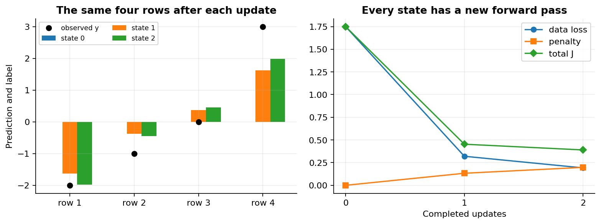

## 6 解析解与迭代解应当怎样比较

解析方程是参照，不意味着应显式计算逆矩阵。实际采用OLS的SVD最小二乘，以及Ridge的增广最小二乘：

$$\widetilde X=\begin{pmatrix}X/\sqrt n\\\sqrt\lambda I\end{pmatrix},\quad \widetilde y=\begin{pmatrix}y/\sqrt n\\0\end{pmatrix},\quad \min_w\frac12\|\widetilde Xw-\widetilde y\|^2.$$

展开右侧恰为 $J_\lambda$。另一条独立库路线是scikit-learn的Ridge。其目标为SSE加 `alpha` 乘系数平方和，故本讲必须传 `alpha=n*lambda`，而非直接传λ [2]。四行λ=1/2对应alpha=2。复制每行两次后平均目标不变，但库alpha应变为4。

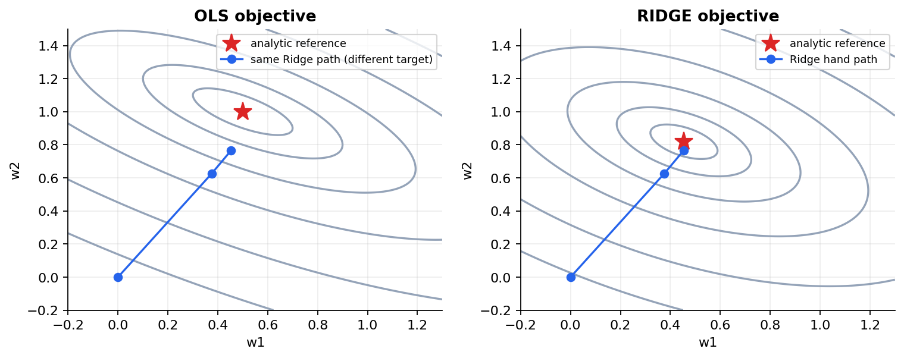

比较时同时给出：目标公式、归一化、参数约定、独立参照的数值秩、参数距离、训练预测距离和梯度残差。在秩亏OLS中，沿零空间移动可以改变参数而不改变预测，所以只比系数可能错误判失败。相反，共线性很强时近似相同训练预测也不能证明系数稳定。

## 7 目标差与梯度残差之间缺少哪一个常数

令 $w_*$ 为同一目标的最优点，误差 $e=w-w_*$。展开二次型并用 $H_\lambda w_*=c$ 消去交叉项：

$$J(w)=\frac12w^\top H_\lambda w-c^\top w+C,$$

$$J(w)-J(w_*)=\frac12e^\top H_\lambda e,\qquad g=H_\lambda e.$$

若 $0<\mu=\lambda_{\min}(H_\lambda)\le\lambda_{\max}(H_\lambda)=L$，谱分解将它们写成 $\sum_j d_j e_j^2/2$ 与 $\sum_j d_j^2 e_j^2$。逐项使用 $\mu\le d_j\le L$ 得到

$$\frac{\|g\|^2}{2L}\le J(w)-J(w_*)\le\frac{\|g\|^2}{2\mu},\quad \|e\|\le\frac{\|g\|}{\mu}.$$

若μ极小，梯度很小也允许参数误差很大；若μ=0，后一组含 $1/\mu$ 的界不可使用。对奇异OLS可限制到有正曲率的列空间方向，零空间误差本来不可识别。不能把“梯度小”无条件翻译成“真实系数找到了”。

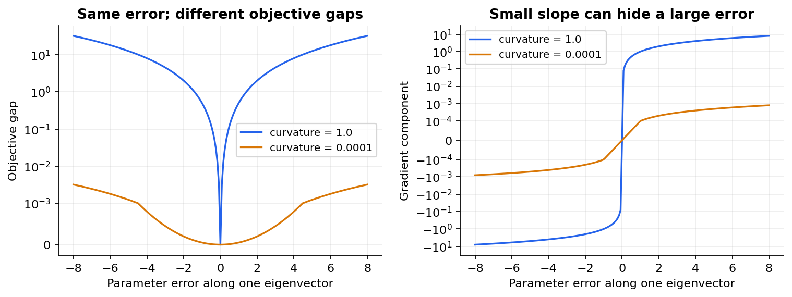

程序同时保存直接相减的目标差与二次型差。靠近最优点，两个相近浮点数相减可能得到微小负值；二次型通常更适合展示非负差。但它仍依赖数值参照和Hessian，不能被称为精确实数证书。测试在多个点核验两者以及上下界，容差清楚记录。

## 8 梯度检查是一个有边界的实验

在三个非驻点 $(0.2,-0.4)$、$(0.8,0.1)$、$(-0.3,0.7)$ 上，沿每个坐标计算

$$d_j(h)=\frac{J(w+he_j)-J(w-he_j)}{2h},\qquad E(h)=\frac{\|g-d(h)\|_2}{\max(1,\|g\|_2)}.$$

$e_j$ 是坐标基向量；h是检查导数的扰动，不是学习率。本讲按 $10^{-2},10^{-4},10^{-6},10^{-8},10^{-10}$ 扫描。二次函数的中央差分没有三阶截断项，因此小h主要受到消减误差影响；不要把本图当作一般函数必有某种U形曲线的证明。

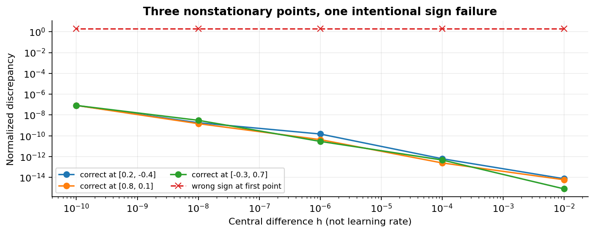

检查通过只说明函数实现和梯度在这些点一致，不能保证行配对、任务、外部数据处理都正确。039讲的广播错误可以对自身通过差分；所以这里还要Fraction行账本、独立解析消元、库目标换算、复制样本不变性和随机有理数据测试。随机测试用独立种子生成32个小问题，不挑最好一个结果。

## 9 公平比较先固定算法定义

压力实验有regular、collinear、scaled三种固定设计，每种120行、6特征。标签由已说明的线性公式与Gaussian噪声生成。collinear第二列近似第一列，scaled则把原始列乘以不同尺度。三个病例分别生成，不能把跨病例变化全归因于单一因素；同病例内五种求解器共享完全相同数据和目标。

每个病例预声明λ=0与0.1，共30条标准运行。每条以零参数开始，最多400个记录轮次。统一停止量为

$$\rho(w)=\frac{\|X^\top(Xw-y)/n+\lambda w\|_2}{\max(1,\|X^\top y/n\|_2)}\le10^{-6}.$$

该尺度是本教学数据内的明确约定，不具有任意坐标变换不变性。只有满足它才标记 `gradient_tolerance`；耗尽预算标记 `budget_exhausted`。对于小批量方法，每个记录轮次后重算完整梯度再判停止，不能用噪声恰好抵消的小批量梯度冒充证书。相同400轮也不代表等成本，因此后续必须同时给实际行数与计时。

五条路线如下。

- GD：$w^+=w-g/L$。L由本固定二次目标Hessian最大特征值得到。此小实验显式计算谱信息，不声称大规模训练也免费拥有L。
- 对角预条件GD：令 $D=\operatorname{diag}(H_\lambda)$，$L_D=\lambda_{\max}(D^{-1/2}H_\lambda D^{-1/2})$，使用 $w^+=w-D^{-1}g/L_D$。
- 小批量SGD：每步独立等概率抽16个不同索引，不是把整份数据打乱遍历。每个记录轮次做 $\lceil120/16\rceil=8$ 步，故是128次样本访问，不保证覆盖全部120行。步长为 $0.2/[L(1+0.05(k-1))]$，k为记录轮次。
- Adam：使用完整梯度，$m_t=0.9m_{t-1}+0.1g_t$，$v_t=0.999v_{t-1}+0.001g_t^2$，分别除以 $1-0.9^t$ 和 $1-0.999^t$，再以 $0.04\hat m_t/(\sqrt{\hat v_t}+10^{-8})$ 更新。初始两个状态为零，平方和除法逐坐标进行。这里只核对原论文Algorithm 1的更新定义 [3]，不借用普遍收敛或胜出结论。
- Newton参照：解 $H_\lambda\Delta=-g$，令 $w^+=w+\Delta$。对非奇异精确二次目标，代入 $g=H_\lambda(w-w_*)$ 得 $\Delta=w_*-w$，所以实数精确算术下一步到达最优点。实现用线性最小二乘求该方向，仍需检查浮点残差与成本。

SGD每步的梯度为 $X_B^\top(X_Bw-y_B)/|B|+\lambda w$。等概率子集使数据项条件期望等于全数据梯度，惩罚项只加一次；它不是平均以后再乘n。Adam也把Ridge项放在梯度内，不是AdamW式解耦衰减。

## 10 真实结果包含十二条未达标运行

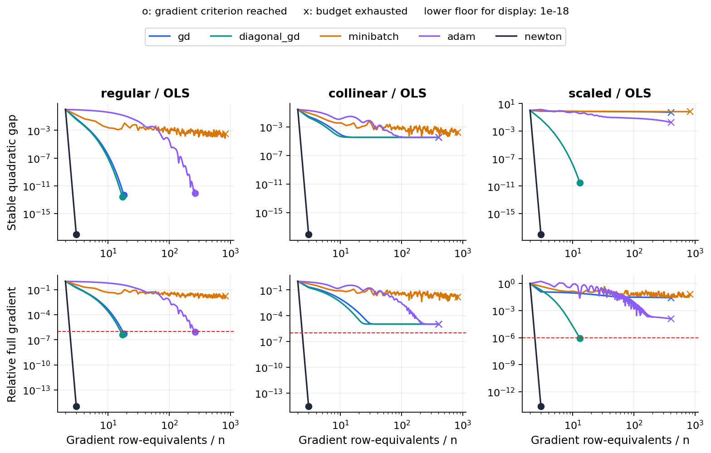

默认30条标准运行中，18条达到阈值，12条耗尽预算。所有六条小批量路径都没有在当前计划内达到 $10^{-6}$；这不说明SGD不能学到有用模型，只说明不能给这次运行贴上“已达同一数值精度”的标签。固定单种子也不是随机优化器优劣的总体证据。

regular的OLS，GD用16次更新达到阈值，Adam用263次。collinear的OLS，GD、对角GD、Adam都耗尽400轮；GD最终相对梯度约 $1.071\times10^{-5}$，目标差约 $3.420\times10^{-5}$，参数距离却约6.224。这个结果正是弱曲率方向的具体提醒。

scaled的OLS，GD耗尽预算，参数距离约22.544；对角GD在11次更新达到阈值，但参数距离仍约 $2.788\times10^{-4}$。不同参数单位使距离数值可比性也受限制。scaled的Ridge λ=0.1，对角GD在8次更新达标，Adam在229次达标，普通GD和小批量仍未达标。这些都是本配置观察，不能写成五种方法的通用排行榜。

本项目保存所有初始与监测状态，不先平滑曲线，也不把失败替换为最后一次成功运行。每个结论都能定位到JSON的case、lambda、method、status和final字段。

## 11 预条件与改变统计模型不是同一件事

令 $w=D^{-1/2}u$，把原目标写成 $\widetilde J(u)=J(D^{-1/2}u)$。链式法则给出 $\nabla_u\widetilde J=D^{-1/2}g$。在u空间按 $1/L_D$ 做GD再映回w，正好得到上一节的对角更新式。因此它改变路径，不改变原目标的极小点集合。

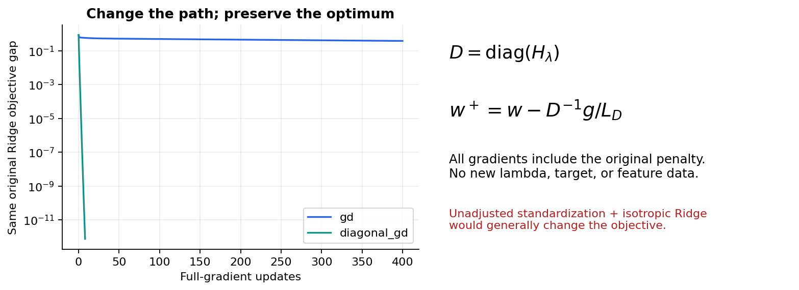

若把特征除以训练标准差后，直接给新系数加同一个各向同性λ，原坐标惩罚通常变成不同的加权惩罚。那是040讲的统计建模选择。不能将这种模型变化的预测收益全部记为优化器加速。本项目压力实验采用原坐标目标加对角预条件；下一节的模型选择则明确采用标准化系数的Ridge目标，两者分开记录。

## 12 失败案例也必须收费

额外故意设置scaled的Ridge步长为 $3/L$。固定二次GD误差沿最大特征方向乘 $1-\eta L=-2$，违反 $|1-\eta L|<1$ 的稳定要求。本次第一候选实际增加目标，因此拒绝并停止，保存候选与最后已提交状态。

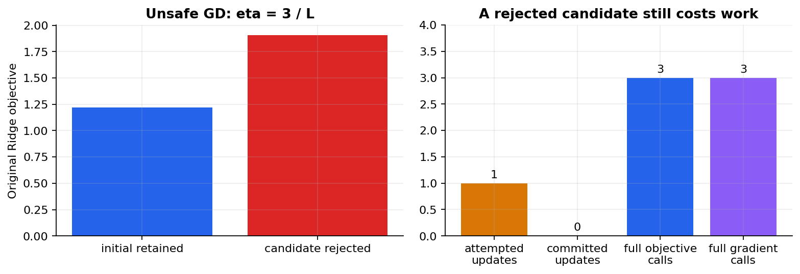

本次账本是：1次尝试、0次提交；3次完整目标与梯度调用，各360行；2次监测预测距离计算，共240行；1次Gram构造，120行；2次谱求解；1次126行的增广参照最小二乘。参照那次调用的梯度虽不用于更新，也确实被代码计算，不能从账本中消失。

这是教学故障隔离，不是带保证的线搜索。正常Adam与SGD并未被强制要求逐步下降，不能把它们的所有上升一概判作错误。真正的失败解释应说清目标、局部方向、步长、停止策略和已发生的计算。

## 13 从操作量走到真实耗时

设 $n\ge p$ 且矩阵稠密。一次批量梯度需要 $Xw$ 与 $X^\top r$，主要工作量 $O(np)$；一批m行是 $O(mp)$，完整监测仍要 $O(np)$。Adam额外状态与逐坐标算术是 $O(p)$。Gram构造是 $O(np^2)$，存储 $O(p^2)$；常规稠密线性系统或谱分解是 $O(p^3)$。SVD/QR最小二乘在这个尺寸关系下约为 $O(np^2)$，不同形状应重新说明。

这些是量级，不是墙钟时间。BLAS实现、内存布局、线程、循环和记录开销都重要。本实现每条路线都额外构造Gram、两个谱参照及独立最小二乘，用于教学诊断；还保存每个状态的长度p参数。因此它不是面向大n、p优化的生产实现，长轨迹存储也要 $O(Kp)$。

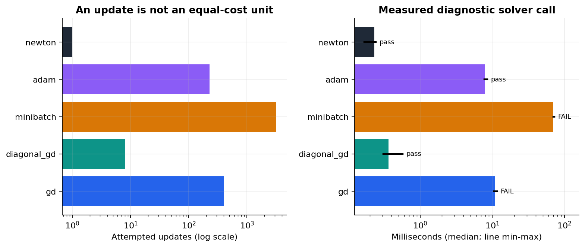

使用Python `perf_counter_ns` 的单调高分辨率计时 [4]，每配置先做1次暖机并记录其时间，再做3次串行测量，BLAS线程固定为1。时间范围包括Gram、谱、参照、完整监测、失败尝试和轨迹构造；不含文件读取、中心化、模型选择、覆盖模拟、画图、JSON写入和Python启动。它只能叫“诊断求解调用耗时”，不能叫端到端训练耗时。

这一台Linux CPU上的scaled、λ=0.1三次中位数约为：GD 10.886毫秒、对角GD 0.365毫秒、小批量70.017毫秒、Adam 7.874毫秒、Newton 0.232毫秒。GD和小批量未达标，故不能把这些数字当成“达到相同精度的全部时间”。完整原始纳秒样本、暖机与min/max均在benchmark-result.json。换机器或再次运行数字会变化；计时与确定性科学JSON分开，避免既要求字节相同又声称实时测量。

## 14 训练与验证锁定后才打开测试

另一个独立的合成数据包含72行训练、48行验证、120行测试。六个特征带偏移、尺度差和相关性。它不复用压力实验标签，不使用生成真系数选参。候选为标准化空间的OLS及Ridge，λ固定为0、0.001、0.01、0.1、1、10。

训练均值μ、标准差s和标签均值只用训练行拟合。常数列的s约定为1。每个候选在同一个训练变换上求解，通过完整梯度门槛后才进入验证排名。验证MSE最小者获选，完全相等时偏好较大的λ，不临时增加“近似并列”规则。不在选择后重训train+validation，避免悄悄改变数据量和模型。

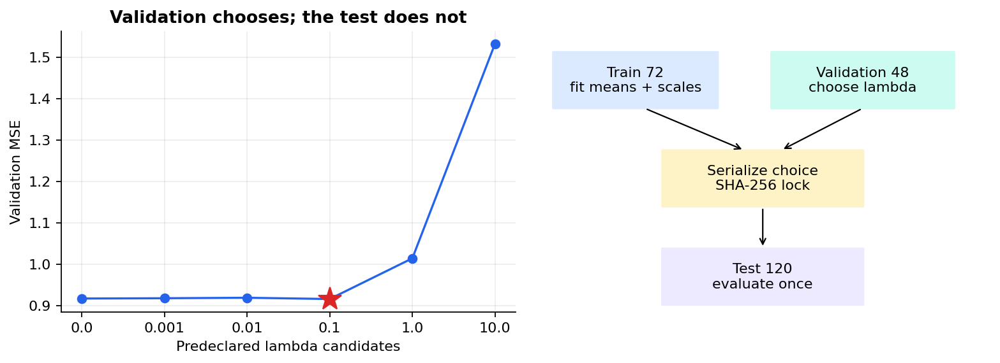

本次λ=0.1获选。锁定后测试MSE约0.775054，预声明OLS基线约0.767754，后者这次略低。不能因为测试上OLS略好就重新宣布它为“验证赢家”，或追加λ网格把Ridge调到刚好超过它。一个正当的验证过程不保证每一次测试都击败每个基线。

实现的选择函数只接受训练、验证数组。测试数据在入口会被校验格式与有限性，但标签不参与拟合和选参；先校验可用性不等于使用标签选择模型。选择对象完整序列化后再计算SHA-256，然后才建立测试数组。篡改测试标签或特征的独立测试确认锁定对象完全不变，而最终测试误差应改变。摘要提供一致性检查，不是不可篡改的数字签名。

## 15 预测区间究竟给谁画

到这里仍只有点预测。为解释区间，本项目另设一个没有模型选择的固定OLS模拟。$A\in\mathbb R^{n\times p}$ 包含截距列，$n=32,p=2$。假设

$$y=A\beta+\varepsilon,\quad \varepsilon\sim N(0,\sigma^2 I),\quad \operatorname{rank}(A)=p.$$

A视为固定，模型形式正确；新观测噪声与训练独立、同方差。OLS为 $\hat\beta=(A^\top A)^{-1}A^\top y$，于是

$$\hat\beta-\beta=(A^\top A)^{-1}A^\top\varepsilon,\quad \operatorname{Cov}(\hat\beta)=\sigma^2(A^\top A)^{-1}.$$

对预先固定的新设计行 $a_0$，令 $m_0=a_0^\top\beta$、$\hat m_0=a_0^\top\hat\beta$、$h_0=a_0^\top(A^\top A)^{-1}a_0$。条件均值估计误差方差为 $\sigma^2h_0$；新观测 $Y_0=m_0+\varepsilon_0$ 的误差为 $Y_0-\hat m_0$，独立性使方差变为 $\sigma^2(1+h_0)$。

多出来的1代表新观测自身的噪声，不能通过把参数估计得更精确消除。均值区间与单个新观测区间回答不同对象；NIST官方说明也作此区分 [5,6]。

## 16 从方差到t区间的中间环节

用残差平方和估计未知噪声：$s^2=\|y-A\hat\beta\|^2/(n-p)$。满秩与Gaussian假设下，投影到列空间的分量和残差空间分量正交且独立，$(n-p)s^2/\sigma^2$ 服从 $\chi^2_{n-p}$；标准化预测误差为正态，并与s独立。因此正态除以独立卡方均值的平方根给出t枢轴量：

$$\frac{\hat m_0-m_0}{s\sqrt{h_0}}\sim t_{n-p},\qquad \frac{Y_0-\hat m_0}{s\sqrt{1+h_0}}\sim t_{n-p}.$$

取t分布0.975分位数q，95%均值置信区间为 $\hat m_0\pm qs\sqrt{h_0}$，单个新观测预测区间为 $\hat m_0\pm qs\sqrt{1+h_0}$。数值分位数用SciPy的 `t.ppf`，明确传30自由度 [7]；不能用 `t.interval` 的分布区间直接冒充完整回归区间。

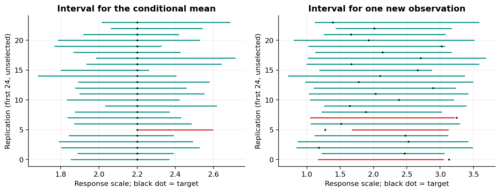

这里的95%是按同一机制反复收集训练数据、构造区间的长期覆盖率，不是“已经观察到的固定区间里，固定参数有95%概率”。对未来观测可给预测概率解释，但仍依赖模型与抽样假设，不自动保证任意子群或分布外个体。

## 17 让一个可信公式真正失败一次

模拟固定32个 $x\in[-2,2]$，真实回归为 $1+0.8x$，训练噪声标准差0.5；在固定 $x_0=1.5$ 预测。每次重新抽取训练噪声、拟合OLS，并独立抽一个同分布新观测。600次完整重复保存全部参数相关量、区间宽度、目标与覆盖布尔值。

实际均值区间覆盖580/600，约0.9667；正确预测区间覆盖562/600，约0.9367。这与名义0.95并不要求严格相等。若每次独立，比例的Monte Carlo标准误约为 $\sqrt{0.95(1-0.95)/600}\approx0.0089$；偏离名义值本身不能自动宣布公式错误。

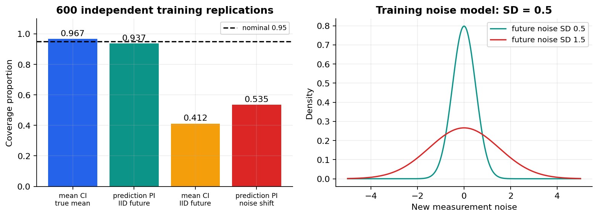

把均值区间直接用于新观测，只覆盖247/600，约0.4117。另一个压力实验保留训练机制和同一个预测区间，但把未来噪声标准差改为1.5，仅覆盖321/600，即0.535。后一例不是优化失败，而是原来同方差、同分布的条件不再成立。

不能把这个OLS公式直接移到前面的验证选参Ridge。收缩偏差、有效自由度和数据驱动选择都改变推断问题。Bootstrap也要说清重采样单位、重新做哪些预处理和选择、目标是均值还是新观察；只重采样固定模型预测不自动覆盖训练与选择的不确定性。更完整的校准、选择后推断与分布偏移方法将在047、051和Q3继续。

## 18 科研报告要允许哪些结论

优化层可以说：在本固定输入、目标和dtype下，行账本、梯度、独立解析或库参照一致；某些路线在声明预算内达到数值阈值。统计层可以说：按固定数据协议选出的预测器，在这一次合成封存测试上得到某个MSE；在明确Gaussian设计下，区间重复覆盖接近理论或在压力条件下失败。两层都不能推出现实因果效应。

例如，两个变量同时受未观测因素影响，回归系数可能稳定且预测很好；主动改变其中一个变量后，另一个变量的响应仍未被识别。低损失、小梯度和窄区间都不是随机化、无混杂或可干预性的替代品。若研究问题是“改变某因素是否产生结果”，必须另列识别假设及可检验设计，不能在结论末尾顺手加一句因果解释。

## 19 让工程证据与数学证据同样可重跑

所有原始CSV字段和JSON配置必须在任何求解、随机抽样、回调或输出前完成校验，包括最后一行标签与最后配置字段。拒绝重复键、重复ID、错列数、错形状、布尔值冒充数字、API里的数值字符串或复数、NaN/Inf、超出声明范围以及绝对值小于 $10^{-150}$ 的非零原始数字。CSV文本通过Decimal解析，检测转换时下溢；JSON不接受非标准常量。显式异常不会在 `python -O` 中消失。

Notebook第一格先用标准库验证数据与执行文件的字节摘要，之后才导入数值、绘图模块。篡改任何契约文件都必须在第一格拒绝，不能展示残留旧结果。摘要一致性仍只是契约的一层，不取代逐行计算和统计假设。

报告写入在同一目录生成临时完整严格JSON、刷新后原子替换；注入写入失败的测试证明原文件字节保留。输出不能覆盖输入和交付资产，也拒绝符号链接、符号链接父目录及多硬链接文件。这个约定针对单用户本地实验，不声称抵御恶意并发改换文件的竞争攻击。

普通模式、优化模式与不同工作目录的新Python进程产出完整一致的确定性JSON。实际Notebook由新进程中的真实InProcessKernel顺序运行，保留文本及PNG；这不等于测试了Jupyter浏览器UI、网络内核传输或Anaconda安装。所有PDF要按实际页数逐页目视，图像与公式不能仅靠文本提取验收。

## 20 项目练习与验收问题

1. 从原始四行独立算出H、c、OLS与λ=1/2的Ridge参照，不调用矩阵求逆。
2. 重算两个完整更新及三个前向状态，列出每行局部导数与平均梯度贡献。
3. 证明二次型目标差恒等式及上下界，说明μ=0时哪一步失效。
4. 构造两个系数不同但预测相同的秩亏OLS解，区分不可识别与代码错误。
5. 解释Ridge的库alpha换算与样本复制实验，并设计一个遗漏n的反例。
6. 在三个非驻点做梯度扫描，解释为什么单一驻点不是足够的测试点。
7. 推导对角预条件与坐标变换的等价性，解释为何不等于直接换成标准化Ridge。
8. 逐项写出Adam首步与SGD无偏条件，指出当前SGD“轮次”不是完整遍历。
9. 用默认结果写一段优化比较，至少包含一条预算耗尽路径、参数误差和预测误差的差别。
10. 核算故障路径的成本，说明为什么0次提交不能记作0次计算。
11. 给出复杂度与计时边界；为什么Newton一次更新不能单凭次数宣布普遍更快？
12. 设计测试标签篡改检查；面对测试OLS略好于验证选中Ridge，应怎样报告？
13. 从OLS协方差推导均值区间与预测区间中的h和1+h，以及n−p自由度。
14. 用600次覆盖记录解释抽样波动、错用均值区间和未来噪声偏移三种现象。
15. 为什么不能给验证选择后的Ridge直接附上本讲OLS t区间，也不能凭回归系数作因果解释？
16. 制定能自动拒绝坏尾字段、输出覆盖、Notebook契约篡改的验收，并写下一项可证伪扩展研究。

## 一手来源与阅读边界

[1] [NumPy 2.3 lstsq](https://numpy.org/doc/2.3/reference/generated/numpy.linalg.lstsq.html)：最小范数、rcond、数值秩和返回残差的约定。

[2] [scikit-learn 1.8 Ridge](https://scikit-learn.org/1.8/modules/generated/sklearn.linear_model.Ridge.html)：目标、alpha与svd求解器；[官方数据泄漏说明](https://scikit-learn.org/1.8/common_pitfalls.html)：训练变换与未见数据处理。

[3] [Kingma与Ba  Adam原论文](https://arxiv.org/pdf/1412.6980)：实际核对Algorithm 1的状态、偏差修正和epsilon位置。未将论文全部理论或实验结论作为本项目的保证。

[4] [Python 3.12 time](https://docs.python.org/3.12/library/time.html#time.perf_counter_ns)：计时接口。文档当前维护补丁版与本机Python3.12.14补丁号不完全相同，接口语义实际核对。

[5] [NIST Estimation](https://www.itl.nist.gov/div898/handbook/pmd/section1/pmd131.htm)；[6] [NIST Prediction](https://itl.nist.gov/div898/handbook/pmd/section1/pmd132.htm)：均值和未来测量的不确定性对象区别。

[7] [SciPy 1.17.0 t分布](https://docs.scipy.org/doc/scipy-1.17.0/reference/generated/scipy.stats.t.html)：自由度、分位数与分布语义。来源于2026-10-04实际检查；推导、数据、图与教学代码独立编写，不附第三方全文。
