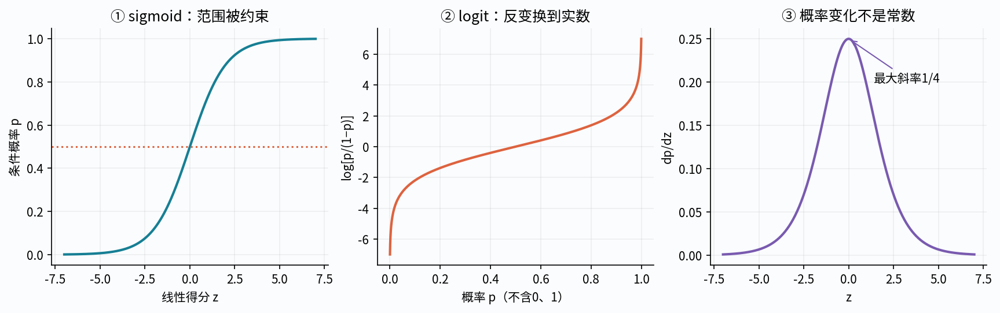
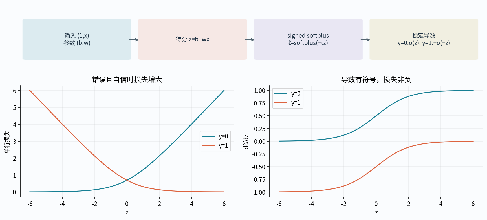
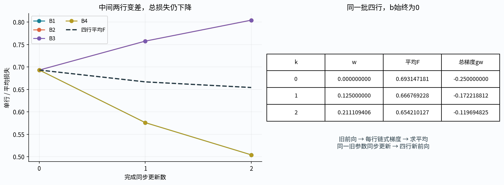
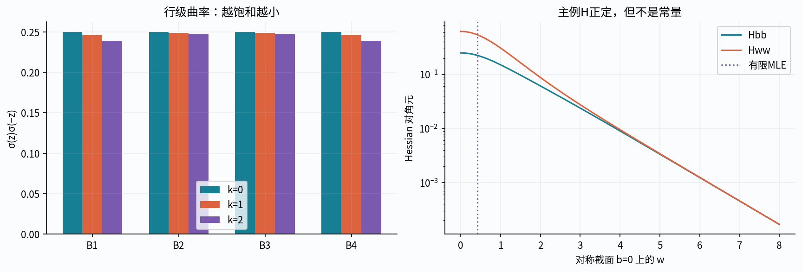
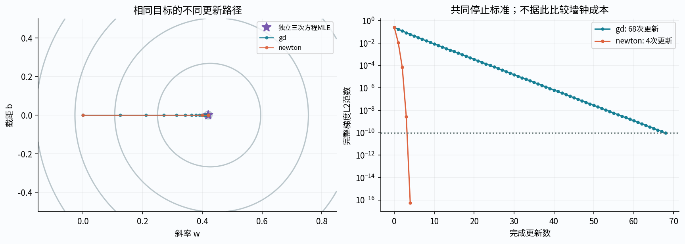
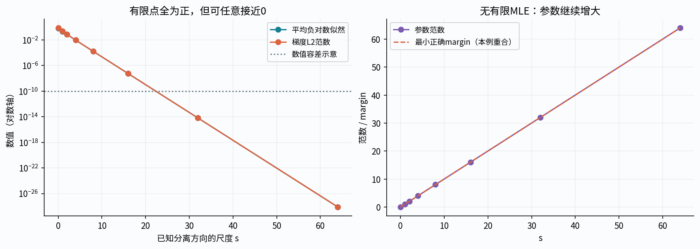
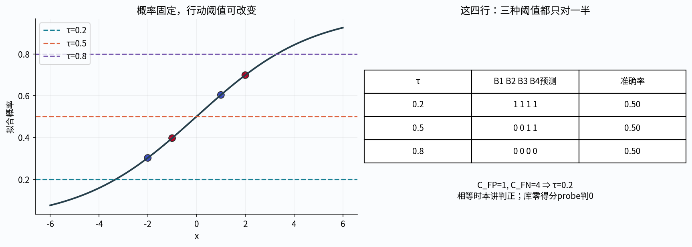
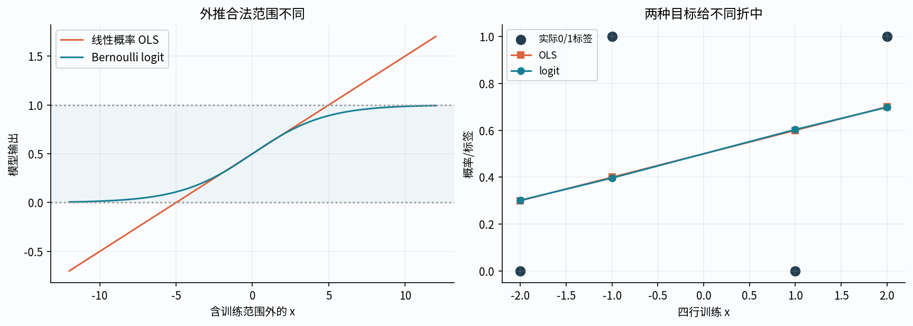
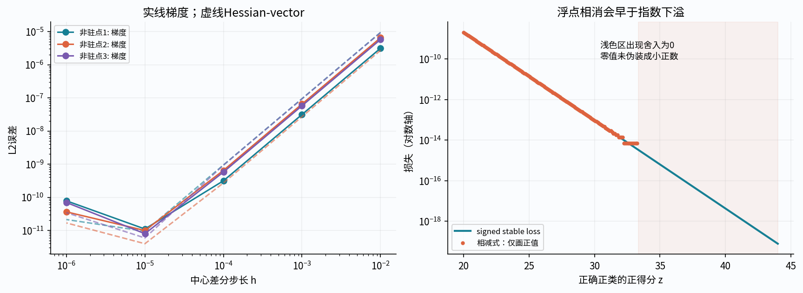

# 第042讲 二分类与逻辑回归

## 1 从连续预测转到二分类概率

第039讲用同一数据对比平方损失与稳定logit损失，目的是诊断数值实现。本讲正式建立概率模型：给定特征x，怎样估计y=1的条件概率，再把概率与行动区分开？直接先修014、020、023、029、032、039。

标签是0或1，并不要求模型每次只能输出0或1。我们先估计概率p(x)，再由阈值和错误代价决定行动。对“正类”的定义必须先说明；它可以表示需要人工复核，不天然表示好事。模型输出0.8也不是说这一个人的属性有80%已经确定，而是给定模型与信息时的条件概率估计。

本讲所有数据均为原创合成机制例，不涉及真实个人标签、风险决策或人口群体的推断。概率建模、数值求解、分类正确率和概率校准四者分别验收。

## 2 线性得分、sigmoid与log-odds

用含截距的得分z=b+xᵀw，再定义

$$p=\sigma(z)=\frac1{1+e^{-z}},\qquad 1-p=\frac1{1+e^z}.$$

任意有限实数z对应严格介于0和1的数学概率。反过来，对p∈(0,1)，odds=p/(1−p)，log-odds=log[p/(1−p)]=z。线性的是log-odds，不是p本身。

固定其他特征，xⱼ增加1使log-odds增加wⱼ，odds乘$e^{w_j}$；它一般不让概率增加固定的wⱼ，也不证明因果效应。特征单位改变时系数解释也改变。概率边界0与1的logit不有限，代码须区别数学定义域和浮点舍入。

## 3 Bernoulli假设怎样给出目标

对已观察到的特征X，假设标签条件独立且yᵢ|xᵢ服从Bernoulli(pᵢ)。单行概率质量为$p_i^{y_i}(1-p_i)^{1-y_i}$；独立样本似然是各行相乘。取负对数、再除以n，得到

$$F(b,w)=-\frac1n\sum_{i=1}^n\left[y_i\log p_i+(1-y_i)\log(1-p_i)\right].$$

这不是因为“所有分类都必须用这个公式”，而是选定条件概率模型后的似然准则。模型可以错设、样本也可能依赖；这些情况下不能凭形式熟悉就使用独立样本不确定性结论。

对单行y=1，损失是−log p；对y=0，是−log(1−p)。给真实标签极小概率会受到大惩罚。训练准确率只看阈值后的0/1是否正确，无法区分0.51和0.99的置信程度，因而不是同一个目标。

## 4 稳定损失应直接使用logit

代入p=σ(z)，数学上可以写ℓ=log(1+eᶻ)−yz；但直接计算eᶻ会溢出，正的大z与y=1时还可能发生两个大数相减、丢失小尾项。二元标签下令t=2y−1∈{−1,1}，更稳妥地写

$$\ell(z,y)=\operatorname{softplus}(-tz),\qquad\operatorname{softplus}(u)=\max(u,0)+\log(1+e^{-|u|}).$$

实现使用log1p处理很小的指数。不要先把p算到浮点1，再取log(1−p)；也不要把真实0/1概率裁剪到某个epsilon后声称仍是原目标。截断可以是一种明示近似，但会改变损失与梯度。

数学上所有有限z的损失为正；浮点在非常大的正确margin处可能把不可表示的小尾项舍成0，这是表示精度边界，不是找到了有限参数下的零损失解。

## 5 梯度的每一段局部链

先在0<p<1的普通数学范围推导，单行有

$$\frac{\partial\ell}{\partial p}=-\frac y p+\frac{1-y}{1-p},\quad\frac{\partial p}{\partial z}=p(1-p),\quad\frac{\partial z}{\partial(b,w)}=(1,x^\top).$$

前两项相乘为−y(1−p)+(1−y)p=p−y。因此若将每行扩展为aᵢ=(1,xᵢᵀ)ᵀ，参数θ=(b,wᵀ)ᵀ，则单行平均梯度贡献为(pᵢ−yᵢ)aᵢ/n，总梯度为Aᵀ(p−y)/n。

极端logit的代码不应真的把可能溢出的∂ℓ/∂p与趋近0的∂p/∂z相乘。用代数化简后的稳定导数：y=0时σ(z)，y=1时−σ(−z)。这样正确正类的大正z仍保留可表示的负小尾项，不用先算σ(z)−1相消。

## 6 新的四行主例与第一轮旧前向

主例故意不是完全分离的数据。它与039的例子有相同“一个特征加截距”形状，但行值和标签重新明确给出：

|行|x|y|初始z|初始p|
|---|---|---|---|---|
|B1|−2|0|0|1/2|
|B2|−1|1|0|1/2|
|B3|1|0|0|1/2|
|B4|2|1|0|1/2|

取θ⁰=(b,w)=(0,0)，η=1/2，不加正则。每行ℓ=log2，平均贡献log2/4，总F₀=log2。∂ℓ/∂p依次为(2,−2,2,−2)，∂p/∂z全为1/4，故∂ℓ/∂z=(1/2,−1/2,1/2,−1/2)。

四行对b的平均贡献为(1,−1,1,−1)/8；对w分别为(−2,1,1,−2)/8。汇总g₀=(0,−1/4)。同步更新后θ¹=(0,1/8)，不是把一行更新后的参数交给下一行再改变目标。

## 7 第一轮新前向与第二轮旧梯度

令a=σ(1/4)、q=σ(1/8)。新logit为(−1/4,−1/8,1/8,1/4)，概率为(1−a,1−q,q,a)。下面保留六位小数便于读表，实际程序与独立110位Decimal账本保留更多精度。

|行|新概率p|p−y|损失ℓ|对b贡献(p−y)/4|对w贡献(p−y)x/4|
|---|---|---|---|---|---|
|B1|0.437823|0.437823|softplus(−1/4)|0.109456|−0.218912|
|B2|0.468791|−0.531209|softplus(1/8)|−0.132802|0.132802|
|B3|0.531209|0.531209|softplus(1/8)|0.132802|0.132802|
|B4|0.562177|−0.437823|softplus(−1/4)|−0.109456|−0.218912|

损失均值F₁=[softplus(−1/4)+softplus(1/8)]/2≈0.6667692275980063。数据梯度gb=0，gw=a−1+q/2≈−0.17221881242732377。

第二轮仍从同一个θ¹汇总所有行，θ²=(0,1/8−gw/2)≈(0,0.21110940621366188)。这次不再是简单有理数：sigmoid含指数，不能把六位小数当精确值做“有理证明”。第一轮分数链可精确核对，后续用定义式与独立高精度计算。

## 8 第二轮新前向必须再算一次

将w₂代回同样四个x，z²=(−2w₂,−w₂,w₂,2w₂)，再算概率(1−σ(2w₂),1−σ(w₂),σ(w₂),σ(2w₂))。损失为

$$F_2=\frac12\left[\operatorname{softplus}(-2w_2)+\operatorname{softplus}(w_2)\right]\approx0.6542101267359844.$$

|行|新logit|新概率|新损失|对b平均贡献|对w平均贡献|
|---|---|---|---|---|---|
|B1|-0.422218812|0.395985930|0.504157786|0.098996482|-0.197992965|
|B2|-0.211109406|0.447417790|0.804262467|-0.138145552|0.138145552|
|B3|0.211109406|0.552582210|0.804262467|0.138145552|0.138145552|
|B4|0.422218812|0.604014070|0.504157786|-0.098996482|-0.197992965|

新梯度仍gb=0，gw≈−0.11969482505055372，尚未最优。Notebook和详解要列这四行新logit、概率、损失、两种局部导数、每行梯度与Hessian贡献，不能只打印最终loss。

从F₀到F₂下降并不表示每一行都变好：两端标签与正斜率一致，中间两行则相反。总似然的折中是所有行共同决定的，不是要求每行损失每轮同时下降。

## 9 Hessian来自哪些行

对p−y再对θ求导，y不随θ变化，因此

$$\nabla^2F(\theta)=\frac1n\sum_i p_i(1-p_i)a_i a_i^\top=\frac1nA^\top W A,$$

W为对角阵diag(pᵢ(1−pᵢ))。对任意v，vᵀHv=Σpᵢ(1−pᵢ)(aᵢᵀv)²/n≥0，故F凸。有限θ、A满列秩时每个权重严格正，H正定，F严格凸；这保证至多一个有限最优点，不保证该点存在。

主例θ⁰权重全1/4，Σx=0、Σx²=10，故H₀=diag(1/4,5/8)。θ¹以后权重变化；不能把线性回归常量Hessian直接搬来。稳定代码可用σ(z)σ(−z)计算权重，避免p已舍入为1时把可表示曲率直接丢掉。

## 10 梯度下降与Newton怎样对照

梯度下降用θ新=θ旧−ηg。由于p(1−p)≤1/4，H≤AᵀA/(4n)，可由其最大特征值上界给全局光滑常数L。主例AᵀA/n=diag(1,2.5)，故L≤.625；η=.5是保守的下降选择，不是对任意新尺度都通用。

Newton解Hδ=−g后沿δ做步长检查，不显式求H⁻¹。第一步在θ⁰，δ=(0,.4)；完整步并非精确最优，仅是当前二次近似最优。若曲率病态、秩亏或接近饱和，需要阻尼/线搜索及明确失败状态。损失、梯度残差、参数规模、实际计算量共同记录。

本讲从零实现稳定目标、梯度、Hessian与迭代；成熟库只是独立对照，不取代逐行推导。停止容差、最大更新、未收敛与警告必须保留。借用038的优化概念时仍重新确认负对数似然最小化的符号。

## 11 主例存在有限最优点的独立证书

主例成对对称，使b=0时截距梯度为0。仅剩斜率方程σ(2w)−1+σ(w)/2=0。令t=eʷ>0，代入σ(w)=t/(1+t)、σ(2w)=t²/(1+t²)，交叉相乘整理为

$$t^3-t-2=0.$$

在t>1上导数3t²−1>0，且在1处为−2、2处为4，故有唯一根。得到w≈0.4196176249910979，b=0。把该有限点代回完整二维梯度为0，再用凸性确认全局最优；A满秩给唯一性。这里不是假定“任何逻辑回归都有有限解”。

拟合概率约为(.301696,.396608,.603392,.698304)。以.5阈值，四行中只对两端判对，准确率仍1/2；然而似然比初始更好。这个故意保留的例子说明训练对数损失降低并不必然每次提高硬分类准确率。

## 12 完全分离使有限MLE不存在

保持x不变，只把标签改为(0,0,1,1)，并另存separable.csv，不能悄悄替换主例。取b=0、w=s>0，则每行正确margin为s|x|>0，损失ℓᵢ=softplus(−s|xᵢ|)。任意有限s时损失严格正，s趋于无穷时所有损失趋于0。

于是损失下确界为0，但任何有限参数都达不到，负对数似然没有有限最小点。梯度可以越来越小，数值软件甚至满足某个停止条件；这不能成为有限MLE存在的证明。应同时记录参数范数、margin、曲率、警告和分离结构。

若只有部分样本严格增加margin、其余在边界上，也可能出现准完全分离与某些系数发散。本讲用完全分离给直接证明，不声称四行测试已经实现了所有高维准分离判定。

## 13 正则化、截距与存在条件要分开

加斜率L2项J=F+λ‖w‖²/2，梯度加(0,λw)，Hessian加diag(0,λI)。它抑制斜率向无穷增长，但未惩罚截距仍需单独检查。

若训练数据只有一种标签，b仍可独自趋于正/负无穷；只惩罚w不能保证这个问题有有限最优解。本课程二分类拟合入口明确要求训练中两类都出现，避免把单类输入交给库后才惊讶。若A秩亏或惩罚结构不同，也要明确系数可识别性。

本主例λ=.25的真实库预检给b约0、w约.2905219321164236。该值与未正则的.4196176对应不同目标，不应因两者不同就认定实现错误。估计更稳定也不等同概率已经校准或每个测试集准确率更高。

## 14 概率阈值不是永远0.5

模型给p，行动还需要错误代价。设把负类误报成正类的代价为C_FP，把正类漏报的代价为C_FN，正确行动代价为0。条件风险分别为R(判1|x)=C_FP(1−p)，R(判0|x)=C_FN p。若估计p可用于这个决策问题，则判1的阈值为

$$p\geq\frac{C_{FP}}{C_{FP}+C_{FN}}.$$

这里要求代价非负且总和为正；都为0时所有行动同风险，不能使用0/0公式。只有两种正代价相等时才是.5。比如漏报代价4、误报代价1，阈值为.2。这个推导不依赖模型叫不叫逻辑回归，完整决策理论将在045讲展开。

阈值相等处要声明并列规则。本讲用p≥τ判正；库默认predict在边界相等时可能采用不同规则。要单独测p=.5或z=0，不能在其他样本都一致后声称所有边界行为一致。阈值应由事先代价或训练/验证决定，不看最终测试结果再挑。

## 15 为什么直接用线性回归不等价

对0/1标签拟合直线得到的预测可以超出[0,1]。本主例OLS系数为b=.5、w=.1，在观察x∈[−2,2]内恰好还在概率范围，但外推到x=10给1.5，已不是概率。

把它裁剪回[0,1]改变输出规则，也没有把平方损失估计变成Bernoulli最大似然。另一方面，线性概率模型在某些特定估计问题中有用途；本讲只是说明它与logit链接、Bernoulli似然的逻辑回归不是同一目标，不能互换名称和标准误公式。

概率被限制在0到1之间是必要的形式性质，不是校准、泛化或正确建模的充分证据。一个总输出.99的坏模型也在这个范围内。

## 16 对齐scikit-learn1.8的具体约定

无权样本下，官方平均负对数似然加L2项写为F+‖w‖²/(2nC)，所以若本讲惩罚是λ‖w‖²/2，须C=1/(nλ)。这与040的Ridge alpha=nλ不是同一个参数名或换算方向。复制全部行后若要保持本讲λ不变，n加倍、C应减半。

版本1.8提供C=np.inf表达无正则，使用l1_ratio=0表示L2，penalty参数已弃用。实际预检中C=np.inf路径仍发出了“忽略C与l1_ratio”的实现警告；应记录并解释它，而非伪造无警告。它不是ConvergenceWarning，需另外重算梯度判断数值结果。

本讲以lbfgs、fit_intercept=True、无class_weight/sample_weight、严格tol与预算做对照。liblinear的合成截距特征会被惩罚，不能不加说明把它当同一个截距约定。predict_proba列顺序用classes_核对，不假定任何未知标签编码都把第二列当你定义的正类。

## 17 数值梯度、Hessian与尾项测试

在多个非驻点做中心差分h扫描，比较∇F；对每个方向再差分梯度验证Hv。h太大产生截断误差，太小产生消减误差，不能要求误差随着h永远下降。若只在最优点检查，零梯度会掩盖某些符号错误。

独立Decimal参照以二进制浮点输入的精确值构造指数/对数，不把已经舍入的库梯度当“高精度真值”。主手算初始分数、之后超越函数、有限最优点三次方程是三种不同参照，互相支持但不相互替代。

对z=±40、±1000分别测稳定损失、导数和Hessian权重。保存可表示尾项与发生下溢的状态，区分溢出失败、相消损失、正常有限大损失和表示极限。实现不得用nanmean把异常行悄悄删掉。

## 18 输入、输出与失败状态

先验证所有原始字段再做数值工作，包括最后一个label、最后一个测试logit和最后一个配置值。拒绝bool伪装数字、字符串、复数、NaN/Inf、不可支持量级、重复JSON键、重复样本ID和错形状。原始longdouble非零转float成为0时应先拒绝，不能转换后才用零值掩盖它。

一次更新预算、初始驻点、首步被拒绝都是合法控制流。CLI要报告真正完成了多少步和实际最终参数；不存在第二轮就用null，不能写出结果后又因trace[1]越界崩溃。失败候选发生过的前向/梯度计算也要计入成本。本实现分别记录完整行状态的尝试与成功返回；sample_*_attempts是尝试覆盖的行数，不声称中途异常前每行都已完成。默认GD68次更新、保护Newton4次更新达到同一1e−10梯度阈值；本讲不据此声称墙钟速度优劣。

输出采用完整序列化后原子提交，禁止覆盖输入、教材资产或通过符号链接/硬链接绕行。Notebook首格要真正检查声明的契约文件；图要实际嵌入PNG，Figure对象文字不算已输出图。普通/-O、新工作目录与新内核均需真实复跑。

## 19 怎样解释这份小实验

主例有限MLE由凸性与独立方程证书支持；分离例没有有限MLE由一条明确的发散参数序列证明。库数值结果、警告和自己的停止状态据实报告，不把“返回了系数”与“统计估计存在且可靠”混成一件事。

四行实验不能估计现实泛化误差，更不能据预测概率给具体个人作高影响判断。概率校准、模型比较、类别不平衡、验证与测试隔离将在后续指标和模型选择单元继续展开。这里要先学会正确写目标、稳定实现、检查梯度与存在条件。

## 20 练习与自查

1. 从odds推到logit，说明wⱼ与概率变化的区别。
2. 写Bernoulli条件独立似然并推平均负对数似然。
3. 从三段局部导数推到p−y，说明极端概率为何不直接相乘。
4. 比较softplus(z)−yz与signed softplus的浮点风险。
5. 完整列第一轮四行前向、局部链、平均梯度和同步更新。
6. 用a=σ(1/4)、q=σ(1/8)推第二轮总梯度。
7. 重新算θ²的每行logit、概率、损失和梯度贡献。
8. 从逐行权重外积推Hessian，核对H₀=diag(1/4,5/8)。
9. 证明有限θ、满列秩时严格凸，解释为什么仍不保证最小点存在。
10. 推光滑上界与本例η=.5的适用范围。
11. 推第一步Newton方向，并说明为何不等于直接解完整问题。
12. 独立推出t³−t−2=0并核对有限MLE。
13. 构造分离方向，证明损失下确界0不在有限参数处达到。
14. 解释单类训练时仅惩罚斜率为什么仍可能截距发散。
15. 推错误代价阈值，给出概率相等时并列规则。
16. 算主例线性概率OLS并展示外推越界。
17. 推C与λ、n的换算，实际验证样本复制时C减半。
18. 核对classes_、正类概率列、截距、警告与库版本。
19. 设计梯度/Hessian差分与极端logit高精度测试。
20. 验证短预算/早停CLI、坏末字段、输出保护与真实Notebook契约。

## 一手来源与范围

- [Stanford CS229原课程讲义第2章](https://cs229.stanford.edu/notes2022fall/main_notes.pdf)：实际核对印刷页20–25的sigmoid、Bernoulli似然、链式梯度和Newton背景；本讲数据、图和推导独立编写。
- [scikit-learn1.8 LogisticRegression](https://scikit-learn.org/1.8/modules/generated/sklearn.linear_model.LogisticRegression.html)与[二分类目标公式](https://scikit-learn.org/1.8/modules/linear_model.html#logistic-regression)：核对C、截距、classes_、弃用与权重约定。
- [SciPy1.17 expit](https://docs.scipy.org/doc/scipy-1.17.0/reference/generated/scipy.special.expit.html)与[log_expit](https://docs.scipy.org/doc/scipy-1.17.0/reference/generated/scipy.special.log_expit.html)：核对稳定概率/对数概率的定义与尾项行为。
- [statsmodels官方数值与估计陷阱](https://www.statsmodels.org/stable/pitfalls.html)：核对分离、参数不存在/不唯一和仅目标收敛不足以判断的提醒；不声称本讲已经运行statsmodels。
