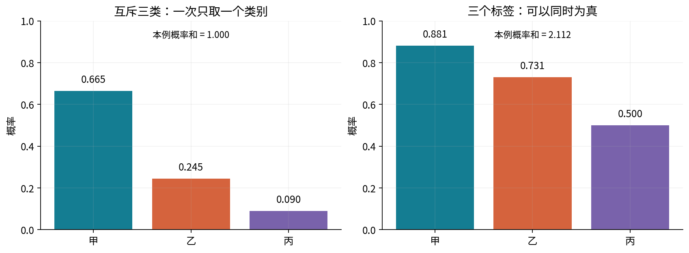
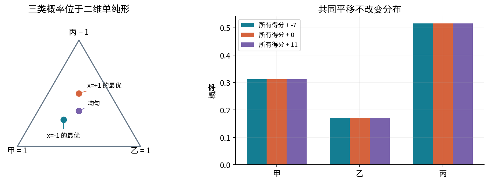
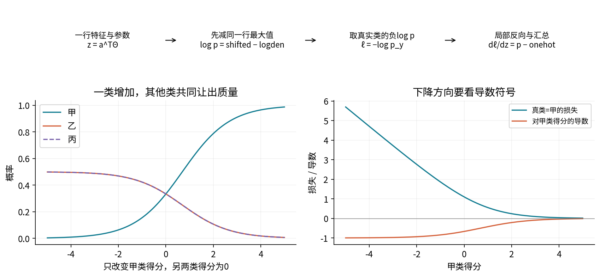
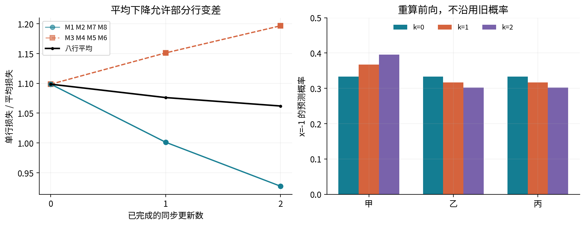
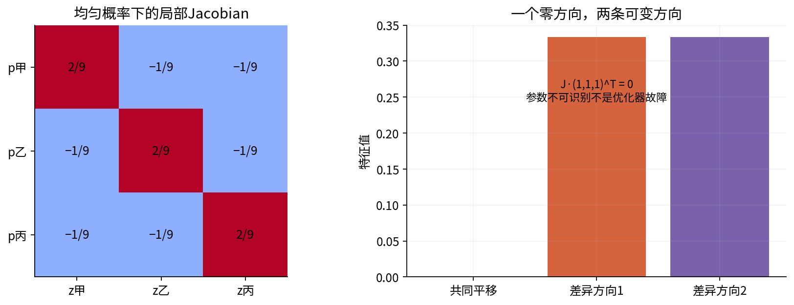
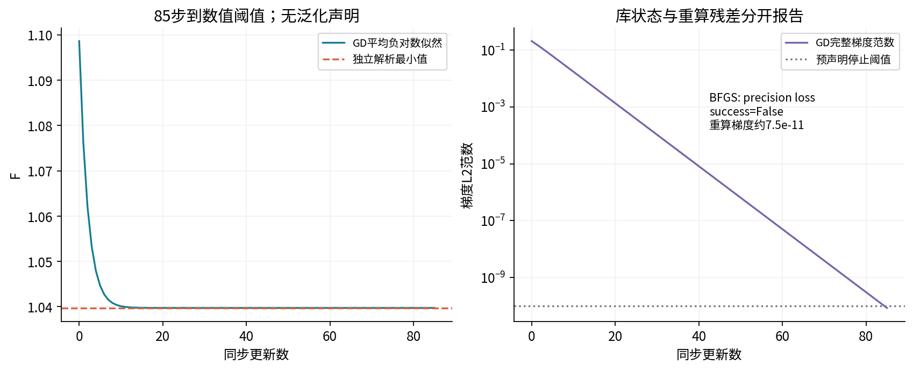
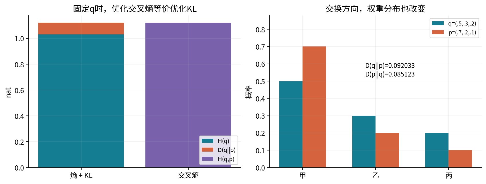
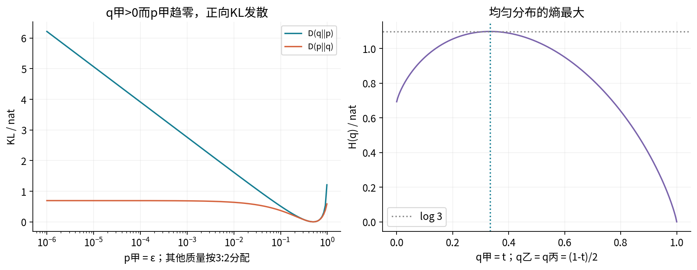
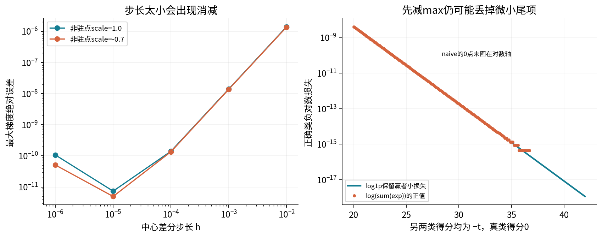

# 第043讲 多分类与信息论损失

## 1 本讲解决什么问题

第042讲把一个实数得分变成二分类概率。如果一次观察恰好属于甲、乙、丙之一，三个概率就必须共同分配同一份总量。我们需要同时回答：怎样归一化、怎样由标签形成似然、怎样把误差传给每一类的参数，以及损失为什么与熵和KL有关。

直接先修为018至019、023、039、042。读者应能解释条件概率、期望、似然与负对数，认得向量的每个分量，并完成042的一次批量更新。偏导和矩阵链若不熟，可回看014。本讲会把局部求导重新展开，不把矩阵公式当作先修记忆题。

先完成三类纸笔计算，再运行八行原创数据，最后用有限最优点和高精度参照检查实现。这里的“独立参照”指另一条可检查的计算路线；它不同于使用未见数据评价泛化。本讲全部数据是教学机制例，不含现实个人记录，也不据此宣称真实任务性能。

## 2 互斥多类与多标签先分清

互斥多分类中，每行只有一个标签。例如我们先定义三种互不重叠的人工图形类别，标签编码0、1、2只是类别名字，不表示大小关系。标签为2不意味着它比0“大两倍”。条件概率需要满足 $p_k\geq0$ 且 $\sum_{k=0}^{K-1}p_k=1$。

多标签则允许一张图同时有“圆形”“红色”“带文字”。这三个事件不互斥，边缘概率通常不需要相加为1。对每个标签分别使用Bernoulli模型是一种建模选择；把三个Bernoulli似然相乘还额外采用了给定输入后的条件独立分解，并非所有多标签依赖都被表达。

读图问题：如果允许一行同时具有甲、丙两个标签，左侧“只分一份概率质量”的解释还适用吗？反过来，把三个sigmoid再除以其和，是否仍在优化原来的Bernoulli似然？答案是否定的，输出规则与训练目标都要重新说明。

## 3 由得分到softmax

设一行有d个实数特征，扩展行向量为 $a^\top=(1,x_1,\ldots,x_d)$。参数矩阵 $\Theta\in\mathbb R^{(d+1)\times K}$ 的第k列属于第k类，第0行是各类截距。得分与概率为

$$z_k=a^\top\theta_k,\qquad p_k=\frac{e^{z_k}}{\sum_{j=0}^{K-1}e^{z_j}}.$$

指数保证每项正，除以同一个分母保证总和为1。数学上有限得分给严格正的概率；浮点数可能把极小概率舍成0，后文会把这两件事分开。softmax输出不是“挑出最大项”的硬选择，所有类一般都有正概率。

先做不涉及训练的例子：$z=(\log2,0,\log3)$，则指数为(2,1,3)，分母6，概率为(1/3,1/6,1/2)。若真实类是乙，即y=1，单行负对数损失是 $-\log(1/6)=\log6$。先写清类别列顺序，才能取对真实类的概率。

## 4 共同平移与参数不唯一

对同一行三个得分同时加c，分子分母都乘 $e^c$，约去后概率不变。因而概率只反映类与类的得分差。取任意两类k和r，有

$$\log\frac{p_k}{p_r}=z_k-z_r=a^\top(\theta_k-\theta_r).$$

若给所有参数列同时加一个向量v，每行得分共同增加 $a^\top v$，所有预测仍不变。因此不加约束的K列参数没有唯一表示。可以把最后一类参数固定为0作为参照类，或令每个参数行的K列和为0。本讲主GD从零开始，梯度的每个参数行理论和为0，所以保持零和表示；浮点末位可能有微小偏差。

参数相差一个共同向量不等于预测算法不同。与库对照时，要先对齐表示，或先比较概率、得分差与目标，不能直接把两套原系数相减后宣布错误。参照类为0与零和表示只改变坐标；若再加惩罚，必须检查惩罚是否也按同一统计目标转换。

读图问题：为什么三类概率只能在二维三角形里变化？把所有截距加1000会让模型更“自信”吗？共同平移不会，而只放大类间差异一般会。

## 5 Categorical似然怎样形成交叉熵

定义one-hot向量 $t_k=\mathbf1\{y=k\}$。一行只观察到一个类别，Categorical概率质量可以写成 $\prod_k p_k^{t_k}$。在给定所有输入X后假设各行标签条件独立，样本似然是各行概率质量相乘。负对数把乘法变加法，除以n得到平均目标

$$F(\Theta)=-\frac1n\sum_i\sum_k t_{ik}\log p_{ik}=-\frac1n\sum_i\log p_{i,y_i}.$$

这就是one-hot目标的交叉熵。这里不再加 $\log(n!)$：每一行的输入可能不同，观察是有行身份的独立Categorical结果。若把相同条件下的观察合并成类别计数，用Multinomial描述计数，出现的组合系数与参数无关，在拟合时才可以说明后省略。

同一正确类别，预测概率0.9的损失小于0.6；但若模型自信地给错误类别0.99，就会把真实类概率压得很低并承担较大损失。准确率只看最大概率类别，交叉熵还检查分给真实答案的概率大小，两者不能互相代替。

## 6 稳定计算必须沿正确的轴

一批得分Z有n行K列。每行先减自己的最大值 $m_i=\max_k z_{ik}$。于是

$$\log p_{ik}=(z_{ik}-m_i)-\log\sum_j e^{z_{ij}-m_i}.$$

减去最大值后指数的输入不大于0，避免巨大正指数溢出。必须沿类别轴逐行归一化；把整个n×K矩阵当一个向量，会让全表总和为1，却使一行概率和不为1。某些库默认axis=None，必须明确传axis=1。

还有一个细节：如果得分为(0,−40,−40)，普通计算 $\log(1+2e^{-40})$ 可能先把括号舍入到1，给正确类损失0。代码选择一项最大指数1，将它移出和，再用log1p计算 $\log(1+s)$，其中s是其余指数之和，保留可表示的小正损失。这不改变目标，只改代数求值顺序。

不要先计算可能下溢为0的概率再取log。比如(1000,0,−1000)的第三类log概率约为−2000，仍是有限可表示的数；概率本身可能下溢为0。也不要悄悄把p裁到epsilon：裁剪是一种不同数值规则，会改变损失以及在边界处的导数。

## 7 把局部导数逐条接起来

记 $S=\sum_j e^{z_j}$。商法则给同类导数

$$\frac{\partial p_k}{\partial z_k}=\frac{e^{z_k}S-e^{2z_k}}{S^2}=p_k(1-p_k),$$

异类导数为 $\partial p_k/\partial z_j=-p_kp_j$，因为分子不随 $z_j$ 变，分母会变。合起来的Jacobian为 $J_p=\operatorname{diag}(p)-pp^\top$。矩阵第k行第j列表示“第j类得分变化怎样影响第k类概率”，不要把行列反过来。

一行损失 $\ell=-\log p_y$ 只对真实类概率有导数：$\partial\ell/\partial p_y=-1/p_y$，其他分量为0。接上Jacobian：若j=y，结果为 $-(1-p_y)=p_y-1$；若j不等于y，结果为 $p_j$。故

$$\delta=\frac{\partial\ell}{\partial z}=p-t,\qquad \frac{\partial F}{\partial\Theta}=\frac1n\sum_i a_i\delta_i^\top=\frac1n A^\top(P-T).$$

形状检查：$a_i$为(d+1)×1，$\delta_i^\top$为1×K，外积为(d+1)×K。不能逐元素乘两个不同形状的数组靠广播猜答案。每一行贡献含1/n，最后求和；或者先求和再除n，两者只能选一种，不能漏除或除两次。

极端情况下 $-1/p_y$ 可能超出浮点范围。代码用已经化简的导数，不实际相乘一个无穷局部导数与零Jacobian。为保留胜出真实类的小梯度，它把真实类分量写成负的其他类概率之和。Notebook把不可表示的局部导数记为null，并保留稳定导数，绝不把null当成数学上的0。

## 8 八行主例的第一轮旧前向

本讲用同一组八行贯穿全部手算。只有一个特征x，所有数据固定，不再做缩放；类别顺序甲、乙、丙对应0、1、2。参数两行为b和w，各有三个分量。令初始参数全0，学习率 $\eta=3/5$，没有正则项。

|行|x|y|初始真实类概率|初始得分梯度 $\delta$|
|---|---:|---:|---:|---|
|M1|−1|0|1/3|(−2,1,1)/3|
|M2|−1|0|1/3|(−2,1,1)/3|
|M3|−1|1|1/3|(1,−2,1)/3|
|M4|−1|2|1/3|(1,1,−2)/3|
|M5|1|0|1/3|(−2,1,1)/3|
|M6|1|1|1/3|(1,−2,1)/3|
|M7|1|2|1/3|(1,1,−2)/3|
|M8|1|2|1/3|(1,1,−2)/3|

全部旧logit为(0,0,0)，概率为(1/3,1/3,1/3)，每行损失log3，平均贡献log3/8。局部损失导数是真实类位置的−3；共同Jacobian对角2/9，非对角−1/9。二者相乘恰好给表中 $\delta$。

每行截距贡献为 $\delta/8$，斜率贡献为 $x\delta/8$。例如M1分别为(−2,1,1)/24与(2,−1,−1)/24；M5截距相同，斜率符号相反。将八行分别相加得到

$$g_b^0=(-1/24,1/12,-1/24),\qquad g_w^0=(1/8,0,-1/8).$$

截距梯度也可以由类别频率核验：三类频率是(3/8,1/4,3/8)，用(1/3,1/3,1/3)减它即得 $g_b^0$。同步更新所有参数得到

$$b^1=(1/40,-1/20,1/40),\qquad w^1=(-3/40,0,3/40).$$

“同步”意味着先让所有行用同一旧参数贡献梯度，再一次更新。逐行更新后再算下一行是另一种优化轨迹，不是本讲的full-batch手算。

## 9 第一次新前向与第二次梯度

在x=−1处，新得分为(0.1,−0.05,−0.05)；x=1处为(−0.05,−0.05,0.1)。记

$$A=\frac{e^{0.15}}{e^{0.15}+2}\approx0.367455772041282,\quad B=\frac1{e^{0.15}+2}\approx0.316272113979359.$$

所以前四行概率(A,B,B)，后四行概率(B,B,A)，且A+2B=1。下面的 $\delta$ 要再分别除8形成截距贡献、乘x/8形成斜率贡献，每一行都参与汇总。

|行|真实类概率|单行损失|$\delta_0$|$\delta_1$|$\delta_2$|
|---|---:|---:|---:|---:|---:|
|M1|A|1.001152316|−0.632544228|0.316272114|0.316272114|
|M2|A|1.001152316|−0.632544228|0.316272114|0.316272114|
|M3|B|1.151152316|0.367455772|−0.683727886|0.316272114|
|M4|B|1.151152316|0.367455772|0.316272114|−0.683727886|
|M5|B|1.151152316|−0.683727886|0.316272114|0.367455772|
|M6|B|1.151152316|0.316272114|−0.683727886|0.367455772|
|M7|A|1.001152316|0.316272114|0.316272114|−0.632544228|
|M8|A|1.001152316|0.316272114|0.316272114|−0.632544228|

每行的局部损失导数仍只在y处为−1/p_y；Jacobian用当前p重新构造，不能沿用初始的2/9和−1/9。比如M1的第一Jacobian行为 $(A(1-A),-AB,-AB)$，乘−1/A得 $(A-1,B,B)$，与表一致。

八行中四行真实类概率A、四行B，因此 $F_1=-(\log A+\log B)/2\approx1.076152315758658$。汇总可化简为

$$g_b^1=((1-4B)/8,\ B-1/4,\ (1-4B)/8),$$

$$g_w^1=(1/8-(A-B)/2,\ 0,\ (A-B)/2-1/8).$$

数值分别为(−0.033136056990,0.066272113979,−0.033136056990)和(0.099408170969,0,−0.099408170969)。用旧 $b^1,w^1$ 同步减去0.6倍梯度，得到第二次新参数

$$b^2\approx(0.044881634194,-0.089763268388,0.044881634194),$$

$$w^2\approx(-0.134644902581,0,0.134644902581).$$

## 10 第二次更新之后再算八行

x=−1的新得分约为(0.179526536775,−0.089763268388,−0.089763268388)，x=1时首尾交换。新概率记为 $A_2\approx0.395594083530423$、$B_2\approx0.302202958234788$，分别组成 $(A_2,B_2,B_2)$ 与 $(B_2,B_2,A_2)$。

|行|新损失|$\delta_0^2$|$\delta_1^2$|$\delta_2^2$|斜率贡献|
|---|---:|---:|---:|---:|---|
|M1|0.927366635|−0.604405916|0.302202958|0.302202958|$-\delta^2/8$|
|M2|0.927366635|−0.604405916|0.302202958|0.302202958|$-\delta^2/8$|
|M3|1.196656440|0.395594084|−0.697797042|0.302202958|$-\delta^2/8$|
|M4|1.196656440|0.395594084|0.302202958|−0.697797042|$-\delta^2/8$|
|M5|1.196656440|−0.697797042|0.302202958|0.395594084|$\delta^2/8$|
|M6|1.196656440|0.302202958|−0.697797042|0.395594084|$\delta^2/8$|
|M7|0.927366635|0.302202958|0.302202958|−0.604405916|$\delta^2/8$|
|M8|0.927366635|0.302202958|0.302202958|−0.604405916|$\delta^2/8$|

截距贡献始终为 $\delta^2/8$，各行平均损失贡献为表中损失/8。此时 $F_2\approx1.062011537613334$；总截距梯度约为(−0.026101479117,0.052202958235,−0.026101479117)，总斜率梯度约为(0.078304437352,0,−0.078304437352)。它们还不是0，不能把两次教学更新称为已经拟合完毕。

详解按八行给出第二状态的全部数值平均梯度，Notebook则保留三个状态的全部局部矩阵和行外积。文本表中小数只是显示近似；指数和对数产生的数不能因为打印了九位，就当成精确的九位有理数。

读图问题：如果只检查M3的一行损失，为什么会误判优化失败？如果忘了重新前向，右图会错误呈现怎样的三组柱？

## 11 曲率与零方向为何出现

单行损失对得分的Hessian也是 $J_p$。任意向量u有

$$u^\top J_pu=\sum_k p_ku_k^2-\left(\sum_kp_ku_k\right)^2\geq0,$$

右边正是按类别分布p计算的u值方差，所以非负。由线性得分的复合，负对数似然对参数也是凸函数。但 $J_p\mathbf1=0$，所有类共同变化的方向没有曲率，这正对应参数共同平移的不识别。

在均匀三类处，Jacobian对角为2/9、非对角为−1/9，特征值为0、1/3、1/3。并非出现零特征值就该给求解器随意加巨大惩罚；先检查是不是已知的冗余表示。固定参照类可以移除共同平移方向，但如果特征本身秩亏，仍可能有其他零方向。

凸性保证有限驻点是全局最小点，却不保证有限驻点存在。与042一样，完全分离数据可能让参数一直增大、损失逼近下确界。必须给当前例子单独的存在依据，不能把一次软件返回当成定理。

## 12 用计数独立找出本例最优点

在x=−1处四个标签的经验频率为 $q^-=(1/2,1/4,1/4)$；x=1处为 $q^+=(1/4,1/4,1/2)$。对任意预测分布p，每组平均负对数似然是相应的交叉熵。第15节将证明它至少为该组熵，且只有p=q时取等。

现在直接构造能同时达到这两个分布的线性得分。把每组log概率减去它的三类平均，得到零和得分 $z^-,z^+$；用 $b=(z^++z^-)/2$、$w=(z^+-z^-)/2$，因为x只取±1，两个条件都满足。整理得

$$b^*=(\log2/6,-\log2/3,\log2/6),\quad w^*=(-\log2/2,0,\log2/2).$$

所有参数有限，代回概率恰为两个经验频率。两组熵均为 $(3/2)\log2$，故最小平均损失约为1.039720770839918。这条路线没有使用GD终点，是独立证书。所有类别在每个x处都有正计数，才能得到这组有限log概率。若某组频率为0，不能直接对0取log并继续声称有限解。

概率在两个观测x处唯一；原参数因共同平移仍不唯一。零和约束与两个不同的x一起确定本例的唯一零和表示。这里只证明这八行，不能把结论推广为任意多分类设计都存在有限MLE。

## 13 数值拟合与不成功状态一起报告

从零实现的GD在预声明学习率0.6、最多600步、梯度范数阈值 $10^{-10}$ 下完成85次更新。完整保留86个前向状态，每个状态都有八行概率、损失、局部Jacobian与平均梯度贡献。最终概率与解析证书一致，误差处于声明数值容差内。

第二条数值路线把最后一类参数固定为0，用SciPy BFGS拟合同一平均目标，再转换成零和表示。实际返回success=False，消息为“Desired error not necessarily achieved due to precision loss.”，共16次迭代。重算完整梯度范数约 $7.52\times10^{-11}$，参数和概率接近解析证书。我们保留失败状态和这一独立残差，不把它改名成库成功，也不事后放宽库停止标准以制造漂亮记录。

训练预测对x=−1选甲，对x=1选丙，八行只对四行，训练准确率1/2；乙类在所有训练行都不是最大概率类。这个结果不是代码错误，经验频率本来就重叠。它也提醒我们，概率拟合、最大概率分类与每类召回回答不同问题。后续046会系统学习分类指标。

## 14 熵是什么以及单位为何重要

若离散随机结果按q发生，事件k的信息量定义为 $-\log q_k$，稀有事件的信息量更大。熵是它的期望：

$$H(q)=-\sum_k q_k\log q_k.$$

我们全讲使用自然对数，单位是nat。改用以2为底的对数，所有熵、交叉熵、KL都除以log2，单位为bit；最优概率不变，但损失和梯度整体缩放，若学习率不相应变化，迭代轨迹会变。

约定 $0\log0=0$ 来自极限 $u\log u\to0$。这不是把log0定义为0，而是该加权项的连续延拓。确定性分布如(1,0,0)熵为0；三类均匀分布熵为log3。熵描述分布的不确定性，不是模型是否正确的评分：一个极自信但错误的模型自身熵很低。

本例两组经验分布熵为1.5log2，解释了最小平均损失为什么不为0。虽然每一条记录的one-hot标签熵为0，但同一x出现冲突答案，单个预测函数必须给这些行共享同一个分布，无法逐行随意指定概率1。

## 15 交叉熵与KL的恒等式

假设真实抽样分布为q，预测分布为p，并且对所有 $q_k>0$ 都有 $p_k>0$。按q抽样，却用p评估信息量，其期望为交叉熵

$$H(q,p)=-\sum_kq_k\log p_k.$$

KL散度定义为

$$D_{\mathrm{KL}}(q\Vert p)=\sum_{k:q_k>0}q_k\log\frac{q_k}{p_k}.$$

把对数比拆成logq−logp，得到 $D(q\Vert p)=H(q,p)-H(q)$。因此q固定时，优化交叉熵与优化正向KL只差一个与模型参数无关的常数。若q也随参数变化，这个“常数”论证就不成立，不能机械丢掉H(q)。

取 $q=(0.5,0.3,0.2)$、$p=(0.7,0.2,0.1)$：H(q)约1.029653014，交叉熵约1.121685864，KL约0.092032850。注意期望权重是q，不是p。交换顺序后，既改变对数比也改变各类别权重。

## 16 不省略支持集的非负性证明

先证明 $\log t\leq t-1$ 对t>0成立。令 $f(t)=t-1-\log t$，导数 $1-1/t$ 在t<1时负、t>1时正，故t=1是全局最小值且值0。这也是严谨的证明链，不只是画图看到曲线在上方。

令S为q正概率的类别集合。若S中有 $p_k=0$，对应KL为正无穷，非负性立即成立。否则逐项使用不等式：

$$-D(q\Vert p)=\sum_{k\in S}q_k\log\frac{p_k}{q_k}
\leq\sum_{k\in S}(p_k-q_k)=\sum_{k\in S}p_k-1\leq0.$$

所以KL非负。等号要求每个S中的 $p_k/q_k=1$，而且p在S外没有额外质量，因此q=p。这里特意保留 $\sum_{S}p_k\leq1$，不能在q含零项时无理由把它写成必然等于1。

若p取K类均匀分布u，$D(q\Vert u)=\log K-H(q)\geq0$，于是熵最多logK，只有均匀分布达到。取p=q则交叉熵最小为H(q)，这也补齐第12节的解析最优证书。

## 17 非对称性与零概率的后果

在上一节例子中，$D(q\Vert p)\approx0.092032850$，而 $D(p\Vert q)\approx0.085122826$。KL通常不对称，也不满足一般距离的三角不等式，因此称为“散度”更准确。我们不需要把它包装成几何距离，才能用它比较模型分布。

若 $q=(1,0,0)$ 而 $p=(0,1/2,1/2)$，事件甲真实必发生，模型却给0概率，交叉熵和正向KL均为正无穷。程序输出null加明确的infinite标记，而不是把JSON写成非标准Infinity，也不会把0裁到epsilon后假装得到原始KL。

当q的某项为0，q加权的该项记0，不能计算0乘log0得到NaN后再用nanmean偷偷忽略。正向和反向对零支持的反应不同；有限KL也不保证所有现实上重要但q没有覆盖的事件都处理正确。经验分布没观察到某类别，不等于真实总体概率就是0。

读图问题：p甲精确为0时，左图正向曲线该填哪个有限值？不能填有限值；图只画正epsilon，边界要用“正无穷”单独说明。

## 18 软目标与多余的softmax

若目标是一条固定分布q而非one-hot，单行交叉熵为 $-\sum_k q_k\log p_k$。只要q非负且和为1，局部推导给 $\partial\ell/\partial z_j=p_j-q_j$。如果错误地把未归一化权重q直接代入，则导数变成 $p_j\sum_kq_k-q_j$，不再是p−q。

标签平滑是把one-hot改成某个非退化分布，例如 $(1-\varepsilon)t+\varepsilon u$。它改变目标和统计解释，不能把改后的训练损失直接与原one-hot损失当同一指标比较；测试时也要明确使用哪个评分。本讲只推这个关系，不把标签平滑效果当作已实验验证的结论。

还有常见错误：损失接口本来接受原始logits，却先手动softmax，再把概率当作新logits传进去。实际变成softmax(p)，再次压缩类间差异，目标与梯度都变了。阅读API时必须分清接口要得分、log概率还是概率，不能只看名字里都有“交叉熵”。

## 19 怎样逐层核验实现

先用精确Fraction验证初始梯度和第一次同步更新。再用独立Decimal指数和对数核验完整GD路径的86个状态、每行概率、损失、局部Jacobian和平均梯度。它没有调用核心softmax来当自己的真值。

在两个非驻点做多个步长的中心差分，检查六个参数方向；只在最优点检查零梯度不够。另检查非方阵、单样本、2至7类实例、类别排列等价、概率行和、共同平移和Jacobian零方向。普通范围与SciPy softmax、log_softmax、entropy交叉核对；极端尾项另用1000位Decimal，避免仅以宽松绝对容差把错误0当正确的小数。

代码明确接受有限教学范围：原始X和参数绝对值不超过100，非零原始数至少 $10^{-100}$；n为1至2000、d为1至20、K为2至20。独立softmax入口得分范围为±10000。内部合法迭代不重新套初始参数盒。概率函数要求输入本来就是分布，仅对不超过 $10^{-12}$ 的求和舍入作显式归一化。极接近相等的KL可能有舍入误差，不能把接近机器精度的小差异解释为统计证据。

保护逻辑使用显式异常，python -O不会取消。坏末行、重复ID、重复JSON键、bool伪数字、非有限值都在开始拟合前拒绝。零预算、短预算、初始驻点、首步被拒绝分别记录；不存在第二轮就写null。故障前已尝试的前向算入成本，成本数字不冒充FLOPs或墙钟。

## 20 练习与下一步

1. 给一个互斥三类任务和一个多标签任务，说明样本单位与类别事件。
2. 手算(log2,0,log3)的softmax、三个真实类别各自的损失。
3. 证明共同平移不变性，推两类log概率比和参照类变换。
4. 从条件独立Categorical模型推平均损失，说明为何不随意加入组合系数。
5. 从商法则推Jacobian，再逐分量接上损失导数，得到p−t。
6. 完整重算初始八行梯度、第一次同步更新与新前向。
7. 从A、B表达式推第二轮汇总梯度，不只复制小数。
8. 重算第二次更新后的八行损失、局部导数与全部参数梯度。
9. 用方差解释Jacobian半正定，指出共同平移零方向。
10. 用两组经验频率构造有限最优点，区分概率唯一和参数唯一。
11. 解释GD达到阈值而BFGS返回precision loss时应该怎样报告。
12. 推自然对数与二进制对数的换算，说明学习率为什么也受缩放影响。
13. 手算给定q、p的熵、交叉熵和两个方向的KL。
14. 包含零支持的情况下证明KL非负及等号条件，再推熵上界。
15. 分析真实概率为正、预测为0时的损失以及JSON表示。
16. 推软目标p−q，说明q未归一化时需要改哪一项。
17. 复现错误轴、先取log概率和重复softmax三个错误。
18. 设计能够区分科学错误、数值错误、控制流错误的验收清单。

接下来的044把这些模型放进广义线性模型语言，045则从概率走向代价敏感决策。学会本讲不意味着所有多分类任务都适合线性得分，也不意味着训练交叉熵低就已校准；这些假设都要在新的数据与评价流程里继续检验。

## 一手来源与阅读范围

- Stanford CS229原课程讲义3.2.3节，印刷页30至34，核对互斥类别概率、参照类表示与softmax似然。八行数据、两轮账本与有限最优点推导为本讲原创。[课程讲义](https://cs229.stanford.edu/notes2022fall/main_notes.pdf)
- SciPy 1.17.0官方softmax与log_softmax文档，核对类别轴、平移稳定性和直接log概率接口。微小赢者尾项的本讲实现另以高精度核验，不声称与所有库尾项逐bit相同。[softmax](https://docs.scipy.org/doc/scipy-1.17.0/reference/generated/scipy.special.softmax.html)；[log_softmax](https://docs.scipy.org/doc/scipy-1.17.0/reference/generated/scipy.special.log_softmax.html)
- SciPy 1.17.0 entropy文档，核对熵、相对熵、对数底与输入归一化约定；本讲分布入口的严格范围与该库接受任意非负权重的默认行为不同。[entropy](https://docs.scipy.org/doc/scipy-1.17.0/reference/generated/scipy.stats.entropy.html)
- MIT 6.441原课程Lecture 2，核对Jensen、熵的凹性与均匀分布最大熵；本讲使用log不等式自行证明KL非负，没有据此宣称实现互信息、数据处理不等式或Fano界。[课程原讲义](https://ocw.mit.edu/courses/6-441-information-theory-spring-2010/5c0b5a8a544cb2320778e4c9e5dea64f_MIT6_441S10_lec02.pdf)
