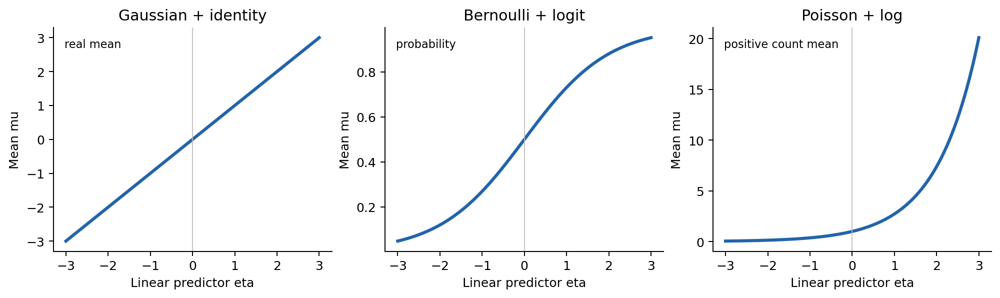
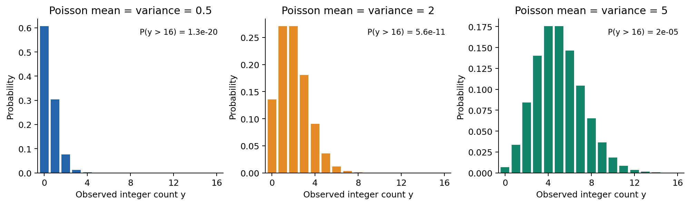
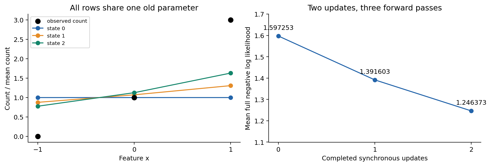
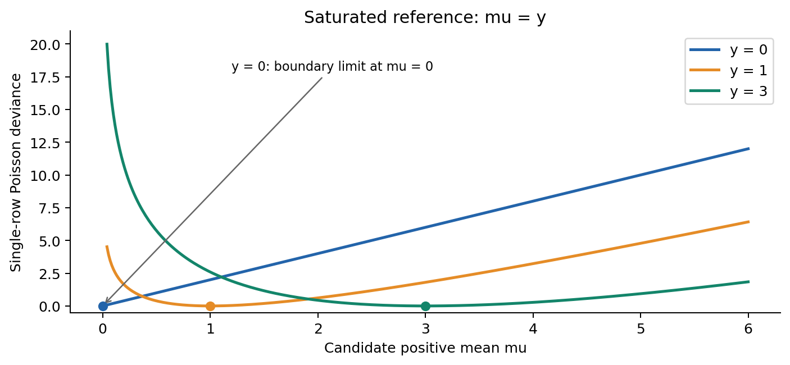
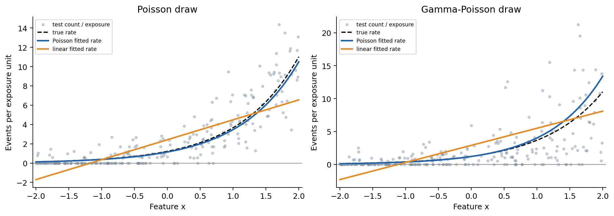
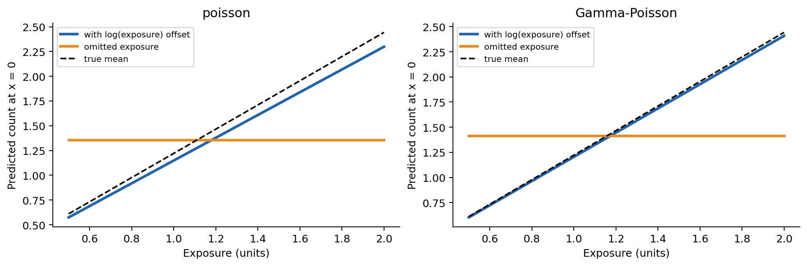
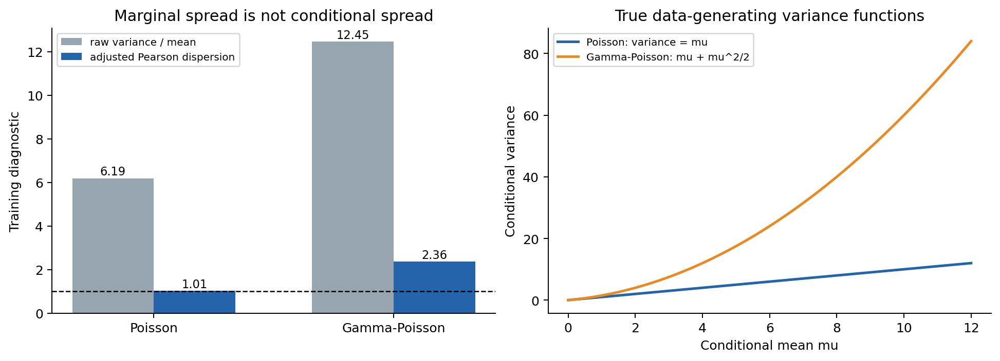
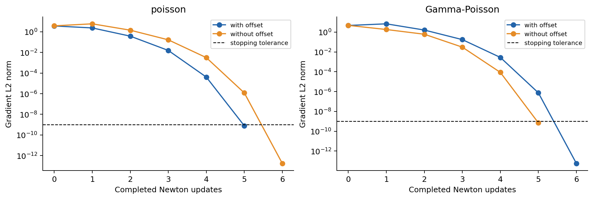

# 第044讲 广义线性模型

如果目标是“一段时间内发生多少次”，预测值应该怎样取值，随机波动又应该怎样描述？本讲保留线性模型中清楚的参数结构，用合适的响应分布与均值变换连接二分类、连续测量和计数。主线是从三个计数观测出发，推导Poisson回归的似然，完整算两轮更新，再用固定模拟实验检查曝光量与过度离散。

直接先修：020常见分布与建模假设、023似然与最大似然估计、029多元线性回归与数值求解、042二分类与逻辑回归、043多分类与信息论损失。这里会重新解释新符号，不要求预先学过广义线性模型。正文、实验、详解相互配套，图和数据均为原创合成材料。

学完应能回答三类问题：模型允许哪些观测；特征怎样决定条件均值；观察到偏差后，怎样区分均值错、方差错和数值优化没完成。一个漂亮的拟合曲线不能独自回答这三类问题。

## 1 从观测任务开始

设每行是一台设备在一个观察时段中的记录。$x_i$ 是事前可见的无量纲工作强度，$e_i>0$ 是观察时长，$y_i$ 是该时段的事件次数。下标 $i$ 只是行号。这里的事件可以是普通机器提醒；数据并不来自真实设备。

次数可以是0、1、2，却不可能是负数或0.6次。预测的条件期望可以是0.6：很多次相同条件观察的平均次数可以不是整数。把均值四舍五入成整数会丢失信息，也不是最大似然拟合的一部分。

如果把所有次数当作“类别0、类别1、类别2”，就忽略了计数的数值结构，且难以给训练时未出现的大计数分配概率。只有任务本来要求某些互斥档位时，分类才是另一种合理任务定义。本讲预测原始次数的分布与均值，不先改标签。

## 2 广义线性模型有三个部分

先写三条不同的约定。

1. 随机部分说明给定特征后，$Y_i$ 来自什么分布。
2. 线性预测子是 $\eta_i=\boldsymbol{x}_i^\top\beta$，其中 $\boldsymbol{x}_i=(1,x_i)^\top$，$\beta=(b,w)^\top$。开头的1负责截距。
3. 链接函数把条件均值 $\mu_i=E(Y_i\mid x_i)$ 送到线性预测子：$g(\mu_i)=\eta_i$。实际预测使用反函数 $h=g^{-1}$，所以 $\mu_i=h(\eta_i)$。

“线性”指参数在 $\eta$ 中线性出现，不要求 $\mu$ 对 $x$ 是直线。也可以预先构造 $x^2$ 等特征，但是否需要这些特征属于另一个模型选择问题。链接函数只连接均值，不提供完整的概率分布。

读图问题：在 $\eta=0$ 处，三个均值各是多少？哪一幅的输出能作为概率，哪一幅允许大于1？注意sigmoid是logit的反函数；指数是log链接的反函数，不能把两个方向都叫“链接”。

## 3 用指数族把常见分布放到同一个框架

第020讲见过指数族。对本讲的标量响应，使用下式的指数离散族写法：

$$p(y;\theta,\phi)=\exp\left\{\frac{y\theta-A(\theta)}{a(\phi)}+c(y,\phi)\right\}.$$

$p$ 对离散变量是概率质量，对连续变量是密度。$\theta$ 是自然参数，$A$ 是对数配分函数，负责归一化；$a(\phi)>0$ 控制离散尺度，$c$ 收集其余项。不要把自然参数 $\theta$ 与回归系数向量 $\beta$ 混为一谈。只有选用规范链接时，自然参数才等于线性预测子。

“指数族”并不等于“指数分布”。前者是一种表达结构，后者只是特定的正连续分布。此处也不声称所有概率分布都能写成上述单参数形式。上一讲Categorical使用向量自然参数，softmax的归一化结构与这里有联系，但不是把三类标签当一个Poisson计数。

|响应模型|观测支持集|自然参数 $\theta$|$A(\theta)$|
|---|---|---|---|
|Gaussian，已知方差 $\sigma^2$|实数|$\mu$|$\theta^2/2$|
|Bernoulli|$\{0,1\}$|$\log[\mu/(1-\mu)]$|$\log(1+e^\theta)$|
|Poisson|非负整数|$\log\mu$|$e^\theta$|

Gaussian的 $a=\sigma^2$，$c=-y^2/(2\sigma^2)-\frac12\log(2\pi\sigma^2)$；Bernoulli的 $a=1,c=0$；Poisson的 $a=1,c=-\log(y!)$。把每行代回通式，就能恢复各自熟悉的质量或密度函数。这是可检查的代数，不是仅凭分布名称分类。[1]

## 4 均值和方差从哪里来

假设支持集不随 $\theta$ 改变，且可以交换求导与求和或积分。因为概率总和为1，对其求导得0。对上式求对数导数：

$$\frac{\partial\log p}{\partial\theta}=\frac{y-A'(\theta)}{a(\phi)}.$$

对它取期望，利用 $\partial p/\partial\theta=p\,\partial\log p/\partial\theta$，得到 $E(Y)-A'(\theta)=0$。因此

$$\mu=A'(\theta).$$

再对均值求导。把 $E[Y(Y-\mu)]$ 展开为 $E(Y^2)-\mu^2$，可得 $d\mu/d\theta=\operatorname{Var}(Y)/a(\phi)$。于是

$$\operatorname{Var}(Y)=a(\phi)A''(\theta).$$

这一步说明，分布选择同时带来均值与方差的约束。Gaussian给 $\operatorname{Var}(Y)=\sigma^2$；Bernoulli给 $\mu(1-\mu)$；Poisson给 $\mu$。如果选择了Poisson随机部分，就不能再随意说每行方差都是常数。

将 $A'$ 反解，规范链接为 $g(\mu)=(A')^{-1}(\mu)$。Poisson得到log，Bernoulli得到logit，Gaussian得到恒等函数。一般GLM也允许其他合适链接；例如更换链接不会自动更换分布支持集，也不保证任意链接与任意分布都能在全部参数空间配合使用。

## 5 Poisson分布究竟假设了什么

设给定 $x_i,e_i$ 后各行条件独立，$Y_i\sim\operatorname{Poisson}(\mu_i)$，则

$$P(Y_i=y_i\mid x_i,e_i)=e^{-\mu_i}\frac{\mu_i^{y_i}}{y_i!},\qquad y_i=0,1,2,\ldots.$$

有限log预测子下 $\mu_i>0$，但观察到0完全合法，因为 $P(Y_i=0)=e^{-\mu_i}$。数学上还可定义退化的 $\mu=0$ 分布，只在0有概率1；有限log链接参数不能精确达到这个边界。[2]

读图问题：均值0.5时，零次数是否最常见？均值5时，标准差是5还是 $\sqrt5$？本讲的“方差等于均值”是同一给定条件下的关系，不是要求整张表的样本均值等于样本方差。

## 6 从联合似然推到实际目标

先令曝光量均为1。用log链接：$\eta_i=b+wx_i$，$\mu_i=e^{\eta_i}$。条件独立使联合似然为各行概率的乘积，取对数后变成和：

$$\log L(\beta)=\sum_{i=1}^n[-e^{\eta_i}+y_i\eta_i-\log(y_i!)].$$

为用最小化程序，取负号，并除以样本数：

$$F(\beta)=\frac1n\sum_i\ell_i,\qquad \ell_i=e^{\eta_i}-y_i\eta_i+\log(y_i!).$$

$\log(y_i!)$ 不含参数，优化时可去掉；报告完整负对数似然时应保留。两种写法的梯度相同，数值目标不同，不能把它们画在一条曲线上却不标说明。这里始终保存完整 $\ell_i$，用 `gammaln(y+1)` 计算log阶乘，避免先求巨大阶乘。

也不能把 $\log y_i$ 当标签去做普通最小二乘：$y_i=0$ 时log不存在；即使只看正数，$E(\log Y\mid x)$ 一般不等于 $\log E(Y\mid x)$。本模型是“均值的对数线性”，不是“观测对数加正态误差”。

## 7 一条完整的局部导数链

先把每行损失写成 $\ell_i=\mu_i-y_i\log\mu_i+\log(y_i!)$。从输出往回走：

$$\frac{\partial\ell_i}{\partial\mu_i}=1-\frac{y_i}{\mu_i},\qquad
\frac{\partial\mu_i}{\partial\eta_i}=\mu_i,\qquad
\frac{\partial\eta_i}{\partial\beta}=(1,x_i)^\top.$$

前两个因子相乘得到 $\partial\ell_i/\partial\eta_i=\mu_i-y_i$，所以该行对平均目标的贡献是

$$c_i=\frac{\mu_i-y_i}{n}(1,x_i)^\top,\qquad g=\nabla F=\sum_i c_i.$$

对梯度再求导：

$$H=\nabla^2F=\frac1nX^\top\operatorname{diag}(\mu)X.$$

对任意向量 $v$，$v^\top Hv=\sum_i\mu_i(\boldsymbol{x}_i^\top v)^2/n\ge0$。因此目标凸。有限状态下 $\mu_i>0$，若设计矩阵满列秩，Hessian正定。这个结论给的是曲率与有限驻点的唯一性，不自动证明最小值一定在有限参数处达到。

## 8 第一轮从每一行开始算

三行固定数据为 $x=(-1,0,1)$，$y=(0,1,3)$，$e=(1,1,1)$。初值 $\beta^{(0)}=(0,0)$，学习率 $\alpha=1/5$。这里用 $\alpha$ 表示学习率，把 $\eta$ 留给线性预测子。两次整批梯度下降仅用于看清计算链，不用来声称已经收敛。

|行|$x_i$|$y_i$|$\eta_i$|$\mu_i$|完整 $\ell_i$|
|---|---:|---:|---:|---:|---:|
|1|-1|0|0|1|1|
|2|0|1|0|1|1|
|3|1|3|0|1|$1+\log6=2.791759469$|

$0!=1$，所以第一行的log阶乘为0。平均损失为 $F_0=1+\log6/3=1.597253156$。第一行计数0而预测1，它推动均值下降；第三行预测1而计数3，它推动均值上升。

|行|$\partial\ell/\partial\mu$|$\partial\mu/\partial\eta$|$\partial\ell/\partial\eta$|$c_b$|$c_w$|
|---|---:|---:|---:|---:|---:|
|1|1|1|1|$1/3$|$-1/3$|
|2|0|1|0|0|0|
|3|-2|1|-2|$-2/3$|$-2/3$|

预测子对参数的导数逐行分别为 $(1,-1)$、$(1,0)$、$(1,1)$。把两列贡献各自相加，$g_0=(-1/3,-1)$，$H_0=\operatorname{diag}(1,2/3)$。同步更新两个参数：

$$\beta^{(1)}=\beta^{(0)}-\frac15g_0=(1/15,1/5).$$

不要先更新 $b$，再用新 $b$ 计算 $w$ 的梯度；那会改变算法。本讲先用同一旧参数计算所有行、所有局部导数，再汇总更新。

## 9 第二轮重新前向和汇总

新参数使三行预测子为 $(-2/15,1/15,4/15)$。前向不是沿用上一轮预测值，而是重新计算指数。

|行|$\eta_i^{(1)}$|$\mu_i^{(1)}$|完整 $\ell_i^{(1)}$|
|---|---:|---:|---:|
|1|-0.133333333|0.875173319|0.875173319|
|2|0.066666667|1.068939106|1.002272439|
|3|0.266666667|1.305605172|2.297364641|

例如第三行 $\ell_3=e^{4/15}-3(4/15)+\log6$。三行平均为 $F_1=1.391603466$。第二行从完美预测1变成了略大于1，因此该行损失略增；总损失下降不要求每一行都下降。

|行|$\partial\ell/\partial\mu$|$\partial\mu/\partial\eta$|$\partial\ell/\partial\eta$|
|---|---:|---:|---:|
|1|1.000000000|0.875173319|0.875173319|
|2|0.064493015|1.068939106|0.068939106|
|3|-1.297785015|1.305605172|-1.694394828|

|行|$c_b$|$c_w$|
|---|---:|---:|
|1|0.291724440|-0.291724440|
|2|0.022979702|0|
|3|-0.564798276|-0.564798276|
|合计|-0.250094134|-0.856522716|

这次Hessian约为 $\left(\begin{smallmatrix}1.083239199&0.143477284\\0.143477284&0.726926164\end{smallmatrix}\right)$，不是第一轮那个常数矩阵。同步更新得到

$$\beta^{(2)}=(0.116685493543,\ 0.371304543132).$$

表内小数只为阅读四舍五入。程序在binary64中保留计算值，独立参考用80位Decimal从概率质量重新算，不能把打印后的小数重新作为“精确真值”。

## 10 更新之后还要有第三次前向

两次更新意味着三个参数状态。新前向与新的反向结果如下，不能把旧损失当成第二次更新后的损失。

|行|$\eta_i^{(2)}$|$\mu_i^{(2)}$|$\ell_i^{(2)}$|
|---|---:|---:|---:|
|1|-0.254619050|0.775211759|0.775211759|
|2|0.116685494|1.123765942|1.007080449|
|3|0.487990037|1.629038619|1.956827978|

|行|$\partial\ell/\partial\mu$|$\partial\ell/\partial\eta$|$c_b$|$c_w$|
|---|---:|---:|---:|---:|
|1|1.000000000|0.775211759|0.258403920|-0.258403920|
|2|0.110134983|0.123765942|0.041255314|0|
|3|-0.841576967|-1.370961381|-0.456987127|-0.456987127|

本表省略的中间导数仍为 $\partial\mu/\partial\eta=\mu$，预测子导数仍为 $(1,x_i)$。现在 $F_2=1.246373395$，$g_2=(-0.157327893,-0.715391047)$。梯度还明显非零，不能宣布训练结束。

读图问题：左图的预测均值是否必须经过每个观测点？右图显示三点，究竟做了几次更新？哪一个数值能直接反驳“已经达到驻点”？

## 11 给小例子建立独立的有限最优解

把两条得分方程 $\sum_i(\mu_i-y_i)=0$ 与 $\sum_i x_i(\mu_i-y_i)=0$ 写出。令 $t=e^w>0,a=e^b>0$，三行均值为 $(a/t,a,at)$，于是

$$a/t+a+at=4,\qquad at-a/t=3.$$

两式相除消去 $a$，得 $4(t^2-1)=3(t^2+t+1)$，即 $t^2-3t-7=0$。唯一正根与相应截距是

$$t=\frac{3+\sqrt{37}}2,\qquad a=\frac4{t+1+1/t},\qquad \beta_*=(\log a,\log t).$$

数值约为 $(-0.364917137,1.513231209)$。三行设计满列秩、有限点Hessian正定，这个驻点就是唯一全局最小点。程序的保护Newton用6次更新达到设定梯度标准并与该代数解核验。

对别的数据不能套用这条二次方程。比如带截距且所有计数都为0时，令截距趋向负无穷，所有均值趋0，负对数似然趋0，却没有有限截距最小点。混合零与正计数的某些设计也可能出现有限MLE不存在的问题。我们的通用拟合入口拒绝全零和秩亏，未实现一般存在性判别；梯度很小只能证明满足数值停止标准。

## 12 Newton与加权最小二乘的联系

模拟数据不使用两步教学梯度下降，而是用同一个目标的保护Newton。解线性方程 $H\Delta=g$，候选更新为 $\beta-\alpha\Delta$，不显式求逆。满步太大时把 $\alpha$ 依次减半，直到满足目标下降的Armijo条件。若候选预测子越过本实现支持范围，则拒绝候选，不夹断指数，也不偷换目标。

为什么常听到GLM用“迭代加权最小二乘”？令 $W=\operatorname{diag}(\mu)$，暂时没有offset，构造工作响应 $z=\eta+(y-\mu)/\mu$。这里除法逐元素进行。满步Newton的正规方程可重排为

$$X^\top W X\beta_{\mathrm{new}}=X^\top Wz.$$

每轮 $W,z$ 都由旧状态重新算，因而不是一次普通最小二乘。带offset $o=\log e$ 时，用 $z-o$ 作为右侧响应。这个联系帮助理解算法，不要求直接使用正规方程作为所有大规模问题的最佳数值方案。

## 13 Deviance衡量与饱和模型的差距

饱和模型允许每一行单独选均值，能把 $\mu_i$ 设为观测 $y_i$；零计数对应边界极限。它不是能泛化的预测器，而是似然比较的参考。Poisson的总deviance定义为

$$D=2[\log L_{\mathrm{sat}}-\log L_{\mathrm{model}}].$$

逐行减去对数似然，log阶乘抵消，得到

$$d_i=2\left[y_i\log\frac{y_i}{\mu_i}-(y_i-\mu_i)\right],\qquad D=\sum_i d_i.$$

约定 $0\log(0/\mu)=0$，所以 $y_i=0$ 时 $d_i=2\mu_i$。非负性来自 $r\log r-r+1\ge0$，当 $y_i>0$ 时取 $r=y_i/\mu_i$。每行在 $\mu_i=y_i$ 时为0；零行只在 $\mu\to0$ 的边界达到0。

本讲测试指标报告平均deviance $\bar D=D/n$，不要与总和混淆。对同一组 $y$ 比较模型时，$\bar D=2(F-F_{\mathrm{sat}})$，故按完整Poisson负对数似然和deviance排序相同。它不是负对数似然本身，也不是一般意义的对称距离。连续Gaussian等其他族的deviance有自己的形式与尺度约定，不能无说明跨族比较数字。

读图问题：$y=0,\mu=2$ 的deviance是多少？为何 $y=3,\mu\to0$ 会受到很大惩罚？deviance大能否独自说明是链接错还是分布错？

## 14 曝光量连接次数与率

观察两小时通常比观察半小时有更多机会发生事件。设单位曝光量的事件率为 $\lambda_i=\exp(b+wx_i)$，则期望次数为

$$\mu_i=e_i\lambda_i,\qquad \log\mu_i=\log e_i+b+wx_i.$$

$\log e_i$ 叫offset：它直接加入预测子，系数固定为1，不是额外需要估计的特征系数。[3] 保持 $x$ 不变，曝光量变为4倍，模型的均值就变为4倍。率与次数的单位不同，报告时必须说清楚。

加入offset后，损失仍为 $e^{\eta_i}-y_i\eta_i+\log(y_i!)$，只是 $\eta_i=\log e_i+\boldsymbol{x}_i^\top\beta$。对 $\beta$ 求导时，已知offset的导数为0，所以梯度与Hessian公式不变。如果把 $\log e$ 当普通可学习特征，就允许非1的曝光量弹性，那是另一种模型与假设。

曝光量必须在预测时已知。若把事件发生后才记录的“有效观察时间”直接用作输入，可能产生信息泄漏或选择问题。$e=0$ 时log不可用，而且单位率无法从这条记录估计；应根据采集机制处理，不能为了让程序运行给它随意加小数。

## 15 用现成库核验offset要对齐目标

scikit-learn的 `PoissonRegressor` 使用log链接，默认带正则。本讲核验指定 `alpha=0`、截距开启，不能拿默认设置与无正则目标直接比。[4]

该接口没有在本实验中使用直接offset参数。令观测率 $r_i=y_i/e_i$，以曝光量 $e_i$ 作样本权重拟合率 $\lambda_i=e^{\boldsymbol{x}_i^\top\beta}$。忽略不含参数的项，库的加权率目标为

$$F_{\mathrm{rate}}=\frac1{\sum_i e_i}\sum_i[e_i\lambda_i-y_i\log\lambda_i].$$

计数目标中与参数有关的部分为 $\sum_i[e_i\lambda_i-y_i\log\lambda_i]/n$。两者仅差正比例因子及与参数无关项，因此无正则最优解相同。梯度满足 $g_{\mathrm{rate}}=n g_{\mathrm{count}}/\sum e_i$。分数率在这里是加权目标的等价实现，不是声称分数次数服从Poisson。[5]

若加正则却不相应调整尺度，等价关系会改变。若用率而不加曝光权重，也改变了目标：观察十分钟与观察十小时不应仅因都形成一行就被当作相同曝光信息。单位变换同样可核验：把 $e$ 乘4，截距减 $\log4$，预测次数应完全不变。

## 16 在固定模拟中比较模型

实验协议在生成数据前固定：随机种子4402026，总560行，前320行训练，后240行测试；$x\sim U[-2,2)$，$e\sim U[0.5,2)$，真率 $\exp(0.2+1.1x)$。所有行独立抽样。训练只用 $x,e,y$；CSV中的真均值只用来画已知生成曲线，绝不作为特征。

三种模型全部保留：带offset的Poisson；故意遗漏曝光量的Poisson；曝光量校正的线性均值 $\widehat\mu=e(b+wx)$。最后一种通过设计矩阵 $eX$ 对计数 $y$ 做最小二乘，因此也知道曝光量，不是故意让它缺失重要输入。它仍可能给负率，且这里的真实均值恰好是指数形式，实验有明确适用范围。

各模型都无正则，无超参数搜索。比较计数MSE、计数MAE、非正预测数；只有所有预测为正时报告平均Poisson deviance。不剔除线性模型的失败行，也不悄悄把负预测夹到极小正数。

|Poisson情景的240行测试|MSE|MAE|非正数|平均deviance|
|---|---:|---:|---:|---:|
|Poisson加offset|3.758404|1.230790|0|1.024050|
|Poisson不加offset|6.664465|1.596301|0|1.438487|
|曝光校正线性|6.857005|1.783257|53|未定义|

带offset估计 $\hat\beta=(0.138831,1.106202)$；线性率估计为 $2.421065+2.064828x$。真参数 $(0.2,1.1)$ 不会因模型正确就被有限样本精确恢复。此表说明这一固定生成机制与这一次样本中的结果，不证明Poisson在所有计数任务上优于线性模型。

读图问题：预测率不是整数是否合理？橙线在哪段特征区间给负率？右图较大的散点波动能否仅靠把学习率减小来消除？

读图问题：从曝光量0.5到2，蓝线的预测次数倍数是多少？如果只看 $x=0$、曝光量恰好约为平均值的一行，可能看不出遗漏曝光量的问题吗？

## 17 过度离散先问条件是否相同

即使每行都真服从Poisson，整张表的原始方差也可能远大于原始均值。全方差公式给出

$$\operatorname{Var}(Y)=E[\operatorname{Var}(Y\mid X,e)]+\operatorname{Var}[E(Y\mid X,e)]
=E(\mu)+\operatorname{Var}(\mu).$$

不同工作强度、不同曝光量本来就有不同均值。Poisson情景训练集的原始均值约2.81875，原始样本方差约17.43413，这并不推翻条件Poisson。

应在均值模型后看标准化残差。Pearson残差为 $r_i=(y_i-\hat\mu_i)/\sqrt{\hat\mu_i}$，常见诊断是

$$\widehat\phi_P=\frac1{n-p}\sum_i\frac{(y_i-\hat\mu_i)^2}{\hat\mu_i},$$

其中 $p=2$ 包括截距。均值形式与独立性合适且样本信息充足时，它通常在1附近，但这不是小样本下精确等于1的定理，也不是不附条件的显著性检验。均值漏项、依赖、异常记录和计数分布错误都可能使它变大。此诊断只用训练集，未用它回头修改本次拟合或挑选测试结果。[6]

## 18 制造一个可解释的过度离散机制

保留相同 $x,e,\mu$，每行再独立抽一个不可观察的乘子 $U$，令 $E(U)=1,\operatorname{Var}(U)=1/k$。具体取Gamma形状 $k=2$、尺度 $1/2$，然后抽 $Y\mid U,x,e\sim\operatorname{Poisson}(\mu U)$。

用全期望公式，$E(Y\mid x,e)=\mu$。再用全方差公式：

$$\operatorname{Var}(Y\mid x,e)=E(\mu U\mid x,e)+\operatorname{Var}(\mu U\mid x,e)
=\mu+\mu^2/k.$$

这是Gamma-Poisson混合，也对应NB2型负二项均值方差关系。[7] 隐藏异质性增加了随机波动，均值公式仍相同。带offset的Poisson得分仍可作为均值估计方程，但完整Poisson分布不再正确；在常规条件下可能仍估到均值关系，不能因此继续相信Poisson方差、标准误或尾部概率。

|Gamma-Poisson情景的240行测试|MSE|MAE|非正数|平均deviance|
|---|---:|---:|---:|---:|
|Poisson加offset|17.081238|2.307596|0|2.847883|
|Poisson不加offset|18.372715|2.538912|0|3.210548|
|曝光校正线性|17.490457|2.931473|56|未定义|

这一次线性与Poisson的计数MSE已相当接近，比第一情景的差距小。不能把过度离散情景藏起来，只展示最有利的第一张表。训练Pearson离散度在Poisson情景约1.013523，在混合情景约2.355146。

读图问题：为何左图Poisson的灰柱也远大于1？为何混合模型在均值越大时增加的方差越显著？观察到离散度2.36能否唯一断言数据来自负二项分布？

现实中下一步可能是补充合理均值特征、核查重复测量、用适当稳健推断，或在有理论支持时使用负二项、准似然或其他计数机制。准Poisson通常只指定均值方差关系，不是自动得到完整概率质量函数。本讲不在测试集上选这些扩展，也不实现完整推断区间。

## 19 数值核验和模型诊断各负责什么

`audit.py` 通过三种独立路径核验：用80位Decimal逐行从概率质量重算三个手算状态；用上文二次方程提供有限最优解；用SciPy Poisson质量函数、sklearn deviance与真正的 `PoissonRegressor` 拟合交叉比较。还在三个非驻点、三个差分步长上核验梯度与Hessian，并检查offset单位变换不变性。

读图问题：梯度范数跨过虚线说明哪一个数值条件成立？它能否证明Poisson条件方差假设成立，或证明现实应用没有偏差？如果到最大更新数还没过线，输出应如何写？

数学模型允许任意非负整数响应与正曝光量，教学程序只承诺中等数值范围：$1\le n\le100000$，列数不超过20，$|X_{ij}|\le10$，整数 $0\le y_i\le10^6$，$10^{-6}\le e_i\le10^6$，每次完整预测子 $|\eta_i|\le30$。超过范围会明确报错，不夹断、不删行。这个范围足以覆盖所有本文实验，不是通用工业GLM库。

Notebook先核验输入与核心代码，再从空白新核顺序执行。普通与 `-O` 运行都保留显式输入保护；`assert`不会承担必需校验。代码的停止状态、独立数值参考、统计模型检查和独立课程验收是四件不同的事。这里展示可重复证据，不把作者检查通过写成已经完成外部验收。

## 20 练习与迁移

先写预测与理由，再运行代码。完整解答见 `answers.pdf`，操作步骤见 `lab.pdf`。

1. 区分观测支持集、均值范围、线性预测子范围；解释均值0.6次。
2. 读图1，写出三种响应函数在 $\eta=0$ 的值，并区分log与exp的方向。
3. 将Poisson质量函数改写为指数族，逐项识别 $\theta,A,a,c$。
4. 由归一化条件推导 $\mu=A'$ 与 $\operatorname{Var}(Y)=aA''$。
5. 读图2，计算 $\mu=0.5$ 时零计数概率及 $\mu=5$ 时标准差。
6. 从条件独立似然推完整平均Poisson目标；解释可以省略与不可以省略的项。
7. 不用矩阵简写，重算主例第一轮的全部梯度贡献与同步更新。
8. 重算第二轮第三行的前向与导数链，再汇总整批梯度。
9. 计算第二次更新后的平均损失，解释第二行损失为何增加。
10. 推导Hessian二次型，解释凸性不能单独保证有限MLE存在。
11. 从两条得分方程推 $t^2-3t-7=0$，求有限MLE。
12. 将Newton满步重排为工作响应的加权最小二乘式，指出offset怎样进入。
13. 推Poisson deviance，算 $y=0,\mu=2$；说明零计数饱和值的边界。
14. 证明固定 $y$ 时deviance与完整负对数似然排序相同，解释为什么不能跨数据直接比总和。
15. 读图6，推曝光量乘4的均值变化与曝光量单位变换时截距的变化。
16. 推曝光加权率目标与计数目标的梯度比例，解释不用权重会改变什么。
17. 读图5和测试表，评价线性模型；解释为什么不能删除其负预测行再报deviance排名。
18. 用全方差公式说明原始方差大于原始均值不等于条件过度离散。
19. 推Gamma-Poisson条件方差并读图7；列出离散度偏大至少两个其他可能原因。
20. 读图8，分别给出数值实现、优化终止、统计假设和测试泛化的证据与边界。

## 来源与阅读范围

[1] Stanford CS229 原始课程讲义，指数族与GLM概念；本讲符号、推导组织、例子和图重新编写。[课程讲义](https://cs229.stanford.edu/notes_archive/cs229-notes1.pdf)

[2] SciPy Poisson 官方文档，支持集、概率质量及logpmf接口。[Poisson 文档](https://docs.scipy.org/doc/scipy/reference/generated/scipy.stats.poisson.html)

[3] statsmodels GLM 官方接口，offset与exposure语义；本讲没有调用statsmodels拟合。[GLM 文档](https://www.statsmodels.org/stable/generated/statsmodels.genmod.generalized_linear_model.GLM.html)

[4] scikit-learn 1.8 PoissonRegressor 官方接口，log链接、alpha与solver约定。[PoissonRegressor 文档](https://scikit-learn.org/1.8/modules/generated/sklearn.linear_model.PoissonRegressor.html)

[5] scikit-learn 1.8 官方计数回归示例，曝光加权率建模。该示例展示过剔除无效预测后的deviance，本讲明确不采用这种排名方式。[计数回归示例](https://scikit-learn.org/1.8/auto_examples/linear_model/plot_poisson_regression_non_normal_loss.html)

[6] statsmodels GLM拟合官方文档，Pearson尺度估计与自由度约定。本讲自行计算训练Pearson诊断，未调用该库。[拟合与尺度文档](https://www.statsmodels.org/stable/generated/statsmodels.genmod.generalized_linear_model.GLM.fit.html)

[7] statsmodels NegativeBinomial 官方文档，NB2均值方差关系。[NB2 文档](https://www.statsmodels.org/stable/generated/statsmodels.genmod.families.family.NegativeBinomial.html)

来源核验日期为2026年10月5日。在线stable文档可能随发布更新；实际程序版本以环境文件与运行输出为准。文中没有复制第三方数据或图。
