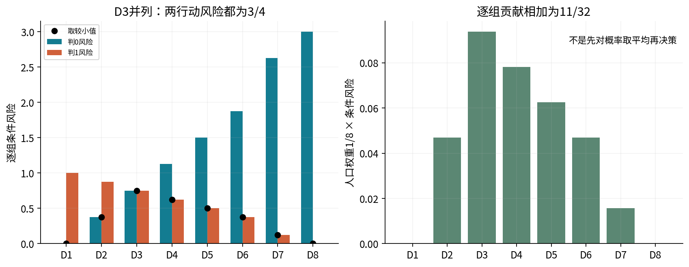
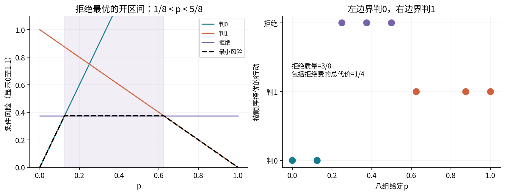

# 第045讲 独立实验指南

## 1 实验目标

把一组已给定的二分类概率转成可解释的行动，并核对期望代价、拒绝成本和先验变化。你不需要先训练模型。全部概率和代价来自固定合成机制，不能把它们当成真实预测系统已经校准的证据。

先完成八组纸笔风险账本，再运行代码，最后解释准确率与代价为什么排序相反。交付自己的手算、完整JSON、从新内核运行的Notebook和至少一个失败解释。十八题详解见answers.pdf。

## 2 环境与文件

在本单元目录，使用Python3.12独立环境：

```bash
conda env create -f environment.yml
conda activate ml045-decisions
jupyter lab
```

已有合适环境可直接安装数值与Notebook依赖：

```bash
python -m pip install -r requirements.txt
python experiment.py --out outputs/result.json
python audit.py --out outputs/audit.json
```

实际运行版本及范围见verification.json。已有PDF可直接阅读，数值实验不需要PDF构建依赖。若要重建可信Markdown，再按README中的WeasyPrint、MathJax与字体说明安装可选组件。

本讲主要文件是：data/posteriors.csv八组后验和总体权重；data/label_shift.csv三个条件组的类条件概率；data/decision_spec.json固定代价、阈值网格、先验和模拟种子。所有数据均原创，无外部下载或隐藏预处理。

## 3 先确定一行代表什么

posteriors.csv每一行是一个条件组，带有已知正类概率p和人口权重w，不是一条标签已经确定的观察。八组w均为1/8，总和1。正类概率为(0,1/8,1/4,3/8,1/2,5/8,7/8,1)。

label_shift.csv则按列表示P(X|Y=0)和P(X|Y=1)，每一列沿X各组求和为1。不能把其中一行的两个数直接当P(Y|X)。两个文件的概率方向不同，是本实验最容易混淆的地方。

代价矩阵按“行动为行，真类为列”存储。主矩阵[[0,3],[1,0]]意味着漏报3、误报1。请写出一个人为转置的错误版本，并预测它会将阈值从1/4移到哪里，再运行核验。答案为3/4。

## 4 完整展开一行 再扩展八行

对D4，p=3/8：判0的真实状态贡献是(0×5/8,3×3/8)，判1是(1×5/8,0×3/8)。风险分别9/8和5/8，选择1。其人口风险贡献是(1/8)(5/8)=5/64。

在Notebook导入之后调用：

```python
one = e.risk_table([[5/8, 3/8]], [[0, 3], [1, 0]])
print(one['rows'][0])
```

观察class_loss_contributions、conditional_risks、chosen_action、tied_actions与minimum_conditional_risk。然后对八组全部打印同样的完整记录。不要只看actions列表，因为列方向错了也可能在部分样本上巧合得到同一行动。



## 5 三个完整决策阶段

阶段一，用0-1损失决定行动，但随后用FP1、FN3评价实际代价。预期行动(0,0,0,0,0,1,1,1)，期望错误率7/32，指定代价17/32。

阶段二，保持概率不变，用FP1、FN3计算全部风险。预期行动(0,0,0,1,1,1,1,1)，期望错误率1/4，指定代价11/32。D3相等时按行动顺序取0。

阶段三，再增加拒绝行动，成本3/8。预期行动(0,0,2,2,2,1,1,1)，其中2表示拒绝，总体期望代价1/4、拒绝质量3/8。这三个阶段是改变决策后果后的重新计算，不是对概率模型做三轮梯度训练。

请把每阶段的全部风险、行动、人口加权贡献列成表，并核验和。每次都先用全部给定概率计算，再汇总；不要把八组概率先平均后只选一个统一行动。

## 6 验证阈值与拒绝边界

先推公式，再核验配置中的六组错误代价：(1,1)、(1,3)、(3,1)、(0,1)、(1,0)、(0,0)。最后一组threshold应为null，不允许计算0/0。

主拒绝区间是1/8<p<5/8，两端分别选0和1。将拒绝成本复制修改为3/4，预期不再有严格拒绝优势；把成本改为0，则内部非确定组可被免费拒绝，但确定组仍按首个零风险行动取0或1。

不要直接修改原配置。复制到outputs/custom-config.json后，用--config参数显式运行。比较新旧结果时写明改变的是哪个代价，未改变的概率不要被暗中重新归一化成另一套任务。



## 7 三类行动与概率排序

把两个三类分布(.5,.25,.25)、(.25,.25,.5)输入配置给定的3×3代价矩阵。预期风险分别(2,.75,1.25)与(3,.75,1)，两组都选行动1即乙。argmax概率类则为0、2。

用另一个2×3矩阵运行risk_table，确认行动数可以与类别数不同。每一行动仍对相同三个真实状态求期望，不能因为矩阵不是方阵就把维度调到“刚好可以乘”。

## 8 先验变化逐格核算

用source_prior=1/4和target_prior=3/4分别调用posterior_from_likelihoods。对每个组列出负类联合质量、正类联合质量、边缘概率和正类后验。

预期来源后验(1/13,1/4,4/7)，目标后验(3/7,3/4,12/13)。再把来源后验送入correct_prior，所得结果应与直接Bayes计算一致。p=0、1也能处理；源或目标先验为0、1时修正入口拒绝，因为不满足本接口条件。

在目标总体评价两套行动：沿用来源后验的行动(0,0,1)，期望代价37/32；目标后验行动(1,1,1)，期望代价1/4。评价权重必须使用目标边缘(7/32,3/8,13/32)。将来源权重混进来，会产生第三个不属于任何已定义总体的数字。

## 9 观察成本与随机波动

固定种子4505，每组256个标签，三政策共用同一组标签。检查正类计数(0,26,63,96,127,161,215,256)。代价规则的观察成本为.337890625，准确率规则为.5234375，拒绝规则为.2451171875。

用每组正类数k手算该组观察平均损失：$[(m-k)l_0+kl_1]/m$，再按w求和。核对simulation输出。真实sklearn混淆矩阵按“真类为行，预测为列”，所以要与课程代价矩阵的转置逐项相乘求和。

图中的误差线为±2倍已知机制的分层标准误，只表示波动尺度，不是对一切数据有效的精确95%区间。固定每组样本数与直接从总体随机抽2048行的抽样设计不同，不能直接替换方差公式。

## 10 实际失败和边界检查

把一个概率行改成(.2,.2)，应在随机生成前拒绝，不能自动按原相对大小变成(.5,.5)后继续。把配置最后一项改成错误并列规则，普通与python -O均应失败且保留已有输出。

传入NaN、无穷、布尔数、复数、错误代价列数、非法行动索引或重复CSV ID都应有明确异常。保护不依赖assert。把输出目标指向data/decision_spec.json或符号链接别名，程序拒绝覆盖。

主例支持精确二进分数并列；对任意靠近边界的十进小数，比较依据是浮点计算结果。请构造一个相邻浮点数跨越1/4阈值的例子，区分“数学上相等”“计算值相等”和“非常接近”。不要用一个任意容差掩盖真实的不同任务输入。

## 11 新进程与新内核复验

```bash
python experiment.py --out outputs/result.json
python -O experiment.py --out outputs/result-O.json
python audit.py --out outputs/audit.json
python -O audit.py --out outputs/audit-O.json
python plots.py --report outputs/result.json --directory outputs/figures
```

比较完整结果，不只比三项摘要。Notebook首物理格只用标准库核对输入、源码、依赖契约；之后才执行风险比较、模拟与绘图。重启内核再运行全部，确认九张真实PNG与没有error输出。

本制作环境使用新Python进程中的真实InProcessKernel执行，不声称检查过所有浏览器UI、外进程传输、Anaconda或Windows安装。不同平台的末位数值与字体排版可能变化，应按明确对象和容差判断。

## 12 实验报告

报告至少回答：已给定概率意味着什么；两种错误成本由何处规定；为什么阈值1/4；八组完整风险与总体成本；拒绝比例及费用；先验修正假设；一次观察相对精确期望的差异；一项不能外推的结论。

不要声称“找到了真实场景最佳模型”或“先验修正能处理任意漂移”。本讲完成的是一个可核算的决策机制实验。真实应用中的概率学习、验证选择、成本不确定性和资源限制仍需另行研究。
